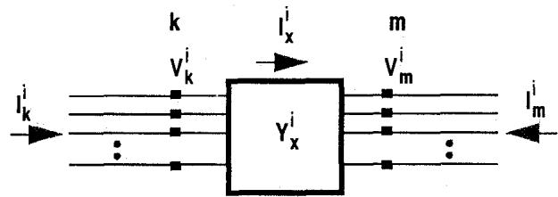
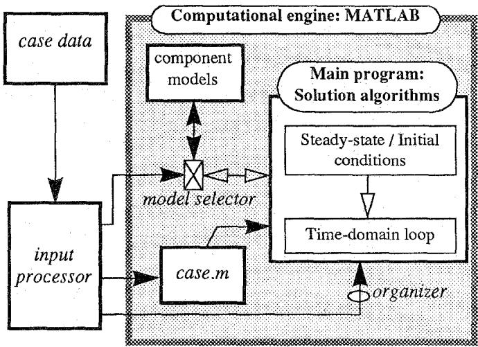
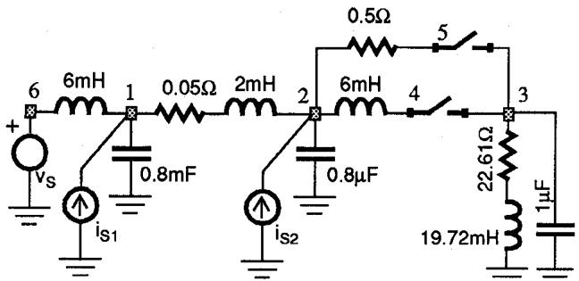
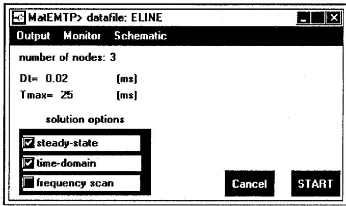
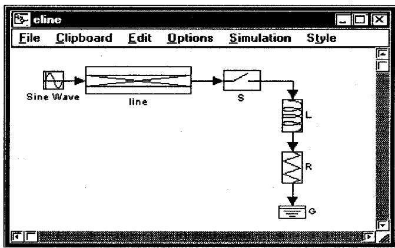
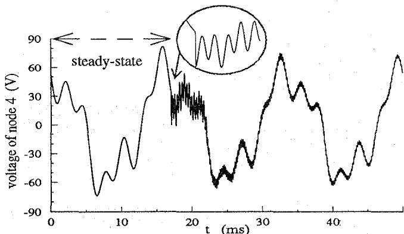
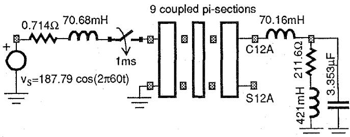
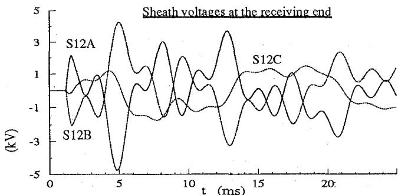
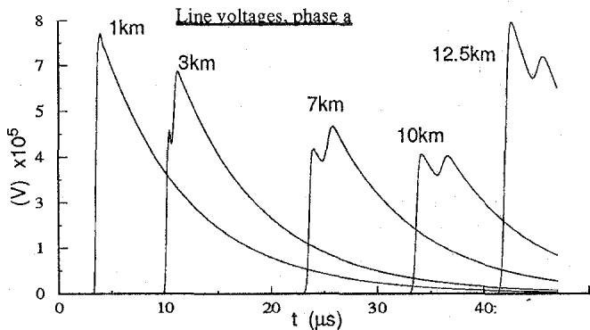

# Creating an Electromagnetic Transients Program in MATLAB: MatEMTP

Jean Mahseredjian (IEEE member)  
Institut de Recherche d'Hydro-Québec (IREQ)  
1800 Montée Ste-Julie  
Varennes, Québec, Canada J3X 1S1

ABSTRACT: The traditional method for developing electric network analysis computer programs is based on coding using a conventional computer language: FORTRAN, C or Pascal. The programming language of the EMTP (Electromagnetic Transients Program) is FORTRAN-77. Such a program has a closed architecture and uses a large number of code lines to satisfy requirements ranging from low level data manipulation to the actual solution mathematics which eventually become diluted and almost impossible to visualize. This paper proposes a new design idea suitable for EMTP re-development in a high level programming context. It presents the creation of the transient analysis numerical simulator MatEMTP in the computational engine frame of MATLAB. This new approach to software engineering can afford a dramatic coding simplification for sophisticated algorithmic structures.

Keywords: EMTP, MATLAB, time-domain network analysis, software engineering

# 1. INTRODUCTION

In a conventional electric network simulator design, everything is based on line-by-line coding. Every component is implemented this way, as is the network analysis algorithm and any minor details of the overall computation and data manipulation process. The actual network model equations and network matrix operations are diluted in a large number of cryptic code lines created by specialized and experienced developers. Moreover, old-fashioned and historically supported programming techniques inhibit modularity and are geared towards memory conservation. Models for any one component appear in more than one place in the code. This is the case of the EMTP [1] (Electromagnetic Transients Program) code. The low level design methodology of such a code explains its low renewal and enhancement rate. It is also pro

Fernando Alvarado (IEEE fellow member)  
University of Wisconsin-Madison  
Electrical & Computer Engineering  
1415 Johnson Drive, Madison, WI 53706, USA

hibitive to experiment with modern algorithmic ideas for eliminating solution limitations or for improving the computational speed on changing computer architectures.

Most network solution and modelling methods are simple to visualize and support mathematically, but their translation into an actual large scale working code is complex. Commonly used programming languages are ill-suited to human abilities for dealing with complexity. Software built using such languages is often inadequate. Some other new languages such as ADA, C++ and FORTRAN-90, provide powerful features for the formulation of appropriate abstractions [2] for the desired application. But programming is always easier if a specialized language is already available for the creation of similar applications. Specialized applications should use dedicated computational engines where the developer can build and compose with high level constructs. In addition to defining a new library of functions and overloading existing operators, such an engine must provide a minimal number of portable graphical data visualization and manipulation functions. It is obvious that programming a computational engine from scratch is a major effort.

This paper proposes to use a widely used general purpose program available on most popular computer platforms as a computational engine: MATLAB [3]. MATLAB has a large number of built-in functions and constructs covering a wide range of EMTP development needs and is expandable by means of optional toolboxes. The recent implementation of sparse matrix manipulation capabilities eliminates a major feasibility barrier.

This paper presents the creation of MatEMTP: a transient analysis program in MATLAB M-files. It is based on a new formulation of the main system of network equations, designed to eliminate several topological data restrictions and capable of handling arbitrary switch interconnections. The existing EMTP is used for validation and as a reference for solution timings.

# 2. SOLUTION METHOD

# 2.a Fundamental principles

The basic time-domain solution method implemented in MatEMTP is similar to the existing EMTP approach [4]. A large set of algebraic-differential equations is first transformed into a discrete algebraic equivalent and then solved over the requested interval $[0, t_{\max}]$ . The solution is available at discrete time-points $(0, t_1, t_2, \ldots, t_{\max})$ . The design

utilizes a fixed integration time-step $\Delta t$ as is the case for EMTP.

The high level matrix manipulation capabilities of MATLAB stimulate algorithmic ideas based on matrix computations. MatEMTP uses matrices and vectors for coding and solving network equations, closely replicating the underlying mathematics of network theory. The core code operates by defining a larger and more general matrix to represent network equations than is customary.

# 2.b Network equations: the core code

The network component interconnecting equations constitute the core code equations and must be defined before accordingly programming the individual component models. The following augmented sparse formulation is used:

$$
\left[ \begin{array}{l l l} \mathrm {Y} _ {\mathrm {n}} & \mathrm {V} _ {\mathrm {a}} ^ {\mathrm {t}} & \mathrm {S} _ {\mathrm {a}} ^ {\mathrm {t}} \\ \mathrm {V} _ {\mathrm {a}} & \mathrm {0} _ {\mathrm {V} _ {\mathrm {s}}} & \mathrm {0} _ {\mathrm {V} _ {\mathrm {s}} \mathrm {S}} \\ \mathrm {S} _ {\mathrm {a}} & \mathrm {0} _ {\mathrm {V} _ {\mathrm {s}} \mathrm {S}} ^ {\mathrm {t}} & \mathrm {S} _ {0} \end{array} \right] \left[ \begin{array}{l} \mathrm {V} _ {\mathrm {n}} \\ \mathrm {I} _ {\mathrm {V} _ {\mathrm {s}}} \\ \mathrm {I} _ {\mathrm {S}} \end{array} \right] = \left[ \begin{array}{l} \mathrm {I} _ {\mathrm {n}} \\ \mathrm {V} _ {\mathrm {s}} \\ 0 \end{array} \right] \tag {1}
$$

where $\mathbf{Y}_{\mathbf{n}}$ is the standard $n \times n$ nodal admittance matrix excluding switches, $\mathbf{V}_{\mathbf{a}}$ is the $nV_{s} \times n$ node incidence matrix of voltage sources, $\mathbf{S}_{\mathbf{a}}$ is the $nS \times n$ node incidence matrix of closed switches, $\mathbf{0}_{V_s}$ is an $nV_{s} \times nV_{s}$ null matrix, $\mathbf{0}_{V_sS}$ is an $nV_{s} \times n_{S}$ null matrix, $\mathbf{S_0}$ is an $nS \times nS$ sparse binary matrix used to nullify open switch currents, $\mathbf{V}_{\mathbf{n}}$ is the vector of unknown node voltages, $\mathbf{l}_{\mathbf{V}_{\mathbf{s}}}$ holds the unknown voltage source currents, $\mathbf{l}_{\mathbf{S}}$ holds unknown switch currents, $\mathbf{l}_{\mathbf{n}}$ holds known nodal current injections and $\mathbf{V}_{\mathbf{s}}$ stands for known source voltages.

This new formulation is less restrictive than the standard EMTP nodal analysis. It expands modified nodal analysis [5] by including explicitly the switch equations. Equation (1) is used in both steady-state and time-domain solutions. The node incidence switch matrix $\mathbf{S}_{\mathbf{a}}$ is modified to avoid the reformulation of $\mathbf{Y}_{\mathbf{n}}$ when the topology changes. MatEMTP can model voltage sources not connected to ground, floating switch nodes and branch to branch relations. All switch currents are automatically calculated and the explicit switch matrix $\mathbf{S}_{\mathbf{a}}$ usage simplifies the detection of illegal switch loops. A switch loop creates linearly dependent rows in the switch matrix $\mathbf{S}_{\mathbf{a}}$ . This dependency is deleted by removing redundant closed switches.

The steady-state solution is a frequency domain solution. Its objective is to initialize the time-domain solution when steady-state conditions exist before transient analysis. MatEMTP can handle a fundamental frequency and harmonic initialization [6].

# 2.c Component models

Network models consist of an interconnection of component models. Component models interact with the core code by inserting their frequency domain and time-domain equations into (1). Node incidence matrices are used for formulating the interconnection of component model equations.

For a passive component, the frequency domain requires a complex admittance matrix at each solution frequency. Active components insert their voltage or current phasors in the right hand side of (1).

The time-domain solution is based on the discretization of the component models. Although trapezoidal integration is the default discretization method, other integration methods such as Backward Euler are applied in individual model equations, as long as compliance with core code requests exists. In addition to handling discontinuities [7], Backward Euler integration is useful for startup from user-defined initial conditions.

Several components of the same type (same model) usually exist in a given network. Fig. 1 shows the $i$ th element of a multiphase coupled component model. The following equation can be written for this component type during the time-domain solution:

$$
I _ {x} = Y _ {x} V _ {k m} + I _ {x _ {h}} \tag {2}
$$

Bold characters denote matrices and vectors. Subscript h stands for history terms. Matrix $\mathbf{Y}_{\mathbf{x}}$ is a sparse block-diagonal admittance matrix containing individual matrices $\mathbf{Y}_{\mathbf{x}}^{\mathrm{i}}$ .

  
Figure 1: A coupled multiphase component model

If all component types possess their own sparse node-incidence matrix $\mathbf{M}_{\mathbf{a}}$ , equation (2) is inserted into (1) using the following formulas:

$$
\mathbf {Y} _ {\mathbf {n}} ^ {\text {a f t e r}} = \mathbf {Y} _ {\mathbf {n}} ^ {\text {b e f o r e}} + \mathbf {M} _ {\mathbf {a}} ^ {\mathrm {t}} \mathbf {Y} _ {\mathbf {x}} \mathbf {M} _ {\mathbf {a}} \tag {3}
$$

$$
\mathrm {I} _ {\mathrm {n}} ^ {\text {a f t e r}} = \mathrm {I} _ {\mathrm {n}} ^ {\text {b e f o r e}} - \mathrm {M} _ {\mathrm {a}} ^ {\mathrm {t}} \mathrm {I} _ {\mathrm {x} _ {\mathrm {h}}} \tag {4}
$$

# 3. THE MatEMTP CODE

# 3.a Main structure

The objective is to program MatEMTP using only MATLAB M-files [3]. These files include standard MATLAB statements and may also refer to other M-files. An M-file is an

ASCII script or function file. Since these files are run directly in the MATLAB environment and there is no requested compilation stage, MatEMTP inherits an open source code.

In inexperienced hands, the large number of available MATLAB building functions and constructs, can result in inefficient and cryptic code. Some experience is needed for programming with a minimal number of code lines and for minimal CPU time. The key to minimal CPU time is the vectorization of the solution algorithms. Other important rules to follow for increased efficiency are: avoid extreme modularity; use function files instead of script files; minimize the number of logical statements for model and option selections; minimize data initialization; avoid data storage pointers; preallocate vectors and matrices of predictable size. Except for memory preallocation, vectorization and the above outlined rules actually improve code readability and simplicity. Blind usage of dynamic memory allocation simplifies programming but places a heavy burden on the MATLAB interpreter.

By programming through matrix and vector operations the MatEMTP code is naturally vectorized. To eliminate useless testing, initialization procedures and repetitive dead code executions, the ready-to-run structure of Fig. 2 is proposed. This data adaptable structure relies on the input processor to interconnect the M-files. The input processor is a separate program (also written with M-files) that decodes standard EMTP data files [1] and creates the case.m file. This file is a processed file of network data created from the external case data format.

  
Figure 2: MatEMTP main structure

The model selector is a set of M-files created by the input processor for connecting required case.m models to the main program. All models are programmed in separate M-files that obey to a set of predefined core code requests. A typical request for a component model is "provide admittance matrix" or "update history". The creation of any new model is as simple as programming a new M-file which is automatically recognized and inserted into the appropriate code loca

tion by the model selector.

The organizer is another M-file created by the input processor that calls solution M-files according to selected options and overall solution needs. Thus, MatEMTP is based on a data dependent interconnection of individual code modules. Here is a valid sequence of files called in by the organizer for solving a typical case case.m:

1□ matemtp.m: program startup and request for data case   
2□ case.m: the actual case file, any name can be used   
3□ start.m: initial setups, initial conditions, initialization of the time-domain solution   
4□ timeloop.m: the time-domain loop for the simulation

The start.m script file initializes all network variables (including automatic frequency domain initialization for any subnetwork where active sources exist at $t < 0$ ).

Appendix A shows a section of code called from start.m for linear harmonic initialization. The listing for timeloop.m shown in Appendix B demonstrates the advantages of programming within the computational engine frame of MATLAB.

Since all component models appear hidden to the main MatEMTP code, the model selector can only communicate through 3 built-in generic function files: msource.m, mbranch.m and mswitch.m. A file mglobal.m is used to transfer data from the main code to model function files.

The simple test circuit of Fig. 3 demonstrates the above outlined functionality. The contents of automatically generated test2iwh.m (this is now case.m) are listed in Appendix C. The names of model M-files used in this circuit are available in an input processor library. The model selector consists of the following files created by the input processor:

mglobal.m: (called in from matemtp.m)

```matlab
gvsine; %sinusoidal voltage source data  
gisine; %sinusoidal current source data  
rlcglob; %RLC model data  
sw0glob; %ordinary switch model data 
```

msource.m:

```matlab
function msource(ido)  
vsine(ido); %sinusoidal voltage source  
isine(ido); %sinusoidal current source 
```

mbranch.m:

```matlab
function mbranch(ido)  
rlcmod(ido); %RLC model 
```

mswitch.m:

```txt
function mswitch(ido)  
sw0(ido); %ordinary switch model 
```

As an example of model data connection file, here are the contents of gvsine.m:

```txt
global Vadj Vsinein Vmag Vstart Vstop Vphi Vw; 
```

  
Figure 3: Test case test2iwh.m

# 3.b Programming the component models

Every component model is located in a separate M-file and responds to a standardized number of $ido$ values sent to it by the core code. As an example, an $ido = 2$ requests the insertion of the component model admittance matrix into $\mathbf{Y}_{\mathfrak{n}}$ .

To illustrate the simplicity of programming, here is a portion of code from rclmod.m:

if ido $= = 2$ %insert into Yn for steady-state Yn=Yn+RLCadj'*sparse(1:nRLC,1:nRLC,   
1./(RLCR+jz*(w*RLCL-RLCC/w)))*RLCadj; elseif ido $= = 5$ %insert into Yn in time-domain GRLC $\equiv$ sparse(1:nRLC,1:nRLC,   
1./(RLCR+(2/Dt).*RLCL+(Dt/2).*RLCC)); Yn=Yn+RLCadj\*GRLC\*RLCadj; elseif...

The programming of a transmission line model [4] usually requires the implementation of pointers for holding and updating history. MatEMTP avoids this complexity by using a single two dimensional sparse array for holding history and a sparse rotation vector for extracting and storing history terms at each time-point. This is best demonstrated by the following self explanatory code lines taken from the lossless single phase transmission line model (tlmod.m):

elseif ido == 6%insert into In in time-domain Tikh=(1-Tinter).*Tikhist(:,1)+

Tinter.\*Tikhist(:,2); %k side history $\mathrm{Timh} = (1 - \mathrm{Tinter})$ .\*Timhist(:,1)+

Tinter.*Timhist(:,2); %m side history
In=In+Tadjk'*Tikh; %contribute to In
In=In+Tadjm'*Timh;

elseifido $= = 7$ %update history Tikh $\equiv$ Tadjk\*Vn./TZc-Tikh; $\% \mathrm{ik} = \mathrm{vk} / \mathrm{Zc}$ -ikh Timh $\equiv$ Tadjm\*Vn./TZc-Timh; $\% \mathrm{im} = \mathrm{vm} / \mathrm{Zc}$ -imh Tikhx $\equiv$ Tadjm\*Vn./TZc+Timh; $\% \mathrm{ikh} = \mathrm{vm} / \mathrm{Zc}+$ im Tikhx $\equiv$ Tadjk\*Vn./TZc+Tikh; $\% \mathrm{imh} = \mathrm{vk} / \mathrm{Zc}+$ ik Tikhist $\equiv$ Tikhist\*Trotate+ spconvert([（1:nT）',TNhist,Tikhx]); $\%$ store Timhist $\equiv$ Timhist\*Trotate+

spconvert([(1:nT)', TNhist, Timhx]); %store elseif ...

The transmission line is connected between nodes $\mathbf{k}$ and $\mathfrak{m}$ . The following arrays and variables are calculated for $ido = 1$ in tlmod.m: nT is the total number of single phase lossless transmission lines, Tinter is an interpolation vector according to the propagation delay of each line, TNhist is a vector holding the number of history cells required for each line, Trotate is the sparse rotation matrix, Tadjk and Tadjm are sparse node incidence matrices found from the main node incidence matrix Tadj of this line model. Only minor modifications are needed to incorporate lumped resistances for losses [4].

Since equations (2) to (4) are applicable to any number of phases, programming of multiphase component models is based on matrix manipulations similar to single phase models.

# 3.c User interface

MATLAB provides high level functions that enable a portable programming of a graphical user interface (GUI) for MatEMTP. Fig. 4, for example, shows the GUI appearing during the initial program startup procedure. It is used to modify basic simulation data and options. The menu item Schematic opens the schematic capture GUI shown in Fig. 5.

  
Figure 4: The initial data capture GUI of MatEMTP

  
Figure 5: The schematic capture GUI of MatEMTP

The GUI of Fig. 5 can be used for creating and modifying

an arbitrary multiphase circuit diagram. Clicking on a given component opens the corresponding data capture panel. The programming of this GUI is based on the MATLAB-SIMULINK [8] toolbox. Any new component icon or subcircuits can be created through block masking [8]. Available network list generation functions allow the translation of a circuit diagram into the actual data case M-file. It must be remarked that the SIMULINK GUI was originally created for assembling control circuits and its usage for circuit diagrams suffers from visual limitations such as obligatory arrows and boxed blocks.

# 4. TEST CASES

# 4.a Case 1

The circuit diagram of this test case is shown in Fig. 3. The standard EMTP cannot handle steady-state initialization with different source frequencies in the same subnetwork, and according to test2iwh.m (see Appendix C) the harmonic current sources $i_{S1}$ and $i_{S2}$ are connected for $t < 0$ . Thus, EMTP starts with wrong initial conditions (both current sources disconnected in the 60Hz initialization) and enters almost perfect steady-state only after 8s of simulation time. MatEMTP solves this case directly through its initialization algorithm (Appendix A). Fig. 6 superimposes an EMTP waveform delayed by 7.95s to the MatEMTP waveform. Both solutions are undistinguishable.

  
Figure 6: MatEMTP and shifted EMTP solutions, Case 1

# 4.b Case 2

This test case is taken from an EMTP Workbook [9]. It simulates the energization of a three-phase 15 mile $230\mathrm{kV}$ cable. The circuit diagram for phase a is shown in Fig. 7. The cables are represented using 9 two-phase pi-sections. The sheath is grounded at the sending end and at each pi-section. A partial listing for $pi.m$ is given in Appendix D. The simulation results from EMTP and MatEMTP shown in Fig. 8 are perfectly identical.

  
Figure 7: Test case pi.m: energization of cable phase a.

  
Figure 8: MatEMTP and EMTP solutions, Case 2

  
Figure 9: MatEMTP and EMTP solutions, Case 3

# 4.c Case 3

The objective of this case is to validate and test the performance of MatEMTP distributed parameter line modelling where a sparse matrix based history maintenance method has been proposed. The line setup taken from [10] is used for corona modelling, each phase is subdivided into 500 sections and a total of 1503 nodes is created. Only phase a is energized with a surge voltage function [10]. Simulation results are shown in Fig. 9. Since MatEMTP does not yet possess a corona model, corona branches are disconnected in EMTP and a constant distributed parameter line model is used. Zooming on these waveforms will show a minor $\Delta t$ delay between EMTP and MatEMTP, related to the programming of the surge function in EMTP-TACS [1], MatEMTP is actually more precise.

# 5. DISCUSSION

The short length of Appendices A and B indicates that only a small number of code lines is needed to express solution procedures and elaborate sparse matrix manipulations through readily available MATLAB functions and constructs. This is a dramatic improvement over conventional coding for performing similar tasks. Data output and plotting are easily handled through available MATLAB functions.

The next step in this paper is to compare MatEMTP computational performance against EMTP. The eratio is defined as total MatEMTP elapsed execution time over EMTP execution time.

For Case 1 EMTP needs a much longer simulation time, and the found eratio of $\equiv 0.25$ is in favor of MatEMTP. This eratio is achieved only after modifying EMTP [11] to disable plot data storage before 7.95 seconds.

If the EMTP initialization time is excluded, the eratio becomes 2.5 for $\Delta t = 50\mu s$ and 10 for $\Delta t = 10\mu s$ . MatEMTP CPU time is an almost linear function of the total number of solution steps.

Case 2 has an eratio of $\cong 7$ . The case 3 eratio is $\cong 6$ . If the number of line sections is dropped to 500 (by deleting phases b and c) then eratio $\cong 5.7$ . This relative insensitivity to network dimensions is the result of both methodologies using sparse matrix techniques.

A detailed analysis of MatEMTP CPU usage in the timestep loop for the typical case of Fig. 3, shows the following disposition: less than $15\%$ for LU factorization and triangular solution, close to $60\%$ for updating the right hand side of equation (1) and the remaining is for individual model updates. Half of that $60\%$ is drained by the source function msource.m. A promising possibility is the replacement of such functions by compiled C language MEX-files [12], but this should be applied only at the last stage of programming. Another possibility is to resort to an automatic M-file compiler.

# CONCLUSIONS

This paper has demonstrated an implementation of a comprehensive electromagnetic transients analysis program using MATLAB as a computational engine.

Used algorithms provide results identical to those from the EMTP. However, the proposed environment is implemented in very few lines of code, is easily expandable, modifiable and highly portable. It also eliminates EMTP modelling limitations through a less restrictive formulation of main network equations.

Although in a few cases the new environment is faster, in general studies show that the conventional coding retains a speed advantage ranging from 2.5:1 in the best case to 10:1 in the worst case. Ideas for reducing this ratio have been proposed.

The ultimate contribution of this paper is a dramatic illustration of the possibilities afforded by this new approach to software development.

# APPENDIX A

# MatEMTP linear initialization module: steadylin.m

The following is a listing of steadylin.m:

```matlab
Wall=[];  
msource(5); %put all source ws in Wall  
Wall=sort(Wall);  
Vn_init=zeros(n,1); %preallocate n node voltages  
IVs=zeros(nVs,1); %preallocate IVs  
IS=zeros(nS,1); %preallocate IS  
nfreq=size(Wall,1); %the number of ws to do  
ifreq=1; wdone=[[];  
while iffreq <= nfreq  
w=Wall(ifreq);  
if w == wdone  
steady1; %(see code below)  
wdone=w;  
mbranch(3); %accumulate steady-state at t=0  
end  
ifreq=ifreq+1;  
end  
Vn=Vn_init; %solution at t=0 
```

# The following lines are from steady1.m:

```matlab
%steady-state module step for the frequency w
Yn=sparse(n,n); %Build Yn
mbranch(2); %contribution to Yn by branch models
Ytmp=[Yn Vadj'; Vadj sparse(nVs,nVs)];
Stmt=sparse(1:nS,1:nS,Sactive) *
[Sadj sparse(nS,nVs)]; %active switches
Sz =sparse(1:nS,1:nS,~Sactive);
Yaug=[Ytmp Stmp'; Stmp Sz];
%
In=zeros(n,1); %n is the number of nodes
msource(3); %put sources in Vs and In for w
Itmp=[In; Vs];
Iaug=[Itmp; zeros(nS,1)]; %account for switches
Vaug=Yaug\Iaug; %compute unknown phasors
Vn=Vaug(1:n); %nodal phasor voltages
Vn_init=real(Vn)+Vn_init; %at t=0 accumulate
IVs=real(Vaug(n+1:n+nVs))+IVs; %v source currents
IS=real(Vaug(n+nVs+1:n+nVs+nS))+IS; %switch currents 
```

# APPENDIX B

# MatEMTP time-domain solution module: timeloop.m

```matlab
Yn=sparse(n,n); %Initialize the conductance matrix  
mbranch(5); %Contributions to Yn  
Ytmp=[Yn Vadj'; Vadj sparse(nVs,nVs)];  
Saug=[Sadj sparse(nS,nVs)]; %account for switches  
reBuild=1;  
Vs=zeros(nVs,1); %eliminate alloc functions  
%  
for itime=1:tmax %start of main loop  
... printing and plotting functions ...  
t=t+Dt;  
In=zeros(n,1); %currents may add  
msource(4); %contribution to Vs and In 
```

```matlab
mbranch(6); %contribution to In from history  
Iaug=[In; Vs; zeros(nS,1)];  
%  
if (reBuild) %process switches and LU if rebuild  
Stmt=sparse(1:nS,1:nS,Sactive)*Saug;  
Sz=sparse(1:nS,1:nS,~Sactive);  
Yaug=[Ytmp Stmp'; Stmp Sz];  
[LL,UU]=lu(Yaug);  
end;  
tmp=LL\Iaug; Vaug=UU\tmp;  
Vn=Vaug(1:n); %extract nodal voltages  
IVs=Vaug(n+1:n+nVs); %voltage source currents  
IS=Vaug(n+nVs+1:n+nVs+nS); %switch currents  
%  
mbranch(7); %update history terms  
mswitch(7); %update switch status, signal reBuild  
end %of main loop 
```

# APPENDIX C

# MatEMTP data file for the test case of Fig. 3

The following is a listing of test2iwh.m, manual comments have been added for readability:

```matlab
Dt=10e-06; tmax=ceil(0.05/Dt); %this is 50ms  
storedata=0; %indicates hard disk store when 1  
steadystate=1; %request for steady state when 1 
```

```matlab
n=6; %number of nodes  
%  
BUS=['BUS1','BUS12','BUS13L','BUS13S','BUS1S','SRC']; %node names  
%  
%RLC model  
RLCadj=sparse(8,n);  
RLCadj(1,6)=1; RLCadj(1,1)=-1;  
RLCadj(2,1)=1; RLCadj(2,2)=-1; 
```

```matlab
RLCadj(8,3)=1;  
%  
RLCout=[5]; %current output for 5  
RLCR=[0;0.05;0;0;0;22.61;0.5;0];  
RLCL=[0.006;0.002;0;0;0.006;0.01972;0;0];  
RLCC=[0;0;8e-07;8e-07;0;0;0;1e-06];  
%  
%Sine current source model  
Isineadj=sparse(2,n);  
Isineadj(1,2)=1; Isineadj(2,1)=1;  
Imagn=[2.001;1.1]; Iphi=[10.0;5.0];  
Istart=[-1.0;-1.0]; Istop=[Inf;Inf];  
Iw=2*pi*[180.0;360.0];  
%  
%Ordinary switch model  
Sadj=sparse(2,n);  
Sadj(1,3)=-1; Sadj(1,4)=1;  
Sadj(2,3)=-1; Sadj(2,5)=1;  
Sclose=[17.E-3;22.E-3];  
Seps=[0;0]; Sopen=[Inf;Inf];  
%  
%  
%Sine voltage source model  
Vadj=sparse(1,n);  
Vadj(1,6)=1;  
Vsinein=[1]; Vmag=[56.34]; Vphi=[0.0];  
Vstart=[-1.0]; Vstop=[Inf]; Vw=2*pi*[60.0];
```

```txt
%  
Vnout=[2; 3; 4]; %output request of node voltages 
```

# APPENDIX D

# Partial listing for the test case: pi.m

```matlab
PI section model  
PIadj=sparse(54,n); %node incidence matrix  
PIadj(1,3)=1; PIadj(1,4)=-1; %first pi-section  
PIadj(2,5)=-1;  
PIR=sparse(54,54); %resistance matrix  
PIL=sparse(54,54); %inductance matrix  
PIC=sparse(54,54); %capacitance matrix  
%  
for k=1:2:54  
PIR(k:k+1,k:k+1)=[.25387 .10212; .10212 .69831];  
PIL(k:k+1,k:k+1)=[.56461 .13758; .13758 .13139]*1e-03;  
PIC(k:k+1,k:k+1)=[.7268 -.7268 -.7268 3.4012]*1e-06;  
end 
```

# REFERENCES

[1] Electric Power Research Institute, EMTP Development Coordination Group, EPRI EL-6412-L: Electromagnetic Transients Program Rule Book, Version 2   
[2] G. Bray and D. Pokrass: Understanding Ada, A Software Engineering Approach. John Wiley & Sons, 1985   
[3] MATLAB, High-Performance Numeric Computation and Visualization Software. The MathWorks, Inc. MATLAB User's guide, August 1992   
[4] H. W. Dommel: Electromagnetic Transients Program reference manual (EMTP Theory Book). Bonneville Power Administration, August 1986.   
[5] C. W. Ho, A. E. Ruehli and P. A. Brennan: The modified nodal approach to network analysis. Proc. 1974 International symposium on circuits and systems, San Francisco, pp. 505-509, April 1974   
[6] X. Lombard, J. Mahseredjian, S. Lefebvre and C. Kieny: Implementation of a new harmonic initialization method in the EMTP. IEEE Trans. on Power Systems, Summer Meeting 94, paper 94 SM 438-2 PWRD   
[7] B. Kullicke: Simulation program Netomac, Difference conductance method for continuous and discontinuous systems. Siemens Research and Development Reports, Vol. 10, pp. 299-302, 1981, no. 5   
[8] SIMULINK, Dynamic System Simulation Software. The MathWorks, Inc. (April 1993)   
[9] F. Alvarado: EMTP Workbook II. University of Wisconsin at Madison. EL4651, Volume 2, June 1989   
[10]C. Gary, A. Timotin, D. Critescu: Prediction of surge

propagation influenced by corona and skin effect. Proc. IEE, 130-A, pp. 264-272, July 1983.   
[11]J. Mahseredjian: The EMTP SUN and CRAY UNIX versions. Rapport IREQ-93-065, March 1993, Hydro-Québec   
[12]MATLAB, High-Performance Numeric Computation and Visualization Software. The MathWorks, Inc. External Interface guide, January 1993

# BIOGRAPHIES

Jean Mahseredjian (M) received the B.Sc.A., M.Sc.A. and Ph.D. in Electrical Engineering from Ecole Polytechnique de Montréal (Canada) in 1982, 1985 and 1990 respectively. At present he is a researcher at Institut de Recherche d'Hydro-Québec and an associate-professor at Ecole Polytechnique de Montréal.

Fernando L. Alvarado (F) was born in Lima, Peru in 1945. He received the BEE and PE degrees from the National University of Engineering in Lima, Peru, the MS degree from Clarkson College (now Clarkson University) in Potsdam, New York, and the Ph. D. degree from the University of Michigan in 1972. Since 1975 he has been with the University of Wisconsin in Madison, where he is currently a Professor of Electrical and Computer Engineering.

# Discussion

V. Rajagopalan, Z. Yao, and E. Lecourtois (Chaire de recherche industrielle Hydro-Québec-CRSNG, Université du Québec, Trois-Rivières, Québec, G9A 5H7, Canada):

The authors describe an interesting link between MATLAB and the EMTP programs to create an interactive MatEMTP program. Our experience with both the EMTP and Matlab-SIMULINK software programs indicates that the user-friendly graphical interface SIMULINK provides a much better environment for the linking of EMTP. We have developed an extensive library of models in SIMULINK environment called SIMUPELS [1] for the power electronic converters, transformers, and electrical machines; models for distribution lines and other system components are available in SIMUBEEP [2]; SIMUBEEP is used for the study of propagation of disturbances in distribution systems. During simulation in SIMULINK, it is possible to write the results on files and read results from files. In this way, a complex model such as a converter-fed electrical machine can be studied in SIMULINK using three phase circuits with its complete topology and the required results can be written on files particularly for the current drawn from distribution lines. These results might be converted in to ASCII files and the results can then be used, if necessary, with the EMTP simulator with the complex loads modeled as current sources. Will the authors comment on their experience with SIMULINK simulator?

# References:

[1] M. Gheorghe, D.O. Neacsu, A.Pittet, Z. Yao and V. Rajagopalan, "SIMUPELS: Simulation of Power Electronic Systems in the MATLAB-SIMULINK Environment", Research Report 4E/95, CCEE, Universite du Quebec à Trois-Rivières, Quebec, G9A 5H7, Canada, Nov. 1995.  
[2] E. Lecourtois, D. Neacsu, Z. Yao and V. Rajagopalan, "SIMUBEEP: Simulation of A Test Bench for the Study of Propagation of Disturbances in Electrical Distribution Systems", Research Report 7F/95, CCEE, Universite du Quebec à Trois-Rivières, Quebec, G9A 5H7, Canada, Jan.1996.

Manuscript received February 8, 1996.

J. Mahseredjian and F. Alvarado: We thank the discussers for their interest in our work.

We must first indicate that this paper did not present a link between MATLAB and EMTP, it rather describes a standalone program named MatEMTP that can perform EMTP types simulations entirely in MATLAB. MatEMTP is written through MATLAB M-files and its only links with the standard EMTP (DCG-EPRI version) are its ability to decode the EMTP data file syntax by means of a translation module (also implemented in MATLAB), and the fact that functionally

identical (but fully vectorized) solution techniques are used by MatEMTP.

We agree with the discussers that the SIMULINK building blocks can be successfully applied to the simulation of electrical circuits through the state variable approach. However such an approach is inherently slower than the sparse modified nodal analysis method proposed in this paper (see equation (1)). Our experience indicates that the current version (1.3c) of SIMULINK becomes significantly slow when more than 50 state variables are involved. This is not the case of MatEMTP which has been shown to maintain its performance for very large cases. There are also other shortcomings for representing the network portion of a simulation in a state-variable environment, such as the exact representation and initialization of nonlinear functions, the recalculation of topological trees for ideal switch modelling, the solution of transmission line functions and time-step delays for some feedback loops. The state-variable representation is far less intuitive and depleted from the physical realities of electric circuits.

It is our opinion that the powerful graphical user interface of SIMULINK should be connected to MatEMTP for schematic capture and control system simulation. Interfacing control system simulation in SIMULINK with the MatEMTP network equations is similar to the interconnection of EMTP-TACS (Transient Analysis of Control Systems) module with the EMTP network solution module. Also, whenever state-variable modelling is more advantageous it can be created in SIMULINK and called in by MatEMTP acting as the main circuit simulation engine. It has been shown in this paper that in addition to control circuit diagrams SIMULINK can be used for drawing electric circuit diagrams. A background process can convert such diagrams into nodal analysis equations. It must be pointed out however, that the lack of the notion of an electric node in SIMULINK (1.3c) severely limits the clarity of electric circuit diagrams and remains more appropriate for the original task of interconnecting control system blocks.

Manuscript received April 2, 1996.