# Analysis of low frequency interactions of DFIG wind turbine systems in series compensated grids

Aramis S. Trevisana,b,⁎ , Martin Fecteauc , Ângelo Mendonçab , Richard Gagnond , Jean Mahseredjiana

a Polytechnique Montreal, Montréal (Québec), Canada   
b Wobben Research and Development GmbH (ENERCON R&D), Aurich, Germany   
c Hydro-Québec, Montréal (Québec), Canada   
d Hydro-Québec Research Institute (IREQ), Varennes (Québec), Canada

# A B S T R A C T

Recent field events and subsequent studies have indicated that doubly-fed induction generator (DFIG) based wind farms might be susceptible to adverse interactions with series compensated systems. This paper focuses on the analysis of the interaction phenomenon. A new benchmark network is proposed to address the investigation of low frequency oscillations between wind generation and series compensated systems based on realistic system parameters. Nonlinear components and detailed representation of wind turbines are taken into account. An analytical model for a generic DFIG based wind farm is developed considering all inner and outer loops as well as its mechanical parts. Participation factor analysis is applied to the model to identify states most contributing to the critical modes and to address suitable mitigation. Sensitivity analysis is used to support redesign of control parameters. Investigations indicate that resonance can be avoided with proper control tuning. Finally, the capabilities of a screening technique for SSR risk assessment suitable for early project stages are also investigated and its results compared to the modal analysis. All conclusions are verified with detailed electromagnetic transient (EMT) simulations.

# 1. Introduction

In the last years power systems have experiencing fast and drastic changes. Modern energy market structures are pushing power systems to be operated in an economical optimal sense, in a constant attempt of maximizing the use of system's assets. Moreover, rights of way for new transmission lines as a system expansion and strengthening measure are increasingly difficult to obtain. As a consequence, there is an increasing interest for solutions capable of improving system use as well as techniques to support system stability assessment under these expected stressed conditions.

Fixed series compensation has been one of the approaches successfully applied to increase system stability margins through improving active power transfer capabilities of transmission lines. On the other hand, series compensation has also been involved in severe interaction events. In the 70’s, a turbine-generator of the Mohave power plant, in the US, interacted with the capacitances of a series compensated transmission line resulting in serious material damages [1]. In 2009, an incident involving wind turbines in Texas, US, called attention for similar interaction risks involving connection of wind generation in series compensated systems [2,3]. More recently, similar events have also been reported in China for different types of wind turbines [4,5].

These recent events involving modern wind turbines yielded the

need for a substantial revision of existing assessment methods involving low frequency interactions, which are often categorized as sub-synchronous resonance (SSR), subsynchronous torsional interaction (SSTI) or, more generally, subsynchronous oscillations (SSO). This is mostly due to the complexity added by power electronics and their controls. Moreover, recent dedicated analysis of the phenomena ([2-8]) identified a new category of interaction referring to it as sub-synchronous control interaction (SSCI). Since then, considerable efforts have been made to improve the assessment and provide mitigation for SSO involving doubly-fed induction generator (DFIG) wind turbines [7-12]. Similar work was also conducted for type-IV wind turbines, however recent publications indicated that these are less prone to interact with series compensation [13-15].

The development of an analytical state-space representation has been pointed out for a long period as a powerful technique for power system analysis and dynamic stability studies [16]. However, its requirement on formal development of full-order state-space representation in conjunction with the complex structures and inverter-based devices of modern power systems easily become resource-intensive [17- 19]. Due to this fact, several analytical investigations involving inverter-based units with complex structures (such as DFIG systems) and series compensation make use of certain simplifications and/or neglect some control loops and mechanical system representations

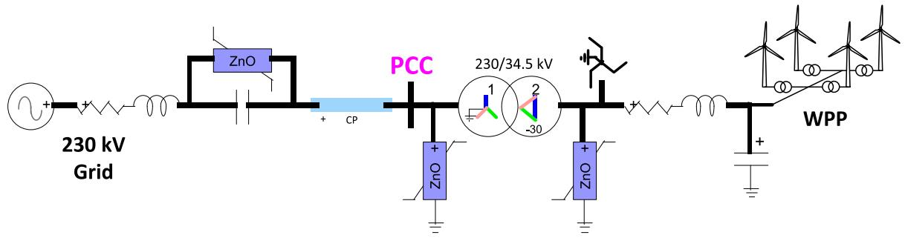  
Fig. 1. Benchmark for studies involving WPPs and series compensated grids.

# [18,20,21,22].

Alternative methods try to detect unstable operating conditions by extracting frequency dependent characteristics for converter and grid without the need for analytical development [7,8,23-25]. These methods, however, do not provide insight into system states, modes and their damping characteristics, which are usually required to support mitigation studies and redesign of controllers to reduce interaction risks. Additionally, the predictions of such methods have not yet been compared to those resulting from modal analysis performed on detailed and realistic system representations.

This paper contributes to fill this gap by providing a comparison of modal analysis results conducted for a case involving a DFIG based wind farm connected to a series compensated grid to those obtained by means of one of such screening techniques, namely, the combined scan technique [10].

A new benchmark system is proposed for interactions studies involving wind farms in series compensated grids. It considers realistic and detailed representation of grid equipment. For instance, nonlinearities of varistors, surge-arresters and saturation of transformers are taken into account. Also, a collector system model is proposed for the aggregate representation of the wind farm.

A complete linearized state-space representation is developed for this system, considering a DFIG based wind farm. It is emphasized that all electrical, mechanical and control components of a typical DFIG system are taken into account. The methodology used for obtaining the analytical model representation is outlined.

The linearized state-space representation of the complete system is validated against its corresponding detailed electro-magnetic transient (EMT) model in EMTP [26]. Insights into the validation procedure are provided based on comparisons made for states of both grid and DFIG systems.

Modal analysis is applied to investigate low frequency interactions verified through detailed EMT simulations. Eigenvalue analysis is used to assess system stability and participation factor analysis is conducted to identify system states most contributing to the critical modes. Also, sensitivity analysis is applied to propose controller-based mitigation and reduce interaction risks.

Finally, the stability of the same scenarios is assessed by means of the aforementioned combined scan technique [10]. Differently than the modal analysis, this technique does not rely on rigorous analytical developments for the grid and wind farm. It is, thus, capable of addressing practical cases in which, mostly due to intellectual property issues ([27]), protected models (i.e., black-boxes) of equipment are used. Its results are then compared to those obtained through modal analysis.

This paper is structured as follows. Section II introduces a new benchmark for interaction studies between wind farms and series compensated grids. Section III describes the generic DFIG system used in these investigations. Section IV outlines the methodology used for the development of a linearized state-space representation for the complete system. This system is validated in Section V against its EMT detailed representation. Section VI deals with the investigation of the SSR issue through a detailed modals analysis. Section VII builds up on

screening techniques based on black-box models and compare its performance to the modal analysis. Conclusions are drawn in Section VIII.

# 2. Benchmark for Interaction Studies Between Wind Turbines and Series Compensated Grid

Due to the radial electrical system structure present in the Mohave [1] and in the Texas events ([2,3]), radial system structures are believed to be the most critical for SSR and SSCI phenomena. This has been again verified in the investigations presented in [28].

The proposed system is based on a wind integration project that Hydro-Québec had a few years ago, which was never realized for technical and economic reasons. It contains, therefore, realistic considerations for components and parameters. It consists of a wind power plant (WPP) connected to an equivalent grid equivalent through a series compensated transmission line. The original system consisted of three different WPPs, however just the closest WPP to the series capacitor is considered here, to reduce complexity. The transmission line is modelled as a distributed parameter line model. A typical WPP collector system, based on the findings and data from [29], is considered. A grounding transformer is also included in the WPP collector system. Fig. 1 illustrates the test system used and Table 1 provides the system parameters.

Nonlinearities from the varistor connected across the series capacitors, surge arresters and transformer saturation are considered. Surge arresters are used to limit transient over-voltages following grid events. Varistors are used to protect the series capacitor during transients limiting voltage across terminals between 2.1 and 2.6 pu depending on design. For the test system, the protection level has been set at 2.3pu. It is noted that, due to their action, varistors are capable of limiting voltages trapped on the line side of the series compensation following a grid event, which, in certain cases, could lead to transformer saturations and ferroresonances. In reality, varistors and surge arresters are usually composed of several ZnO (zinc oxide) discs. For the EMT modeling, just one is considered based on fitting. Their data is provided in Table 2.

# Table 1

# Electrical Parameters of the Benchmark Grid

Test system parameters

Grid equivalent : 230kV, 2 + j25 Ω, 60 Hz

Series compensation : 30 Ω, 1 kA, 2.3pu protection level

Line data : R1=5.96Ω, X1=50.9Ω, B1=324μS, R0=2.74 Ω, X0=120.75 Ω,

B0=220.14μS, length=100km, continuously transposed

Main transformer data : 230/34.5kV, 115MVA, 11.5%, X/R=45

Grounding transformer: R0 = 0.28Ω, X0 = 7.5Ω

Collector system data : R1=0.22Ω, X1=0.147Ω, C1=7.17μF

Turbine (lumped) transformer: 34.5/0.575kV, 115MVA, 5.7%, X/R=15.2

Transformers saturation characteristic [current mag. (pu), Flux(pu)]: [0.002;1], [0.01;1.075], [0.025;1.15], [0.05;1.2], [0.1;1.23], [2;1.72]

Table 2 Varistor and arrester's characteristics   

<table><tr><td colspan="2">Series Compensation</td><td colspan="2">230kV Substation</td><td colspan="2">34.5kV Substation</td></tr><tr><td>I(A)</td><td>V(kV)</td><td>I(A)</td><td>V(kV)</td><td>I(A)</td><td>V(kV)</td></tr><tr><td>0.045</td><td>76.9</td><td>0.03</td><td>280.8</td><td>0.004</td><td>38.4</td></tr><tr><td>15</td><td>81.5</td><td>4</td><td>321.4</td><td>5</td><td>46.9</td></tr><tr><td>150</td><td>86</td><td>300</td><td>363.2</td><td>200</td><td>52.0</td></tr><tr><td>2250</td><td>93.6</td><td>2000</td><td>396.6</td><td>2000</td><td>57.2</td></tr><tr><td>15000</td><td>101.5</td><td></td><td></td><td></td><td></td></tr></table>

# 3. DFIG Based Wind Power Plant

The analytical investigations conducted in the framework of this paper are focusing on possible low frequency interactions involving a DFIG (also known as type-III wind turbine system) based WPP.

In a DFIG system, an induction generator (IG), also in this special application referred to as asynchronous generator, is used to convert mechanical energy from the wind turbine into electrical energy, which is then injected into the grid. The stator of the IG is directly connected to the grid. Moreover, the IG is a wound rotor structure and the rotor is connected to the grid via an ac-dc-ac voltage source converter (VSC) with reduced rating (typically of around one third of the IG rated power). A typical DFIG structure is illustrated in the next Fig. 2.

The voltage source converter (VSC) of a DFIG is divided into a Rotor-Side Converter (RSC) and a Grid-Side Converter (GSC). The RSC is responsible for controlling the generator speed and the reactive power flow through the turbine terminals. The main function of the GSC is to regulate the dc-bus voltage to a constant value.

The DFIG system used is the same presented in [30] and used in [31]. Its details are similar to the system extensively described in [24]. For the representation of a wind farm in the next investigations, a lumped model consisting of 66 DFIGs (each of 1.7 MW) is assumed.

# 4. State-Space Representation of Complete System

The complete system is composed of several linear and nonlinear components on the grid as well on the wind farm side. Its dynamic representation can be generically given as

$$
\left\{ \begin{array}{l} \dot {x} _ {i} = f _ {i} \left(x _ {i}, u _ {i}\right) \\ y _ {i} = g _ {i} \left(x _ {i}, u _ {i}\right) \end{array} \right. \tag {1}
$$

where $x _ { \mathrm { i } } , u _ { \mathrm { i } } , y _ { \mathrm { i } }$ denote the states vector, inputs and outputs for the i-th component, respectively.

To conduct the investigations outlined in the next sections, a linearized state-space representation in the form of (2) is required for the complete system. Linear analysis has been preferred due to the existence of a broader range of available techniques whose results are easier to grasp if compared to nonlinear ones. Identification of root causes for oscillations is much simplified when based on the application of classic control techniques to linear models.

Since the linearization of a nonlinear system presupposes a steadystate condition for all system states, an abc-to-dq transformation is

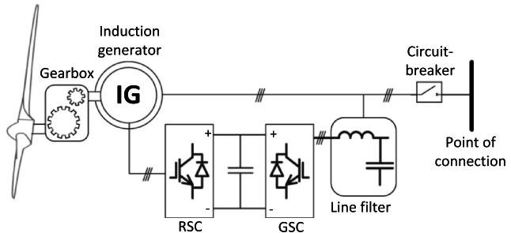  
Fig. 2. Generic type-III (DFIG) Wind Turbine System.

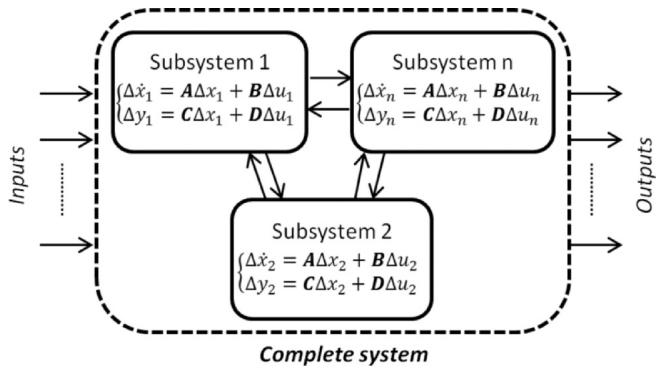  
Fig. 3. Overview of complete system and its subsystems.

required to allow for the consideration of only constant quantities.

$$
\left\{ \begin{array}{l} \Delta \dot {x} = A \Delta x + B \Delta u \\ \Delta y = C \Delta x + D \Delta u \end{array} \right. \tag {2}
$$

There are several methods for obtaining a complete system representation based on the connection of several dynamic systems as given by (2), as for example the methodologies described in [32] and [34]. In this paper, a Matlab based solution has been preferred. More specifically, the connect function is used to allow for the development and connection of separate state-space systems [35]. By developing separately state-space representations for portions of the complete system and well-defining the names of input and output variables for each system (connection points), it is possible to combine several statespace systems of different sizes to obtain a final multiple-input multipleoutput (MIMO) state-space representation. The biggest advantage of this method is the possibility of freely defining boundaries in the system to be modelled. Fig. 3 provides a schematic overview of the subsystems connection. This becomes particularly useful in cases where separate control blocks are used or internal measurements for specific control parts are available. Therefore, it provides the ability to develop, linearize and validate each state-space system representation for a specific system part separately.

Based on the aforementioned approach, separate linearized statespace representations are developed and validated for each single electrical, mechanical and control block. All nonlinear systems are considered, however since a normal steady-state condition is assumed for the linearization, some nonlinear functions (such as the transformers’ saturation characteristic) do not appear in the linearized equations. The only simplification made on the grid side concerns the representation of the transmission line, for which a pi-representation for the rated frequency is assumed.

On the WPP side, all inner and outer control loops of the DFIG system as well as mechanical components were considered. Average representations were used for the power electronic stages. However, it should be emphasized that these assumptions are not expected to have impacts in the low frequency region being addressed in this work [33].

The resulting systems form a library of components that can consequently be connected to each other to obtain a complete linearized state-space representation for grid and wind farm. Moreover, the importance of defining well all existing reference frames and their relation when working with the dq-transformation should be also emphasized. Inverter-based systems (in the current work, the DFIG) make use of an internal reference frame, defined by their synchronizing unit. Most inverters rely on a phase-locked loop (PLL) to track the voltage phase at their terminals. To take these dynamics into consideration, the statespace systems are developed for each controller in their own dq-reference frame (e.g. PLL-based). They are later translated to a common reference frame, to which all equations are referred to, as described in [34].

After linearizing, developing and validating a state-space

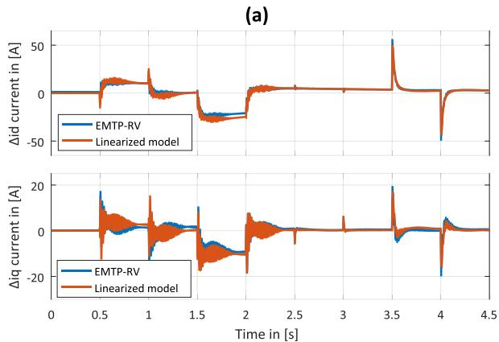

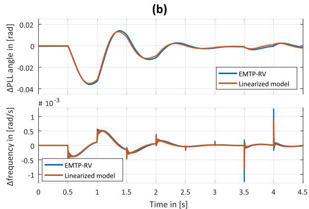  
Fig. 4. Comparisons: (a) Δid and Δiq currents and; (b) PLL measured angle and frequency.

representation, as given in (2), for all single components, these were finally connected to each other following the outlined approach, and a MIMO state-space representation in numerical form with a total of 82 states was obtained. The next section deals then with the validation of this complete system representation, which is compared to its detailed nonlinear representation simulated in EMTP.

# 5. Validation of Linearized System Representation

A series of small perturbations are applied to the linearized system inputs to validate its response against its de-tailed nonlinear representation. Due to space constraints, the validation plots for each of the states and outputs of the system are not shown in this paper. Diagrams illustrated Fig. 4 to Fig. 5 have been selected to provide an insight into the validation procedure. They demonstrate how the linearized currents through the transmission line, the PLL states as well as the dc-bus voltage compare against their detailed nonlinear representation simulated in EMTP. Perturbations were applied sequentially as ideal steps, up and down, of same amplitude, separated by 0.5 s. First, the d and q components of the grid source are stepwise changed by 0.025pu. Then, stepwise perturbations of 5 V and 0.1 pu are applied to the reference values of the dc-link voltage and the GSC q-axis current, respectively.

It should be emphasized that a perfect match between the linear model and its detailed representation in EMTP was not expected, since the latter has all nonlinear dynamics included, whereas these are linearized in the former. Nevertheless, Fig. 4 to Fig. 5 confirm that the original discrete nonlinear system can still be sufficiently well approximated by a continuous linear representation for small perturbations around a stable operating point, which corresponds to its validity region.

# 6. Interaction Analysis Between DFIG and Grid

This section provides an in-depth investigation based on the linearized state-space representation for the complete system consisting of the proposed benchmark grid and the type-III based WPP (Fig. 1),

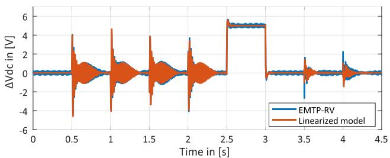  
Fig. 5. Comparison for ΔVdc.

which have been introduced in Section 2 and 3 and validated in Section 5. Initial simulations with the detailed nonlinear model in EMTP indicated no adverse interaction for a line series compensation level below 10%. This will be now investigated in the next subsections.

# 6.1. Impact of Series Compensation

To investigate the impact of varying the series compensation level, a modal analysis is applied. For this, a linearized state-space representation for the complete system is used and the eigenvalue traces are plotted for small increments in the series compensation level: starting at 1% and varying until 15% in steps of 1%. Fig. 6 shows the eigenvalue traces for some low frequency modes and indicates that a complex conjugate pair of modes is strongly affected by the compensation level. The analysis indicates that these modes cross to the righthalf plane (RHP) when the compensation level is equal or higher than approximately 10%, confirming the expectations obtained by the detailed nonlinear model.

To validate these results, the corresponding detailed EMTP model (presented in Fig. 1) is used. A three-phase high impedance fault (1.35k Ω) at the point of common coupling (PCC), which is assumed at the 230kV side of the substation transformer, is applied at time t=1s for 100ms. It results in a voltage drop of around 5%, which can be understood as a small perturbation for the given operating point. Different line series compensation levels were simulated. The system responses are shown in Fig. 7 for the instantaneous active power measured at the WPP terminals and the dc-link voltage of the DFIG system. Since the system is stable for any line series compensation level below 9% and unstable for any level above 10%, only three cases were selected to increase figure readability.

Note that the results illustrated in Fig. 7 are in accordance with the eigenvalue traces shown in Fig. 6. The damping of the critical modes is

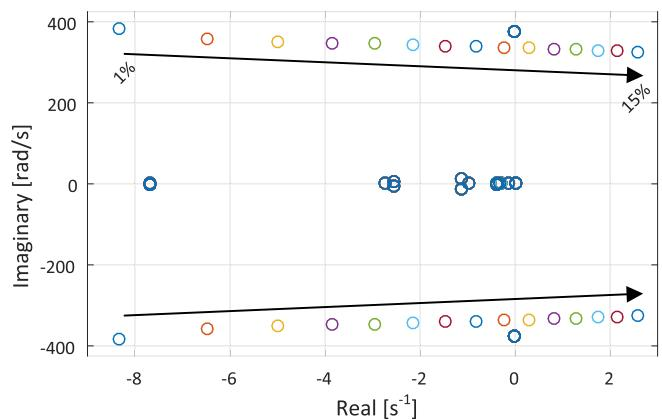  
Fig. 6. Eigenvalue traces for varying series capacitance.

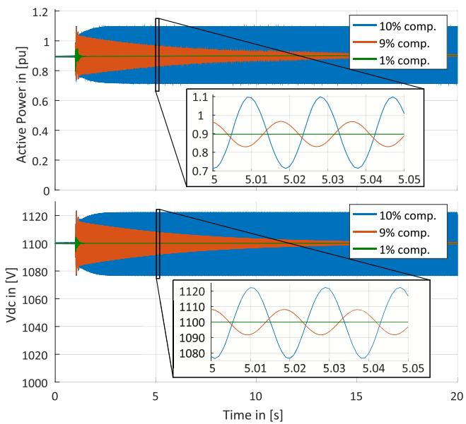  
Fig. 7. Active power and Vdc responses for different line compensation levels.

decreased when the line compensation level is increased, until the limit of around 10% compensation achieved, above which unstable operation is indicated. Also, a frequency of 52 Hz can be extracted from the waveforms of the detailed EMTP analysis, which, again, is in accordance with the results presented in Fig. 6.

Moreover, to obtain a better understanding of the interaction phenomenon, participation factor analysis is conducted for the linearized state-space representation of the complete system. Participation factors provide a measure of the contribution that a k-th state has to a specific ith mode of the system [36] and are defined as:

$$
p _ {k i} = u _ {i k} w _ {k i} \tag {3}
$$

where uik and wki are the k-th elements of the i-th left and right eigenvectors, respectively.

Table 3 summarizes the participation factors of the system states in the critical mode in descending order of magnitude. The line compensation level was assumed at 10% for this analysis (unstable). For convenience, the participation factors were normalized so that their sum adds to the unit.

The participation factors provided in Table 3 allow the verification that states most participating at the oscillatory behavior of the critical mode concern mostly only the IG and the series compensation. More specifically, as seen in Table 3, more than 90% of the oscillatory behavior is attributed to the IG stator and rotor currents as well as the series capacitor voltages. Moreover, it is emphasized that, although a complete system representation of the grid and the WPP has been considered in the analysis, no states associated with the mechanical and control systems appear listed in Table 3 among the states most participating at the oscillation. In fact, mechanical and control associated states appear grouped with all other remaining system states, which

Table 3 Participation Factors of System States in Critical Mode   

<table><tr><td>State</td><td>| p |</td></tr><tr><td>Is_d (d-axis stator current of IG)</td><td>0.2383</td></tr><tr><td>Is_q (q-axis stator current of IG)</td><td>0.2014</td></tr><tr><td>Ir_d (d-axis rotor current of IG)</td><td>0.2087</td></tr><tr><td>Ir_q (q-axis rotor current of IG)</td><td>0.1766</td></tr><tr><td>VCs_d (d-axis voltage of series cap.)</td><td>0.0623</td></tr><tr><td>VCs_q (q-axis voltage of series cap.)</td><td>0.0604</td></tr><tr><td>Iline_d (d-axis transmission line current)</td><td>0.0057</td></tr><tr><td>Iline_q (q-axis transmission line current)</td><td>0.0093</td></tr><tr><td>All other system states</td><td>0.0373</td></tr></table>

combined account for less than 4 % participation in the oscillation. These results indicate, therefore, a resonance of electrical nature between the grid series capacitance and the IG machines of the type-III WPP.

# 6.2. Impact of RSC Current Regulator Gains

In this subsection, additional investigations are conducted to assess the impact of DFIG control parameter changes in the stability of the complete system. Since the participation factor analysis presented in the previous subsection (see Table 3) indicated that the IG stator and rotor currents belong to the states most contributing to the critical mode and given the fact that only the rotor currents are controlled in the DFIG system, mitigation approaches were oriented towards the RSC current controller. Therefore, the following analyses are focusing on assessment of the impact of the RSC current controller gains in the complete system stability.

To assess their impact, sensitivity analysis is applied and the low frequency eigenvalue traces are plotted. For simplicity, it was assumed that both the proportional and integrator gains of the RSC regulator are varied simultaneously and proportionally to their original values. More specifically, they were decreased to 30% of their original values in steps of 10%. Additionally, a line series compensation level of 20% is assumed for this analysis, which, as demonstrated in previous subsections, corresponds to an unstable condition for the original case. The resulting eigenvalue traces are shown in Fig. 8.

It is readily visible from Fig. 8 that the RSC controller gains have significant impact in the critical mode and, therefore, can affect the stability of the complete system in the same manner. The results also indicate that reducing the RSC current controller gains to around 48% (or less) of their original value should help stabilizing the system, even for the considered line series compensation level of 20%.

To validate these conclusions, the detailed representation of the system in EMTP was again used. A line series compensation level of 20% was assumed in the simulation model accordingly. The RSC current controller gains were reduced to 40% of their original value. The system was perturbed by the same high impedance fault for t=1s, described in the previous subsection. The results are shown in the next Fig. 9.

The results in Fig. 9 demonstrate that it is possible to avoid the risk of interaction between the DFIG based WPP and the radial series compensated grid by tuning the RSC current controller gains. Moreover, by comparing these results to the ones previously addressed in Fig. 7, it is also apparent that a higher damping could be achieved for the system response, although the line series compensation level of 20%. These results are also in line with the eigenvalue traces illustrated in Fig. 6 and Fig. 8, respectively.

Finally, it is emphasized that these findings apply to the specific scenario investigated and cannot directly be translated to other DFIG

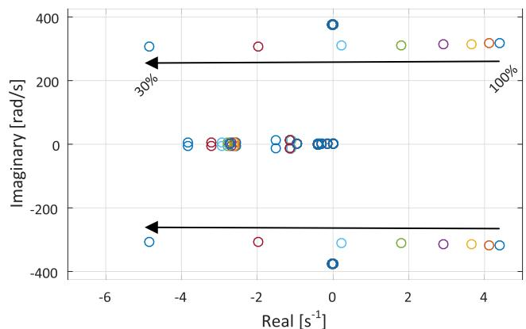  
Fig. 8. Eigenvalue traces for varying RSC current control gains.

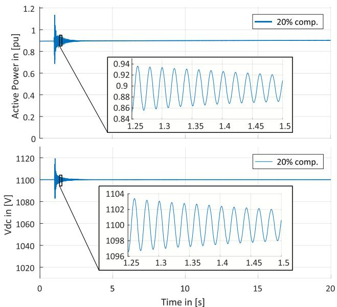  
Fig. 9. EMTP results for RSC controller gains reduced to 40% of their original values and a line compensation level of 20%.

controllers, since their control structures and parameters may differ. Additionally, it is noted that the tuning of the RSC controller to mitigate SSO may as well impact other WPP aspects, for instance, its low-voltage ride through (LVRT) behavior. Therefore, verification of compliance to other requirements applicable to the WPP is required after such changes. These investigations are left outside the scope of this paper.

# 7. Black-box Stability Assessment of a DFIG-based Wind Farm Connected to a Series Compensated Grid

The modal analysis used in the previous sections has proved to be a powerful tool for assessing system stability, identifying the root causes of oscillations and for designing controllers. On the other hand, its application requires detailed knowledge and information of all considered system components, which is not always available.

For instance, due mostly to intellectual property concerns, planning and integration studies are usually conducted with protected (blackbox) models, which hinder the application of linearized modal analysis as described in previous sections. Moreover, even if the required information and models are fully available, linearization process can

easily become resource-intensive for even small systems and its application may be hardly justifiable for all industrial applications.

In this context, some alternative approaches have been proposed to address the needs of system planners and WPP plant developers to assess system stability in an efficient manner. Notably the methodology proposed in [10] offers the possibility of assessing interaction risks between DFIG and series compensated grids without requiring the analytical development of system equations nor detailed knowledge of the involved components. This approach stems from similar analysis conducted for SSR in conventional synchronous generators. Following its procedure, a frequency dependent impedance is calculated considering both the DFIG-based system and the grid it is being connected to as seen from their PCC. For this, current disturbances are injected at the PCC at different frequencies and the positive sequence frequencydependent impedances of grid and DFIG are extracted from the sampled voltage and currents through the use of a Fast Fourier Transform (FFT). According to proposed stability criteria, critical operating conditions are then revealed for cases in which the sum of DFIG and grid frequency dependent resistances, i.e., the combined resistance, is negative whenever the combined frequency dependent reactance crosses zero.

Due to its industrial relevance and usage ([37,38]), the combined scan approach is investigated next and its results are compared to the ones obtained through the modal analysis presented in Section 5 and Section 6.

# 7.1. Black-box assessment of the impact of varying series compensation

For the application of the methodology proposed in [10] an operating point has to be assumed for the system under investigation. For the studies carried out next, the wind speed has been adjusted in order to obtain the DFIG-based WPP injecting a total of 100 MW. This operating point corresponds to the same condition assumed for the modal analysis carried out in Sections 5 and 6.

Since it is known from the eigenvalue analysis illustrated in Fig. 6 that DFIG-based WPP is supposed to become unstable for line series compensation level equal 10%, the combined scan technique is next applied to the line compensation levels of 8%, 9%, 10% and 11% in order to test the accuracy of the combined scan approach. The results are illustrated in the next Fig. 10, where the combined impedances, i.e., the sum of the extracted frequency dependent input impedances of the DFIG-based WPP and the grid, as seen from their PCC, are shown up to 100 Hz.

It can be seen from Fig. 10 that the combined impedance seen for the range from 0 to 100 Hz varies marginally as result of changing the

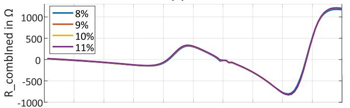  
(a)

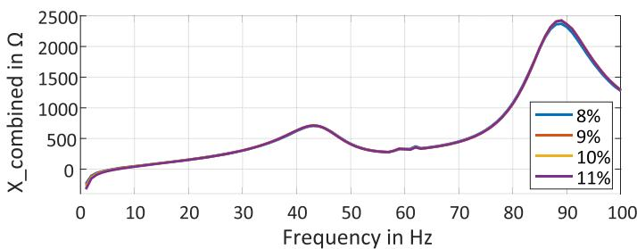

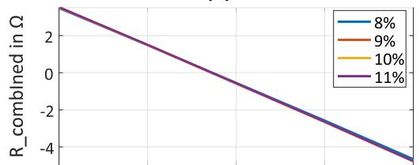  
(b)

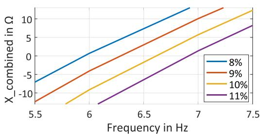  
Fig. 10. Combined resistances and reactances for DFIG-based WPP and series compensated grid: (a) combined scan results for the 0 to 100 Hz range; (b) zoom at the reactance crossovers region.

line series compensation level (Fig. 10.a). Nevertheless, a zoom in the region of the reactance crossovers (Fig. 10.b) indicates that the combined resistance is positive at the reactance crossover for 8% and 9% series compensation levels, but it becomes negative for 10% and 11%, indicating therefore a SSR risk for these cases. Thus, it is evident that the combined scan technique was capable of correctly predicting SSR between DFIG-based WPP and the series compensated grid for the investigated cases.

At this point, it is emphasized that these results obtained by the combined scan technique, illustrated in Fig. 10, are in perfect accordance with those obtained through modal analysis and summarized in Fig. 6. It is also noted that the detailed simulations results shown in Fig. 7 corroborate these predictions.

Finally, it is highlighted that, although the combined scan technique was able of providing correct SSR prediction for the investigated cases, the technique is not capable of providing any further guidance in understanding the phenomena and its root causes. For this, the modal analysis emerges as a more suitable technique, as demonstrated in previous section.

# 7.2. Black-box assessment of the impact of RSC Current Regulator Gains

To further investigate the capabilities of the combined scan technique, it is now applied to the cases investigated in subsection 6.2, where the RSC current regulator gains are changed to mitigate SSR. In other words, it is now investigated if the methodology can be used to assess the impact of mitigation measures.

As evident from Fig. 8, the RSC current regulator gains do have a significant impact in the critical mode. It is known from the modal analysis from previous sections that reducing the RSC current regulator gains to approximately 48% or less of their original values help stabilizing the system. In the next, the combined scan technique is applied to verify the case illustrated in Fig. 9, in which the RSC current controller gains of the DFIG were reduced to 40% of their original values. Fig. 11 shows the combined resistance and reactance for the same case as in Fig. 9 with a 20% line series compensation.

When comparing the results shown in Fig. 11 with those illustrated in Fig. 10, it is evident that the modified RSC current controller gains have the effect of increasing the combined resistance in the low frequency range for the investigated scenario. As a result, at the new obtained reactance crossover (Fig. 11.b), the combined resistance is now clearly positive, thus, indicating no more SSR risks, even with the line series compensation level increased to 20%.

It is important to emphasize that these results are also in completely accordance with those obtained through the modal analysis in previous sections and verified by detailed EMT simulation in Fig. 9. This indicates that the combined scan technique was also capable of properly addressing the proposed mitigation measures for the investigated scenarios.

At this point, it is emphasized that the combined scan technique required no detailed knowledge of the investigated system to indicate potential risks. Additionally, it is noted that the considered models could have also been of protected type (i.e., black-boxes). These results indicate, therefore, that the combined scan technique may be adequate to address SSR risks in early project stages involving type-III WPPs.

Finally, it is highlighted, that the combined scan technique served well as a screening tool for the investigated scenarios, however its application for understanding and mitigating the SSR issue may be limited. For this, modal analysis emerges as a more suitable technique, as it has been seen in previous sections that it is capable of supporting rootcause studies and definition of mitigation measures.

# 8. Conclusions

This work deals with a fundamental investigation of low frequency interactions involving DFIG based WPPs in series compensated grids by means of detailed equipment considerations and analytical model representations.

A new EMT-type benchmark study system based on realistic data is proposed and used to support investigations. Nonlinear components, such as series compensation varistors and transformer saturation, as well as collector system representation for the WPP are considered.

The development of a linearized multivariable state-space representation of the analyzed system is outlined, considering all inner and outer control loops of the DFIG system as well as its mechanical components. The linearized system is validated against its detailed representation in EMTP, with focus on PLL states, dc-bus voltage and transmission line currents.

Eigenvalue analysis is applied to the obtained state-space representation to assess system stability for varying line series compensation levels. Additionally, participation factor analysis is used to identify system states most contributing to the critical modes. It has been observed for the particular case investigated that these states are of electrical nature and concern mostly the induction generator currents and the series capacitor voltages.

It is outlined how insights obtained through modal analysis can be

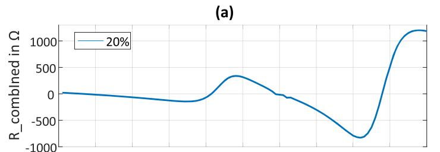

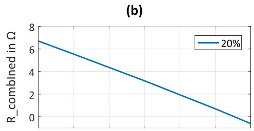

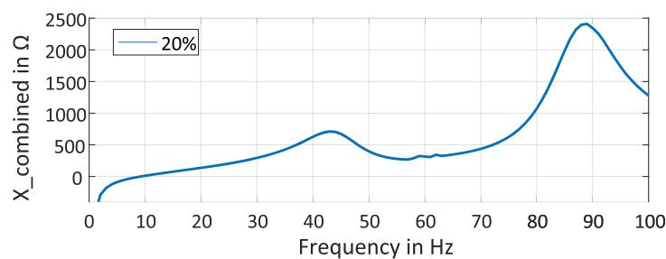

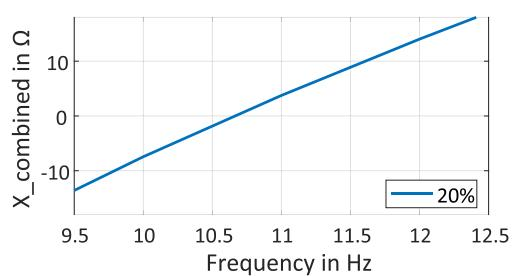  
Fig. 11. Combined scan results for DFIG-based WPP and series compensated grid with new RSC gains and 20% series compensation: (a) combined values for the 0 to 100 Hz range; (b) zoom at the reactance crossover region.

used to provide orientation for controller based mitigation aiming at reducing interaction risks and, thus, at enhancing system stability. It is demonstrated that the RSC current regulator gains of the DFIG system can significantly impact system stability and, if properly tuned, can support mitigation. Sensitivity analysis is then used to support controller redesign.

The capabilities of a screening technique for rapid stability assessment, namely, the combined scan technique, are also investigated for the same system. It is shown that, although this technique does not rely on detailed information of the investigated systems nor on their rigorous analytical development, it was capable of properly predicting the stability in the cases studied. The effectiveness of the controller based mitigation has also been demonstrated by means of the combined scan technique. All results are verified by detailed EMT simulation.

It is emphasized that the combined scan technique serves only as a screening technique, i.e., for fast identification of potential risks. It is observed that its application for the understanding of the observed SSR phenomena may be limited. For this, modal analysis, although resource-intensive, emerges as a more suitable technique.

Finally, it is noted that, to further generalize these results, future research should be conducted to assess the applicability and effectiveness of these techniques in conjunction with other VSC-based systems, for instance, full-converter, i.e., type-IV, wind turbine system or highvoltage direct-current (HVDC) transmission systems.

# Credit Author Statement

Aramis Schwanka Trevisan: Conceptualization, Methodology, Formal analysis, Investigation, Software, Visualization, Writing - Original Draft

Martin Fecteau: Conceptualization, Methodology, Validation, Resources, Writing - Review & Editing

Ângelo Mendonça: Conceptualization, Methodology, Validation, Resources, Writing - Review & Editing, Supervision

Richard Gagnon: Conceptualization, Methodology, Validation, Resources, Writing - Review & Editing, Supervision

Jean Mahseredjian: Conceptualization, Methodology, Validation, Resources, Writing - Review & Editing, Supervision; Project administration

# Declaration of Competing Interest

The authors declare that they have no known competing financial interests or personal relationships that could have appeared to influence the work reported in this paper.

# References

[1] R.G. Farmer, A.L. Schwalb, E. Katz, Navajo project report on subsynchronous resonance analysis and solutions, IEEE Trans. Power Appar. Syst. 96 (4) (1977) 1226–1232 Jul..   
[2] G.D. Irwin, A.K. Jindal, A.L. Isaacs, Sub-synchronous control interactions between type 3 wind turbines and series compensated AC transmission systems, IEEE Power and Energy Society General Meeting 44 (2) (2011) 1–6.   
[3] NERC, “Online Report: Lessons learned - Sub-synchronous interaction between series-compensated transmission lines and generation,” 2011.   
[4] L. Wang, X. Xie, Q. Jiang, H. Liu, Y. Liu, H. Liu, Investigation of SSR in Pratical DFIG-Based Wind Farms Connected to a Series-Compensated Power System, IEEE Transactions on Power Systems 30 (5) (2015) 2772–2779 Sep..   
[5] H. Liu, X. Xie, J.B. He, T. Xu, Z. Yu, C. Wang, C.Y. Zhang, Subsynchronous Interaction Between Direct-Drive PMSG Based Wind Farms and Weak AC Networks, IEEE Transactions on Power Systems 32 (6) (2017) 4708–4720 Nov..   
[6] R. Nath, C. Grande-Moran, Study of Sub-Synchronous Control Interaction due to the interconnection of wind farms to a series compensated transmission system, Proc. IEEE Power Eng. Soc. Transm. Distrib. Conf. 2012, pp. 0–5.   
[7] B. Badrzadeh, M. Sahni, D. Muthumuni, Y. Zhou, A. Gole, Sub-synchronous interaction in wind power plants part I: Study tools and techniques, IEEE Power Energy Soc. Gen. Meet. (2012) 1–9.   
[8] M. Sahni, B. Badrzadeh, D. Muthumuni, Y. Cheng, H. Yin, S.H. Huang, Y. Zhou, Subsynchronous interaction in wind power plants- part II: An ercot case study, IEEE Power Energy Soc. Gen. Meet. (2012) 1–9.

[9] L. Fan, R. Kavasseri, Z.L. Miao, C. Zhu, Modeling of DFIG-based wind farms for SSR analysis, IEEE Trans. Power Deliv 25 (4) (2010) 2073–2082.   
[10] U. Karaagac, S. O. Faried, S. Member, J. Mahseredjian, and A. A. Edris, “Coordinated Control of Wind Energy Conversion Systems for Mitigating Subsynchronous Interaction in DFIG-Based Wind Farms,” vol. 5, no. 5, pp. 2440–2449, 2014.   
[11] I. Vieto, J. Sun, Damping of subsynchronous resonance involving Type-III wind turbines, IEEE 16th Workshop on Control and Modeling for Power Electronics (COMPEL), 2015, pp. 1–8.   
[12] Z. Wu, C. Zhu, M. Hu, Supplementary controller design for SSR damping in a seriescompensated DFIG-based wind farm, Energies 5 (11) (2012) 4481–4496.   
[13] B. Badrzadeh, S. Saylors, Susceptibility of wind turbines to sub-synchronous control and torsional interaction, Proc. IEEE Power Eng. Soc. Transm. Distrib. Conf. 2012, pp. 1–8.   
[14] A. El-deib, A. Trevisan, A. Mendonca, M. Fischer, Assessment of Full-Converter Wind Turbines ’ Immunity against Subsynchronous Interaction using Eigenvalue Analysis, Proceedings of the 14th Wind Integration Workshop, 2015.   
[15] H.T. Ma, P.B. Brogan, K.H. Jensen, R.J. Nelson, Sub-synchronous control interaction studies between full-converter wind turbines and series-compensated ac transmission lines, IEEE Power Energy Soc. Gen. Meet. 2012, pp. 1–5.   
[16] P.L. Dandeno, P. Kundur, Practical application of eigenvalue techniques in the analysis of power system dynamic stability problems, Can. Electr. Eng. J. 1 (1) (1976) 35–46.   
[17] M. Elfayoumy, C.G. Moran, A Comprehensive Approach for Sub-Synchronous Resonance Screening Analysis Using Frequency scanning Technique, IEEE Bol. PowerTech Conf. 2003, pp. 1–5.   
[18] L. Harnefors, Analysis of subsynchronous torsional interaction with power electronic converters, IEEE Trans. Power Syst 22 (1) (2007) 305–313.   
[19] J. Sun, Small-signal methods for AC distributed power systems-A review, IEEE Trans. Power Electron 24 (11) (2009) 2545–2554.   
[20] I. Vieto, J. Sun, Impedance modeling of doubly-fed induction generators, 17th European Conference on Power Electronics and Applications (EPE’15 ECCE-Europe), 2015, pp. 1–10.   
[21] I. Vieto, J. Sun, Prediction of SSR in Type-III Wind Turbines Connected to Series Compensated Grids, Proceedings of the 14th Wind Integration Workshop, 2015.   
[22] S. Chernet and M. Bongiorno, “Input Impedance Based Nyquist Stability Criterion for Subsynchronous Resonance Analysis in DFIG Based Wind Farms,” pp. 6285–6292, 2015.   
[23] M. Sahni, D. Muthumuni, B. Badrzadeh, A. Gole, A. Kulkarni, Advanced screening techniques for Sub-Synchronous Interaction in wind farms, Proc. IEEE Power Eng. Soc. Transm. Distrib. Conf. 2012, pp. 1–9.   
[24] U. Karaagac, J. Mahseredjian, S. Jensen, R. Gagnon, M. Fecteau, I. Kocar, Safe Operation of DFIG based Wind Parks in Series Compensated Systems, IEEE Trans. on Power Delivery 33 (2) (2018) 709–718.   
[25] D.H.R. Suriyaarachchi, U.D. Annakkage, C. Karawita, D.A. Jacobson, A procedure to study sub-synchronous interactions in wind integrated power systems, IEEE Trans. Power Syst. 28 (1) (2013) 377–384.   
[26] J. Mahseredjian, S. Dennetière, L. Dubé, B. Khodabakhchian, L. Gérin-Lajoie, On a new approach for the simulation of transients in power systems, Electric Power Systems Research 77 (11) (2007) 1514–1520 September.   
[27] A.S. Trevisan, A.A. El-Deib, R. Gagnon, J. Mahseredjian, M. Fecteau, Field Validated Generic EMT-Type Model of a Full Converter Wind Turbine Based on a Gearless Externally Excited Synchronous Generator, IEEE Trans. Power Deliv. 33 (5) (2018) 2284–2293 Oct..   
[28] B. Badrzadeh, M. Sahni, Y. Zhou, D. Muthumuni, A. Gole, General Methodology for Analysis of Sub-Synchronous Interaction in Wind Power Plants, IEEE Trans. Power Syst. 28 (2) (2013) 1858–1869.   
[29] J. Brochu, C. Larose, R. Gagnon, Generic Equivalent Collector System Parameters for Large Wind Power Plants, IEEE Transactions on Energy Conversion 26 (2) (2011) June.   
[30] R. Gagnon, G. Turmel, C. Larose, J. Brochu, G. Sybille, M. Fecteau, Large-scale realtime simulation of wind power plants into hydro-québec power system, Proc. 9th Workshop on Large-Scale Integration of WindPower Into Power Systems, Canada, 2010, pp. 73–80 Oct..   
[31] R. Gagnon, M. Fecteau, P. Prud'Homme, E. Lemieux, G. Turmel, D. Paré, F. Duong, Hydro-Québec Strategy to Evaluate Electrical Transients Following Wind Power Plant Integration in the Gaspésie Transmission System, IEEE Trans. Sustain. Energy 3 (4) (2012) 880–889.   
[32] G. Gaba, S. Lefebvre, D. Mukhedkar, Comparative analysis and study of the dynamic stability of AC/DC systems, IEEE Trans. Power Syst 3 (3) (Aug. 1988) 978–985.   
[33] P.T. Krein, J. Bentsman, R.M. Bass, B.L. Lesieutre, On the use of averaging for the analysis of power electronic systems, IEEE Trans. Power Electron 5 (2) (1990) 182–190.   
[34] N. Pogaku, M. Prodanović, T.C. Green, Modeling, analysis and testing of autonomous operation of an inverter-based microgrid, IEEE Trans. Power Electron 22 (2) (2007) 613–625.   
[35] MathWorks, (2018). Control Systems Toolbox: User's Guide (R2018a). Retrieved October 25, 2018 fromhttps://de.mathworks.com/help/pdf_-doc/control/ usingcontrol.pdf.   
[36] P. Kundur, Power System Stability and Control, McGraw-Hill, 1994.   
[37] H. Saad, Y. Fillion, S. Deschanvres, Y. Vernay, S. Dennetiere, On resonances and harmonics in HVDC-MMC station connected to AC grid, IEEE Trans. Power Deliv 32 (3) (2017) 1565–1573.   
[38] N. Karnik, D. Novosad, H.K. Nia, M. Sahni, M. Ghavami, H. Yin, An evaluation of critical impact factors for SSCI analysis for wind power plants: A utility perspective, 2017 IEEE Power & Energy So-ciety General Meeting, 2017, pp. 1–5.