# 基于C型滤波器的MMC高频振荡抑制及参数设计方法

刘春震，徐海亮，高铭琨，葛平娟

（中国石油大学（华东）新能源学院，山东省青岛市 266580）

摘要：由于链路延时，基于模块化多电平换流器(MMC)的柔性直流输电系统的高频段规律性出现负阻尼特性，易与交流系统阻抗相互作用，造成高频振荡现象。为完全消除MMC的负阻尼，提出在交流母线处并联C型滤波器的无源抑制方法，通过设计其串联谐振支路在基频处谐振，可减少滤波器的基频有功损耗。此外，提出了基于第1负阻尼频段的参数设计方法，且参数选取时考虑了元件成本。电磁暂态仿真结果表明，所提C型滤波器及其参数设计方法能够大幅减少基频有功损耗，有效抑制MMC高频振荡，且不会影响系统的稳态和暂态特性。

关键词：柔性直流输电；模块化多电平换流器；无源阻尼；阻抗重塑；高频振荡抑制；参数设计

# 0 引 言

基 于 模 块 化 多 电 平 换 流 器（modular multilevelconverter，MMC）的 高 压 直 流（high voltage directcurrent，HVDC）输电技术，具有谐波含量低、可靠性高等优点［1］ ，被广泛用于异步电网互联［2］ 、新能源并网等领域［3］ 。然而，MMC复杂的内部动态给电网的安全稳定运行带来了新的问题［4］。2017年 4月 10日，中国云南鲁西异步联网工程广西侧交流电压、电流均被观测到有 1 271 Hz左右的高频振荡［5］；2018年 12 月，渝鄂联网工程在空载加压试验时发生 1810 Hz 和 700 Hz 的高频振荡等［6］。这些高频振荡事件的发生严重威胁电网安全，引发业界高度关注。

建立准确的系统数学模型是稳定性分析的基础。文献［7］建立了考虑完整控制环节的 MMC详细阻抗模型，研究了相关参数对系统高频稳定性的影响，指出链路延时、桥臂参数、电压前馈控制及交流线路的分布参数特征等因素在高频稳定性分析时不可忽略。考虑到上述模型的复杂度较高，加之外环、锁相环及环流控制对高频阻抗的影响较小，文献［8］提出了MMC的高频简化模型，该简化模型的结果与电磁暂态仿真模型的扫频结果在高频段基本一致［9］ ，且形式简洁，被广泛用来代替上述详细模型以分析MMC的高频稳定性。

现有的MMC高频振荡抑制策略可分为有源和

无源阻尼抑制策略。在有源抑制策略方面，文献［ ］在锁相环比例支路添加复合滤波，并通过合理的参数设计来抑制 MMC高频振荡；文献［11］通过优化电流环和电压前馈控制的参数来调节MMC阻抗幅值，以避免其与交流侧阻抗在负阻尼频段出现交点；文献［4］则是利用一个一阶高通滤波器和两个一阶低通滤波器构成的三阶阻尼器将MMC的负阻尼频段与交流系统电容特性频段避开，以实现振荡抑制；在电压前馈环节添加低通滤波器［12-13］或带阻滤波器［14］ 等也可抑制 MMC的高频振荡，但会在数百赫兹的频段引入新的负阻尼段；文献［15］则通过在电流内环中串联虚拟阻抗以改变频率交点附近的相位，从而抑制高频振荡。需要指出，上述有源抑制策略存在的共性问题是不能完全消除MMC的负阻尼，当电网阻抗发生变化时，系统仍可能面临新的高频振荡风险。在无源抑制策略方面，文献［16］提出在桥臂电抗并联无源支路来抑制高频振荡，但并未给出无源元件的具体参数；文献［8］提出将 A 型无源 滤 波 器 并 联 在 公 共 耦 合 点（point of commoncoupling，PCC）以抑制高频振荡，并未涉及滤波器参数的设计方法；文献［17］提出在PCC处并联二阶高通滤波器的方法，有效抑制了MMC高频振荡；文献［18］采用 RLC 串联的阻抗重塑器来消除 MMC 的负阻尼，但采用无源装置易产生较大的基频有功损耗，是其不足之处。

针对上述问题，本文提出采用C型滤波器，以减少滤波器的基频有功损耗，并通过分析 MMC高频简化模型及 型滤波器的阻抗特性，提出了基于

第 1负阻尼频段的参数设计方法，且在参数选取时考虑了元件成本，实现了将 MMC高频阻抗重塑至稳定范围的目标。最后，在 MATLAB/Simulink 中搭建了 MMC电磁暂态仿真模型。算例结果表明，所提C型滤波器及其参数设计方法能够大幅减少滤波器基频有功损耗，有效抑制MMC高频振荡现象，且不会对系统的稳态和暂态特性产生影响。

# 1 MMC高频阻抗模型及振荡抑制分析

# 1. 1 MMC高频阻抗模型

MMC-HVDC 拓 扑 如 图 1（a）所 示 ，其 中 ： $u _ { \mathrm { g a c } ) }$ $( \ j = \operatorname { A } , \operatorname { B } , \operatorname { C } )$ 为 j相交流侧等效电源； $Z _ { \mathrm { g a c } }$ 为交流系统等效阻抗； $i _ { \mathrm { a c } j }$ 为 j相交流侧电流； $u _ { \mathrm { d c } }$ 为直流侧电压； $; i _ { \mathrm { d c } }$ 为直流侧电流； $\{ i _ { x j } ( x = \mathrm { u } , 1 )$ 为 j 相 x 桥臂电流，其中u、l分别表示上、下桥臂 $\div u _ { x j }$ 为j相x桥臂子模块输出电压之和；R、L分别表示桥臂等效电阻和电感；$L _ { \mathrm { T } }$ 为变压器漏感；SM表示子模块。

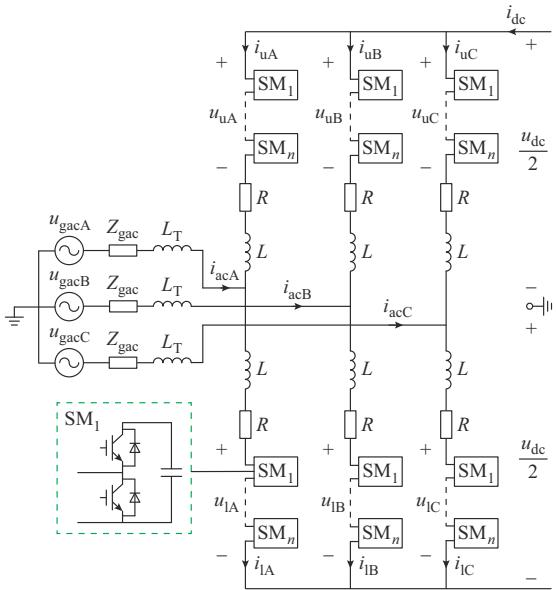

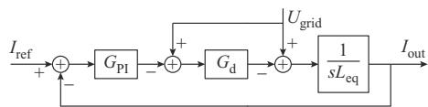  
(a) MMC3   
(b) MMCPM0   
图1 MMC拓扑及高频简化模型  
Fig. 1 MMC topology and high-frequency simplified model

目前对于 MMC的高频振荡分析，通常采用如图1（b）所示的高频简化模型，这是因为其结果不仅与电磁暂态仿真模型的扫频结果在数百至上千赫兹的频段内基本一致，且忽略了对高频阻抗影响较小的锁相环、外环和环流控制等环节，模型形式较简洁［9］。 图 1（b）中： $U _ { \mathrm { g r i d } }$ 为交流母线 PCC 处电压； $I _ { \mathrm { r e f } }$

为内环电流参考值； $\mathrm { \Delta } J _ { \mathrm { o u t } }$ 为网侧输出电流； $L _ { \mathrm { e q } }$ 为MMC的等值电感， $L _ { \mathrm { e q } } { = } L _ { \mathrm { T } } { + } 0 . 5 L ; G _ { \mathrm { P I } }$ 为电流内环比例-积分（PI）控制器的传递函数； $G _ { \mathrm { d } } { = } \mathrm { e } ^ { - s T }$ 为系统总链路延时环节传递函数，其中，T为延时时间。在理论分析时， $G _ { \mathrm { d } }$ 的10阶Pade近似［19］ 等效表达式如式（1）所示，其中 $M _ { i } ( { \it i = 0 } , 1 , \cdots , 9 )$ 为各项系数。附录 A 表A1给出了 3种不同延时下 $M _ { i }$ 的具体数值，其均由MATLAB中 Pade函数求得。据此可得出 MMC高频简化阻抗模型如式（2）所示。

$$
G _ {\mathrm {d}} \approx \frac {s ^ {1 0} + (- 1) ^ {9} M _ {9} s ^ {9} + \cdots + (- 1) ^ {0} M _ {0} s ^ {0}}{s ^ {1 0} + M _ {9} s ^ {9} + \cdots + M _ {0} s ^ {0}} \tag {1}
$$

$$
Z _ {\mathrm {M M C}} ^ {\prime} = \frac {s L _ {\mathrm {e q}} + G _ {\mathrm {P I}} G _ {\mathrm {d}}}{1 - G _ {\mathrm {d}}} \tag {2}
$$

在仅采用无源抑制策略的情况下，随着频率的增加，式（2）中的分子项 $s L _ { \mathrm { e q } }$ 的值远大于另一项$G _ { \mathrm { P I } } G _ { \mathrm { d } }$ ，忽略后者可得到式（3）所示的 MMC 更加简洁的高频阻抗表达式［18］ 。MMC的高频阻抗主要与链路延时、桥臂等效电感和变压器漏感有关，物理意义明确且易于分析计算。

$$
Z _ {\mathrm {M M C}} = \frac {s L _ {\mathrm {e q}}}{1 - G _ {\mathrm {d}}} \tag {3}
$$

# 1. 2 MMC高频振荡现象

对于交流侧的建模，有学者采用RLC元件进行等效［8，20］ ，该方式较为简单，本文采用 π级联模型来表征交流系统的分布参数特性，交流线路的参数如附录 A 表 A2 所示。在 MATLAB/Simulink 中搭建电磁暂态仿真模型，具体参数见附录A表A3。该参数下，MMC高频简化模型与电磁暂态模型频率扫描结果对比见附录 A 图 A1，两者在 500~4 000 Hz频段内基本保持一致。因此，可以用高频简化模型对MMC高频振荡及抑制策略进行分析。

根据奈奎斯特稳定判据［8］ ，若交流系统与MMC阻抗存在交点，且交点处两者相位差大于180°，系统将在该频率处产生振荡。在本文设计的算例中，交流系统和 MMC交流侧阻抗特性如附录 A图 A2所示，两者在1 010 Hz处存在交点且对应相位差大于180°，预示着系统将会产生高频振荡（约为 20次谐波），而 交点处对应的相位差小于 。因此，该频率处不会产生振荡。

# 1. 3 C型滤波器特性分析

MMC的高频负阻尼是导致系统产生高频振荡的主要诱因。文献［ ］将链路延时确定为负阻尼区域产生的关键因素，而 MMC复杂的控制系统使得难以在现有的硬件技术基础上将链路延时降低到

足够小的程度。

需要指出，目前研究的有源阻尼抑制策略不能完全解决 MMC负阻尼问题［9］。相比之下，无源阻尼抑制策略可改善MMC高频段阻抗特性。为减小无源装置的基频有功损耗，本文采用C型滤波器对MMC高频阻抗进行重塑，如图2所示，其阻抗表达式如式（4）所示，具体表达式见附录B式（B1）。

$$
Z _ {\mathrm {Z}} = \frac {1}{s C _ {\mathrm {Z} 1}} + \left(s L _ {\mathrm {Z}} + \frac {1}{s C _ {\mathrm {Z} 2}}\right) / / R _ {\mathrm {Z}} \tag {4}
$$

式中： $C _ { \mathrm { Z 1 } }$ 为滤波器干路上的电容； $C _ { \mathrm { Z 2 } }$ 和 $L _ { \mathrm { Z } }$ 分别为滤波器支路上串联的电容和电感； $R _ { \mathrm { Z } }$ 为滤波器支路上的电阻。

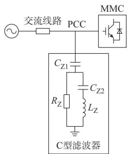  
图2 C型滤波器结构图  
Fig. 2 Structure diagram of C-type filter

C型滤波器具有高通特性，可在高频时为系统提供正阻尼，将 $C _ { \mathrm { Z 2 } }$ 和 $L _ { \mathrm { z } }$ 设计为在基频处谐振，可大幅减小通过 $R _ { \mathrm { Z } }$ 的基频电流，降低滤波器基频有功损耗［16］ 。 $C _ { \mathrm { Z 2 } }$ 和 $L _ { \mathrm { Z } }$ 存在一一对应的关系，故C型滤波器可由 $C _ { \mathrm { Z 1 } \setminus R _ { \mathrm { Z } } }$ 和 $L _ { \mathrm { Z } }$ 这3个参数来确定，附录A图A3给出了 3个参数的变化对 C 型滤波器阻抗特性的影响。研究发现， $C _ { \mathrm { Z 1 } }$ 增加会降低滤波器中高频段的阻抗，使该频段电流更多地流入滤波器，从而增加系统正阻尼，但 $C _ { \mathrm { Z 1 } }$ 的值如过大会影响MMC的低频段且带来较大的无功补偿； $R _ { \mathrm { Z } }$ 的增加会使得滤波器的电流更多地通过 $C _ { \mathrm { Z 2 } }$ 和 $L _ { \mathrm { z } }$ 支路，从而增加中高频段的电容特性和高频段的电感特性； $L _ { \mathrm { z } }$ 的增加则将使滤波器电流更多地流经 $R _ { \mathrm { Z } }$ ，增加了滤波器提供的正阻尼，但随着 $L _ { \mathrm { z } }$ 值的增大，其影响也逐渐减弱。因此，必须通过合理的参数设计，使C型滤波器提供的正阻尼完全抵消MMC的负阻尼，以保证系统的稳定。

# 2 基于第1负阻尼频段的C型滤波器参数设计方法

# 2. 1 MMC阻抗重塑思路

由于电容 $C _ { \mathrm { Z 1 } }$ 的存在阻断了低频电流的流入，C型滤波器在低频段呈现的阻抗大于 MMC，两者并

联后在低频段 MMC占据主导地位，即并联 C型滤波器对 MMC的阻抗影响不大；但在高频段， $C _ { \mathrm { Z 1 } }$ 和$C _ { \mathrm { Z 2 } }$ 的阻抗很小，L 的阻抗较大，因此电流主要流经$R _ { \mathrm { { Z } } }$ 支路，C型滤波器的阻抗将远小于MMC，两者并联后，MMC的阻抗将被重塑，如附录 A图 A4所示（参数见附录A表A4），重塑的阻抗表达式如式（5）所示，具体表达式见附录B式（B2）。

$$
\begin{array}{l} Z _ {\text {M M C R E}} = Z _ {\text {M M C}} / / Z _ {\mathrm {z}} = \\ \frac {s L _ {\mathrm {e q}}}{1 - G _ {\mathrm {d}}} / / \left[ \frac {1}{s C _ {\mathrm {Z} 1}} + \left(s L _ {\mathrm {Z}} + \frac {1}{s C _ {\mathrm {Z} 2}}\right) / / R _ {\mathrm {Z}} \right] \tag {5} \\ \end{array}
$$

附录B式（B2）的分母包含两项，随着频率的增加，前一项的幅值远小于后一项，因此将前一项忽略后，式（B2）将变为式（B1），即 MMC重塑后的阻抗接近于C型滤波器的阻抗。由附录A图A4可看出，当C型滤波器阻抗小于MMC阻抗后，MMC将被重塑，其相位随频率增加愈发接近C型滤波器的相位。由于C型滤波器随着频率的增加愈发接近纯阻性，因此MMC重塑后的相位也将随之越接近 $0 ^ { \circ } { } _ { \mathrm { ~ c ~ } }$ 。这意味着阻抗重塑后，第2及之后的负阻尼频段将比第1负阻尼频段更易被重塑至正阻尼区域。

值得注意的是，在第 1负阻尼频段 MMC 重塑后的相位会出现小于C型滤波器相位的情况，这是由于在该频段两者并联后的阻抗虚部小于 0，且实部大于 C 型滤波器实部，如附录 A 图 A5 所示。图 A5（a）中， $Z _ { 1 }$ 、Z 和Z 分别表示MMC、C型滤波器及两者并联后的阻抗，θ 、θ 和 $\theta _ { 3 }$ 分别为其相角， $R _ { 1 }$ 、$K _ { 1 }$ 和R 、K 分别为 $Z _ { 1 }$ 和Z 的实部和虚部。 $Z _ { 3 }$ 的具体表达式如式（6）所示，当 $Z _ { 3 }$ 实部小于 Z 实部且 $Z _ { 3 }$ 虚部小于0时，θ 将小于 $\theta _ { 2 }$ 。

$$
\begin{array}{l} Z _ {3} = \frac {R _ {1} \left(R _ {2} ^ {2} + K _ {2} ^ {2}\right) + R _ {2} \left(R _ {1} ^ {2} + K _ {1} ^ {2}\right)}{\left(R _ {1} + R _ {2}\right) ^ {2} + \left(K _ {1} + K _ {2}\right) ^ {2}} + \\ j \frac {K _ {2} \left(R _ {1} ^ {2} + K _ {1} ^ {2}\right) + K _ {1} \left(R _ {2} ^ {2} + K _ {2} ^ {2}\right)}{\left(R _ {1} + R _ {2}\right) ^ {2} + \left(K _ {1} + K _ {2}\right) ^ {2}} \tag {6} \\ \end{array}
$$

式（7）进一步给出了θ 小于θ 的条件。以案例1为例，从附录A图A5（b）可看出两个条件的交集对应了 $\theta _ { 3 }$ 小于 $\theta _ { 2 }$ 的频段，验证了理论分析的正确性。

$$
\left\{ \begin{array}{l} \left(K _ {2} ^ {2} - R _ {2} ^ {2}\right) \left(R _ {1} - R _ {2}\right) - 2 R _ {2} K _ {1} K _ {2} <   0 \\ K _ {2} \left(R _ {1} ^ {2} + K _ {1} ^ {2}\right) + K _ {1} \left(R _ {2} ^ {2} + K _ {2} ^ {2}\right) <   0 \end{array} \right. \tag {7}
$$

MMC的负阻尼区域仅与其链路延时有关［17］，式（8）给出了 MMC简化模型的相位表达式。通过将正切函数的取值归算至 $[ - \pi / 2 , \pi / 2 ]$ ，可得MMC的相位范围为［0，π］，且在频率 f=1/T处，相位由 π跳变为0，在f=1/（2T）处相位为 $\pi / 2$ ，即第1负阻尼频段在［1/（2T），1/T］内。当链路延时约为 600 μs

时，其第 1 负阻尼频段为［833，1 667］Hz。

$$
\begin{array}{l} \angle Z _ {\mathrm {M M C}} = \angle s L _ {\mathrm {e q}} - \angle (1 - \mathrm {e} ^ {- s T}) = \\ \frac {\pi}{2} - \angle (1 - \cos (2 \pi T f) + \mathrm {j} \sin (2 \pi T f)) = \\ \frac {\pi}{2} - \arctan \left(\tan \left(\frac {\pi}{2} - \pi T f\right)\right) \tag {8} \\ \end{array}
$$

# 2. 2 C型滤波器参数设计

C 型滤波器由 4 个元件组成： $C _ { \mathrm { Z 1 } \setminus } \ C _ { \mathrm { Z 2 } \setminus } R _ { \mathrm { Z } }$ 和 $L _ { \mathrm { z } }$ 。$C _ { \mathrm { Z 1 } }$ 主要与无功功率补偿有关； $C _ { \mathrm { Z 2 } }$ 和 $L _ { \mathrm { Z } }$ 构成基频谐振电路，以降低滤波器基频有功损耗； $R _ { \mathrm { Z } }$ 提供抑制振荡的阻尼。

首先，确定电容 $C _ { \mathrm { Z 1 } }$ 的值。 $C _ { \mathrm { Z 1 } }$ 是基频无功功率补偿的主电容，由于柔性直流系统不需要无功补偿，故 $C _ { \mathrm { Z 1 } }$ 的取值不能过大，当其产生的无功功率不超过系统有功功率的 5% 时，可不考虑其影响［22］ 。本文预选取有功功率的5%作为无功补偿的最大值，即：

$$
2\pi f_{1}C_{\mathrm{Zl}}u_{\mathrm{ph}}^{2}\leqslant \frac{P_{\mathrm{N}}}{3}\times 5\% \tag{9}
$$

式中 $: f _ { 1 }$ 为基频； $u _ { \mathrm { p h } }$ 为PCC处的相电压有效值，约等于交流系统相电压； ${ } ; P _ { \mathrm { N } }$ 为系统有功功率。

由附录A表A3的数据可得电容 $C _ { \mathrm { Z 1 } }$ 的最大取值约为 0.577 $\mu \mathrm { F }$ 。式（10）给出了 $C _ { \mathrm { Z 2 } }$ 和 $L _ { \mathrm { z } }$ 在基频谐振的条件，由此只需要确定 $R _ { Z }$ 和 $L _ { \mathrm { Z } }$ 的取值即可。

$$
C _ {\mathrm {Z} 2} = \frac {1}{\left(2 \pi f _ {1}\right) ^ {2} L _ {\mathrm {Z}}} \tag {10}
$$

为确定 $R _ { \mathrm { { Z } } }$ 和 $L _ { \mathrm { z } }$ 的取值范围，可通过式（11）计算在不同 $R _ { \mathrm { Z } }$ 和 $L _ { z }$ 组合下， $Z _ { \mathrm { M M C R E } }$ 在第 1负阻尼频段内的相位最大值和最小值，若两者都处于正阻尼区域，则对应的 $R _ { \mathrm { { Z } } }$ 和 $L _ { \mathrm { Z } }$ 为满足稳定性要求的取值。

$$
\left\{ \begin{array}{l} \theta_ {\max } = \max  \left(\arg \left(Z _ {\text {M M C R E}}\right)\right) \\ \theta_ {\min } = \min  \left(\arg \left(Z _ {\text {M M C R E}}\right)\right) \\ f \in \left[ f _ {\min }, f _ {\max }\right] \end{array} \right. \tag {11}
$$

式中： $\theta _ { \mathrm { m a x } }$ 和 $\theta _ { \mathrm { m i n } }$ 分别为MMC在第1负阻尼频段的相位最大值和最小值 $; f _ { \mathrm { m i r } }$ 和 $f _ { \mathrm { m a x } }$ 为第1负阻尼频段的边界值，在本文中分别为 833 Hz和 1 667 Hz。

图3（a）展示了在 $R _ { \tilde { z } }$ 和 $L _ { \mathrm { z } }$ 不同取值下， $Z _ { \mathrm { M M C R E } }$ 在第1负阻尼频段的最大值和最小值的关系。图3中相位最大值曲面满足相位约束条件，即恒处于正阻尼区域，而相位最小值曲面则出现小于-90°的情况。将两个曲面向下投影至二维平面则可得到 $R _ { \mathrm { Z } }$ 和 $L _ { \mathrm { z } }$ 的参数可行域，以及不同 $R _ { 2 }$ 和 $L$ 参数下产生相同重塑效果的等相位线，如图 （ ）所示。

由图3（b）可以看出，通过 $R _ { \mathrm { { Z } } }$ 和 $L _ { \mathrm { Z } }$ 的不同取值，可以将 $Z _ { \mathrm { M M C R E } }$ 在第1负阻尼频段内的相位最小值限

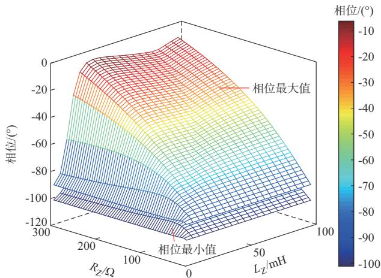

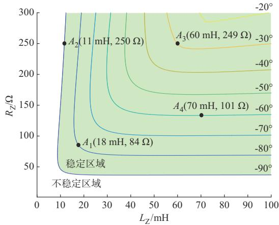  
(a) ,/+2   
(b) $R _ { Z }$ L +	=

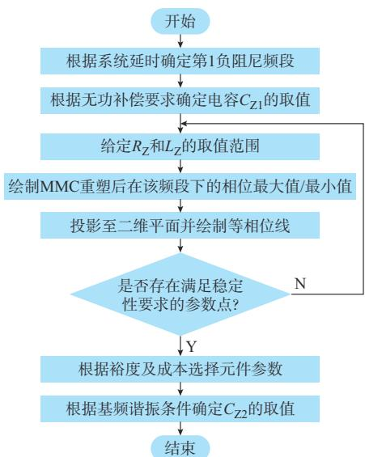  
(c) @@"/   
图3　滤波器参数的设计  
Fig. 3 Design of filter parameters

制在不同的范围内，且当只改变 $R _ { \mathrm { Z } }$ 或 $L _ { \mathrm { z } }$ 时，重塑效果会有一个上限。例如，图3（b）中 $A _ { 1 }$ 点，若只改变$L _ { \mathrm { Z } }$ 的值，其变化轨迹不可能越过- $7 0 ^ { \circ }$ 的等相位线，只改变 $R _ { Z }$ 的值也同理。只有两者同时增大或减小

时重塑效果较为明显。而且在基频时， $C _ { \mathrm { { Z 1 } } \setminus \cdot \mathrm { { Z } } _ { \mathrm { { Z } } } }$ 和 $C _ { \mathrm { Z 2 } }$ 构成C型滤波器的主要电流通路，电流大小由电容$C _ { \mathrm { Z 1 } }$ 决定，这意味着 $L _ { \mathrm { Z } }$ 的电感值越大， $L _ { \mathrm { Z } }$ 和 $C _ { \mathrm { Z 2 } }$ 的 容量/成本就需要越大［23］。因此，对于每一条等相位线，取其左下角拐点附近的参数是较合理的，如 A所在的位置。图3（c）给出了基于第1负阻尼频段的C型滤波器参数设计方法流程图。

# 2. 3 C型滤波器参数设计可行性验证

为验证 C 型滤波器参数设计的可行性，在图 3（b）中选择 4组 C型滤波器参数进行验证，分别为 A（18 mH，84 Ω）、A（11 mH，250 Ω）、A（60 mH，$2 4 9 \Omega ) \setminus A _ { 4 } ( 7 0 \mathrm { m H } , 1 0 1 \Omega )$ 。

每组参数的C型滤波器并联在PCC处后，绘制MMC重塑后的阻抗特性如附录 A图 A6所示。可见，采用4组参数下的C型滤波器都能将MMC的相位限制在稳定范围内，4组参数中A 对应的参数位于-30°等相位线，从附录 A图 A6中也可看出该参数下MMC的稳定性最高。

# 3 C 型滤波器影响分析及高频振荡抑制有

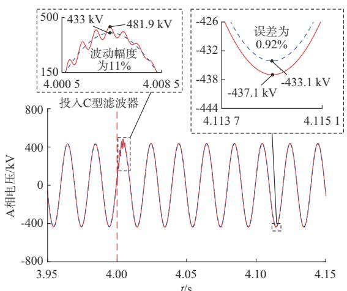  
(a) " 3A,*

# 效性验证

由第 2 章分析可知，在参数可行域内，对于每一条等相位线，取其拐点处的参数可最大化降低元件成本。同时，考虑到链路延时会出现约10%的合理波动［14］ ，为确保在延时波动下C型滤波器仍能消除MMC负阻尼，参数的选取应留有一定裕度。本文选取 $A _ { 1 }$ 组参数作为 C型滤波器的仿真参数进行研究 ，其 中 ： $C _ { \mathrm { z 1 } } { = } 0 . 5 7 7 ~ { \mu } \mathrm { F } \ , R _ { \mathrm { z } } { = } 8 4 ~ \Omega \ , L _ { \mathrm { z } } { = } 1 8 ~ \mathrm { m H }$ ，$C _ { \mathrm { Z 2 } } { = } 5 6 3 ~ \mu \mathrm { F }$ 。

# 3. 1　对系统稳态和暂态运行的影响及基频有功损耗对比

C型滤波器的投入不应对系统的稳态安全运行造成大的影响。图4（a）和（b）展示了交流母线电压和电流在投入与未投入C型滤波器情况下的对比。可见，在投入C型滤波器后，交流母线电压波动幅度为 11%，稳态误差为 0.92%，母线电流波动幅度为6%，稳态误差为0.97%，且波动在半个周期后消除，系统恢复稳定运行。

投入与未投入C型滤波器情况下，对系统功率

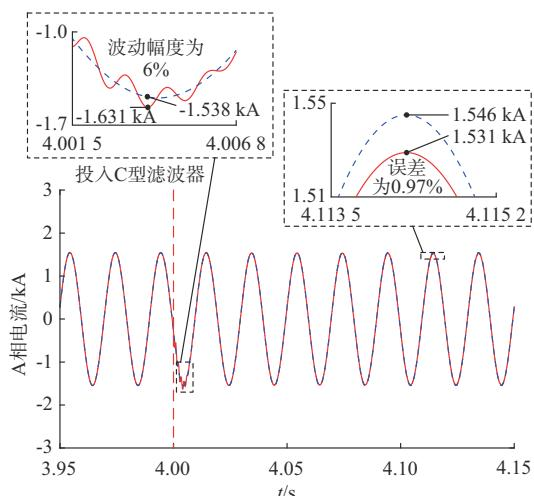

(b) " 3A,*"   
(d) ,-CK" 3A,*"   
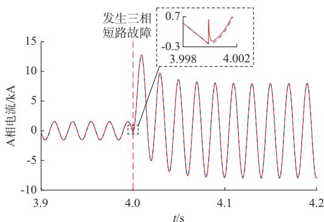  
C$" C$"

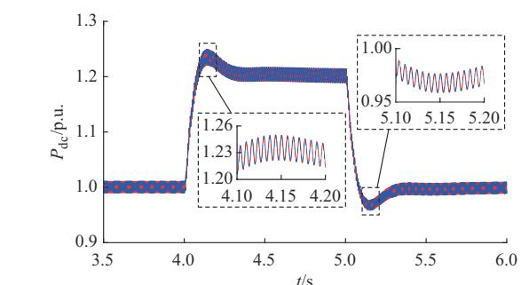  
图4 C型滤波器对系统的影响  
Fig. 4 Influence of C-type filter on system   
(c)C型滤波器对系统功率阶跃的影响

阶跃的影响如图4（c）所示。在4 s和5 s时分别突增和突降直流侧功率，两种情况下的系统功率阶跃波形保持一致。

4 s时，在交流母线 PCC 处施加三相短路接地故障，交流母线电流波形（以A相为例）如图4（d）所示，对比投入与未投入C型滤波器的情况，两者仅在故障发生瞬时存在差异，之后故障电流保持一致。因此，投入C型滤波器对系统的暂态特性基本没有影响。

流经 C 型滤波器的基频电流 I 主要由 $C _ { \mathrm { Z 1 } }$ 决定，此时滤波器基频有功损耗 $P _ { \mathrm { { C } } }$ 可由式（12）表示。

$$
\left\{ \begin{array}{l} I _ {\mathrm {C}} = \mathrm {j} 2 \pi f _ {1} C _ {\mathrm {Z l}} u _ {\mathrm {p h}} \\ P _ {\mathrm {C}} = \left(\frac {\mathrm {j} 2 \pi f _ {1} L _ {\mathrm {Z}} + \frac {1}{\mathrm {j} 2 \pi f _ {1} C _ {\mathrm {Z l}}}}{R _ {\mathrm {Z}} + \mathrm {j} 2 \pi f _ {1} L _ {\mathrm {Z}} + \frac {1}{\mathrm {j} 2 \pi f _ {1} C _ {\mathrm {Z l}}}} I _ {\mathrm {C}}\right) ^ {2} R _ {\mathrm {Z}} \end{array} \right. \tag {12}
$$

代入相应参数可算得 $I _ { \mathrm { C } }$ 为 54.94 A，而 $P _ { \mathrm { ~ C ~ } }$ 仅为$0 . 3 9 6 \times 1 0 ^ { - 7 } \mathrm { k W } .$ 。若无 $L _ { \mathrm { Z } }$ 和 $C _ { Z 2 }$ 谐振通路，C型滤波器变为一阶高通滤波器，I 全部流过 $R _ { \mathrm { Z } }$ 将产生253.53 kW 的功率损耗，增大了约 $1 0 ^ { 1 0 }$ 倍，其仿真结果如附录A图A7所示。

因上述理论分析采用有效值计算，所以附录 A图A7中有功功率的峰值应除以2后再做比较，即C型滤波器和一阶高通滤波器的基频有功损耗分别约为0.04 mW、253.6 kW，与上述理论分析一致。同样方法计算 RLC带通滤波器［18］ 及二阶高通滤波器［17］与C型滤波器的有功损耗对比如表1所示。在母线电压相同的情况下，C型滤波器的基频有功损耗远低于其他几类滤波器。附录A图A8给出了考虑系统频率出现波动时C型滤波器的有功损耗，发现在2 Hz 的 频 率 波 动 范 围 内 有 功 损 耗 最 大 值 约 为7.69 W，证明了其在降低有功损耗方面的独特优势。另外，C型滤波器同RLC带通滤波器及二阶高通滤波器的元件在基频下的容量对比如表 2所示。以C型滤波器的容量为基准进行标幺化后，可对比看出C型滤波器元件所需容量/成本要低于其他两类滤波器。

# 3. 2　高频振荡抑制有效性验证

上述参数设计是在链路延时为600 μs的基础上进行的，但采用该参数的C型滤波器应保证在延时波动 10% 的范围内依然可以有效抑制 MMC 的高频振荡现象。本小节在延时分别为 540 μs、600 μs和 $6 6 0 ~ { \mu \mathrm { s } }$ 及交流侧存在直流电压偏置这4种不同情

表1 滤波器有功损耗对比  
Table 1 Comparison of active power loss of filters   

<table><tr><td>滤波器类型</td><td>交流线电压有效值/kV</td><td>基频有功损耗/kW</td></tr><tr><td>C型滤波器</td><td>525</td><td>0.396×10-7</td></tr><tr><td>一阶高通滤波器</td><td>525</td><td>253.53</td></tr><tr><td>二阶高通滤波器</td><td>525</td><td>3.44</td></tr><tr><td>RLC带通滤波器</td><td>525</td><td>755.63</td></tr></table>

表2 滤波器元件容量对比  
Table 2 Comparison of capacities of filter   

<table><tr><td>滤波器类型</td><td>电容容量/p.u.</td><td>电感容量/p.u.</td><td>电阻容量/p.u.</td></tr><tr><td>C型滤波器</td><td>1.00</td><td>1.00</td><td>1.00</td></tr><tr><td>二阶高通滤波器</td><td>1.25</td><td>3.65</td><td>1.91×10^10</td></tr><tr><td>RLC带通滤波器</td><td>1.21</td><td>3.63</td><td>8.69×10^7</td></tr></table>

况下对 C型滤波器高频振荡抑制的有效性进行验证，前3种情况采用对称单极接线，第4种情况采用对称双极接线，如附录A图A9所示。

# 3. 2. 1　延时为 540 μs

链路延时为 540 μs时，MMC 重塑前后及交流系统的阻抗特性如附录 A 图 A10 所示。重塑前MMC与交流系统的阻抗在 1 018 Hz处存在交点，且对应的相位差大于 180°，2 416 Hz交点处对应的相位差小于 $1 8 0 ^ { \circ }$ ，因此系统将发生约20次谐波的高频振荡。重塑后MMC的相位被限制 $\ddagger \pm 9 0 ^ { \circ }$ 之间，与交流系统的相位差始终小于 $1 8 0 ^ { \circ }$ ，高频振荡将被抑制。

图5（a）为延时为540 μs时MMC的电磁暂态仿真结果，1.50 s时系统延时由 $1 5 0 ~ { \mu \mathrm { s } }$ 变为 $5 4 0 ~ { \mu \mathrm { s } }$ ，系统逐渐振荡，1.58 s时投入C型滤波器，振荡现象消失，系统恢复稳定运行。1.56 s时母线电压快速傅里叶变换（FFT）分析结果如图5（b）所示，振荡主要位于1 000 Hz处，验证了上述分析的正确性。

# 3. 2. 2　延时为 600 μs

链路延时为 600 μs时，MMC 与交流系统阻抗特性已在附录 A图 A2中给出，系统将产生约 20次谐波的高频振荡。

重塑后的MMC及交流系统的阻抗特性如附录A图A11所示，两者相位差始终小于 $1 8 0 ^ { \circ }$ ，因此可消除系统的高频振荡。图 6（a）为延时为 600 μs 时MMC 的电磁暂态仿真结果，1.50 s时系统延时由$1 5 0 ~ { \mu \mathrm { s } }$ 变为 $6 0 0 ~ { \mu \mathrm { s } }$ ，系统逐渐振荡，1.55 s时投入 C型滤波器，振荡被抑制，系统恢复稳定，1.53 s时母线电压FFT分析结果如图6（b）所示，验证了振荡主要位于 1 000 Hz 处。

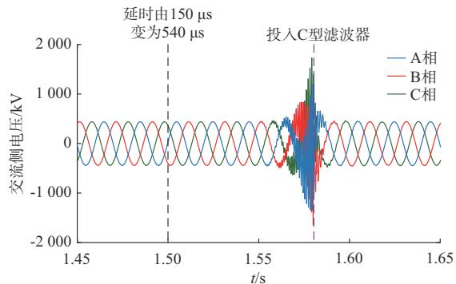  
(a) " 3*

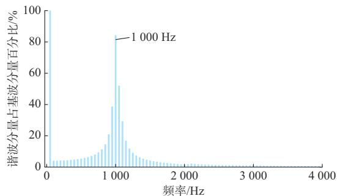  
(b) 3*FFT3   
图5　延时为 ${ \bar { \mathbf { s 4 0 } } } \ { \boldsymbol { \mu } } \mathbf { s }$ 时MMC的电磁暂态仿真结果

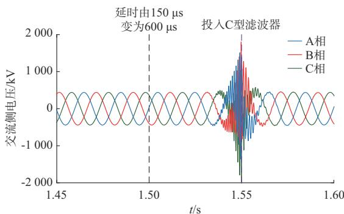  
Fig. 5 Electromagnetic transient simulation results of MMC with 540 μs delay   
(a) " 3*

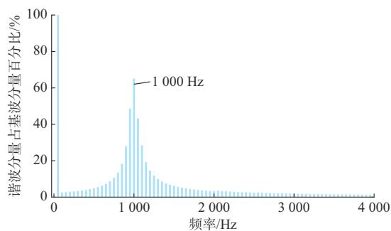  
(b) 3*FFT3   
图6　延时为 ${ \bf 6 0 0 } _  \mathrm { ~ \} } \mu { \bf s }$ 时MMC的电磁暂态仿真结果  
Fig. 6 Electromagnetic transient simulation results of MMC with 600 μs delay

# 3. 2. 3　延时为 660 μs

链路延时为 660 μs时，MMC 重塑前后及交流系统的阻抗特性如附录 A 图 A12 所示。重塑前MMC与交流系统的阻抗在 998 Hz和 2 427 Hz处存在交点，且对应相位差均大于 ， 处也存在交点，但其相位差小于 180°，因此系统将产生约20次和49次谐波的高频振荡。重塑后，MMC的负

阻尼频段被消除，故可抑制系统的高频振荡。

延时为660 μs时MMC的电磁暂态仿真结果如图 7（a）所示，1.50 s 时系统延时由 150 μs 变为660 μs，系统逐渐振荡，1.53 s时母线电压FFT分析结果如图 7（b）所示，振荡主要位于 1 000 Hz 和2 450 Hz处，1.55 s时投入 C型滤波器，振荡被迅速抑制。

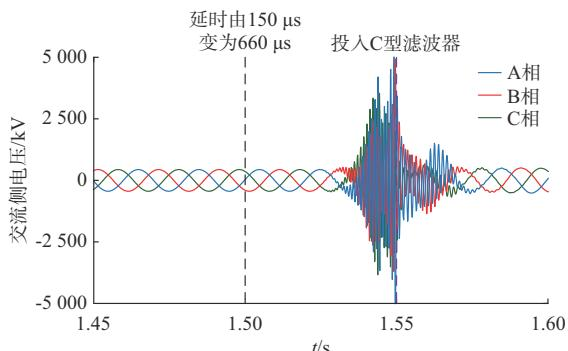  
(a) " 3*

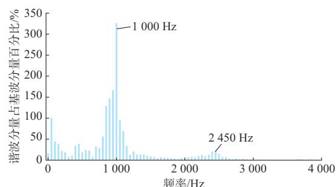  
(b) 3*FFT3   
图7　延时为 ${ \bf 6 6 0 } _ { \mathrm { ~ \textmu 5 } }$ 时MMC的电磁暂态仿真结果  
Fig. 7 Electromagnetic transient simulation results of MMC with 660 μs delay

# 3. 2. 4　交流侧存在直流电压偏置

图 8（a）为链路延时 600 μs，采用对称双极接线时的电磁暂态仿真结果， 时母线电压和电流

的 FFT分析结果如图 8（b）和（c）所示，其均存在直流分量。

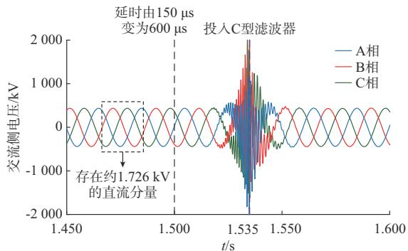

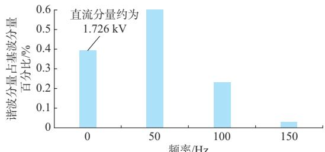  
(a) " 3*   
(b) ,"F 3*+!

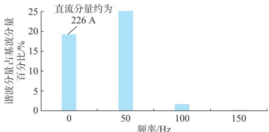  
(c) ,"F 3*"+!

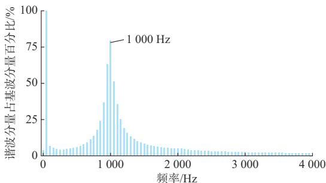  
(d) 3*FFT3   
图8　交流侧存在直流电压偏置时MMC的电磁暂态仿真结果  
Fig. 8 Electromagnetic transient simulation results of MMC with DC voltage bias on AC side

1.500 s 时 系 统 延 时 由 150 μs 变 为 600 μs，系 统逐渐振荡，1.530 s时的FFT分析结果显示振荡主要在 处，如图 （ ）所示， 时投入 型滤波器仍可抑制其振荡，从而验证了C型滤波器参数设计的可靠性和振荡抑制的有效性。

# 4 结语

针对 MMC系统的高频振荡问题，本文从减小无源装置的基频有功损耗出发，提出了在PCC处并

联C型滤波器的无源阻尼抑制策略及基于第1负阻尼频段的参数设计方法，并通过电磁暂态仿真模型验证了C型滤波器参数设计的正确性和高频振荡抑制的有效性，得到如下结论：

1）通过将C型滤波器的 $C _ { \mathrm { Z 2 } }$ 和 $L _ { \mathrm { z } }$ 设计为基频谐振，可大幅减小通过其电阻元件的基频电流，降低滤波器的基频有功损耗。  
2）所提基于第 1负阻尼频段的参数设计方法，提供了能消除 MMC负阻尼的元件参数选取范围，揭示了元件参数变化对 MMC阻抗重塑的影响，且对于每一条等相位线，取其拐点处参数可降低元件成本。  
3）所提C型滤波器及其参数设计方法能有效抑制 MMC在一定延时范围内的高频振荡，且不会对系统的稳态和暂态特性产生影响。

下一步的研究重点是将有源、无源抑制策略相结合以减小无源装置的成本，同时抑制系统的高频振荡。

附录见本刊网络版（http：//www.aeps-info.com/aeps/ch/index.aspx），扫英文摘要后二维码可以阅读网络全文。

# 参 考 文 献

［1］蔡旭，杨仁炘，周剑桥，等 .海上风电直流送出与并网技术综述［J］. 电力系统自动化，2021，45（21）：2-22.  
CAI Xu， YANG Renxin， ZHOU Jianqiao， et al. Review onoffshore wind power integration via DC transmission ［J］.Automation of Electric Power Systems，2021，45（21）：2-22.  
［ ］尹嘉豪，吕敬，蔡旭 柔性直流输电系统高频谐振阻尼特性分析及自适应抑制［J］.电力系统自动化，2022，46（22）：90-100.  
YIN Jiahao， LYU Jing， CAI Xu. Damping characteristic analysisand adaptive suppression for high-frequency resonance of flexibleDC transmission system ［J］. Automation of Electric PowerSystems，2022，46（22）：90-100.  
［3］徐海亮，高铭琨，吴瀚，等 .海上风电场-MMC互联系统频率耦合建模及稳定性分析［J］. 电力系统自动化，2021，45（21）：92-102.  
XU Hailiang， GAO Mingkun， WU Han， et al. Frequency-coupling modeling and stability analysis of offshore wind farm-modular multilevel converter interconnection system ［J］.Automation of Electric Power Systems，2021，45（21）：92-102.  
［4］郭贤珊，刘泽洪，李云丰，等 .柔性直流输电系统高频振荡特性分析及抑制策略研究［J］. 中国电机工程学报，2020，40（1）：19-29.  
GUO Xianshan， LIU Zehong， LI Yunfeng， et al. Characteristicanalysis of high-frequency resonance of flexible high voltagedirect current and research on its damping control strategy［J］.Proceedings of the CSEE，2020，40（1）：19-29.

［5］郭琦，郭海平，黄立滨.电网电压前馈对柔性直流输电在弱电网下的稳定性影响［J］.电力系统自动化，2018，42（14）：139-144.  
GUO Qi， GUO Haiping， HUANG Libin. Effect of grid voltagefeedforward on VSC-HVDC stability in weak power grid［J］.Automation of Electric Power Systems，2018，42（14）：139-144.  
［6］郭贤珊，刘斌，梅红明，等 .渝鄂直流背靠背联网工程交直流系统谐振分析与抑制［J］.电力系统自动化，2020，44（20）：157-164.GUO Xianshan， LIU Bin， MEI Hongming， et al. Analysis andsuppression of resonance between AC and DC systems inChongqing-Hubei back-to-back HVDC project of China ［J］.Automation of Electric Power Systems，2020，44（20）：157-164.  
［7］代锋，王钢，曾德辉，等.MMC-HVDC输电系统中高频阻抗建模及谐振机理分析［J］. 电网技术，2022，46（6）：2356-2372.  
DAI Feng， WANG Gang， ZENG Dehui， et al. Medium- &high-frequency impedance modeling and resonance mechanismanalysis of MMC-HVDC transmission system［J］. Power SystemTechnology，2022，46（6）：2356-2372.  
［8］ZOU C Y， RAO H， XU S K， et al. Analysis of resonancebetween a VSC-HVDC converter and the AC grid［J］. IEEETransactions on Power Electronics， 2018， 33（12）： 10157-10168.  
［9］杨诗琦，刘开培，秦亮，等.MMC-HVDC高频振荡问题研究进展［J］. 高电压技术，2021，47（10）：3485-3496.  
YANG Shiqi， LIU Kaipei， QIN Liang， et al. Research progressof high frequency oscillation in MMC-HVDC［J］. High VoltageEngineering，2021，47（10）：3485-3496.  
［10］韦超，林磊，朱建行，等.基于锁相优化的MMC高频振荡抑制方案研究［J］. 高电压技术，2022，48（7）：2805-2816.  
WEI Chao， LIN Lei， ZHU Jianhang， et al. Research onsuppression scheme of high-frequency oscillation of MMC basedon phase locked optimization［J］. High Voltage Engineering，2022，48（7）：2805-2816.  
［11］HUANG T，YANG F，ZHANG D H， et al. High-frequency stability analysis and impedance optimization for an MMC-HVDC integrated system considering delay effects［J］. IEEE Journal on Emerging and Selected Topics in Circuits and Systems，2022，12（1）：59-72.   
[12]冯俊杰,邹常跃，杨双飞.等.针对中高频谐振问题的柔性直流输电系统阻抗精确建模与特性分析［J］.中国电机工程学报，，（ ）： -  
FENG Junjie， ZOU Changyue， YANG Shuangfei， et al.Accurate impedance modeling and characteristic analysis ofVSC-HVDC system for mid-and high-frequency resonanceproblems［J］. Proceedings of the CSEE，2020，40（15）：4805-4820.  
［ ］冯俊杰，傅闯，邹常跃，等 V f控制下柔性直流换流器阻抗建模及中高频谐振特性分析［J］.电力系统自动化，2022，46（4）：143-152.  
FENG Junjie， FU Chuang， ZOU Changyue， et al. Impedancemodeling and mid-and high-frequency resonance characteristicanalysis for flexible DC converter with V/f control ［J］.Automation of Electric Power Systems，2022，46（4）：143-152.  
［ ］杜东冶，郭春义，贾秀芳，等 基于附加带阻滤波器的模块化多

电平换流器高频谐振抑制策略［J］.电工技术学报，2021，36（7）：1516-1525.  
DU Dongye， GUO Chunyi， JIA Xiufang， et al. Suppression strategy for high frequency resonance of modular multilevel converter based on additional band-stop filter［J］. Transactions of China Electrotechnical Society，2021，36（7）：1516-1525.   
［15］李云丰，贺之渊，孔明，等.柔性直流输电系统高频稳定性分析及抑制策略（二）：阻尼控制抑制策略［J］.中国电机工程学报，2021，41（19）：6601-6616.  
LI Yunfeng， HE Zhiyuan， KONG Ming， et al. High frequencystability analysis and suppression strategy of MMC-HVDCsystems （Part Ⅱ）： damping control suppression strategy［J］.Proceedings of the CSEE，2021，41（19）：6601-6616.  
［16］SUN J. Passive methods to damp AC power system resonanceinvolving power electronics［C］// 2018 IEEE 19th Workshopon Control and Modeling for Power Electronics （COMPEL），June 25-28，2018， Padua， Italy：1-8.  
［17］侯延琦，刘崇茹，王宇，等.柔性直流输电系统高频振荡抑制策略研究［］中国电机工程学报， ，（ ）： -  
HOU Yanqi， LIU Chongru， WANG Yu， et al. Research onthe suppression strategy of high-frequency resonance for MMC-HVDC［J］. Proceedings of the CSEE，2021，41（11）：3741-3751.  
［ ］彭意，郭春义，杜东冶 柔性直流输电的阻抗重塑及中高频振荡抑制方法［J］.中国电机工程学报，2022，42（22）：8053-8063.  
PENG Yi， GUO Chunyi， DU Dongye. Research on medium and high frequency oscillation suppression approach based on impedance tuning in flexible HVDC system［J］. Proceedings of the CSEE，2022，42（22）：8053-8063.   
［19］郭春义，彭意，徐李清，等.考虑延时影响的MMC-HVDC系统高 频 振 荡 机 理 分 析［J］. 电 力 系 统 自 动 化 ，2020，44（22）：119-126.  
GUO Chunyi， PENG Yi， XU Liqing， et al. Analysis on high-frequency oscillation mechanism for MMC-HVDC systemconsidering influence of time delay［J］. Automation of ElectricPower Systems，2020，44（22）：119-126.  
［20］陈威，汪娟娟，叶运铭，等.柔性直流输电系统交流侧中高频谐振附加阻尼抑制措施［］ 电力系统自动化， ， （ ）：151-161.  
CHEN Wei， WANG Juanjuan， YE Yunming， et al. Additionaldamping suppression measures for medium-and high-frequencyresonance on AC side of MMC-HVDC transmission system［J］.Automation of Electric Power Systems， 2021， 45 （18） ：151-161.  
［21］SUN J，VIETO I，LARSEN E V， et al. Impedance-basedcharacterization of digital control delay and its effects on systemstability［C］// 2019 20th Workshop on Control and Modelingfor Power Electronics （COMPEL） ， June 17-20， 2019，Toronto， Canada：1-8.  
［ ］蔡雨希，何英杰，陈涛，等 基于粒子群的三电平并网逆变器滤波参数的高效精确设计方法［］中国电机工程学报，2020.40(20):6663-6674.  
CAI Yuxi， HE Yingjie， CHEN Tao， et al. Efficient and

accurate design method of LCL filter for three-level gridconnected inverter based on particle swarm optimization［J］. Proceedings of the CSEE，2020，40（20）：6663-6674.   
［23］ZHANG G B， WANG Y， XU W， et al. Characteristicparameter-based detuned C-type filter design［J］. IEEE Powerand Energy Technology Systems Journal，2018，5（2）：65-72.

刘春震(1999—)，男，硕士研究生，主要研究方向：柔性直流输电系统稳定性分析及控制。E-mail：nerlcz@163.com

徐海亮(1985—)，男，博士，教授，硕士生导师，主要研究方向：新能源发电及微电网。E-mail：xuhl@upc.edu.cn  
高铭琨(1997—)，男，硕士研究生，主要研究方向：模块化多电平换流器建模与控制。E-mail：gaomk_upc@163.com  
葛平娟(1996—)，女，通信作者，博士，讲师，主要研究方向 ：新 能 源 并 网 稳 定 性 分 析 及 控 制 。 E-mail：gepingjuan@upc.edu.cn

（编辑 蔡静雯）

# High-frequency Oscillation Suppression and Parameter Design Method for Modular Multilevel Converter Based on C-type Filter

LIU Chunzhen， XU Hailiang， GAO Mingkun， GE Pingjuan

(College of New Energy, China University of Petroleum (East China), Qingdao 266580, China)

Abstract: The flexible DC transmission system based on the modular multilevel converter (MMC) has negative damping characteristics in its high-frequency band regularly due to link delay, which is prone to interact with the impedance of the AC system and causes high-frequency oscillation. To completely eliminate the negative damping of MMC, a passive suppression method of parallel C-type filter at AC bus is proposed. By designing the series resonant branch of the C-type filter to resonate at the fundamental frequency, the fundamental-frequency active power loss of the filter can be reduced. In addition, a parameter design method based on the first negative damping frequency band is proposed, and the component cost is considered in the parameter selection. The electromagnetic transient simulation results show that the proposed C-type filter and its parameter design method can significantly reduce fundamental-frequency active power loss, effectively suppress the high-frequency oscillation of MMC, and will not affect the steady-state and transient characteristics of the system.

This work is supported by Shandong Provincial Natural Science Foundation of China (No. ZR2020ME202).

Key words: flexible DC transmission; modular multilevel converter (MMC); passive damping; impedance reshaping; highfrequency oscillation suppression; parameter design

