# Acceleration of electromagnetic transient simulations in modelica using spatial data locality

A. Masoom a,* , T. Ould-Bachir b , J. Mahseredjian a , A. Guironnet c

a Department of Electrical Engineering, Polytechnique Montr´eal, Montr´eal, Canada   
b Department of Computer Engineering, Polytechnique Montr´eal, Montr´eal, Canada   
c Department of Research and Development, R´eseau de Transport d’Electricit ´ ´e, Paris, France

# A R T I C L E I N F O

Keywords:

Modelica

Acausal modeling

Data locality

Electromagnetic transients

Transmission line modeling

IEEE 39-bus Benchmark

# A B S T R A C T

This paper presents a new approach to boost the performance of Modelica-based electromagnetic transient (EMT) simulations by improving the data spatial locality of the wideband (WB) and constant parameter (CP) line models. In this approach, the transmission line (TL) models of a network, which account for an important portion of large-scale electrical networks, are clustered into a line block model to increase the data locality of the computations. The paper also investigates the advantage brought by passing the computations of the delay function of the line models to an external vectorized C code. The accuracy and performance of the proposed method are validated using the IEEE 39-bus benchmark. The results show an improvement in the simulation times compared with the conventional Modelica approach.

# 1. Introduction

Classical EMT-type simulation tools are programmed using imperative programming languages in which values are assigned to functions, the sequence of execution of these functions is declared, as is done for example in C/C+ or Fortran. In such programs, model equations are tightly coupled with numerical solution methods. This characteristic complicates the model development process. The development of equation-based object-oriented declarative languages [1] with a higher level of abstraction such as Omela [2], Simscape [3], and Modelica [4] provide a convenient framework for modelers. In this paradigm, models are coded in terms of differential-algebraic equations (DAE) at high-level abstraction, which significantly eases the actual modeling process.

The Modelica language has become increasingly popular for dynamic physical simulations in the last decade. A lot of work has been carried out for developing the language and enhancing its applications. In the field of power systems, the language was first used for phasor domain studies such as transient stability and short-circuit studies using the libraries such as iPSL [5], PowerGrids [6]. The accuracy and performance of these packages are comparable with the specific domain

simulators. Full compatibility with FMI standard [7] including model exchange [8,9] and convenient and efficient co-simulation [10,11] have made the language more popular in the power community. Moreover, Modelica interoperability [4] with the languages C, Python, and Julia mitigates the drawbacks of the language in the simulation of very complex systems [12,13].

Modelica was initially explored for transmission line modeling (i.e., wideband [14], and CP-line models) in [15] for EMT-type simulations. Then the work was developed for the creation of an EMT-detailed library, called MSEMT [16], with a large set of components required for simulation of the IEEE 39-bus and IEEE 118-bus benchmarks [17]. The library includes the synchronous machine model with magnetic saturation and other nonlinear models [18]. In all experiments, the simulation speed of large-scale circuits is recognized as the key drawback in Modelica. The general solutions are based on numerical optimizations, e.g., Jacobian optimization [19] and simulation in DAE mode [20]. A solution was proposed in [21] specifically for power electric simulations based on hybrid coding of Modelica and C++. The solution is tailor-made for EMT simulations and described in [22]. Although it produced a better performance compared with pure Modelica, there is still a gap in comparison with classical EMT-type simulators, such as

EMTP® [23]. In most cases, the Modelica built-in delay operator had the main impact on the CPU time [18].

This paper presents a new technique relying on data locality [24] for transmission line modeling to boost the run time performance. Data spatial locality refers to the property of accessing data adjacent to recently accessed data. This technique focuses on cache performance optimization and makes the hierarchical memory layout more profitable to speed up data accesses. In the proposed technique, spatial locality is achieved through larger block sizes via exploitation of a single line block model instead of several line models (so-called original method in this paper). In this technique, the variables and parameters used in the line models are arranged in one-dimensional arrays to provide faster accessibility. This technique is implemented and numerically tested using the IEEE 39-bus network [17]. It is demonstrated that the algorithm yields numerically stable and more efficient results.

The paper is organized as follows. In Section II, the theoretical aspects of transmission line modeling are recalled. Then, the strategy of line-block models is explained in Section III. The implementation and Modelica codes are presented in Section IV. The simulation and numerical results are provided in Section V.

# 2. Transmission line formulation

This section aims to recall the theoretical background for the wideband (WB) and constant-parameter (CP) line models.

# 2.1. WB-Line model

The WB-line model [14] is a highly accurate phase-domain model for lines/cables since it considers the full frequency dependency of parameters. The state-space equations of the WB-line model for k-end are given below. These equations are directly used for coding the WB model in Modelica.

$$
\mathbf {i} _ {k} = \mathbf {i} _ {s h, k} - 2 \mathbf {i} _ {k i} \tag {1}
$$

$$
\mathbf {i} _ {s h, k} = \mathbf {G} _ {0} \mathbf {v} _ {k} + \sum_ {i = 1} ^ {N _ {y}} \mathbf {W} _ {i} \tag {2}
$$

$$
\frac {d \mathbf {w} _ {i}}{d t} = q _ {i} \mathbf {w} _ {i} + \mathbf {G} _ {i} \mathbf {v} _ {k} \tag {3}
$$

$$
\mathbf {i} _ {k i} = \sum_ {g = 1} ^ {N _ {g}} \sum_ {i = 1} ^ {N _ {b} (g)} \mathbf {x} _ {g, i} \tag {4}
$$

$$
\frac {d \mathbf {x} _ {g , i}}{d t} = p _ {g, i} \mathbf {x} _ {g, i} + \mathbf {R} _ {g, i} \mathbf {i} _ {m r} (t - \tau_ {g}) \tag {5}
$$

$$
\mathbf {i} _ {m r} = \mathbf {i} _ {m i} + \mathbf {i} _ {m} \tag {6}
$$

where $\mathbf { i } _ { k }$ is the vector of injected current into the k-end, $\mathbf { i } _ { s h , k }$ and $\mathbf { i } _ { k i }$ are the vectors of shunt and incident currents, $\mathbf { i } _ { m r }$ is the reflected current from the m-end. ${ \bf G } _ { 0 }$ is a constant residue at the infinite frequency, qi represents ith pole, $\mathbf { G } _ { i }$ is the corresponding matrix of residues, $N _ { y }$ is the order of fitting, $N _ { g }$ is the number of modes, $N _ { h } ( g )$ denotes the number of poles used to fit the gth modal propagation matrix, $p _ { g , i }$ i is the fitting pole, $\tau _ { g }$ is the time delay of the gth mode and $\mathbf { R } _ { g , i }$ is the matrix of residues. Similar equations are obtained by interchanging the subscript for m-end.

# 2.2. CP-Line model

An N-phase CP-line model is described by two separate Norton equivalents [25]. In phase domain, the vectors of voltage $\left( \mathbf { v } _ { k } \right)$ and current $( \mathbf { i } _ { k } )$ at the k-end are related to the history current vector $( \mathbf { i } _ { k } ^ { h i s t } )$ by:

$$
\mathbf {v} _ {k} = \mathbf {Z} _ {m d f} \left(\mathbf {i} _ {k} + \mathbf {i} _ {k} ^ {\text {h i s t}}\right) \tag {7}
$$

knowing that:

$$
\mathbf {Z} _ {m d f} = \mathbf {T} _ {v} \mathbf {Z} _ {m d f, m o d} \mathbf {T} _ {i} ^ {- 1} \tag {8}
$$

$$
\mathbf {Z} _ {m d f, m o d} = \mathbf {Z} _ {c, m o d} + \frac {\mathbf {R} _ {m o d}}{4} \tag {9}
$$

$$
\mathbf {Z} _ {c, m o d} = \sqrt {\mathbf {L} _ {m o d} ^ {\prime} / \mathbf {C} _ {m o d} ^ {\prime}} \tag {10}
$$

The modal transformation is used to transform voltages and currents from modal (mod) to phase domain, $\begin{array} { r } { \mathbf { v } = \mathbf { T } _ { \nu } \mathbf { v } _ { m o d } } \end{array}$ and $\begin{array} { r } { \mathbf { i } = \mathbf { T } _ { i } \mathbf { i } _ { m o d } , } \end{array}$ where $\mathbf { T } _ { i } = [ \mathbf { T } _ { \nu } ^ { t } ] ^ { - 1 }$ and t indicates the transposition. In the above equations, $\mathbf { Z } _ { m d f , m o d }$ is the modified surge impedance, $\mathbf { Z } _ { c , \ m o d }$ the surge impedance, ${ \bf L } _ { m o d } ^ { ' }$ and $\mathbf { C } _ { m o d } ^ { ' }$ respectively represent the inductance and capacitance of TL in per unit length and $\mathbf { R } _ { m o d }$ is the resistance, all in modal domain. The Norton current source at the k-end is computed by:

$$
\begin{array}{l} \mathbf {i} _ {k, m o d} ^ {h i s t} = + \mathbf {k} _ {\nu 1} \mathbf {v} _ {k, m o d} (t - \boldsymbol {\tau} _ {m o d}) \\ - \mathbf {k} _ {i 1} \mathbf {i} _ {k, m o d} ^ {h i s t} (t - \tau_ {m o d}) \tag {11} \\ + \mathbf {k} _ {\nu 2} \mathbf {v} _ {m, m o d} (t - \boldsymbol {\tau} _ {m o d}) \\ - \mathbf {k} _ {i 2} \mathbf {\Pi} _ {m, m o d} ^ {h i s t} (t - \boldsymbol {\tau} _ {m o d}) \\ \end{array}
$$

The coefficient vectors are defined as:

$$
\mathbf {k} _ {\nu 1} = \frac {\mathbf {I} - \mathbf {h} _ {m o d}}{2} \frac {\mathbf {I} + \mathbf {h} _ {m o d}}{\mathbf {Z} _ {m d f , m o d}} \tag {12}
$$

$$
\mathbf {k} _ {\nu 2} = \frac {\mathbf {I} + \mathbf {h} _ {m o d}}{2} \frac {\mathbf {I} + \mathbf {h} _ {m o d}}{\mathbf {Z} _ {m d f , m o d}} \tag {13}
$$

$$
\mathbf {k} _ {i 1} = \frac {\mathbf {I} - \mathbf {h} _ {m o d}}{2} \mathbf {h} _ {m o d} \tag {14}
$$

$$
\mathbf {k} _ {i 2} = \frac {\mathbf {I} + \mathbf {h} _ {m o d}}{2} \mathbf {h} _ {m o d e} \tag {15}
$$

$$
\mathbf {h} _ {\text {m o d}} = \frac {\mathbf {Z} _ {c , \text {m o d}} - \mathbf {R} _ {\text {m o d}} / 4}{\mathbf {Z} _ {c , \text {m o d e}} + \mathbf {R} _ {\text {m o d}} / 4} \tag {16}
$$

$$
\boldsymbol {\tau} _ {m o d} = \ell \sqrt {\mathbf {L} _ {m o d e} ^ {\prime} \mathbf {C} _ {m o d} ^ {\prime}} \tag {17}
$$

where I denotes the identity matrix, $\tau _ { m o d }$ represents the modal traveling time from one end (k) to the other end and l is the length of TL. Similar equations are obtained by interchanging the subscript for m-end.

# 3. Strategy description

In this section, the proposed method is elaborated for a three-phase system due to the adequacy for our test case, but it is easily expandable to an m phase system.

# 3.1. WB-Line-Block model

Assuming our network contains n-TLs, each three-phase, Fig. 1 il lustrates the scheme of proposed method using the WB-line-block model. In this method, n-TLs are clustered into a single block model. The purpose is to share the memory space for all variables and parameters of the model. Table 1 shows the difference between the number and size of arrays in the original and proposed schemes for the WB-line model.

# 3.2. CP-Line-Block model

In the method described in [15], the entire CP-line equations, i.e.

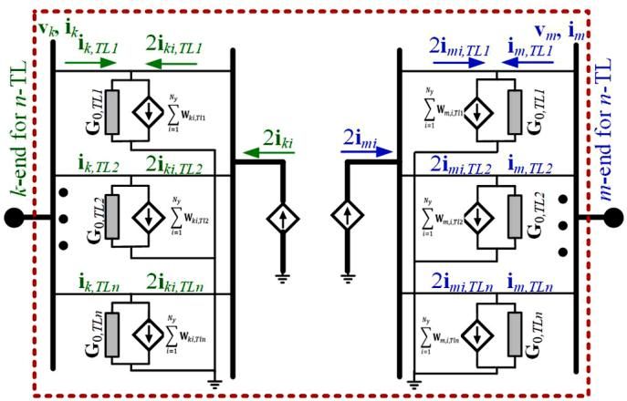  
A circuit with a transmission line Block   
Fig. 1. WB-line-block model structure; a Modelica class containing n-TLs.

Table 1 Difference between the number and size of arrays in original and proposed schemes for the WB-line model.   

<table><tr><td>End</td><td>Original scheme</td><td>Proposed scheme</td></tr><tr><td>k-</td><td>n × {ik[3], vk[3], iki[3], ikr[3], ish,k[3]}</td><td>ik[3n], vk[3n], iki[3n], ikr[3n], ish,k[3n]</td></tr><tr><td>m-</td><td>n × {im[3], vm[3], imi[3], imr[3], ish,m[3]}</td><td>im[3n], vm[3n], imi[3n], imr[3n], ish,m[3n]</td></tr></table>

(7)-(17), are coded in an acausal declarative approach, and the Modelica built-in function delay() is used for computation of (11). Thus, it is required to compute the history currents and terminal voltages at m and k-sides for each mode at t − $\tau _ { m o d }$ . Totally, the number of delay() functions is 4N for an N-phase CP-line model. The voltage and current values are stored in a ring buffer with a FIFO (first in, first out) data structure; hence, the maximum traveling time that can be represented is the time step multiplied by the number of locations in the buffer. Although, this method reflects the CP-line equations and is under standable, it results into a longer CPU time.

In the proposed method, (11) is optimized as follows:

$$
\mathbf {i u} _ {k, m o d e} ^ {h i s t} (t) = + \mathbf {k} _ {\nu 1} \mathbf {v} _ {k, m o d e} (t)
$$

$$
- \mathbf {k} _ {i 1} \mathbf {i} _ {k, m o d e} ^ {h i s t} (t) \tag {18}
$$

$$
+ \mathbf {k} _ {\nu 2} \mathbf {v} _ {m, \text {m o d e}} (t)
$$

$$
- \mathbf {k} _ {i 2 ^ {\prime} m, \text {m o d e}} ^ {h i s t} (t)
$$

$$
\mathbf {i} _ {k, \text {m o d e}} ^ {\text {h i s t}} (t) = \mathbf {i u} _ {k, \text {m o d e}} ^ {\text {h i s t}} (t - \tau_ {\text {m o d e}}) \tag {19}
$$

where $\mathbf { i u } _ { k , m o d e } ^ { h i s t }$ is the undelayed history current at k-end. This optimization reduces by half the utilization of the delay() function and results in lower computational cost and memory usage.

Assuming a network contains n three-phase TLs, Fig. 2 illustrates the computations scheme implemented for the CP-line-block model. Table 2 shows the difference between the number and size of arrays in the original and proposed schemes for the CP-line model.

Using the scheme, (7) can be reformulated for n-TL as below:

$$
\left[ \begin{array}{c} \mathbf {v} _ {k, T L 1} \\ \vdots \\ \mathbf {v} _ {k, T L n} \end{array} \right] = \left[ \begin{array}{c} Z _ {m d f, T L 1} \\ \vdots \\ Z _ {m d f, T L n} \end{array} \right] \times \left(\left[ \begin{array}{c} \mathbf {i} _ {k, T L 1} \\ \vdots \\ \mathbf {i} _ {k, T L n} \end{array} \right] + \left[ \begin{array}{c} \mathbf {i} _ {k, T L 1} ^ {\text {h i s t}} \\ \vdots \\ \mathbf {i} _ {k, T L n} ^ {\text {h i s t}} \end{array} \right]\right) \tag {20}
$$

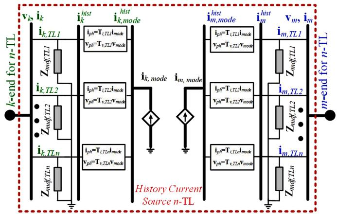  
A circuit with a transmission line Block   
Fig. 2. CP-line-block model structure; a Modelica class containing n-TLs.

Table 2 Difference between the number and size of arrays in original and proposed schemes for CP-line model.   

<table><tr><td>End</td><td>Original scheme</td><td>Proposed scheme</td></tr><tr><td>k-</td><td>n × {ik[3], vk[3],ith[3]}</td><td>ik[3n], vk[3n],ith[3n]</td></tr><tr><td>m-</td><td>n × {im[3], vm[3],ith[3]}</td><td>im[3n], vm[3n],ith[3n]</td></tr></table>

# 4. Implementation and programming

# 4.1. WB-Line-Block model

The implementation of the WB-line-block model in Modelica is illustrated in Fig. 3. In these codes, first, the model parameters using the keyword parameter for all TLs of the network are defined. Then, the type and size of variables are specified. The line terminals at the k and m-ends are defined by the classes Pk and Pm respectively. Each terminal contains 3n pins, and each pin is defined by two variables: voltage, v, and current, i. The vectors of Pk.pin.i and Pm.pin.i represent the injected currents into the k-and m-ends. As one can see, all variables of the model are defined as a one-dimensional array with the size of 3n to form a block of n three-phase WB-line models. In the equation section, the model equations are explicitly programmed and demonstrated. As expected from the Modelica environment, all pieces of code can be easily identified.

# 4.2. CP-Line-Block model

Fig. 4 illustrates the pure Modelica code of the CP-line-block model in conformity with (18)-(20). In these codes, first, the number of TLs (n) is determined. Then, CP-line parameters, $\mathrm { Z c } , \mathrm { r } ,$ etc. are defined. Next, model coefficients e.g., h, kv1, etc. are calculated. The CP terminals at the k and m-end are defined by the classes Plug_k and Plug_m respectively. The function zmodif is defined to calculate the $\mathbf { Z } _ { m d f }$ as per (8) and assign it as a model parameter. In these codes, vk_mod, vm_mod, ikh_mod, and ihm_mod denote the modal voltage and history current vectors at the k-and m-ends, respectively. The vectors ihk and ihm are the history currents in phase domain.

# 4.3. CP-Line-Block model with external delay function

In this section, the implementation of external C function for calculations of delay is explained. Since Modelica is a modular language and modifications of code are very straightforward; therefore, it is enough to replace the code shown by the green outline in Fig. 4 with the code illustrated in Fig. 5. In this figure, the function cpDelayBlockUpdate

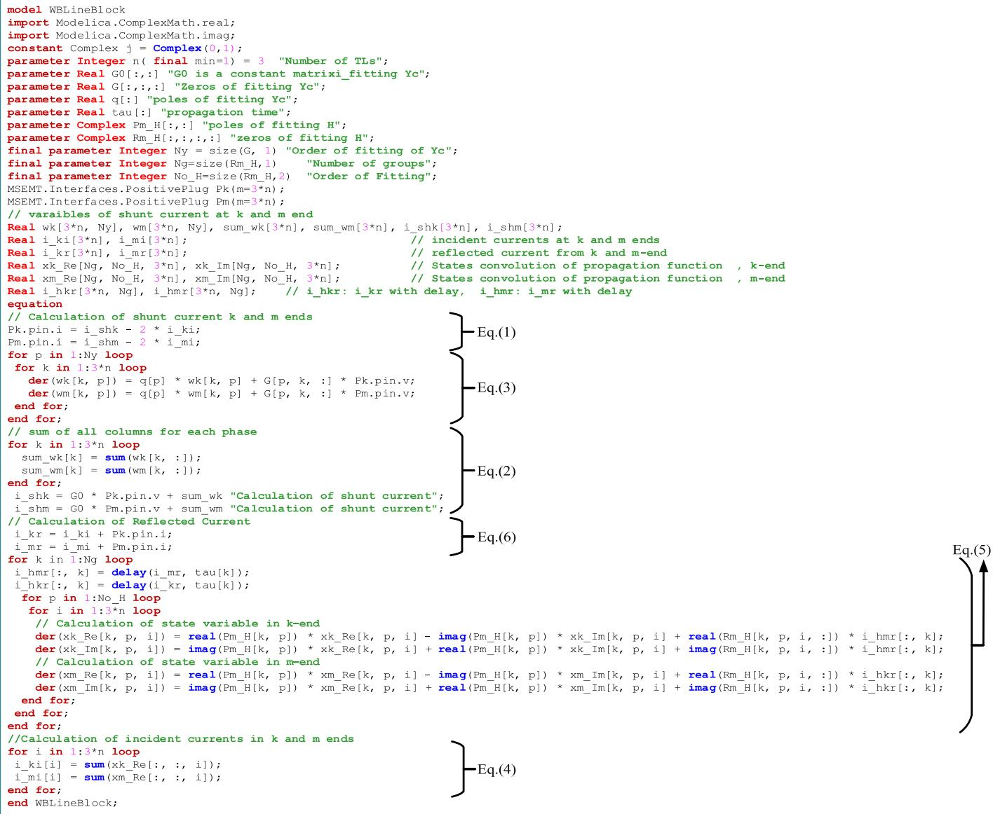  
Fig. 3. WB-line-Block model implemented in Modelica.

is used to compute the modal history currents, ihk_mod and ihm_mod through the undelayed history terms iuhk_mod and iuhm_mod using the delay parameter tau in a vectorized form. This part of the code is implemented as an assignment and distinguished from equations by “:=”. The assignments are defined after the keyword algorithm. Fig. 6 shows the codes of the CpDelayBlockclass which calls the external C constructor "initializeCpDelayBlock" and destructor “cpDelayBlock”. The function constructor is used to allocate the memory for the computation and initialization of the external object at instantiation. The cpDelayBlockUpdate function is called by the Modelica at the run-time exactly once before the first use of the object. In the same way, the destructor is called at the end of the simulation to deallocate the memory of the external object. Fig. 7 shows the cpDelayBlockUpdate function which is qualified with the impure keyword. For Modelica compiler, this means that the function should not be treated as a purely mathematical function. This function is to invoke the external C function updateCpDelay for computation of (19) in a vectorized form. It should be reminded that the built-in Modelica delay() function supports only scalar variables. Moreover, in the implementation of the delay function in C, the codes and algorithms of computations are optimized to save the memory.

# 5. Numerical results and discussion

This section presents simulation results of the modified IEEE 39-bus benchmark system [17] to validate the accuracy and performance of the proposed technique i.e., using the WB- and CP- line-block models as described in the previous section against the original method i.e., WB-and CP-line model. The same test case is also simulated with EMTP® [23] as the reference software. Numerical tests are performed using the variable-step IDA [26] solver with the tolerance of 1e-6 in Open-Modelica and Trapezoidal/Backward Euler integrator with a step size of 25 µs in EMTP®. Simulation of this circuit using the fixed-step solver, i. e., Trapezoidal method in OpenModelica and using the DAE mode in OpenModelica and Dymola environments does not converge due to the nonlinearities. Moreover, the simulation using the DASSL [27] solver offers a longer time than IDA solver in OpenModelica and is not considered in this paper.

For testing the performance of the proposed method, a PC with Intel (R) Core (TM) i7-7820X CPU @ 3.60 GHz, 3600 MHz, 8 cores, 16 processors, 16 GB is used.

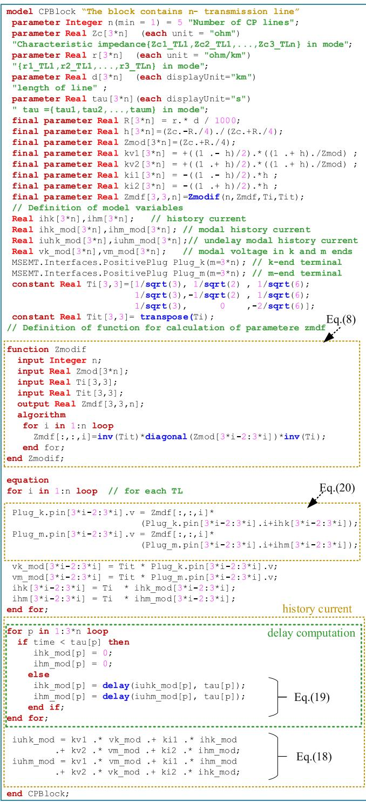  
Fig. 4. Implementation of block of n-transmission line in Modelica.

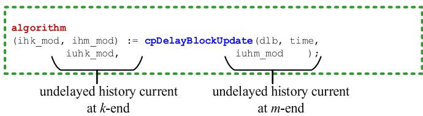  
Fig. 5. Calling the delay and history current functions.

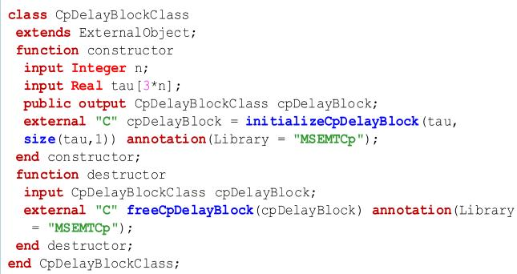  
Fig. 6. The class of CpDelayBlockClass including a constructor/destructor.

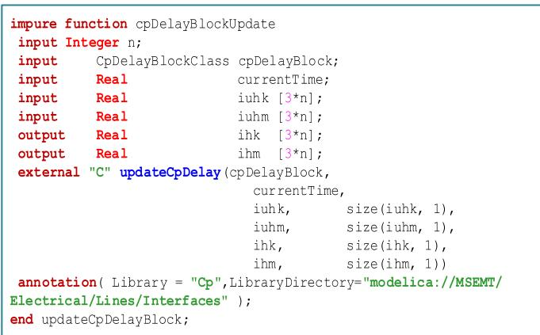  
Fig. 7. Calculation of delay through an external function in C.

# 5.1. Analysis of WB-line-block model

Fig. 8 (a) shows the IEEE 39-bus circuit designed by the MSEMT library [16]. Fig. 8 (b) shows the same circuit using the WB-line-block model. As one can see, each terminal of the model is connected to a plug demuxer to convert the one-input plug to 34 output plugs. Each output represents a terminal of a single TL which should be connected to an appropriate bus. The IEEE 39-bus circuit embeds 34 transmission lines, 10 power plants each including a synchronous machine, machine controls, and transformer. There are 19 load transformers with static load models. The circuit contains 87 nonlinear inductors. The vector fitting parameters of the WB-line model for TLs of IEEE 39-bus are calculated in EMTP for 8 decades starting at f = 0.1Hz. The maximum orders of fitting for the propagation matrix, $N _ { i } ^ { \mathbf { H } }$ , and admittance matrix, $N _ { \mathbf { Y } _ { c } } ,$ , are 7 and 9, respectively.

The transient response scenario is a temporary phase-to-phase fault that occurs on phases a and b of TL_14_15 near B15 at t=100 ms followed by the isolation of the line at t=200 ms (i.e., breakers BRm and BRk open simultaneously after 6 cycles). The line is reconnected at t=450 ms. Reenergizing the TL introduces high-frequency transient oscillations.

# 5.1.1. Accuracy validation

The waveforms of the phase voltage at the m-end of TL_14_15 are presented in Fig. 9 (a) In this figure, the results obtained from the proposed method are compared with the original method and the ones obtained from EMTP. Fig. 9 (b) and (c) show the zoomed plots of the various waveforms after removing the fault and re-energization of faulted TL. It can be observed that the solution points obtained from the proposed method are identical to those from the original method, demonstrating that time-domain simulations using the proposed approach remain accurate. These solutions are superimposed with EMTP, with a negligible difference that stems from differences in

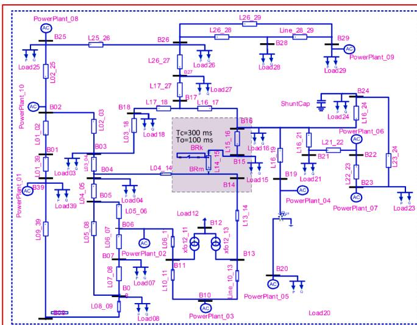  
(a)

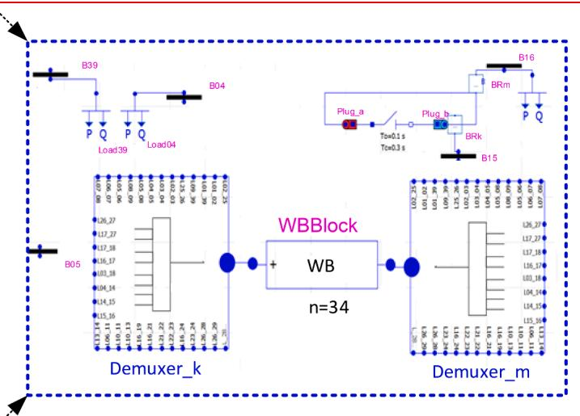

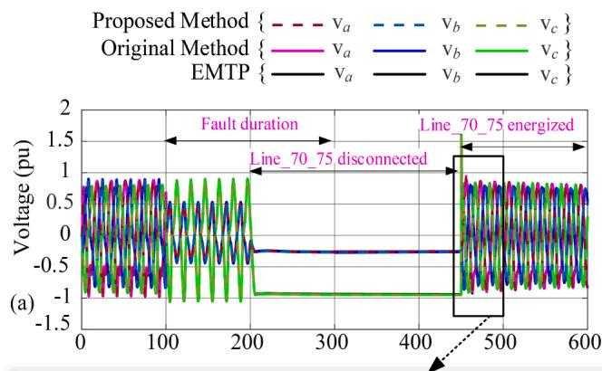  
Fig. 8. IEEE 39-bus benchmark designed using MSEMT library in OpenModelica (a): with the WB-line models. (b): with the WB-line-block model that substitutes for all WB-line models of network. The connections between the lines are defined by scripting the code and are not displayed here.

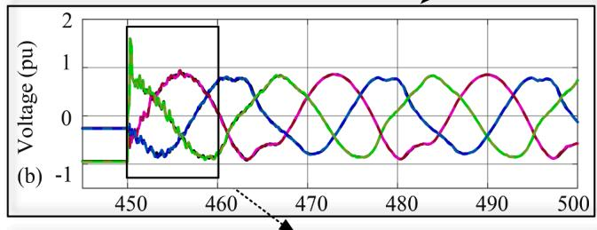

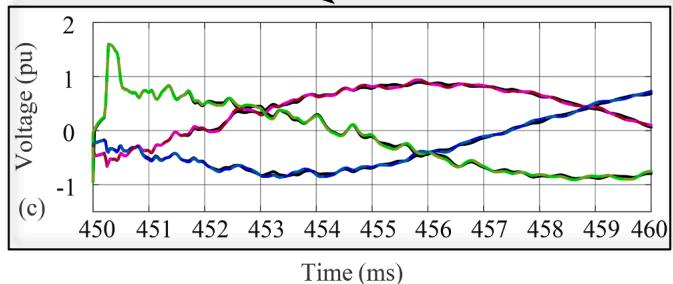  
Fig. 9. (a): Voltage waveforms at the m-end of TL_14_15 using WB-line model. (b): the zoom-in view after the reconnection of faulted TL. (c): the zoom-in plot of high frequency transients after removing the fault and re-energization of transmission line.

solution procedures/methods and discontinuity treatment between the two simulation tools.

# 5.1.2. Computation efficiency

Table 3 compares the performance of simulations for the proposed method, original method [16], and EMTP incorporating the WB-line model. The proposed and original methods contain 19 802 and 24 735 DAEs respectively, which shows a 19.9% decrease in the number of equations. However, the proposed method has not any impact on the number of time steps, but it causes a slight decrease in the number of ordinary differential functions and Jacobian evaluations i.e., 4.5% and 3.65% respectively. Concerning the impact of the proposed method on CPU-time, an improvement of 36.82% is observed compared to the original method. However, a considerable gap still exists between the proposed method and EMTP.

# 5.2. Analysis of CP-line-block model

For the analysis of effects of the proposed method on the CP-line model, the same circuit is simulated once again incorporating the CPline-block model in OpenModelica. The same scenario is also repeated for this case. The simulation parameters are identical to the previous case study.

Table 3 Comparison of simulations between proposed and original methods incorporating WB-model.   

<table><tr><td>Characteristics</td><td>Proposed method with WB-block</td><td>Original method</td><td>EMTP</td></tr><tr><td>No. of acausal DAEs</td><td>19802</td><td>24735</td><td>-</td></tr><tr><td>Solver</td><td>IDA</td><td>IDA</td><td>Trap/BE</td></tr><tr><td>Tolerance</td><td>1e-6</td><td>1e-6</td><td>-</td></tr><tr><td>Step size (Δt)</td><td>-</td><td>-</td><td>25 μs</td></tr><tr><td>No of time-steps</td><td>317315</td><td>317315</td><td>34741</td></tr><tr><td>ODE function evaluations</td><td>437914</td><td>458837</td><td>-</td></tr><tr><td>Jacobian evaluations</td><td>37908</td><td>39348</td><td>-</td></tr><tr><td>CPU time (s)</td><td>6117</td><td>9682</td><td>26.4</td></tr><tr><td>CPU-time for 1 step (ms)</td><td>19.27</td><td>30.51</td><td>0.75</td></tr><tr><td>Performance ratio</td><td>1</td><td>0.631</td><td>231</td></tr></table>

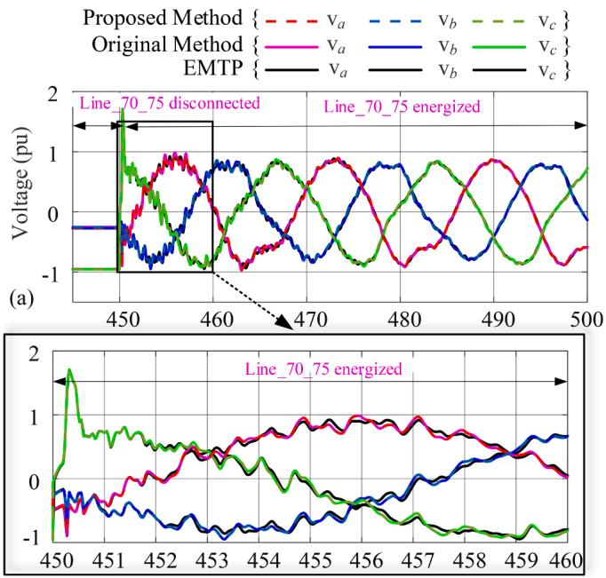  
  
Time (ms)   
Fig. 10. (a): Voltage waveforms at the m-end of TL_14_15 using CP-line model. (b): the zoom-in plot of high frequency transients after removing the fault and re-energization of transmission line.

# 5.2.1. Accuracy validation

Fig. 10 illustrates the simulation results and presenting the waveforms of the phase voltage at the m-end of TL_14_15 when the fault is cleared, and the transmission line is re-energized. This interval is selected because of high-frequency transients. As one can see, the results obtained from CP-line block model agree with ones from Modelica original model. However, slight differences are observed between result obtained from Modelica and EMTP (denoted by black curves). These differences are justified by different type and precisions of solvers. Comparision of Figs. 9 (c) with 10 (b) shows the high-frequency transients in the circuit incorporating WB-line model damp out much faster that CP-line model.

# 5.2.2. Computation efficiency

Table 4 shows the numerical characteristics of this simulation. Similar to the previous test, a 17.8% decrease in the number of equations is observed. The new method causes a slight decrease in the number of ordinary differential functions and Jacobian evaluations as well, i.e., 4.89% and 3.7% respectively. Regarding the CPU-time, the CP-lineblock model boosts the simulation time by 42.37%.

# 6. Conclusion

This paper proposed a new approach for the acceleration of computations in the electromagnetic transient simulations in the Modelica environment. The new approach relies on the data spatial locality and interoperability of Modelica and C for the computations of delayed variables in the vector form. In this method, a vectorized block of line model is proposed to be used instead of n-single line models in a network with n-transmission lines. The method has been described and imple mented through the IEEE 39-bus grid incorporating WB and CP-line models, resulting into significant improvement in simulation speed without any accuracy compromise. The speedup is dependent on the model structure. The accuracy of this method is identical to those from the original method.

Future work will focus on using the automatic conversion of original Modelica models to the proposed approach models, a Python application

Table 4 Comparison of simulations between proposed and original methods incorporating CP- model.   

<table><tr><td>Characteristics</td><td>Proposed method with CP-block</td><td>Original method</td><td>EMTP</td></tr><tr><td>No. of acausal DAEs</td><td>14 747</td><td>17 941</td><td>-</td></tr><tr><td>Solver</td><td>IDA</td><td>IDA</td><td>Trap/BE</td></tr><tr><td>Tolerance</td><td>1e-6</td><td>1e-6</td><td>-</td></tr><tr><td>Step size (Δt)</td><td>-</td><td>-</td><td>25 μs</td></tr><tr><td>No of time-steps</td><td>38 945</td><td>38 945</td><td>34 741</td></tr><tr><td>ODE function evaluations</td><td>124 611</td><td>131 025</td><td>-</td></tr><tr><td>Jacobian evaluations</td><td>31 292</td><td>32 494</td><td>-</td></tr><tr><td>CPU time (s)</td><td>215.7</td><td>374.3</td><td>12.7</td></tr><tr><td>CPU-time for 1 step (ms)</td><td>5.53</td><td>9.61</td><td>0.374</td></tr><tr><td>Performance ratio</td><td>1</td><td>0.57</td><td>16.9</td></tr></table>

can be developed to read the original Modelica models, then transform them to the optimized Modelica model before compiling the whole model. The future work will also focus on the parallelization of the Modelica model and the use of specialized computing devices such as GPU and FPGA.

# CRediT authorship contribution statement

A. Masoom: Conceptualization, Methodology, Software, Formal analysis, Validation, Writing – original draft, Investigation. T. Ould-Bachir: Methodology, Supervision, Software, Writing – review & editing. J. Mahseredjian: Supervision, Project administration, Funding acquisition, Writing – review & editing. A. Guironnet: Writing – review & editing.

# Declaration of Competing Interest

None.

# Acknowledgments

The authors would like to express their gratitude to undergraduate research intern Hamza Karoui from the Department of Computer Engineering, Polytechnique Montr´eal for his help in optimization of external delay function.

# References

[1] D. Zimmer, Equation-based Modeling of Variable-Structure Systems, Dept. Computer Sci., Univ. ETH Zurich, 2010. Ph.D. dissertation.   
[2] M. Andersson, Object-Oriented Modeling and Simulation of Hybrid Systems, Univ. Lund Institute of Technology, 1994. Ph.D. dissertation.   
[3] Simscape™ Language Guide, MathWorks, Inc., March 2021 version 5.1[Online]. Available: https://www.mathworks.com/.   
[4] Modelica® – A Unified Object-Oriented Language For Systems Modeling Language Specification Version 3.5, Modelica Association, Feb 2021 [Online] Available: https://modelica.org.   
[5] L. Vanfretti, T. Rabuzin, M. Baudette, M. Murad, iTesla Power Systems Library (iPSL): a Modelica library for phasor time-domain simulations, SoftwareX 5 (2016) 84–88.   
[6] A. Bartolini, F. Casella, A. Guironnet, Towards pan-European power grid modeling in Modelica: design principles and a prototype for a reference power system library, in: Proc. 2019 13th International Modelica Conf 157, 2011, pp. 627–636.   
[7] Function mock-up interface, [Online] Available: https://fmi-standard.org/ 2022.   
[8] L. Vanfretti, W. Li, T. Bogodorova, P. Panciatici, Unambiguous power system dynamic modeling and simulation using Modelica tools, in: Proc. 2013 IEEE PES General Meeting, 2013, pp. 1–5.   
[9] F.J. Gomez, ´ L. Vanfretti, S.H. Olsen, Binding CIM and Modelica for consistent power system dynamic model exchange and simulation, in: Proc. 2015 IEEE PES General Meeting, 2015, pp. 1–5.   
[10] M. Stifter, E. Widl, F. Andr´en, A. Elsheikh, T. Strasser, P. Palensky, Co-simulation of components, controls and power systems based on open-source software, in: Proc. 2013 IEEE PES General Meeting, 2013, pp. 1–5.   
[11] V. Liberatore, A. Al-Hammouri, Smart grid communication and co-simulation, IEEE 2011 EnergyTech (2011) 1–5.

[12] B. Lie, A. Palanisamy, A. Mengist, L. Buffoni, M. Sjolund, ¨ A. Asghar, P. Fritzson, OMJulia: an OpenModelica API for Julia-Modelica interaction, in: Proc. 2019 13th International Modelica Conf, 2019.   
[13] H. Elmqvist, M. Otter, A. Neumayr, G. Hippmann, Modia - equation based modeling and domain specific algorithms, in: Proc. 2021 14th International Modelica Conf, 2021, pp. 73–86.   
[14] I. Kocar, J. Mahseredjian, Accurate frequency dependent cable model for electromagnetic transients, IEEE Trans. Power Deliv. 31 (3) (2016) 1281–1288.   
[15] A. Masoom, T. Ould-Bachir, J. Mahseredjian, A. Guironnet, Simulation of electromagnetic transients with Modelica, accuracy and performance assessment for transmission line models, Electr. Power Syst. Res. 189 (2020), 106799.   
[16] A. Masoom, J. Mahseredjian, T. Ould-Bachir, A. Guironnet, MSEMT: an advanced modelica library for power system electromagnetic transient studies, IEEE Trans. Power Deliv. (2022), https://doi.org/10.1109/TPWRD.2021.3111127.   
[17] A. Haddadi, J. Mahseredjian, U. Karaagac, H. Hooshyar, L. Vanfretti, A. Rezaei-Zare, L. Gerin-Lajoie, H. Gras, B. Gajera, Power system test cases for EMT-type simulation studies, in: Tech. Rep. CIGRE WG C 4, CIGRE, Paris, France, 2018, pp. 1–142. Aug. 2018.   
[18] A. Masoom, J. Mahseredjian, T. Ould-Bachir, A. Guironnet, Electromagnetic transient simulation of large power networks with modelica, in: Proc. 2021 14th International Modelica Conf, 2021, pp. 277–285.

[19] E. Kofman, J. Fernandez, ´ D. Marzorati, Compact sparse symbolic Jacobian computation in large systems of ODEs, Appl. Math. Comput. 403 (2021), 126181.   
[20] E. Henningsson, H. ans Olsson, L. Vanfretti, DAE solvers for large-scale hybrid models, in: Proc. 2019 13th International Modelica Conf, 2019, p. 157. -050.   
[21] A. Guironnet, et al., Towards an open-source solution using modelica for time domain simulation of power systems, in: Proc. 2018 IEEE PES Innovative Smart Grid Technologies Conf, 2018, pp. 1–6.   
[22] A. Masoom, et al., Modelica-based simulation of electromagnetic transients using Dynaωo: current status and perspectives, in: Electric Power Systems Research, 197, 2021, 107340.   
[23] J. Mahseredjian, S. Denneti`ere, L. Dub´e, B. Khodabakhchian, L. G´erin-Lajoie, On a new approach for the simulation of transients in power systems, Electr. Power Syst. Res. 77 (11) (2007) 1514–1520.   
[24] W. Stallings, Cache memory. Computer Organization & Architecture: Designing For Performance, eight ed., Prentice Hall, 2009, p. 153.   
[25] H.W. Dommel, EMTP Theory Book, Microtran Power System Analysis Corporation, 1992.   
[26] A.C. Hindmarsh, P.N. Brown, K.E. Grant, S.L. Lee, R. Serban, D.E. Shumaker, C. S. Woodward, SUNDIALS: suite of nonlinear and differential/algebraic equation solvers, ACM Trans. Math. Softw. 31 (3) (2005) 363–396.   
[27] L.R. Petzold, “Description of DASSL: a differential/algebraic system solver.” United States: N. p., 1982.