# MMC-UPFC电磁–机电混合仿真技术研究

叶小晖，汤涌，刘文焯，宋新立，李霞，吴国旸

（电网安全与节能国家重点实验室(中国电力科学研究院有限公司)，北京市 海淀区 100192）

# Research on MMC-UPFC Electromagnetic-electromechanical Hybrid Simulation Technology

YE Xiaohui, TANG Yong, LIU Wenzhuo, SONG Xinli, LI Xia, WU Guoyang

(China Electrical Power Research Institute, Haidian District, Beijing 100192, China)

ABSTRACT1: In view of the demand for large-scale power grid simulation ability in the southern Suzhou 500 kV UPFC project, the electromagnetic transient modeling for unified power flow controller (UPFC) based on modularized multilevel converter (MMC) technology is carried out. The adaptability of the hybrid simulation interface position to different working conditions is explored with the IEEE 39 node example, Finally, an example of Suzhou 500 kV UPFC project is given to demonstrate the effectiveness of the proposed model and the hybrid interface.

KEY WORDS: UPFC; hybrid simulation; electromagnetic transient model; interface position

摘要：针对苏州南部500 kV UPFC工程对大规模电网仿真能力提出的需求，对基于模块化多电平(modular multi-levelconverter，MMC)技术的统一潮流控制器(unified power flowcontroller，UPFC)进行了电磁暂态建模，结合 IEEE 39 节点实例探索了混合仿真接口位置针对不同工况的适应性，最后基于苏州500 kV UPFC工程算例验证了所建立模型以及混合接口的有效性。

关键词：统一潮流控制器；混合仿真；电磁暂态模型；接口位置

DOI：10.13335/j.1000-3673.pst.2018.1467

# 0 引言

随着超/特高压远距离输电的建设和新能源大规模接入，我国电网网架结构日益复杂，特别是电网发展建设过程中，电网潮流变化大，给电网的运行调度提出了更高要求。电力电子技术在柔性输电(flexible AC transmission systems，FACTS)方面的应用可以大大提升交流线路的可控性，优化电网潮流。作为第 3 代 FACTS 技术的代表，统一潮流控制(unified power flow controller，UPFC)具有串联和

并联系统的综合控制能力[1-2]。可以通过控制系统调节线路参数和功率，分别或同时实现并联补偿、串联补偿、移相等几种不同的功能，提高线路的传输能力、稳定性及阻尼振荡等，可提高大规模电网的潮流控制能力[3-6]。

自 1998 年世界第 1 套 UPFC 在美国 Inez 投运以来，国外共有 4 套 UPFC 工程投入运行[7-9]，这些工程由于普遍采用门级可关断晶闸管(gate turn-offthyristor，GTO)和曲折变压器技术，存在 GTO 阀驱动复杂、损耗大，变压器结构复杂、设备占地面积大、制造成本高，控制保护系统的扩展性、移植性、维护性较差等缺点。

江苏电网分别于2015年底和2017年底正式投运了南京西环网 220 kV UPFC 示范工程[10]和苏州南部电网 500kV UPFC 科技示范工程[11]，前者是世界上首个使用模块化多电平(modular multi-levelconverter，MMC)技术的 UPFC 工程，后者是世界上电压等级最高、容量最大的 UPFC 工程，2 个工程的建设对大规模电网的仿真与建模技术提出了更高的要求。

柔性输电技术主要作用于大规模电网的潮流动态特性，局部电磁暂态仿真虽然可以详细仿真系统中的每一个器件的响应过程[12]，但是由于电网规模较大，受限于目前硬件的计算能力，需要对电网参数进行大量的等值替代，会对仿真精度有较大影响[13]；如果通过机电暂态软件进行仿真，虽仿真能力不再受电网规模限制，计算速度也比较快，但机电暂态一般采取准稳态模型进行仿真，并不能反映系统的动态响应能力以及由于三相不平衡引起的波形畸变等情况[14-15]。

基于以上原因，研究电磁–机电暂态混合仿真技术，对含有 UPFC 的电力系统进行混合仿真，既能体现 UPFC 的动态过程，又能保留外网特性，可

较好地实现对复杂系统的仿真分析，具有重要的理论意义和工程实用价值[16-20]。混合仿真当前主要采用交–直接口方案，使用电磁暂态技术对直流系统进行精细化仿真并以直流换流站变压器交流侧母线作为接口母线，这种方案在直流仿真中得到了广泛应用[21]。Reeve 和 Adapa 等提出了交–交接口方案，探讨了将接口扩展到交流后的优缺点[22]，但这种方案建立在直流仿真的基础上，仍是交–直接口的扩展[23]。针对于 UPFC 等 FACTS 设备的交–交接口方案尚无研究。

针对目前含 UPFC 电网仿真手段存在的局限性，本文搭建了含 UPFC 电力系统的仿真模型，并且结合 IEEE 39 节点系统探索了混合仿真接口的位置在不同工况下的适应性；最后基于苏州 500 kVUPFC 工程的算例验证本文模型以及混合接口的有效性。

# 1 UPFC 模型介绍

# 1.1 江苏 UPFC 工程结构

目前江苏建有 2 条 UPFC 工程。南京西环网220kV UPFC 工程的建设是为解决南京西环网近远期潮流分布不均、整体供电能力受限且开辟新的输电通道代价高昂的问题[10]。该工程安装在铁北—晓庄双回线路上，共设置 2 个串联换流变和一个并联换流变，并联换流变接在 35 kV 母线上。苏州南部500kV UPFC 工程的建设是为解决苏州南部电网动态无功电压支撑能力不足的问题和直流小方式下梅里—木渎双线的 N–1 过载问题[11]。该工程安装在梅里—木渎双回线的木渎侧，其系统结构如图1所示。

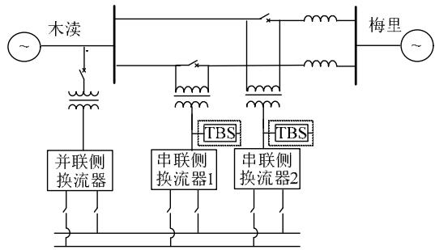  
图 1 苏州 500 kV UPFC 结构  
Fig. 1 Structure of Suzhou 500 kV UPFC

在这 2 个工程中，串联侧 2 个换流器通过 2 个串联变压器接入双回线路；并联侧换流器经并联变压器接入母线；串､并联侧 3 个换流器采用背靠背的连接方式相连。

在串联变压器二次侧的接有晶闸管快速旁路开关(thyristor bypass switch，TBS)，作用是：系统发生故障时，在闭锁串联侧换流器的同时触发晶闸

管旁路开关导通，保护换流阀免受冲击。TBS动作时间小于 2 ms，可以在变压器机械旁路开关合闸前动作。

# 1.2 UPFC 换流器与 TBS 数学模型

# 1.2.1 MMC 桥臂模型

江苏 UPFC 工程中采用的换流器均为 MMC，较为通用的 MMC 仿真模型有平均值模型、基于受控源的高效模型和戴维南等效模型[24]。本文采用戴维南等效模型[25]，其原理如图 2 所示。

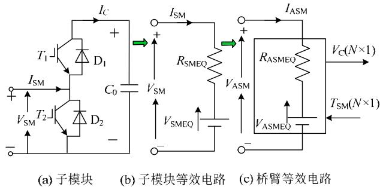  
图2 戴维南等效模型  
Fig. 2 Thevenin equivalent model

图 2(a)中， $I _ { \mathrm { S M } }$ 为桥臂电流，子模块电容中流过的电流 $I _ { \mathrm { C } }$ 的取值以及子模块端口电压 $V _ { \mathrm { S M } }$ 的取值均取决于该子模块的投切状态。当子模块为切除状态时，电容电压保持不变；当子模块为投入状态时，则子模块电容会根据桥臂电流方向的不同，进行充电或者放电，电容电压随之变化。

电容可以用后退欧拉法表示为式(1)的形式，等效为电阻 $R _ { \mathrm { c } }$ 和电源 $V _ { \mathrm { c } } ( t { - } \Delta T )$ 的并联电路：

$$
\begin{array}{l} V _ {\mathrm {C}} (t) = V _ {\mathrm {C}} (t - \Delta t) + \Delta V _ {\mathrm {C}} = \\ V _ {\mathrm {C}} (t - \Delta t) + I _ {\mathrm {C}} \frac {\Delta t}{C} = \\ V _ {\mathrm {C}} (t - \Delta t) + I _ {\mathrm {C}} R _ {\mathrm {C}} \tag {1} \\ \end{array}
$$

其中：∆t 为仿真步长；C 为子模块电容容值； $R _ { \mathrm { c } }$ 为戴维南等效电阻。

假设所有二极管、IGBT 的通态电阻都为 $R _ { \mathrm { O N } }$ 。对于图 2(b)中单个子模块的戴维南子模块等效电路，各电气量可以用式(2)代入式(4)公式表示

$$
R _ {\mathrm {S M E Q}} = \left\{ \begin{array}{l l} R _ {\mathrm {O N}} + R _ {\mathrm {C}}, & \text {投 入} \\ R _ {\mathrm {O N}}, & \text {切 除} \end{array} \right. \tag {2}
$$

$$
V _ {\mathrm {S M E Q}} = \left\{ \begin{array}{l l} V _ {\mathrm {C}} (t - \Delta T), & \text {投 入} \\ 0, & \text {切 除} \end{array} \right. \tag {3}
$$

$$
V _ {\mathrm {S M}} = I _ {\mathrm {S M}} R _ {\mathrm {S M E Q}} + V _ {\mathrm {S M E Q}} \tag {4}
$$

根据上式，并按照各子模块的投切状态进行代数叠加，即可得到图 2(c)的桥臂等效电路。

# 1.2.2 TBS 仿真模型

为实现换流阀及串联变压器快速可靠隔离，采

用 TBS与快速机械旁路开关配合的快速旁路技术，能够实现换流阀及串联变压器快速可靠隔离。TBS动作时序如下：故障时，首先通过触发 TBS快速导通短时隔离故障，然后机械旁路开关合闸，使串联变压器从系统中隔离。

快速旁路装置模型如图 3 所示，每一相 TBS阀都需要跨接在串联变压器绕组两端，即三相 TBS的公共端要和串联变压器中性点连接。

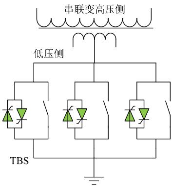  
图3 快速旁路装置模型  
Fig. 3 Control model of TBS

# 1.3 UPFC 控制器模型

# 1.3.1 UPFC 并联侧控制模型

并联侧变流器控制的目标是保持交流母线电压和直流电压稳定，并采用有功/无功解耦控制方法，其控制模型如图 4所示。

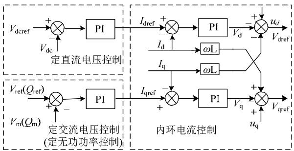  
图4 并联侧控制模型  
Fig. 4 Control model of parallel side

# 1.3.2 UPFC 串联侧控制模型

串联换流器控制的目标是调节指定传输线的有功功率、无功功率到指定值，如图 5 所示。通过设置适当的最大/最小值，串联控制器将从恒功率模式切换到功率限制模式。在功率限制模式下，控制器将在功率超过极限值时起作用。

为防止 UPFC 启动时串联侧造成的较大冲击，设计串联控制器的启动逻辑如下[26]：先投入并联变压器并解锁并联换流器、通过并联侧换流器给串联换流器充电，再解锁串联侧换流器；通过串联换流器控制线路电流逐渐从串联变压器一次侧旁路开关转移至串联变压器一次侧绕组，再以零电流断开

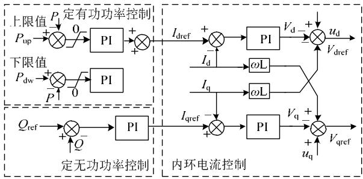  
图5 串联侧控制模型  
Fig. 5 Control model of series side

变压器一次侧旁路开关。

# 2 UPFC 混合仿真接口位置研究

# 2.1 PSD-PS Model 电磁–机电暂态混合仿真程序

PSD-PS Model(power system model)[27]是中国电力科学研究院在国家科技部和国网科技项目的资助下，独立研发的具有全部自主知识产权的电磁暂态仿真软件，具备与机电暂态仿真的各种不同类型接口，可以与机电暂态程序联立运行，实现混合仿真研究。本文 UPFC 混合仿真技术的研究也是基于此平台展开。

混合仿真算法的基本思想是根据对电力系统各区域研究兴趣的不同，把电力系统分为电磁暂态系统、机电暂态系统以及接口母线 3 个部分，如图 6 所示。

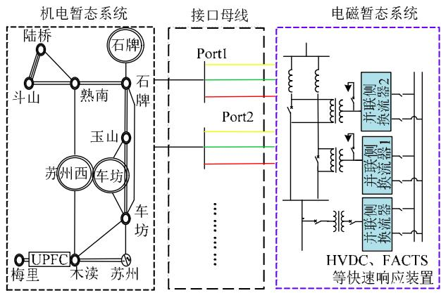  
图6 混合仿真网络划分  
Fig. 6 Hybrid simulation network division

PSD-PS Model 混合仿真接口算法针对传统特高压直流 HVDC 工程一般将混合仿真接口设置在换流变压器一次侧交流母线上。由于晶闸管须依赖交流电网电压进行换相，特高压直流接入点的有效短路比一般大于 2.5(甚至达到 5 以上)，因此这种接口方式产生的误差较小，适合中国国情。

但是 UPFC 具有串联和并联两部分结构，其中串联部分具有控制线路潮流的功能。因此，其接口位置的选择并不同于传统的 HVDC，需要通过不同的仿真工况对接口位置进行探讨，最终确定混合仿

真接口位置。

# 2.2 算例及混合仿真接口位置介绍

本节针对 IEEE 39 算例，利用全电磁暂态仿真技术作为验证手段，通过不同的接口位置和仿真事故对 UPFC 的接口位置选择方法进行探讨。IEEE 39系统如图 7 所示，该系统包括 10 台发电机，39 个公共节点和 33 条线路。UPFC 安装在 16 节点和21节点之间，并联侧变压器与21节点母线相连。UPFC详细参数如表 1 所示。

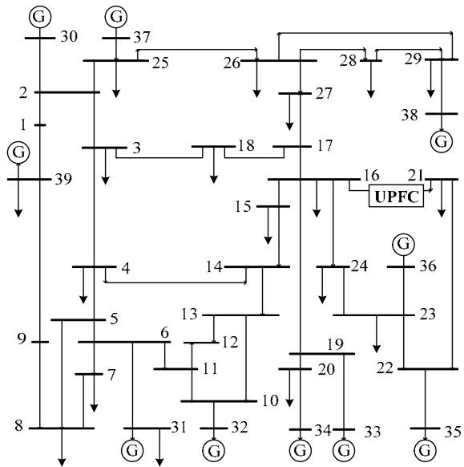  
图 7 IEEE 39 网络拓扑  
Fig. 7 IEEE 39 network topology

表 1 UPFC 参数  
Tab. 1 Parameters of UPFC   

<table><tr><td>参数名称</td><td>参数值</td></tr><tr><td>并联侧变压器额定变比/kV</td><td>345/100</td></tr><tr><td>串联侧变压器额定变比/kV</td><td>100/100</td></tr><tr><td>额定容量/MVA</td><td>300</td></tr><tr><td>直流侧额定电压/kV</td><td>200</td></tr><tr><td>子模块电平数</td><td>112</td></tr><tr><td>子模块电容 Cm/μF</td><td>11000</td></tr><tr><td>相电阻/Ω</td><td>0.04</td></tr><tr><td>相电感/L</td><td>0.036</td></tr></table>

为探讨不同接口位置对仿真效果的影响，在对混合仿真进行网络划分时，共设计以下 4 种方案，如表 2 所示，其余交流网使用机电暂态仿真。

其中方案 a 的具体网络划分如图 8 所示，其他方案可参考图 8 拓扑来进行划分，电磁部分与机电

表2 接口方案  
Tab. 2 Interface scheme   

<table><tr><td>方案</td><td>UPFC</td><td>线路
BUS21-BUS16</td><td>BUS21 负荷</td><td>线路
BUS21-BUS22</td></tr><tr><td>a</td><td>电磁</td><td>机电</td><td>机电</td><td>机电</td></tr><tr><td>b</td><td>电磁</td><td>电磁</td><td>机电</td><td>机电</td></tr><tr><td>c</td><td>电磁</td><td>电磁</td><td>电磁</td><td>机电</td></tr><tr><td>d</td><td>电磁</td><td>电磁</td><td>电磁</td><td>电磁</td></tr></table>

部分有 2 个端口。利用传统短路容量的分析方法，方案 b 和方案 c 两端的短路容量最大，但是相比于UPFC的传输容量，所有方案的短路比都在10左右，都可以作为混合仿真接口方案。表 3 为接口短路容量对比。

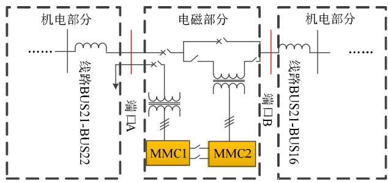  
图8 方案a 拓扑结构  
Fig. 8 Topology of scheme a

<table><tr><td colspan="3">表3 接口短路容量对比
Tab. 3 Short-circuit capacity comparison</td><td rowspan="2">MVA</td></tr><tr><td>方案</td><td>端口A</td><td>端口B</td></tr><tr><td>a</td><td>8040.533</td><td>2151.086</td><td></td></tr><tr><td>b</td><td>8040.533</td><td>3033.358</td><td></td></tr><tr><td>c</td><td>8040.533</td><td>3033.358</td><td></td></tr><tr><td>d</td><td>5277.412</td><td>3033.358</td><td></td></tr></table>

# 2.3 UPFC混合仿真对比结果分析

# 2.3.1 UPFC 启动及初始化

UPFC 由串、并联 2 部分组成，先启动并联侧后启动串联侧。串联部分有多种控制模式，当采用定注入电压控制模式时，启动过程如 9(a)所示，虽然最后启动成功了，但是这种模式两端电压基本一致，对精度要求很高，微小的误差将导致启动后功率与初始值不一致；串联侧采用定功率模式时，如果采用方案 a，此时受控线路被分到了机电暂态部分，且在初始化过程时受控线路的动态被忽略了，UPFC 的串联控制器将启动失败，如图 9(b)所示。因此，方案 a 首先被排除，不能作为 UPFC 的接口方案，以下不再讨论这种接口方案。

# 2.3.2 远端故障(BUS15 故障)

远端故障情况下，故障发生在机电侧，因此可以在机电侧设置故障。在 Bus-15 节点处分别设置三相和单相短路故障，故障发生时刻为 4.0 s，故障持续时间为 0.1 s，通过与 PSD-PS Model 混合仿真程序进行对比进而验证 UPFC 电磁暂态模型的正确性。由图 10(a)和图 10(b)可知，UPFC 的电磁暂态模型在对称故障和不对称工况下，动态响应准确，故 UPFC 的电磁暂态模型准确性得到有效验证。

在远端故障情况下，几种方案效果都可以获得不错的仿真效果。对于这种工况，一般采取最简单的方案 b。

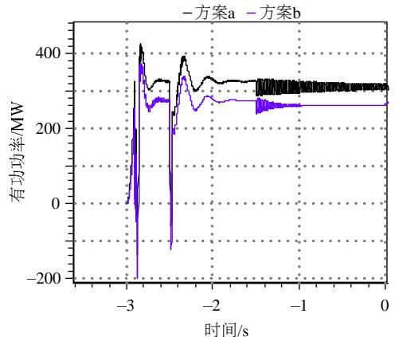  
(a) 定注入电压模式有功

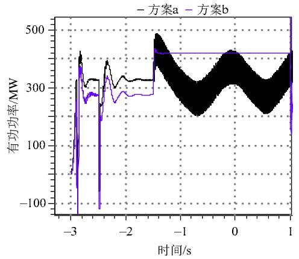  
(b)定有功控制模式有功  
图9 启动及初始化仿真结果

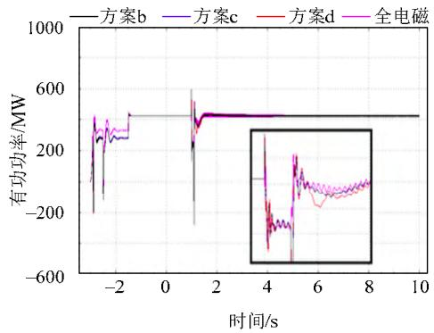  
Fig. 9 Simulation result of starting process and initialization   
(a)三相短路串联侧有功

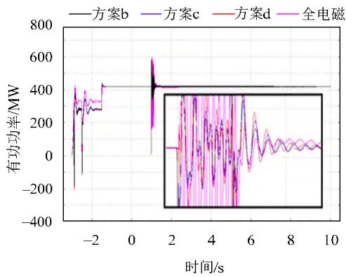  
(b)单相短路串联侧有功   
图10 远端故障仿真结果   
Fig. 10 Simulation result of remote fault

# 2.3.3 UPFC 并联侧故障(BUS21 故障)

UPFC 并联侧故障后，可能导致电力电子元件过载，TBS 动作。在 Bus-21 节点处发生三相和单相短路故障，故障发生时刻为 4.0 s，故障持续时间为 0.1 s。仿真结果如图 $1 1 ( \mathrm { a } )$ 与 11(b)。

根据仿真结果，三相短路故障发生后，不同的接口方案中 TBS都发生了动作；单相短路故障发生后，不同接口方案中的 TBS都没有发生动作。但是，在三相短路故障中，方案 b 和方案c 中短路后的振荡幅值都比较大，方案 d 与全电磁暂态仿真结果比较一致，但是这 3 种接口方案的基频值都一致，所以，3 个方案都是可行的。

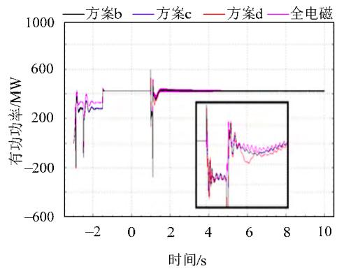

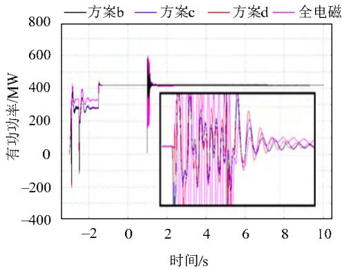  
(a)三相短路串联侧有功   
(b)单相短路串联侧有功   
图11 并联侧故障仿真结果   
Fig. 11 Simulation result of parallel side fault

由上述仿真曲线可以看到，交–交接口比交–直接口更加复杂，在 UPFC 电网的机电–电磁混合仿真过程中，需要对 UPFC 周围的电磁网络进行详细建模。但是对于非接口处的故障，一般只需要对UPFC 及其所控制的串联线路进行电磁暂态仿真即可，对于接口处的故障仿真需要扩大电磁网络，将故障包含到电磁网络内部进行仿真才会更加准确。对于下节实际 UPFC 工程混合仿真，接口位置选择为 UPFC 及其所控制的串联线路方式，即方案 b。

# 3 UPFC 工程算例仿真验证

实际苏南 500 kV UPFC 工程有多种运行方式

可供灵活切换，为验证 UPFC 模型对于线路潮流的控制效果，针对单双线路串联侧投入的 2 种运行方式分别进行了有功阶跃、无功阶跃试验，并且将混合仿真结果与现场录波曲线对比。现场录波曲线为500 kV UPFC 工程投运调试期间获得，在图 12—15中为蓝色曲线，毛刺较多；黑色曲线为 PS Model仿真曲线，较为平滑。

# 3.1 单线路串联侧投入试验

单线路有功阶跃结果如图 12 所示，设置串联侧有功功率参考值在 0.2 s 时发生 100 MW 的有功阶跃，1.2 s时发生100 MW 的有功阶跃，线路功率恢复初始值。对比内容包含线路有功功率与无功功率。

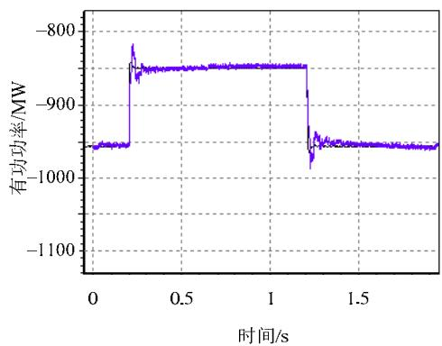  
(a)线路有功功率

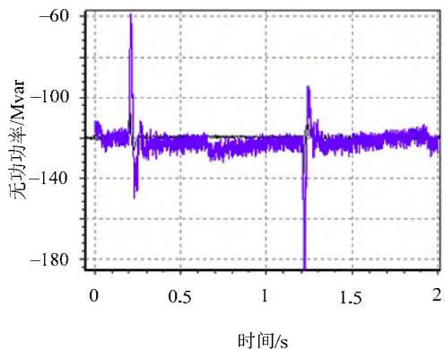  
(b)线路无功功率   
图12 UPFC单线模式有功阶跃仿真结果  
Fig. 12 Simulation curves of active power step while UPFC in single line operate mode

单线路无功阶跃结果如图 13，设置线路并联侧在 0.2 s 时发生 50 Mvar 的无功阶跃，1.2 s 时发生50 Mvar 的有功阶跃，线路功率恢复初始值。对比内容包含线路有功功率与无功功率。

仿真结果显示，本文所提的 UPFC 模型混合仿真曲线与实际录波曲线拟合良好，线路功率在阶跃时刻可以迅速根据参考值进行调整，具有良好的响应能力。

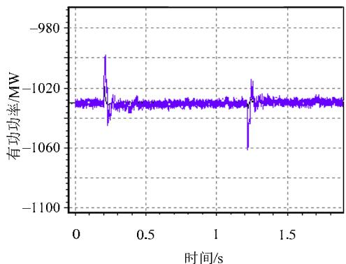

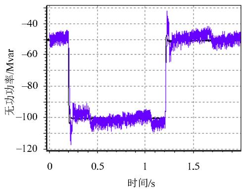  
(a)线路有功功率   
(b)线路无功功率   
图13 UPFC 单线模式无功阶跃仿真结果  
Fig. 13 Simulation result of active power step while UPFC in single line operate mode

# 3.2 双线路串联侧投入试验

双线路串联侧投入方式下的有功阶跃结果如图14所示，设置线路串联侧在0.2 s时发生100 MW

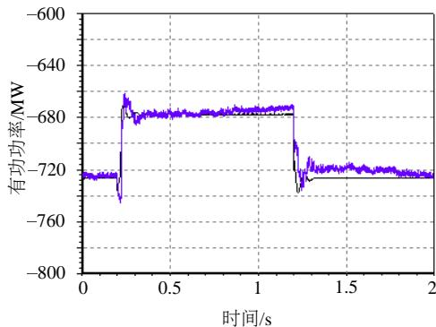

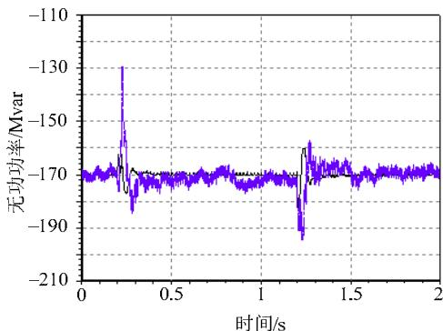  
(a) 线路有功功率   
(b)线路无功功率   
图14 UPFC 双线模式有功阶跃仿真结果  
Fig. 14 Simulation result of active power step while UPFC in double line operate mode

的有功阶跃，1.2 s 时发生100 MW的有功阶跃，线路功率恢复初始值。对比内容包含线路有功功率与无功功率。

双线路串联侧投入方式下的无功阶跃结果如图 15，设置线路并联侧在 0.2 s 时发生 50 Mvar 的无功阶跃，1.2 s 时发生50 Mvar的无功阶跃，线路功率恢复初始值。对比内容包含线路有功功率与无功功率。

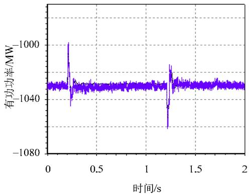

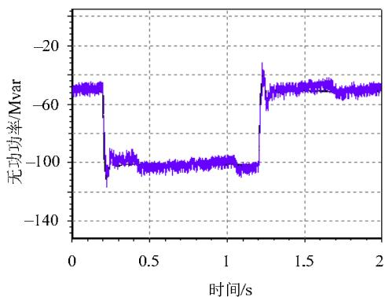  
(a)线路有功功率   
(b)线路无功功率   
图15 UPFC 双线模式无功阶跃仿真结果  
Fig. 15 Simulation result of reactive power step while UPFC in double line operate mode

通过上述的模型验证可知：混合仿真结果与现场试验录波曲线均拟合良好，混合仿真所设计的模块化 UPFC 模型，可真实反映含 UPFC 电网的稳态和机电暂态行为和特征；混合仿真算法准确性较高，可满足含 UPFC 大规模电网的混合仿真需求，具有良好的推广前景。

# 4 结论

本文建立了基于MMC拓扑的统一潮流控制器仿真模型，结合中国电力科学研究院自主研发的混合仿真平台 PSD-PS Model 进行了含 UPFC 电网混合仿真技术的研究，针对不同工况对比分析了混合仿真接口位置的选择方法，最后结合苏州 500 kVUPFC 工程的现场录波曲线进行对比验证，并得到以下结论：

1）本文所提的 UPFC 仿真模型能够对各种工况下的灵活拓扑结构的 UPFC 进行准确模拟，适应性好，通用性强，能够应用于含 UPFC 电网的稳态和暂态分析计算。  
2）接口位置处理是电磁–机电数字混合仿真技术的关键。本文探索了不同的交–交接口位置对混合仿真结果的影响，通过仿真发现短路比标准并不能作为交–交接口的唯一条件。本文通过仿真结果推荐UPFC及其所控制的串联线路同时作为电磁暂态子系统，通过实际工程试验曲线的对比验证了模型和混合接口的有效性。

# 参考文献

[1] 国网江苏省电力公司．统一潮流控制器技术及应用[M]．北京：中国电力出版社，2015．  
[2] Gyugyi L，Schauder C D，Williams S L，et al．The unified power flowcontroller: a new approach to power transmission control[J]．IEEETransactions on Power Delivery，1995，10(2)：1085-1097  
[3] 荆平，周飞，宋洁莹，等．采用模块化结构的统一潮流控制器设计与仿真[J]．电网技术，2013，37(2)：356-361

Jing Ping，Zhou Fei，Song Jieying，et al．Design and simulation of unified power flow controller based on modular multilevel converter[J]．Power System Technology，2013，37(2)：356-361(in Chinese)．   
[4] 朱鹏程，刘黎明，刘小元，等．统一潮流控制器的分析与控制策略[J]．电力系统自动化，2006，30(1)：45-51  
Zhu Pengcheng，Liu Liming，Liu Xiaoyuan，et al．Analysis and study on control strategy for UPFC[J]．Automation of Electric Power Systems，2006，30(1)：45-51(in Chinese)   
[5] Fujita H，Akagi H，Watanabe Y．Dynamic control and performance of a unified power flow controller for stabilizing an AC transmission system[J]．IEEE Transactions on Power Electronics，2017，21(4)： 1013-1020   
[6] 张曼，张春朋，姜齐荣，等．统一潮流控制器多目标协调控制策略研究[J]．电网技术，2014，38(4)：1008-1013  
Zhang Man，Zhang Chunpeng，Jiang Qirong，et al．Study on multiobjective coordinated control strategy of unified power flow controller [J]．Power System Technology，2014，38(4)：1008-1013(in Chinese)．   
[7] Renz B A，Keri A，Mehraban A S，et al．AEP unified power flowcontroller performance[J]．IEEE Transactions on Power Delivery，1999，14(4)：1374-1381  
[8] Chang B H，Choo J B，Im S J，et al．Study of operational strategies of UPFC in KEPCO transmission system[C]//Transmission and Distribution Conference and Exhibition：Asia and Pacific，2005 IEEE/PES．IEEE，2005：1-6   
[9] Fardanesh B，Schuff A．Dynamic studies of the NYS transmission system with the Marcy CSC in the UPFC and IPFC configurations [C]//Transmission and Distribution Conference and Exposition，2003 IEEE PES．IEEE，2003：1126-1130   
[10] 祁万春，杨林，宋鹏程，等．南京西环网 UPFC 示范工程系统级控制策略研究[J]．电网技术，2016，40(1)：92-96  
Qi Wanchun，Yang Lin，Song Pengcheng，et al．UPFC system control strategy research in Nanjing western power grid[J]．Power System Technology，2016，40(1)：92-96(in Chinese)   
[11] 李鹏，林金娇，孔祥平．统一潮流控制器在苏南500 kV电网中的应用[J]．电力工程技术，2017，36(1)：20-24

Li Peng，Lin Jinjiao，Kong Xiangping．Application of UPFC in the 500kV southern power grid of Suzhou[J]．Electric Power Engineering Technology，2017，36(1)：20-24(in Chinese)   
[12] Dommel H W．Digital computer solution of electromagnetic transients in single and multiphase networks[J]．IEEE Transactions on Power Apparatus and Systems，1969，88(4)：734-741   
[13] 程改红，陆韶琦，邵冲，等．大规模交直流电力系统电磁暂态仿真高效建模方法[J]．电网技术，2017，41(6)：1919-1926  
Cheng Gaihong，Lu Shaoqi，Shao Chong，et al．A high efficiency modeling method for electromagnetic transient simulation of large scale AC/DC power system[J]．Power System Technology，2017， 41(6)：1919-1926(in Chinese)   
[14] 万磊，汤涌，吴文传，等．特高压直流控制系统机电暂态等效建模与参数实测方法[J]．电网技术，2017，41(3)：708-714  
Wan Lei，Tang Yong，Wu Wenchuan，et al．Equivalent modeling andreal parameter measurement methods of control systems of UHVDCtransmission systems[J]．Power System Technology，2017，41(3)：708-714(in Chinese)  
[15] 丁平，安宁，赵敏，等．一种实用的电压源型换流器及直流电网机电暂态建模方法[J]．电工技术学报，2017，32(10)：69-76．  
Ding Ping，An Ning，Zhao Min，et al．A practical modeling method of VSC-HVDC and DC-grid electromechanical transient [J]．Transactions of China Electrotechnical Society，2017，32(10)： 69-76(in Chinese)   
[16] 朱旭凯，周孝信，田芳，等．基于电力系统全数字实时仿真装置的大电网机电暂态-电磁暂态混合仿真[J]．电网技术，2011，35(3)：26-31．  
Zhu Xukai，Zhou Xiaoxin，Tian Fang，et al．Hybrid electromechanicalelectromagnetic simulation to transient process of large-scale power grid on the basis of ADPSS[J]．Power System Technology，2011， 35(3)：26-31(in Chinese)   
[17] 柳勇军，闵勇，梁旭．电力系统数字混合仿真技术综述[J]．电网技术，2006，30(13)：38-43  
Liu Yongjun，Min Yong，Liang Xu．Overview on power system digital hybrid simulation[J]．Power System Technology，2006，30(13)： 38-43(in Chinese)．   
[18] 张树卿，梁旭，童陆园，等．电力系统电磁/机电暂态实时混合仿真的关键技术[J]．电力系统自动化，2008，32(15)：89-96  
Zhang Shuqing，Liang Xu，Tong Luyuan，et al．Key technologies of the power system electromagnetic/electromechanical real-time hybrid simulation[J]．Automation of Electric Power Systems，2008，32(15)： 89-96(in Chinese)   
[19] 岳程燕，田芳，周孝信，等．电力系统电磁暂态-机电暂态混合仿真接口原理[J]．电网技术，2006，30(1)：23-27  
Yue Chengyan，Tian Fang，Zhou Xiaoxin，et al．Implementation ofinterfaces for hybrid simulation of power system electromagnetic-electromechanical transient process[J]．Power System Technology，2006，30(1)：23-27(in Chinese)  
[20] 贺静波，张星，许涛，等．特高压交直流电网机电-电磁暂态混合仿真特性分析[J]．电力系统及其自动化学报，2016，28(10)：105-110  
He Jingbo ， Zhang Xing ， Xu Tao ， et al ． Electromechanical-electromagnetic transient hybrid simulation on characteristic analysis

of UHVAC-UHVDC grid[J]．Proceedings of the CSU-EPSA，2016，28(10)：105-110(in Chinese)  
[21] Heffernan M D，Turner K S，Arrillaga J，et al．Computation of AC-DC system disturbances，Part I，II and III[J]．IEEE Transactions on Power Apparatus and Systems，1981，100(11)：4341-4363．   
[22] Reeve J，Adapa K．A new approach to dynamic analysis of AC networks incorporating detailed modeling of DC systems，Part I， II[J]．IEEE Transations on Power Delivery，1988，3(4)：2005-2019   
[23] 欧开健，张树卿，童陆园，等．SMRT 电磁机电混合实时仿真交流-交流分网技术研究[J]．南方电网技术，2015，9(1)：47-51  
Ou Kaijian，Zhang Shuqing，Tong Luyuan，et al．Research on the AC/AC interface in SMRT electromagnetic transient and electromechanical transient hybrid real-time simulation[J]．Southern Power System Technology，2015，9(1)：47-51(in Chinese)   
[24] 许建中，李承昱，熊岩，等．模块化多电平换流器高效建模方法研究综述[J]．中国电机工程学报，2015，35(13)：3381-3392  
Xu Jianzhong，Li Chengyu，Xiong Yan，et al．A review of efficient modeling methods for modular multilevel converters[J]．Proceedings of the CSEE，2015，35(13)：3381-3392(in Chinese)   
[25] Gnanarathna U N，Gole A M，Jayasinghe R P．Efficient modeling of modular multilevel hvdc converters(MMC)on electromagnetic transient simulation programs[J] ． IEEE Transactions on Power Delivery，2010，26(1)：316-324   
[26] 潘磊，李继红，田杰，等．统一潮流控制器的平滑启动和停运策略[J]．电力系统自动化，2015，39(12)：159-164，171  
Pan Lei，Li Jihong，Tian Jie，et al．Smooth start and stop strategiesfor unified power flow controllers[J]．Automation of Electric PowerSystems，2015，39(12)：159-164，171(in Chinese)  
[27] 刘文焯，侯俊贤，汤涌，等．考虑不对称故障的机电暂态–电磁暂态混合仿真方法[J]．中国电机工程学报，2010，30(13)：8-15．  
Liu Wenzhuo，Hou Xiangjun，Tang Yong，et al．Electromechanical transient/electromagnetic transient hybrid simulation method considering asymmetric faults[J]．Proceedings of the CSEE，2010， 30(13)：8-15(in Chinese)

收稿日期：2018-07-03。

作者简介：

叶小晖(1985)，男，硕士，通信作者，高级工程师，主要研究方向为电力系统建模与仿真分析，E-mail：yexiaohui@epri.sgcc.com.cn；

汤涌(1959)，男，教授级高级工程师，主要研究方向为电力系统仿真与分析；

刘文焯(1972)，男，高级工程师，主要研究方向为电力系统建模；

宋新立(1971)，男，硕士，高级工程师，主要研究方向为电力系统仿真与分析；

李霞(1992)，女，硕士，工程师，主要研究方向为电力系统仿真与分析；

吴国旸(1974)，男，教授级高级工程师，主要研究方向为电力系统规划及可靠性分析。

（责任编辑 王晔）