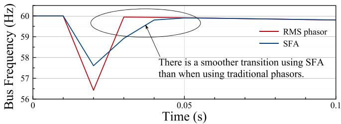
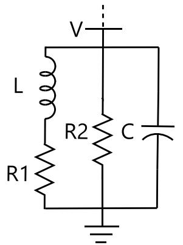
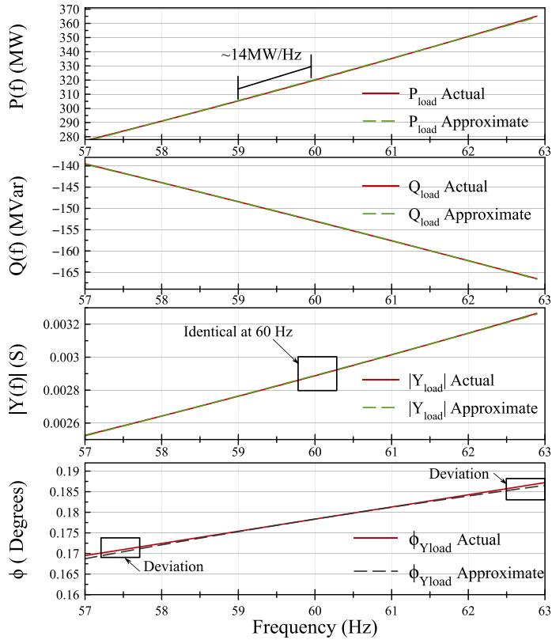
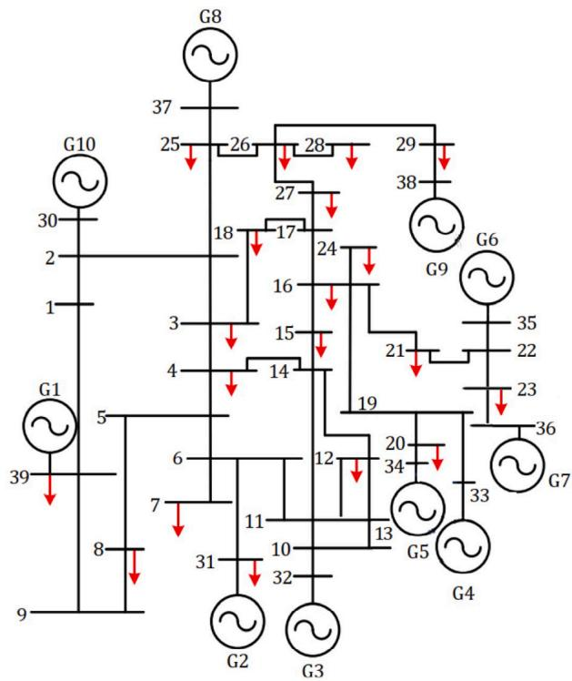
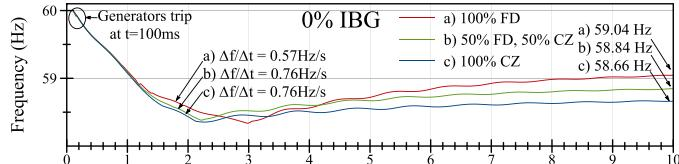
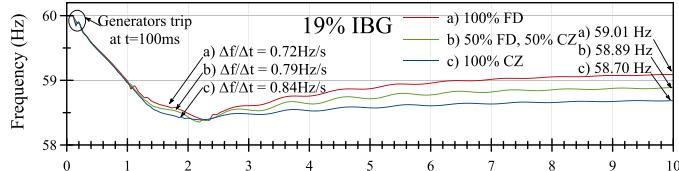
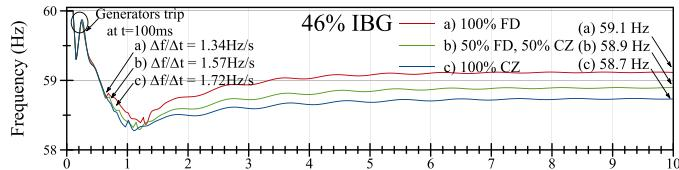
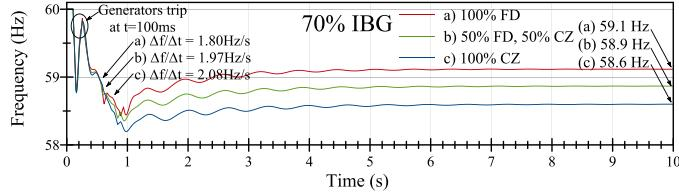
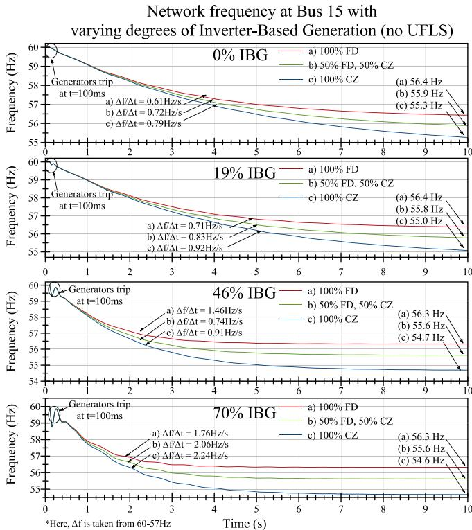
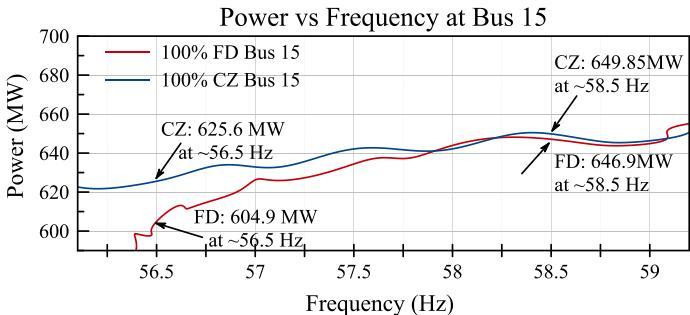

# The fdLoad model for accurate frequency dynamics in the SFA-EMT simulator✩

Masoud Hajiakbari Fini a, Andrea T.J. Martí b , José R. Martí a ,∗

a Department of Electrical and Computer Engineering, University of British Columbia, Vancouver, BC, V6T 1Z4, Canada   
b Department of Civil Engineering, University of British Columbia, Vancouver, BC, V6T 1Z4, Canada

# A R T I C L E I N F O

Keywords:

Accurate frequency swing solutions in low

inertia systems

Frequency dependent load model (fdLoad)

Shifted Frequency Analysis (SFA) modelling

# A B S T R A C T

Due to the reduction in the system’s total mechanical inertia, frequency swing deviations increase with the penetration of inverter-based resources (IBR). For frequency swings, transient stability programs usually model the load as frequency-dependent using, for example, exponential load models. These programs usually use a phasor solution at 60 Hz for the AC network, and the frequency is estimated from the solution for the phase angles at previous and current time steps but is not explicitly included in the present time step solution. On the other hand, in Dommel’s EMT time domain solution, the frequency is implicitly included in the solution at all locations in the network, including the load busses. A full-system EMT solution, however, is expensive compared to a phasor solution. In this paper, the Shifted-Frequency Analysis method (SFA), which is a phasor solution with magnitude and phase angle discretized with the EMT method, is combined with a frequencydependent load synthesis model to study the influence of the frequency dependence of the load in frequency swings. The IEEE-39-Bus system is used for tests of load-shedding conditions. The results show that using a frequency-dependent load model has an important influence on the maximum frequency deviations during the contingency.

# 1. Introduction

The transition from synchronous generation to inverter-based resources (IBR) has created challenges for traditional power system simulation software due to the wider swings caused by the decrease of system inertia. In particular, frequency swings during generation loss, load shedding, and faults can be larger than expected by frequency relays.

The SFA-EMT simulator [1] was developed to solve a phasor-domain electric circuit using Dommel’s EMT discretization techniques [2] applied to the magnitude and phase angle of the voltage and current phasors. (In this paper, whenever the generic term EMT is used, it refers to Dommel’s EMT discretization method of [2].) SFA-EMT can simulate any frequency in the system, but it is particularly efficient for frequency deviations around 60 Hz.

In conventional phasor-based software, frequency is estimated from the rate of change of the phase angles from the previous solution to the present solution (e.g., [3–6]). This approach does not use the current step frequency for frequency dependent loads and has difficulties at discontinuities, for example during load shedding.

In SFA-EMT, the phase angles are continuous variables, and the frequency at the present solution step is implicit in the solution. As a result, it is possible to model the frequency dependence of the loads using a frequency-dependent network synthesis branch, as in the frequency-dependent models of the EMT solutions (e.g., [7,8]).

For the SFA-EMT solution, discontinuities can be treated as in the EMT programs using, for example, CDA [9] or using the backward Euler rule instead of the trapezoidal rule for the entire simulation. Since in the SFA-EMT solution, the frequency is implicit in the solution, the system impedances or admittances are not constant at 60 Hz but are obtained at the correct frequency at every solution step.

This paper extends the accuracy of the SFA-EMT simulator of [1] for modelling frequency swings by developing a frequency-dependent load model (fdLoad) that synthesizes the load as a combination of constant ??, ??, and ?? components (Fig. 3).

The fdLoad model follows the EMT frequency-dependent line models (e.g., [7]) that use a network synthesis to model impedances or admittances. The Vector Fitting procedure of [8] was chosen for this modelling because it can synthesize complicated frequency-dependent

functions defined in a relatively narrow frequency band, as compared to Bode’s method of [7].

The IEEE-39-Bus system is used to test the fdLoad model during frequency swings during load-shedding situations with variable amounts of IBR penetration. These results are important for Underfrequency Load Shedding schemes (UFLS). The existing UFLS may be set to operate too early when the load’s frequency dependence is not considered.

# 2. SFA-EMT shifted frequency analysis simulation

The application of Dommel’s EMT solution methods to complex signals was discussed in [10]. The Shifted Frequency Analysis (SFA) algorithm to model synchronous machines was discussed in [11]. The SFA-EMT simulator to solve a general network for the time-dependent magnitude and phase angle of phasor voltages and currents using EMT discretization methods was developed in [1].

As discussed in [1], in the SFA-EMT method, a frequency-shifting transformation of −60 Hz, $e ^ { - j ( 2 \pi 6 0 ) t }$ is applied to the instantaneous voltage and current waveforms with the result that the 60 Hz components of the signals are shifted down to 0 Hz and the frequencies around 60 Hz become frequencies around 0 Hz, that can be solved with large ????’s.

The SFA-EMT equivalent branches shown in Fig. 1, 3rd column, were obtained using Dommel’s EMT time discretization techniques of [2] on the phasor branches of Fig. 1, 1st column. Fig. 1, 2nd column shows the discretized branches for the basic circuit components ??, ??, and ??. In addition to the time discretization techniques, other EMT solution strategies, such as CDA [9] for discontinuities, and frequency dependence synthesis modelling can be directly applied to the SFA-EMT solution.

Notice that the branches for the SFA-EMT model are a hybrid between the traditional phasor model and the EMT discretized branches for the circuit components. The solution in SFA-EMT proceeds one time step at a time, exactly like in the normal Dommel’s EMT, using the discretized phasor models for the branches and injecting the history sources calculated in the previous time steps. The only difference between the EMT solution and the SFA-EMT is that SFA-EMT solves a phasor system of equations.

Even though SFA-EMT is particularly advantageous for small deviations around 60 Hz in terms of being able to use very large discretization steps, the method is still capable of solving for any transient with higher or slower frequencies, as long as the time step size is chosen using the EMT rule of ???? = 110⋅?? , $\begin{array} { r } { \varDelta t \ = \ \frac { 1 } { 1 0 \cdot f _ { \mathrm { m a x } } } . } \end{array}$ only that now $\begin{array} { r } { \Delta t = \frac { 1 } { 1 0 \cdot \left( { f _ { \operatorname* { m a x } } - 6 0 } \right) } . } \end{array}$ . For example, to capture the third harmonic $f _ { 3 } = 1 8 0 ~ \mathrm { H z } ,$ the time step required is $\begin{array} { r } { \Delta t = \frac { 1 } { 1 0 \cdot ( 1 2 0 ) } = 0 . 8 3 3 } \end{array}$ ms. The normal EMT would require $\begin{array} { r } { \Delta t \ = \ \frac { 1 } { 1 0 \cdot 1 8 0 } = 0 . 5 5 6 } \end{array}$ ms. However, as the frequency deviates further from 60 Hz, a regular EMT solution is preferred because the EMT solution is based on real-number operations while SFA-EMT requires complex-number operations.

Since SFA-EMT is based on phasors, if we express the equivalent SFA-EMT branch in shunt form, it is straightforward to modify a traditional transient stability solution $[ Y ] [ V ] = [ I ]$ into an SFA-EMT solution by replacing the normal phasor admittances with the SFA-EMT equivalent admittances and injecting the SFA-EMT history sources into the right-hand side of the transient stability solution.

In terms of computer time, the SFA-EMT solution uses complex numbers as in the static-phasor solution, with an added small overhead for the transformations between the original unshifted domain (phase domain) and the shifted domain (SFA domain) during initialization and changes of topology. The introduction of a synthesis load model, as presented in this paper, avoids the overhead due to changes of topology when the load values change due to frequency changes.

For transient or frequency stability studies, if we have a 0.9 Hz frequency deviation in the 60 Hz signals, the ???? required to capture 59.1 Hz (or 60.9 Hz) in an EMT model is 0.8 ms. However, because

Fig. 1. The equivalent branch elements (??, ?? and ??) with traditional RMS phasors, EMT discretization and SFA discretization.   

<table><tr><td>Element</td><td>Traditional Phasor</td><td>EMTP (Trapezoidal)</td><td>SFA (Trapezoidal)</td></tr><tr><td>Resistor</td><td>IRRVR</td><td>iR(t)RVR(t)</td><td>IRR(t)RVR(t)</td></tr><tr><td>Inductor</td><td>ILjωoLVR</td><td>iL(t)2L/Δt eHL(t)vl(t)</td><td>IL(t)2L/Δt jωoL EHL(t)Vc(t)</td></tr><tr><td>Capacitor</td><td>1jωoCVR</td><td>ic(t)Δt/2C ehc(t)vc(t)</td><td>IC(t)2C/Δt(jωoC)Ihc(t)Vc(t)</td></tr></table>

  
Solving the bus frequency as a derivative of the bus phase: a comparison of SFA and RMS phasors   
Fig. 2. Comparing the two phasor methods when calculating the bus frequency as a derivative of phase angle.

of the 60 Hz shifting, only the deviation from 60 Hz (0.9 Hz) needs to be captured. This gives a ???? of 55 ms, which is 70 times larger than for 60 Hz. In traditional transient stability programs based on static phasor solutions, the time step is determined by the machine acceleration and is in the order of 5 ms, which is smaller than the time step required by the SFA-EMT solution. Therefore, using SFA-EMT with 5 ms results in basically zero error for the transient frequency deviations, with basically the same solution time as the conventional static-phasor solution.

Also because the EMT solution uses CDA [9] to soften up discontinuities, the transitions at load-shedding are smoothed out. Fig. 2 illustrates that the frequency simulated by the SFA-EMT program is smooth and has a lower dip across a load shedding discontinuity compared to the frequency calculated from the rate of change of the phase angles in conventional steady-state transient stability solutions (e.g., [12]).

# 3. SFA-EMT frequency-dependent load model

The models discussed in this paper are for dynamic studies in the transmission system. At this level, the loads are seen as aggregates and do not have the physical details that could be included at the distribution system level [13]. At the transmission level, the exponential load model in Eqs. (1) and (2) below [14] is often used to capture the behaviour of load aggregates. However, the methodology presented in this paper is general and can be used for other analytical approximations or, better, from direct measurements.

The exponential load model is given by:

$$
P (f, V) = P _ {0} \left(\frac {f}{f _ {0}}\right) ^ {\alpha_ {f}} \left(\frac {V}{V _ {0}}\right) ^ {\alpha_ {v}} \tag {1}
$$

  
Fig. 3. Equivalent circuit for the fdLoad model.

$$
Q (f, V) = Q _ {0} \left(\frac {f}{f _ {0}}\right) ^ {\beta_ {f}} \left(\frac {V}{V _ {0}}\right) ^ {\beta_ {v}} \tag {2}
$$

In this model, $f _ { 0 } , V _ { 0 } , P _ { 0 } ,$ , and $Q _ { 0 }$ are the active and reactive values of the power at 60 Hz while ?? and ?? are the current values. The exponents, $\alpha _ { f } , \beta _ { f } , \alpha _ { v } ,$ and $\beta _ { v } ,$ , depend on the type of load and give an approximation of the behaviour around the operating point. Typical values for these coefficients can be found in [14].

Because the SFA-EMT solution is a time-domain solution and frequency is implicit in it, if we express the load’s frequency behaviour in terms of the frequency behaviour of an impedance branch (Fig. 3) with constant $R , L ,$ and ?? parameters, then we can use this branch as individual $R , L ,$ and ?? elements in the network solution to model the load’s frequency dependence.

To obtain the synthesis branch of Fig. 3 from (1) and (2), we can use the methods used in the EMT to model the frequency dependent characteristic admittance in the frequency-dependent line models $( \mathbf { e } . g . , [ 7 , 8 ] )$ , which fit the frequency response of the admittance with a rational function of poles and zeroes. In our case, from (1), (2):

$$
Y (f) = \frac {P (f) - j Q (f)}{V ^ {2}} \tag {3}
$$

and setting $\begin{array} { r l r } { V } & { { } = } & { V _ { 0 } , } \end{array}$ we obtain a frequency-dependent admittance linearized around the $f _ { 0 } = 6 0$ Hz value:

$$
Y (f) = \frac {P _ {0}}{V _ {0} ^ {2}} \left(\frac {f}{f _ {0}}\right) ^ {\alpha_ {f}} - j \frac {Q _ {0}}{V _ {0} ^ {2}} \left(\frac {f}{f _ {0}}\right) ^ {\beta_ {f}} \tag {4}
$$

Assuming, as an example, a typical motor load, with $\alpha _ { f } = 2 . 8$ and $\beta _ { f } = 1 . 8 ~ [ 1 4 ]$ , we can evaluate (4) to fit accurately the frequency range of interest, say from 57 Hz to 63 Hz. Then the rational function fit can be used to find the ??, ??, and ?? elements of the synthesis. We call this synthesis the fdLoad model.

The fdLoad model of Fig. 3 was obtained for the ?? and ?? loads in Bus 15 of Fig. 5 for the Case Study of Section 4. For this bus ?? =306 MW, $Q _ { 0 } { = } 1 5 2$ MVar, and $V _ { 0 } { = } 3 5 0 . 5 2 \ \mathrm { k V }$ . The results for the synthesis of this branch were ?? = −1.8 mH, ??1 = −4.96 ??, ??2 = 4.99 ?? and $C = - 7 5 . 1 ~ \mu \mathrm { F } .$ .

The parameters $\alpha _ { f } ~ = ~ 2 . 8$ and $\beta _ { f } \ = \ 1 .$ .8 depend only on the load type and not on the specific ?? and ?? values of the bus. For simplicity in setting up the test case in Fig. 5, all busses were assumed to have the same type of load $( \alpha _ { f } = 2 . 8$ and $\beta _ { f } = 1 . 8 )$ . Then, the ??, ??, and ?? parameters of Fig. 3 were re-scaled according to the values of ?? and ?? in these busses.

The rational function fitting used in this work is the Vector Fitting procedure of [8]. Vector Fitting was chosen for this application because it uses complex poles and zeroes for the rational function fit, as opposed to [7], which uses only real poles and zeroes.

All fdLoad synthesis models used in the paper are second order. The MATLAB version of Vector Fitting was used to obtain these functions. Even though some of the parameters in the synthesis branch have

  
Frequency-dependent Power (P(f), Q(f) and Admittance (Y(f)) at Load Bus 15   
Fig. 4. Active and reactive power (?? , ??) and admittance (?? ) as functions of frequency based on Eqs. (1),(2), and (4) at load Bus 15. At 60 Hz, the actual network and the approximated synthesis network are identical.

negative values, all the synthesis branches tested were minimum-phase within the fitted frequency range. No numerical stability problems were encountered in any of the simulations.

Using Vector Fitting for our example load, we get a transfer function of the form

$$
Y (s) = H \frac {(s + z _ {1}) (s + z _ {2})}{(s + p _ {1})} = K _ {0} + \left(\frac {K _ {1}}{s + p _ {1}}\right) + s K _ {2} \tag {5}
$$

Expanding (5) into partial fractions, we find the synthesis network of Fig. 3 to model the load’s frequency response. With $s ~ = ~ j \omega _ { \mathrm { { i } } }$ , and matching the partial fraction terms in (5), we get

$$
Y (\omega) = \frac {1}{R _ {2}} + \frac {1}{R _ {1} + j \omega L} + j \omega C \tag {6}
$$

The accuracy of the load synthesis with the fdLoad model of Fig. 3 is plotted in Fig. 4 for the admittance function as well as the corresponding real and reactive power functions. For all plots, the maximum error is about 0.5% in the considered frequency range of ± 3 Hz.

# 4. Case study - IEEE 39 bus system

The Western Electricity Coordinating Council [15] recommends that Underfrequency Load Shedding (UFLS) sequences should be calculated to stabilize the frequency within 59.5 Hz and 60.5 Hz by activating the controls at 0.9 Hz below the nominal frequency. These guidelines, however, do not consider the penetration of IBRs and the corresponding lower inertia of the grid. The wider frequency swings due to increased IBR penetration will require faster frequency control responses $[ 1 6 , 1 7 ]$ and the load-shedding sequencing may need to be revised [18] more accurately. The SFA software used in this paper [1] assumes balanced three-phase solutions. This software was developed at UBC.

  
Fig. 5. The IEEE 39-Bus Network taken from [19].

# 4.1. Case description

We tested the proposed fdLoad model on a modified version of the IEEE-39 Bus (New England) system [19] (Fig. 5). This network is a 345 kV transmission system with 10 generators and 19 loads. The data for the network is taken from [19]. The power flow and H data are given in Appendix. The generators have a damping coefficient, $K = 1 . 5 ~ \mathrm { p u }$ , and a transient reactance, $X _ { d } ^ { \prime } = 0 . 3$ pu. All buses are at 345 kV, except for bus 12, which is at 138 kV, bus 20 at 230 kV, and busses 30–38 at 16.5 kV. Generator 1 is at 345 kV and represents an external bulk power system.

We considered four levels of IBR penetration, 0%, 19.3%, 46.8%, and 71.3%, for a contingency in which 35.9% of the total generation is tripped off at 100 ms. The total power imbalance between generation and load after this contingency is 2054 MW.

To compare with realistic operating conditions, we implemented a UFLS plan [15] and observed the frequency response under three load model combinations: (1) 100% constant-impedance load, (2) 100% frequency-dependent load (as proposed in this paper), and (3) a mixed-model load with 50% constant-impedance and 50% frequencydependent.

# Voltage dependence

In this study, we took the voltage change into account when the load was shed at the UFLS set points. At these points, the parameters of the fdLoad branch were recalculated by rescaling based on the new power absorbed by this branch. However, further testing is needed to assess the computational time versus accuracy of this process as compared to continuously taking into account the new voltages.

# IBR penetration

It is useful when considering the level of IBR penetration to use the concept of full system’s equivalent inertia $H _ { s y s }$ [20] defined as follows:

Table 1 Sharing of MVA between synchronous generation and IBRs for Each of the four scenarios.   

<table><tr><td></td><td>(1)0% IBR</td><td>(2)9.34% IBR</td><td>(3)46.8% IBR</td><td>(4)71.26% IBR</td></tr><tr><td>\( MVA_{sync} \)</td><td>6297.87</td><td>5080.0</td><td>3350.0</td><td>1810.0</td></tr><tr><td>\( MVA_{IBRs} \)</td><td>0</td><td>1217.87</td><td>2947.87</td><td>4487.87</td></tr><tr><td>\( IBRs \)</td><td>N/A</td><td>Gen. 2, 8</td><td>Gen. 2, 3,8, 9, 10</td><td>Gen. 3-9</td></tr><tr><td>\( H_{sys}(s) \)</td><td>5.1</td><td>4.2</td><td>2.86</td><td>1.7</td></tr></table>

$$
H _ {s y s} = \frac {\sum_ {i = 1} ^ {i = n} H _ {g e n _ {i}} \times S _ {g e n _ {i}}}{\sum_ {i = 1} ^ {i = n} S _ {g e n _ {i}} + S _ {I B R}} \tag {7}
$$

where ?? is the total number of synchronous generators, $H _ { s y s }$ is the inertia of each synchronous generator, $S _ { g e n }$ is the total power from the synchronous generators and $S _ { I B R }$ is the total power from the IBRs.

Table 1 shows how the total power of 6297.87 MVA is split between synchronous generators and IBRs for the four IBR penetration levels considered. For each IBR penetration level, the table indicates which generators are modelled as IBRs. It also indicates the system’s equivalent inertia calculated using (7).

As expected, the system’s equivalent inertia decreases as the IBR penetration increases, going from $H _ { e q } \sim 5$ s for 0% penetration to $H _ { e q } \sim 1 . 7 \ : \mathfrak { s }$ s for 70% penetration. These values for $H _ { e q }$ match the values given in other studies of large penetration of inverter-based generation (e.g., [21]).

For the base case of 0% penetration, Generators 2–10 have an inertia constant of $\textit { \textbf { H } } = \textit { 5 } \textit { \textbf { s } }$ to represent gas steam turbines [22]. Generator 1 has an inertia constant of $\textit { H } = \textit { 6 s } \mathrm { t } \mathbf { 0 }$ represent the external bulk power system. For the other cases with IBR penetration, the equivalent IBR generators were represented with a very low ?? of $H = 0 . 1 \mathrm { ~ s ~ } [ 2 2 ]$ .

# Simulation setup

The SFA-EMT software used in the simulations was developed in [1]. To initialize the SFA-EMT solution, we first ran a power flow using the MATLAB package MATPOWER [23]. The MATLAB solution provided the initial values for the bus voltages and real and reactive power.

The time step used for the SFA simulation was $\varDelta t = 8 \ \mathrm { m s } ,$ and the time discretization rule for both the electromechanical equations and the SFA solution was the backward Euler rule. In our experience, the backward Euler rule has a smoother overall behaviour for hybrid solutions than the trapezoidal rule. This is our case when we combine the nonlinear electromechanical equations for the machines’ acceleration with the linear SFA equations for the network solution.

# 4.2. Four scenarios with load shedding

For each of the four IBR penetration scenarios in Table 1, we implemented the WECC load shedding scheme ‘‘Plan 1(a)’’ [15], described in Table 2. In this scheme, 27.3% of the total load is incrementally shed in five blocks, beginning when the network frequency reaches 59.1 Hz and ending when the frequency passes 58.3 Hz. For this study, the load is shed evenly from a number of load busses. In reality, the loads would be ranked for criticality, with the non-critical loads shed first.

In the report of [15], the minimum number of 60-Hz cycles between each shedding block is set to 14 cycles, but as seen in Table 3, the number of cycles required for the under frequency relays to react can range from as short as 4 cycles with 70% IBR penetration to as long as 64 cycles with 0% penetration.

Table 2 Load-shedding plan from [15].   

<table><tr><td>Stage</td><td>Load shed (MW) at each stage</td><td>Busses load is shed from</td><td>Frequency set-point (Hz)</td></tr><tr><td>1</td><td>300</td><td>4, 7, 8, 20, 21, 23</td><td>59.1</td></tr><tr><td>2</td><td>320</td><td>16</td><td>58.9</td></tr><tr><td>3</td><td>350</td><td>39</td><td>58.7</td></tr><tr><td>4</td><td>350</td><td>39</td><td>58.5</td></tr><tr><td>5</td><td>350</td><td>39</td><td>58.3</td></tr></table>

Fig. 6 shows the system’s frequency at load Bus 15, with the three load combinations for the four penetration levels. For the frequencydependent load model, as the IBR penetration increases, the rate of change of frequency (ROCOF) triples from 0.57 Hz/s at 0% penetration to 1.72 Hz/s at 70% penetration. A high ROCOF means that the system does not have enough inertia to compensate for the high power imbalance after the loss of some generators, causing the remaining generators to give out their kinetic energy to the load and rapidly decelerate.

With high power imbalance and low inertia, the frequencies in the network change rapidly. In the case of 70% penetration using the constant-impedance load model, the ROCOF is 2.08 Hz/s. However, by considering the frequency dependence of the load, the ROCOF decreases by 0.2–0.3 Hz/s. Further governor action (after tens of seconds) will bring the frequency back to 60 Hz.

In all four scenarios, the frequency settles above the final critical frequency of 57 Hz [24], and generators would not be tripped. However, the frequency-dependent model always settles at a frequency 0.38 Hz to 0.5 Hz higher than the constant-impedance model. This is important for determining the relay’s frequency set points.

The number of cycles between load-shedding blocks is based on the frequency reaching a certain low level and depends on the load model used. The fdLoad model gives a longer transition between states than the constant-impedance load model, and the number of wait cycles for the 100% frequency-dependent load is always larger than for the 100% constant-impedance load. The mixed-load combination is, in general, between the other two. As the penetration of IBRs increases, the number of cycles between each load-shedding block decreases due to the system reaching the frequency set-points quicker than on the higher-inertia system.

Table 3 summarizes the process of operation of the UFLS schemes in all scenarios considered. This table shows the minimum frequency reached before triggering the next UFLS block shedding for each level of penetration and for each load combination. It also shows at which bus this minimum frequency occurs. Since UFLS relays are normally installed at distribution substations where selected loads can be disconnected to balance load and generation, the fact that SFA-EMT accurately determines the frequency at the load busses is an important consideration to achieving correct settings for the UFLS relays.

# 4.3. The four previous scenarios without load shedding

As shown in Fig. 7, without UFLS the power imbalance would cause the network’s frequency to continuously decrease past the final 57 Hz cut-off frequency, at which point the generator would be tripped to prevent turbine damage [24]. Without generator tripping, the final frequency will still settle for all load types (Fig. 4).

Similarly to the case with load shedding in (Fig. 6), we can see in Fig. 7 that with no load shedding, the fdLoad model slows down the frequency decline, in this case by about 0.2–0.5 Hz/s with respect to the constant-impedance load model. The higher the IBR penetration, the higher this difference is.

In both cases, with and without load shedding, the fdLoad model settles at about 1–2 Hz higher than the constant-impedance load model.

Fig. 8 shows that as the frequency of the network decreases, the power absorbed by the load at Bus 15 drops approximately 14MW/Hz

  
Network frequency at Bus 15 with varying degrees of Inverter-Based Generation

  
Fig. 6. Comparing the four levels of penetration with the three load combinations using UFLS.

  
Fig. 7. Comparing the four levels of penetration with the three load combinations without UFLS.

(42MW in 3 Hz from 60 Hz to 57 Hz), which corresponds to a decrease in the power absorbed by the fdLoad model, regardless of the contingency. We can also see that between 58.5 − 56.5 Hz, there is a ∼42 MW

Table 3 Load shedding frequency with five load-shedding blocks for each penetration level and each load combination.   

<table><tr><td></td><td colspan="3">0% IBR</td><td colspan="4">19.34% IBR</td><td colspan="4">46.8% IBR</td><td colspan="4">70% IBR</td><td></td></tr><tr><td>100% CZ</td><td>Time (s)</td><td>Number of cycles</td><td>Freq. (Hz)</td><td>At bus</td><td>Time (s)</td><td>Number of cycles</td><td>Freq. (Hz)</td><td>At bus</td><td>Time (s)</td><td>Number of cycles</td><td>Freq. (Hz)</td><td>At bus</td><td>Time (s)</td><td>Number of cycles</td><td>Freq. (Hz)</td><td>At bus</td></tr><tr><td></td><td>0.944</td><td>-</td><td>59.09</td><td>29</td><td>0.840</td><td>-</td><td>59.09</td><td>29</td><td>0.480</td><td>-</td><td>59.08</td><td>19</td><td>0.368</td><td>-</td><td>59.04</td><td>10</td></tr><tr><td></td><td>1.152</td><td>12</td><td>58.89</td><td>19</td><td>1.016</td><td>10</td><td>58.89</td><td>29</td><td>0.568</td><td>5</td><td>58.89</td><td>19</td><td>0.544</td><td>21</td><td>58.89</td><td>9</td></tr><tr><td></td><td>1.336</td><td>11</td><td>58.69</td><td>19</td><td>1.216</td><td>12</td><td>58.69</td><td>19</td><td>0.688</td><td>7</td><td>58.69</td><td>9</td><td>0.624</td><td>4</td><td>58.69</td><td>9</td></tr><tr><td></td><td>1.696</td><td>21</td><td>58.49</td><td>10</td><td>1.424</td><td>12</td><td>58.49</td><td>19</td><td>0.792</td><td>6</td><td>58.48</td><td>9</td><td>0.720</td><td>5</td><td>58.49</td><td>9</td></tr><tr><td></td><td>2.136</td><td>26</td><td>58.29</td><td>19</td><td>1.920</td><td>29</td><td>58.29</td><td>9</td><td>0.952</td><td>9</td><td>58.29</td><td>1</td><td>0.840</td><td>7</td><td>58.29</td><td>10</td></tr><tr><td>100%FD</td><td>Time (s)</td><td>Number of cycles</td><td>Freq. (Hz)</td><td>At bus</td><td>Time (s)</td><td>Number of cycles</td><td>Freq. (Hz)</td><td>At bus</td><td>Time (s)</td><td>Number of cycles</td><td>Freq. (Hz)</td><td>At bus</td><td>Time (s)</td><td>Number of cycles</td><td>Freq. (Hz)</td><td>At bus</td></tr><tr><td></td><td>0.960</td><td>-</td><td>59.09</td><td>29</td><td>0.848</td><td>-</td><td>59.09</td><td>29</td><td>0.488</td><td>-</td><td>59.08</td><td>19</td><td>0.376</td><td>-</td><td>59.08</td><td>10</td></tr><tr><td></td><td>1.184</td><td>13</td><td>58.89</td><td>19</td><td>1.032</td><td>11</td><td>58.89</td><td>29</td><td>0.592</td><td>6</td><td>58.89</td><td>16</td><td>0.552</td><td>19</td><td>58.88</td><td>9</td></tr><tr><td></td><td>1.480</td><td>17</td><td>58.69</td><td>19</td><td>1.288</td><td>15</td><td>58.69</td><td>19</td><td>0.664</td><td>4</td><td>58.64</td><td>10</td><td>0.624</td><td>4</td><td>58.48</td><td>19</td></tr><tr><td></td><td>1.984</td><td>30</td><td>58.49</td><td>1</td><td>1.736</td><td>26</td><td>58.49</td><td>9</td><td>0.984</td><td>19</td><td>58.49</td><td>9</td><td>0.840</td><td>13</td><td>58.49</td><td>2</td></tr><tr><td></td><td>2.944</td><td>57</td><td>58.29</td><td>1</td><td>2.576</td><td>50</td><td>58.29</td><td>1</td><td>1.304</td><td>19</td><td>58.29</td><td>19</td><td>1.256</td><td>25</td><td>58.29</td><td>9</td></tr><tr><td>50% FD 50% CZ</td><td>Time (s)</td><td>Number of cycles</td><td>Freq. (Hz)</td><td>At bus</td><td>Time (s)</td><td>Number of cycles</td><td>Freq. (Hz)</td><td>At bus</td><td>Time (s)</td><td>Number of cycles</td><td>Freq. (Hz)</td><td>At bus</td><td>Time (s)</td><td>Number of cycles</td><td>Freq. (Hz)</td><td>At bus</td></tr><tr><td></td><td>0.952</td><td>-</td><td>59.09</td><td>29</td><td>0.840</td><td>-</td><td>59.08</td><td>29</td><td>0.480</td><td>-</td><td>59.09</td><td>19</td><td>0.368</td><td>-</td><td>59.07</td><td>10</td></tr><tr><td></td><td>1.160</td><td>12</td><td>58.89</td><td>19</td><td>1.016</td><td>10</td><td>58.89</td><td>29</td><td>0.568</td><td>5</td><td>58.89</td><td>19</td><td>0.544</td><td>10</td><td>58.89</td><td>9</td></tr><tr><td></td><td>1.376</td><td>13</td><td>58.69</td><td>19</td><td>1.240</td><td>13</td><td>58.69</td><td>19</td><td>0.664</td><td>5</td><td>58.69</td><td>10</td><td>0.616</td><td>5</td><td>58.62</td><td>19</td></tr><tr><td></td><td>1.800</td><td>25</td><td>58.49</td><td>29</td><td>1.536</td><td>17</td><td>58.49</td><td>19</td><td>0.840</td><td>10</td><td>58.47</td><td>1</td><td>0.768</td><td>9</td><td>58.49</td><td>9</td></tr><tr><td></td><td>2.432</td><td>37</td><td>58.29</td><td>10</td><td>2.128</td><td>35</td><td>58.29</td><td>2</td><td>1.104</td><td>15</td><td>58.29</td><td>19</td><td>0.880</td><td>6</td><td>58.29</td><td>29</td></tr></table>

  
Fig. 8. Power vs frequency (MW/Hz) at load Bus 15 without UFLS at 0% penetration of IBR, comparing the 100% frequency-dependent (FD) load and the 100% constant-impedance (CZ) load.

drop with the fdLoad model, while there is only a ∼24MW drop with the constant-impedance load model. The results presented in Figs. 6 and 7 confirm the importance of modelling the frequency dependence of the load in frequency stability studies.

# 5. Conclusion

This paper discusses the effect of frequency dependence of the system loads on the system’s dynamic frequency behaviour under different levels of IBR penetration, 0%, 19.3%, 46.8%, and 71.3%, for a contingency in which 35.9% of the total generation is tripped off. The IEEE 39-bus reference system is used to compare the proposed frequency-dependent load model (fdLoad) versus a simple constant impedance load model in a commercial transient stability program.

The SFA-EMT software with the proposed fdLoad model was used in the study because it automatically includes the frequency of the network phasors at each solution step. With frequency being part of the network solution, the network impedances and admittances are automatically corrected for frequency. More importantly, it allows the use of a frequency-dependent load synthesis model. The Vector Fitting method used in EMT frequency-dependent line models is used to obtain this synthesis based on constant ??, ??, and ?? parameters.

We tested the fdLoad model using the IEEE-39 bus system, commonly used for transient stability software testing, to verify the performance of SFA-EMT with fdLoad. We observed that with SFA-EMT and fdLoad the system frequency recovers faster and closer to 60 Hz after a load-shedding event than with a simple constant impedance load. These results are important for evaluating the performance of load-shedding schemes and correctly setting the load-shedding points and cycle wait times of UFLS relays.

Table A.1 Generator’s power flow and H data for the IEEE 39-Bus system.   

<table><tr><td>Generator</td><td>Rated (MVA)</td><td>Rated (kV)</td><td>Bus (kV)</td><td>Bus Angle (degrees)</td><td>P0(MW)</td><td>Q0(MVAR)</td><td>H(s)</td></tr><tr><td>1</td><td>1000</td><td>345</td><td>355.35</td><td>-10.048</td><td>1000</td><td>85.90</td><td>6</td></tr><tr><td>2</td><td>677.87</td><td>16.5</td><td>16.203</td><td>0</td><td>520</td><td>196.59</td><td>5</td></tr><tr><td>3</td><td>650</td><td>16.5</td><td>16.236</td><td>2.555</td><td>650</td><td>207.20</td><td>5</td></tr><tr><td>4</td><td>632</td><td>16.5</td><td>16.45</td><td>4.196</td><td>632</td><td>108.98</td><td>5</td></tr><tr><td>5</td><td>508</td><td>16.5</td><td>16.698</td><td>3.177</td><td>508</td><td>165.33</td><td>5</td></tr><tr><td>6</td><td>650</td><td>16.5</td><td>17.30</td><td>5.629</td><td>650</td><td>211.64</td><td>5</td></tr><tr><td>7</td><td>560</td><td>16.5</td><td>17.55</td><td>8.321</td><td>560</td><td>100.72</td><td>5</td></tr><tr><td>8</td><td>540</td><td>16.5</td><td>16.962</td><td>2.425</td><td>540</td><td>-4.08</td><td>5</td></tr><tr><td>9</td><td>830</td><td>16.5</td><td>16.946</td><td>7.809</td><td>830</td><td>21.46</td><td>5</td></tr><tr><td>10</td><td>250</td><td>16.5</td><td>16.995</td><td>-3.348</td><td>250</td><td>154.26</td><td>5</td></tr></table>

In future work, we will compare, in terms of accuracy and solution time, the fdLoad model discussed here versus transient stability software that uses the exponential models for frequency and voltage dependence.

# CRediT authorship contribution statement

Masoud Hajiakbari Fini: Writing – original draft, Data curation, Formal analysis, Investigation, Conceptualization, Software, Validation, Methodology. Andrea T.J. Martí: Writing – original draft, Investigation, Methodology, Formal analysis, Conceptualization, Software, Data curation, Validation. José R. Martí: Methodology, Conceptualization, Funding acquisition, Writing – review & editing, Formal analysis, Resources, Supervision, Project administration, Validation.

# Declaration of competing interest

The authors declare the following financial interests/personal relationships which may be considered as potential competing interests: Jose R Marti reports financial support was provided by Natural Sciences and Engineering Research Council of Canada (NSERC). If there are other authors, they declare that they have no known competing financial interests or personal relationships that could have appeared to influence the work reported in this paper.

# Appendix

See Table A.1.

# Data availability

Data will be made available on request.

# References

[1] A. Martí, The application of Shifted Frequency Analysis in power system transient stability studies, The University of British Columbia, 2018.   
[2] H.W. Dommel, EMTP Theory Book, second ed., MicroTran Power System Analysis Corporation, 1996.   
[3] P. Anderson, A. Fouad, Power System Control and Stability, Second ed., Wiley Interscience, 111 River Street, Hoboken, NJ 07030, 2003.   
[4] IEEE, Load representation for dynamic performance analysis, IEEE Trans. Power Syst. 8 (2) (1993) 472–482, http://dx.doi.org/10.1109/59.260837.   
[5] J. Weber, Frequency Calculation and Use in Frequency Relaying, PowerWorld, [Online]. Available: URL https://www.powerworld.com/files/ D07TransientStabilityAnalysisAndSoftwareDesign.pdf.   
[6] F. Milano, A. Ortega, Frequency divider, IEEE Trans. Power Syst. 32 (2) (2017) 1493–1501.   
[7] J. Martí, Accurate modelling of frequency-dependent transmission lines in electromagnetic transient simulations, IEEE Trans. Power Appar. Syst. 101 (1) (1982) 147–157.   
[8] B. Gustavsen, A. Semlyen, Rational approximation of frequency domain responses by vector fitting, IEEE Trans. Power Deliv. 14 (3) (1999) 1052–1061.   
[9] J.R. Martí, J. Lin, Suppression of numerical oscillations in the EMTP, IEEE Trans. Power Syst. 4 (2) (1989) 739–747.   
[10] S. Henschel, Analysis of Electromagnetic and Electromechanical Power System Transients with Dynamic Phasors, The University of British Columbia, 1999.   
[11] P. Zhang, J.R. Martí, H.W. Dommel, Synchronous machine modeling based on shifted frequency analysis, IEEE Trans. Power Syst. 22 (3) (2007) 1139–1147.   
[12] A. Ortega, F. Milano, Comparison of bus frequency estimators for power system transient stability analysis, in: 2016 IEEE International Conference on Power System Technology, POWERCON, 2016, http://dx.doi.org/10.1109/POWERCON. 2016.7753891.

[13] M.T. Milani, B. Khodabakhchian, J. Mahseredjian, Detailed EMT-type load modeling for power system dynamic and harmonic studies, IEEE Trans. Power Deliv. 38 (1) (2023) 703–711.   
[14] CIGRE, Modelling and Aggregation of Loads in Flexible Power Networks, Tech. rep., CIGRE, 2014.   
[15] WECC, Underfrequency Load Shedding Assessment Report, Western Interconnection, Assessment Report, Underfrequency Load Shedding Review Group: Western Electricity Coordinating Council, 2014.   
[16] M. Hajiakbari-Fini, M.E. Hamedani-Golshan, J.R. Martí, A. Ketabi, Determining the required frequency control reserve and capacity and location of synchronous and virtual inertial resources, IEEE Trans. Sustain. Energy 14 (2023) 27–38.   
[17] W. Zhang, Y. Wen, C.Y. Chung, Inertia security evaluation and application in low-inertia power systems, IEEE Trans. Power Syst. (2024) 1–13.   
[18] T. Skrjanc, R. Mihalic, U. Rudez, A systematic literature review on underfrequency load shedding protection using clustering methods, Renew. Sustain. Energy Rev. 180 (2023).   
[19] T. Athay, P. R., V. S., A practical method for the direct analysis of transient stability, IEEE Trans. Power Appar. Syst. 2 (1979) 573–584.   
[20] J. Milanović, Understanding of inertial response in future power systems, 2019, Task Force, PESGM.   
[21] A. Adrees, P. Papadopoulos, J. Milanović, A framework to assess the effect of reduction in inertia on system frequency response, in: Power & Energy Society, IEEE General Meeting 2016, 2016, http://dx.doi.org/10.1109/PESGM. 2016.7741695.   
[22] ERCOT, Inertia: Basic Concepts and Impacts on the ERCOT Grid, Tech. rep., ERCOT, 2018, [Online]. Available: URL https://www.ercot.com/files/docs/2018/ 04/04/Inertia_Basic_Concepts_Impacts_On_ERCOT_v0.pdf.   
[23] R. Zimmermand, C.E. Murillo-Sanchez, MATPOWER (Version 7.0), MATPOWER, [Online]. Available: URL https://matpower.org.   
[24] W. New, Load Shedding, Load restoration and Generator Protection Using Solidstate and Electromechanical Underfrequency Relays, Tech. Rep., GE Power Management, 2013.