# Stability Assessment of Multi-Rate Electromagnetic Transient Simulations

Ajinkya Sinkar , Member, IEEE, Kaustav Dey , Member, IEEE, Huanfeng Zhao , Member, IEEE, and Aniruddha M. Gole , Life Fellow, IEEE

Abstract—Multi-rate Electromagnetic Transient (EMT) simulations use smaller time-steps for parts of the network requiring greater accuracy, and larger time-steps for the rest of the network. This paper presents an analytical approach for evaluating the stability of multi-rate EMT simulations of linear time-invariant (LTI) networks. It is shown that their resulting discrete time system is inherently time-periodic. Leveraging this characteristic, a sampled-data time-invariant representation of the simulated network is derived. The overall simulation’s numerical stability can then be assessed through eigenvalue analysis. The paper shows that contrary to popular belief, a multi-rate EMT simulation may become unstable even if the well-known A-stable trapezoidal rule is used. The proposed approach is validated with example simulations.

Index Terms—Electromagnetic transient (EMT) simulations, linear time invariant (LTI) systems, multi-rate simulations, stability assessment.

# I. INTRODUCTION

T RADITIONALLY, Electromagnetic Transient (EMT)simulations have used a single fixed time-step for discretizing the dynamical equations of all the components in a network [1]. However, this can lead to the simulations becoming computationally intensive as this time-step, which is selected to capture the fastest transients in a network, is also used for solving relatively slower portions of the network [2]. A computationally efficient alternative to this proposed in the literature is to use the multi-rate simulation approach [2], [3], [4], [5], [6], [7].

The power network can usually be divided into multiple subnetworks, with smaller time-steps applied only to those subnetworks where higher precision is needed, while larger time-steps

Received 29 October 2024; revised 15 March 2025 and 31 May 2025; accepted 12 July 2025. Date of publication 18 July 2025; date of current version 24 November 2025. This work was supported in part by the IRC Program of NSERC, Canada and in part by Mitacs Elevate Program, Canada under Grant IT40444. Paper no. TPWRD-01639-2024. (Corresponding author: Ajinkya Sinkar.)

Ajinkya Sinkar and Aniruddha M. Gole are with the Department of Electrical and Computer Engineering, University of Manitoba, Winnipeg, MB R3T 2N2, Canada (e-mail: sinkara@myumanitoba.ca; gole@umanitoba.ca).

Kaustav Dey was with the Department of Electrical and Computer Engineering, University of Manitoba, Winnipeg, MB R3T 2N2, Canada. He is now with the Department of Electrical Engineering, Indian Institute of Technology Kharagpur, Kharagpur 721302, India (e-mail: kaustav@ee.iitkgp.ac.in).

Huanfeng Zhao is with Nayak Corporation, Hamilton, NJ 08619 USA (e-mail: huanfengzhao@gmail.com).

Color versions of one or more figures in this article are available at https://doi.org/10.1109/TPWRD.2025.3590630.

Digital Object Identifier 10.1109/TPWRD.2025.3590630

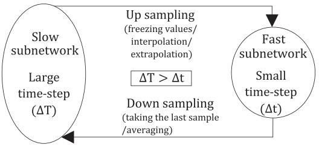  
Fig. 1. General structure of multi-rate EMT simulations.

can be used for the remaining subnetworks [2]. Time-steps for each subnetwork are selected based on their individual time response characteristics [3]. This can be done: (i) based on the time constants obtained from eigenvalue analysis for the original network [8], or (ii) by experience if the nature of the dynamics to be simulated is known [8], or (iii) by using a more thorough analysis of accuracy based on the methodology proposed in [9]. Fig. 1 depicts a dual-rate case where a large time-step Δ is Tused for the slow subnetwork while a small time-step Δ is used for the fast subnetwork. The slow subnetwork remains dormant while the fast subnetwork’s simulation proceeds. Hence, the solutions for both these subnetworks must be reconciled every time their simulation time-grids mutually coincide. While “down-sampling” (i.e., transferring the fast subnetwork’s results to the slow subnetwork), many approaches are possible. For example, one may average the values of the fast subnetwork’s interface variables [6] or simply take the last computed value of fast subnetwork’s interface variables [3]. Similarly, while “up-sampling” (i.e., transferring the slow subnetwork’s results to the fast subnetwork), many approaches are possible. For example, one may freeze the slow subnetwork’s interface variables [3] or use interpolation for assigning values to the intermediate small time-step instants [2], [6], or use extrapolation [7]. Note that up-sampling and down-sampling approaches can impact the accuracy of the simulation i.e., up-sampling may cause error accumulation in long-term simulations whereas downsampling may fail to accurately capture the dynamics emanating from the fast subnetwork. Hence, such approaches must be selected prudently while implementing multi-rate EMT simulation programs.

Several multi-rate simulation methods have been proposed in the literature - these include iterative [4], [5] as well as non-iterative approaches [2], [6], [7]. The former type uses iterations when reconciling the solution for the entire network while the latter type uses direct methods that avoid iterations.

Non-iterative methods have deterministic execution times and hence are usually the preferred choice [10].

Reference [2] presented one of the first non-iterative approaches for multi-rate EMT simulations. It uses a frequencydependent transmission line as the interface point for partitioning a network into fast and slow subnetworks. Alternatively, in [6], an extension of the Multi Area Thevenin Equivalent (MATE) concept [11] is proposed for carrying out multi-rate EMT simulations. Unlike [2], it does not require a transmission line at the partitioning point. Another approach in [7] uses a modification of the Latency Insertion Method (LIM) [12] for carrying out multi-rate EMT simulations.

Most of the existing literature [2], [6], [7], [9] on non-iterative multi-rate EMT simulation methods has primarily focused on demonstrating two things: (i) the accuracy of their respective approaches, and (ii) the enhancement of computational efficiency accrued from using their approach. Reference [10] attempts to address the issue of numerical stability; however, it uses a linearized system for the stability assessment which is inherently an approximation.

In this paper, we develop a rigorous analytical approach for assessing the stability of non-iterative multi-rate EMT simulations of linear time-invariant (LTI) networks. For this, we leverage the inherent discrete time-domain periodicity exhibited by such simulations. The proposed approach is used to assess the stability of a practical multi-rate EMT simulation method (i.e., the MATE-based method proposed in [6]). Test cases are presented in Section VI to validate the proposed approach. Principal contributions of this paper are:

1) It demonstrates that, contrary to popular belief [8], [13], a multi-rate EMT simulation can produce unstable results even for stable continuous-time LTI networks even if the well-known A-stable trapezoidal rule is used for discretization in each subnetwork (Section VI).   
2) It develops an analytical approach for obtaining sampleddata time-invariant representation for multi-rate EMT simulations of LTI networks. For this, it uses the well-known ‘lifting’ technique [14] and leverages the inherent periodicity exhibited by such simulations in the discrete-time domain. The time-invariant representation can then be used for assessing the numerical stability of the overall simulation via eigenvalue analysis (Sections II, IV, and V).

It should be noted that the multi-rate EMT simulation method of [6] is used in this paper merely to exemplify the effectiveness of our proposed stability assessment approach. The approach itself is entirely general and can be extended to any arbitrary non-iterative multi-rate simulation algorithm.

# II. MATHEMATICAL FRAMEWORK FOR THE PROPOSED STABILITY ASSESSMENT METHOD

In this section, we will discuss the mathematical framework used for developing our proposed approach for the stability assessment of the multi-rate EMT simulations of LTI networks. Reference [15] has proved that the Bounded Input Bounded Output stability of any non-autonomous LTI system (i.e., ones with

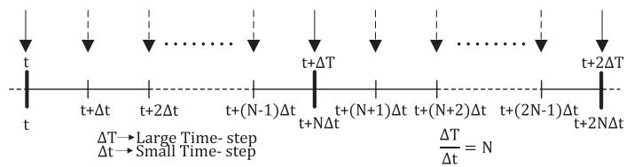  
Fig. 2. General timeline of multi-rate EMT simulations.

external inputs) can be inferred from the exponential stability of its autonomous counterpart (i.e., the same system but with zero inputs). Hence, we will only consider autonomous LTI networks while developing our stability assessment approach in this paper.

# A. State-Space Model of an Autonomous Linear Systems

The continuous time-domain state-space equation for an autonomous linear system is as in (1).

$$
\dot {\underline {{x}}} = \boldsymbol {A} \underline {{x}} \tag {1}
$$

By using any numerical integration method with a time-step Δ , the state vector in the present time-step $( \underline { { x } } ( t + \Delta t ) )$ can be t x t trelated to the state vector in the previous time-step ( ( )) using a linear transformation as in (2).

$$
\underline {{x}} (t + \Delta t) = G \underline {{x}} (t) \tag {2}
$$

For example, with the trapezoidal rule:

$$
\boldsymbol {G} = (\boldsymbol {I} - \boldsymbol {A} \Delta t / 2) ^ {- 1} (\boldsymbol {I} + \boldsymbol {A} \Delta t / 2)
$$

# B. Periodicity in Multi-Rate EMT Simulations of LTI Networks

Fig. 2 shows a typical timeline of a multi-rate simulation. Here, Δ is the large time-step (used in the slow subnetwork) Twhereas Δ is the small time-step (used in the fast subnetwork). tIn this paper, Δ is assumed to be an integer multiple of Δ , i.e., $\Delta T = N \Delta t$ twhere  is a positive integer greater than 1. T N t NThe following general steps are followed in each Δ interval in any multi-rate simulation method:

1) At every intermediate Δ instant within a Δ interval t T(indicated by dashed arrows in Fig. 2), only the fast subnetwork is solved; slow subnetwork remains latent. This means only fast subnetwork’s states are updated while slow subnetwork’s states are held constant.   
➢ At these instants, the slow subnetwork’s contribution to the fast subnetwork’s states is accounted for using up-sampling (e.g., freezing the slow subnetwork’s contribution [3] or using interpolation [2], [6] or using extrapolation [7]).   
2) At every time instant that is an integer multiple of Δ T(indicated by solid arrows in Fig. 2), both fast and slow subnetworks are solved. This means the states of both fast and slow subnetworks are updated.   
➢ At these instants, the fast subnetwork’s contribution to the slow subnetwork’s states is accounted for using down-sampling (e.g., using the fast subnetwork’s last available value [3] or averaging the fast subnetwork’s contribution over the previous Δ interval [6]).

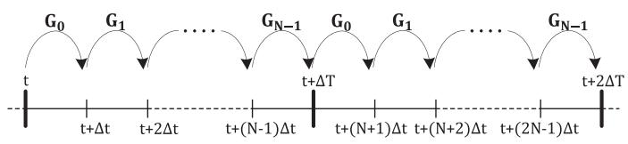  
Fig. 3. Periodic nature of multi-rate EMT simulations of LTI networks.

Consider the first $\Delta T$ interval $[ t , t + \Delta T )$ in Fig. 2 with a known initial condition $\underline { { x } } ( t )$ t, t T. In the fashion of (2), the intermediate states at every $\Delta t$ x tinstant can be written as in (3).

$$
\begin{array}{l} \underline {{x}} (t + \Delta t) = \boldsymbol {G} _ {0} \underline {{x}} (t) \\ \underline {{x}} (t + 2 \Delta t) = G _ {1} \underline {{x}} (t + \Delta t) \\ \begin{array}{c} \vdots \\ \vdots \\ \vdots \end{array} \\ \end{array}
$$

$$
\underline {{x}} (t + (N - 1) \Delta t) = G _ {N - 2} \underline {{x}} (t + (N - 2) \Delta t)
$$

$$
\underline {{x}} (t + \Delta \mathrm {T}) = G _ {N - 1} \underline {{x}} (t + (N - 1) \Delta t) \tag {3}
$$

In (3), the discrete-time matrices $G _ { 0 } , G _ { 1 } , . . . G _ { N - 1 }$ are 0 1 1typically distinct from each other [10] even though the original network is LTI in the continuous time-domain.1 This happens because of the selective updating of the fast and slow states within a $\Delta T$ interval as well as the use of up- and down-sampling methods in the discrete time-domain. However, if the original network is LTI in the continuous time-domain, it remains unchanged throughout the entire simulation (i.e., no switching). Because of this, we can say that the equations used for updating the states in the first $\Delta T$ interval of the simulation will be appli-Tcable for every subsequent $\Delta T$ interval i.e., $[ t + \Delta T , t + 2 \Delta T )$ Tand so on. Thus, as illustrated in Fig. 3, the $G _ { 0 } , G _ { 1 } , . . . G _ { N - 1 }$ matrices used in the interval $[ t , t + \Delta T )$ 0 1are identical to the $G _ { 0 } ,$ $G _ { 1 } , \dots G _ { N - 1 }$ t, t Tmatrices used in subsequent $\Delta T$ intervals $( \mathrm { i . e . } ,$ , $[ t + \Delta T , t + 2 \Delta T )$ and so on).

T, t TThis means that, for a given continuous-time LTI network, any multi-rate simulation method will always yield a periodically varying system in the discrete time-domain with the period as the large time-step $\Delta T .$ . The state transition equation over the entire $\Delta T$ Tperiod is then as given in (4) and the simulation is Tstable if and only if all the eigenvalues of the matrix G in (4) are inside the unit circle.

$$
\underline {{x}} (t + \Delta \mathrm {T}) = \mathbb {G} \underline {{x}} (t) \tag {4}
$$

where, $\mathbb { G } = G _ { N - 1 } \times G _ { N - 2 } \times \cdot \cdot \cdot \times G _ { 1 } \times G _ { 0 }$

1 2 1 0Although this is an effective way of assessing stability, in practice, obtaining G in (4) can be computationally onerous especially for large networks. Section II-C discusses a computationally efficient approach to address this.

1In Section IV, the $G _ { 0 } , G _ { 1 } , . . . G _ { N - 1 }$ given in (41)–(42) for the multi-rate simulation method of [6] clearly show that these matrices are indeed distinct.

C. Efficiently Obtaining a Time-Invariant Representation for a Periodically Varying Discrete Time System

For a periodically varying discrete-time system (such as the one in Fig. 3), it is possible to obtain a time-invariant representation by applying the ‘lifting’ technique [14]. In this technique, a lifting operator $\mathcal { L } : \underline { { v } } \mapsto \underline { { V } } _ { \mathcal { L } }$ is defined where  is a vector v V vsampled at the regular sampling rate (Δ in case of Fig. 3) whereas $\underline { { V } } _ { \mathcal { L } }$ tconsists of a collection of  consecutive samples of $\underline { v }$ V(sampled at $\mathbf { \mu } _ { ; } ^ { \mathrm { ~ ~ } } ( t + \Delta t ) , \dots ( t + ( N - 1 ) \Delta t ) )$ . Applying v t, t t , . . . t N t‘lifting’ to the state vector  for the periodically varying system of Fig. 3 yields a vector $\underline { { X } } _ { \mathcal { L } }$ as in (5).

$$
\underline {{X}} _ {\mathcal {L}} (t) = \left[ \begin{array}{c} \underline {{x}} (t) \\ \underline {{x}} (t + \Delta t) \\ \vdots \\ \underline {{x}} (t + (N - 1) \Delta t) \end{array} \right] \tag {5}
$$

Using the ‘lifted’ state vector $\underline { { X } } _ { \mathcal { L } }$ in (5) and the difference Xequations in (3), we can obtain a time-invariant representation as in (6) for the periodically varying discrete-time system of Fig. 3. In (6), the matrices $M _ { \mathcal { L } }$ and $H _ { \mathcal { L } }$ are as given in (7) where, I and 0 are appropriately sized identity and zero matrices, and $G _ { 0 } , G _ { 1 } , . . . G _ { N - 1 }$ are matrices from (3).

$$
\boldsymbol {M} _ {\mathcal {L}} \underline {{X}} _ {\mathcal {L}} (t + \Delta T) = \boldsymbol {H} _ {\mathcal {L}} \underline {{X}} _ {\mathcal {L}} (t) \tag {6}
$$

$$
M _ {\mathcal {L}} = \left[ \begin{array}{c c c c} \boldsymbol {I} & & & \\ & \mathbf {0} & & \\ & & \ddots & \\ & & & \mathbf {0} \end{array} \right];
$$

$$
\boldsymbol {H} _ {\mathcal {L}} = \left[ \begin{array}{c c c c} & & & \boldsymbol {G} _ {N - 1} \\ & & \boldsymbol {G} _ {N - 2} & - \boldsymbol {I} \\ & \ddots & \ddots & \\ \boldsymbol {G} _ {0} & - \boldsymbol {I} & & \end{array} \right] \tag {7}
$$

Using the time-invariant model in (6), the periodically varying discrete-time system of Fig. 3 can then be deemed to be stable if and only if all the finite eigenvalues2 of the matrix pencil $( H _ { \cdot }$ , $M _ { \mathcal { L } } )$ are inside the unit circle.

# III. MULTI-RATE EMT SIMULATIONS USING MATE

In this section, we review the Multi Area Thevenin Equivalent (MATE)-based multi-rate simulation method of [6]. This method is used in this paper for two purposes:

1) To demonstrate how to formulate the equations for our proposed method for assessing the stability of multi-rate EMT simulations.   
2) To show that our approach accurately predicts the stability of multi-rate EMT simulations.

Firstly, in order to establish the basic notations, we review how MATE helps in partitioning a network in single-rate EMT

2From (7), it is clear that $M _ { \mathcal { L } }$ in (6) is always rank deficient for $N > 1$ . Hence, in addition to the finite eigenvalues, the matrix pencil $( H _ { \mathit { L } } , M _ { \mathit { L } } )$ will also have some eigenvalues of magnitude $\infty .$ These extra ∞-magnitude eigenvalues can be ignored as they do not affect the system dynamics [21].

simulations [11]. Next, we briefly review how this approach is extended in [6] for carrying out multi-rate EMT simulations.

# A. Single-Rate EMT Simulations Using MATE [11]

Consider an autonomous network consisting of two subnetworks $\mathbf { \partial } ^ { \ast } \mathbf { S } ^ { \ast }$ and $\mathbf { \hat { F } } ^ { \ }$ with $\cdot _ { n _ { l } } ,$ number of links interconnecting nthem. Without loss of generality, it is assumed that the links have zero impedance. Let:

Y S, Y F : Admittance matrices of subnetworks $\mathbf { \partial } ^ { \ast } \mathbf { S } ^ { \ast }$ and ‘F’ $\underline { { v } } _ { S } , \underline { { v } } _ { F } \colon$ Node voltage vectors for subnetworks $\mathbf { \partial } ^ { 6 } \mathbf { S } ^ { \prime }$ and ‘F’ $\underline { { h } } _ { b S } , \underline { { h } } _ { b F } \mathrm { : }$ History current vectors of subnetworks $\mathbf { \epsilon } ^ { \ast } \mathbf { S } ^ { \prime }$ and $\mathbf { \bar { F } } ^ { \ , }$ $\underline { { i } } _ { \alpha } \colon$ h Link currents vector.

The equations for the interconnecting links can be written as in (8) using Kirchhoff’s Voltage Law (KVL).

$$
\boldsymbol {P} _ {S} ^ {T} \underline {{v}} _ {S} (t) + \boldsymbol {P} _ {F} ^ {T} \underline {{v}} _ {F} (t) = 0 \tag {8}
$$

Here, $P _ { S }$ and $P _ { F }$ are incidence matrices [16] that relate the internal node voltages of each subnetwork to the branch voltages of the links. The nodal equations for subnetworks $\mathbf { \partial } ^ { 6 } \mathbf { S } ^ { \prime }$ and ‘F’ are as in (9)–(10).

$$
\boldsymbol {Y} _ {S} \underline {{v}} _ {S} (t) + \boldsymbol {P} _ {S} \underline {{i}} _ {\alpha} (t) = - \boldsymbol {A} _ {\boldsymbol {i S}} ^ {T} \underline {{h}} _ {b S} (t) \tag {9}
$$

$$
\boldsymbol {Y} _ {\boldsymbol {F}} \underline {{v}} _ {F} (t) + \boldsymbol {P} _ {\boldsymbol {F}} \underline {{i}} _ {\alpha} (t) = - \boldsymbol {A} _ {\boldsymbol {i F}} ^ {\boldsymbol {T}} \underline {{h}} _ {b F} (t) \tag {10}
$$

Here, $A _ { i S }$ and $A _ { i F }$ are the node incidence matrices [16] which relate the internal node voltages of each subnetwork to the branch voltages of the energy storage elements inside the corresponding subnetwork. Using a few algebraic manipulations, (8)–(10) can be transformed to (11)–(13).

$$
\underline {{i}} _ {\alpha} (t) = \boldsymbol {Z} _ {\boldsymbol {t h}} ^ {- 1} \left(\underline {{V}} _ {t h S} (t) + \underline {{V}} _ {t h F} (t)\right) \tag {11}
$$

$$
\underline {{v}} _ {S} (t) = \underline {{e}} _ {S} (t) - B _ {S} \dot {\underline {{i}}} _ {\alpha} (t) \tag {12}
$$

$$
\underline {{v}} _ {F} (t) = \underline {{e}} _ {F} (t) - \boldsymbol {B} _ {\boldsymbol {F}} \underline {{i}} _ {\alpha} (t) \tag {13}
$$

Here,

$$
\underline {{e}} _ {S} (t) = - \boldsymbol {Y} _ {S} ^ {- 1} \boldsymbol {A} _ {\boldsymbol {i} \boldsymbol {S}} ^ {T} \underline {{h}} _ {b S} (t) \tag {14}
$$

$$
\underline {{e}} _ {F} (t) = - \boldsymbol {Y} _ {F} ^ {- 1} \boldsymbol {A} _ {\boldsymbol {i F}} ^ {\boldsymbol {T}} \underline {{h}} _ {b F} (t) \tag {15}
$$

$$
\underline {{V}} _ {t h S} (t) = \boldsymbol {P} _ {S} ^ {\boldsymbol {T}} \underline {{e}} _ {S} (t) \tag {16}
$$

$$
\underline {{V}} _ {t h F} (t) = \boldsymbol {P} _ {\boldsymbol {F}} ^ {\boldsymbol {T}} \underline {{e}} _ {F} (t) \tag {17}
$$

$$
\boldsymbol {B} _ {S} = \boldsymbol {Y} _ {S} ^ {- 1} \boldsymbol {P} _ {S} \tag {18}
$$

$$
\boldsymbol {B} _ {\boldsymbol {F}} = \boldsymbol {Y} _ {\boldsymbol {F}} ^ {- 1} \boldsymbol {P} _ {\boldsymbol {F}} \tag {19}
$$

$$
\begin{array}{l} Z _ {t h} = Z _ {t h S} + Z _ {t h F} \\ = \boldsymbol {P} _ {S} ^ {T} \boldsymbol {B} _ {S} + \boldsymbol {P} _ {F} ^ {T} \boldsymbol {B} _ {F} \tag {20} \\ \end{array}
$$

$\underline { { V } } _ { t h S }$ and $Z _ { t h S }$ represent the equivalent Thevenin source and Vimpedance of subnetwork $\mathbf { \epsilon } ^ { 6 } \mathbf { S } ^ { \prime }$ , while $\underline { { V } } _ { t h F }$ and $Z _ { t h F }$ represent Vthe equivalent Thevenin source and impedance of subnetwork $\mathbf { \bar { F } } ^ { \ , }$ . Of course, these impedances are purely resistive for EMT simulations. Using (11)–(20), the following steps are used for computing the network solution at any time : [11]

1) $\underline { { e } } _ { S } ( t )$ and $\underline { { e } } _ { F } ( t )$ tare computed using (14) and (15).

2) Knowing $\underline { { e } } _ { S } ( t )$ and $\underline { { e } } _ { F } ( t )$ , the Thevenin source vectors $( \underline { { V } } _ { t h S } ( t )$ eand $\underline { { V } } _ { t h F } ( t ) )$ t are computed using (16)–(17).   
V t3) Knowing $\underline { { V } } _ { t h S } ( t )$ tand $\underline { { V } } _ { t h F } ( t )$ , and $Z _ { t h }$ from (20), the Vlink currents $\underline { { i } } _ { \alpha } ( t )$ V tare then computed using (11).   
i t4) Knowing the link currents $\underline { { i } } _ { \alpha } ( t )$ as well as $\underline { { e } } _ { S } ( t )$ and $\underline { { e } } _ { F } ( t )$ i tfrom Step 1, the final network solutions ${ \underline { { v } } } _ { S } ( t )$ and $\underline { { v } } _ { F } ( t )$ are computed using (12)–(13).

# B. MATE-based Multi-Rate EMT Simulation [6]

Reference [6] proposes a method that uses MATE for interfacing two subnetworks in EMT simulations that are discretized with distinct time-steps. To understand how it works, let us consider the same autonomous network as in Section III-A; however, now the subnetwork $\mathbf { \partial } ^ { 6 } \mathbf { S } ^ { \prime }$ (indicating the ‘slow’ subnetwork) is discretized with a large time-step $\Delta T$ while the subnetwork T‘F’ (or ‘fast’ subnetwork) is discretized with a small time-step $\Delta t .$ . Here, $\Delta T \ = \ N \Delta t$ , with $N > 1$ . Because of the distinct t T N t N >time-steps that are used in the two subnetworks, [6] proposes the following to appropriately account for their contributions:

1) Averaging $o f i _ { \alpha }$ over a ΔT Interval for Down-Sampling: iAt every time instant that is an integer multiple of $\Delta T .$ , the Tentire network’s solution is computed i.e., both the fast as well as the slow subnetworks are solved. The fast subnetwork has been updated  times within the preceding $\Delta T$ interval (i.e., at every Nintermediate $\Delta t$ Tinstant). Now, if only the results at the final $N \Delta t$ t N tinstant were to be transferred to the slow subnetwork, all the intermediate solutions of the fast subnetwork would be ignored. To circumvent this, [6] proposes the following for solving the slow subnetwork at every Δ instant:

i) Compute $\underline { { i } } _ { \alpha ( a v g ) } ( t )$ Ti.e., the average of the previous i ( ) tsamples of link currents ${ \underline { { i } } _ { \alpha } }$ as shown in (21).

$$
\underline {{i}} _ {\alpha (a v g)} (t) = \frac {1}{N} \sum_ {r = 1} ^ {N} \underline {{i}} _ {\alpha} (t - \Delta T + r \Delta t) \tag {21}
$$

ii) Now, while computing the final network solution $\underline { { v } } _ { S } ( t )$ for the slow subnetwork using $( 1 2 ) , \underline { { { i } } } _ { \alpha ( a v g ) }$ v tis utilized instead i ( )of merely using the link current at the final $N \Delta t$ instant $( \mathrm { i } . \mathrm { e } . , \underline { { { i } } } _ { \alpha } ( t ) )$ N t. This means that (12) gets transformed to (22) i tfor the multi-rate case.

$$
\underline {{v}} _ {S} (t) = \underline {{e}} _ {S} (t) - B _ {S} \underline {{i}} _ {\alpha (\text {a v g})} (t) \tag {22}
$$

2) Linear Interpolation of $\underline { V } _ { t h s }$ for Up-Sampling: The fast Vsubnetwork is solved at every intermediate $\Delta t$ instant within a $\Delta T$ tinterval while the slow subnetwork remains latent. This Twould imply that at these instants, $\underline { { V } } _ { t h S }$ used for calculating ${ \underline { { i } } _ { \alpha } }$ V(using (11)) would remain constant. Instead of keeping it iconstant, [6] proposes the following:

i) Linearly interpolate the values of $\underline { { V } } _ { t h S }$ as in (23).

$$
\begin{array}{l} \underline {{V}} _ {t h S} (t + k \Delta t) = \underline {{V}} _ {t h S} (t) + \frac {k}{N} \left\{\underline {{V}} _ {t h S} (t + \Delta T) \right. \\ \left. - \underline {{V}} _ {t h S} (t) \right\} \tag {23} \\ \end{array}
$$

where, $k = 1 , 2 , \dots N$ .

k , , . . . Nii) Using the linearly interpolated $\underline { { V } } _ { t h S } ( t + k \Delta t )$ and knowing $\underline { { V } } _ { t h F } ( t + k \Delta t )$ V t k tfor the fast subnetwork (ob-V t k ttained using (17)), compute $\underline { { i } } _ { \alpha } ( t + k \Delta t )$ using (11).

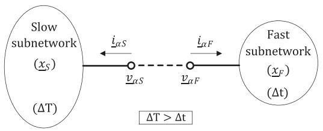  
Fig. 4. A generic representation of the slow and fast subnetworks for the MATE-based multi-rate simulation method of [6].

iii) Using $\underline { { i } } _ { \alpha } ( t + k \Delta t )$ , compute the final network solution $\underline { { v } } _ { F } ( t + k \Delta t )$ k tfor the fast subnetwork using (13).

# IV. TIME-INVARIANT REPRESENTATION OF MULTI-RATE EMT SIMULATIONS IN THE STANDARD STATE-SPACE FORM

In this section, we derive a sampled-data time-invariant representation of multi-rate EMT simulations in the Standard Statespace (SS) form, which can then be used for stability assessment. For this, the MATE-based multi-rate simulation method of [6] is used as an example here. However, the approach itself is entirely general and can be extended to any non-iterative multi-rate simulation method.

For obtaining a time-invariant representation for any multirate simulation method, the first step is to write down its update equations at every Δ instant within a $\Delta T$ interval. For the t Tmethod of [6], these are given in Section III. Now, consider a generic representation of two autonomous subnetworks with $\cdot _ { n _ { l } } ,$ interconnecting links as in Fig. 4.

In Fig. 4, the following notations are adopted:

$\underline { { { x _ { S } } } } \ \mathrm { a n d } \underline { { { x _ { F } } } } \mathrm { : \qquad N e t w o r k \ s t a t e s . }$

$\underline { { { v } } } _ { \alpha S } \mathrm { ~ a n d ~ } \underline { { { v } } } _ { \alpha F } \mathrm { : ~ \nabla ~ \ V o l t a g e s ~ a t ~ l i n k ~ t e r m i n a l s . }$

$\underline { { i } } _ { \alpha S } \mathrm { a n d } \underline { { i } } _ { \alpha F } \mathrm { : ~  ~ { L i n k } ~ c u r r e n t s . }$

The continuous time-domain state-space equations for each of these subnetworks are as in (24) and (25).

$$
\underline {{\dot {i}}} _ {S} = \boldsymbol {A} _ {\boldsymbol {S}} \underline {{x}} _ {S} + \boldsymbol {B} _ {\boldsymbol {S}} \underline {{i}} _ {\alpha S}; \underline {{v}} _ {\alpha S} = \boldsymbol {C} _ {\boldsymbol {S}} \underline {{x}} _ {S} \tag {24}
$$

$$
\underline {{\dot {x}}} _ {F} = \boldsymbol {A} _ {\boldsymbol {F}} \underline {{x}} _ {F} + \boldsymbol {B} _ {\boldsymbol {F}} \underline {{\dot {x}}} _ {\alpha F}; \underline {{v}} _ {\alpha F} = \boldsymbol {C} _ {\boldsymbol {F}} \underline {{x}} _ {F} \tag {25}
$$

$\underline { { i } } _ { \alpha S }$ and $\underline { { i } } _ { \alpha F }$ are taken as inputs to the subnetworks while $\underline { { v } } _ { \alpha S }$ and $\underline { { v } } _ { \alpha F }$ are taken as outputs. Without loss of generality, v vassuming zero impedance links, we get the following:

$$
\underline {{i}} _ {\alpha S} = - \underline {{i}} _ {\alpha F} := \underline {{i}} _ {\alpha}; \underline {{v}} _ {\alpha S} = \underline {{v}} _ {\alpha F} \tag {26}
$$

The slow and fast subnetworks are discretized with time-steps $\Delta T$ and $\Delta t ,$ respectively. For the method of [6], this yields $( 2 7 )  ( 2 8 )$ t. Note the use of $\underline { { i } } _ { \alpha ( a v g ) }$ instead of ${ \underline { { i } } _ { \alpha } }$ in (27) as discussed in Section III-B-1.

$$
\begin{array}{l} \underline {{x}} _ {S} (t + \Delta T) = \boldsymbol {L} _ {\boldsymbol {S}} \underline {{x}} _ {S} (t) + \boldsymbol {H} _ {\boldsymbol {S}} ^ {\prime} \underline {{i}} _ {\alpha (a v g)} (t) \\ + \boldsymbol {H} _ {\boldsymbol {S} \underline {{i}} _ {\alpha (a v g)}} (t + \Delta T) \tag {27} \\ \end{array}
$$

$$
\underline {{x}} _ {F} (t + \Delta t) = \boldsymbol {L} _ {\boldsymbol {F}} \underline {{x}} _ {F} (t) - \boldsymbol {H} _ {\boldsymbol {F}} ^ {\prime} \underline {{i}} _ {\alpha} (t) - \boldsymbol {H} _ {\boldsymbol {F}} \underline {{i}} _ {\alpha} (t + \Delta t) \tag {28}
$$

Here, the detailed expressions for the matrices ${ \cal L } _ { S } , { \cal H } _ { S } ^ { \prime } , { \cal H } _ { S }$ , ${ \cal L } _ { F } , { \cal H } _ { F } ^ { \prime }$ and $H _ { F }$ as well as those for the Thevenin equivalent sources $( \underline { { V } } _ { t h S }$ and $\underline { { V } } _ { t h F } )$ and the impedance $( Z _ { t h } )$ are given in

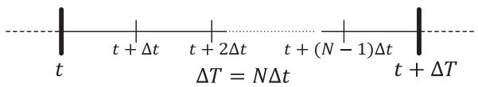  
Fig. 5. General timeline for obtaining a time-invariant representation for MATE-based multi-rate EMT simulation method of [6].

Appendix A. Now, consider a representative simulation interval $( t , t + \Delta T ]$ covering one large time-step period as shown in t, t TFig. 5. The values of $\underline { { x } } _ { S } , \underline { { x } } _ { F } , \underline { { i } } _ { \alpha }$ and $\underline { { i } } _ { \alpha ( a v g ) }$ are assumed to be x x i iknown at time  and all earlier instants.

tAt every small time-step instant $( t + k \Delta t )$ , where $k \_ =$ $\ ! , 2 , \ldots ( N - 1 )$ as well as the large time-step instant $( t + \Delta T )$ , the update equations are as given below:

At small time-step instants $( t + k \Delta t ) , k = 1 , 2 , \ldots ( N - 1 ) .$ :

t k t k , , . . . NAt these instants, only the fast subnetwork is solved; the slow subnetwork remains dormant. Thus, for the method of [6], the update equations at these instants are as in (29)–(32).

$$
\underline {{x}} _ {S} (t + k \Delta \mathrm {t}) = \underline {{x}} _ {S} (t + (k - 1) \Delta \mathrm {t}) \tag {29}
$$

$$
\begin{array}{l} \underline {{x}} _ {F} (t + k \Delta t) = \boldsymbol {L} _ {\boldsymbol {F}} \underline {{x}} _ {F} (t + (k - 1) \Delta t) \\ - \mathbf {H} _ {\mathbf {F}} ^ {\prime} \underline {{\dot {i}}} _ {\alpha} (t + (k - 1) \Delta t) \\ - \boldsymbol {H} _ {\boldsymbol {F}} \underline {{\dot {i}}} _ {\alpha} (t + k \Delta t) \tag {30} \\ \end{array}
$$

$$
\underline {{i}} _ {\alpha} (t + k \Delta t) = \boldsymbol {Z} _ {\boldsymbol {t h}} ^ {- 1} \left\{\underline {{V}} _ {t h S} (t + k \Delta t) + \underline {{V}} _ {t h F} (t + k \Delta t) \right\} \tag {31}
$$

$$
\underline {{i}} _ {\alpha (\Sigma)} (t + k \Delta t) = \underline {{i}} _ {\alpha (\Sigma)} (t + (k - 1) \Delta t) + \underline {{i}} _ {\alpha} (t + k \Delta t) \tag {32}
$$

Equation (29) represents the fact that the slow subnetwork’s state remain unchanged (as it is dormant) at these instants, while the fast subnetwork is being updated using (30). Equation (31) calculates the link currents at these instants. Note that in (31), the Thevenin voltage $\underline { { V } } _ { t h S } ( t + k \Delta t )$ of the slow subnetwork V t k tis obtained by linear interpolation as in (23). On the contrary, the Thevenin voltage $\underline { { V } } _ { t h F } ( t + k \Delta t )$ of the fast subnetwork V t k tis computed as shown in Appendix A. Finally, as discussed in Section III-B-1, the method of [6] requires $\underline { { i } } _ { \alpha ( a v g ) }$ to be computed at the next large time-step instant $( t + \Delta \dot { T } ) . \underline { { i } } _ { \alpha ( a v g ) }$ t T i ( )is the average value of the link currents computed at every Δt instant within $( t , t + \Delta T ]$ . Thus, for correctly computing $\underline { { i } } _ { \alpha ( a v g ) } ( t + \Delta T )$ t, t T, a running sum of the link currents at these i ( ) t Tinstants needs to be computed. The variable $\underline { { i } } _ { \alpha ( \Sigma ) }$ in (32) is i (Σ)used for calculating this running sum. Initially at time $t , \underline { { i } } _ { \alpha ( \Sigma ) }$ is assumed to be zero.

At the large time-step instant $( t + \Delta T ) \colon [ i . e . , ( t + N \Delta t ) ] .$

t T t N tAt this instant, both the fast and the slow subnetwork are solved. Thus, the update equations are as in (33)–(37).

$$
\begin{array}{l} \underline {{x}} _ {S} (t + \Delta \mathrm {T}) = L _ {S} \underline {{x}} _ {S} (t + (N - 1) \Delta \mathrm {t}) \\ + \boldsymbol {H} _ {\boldsymbol {S}} ^ {\prime} i _ {\alpha (a v g)} (t) \\ + \boldsymbol {H} _ {\boldsymbol {S}} \underline {{i}} _ {\alpha (a v g)} (t + \Delta T) \tag {33} \\ \end{array}
$$

$$
\begin{array}{l} \underline {{x}} _ {F} (t + \Delta \mathrm {T}) = L _ {F} \underline {{x}} _ {F} (t + (N - 1) \Delta \mathrm {t}) \\ - \mathbf {H} _ {\mathbf {F}} ^ {\prime} \underline {{\dot {i}}} _ {\alpha} (t + (N - 1) \Delta t) \\ - \boldsymbol {H} _ {\boldsymbol {F}} i _ {\alpha} (t + \Delta \mathrm {T}) \tag {34} \\ \end{array}
$$

$$
\underline {{i}} _ {\alpha} (t + \Delta T) = \boldsymbol {Z} _ {t h} ^ {- 1} \left\{\underline {{V}} _ {t h S} (t + \Delta T) + \underline {{V}} _ {t h F} (t + \Delta T) \right\} \tag {35}
$$

$$
\begin{array}{l} \underline {{i}} _ {\alpha (\mathrm {a v g})} (t + \Delta T) = \frac {1}{N} \underline {{i}} _ {\alpha (\Sigma)} (t + (N - 1) \Delta t) \\ + \frac {1}{N} i _ {\alpha} (t + \Delta T) \tag {36} \\ \end{array}
$$

$$
\underline {{i}} _ {\alpha (\Sigma)} (t + \Delta \mathrm {T}) = \underline {{0}} \tag {37}
$$

Equations (33)–(34) are the state-transition equations for both the subnetworks. Equation (35) calculates the link currents at this instant where $\underline { { V } } _ { t h S } ( t + \Delta \mathrm { T } )$ and $\underline { V } _ { t h F } ( t + \Delta \mathrm { T } )$ are computed V t V tas shown in Appendix A. Equation (36) computes the averaged value of the link currents in the interval $( t , t + \Delta T ]$ using $\underline { { i } } _ { \alpha ( \Sigma ) } ( t + ( N - 1 ) \Delta \mathfrak { t } ) \ [ \mathrm { i . e . }$ t, t T, the running sum of the link currents i (Σ) t Ncomputed so far in the interval $( t , t + \Delta T ) ]$ and $\underline { { i } } _ { \alpha } ( t + \Delta \mathrm { T } )$ t, tfrom (35). Finally, (37) resets the value of $\underline { { i } } _ { \alpha ( \Sigma ) }$ i tto zero so that i (Σ)the average value of the link currents over the next ΔT interval can be computed correctly.

# Obtaining a Time-invariant Representation in the SS Form:

For the MATE-based method of [6], in order to obtain a sampled-data time-invariant representation in the SS form, we define $\underline { { x } } ( t )$ as in (38) as the state vector. In (38), $\underline { { x } } _ { S } ( t )$ and $\underline { { x } } _ { S } ( t - \Delta T )$ x tare the slow states at the present and the x t Tprevious large time-step instants. Additionally, $\underline { { i } } _ { \alpha ( a v g ) } ( t )$ and $\underline { { i } } _ { \alpha ( a v g ) } ( t - \Delta T )$ i ( ) tare the averaged values of the link currents i ( ) t Tfrom the previous two large time-step intervals.

$$
\underline {{x}} (t) \triangleq \left[ \begin{array}{c} \underline {{x}} _ {S} (t) \\ \underline {{i}} _ {\alpha (a v g)} (t) \\ \underline {{x}} _ {S} (t - \Delta T) \\ \underline {{i}} _ {\alpha (a v g)} (t - \Delta T) \\ \underline {{i}} _ {\alpha (\Sigma)} (t) \\ \underline {{x}} _ {F} (t) \\ \underline {{i}} _ {\alpha} (t) \end{array} \right] \tag {38}
$$

Now, the state transition equations at every $\Delta t$ instant within the interval $( t , t + \Delta T ]$ are as given in (39).

$$
\underline {{x}} (t + k \Delta t) = G _ {k - 1} \underline {{x}} (t + (k - 1) \Delta t) \tag {39}
$$

Here, $k = 1 , 2 , \hdots N .$

Applying a few algebraic manipulations to (29)–(37) yields the matrices $G _ { k - 1 }$ as in (41) and (42). Finally, (40) gives the 1sampled-data time-invariant representation in the SS form for the MATE-based multi-rate simulation of an LTI network.

$$
\underline {{x}} (t + \Delta \mathrm {T}) = \mathbb {G} \underline {{x}} (t) \tag {40}
$$

$\mathrm { H e r e , } \mathbb { G } = G _ { N - 1 } \times G _ { N - 2 } \times \cdot \cdot \cdot \times G _ { 1 } \times G _ { 0 } .$

# 1 2Challenges in using the SS Form:

The above discussion showed that a sampled-data timeinvariant representation of multi-rate EMT simulations of LTI networks can certainly be obtained in the SS form. And this can then be used for the stability assessment of the simulation by ascertaining if the eigenvalues of the overall state transition matrix G (from (40)) are inside the unit circle.

However, for large networks, the computational effort required in obtaining the matrices $G _ { 0 } , G _ { 1 } , . . . G _ { N - 1 }$ can be 0 1 1very demanding due to the large number of intermediate matrix manipulations involved (as seen from the expressions in (41) and (42), shown at the bottom of this page). Additionally, the matrices involved in EMT simulations of large networks are typically very sparse [17]. However, the operations required for obtaining $G _ { 0 } , G _ { 1 } , . . . G _ { N - 1 }$ as in (41)–(42) can usually destroy their sparsity. To overcome these challenges, we present an efficient approach for obtaining a time-invariant representation of multi-rate EMT simulations in the next section.

# V. AN EFFICIENT WAY OF OBTAINING A TIME-INVARIANT REPRESENTATION OF MULTI-RATE EMT SIMULATIONS USING THE DESCRIPTOR STATE-SPACE EQUATION FORM

In this section, we adapt and use the approach of [18] for obtaining a discrete-time state-space representation directly from Dommel’s formulation (this approach is reviewed in Appendix B). Thereafter, a time-invariant representation of the multi-rate simulation is formulated in the Descriptor State-space Equation (DSE) form (sometimes also referred to as the Differential Algebraic Equation (DAE) form). The computational effort for obtaining this DSE representation is significantly less as compared to that needed for obtaining the SS representation of (40) from the previous section.

At ( + Δ ) where $k = 1 , 2 , \ldots ( N - 1 )$ : [note that the entries in the dashed box are dependent on the index ]

$$
\left[ \begin{array}{c c c c c c c} I & 0 & 0 & 0 & 0 & 0 & 0 \\ 0 & I & 0 & 0 & 0 & 0 & 0 \\ 0 & 0 & I & 0 & 0 & 0 & 0 \\ 0 & 0 & 0 & I & 0 & 0 & 0 \\ \hline \frac {k}{N} Z _ {t h} ^ {- 1} C _ {S} L _ {S} & \frac {k}{N} Z _ {t h} ^ {- 1} C _ {S} H _ {S} ^ {\prime} & \left(1 - \frac {k}{N}\right) Z _ {t h} ^ {- 1} C _ {S} L _ {S} & \left(1 - \frac {k}{N}\right) Z _ {t h} ^ {- 1} C _ {S} H _ {S} ^ {\prime} & I & - Z _ {t h} ^ {- 1} C _ {F} L _ {F} & Z _ {t h} ^ {- 1} C _ {F} H _ {F} ^ {\prime} \\ - \frac {k}{N} H _ {F} Z _ {t h} ^ {- 1} C _ {S} L _ {S} & - \frac {k}{N} H _ {F} Z _ {t h} ^ {- 1} C _ {S} H _ {S} ^ {\prime} & - \left(1 - \frac {k}{N}\right) H _ {F} Z _ {t h} ^ {- 1} C _ {S} L _ {S} & - \left(1 - \frac {k}{N}\right) H _ {F} Z _ {t h} ^ {- 1} C _ {S} H _ {S} ^ {\prime} & 0 & L _ {F} + H _ {F} Z _ {t h} ^ {- 1} C _ {F} L _ {F} & - \left(H _ {F} ^ {\prime} + H _ {F} Z _ {t h} ^ {- 1} C _ {F} H _ {F} ^ {\prime}\right) \\ \frac {k}{N} Z _ {t h} ^ {- 1} C _ {S} L _ {S} & \frac {k}{N} Z _ {t h} ^ {- 1} C _ {S} H _ {S} ^ {\prime} & \left(1 - \frac {k}{N}\right) Z _ {t h} ^ {- 1} C _ {S} L _ {S} & \Big (1 - \frac {k}{N} \Big) Z _ {t h} ^ {- 1} C _ {S} H _ {S} ^ {\prime} & 0 & - Z _ {t h} ^ {- 1} C _ {F} L _ {F} & Z _ {t h} ^ {- 1} C _ {F} H _ {F} ^ {\prime} \end{array} \right] \tag {41}
$$

${ \mathrm { A t } } \left( t + \Delta T \right) : [ { \mathrm { i . e . , ~ } } ( t + k \Delta { \mathrm { t } } ) { \mathrm { ~ w h e r e ~ } } k = N ]$

$$
G _ {k - 1} = \left[ \begin{array}{c c c c c c c} L _ {S} + \frac {1}{N} H _ {S} Z _ {t h} ^ {- 1} C _ {S} L _ {S} & H _ {S} ^ {\prime} + \frac {1}{N} H _ {S} Z _ {t h} ^ {- 1} C _ {S} H _ {S} ^ {\prime} & 0 & 0 & \frac {1}{N} H _ {S} & - \frac {1}{N} H _ {S} Z _ {t h} ^ {- 1} C _ {F} L _ {F} & \frac {1}{N} H _ {S} Z _ {t h} ^ {- 1} C _ {F} H _ {F} ^ {\prime} \\ \frac {1}{N} Z _ {t h} ^ {- 1} C _ {S} L _ {S} & \frac {1}{N} Z _ {t h} ^ {- 1} C _ {S} H _ {S} ^ {\prime} & 0 & 0 & \frac {1}{N} I & - \frac {1}{N} Z _ {t h} ^ {- 1} C _ {F} L _ {F} & \frac {1}{N} Z _ {t h} ^ {- 1} C _ {F} H _ {F} ^ {\prime} \\ I & 0 & 0 & 0 & 0 & 0 & 0 \\ 0 & I & 0 & 0 & 0 & 0 & 0 \\ 0 & 0 & 0 & 0 & 0 & 0 & 0 \\ - H _ {F} Z _ {t h} ^ {- 1} C _ {S} L _ {S} & - H _ {F} Z _ {t h} ^ {- 1} C _ {S} H _ {S} ^ {\prime} & 0 & 0 & 0 & L _ {F} + H _ {F} Z _ {t h} ^ {- 1} C _ {F} L _ {F} & - \left(H _ {F} ^ {\prime} + H _ {F} Z _ {t h} ^ {- 1} C _ {F} H _ {F} ^ {\prime}\right) \\ Z _ {t h} ^ {- 1} C _ {S} L _ {S} & Z _ {t h} ^ {- 1} C _ {S} H _ {S} ^ {\prime} & 0 & 0 & 0 & - Z _ {t h} ^ {- 1} C _ {F} L _ {F} & Z _ {t h} ^ {- 1} C _ {F} H _ {F} ^ {\prime} \end{array} \right] \tag {42}
$$

For obtaining the DSE representation, we consider the representative simulation interval $[ t , t + \Delta T )$ shown in Fig. 5 and t, t Tthen write down the update equations for the multi-rate simulation at the large time-step instant ( ) as well as at every small time-step instant $( t + k \Delta t )$ , where $k = 1 , 2 , \ldots ( N - 1 )$ . The update equations at these instants for the method of [6] can be written down using (11)–(23) discussed in Section III as well as using (43).

$$
\underline {{h}} _ {b} (t + \Delta \tau) = K \underline {{h}} _ {b} (t) + Y _ {b} A _ {i} \underline {{v}} (t) \tag {43}
$$

Equation (43) relates the history current values of the storage elements in the next time-step $( \underline { { h } } _ { b } ( t + \Delta \tau ) )$ ) to their present time-step values $( \underline { { h } } _ { b } ( t ) )$ h t τ and the present time-step node voltages $( \underline { { v } } ( t ) )$ h t). Details of (43) are given in Appendix B. v tAt the large time-step instant ( ):

At this instant, both the slow as well as the fast subnetwork are solved. Thus, for the method [6], the equations used to solve both these subnetworks at this instant are as in (44)–(48).

$$
\underline {{V}} _ {t h S} (t) = - \boldsymbol {P} _ {S} ^ {T} \boldsymbol {Y} _ {S} ^ {- 1} \boldsymbol {A} _ {\boldsymbol {i} \boldsymbol {S}} ^ {T} \underline {{h}} _ {b S} (t) \tag {44}
$$

$$
\underline {{V}} _ {t h F} (t) = - \boldsymbol {P} _ {F} ^ {T} \boldsymbol {Y} _ {F} ^ {- 1} \boldsymbol {A} _ {i F} ^ {T} \underline {{h}} _ {b F} (t) \tag {45}
$$

$$
\underline {{i}} _ {\alpha} (t) = \boldsymbol {Z} _ {t h} ^ {- 1} \left(\underline {{V}} _ {t h S} (t) + \underline {{V}} _ {t h F} (t)\right) \tag {46}
$$

$$
\underline {{v}} _ {F} (t) = - \boldsymbol {Y} _ {F} ^ {- 1} \boldsymbol {A} _ {\boldsymbol {i} \boldsymbol {F}} ^ {\boldsymbol {T}} \underline {{h}} _ {b F} (t) - \boldsymbol {Y} _ {F} ^ {- 1} \boldsymbol {P} _ {\boldsymbol {F}} \underline {{i}} _ {\alpha} (t) \tag {47}
$$

$$
\begin{array}{l} \underline {{v}} _ {S} (t) = - \boldsymbol {Y} _ {\boldsymbol {S}} ^ {- 1} \boldsymbol {A} _ {\boldsymbol {i S}} ^ {\boldsymbol {T}} \underline {{h}} _ {b S} (t) \\ - \boldsymbol {Y} _ {\boldsymbol {S}} ^ {- 1} \boldsymbol {P} _ {\boldsymbol {S}} \left\{\frac {1}{N} \sum_ {r = 1} ^ {N} \underline {{i}} _ {\alpha} (t - \Delta T + r \Delta t) \right\} \tag {48} \\ \end{array}
$$

On the right-hand side of $( 4 8 ) , \underline { { i } } _ { \alpha } ( t )$ is known from (46) whereas ${ \underline { { i } } _ { \alpha } } ( t - \Delta T + r \Delta t )$ for $r ~ = ~ 1 , 2 , \ldots ( N - 1 )$ are the known i tvalues of $\underline { { i } } _ { \alpha } ( t )$ t r , ,at the intermediate $\Delta t$ Ninstants in the previous $\Delta T$ i tinterval. In (46), the $Z _ { t h }$ tis as in (49).

$$
\begin{array}{l} Z _ {t h} = Z _ {t h S} + Z _ {t h F} \\ = P _ {S} ^ {T} Y _ {S} ^ {- 1} P _ {S} + P _ {F} ^ {T} Y _ {F} ^ {- 1} P _ {F} \tag {49} \\ \end{array}
$$

Note: For calculating $Z _ { t h S }$ of the slow subnetwork in (49), the admittance matrix $Y _ { S }$ uses the time-step $\Delta T _ { : }$ whereas for calculating $Z _ { t h F }$ Tof the fast subnetwork in (49), the admittance matrix $Y _ { F }$ uses the time-step Δ [6].

Now, let $\underline { { h } } _ { b S }$ tbe the vector of history currents for the storage elements $( \mathrm { i . e . , }$ inductors, capacitors) in the slow subnetwork; and let $\underline { { h } } _ { b F }$ be the vector of history currents for the storage helements in the fast subnetwork. Knowing $\underline { { v } } _ { F } ( t )$ and ${ \underline { { v } } } _ { S } ( t )$ from (47)–(48), the history current vectors $\underline { { h } } _ { b S } ( t )$ tand $\underline { { h } } _ { b F } ( t )$ tcan be updated as in (50)–(51).

$$
\underline {{h}} _ {b S} (t + \Delta \mathrm {T}) = K _ {S} \underline {{h}} _ {b S} (t) + Y _ {b S} A _ {i S} \underline {{v}} _ {S} (t) \tag {50}
$$

$$
\underline {{h}} _ {b F} (t + \Delta t) = \boldsymbol {K} _ {\boldsymbol {F}} \underline {{h}} _ {b F} (t) + \boldsymbol {Y} _ {\boldsymbol {b F}} \boldsymbol {A} _ {\boldsymbol {i F}} \underline {{v}} _ {F} (t) \tag {51}
$$

Equations (50)–(51) are similar to the history current update equation in (43). However, notice that $\underline { { h } } _ { b S }$ is updated at $( t + \Delta \mathrm { T } )$ hi.e., the next large time-step instant, whereas $\underline { { h } } _ { b F }$ is tupdated at $( t + \Delta { \mathrm { t } } )$ i.e., the next small time-step instant.

Using algebraic manipulations, (44)–(48) can be shown to be equivalent to (52)–(55).

$$
\boldsymbol {Y} _ {\boldsymbol {S}} \underline {{v}} _ {S} ^ {\prime} (t) + \boldsymbol {P} _ {\boldsymbol {S}} \underline {{i}} _ {\alpha} (t) + \boldsymbol {A} _ {\boldsymbol {i S}} ^ {T} \underline {{h}} _ {b S} (t) = \underline {{0}} \tag {52}
$$

$$
\boldsymbol {Y} _ {\boldsymbol {F}} \underline {{v}} _ {F} (t) + \boldsymbol {P} _ {\boldsymbol {F}} \underline {{i}} _ {\alpha} (t) + \boldsymbol {A} _ {\boldsymbol {i} \boldsymbol {F}} ^ {T} \underline {{h}} _ {b F} (t) = \underline {{0}} \tag {53}
$$

$$
\boldsymbol {P} _ {\boldsymbol {S}} ^ {\boldsymbol {T}} \underline {{v}} _ {S} ^ {\prime} (t) + \boldsymbol {P} _ {\boldsymbol {F}} ^ {\boldsymbol {T}} \underline {{v}} _ {F} (t) = \underline {{0}} \tag {54}
$$

$$
\begin{array}{l} \boldsymbol {Y} _ {\boldsymbol {S}} \underline {{v}} _ {\boldsymbol {S}} (t) + \boldsymbol {P} _ {\boldsymbol {S}} \left\{\frac {1}{N} \sum_ {r = 1} ^ {N} \underline {{i}} _ {\alpha} (t - \Delta T + r \Delta t) \right\} \\ + \boldsymbol {A} _ {i S} ^ {T} \underline {{h}} _ {b S} (t) = \underline {{0}} \tag {55} \\ \end{array}
$$

Here, ${ \underline { { v } } } _ { S } ( t )$ is the node voltage vector for the slow subnetwork vwhereas $\underline { { v } } _ { S } ^ { \prime } ( t )$ is an intermediate variable that arises from the v talgebraic manipulations. Together, (50)–(55) are the update equations at the large time-step instant ( ). Now, knowing $\underline { { h } } _ { b S } ( t + \Delta \mathrm { T } )$ from (50), $\underline { { V } } _ { t h S } ( t + \Delta \mathrm { T } )$ is as given in (56).

$$
\underline {{V}} _ {t h S} (t + \Delta \mathrm {T}) = - \boldsymbol {P} _ {S} ^ {T} \boldsymbol {Y} _ {S} ^ {- 1} \boldsymbol {A} _ {i S} ^ {T} \underline {{h}} _ {b S} (t + \Delta \mathrm {T}) \tag {56}
$$

This $\underline { { V } } _ { t h S } ( t + \Delta \mathrm { T } )$ is used at subsequent $\Delta t$ instants in the $[ t , t + \Delta T )$ t tinterval for estimating the value of $\underline { { V } } _ { t h S }$ by linear t, t Tinterpolation.

At small time-step instants $( t + k \Delta t ) , k = 1 , 2 , \ldots ( N - 1 )$ :

At these instants, only the fast subnetwork is solved; the slow subnetwork remains dormant. Slow subnetwork’s contribution to the solution of the fast subnetwork is accounted by linearly interpolating the value of $\underline { { V } } _ { t h S }$ using two of its known values at and $\left( t + \Delta \mathrm { T } \right) \left[ 6 \right]$ V. Thus, the equations used for solving the t tfast subnetwork at each of these instants are as in (57)–(60).

$$
\begin{array}{l} \underline {{V}} _ {t h S} (t + k \Delta t) = \underline {{V}} _ {t h S} (t) \\ + \frac {k}{N} \left\{\underline {{V}} _ {t h S} (t + \Delta \mathrm {T}) - \underline {{V}} _ {t h S} (t) \right\} \tag {57} \\ \end{array}
$$

$$
\begin{array}{l} \underline {{V}} _ {t h F} (t + k \Delta t) = - \boldsymbol {P} _ {\boldsymbol {F}} ^ {\boldsymbol {T}} \boldsymbol {Y} _ {F} ^ {- 1} \boldsymbol {A} _ {\boldsymbol {i} \boldsymbol {F}} ^ {\boldsymbol {T}} \underline {{h}} _ {b F} (t + k \Delta t) (58) \\ \underline {{i}} _ {\alpha} (t + k \Delta t) = Z _ {t h} ^ {- 1} (\underline {{V}} _ {t h S} (t + k \Delta t) + \underline {{V}} _ {t h F} (t + k \Delta t)) (59) \\ \end{array}
$$

$$
\begin{array}{l} \underline {{v}} _ {F} (t + k \Delta t) = - \boldsymbol {Y} _ {F} ^ {- 1} \boldsymbol {A} _ {\boldsymbol {i} \boldsymbol {F}} ^ {\boldsymbol {T}} \underline {{h}} _ {b F} (t + k \Delta t) \\ - \boldsymbol {Y} _ {F} ^ {- 1} \boldsymbol {P} _ {\boldsymbol {F}} \underline {{i}} _ {\alpha} (t + k \Delta t) \tag {60} \\ \end{array}
$$

Note: The $Z _ { t h }$ used in (58) is the same as in (49). It does not change over the course of the entire simulation as the original network is assumed to be LTI in the continuous time-domain.

Now, knowing $\underline { { v } } _ { F } ( t + k \Delta t )$ from (60), the history current vector ${ \underline { { h } } _ { b F } } ( t + ( k + 1 ) \Delta \mathrm { t } )$ tfor the fast subnetwork at the next $\Delta t$ h t kinstant can be updated as in (61). This is similar to (43).

$$
\begin{array}{l} \underline {{h}} _ {b F} (t + (k + 1) \Delta t) = \boldsymbol {K} _ {\boldsymbol {F}} \underline {{h}} _ {b F} (t + k \Delta t) \\ + \mathbf {Y} _ {\mathbf {b F}} \mathbf {A} _ {\mathbf {i F}} \underline {{\upsilon}} _ {F} (t + k \Delta t) \tag {61} \\ \end{array}
$$

Again, it can be shown that (57)–(60) are equivalent to (62)–(65).

$$
\underline {{h}} _ {b S} (t + k \Delta t) = \underline {{h}} _ {b S} (t) + \frac {k}{N} \left\{\underline {{h}} _ {b S} (t + \Delta \mathrm {T}) - \underline {{h}} _ {b S} (t) \right\} \tag {62}
$$

$$
\boldsymbol {Y} _ {\boldsymbol {S}} \underline {{v}} _ {S} ^ {\prime} (t + k \Delta t) + \boldsymbol {P} _ {\boldsymbol {S}} \underline {{i}} _ {\alpha} (t + k \Delta t) + \boldsymbol {A} _ {\boldsymbol {i} \boldsymbol {S}} ^ {T} \underline {{h}} _ {b S} (t + k \Delta t) = \underline {{0}} \tag {63}
$$

$$
\boldsymbol {Y} _ {\boldsymbol {F}} \underline {{v}} _ {F} (t + k \Delta t) + \boldsymbol {P} _ {\boldsymbol {F}} \underline {{i}} _ {\alpha} (t + k \Delta t) + \boldsymbol {A} _ {\boldsymbol {i F}} ^ {T} h _ {b F} (t + k \Delta t) = \underline {{0}} \tag {64}
$$

$$
\boldsymbol {P} _ {\boldsymbol {S}} ^ {\boldsymbol {T}} \underline {{v}} _ {S} ^ {\prime} (t + k \Delta t) + \boldsymbol {P} _ {\boldsymbol {F}} ^ {\boldsymbol {T}} \underline {{v}} _ {F} (t + k \Delta t) = \underline {{0}} \tag {65}
$$

Here, $\underline { { v } } _ { S } ^ { \prime } ( t + k \Delta t )$ is again an intermediate variable that arises v t k tfrom the algebraic manipulations. Together, (61)–(65) are the update equations at each intermediate $\Delta t$ instant.

tObtaining a Time-invariant Representation in the DSE Form:

For obtaining a sampled-data time-invariant representation in the DSE form, we define $\underline { { X } } _ { D } ( t )$ as in (66) as the state vector. In $( 6 6 ) , \underline { { X } } _ { S } ( t ) , \underline { { X } } _ { F } ( t )$ Xand $\boldsymbol { \mathit { X } } _ { L } ( t )$ are as defined in (67)–(68). XNote that $\underline { { X } } _ { S } ( t ) , \underline { { X } } _ { F } ( t )$ Xand $\boldsymbol { \mathit { X } } _ { L } ( t )$ have a form similar to the X t‘lifted’ state vector $\underline { { X } } _ { \mathcal { L } } ( t )$ X tas in (5). Now, using (50)–(55) as well Xas (61)–(65), and the $\underline { { X } } _ { D } ( t )$ defined in (66), we can get a time-X tinvariant representation for a MATE-based multi-rate simulation of an LTI network as in (69) with $M _ { D }$ and $H _ { D }$ as in (70), shown at the bottom of this page.

$$
\begin{array}{l} \underline {{X}} _ {D} (t) \triangleq \left[ \begin{array}{c} \underline {{X}} _ {S} (t) \\ \underline {{v}} _ {S} (t) \\ \underline {{X}} _ {F} (t) \\ \underline {{i}} _ {\alpha} (t) \\ \underline {{X}} _ {L} (t) \\ \underline {{X}} _ {L} (t - \Delta T) \end{array} \right] (66) \\ \underline {{X}} _ {S} \left(t\right) \triangleq \left[ \begin{array}{c} \underline {{h}} _ {b S} \left(t\right) \\ \underline {{v}} _ {S} ^ {\prime} \left(t\right) \\ \underline {{h}} _ {b S} \left(t + \Delta t\right) \\ \underline {{v}} _ {S} ^ {\prime} \left(t + \Delta t\right) \\ \vdots \\ \underline {{h}} _ {b S} \left(t + (N - 1)   \Delta t\right) \\ \underline {{v}} _ {S} ^ {\prime} \left(t + (N - 1)   \Delta t\right) \end{array} \right]; \\ \underline {{X}} _ {F} (t) \triangleq \left[ \begin{array}{c} \underline {{h}} _ {b F} (t) \\ \underline {{v}} _ {F} (t) \\ \underline {{h}} _ {b F} (t + \Delta t) \\ \underline {{v}} _ {F} (t + \Delta t) \\ \vdots \\ \underline {{h}} _ {b F} (t + (N - 1) \Delta t) \\ \underline {{v}} _ {F} (t + (N - 1) \Delta t) \end{array} \right] (67) \\ \underline {{X}} _ {L} (t) \triangleq \left[ \begin{array}{c} \underline {{i}} _ {\alpha} (t + \Delta t) \\ \underline {{i}} _ {\alpha} (t + 2 \Delta t) \\ \vdots \\ \underline {{i}} _ {\alpha} (t + (N - 1) \Delta t) \end{array} \right] (68) \\ \boldsymbol {M} _ {\boldsymbol {D}} \underline {{X}} _ {\boldsymbol {D}} (t + \Delta T) = \boldsymbol {H} _ {\boldsymbol {D}} \underline {{X}} _ {\boldsymbol {D}} (t) (69) \\ \end{array}
$$

TABLE I EQUATIONS FOR POPULATING ENTRIES OF $M _ { D }$ AND $H _ { D }$ IN (70)   

<table><tr><td>Sub-matrices of MDand HD</td><td>Equations to be used</td></tr><tr><td>M11,H11,H12,H14,H15</td><td>(50), (52), (62) and (63)</td></tr><tr><td>H22,H24,H26</td><td>(55)</td></tr><tr><td>M33,H33,H34,H35</td><td>(51), (53), (61) and (64)</td></tr><tr><td>H41,H43</td><td>(54)</td></tr><tr><td>H51,H53</td><td>(65)</td></tr></table>

In (70), all entries that are blank are zeros while I and 0 are appropriately sized identity and zero matrices. The entries in other sub-matrices of $M _ { D }$ and $H _ { D }$ can be populated using (50)–(55) and (61)–(65). Table I specifies exactly which of these equations can be used for populating the entries in these sub-matrices of $M _ { D }$ and $H _ { D }$ . Subsequently, using the time-invariant model in (70), we can say that the simulation is stable if and only if all the finite eigenvalues of the matrix pencil $( H _ { D } , M _ { D } )$ are inside the unit circle.

It should be noted that although the method of [6] is used as an example here, the above approach is entirely general and can be extended to any non-iterative multi-rate simulation method if its update equations are known.

Overcoming the Challenges in the Stability Assessment

for Large Networks:

From the update equations in (50)–(55) and (61)–(65), it is clear that while obtaining the DSE representation, intermediate matrix manipulations are completely avoided. Thus, the computational effort in this case will be significantly less as compared to that needed for obtaining the standard state-space representation of (40) from the previous section. Additionally, the matrices $K _ { S }$ , $Y _ { b S } , Y _ { S } , P _ { S } , A _ { i S } , K _ { F } , Y _ { b F } , Y _ { F } , P _ { F }$ and $A _ { i F }$ that appear in (50)–(55) and (61)–(65) can be assembled using an automated approach for any arbitrary network if its netlist is provided (as is done in any standard EMT simulation program). Therefore, obtaining $M _ { D }$ and $H _ { D }$ for large networks is relatively straightforward.

However, as ‘lifting’ is used for obtaining the DSE representation, the size of the $M _ { D }$ and $H _ { D }$ will go up as the ratio $\Delta T / \Delta t$ increases. This means that for large networks, T / tthe storage required for $M _ { D }$ and $H _ { D }$ may become excessively high. Also, computing all the finite eigenvalues of $( H _ { D } , M _ { D } )$ may become computationally onerous.

The issue of storage can be easily addressed by storing $M _ { D }$ and $H _ { D }$ as sparse matrices. For large networks, the matrices involved in EMT simulations are typically very sparse [17]. From the update equations in (50)–(55) and (61)–(65), it is clear that while obtaining the DSE representation, all the operations that can lead to loss of sparsity (e.g., matrix inversion) are completely avoided. Hence, the sparsity of the matrices is always preserved. Additionally, the stability of multi-rate simulation can

$$
\left[ \begin{array}{c c c c c} M _ {1 1} & & & & \\ & 0 & & & \\ & & M _ {3 3} & & \\ & & & 0 & \\ & & & & I \end{array} \right] \left[ \begin{array}{c} \underline {{X}} _ {S} (t + \Delta T) \\ \underline {{v}} _ {S} (t + \Delta T) \\ \underline {{X}} _ {F} (t + \Delta T) \\ \underline {{i}} _ {\alpha} (t + \Delta T) \\ \underline {{X}} _ {L} (t + \Delta T) \\ \underline {{X}} _ {L} (t) \end{array} \right] = \left[ \begin{array}{c c c c c} H _ {1 1} & H _ {1 2} & & H _ {1 4} & H _ {1 5} \\ & H _ {2 2} & & H _ {2 4} & H _ {2 6} \\ H _ {4 1} & & H _ {3 3} & H _ {3 4} & H _ {3 5} \\ H _ {5 1} & & H _ {5 3} & & \\ & & & & I \end{array} \right] \left[ \begin{array}{c} \underline {{X}} _ {S} (t) \\ \underline {{v}} _ {S} (t) \\ \underline {{X}} _ {F} (t) \\ \underline {{i}} _ {\alpha} (t) \\ \underline {{X}} _ {L} (t) \\ \underline {{X}} _ {L} (t - \Delta T) \end{array} \right] \tag {70}
$$

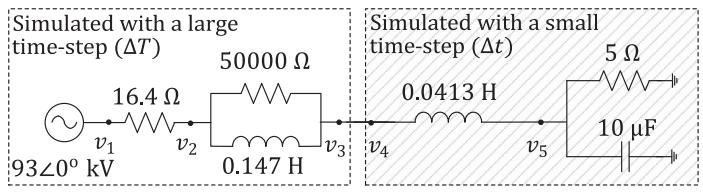  
Fig. 6. Network for Test Case I.

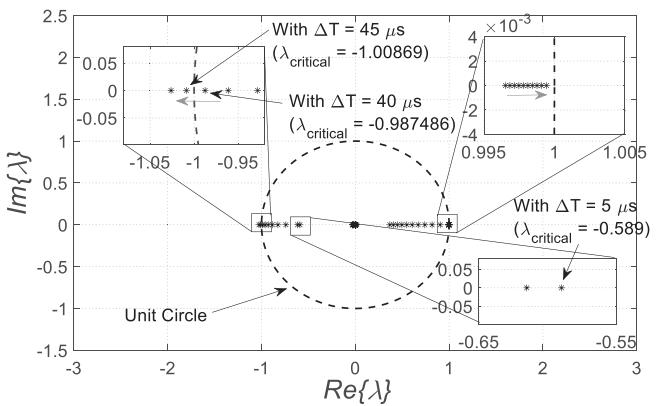  
Fig. 7. Test Case I - Locus of the Finite Eigenvalues of $( H _ { D } , M _ { D } )$ when ΔT is varied from 5 µs to 50 µs while keeping Δt constant at $5 \mu s$ .

be assessed by only examining whether the largest magnitude finite eigenvalue of $\mathsf { \bar { \Gamma } } ( H _ { D } , M _ { D } )$ lies inside the unit circle. This avoids the need to compute all the finite eigenvalues of $( H _ { D }$ , $M _ { D } )$ . Computation of this largest magnitude eigenvalue can be carried out via a selective eigenvalue computation routine.

# VI. VALIDATION TESTS

The ability of the proposed approach to accurately assess the stability of multi-rate EMT simulations is illustrated in this section using three test cases. For all these cases, the MATE-based multi-rate EMT simulation method [6] is used that employs the trapezoidal rule for discretization.

# A. Test Case I: Effect of Time-Steps on Stability of Simulation

The network for the first test case is shown in Fig. 6. A large time-step $\Delta T$ is used for the left-side sub-network while a small Ttime-step Δ is used for the right-side sub-network.

tA time-invariant representation for the multi-rate simulation of this network is obtained using the procedure discussed in Section V. This yields an equation of the form $M _ { D } \underline { { X } } _ { D } ( t + \Delta T ) = H _ { D } \underline { { X } } _ { D } ( t )$ (as in (70)). Now, $\Delta t$ is X t Tkept constant at 5 $\mu \mathrm { s }$ X whereas $\Delta T$ is varied between 5 $\mu \mathrm { s }$ t and 50 $\mu \mathrm { s }$ μ in increments of $5 ~ \mu \mathbf { s } . ~ \mathbf { A }$ T μ locus of the resulting finite μeigenvalues of $( H _ { D } , M _ { D } )$ μ is plotted as shown in Fig. 7.

From Fig. 7, we can see that while $\Delta T \le 4 0 \mu \mathrm { s } .$ all the T μeigenvalues are inside the unit circle. This firstly implies that with $\Delta T = \Delta t = 5 \mu \mathrm { s }$ (which is really a single-rate scenario), T t μthe simulation will be stable. Also, any multi-rate simulation with $\Delta t ~ = ~ 5 ~ \mu \mathrm { s }$ and any $\Delta T$ less than or equal to 40 s t μwhich is an integer multiple of $\Delta t$ μwill also be stable. On the other hand, we see that for $\Delta T \geq 4 5 \mu \mathrm { s }$ , one of the eigenvalues $( \lambda _ { \mathit { c r i t i c a l } } )$ T μ goes outside the unit circle implying that the multi-rate

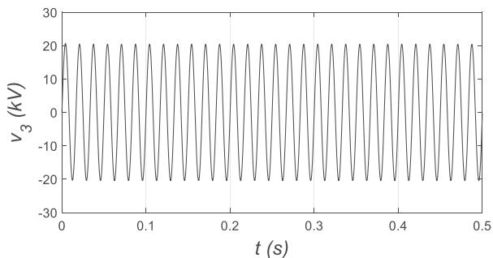  
Fig. 8. Test Case I - Voltage at Node 3 (Single-rate scenario: Stable).

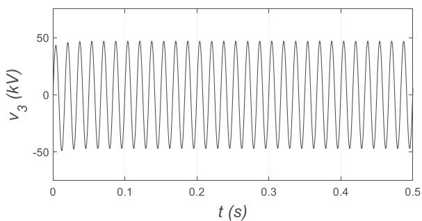

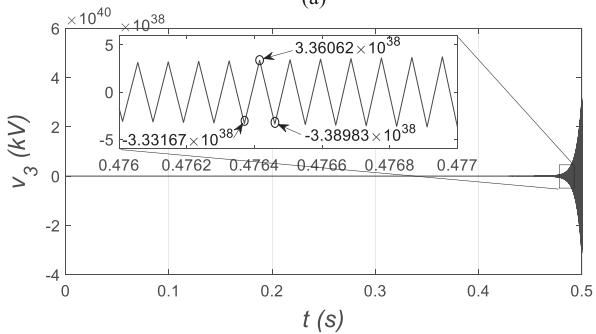  
(a)   
  
Fig. 9. Test Case I - Voltage at Node 3 (Multi-rate scenario). (a) With $\tilde { \Delta { T } } = 4 0 \mu s$ and $\Delta T = 5 \mu s$ (stable simulation). (b) With $\Delta T = 4 5 \mu s$ and $\Delta T = { \ ' { 5 } } \mu s$ (unstable simulation).

simulation will be unstable. For the case where $\Delta T \ = \ 4 5$ s and $\Delta t = 5 \mu \mathrm { s } , \lambda _ { c r i t i c a l } = - 1 . 0 0 8 6 9 .$ .

t μ .To corroborate this result, we run three separate simulation scenarios for the network in Fig. 6: (i) with $\Delta T = \Delta t = 5 \mu \mathrm { s } { \it \Delta }$ , (ii) with $\Delta T \ = \ 4 0 \ \mu \mathrm { s }$ and $\Delta t = 5 \mu \mathrm { s } .$ T t, and (iii) with $\Delta T =$ 45 s and $\Delta t = 5 \mu \mathrm { s } .$ t μ T. Fig. 8 shows a typical simulation plot of μ tthe node voltage $v _ { 3 }$ μfor the single-rate scenario whereas Fig. 9 v3shows the same for the two multi-rate scenarios. These clearly confirm that the simulation is stable for the single-rate scenario $( \Delta T \ = \ \Delta t \ = \ 5 \ \mu \mathrm { s } )$ as well as the multi-rate scenario with $\Delta T \ = \ 4 0 \ \mu \mathrm { s }$ and $\Delta t = 5 \mu \mathrm { s } ;$ whereas, it is unstable for the T μ tmulti-rate scenario with $\Delta T = 4 5 \mu \mathrm { s }$ and $\Delta t = 5 \mu \mathrm { s }$ .

T μ t μAdditionally, if one examines the magnified view as in the inset plot given in Fig. 9(b), the ratio of two consecutive large timestep samples of $( \mathrm { e . g . , ( - 3 . 3 8 9 8 3 \times 1 0 ^ { 3 8 } ) / ( 3 . 3 6 0 6 2 \times 1 0 ^ { 3 8 } ) } )$ equals $\mathrm { 1 o ~ - 1 . 0 0 8 6 9 }$ . / .. This is precisely equal to the largest

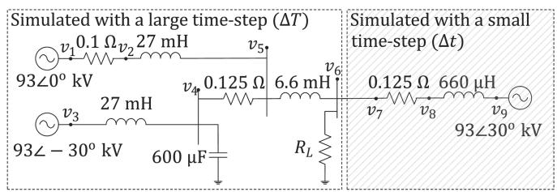  
Fig. 10. Network for Test Case II.

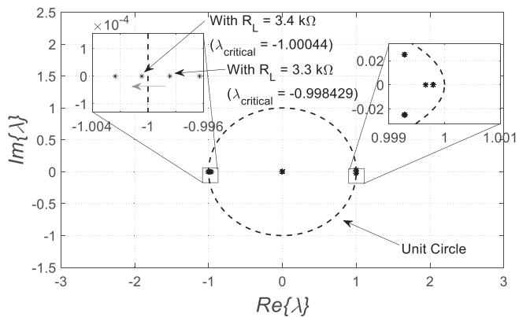  
Fig. 11. Test Case II - Locus of the Finite Eigenvalues of $( H _ { D } , M _ { D } )$ when $\bar { R _ { L } }$ is varied from 2 kΩ to 4 kΩ while keeping $\Delta T = 5 0 \mu \mathrm { s } \ \& \ \Delta t = 1 \mu \mathrm { s }$ .

eigenvalue3 $( \lambda _ { \mathit { c r i t i c a l } } )$ seen in Fig. 7 at the point where the instability first occurs (i.e., when $\Delta T = 4 5 \mu \mathrm { s }$ and $\Delta t = 5 \mu \mathrm { s } )$ . T μ t μThus, the results from the proposed stability assessment method not only agree with the simulation results qualitatively, but also quantitatively. This test case shows that the use of multi-rate interfacing can potentially give rise to numerical instability in simulation depending on the time-steps selected for discretization in each subnetwork.

# B. Test Case II: Effect of Network Parameter on Stability of Simulation

In this test case, we investigate whether the proposed approach can predict the stability of a multi-rate simulation when a network parameter is varied. For this, consider the network shown in Fig. 10. A large time-step $\Delta T ~ = ~ 5 0 ~ \mu \mathrm { s }$ is used for the T μleft-side sub-network while a small time-step $\Delta t \ = \ 1$ s is t μused for the right-side sub-network. Obtaining a time-invariant representation for the multi-rate simulation yields an equation of the form $M _ { D } \underline { { X } } _ { D } ( t + \Delta T ) = H _ { D } \underline { { X } } _ { D } ( t )$ (as in (70)). Now, X tthe value of resistance $R _ { L }$ T X tis varied from 2 kΩ to 4 Ω in steps of R0 1 Ω, and a locus of the eigenvalues of $( H _ { D } , M _ { D } )$ is plotted . kas in Fig. 11.

Fig. 11 shows that the value of $R _ { L }$ when the largest eigenvalue Rgoes outside the unit circle and makes the simulation go unstable is just a hair under $R _ { L } = ~ 3 . 4 ~ k \Omega$ . For $R _ { L } = ~ 3 . 4 ~ k \Omega$ , this eigenvalue is $\lambda _ { c r i t i c a l } ~ = ~ - 1 . 0 0 0 4 4$ .

3Note that by this time, all stable modes have decayed out and only the unstable modes remain. As there is only one real unstable mode in this case, the response can be roughly written as $\underline { { x } } ( t + \Delta T ) = \lambda _ { c r i t i c a l } \underline { { x } } ( t )$ . This is why the ratio of two consecutive large time-step samples is equal to $\lambda _ { c r i t i c a l } .$

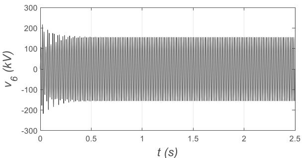

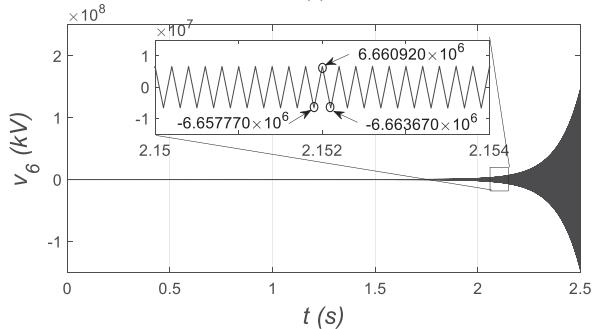  
(@)   
(b)   
Fig. 12. Test Case II - Voltage at Node 6 (Multi-rate scenario: $\Delta T =$ $5 \mathrm { 0 } \mu \mathrm { s } ; \Delta t = 1 \mu \mathrm { s } ) .$ (a) With $\mathsf { \bar { \boldsymbol { R } } } _ { L } = 3 . 3 \mathsf { \boldsymbol { k } } \Omega$ (stable simulation). (b) With $R _ { L } = 3 . 4$ kΩ (unstable simulation).

TABLE IIFINITE EIGENVALUES OF $( H _ { D } , M _ { D } )$ FOR TEST CASE II IN SINGLE-RATESCENARIO  

<table><tr><td>RL=3.3kΩ</td><td>RL=3.4kΩ</td><td></td></tr><tr><td>-0.4667; 0.9999; 0.9999; 0.9999 ± 0.0006i</td><td>-0.4783; 0.9999; 0.9999; 0.9999 ± 0.0006i</td><td>ΔT = Δt = 1 μs</td></tr><tr><td>-0.9856; 0.9995; 0.9997; 0.9988 ± 0.0297i</td><td>-0.9856; 0.9995; 0.9997; 0.9988 ± 0.0297i</td><td>ΔT = Δt = 50 μs</td></tr></table>

To corroborate this result, we run two separate simulation scenarios for the network in Fig. 10: one with $R _ { L } = 3 . 3 ~ k \Omega$ and the other with $R _ { L } = 3 . 4 ~ k \Omega$ R . k. The waveforms of the node voltage $v _ { 6 }$ R . kfor both these scenarios is shown in Fig. 12. It is v6clear that with $R _ { L } = 3 . 3 ~ k \Omega$ , the simulation is stable whereas with $R _ { L } = ~ 3 . 4 ~ k \Omega$ . k, it is unstable. Additionally, similar to R . kTest Case I, the quantitative agreement between the analytical results (Fig. 11) and the simulation results (Fig. 12) is also apparent from the magnified plot in Fig. 12(b) [i.e., the ratio of any two consecutive large time-step samples of $v _ { \mathrm { 6 } } \ \mathrm { ( e . g . }$ , $( - 6 . 6 6 3 6 7 0 \times 1 0 ^ { 6 } ) / ( 6 . 6 6 0 9 2 0 \times 1 0 ^ { 6 } ) )$ v6 is precisely equal to $- 1 . 0 0 0 4 4 \ ( \mathrm { i . e . , \lambda _ { \it c r i t i c a l } ) } ]$ .

.Note that the instability observed in Fig. 12(b) is ascribable to the use of multi-rate interfacing. This is because if the same network is simulated with single-rate interfacing, in one case with $\Delta T = \Delta t = 1$ s and another with $\Delta T = \Delta t =$ 50 $\mu \mathbf { S } ,$ T t μ T t, then the simulation will be numerically stable for both $R _ { L } = 3 . 3 ~ k \Omega$ and $R _ { L } = 3 . 4 ~ k \Omega$ . This fact is confirmed from R . k R . kthe eigenvalues given in Table II (all of them lie inside the unit circle) as well as the simulation waveforms shown in Fig. 13 (that indeed show that the simulation is stable).

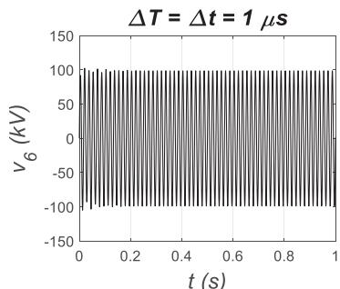

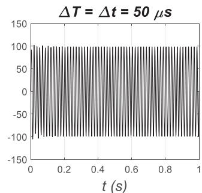  
(a)

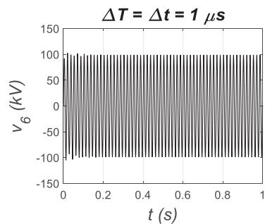

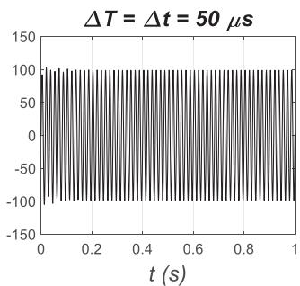  
(b)

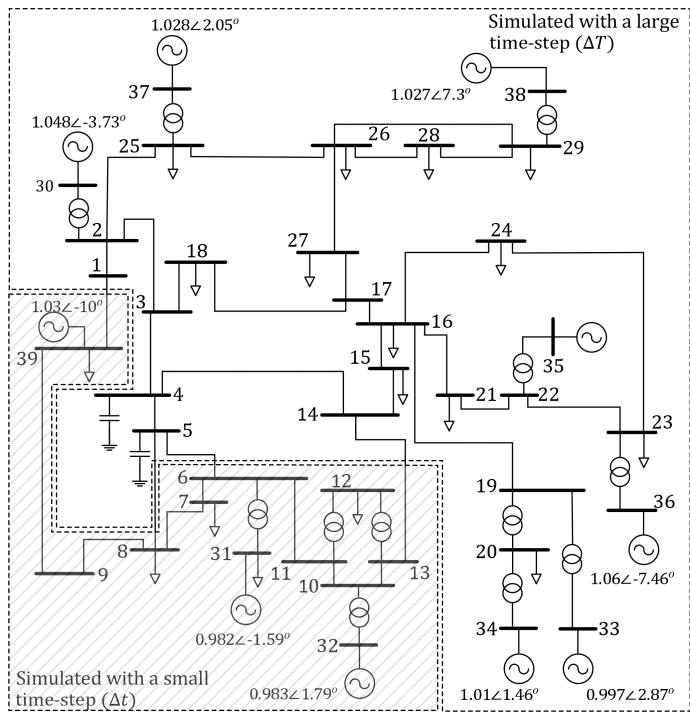  
Fig. 13. Test Case II - Voltage at Node 6 (Single-rate scenario). (a) With $\bar { R _ { L } } = 3 . 3$ kΩ (stable simulation). (b) With $\grave { R _ { L } } = 3 . 4 \ k \Omega$ (stable simulation).   
Fig. 14. Network for Test Case III (IEEE 39 Bus system).

# C. Test Case III: Large System Case (IEEE 39 Bus)

To demonstrate the applicability of the proposed stability assessment approach with a more realistic test case, we consider the IEEE 39 bus system shown in Fig. 14. The data for this system is taken from [19] with the transmission lines modelled as coupled Π-sections, and constant impedance loads modelled as three-phase resistors, inductors and capacitors. The terminal

TABLE III SIZE AND SPARSITY OF MD AND HD FOR TEST CASE III   

<table><tr><td>Scenarios</td><td>Size of MD and HD</td><td>% Sparsity of MD</td><td>% Sparsity of HD</td></tr><tr><td>Single-rate scenario # 1</td><td>612 × 612</td><td>0.12 %</td><td>1 %</td></tr><tr><td>Single-rate scenario # 2</td><td>612 × 612</td><td>0.12 %</td><td>1 %</td></tr><tr><td>Multi-rate scenario</td><td>3225 × 3225</td><td>0.02 %</td><td>0.16 %</td></tr></table>

TABLE IV LARGEST MAGNITUDE FINITE EIGENVALUE OF $( H _ { D } , M _ { D } )$ FOR TEST CASE III   

<table><tr><td>Scenarios</td><td>Largest magnitude finite eigenvalue (λcritical)</td></tr><tr><td>Single-rate scenario # 1</td><td>0.9999</td></tr><tr><td>Single-rate scenario # 2</td><td>0.9999</td></tr><tr><td>Multi-rate scenario</td><td>0.7222 + 0.6966i (|λcritical| = 1.0034)</td></tr></table>

voltages of the sources are linearly ramped up over 50 ms at the start of the simulation. The system is partitioned as shown in Fig. 14. A small time-step $\Delta t$ is used for the hatched portion of tthe network, while a large time-step Δ is used for the rest of Tthe network. Three separate scenarios are considered:

1) $\Delta T = \Delta t = 1 0 \mu \mathrm { s }$ (Single-rate scenario # 1)   
2) $\Delta T = \Delta t = 5 0 \mu \mathrm { s }$ (Single-rate scenario # 2)   
3) $\Delta T = 5 0 \mu \mathrm { s } \& \Delta t = 1 0$ s (Multi-rate scenario).

T μ t μFor each of these scenarios, a time-invariant representation for the simulation of this network is obtained using the procedure discussed in Section V. This yields an equation of the form $M _ { D } \underline { { X } } _ { D } ( t + \Delta T ) = H _ { D } \underline { { X } } _ { D } ( t )$ (as in (70)).

X t TFor large networks, $M _ { D }$ Xand $H _ { D }$ can become very large. Table III presents their size in each of the scenarios for the above network. Therefore, $M _ { D }$ and $H _ { D }$ are stored as sparse matrices to alleviate the issue of storage. The percentage sparsity of these matrices for each of the above scenarios is also given in Table III. Also, to determine the numerical stability of the simulation, it is only required to compute the largest magnitude finite eigenvalue $( \lambda _ { c r i t i c a l } )$ of $( H _ { D } , M _ { D } )$ . This is achieved using a selective eigenvalue computation routine [20] and is far less computationally expensive compared to computing all the finite eigenvalues of $( H _ { D } , M _ { D } )$ . The results of this are given in Table IV. From Table IV., we can infer that:

a) For both the single-rate scenarios, the analysis predicts a stable simulation as $\lambda _ { c r i t i c a l }$ in both these scenarios is inside the unit circle.   
b) For the multi-rate scenario, the analysis predicts an unstable simulation as $\lambda _ { c r i t i c a l }$ lies outside the unit circle.

To corroborate this, we run the three scenarios for the IEEE 39 bus system shown in Fig. 14. Fig. 15 shows a simulation plot of the phase A voltage at bus # 27 for each scenario.

The results in Fig. 15 clearly confirm that the simulation is stable for both the single-rate scenarios (i.e., with $\Delta T = \Delta t =$ 10 s as well as $\Delta T \ = \ \Delta t \ = \ 5 0 \ \mu \mathrm { s } )$ T t. On the other hand, μ T t μas predicted by the proposed stability assessment approach, the simulation is unstable for the multi-rate scenario (i.e., with $\Delta T = 5 0 \mu \mathrm { s }$ and $\Delta t = 1 0 \mu \mathrm { s } )$ .

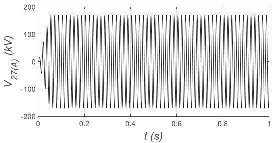

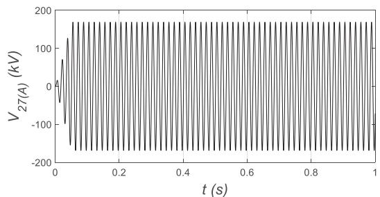

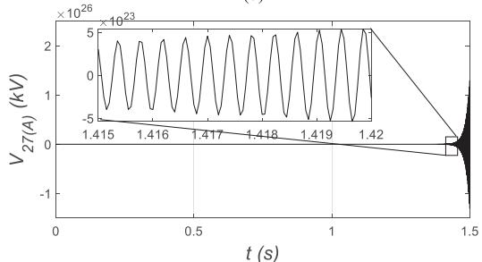  
  
（c)  
Fig. 15. Test Case III - Phase A voltage of Bus # 27. (a) Single-rate scenario # 1 (stable simulation). (b) Single-rate scenario # 2 (stable simulation). (c) Multi-rate scenario (unstable simulation).

# D. An Important Observation

An important factor to note is that all the test cases considered above are stable LTI systems in the continuous time-domain. Yet, a multi-rate simulation that employs the A-stable trapezoidal rule for discretization in each subnetwork (i.e., the method of [6]) became unstable as seen in Figs. 9(b), 12(b) and 15(c). We can therefore conclude that multi-rate EMT simulations of stable continuous-time LTI networks may exhibit instability even if the A-stable trapezoidal rule is used for discretization in each subnetwork.

# VII. CONCLUSION

In this paper, an approach for assessing the stability of multi-rate EMT simulations of linear time-invariant (LTI) networks is introduced. Firstly, it is shown that such simulations yield a periodically varying system in the discrete

time-domain. By exploiting this property and using the ‘lift-$\operatorname { i n g } ^ { \prime }$ technique, a sampled-data time-invariant representation, in the form $M _ { D } \underline { { X } } _ { D } ( t + \Delta T ) = H _ { D } \underline { { X } } _ { D } ( t )$ is obtained for X t T Xthe simulated discrete-time system (where $\Delta T$ is the large Ttime-step used in the slow subnetwork). The numerical stability of the simulation can then be assessed by looking at the finite eigenvalues of the matrix pencil $( H _ { D } , M _ { D } )$ . The test cases that are presented successfully demonstrate the effectiveness of the proposed method in accurately assessing the stability of multirate EMT simulations of LTI networks. An important takeaway is that a multi-rate EMT simulation of a stable continuous-time LTI network may become unstable even if the well-known A-stable trapezoidal rule is used for discretization in each subnetwork.

# VIII. FUTURE EXTENSION TO THE STABILITY ASSESSMENT OF THE SIMULATION OF SWITCHED NETWORKS

For multi-rate EMT simulations of networks containing switches or non-linearities, the problem of analytically assessing their stability may not have a general solution. This is because for such networks, the matrices $M _ { D }$ and $H _ { D }$ (in (69)) may not remain constant across different large time-step $( \Delta T )$ intervals. If $M _ { D ( k ) }$ and $H _ { D ( k ) }$ are the matrices in any $k ^ { t h } ~ \Delta T$ inter-( ) ( )val, then the DSE representation in the $k ^ { t h } ~ \Delta T$ interval is as in (71).

$$
\boldsymbol {M} _ {\boldsymbol {D} (\boldsymbol {k})} \underline {{X}} _ {D} (t + k \Delta T) = \boldsymbol {H} _ {\boldsymbol {D} (\boldsymbol {k})} \underline {{X}} _ {D} (t + (k - 1) \Delta T) \tag {71}
$$

where, $k = 1 , 2 , 3 ,$

k , , , . . . . . .However, for some specific type of switching networks, it is possible to analytically assess the simulation’s stability. For example, many power electronic converters (like voltage source converters) in practical power systems are controlled to generate a periodic output of frequency $f _ { \mathrm { p } }$ (usually the fundamental frequency of the system). $\mathrm { ~ I f ~ } \tau ~ = ~ 1 / f _ { \mathrm { p } }$ is the period and if $n = \tau / \Delta T$ τ /fpis an integer, then this periodicity can be leveraged n τ / Tto obtain a sampled-data time-invariant representation for the multi-rate EMT simulation of a switched network. This yields (72), where $M _ { \tau } , H _ { \tau }$ and $\scriptstyle \sum _ { \tau } ( t )$ are as in (73), shown at the bottom of this page.

$$
\boldsymbol {M} _ {\tau} \underline {{X}} _ {\tau} (t + \tau) = \boldsymbol {H} _ {\tau} \underline {{X}} _ {\tau} (t) \tag {72}
$$

Using this, the stability of the multi-rate EMT simulation of the switched network can now be assessed by computing the largest magnitude finite eigenvalue of $( H _ { \tau } , \ M _ { \tau } )$ and checking if it lies inside the unit circle. However, this idea requires further investigation which we endeavor to do in the future.

$$
\left[ \begin{array}{c c c c} 0 & & & \\ 0 & & & \\ 0 & & & \\ \vdots & & & \\ 0 & & & \\ M _ {D (n)} & 0 & 0 & \dots & 0 & 0 \end{array} \right] \left[ \begin{array}{c} \underline {{X}} _ {D} (t + \tau) \\ \underline {{X}} _ {D} (t + \Delta \mathrm {T} + \tau) \\ \underline {{X}} _ {D} (t + 2 \Delta \mathrm {T} + \tau) \\ \vdots \\ \underline {{X}} _ {D} (t + (n - 2) \Delta \mathrm {T} + \tau) \\ \underline {{X}} _ {D} (t + (n - 1) \Delta \mathrm {T} + \tau) \end{array} \right] = \left[ \begin{array}{c c c c} H _ {D (1)} & - M _ {D (1)} & & \\ & H _ {D (2)} & - M _ {D (2)} & \\ & & H _ {D (3)} & - M _ {D (3)} \\ & & & \ddots \\ & & & H _ {D (n - 1)} & - M _ {D (n - 1)} \\ & & & & H _ {D (n)} \end{array} \right] \left[ \begin{array}{c} \underline {{X}} _ {D} (t) \\ \underline {{X}} _ {D} (t + \Delta \mathrm {T}) \\ \underline {{X}} _ {D} (t + 2 \Delta \mathrm {T}) \\ \vdots \\ \underline {{X}} _ {D} (t + (n - 2) \Delta \mathrm {T}) \\ \underline {{X}} _ {D} (t + (n - 1) \Delta \mathrm {T}) \end{array} \right] \tag {73}
$$

# APPENDIX

# A. Expressions for the Matrices Used in Section IV

If the trapezoidal rule is used for discretization in both the subnetworks in Section IV, then the matrices $L _ { S } , H _ { S } ^ { \prime } , H _ { S }$ , ${ \cal L } _ { F } , { \cal H } _ { F } ^ { \prime }$ and $H _ { F }$ (used in (27)–(28)) in terms of the matrices that appear in (24)–(25) are as given in (A.1)–(A.2).

$$
\boldsymbol {L} _ {S} = \left(\boldsymbol {I} - \boldsymbol {A} _ {S} \Delta T / 2\right) ^ {- 1} \left(\boldsymbol {I} + \boldsymbol {A} _ {S} \Delta T / 2\right)
$$

$$
\boldsymbol {H} _ {S} ^ {\prime} = \boldsymbol {H} _ {S} = \left(\boldsymbol {I} - \boldsymbol {A} _ {S} \Delta T / 2\right) ^ {- 1} \left(\boldsymbol {B} _ {S} \Delta T / 2\right) \tag {A.1}
$$

$$
\boldsymbol {L} _ {\boldsymbol {F}} = \left(\boldsymbol {I} - \boldsymbol {A} _ {\boldsymbol {F}} \Delta t / 2\right) ^ {- 1} \left(\boldsymbol {I} + \boldsymbol {A} _ {\boldsymbol {F}} \Delta t / 2\right)
$$

$$
\boldsymbol {H} _ {\boldsymbol {F}} ^ {\prime} = \boldsymbol {H} _ {\boldsymbol {F}} = (\boldsymbol {I} - \boldsymbol {A} _ {\boldsymbol {F}} \Delta t / 2) ^ {- 1} (\boldsymbol {B} _ {\boldsymbol {F}} \Delta t / 2) \tag {A.2}
$$

Alternatively, if the backward Euler (BE) method is used, then the same matrices in terms of the matrices that appear in (24)– (25) are as given in (A.3)–(A.4).

$$
\boldsymbol {L} _ {\boldsymbol {S}} = \left(\boldsymbol {I} - \boldsymbol {A} _ {\boldsymbol {S}} \Delta T\right) ^ {- 1} \tag {A.3}
$$

$$
\boldsymbol {H} _ {\boldsymbol {S}} ^ {\prime} = 0; \boldsymbol {H} _ {\boldsymbol {S}} = \left(\boldsymbol {I} - \boldsymbol {A} _ {\boldsymbol {S}} \Delta T\right) ^ {- 1} \left(\boldsymbol {B} _ {\boldsymbol {S}} \Delta T\right) \tag {A.5}
$$

$$
\boldsymbol {L} _ {\boldsymbol {F}} = \left(\boldsymbol {I} - \boldsymbol {A} _ {\boldsymbol {F}} \Delta \mathrm {t}\right) ^ {- 1} \tag {A.4}
$$

$$
\boldsymbol {H} _ {\boldsymbol {F}} ^ {\prime} = 0; \quad \boldsymbol {H} _ {\boldsymbol {F}} = (\boldsymbol {I} - \boldsymbol {A} _ {\boldsymbol {F}} \Delta \mathrm {t}) ^ {- 1} (\boldsymbol {B} _ {\boldsymbol {F}} \Delta \mathrm {t}) \tag {A.4}
$$

In either of these cases, the expressions for the Thevenin sources $( \underline { { V } } _ { t h S }$ and $\underline { { V } } _ { t h F } )$ for the slow and the fast subnetworks Vand the impedance $( Z _ { t h } )$ are given in (A.5)–(A.7).

$$
\underline {{V}} _ {t h S} (t + \Delta T) = \boldsymbol {C} _ {\boldsymbol {S}} \boldsymbol {L} _ {\boldsymbol {S}} \underline {{\boldsymbol {x}}} _ {S} (t) + \boldsymbol {C} _ {\boldsymbol {S}} \boldsymbol {H} _ {\boldsymbol {S}} ^ {\prime} \dot {\iota} _ {\alpha (a v g)} (t) \tag {A.5}
$$

$$
\begin{array}{l} \underline {{V}} _ {t h F} (t + k \Delta t) = - C _ {F} L _ {F} \underline {{x}} _ {F} (t + (k - 1) \Delta t) \\ + \boldsymbol {C} _ {\boldsymbol {F}} \boldsymbol {H} _ {\boldsymbol {F}} ^ {\prime} \dot {i} _ {\alpha} (t + (k - 1) \Delta t) \tag {A.6} \\ \end{array}
$$

where, $k = 1 , 2 , \hdots N .$

$$
Z _ {t h} = - \left(C _ {S} H _ {S} + C _ {F} H _ {F}\right) \tag {A.7}
$$

Here, note that $\underline { { V } } _ { t h F }$ for the fast subnetwork is updated at every small time-step (Δ ) instant where as $\underline { { V } } _ { t h S }$ for the slow t Vsubnetwork is only updated at large time-step (Δ ) instants.

# B. Obtaining a State-Space Representation Directly From a Companion Circuit Formulation of a Network [18]

Here, we briefly review the approach of [18] that is useful for obtaining a discrete-time state-space representation directly from Dommel’s formulation. We consider an autonomous case, (i.e., a network with no external sources) for this purpose. The companion circuit representation of an inductor and capacitor at any time  is as shown in Fig. 16.

tIf we know the network’s solution at time , then the history current source $h _ { L }$ for an inductor and $h _ { C }$ tfor a capacitor at the time $( t + \Delta \tau )$ hare as in (A.8) and (A.9), respectively if the t τtrapezoidal rule is used for discretization.

$$
h _ {L} (t + \Delta \tau) = i _ {L} (t) + g _ {L} v _ {L} (t) \tag {A.8}
$$

$$
h _ {C} (t + \Delta \tau) = - i _ {C} (t) - g _ {C} v _ {C} (t) \tag {A.9}
$$

Here, $g _ { L } = \Delta \tau / ( 2 L )$ , and $g _ { C } = ~ 2 C / \Delta \tau$ with $\Delta \tau$ being the g τ / L g C/ τ τsimulation time-step. Using the companion circuit representation in Fig. 16, we can eliminate $i _ { L } ( t )$ and $i _ { C } ( t )$ from the

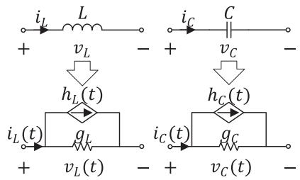  
Fig. 16. Inductor and capacitor, and their corresponding companion circuits.

expressions in (A.8)–(A.9) to yield (A.10)–(A.11).

$$
h _ {L} (t + \Delta \tau) = h _ {L} (t) + 2 g _ {L} v _ {L} (t) \tag {A.10}
$$

$$
h _ {C} (t + \Delta \tau) = - h _ {C} (t) - 2 g _ {C} v _ {C} (t) \tag {A.11}
$$

Now, knowing the relations in (A.10)–(A.11), the expression for the history currents of all branch inductors and capacitors in a given network (containing $n _ { L }$ inductors and $n _ { C }$ capacitors) can be compactly written as in (A.12).

$$
\underline {{h}} _ {b} (t + \Delta \tau) = \boldsymbol {K} \underline {{h}} _ {b} (t) + \boldsymbol {Y} _ {b} \underline {{v}} _ {b} (t) \tag {A.12}
$$

Here,

$\underline { { h } } _ { b } ( t )$ : Vector containing history currents for each inductor h tand capacitor in a given network.

$$
= \left[ h _ {L (1)} (t) \dots h _ {L \left(n _ {L}\right)} (t) h _ {C (1)} (t) \dots h _ {C \left(n _ {C}\right)} (t) \right] ^ {T}
$$

${ \underline { { v } } } _ { b } ( t )$ : Vector containing branch voltages corresponding to v teach inductor and capacitor.

K: A diagonal matrix with entries equal to either 1 or −1.

$Y _ { b } { : }$ A diagonal matrix containing entries corresponding to $g _ { L }$ for each inductor and $g _ { C }$ for each capacitor.

gEntries of K and $\scriptstyle { Y _ { b } }$ gare populated based on (A.10)–(A.11).

Now, the branch voltages $( \underline { { v } } _ { b } ( t ) )$ can be related to the node v tvoltage vector ( ( )) as in (A.13).

$$
\underline {{v}} _ {b} (t) = \boldsymbol {A} _ {i} \underline {{v}} (t) \tag {A.13}
$$

Here, $A _ { i }$ is the node incidence matrix [16] which relates the node voltages to the branch voltages of the energy storage elements. Finally, at time , the node voltages $\underline { { v } } ( t )$ and the history currents ${ \underline { { h } } } _ { b } ( t )$ t v tcan be related to each other using the nodal admittance h tmatrix $\mathbf { Y }$ as given in (A.14).

$$
\mathbf {Y} _ {\underline {{v}}} (t) = - \mathbf {A} _ {i} ^ {T} \underline {{h}} _ {b} (t) \tag {A.14}
$$

Combining (A.12)–(A.14), we get (A.15) which is the required discrete-time state-space representation of a network in the Descriptor State-space Equation (DSE) form [21].

$$
\begin{array}{l} \left[ \begin{array}{c c} \boldsymbol {I} & \boldsymbol {0} \\ \boldsymbol {0} & \boldsymbol {0} \end{array} \right] \left[ \begin{array}{c} \underline {{h _ {b}}} (t + \Delta \tau) \\ \underline {{v}} (t + \Delta \tau) \end{array} \right] = \left[ \begin{array}{c c} \boldsymbol {K} & \boldsymbol {Y _ {b}} \boldsymbol {A _ {i}} \\ \boldsymbol {A _ {i} ^ {T}} & \boldsymbol {Y} \end{array} \right] \left[ \begin{array}{c} \underline {{h _ {b}}} (t) \\ \underline {{v}} (t) \end{array} \right] \\ \Rightarrow M _ {d s e} \underline {{X}} _ {d s e} (t + \Delta \tau) = H _ {d s e} \underline {{X}} _ {d s e} (t) \tag {A.15} \\ \end{array}
$$

Using the backward Euler (BE) method for discretization (instead of trapezoidal rule) results in changes only in (A.8)–(A.11) and the expressions for $g _ { L } , g _ { C }$ , K and $Y _ { b }$ . Equation (A.12)–(A.15) remain the same.

1) With the BE method, $g _ { L } = \Delta \tau / L$ and $g _ { C } = C / \Delta \tau$

2) Equation (A.8)–(A.9) transform to (A.16)–(A.17):

$$
h _ {L} (t + \Delta \tau) = i _ {L} (t) \tag {A.16}
$$

$$
h _ {C} (t + \Delta \tau) = - g _ {C} v _ {C} (t) \tag {A.17}
$$

3) Equation (A.10)–(A.11) transform to (A.18) and (A.17).

$$
h _ {L} (t + \Delta \tau) = h _ {L} (t) + g _ {L} v _ {L} (t) \tag {A.18}
$$

4) The matrices K and $\scriptstyle { Y _ { b } }$ are as follows:

K: A diagonal matrix with entries equal to either 1 or 0. $Y _ { b } { \mathrm { : } }$ A diagonal matrix containing entries corresponding to $g _ { L }$ for each inductor and $g _ { C }$ for each capacitor.

g gTheir entries are populated based on (A.17)–(A.18).

# REFERENCES

[1] H. W. Dommel, “Digital computer solution of electromagnetic transients in single-and multiphase networks,” IEEE Trans. Power App. Syst., vol. PAS-88, no. 4, pp. 388–399, Apr. 1969.   
[2] A. Semlyen and F. de Leon, “Computation of electromagnetic transients using dual or multiple time steps,” IEEE Trans. Power Syst., vol. 8, no. 3, pp. 1274–1281, Aug. 1993.   
[3] L. Linares and J. Marti, “Sub-area latency in a real time power network simulator,” in Proc. Int. Conf. Power Syst. Transients, 1995, pp. 541–545.   
[4] M. L. Crow and J. G. Chen, “The multirate simulation of FACTS devices in power system dynamics,” IEEE Trans. Power Syst., vol. 11, no. 1, pp. 376–382, Feb. 1996.   
[5] S. D. Pekarek et al., “An efficient multirate simulation technique for power-electronic-based systems,” IEEE Trans. Power Syst., vol. 19, no. 1, pp. 399–409, Feb. 2004.   
[6] F. A. Moreira and J. R. Marti, “Latency techniques for time-domain power system transients simulation,” IEEE Trans. Power Syst., vol. 20, no. 1, pp. 246–253, Feb. 2005.   
[7] A. Benigni, A. Monti, and R. A. Dougal, “Latency-based approach to the simulation of large power electronics systems,” IEEE Trans. Power Electron., vol. 29, no. 6, pp. 3201–3213, Jun. 2014.   
[8] V. A. Galván, J. R. Martí, H. W. Dommel, J. A. Gutiérrez-Robles, and J. Naredo, “MATE multirate modelling of power electronic converters with mixed integration rules,” in Proc. Power Syst. Computation Conf., 2016, pp. 1–7.   
[9] H. Zhao, A. Sinkar, A. M. Gole, and Y. Zhang, “Accuracy quantification of multi-rate electromagnetic transients simulation,” IEEE Trans. Power Del., vol. 39, no. 2, pp. 1051–1062, Apr. 2024.   
[10] L.-A. Grégoire, H. F. Blanchette, J. Bélanger, and K. Al-Haddad, “A stability and accuracy validation method for multirate digital simulation,” IEEE Trans. Ind. Informat., vol. 13, no. 2, pp. 512–519, Apr. 2017.   
[11] J. R. Marti, L. R. Linares, J. Calvino, H. W. Dommel, and J. Lin, “OVNI: An object approach to real-time power system simulators,” in Proc. Int. Conf. Power System Technol., 1998, pp. 977–981.   
[12] J. E. Schutt-Aine, “Latency insertion method (LIM) for the fast transient simulation of large networks,” IEEE Trans. Circuits Syst. I, Fundam. Theory Appl., vol. 48, no. 1, pp. 81–89, Jan. 2001.   
[13] F. Moreira, “Latency techniques in power system transients simulation,” Ph.D. dissertation, Dept. Elect. Comp. Eng., Univ. British Columbia, Vancouver, BC, Canada, 2002. [Online]. Available: https://dx.doi.org/10. 14288/1.0065858   
[14] T. Chen and B. Francis, Optimal Sampled-data Control Systems. Berlin, Germany: Springer-Verlag, 2012.   
[15] G. Michaletzky and L. Gerencser, “BIBO stability of linear switching systems,” IEEE Trans. Autom. Control, vol. 47, no. 11, pp. 1895–1898, Nov. 2002.   
[16] S. Seshu and N. Balabanian, Linear Network Analysis. Hoboken, NJ, USA: Wiley, 1959.   
[17] A. Abusalah, O. Saad, J. Mahseredjian, U. Karaagac, and I. Kocar, “Accelerated sparse matrix-based computation of electromagnetic transients,” IEEE Open Access J. Power Energy, vol. 7, pp. 13–21, 2020.

[18] J. A. Hollman and J. R. Marti, “Step-by-step eigenvalue analysis with EMTP discrete-time solutions,” IEEE Trans. Power Syst., vol. 25, no. 3, pp. 1220–1231, Aug. 2010.   
[19] “PSCAD Knowledge Base - Models and Examples (IEEE Test Systems), Manitoba HVDC Research Centre,” Accessed: Feb. 20, 2025. [Online]. Available: https://www.pscad.com/knowledge-base/topic-51/v-  
[20] MATLAB Help Center - eigs, MATLAB,o; The MathWorks, Inc., Accessed: Oct. 02, 2024. [Online]. Available: https://www.mathworks.com/ help/matlab/ref/eigs.html   
[21] V. Mehrmann and T. Stykel, “Descriptor systems: A general mathematical framework for modelling, simulation and control,” Automatisierungstechnik, vol. 54, no. 8, pp. 405–415, 2006.

Ajinkya Sinkar (Member, IEEE) received the Ph.D. degree from the University of Manitoba, Winnipeg, MB, Canada, in 2023. From 2022 to 2024, he was with Manitoba Hydro International, Winnipeg, MB, where he contributed to algorithmic enhancements in the EMTDC simulation engine and developed new library models in PSCAD. He is currently a Mitacs Postdoctoral Fellow with the University of Manitoba. His research interests include methods for accelerating electromagnetic transient simulations, and application of power electronics in power systems. Dr.

Sinkar is a Registered Professional Engineer in the Province of Manitoba.

Kaustav Dey (Member, IEEE) received the Ph.D. degree in power systems from the Indian Institute of Technology Bombay, Mumbai, India, in 2022. He was a Senior Engineer with L&T Technology Services, India, from 2022 to 2023, and a Postdoctoral Fellow with the University of Manitoba, Winnipeg, MB, Canada, from 2023 to 2025. He is currently an Assistant Professor with the Department of Electrical Engineering, Indian Institute of Technology Kharagpur, Kharagpur, India. His research interests include the application of control theory and signal processing

techniques to enhance the stability and operation of converter-interfaced power systems. Dr. Dey was awarded the Naik and Rastogi Award for Excellence in Ph.D. Research by IIT Bombay in 2022.

Huanfeng Zhao (Member, IEEE) received the Ph.D. degree in electrical engineering from the University of Manitoba, Winnipeg, MB, Canada, in 2021. He is currently a Senior Engineer with Nayak Corporation, U.S., where he integrates state-of-the-art techniques into EMT tools to efficiently and accurately analyze modern power grid transients and dynamics.

Aniruddha M. Gole (Life Fellow, IEEE) received the B.Tech. degree in electrical engineering from the Indian Institute of Technology Bombay, Mumbai, India, in 1978, and the Ph.D. degree from the University of Manitoba, Winnipeg, MB, Canada, in 1982. He is currently a Distinguished Professor with the University of Manitoba. He is a Registered Professional Engineer in the Province of Manitoba. He was the recipient of the 2007 IEEE PES Nari Hingorani FACTS Award and the 2024 IEEE PES Uno Lamm HVDC Award. Prof. Gole is a fellow of the Canadian Academy of

Engineering.