# MTOF: A Novel FPGA-Based EMT Toolbox in MATLAB

Xin Ma , Member, IEEE, and Xiao-Ping Zhang , Fellow, IEEE

Abstract—Field programmable gate array (FPGA) is becoming an attractive solution for real-time electromagnetic transient (EMT) simulations. FPGA-based EMT simulation uses thousands of lines of code and sophisticated architecture to satisfy executable requirements ranging from the low-level analog signal to the advanced EMT mathematics. The coding would place a tremendous burden on beginners to take at least 6 months. To provide more straightforward solutions, this paper develops the MATLAB-to-FPGA EMT toolbox (MTOF) in the computational engine frame of MATLAB. Based on Input Data, MTOF under a user-friendly MATLAB environment can generate transparent FPGA-based code while complex programming under FPGA can be avoided. This brings a dramatic coding simplification and results in significant savings of programming time. MTOF includes automatic calculation sequence, resource utilization, and initialization. For high accuracy, MTOF performs the Floating-Point arithmetic of EMT models with more readable data formats (e.g., memory unit) on FPGA. To improve computational efficiency, ready-to-run architecture is presented to automate code generation quickly. MTOF can generate FPGA code files within 50 s and 300 s for the 4-machine 11-bus and 10-machine 39-bus systems, respectively. To verify the effectiveness of the generated FPGA code generated by MTOF, simulations are demonstrated on the two systems using a single FPGA board with high accuracy.

Index Terms—Electromagnetic transients simulations, real-time simulations, FPGA, data format, floating-point, toolbox.

# I. INTRODUCTION

F PGA has become a powerful platform to accelerate real-time EMT simulation, due to its powerful reprogramming, parallel processing and fast operation capabilities [1], [2], [3]. FPGA can satisfy the requirements of fast-speed and highaccuracy to perform such EMTs [4], [5], [6].

For FPGA-based EMT design, line-by-line coding is timeconsuming using hardware description languages (e.g., VHDL). Users have to deal with parallel programming logic, resource utilization, timing estimation, and route placement [7], [8]. Every EMT mathematical model, network analysis algorithm, data manipulation process is implemented this way. Moreover, any minor modifications will appear in multiple places in the

Received 18 March 2024; revised 31 July 2024 and 12 December 2024; accepted 26 January 2025. Date of publication 29 January 2025; date of current version 21 August 2025. Paper no. TPWRS-00463-2024. (Corresponding author: Xiao-Ping Zhang .)

The authors are with the Department of Electronic, Electrical and Systems Engineering, School of Engineering, University of Birmingham, B15 2TT Birmingham, U.K (e-mail: x.p.zhang@bham.ac.uk).

Color versions of one or more figures in this article are available at https://doi.org/10.1109/TPWRS.2025.3535841.

Digital Object Identifier 10.1109/TPWRS.2025.3535841

code of FPGA-based EMT. The executable model equations and network matrices require a large number of cryptic code lines from experienced developers [9]. Such a heavy burden is impossible to be finished by beginners within 6 months. It is essential to propose a new toolbox to eliminate design limitations and improve coding efficiency.

Existing real-time EMT simulators already provide advanced high-level FPGA models [10], [11], but the basic-level coding details including component source code or mathematical algorithms for FPGA are unavailable to end-users. Another method is to use high-level synthesis tools (such as Xilinx AccelDSP and Agility compiler) [12] with supported M-codes or C-codes. Owing to repetitive optimizations, this is still time-consuming without strong FPGA hardware and EMT modeling background. In summary, these commercial simulators do not provide tools for the end users to generate transparent FPGA hardware based code automatically, for instance, under widely used MATLAB environment.

To fill in the gap as mentioned above, this paper develops a MATLAB-to-FPGA (MTOF) toolbox in MATLAB environment. The input of the Toolbox includes the system topology and component (synchronous machines, transmission lines, transformers, and etc.) parameters as well as simulation parameters while the output of the Toolbox is the generated transparent code, which can be used directly for EMT simulation on FPGA platform. The proposed MTOF is in particular useful for beginners, who don’t have commercial real-time simulators (e.g., RT-LAB) but they would like to build up real-time simulator using FPGA by themselves. The functionality of MTOF includes setting calculation sequence, saving resource utilization, meeting timing constraints, initialization, allocating memory space and etc. under user-friendly MATLAB environment. The contributions of this paper are summarized as follows:

1) As a teaching tool, MTOF provides accurate models and hardware-implementable designs, making it more convenient for postgraduate courses (e.g., digital design of a real-time EMT simulator using FPGA).   
2) As a synthesis tool, complete architecture of MTOF can accelerate the direct translation from high-level data structure to basic-level VHDL code.   
3) As a programming tool, in particular for beginners, MTOF can simplify programming FPGA-based EMT system of any topology with user-friendly MATLAB functions.

This rest of the paper is presented as follows: Section II introduces how to convert EMT mathematical models into readable files for hardware. For fast translation, Section III

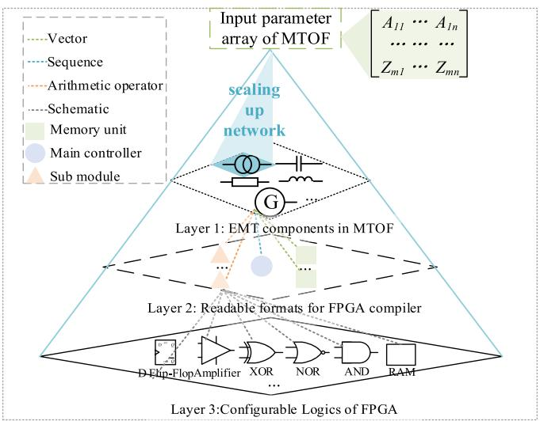

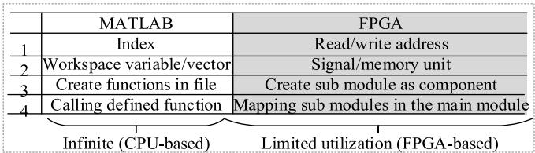  
(a) Modeling procedure.   
(b) Mapping relationship of MTOF   
Fig. 1. MTOF modeling procedure.

provides how to design main architecture to ensure complete dataflow. For efficient programming, Section IV introduces how to generate VHDL code for systems of any topology under user-friendly MATLAB environment. For model verification, Section V shows the test results on the 4-machine 11-bus and 10- machine 39-bus test systems. Section VI draws the conclusion.

# II. MTOF MODELING

# A. Basic Principle

The basic principle is to translate EMT models of power system components into the code files suitable for FPGA platform. From simple user inputs, Fig. 1(a) presents that MTOF can generate these file formats (e.g., memory unit) for FPGA compiler and implement them using configurable logics of FPGA. To bridge the gap between MATLAB script and VHDL, Fig. 1(b) gives the mapping relationship to similar logics. For example, creating functions is quite similar to create sub module in VHDL. The main difference is that all the codes in FPGA is limited by hardware requirements (e.g., resources, timing and parallel logic).

# B. EMT Mathematical Models of Components

1) RLC Circuit Branch: Based on Trapezoidal Rule [4], EMT calculations of RLC branch can be summarized in a universal matrix format as given in (1)–(2):

$$
i _ {R L C} (t) = k _ {1} \left(v _ {a} (t) - v _ {\mathrm {b}} (t)\right) + k _ {2} \cdot I _ {R L C} (t - \Delta t) \tag {1}
$$

$$
\begin{array}{l} I _ {R L C} (t - \Delta t) = k _ {3} (v _ {a} (t - \Delta t) - v _ {b} (t - \Delta t)) \\ + k _ {4} \cdot i _ {R L C} (t - \Delta t) \tag {2} \\ \end{array}
$$

where Δt is the electromagnetic simulation time-step, $\boldsymbol { k } _ { 1 } , \boldsymbol { k } _ { 2 }$ , $k _ { 3 } , k _ { 4 }$ are constants based on simulation step and branch type, $i _ { R L C } ( t )$ is the RLC branch current at time t, $I _ { R L C } ( t - \Delta t )$ is the history current source for RLC branch.

2) Transformer: Three-phase transformer [4] calculation is not only related to history variables but also connection type oT F (such as YY, YD, DY and DD). If leakage magnetic is infinite, three-phase transformer between node c and node d using YY connection can be summarized as follows:

$$
i _ {Y Y} (t) = G _ {Y Y} \left(v _ {c} (t) - n _ {Y Y} v _ {d} (t)\right) + I _ {Y Y} (t - \Delta t) \tag {3}
$$

$$
\begin{array}{l} I _ {Y Y} (t - \Delta t) = G _ {Y Y} \left(v _ {c} (t - \Delta t) - n _ {Y Y} v _ {d} (t - \Delta t)\right) \\ + H _ {Y Y} i _ {Y Y} (t - \Delta t) \tag {4} \\ \end{array}
$$

$$
H _ {Y Y} = \frac {H _ {Y Y 1} \cdot G _ {Y Y 2} + H _ {Y Y 2} \cdot G _ {Y Y 1} \cdot n _ {Y Y} ^ {2}}{G _ {Y Y 2} + G _ {Y Y 1} \cdot n _ {Y Y} ^ {2}} \tag {5}
$$

$$
G _ {Y Y} = \frac {G _ {Y Y 1} \cdot G _ {Y Y 2}}{G _ {Y Y 2} + G _ {Y Y 1} \cdot n _ {Y Y} ^ {2}} \tag {6}
$$

where $v _ { c } ( t )$ and $v _ { d } ( t )$ are the primary terminal and secondary terminal voltages, $i _ { Y Y } ( t - \Delta t )$ is the primary current, $G _ { Y Y 1 }$ and $G _ { Y Y 2 }$ is the conductance of primary and secondary series $R L , H _ { Y Y 1 }$ and $H _ { Y Y 2 }$ is the constants of primary and secondary series RL, $I _ { Y Y } ( t - \Delta t )$ is the history current source,

3) Distributed Transmission Line: For a distributed transmission line with losses [5], the calculation of terminal currents according to traveling propagation wave is provided as follows:

$$
i _ {s} (t) = \frac {1}{Z} v _ {s} (t) - I _ {s} (t - \tau) \tag {7}
$$

$$
\begin{array}{l} I _ {s} (t - \tau) = A \cdot v _ {r} (t - \tau) + B \cdot i _ {r} (t - \tau) \\ + C \cdot v _ {s} (t - \tau) + D \cdot i _ {s} (t - \tau) \tag {8} \\ \end{array}
$$

$$
A = - \frac {1 + h}{2 Z}, B = - \frac {h + h ^ {2}}{2}, C = \frac {1 - h}{2 Z}, D = \frac {h - h ^ {2}}{2} \tag {9}
$$

$$
\begin{array}{l} \tau = d \cdot \sqrt {l \cdot c}, k _ {5} = \frac {\tau}{\Delta t}, k _ {6} = f l o o r \left(\frac {\tau}{\Delta t}\right), \Delta k = k _ {5} - k _ {6} \\ I _ {s} (t - \tau) = I _ {s} (t - k _ {6} \Delta t) + \left(I _ {s} (t - (k _ {6} + 1) \Delta t) \right. (10) \\ - I _ {s} (t - k _ {6} \Delta t) \cdot \Delta k \quad i f \Delta k \neq 0 (11) \\ \end{array}
$$

where $h , A , B , C$ and D are constants, τ is the transport delay, $v _ { r } ( t )$ and $v _ { s } ( t )$ are the terminal voltages of transmission line between node r and node s at time $t , i _ { r } ( t )$ and $i _ { s } ( t )$ are the real-time currents of transmission line between node r and node s at time $t , I _ { s } ( t - \tau )$ is the history current source for s node, d is the distance, l and c is the distributed inductance and capacitance, $k _ { 5 } , k _ { 6 }$ , and $\Delta k$ are the constants for interpolation.

4) Nodal Matrix: Node voltage calculation [4], where nodes type oBUS including SG, infinite network and load bus, based

on KCL and KVL is given by:

$$
Y (t) \cdot V (t) = I (t) - I (t - \Delta t) \tag {12}
$$

where $V ( t )$ and $I ( t )$ is the nodal voltage vector and current vector, $I ( t - \Delta \mathrm { t } )$ is the known history current vector, $Y ( t )$ is the admittance matrix.

5) Synchronous Machine and Control System: The calculation of synchronous machine [5], [6] at node e is given by:

$$
\begin{array}{l} v _ {d q 0} (t) = - R _ {d q 0} i _ {d q 0} (t) - \frac {2}{\Delta t} \lambda_ {d q 0} (t) + u (t) \\ + v _ {\text {h i s t}} (t - \Delta t) \tag {13} \\ \end{array}
$$

$$
\begin{array}{l} v _ {h i s t} (t - \Delta t) = - v _ {d q 0} (t - \Delta t) - R _ {d q 0} i _ {d q 0} (t - \Delta t) \\ - \frac {2}{\Delta t} \lambda_ {d q 0} (t) + u (t - \Delta t) \tag {14} \\ \end{array}
$$

$$
\begin{array}{l} \left(\frac {2}{\Delta t} J + D + \frac {\Delta t}{2} K\right) \cdot \omega (t) = T _ {m} (t) - T _ {e} (t) \\ + h i s t (t - \Delta t) \tag {15} \\ \end{array}
$$

$$
\begin{array}{l} h i s t (t - \Delta t) = \left(\frac {2}{\Delta t} J - D - \frac {\Delta t}{2} K\right) \cdot \omega (t - \Delta t) \\ - 2 K \cdot \theta (t - \Delta t) + T _ {m} (t - \Delta t) - T _ {e} (t - \Delta t) \tag {16} \\ \end{array}
$$

where $R _ { d q 0 }$ is the resistance matrix, $i _ { d q 0 } ( t ) , \lambda _ { d q 0 } ( t )$ and $v _ { d q 0 } ( t )$ are the current vector, flux vector and voltage vector of the windings, $u ( t )$ is the speed voltages, J is the inertia, D is the damping coefficient, K is the stiffness coefficient, $\theta ( t ) , \omega ( t )$ , $T _ { m } ( t )$ and $T _ { e } ( t )$ are electrical angle, angular speed, mechanical torque and electrical torque, $h i s t ( t - \Delta t )$ is the history term for net torque.

Owing to the coupling relationship between mechanical part and electrical part, it is essential to predict the angular speed and field voltage by linearization as follows:

$$
\begin{array}{l} \omega_ {p r e} (t) = 2 \omega (t - \Delta t) - \omega (t - 2 \Delta t) (17) \\ u (t) = \omega_ {p r e} ^ {M} (t) \cdot \lambda_ {d q 0} (t) (18) \\ \end{array}
$$

$$
\omega_ {p r e} ^ {M 1} (t) = \left[ \begin{array}{c c c c c c c} 0 & - \omega_ {p r e} ^ {M} (t) & 0 & 0 & 0 & 0 & 0 \\ \omega_ {p r e} ^ {M} (t) & 0 & 0 & 0 & 0 & 0 & 0 \end{array} \right] \tag {19}
$$

$$
\omega_ {p r e} ^ {M} (t) = \left[ \begin{array}{c} \omega_ {p r e} ^ {M 1} (t) \\ N _ {5 7} \end{array} \right] \tag {20}
$$

$$
E _ {f d \_ p r e} (t) = 2 E _ {f d} (t - \Delta t) - E _ {f d} (t - 2 \Delta t) \tag {21}
$$

where $\omega _ { p r e } ( t )$ is the predicted angular speed, $\omega _ { p r e } ^ { M } ( t )$ is the predicted rotating matrix, $\omega _ { p r e } ^ { M 1 } ( t )$ is the non-zero rows of $\dot { \omega } _ { p r e } ^ { M } ( t )$ , is $\mathrm { ~ a ~ } 5 \times 7$ zero matrix, $E _ { f d _ { - } p r e } ( t )$ is the predicted field voltage, $E _ { f d } ( t - \Delta t )$ is the real field voltage at time $t - \Delta t$ .

Based on predicted angular speed, the synchronous machine current in (11) can be solved using gauss elimination as follows:

$$
\begin{array}{l} i _ {d q 0} (t) = \operatorname {i n v} (R (t)) \cdot \left(v _ {d q 0} ^ {\text {o u t}} (t) - v _ {\text {h i s t}} (t - \Delta t)\right) (22) \\ R (t) = - R _ {d q 0} ^ {\text {o u t}} (t) + \frac {2}{\Delta t} L _ {d q 0} + \omega_ {p r e} ^ {M} (t) L _ {d q 0} + R _ {d q 0} (23) \\ \end{array}
$$

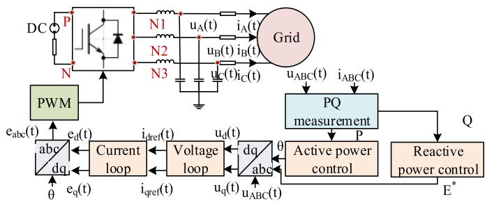  
Fig. 2. GFM model.

$$
R _ {d q 0} ^ {\text {o u t}} (t) = \operatorname {P a r k} (t) \cdot R _ {a b c} ^ {\text {o u t}} (t) \cdot \operatorname {i n v} (\operatorname {P a r k} (t)) \tag {24}
$$

where $L _ { d q 0 }$ is inductance matrix, $P a r k ( t )$ is the park matrix, $R _ { a b c } ^ { o u t } ( t )$ is the external resistance matrix, $R _ { d q 0 } ^ { o u t } ( t )$ is the transformed external resistance matrix, $v _ { d q 0 } ^ { o u t } ( t )$ is the external equivalent open-circuit voltage.

6) Grid Forming Converter Control: The Grid Forming Converter Control (GFM) with active and reactive power loop voltage and current double closed loop [13], [14], [15] is shown in Fig. 2. The universal voltage source converter [16] can be derived as follows:

$$
V _ {N 1} (t + \Delta t) = \left\{ \begin{array}{l} V _ {P} (t + \Delta t), S _ {a} (t) = 1 \\ V _ {N} (t + \Delta t), S _ {a} (t) = 0 \end{array} \right. \tag {25}
$$

$$
\begin{array}{l} V _ {N 1} (t + \Delta t) - V _ {N} (t + \Delta t) \\ = S _ {a} (t) \left(V _ {P} (t + \Delta t) - V _ {N} (t + \Delta t)\right) \tag {26} \\ \end{array}
$$

$$
V _ {P} (t + \Delta t) - V _ {N} (t + \Delta t) = V _ {D C} \text {i f} R d c \approx 0 \tag {27}
$$

$$
i _ {A} (t + \Delta t) + i _ {B} (t + \Delta t) + i _ {C} (t + \Delta t) = 0 \tag {28}
$$

where ${ { V } _ { N 1 } } ( t ) , { { V } _ { N } } ( t )$ and $V _ { P } ( t )$ are the voltages of node N1, N and $P , S _ { a } ( t )$ is the switching function of phase $\mathrm { A } , V _ { D C }$ is the DC voltage, Rdc is the DC resistance, $i _ { A } ( t ) , i _ { B } ( t )$ , and $i _ { C } ( t )$ are the injected currents to the converter.

The swing equation is modelled in the active frequency loop to mimic the transient dynamic behaviors of SG as follows:

$$
\omega (t) = c _ {1} P (t) + c _ {1} P (t - \Delta t) + c _ {2} \cdot \omega (t - \Delta t) + c _ {3} \tag {29}
$$

$$
c _ {1} = \frac {\Delta t}{2 \omega_ {n} J + \Delta t \omega_ {n} D}, c _ {2} = \frac {2 \omega_ {n} J - \Delta t \omega_ {n} D}{2 \omega_ {n} J + \Delta t \omega_ {n} D},
$$

$$
c _ {3} = - \frac {2 P _ {r e f} \Delta t}{2 \omega_ {n} J + \Delta t \omega_ {n} D} \tag {30}
$$

where $J , \ D , \ c _ { 1 } , \ c _ { 2 }$ , and $c _ { 3 }$ are constants, $\omega _ { n } \mathrm { i s }$ the nominal angular speed, ω(t) is the angular speed, $P ( t )$ is the active power.

# C. MATLAB and FPGA Comparison

To illustrate the complexity of FPGA, Fig. 3 presents details the comparison of models between MATLAB and FPGA as follows:

a) Complex input: 64-bit or 32-bit binary parameters (e.g., A in (8)) are difficult to check.

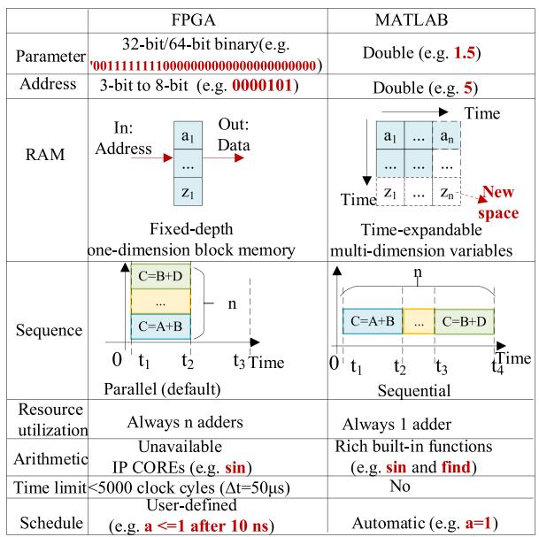  
Fig. 3. Comparison between FPGA and MATLAB.

b) Fixed memory space: With increasing simulation time, fixed memory space becomes insufficient (e.g., 40000 simulation points for simulation time 20s).   
c) Parallel logic: Rather than code by code, the components operate simultaneously (e.g., transmission line in (8) and network solution in (10)).   
d) Limited source utilization: The available FPGA resources (e.g adder) decides the size of simulated transmission network.   
e) Unavailable arithmetic: High-level function (e.g sin in (11)) is not built in FPGA.   
f) Strict timing: All the EMT models have to be completed within 5000 clock cycles to ensure calculations at next time step.   
g) Integrated circuits: Unlike MATLAB function, new port map brings new connections on FPGA circuit.

To simplify FPGA design, MTOF is programmed on MAT-LAB script to minimize programming efforts and real-time operations, so that data readability, scalability and etc. can be improved.

# D. MTOF Modeling and Design

To repeat these calculations successfully in II.B, Fig. 4 presents how to solve n RLC branches in MTOF. As illustrated, MTOF can extract parameters, arithmetic operators and sequences from EMT components to three data formats correspondingly:

a) Parameters, such as $[ A I , . . . , A n ] , [ B I , . . . , B n ] , [ C I , . . . , C n ] .$ are involved in memory unit.   
b) Arithmetic operations, for instance 6-input multiplyadder, are implemented in sub modules.   
c) Calculation sequence, such as read state, read-and-write state and write state, are reflected in the main controller.

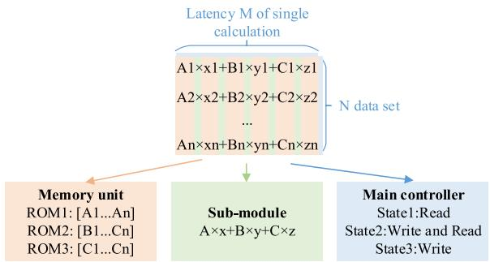  
Fig. 4. Data formatter of MTOF.

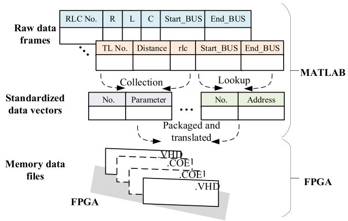  
Fig. 5. Memory unit standardization.

Therefore, this general data formatter can help accelerate FPGA-based EMT calculations effectively.

# 1) Memory Unit:

a) Standardization: Clean data format can be easily processed for hardware. To simplify hardware design, Fig. 5 details how to standardize memory unit in MTOF.

To achieve more straightforward logic for FPGA, MTOF converts raw inputs into one-dimension vector. Only essential parameters (e.g., constant A in (8)), are kept to calculate different EMT models, reducing memory space for unessential parameters (e.g., constant h in (9)). Addresses are pre-calculated to locate each variable every clock cycle (e.g., start voltage $v _ { s } ( t )$ in (7)) in spite of node sequence. For flexible access, arbitrary data arithmetic (such as binary, hexadecimal and Floating-Point) and data file type (such as VHD and .COE) are all optional for users.

With efficient and flexible data conversion, MTOF can provide friendly environment for end-users to access the hardware.

b) Initialization: Owing to variable discrete time delay, HDL coder can not convert the Simulink model of distributed transmission line.

To overcome this problem, Fig. 6 illustrates that MTOF can initialize the memory unit $I _ { T L }$ of all the distributed transmission lines without increasing memory space over simulation time. For faster search, an equivalent index that satisfies the combination of phase, branch and the time delay is calculated in (25)–(26). To release new space for the next time step, (27) illustrates the

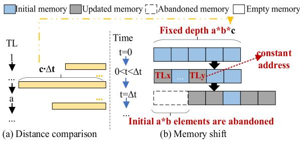  
Fig. 6. Memory initialization.

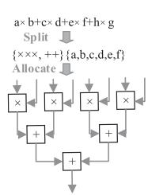  
(a) Pipelined design

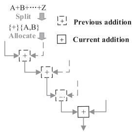  
(b) Non-pipelined design   
Fig. 7. Sub-module translation using pipelined and non-pipelined design.

memory unit will shift the initial a · b elements at each time step end.

$$
g (t) = p \cdot q \cdot w, 0 \leq t \leq \Delta t \tag {31}
$$

$$
g (t) \leq g _ {\max } = a \cdot b \cdot c \tag {32}
$$

$$
I _ {T L} (g (t)) = I (g (t) + a \cdot b), i f t = \Delta t \tag {33}
$$

where $g ( t )$ is the combined address function at time $t , I _ { T L }$ is the memory unit for all the history currents, $g _ { \mathrm { m a x } }$ is the depth of $I _ { T L } , a ,$ b and c are amount of branches, modals, and maximum travelling time steps, p, q and w are index of branch, modal, and travelling time.

# 2) Sub Module:

a) Pipelined design: Area-efficient design plays an important role in ensuring executable program. For saving resources, Fig. 7 illustrates the pipelined and non-pipelined designs for translating simple and complex sub modules, respectively.

As illustrated, original model can be treated as a string, in which ports and operators can be easily recognized. For pipelined design, the key is to implement all the arithmetic operators and balance time delay, allowing high-frequency read/write operations. This pipelined design is useful for multiple simple calculations (more than 30 times), for example, transmission line in (8)). For non-pipelined design, the key is to reuse the same arithmetic operator sequentially for complex calculations, in which new inputs are only allowed once during the same latency. This non-pipelined design is suitable for several complex calculations (less than 10 times), for example, gauss elimination in (22)).

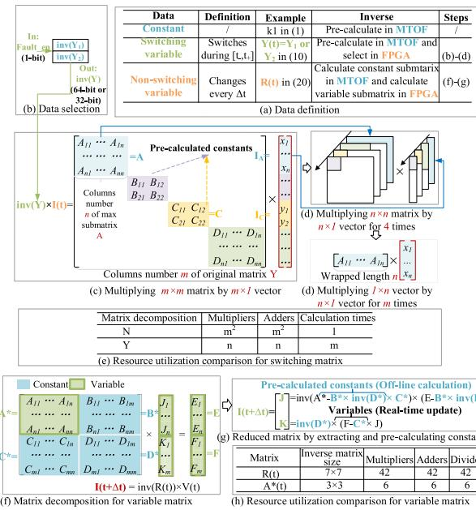  
Fig. 8. Matrix decomposition structure.

b) Matrix decomposition: Except for basic translation, calculations with similar sizes and signs can also be optimized to improve resource utilization efficiency.

To solve linear equations (e.g., (10) and (20)) faster in FPGA, matrix decomposition can improve computation efficiency and save hardware resources. The key lies in pre-calculating all the available constants in MTOF and keeps essential calculations in FPGA. Fig. 8 details the matrix decomposition for switchingvariable and variable matrix.

For switching variable matrix (e.g., Y(t) in (10)), matrix decomposition can avoid real-time matrix inverse and convert to vector multiplication. To simulate single-phase fault, only 1-bit enable signal Fault_en is switched to select precalculated constants (e.g., the steady matrix inv $\mathbf { \Sigma } _ { Y _ { 1 } ) }$ and fault matrix inv $( Y _ { 2 } ) )$ for inv(Y) to simplify real-time circuits in In Fig. 8(b). Based on traveling-wave transmission line model, only decoupled submtarices (e.g., A) are kept in memory rather than the whole matrix. The maximum matrix length n is dependent on connected coupled components (e.g., RLC branch in (1)). Owing to independent rows, multiplying m×m matrix by m×1 vector can be replaced by multiplying n n vector by n 1 vector for m times as shown in Fig. 8(d) and (e). With pipelined design, a 2n-input multiplier-adder can complete all the calculations, saving $m ^ { 2 } .$ -n multipliers and adders.

For non-switching variable, matrix decomposition can reduce inverse matrix dimension in real-time. Real-time computational burden can be reduced by pre-calculating constant submatrix $( \mathrm { e . g . , } D ^ { \ast } )$ in MTOF and inversing variable matrix (e.g., A∗(t)) in FPGA, in Fig. 8(f). For synchronous machine with two qaxis damper winding, only a 3×3 matrix inversion for variable submatrix A∗(t) is required to calculate (20), rather than inversing the whole 7 7 matrix $R ( t )$ . With pipelined design, 42 dividers can be saved at least.

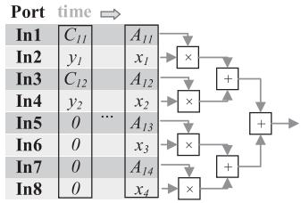  
Fig. 9. Hardware design for size conversion.

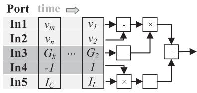  
Fig. 10. Hardware design for sign conversion.

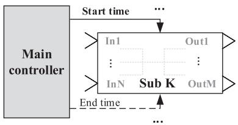  
Fig. 11. Main controller architecture.

c) Reused design: Without extra 4-input multiplier-adder, Fig. 9 details that $C { \times } I _ { C }$ can reuse the same 8-input multiplieradder for calculating $A \times I _ { A }$ (when $n \ = \ 2 )$ . The processing vector for can be $[ A _ { 1 1 } ; x _ { 1 } ; A _ { 1 2 } ; x _ { 2 } ; A _ { 1 3 } ; x _ { 3 } ; A _ { 1 4 } ; x _ { 4 } ]$ and $[ C _ { 1 1 } ; y _ { 1 } ; C _ { 1 2 } ; y _ { 2 } ; 0 ; 0 ; 0 ; 0 ]$ respectively.

For different signs, opposite arithmetic operations can be replaced by similar logics. Time-consuming can be replaced by multiplier for shorter latency, and adder and substracter can be converted from and to each other. For example, Fig. 10 provides that different RLC branches in (1) can be processed similarly by converting signs of pre-calculated constants. As illustrated, the processing vector for C branch and L branch in (1)–(2) can be $[ v _ { m } ; v _ { n } ; G _ { k } ; - 1 ; I _ { c } ]$ and $[ v _ { 1 } ; v _ { 2 } ; G _ { 2 } ; - 1 ; I _ { L } ]$ using the same module, resulting in significant area savings.

3) Main Controller: MTOF can set reasonable calculation sequence to ensure the real-time execution in FPGA. Without such a tool, it is easy to cause output errors and disturb further calculations. Therefore, Fig. 11 illustrates that MTOF can generate the main controller to start and end different sub modules periodically. Using Finite State Machine (FSM), the strict calculation sequence can be maintained as follows:

Non-pipelined schedules can speed up and save resources for complex calculation (e.g., SG in (11)–(14)). For strict calculation sequence, Fig. 12(a) illustrates how to stagger the use of common non-pipelined modules for several data sets, for instance, gauss elimination in (10). For general applications, Fig. 12(b) gives that the general latency $L _ { j }$ is determined by maximum latency of parallel sub modules w, $w + 1 , . . , v$ . Owing to reused resources,

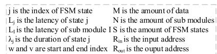

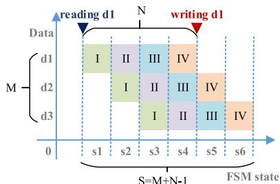  
Fig. 12. Non-pipelined schedules.

(a) Real-time schedule

<table><tr><td>Numbered equations</td><td>General equation</td></tr><tr><td>L1=max(Lt)</td><td>Lj=max(Lw,Lw+1,...,Lv)</td></tr><tr><td>L2=max(Lt, LII)</td><td>w=min(j,M)</td></tr><tr><td>L3=max(Lt, LII, LIII)</td><td>v=min(1,j-N+1)</td></tr><tr><td>L4=max(LII, LIII, LVI)</td><td>λj=Lj+2</td></tr><tr><td>L5=max(LIII, LVI)</td><td></td></tr><tr><td>L6=max(LVI)</td><td></td></tr></table>

(b) Latency calculation   
(c)Address operations   

<table><tr><td>Time</td><td>Operations</td><td>Address</td></tr><tr><td>t=0</td><td>Read</td><td>\( R_{in}=R_{out}=j \)</td></tr><tr><td>\( 0 &lt; t &lt; L_j + 1 \)</td><td>Calculate</td><td>/</td></tr><tr><td>\( t = L_j + 1 \)</td><td>Write</td><td>/</td></tr><tr><td>\( t = \lambda_j \)</td><td>Reset</td><td>\( R_{in}=R_{out}=0 \)</td></tr></table>

Fig. 12(c) shows that non-pipelined sub modules only set address at $t ~ = ~ 0$ and reset address at $t _ { \mathbf { \theta } } = \lambda _ { j }$ for one data set during state $j .$ . Therefore, it takes only 2000 clock cycles to calculate 10 SGs when single SG is 10-state FSM and maximum latency is 100 clock cycles, reducing linear calculation time

Pipelined schedules can allow simple calculation (e.g., transmission lines in (7)–(9)) within each clock cycle. To simplify main controller, Fig. 13(a) illustrates that MTOF can integrate pipelined data sets in the same state, for instance, all the calculation according to (8). For high-frequency operations, Fig. 13(b) and (c) illustrates that read address is increased when data depth is not reached, while write address is increased after the initial latency is reached. For clock synchronization, delay $C _ { j }$ is introduced in Fig. 13(b), which is depending on whether input port or output port is using additional address table.

# III. MTOF STRUCTURE

To automate high-level dataflow from MATLAB to FPGA, the fundamental principles and architecture are introduced for MTOF.

# A. Fundamental Principles

To illustrate the complexity of hardware programming, Fig. 14 gives the data flow comparison between MTOF, HDL coder and ISE. Fig. 14(a) illustrates that beginners have to program a large number of VHDL declarations and statements bit by bit in ISE. A deep understanding of digital hardware is required for traditional programming with a minimal of code lines.

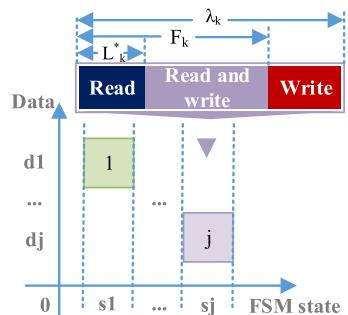  
Ljis the corrected latency of of sub module j ICj is the time delay of sub module j Fj is the data depth of dk   
(a) Time schedule

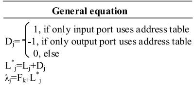

(b) Latency calculation   
(c)Address operations   

<table><tr><td>Time</td><td>Operations</td><td>Equations</td></tr><tr><td>t&lt;Fi*</td><td>Read</td><td>Rin=In+1</td></tr><tr><td>t&gt;Lj</td><td>Write</td><td>Rout=Rout+1</td></tr><tr><td>t=λi</td><td>Next state</td><td>Rread=Rwrite=0</td></tr></table>

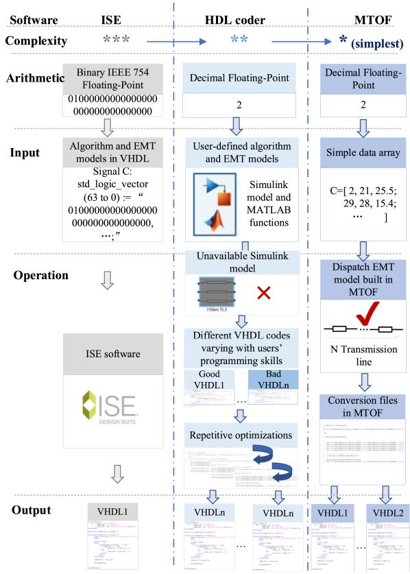  
Fig. 13. Pipelined schedules.   
(a) Traditional ISE dataflow (b) HDL coder dataflow   
(c) MTOF dataflow   
Fig. 14. Data flow comparison between MTOF toolbox, HDL coder and ISE.

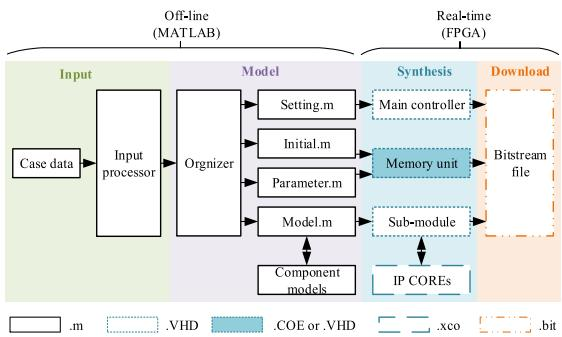  
Fig. 15. MTOF ready-to-go architecture.

With limited functionality, HDL coder can not translate distributed transmission line in SIMULINK because of discrete variable time delay as illustrated in Fig. 14(b). Besides, only limited standard code format are supported for MATLAB script. Users’ programming skills decide whether the output VHDL is executable. Repetitive optimizations are unavoidable for beginners.

With simplest data input array, MTOF provides the most highlevel programming models (e.g., distributed transmission line) for users to scale up. To enhance flexibility, the fundamental principles of MTOF are:

a) To use high-level data structures in Fig. 14(b) to standardize similar calculations.   
b) To improve efficiency by minimizing the number of logical statements for models;   
c) To use intelligent function files instead of script files;   
d) To use pipelined design;   
e) To minimize the number of IP Cores;   
f) To pre-allocate vectors of predictable size.

These outlined principles can significantly improve code readability and simplicity.

# B. Main Architecture

To improve dataflow consistency, the ready-to-run architecture is proposed in Fig. 15. This complete architecture relies on the dependent interconnection of individual modules:

1) At input stage, the input processor allows high-level data structure (e.g., Double Floating-Point matrix) and creates organizer file.   
2) At model stage, the organizer calls appropriate M-files to recognize and extract essential data according to users’ settings. MTOF provides these essential M-files as follows:

a) Setting.m: Timing and routing settings, such as clock frequency and latency.   
b) Initial.m: Initial conditions of the time-domain solution.   
c) Parameter.m: Actual parameters for the test system, for instance transmission line distance.   
d) Address.m: Addresses for variable and parameter index.

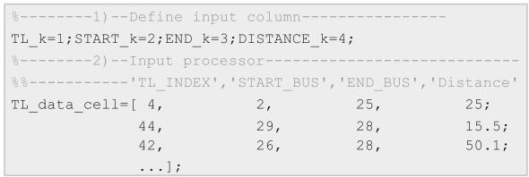  
Fig. 16. Typical input processor of MTOF.

e) Model.m: Pre-defined core codes for different EMT models, such as synchronous machine.

3) At synthesis stage, essential data are inserted into the appropriate code location, avoiding programming hardware directly. The following files can be generated for FPGA:   
a) Main controller: Calculation sequence, hardware settings and port map.   
b) Sub-module: Arithmetic operators and pipelined designs.   
c) Memory unit: Parameters and addresses.   
4) At download stage, the bitstream file (.bit) can be generated automatically in hardware design tools (e.g., ISE) and downloaded into FPGA board.

# IV. MTOF PROGRAMMING

To improve coding efficiency, the key is to program with MATLAB built-in functions to generate corresponding VHDL codes. To illustrate the simplicity of programming, the elements of MTOF are introduced as follows:

# A. Input Processor

Programming is always easier if the developer can build with high-level data structures. MTOF allows users input using standard multi-dimension Floating-Point array in input processor. Each component type (e.g., transformer) is assigned a unique table and string name, make it easier to work from inputs to outputs. To illustrate the simplicity of programming, Fig. 16 gives partial codes for transmission lines from input processor:

As illustrated, essential data (e.g., start bus), can be defined in the same array without any data conversion. This allows endusers to easily modify the network information within one array, maximizing code readability and simplicity. There is no need for users to define binary representations in VHDL codes directly.

# B. Address.m

To access any data in a single clock cycle, address.m can precalculate constant addresses automatically according to input processor.

To illustrate the programming efficiency, Fig. 17 gives partial code for transmission lines from address.m. At the first step, the number of transmission lines row_TL can be returned using size function, in spite of system scale. At the second step, the index of start bus can be searched in the bus group Vm_all using find function. Furthermore, three-phase index row_start can be converted into single-phase index Vm_a_index. At third step, the

Fig. 17. Partial code of address.m.   

<table><tr><td></td><td>Code</td></tr><tr><td>Step1: Get size</td><td>[row_TL,col_TL]=size(TL_data_cell);</td></tr><tr><td>Step2: 
Pre-calculate 
One-dimension 
address</td><td>for h=1,row_TL; 
[row_start,col_start]=find(Vm_all(:)=TL_data_cell(h,START_k)) 
Vm_A_index(3*h-2:3*h)[row_start*3-2:row_start*3]&#x27;; 
end</td></tr><tr><td>Step3: Allocate 
memory space</td><td>step1_add_width=fix(log2(row_TL*6))+1;</td></tr><tr><td>Step4: Convert 
data</td><td>Vm_A_index_bin=dec2bin(Vm_A_index-1,step1_add_width)</td></tr></table>

Fig. 18. Partial code of parameter.m.   

<table><tr><td></td><td>Code</td></tr><tr><td>Step1: Get original parameter</td><td>d_TL(TL_line_j) =TL_data_cell(TL_line_j, DISTANCE_k);</td></tr><tr><td>Step2: Pre-calculate essential parameter</td><td>for line_j=1:row_TL A_TL(6*line_j-5:6*line_j-3)=diag(- (eye(3,3)+h_TL(3*TL_line_j-2:3*TL_line_j,:)) /2*inv(Z_TL(3*TL_line_j-2:3*TL_line_j,:)); ... end</td></tr><tr><td>Step3: Convert data</td><td>for i=1:row_TL*6 A_TL_64bits(i,:)=float2bin(A_TL(i)); end</td></tr></table>

minimum address bandwidth step1_addr_width can be obtained using fix and log2 functions. At the fourth step, three-phase index Vm_a_index can be converted to binary representation Vm_a_index_bin using dec2bin function, achieving readable data format for FPGA.

# C. Parameter.m

Blind usage of input parameters simplifies programming but put a heavy computational burden on FPGA. To avoid this complexity, parameter.m pre-calculates constant parameters, releasing more resources.

To illustrate the simplicity, Fig. 18 presents partial code of transmission line from parameter.m. At the first step, original input parameters (e.g., transmission line distance d_TL) can be obtained from input processor. At the second step, the constant A in (9) is pre-calculated as a one-dimension vector using diag, eye and inv function, avoiding data conflicts. At the third step, the constant A is converted into IEEE 754 Floating-Point value using float2bin. By reducing parameter calculation, parameter.m can effectively save resources for real-time FPGA.

# D. Initial.m

For flexible initialization, the initial.m provides zero-start and steady-state start options for users. To illustrate the flexibility, Fig. 19 gives code example from initial.m:

a) At the first step, users can specify initial point and precision flexibly.   
b) At the second step, initialization data can be converted into the specified precision using eval, single, float2bin and convertStringsToChars functions.

Fig. 19. Partial code of initial.m.   

<table><tr><td></td><td>Code</td></tr><tr><td>Step1: Set initial point and precision</td><td>i_start=200000; 
bit=1;%1--double,2--single; 
bit_function=[&#x27;&quot;,&quot;single&#x27;];</td></tr><tr><td>Step2: Convert data</td><td>for i=1:Row_TL*6 
eval([&#x27;&#x27;Im_matrix_coe(i,:)=float2bin(&#x27;&#x27;, convertStringsToChars (bit_function(:,i_bit)), &#x27;(Im_matrix(i)); &#x27;;&#x27; end;</td></tr><tr><td>Step3: Write files</td><td>fprintf(fid,&#x27;memory_initializer_radix=2;\n&#x27;); 
for j=1:line_TL_data_cell*6; 
fprintf(fid,&#x27;%s,\n&#x27;,Im_matrix_coe(j,:)); 
end;</td></tr></table>

Fig. 20. Partial code of model.m.   

<table><tr><td></td><td>Code</td></tr><tr><td>Step1: Input equation</td><td>equa=&#x27;aa*bb+cc*dd+ee*ff+gg*hh&#x27;;IP_CORE=[&#x27;multiplier&quot;,&quot;adder&quot;,&quot;substracter&quot;];</td></tr><tr><td>Step2: Split port</td><td>temp2=regex(equa,&#x27;[a-z]{1,20}&#x27;, &#x27;match&#x27;);temp4=regex(equa,&#x27;[+|*|-]&quot;, &#x27;match&#x27;);temp4=replace(temp4,&quot;*&quot;,&quot;1&quot;);...temp4_num1=str2double(temp4);\...</td></tr><tr><td>Step3: Locate arithmetic operators</td><td>for i=1:length
eval([&#x27;symbol_m(1:b_end(i),i)=temp4_num&#x27;,
num2str(i),(&#x27;1:2:end);&#x27;));eval([&#x27;temp4_num&#x27;,num2str(i+1),&#x27;=temp4_num&#x27;,
num2str(i),(&#x27;2:2:end);&#x27;];end;</td></tr><tr><td>Step4: Write files</td><td>for i=1:length;
for j=1:b_end(i)
eval([&#x27;fprintf(fid,&quot; char(IP_CORE(:,symbol_m(j,i))&#x27;,
&#x27; PORT MAP (&#x27;)&#x27;,&#x27;)];%IP_CORE declaration;
eval([&#x27;fprintf(fid,&quot; a =&#x27;),
char(temp2(:,2*j-1),&quot;\n&#x27;)&#x27;,&#x27;)];% input port;
eval([&#x27;fprintf(fid,&quot;result=&gt;result_step&#x27;,num2str(i),
&#x27;_output&#x27;,num2str(j),(&#x27;\n&#x27;)&#x27;,&#x27;)];% output port;
end;end;</td></tr></table>

c) At the third step, MTOF can write these data in COE files using fopen and fprintf functions.

These COE files can be loaded into BRAM directly without interrupting other code, minimizing programming complexity.

# E. Model.m

Since port mapping complexity increases with system size, the model.m connects signals and physical pins automatically by string recognition.

To illustrate the programming simplicity, Fig. 20 gives partial code from model.m. At the first step, the equation and available IP COREs are input for model.m. At the second step, the I/O ports and arithmetic operators are recognized and decoded into numbers using regexp, str2double and replace functions. At the third step, the arithmetic operators can be put in the appropriate time slots using eval functions. At the fourth step, signals can be connected to the correct ports of IP COREs, ensuring the complete route. Further registers can be added using eval function. By automatic recognition, line-by-line code can be avoided for programming hardware.

<table><tr><td></td><td colspan="2">Code</td></tr><tr><td>Step1:Calculatetime delays</td><td colspan="2">depth_step1=row_TL*6;sum_step1=depth_step1+latency_step1;</td></tr><tr><td>Step2:Declareconstants</td><td colspan="2">eval([&#x27;fprintf fid,&#x27;constant depth_step&#x27;,num2str(i),&#x27;:integer:=%i;\n&#x27;,depth_step&#x27;,num2str(i),』]);</td></tr><tr><td>Step3:Generatemaincontrollers</td><td colspan="2">when state10=&gt;if(a_index=sum_step1) then next_state&lt;=state1;elsif(a_index&lt;latency_step1) then readelsif(a_index&lt;depth_step1) then read and writeelsif(a_index&lt;sum_step1) then write</td></tr></table>

(a) Pipelined design   
(b) Non-pipelined design   

<table><tr><td></td><td>Code</td></tr><tr><td>Step1: Get the max latency</td><td>lat_max=max(lat_m1, lat_m2, lat_m3)</td></tr><tr><td>Step2: Parallelize modules</td><td>when state10 =&gt; if(a_index=lat_max) then next_state &lt;= state1; elseif(a_index=0) then start m1, m2, m3;</td></tr></table>

Fig. 21. Partial code of setting.m.

# F. Setting.m

To avoid incomplete data, the setting.m uses adaptive codes to ensure strict calculation sequence. To illustrate the simplicity, Fig. 21 gives partial code of setting.m for pipelined and nonpipelined design:

a) For pipelined design, the setting.m can maintain clock synchronization at the same FSM state by modifying constant declaration. At the first step, the time delays of read, read-and-write and write can be easily calculated as latency_step1, depth_step1 and sum_step1. At the second step, only constant values (e.g., latency_step1) are modified in declaration using eval function, while main controller remains the same. This can help avoid distributed code modification in main controllers.   
b) For non-pipelined design, the setting.m can parallelize sub modules at the same FSM state, reducing required states. At the first step, the combined latency is determined by the maximum latency of module 1-3 using max function. At the second step, the module 1-3 can be controlled simultaneously using eval function, avoiding 2 additional states.

Therefore, the time schedules of pipelined and non-pipelined designs can be optimized to satisfy the real-time requirements.

The related Open Source Code and instructions can be found in [20].

# V. CASE STUDY

# A. Simulation Environment

For successful implementation of MTOF, Fig. 22 provides the software-to-hardware simulation environment:

For software, host PC is equipped with MATLAB and Xilinx ISE software. MTOF is installed as a package in MATLAB 2018b. After proper installation, MTOF is launched by typing $\mathrm { ^ { * } { > } > M T O F ^ { \prime } }$ at MATLAB command window. Xilinx ISE Tool

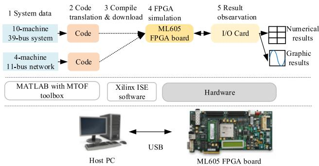  
Fig. 22. Simulation environment.

is only used to compile files (such as VHD-files and COE files) from MTOF and generate bitstream file for downloading.

For hardware, all the case studies are simulated on single ML605 FPGA board, with 768 DSPs, 416 RAMs, 301440 registers and 150720 LUTs. 100MHz clock is set as system clock. IP COREs of Floating-Point and distributed memory blocks can help process IEEE-754 standard Floating-Point values accurately.

In this software-to-hardware simulation environment, endusers can easily obtain executable program by entering input data in MTOF.

# B. Simulation Workflow

To provide more transparent data flow, Fig. 23 presents the MTOF dataflow including output, workflow and calling function.

To minimize programming efforts, users only input data array (Fig. 13) for MTOF at step 1. At step 2-3, MTOF calculates parameter and address constants as workspace variable. To improve flexibility, step 4 and step 5 are optional for users to generate initials (.COE file) and new submodules (.VHD file). According to input size, step 6 allocate latency and main module. At step 7, all the constants are converted into readable format (.COE file and .VHD file) for FPGA. Step 8-9 compiles the above files and download .bit file for FPGA.

With this transparent data flow, users can build and scale up system step by step. The related Open Source Code and instructions can be found in [20].

# C. Test Systems

For experimental validation, two case studies are presented: A 4-machines 11-bus system is shown in Fig. 24; A 10-machine 39-bus test system is shown in Fig. 25. A modified 10-machine 39-bus test system with IBR is shown in Fig. 26.

# D. Accuracy

To verify the accuracy, a referenced model in MATLAB is selected. The average error is given by max absolute error over max referenced magnitude in the whole period:

$$
\varepsilon = \frac {\sum_ {t = 0} ^ {n} \frac {\left| V _ {F P G A} (t) - V _ {M A T L A B} (t) \right|}{\left| V _ {M A T L A B} (t) \right|} \times 100 \%}{\frac {n}{\Delta t}} \tag{34}
$$

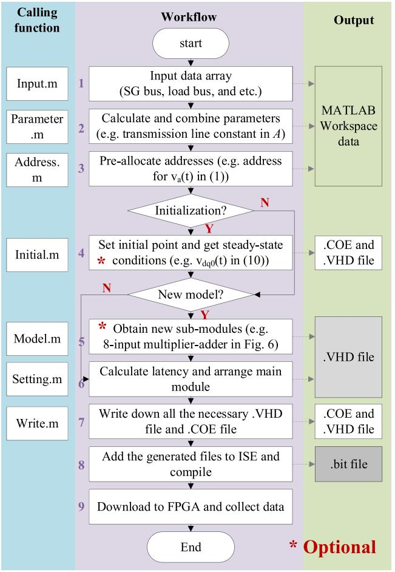  
Fig. 23. MTOF data flow.

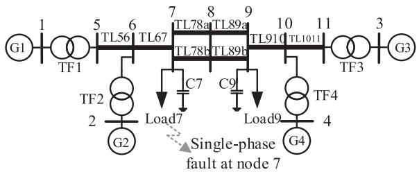  
Fig. 24. 4-machine 11-bus test system.

where ε is the average relative error, $V _ { F P G A } ( t )$ is the measured data in FPGA at time t, $V _ { M A T L A B } ( t )$ is the referenced data in MATLAB at point t, n is the total duration of simulation, Δt is the simulation step.

Detailed accuracy studies on the 4-machine 11-bus, 10- machine 39-bus system and 1-IBR 39-bus system are given as follows:

1) 4-Machine 11-Bus Test System: For 4-machine 11-bus test system, a single-phase fault is applied at bus 7 as shown in Fig. 27 from 1.0 s to 1.1 s at bus 7 to observe transient behaviors of SG1.

For accuracy analysis, Fig. 27 provides detailed simulation results of FPGA model, referenced MATLAB model and referenced SIMULINK model. From Fig. 27, it can be observed that the voltages, currents and electric torques of the two models

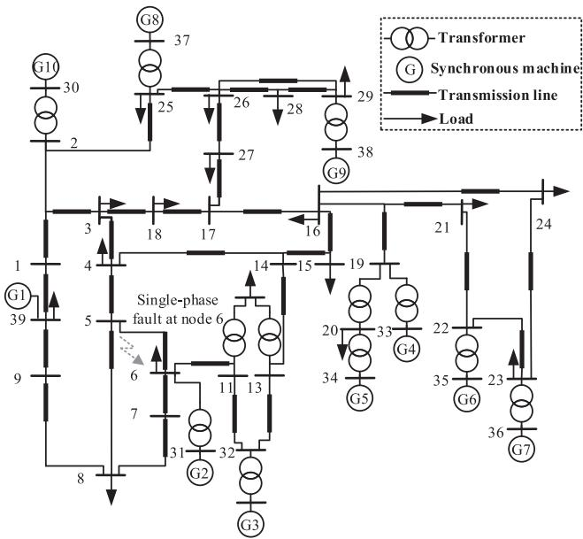  
Fig. 25. 10-machine 39-bus test system.

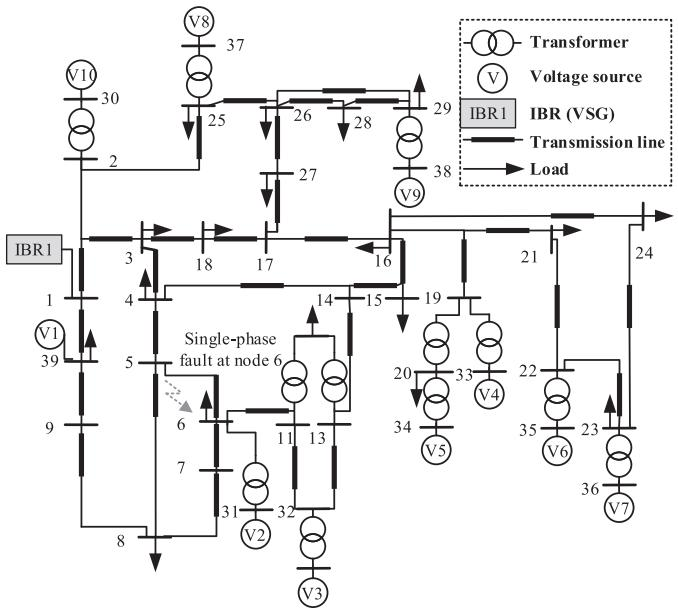  
Fig. 26. Modified 39-bus test system with IBR.

are highly matched. From Fig. 27(b), the maximum absolute error of vq is 0.0224, and FPGA model by MTOF can reduce the average error to 0.30% according to (15), which verifies the high accuracy of MTOF.

2) 10-Machine 39-Bus Test System: In order to validate the accuracy of MTOF for a larger system, a single-phase fault is applied at bus 6 of the 10-machine 39-bus test system from 1 s to 1.1 s as shown in Fig. 28.

Fig. 28 compares the simulation results between FPGA model and referenced MATLAB model. Even this system is three times larger than the 4-machine 11-bus test system, the maximum absolute error of q axis voltage can be limited to 0.0589 as shown

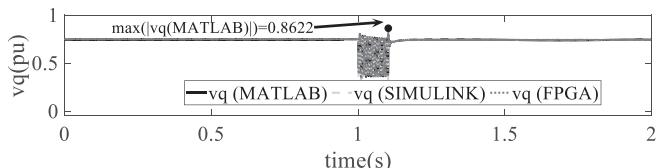

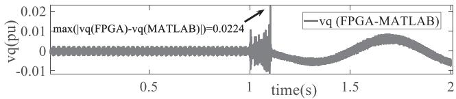  
(a) Q axis voltage

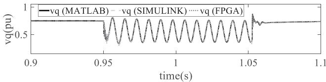  
(b) Q axis voltage error   
(c) Zoom-in q axis voltage of (a)

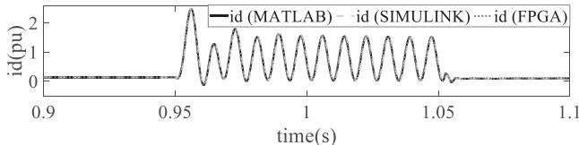  
(d) Zoom-in d axis current

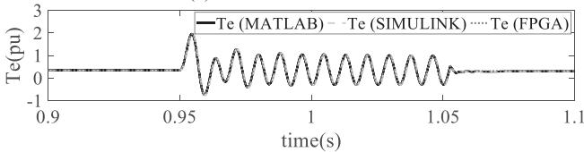  
(e) Zoom-in electric torque   
Fig. 27. Results of synchronous machine G2 with initialization and without initialization.

in Fig. 28(b). For the simulation, MTOF can reduce the average relative error 1.49% to according to (15).

Therefore, it can be found that MTOF can solve the 4-machine 11-bus and 10-machine 39-bus test system with high accuracy, with the average relative error less than 2%.

3) Modified 39-Bus Test System With IBR: In order to validate the accuracy of IBR-based model in MTOF for a larger system, a single-phase fault is applied at bus 6 of the modified 39-bus test system with 1 IBR installed at Bus 1 from 0.8 s to 0.9 s as shown in Fig. 28.

Fig. 29 compares the PWM control signal, active power output and frequency with that of the referenced Simulink model. As illustrated, MTOF can limit the absolute error of per unit active power and frequency to less than 2% and 1% respectively. This illustrates the scalability of MTOF for IBR-based resources.

# E. Real-Time Schedule

To meet real-time constraints, Fig. 30 compares real-time schedule between 4-machine 11-bus, 10-machine 39-bus and 1-IBR 39-bus test system. As illustrated, 4-machine 11-bus system takes 25.4 μs at simulation step 50 μs. With the help of FSMs and pipelined design in MTOF, at each step it only

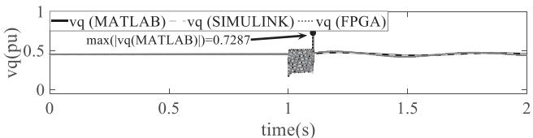  
(a) Q axis voltage

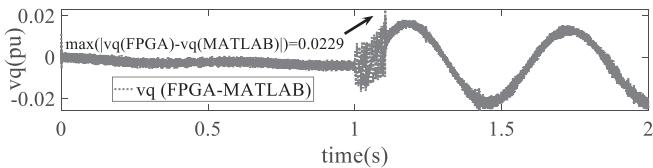  
(b) Q axis voltage error

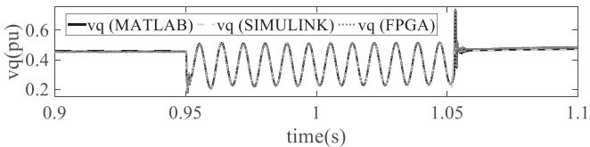  
(c) Zoom-in q axis voltage

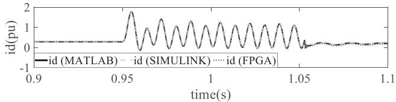  
(d) Zoom-in d axis current

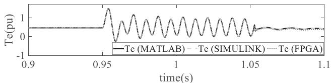  
(e) Zoom-in electric torque   
Fig. 28. Results of synchronous machine G1 with initialization and without initialization.

TABLE I RESOURCE UTILIZATION COMPARISON   

<table><tr><td></td><td>registers</td><td>LUTs</td><td>RAM</td><td>DSP</td></tr><tr><td>4-machine 11-bus</td><td>34%</td><td>78%</td><td>12%</td><td>91%</td></tr><tr><td>10-mahcine 39-bus</td><td>34%</td><td>87%</td><td>12%</td><td>92%</td></tr><tr><td>1-IBR 39-bus</td><td>23%</td><td>94%</td><td>11%</td><td>14%</td></tr></table>

takes 47 μs to solve the 10-machine 39-bus though the system is three times larger than the 4-machine 11-bus. Because IBR only requires history RLC currents and node voltages to update PWM signal, therefore the IBR can be parallel with network solution within 17 μs. The time schedule can be even much smaller if latency can be reduced.

Therefore, the model generated with MTOF is real-time implementable.

# F. Resource Utilization

For resource cost, Table I provides resource cost for the 4- machine 11-bus, 10-machine 39-bus and the 1-IBR 39-bus test

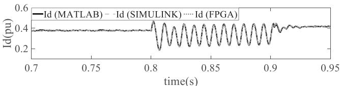  
(a) d axis current

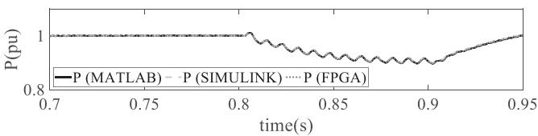

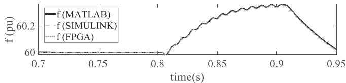  
(b) Active power   
(c) Frequency   
Fig. 29. Simulation results of IBR model.

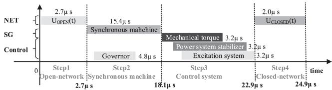  
(a)4-Machine 11-bus test system

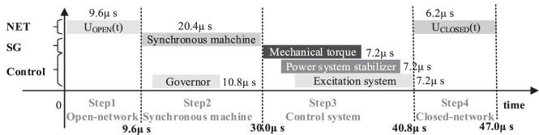  
(b)10-Machine 39-bus test system

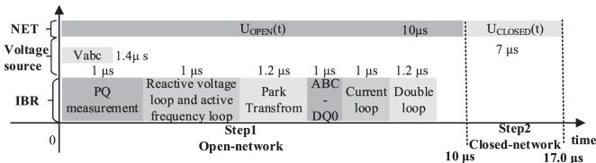  
(c) 1-IBR 39-bus test system   
Fig. 30. Real-time schedules comparison.

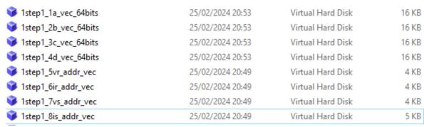  
Fig. 31. VHDL file list obtained with MTOF.

TABLE II COMPUTING TIME FOR CASE STUDIES   

<table><tr><td>Test system</td><td>FPGA files generation time without MTOF</td><td>FPGA files generation time with MTOF</td></tr><tr><td>4-machine 11-bus</td><td>≥6 months</td><td>50 s</td></tr><tr><td>10-machine 39-bus</td><td>≥6 months</td><td>300 s</td></tr><tr><td>1-IBR 39-bus</td><td>≥6 months</td><td>30s</td></tr></table>

TABLE IIIFILES AND CODE LINES FOR CASE STUDIES  

<table><tr><td>Test system</td><td>Number of MTOF M-file</td><td>Lines of Code in MTOF M-file</td><td>Number of FPGA files</td><td>Lines of FPGA code</td><td>Code Ratio</td></tr><tr><td>4-machine 11-bus</td><td>3</td><td>2280</td><td>87</td><td>94572</td><td>2.4%</td></tr><tr><td>10-machine 39-bus</td><td>3</td><td>2431</td><td>87</td><td>97352</td><td>2.5%</td></tr><tr><td>1-IBR 39-bus</td><td>14</td><td>4591</td><td>93</td><td>72427</td><td>6.3%</td></tr></table>

system. As illustrated, the utilization of registers, LUTs, RAMs and DSP are still less than 100%, ensuring executable bitstreams for both test systems. Compared with the 4-machine 11-bus test system, LUT only increases from 78% to 87% even system has scaled up to the 10-machine 39-bus test system. The 1-IBR 39- bus system with 1 IBR utilizes much lower 14% DSP because all the multiplier IP COREs does not use DSP48E. There are still available resources to be utilized for further new models, including 66% registers, 13% LUTs, 88% RAM and 8% DSP.

With the help of MTOF, resource utilization efficiency and system scalability can be effectively improved.

# G. Computing Time

To evaluate the calculation speed of MTOF, Table II details calculation times. As illustrated, the MTOF can generate files within 50 s, 300 s and 30s for the 4-machine 11-bus, the 10- machine 39-bus and 1-IBR 39-bus test systems respectively. The functionality of MTOF includes setting calculation sequence, allocating resources, and initialization. For beginners, without such a tool, it could take at least 6 months to develop FPGA code and carry out testing.

# H. Coding Efficiency

For coding efficiency, Table III provides required files and lines of code for different test systems. The code ratio is 2.4 – 6.3%, which has indicated the super efficiency of the proposed MTOF. For instance, there are 97352 lines of FPGA code for the 10-machine 39-bus system generated by the MTOF while there are only 2431 lines of MATLAB code.

# VI. CONCLUSION

For educational and research purposes, this paper has developed a MATLAB toolbox - MTOF which provides faster, easier and more straightforward FPGA-based code generation for EMT simulation, and will help young researchers to build up their

FPGA simulators with high efficiency. The conclusions can be summarized as follows:

1) Accurate models: The modeling capabilities of MTOF allow beginners to achieve high accuracy real-time EMT simulation using FPGA, which has been demonstrated on both the 4-machine 11-bus and 10-machine 39-bus test system with less than 2% average error.   
2) Hardware-implementable designs: MTOF can effectively reduce LUT utilization to 87% and time schedule to 47 μs to achieve 10-machine 39-bus test system on a single board.   
3) Super computing efficiency: The ready-to-run architecture allows automatically generate the VHDL code from MATLAB code within 300 s, avoiding 6-month coding and testing time.   
4) Excellent coding efficiency: MTOF can generate 97352 lines of FPGA (VHDL) code from 2431 lines of MATLAB code, and this results in significantly improved coding efficiency with a ratio of 2.5%.

The proposed MATLAB toolbox - MTOF in this paper can be used in postgraduate power system digital design course to introduce FPGA based real-time simulation, protection, and control applications. In the future, further models (e.g., inverter-based resources) can be developed in MTOF.

# REFERENCES

[1] J. Liu and V. Dinavahi, “Detailed magnetic equivalent circuit based realtime nonlinear power transformer model on FPGA for electromagnetic transient studies,” IEEE Trans. Ind. Electron., vol. 63, no. 2, pp. 1191–1202, Feb. 2016.   
[2] Y. Chen and V. Dinavahi, “Digital hardware emulation of universal machine and universal line models for real-time electromagnetic transient simulation,” IEEE Trans. Ind. Electron., vol. 59, no. 2, pp. 1300–1309, Feb. 2012, doi: 10.1109/TIE.2011.2157296.   
[3] V. Dinavahi and N. Lin, Real-Time Electromagnetic Transient Simulation of AC-DC Networks. Hoboken, NJ, USA: Wiley, 2021.   
[4] H. W. Dommel, EMTP Theory Book. Vancouver, BC, Canada: Microtran Power Syst. Anal. Corporation, 1992.   
[5] H. W. Dommel, “Nonlinear and time-varying elements in digital simulation of electromagnetic transients,” IEEE Trans. Power App. Syst., vol. PAS-90, no. 6, pp. 2561–2567, Nov. 1971.   
[6] H. W. Dommel and N. Sato, “Fast transient stability solutions,” IEEE Trans. Power App. Syst., vol. PAS-91, no. 4, pp. 1643–1650, Jul. 1972.   
[7] Xilinx, “Vivado design suite user guide: Using constraints,” User Guide UG903, Version 2018.3, Xilinx Inc., San Jose, CA, USA, 2018. [Online]. Available: https://www.xilinx.com/support/documentation/sw_manuals/ xilinx2018_3/ug903-vivado-using-constraints.pdf   
[8] Xilinx, “Vivado design suite properties reference guide,” User Guide UG912, Version 2018.3, Xilinx Inc., San Jose, CA, USA, 2019. [Online]. Available: https://www.xilinx.com/support/documentation/sw_manuals/ xilinx2018_3/ug912-vivado-properties.pdf   
[9] D. Wang, Z. Duan, C. Tian, B. Huang, and N. Zhang, “A runtime optimization approach for FPGA routing,” IEEE Trans. Comput.-Aided Des. Integr. Circuits Syst., vol. 37, no. 8, pp. 1706–1710, Aug. 2018, doi: 10.1109/TCAD.2017.2768416.   
[10] RTDS Technologies, “Latest development of fpga based realtime simulation,” RTDS Technology Inc., Winnipeg, MB, Canada, 2019. [Online]. Available: https://knowledge.rtds.com/hc/en-us/article_ attachments/360058638434   
[11] S. S. Noureen, V. Roy, and S. B. Bayne, “An overall study of a real-time simulator and application of RT-LAB using MATLAB simpowersystems,” in Proc. IEEE Green Energy Smart Syst. Conf., 2017, pp. 1–5, doi: 10.1109/IGESC.2017.8283453.   
[12] W. Meeus et al., “An overview of today’s high-level synthesis tools,” Des. Autom. Embedded Syst., vol. 16, pp. 31–51, 2012.

[13] R. Rosso, X. Wang, M. Liserre, X. Lu, and S. Engelken, “Grid-forming converters: Control approaches, grid-synchronization, and future trends-a review,” IEEE Open J. Ind. Appl., vol. 2, pp. 93–109, 2021.   
[14] M. Yang, Y. Wang, X. Xiao, and Y. Li, “A robust damping control for virtual synchronous generators based on energy reshaping,” IEEE Trans. Energy Convers., vol. 38, no. 3, pp. 2146–2159, Sep. 2023.   
[15] H. Cheng, Z. Shuai, C. Shen, X. Liu, Z. Li, and Z. J. Shen, “Transient angle stability of paralleled synchronous and virtual synchronous generators in islanded microgrids,” IEEE Trans. Power Electron., vol. 35, no. 8, pp. 8751–8765, Aug. 2020.   
[16] K. L. Lian and P. W. Lehn, “Real-time simulation of voltage source converters based on time average method,” IEEE Trans. Power Syst., vol. 20, no. 1, pp. 10–18, Feb. 2005.   
[17] T. Duan and V. Dinavahi, “Adaptive time-stepping universal line and machine models for real time and faster-than-real-time hardware emulation,” IEEE Trans. Ind. Electron., vol. 67, no. 8, pp. 6173–6182, Aug. 2020.   
[18] C. Yang, Y. Xue, and X.-P. Zhang, “FPGA-based detailed EMTP,” in Proc. IEEE Manchester PowerTech, 2017, pp. 1–6.   
[19] C. Yang, Y. Xue, X.-P. Zhang, Y. Zhang, and Y. Chen, “Real-time FPGA-RTDS co-simulator for power systems,” IEEE Access, vol. 6, pp. 44917–44926, 2018.   
[20] X. Ma and X.-P. Zhang, “Open source code and instructions for MTOF: A novel FPGA-based EMT toolbox in MATLAB,” IEEE Dataport, 2024. [Online]. Available: https://ieee-dataport.org/documents/open-sourcecode-and-instructions-mtof-novel-fpga-based-emt-toolbox-matlab

Xiao-Ping Zhang (Fellow, IEEE) is currently a Professor of electrical power systems with the University of Birmingham, U.K., and he is also the Co-Director of Birmingham Energy Institute and Co-Director of Birmingham Energy Storage Center. He has coauthored the first and second edition of the monograph Flexible AC Transmission Systems: Modeling and Control, published by Springer in 2006, and 2012 and the book “Restructured Electric Power Systems: Analysis of Electricity Markets with Equilibrium Models”, published by IEEE Press/Wiley in 2010.

His research interests include modeling and control of HVDC, FACTS and wind/wave generation, distributed energy systems and market operations, and power system planning, global electricity grid, and energy union. He was a Fellow of IEEE “for contributions to modeling and control of high-voltage DC and AC transmission systems”. He is an IEEE PES Distinguished Lecturer on HVDC, FACTS and Renewable Energy Generation. He is also a Fellow of IET. He has been chairing the IEEE PES WG on Test Systems for Economic Analysis. He is Senior Editor of the IEEE OPEN ACCESS JOURNAL OF POWER AND ENERGY. He was appointed to the Expert Advisory Group of U.K. Government’s Offshore Transmission Network Review between 2020 and 2023.

Xin Ma (Member, IEEE) received the M.Eng. degree in electrical engineering from the University of Chinese Academy of Sciences, Beijing, China. in 2019 and the Ph.D. degree in electrical engineering from the University of Birmingham, Birmingham, U.K. Her research interests include power system EMTP modeling simulation, and field-programmable gate arrays design.