# A Semi-Analytical Approach for State-Space Electromagnetic Transient Simulation

MIN XIONG (Member, IEEE), KAIYANG HUANG 1 (Graduate Student Member, IEEE), YANG LIU 2 (Member, IEEE), RUI YAO 3 (Senior Member, IEEE), KAI SUN 1 (Fellow, IEEE), AND FENG QIU 2 (Senior Member, IEEE)

1Department of Electrical Engineering and Computer Science, University of Tennessee, Knoxville, TN 37996 USA

2Argonne National Laboratory, Energy Systems and Infrastructure Analysis Division, Lemont, IL 60439 USA

3Moonshot Factory, X Development LLC, Mountain View, CA 94043 USA

CORRESPONDING AUTHOR: K. SUN (kaisun@utk.edu)

This work was supported in part by NSF under Grant ECCS-2329924, and in part by the Advanced Grid Modeling Program of U.S. DOE

Office of Electricity under Grant DE-OE0000875.

ABSTRACT This paper proposes a semi-analytical approach for efficient and accurate electromagnetic transient (EMT) simulation of a power grid. The approach first derives a high-order semi-analytical solution (SAS) of the grid’s state-space EMT model using the differential transformation (DT), and then evaluates the solution over enlarged, variable time steps to significantly accelerate the simulations while maintaining its high accuracy on detailed fast EMT dynamics. The approach also addresses switches during large time steps by using a limit violation detection algorithm with a binary search-enhanced quadratic interpolation. Case studies are conducted on EMT models of the IEEE 39-bus system and large-scale systems to demonstrate the merits of the new simulation approach against traditional numerical methods.

INDEX TERMS Electromagnetic transient, state-space formulation, semi-analytical-solution, variable time step, limit violation.

# I. INTRODUCTION

A S POWERFUL tools for power system dynamicand stability analysis, numerical simulations include electromechanical transient simulations and electromagnetic transient (EMT) simulations. The former adopt a phasor model for the simulated power system, assuming a synchronous system frequency and computing only positive-sequence values of voltages and currents. The simulation time steps are around milliseconds to focus on electromechanical dynamics of generators and motors. The latter, EMT simulations, compute three-phase instantaneous voltages and currents varying at actual frequencies, taking into account the fast dynamics caused by the interactions between the electric fields of capacitors and magnetic fields of inductors. Thus, EMT simulations enable a more detailed analysis of fast phenomena such as harmonics, overvoltage, short-circuit current, and others. However, EMT simulations suffer from high computational costs due to the tiny time steps in µs [1], [2], [3].

To accelerate EMT simulations, some approaches focus on enlarging the time step to reduce the number of steps when

the system enters a nearly balanced, steady-state condition, such as DQ0 transformation [4], frequency shift [5], [6], and dynamic phasor methods [4], [7]. For instance, DQ0 transformation can transform balanced three-phase instantaneous variables into DC values for more efficient simulations. However, when facing unbalanced conditions or the presence of high-order harmonics, the DQ0 transformation and frequency shift approaches are inefficient [4]. The dynamic phasor approach approximates the original waveform by a certain number of time-varying Fourier series, but it requires carefully selecting these series to reflect the correct system behaviors [4], [7]. Considering more series will cause variables and equations to grow and thus decrease the simulation speed [4]. Other approaches adopt phasor-EMT hybrid simulation to reduce the computational cost for EMT zones [8], [9], [10], and parallel computing to speed up simulations leveraging CPU, GPU and HPC, respectively in [11], [12], and [13]. Reference [14] proposes a combined state-space nodal method that discretizes state-space equations of subsystems into nodal equations and enables flexible interfacing between subsystems [15], [16]. Yet, the trapezoidal-rule

method adopted on a nodal formulation can hardly allow for a variable time step, mainly due to the lack of high order information for estimating the truncation error [3]. Reference [17] investigated EMT simulations using variable time steps. However, because the time step is embedded into the network’s conductance matrix, the nodal formulation must be determined prior to the time domain simulation and any change in the time step will affect the formulation. As a result, the time step can hardly vary adaptively during simulations.

Compared to the nodal formulation-based approach, this paper proposes a new semi-analytical EMT simulation approach, which utilizes a high-order semi-analytical solution (SAS) derived from the system’s state-space model to vary the time step and improve simulation efficiency while maintaining high precision.

In recent years, the SAS methods have been proposed for power systems to speed up phasor-based transient stability simulations. An SAS is an approximate high-order analytical solution for a nonlinear system modeled by ordinary differential equations or differential-algebraic equations. It can be derived by mathematical methods, including the Adomian Decomposition [18], Holomorphic Embedding [19], Differential Transformation (DT) [20], and Homotopy Analysis methods [21], as time-power series or other forms [22], [23]. Among these methods, the DT provides a highly accurate approximation of a true solution by using an ultra-high-order SAS in the form of a power series of time and allows deriving the SAS terms from low orders to arbitrary high orders in an efficient, recursive manner [24], [25], [26].

This paper, for the first time, proposes a semi-analytical approach for EMT simulation of large-scale power grids. Our preliminary work [27] conducted a proof-of-concept study on simulating the EMT model of a small two-area system while the complete approach proposed in this paper is able to accurately simulate large EMT models by using a variable time step and addressing switches during simulations. Based on EMT state-space equations, the approach derives SASs for network components represented by R-L-C circuits, the voltage-behind-reactance (VBR) synchronous generator model [28], typical generator controllers, and an inverter-based resource (IBR) model. Then, a multistage simulation strategy is proposed, enabling variable, larger time steps for acceptable truncation errors estimated by equation imbalance. The proposed approach can automatically adjust the step size for accurate and convergent computations. When the time step is enlarged to improve simulation efficiency and results in a low resolution, the SAS can easily reconstruct high-resolution results through its evaluation of variables at any internal points in a time step, and this further facilitates accurate detection of limit violations during simulations. For EMT simulation, finding each switching moment due to a limit violation is important for precise and correct simulation results, but the traditional linear interpolation algorithm for small-step EMT simulations may become inaccurate at time steps enlarged by the SAS. This paper proposes a more efficient and accurate limit violation detection algorithm using

binary search and quadratic interpolation with the SAS to precisely locate the switching moment at any limit, which has not been fully addressed by previous semi-analytical simulation methods. The high-order SAS derived from the DT allows adjusting the step size immediately when a switch occurs to correct the simulation.

The main contributions of this paper include: first, an SASbased EMT simulation approach that can more flexibly choose the solution order and time step during the simulation; second, a variable time step simulation strategy for more efficient simulation while maintaining a high accuracy; third, an SAS-based dense output mechanism to reconstruct detailed high-resolution simulation results even with large time steps; fourth, a binary search-enhanced quadratic interpolation-based limit detection algorithm to accurately address limit violations during large time steps, which has not been proposed by existing semi-analytical simulation approaches for power systems.

The rest of this paper is organized as follows. Section II introduces the proposed DT-based semi-analytical EMT simulation approach and the set of transformation rules for linear and nonlinear functions. Section III derives the SAS for each state-space EMT model. Section IV presents and illustrates a multistage simulation strategy incorporating a proposed variable time step algorithm, along with the dense output mechanism. Section V proposes the limit violation detection algorithm using a binary search-enhanced quadratic interpolation. Then, tests on EMT models of the IEEE 39-bus system with synchronous machines and a modified version with IBRs are conducted respectively in section VI and section VII. Validation of the proposed limit violation detection algorithm is presented in section VIII. Case studies on synthetic large-scale systems are performed in section IX. Finally, conclusions and future work are drawn in section X.

# II. SAS AND DIFFERENTIAL TRANSFORMATION RULES FOR EMT SIMULATIONS

An EMT simulation needs to solve an initial value problem for the power system model. The N -th order SAS for the initial value problem (1) takes the form (2) [20], [21], [22], [23]:

$$
\frac {d x (t)}{d t} = f (x (t), t), x \mid_ {t = 0} = x [ 0 ] \tag {1}
$$

$$
x (t) = \sum_ {k = 0} ^ {\infty} x [ k ] t ^ {k} \approx \sum_ {k = 0} ^ {N} x [ k ] t ^ {k}, t <   T _ {x} \tag {2}
$$

where x is a state variable; f is a smooth function; x[0] is the initial value of x; x[k] indicates coefficients of the SAS series; k is the order of a series term; N is the highest order of truncated SAS terms; and $T _ { x }$ is the convergence region. The SAS offers a higher-order approximation of the true solution. For a smooth function $g ( t )$ , its $k ^ { t h }$ -order DT at $t ~ = ~ t _ { 0 }$ is defined as:

$$
g [ k ] = \frac {1}{k !} \left[ \frac {d ^ {k} g (t)}{d t ^ {k}} \right] _ {t = t 0} \tag {3}
$$

TABLE 1. Differential transform rules.   

<table><tr><td>Original function</td><td>Differential Transformation</td></tr><tr><td>#1: f(t) = c
c is constant</td><td>f[k] = cη[k], η[k] = {1 k=0
0 k≠0}</td></tr><tr><td>#2: f(t) = cg(t)</td><td>f[k] = cg[k]</td></tr><tr><td>#3: f(t) = g(t) ± h(t)</td><td>f[k] = g[k] ± h[k]</td></tr><tr><td>#4: f(t) = g(t)h(t)</td><td>f[k] = ∑m=0k g[m]h[k-m]</td></tr><tr><td>#5: f(t) = dg(t)/dt</td><td>f[k] = (k+1)g[k+1]</td></tr><tr><td>#6: f(t) = sin(h(t))
g(t) = cos(h(t))</td><td>f[k] = ∑m=0k-1k-m/k g[m]h[k-m]
g[k] = -∑m=0k-1k-m/k f[m]h[k-m]</td></tr><tr><td>#7: s(t) = g2(t) + h2(t)
f(t) = √s(t)</td><td>s[k] = ∑m=0k(g[m]g[k-m] + h[m]h[k-m])
f[k] = 1/2f0(s[k] - ∑m=1k-1f[m]f[k-m])</td></tr></table>

From (1)-(3), a differential equation (4) involving smooth functions $f ( t ) , g ( t )$ , and h(t) is transformed into (5) about their DTs f [k], g[k] and h[k] $( k = 0 , 1 , . . . , N )$ of the $k ^ { t h } .$ - order [26], [27]:

$$
\frac {d g (t)}{d t} = f (t) = g (t) h (t) \tag {4}
$$

$$
\begin{array}{l} \sum_ {k = 0} ^ {N} (k + 1) g [ k + 1 ] \left(t - t _ {0}\right) ^ {k} = \sum_ {k = 0} ^ {N} f [ k ] \left(t - t _ {0}\right) ^ {k} \\ \sum_ {k = 0} ^ {N} f [ k ] (t - t _ {0}) ^ {k} = \sum_ {k = 0} ^ {N} \sum_ {m = 0} ^ {k} (g [ m ] h [ k - m ]) (t - t _ {0}) ^ {k} \\ \Rightarrow (k + 1) g [ k + 1 ] = f [ k ] = \sum_ {m = 0} ^ {k} g [ m ] h [ k - m ] \tag {5} \\ \end{array}
$$

By calculating DTs in such a recursive manner, the SAS of any order for (1) can be derived in the form of (2).

Some transformation rules for common linear and nonlinear functions are given in Table 1 [24], [25], [26], which facilitate efficient, recursive derivation of a high-order SAS.

In EMT simulations, the Park transformation (6) and its inverse transformation are required to interface variables of a generator in the DQ0 frame with the three-phase network in the abc frame. To deal with matrix multiplications, the following Proposition 1 is introduced, based on rules in Table 1.

$$
\begin{array}{r l} {\left[ \begin{array}{l} z _ {0} (t) \\ z _ {d} (t) \\ z _ {q} (t) \end{array} \right] =} & \underbrace {\frac {2}{3} \left[ \begin{array}{c c c} \frac {1}{2} & \frac {1}{2} & \frac {1}{2} \\ \cos \theta & \cos (\theta - \frac {2 \pi}{3}) & \cos (\theta + \frac {2 \pi}{3}) \\ - \sin \theta & - \sin (\theta - \frac {2 \pi}{3}) & - \sin (\theta + \frac {2 \pi}{3}) \end{array} \right]} _ {\mathbf {P} _ {\mathrm {p a r k}}} \\ & \times \left[ \begin{array}{l} z _ {a} (t) \\ z _ {b} (t) \\ z _ {c} (t) \end{array} \right] \end{array} \tag {6}
$$

Proposition 1: For any three smooth matrix functions $\mathbf { F } ( t ) , \mathbf { G } ( t )$ and H(t) given in (7) that satisfy $\mathbf { F } ( t ) { = } \mathbf { G } ( t ) \mathbf { H } ( t )$ for $t { \geq } 0 ,$ the rule in (8) holds for DTs of their matrix elements.

$$
\begin{array}{l} \mathbf {F} (t) = \left[ f _ {i j} (t) \right] \in \mathbb {R} ^ {N _ {0} \times N _ {2}} \\ \mathbf {G} (t) = \left[ g _ {i j} (t) \right] \in \mathbb {R} ^ {N _ {0} \times N _ {1}} \\ \mathbf {H} (t) = \left[ h _ {i j} (t) \right] \in \mathbb {R} ^ {N _ {1} \times N _ {2}} \tag {7} \\ \end{array}
$$

$$
f _ {i j} [ k ] = \sum_ {n = 1} ^ {N _ {1}} \sum_ {m = 0} ^ {k} g _ {i n} [ m ] h _ {n j} [ k - m ] \tag {8}
$$

where $f _ { i j } ( t ) , g _ { i j } ( t ) .$ , and $h _ { i j } ( t )$ are the i-th row j-th column elements, $N _ { 0 } , \ N _ { 1 }$ , and $N _ { 2 }$ are positive integers on matrix dimensions, and [k], [m], and [k-m] indicate the orders of DTs.

# III. DT OF STATE-SPACE REPRESENTED EMT MODELS

This section presents state-space EMT models of power system components along with their SASs derived by the DT.

# A. SYNCHRONOUS GENERATOR

The VBR generator model from [28] is applied in this paper for EMT simulation purpose. Eq. (9)-(11) give the VBR model of a round rotor generator, comprising the swing equation (9), the rotor flux equation (10), and the stator phase current equation that interfaces with the network (11) [28]:

$$
\frac {d \delta}{d t} = \Delta \omega_ {r}
$$

$$
\frac {d \Delta \omega_ {r}}{d t} = \frac {\omega_ {0}}{2 H} \left(p _ {m} - p _ {e} - D \frac {\Delta \omega_ {r}}{\omega_ {0}}\right) \tag {9}
$$

$$
\frac {d \lambda_ {f d}}{d t} = e _ {f d} - \frac {r _ {f d}}{L _ {l f}} (\lambda_ {f d} - \lambda_ {a d})
$$

$$
\frac {d \lambda_ {1 d}}{d t} = - \frac {r _ {1 d}}{L _ {1 d l}} (\lambda_ {1 d} - \lambda_ {a d})
$$

$$
\frac {d \lambda_ {1 q}}{d t} = - \frac {r _ {1 q}}{L _ {1 q l}} \left(\lambda_ {1 q} - \lambda_ {a q}\right)
$$

$$
\frac {d \lambda_ {2 q}}{d t} = - \frac {r _ {2 q}}{L _ {2 q l}} \left(\lambda_ {2 q} - \lambda_ {a q}\right) \tag {10}
$$

$$
\frac {d i _ {a b c}}{d t} = - \frac {1}{L _ {a b c} ^ {\prime \prime}} \left(v _ {a b c} + R _ {s} i _ {a b c} - P _ {p a r k} ^ {- 1} v _ {0 d q} ^ {\prime \prime} + \frac {d L _ {a b c} ^ {\prime \prime}}{d t} i _ {a b c}\right) \tag {11}
$$

In (9), $\delta , \Delta \omega _ { r } , H , D , p _ { m }$ , and $p _ { e }$ are the rotor angle, rotor speed deviation, inertial constant, damping coefficient, mechanical power, and electrical power of a generator, respectively; ω0 is the nominal frequency of the system. In (10), $\lambda _ { f d } , \lambda _ { 1 d } , \lambda _ { 1 q } ,$ , and $\lambda _ { 2 q }$ are flux linkages of the filed winding, d-axis damper winding, q-axis first damper winding, q-axis second damper winding, respectively; $r _ { f d } , r _ { 1 d } , r _ { 1 q } ,$ and $r _ { 2 q }$ are resistances of the four windings; $L _ { f d l } , L _ { 1 d l } , L _ { 1 q l } .$ , and $L _ { 2 q l }$ are leakage inductances of the four windings; $\lambda _ { a d }$ and $\lambda _ { a q }$ are $d { - } q$ axes flux linkages; $e _ { f d }$ is the field voltage. In (11), $i _ { a b c }$ and $\nu _ { a b c }$ are three-phase generator terminal current and voltage that interface with the grid through current injection [29]; $R _ { s }$ is the constant stator resistance. The subtransient inductance matrix

$L _ { a b c } ^ { ' \prime }$ in (11) is given by (12) and (13):

$$
L _ {a b c} ^ {\prime \prime} = \left[ \begin{array}{c c c} L _ {S} (2 \theta) & L _ {M} \left(2 \theta - \frac {2 \pi}{3}\right) & L _ {M} \left(2 \theta + \frac {2 \pi}{3}\right) \\ L _ {M} \left(2 \theta - \frac {2 \pi}{3}\right) & L _ {S} \left(2 \theta + \frac {2 \pi}{3}\right) & L _ {M} (2 \theta) \\ L _ {M} \left(2 \theta + \frac {2 \pi}{3}\right) & L _ {M} (2 \theta) & L _ {S} \left(2 \theta - \frac {2 \pi}{3}\right) \end{array} \right] \tag {12}
$$

$$
L _ {S} (\cdot) = L _ {l s} + \frac {1}{3} \left(L _ {0} - L _ {s l} + L _ {a d} ^ {\prime \prime} + L _ {a q} ^ {\prime \prime}\right) + \frac {1}{3} \left(L _ {a d} ^ {\prime \prime} - L _ {a q} ^ {\prime \prime}\right) \cos (\cdot)
$$

$$
L _ {M} (\cdot) = \frac {1}{6} \left(2 L _ {0} - 2 L _ {s l} - L _ {a d} ^ {\prime \prime} - L _ {a q} ^ {\prime \prime}\right) + \frac {1}{3} \left(L _ {a d} ^ {\prime \prime} - L _ {a q} ^ {\prime \prime}\right) \cos (\cdot)
$$

$$
L _ {a d} ^ {\prime \prime} = L _ {a d} / / L _ {f d l} / / L _ {1 d l}, L _ {a q} ^ {\prime \prime} = L _ {a q} / / L _ {1 q l} / / L _ {2 q l} \tag {13}
$$

Here, $L _ { l s }$ and $L _ { 0 }$ are leakage and zero sequence inductances, respectively, and $" ~ / / "$ means the parallel connection of inductances. The $d { - } q$ axes subtransient voltages in (11) are given by:

$$
\begin{array}{l} \nu_ {d} ^ {\prime \prime} \\ = - (\frac {r _ {f d}}{L _ {f d l} ^ {2}} + \frac {r _ {1 d}}{L _ {1 d l} ^ {2}}) L _ {a d} ^ {\prime \prime 2} i _ {d} - \left[ \frac {r _ {f d} L _ {a d} ^ {\prime \prime}}{L _ {f d l} ^ {2}} (1 - \frac {L _ {a d} ^ {\prime \prime}}{L _ {f d l}}) - \frac {L _ {a d} ^ {\prime \prime 2}}{L _ {1 d l} ^ {2}} \frac {r _ {1 d}}{L _ {f d l}} \right] \lambda_ {f d} \\ + \left[ \frac {L _ {a d} ^ {\prime \prime 2}}{L _ {f d l} ^ {2}} \frac {r _ {f d}}{L _ {1 d l}} - \frac {r _ {1 d} L _ {a d} ^ {\prime \prime}}{L _ {1 d l} ^ {2}} (1 - \frac {L _ {a d} ^ {\prime \prime}}{L _ {1 d l}}) \right] \lambda_ {1 d} \\ - L _ {a q} ^ {\prime \prime} \left(\frac {\lambda_ {1 q}}{L _ {1 q l}} + \frac {\lambda_ {2 q}}{L _ {2 q l}}\right) \omega_ {r} + \frac {L _ {a d} ^ {\prime \prime}}{L _ {f d l}} e _ {f d} \tag {14} \\ \end{array}
$$

$$
\begin{array}{l} \nu_ {q} ^ {\prime \prime} = - (\frac {r _ {1 q}}{L _ {1 q l} ^ {2}} + \frac {r _ {2 q}}{L _ {2 q l} ^ {2}}) L _ {a q} ^ {\prime \prime 2} i _ {q} \\ - \left[ \frac {r _ {1 q} L _ {a q} ^ {\prime \prime}}{L _ {1 q l} ^ {2}} (1 - \frac {L _ {a q} ^ {\prime \prime}}{L _ {1 q l}}) - \frac {L _ {a q} ^ {\prime \prime 2}}{L _ {2 q l} ^ {2}} \frac {r _ {2 q}}{L _ {1 q l}} \right] \lambda_ {1 q} \\ + \left[ \frac {L _ {a q} ^ {\prime \prime 2}}{L _ {1 q l} ^ {2}} \frac {r _ {1 q}}{L _ {2 q l}} - \frac {r _ {2 q} L _ {a q} ^ {\prime \prime}}{L _ {2 q l} ^ {2}} (1 - \frac {L _ {a q} ^ {\prime \prime}}{L _ {2 q l}}) \right] \lambda_ {2 q} \\ + L _ {a d} ^ {\prime \prime} \left(\frac {\lambda_ {f d}}{L _ {f d l}} + \frac {\lambda_ {1 d}}{L _ {1 d l}}\right) \omega_ {r} \tag {15} \\ \end{array}
$$

The $d { - } q$ axes flux linkages $\lambda _ { a d }$ and $\lambda _ { a q }$ are:

$$
\lambda_ {a d} = (- i _ {d} + \frac {\lambda_ {f d}}{L _ {f d l}} + \frac {\lambda_ {1 d}}{L _ {1 d l}}) L _ {a d} ^ {\prime \prime}
$$

$$
\lambda_ {a q} = \left(- i _ {q} + \frac {\lambda_ {1 q}}{L _ {1 q l}} + \frac {\lambda_ {2 q}}{L _ {2 q l}}\right) L _ {a q} ^ {\prime \prime} \tag {16}
$$

In the Park transformation (6), θ satisfies $d \theta / d t { = } \omega _ { r }$ .

The electrical power depends on the number of poles $n _ { p } \colon$

$$
p _ {e} = \frac {3 n _ {p}}{4} \omega_ {r} \left(\lambda_ {a d} i _ {q} - \lambda_ {a q} i _ {d}\right) \tag {17}
$$

Applying the rules in Table 1 to (9)-(17) yields the corresponding DT equations as illustrated in (18)-(22) for variables $\bar { \delta , } \Delta \omega _ { r } , \bar { \lambda } _ { f d } , i _ { a b c } , \nu _ { q } ^ { \prime \prime } ,$ , and $p _ { \mathrm { e } }$ .

$$
\begin{array}{l} (k + 1) \delta [ k + 1 ] = \Delta \omega_ {r} [ k ] \\ (k + 1) \Delta \omega_ {r} [ k + 1 ] = \frac {\omega_ {0}}{2 H} \left(p _ {m} [ k ] - p _ {e} [ k ] - D \frac {\Delta \omega_ {r} [ k ]}{\omega_ {0}}\right) \tag {18} \\ \end{array}
$$

$$
(k + 1) \lambda_ {f d} [ k + 1 ] = e _ {f d} [ k ] - \frac {r _ {f d}}{L _ {l f}} \left(\lambda_ {f d} [ k ] - \lambda_ {a d} [ k ]\right) \tag {19}
$$

$$
(k + 1) i _ {a b c} [ k + 1 ] = - L _ {a b c} ^ {\prime \prime - 1} \left(v _ {a b c} [ k ] + R _ {s} i _ {a b c} [ k ] - v _ {a b c} ^ {\prime \prime} [ k ]\right) \tag {20}
$$

$$
\begin{array}{l} \nu_ {q} ^ {\prime \prime} [ k + 1 ] = - (\frac {r _ {1 q}}{L _ {1 q l} ^ {2}} + \frac {r _ {2 q}}{L _ {2 q l} ^ {2}}) L _ {a q} ^ {\prime \prime 2} i _ {q} [ k + 1 ] \\ - \left[ \frac {r _ {1 q} L _ {a q} ^ {\prime \prime}}{L _ {1 q l} ^ {2}} (1 - \frac {L _ {a q} ^ {\prime \prime}}{L _ {1 q l}}) - \frac {L _ {a q} ^ {\prime \prime 2}}{L _ {2 q l} ^ {2}} \frac {r _ {2 q}}{L _ {1 q l}} \right] \\ \times \lambda_ {1 q} [ k + 1 ] \\ + \left[ \frac {L _ {a q} ^ {\prime \prime 2}}{L _ {1 q l} ^ {2}} \frac {r _ {1 q}}{L _ {2 q l}} - \frac {r _ {2 q} L _ {a q} ^ {\prime \prime}}{L _ {2 q l} ^ {2}} (1 - \frac {L _ {a q} ^ {\prime \prime}}{L _ {2 q l}}) \right] \\ \times \lambda_ {2 q} [ k + 1 ] \\ + L _ {a d} ^ {\prime \prime} \sum_ {m = 0} ^ {k + 1} \left(\frac {\lambda_ {f d} [ m ]}{L _ {f d l}} + \frac {\lambda_ {1 d} [ m ]}{L _ {1 d l}}\right) \\ \times \omega_ {r} [ k + 1 - m ] \tag {21} \\ \end{array}
$$

$$
\begin{array}{l} p _ {e} [ k + 1 ] = \frac {3 n _ {p}}{4} \sum_ {m = 0} ^ {k + 1} \sum_ {n = 0} ^ {m} \omega_ {r} [ k + 1 - m ] \\ \times \left(\lambda_ {a d} [ m - n ] i _ {q} [ n ] - \lambda_ {a q} [ m - n ] i _ {d} [ n ]\right) \tag {22} \\ \end{array}
$$

where, $\nu _ { a b c } ^ { ^ { \prime \prime } } [ k ]$ in (20) can be derived from applying the abcProposition 1 to v′′abc = P−1park v′′0dq; id [n] and iq[n] in (22) are $\nu _ { a b c } ^ { ^ { \prime \prime } } = P _ { p a r k } ^ { - 1 } \nu _ { 0 d q } ^ { ^ { \prime \prime } } ; i _ { d } [ n ]$ $i _ { q } [ n ]$ obtained by applying the Proposition 1 to $i _ { 0 d q } = P _ { p a r k } i _ { a b c }$ .

# B. CONTROLLERS OF A GENERATOR

Also consider the models of the exciter, turbine, and governor of a synchronous generator. Without loss of generality, the TGOV1 turbine-governor model in [30] and SEXS exciter model in [31] are adopted in this paper as described below.

The TGOV1 model is shown in (23):

$$
\begin{array}{l} P _ {\text {m i n}} \leq p _ {1} \leq P _ {\text {m a x}} \\ \frac {d p _ {1}}{d t} = \frac {1}{T _ {1}} \left(\frac {1}{R _ {G}} \left(p _ {\text {r e f}} - \Delta \omega_ {r}\right) - p _ {1}\right) \\ \frac {d p _ {2}}{d t} = \frac {1}{T _ {3}} \left(T _ {2} \frac {d p _ {1}}{d t} + p _ {1} - p _ {2}\right) \\ p _ {m} = p _ {2} - D _ {t} \Delta \omega_ {r} \tag {23} \\ \end{array}
$$

where $p _ { 1 }$ and $p _ { 2 }$ are intermediate state variables; $p _ { r e f }$ is the reference power, and others are control parameters. The corresponding DT is given as (24). In addition, due to the limits, if initial value $p _ { 1 } [ 0 ] { \ge } ~ P _ { m a x }$ and $d p _ { 1 } / d t { \geq } 0$ , or if $p _ { 1 } [ 0 ] \le P _ { m i n }$ and ${ d p _ { 1 } } / { d t } { \le } 0$ , then $p _ { 1 } [ \mathbf k + 1 ] = 0$ .

$$
P _ {\text {m i n}} \leq p _ {1} [ 0 ] \leq P _ {\text {m a x}}
$$

$$
\begin{array}{l} (k + 1) p _ {1} [ k + 1 ] = \frac {1}{T _ {1}} \left(\frac {1}{R _ {G}} \left(\eta [ k ] p _ {r e f} - \Delta \omega_ {r} [ k ]\right) - p _ {1} [ k ]\right) \\ (k + 1) p _ {2} [ k + 1 ] = \frac {1}{T _ {3}} ((k + 1) T _ {2} p _ {1} [ k + 1 ] + p _ {1} [ k ] - p _ {2} [ k ]) \\ p _ {m} [ k + 1 ] = p _ {2} [ k + 1 ] - D _ {t} \Delta \omega_ {r} [ k + 1 ] \tag {24} \\ \end{array}
$$

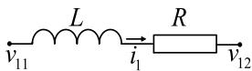  
(a) series resistor-inductor circuit

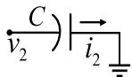  
(b) grounding capacitor circuit   
FIGURE 1. R-L-C circuit examples.

The SEXS exciter is described as:

$$
\begin{array}{l} E _ {\min } \leq E _ {f d} \leq E _ {\max } \\ \frac {d E _ {f d}}{d t} = \frac {1}{T _ {E}} \left(k _ {E} v _ {1} - E _ {f d}\right) \\ \frac {d v _ {1}}{d t} = \frac {1}{T _ {B}} \left(v _ {\text {r e f}} - T _ {A} \frac {d v _ {t}}{d t} - v _ {t} - v _ {1}\right) \tag {25} \\ \end{array}
$$

where $\nu _ { r e f }$ is the voltage regulator reference; $\begin{array} { r l } { E _ { f d } } & { { } = } \end{array}$ $e _ { f d } L _ { a d } / R _ { f d } ; \nu _ { 1 }$ is an intermediate variable; $\nu _ { t }$ is the terminal voltage magnitude; $k _ { E } , T _ { E } , T _ { A } , T _ { B }$ are exciter control parameters. Its DT is given as (26). In addition, if $E _ { f d } [ 0 ] \geq$ $E _ { m a x }$ and $d E _ { f d } / d t { \geq } 0$ , or if $E _ { f d } [ 0 ] \leq P _ { m i n }$ and $d E _ { f d } / d t { \leq } 0 .$ , then $E _ { f d } [ { \bf k } + 1 ] = 0$ .

$$
E _ {\min } \leq E _ {f d} [ 0 ] \leq E _ {\max }
$$

$$
(k + 1) E _ {f d} [ k + 1 ] = \frac {1}{T _ {E}} (k _ {E} v _ {1} [ k ] - E _ {f d} [ k ])
$$

$$
\begin{array}{l} (k + 1) v _ {1} [ k + 1 ] = \frac {1}{T _ {B}} (\eta [ k ] v _ {\text {r e f}} - (k + 1) T _ {A} v _ {t} [ k + 1 ] \\ - v _ {t} [ k ] - v _ {1} [ k ]) \tag {26} \\ \end{array}
$$

# C. NETWORK COMPONENTS

Transmission lines are modeled as 5 sections in this work [32]. Other network components such as transformers, constant impedance loads, and fixed shunts, are modeled by R-L-C circuits. Two typical circuits, including the series resistor-inductor circuit and grounding capacitor circuit, are shown in Fig. 1 as simple examples.

The differential equations and corresponding DTs of the resistor-inductor circuit and grounding capacitor circuit in Fig. 1 are respectively given by (27)-(28) and (29)-(30):

$$
\frac {d i _ {1}}{d t} = \frac {v _ {1 1} - v _ {1 2} - R i _ {1}}{L} \tag {27}
$$

$$
(k + 1) i _ {1} [ k + 1 ] = \frac {v _ {1 1} [ k ] - v _ {1 2} [ k ] - R i _ {1} [ k ]}{L} \tag {28}
$$

$$
\frac {d v _ {2}}{d t} = \frac {i _ {2}}{C} \tag {29}
$$

$$
(k + 1) v _ {2} [ k + 1 ] = \frac {i _ {2} [ k ]}{C} \tag {30}
$$

Note that other R-L-C branch types can also be easily considered and are not presented in detail here.

Remark: Using the DT rules, the SASs of other types of exciters, governors, and stabilizers can be derived. Also, nonlinear models such as the exponential magnetic saturation of a synchronous generator [33] can also be transformed by using the DT rules [20].

# D. INVERTER-BASED RESOURCE (IBR)

A grid-following IBR model in Fig. 2 is considered in this paper, which comprises an outer-loop current regulator,

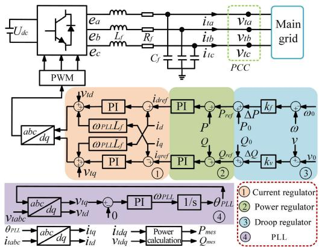  
FIGURE 2. Diagram of a grid-following IBR model.

an inner-loop power regulator, a frequency droop controller, and a voltage droop controller [34], [35]. The dynamics of its pulse-width modulation (PWM) are disregarded in this study. A phase-locked loop (PLL) is used to track the bus voltage angle. The IBR interfaces with the network by coordinate transformation. In Fig. 2, the subscript ‘ref’ represents the reference value, and $\cdot _ { 0 } \cdot \mathrm { ~ }$ signifies the steady-state value.

The mathematical equations of the model primarily consist of basic linear operations which are fully covered by Table 1, and thus are not presented in detail here. Additionally, the frequently used proportional-integral (PI) controller and the corresponding DT are:

$$
\begin{array}{l} \frac {d x _ {s}}{d t} = k _ {i} x _ {i n} \\ x _ {\text {o u t}} = x _ {s} + k _ {p} x _ {\text {i n}} (31) \\ (k + 1) x _ {s} [ k + 1 ] = k _ {i} x _ {i n} [ k ] \\ x _ {\text {o u t}} [ k + 1 ] = x _ {s} [ k + 1 ] + k _ {p} x _ {\text {i n}} [ k + 1 ] (32) \\ \end{array}
$$

where $k _ { i }$ and $k _ { p }$ are proportional and integral control gains, respectively; $x _ { i n }$ is the input; $x _ { s }$ is the output of the integral controller; $x _ { o u t }$ is the output of the PI controller.

The IBR is interfaced with the network through terminal current injection:

$$
\frac {d i _ {L f \_ a b c}}{d t} = \frac {1}{L _ {f}} \left(e _ {a b c} - v _ {t \_ a b c} - R _ {f} i _ {L f \_ a b c}\right) \tag {33}
$$

with its DT described as:

$$
(k + 1) i _ {L f \_ a b c} [ k + 1 ] = \left(e _ {a b c} [ k ] - v _ {t \_ a b c} [ k ] - R _ {f} i _ {L f \_ a b c} [ k ]\right) / L _ {f} \tag {34}
$$

where $i _ { L f \_ a b c }$ is the three-phase current on the inductor $L _ { f } , \nu _ { t \_ a b c }$ is the three-phase terminal voltage at the PCC point.

# E. PROCEDURE FOR CALCULATING SASs OF THE SYSTEM

Based on the DT equations derived in the last section, first separate all state variables into three vector groups:

• x1(t) = [δ, 1ωr , λfd , λ1d , λ1q, λ2q, θ , iabc, p1, p2, E , v , x ]T

• x2(t) = [inet , vnet ]T   
• x3(t) = [v0dq, i0dq, v′′0dq, λad , λaq, pe, pm, xout ]T

where vectors $\mathbf { X } 1$ and x3 includes all state variables of synchronous generators, IBRs, and related controls described by differential equations and non-differential equations, respectively; $\mathbf { X } _ { 2 }$ includes all network state variables described by differential equations; $\mathbf { i } _ { n e t }$ includes all network inductor currents; $\mathbf { v } _ { n e t }$ includes all network capacitor voltages.

Then, the simulation process for each time step is conducted following Algorithm 1 summarized below.

# Algorithm 1

Input: initial states $\mathbf { x } _ { 1 } [ 0 ] ,$ , x2[0], x3[0] at t = t0, time step 1t , and SAS order N.

Output: SAS coefficients x [1: N ], x [1: N ], x [1: N ], and states x1(t), x2(t), x3(t) at t = t0 + 1t.

1: k = 0   
2: While $k \leq N$   
3: $k = k { + 1 }$   
4: Calculate x1[k] using (18), (19), (20), (24), (26), (32), etc.   
5: Calculate x2[k] using (28), (30), (34).   
6: Calculate x3[k] using (21), (22), (24), (32), etc.   
7: End while   
8: Calculate x1, x2, and x3 using

$$
\mathbf {x} _ {i} (t + \Delta t) = \sum_ {k = 0} ^ {N} \mathbf {x} _ {i} [ k ] \Delta t ^ {k} (i = 1, 2, 3)
$$

# IV. SIMULATION STRATEGIES

As a main advantage of the proposed approach, a variable time step can be adopted to improve simulation efficiency. When a large time step is used, a dense output mechanism enabled by the SAS reconstructs accurate, detailed dynamics.

# A. MULTISTAGE SIMULATION STRATEGY

Because the SAS is not an exact solution, its error can be tolerated only within a limited time step. The initial value problem to be solved for simulations can evaluate an SAS with a multistage strategy as depicted in Fig. 3 over consecutive time steps that make the desired simulation period. At the end of each time step, the end values of state variables are used as the initial values for the next step to evaluate the SAS of the problem, which can be derived ahead of the simulation using well-developed rules presented in previous sections.

# B. VARIABLE TIME STEP SIMULATION STRATEGY

The simulation can be conducted at a fixed or variable time step. To improve the convergence and efficiency of simulations using an SAS over larger time steps, a variable-time-step strategy is proposed and incorporated as follows.

Suppose a linear state-space EMT model for the system [36], [37]:

$$
\dot {\mathbf {x}} = \mathbf {A} \mathbf {x} + \mathbf {B} \mathbf {u} \tag {35}
$$

where x is the network state vector; u is the input vector; A is the state matrix, and B is the input matrix. Substitute the SAS for x and calculate the absolute imbalance in

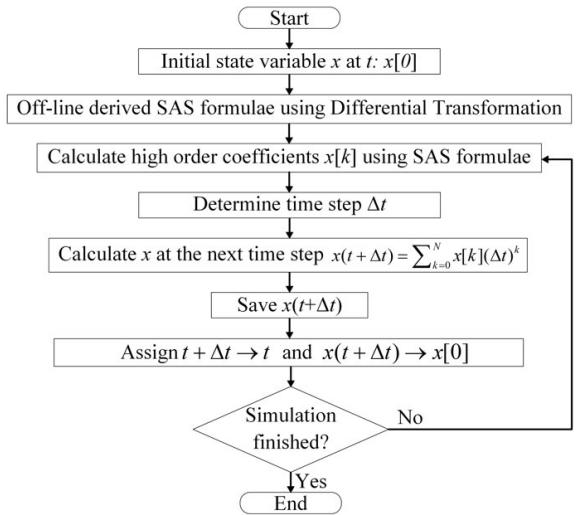  
FIGURE 3. Flow chart of the SAS-based multistage simulation strategy using DT.

per unit due to its:

$$
E (\Delta t) = \left\| \dot {\mathbf {x}} _ {S A S} - \mathbf {A} \mathbf {x} _ {S A S} - \mathbf {B} \mathbf {u} \right\| _ {\infty} \tag {36}
$$

where,

$$
\mathbf {x} _ {S A S} = \sum_ {k = 0} ^ {N} \mathbf {x} [ k ] (\Delta t) ^ {k}
$$

$$
(k + 1) \mathbf {x} [ k + 1 ] = \mathbf {A x} [ k ] + \mathbf {B u} [ k ] \tag {37}
$$

Substituting (37) into (35) yields:

$$
E (\Delta t) = \left\| \mathbf {A x} [ N ] + \mathbf {B u} [ N ] \right\| _ {\infty} (\Delta t) ^ {N} \tag {38}
$$

The imbalance E(1t) can serve as an indicator for determining the termination of the present time step and the initiation of the subsequent one. Thus, a variable time step is enabled for an appropriate balance between the step size and accuracy [19], [22]. In practice, the variable length of each time step is determined by a pre-determined imbalance threshold $\varepsilon _ { E } .$ , typically around $1 \ \times \ 1 0 ^ { - 2 }$ per unit for EMT simulations, and the time step can be calculated by combining (37) and (38).

$$
E (\Delta t) \leq \varepsilon_ {E} \rightarrow \Delta t \leq \Delta t _ {\max } \tag {39}
$$

# C. DENSE OUTPUT MECHANISM

Because the SAS utilizes high-order approximations to enlarge the time steps, some detailed fast dynamics such as overvoltage and overcurrent may be missed. Thus, obtaining the dense output is of significance in such cases.

As shown in (2) and (37), with derived SAS coefficients, the SAS expression is a function of time over each step. Thus, the value of each state variable x at the next time step can be calculated by substituting the time step 1t. Furthermore, it is flexible to calculate values at multiple instants $t _ { 0 } + t _ { i }$ within the time step $\Delta t ,$ as illustrated in (40) and Fig. 4.

$$
x \left(t _ {0} + t _ {n}\right) \approx \sum_ {k = 0} ^ {N} x [ k ] t _ {n} ^ {k} \left(t _ {n} <   \Delta t, n = 1, 2, \dots , N - 1\right) \tag {40}
$$

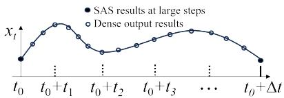  
FIGURE 4. Illustration of dense output under large time step simulations.

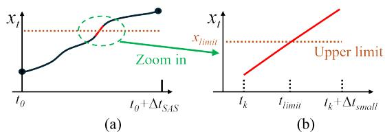  
FIGURE 5. Illustration of the linear interpolation for limit violation detection.

# V. LIMIT VIOLATION DETECTION ALGORITHM

In EMT simulations, the time instants when limits are reached are typical of interest and importance to ensure the correctness of results. The timings of such switches are unknown ahead of the simulation and need to be estimated during the simulation.

# A. ILLUSTRATION OF THE LINEAR INTERPOLATION

In commercial software like PSCAD, if a switch occurs during a small time step, its timing is estimated via a linear interpolation by using values at the previous and present steps, followed by a re-computation for the present step, starting from the switching moment [38], [39].

As shown in Fig. 5(b), considering an upper limit $x _ { l i m i t }$ for variable x. With a small time step, the curve is almost linear, and the time instant of limit violation, tlimit , can be estimated by a linear interpolation using $t _ { k } , t _ { k } + \Delta t , x ( t _ { k } ) , x ( t _ { k } + \Delta t )$ , and $x _ { l i m i t }$ .

However, when a significantly increased time step is used by the proposed SAS-based approach as shown in Fig. 5(a), the linear interpolation may yield inaccurate results for limit violation detection.

# B. PROPOSED LIMIT VIOLATION DETECTION ALGORITHM

To address the switch caused by limit violations under enlarged time steps, a switch detection algorithm utilizing SAS coefficients is proposed as depicted in Fig. 6. Thanks to high-order SAS coefficients, dense state variable values at any moment within a time step can be calculated efficiently following (2), to facilitate checking of limit violations. Moreover, to avoid an exhaustive and time-consuming process of checking every tiny time step at 1 $\mu \mathrm { s }$ or less, the earliest small time interval $\varepsilon _ { t } ,$ e.g., 10-20 µs or smaller, in which any limit violation happened is easily located by a binary search algorithm as illustrated by steps in the blue area of Fig. 6 on hitting upper limits. To deal with lower limits, the algorithm requires only a swap in the updates of a and b. Then, as indicated by steps in the purple area, as a and b are close enough, a quadratic interpolation is used to accurately

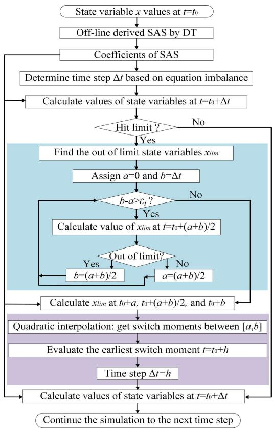  
FIGURE 6. Flow chart of the switch detection algorithm for limit violations.

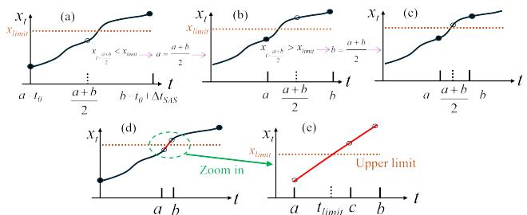  
FIGURE 7. Illustration of the SAS-based limit violation detection algorithm under large time steps.

detect the switch moment where the current time step should be finished.

The proposed binary search-enhanced quadratic interpolation algorithm is also illustrated in Fig. 7.

As is shown in Fig. 7(a)-(c), by using the SAS, the proposed algorithm can easily check the values at more internal points in a time step, and thus facilitate efficient binary search to narrow down the interval of violation that satisfies $b \mathrm { - } a < \varepsilon _ { t }$ . After that, as shown in Fig. 7(d)-(e), with one more point c between a and b, the violation time instant $t _ { l i m i t }$ can be estimated with a, b, c, x(a), x(b), x(c), and $x _ { l i m i t }$ via a quadratic interpolation, which is more accurate than the linear interpolation.

# VI. TESTS ON THE IEEE 39-BUS SYSTEM

To evaluate the efficacy and validity of the proposed SAS-based simulation approach, case studies on the IEEE

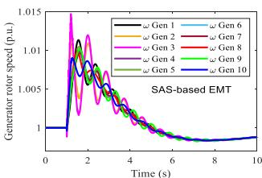

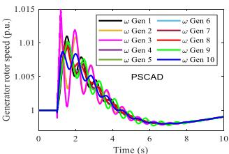  
FIGURE 8. Simulation results of the generator rotor speed.

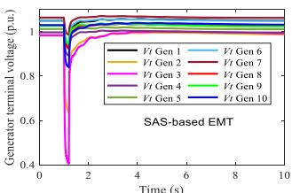

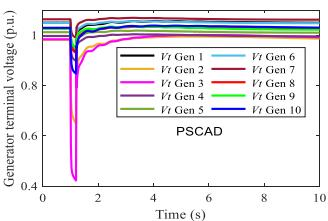  
FIGURE 9. Simulation results of generator terminal voltages.

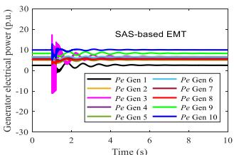

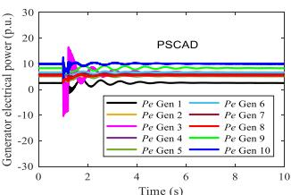  
FIGURE 10. Simulation results of the generator electrical power.

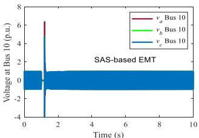

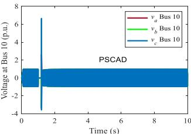  
FIGURE 11. Simulation results of the three-phase voltage at Bus 10.

39-bus system [40] with synchronous machines are conducted and presented in this section.

# A. BENCHMARK AGAINST PSCAD

The SAS-based simulation approach is implemented in MATLAB and benchmarked with the commercial tool PSCAD, which uses a nodal formulation-based simulation approach. Consider a contingency in which the system starts from its steady state at t = 0 s, and then has a three-phase grounding fault on Bus 10 at t = 1 s lasting for 0.2 second without losing any network component. The results from the proposed approach using MATLAB and from PSCAD are compared in Figs. 8-12, which match well. This successfully benchmarks the SAS-based state-space EMT simulation.

# B. EVALUATING THE SAS-BASED APPROACH WITH DIFFERENT ORDERS

The performance of the proposed simulation approach using the SASs of different orders with a variable time step is tested and compared with traditional numerical solvers on the statespace model.

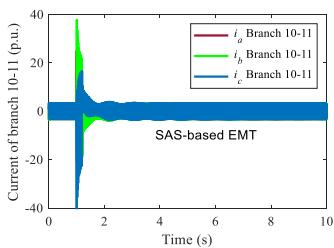

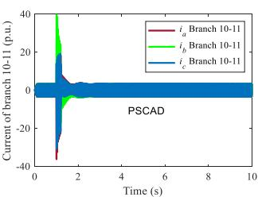  
FIGURE 12. Simulation results of the three-phase current on branch 10-11.

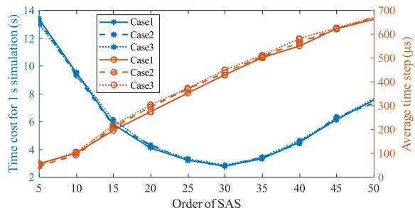  
FIGURE 13. Performance of the SAS-based simulation approach with different orders on the 39-bus system.

Without loss of generality, three different cases including load tripping, bus grounding, and generator tripping are simulated: Case 1 disconnects the load at bus 4 at t = 1 s; Case 2 adds a three-phase grounding fault to bus 10 at t = 1 s lasting for 0.2 second; Case 3 disconnects the generator at bus 36.

A higher-order SAS allows longer and fewer time steps, but its complexity increases the computation burden for each time step. Thus, there exists an optimal SAS order with the best performance. Using different orders, the average time steps and time costs of the SAS-based approach for a 1-s simulation are summarized in Fig. 13 for three cases. The benchmark results are from the 4th-order Runge-Kutta method using a 1 µs time step. The simulation tests are carried out on a desktop computer equipped with an Intel Core i7-6700 3.4 GHz CPU and 16GB RAM, using MATLAB. To ensure accuracy and convergence, the errors of bus voltages are limited to less than 0.01 p.u.

To notice, MATLAB is an interpreted rather than a compiled environment, having hidden overheads. To accelerate the simulation speed, the MATLAB codes are converted into MEX files and compiled to enable higher efficiency [41].

The results presented in Fig. 13 demonstrate that as the SAS order increases, the time step grows, and the total time cost first decays and then rises due to the increased computation per step. The optimal order is around 30, with approximately a time cost of 2.75 s for a 1-s simulation on the 39-bus system.

# C. COMPARISON OF SAS WITH TRADITIONAL NUMERICAL METHODS

In Table 2, the performance of the proposed approach with a $3 0 ^ { \mathrm { t h } } .$ -order SAS is then compared with numerical solvers including the Numerical Differentiation Formulas (NDF)

TABLE 2. Comparing time steps and time costs of different methods.   

<table><tr><td rowspan="2">Case</td><td colspan="2">NDF (ode15s)</td><td colspan="2">Runge-Kutta (ode45)</td><td colspan="2">SAS (30th-order)</td><td colspan="2">Trapezoidal rule (ode23t)</td></tr><tr><td>Time step (μs)</td><td>Time cost (s)</td><td>Time step (μs)</td><td>Time cost (s)</td><td>Time step (μs)</td><td>Time cost (s)</td><td>Time step (μs)</td><td>Time cost (s)</td></tr><tr><td>Case 1</td><td>45.8</td><td>17.2</td><td>50.5</td><td>13.5</td><td>469</td><td>2.73</td><td>48.3</td><td>15.7</td></tr><tr><td>Case 2</td><td>46.2</td><td>17.4</td><td>50.3</td><td>13.6</td><td>464</td><td>2.71</td><td>48.6</td><td>15.5</td></tr><tr><td>Case 3</td><td>46.1</td><td>17.3</td><td>50.7</td><td>13.3</td><td>467</td><td>2.81</td><td>48.9</td><td>15.9</td></tr></table>

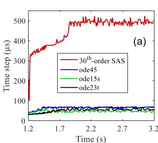

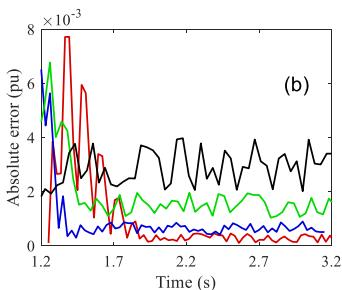  
FIGURE 14. Comparison of average time steps and maximum absolute errors between the SAS-based approach and traditional numerical methods.

method, Runge-Kutta method, and trapezoidal-rule method, which are provided by the MATLAB solvers ode15s, ode45, and ode23t, respectively. Also, the auxiliary ‘odeset’ function in MATLAB with a carefully adjusted absolute error tolerance around $1 0 ^ { - 5 }$ is used to generate results with per unit bus voltage errors less than 0.01 p.u. Because the MATLAB solvers mentioned above all adopt variable time steps, the average time steps are calculated for comparisons. As demonstrated in Table 2, the $3 0 ^ { \mathrm { t h } }$ -order SAS offers a significant advantage in terms of time efficiency, thanks to its capacity to leverage large time steps enabled by high-order approximations.

Fig. 14 shows a comparison of the varying time steps and maximum absolute bus voltage errors for Case 2, from which the $3 0 ^ { \mathrm { t h } }$ -order SAS can gradually increase the time step to around five times of the initial step, and its simulation results are more accurate than the results from other solvers.

# D. COMPARISON OF SAS WITH PSCAD

Conducting PSCAD simulations for the three cases. The average time costs for 1-s simulations, as well as the maximum and average errors of three-phase voltages at different time steps are summarized in Table 3, where the simulation results using a 1-µs time step is designated as its benchmark. Remarkably, all three cases have nearly identical time cost using the same time step. The maximum error is the maximum of three-phase voltage absolute errors of the 39 buses, and average error is the average of all voltage errors related to the benchmark during $t = 0 \mathrm { t o } 2 \mathrm { s }$ .

Fig. 15 and Fig. 16 respectively illustrate the simulated phase-C voltage at Bus 10 and its error for Case 2 using different time steps. From Fig. 16, the PSCAD results converge to

TABLE 3. Comparison of performance on the IEEE 39-bus system.   

<table><tr><td>Approach</td><td colspan="4">PSCAD</td><td>SAS</td></tr><tr><td>Time step (μs)</td><td>5</td><td>50</td><td>75</td><td>100</td><td>467</td></tr><tr><td>Time cost (s)</td><td>56.2</td><td>5.62</td><td>3.75</td><td>2.81</td><td>2.71</td></tr><tr><td>Maximum error (pu)</td><td>1.10</td><td>5.52</td><td>6.11</td><td>5.95</td><td>\( 7.7 \times 10^{-3} \)</td></tr><tr><td>Average error \( \left( {\times {10}^{-3}\mathrm{{pu}}}\right) \)</td><td>0.15</td><td>1.73</td><td>2.80</td><td>4.11</td><td>0.032</td></tr></table>

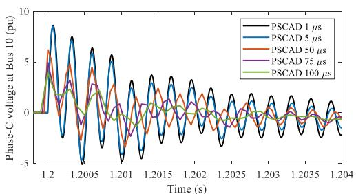  
FIGURE 15. Phase-C voltages of Bus 10 from PSCAD under case 2.

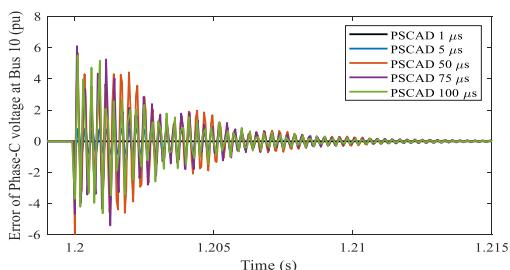  
FIGURE 16. Errors of phase-C voltages at Bus 10 from PSCAD under case 2.

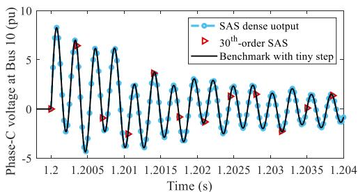  
FIGURE 17. Phase-C voltage at Bus 10 from the SAS-based approach under case 2.

the benchmark results shortly, but obvious errors exist for fast dynamics following a disturbance with times steps >50 µs. The reason is that the trapezoidal-rule method-based nodal formulation approach employed in PSCAD [42] has a low order and less accuracy without many iterations.

In comparison, the results provided by the SAS-based approach are presented in Fig. 17, where simulation results solved by the $\dot { 4 } ^ { \mathrm { t h } } .$ -order Runge-Kutta method using a 1 $\mu \mathrm { s }$ time step is designated as its benchmark and shown as the black curve. Utilizing a high order approximation, the SAS-based approach provides accurate results for fast dynamics under large time steps, and detailed high-resolution dynamics are reconstructed through dense output, as shown in the red marks and blue points, respectively.

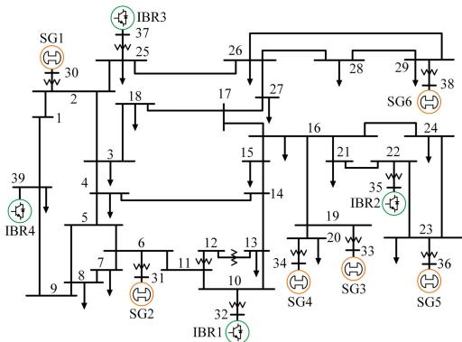

Synchronous

generator

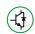

IBR

w Transformer

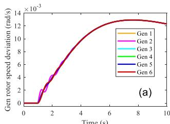  
FIGURE 18. One-line diagram of the modified IEEE 39-bus system.

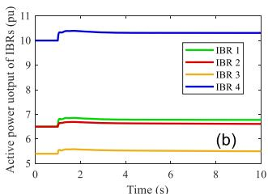  
FIGURE 19. Case 1 simulation results: Tripping the load at Bus 4.

Compared with the SAS-based approach with an average time step of 467 µs, PSCAD performs faster when its time step increases to over 100 µs. However, PSCAD has much bigger errors than the SAS-based approach. Even if PSCAD uses a $5 \mathrm { - } \mu \mathrm { s }$ time step, its average and maximum errors are respectively 4.7 and 142.9 times of those with the SASbased approach. In such a case, the time cost of PSCAD is 20.7 times of that with the SAS-based approach.

Thus, when both high accuracy and speed are desired on EMT simulations, the SAS-based approach is superior. While a highly accurate EMT simulation is not desired, the nodal formulation-based approach used in PSCAD can be faster if a large step such as 100 µs is used.

# VII. TESTS ON A MODIFIED IEEE 39-BUS SYSTEM

To test the proposed SAS-based approach on IBRs, the EMT model of a modified IEEE 39-bus system in Fig. 18 is employed. The synchronous generators connected to buses 32, 35, 37, and 39 are replaced by four grid-following IBRs modeled as Fig. 2. Under the three contingencies introduced in Section VI-B, system dynamics including rotor speed deviation of synchronous generators and active power of IBRs are depicted in Figs. 19-21. Under the three cases, the system frequency finally increased, recovered, and decreased, respectively.

In the same way, the time costs and average time steps of the SAS-based approach under the three cases are presented in Table 4. As can be observed, the $3 0 ^ { \mathrm { t h } }$ -order SAS still has the best performance than other orders, and the SAS-based approach retains the same efficiency dealing with

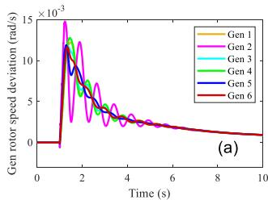

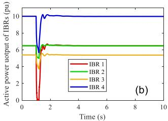  
FIGURE 20. Case 2 simulation results: Grounding Bus 10 for 0.2 s.

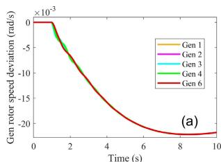

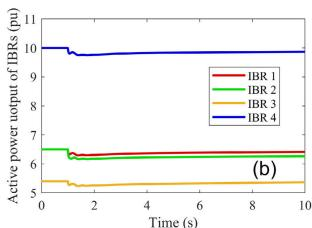  
FIGURE 21. Case 3 simulation results: Tripping generator connected to Bus 36.

TABLE 4. Average time steps and time costs of the SAS-based approach.   

<table><tr><td rowspan="2">Case</td><td colspan="2">SAS (20th-order)</td><td colspan="2">SAS (25th-order)</td><td colspan="2">SAS (30th-order)</td><td colspan="2">SAS (35th-order)</td></tr><tr><td>Time step (μs)</td><td>Time cost (s)</td><td>Time step (μs)</td><td>Time cost (s)</td><td>Time step (μs)</td><td>Time cost (s)</td><td>Time step (μs)</td><td>Time cost (s)</td></tr><tr><td>Case 1</td><td>302</td><td>4.06</td><td>376</td><td>3.08</td><td>461</td><td>2.75</td><td>513</td><td>3.15</td></tr><tr><td>Case 2</td><td>303</td><td>4.05</td><td>372</td><td>3.09</td><td>459</td><td>2.79</td><td>515</td><td>3.14</td></tr><tr><td>Case 3</td><td>298</td><td>4.09</td><td>375</td><td>3.08</td><td>463</td><td>2.76</td><td>512</td><td>3.16</td></tr></table>

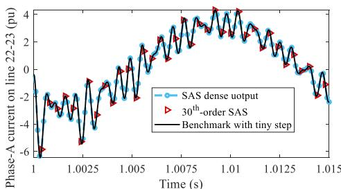  
FIGURE 22. Phase-A current on branch 22-23 simulated by the SAS-based approach under case 3.

systems with IBRs, compared to that with only synchronous generators.

In addition, simulation results of two states close to the fault location under case 3 are illustrated in Figs. 22-23 to show the high precision of the SAS-based approach under large time steps for capturing fast and slow transients, respectively.

# VIII. TEST OF LIMIT VIOLATION DETECTION ALGORITHM

This test activates the limits on $E _ { f d }$ of exciters, $p _ { 1 }$ of governors, and $i _ { d r e f }$ and $i _ { q r e f }$ of the IBRs, and re-conducts Case 2 to validate the proposed switch detection algorithm.

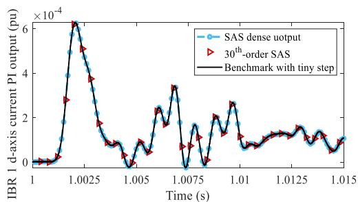  
FIGURE 23. d-axis current regulator PI control output of IBR1 simulated by the SAS-based approach under case 3.

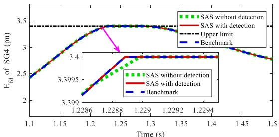  
FIGURE 24. Simulation results of $E _ { f d }$ of SG4 under case 2.

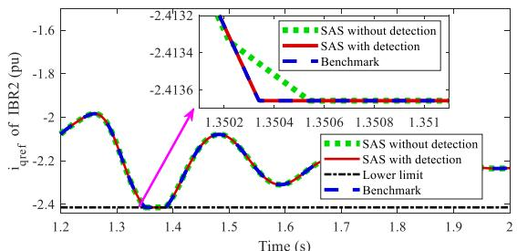  
FIGURE 25. Simulation results of $i _ { q r e f }$ of IBR2 under case 2.

In this scenario, the $E _ { f d }$ of SG4 reaches its upper limit and the $i _ { q r e f }$ of IBR2 reaches its lower limit. Simulation results provided by the $3 0 ^ { \mathrm { t h } }$ -order SAS-based approach with and without the proposed switch detection algorithm are compared against the benchmark results, as shown in Figs. 24-25.

As can be observed, without detection of the state switches, variable values that exceed their limits are not forced to be the limits immediately. The resulting trajectory during that step is inaccurate and may compromise the accuracy of trajectories in subsequent steps. In contrast, the proposed detection algorithm accurately locates the switch moments within <1 $\mu \mathrm { s }$ and corrects the results immediately, ensuring accurate results matching the benchmark.

# IX. TESTS ON LARGE-SCALE SYSTEMS

To test performance of the SAS-based EMT simulation approach on large systems, synthetic systems are constructed by interconnecting multiple replications of the 39-bus system [11].

Subsequently, by simulating a grounding fault at $t { = } 1$ s lasting for 0.2 s, the performance of the SAS-based approach is compared with that of the nodal formulationbased approach [42] utilized in PSCAD. The time costs for

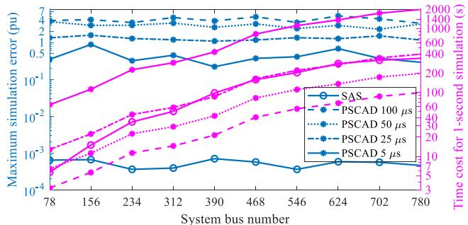  
FIGURE 26. Comparison of time costs and maximum errors on large systems.

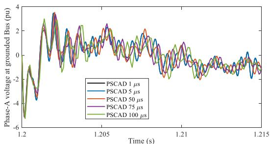  
FIGURE 27. Phase-A voltage at the grounding Bus simulated by PSCAD.

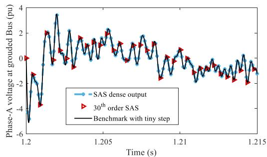  
FIGURE 28. Phase-A voltage at the grounding Bus simulated by the SAS-based approach.

TABLE 5. Comparison of performance on a 390-Bus system.   

<table><tr><td>Approach</td><td colspan="4">PSCAD</td><td>SAS</td></tr><tr><td>Time step (μs)</td><td>5</td><td>25</td><td>50</td><td>100</td><td>534</td></tr><tr><td>Time cost (s)</td><td>425</td><td>85</td><td>42.5</td><td>21.5</td><td>98</td></tr><tr><td>Maximum error (pu)</td><td>0.22</td><td>1.29</td><td>2.58</td><td>3.85</td><td>7×10-4</td></tr><tr><td>Average error (×10-3pu)</td><td>0.41</td><td>1.24</td><td>2.61</td><td>3.3</td><td>0.0012</td></tr></table>

a 1-s simulation and maximum per unit errors are presented in Fig. 26, with the y-axes plotted on a logarithmic scale.

Specifically, the results on the synthetic 390-bus system are presented in Table 5, where the time costs are for a 1-s simulation. Also, simulation results of the phase-A voltage at the grounding bus are shown in Figs. 27-28.

From results presented in Fig. 26 and Table 5, the nodal formulation-based approach in PSCAD is faster than the state-space SAS-based approach when adopting a time step approximately >25 µs, which is smaller than the corresponding time step around 100 $\mu \mathrm { s }$ on the 39-bus system. This is aligned with the existing conclusion that the

nodal formulation-based approach has outstanding simulation speed on large systems [3].

Nevertheless, as shown in Figs. 26-27 and Table 5, similar to observations on the 39-bus system, the nodal formulation-based approach failed to accurately capture some fast dynamics right after a disturbance, under a time step larger than 5 µs. In contrast, as depicted in Figs. 26, 28, and Table 5, the SAS-based approach has nearly the same time cost as PSCAD with a 25 µs time step on large systems, but the precision of the SAS-based approach is around 10−3, much smaller than that of PSCAD. Meanwhile, reducing the time step of PSCAD can improve the precision, but will have a much larger time cost, as shown in curves for PSCAD with a 5 µs time step in Fig. 26. Therefore, the SAS-based approach can still provide high precision results with better efficiency on large-scale systems.

# X. CONCLUSION

This paper proposed a semi-analytical approach to speed up EMT simulations by using an enlarged, variable time step. Also, the SAS-based dense output mechanism enables the simulation results to provide detailed high-resolution dynamics even over large time steps. The proposed limit violation detection algorithm can accurately locate the switching moment to ensure correct EMT simulation results. The tests on the original and modified IEEE 39-bus systems and synthetic large-scale systems have demonstrated more efficient EMT simulations using the proposed approach than simulations using conventional numerical methods under high precision.

While a highly accurate EMT simulation is not desired and a large time step is used, the proposed simulation approach may not be faster than a nodal formulation-based approach.

The future work will investigate the application of parallel computing to enhance the proposed SAS-based simulation approach, and hybrid simulation approaches integrating this SAS method with other numerical methods.

# REFERENCES

[1] J. Shu, W. Xue, and W. Zheng, ‘‘A parallel transient stability simulation for power systems,’’ IEEE Trans. Power Syst., vol. 20, no. 4, pp. 1709–1717, Nov. 2005.   
[2] V. Jalili-Marandi, V. Dinavahi, K. Strunz, J. A. Martinez, and A. Ramirez, ‘‘Interfacing techniques for transient stability and electromagnetic transient programs,’’ IEEE Trans. Power Del., vol. 24, no. 4, pp. 2385–2395, Oct. 2009.   
[3] J. Mahseredjian, V. Dinavahi, and J. A. Martinez, ‘‘Simulation tools for electromagnetic transients in power systems: Overview and challenges,’’ IEEE Trans. Power Del., vol. 24, no. 3, pp. 1657–1669, Jul. 2009.   
[4] T. H. Demiray, ‘‘Simulation of power system dynamics using dynamic phasor models,’’ Ph.D. dissertation, Dept. Inf. Technol. Elect. Eng., Swiss Fed. Inst. Technol., Zurich, Switzerland, 2008.   
[5] F. Gao and K. Strunz, ‘‘Frequency-adaptive power system modeling for multiscale simulation of transients,’’ IEEE Trans. Power Syst., vol. 24, no. 2, pp. 561–571, May 2009.   
[6] P. Zhang, J. R. Marti, and H. W. Dommel, ‘‘Shifted-frequency analysis for EMTP simulation of power-system dynamics,’’ IEEE Trans. Circuits Syst. I, Reg. Papers, vol. 57, no. 9, pp. 2564–2574, Sep. 2010.   
[7] S. Almer and U. Jonsson, ‘‘Dynamic phasor analysis of periodic systems,’’ IEEE Trans. Autom. Control, vol. 54, no. 8, pp. 2007–2012, Aug. 2009.

[8] M. D. Heffernan, K. S. Turner, J. Arrillaga, and C. P. Arnold, ‘‘Computation of A.C.-D.C. system disturbances: Part I, II, and III,’’ IEEE Trans. Power App. Syst., vol. PAS-100, no. 11, pp. 4341–4363, Nov. 1981.   
[9] Q. Huang and V. Vittal, ‘‘Advanced EMT and phasor-domain hybrid simulation with simulation mode switching capability for transmission and distribution systems,’’ IEEE Trans. Power Syst., vol. 33, no. 6, pp. 6298–6308, Nov. 2018.   
[10] D. Shu, X. Xie, Q. Jiang, Q. Huang, and C. Zhang, ‘‘A novel interfacing technique for distributed hybrid simulations combining EMT and transient stability models,’’ IEEE Trans. Power Del., vol. 33, no. 1, pp. 130–140, Feb. 2018.   
[11] S. Fan, H. Ding, A. Kariyawasam, and A. M. Gole, ‘‘Parallel electromagnetic transients simulation with shared memory architecture computers,’’ IEEE Trans. Power Del., vol. 33, no. 1, pp. 239–247, Feb. 2018.   
[12] Z. Zhou and V. Dinavahi, ‘‘Parallel massive-thread electromagnetic transient simulation on GPU,’’ IEEE Trans. Power Del., vol. 29, no. 3, pp. 1045–1053, Jun. 2014.   
[13] M. Xiong et al., ‘‘ParaEMT: An open source, parallelizable, and HPCcompatible EMT simulator for large-scale IBR-rich power grids,’’ IEEE Trans. Power Del., vol. 39, no. 2, pp. 911–921, Apr. 2024.   
[14] C. Dufour, J. Mahseredjian, and J. Bélanger, ‘‘A combined state-space nodal method for the simulation of power system transients,’’ IEEE Trans. Power Del., vol. 26, no. 2, pp. 928–935, Apr. 2011.   
[15] N. Watson and J. Arrillaga, Power Systems Electromagnetic Transients Simulation. Stevenage, U.K.: IET, 2003.   
[16] Y. Li, T. C. Green, and Y. Gu, ‘‘Descriptor state space modeling of power systems,’’ IEEE Trans. Power Syst., vol. 39, no. 4, pp. 5495–5508, Jul. 2024.   
[17] T. Duan and V. Dinavahi, ‘‘Variable time-stepping parallel electromagnetic transient simulation of hybrid AC–DC grids,’’ IEEE J. Emerg. Sel. Topics Ind. Electron., vol. 2, no. 1, pp. 90–98, Jan. 2021.   
[18] N. Duan and K. Sun, ‘‘Power system simulation using the multistage adomian decomposition method,’’ IEEE Trans. Power Syst., vol. 32, no. 1, pp. 430–441, Jan. 2017.   
[19] R. Yao, Y. Liu, K. Sun, F. Qiu, and J. Wang, ‘‘Efficient and robust dynamic simulation of power systems with holomorphic embedding,’’ IEEE Trans. Power Syst., vol. 35, no. 2, pp. 938–949, Mar. 2020.   
[20] Y. Liu, K. Sun, R. Yao, and B. Wang, ‘‘Power system time domain simulation using a differential transformation method,’’ IEEE Trans. Power Syst., vol. 34, no. 5, pp. 3739–3748, Sep. 2019.   
[21] M. Xiong, X. Xu, K. Sun, and B. Wang, ‘‘Approximation of the frequencyamplitude curve using the homotopy analysis method,’’ in Proc. IEEE Power Energy Soc. Gen. Meeting (PESGM), Jul. 2021, pp. 1–5.   
[22] B. Wang, N. Duan, and K. Sun, ‘‘A time–power series-based semianalytical approach for power system simulation,’’ IEEE Trans. Power Syst., vol. 34, no. 2, pp. 841–851, Mar. 2019.   
[23] B. Park, K. Sun, A. Dimitrovski, Y. Liu, and S. Simunovic, ‘‘Examination of semi-analytical solution methods in the coarse operator of parareal algorithm for power system simulation,’’ IEEE Trans. Power Syst., vol. 36, no. 6, pp. 5068–5080, Nov. 2021.   
[24] I. H. A. Hassan, ‘‘Different applications for the differential transformation in the differential equations,’’ Appl. Math. Comput., vol. 129, nos. 2–3, pp. 183–201, Jul. 2002.   
[25] F. Ayaz, ‘‘Applications of differential transform method to differentialalgebraic equations,’’ Appl. Math. Comput., vol. 152, no. 3, pp. 649–657, May 2004.   
[26] M. Idrees, F. Mabood, A. Ali, and G. Zaman, ‘‘Exact solution for a class of stiff systems by differential transform method,’’ Appl. Math., vol. 4, no. 3, pp. 440–444, May 2013.   
[27] M. Xiong, R. Yao, Y. Liu, K. Sun, and F. Qiu, ‘‘Semi-analytical electromagnetic transient simulation using differential transformation,’’ in Proc. 4th Int. Conf. Smart Power Internet Energy Syst. (SPIES), Dec. 2022, pp. 481–486.   
[28] L. Wang and J. Jatskevich, ‘‘A voltage-behind-reactance synchronous machine model for the EMTP-type solution,’’ IEEE Trans. Power Syst., vol. 21, no. 4, pp. 1539–1549, Nov. 2006.   
[29] L. Wang et al., ‘‘Methods of interfacing rotating machine models in transient simulation programs,’’ IEEE Trans. Power Del., vol. 25, no. 2, pp. 891–903, Apr. 2010.   
[30] G. Kou, P. Markham, S. Hadley, T. King, and Y. Liu, ‘‘Impact of governor deadband on frequency response of the U.S. Eastern interconnection,’’ IEEE Trans. Smart Grid, vol. 7, no. 3, pp. 1368–1377, May 2016.

[31] K. P. Schneider et al., ‘‘Improving primary frequency response to support networked microgrid operations,’’ IEEE Trans. Power Syst., vol. 34, no. 1, pp. 659–667, Jan. 2019.   
[32] Z. Hu, M. Xiong, H. Shang, and A. Deng, ‘‘Anti-interference measurement methods of the coupled transmission-line capacitance parameters based on the harmonic components,’’ IEEE Trans. Power Del., vol. 31, no. 6, pp. 2464–2472, Dec. 2016.   
[33] P. M. Anderson and A. A. Fouad, Power System Control and Stability. Hoboken, NJ, USA: Wiley, 2008.   
[34] J. Rocabert, A. Luna, F. Blaabjerg, and P. Rodríguez, ‘‘Control of power converters in AC microgrids,’’ IEEE Trans. Power Electron., vol. 27, no. 11, pp. 4734–4749, Nov. 2012.   
[35] B. She, F. Li, H. Cui, J. Zhang, and R. Bo, ‘‘Fusion of microgrid control with model-free reinforcement learning: Review and vision,’’ IEEE Trans. Smart Grid, vol. 14, no. 4, pp. 3232–3245, Jul. 2023.   
[36] A. Sinkar, H. Zhao, B. Qu, and A. M. Gole, ‘‘A comparative study of electromagnetic transient simulations using companion circuits, and descriptor state-space equations,’’ Electr. Power Syst. Res., vol. 198, Sep. 2021, Art. no. 107360.   
[37] H. Zhao, S. Fan, and A. Gole, ‘‘Equivalency of state space models and EMT companion circuit models,’’ in Proc. Int. Conf. Power Syst. Transients, 2019, pp. 1–5.   
[38] P. Kuffel, K. Kent, and G. Irwin, ‘‘The implementation and effectiveness of linear interpolation within digital simulation,’’ Int. J. Electr. Power Energy Syst., vol. 19, no. 4, pp. 221–227, May 1997.   
[39] H. Zhao, S. Fan, and A. M. Gole, ‘‘Stability evaluation of interpolation, extrapolation, and numerical oscillation damping methods applied in EMT simulation of power networks with switching transients,’’ IEEE Trans. Power Del., vol. 36, no. 4, pp. 2046–2055, Aug. 2021.   
[40] R. D. Zimmerman, C. E. Murillo-Sánchez, and R. J. Thomas, ‘‘MAT-POWER: Steady-state operations, planning, and analysis tools for power systems research and education,’’ IEEE Trans. Power Syst., vol. 26, no. 1, pp. 12–19, Feb. 2011.   
[41] Build MEX Function or Engine Application. Accessed: Jun. 2024. [Online]. Available: https://www.mathworks.com/help/MATLAB/ ref/mex.html   
[42] H. W. Dommel, ‘‘Digital computer solution of electromagnetic transients in single- and multiphase networks,’’ IEEE Trans. Power App. Syst., vol. PAS-88, no. 4, pp. 734–741, Apr. 1969.

YANG LIU (Member, IEEE) received the B.S. degree in energy and power engineering from Xi’an Jiaotong University, China, in 2013, the M.S. degree in power engineering from Tsinghua University, China, in 2016, and the Ph.D. degree in electrical engineering from the University of Tennessee, Knoxville, TN, USA, in 2021. He was a Postdoctoral Researcher with the University of Tennessee, in 2022, and Argonne National Laboratory, in 2023. He is currently a Principal Engineer

with Quanta Technology LLC. His research interests include power system simulation, dynamics, stability, and control.

RUI YAO (Senior Member, IEEE) received the B.S. (Hons.) and Ph.D. degrees in electrical engineering from Tsinghua University, Beijing, China, in 2011 and 2016, respectively. From 2016 to 2018, he was a Research Associate with the University of Tennessee, Knoxville, TN, USA. From 2018 to 2022, he was a Research Scientist with Argonne National Laboratory, Lemont, IL, USA. He is currently a Senior Engineer with X, the Moonshot Factory, Google LLC. His research

interests include power system modeling and stability analysis, resilience modeling and assessment, and high-performance computational methodologies. He was an Editor of IEEE TRANSACTIONS ON POWER SYSTEMS, IEEE POWER ENGINEERING LETTERS, International Transactions on Electrical Energy Systems, and Advances in Applied Energy.

MIN XIONG (Member, IEEE) received the B.S. and M.S. degrees from Wuhan University, Wuhan, China, in 2013 and 2016, respectively, and the Ph.D. degree from the University of Tennessee, Knoxville, TN, USA, in 2023, all in electrical engineering. He was an Engineer with State Grid Hubei Power Company, from 2016 to 2019. He has been a Postdoctoral Researcher with the Power Systems Engineering Center, National Renewable Energy Laboratory, Golden, CO, USA, since 2024. His

research interests include electrical parameter measurement, relay protection, power system stability analysis, electromagnetic transient simulation, and integration of renewable resources.

KAI SUN (Fellow, IEEE) received the B.S. degree in automation and the Ph.D. degree in control science and engineering from Tsinghua University, Beijing, China, in 1999 and 2004, respectively. He is currently a Professor with the Department of Electric Engineering and Computer Science, University of Tennessee, Knoxville, TN, USA. Before he joined the University of Tennessee, he was the Project Manager of grid operations, planning, and renewable integration with the Electric Power

Research Institute (EPRI), Palo Alto, CA, USA.

KAIYANG HUANG (Graduate Student Member, IEEE) received the B.S. degree in electrical engineering from North China Electric Power University, China, in 2020. He is currently pursuing the Ph.D. degree with the Department of Electrical Engineering and Computer Science, University of Tennessee, Knoxville, TN, USA. His research interests include power system simulation, transient stability analysis, and dynamics.

FENG QIU (Senior Member, IEEE) received the Ph.D. degree from the School of Industrial and Systems Engineering, Georgia Institute of Technology, in 2013. He is currently a Principal Computational Scientist and the Section Leader of the Energy Systems Division, Argonne National Laboratory, Argonne, IL, USA. His current research interests include power system modeling and optimization, electricity markets, power grid resilience, machine learning, and data analytics.