# 多有源桥型电力电子变压器简化电磁暂态等效模型

郑聪慧，徐婉莹，王晓婷，高晨祥，许建中，赵成勇

（新能源电力系统国家重点实验室（华北电力大学），北京市 102206）

摘要：电力电子变压器是柔性直流配电网的关键设备，其高频特征导致仿真步长小，在多有源桥等场合下其详细电磁暂态仿真效率依然较低，需要进行提速。文中提出了一种级联H桥型多有源桥电力电子变压器简化电磁暂态等效模型，分析了多有源桥的结构特征。对于级联H桥慢变电路，采用开关函数模型划分电路状态；对于多有源桥快变电路，以广义状态空间平均法为基础，实现傅里叶分解并保留关键次谐波特征的等效。此外，提出了不同级联方式下端口电气值处理方法，在保留精度的前提下提升仿真加速比。在PSCAD/EMTDC中实现了输入串联输出并联型多有源桥电力电子变压器的详细模型和简化等效模型建模。仿真结果表明，与详细模型相比，简化电磁暂态等效模型具有相似的精度和更高的效率。

关键词：简化电磁暂态仿真；电力电子变压器；多有源桥；级联H桥；广义状态平均法；输入串联输出并联；直流配电网

# 0 引言

随着大量间歇性、随机性的分布式可再生能源发电并网，传统交流配电网正快速发展为多端多源供电、电能多向流动的柔性直流或交直流混合配电网［1-3］ 。作为“能量路由器”的核心设备［4］ ，电力电子变 压 器（power electronic transformer，PET）能 够 实现电压变换和功率传递等功能，包括单有源桥（single active bridge，SAB）、双 有 源 桥（dual activebridge，DAB）、多 有 源 桥（multiple active bridge，MAB）、级联 H 桥（cascaded H-bridge，CHB）等多种拓扑类型［5］，其控制分析和保护设计需要仿真与等效建模技术。

上述各类 PET的电磁暂态仿真都不同程度上面临仿真速度难以满足研究需求的问题。相比技术基 本 成 熟 的 模 块 化 多 电 平 换 流 器（modular， ）等效建模方法［6］，的功率模块（power module，PM）包含高频链环节，结构复杂、连接方式多样［7］ ，对其进行电磁暂态仿真将面临更为复杂的问题。目前，已有文献通过预处理、内部节点消去、高频链解耦等方法对DAB、CHB型 PET 等进行提速尝试。文献［8-10］针对输入串

联输出并联（input-series output-parallel，ISOP）连接方式的 DAB、CHB变换器提出模块化离散解耦等效建模方法［11］，形成了双端口解耦等效模型，在保留详细模型内外电气信息的同时，实现了初步提速［12］ 。为了对等效模型进一步加速，平均化思路的应用在建模场景中至关重要。文献［13］提出采用非线性函数处理系统的大信号简化模型，属于数学机理模型，因此该模型的仿真误差较大，通用性较差。文献［14-16］对 ISOP 型 CHB-DAB 变换器建立平均值模型，文献［17-18］根据广义状态空间平均法对DAB建立小信号模型，文献［19］将开关函数平均化并建立CHB模型。此类模型运用平均化思路，可对外特性进行高速高效地模拟，但忽视了内部动态特性，因此精度牺牲较大。针对具有更高复杂度、更多节点数的 MAB型 PET拓扑，目前已有模型均存在精度或速度上的局限性，因此有必要分析一种简化电磁暂态等效模型，在基本保留精度的前提下提升仿真加速比。

针对 MAB型 PET，国内外已有初步探索。张北小二台示范工程以单个 CHB-MAB 变换器为基本PM，其PET由上、下桥臂组成，结构复杂。张家口市崇礼区智能电网综合示范工程的PET（以下简称“崇礼 PET”）拓扑电能经过 AC/DC、DC/AC、AC/AC（高频隔离变压器）和AC/DC这4个转换过

程，从中压交流侧传输到低压交流侧，每个PM经过MAB三相耦合。为了体现建模方法的通用性，本文在保证一定精度的同时实现仿真加速，从张北小二台示范工程和崇礼 PET 中都普遍存在的 CHB-MAB型变换器入手，以崇礼PET拓扑为算例，将广义状态空间平均法与开关函数模型相结合，以串联侧叠加等效电压源、并联侧输出总电流为切入点，最终建立了ISOP型CHB-MAB变换器简化电磁暂态等效模型。

本文首先介绍了 - 型 拓扑及其控制策略，然后根据广义状态空间平均法建立了MAB型 PET拓扑的时域非线性微分方程，对状态变量和微分方程进行傅里叶分解，形成CHB-MAB单元的等效模型。然后，对多种模块连接方式进行分析，以 ISOP 连接方式为例，最终形成 ISOP 型CHB-MAB 变换器简化电磁暂态等效模型。通过PSCAD/EMTDC仿真验证了简化电磁暂态等效模型具有良好的动态性能，在保证模型精度的同时提高了仿真效率，适用于大规模变换器的电磁暂态仿真。

# 1 ISOP 型 CHB-MAB 变换器

# 1. 1 拓扑结构

图 1 所示崇礼 PET（ISOP 型 CHB-MAB 变换器）拓扑给出了单个 PM结构（包含 CHB、MAB）及PM间的连接方式。

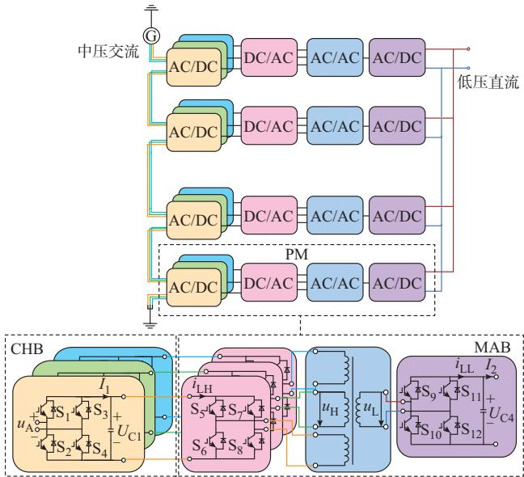  
图 1 ISOP型 CHB-MAB变换器拓扑  
Fig. 1 Topology of ISOP type CHB-MAB converter

MAB由多个与高频变压器相连的有源桥组成，如图1中MAB部分所示。与目前广泛应用的DAB

型PET相比，MAB型PET的高频变压器和H桥模块的数量更少，能够规避冗余的中间电能变换环节，以实现更多端口之间电能的直接传输与控制，同时保留其具有软开关、高效率和高功率密度的优势。由于H桥绝缘栅双极型晶体管（IGBT）器件的控制信号频率通常为1~20 kHz，本文认为MAB部分为快变电路。

典型的MAB结构常与CHB联合使用，以实现三相 AC/DC变换，其具备模块化结构，体积小、无污染、输出电压可控性强、功率密度高等特点［20］。由于 CHB载波信号频率通常为 600 Hz及以下［21］，本文认为 CHB部分为慢变电路，如图 1中 CHB部分所示［22］ 。崇礼PET拓扑采用每相ISOP的连接方式，具有 AC-DC-AC-DC 四级电能变换，包含级联多电平 AC/DC变流器及含 1个高频隔离变压器的MAB型DC/DC变换器，其低压直流母线与负载直接相连。本文等效建模工作从单个 MAB出发，以CHB连接三相 MAB高压侧为基本单元，结合等效电路串并联处理方法，最终实现ISOP连接的CHB-MAB变换器拓扑简化电磁暂态等效建模。

# 1. 2 控制策略

将 DAB 控制中的单移相调制方法［23］拓展到MAB中，通过控制变换器原副边全桥之间的移相角来改变功率传输的方向和大小。单移相调制采用频率为 10 kHz、占空比为 0.5 的方波作为导通信号。图 1 中 IGBT 器件 $\mathrm { S } _ { 5 } , \mathrm { S } _ { 8 }$ 控制信号相同，IGBT 器件$\mathrm { S } _ { 6 } , \mathrm { S } _ { 7 }$ 控制信号与其相反，IGBT器件 $\mathrm { S } _ { 9 } \ 、 \mathrm { S } _ { 1 0 } \ 、 \mathrm { S } _ { 1 1 } \ 、 \mathrm { S } _ { 1 2 }$ 同理，原边H桥和副边H桥导通信号之间存在移相角，通过调节移相角控制功率传递的大小和方向，移相角为正时，能量正向传输。由于单移相调制导通信号为方波，傅里叶分解处理时上升沿和下降沿处存在 Gibbs现象［24］，但其在一个周期内平均误差较小，可以较好地模拟方波信号，且方波拟合过程中的细微误差传递到等效模型主要关注的端口值时会大幅度减小，因此采用傅里叶分解的方式处理开关函数可以满足简化电磁暂态等效建模的需求。

级联H桥侧采用载波移相正弦脉宽调制（CPS-SPWM）技 术 ，每 个 CHB 模 块 的 正 弦 脉 宽 调 制（SPWM）的控制信号由631 Hz三角波与50 Hz正弦调制波比较产生，且每相内调制波相同，三相调制波间各差 $1 2 0 ^ { \circ }$ ；同相内每个CHB模块的三角波间相差360°/N，其中N为每相模块数。CHB模块一个周期内的工作状态分析见 2.2节。此外，CHB侧通过控

制高压侧电容电压实现系统电压-电流双闭环控制。

# 2 CHB-MAB 变换器简化电磁暂态等效 建模

单模块 CHB-MAB 变换器等效模型可分为快变电路 MAB、慢变电路 CHB两部分。根据广义状态空间平均法建立 模块系统级模型，通过开关函数模型建立CHB平均化模型，最终根据各PM的连接方式，提出了一种CHB-MAB变换器的简化电磁暂态等效模型。

# 2. 1 快变电路MAB单元等效建模

本节以图1中MAB部分的三相MAB为例进行等效建模，以下称其为MAB单元。

# 2. 1. 1 时域状态方程的建立

MAB单元拓扑如图2所示，包含多绕组高频隔离变压器及其输入、输出侧相连的全桥换流单元，全桥换流单元的动作频率通常在1~20 kHz，这使得电磁暂态模型的工作状态以极高的频率持续变化。因此，采用广义状态空间平均法整体把握 MAB的工作状态，规避高频链解耦等高难度、高工作量的处理方法。

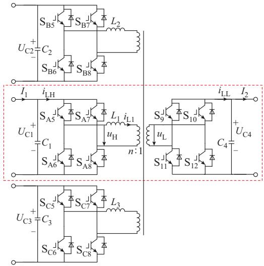  
图2 MAB单元拓扑  
Fig. 2 Topology of MAB unit

针对如图 2所示 MAB单元建立时变非线性微分方程。选取高频变压器等效电感 $L _ { 1 }$ 的电流 $i _ { \mathrm { L 1 } }$ 、电容电压 $U _ { \mathrm { C 1 } } , U _ { \mathrm { C 4 } }$ 为状态变量；将 IGBT 及其反并联二极管构成的开关组用开关函数模型等效，分别对高频变压器等效电感、电容列写微分方程；对状态变量进行傅里叶分解并引入新的状态变量矩阵，最终将非线性微分方程进行傅里叶分解。

首先，对图 2中红色虚线框部分所示的高频变

压器等效电感 $L _ { 1 }$ 、电容 $C _ { 1 }$ 和 $C _ { 4 }$ 列写状态方程：

$$
\left\{ \begin{array}{l} L _ {1} \frac {\mathrm {d} i _ {\mathrm {L} 1} (t)}{\mathrm {d} t} = u _ {\mathrm {H}} (t) - n u _ {\mathrm {L}} (t) \\ C _ {1} \frac {\mathrm {d} U _ {\mathrm {C} 1} (t)}{\mathrm {d} t} = I _ {1} (t) - i _ {\mathrm {L H}} (t) \\ C _ {4} \frac {\mathrm {d} U _ {\mathrm {C} 4} (t)}{\mathrm {d} t} = i _ {\mathrm {L L}} (t) - I _ {2} (t) \end{array} \right. \tag {1}
$$

式中：各电气量均由图2给出 ${ \bf \Omega } _ { \bf { ; } } u _ { \mathrm { { H } } } \left( { \bf { \Omega } } _ { t } \right)$ 和 u (t )分别为高频变压器一次侧和二次侧的交流电压； $i _ { \mathrm { L H } } \left( t \right)$ 和$i _ { \mathrm { L L } }$ (t)分别为高频变压器一次侧和二次侧的电流；I（t）和 I（t）分别为 MAB端口输入、输出电流；n为高频变压器A相变比。MAB拓扑中三相高频隔离变压器在电压变换、功率传递方面起着重要作用。忽略变压器励磁电感，依据原副边侧漏电抗相同的原则［25］ ，由变压器出厂实验参数可得三相变压器漏感参数。

然后，将 及其反并联二极管构成的开关组用开关函数模型等效。因此，方波电压 $u _ { \mathrm { H } } \left( t \right)$ 、$u _ { \mathrm { L } } \left( t \right)$ 和 电 流 $i _ { \mathrm { L H } } \left( \it t \right) , \ : \ : i _ { \mathrm { L L } } \left( \it t \right)$ 可 以 用 开 关 函 数$s _ { 1 } ( t ) , s _ { 2 } ( t )$ 及 状 态 变 量 $U _ { \mathrm { c 1 } } ( t ) , U _ { \mathrm { c 4 } } ( t ) , i _ { \mathrm { L 1 } } ( t )$ 表示，即

$$
\left[ \begin{array}{l} u _ {\mathrm {H}} (t) \\ u _ {\mathrm {L}} (t) \\ i _ {\mathrm {L H}} (t) \\ i _ {\mathrm {L L}} (t) \end{array} \right] = \left[ \begin{array}{c c c} s _ {1} (t) & 0 & 0 \\ 0 & s _ {2} (t) & 0 \\ 0 & 0 & s _ {1} (t) \\ 0 & 0 & n s _ {2} (t) \end{array} \right] \left[ \begin{array}{l} U _ {\mathrm {C l}} (t) \\ U _ {\mathrm {C l}} (t) \\ i _ {\mathrm {L l}} (t) \end{array} \right] \tag {2}
$$

式中：

$$
\left\{ \begin{array}{l} s _ {1} (t) = \left\{ \begin{array}{l l} 1 & \frac {\varphi_ {1} T}{2 \pi} <   t \leqslant \frac {T}{2} + \frac {\varphi_ {1} T}{2 \pi} \\ - 1 & \frac {T}{2} + \frac {\varphi_ {1} T}{2 \pi} <   t \leqslant T + \frac {\varphi_ {1} T}{2 \pi} \end{array} \right. \\ s _ {2} (t) = \left\{ \begin{array}{l l} 1 & \frac {\varphi_ {2} T}{2 \pi} <   t \leqslant \frac {T}{2} + \frac {\varphi_ {2} T}{2 \pi} \\ - 1 & \frac {T}{2} + \frac {\varphi_ {2} T}{2 \pi} <   t \leqslant T + \frac {\varphi_ {2} T}{2 \pi} \end{array} \right. \end{array} \right. \tag {3}
$$

式中： $\colon \varphi _ { 1 }$ 和 $\varphi _ { 2 }$ 分别为 $u _ { \mathrm { H } } \left( t \right)$ 和 $u _ { \mathrm { L } } \left( t \right)$ 的外移相角；周期T为MAB全桥换流单元动作频率倒数。

结 合 式（1）、式（2），可 得 MAB 的 A 相 微 分方程：

$$
\dot {P} = S P + I \tag {4}
$$

式中： $P { = } [ i _ { \mathrm { L } 1 } ( t ) , U _ { \mathrm { c } 1 } ( t ) , U _ { \mathrm { c } 4 } ( t ) ] ^ { \mathrm { T } }$ 表示系统状态变量，其中 $i _ { \mathrm { L 1 } } \left( t \right)$ 为包含基波和所有谐波的变压器等效电感电流 $; S$ 为系统状态变量矩阵，是主要由开

关函数 $s _ { 1 } ( t ) , s _ { 2 } ( t )$ 构成的 $3 \times 3$ 矩阵，由式（5）给出；I为系统输入变量，详见式（5）。

$$
\left\{ \begin{array}{l} \boldsymbol {S} = \left[ \begin{array}{c c c} 0 & \frac {s _ {1} (t)}{L _ {1}} & \frac {- n s _ {2} (t)}{L _ {1}} \\ \frac {- s _ {1} (t)}{C _ {1}} & 0 & 0 \\ \frac {n s _ {2} (t)}{C _ {4}} & 0 & 0 \end{array} \right] \\ \boldsymbol {I} = \left[ 0, \frac {I _ {1} (t)}{C _ {1}}, \frac {- I _ {2} (t)}{C _ {4}} \right] ^ {\mathrm {T}} \end{array} \right. \tag {5}
$$

# 2. 1. 2 傅里叶分解的状态方程的建立

由于全桥换流单元开关动作频率较快，对开关函数进行傅里叶变换，可得式（6）：

$$
s (t) = \sum_ {m = - \infty} ^ {\infty} \frac {1}{2} \left(a _ {m} - j b _ {m}\right) e ^ {m \omega_ {0} t} \tag {6}
$$

式中： $\omega _ { 0 }$ 为开关函数的角频率 $; a _ { n }$ 为 $m$ 倍频余弦的系数（幅度）； $b _ { m }$ 为 $m$ 倍频正弦的系数（幅度）。 $a _ { m }$ 和 $b _ { m }$ 的值由式（7）给出，且m取整数。

$$
\left\{ \begin{array}{l l} a _ {m} = 0 \\ b _ {m} = \left\{ \begin{array}{l l} \frac {4}{m \pi} & m \text {为 奇 数} \\ 0 & m \text {为 偶 数} \end{array} \right. \end{array} \right. \tag {7}
$$

根据傅里叶系数卷积特性，可得：

$$
\left\langle s (t) U (t) \right\rangle_ {a} = \sum_ {i = - \infty} ^ {\infty} \left\langle s (t) \right\rangle_ {a - i} \left\langle U (t) \right\rangle_ {i} \tag {8}
$$

式中：U(t)为电容电压；a、i均为傅里叶分解的次数；⋅ 表示对应变量的傅里叶系数。

根据工程需求可以选择直流量、基波及更高次谐波分量进行等效，本文模型等效只考虑等效电感电流的基波及 3、5次谐波和电容电压的直流分量。进而，得到由各状态变量的傅里叶系数描述的MAB单元简化电磁暂态等效模型微分方程：

$$
\dot {P} = \left[ \begin{array}{c c c c} W _ {1} & 0 & 0 & T _ {\mathrm {L} 1} \\ 0 & W _ {3} & 0 & T _ {\mathrm {L} 3} \\ 0 & 0 & W _ {5} & T _ {\mathrm {L} 5} \\ T _ {\mathrm {C} 1} & T _ {\mathrm {C} 3} & T _ {\mathrm {C} 5} & 0 \end{array} \right] P + I \tag {9}
$$

式（9）中 $P , \dot { P }$ 与式（4）相似，表示系统状态变量及其微分，但矩阵 $\dot { P }$ 中仅包含电容电压直流量和等效电感电流的基波及3、5次谐波；将式（4）矩阵P中高频变压器等效电感电流进行傅里叶变换后可以得到式（9）矩阵P，其中下标为负时表示相应次谐波分量的虚部；矩阵 I仍为系统输入变量，并提取式（5）

中电流直流量。 $P , \dot { P }$ 和 I的具体表达式如式（10）所示。

$$
\left\{ \begin{array}{l} \dot {P} = \left[ \left\langle \frac {\mathrm {d} i _ {\mathrm {L} 1} (t)}{\mathrm {d} t} \right\rangle_ {1}, \left\langle \frac {\mathrm {d} i _ {\mathrm {L} 1} (t)}{\mathrm {d} t} \right\rangle_ {3}, \left\langle \frac {\mathrm {d} i _ {\mathrm {L} 1} (t)}{\mathrm {d} t} \right\rangle_ {5}, \right. \\ \left. \left\langle \frac {\mathrm {d} U _ {\mathrm {C} 1} (t)}{\mathrm {d} t} \right\rangle_ {0}, \left\langle \frac {\mathrm {d} U _ {\mathrm {C} 4} (t)}{\mathrm {d} t} \right\rangle_ {0} \right] ^ {\mathrm {T}} \\ P = \left[ \left\langle i _ {\mathrm {L} 1} (t) \right\rangle_ {- 1}, \left\langle i _ {\mathrm {L} 1} (t) \right\rangle_ {1}, \left\langle i _ {\mathrm {L} 1} (t) \right\rangle_ {- 3}, \left\langle i _ {\mathrm {L} 1} (t) \right\rangle_ {3}, \right. \\ \left. \left\langle i _ {\mathrm {L} 1} (t) \right\rangle_ {- 5}, \left\langle i _ {\mathrm {L} 1} (t) \right\rangle_ {5}, \left\langle U _ {\mathrm {C} 1} (t) \right\rangle_ {0}, \left\langle U _ {\mathrm {C} 4} (t) \right\rangle_ {0} \right] ^ {\mathrm {T}} \\ I = \left[ 0, 0, 0, \frac {\left\langle I _ {1} (t) \right\rangle_ {0}}{C _ {1}}, - \frac {\left\langle I _ {2} (t) \right\rangle_ {0}}{C _ {4}} \right] ^ {\mathrm {T}} \end{array} \right. \tag {10}
$$

式（9）中相关矩阵详细表达式如下：

$$
\boldsymbol {W} _ {x} = \left[ 0, \mathrm {j} x \omega \right] \tag {11}
$$

$$
T _ {\mathrm {L} x} = \left[ - \mathrm {j} \frac {2}{x \pi L _ {1}} \mathrm {e} ^ {- \mathrm {j} x \varphi_ {1}}, \mathrm {j} \frac {2 n}{x \pi L _ {1}} \mathrm {e} ^ {- \mathrm {j} x \varphi_ {2}} \right] \tag {12}
$$

$$
T _ {\mathrm {C} x} = \left[ \begin{array}{l l} \mathrm {j} \frac {2}{x \pi C _ {1}} \mathrm {e} ^ {- \mathrm {j} x \varphi_ {1}} & - \mathrm {j} \frac {2}{x \pi C _ {1}} \mathrm {e} ^ {\mathrm {j} x \varphi_ {1}} \\ - \mathrm {j} \frac {2 n}{x \pi C _ {4}} \mathrm {e} ^ {- \mathrm {j} x \varphi_ {2}} & \mathrm {j} \frac {2 n}{x \pi C _ {4}} \mathrm {e} ^ {\mathrm {j} x \varphi_ {2}} \end{array} \right] \tag {13}
$$

式中 $\mathopen : x = 1 , 3 , 5$ ，分别代表1、3、5次分量；矩阵 $W _ { x }$ 反映各次电感电流之间的耦合关系；矩阵 $T _ { \mathrm { L } x }$ 反映各次等效电感电流微分与电容电压直流量的关系；矩阵 $T _ { \mathrm { c } _ { x } }$ 反映电容电压微分分别与电感电流基波及3、5次谐波的关系。

将状态变量的傅里叶系数表示为复数，即

$$
\left\{ \begin{array}{l} \left\langle i _ {\mathrm {L} 1} (t) \right\rangle_ {1} = q _ {1} (t) + \mathrm {j} q _ {2} (t) \\ \left\langle i _ {\mathrm {L} 1} (t) \right\rangle_ {3} = q _ {3} (t) + \mathrm {j} q _ {4} (t) \\ \left\langle i _ {\mathrm {L} 1} (t) \right\rangle_ {5} = q _ {5} (t) + \mathrm {j} q _ {6} (t) \\ \left\langle U _ {\mathrm {C} 1} (t) \right\rangle_ {0} = q _ {\mathrm {C} 1} (t) \\ \left\langle U _ {\mathrm {C} 4} (t) \right\rangle_ {0} = q _ {\mathrm {C} 4} (t) \end{array} \right. \tag {14}
$$

将傅里叶分解后的状态变量（见（14））代入变换后的微分方程式（9），可以得到状态变量实部和虚部分别表示的时变非线性微分方程。为增加公式的通用性，给出高频变压器等效电感电流按照基波及3，5，…，k（k为奇数）次谐波分解的时变非线性微分方程，如式（15）所示。

$$
\dot {Q} = \frac {1}{\pi} \left[ \begin{array}{c c c c c} W _ {1} & 0 & \dots & 0 & T _ {\mathrm {L} 1} \\ 0 & W _ {3} & \ddots & \vdots & T _ {\mathrm {L} 3} \\ \vdots & \ddots & \ddots & 0 & \vdots \\ 0 & \dots & 0 & W _ {k} & T _ {\mathrm {L} k} \\ T _ {\mathrm {C} 1} & T _ {\mathrm {C} 3} & \dots & T _ {\mathrm {C} k} & 0 \end{array} \right] Q + I \tag {15}
$$

由式（14）可知，状态变量的傅里叶系数由实部和虚部表示，将式（9）中矩阵P、P 转换为 $Q , \dot { Q } .$ ，如式（16）所示；为化简矩阵内容，提出系统状态变量矩阵常系数 $1 / \pi$ ，因此 $\boldsymbol { W } _ { k }$ 转换为式（17）；如式（18）和式（19）所示，矩阵 $T _ { \mathrm { L } k \setminus T _ { \mathrm { C } k } }$ 经系数提取与公式化简后略有变化。

$$
\left\{ \begin{array}{l} \dot {Q} = \left[ \dot {q} _ {1} (t), \dot {q} _ {2} (t), \dots , \dot {q} _ {k} (t), \dot {q} _ {k + 1} (t), \right. \\ \quad \left. \dot {q} _ {\mathrm {C} 1} (t), - \dot {q} _ {\mathrm {C} 4} (t) \right] ^ {\mathrm {T}} \\ Q = \left[ q _ {1} (t), q _ {2} (t), \dots , q _ {k} (t), q _ {k + 1} (t), \right. \\ \quad \left. q _ {\mathrm {C} 1} (t), - q _ {\mathrm {C} 4} (t) \right] ^ {\mathrm {T}} \\ I = \left[ 0, 0, \dots , 0, 0, \frac {\left\langle I _ {1} (t) \right\rangle_ {0}}{C _ {1}}, \frac {\left\langle I _ {2} (t) \right\rangle_ {0}}{C _ {4}} \right] ^ {\mathrm {T}} \end{array} \right. \tag {16}
$$

$$
\boldsymbol {W} _ {k} = \left[ \begin{array}{c c} 0 & k \pi \omega \\ - k \pi \omega & 0 \end{array} \right] \tag {17}
$$

$$
T _ {\mathrm {L}, k} = \left[ \begin{array}{l l} - \frac {2 n}{k L _ {1}} \sin k \varphi_ {1} & \frac {2 n}{k L _ {1}} \sin k \varphi_ {2} \\ - \frac {2 n}{k L _ {1}} \cos k \varphi_ {1} & \frac {2 n}{k L _ {1}} \cos k \varphi_ {2} \end{array} \right] \tag {18}
$$

$$
T _ {\mathrm {C} k} = \left[ \begin{array}{l l} \frac {4}{k C _ {1}} \sin k \varphi_ {1} & \frac {4}{k C _ {1}} \cos k \varphi_ {1} \\ \frac {4 n}{k C _ {4}} \sin k \varphi_ {2} & \frac {4 n}{k C _ {4}} \cos k \varphi_ {2} \end{array} \right] \tag {19}
$$

式（ ）给出了高频变压器等效电感电流按基波及3，5，…，k（k为奇数）次谐波分解的时变非线性微分方程，其仅对MAB拓扑A相等效建模，B、C相同理。由式（15）可知基波及各次谐波方程间不存在耦合 关 系 ，因 此 扩 展 k 次 谐 波 方 程 时 直 接 增 加$W _ { k \setminus } T _ { \scriptscriptstyle \mathrm { L } k \setminus } T _ { \scriptscriptstyle \mathrm { C } k }$ 矩阵即可。

本节提出的MAB单元等效模型可以根据工程的精度、速度等需求扩展为可以适用于含不同谐波分量场景的模型。以本文算例建模过程为例，首先，在ISOP型CHB-MAB变换器详细模型中测出高频变压器等效电感电流波形并进行傅里叶分解，可知高频变压器等效电感电流主要包含基波及奇次谐波分量；并且根据测算了解到高频变压器等效电感电流中基波幅值最大，3、5次谐波幅值其次，7次及以

上奇次谐波幅值较小（共约 6%），在电流波形中占比很小。另外，增加占比较低的高次谐波将会扩大求解方程规模并增加求解难度，对仿真速度有一定的影响。

综上，在仿真精度方面，本文测试高频变压器等效电感电流按照基波及3、5、7次谐波分解所得低压直流电压波形启动过程最大误差约为0.9%，相比基波及3、5次谐波分解最大误差1%略有降低，但二者均符合误差要求；在仿真速度方面，本文经测试得到高频变压器等效电感电流按照 1、3、5、7次级数分解的仿真速度约为按照 1、3、5次级数分解仿真速度的 1.1倍，且随着拓扑复杂度的增加，仿真时间差距增大，因此选取1、3、5次级数分解，以实现在基本保留精度的前提下提升仿真加速比的简化电磁暂态等效模型。

# 2. 2 慢变电路CHB单元等效建模

CHB的核心拓扑为 H桥，与 MAB全桥换流单元不同，CHB工作频率一般为几百赫兹，等效过程中将其按照电路工作状态划分仍能保证模型速度，因此采用开关函数法，图3给出了CHB的4种工作状态，其中红色线表示电流通路。

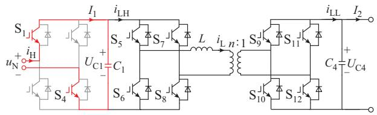

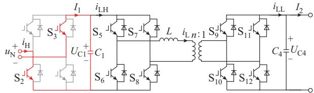

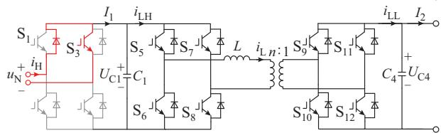

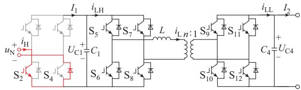  
图3 H桥的导通特性  
Fig. 3 Conduction characteristics of H-bridge

根据CHB中各个IGBT的导通信号，可得到其两侧交直流电压、电流之间的关系，如表 1所示，其

中， $u _ { \mathrm { N } }$ 为交流侧电压， $i _ { \mathrm { H } }$ 为交流侧电流。

表1 IGBT开关状态  
Table 1 IGBT on-off states   

<table><tr><td>S1状态值</td><td>S2状态值</td><td>S3状态值</td><td>S4状态值</td><td>uN</td><td>iH</td></tr><tr><td>1</td><td>0</td><td>0</td><td>1</td><td>Uc1</td><td>I1</td></tr><tr><td>0</td><td>1</td><td>1</td><td>0</td><td>-Uc1</td><td>-I1</td></tr><tr><td>1</td><td>1</td><td>0</td><td>0</td><td>0</td><td>0</td></tr><tr><td>0</td><td>0</td><td>1</td><td>1</td><td>0</td><td>0</td></tr></table>

表 1通过导通信号将 CHB 划分出 4种工作状态，其两侧交直流电压、电流分别对应 种不同的关系。这种方法无需高频链解耦、预处理等过程，可以迅速建立交流侧与直流侧的联系，在保证模型精度的同时提高计算速度。

# 3 ISOP型 CHB-MAB变换器等效建模

本章在 2.1节、2.2节 MAB 单元等效模型的基础上，分析多种模块间的连接方式，最终建立了ISOP 型 CHB-MAB 变换器的简化电磁暂态等效模型。

# 3. 1 PM间级联方式及等效方法

PET在电压和容量方面存在限制，而采用模块串并联结构组合而成的 PET拓扑可满足不同的电压和功率需求。模块组合型 大致分为 种基本类型：输入并联输出串联（IPOS）型、ISOP型、输入串联输出串联（ISOS）型和输入并联输出并联（IPOP）型［26］。图 1 为多个 CHB-MAB 单元构成的ISOP型变换器，高压交流侧通过各单元间的串联分压，降低了对左侧 H桥器件的耐压要求；低压侧通过各单元间的并联均分电流，降低了对右侧H桥器件的耐流要求。

由于 ISOP型级联方式包含串联、并联两种级联方式，在仿真过程中可以推及其他级联类型，因此本文简化电磁暂态等效模型采用 ISOP 型结构，ISOP级联方式的计算流程图如图 4所示。判断各单元的连接方式后，分别根据串并联结构的电流特性，输入侧由总的输入电流得到每个CHB-MAB单元的输入电流，输出侧改变系统方程进而使总电流作为方程所需量。

# 3. 2 ISOP 型 CHB-MAB 变换器等效建模

型 - 变换器等效建模流程图如图5所示，求解过程可以分为读取系统参数及CHB导通信号、正向求解MAB单元端口电压值、与外电路相结合求解得到端口电流值、进一步形成循环迭代，最终完成求解工作。

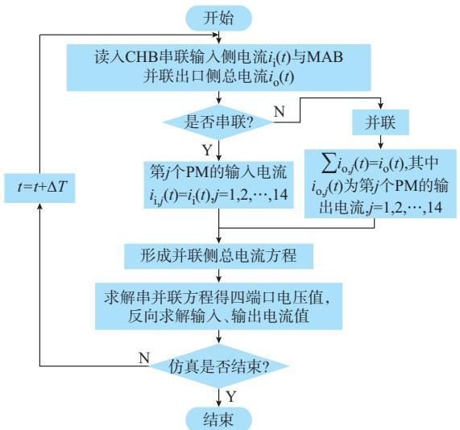  
图4 ISOP型级联方式计算流程图  
Fig. 4 Calculation flow chart of ISOP cascading mode

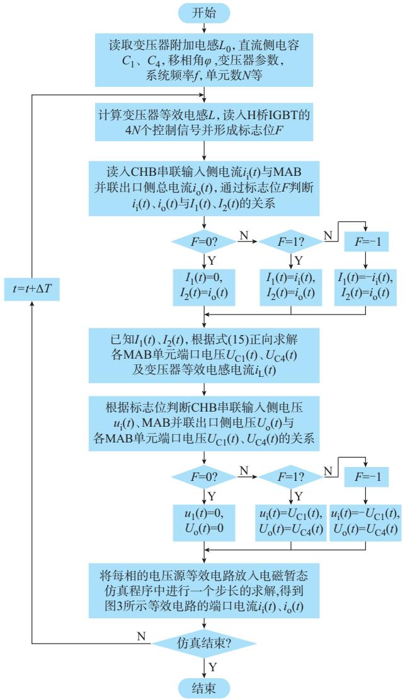  
图5 ISOP型CHB-MAB变换器等效建模流程图  
Fig. 5 Flow chart of equivalent modeling of ISOP type CHB-MAB converter

ISOP 型 CHB-MAB 变换器的等效电路如图 6所示，其中 $V _ { \mathrm { ~ 1 ~ } } ^ { \mathrm { ~ i ~ } }$ 至 $V _ { \mathrm { ~ 6 ~ } } ^ { \mathrm { ~ i ~ } }$ 表示各端子电压， $V _ { \mathrm { s e q 1 } } ^ { \mathrm { i } }$ 至 $V _ { \mathrm { s e q 4 } } ^ { \mathrm { i } }$ 、I i至 $I _ { 4 } ^ { \mathrm { i } }$ 分别表示各端口电压和电流。本文CHB-MAB变换器包含 个输入端口和 个输出端口，每个端口可以等效为一个受控电压源，串联侧端口电压直接累加，并联侧各端口电压完全相等。最终可得到图 6所示的左侧为三相输入受控交流电压源、右侧为单个输出受控直流电压源的等效电路。

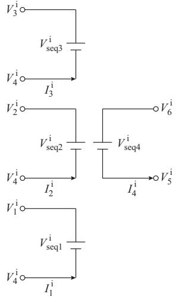  
图 6 ISOP型 CHB-MAB变换器的等效电路  
Fig. 6 Equivalent circuit of ISOP type CHB-MAB converter

由于PET的模块化结构，其状态可由控制信号决定，图5所示流程图通过更新CHB导通信号实现各个H桥工作状态的即时改变。把MAB参数与端口电流值相结合，可以求得图6所示4个端口的电压值。在PSCAD/EMTDC仿真中可将电压值与外电路相结合，求得端口电流值。

# 4 仿真验证

# 4. 1 仿真系统

本章在 PSCAD/EMTDC 中分别搭建了 ISOP型 - 变换器详细模型与简化电磁暂态等效模型，测试所建立模型的仿真精度与加速比。含有14个子模块的ISOP型CHB-MAB变换器的高压侧等效为交流电压源串联阻抗的形式，负荷侧由电阻等效。采用 CPS-SPWM 和单移相闭环控制，MAB快变电路开关频率为10 kHz，并选取1 μs的仿真步长，设置交流电压上升时间为 0.05 s。系统结构如图7所示。

测试系统高压交流母线电压为 10 kV，低压直流母线电压为 1 kV，MAB输入侧电容 $C _ { 1 } , C _ { 2 } , C _ { 3 }$ 和输出侧电容 $C _ { 4 }$ 值分别设置为 $2 ~ 0 0 0 ~ \mu \mathrm { F }$ 和 $1 \ 0 0 0 \ \mu \mathrm { F }$ ，变压器附加电感值为 100 μH，高频变压器变比为1.5∶1.5。

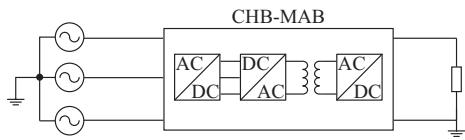  
图 7 ISOP型 CHB-MAB变换器测试系统  
Fig. 7 Test system of ISOP type CHB-MAB converter

# 4. 2 仿真结果分析

# 4. 2. 1 模型测试

本节测试稳态工况下ISOP型CHB-MAB变换器高压侧输入电压、变压器等效电感电流，对比频率为 10 kHz、25 kHz时模型的精度，以验证简化电磁暂态模型的等效性。

在稳态工作过程中，等效模型的高压交流电压阶梯波（见附录 图 、图 ）与详细模型高度一致。10 kHz、25 kHz下高频变压器等效电感电流波形（见图A3、图A4）最大误差分别为1.5%、0.7%，造成误差的主要原因是等效模型高频变压器等效电感电流仅考虑主要低次谐波，但其误差大小仍在等效模型允许最大误差范围内。根据上述高压交流电压及高频变压器等效电感电流的分析可知，本文简化电磁暂态模型可以实现对详细模型的等效。

# 4. 2. 2 精度测试

本节测试多种工况下ISOP型CHB-MAB变换器低压侧输出电压，对比等效模型和详细模型的精度和加速比，验证等效模型对系统内外特性的反映。

为了测试多种工况下等效模型的仿真精度，本节对仿真系统做以下设置：

1）0~0.1 s：设置高压交流电源启动时间为0.05 s，系统启动。  
2）0.1~0.2 s：启动过程结束，进入稳态运行。   
） ：改变低压直流负载，设置指令使低压直流电压降低 25%，变为 0.761 kV，系统变为低压电压调节过渡阶段。  
4）0.6~1.0 s：系统低压直流侧发生双极经小电阻接地短路，短路电阻为 0.5 Ω，经过 0.2 ms的故障时间，断路器重合闸，系统恢复。

选取ISOP型CHB-MAB变换器低压侧直流电压作为测试对象，对各个阶段等效模型和详细模型进行测试对比，结果如图8所示。

低压侧直流电压误差曲线如附录 A 图 A5 所示，启动过程中最大误差为1.5%，0.1 s左右系统进入稳态阶段；在 $t { = } 0 . 2 0 ~ \mathrm { s }$ 时，将低压侧负载由1 Ω变为 ，过渡过程最大误差为 ；由图 （）可知，在故障过程中，低压侧直流电压出现了很大的跌落，低谷电压约为0.6 kV，约0.65 s系统恢复稳态运行，最大误差约为1.1%。

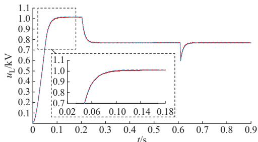

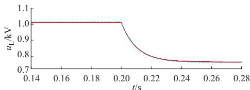  
(a) 启动过程  
(b) 低压侧电压调节过渡过程

图8 低压侧直流电压  
Fig. 8 DC voltage on low voltage side   
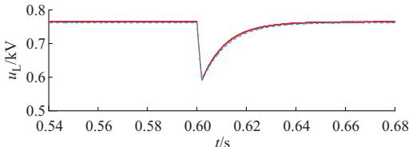  
详细模型; 等效模型

(c) 故障及恢复过程

根据各个电气量的测试结果可知，无论是稳态过程还是暂态过程，等效模型和详细模型的测试结果均高度吻合，说明本文所提简化电磁暂态等效模型具有较高仿真精度的同时，能很好地反映 ISOP型CHB-MAB变换器的内外特性。

# 4. 2. 3 加速比测试

本节测试等效模型的仿真加速比，分别在PSCAD/EMTDC 中搭建由 CHB-MAB 单元个数为、、 组成的 型 - 变换器的详细模型与等效模型。设置系统仿真时间为5 s，仿真频率为 10 kHz，仿真步长为 1×10-6 s，计算相应仿真加速比，结果如表2所示。由表2可知，单相模块数为2时，等效模型的加速比为2.4，而对于14个模块，加速比超过 60，说明本文所提等效模型在对高频、高电平、多模块的 ISOP型 CHB-MAB变换器仿真时具有更好的提速效果。

表2 详细模型与等效模型仿真时间对比  
Table 2 Comparison of simulation time between detailed model and equivalent model   

<table><tr><td rowspan="2">单相模块数</td><td colspan="2">仿真用时/s</td><td rowspan="2">加速比Sd</td></tr><tr><td>详细模型</td><td>等效模型</td></tr><tr><td>2</td><td>714.59</td><td>299.39</td><td>2.4</td></tr><tr><td>8</td><td>6119.22</td><td>386.73</td><td>15.8</td></tr><tr><td>14</td><td>27698.64</td><td>441.45</td><td>62.7</td></tr></table>

加速比 $S _ { \mathrm { d } }$ 的计算公式如式（20）所示，表示相同仿真时间与相同仿真步长下两个模型计算用时的比值。

$$
S _ {\mathrm {d}} = \frac {T _ {1}}{T _ {2}} \tag {20}
$$

式中； $T _ { 1 }$ 为详细模型的计算仿真用时； $T _ { 2 }$ 为等效模型的计算仿真用时。

# 5 结 语

本文提出了一种ISOP型CHB-MAB变换器的简化电磁暂态等效模型，该模型采用开关函数模型处理 CHB 慢变电路，采用广义状态平均法处理MAB快变电路。通过傅里叶分解状态方程并忽略不重要的阶数来简化系统，最终形成可与外部拓扑直接相连的四端口电压源等效电路。建立了ISOP型 CHB-MAB 变换器的详细模型和简化电磁暂态等效模型。仿真结果表明，该简化电磁暂态等效模型具有较高的精度，其稳态最大误差为0.5%，故障和恢复过程最大误差为 2.1%。模型加速比随模块数目的增加而增加，当模块数大于 20时，加速比达到两个数量级。

本文模型具有精度高、速度快、等效过程简单、适用范围广等优点。针对SAB、DAB、MAB、CHB、- 和 - 等拓扑均可实现等效建模；混合型 拓扑可独立为数个以上 ，分别等效建模后整合为PET电磁暂态模型。因此，本文简化电磁暂态等效模型可应用于各种PET场景。

本文所提模型为简化电磁暂态等效模型，没有器件开关过程的概念，是一种精确的系统级模型。此模型可以反映所有的外特性及部分内部特性，可应用于包含多个 PET的大规模交直流混联电网的系统分析、保护设计，但不适用于电路结构和精细化调制设计。此外，所提模型虽已实现较大幅度的仿真提速，但随着配电网规模扩大，换流器数量迅速增加，等效模型状态变量的增加将大幅增加模型对仿真资源的需求。因此，还需进一步研究简化电磁暂态模型的实时仿真方法，以适应更大规模配电网的系统级仿真需求。

附录见本刊网络版（http：//www.aeps-info.com/aeps/ch/index.aspx），扫英文摘要后二维码可以阅读网络全文。

# 参 考 文 献

［1］安峰，宋文胜，杨柯欣，等.输出并联双有源全桥DC-DC变换器虚拟功率均衡控制方法［J］.电力系统自动化，2018，42（12）：

106-112.   
AN Feng， SONG Wensheng， YANG Kexin， et al. Virtualpower balance control scheme of dual active bridge DC-DCconverters with output-parallel structure ［J］. Automation ofElectric Power Systems，2018，42（12）：106-112.  
［ ］李子欣，高范强，赵聪，等 电力电子变压器技术研究综述［］中国电机工程学报， ，（ ）： -  
LI Zixin，GAO Fanqiang，ZHAO Cong，et al. Research reviewof power electronic transformer technologies［J］. Proceedings ofthe CSEE，2018，38（5）：1274-1289.  
［3］李俊杰，吕振宇，吴在军，等 .基于电力电子变压器的交直流混合微电网运行模式自适应切换策略［］电力自动化设备， ，（ ）： -  
LI Junjie，LÜ Zhenyu，WU Zaijun，et al. Adaptive switching strategy of AC/DC hybrid microgrid operating mode based on power electronic transformer［J］. Electric Power Automation Equipment，2020，40（10）：126-131.   
［4］汤建，邹志翔，刘星琪，等 .基于电力电子变压器的逆变器并网系统建模、稳定性分析及控制［J］. 电网技术，2021，45（11）：4224-4233.  
TANG Jian， ZOU Zhixiang， LIU Xingqi， et al. Modeling，stability analysis and control of grid-connected inverter systemusing power electronics transformer ［J］. Power SystemTechnology，2021，45（11）：4224-4233.  
［ ］李凯，赵争鸣，袁立强，等 面向交直流混合配电系统的多端口电力电子变压器研究综述［J］.高电压技术，2021，47（4）：1233-1250.  
LI Kai，ZHAO Zhengming，YUAN Liqiang，et al. Overview on research of multi-port power electronic transformer oriented for AC/DC hybrid distribution grid［J］. High Voltage Engineering， 2021，47(4)：1233-1250.   
［ ］许建中，李承昱，熊岩，等 模块化多电平换流器高效建模方法研究综述［］中国电机工程学报， ，（ ）： -  
XU Jianzhong，LI Chengyu，XIONG Yan，et al. A review ofefficient modeling methods for modular multilevel converters［J］.Proceedings of the CSEE，2015，35（13）：3381-3392.  
［ ］许建中，高晨祥，丁江萍，等 高频隔离型电力电子变压器电磁暂态加速仿真方法与展望［］ 中国电机工程学报， ，（ ）： -  
XU Jianzhong， GAO Chenxiang， DING Jiangping， et al.Electromagnetic transient acceleration simulation methods andprospects of high-frequency isolated power electronic transformer［J］. Proceedings of the CSEE，2021，41（10）：3466-3479.  
［8］易姝娴，袁立强，李凯，等 .面向区域电能路由器的高效仿真建模方法［J］.清华大学学报（自然科学版），2019，59（10）：796-806.  
YI Shuxian， YUAN Liqiang， LI Kai， et al. High-efficiencymodeling method for regional energy routers［J］. Journal ofTsinghua University（Science and Technology），2019，59（10）：796-806.  
［9］安峰，崔彬，白睿航，等 .高压大容量直流变压器模块化离散解耦等效建模方法［J］.电力系统自动化，2021，45（7）：79-86.  
AN Feng， CUI Bin， BAI Ruihang， et al. Modular discretedecoupling equivalent modeling method for high-voltage large-capacity DC transformer ［J］. Automation of Electric PowerSystems，2021，45（7）：79-86.

［10］YIN R，SHI M，HU W P，et al. An accelerated model of modular isolated DC/DC converter used in offshore DC wind farm［J］. IEEE Transactions on Power Electronics，2019，34 （4）：3150-3163.   
［ ］丁江萍，高晨祥，许建中，等 级联 桥型电力电子变压器的电磁暂态等效建模方法［］中国电机工程学报， ， （ ）：7047-7056.  
DING Jiangping， GAO Chenxiang， XU Jianzhong， et al.Electromagnetic transient equivalent modeling method ofcascaded H-bridge power electronic transformer ［J］.Proceedings of the CSEE，2020，40（21）：7047-7056.  
［12］高晨祥，丁江萍，冯谟可，等.基于节点导纳方程预处理的ISOP型 变换器双端口解耦等效模型［］中国电机工程学报，，（ ）： -  
GAO Chenxiang，DING Jiangping，FENG Moke，et al. Twoport decoupling equivalent model of ISOP type DAB converter by preprocessing the node admittance equation［J］. Proceedings of the CSEE，2021，41（6）：2255-2267.   
［13］LI Z Q， WANG Y， SHI L， et al. Generalized averaging modeling and control strategy for three-phase dual-active-bridge DC-DC converters with three control variables［C］// 2017 IEEE Applied Power Electronics Conference and Exposition， March 26-30，2017，Tampa，USA：1078-1084.   
［14］ZHAO T F，ZENG J，BHATTACHARYA S，et al. An average model of solid state transformer for dynamic system simulation［C］// 2009 IEEE Power & Energy Society General Meeting，July 26-30，2009，Calgary，Canada：1-8.   
［15］XU J Z，GOLE A M，ZHAO C Y. The use of averaged-value model of modular multilevel converter in DC grid［J］. IEEE Transactions on Power Delivery，2015，30(2)：519-528.   
［16］PAVLOVIC T， BJAZIC T， BAN Z. Simplified averagedmodels of DC-DC power converters suitable for controllerdesign and microgrid simulation［J］. IEEE Transactions onPower Electronics，2013，28（7）：3266-3275.  
［17］杨占刚，吴惠东，屈俊超，等.基于广义状态空间平均的独立电力系统建模方法［］电工电能新技术， ，（ ）： -  
YANG Zhangang，WU Huidong，QU Junchao，et al. Modeling method of isolated power system based on generalized state space averaging ［J］. Advanced Technology of Electrical Engineering and Energy，2016，35（12）：12-19.   
［18］QIN H S，KIMBALL J W. Generalized average modeling ofdual active bridge DC-DC converter［J］. IEEE Transactions on， ， （ ）： -  
［19］王杉杉，王玉斌，林意斐，等.级联型电力电子变压器电压与功率均衡控制方法［J］.电工技术学报，2016，31（22）：92-99.  
WANG Shanshan，WANG Yubin，LIN Yifei，et al. Voltageand power balance control for cascaded multilevel converterbased power electronic transformer［J］. Transactions of China， ， （ ）： -  
［20］高凯，屈海涛，任茂鑫，等.基于可控电压源的高压直流输电换相 失 败 抑 制 技 术［J/OL］. 高 压 电 器［2021-11-26］.http：//kns.cnki.net/kcms/detail/61.1127.TM.20211122.2016.004.html.  
GAO Kai， QU Haitao， REN Maoxin， et al. Commutation failure suppression technology for HVDC transmission based on controlled voltage source ［J/OL］. High Voltage Apparatus

［2021-11-26］. http：//kns. cnki. net/kcms/detail/61.1127. TM. 20211122.2016.004.html.   
「21]蔡信健，吴振兴，孙乐，等.直流电压不均衡的级联H桥多电平变频器载波移相 调制策略的设计［］电工技术学报，2016，31（1）：119-127.  
CAI Xinjian，WU Zhenxing，SUN Le，et al. Design for phaseshifted carrier pulse width modulation of cascaded H-bridge multi-level inverters with non-equal DC voltages ［J］. Transactions of China Electrotechnical Society，2016，31（1）： 119-127.   
［ ］张飞，王瑞 级联 桥 控制策略研究［］中国新技术新产品，2021（6）：1-6.  
ZHANG Fei,WANG Rui.Research on cascade H-bridge SVGcontrol strategy［J］. New Technology & New Products ofChina，2021（6）：1-6.  
［23］张航，李耀华，高范强，等.级联H桥型电力电子变压器隔离级高频电流波动抑制策略［J］.电力系统自动化，2020，44（7）：130-138.  
ZHANG Hang， LI Yaohua， GAO Fanqiang， et al. Highfrequency current fluctuation suppression strategy for isolation stage of cascaded H-bridge based power electronic transformer ［J］. Automation of Electric Power Systems，2020，44（7）： 130-138.   
「24]肖唐良.数字信号处理中的Gibbs效应及其抑制算法的研究［］电子测量技术， ，（ ）： -  
XIAO Tangliang. Gibbs effect on pulse extraction and its

suppression algorithm ［J］. Electronic MeasurementTechnology，2016，39（11）：71-74.  
［25］CHEN W，RUAN X B，YAN H，et al. DC/DC conversionsystems consisting of multiple converter modules： stability，control，and experimental verifications［J］. IEEE Transactionson Power Electronics，2009，24（6）：1463-1474.  
［ ］孙志峰，肖岚，王勤 输出并联型双有源全桥变换器控制技术研究综述［］中国电机工程学报， ，（ ）： -  
SUN Zhifeng，XIAO Lan，WANG Qin. Review research oncontrol technology of output parallel dual-active-bridge-converters［J］. Proceedings of the CSEE，2021，41（5）：1811-1831.

郑聪慧(1998—)，女，硕士研究生，主要研究方向：柔性直流 输 电 建 模 与 仿 真 、电 力 电 子 变 压 器 建 模 。 - ：16221083@bjtu.edu.cn

徐婉莹(1998—)，女，硕士研究生，主要研究方向：柔性直流输电系统建模与仿真。E-mail：514819631@qq.com

王晓婷 — ，女，硕士研究生，主要研究方向：柔性直流 输 电 建 模 与 仿 真 、电 力 电 子 变 压 器 建 模 。 - ：825409549@qq.com

许建中（1987—），男，通信作者，博士，副教授，博士生导师，主要研究方向：高压直流输电和直流电网技术。 - ：xujianzhong@ncepu.edu.cn

（编辑 蔡静雯）

# Simplified Electromagnetic Transient Equivalent Model of Multi-active-bridge-based Power Electronic Transformer

ZHENG Conghui，XU Wanying，WANG Xiaoting，GAO Chenxiang，XU Jianzhong，ZHAO Chengyong

(State Key Laboratory of Alternate Electrical Power System with Renewable Energy Sources

(North China Electric Power University), Beijing 102206, China)

Abstract: The power electronic transformer (PET) is one of the key devices in the flexible DC distribution system. Due to the small simulation step size caused by high-frequency characteristics of PET, the detailed electromagnetic transient (EMT) simulation of PET is extremely time-consuming, especially for the multi-active-bridge (MAB) based PET. Hence the simulation speed needs to be accelerated. This paper proposes a simplified EMT equivalent model of the cascaded H-bridge (CHB) type MABbased PET. The structural characteristics of MAB are analyzed. For the CHB slow-change circuit, the switching function model is adopted to divide the circuit states. Based on the generalized state-space average method,for the fast-changing circuit of MAB, the equivalent that the Fourier decomposition method is used and the harmonic characteristics of key orders are kept is achieved. The processing methods of port electrical variables in different cascading modes are proposed to improve the simulation acceleration ratio while preserving accuracy. The detailed model and the simplified equivalent model of input-series output-parallel type MABbased PET are built in PSCAD/EMTDC. The simulation results show that the simplified EMT equivalent model has similar accuracy and higher efficiency compared with the detailed model.

This work is supported by Beijing Natural Science Foundation (No. 3222059).

Key words: simplified electromagnetic transient simulation; power electronic transformer (PET); multi-active-bridge (MAB); cascaded H-bridge (CHB); generalized state average method; input-series output-parallel (ISOP); DC distribution network

