# A Z-TRANSFORM MODEL OF TRANSFORMERS FOR THE STUDY OF ELECTROMAGNETIC TRANSIENTS IN POWER SYSTEMS

Q. Su R.E. James, Member D. Sutanto, Senior member  
Department of Electrical Power Engineering, University of New South Wales P.O.Box 1, Kensington 2033, Australia

Abstract - A Z-transform model, which combines transformer frequency-dependent short-circuit impedances with gain functions has been developed. It sets up a relationship between transient voltages and currents on both sides of a transformer winding pair. The model can be used to calculate impulse responses of the transformers with open-circuit secondary winding as well as those connected to other networks. It could be incorporated into EMT programs for calculating the electromagnetic transients in power systems in which the distributed characteristics of transformer windings are to be considered.

# INTRODUCTION

In the study of electromagnetic transients resulting from circuit switching in power systems, transformers are usually represented by their leakage impedances at power frequency. This simulation may not be correct in some conditions in which relatively high frequency transients are involved, for example, busbars switching in substations and clearing short-distance faults. For the study of lightning surges in substation protection, transformers are modelled by their entry capacitances. This model may not be valid for the surges of lightning which have a slower wavefront when reaching a transformer because inductances of the transformer could effect the transients as well. Over the years, two main forms of distributed-parameter model for transformers have been developed. The first is where ladder networks with a finite number of sections represent the distributed characteristics of transformer winding systems. The second is based on the derivation of input-output frequency responses for winding pairs which are then used in time convolution forms of transient analysis.

The developments reported in the present paper seek to contribute to the second method. They do so in two main ways. Firstly, transformer short-circuit impedances are included in the derivation so that, when combined with open-circuit frequency responses, the representation can be incorporated into a model for a complete network of which a transformer is one element. Secondly, the z-plane is used as an intermediate transform step between the continuous frequency-domain in which transformer frequency responses are expressed and the time-domain in which surge

89 SM 666-9 PwRS A paper recommended and approved by the IEEE Power System Engineering Committee of the IEEE Power Engineering Society for presentation at the IEEE/PES 1989 Summer Meeting, Long Beach, California, July 9 - 14, 1989. Manuscript submitted January 25, 1989; made available for printing May 9, 1989.

propagation analysis is carried out. The wide applications of such a transformer model can be found in the areas of, for example, lightning protection of substations, busbar switching transients and recovery voltages of circuit breakers.

# SYNTHESIS OF THE GAIN FUNCTION

The frequency response of a transformer winding-pair is identical in a wide bandwidth by means of a gain function which is determined by the ratio between sinusoid input and output voltages across the two windings. Magnitudes of a typical gain function measured on a 200MVA $220\mathrm{kV}$ transformer are shown in Fig.1. The frequency dependent function has a flat shape from $50\mathrm{Hz}$ to some kilohertz, with normalized amplitudes near to one. At high frequencies, the gain function presents some resonances and anti-resonances.

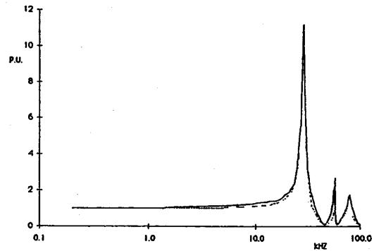  
Fig.1 S-plane synthesis of the gain function. From the 200MVA auto-transformer. -From the frequency-weighted 3rd-order function synthesised in the S-plane.

From the theory of complex functions, if a function, $\Phi(s)$ , in the complex frequency plane is not only analytic, but has no zero for $\operatorname{Re}(s) > 0$ , $\Phi(s)$ will be a minimum-phase-shift and can be uniquely determined from its magnitudes, $|\Phi(j\omega)|$ . Usually, the gain function of transformers is not a minimum-phase-shift. There exists a short transit time between the input and output voltages of the transformer winding pair. However, the time delay can usually be separated from the gain function to obtain its minimum-phase-shift by the method used for transmission lines[1].

Assuming that $|\beta(\omega)|$ is the magnitude of the gain function measured across a two-winding transformer,

$$
\left| \beta (\omega) \right| = \left| \frac {V _ {\mathrm {H}} (\omega)}{V _ {\mathrm {L}} (\omega)} \right| \tag {1}
$$

where $V_{H}(\omega)$ is the sinusoid voltage at radian frequency $\omega$ applied across the high-voltage winding,

$\mathbf{V}_{\mathrm{L}}(\omega)$ is the response across the low-voltage winding.

The gain function can be normalized as

$$
\beta_ {n} (\omega) = \frac {\beta (\omega)}{K} \tag {2}
$$

where $K$ is the turns ratio between the two windings.

$\beta_{n}(\omega)$ can be synthesized by the multi-product rational-fraction, R(s),

$$
R (s) = A \prod_ {k = 1} ^ {n} \frac {A _ {k} s ^ {2} + B _ {k} s + 1}{C _ {k} s ^ {2} + D _ {k} s + 1} \tag {3}
$$

where $s = j\omega$

The magnitude of $R(j\omega)$ is

$$
\left| R (j \omega) \right| = | A | \prod_ {k = 1} ^ {n} \sqrt {\frac {(1 - \omega^ {2} A _ {k}) ^ {2} + (B _ {k} \omega) ^ {2}}{(1 - \omega^ {2} C _ {k}) ^ {2} + (D _ {k} \omega) ^ {2}}} \tag {4}
$$

The coefficients of $R(s)$ can be determined by minimizing the error function

$$
Q (q) = \sum_ {1 = 1} ^ {L} W (\omega_ {1}) [ | \beta_ {n} (\omega_ {1}) | - | R (j \omega_ {1}) | ] ^ {2} \tag {5}
$$

where

$$
q ^ {t} = A, A _ {1}, B _ {1}, C _ {1}, D _ {1}, \dots \dots A _ {n}, B _ {n}, C _ {n}, D _ {n}
$$

$W(\omega_{1})$ is the frequency weighting function and $L$ is the sampling number in the frequency domain.

Various numerical methods can be used to minimize the frequency-weighted error function. The Quasi-Newton method and the finite difference Levenberg-Marguardt algorithm are both valid in solving this problem. To achieve a convergence criterion and a good accuracy, the sampling intervals and the number of terms of the multi-product rational-fraction should be carefully chosen.

# TRANSFORMATION FROM THE S-PLANE INTO THE Z-PLANE

In transforming coefficients of $q$ in equation(3) to the $z$ -plane, $z$ and $s$ operators are related by

$$
z = \exp (s \Delta t) \tag {6}
$$

where $\Delta t$ is the sampling interval in the time-domain to which transformation is subsequently to be made.

The first order approximation of equation (6) leads to the bi-linear transformation:

$$
s = \frac {2}{\Delta t} \frac {1 - z ^ {- 1}}{1 + z ^ {- 1}}. \tag {7}
$$

and the second approximation leads to the bi-third transformation:

$$
s = \frac {8}{3 \Delta t} \frac {1 - z ^ {- 3}}{\left(1 + z ^ {- 1}\right) ^ {3}} \tag {8}
$$

The transform errors of these two equations are

$$
\delta_ {1} = j (\omega \Delta t - 2 \tan \left(\frac {\omega \Delta t}{2}\right)) \tag {9}
$$

and

$$
\delta_ {t} = j \left\{\omega \Delta t - 2 \tan \left(\frac {\omega \Delta t}{2}\right) \left[ 1 - \frac {1}{3} \tan^ {2} \left(\frac {\omega \Delta t}{2}\right) \right] \right\} \tag {10}
$$

respectively.

The errors of these two kinds of transformations are shown in Fig.2. It can be seen from Fig.2 that to limit the error to $1\%$ , the product of the time step, $\Delta t$ , and radian frequency, $\omega$ , must be less than 0.35 for the bi-linear transformation and 0.9 for the bithird transformation. If the highest frequency of the transient involved is $f_b$ , the time step should be

$\Delta t < \frac{0.0557}{f_{b}}$ for bi-linear transformation

and

$\Delta t < \frac{0.147}{f_b}$ for bi-third transformation.

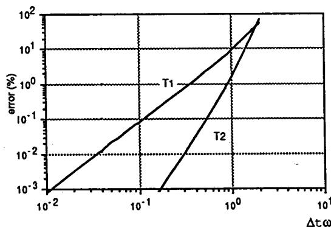  
Fig.2 Transformation errors from S-plane to Z-plane.

T1 bi-linear transformation T2 bi-third transformation

The synthesized gain function in equation(3) can be transformed into the z-plane by substituting equation(7) or (8) into it. For bi-linear transformation, the Z-transform of the gain function is then

$$
R (z) = \frac {G _ {0} + \sum_ {k = 1} ^ {2 n} G _ {k} z ^ {- k}}{1 + \sum_ {k = 1} ^ {2 n} H _ {k} z ^ {- k}} \tag {11}
$$

and for the bi-third transformation,

$$
R (z) = \frac {Q _ {0} + \sum_ {k = 1} ^ {3 n} Q _ {k} z ^ {- k}}{1 + \sum_ {k = 1} ^ {3 n} J _ {k} z ^ {- k}} \tag {12}
$$

# Z-TRANSFORM MODEL OF THE TRANSFORMER WITH SECONDARY WINDING OPEN-CIRCUITED

The voltage applied to one winding of a transformer and its response on the other winding are related by

$$
V _ {r} (\omega) = \beta_ {n} (\omega) V _ {a} (\omega) \tag {13}
$$

where

$\mathbf{V}_{\mathbf{a}}(\omega)$ -the voltage applied to the primary winding,

$\mathbf{V}_{\mathbf{r}}(\omega)$ -the response on the secondary winding,

$\beta_{n}(\omega)$ -the normalized gain function.

If the transit time is neglected, $\beta_{n}(\omega)$ can be synthesized in the frequency domain and then transformed into the $z$ -plane to get

$$
\beta_ {n} (z) = \frac {G _ {O} + \sum_ {k = 1} ^ {N} G _ {k} z ^ {- k}}{1 + \sum_ {k = 1} ^ {N} H _ {k} z ^ {- k}} \tag {14}
$$

Transforming equation(13) into the Z-plane and then the time domain results in

$$
V _ {I} (n) = G _ {O} V _ {a} (n) + \sum_ {k = 1} ^ {N} G _ {K} V _ {a} (n - k) - \sum_ {k = 1} ^ {N} R _ {K} V _ {I} (n - k) \tag {15}
$$

where $n = 1,2,3,\ldots \ldots$

The response of the transformer to any impulse can be evaluated using this equation. The calculation starts from $t = 0$ and the time step for the recursive procedure is that used in the transformation of the gain function from the S-plane into the Z-plane.

# Inclusion of the Transit Time

Let $t$ be the transit time of the transformer, it can be written as

$$
t = \varepsilon \Delta t \tag {16}
$$

where $0 <   \varepsilon <  1$

Equation(13) is then modified and transformed into the Z-plane as

$$
V _ {r} (z) = \beta_ {n} (z) \quad \beta_ {\varepsilon} (z) V _ {a} (z) \tag {17}
$$

where $\beta_{\varepsilon}(z) = \exp \{-j\varepsilon \omega \Delta t\} = z^{-\varepsilon}$

Approximating $\mathsf{B_E}$ by the polynomial form:

$$
z ^ {- \varepsilon} = m _ {0} (\varepsilon) + m _ {1} (\varepsilon) z ^ {- 1} + \dots \dots + m _ {n} (\varepsilon) z ^ {- n} \tag {18}
$$

and further truncation gives:

$$
z ^ {- \varepsilon} = m _ {0} (\varepsilon) + m _ {1} (\varepsilon) z ^ {- 1} \tag {19}
$$

The response of the transformer is then

$$
V _ {r} (z) = \beta_ {n} (z) [ m _ {0} (\varepsilon) + m _ {1} (\varepsilon) z ^ {- 1} ] V _ {a} (z) \tag {20}
$$

Transforming equation (20) into the time-domain:

$$
\begin{array}{l} \begin{array}{r l} \mathrm {V} _ {\mathrm {r}} (i) & = \mathrm {m} _ {0} \mathrm {G} _ {0} \mathrm {V} _ {\mathrm {a}} (i) + (\mathrm {m} _ {0} \mathrm {G} _ {1} + \mathrm {G} _ {0} \mathrm {m} _ {1}) \mathrm {V} _ {\mathrm {a}} (i - 1) + \\ & \mathrm {m} _ {1} \mathrm {G} _ {N} \mathrm {V} _ {\mathrm {a}} (i - N + 1) \end{array} \\ + \sum_ {k = 2} ^ {N} \left(m _ {0} G _ {k} + A _ {1} G _ {k - 1}\right) V _ {a} (i - k) - \sum_ {k = 1} ^ {N} H _ {k} V _ {r} (i - k) \tag {21} \\ \end{array}
$$

The transit time of transformers is short, usually much less than $1\mu s$ . This is important for the study of transients involving lightning and chopped waves. For most switching surge calculations, ignoring the delay, t, may not cause significant errors.

# Z-TRANSFORM MODEL INCLUDING TRANSFORMER SHORT-CIRCUIT IMPEDANCES

The short-circuit impedance of a transformer is equal to its leakage impedance at low frequency and linear in the frequency range from 50Hz to a few kilohertz. As the frequency increases further, the impedance usually shows some resonances and anti-resonances. A typical short-circuit impedance is shown in Fig.3. Similar to the gain function, the short-circuit impedance can be

synthesized by the multi-product rational-fraction

$$
Z (s) = Z _ {0} \prod_ {k = 1} ^ {N} \frac {A _ {k} s ^ {2} + B _ {k} s + 1}{C _ {k} s ^ {2} + D _ {k} s + 1} \tag {22}
$$

where $Z_0$ is the leakage impedance of the transformer at 50 Hz.

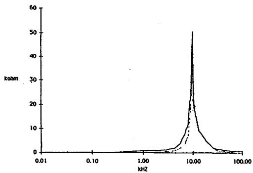  
Fig.3 S-plane synthesis of short circuit impedance

from the 200MVA auto-transformer from the frequency-weighted 2nd-order function synthesized in the S-plane.

Applying a procedure similar to that used for synthesis of the gain function, the short-circuit impedance in the Z-plane can be obtained

$$
Z (z) = \frac {Z _ {\mathrm {a}} + \sum_ {\mathrm {k} = 1} ^ {\mathrm {M}} \mathrm {E} _ {\mathrm {K}} z ^ {- \mathrm {k}}}{1 + \sum_ {\mathrm {k} = 1} ^ {\mathrm {M}} \mathrm {F} _ {\mathrm {K}} z ^ {- \mathrm {k}}} \tag {23}
$$

Our simulation results show that both the transfer function and the short-circuit impedance presented in Figs 1 and 3 can be approximated as minimum-phase-shift functions with reasonable accuracy. Stable synthesized functions were obtained by using the method suggested in [1].

# General Equations in the Z-plane

For two winding transformers, currents and voltages on both sides are related by

Zij(ω) Iij(ω) = Vj(ω) - βij(ω) Vj(ω) (24) and

Zj1(ω) Ij1(ω) = Vj(ω) - βj1(ω) Vj(ω) (25) where

$V_{i}$ and $V_{j}$ are voltages at node i and j respectively,

Iij is the current flowing into the transformer from node i and Iji is that from node j.

$\beta_{ij}(\omega) = \frac{V_j(\omega)}{V_j(\omega)}$ is the gain function when i side is open-circuited.

$\beta_{j1}(\omega) = \frac{V_{j}(\omega)}{V_{1}(\omega)}$ is the gain function when $j$ side is open-circuited.

$\mathbf{Z}_{ij}(\omega) = \frac{\mathbf{V}_j(\omega)}{\mathbf{I}_{ij}(\omega)}$ is the impedance of the transformer on i side when node j is short-circuited.

$\mathbf{Z}_{j1}(\omega) = \frac{\mathbf{V}_j(\omega)}{\mathbf{I}_{j1}(\omega)}$ is the impedance of the transformer on $j$ side when node $i$ is short-circuited.

It should be noted that although the short-circuit impedances and gain functions are all normalized with the turn ratio between the two windings, the gain functions, $\beta_{1j}(\omega)$ and $\beta_{ji}(\omega)$ , are not equal and nor are the short-circuit impedances, $Z_{1j}(\omega)$ and $Z_{j1}(\omega)$ . This is due to the distributed parameters of the winding which consist of a complicated structure. Only in the low frequency range, under about 5kHz, are the two equalities, $Z_{1j}(\omega) = Z_{ji}(\omega)$ and $\beta_{1j}(\omega) = \beta_{ji}(\omega)$ , correct. This can be seen in Fig.4, a comparison between the two gain functions of a 132kV transformer. For this reason, the conventional transformer model is not valid for the study of high frequency transients.

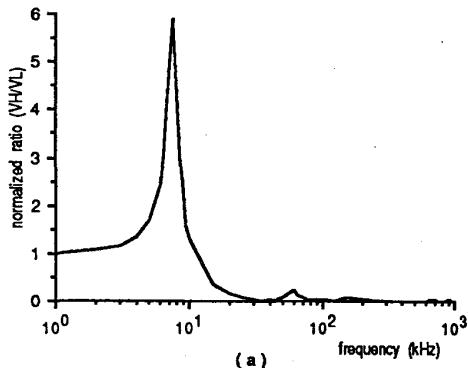

Fig.4 Normalized gain function of a 132kV transformer measured with a frequency variable sinusoid voltage applied at   
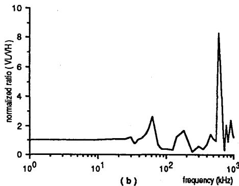  
(a) LV winding and (b) HV winding.

Transforming equation(24) and (25) into the z-plane gives

$$
Z _ {i j} (z) I _ {1 j} (z) = V _ {1} (z) - \beta_ {i j} (z) V _ {j} (z) \tag {26}
$$

$$
Z _ {j j} (z) I _ {j j} (z) = V _ {j} (z) - \beta_ {j j} (z) V _ {i} (z) \tag {27}
$$

where

$$
\begin{array}{l} \beta_ {i j} (z) = \frac {G _ {0} + \sum_ {k = 1} ^ {M} G _ {k} z ^ {- k}}{1 + \sum_ {k = 1} ^ {M} H _ {k} z ^ {- k}} \\ Z _ {i j} (z) = \frac {Z _ {0 1} + \sum_ {k = 1} ^ {N} E _ {k} z ^ {- k}}{1 + \sum_ {k = 1} ^ {N} F _ {k} z ^ {- k}} \\ \beta j 1 (z) = \frac {G _ {0} + \sum_ {k = 1} ^ {M} G _ {k} z ^ {- k}}{1 + \sum_ {k = 1} ^ {M} H _ {k} z ^ {- k}} \\ Z _ {j i} (z) = \frac {Z _ {0 j} + \sum_ {k = 1} ^ {N} E _ {k} z ^ {- k}}{1 + \sum_ {k = 1} ^ {N} F _ {k} z ^ {- k}} \\ \end{array}
$$

Since these two equations are symmetrical, equation(26) is taken as an example for the derivation of their time domain equations.

Let

$$
Z _ {1} j (z) I _ {1} j (z) = f _ {1} (z) \tag {28}
$$

and

$$
V _ {1} (z) - \beta_ {1} j (z) V _ {j} (z) = f _ {1} (z) \tag {29}
$$

Transforming equation(28) into the time domain

$$
I _ {1} + (n) = Y _ {0 1} f _ {1} (n) + g _ {1} (n - p) \tag {30}
$$

where

$$
\mathbf {Y} _ {0 1} = \mathbf {Z} _ {0 1} ^ {- 1}
$$

$$
g _ {i} (n - p) = Y _ {0 1} \sum_ {k = 1} ^ {N} \left[ F _ {k} f _ {i} (n - k) - E _ {k} I _ {i j} (n - k) \right]
$$

Transforming equation(29) into the time domain and re-arranging it

$$
\begin{array}{l} f _ {i} (n) = V _ {i} (n) - G _ {0} V _ {j} (n) + \sum_ {k = 1} ^ {M} H _ {k} [ V _ {i} (n - k) - f _ {i} (n - k) \\ - \sum_ {k = 1} ^ {M} G _ {k} V _ {j} (n - k) \tag {31} \\ \end{array}
$$

Substituting equation(31) into equation(30) to give

$$
I _ {1} j (n) = Y _ {0} I V _ {1} (n) - Y _ {1} V j (n) + X _ {1} (n - p) \tag {32}
$$

where

$$
\mathbf {Y} _ {1} = \mathbf {Y} _ {0 1} \mathbf {G} _ {0}
$$

$$
X _ {i} (n - p) = Y _ {0 i} \left\{\sum_ {k = 1} ^ {N} \left[ F _ {k} f _ {i} (n - k) - E _ {k} I _ {i j} (n - k) \right] \right.
$$

$$
+ \sum_ {k = 1} ^ {M} \left[ H _ {k} \left(V _ {1} (n - k) - f _ {1} (n - k)\right) - G _ {k} V _ {j} (n - k) \right]
$$

Similarly deriving from equation(27), the current on $j$ -side will be

$$
I _ {j 1} (n) = Y _ {0 j} V _ {j} (n) - Y _ {j} V i (n) + X _ {j} (n - p) \tag {33}
$$

where

$$
Y _ {j} = Y _ {0 1} G _ {0}
$$

$$
X _ {j} (n - p) = Y _ {0} j \left\{\sum_ {k = 1} ^ {N 1} \left[ E _ {k} f _ {j} (n - k) - E _ {k} I _ {j i} (n - k) \right] + \right.
$$

$$
\sum_ {k = 1} ^ {M 1} \left[ H _ {k} (V _ {j} (n - k) - f _ {j} (n - k)) - G _ {k} V _ {i} (n - k) \right]
$$

$$
\begin{array}{l} f _ {j} (n) = V _ {j} (n) - G _ {0} V _ {1} (n) + \\ \sum_ {k = 1} ^ {M 1} \left[ H _ {k} (V _ {j} (n - k) - f _ {j} (n - k)) - G _ {k} V _ {1} (n - k) \right] \\ \end{array}
$$

# A New Transformer Equivalent Circuit

It can be seen from equations (32) and (33) that the currents flowing into the transformer depend on the voltages on both sides and the coefficients, $\mathbf{F}_{\mathbf{k}}, \mathbf{E}_{\mathbf{k}}, \mathbf{H}_{\mathbf{k}}$ , and $\mathbf{G}_{\mathbf{k}}$ , which are dependent on the transformer distributed parameters. In order to get the equivalent circuit, these two equations can be further simplified as

$$
I _ {1 j} (n) = Y _ {0 i} V _ {i} (n) + W _ {j i} \tag {34}
$$

and

$$
I _ {j j} (n) = Y _ {0 j} V _ {j} (n) + W _ {i j} \tag {35}
$$

who?

$$
W _ {j i} = X _ {i} (n - p) - Y _ {i} V _ {j} (n)
$$

$$
W _ {i j} = X _ {j} (n - p) - Y _ {j} V _ {1} (n)
$$

The equivalent circuit of the transformer in the time domain corresponding to equation (34) and (35) is shown in Fig.5. The equivalent circuit is a comprehensive one which can be used with various boundary conditions.

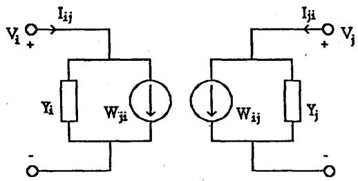  
Fig.5 Equivalent circuit of transformer winding pair in the time domain.

From equation(34) and (35), two special conditions can be analyzed. If the secondary winding of a transformer is open-circuited, i.e. $I_{ji}(n) = 0$ , the response of the transformer to the impulse applied at the primary winding will be

$$
V _ {j} (n) = G _ {0} V _ {1} (n) + \sum_ {k = 1} ^ {M 1} \left[ G _ {k} V _ {1} (n - k) - H _ {k} V _ {j} (n - k) \right] \tag {36}
$$

which is similar to equation(15).

For the study of low frequency transients, the normalized short-circuit impedances on both sides are equal, i.e. $Z_{ij} = Z_{ji} = Z_0$ , and so are the gain functions, i.e. $\beta_{ij} = \beta_{ji} = 1$ . The currents on both sides are equal but in opposite direction. Thus equations (26) and (27) become

$$
Z _ {0} (z) I _ {1 j} (z) = V _ {i} (z) - V _ {j} (z) \tag {37}
$$

and

$$
Z _ {0} (z) \quad I j _ {1} (z) = V _ {j} (z) - V _ {1} (z) \tag {38}
$$

respectively. They are the conventional equations used in the calculation of low-frequency transients in power systems.

It should be noted that similar to the derivation of equation(21), the transit time of the transformer can be also considered in equations(34) and (35).

# COMPUTATIONAL RESULTS

# Transformers with secondary winding open-circuited

For a 200MVA, single-phase auto-transformer rated 525kv to 345kv with a 13.8kv tertiary winding, the measured gain function and short-circuit impedance were available[2]. In the measurements, variable frequency excitation from a function generator was applied between the high voltage terminal and ground, labelled V1. The voltage across the tapping winding was monitored and was denoted by V2. The frequency response characteristics were obtained by determining the ratio V2/V1 at each frequency of interest. At low frequencies, this ratio was equal to the turns ratio between the tap section and the full winding. At high frequencies, as the capacitance elements of the winding become important, this ratio differed significantly from the turn ratio, as shown in Fig.1. For the short-circuit impedance, the input voltage and current at the HV terminal were measured and ratios taken at various frequencies. The frequency dependence of the short-circuit impedance is depicted in Fig.3.

It can be seen from Fig.1 that the principal resonance frequency is $29\mathrm{kHz}$ . At that frequency the gain function peaks at 11.2 per unit of the normal turns ratio level. Above the first resonance point, two higher frequency resonances appear at $50\mathrm{kHz}$ and $80\mathrm{kHz}$ . Anti-resonances at $46\mathrm{kHz}$ and $60\mathrm{kHz}$ separate the three resonances. At the anti-resonance frequencies, the voltage V2 is less than $10\%$ of the turns ratio. Compared with the gain function, the variation of the short-circuit impedance is simpler. Only one resonance was found under $100\mathrm{kHz}$ .

The gain function and short-circuit impedance were synthesized in the s-plane using the Quasi-Newton method. After transforming into the z-plane, all the coefficients in equation(26) were determined. Transient responses of the transformer to various impulse energization were calculated for different boundary conditions.

The response of the transformer to a full wave impulse(1.5/40μs) calculated with the method described here is plotted in Fig.6(a). The oscillation frequency of the calculated responses is 29kHz, the same as that measured. The agreement between the measured and the calculated results was reasonably good. Since values of the gain function above 100kHz were not available, an estimate was made which resulted in a discrepancy in the calculated response. Fig.6(b) gives the response of the transformer to an impulse of 75/800μs, simulating a switching surge. Fig.6(c) shows the response to a cosine wave impulse starting at the peak of one unit. For the same reason mentioned above, the peak voltage of the response may not be accurate, but after the high frequency component dies out, the wave is simply a cosine wave with the peak of one unit which gives good accuracy and long time stability of this Z-transformer model.

# FUTURE WORK

Some difficulties exist in synthesizing the gain function and short-circuit impedance which have complicated determination of the frequency characteristics. A new technique to determine the s-plane functions is being examined and may be able to solve this problem. In order to combine the z-transform model with the usual EMT program, further calculations must be completed. It is hoped to set up a simplified procedure for this purpose.

# CONCLUSIONS

The Z-transform model developed in the paper provides a new technique for analyzing power system electromagnetic transients in which the frequency characteristics of transformers are considered. The inclusion of the short-circuit impedance into the model makes it possible to use it for different boundary conditions.

The new equivalent circuit of transformers is similar to that of transmission lines in the Bergeron method commonly used in the calculation of electromagnetic transients in power systems. The proposed circuit, in conjunction with those of other components (transmission line, switch...etc), may be used to form a composite model to represent most power systems. Employing this model, many of the principal effects due to switching and lightning over-voltages may be assessed.

The formulations of the Z-transform model of transformers lend themselves easily to programming, and in many cases can lead to the actual sequences of numerical solution. Compared with the usual ladder network equivalent circuits of transformers, this model has the advantage of short computing time and small storage requirements, good accuracy and high stability in solutions.

# ACKNOWLEDGMENTS

The authors are grateful to Professor W.D. Humpage for his encouraging to publish the work presented in this paper. The discussions with Dr. K.P. Wong and Dr. T.T. Nguyen were valuable and much appreciated.

# REFERENCES

[1] W.D. Humpage, "Z-transform electromagnetic transient analysis in high-voltage networks", IEEE Power Engineering, Series 3.   
[2] W.J.Mc Nutt, T.J.Bnalock, R.A.Hinton, "Response of transformer windings to system transient voltages", IEEE PAS, Vol.93, March/April 1974, pp.456-467.   
[3] M.D'Amore and M.Salerno, "Simplified model for simulating transformer windings subject to impulse voltage", IEEE PES text of abstract papers, Summer meeting, Vancouver 1979.   
[4] S.Cristina, M.D'Amore and M.Salerno, "Digital simulator of transformer winding subject to impulse voltage", IEEE Proc, vol.129, pt. C., No.4, July 1982, pp172-176.   
[5] P.A.Abetti, "Transformer models for the determination of transient voltages", AIEE Transactions, Part III, PAS, vol.72, June 1953, pp.468-475.   
[6] W.D. Humpage, K.P. Wong, and T.T. Nguyen, "Z-transform electromagnetic transient analysis in

power systems", Proc.IEE, C, 1980, 127,(6), pp.370-378.   
[7] P.I. Fergestad and T. Henriksen, "Transient oscillations in multiwinding transformers", IEEE PAS, Vol.93, no.2, 1974, pp.500-509.   
[8] H.B.Margolis, J.D.M. Phelps, A.A.Carlamagrio, A.S.McElroy, "Experience with part winding resonance in EHV auto-transformers: diagrams and corrective measures", IEEE PAS, Vol.94, No.4, July/August 1975, pp.1294-1300.   
[9] A.K. Bose, "Frequency response of transformer windings", Electrochniek, Vol.64, No.1, Jan.1986, p.71-8.   
[10] A.O. Soysal and M.K. Sarioglu, "A synthetic method for modelling transformer windings in the study of system switching transients", IEEE Trans. No.3, 1985, p134-138.

Q. Su was born in Wuhan, China in 1947. He completed his B.E. in 1969 in the University of Central China and his M.Eng.Sc in 1981 in Wuhan University of Hydraulic and Electrical Engineering. After 1970 he worked with two major electricity authorities for 8 years doing research in High Voltage Engineering. From 1982 to 1984 he was a lecturer in WUHEE and then joined the University of Western Australia working as a Honorary Research Associate for a year. Since 1986 he has undertaken full-time research at the University of New South Wales for a Ph.D degree. His main research interests are electromagnetic transients, overvoltage protection in power systems, partial discharge detection and location in transformers and generators and application of digital signal processing techniques to power systems.

R.E. James is a graduate of London University (1950) and was awarded a Ph.D in 1974. He worked in the U.K. transformer manufacturing industry for 13 years and at Portsmouth Polytechnic before joining the University of New South Wales in 1974. He is a Senior Lecturer with special interests in High Voltage Engineering. His various activities include acting as Convener of WG 15-01 of CIGRE Study Committee 15 "Insulating Materials" on which he has represented Australia for the past 7 years. He is a member of several national Standards Committees, MIEEE, Fellow of the Institution of Engineers (Australia), and MIEE (UK).

D. Sutanto was born in Jakarta in 1952. He received the B.Eng degree with first class honours and Ph.D in Electrical Engineering from the University of Western Australia in 1977 and 1980 respectively. In 1980-1982 he was employed as a Power System Analyst by GEC Australia. During that time he participated in the design of harmonic filters, static compensators and frequency changers for various mining organisations. In 1982 he joined the University of New South Wales where he is currently a Senior Lecturer in the Electrical Power Department. His main research interests are power system planning, power system analysis, power system harmonics, computer graphics and energy economics. He is a Senior Member of IEEE.

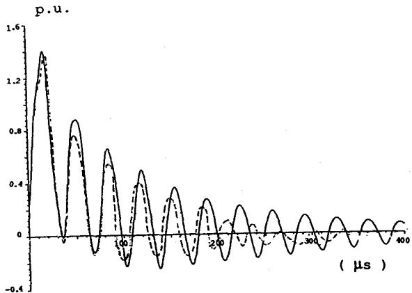  
(a)

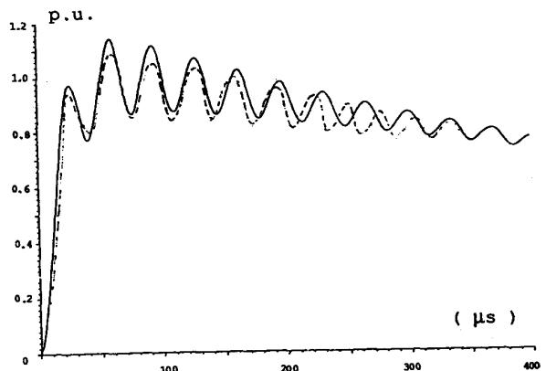  
(b)

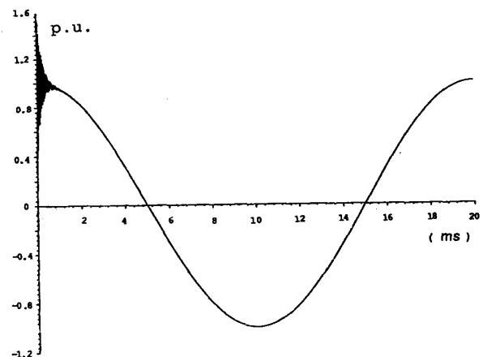  
（c）  
Fig.6 Responses of the 200MVA auto-transformer with open-circuited secondary winding to

(a) 1.5/40μs full impulse,   
(b) $75 / 800\mu s$ switching impulse and   
(c) $50\mathrm{Hz}$ cosine impulse starting at maximum voltage.

calculated. ---- measured.

Transformers with secondary winding connected to other circuits

When a transformer is connected to other networks, its impulse responses cannot be determined only by its gain function obtained at open-circuit boundary condition. The short-circuit impedance must be considered as well. The transformer with its secondary winding connected to a transmission line was taken as an example. The assumptions were made that the characteristic impedance of the transmission line was 400ohms and its length infinite. The Transit time of the transformer was short and hence was neglected. Figures 7(a) and 7(b) show the calculated responses of the transformer-line system to full wave impulse(1.5/40μs) and switching impulse(75/800μs) respectively. Compared with Fig.6(a) and 6(b), the transients in Fig.7 show a lower maximum value and different oscillation frequencies. It can be noted that since the magnitudes of the high frequency components of the switching impulse are smaller than those of the full wave impulse, the short-circuit impedance, which has a peak value of 52kilo-ohms at 10kHz, has less affect on the responses.

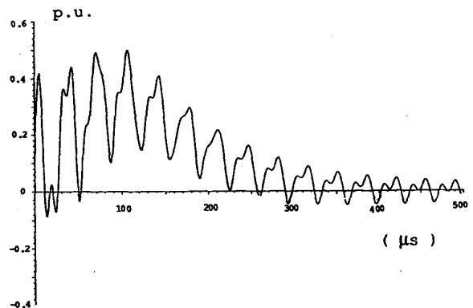  
(a)

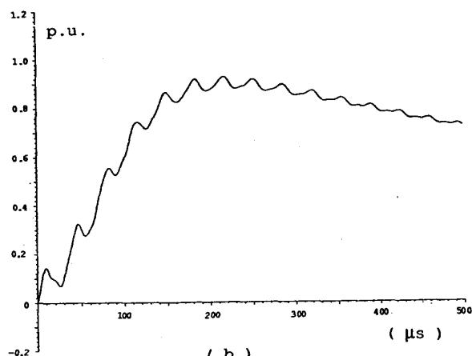  
Fig.7 Calculated responses of the 200MVA autotransformer to

(a) 1.5/40μs full impulse and   
(b) $75 / 800\mu s$ switching impulse.

The secondary winding is connected to a infinity transmission line.