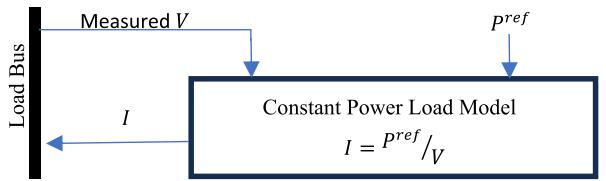
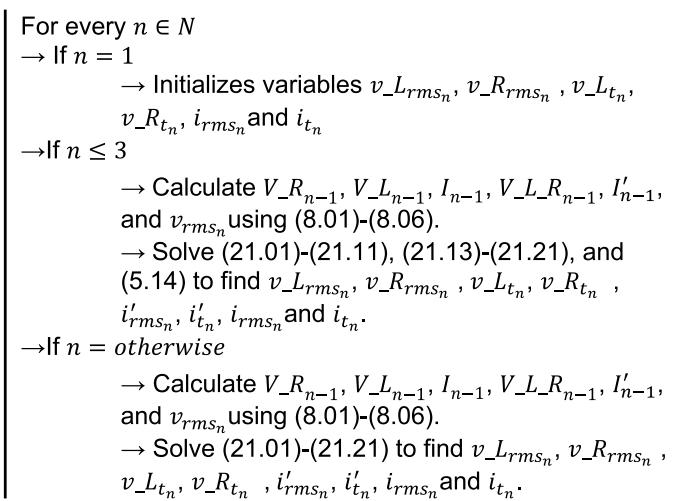
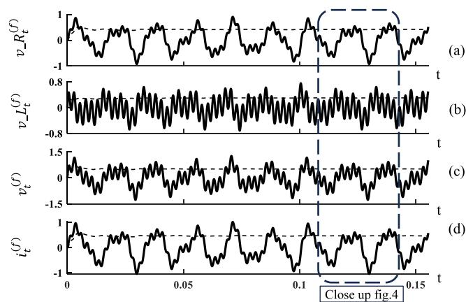
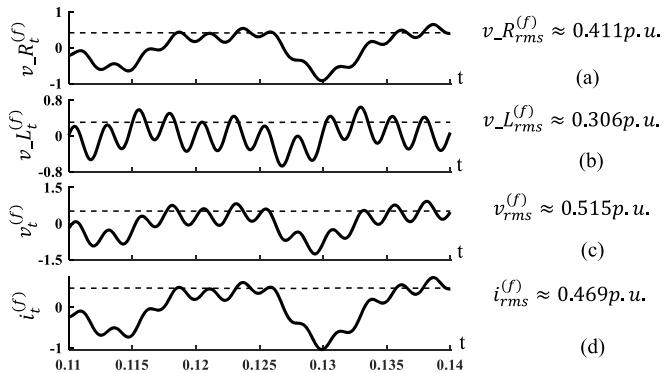
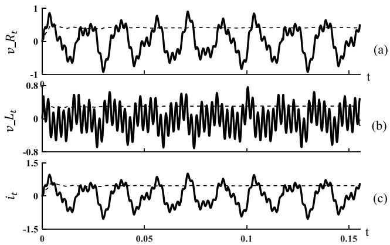
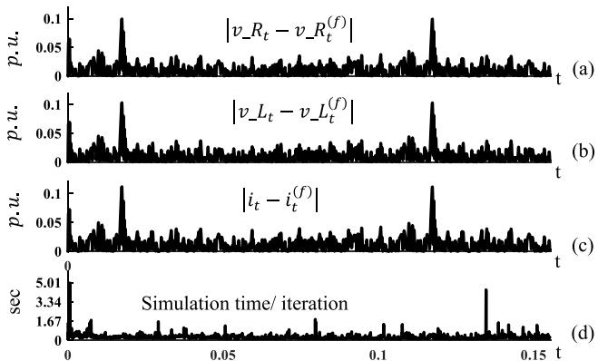
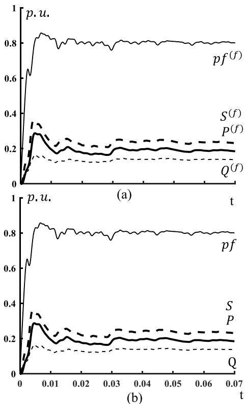

# Modeling of inductive constant power load for electromagnetic-transient simulations–Part II

Kamel Alboaouh a,* , Yaswanth Nag Velaga b , Kumaraguru Prabakar c

a Dept.of Eng.Tech, Norfolk State Univ., 700 Park Ave,RTC Building,Suite 420M, Norfolk VA 23501, USA   
b Power Syst.Eng.Center, Nat.Renewable Energy Lab., Golden CO, USA   
c Power Syst.Eng.Center, Nat. Renewable Energy Lab., Golden CO,USA

# A R T I C L E I N F O

Keywords:

EMT simulator

Constant-power-load

Numeric modeling

Load modeling

# A B S T R A C T

This paper improves the dynamic constant power (CP) load model that was published in Part I, which is appropriate for electromagnetic-transient (EMT). The improved model conserves all features of its predecessor. For instance, it maintains a fixed power consumption (both active and reactive parts) and a fixed power factor for loads that are predominantly inductive. Furthermore, as the proposed model is a time-dependent system, it is applicable to both sinusoidal and non-sinusoidal case studies. However, the previous model cannot be easily integrated with numeric solvers because it simulated load data over one cycle all together, not sequentially in a time-step manner, due to the limitation involved with the power factor. The improved version, on the contrary, allows the load to be simulated at every time step, which would facilitate its integration with numeric solvers. The model’s validity is confirmed by comparing its response with data that is synthesized from constant impedance load, and the result is satisfactory.

# 1. Introduction

In EMT simulation, it is very important to select a suitable mathematical model of loads to represent the actual load profile [1]. Otherwise, inaccurate load modeling could lead to catastrophic outcomes [2] and collapse [3] due to imprecise simulation results. Thus, practitioners follow these steps to adopt the appropriate load model: (i) identify the load structure that closely aligns with reality, (ii) select the appropriate mathematical load model for the concerned structure, and (iii) determine the model’s parameters [3].

While the literature had classified mathematical load models in various ways, the reference [4] classified them as either static, dynamic, composite, or artificial neural network-based (ANN-based) models. Dynamic load models are time-dependent whereas static models are not, despite the fact that they both are functions of voltage and frequency [5]. There are multiple ways to form composite load models such as by combining both static and dynamic load models. On the other hand, ANN-based load models rely solely on measured data to align with observed system behaviors [4]. After selecting one of the previously mentioned structures, its parameter values can be estimated or identified using either component-based or measurement-based methods [4]. The former method, also known as a "bottom-up" approach, begins with

the individual components of the load composition, such as the percentage of load consumed by each type of load’s components. The latter method employs a "top-down" technique by utilizing measured data to estimate the model’s parameters [4].

This study improves the dynamic CP load model in [5] to make it more compatible with EMT simulators. Such a dynamic CP load model is widely used in EMT studies, as suggested in [6], because it acceptably represents a variety of loads like tightly controlled converters or thermostatically controlled air conditioners [7]. Many EMT-featured software adopt different modeling of CP loads such as in PSCAD, LTspice, Matlab-Simulink, or PSSE to accommodate various applications. These software are mainly modeling CP load by dividing the desired-power value by the measured-voltage value (which is dictated by the rest of the electric system) at the designated bus to obtain the current value (in ampere) that shall be drawn (or absorbed) from (or to) the grid to satisfy fixed power consumption constraints [5], (Fig. 1). Unfortunately, this modeling technique is not applicable to non-sinusoidal AC systems.

More sophisticated methods to model the dynamic CP load were reported in the literature by modeling it as an interfacing power electronic converter [8] or by regulating both conductance and susceptance to cancel out voltage’s fluctuations [9] to accommodate harmonic components in the grid; However, such solutions were dependent on

  
Fig. 1. A generic demonstration of load modeling using a CP load model that can be integrated with EMT simulations; frequency and time-variables are omitted for simplicity - adopted from [5].

modulation algorithm which would add more complexity to the system and did not offer fixed power factor (fixed-PF). An effort to incorporate fixed-PF constraint in the CP load model (in addition to other constraints) was reported in $[ 5 ] ^ { 1 }$ for inductive loads; It was, also, based on the time domain and, thus, compatible with both sinusoidal and non-sinusoidal case studies. However, the model in [5] could not be incorporated easily in EMT simulator because the latter processes data differently; For further illustration, the disparity stems from the fact that the model in [5] solves all time instants over one cycle (or a definite interval in time) at once whereas EMT simulators generate a solution after every time-step – refer to SubSection 2.1 for more details. Thus, the contribution of this work is to improve the model in [5] such that it can be solved at every time-step to facilitate its integration with EMT simulators.

This paper is organized such that Sections $2 , 3 ,$ and 4 present the development and derivation of the proposed CP load model, while its final formulation is shown in Section 5. Note that this paper is an extension of previous work [5]. Thus, to build a coherent mathematical argument, the mathematical model in [5] is recreated in this paper for convenience and amended as the derivation discussion progresses, whereas the notations are kept the same to ease comparison effort for the readers. The simulation and discussion using synthesized data from a constant impedance (CI) load are presented in Section $^ { 6 , }$ followed by a conclusion in Section 7.

# 2. Inductive CP load model: derivation & development

# 2.1. Reconciliation between EMT and power quantities

In EMT simulation, the data are simulated sequentially by starting from known initial conditions. For instance, the instantaneous current value $i _ { t _ { n } }$ at $n ^ { t h }$ time instant $t _ { n }$ (the subscript n is an index representing the time instant’s number within a definite interval in time) is obtained using the previous value $i _ { t _ { n - } }$ (and may be in addition to instantaneous values of other variables) that had already been calculated during the previous time instant $t _ { n - 1 }$ whereas the time-step between $t _ { n }$ and $t _ { n - 1 } \mathrm { i } s$ s minimal. On the other hand, the root-mean-square (RMS) quantities are defined based on all instantaneous data points over a complete cycle. For instance, the current RMS value $i _ { r m s }$ is defined based on all instantaneous values i (the subscript n is removed to represent an unknown time instant) within a cycle in accordance to (1). Similarly, the fixed-PF [denoted as pf in (2)] is a quantity defined based on other RMS values as shown in (2): namely RMS voltage $\nu _ { r m s } ,$ , RMS current $i _ { r m s } ,$ and active power P. Note that active $P ,$ reactive $Q ,$ and apparent S power themselves are defined based on RMS quantities as they will be discussed later in this document.

$$
\left(i _ {r m s}\right) ^ {2} n = \sum_ {k = 1, k \in N} ^ {k = n} \left(i _ {t _ {k}}\right) ^ {2} \tag {1}
$$

$$
p f i _ {r m s} v _ {r m s} = P \tag {2}
$$

In the above equations, the subscript k refers to the $k ^ { t h }$ sampled (or

discretized) value of the associated variable, while the set N includes all values that are sampled over a definite interval, as defined in (3).

$$
N = \{1, 2, \dots , k, \dots , n, \dots \} \tag {3}
$$

Based on the above discussion, it can be noticed that EMT simulation and RMS quantities - such as pf, P, Q, or S - are not in harmony with each other’s because the former finds the solution at a specific time instant while the latter is dependent on all instant values within a cycle. Thus, if the CP load model is a function of RMS quantities, as in [5], it cannot be easily embedded in EMT simulators due to its inharmoniousness with RMS quantities.

The proposed CP load model in [5] is developed such that all instantaneous quantities over one cycle are solved all at once, making its integration with EMT simulators difficult. In the following sections, the CP load model in [5] will be revisited and edited such that it can be simulated sequentially in a suitable manner to EMT simulators.

# 2.2. Common ground between CI and CP load

Only if the magnitude of bus voltage level and power (in watt) consumption are the same, a CP load’s current (in amperes) will be equal to its counterpart in a CI load. Hence, the CP load model can be formulated using the applicable laws for a CI load under the constraints of equal power consumption and electric potential. Therefore, in the subsequent sections, such common ground between CP and CI load models will be utilized to develop an EMT model for CP loads.

# 2.3. Kirchhoff laws - instantaneous quantities

If the CI load consists of resistor and inductor in series (RL circuit), its Kirchhoff’s laws (known in textbooks as KCL and KVL) will be as shown in (4) and (5.01).

$$
\forall k \in N: i _ {t _ {k}} = i _ {-} R _ {t _ {k}} = i _ {-} L _ {t _ {k}} \tag {4}
$$

$$
\forall k \in N: v _ {t _ {k}} = v _ {-} R _ {t _ {k}} + v _ {-} L _ {t _ {k}} \tag {5.01}
$$

Both $\nu _ { t }$ and i denote the instantaneous voltage and current, respectively. The notations $i _ { - } L _ { t }$ and $i . R _ { t }$ represent the current of inductive and resistive elements whereas $\nu _ { - } R _ { t }$ and $\nu _ { - } L _ { t }$ denote the voltage. Note that the subscript $t _ { k }$ denotes the $k ^ { t h }$ value that is sampled from the respective instantaneous variable.

# 2.4. Kirchhoff laws - RMS quantities

Let $i _ { r m s } , \nu _ { - } R _ { r m s } ,$ , and $\nu \_ L _ { r m s }$ denote the RMS values of load current, resistive voltage, and inductive voltage, respectively. Thus, these RMS quantities can be defined as shown in (1), (6), and (7).

$$
\left(\nu_ {-} R _ {r m s}\right) ^ {2} n = \sum_ {k = 1, k \in N} ^ {k = n} \left(\nu_ {-} R _ {t _ {k}}\right) ^ {2} \tag {6}
$$

$$
\left(v _ {\text {L} _ {r m s}}\right) ^ {2} n = \sum_ {k = 1, k \in N} ^ {k = n} \left(v _ {\text {L} _ {t _ {k}}}\right) ^ {2} \tag {7}
$$

If we introduce the dummy voltage variables V $. R _ { n }$ and $V \lrcorner L _ { n - }$ and the dummy current $I _ { n - 1 }$ variable. Then, Eqs. (1), (6), and $( 7 )$ can be reexpressed, or decomposed, as shown in (5.02)-(5.04) and in (8.01)- (8.03). Note that v ${ R } _ { r m s _ { n } } , \nu _ { - } { L } _ { r m s _ { n } }$ , and $i _ { r m s _ { n } }$ denote the RMS value up to $n ^ { t h }$ time instant $t _ { n } .$ .

$$
\left(\nu_ {-} R _ {r m s _ {n}}\right) ^ {2} n = \left(\nu_ {-} R _ {t _ {n}}\right) ^ {2} + V _ {-} R _ {n - 1} \tag {5.02}
$$

$$
\left(\nu_ {-} L _ {r m s _ {n}}\right) ^ {2} n = \left(\nu_ {-} L _ {t _ {n}}\right) ^ {2} + V _ {-} L _ {n - 1} \tag {5.03}
$$

$$
\left(\boldsymbol {i} _ {\text {r m s} _ {n}}\right) ^ {2} \boldsymbol {n} = \left(\boldsymbol {i} _ {t _ {n}}\right) ^ {2} + I _ {n - 1} \tag {5.04}
$$

$$
V _ {-} R _ {n - 1} = \sum_ {k = 1, k \in N} ^ {k = n - 1} \left(v _ {-} R _ {t _ {k}}\right) ^ {2} \tag {8.01}
$$

$$
V _ {L} L _ {n - 1} = \sum_ {k = 1, k \in N} ^ {k = n - 1} \left(v _ {L} L _ {t _ {k}}\right) ^ {2} \tag {8.02}
$$

$$
I _ {n - 1} = \sum_ {k = 1, k \in N} ^ {k = n - 1} \left(i _ {t _ {k}}\right) ^ {2} \tag {8.03}
$$

If the (5.01), (6), (7), and (9.01) are substituted in each other, the resulting relationship can be expressed in (9.02). [Note that (9.01) represents the RMS voltage]

$$
\left(v _ {r m s}\right) ^ {2} n = \sum_ {k = 1, k \in N} ^ {k = n} \left(v _ {t _ {k}}\right) ^ {2} \tag {9.01}
$$

$$
\left(v _ {r m s}\right) ^ {2} = \left(v _ {-} R _ {r m s}\right) ^ {2} + \left(v _ {-} L _ {r m s}\right) ^ {2} + \frac {2}{n} \sum_ {\substack {k = 1 \\ k \in N}} ^ {k = n} \left(v _ {-} R _ {t _ {k}} v _ {-} L _ {t _ {k}}\right) \tag{9.02}
$$

By introducing V L $R _ { n - 1 } ,$ we can re-express (9.02) as in (5.05) and (8.04).

$$
\left(\nu_ {r m s _ {n}}\right) ^ {2} = \left(\nu_ {-} R _ {r m s _ {n}}\right) ^ {2} + \left(\nu_ {-} L _ {r m s _ {n}}\right) ^ {2} + \frac {2}{n} \left[ \left(\nu_ {-} R _ {t _ {n}} \nu_ {-} L _ {t _ {n}}\right) + V _ {-} L _ {-} R _ {n - 1} \right] \tag {5.05}
$$

$$
V _ {-} L _ {-} R _ {n - 1} = \sum_ {k = 1, k \in N} ^ {k = n - 1} \left(\nu_ {-} R _ {t _ {k}} \nu_ {-} L _ {t _ {k}}\right) \tag {8.04}
$$

# 2.5. Ohm’s law for both instantaneous and RMS quantities

Based on Ohm’s law, (10) and (11) are applicable to CI load. Note that the derivative of $i _ { t }$ is denoted by iʹ .

$$
\forall k \in N: v _ {-} R _ {t _ {k}} = R i _ {t _ {k}} \tag {10}
$$

$$
\forall k \in N: v _ {-} L _ {t _ {k}} = L i _ {t _ {k}} \tag {11}
$$

The above equations can be extended to involve RMS quantities of CI load in (12)–(14). Note that $i _ { m s } ^ { \prime }$ denotes the RMS of $i _ { t } ^ { \prime }$ within the set N.

$$
\nu_ {-} R _ {r m s} = R i _ {r m s} \tag {12}
$$

$$
\nu_ {-} L _ {r m s} = L i _ {r m s} \tag {13}
$$

$$
\left(i _ {r m s} ^ {\prime}\right) ^ {2} n = \sum_ {k = 1, k \in N} ^ {k = n} \left(i _ {t _ {k}} ^ {\prime}\right) ^ {2} \tag {14}
$$

If (10) is divided by (12), (5.06) would be obtained and R would be eliminated. In a similar manner, (5.07) is obtained by dividing (13) by (11) to remove L.

$$
\forall k \in N: v _ {-} R _ {t _ {k}} i _ {r m s _ {n}} = i _ {t _ {k}} v _ {-} R _ {r m s _ {n}} \tag {5.06}
$$

$$
k \in N: v _ {-} L _ {t _ {k}} i _ {r m s} ^ {\prime} = i _ {t _ {k}} ^ {\prime} v _ {-} L _ {r m s _ {n}} \tag {5.07}
$$

By introducing $I _ { n - 1 } ,$ we can re-express (14) as in (5.08) and (8.05).

$$
\left(\mathbf {i} _ {\text {r m s} _ {n}} ^ {\prime}\right) ^ {2} n = \left(\mathbf {i} _ {\mathbf {t} _ {k}} ^ {\prime}\right) ^ {2} + \mathbf {I} _ {n - 1} ^ {\prime} \tag {5.08}
$$

$$
I _ {n - 1} ^ {\prime} = \sum_ {k = 1, k \in N} ^ {k = n - 1} \left(i _ {t _ {k}} ^ {\prime}\right) ^ {2} \tag {8.05}
$$

# 2.6. Power formulation, including power factor

(5.09)–(5.11) show the governing relations among the power factor,

reactive, and active powers of a CP load.2 Note that (5.10) is obtained by substituting (5.09) in (2). Keep in mind that P and Q denote active (in watt) and reactive (in VARS) powers, respectively.

$$
P _ {n} = i _ {r m s _ {n}} \nu_ {-} R _ {r m s _ {n}} \tag {5.09}
$$

$$
p f _ {n} v _ {r m s _ {n}} = v _ {-} R _ {r m s _ {n}} \tag {5.10}
$$

$$
Q _ {n} = i _ {r m s _ {n}} v \cdot L _ {r m s _ {n}} \tag {5.11}
$$

By denoting the instantaneous reactive, apparent, and active power quantities as $q _ { t } , s _ { t } ,$ and $p _ { t } ,$ respectively, then, energy conservation law can be applied to a CP load as shown in (15).

$$
\forall k \in N: s _ {t _ {k}} = p _ {t _ {k}} + q _ {t _ {k}} = i _ {t _ {k}} \left(\nu_ {-} R _ {t _ {k}} + \nu_ {-} L _ {t _ {k}}\right) \tag {15}
$$

It well known that definition of apparent power, S, is formulated as in (16). However, by substitution (1), (6), (7), (9.01), (5.09), and (5.11) in (16), then, S can be re-expressed and properly arranged as in (17).

$$
S _ {n} = v _ {r m s _ {n}} i _ {r m s _ {n}} \tag {16}
$$

$$
(S _ {n}) ^ {2} = \left(P _ {n}\right) ^ {2} + \left(Q _ {n}\right) ^ {2} + \frac {2}{(n) ^ {2}} \left[ \sum_ {k = 1, k \in N} ^ {k = n} \left(i _ {t _ {k}}\right) ^ {2} \right] \left[ \sum_ {k = 1, k \in N} ^ {k = n} \left(\nu_ {-} R _ {t _ {k}} \nu_ {-} L _ {t _ {k}}\right) \right] \tag {17}
$$

It is important to note that in the case of single-frequency sinusoidal waves, the third term on the right-hand side in (17) will be zero [5].

If we substitute (8.03) and (8.04) in (17) and properly arrange it, it can be reformulated as shown in (5.12).

$$
\left(S _ {n}\right) ^ {2} = \left(P _ {n}\right) ^ {2} + \left(Q _ {n}\right) ^ {2} + \frac {2}{(n) ^ {2}} \left[ \left(\left(i _ {t _ {n}}\right) ^ {2} + I _ {n - 1}\right) \left(v _ {-} R _ {t _ {n}} v _ {-} L _ {t _ {n}} + V _ {-} L _ {-} R _ {n - 1}\right) \right] \tag {5.12}
$$

# 3. Numeric differentiation

It stands to reason that the solver’s accuracy is directly proportional to the precision of the adopted numerical differentiation approach. Several methods for numeric differentiation were considered in [10], but the one adopted in this paper is "centered differencing," which may be implemented as in (18).

$$
\forall k \in N: i _ {t _ {k}} ^ {\prime} \left(t _ {k + 1} - t _ {k - 1}\right) = i _ {t _ {k + 1}} - i _ {t _ {k - 1}} \tag {18}
$$

During $k ^ { t h . }$ iteration, $i _ { t _ { k } } ^ { \prime }$ has to be calculated using (18) which is, unfortunately, dependent on the unknown value of $i _ { t _ { k + 1 } }$ . To resolve such an issue, the value of $i _ { t _ { k } } ^ { \prime }$ can be approximated to the average value o $i _ { t _ { k + 1 } } ^ { \prime }$ and $i _ { t _ { k - } } ^ { \prime }$ as appeared in (19).

$$
i _ {t _ {k}} ^ {\prime} = 0. 5 \left(i _ {t _ {k + 1}} ^ {\prime} + i _ {t _ {k - 1}} ^ {\prime}\right) \tag {19}
$$

By combining (18) and (19), we would get (20). To adjust (20) for $k ^ { t h }$ iteration, we would obtain (5.13).

$$
\forall k \in N: \left(i _ {t _ {k + 1}} ^ {\prime}\right) = 2 \frac {i _ {t _ {k + 1}} - i _ {t _ {k - 1}}}{\left(t _ {k + 1} - t _ {k - 1}\right)} - i _ {t _ {k - 1}} ^ {\prime} \tag {20}
$$

$$
\forall k \in N: \left(i _ {t _ {k}} ^ {\prime}\right) = 2 \frac {i _ {t _ {k}} - i _ {t _ {k - 2}}}{\left(t _ {k} - t _ {k - 2}\right)} - i _ {t _ {k - 2}} ^ {\prime} \tag {5.13}
$$

Unfortunately, (5.13) is suffering numerical instability, which will not be discussed in this paper - refer to [11] and for details. However, without delving into details, this numerical instability can be solved if Critical Damping Adjustment (CDA) method is utilized [11]. CDA, simply, uses backward Euler rule in the first two iterations to remove

numerical instability. Thus, (5.14) will be used to find $i _ { t _ { k } } ^ { \prime }$ during the first and second iterations whereas (5.13) will be used for the remaining iterations.

$$
i _ {t _ {k}} ^ {\prime} = \frac {i _ {t _ {k}} - i _ {t _ {k - 1}}}{\left(t _ {k} - t _ {k - 1}\right)} \tag {5.14}
$$

# 4. Additional constraints

Although the system in (5) represents all applicable laws to CP load, solvers could return valid mathematical answer but electrically impractical. Thus, the variables $i _ { m s _ { n } } , \nu _ { \bar { L } } { _ { t _ { n } } } , \nu _ { \bar { L } _ { n } } , i _ { t _ { n } } , \nu _ { \bar { L } } { _ { m s _ { n } } }$ and $\nu _ { - } R _ { r m s _ { t } }$ n have to be constrained such that the solver searches for a solution that is valid both electrically and mathematically. For instance, the RMS quantities must be constrained to be positive as in (5.15).

$$
0 \leq v _ {\neg} R _ {r m s _ {n}}, v _ {\neg} L _ {r m s _ {n}}, i _ {r m s _ {n}}, i _ {r m s _ {n}} ^ {\prime} \tag {5.15}
$$

Also, the magnitude of instantaneous quantities $\nu \_ L _ { t _ { n } } , \nu \_ R _ { t _ { n } }$ and $i _ { t _ { n } }$ can be constrained using its corresponding RMS quantity. This can be done by establishing virtual resistance $R _ { v i r t u a l }$ and inductance $L _ { v i r t u a l } .$ . Then, use $R _ { v i r t u a l }$ and $L _ { v i r t u a l }$ to correlate instantaneous quantities with their corresponding RMS quantities as in (5.16)–(5.19).

$$
\nu_ {-} R _ {r m s _ {n}} = R _ {\text {v i r t u a l}} i _ {r m s _ {n}} \tag {5.16}
$$

$$
\nu_ {-} L _ {r m s _ {n}} = L _ {\text {v i r t u a l}} \dot {l} _ {r m s _ {n}} ^ {\prime} \tag {5.17}
$$

$$
\nu_ {-} R _ {t _ {n}} = R _ {\text {v i r t u a l}} i _ {t _ {n}} \tag {5.18}
$$

$$
\nu_ {-} L _ {t _ {n}} = L _ {\text {v i r t u a l}} i _ {t _ {n}} \tag {5.19}
$$

The values of $L _ { v i r t u a l }$ and $R _ { v i r t u a l }$ must be constrained too. If (16) and (5.16) are substituted in (5.09), $R _ { v i r t u a l }$ can be constrained as in $_ { ( 5 . 2 0 ) }$ . Also, the solver can be constrained to search for a solution of $L _ { v i r t u a l }$ within the period $[ l _ { m i n } \leq L _ { v i r t u a l } \leq l _ { m a x } ] ,$ , see (5.21). It is good practice to chose $l _ { m i n }$ and $l _ { m a x }$ to be between 0.00 and 1.00 p.u., respectively. Otherwise, the user shall exercise an educated guess to estimate $l _ { m i n }$ and $l _ { m a x } .$

$$
R _ {\text {v i r t u a l}} = P _ {n} \left(v _ {\text {r m s} _ {n}} / S _ {n}\right) ^ {2} \tag {5.20}
$$

$$
l _ {\text {m i n}} \leq L _ {\text {v i r t u a l}} \leq l _ {\max } \tag {5.21}
$$

# 5. CP load model: formulation

In this section, the model that is presented in Sections 2, 3, and 4 shall be reformulated to fit numerical solvers. This can be attained by optimizing [minimization in this case] the objective statement in (21.01) for all iterations subjected to all constraints that are shown in SubSection 5.1. The constant $\beta$ is included in (21.01) to adjust the overall weight.

$$
\min  \left[ \beta \left(\sum_ {h = 1} ^ {h = 1 1} \left(\alpha_ {h}\right) ^ {2}\right) \right] \tag {21.01}
$$

The model in (21) will be solved iteratively for every data point $t _ { n }$ which will be dependent on the historical values from previous iteration $t _ { n - 1 } .$ . Also, for every iteration, the system in (21) is expecting inputs which are shown in SubSection 5.2. The overall iterative procedure is summarized in SubSection 5.3.

# 5.1. Constraints

The constraints (21.02)-(21.12) are obtained by incorporating the decision variables ∝ in (5). Note that if ∝ approaches zero, (5) remains true; For example, (21.02) will be identical to (5.02) if the decision (or control) variable ∝ decreases to zero. Note that the variables in bold are input to the system - refer to Section 5.2 for additional discussion.

$$
\left(\nu_ {-} R _ {r m s _ {n}}\right) ^ {2} \boldsymbol {n} + \alpha_ {1} = \left(\nu_ {-} R _ {t _ {n}}\right) ^ {2} + \boldsymbol {V} _ {-} \boldsymbol {R} _ {n - 1} \tag {21.02}
$$

$$
\left(v _ {-} L _ {r m s _ {n}}\right) ^ {2} \boldsymbol {n} + \alpha_ {2} = \left(v _ {-} L _ {t _ {n}}\right) ^ {2} + \boldsymbol {V} _ {-} \boldsymbol {L} _ {n - 1} \tag {21.03}
$$

$$
\left(\boldsymbol {i} _ {\text {r m s} _ {n}}\right) ^ {2} \boldsymbol {n} + \alpha_ {3} = \left(\boldsymbol {i} _ {t _ {n}}\right) ^ {2} + \boldsymbol {I} _ {n - 1} \tag {21.04}
$$

$$
\left(\boldsymbol {v} _ {\text {r m s} _ {n}}\right) ^ {2} = \left(\nu_ {-} R _ {\text {r m s} _ {n}}\right) ^ {2} + \left(\nu_ {-} L _ {\text {r m s} _ {n}}\right) ^ {2} + \frac {2}{\boldsymbol {n}} \left[ \left(\nu_ {-} R _ {t _ {n}} \nu_ {-} L _ {t _ {n}}\right) + \alpha_ {4} + \boldsymbol {V} _ {-} \boldsymbol {L} _ {-} \boldsymbol {R} _ {n - 1} \right] \tag {21.05}
$$

$$
\left(\boldsymbol {i} _ {\text {r m s} _ {n}} ^ {\prime}\right) ^ {2} \boldsymbol {n} + \alpha_ {5} = \left(\boldsymbol {i} _ {\boldsymbol {n}} ^ {\prime}\right) ^ {2} + \boldsymbol {I} _ {\boldsymbol {n} - 1} ^ {\prime} \tag {21.06}
$$

$$
\begin{array}{l} \left(\boldsymbol {S} _ {n}\right) ^ {2} = \left(\boldsymbol {P} _ {n}\right) ^ {2} + \left(\boldsymbol {Q} _ {n}\right) ^ {2} \\ + \frac {2}{(\boldsymbol {n}) ^ {2}} \left[ \left(\left(\boldsymbol {i} _ {t _ {n}}\right) ^ {2} + \boldsymbol {I} _ {n - 1}\right) \left(\nu_ {-} R _ {t _ {n}} \nu_ {-} L _ {t _ {n}} + \boldsymbol {V} _ {-} \boldsymbol {L} _ {-} \boldsymbol {R} _ {n - 1}\right) + \alpha_ {6} \right] \tag {21.07} \\ \end{array}
$$

$$
\boldsymbol {p f} _ {n} \nu_ {\text {r m s} _ {n}} + \alpha_ {7} = \nu_ {-} R _ {\text {r m s} _ {n}} \tag {21.08}
$$

$$
\boldsymbol {v} _ {t _ {k}} + \alpha_ {8} = v _ {-} R _ {t _ {n}} + v _ {-} L _ {t _ {n}} \tag {21.09}
$$

$$
\nu_ {-} L _ {r m s _ {n}} = \alpha_ {9} + L _ {\text {v i r t u a l}} i _ {r m s _ {n}} \tag {21.10}
$$

$$
\nu_ {-} L _ {t _ {n}} = \alpha_ {1 0} + L _ {\text {v i r t u a l}} i _ {t _ {n}} \tag {21.11}
$$

$$
\left(\dot {i} _ {t _ {n}} ^ {\prime}\right) + \alpha_ {1 1} = 2 \frac {\dot {i} _ {t _ {n}} - \dot {i} _ {t _ {n - 2}}}{\left(\boldsymbol {t} _ {n} - \boldsymbol {t} _ {n - 2}\right)} - \dot {i} _ {t _ {n - 2}} ^ {\prime} \tag {21.12}
$$

The constraints (21.13)–(21.21) are adopted from (5) and they will be utilized as exact constraints (without the inclusion of decision variable ∝) to speedup computational time and to improve accuracy.

$$
\nu_ {-} R _ {t _ {n}} i _ {r m s _ {n}} = i _ {t _ {n}} \nu_ {-} R _ {r m s _ {n}} \tag {21.13}
$$

$$
v _ {-} L _ {t _ {n}} i _ {r m s} ^ {\prime} = i _ {t _ {n}} ^ {\prime} v _ {-} L _ {r m s _ {n}} \tag {21.14}
$$

$$
0 \leq v _ {-} R _ {r m s _ {n}}, v _ {-} L _ {r m s _ {n}}, i _ {r m s _ {n}}, i _ {r m s _ {n}} ^ {\prime} \tag {21.15}
$$

$$
l _ {\min } \leq L _ {\text {v i r t u a l}} \leq l _ {\max } \tag {21.16}
$$

$$
R _ {\text {v i r t u a l}} = \boldsymbol {P} _ {n} \left(\boldsymbol {v} _ {\text {r m s} _ {n}} / \boldsymbol {S} _ {n}\right) ^ {2} \tag {21.17}
$$

$$
\boldsymbol {P} _ {n} = i _ {r m s _ {n}} \nu_ {-} R _ {r m s _ {n}} \tag {21.18}
$$

$$
Q _ {n} = i _ {r m s _ {n}} v _ {-} L _ {r m s _ {n}} \tag {21.19}
$$

$$
\nu_ {-} R _ {r m s _ {n}} = R _ {\text {v i r t u a l}} i _ {r m s _ {n}} \tag {21.20}
$$

$$
\nu_ {-} R _ {t _ {n}} = R _ {\text {v i r t u a l}} i _ {t _ {n}} \tag {21.21}
$$

# 5.2. Input values

The quantities $S , Q , P ,$ and pf are inputs to the CP load model (21) at every iteration.3 Also, the Eqs. (8.01)–(8.06) shall be updated after every iteration and to be fed as an input in the succeeding iteration. If the system in (21) is incorporated with larger electric system, the instantaneous voltage at the bus $\nu _ { t }$ will be dictated by all other components. Thus, vt is considered an input quantity to the proposed CP load model; Its RMS quantity $\nu _ { r m s _ { n } }$ can be evaluated using (9.01) after every iteration, which is re-expressed in (8.06) for convenience.

$$
\left(\nu_ {r m s _ {n}}\right) ^ {2} n = \sum_ {k = 1, k \in N} ^ {k = n} \left(\nu_ {t _ {k}}\right) ^ {2} \tag {8.06}
$$

# 5.3. Iterative procedure

The proposed system in (21) shall be solved iteratively whereas the solution during $t _ { n - 1 }$ is utilized to solve the system at $t _ { n } ,$ and so on. However, to avoid numerical instability, backward Euler rule in (5.14) will be used instead of using (21.12) only during 2nd and 3rd iteration. A pseudocode is shown in Fig. 2 to solve the system in (21).

In the case that data are initialized to be zero during 1st iteration, a division by zero could happen in Eq. (21.17). To avoid such scenario, related constraints can be removed during 2nd iteration only: namely, (21.17), (21.20), and (21.21).

# 6. Simulation: setup, hypothesis, result, & discussion

Data synthesization requirements for CP load: Data shall be generated such that when CP load is simulated using vt waveform over an interval, ${ \mathsf { s a y } } [ 0 , t ] ,$ its $i _ { t }$ waveform shall imitate an inductive load response; and constant power consumption requirements to be satisfied.

Why the CI load is utilized as a reference system? Although CI and CP loads respond differently, their responses will match if they consume the same power and are subjected to the same voltage. For this reason, the CI load is chosen to create the reference data for the CP load, under the aforementioned assumptions.

Underlying hypothesis: A non-sinusoidal vt shall be applied to CI load whose resistance and inductance are known. Then, CI load’s response will be obtained: namely, v $L _ { t } , \nu _ { - } R _ { t } ,$ and $i _ { t }$ waveforms. The obtained data will be used to compute $Q , P ,$ and $p f$ according to (5.09), (5.10), and (5.11). Up to this point, the synthesization of reference data is complete. Then, similar to [5], this hypothesis will be investigated: "Assuming Q, $P , \nu _ { t } ,$ , and pf are the reference data and are applied as inputs to the CP load model (21), how much would the resulted $\phantom { } _ { \cdot \cdot L _ { t } } ,$ and v ${ \bf \mathcal { R } } _ { t s }$ and it waveforms differ from their corresponding reference waveforms? including RMS" It is expected to see minimal difference between the result and the reference data if (21) is accurate.

# 6.1. Creation of reference data

$$
v _ {t} ^ {(f)} = \sqrt {2} [ 1 2 0 \sin (2 \pi 6 0 t) + 3 0 \sin (2 \pi 9 0 t) + 8 0 \sin (2 \pi 4 0 0 t) + 5 0 \sin (2 \pi 1 3 0 t) ] \tag {22}
$$

The voltage $\nu _ { t } ^ { ( f ) }$ as defined in (22) will be applied to CI load

  
Fig. 2. Pseudocode to implement the proposed CP load model iteratively.

(connected in series) with a resistor R of 1 k-Ohm and an inductance L of 1000 milli-Henry. The superscript (f) denotes that the $\nu _ { t } ^ { ( f ) }$ is a reference variable, and the same holds for any other variable carrying the same superscript. It can be observed that $\nu _ { t } ^ { ( f ) }$ is a non-sinusoidal waveform and rich in harmonics; hence, it is highly distorted with respect to applications of power systems. Figs. 3 and 4 show the resistive $\nu R _ { t } ^ { ( f ) }$ )and inductive $\nu L _ { t } ^ { ( f ) }$ voltages, current $i _ { t } ^ { ( f ) }$ , and their RMS values of CI load; these variables are obtained using two thousand data points over the interval [0, 0.16]. The RMS values in Fig. 4 are used to calculate $p f ^ { ( f ) }$ , $S ^ { ( f ) }$ , $Q ^ { ( f ) }$ )and, $P ^ { ( f ) }$ and they turn out to be around 0.804, 0.241, 0.142, and 0.194 p.u., respectively. All p.u. quantities are generated using apparent power $S _ { b a s e }$ and voltage $V _ { b a s e }$ base values equal to 80 and 300, respectively.

# 6.2. Reference system: from CI to CP load

Since the synthesized, or reference, data are formed using a CI load, they shall be conditioned for the CP load model. Hence, $\nu \_ R _ { t } , i _ { t } , \nu \_ L _ { t } i _ { r m s } ,$ , $\nu _ { - } L _ { r m s } ,$ and $\nu \_ R _ { r m s }$ shall be obtained using (21) model by providing $\nu _ { t } ^ { ( f ) }$ , $P ^ { ( f ) } , t , p f ^ { ( f ) }$ , and $Q ^ { ( f ) }$ as inputs. Then, to validate the CP load model in (21), the obtained variables $i _ { r m s } , i _ { t } , \nu _ { \not \mathrm { - } } L _ { t } , \nu _ { \not \mathrm { - } } L _ { r m s } , \nu _ { \not \mathrm { - } } R _ { t } ,$ , and $\nu _ { - } R _ { r m s }$ shall match (or be very close to) the reference variables $i _ { r m s } ^ { ( f ) } , i _ { t } ^ { ( f ) } , \nu _ { - } L _ { t } ^ { ( f ) } , \nu _ { - } L _ { r m s } ^ { ( f ) }$ v $R _ { t } ^ { ( f ) }$ , and v $R _ { r m s } ^ { ( f ) }$ , respectively.

# 6.3. Simulation setting and tools

In GAMS software, the BARON solver [12] is used to simulate the model in (21). Both values of $\dot { l } _ { m a x }$ and $l _ { m i n }$ were selected to be 0 p.u. and 1 $\mathbf { p . u . }$ , respectively. Also, it worths noting that the model in (21) has been converted to quadratically-constrained-system by creating two new variables and substituted for $\left( \nu _ { - } R _ { t _ { n } } \nu _ { - } L _ { t _ { n } } \right)$ and $\bigl ( \mathrm { \Delta } i _ { t _ { n } } \bigr ) ^ { 2 }$ respectively. The developed code is released for public [13]. Also, β in (21.01) is selected to be 1000.

# 6.4. Different solvers

In addition to BARON, the system is simulated using other solvers: Namely, ANTIGONE, CONOPT, COPT, IPOPT, and LINDO. The purpose of comparison is to compare simulation time. The dispersion of simulation time is measured by taking the variance of solvers’ time around BARON’s time - instead of the average. The variance ranges between 1 n and 0.1 m seconds, which is very insignificant.

  
Fig. 3. (a), (b), and (c) show the voltage in p.u. that is synthesized over the resistor, inductor, and the load, respectively; (d) shows the synthesized current in p.u. The dotted lines shows the corresponding RMS quantity. A close-up of data between 0.11 and 0.14 s is shown in Fig. 4.

  
Fig. 4. A close up of the synthesized data that are shown in Fig. 3. The dotted lines represent corresponding RMS value. (a), (b), and (c) shows the voltage in p.u. that is synthesized over the resistor, inductor, and the load respectively; (d) shows the synthesized current in p.u.

  
Fig. 5. (a), (b), and (c) shows the resistive and inductive voltages and current in p.u. that is returned by the solver using (21) model. Dotted lines represent the corresponding RMS quantities.

# 6.5. Results and discussion

The reference, or synthesized, data shown in Figs. 3 and 4 are supplied as input to the CP load model in (21) as discussed in SubSection 6.1, and the output is revealed in Fig. 5. The first satisfying observation is that the waveforms’ shapes in Fig. 3 (reference data) are similar to their counterparts in Fig. 5 (output data). In addition to similarity in the shape of waveforms, the difference between the output and the reference data is found to be <0.025 p.u., as shown in Fig. 6(a)–(c) for the majority of the data. Some exceptions were noticed where the absolute difference reached 0.1 p.u. on some occasions; this can be attributed either to the termination tolerance criteria of the BARON solver that were set to $1 \ \times 1 0 ^ { - 5 }$ or to the numerical approximation in (5.13).

The total simulation time for all 2000 data points -or 2000 iterationsis about 582 s. However, the simulation time per iteration varies as shown in Fig. 6(d) whereas majority of iterations have been simulated within a time <0.8 s.

When it comes to maintaining constant power quantities, the developed CP load model in (21) demonstrates good performance in keeping the output P, pf and Q exactly similar to the reference variables P(f ) , $p f ^ { ( f ) }$ and $Q ^ { ( f ) }$ (see Fig. 7).

# 7. Conclusion

In this paper, a dynamic CP load model is presented that can be implanted in EMT solvers. It also maintains constant reactive and active powers and fixed-PF in inductive loads. Another advantage of the proposed model is its applicability to both sinusoidal and non-sinusoidal

  
Fig. 6. (a), (b), and (c) show the difference between the reference and calculated quantities by (21) of the resistive and inductive voltages and current of the CPL respectively. (d) shows the simulation time in seconds per iteration.

  
Fig. 7. (a) and (b) show power factor, apparent power, active power, and reactive power of the reference data and the simulated data respectively.

case studies because it is modeled in the time domain. The contribution of this paper is basically to enhance the proposed model in [5] so that its data points can be simulated sequentially, enabling simple integration with EMT simulators. Therefore, the simulability of the model in question is enhanced in a way that is appropriate for EMT simulators. In other words, we enhanced the model to enable point-by-point simulation.

The proposed CP load model is validated against synthesized data that is derived from a CI load. The simulation results show that the proposed model gives very close results to the reference data, in particular RMS quantities, using 2000 data points.

In the future, this work could be extended to other types of loads, such as loads containing elements behaving in an inductive or capacitive manner and involving resistive components. Further, the performance of the proposed CP load model for different numerical differentiation methods could be tested.

# CRediT authorship contribution statement

Kamel Alboaouh: Writing – review & editing, Writing – original draft, Methodology, Investigation, Funding acquisition, Formal analysis, Data curation, Conceptualization. Yaswanth Nag Velaga: Supervision, Funding acquisition. Kumaraguru Prabakar: Supervision.

# Declaration of competing interest

The authors declare the following financial interests/personal relationships which may be considered as potential competing interests:

Kamel Alboaouh reports financial support was provided by Office of Workforce Development for Teachers and Scientists (WDTS). If there are other authors, they declare that they have no known competing financial interests or personal relationships that could have appeared to influence the work reported in this paper.

# Acknowledgments

This research effort was funded through the Nat. Ren. Ene. Lab. (NREL) by U.S. Dep. of Energy - Office of Science - Office. of Workforce Dev. for Teach. and Sci. (WDTS).

# Data availability

Data will be made available on request.

# References

[1] C. Xing, X. Xi, X. He, C. Deng, Parameter identification method of load modeling based on improved dung beetle optimizer algorithm, Front. Energy Res. 12 (2024), https://doi.org/10.3389/fenrg.2024.1415796.

[2] Y.-J. Lin, S.-H. Lee, C.-C. Chu, Experiences and lessons learned from load modelling for and applications to Taiwan power systems, in: 2024 IEEE/IAS 60th Industrial and Commercial Power Systems Technical Conference (I&CPS), 2024, pp. 1–9, https://doi.org/10.1109/ICPS60943.2024.10563877.   
[3] R.A. Asl, A.A. Asl, A new approach to load modelling for a power electronics-based load structure, J. Eng. 2023 (6) (2023) e12283, https://doi.org/10.1049/ tje2.12283.   
[4] E.S.N. Raju P, V. Terzija, Power system loads modeling, in: J. García (Ed.), Encyclopedia of Electrical and Electronic Power Engineering, Elsevier, Ed., Oxford, 2023, pp. 186–208, https://doi.org/10.1016/B978-0-12-821204-2.00140-9.   
[5] K. Alboaouh, Y.N. Velaga, K. Prabakar, Time domain modeling of constant power loads for electromagnetic transient simulations, Electr. Power Syst. Res. 230 (2024) 110198, https://doi.org/10.1016/j.epsr.2024.110198.   
[6] J.V. Milanovic, K. Yamashita, S.M. Villanueva, S. Z. ˇ Djokic, L.M. Korunovi´c, International industry practice on power system load modeling, IEEE Trans. Power Syst. 28 (3) (2013) 3038–3046, https://doi.org/10.1109/TPWRS.2012.2231969.   
[7] Task Force IEEE, Standard load models for power flow and dynamic performance simulation, IEEE Trans. Power Syst. 10 (3) (1995) 1302–1313, https://doi.org/ 10.1109/59.466523.   
[8] M. Mahdavyfakhr, N. Amiri, H. Lin, J. Jatskevich, Dynamic analysis of AC microgrids with constant power loads or sources, in: 2021 IEEE Energy Conversion Congress and Exposition (ECCE), 2021, pp. 238–244, https://doi.org/10.1109/ ECCE47101.2021.9595979.   
[9] S.G. Abhyankar, A.J. Flueck, Simulating voltage collapse dynamics for power systems with constant power load models, in: 2008 IEEE Power and Energy Society General Meeting - Conversion and Delivery of Electrical Energy in the 21st Century, 2008, pp. 1–6, https://doi.org/10.1109/PES.2008.4596587.   
[10] D. Levy, Introduction to numerical analysis, 1st ed. 2010.   
[11] J.R. Marti, J. Lin, Suppression of numerical oscillations in the EMTP power systems, IEEE Trans. Power Syst. 4 (2) (1989) 739–747, https://doi.org/10.1109/ 59.193849.   
[12] A. Khajavirad, N.V. Sahinidis, A hybrid LP/NLP paradigm for global optimization relaxations, Math. Program. Comput. 10 (3) (2018) 383–421, https://doi.org/ 10.1007/s12532-018-0138-5.   
[13] K. Alboaouh, CPL_QCPcode, Open Science Framework, Apr. 14, 2024.   
[14] J.D. Glover, M.S. Sarma, T. Overbye, Power System Analysis and Design, 5th ed., Cengage Learning, 2011.