# Nodal Reduced Induction Machine Modeling for EMTP-Type Simulations

Damian S. Vilchis-Rodriguez, Member, IEEE, and Enrique Acha, Senior Member, IEEE

Abstract—This paper presents two new induction machine models with a direct interface to an external power system, for EMTP-type simulations. The models’ improved efficiency and their overall superiority over existing formulations are shown by numerical simulations involving different machines. It is shown that models that use currents as output variables possess a high degree of numerical accuracy at relatively large time steps making them competitive with a state-of-the-art model that uses the stator currents and rotor fluxes as output variables. The use of a single set of variables is shown to simplify considerably the models’ representations, resulting in highly efficient formulations.

Index Terms—EMTP, induction machine, nodal reduction, phase-domain (PD) model, transient simulation, voltage-behindreactance (VBR) model.

# I. INTRODUCTION

HE modeling of ac machines for transient analysis has T been an active topic of research for more than eight decades. The early success of the electricity supply industry was based, to a large degree, on the high reliability and efficiency of three-phase synchronous and induction machines, to the point that even today they still are the basic building block of modern power systems; hence, much effort has been invested in the elaboration of flexible and efficient formulations of three-phase ac machines. The most popular representation for ac machines for transient simulations is the so-called model, based on a series of mathematical transformations aiming at eliminating the time varying coefficients that exist in the physical representation of rotating ac machines [1]. However, the use of only transformed quantities in the machine representation makes difficult the interfacing with the rest of the network which is usually modeled in phase coordinates, given the incompatible reference frames.

To avoid interfacing problems and to improve on the numerical stability of the network simulation, the preferred approach has been to use the machine model on its native phase-domain (PD) representation [2], thus using a unified frame of reference

for the entire network. However, the use of such a model increases considerably the computational burden required to attain its numerical solution, since the magnetic coupling of the multiple machine windings is expressed by time varying inductances. This has led to the search of more efficient alternative models.

To improve on the numerical efficiency and accuracy of the PD model, several hybrid machine formulations, combining phase and transformed variables, have been proposed [3]–[5]. Notable among them is the so-called voltage-behind-reactance (VBR) model introduced in [4] using the state-space representation for the synchronous machine. Subsequently, extensions were made for the induction motor [5], showing to be a very stable and efficient formulation. It uses physical stator currents and transformed rotor fluxes as state variables, enabling a direct interface to the power system. In [6], an induction machine model for EMTP-type solutions based on the VBR representation is detailed and comparisons are drawn with the PD model showing to be vastly superior in terms of numerical accuracy and computer efficiency. The stator currents and rotor fluxes are used as output variables, and, more importantly, the numerical stability observed in the state-space representation of the VBR model is much preserved in its EMTP-type version, enabling the use of larger time steps than those of the conventional PD model, further improving the efficiency of the VBR model. In [4], the performance gains in the VBR formulation are attributed to the enhanced numerical stability resulting from a better conditioned set of eigen-values, as a consequence of the use of a mixed set of state variables (current-flux) and a reduction in the number of equations required to model the system, which is linked to a reduction in the number of nodes and branches that describe the machine’s topology. Building on this result, two new models are presented in this paper, the so-called nodal reduced current-flux (NR-CF) and the nodal reduced current-current (NR-CC) model of the induction machine, both of them having an overall superior performance than the VBR.

The main thrust of this work is on the development of efficient EMTP-type three-phase induction machine models with a direct interface to the external power system. The aim is to avoid artificial restrictions on the integration step-size which some methods use in order to overcome error propagation concerns which, incidentally, has been the main weakness of the otherwise very efficient axis model. Two new and very efficient formulations are presented in this paper. Their prowess over existing formulations is emphasized by drawing attention to their numerical properties and computer performance. It is also shown that the differences in accuracy between the VBR

and the PD model are considerably less significant than those reported in [6] and [7].

# II. INDUCTION MACHINE MODELS

The choice of state variables gives rise to a number of different PD, state-space formulations, each with distinct numerical properties [5]. For instance, to improve on the numerical efficiency of two PD formulations, one using stator and rotor fluxes and the other using stator currents and rotor fluxes as state variables, nodal reduction procedures are applied. The applied NR procedure implies the combined use of physical and transformed quantities, enabling the very efficient simulation of sinusoidally distributed symmetrical three-phase induction machines. It should be emphasized that the two new NR models introduced in this paper are derived directly from their respective PD formulations, which are quite general. This contrasts with the VBR model, which is derived from the $d q 0$ formulation. The NR-CF model uses current as its output variable and its name stems from the state variables used in the differential equations from which it has been derived. On the other hand, the NR-CC model is derived from the classical EMTP-type PD representation which uses currents as output variables. In turn, the classical EMTP-type PD model is derived from a state space representation that uses fluxes as state variables. A different numerical behavior would be expected from the NR-CF and NR-CC models since, as shown in [6], EMTP-type models derived from state-space representations that use a different set of state variables have different numerical properties.

# A. Machine Equations in Phase Variables

The induction machine voltage equations in physical quantities corresponding to a constant air-gap may be expressed as [8]

$$
\mathbf {V} = \mathrm {p} \boldsymbol {\Psi} + \mathbf {R} \mathbf {I} \tag {1}
$$

with

$$
\mathbf {V} = \left[ \mathbf {V} _ {a b c s} \mathbf {V} _ {a b c r} \right] ^ {T}
$$

$$
\boldsymbol {\Psi} = \left[ \boldsymbol {\Psi} _ {a b c s} \boldsymbol {\Psi} _ {a b c r} \right] ^ {T}
$$

$$
\mathbf {I} = \left[ \mathbf {I} _ {a b c s} \mathbf {I} _ {a b c r} \right] ^ {T}
$$

$$
\mathbf {R} = \mathrm {d i a g} \left[ \mathbf {R} _ {s} \mathbf {R} _ {r} \right].
$$

In these expressions, $\mathbf { V } _ { a b c s } , \mathbf { I } _ { a b c s } , \boldsymbol { \Psi } _ { a b c s }$ are vectors of stator variables for voltages, currents, and fluxes, respectively, is the operator $d / d t , \mathbf { V } _ { a b c r } , \pmb { \Psi } _ { a b c r } ,$ , and $\mathbf { I } _ { a b c r }$ are vectors of variables for rotor voltages, fluxes and currents, respectively, and $\mathbf { R } _ { \mathrm { s } }$ and $\mathbf { R } _ { \mathrm { r } }$ are diagonal matrices of stator and rotor resistances. The flux linkage for the stator and rotor circuits is

$$
\Psi = \mathbf {L} (\theta) \mathbf {I} \tag {2}
$$

with

$$
\mathbf {L} (\theta) = \left[ \begin{array}{c c} \mathbf {L} _ {s s} & \mathbf {L} _ {s r} (\theta) \\ \mathbf {L} _ {s r} ^ {T} (\theta) & \mathbf {L} _ {r r} \end{array} \right] \tag {3}
$$

where $\mathbf { L } _ { s r } ( \theta )$ is a time-variant inductance matrix which depends on rotor position and $\mathbf { L } _ { s s } , \mathbf { L } _ { r r }$ are the constant stator and rotor inductance matrices, where the super script $T$ stands for transpose. The mechanical motion equations can be expressed as

$$
p \omega_ {r} = \frac {P}{2 J} \left(T _ {e} - T _ {m}\right) \tag {4}
$$

$$
p \theta_ {r} = \omega_ {r} \tag {5}
$$

$$
T _ {e} = \frac {P}{2} \mathbf {I} _ {a b c s} ^ {T} \frac {\partial \mathbf {L} _ {s r} (\theta)}{\partial \theta} \mathbf {I} _ {a b c r} \tag {6}
$$

where $T _ { m }$ is the mechanical torque, $T _ { e }$ is the electrical torque, $\omega _ { r }$ is the rotor angular velocity, $\theta _ { r }$ is the rotor position, is the inertia constant, and is the number of pole pairs.

# B. Machine Equations in the Rotor Reference Frame

The dynamic behavior of a symmetrical three-phase induction machine may be formulated in the arbitrary reference frame [8]. However, in this paper, the rotor reference frame is preferred, since this is the only transformation that has proved to improve on the model numerical accuracy for large time steps in EMTP-type models [6]. The following equations show the voltage relationships in this reference frame:

$$
\mathbf {V} _ {d q 0 s} = \mathrm {p} \boldsymbol {\Psi} _ {d q 0 s} - \boldsymbol {\omega} _ {r} \boldsymbol {\Psi} _ {d q 0 s} + \mathbf {R} _ {s} \mathbf {I} _ {d q 0 s} \tag {7}
$$

$$
\mathbf {V} _ {d q 0 r} = \mathrm {p} \boldsymbol {\Psi} _ {d q 0 r} + \mathbf {R} _ {r} \mathbf {I} _ {d q 0 r} \tag {8}
$$

where $\Psi _ { d q 0 s } , \Psi _ { d q 0 r } , \mathbf { I } _ { d q 0 s }$ , and $\mathbf { I } _ { d q 0 } ,$ are vectors corresponding to the flux linkages and currents of the stator and rotor circuits, respectively. $\omega _ { r }$ relates the flux linkages to the rotor’s angular velocity and for the stator arrangement being analyzed, and it is defined as

$$
\boldsymbol {\omega} _ {r} = \left[ \begin{array}{c c c} 0 & \omega_ {r} & 0 \\ - \omega_ {r} & 0 & 0 \\ 0 & 0 & 0 \end{array} \right]. \tag {9}
$$

Application of the transformation to the flux linkages in phase variables results in the following transformed flux linkages:

$$
\Psi_ {d q 0 s} = \mathbf {L} _ {s s d q} \mathbf {I} _ {d q 0 s} + \mathbf {L} _ {s r d q} \mathbf {I} _ {d q 0 r} \tag {10}
$$

$$
\Psi_ {d q 0 r} = \mathbf {L} _ {r s d q} \mathbf {I} _ {d q 0 s} + \mathbf {L} _ {r r d q} \mathbf {I} _ {d q 0 r}. \tag {11}
$$

The inductance matrices $\mathbf { L } _ { s s d q } , \mathbf { L } _ { s r d q } , \mathbf { L } _ { r s d q } ,$ , and ${ \mathbf { L } } _ { r r d q }$ are constant, owing to the applied transformation $[ 8 ] ,$ , and they are detailed in Appendix A for completeness. The electromagnetic torque in the reference frame is obtained by applying the reference frame transformation to (6), resulting in [8]

$$
T _ {e} = \frac {3}{2} \frac {P}{2} \left(\psi_ {d s} i _ {q s} - \psi_ {q s} i _ {d s}\right). \tag {12}
$$

# C. NR-CC Model

The starting point to obtain the discrete NR-CC model is the discrete PD model. The latter model is derived from the application of the trapezoidal rule of integration to the machine voltage

(1) combined with (2) as proposed in [2], resulting in the following discrete representation:

$$
\begin{array}{l} \mathbf {V} _ {a b c s} (t) = \left(\frac {2}{\Delta t} \mathbf {L} _ {s s} + \mathbf {R} _ {s}\right) \mathbf {I} _ {a b c s} (t) \\ + \frac {2}{\Delta t} \mathbf {L} _ {s r} (t) \mathbf {I} _ {a b c r} (t) + \mathbf {E} _ {s h i s} \tag {13} \\ \end{array}
$$

with

$$
\begin{array}{l} \mathbf {E} _ {s h i s} = - \mathbf {V} _ {a b c s} (t - \Delta t) + \mathbf {R} _ {s} \mathbf {I} _ {a b c s} (t - \Delta t) \\ - \frac {2}{\Delta t} \Psi_ {a b c s} (t - \Delta t) \tag {14} \\ \end{array}
$$

where ${ \mathbf { I } } _ { a b c r } ( t )$ may be expressed as

$$
\mathbf {I} _ {a b c r} (t) = - \mathbf {E} _ {r r} ^ {- 1} \mathbf {L} _ {r s} (t) \mathbf {I} _ {a b c s} (t) + \mathbf {E} _ {r h i s} \tag {15}
$$

with

$$
\begin{array}{l} \mathbf {E} _ {r h i s} = \mathbf {E} _ {r r} ^ {- 1} \mathbf {L} _ {r s} (t - \Delta t) \mathbf {I} _ {a b c s} (t - \Delta t) \\ + \frac {\Delta t}{2} \mathbf {E} _ {r r} ^ {- 1} \left(\mathbf {V} _ {a b c r} (t) + \mathbf {V} _ {a b c r} (t - \Delta t) \right. \\ \left. + \frac {2}{\Delta t} \mathbf {E} _ {r r} ^ {*} \mathbf {I} _ {a b c r} (t - \Delta t)\right) \tag {16} \\ \end{array}
$$

$$
\mathbf {E} _ {r r} = \mathbf {L} _ {r r} + \left(\frac {\Delta t}{2}\right) \mathbf {R} _ {r} \tag {17}
$$

$$
\mathbf {E} _ {r r} ^ {*} = \mathbf {L} _ {r r} - \left(\frac {\Delta t}{2}\right) \mathbf {R} _ {r}. \tag {18}
$$

Substituting (15) into (13) yields an EMTP-type compatible equation

$$
\mathbf {V} _ {a b c s} (t) = \mathbf {R} _ {e q u} (t) \mathbf {I} _ {a b c s} (t) + \mathbf {E} _ {e q u} (t) \tag {19}
$$

where

$$
\mathbf {R} _ {e q u} (t) = \frac {2}{\Delta t} \mathbf {L} _ {s s} + \mathbf {R} _ {s} - \frac {2}{\Delta t} \mathbf {L} _ {s r} (t) \mathbf {E} _ {r r} ^ {- 1} \mathbf {L} _ {r s} (t) \tag {20}
$$

$$
\mathbf {E} _ {e q u} (t) = \frac {2}{\Delta t} \mathbf {L} _ {s r} (t) \mathbf {E} _ {r h i s} + \mathbf {E} _ {s h i s}. \tag {21}
$$

The computer performance of this model is expected to be relatively demanding in terms of CPU time, since all of the matrices involved are full matrices, thus reflecting the internal circuits’ interaction. To improve on the model computer performance the NR-CC model is obtained by combining physical and transformed quantities, hence, from here onwards a symmetrical sinusoidaly distributed machine is assumed. The second term in (13) is transformed to the rotor reference frame, yielding the following expression:

$$
\begin{array}{l} \mathbf {V} _ {a b c s} (t) = \left(\frac {2}{\Delta t} \mathbf {L} _ {s s} + \mathbf {R} _ {s}\right) \mathbf {I} _ {a b c s} (t) \\ + \frac {2}{\Delta t} \mathbf {T} ^ {- 1} (t) \mathbf {L} _ {s r d q} \mathbf {I} _ {d q 0 r} (t) + \mathbf {E} _ {s h i s} \quad (2 2) \\ \end{array}
$$

where is the transformation matrix. The rotor currents vector in the rotor reference frame $\mathbf { I } _ { d q 0 r } ( t )$ may be expressed in the discrete time domain as follows:

$$
\mathbf {I} _ {d q 0 r} (t) = - \left(\mathbf {E} _ {r r} ^ {r}\right) ^ {- 1} \mathbf {L} _ {r s d q} \mathbf {I} _ {d q 0 s} (t) + \mathbf {E} _ {r h i s} ^ {r} \tag {23}
$$

where

$$
\begin{array}{l} \mathbf {E} _ {r h i s} ^ {r} = \left(\mathbf {E} _ {r r} ^ {r}\right) ^ {- 1} \mathbf {L} _ {r s d q} \mathbf {I} _ {d q 0 s} \left(t - \Delta t\right) \\ + \frac {\Delta t}{2} \left(\mathbf {E} _ {r r} ^ {r}\right) ^ {- 1} \\ \times \left(\mathbf {V} _ {d q 0 r} (t) + \mathbf {V} _ {d q 0 r} (t - \Delta t) + \frac {2}{\Delta t} \mathbf {E} _ {r r} ^ {r *} \mathbf {I} _ {d q 0 r} (t - \Delta t)\right) \tag {24} \\ \end{array}
$$

with

$$
\mathbf {E} _ {r r} ^ {r} = \operatorname {d i a g} \left[ \begin{array}{l l l} L _ {r n s} + L _ {M} & L _ {r n s} + L _ {M} & L _ {r n s} \end{array} \right] \tag {25}
$$

$$
\mathbf {E} _ {r r} ^ {r *} = \operatorname {d i a g} \left[ \begin{array}{l l l} L _ {r n s} ^ {*} + L _ {M} & L _ {r n s} ^ {*} + L _ {M} & L _ {r n s} ^ {*} \end{array} \right] \tag {26}
$$

$$
L _ {r n s} = L _ {l r} + \frac {\Delta t}{2} r _ {r}
$$

$$
L _ {r n s} ^ {*} = L _ {l r} - \frac {\Delta t}{2} r _ {r}
$$

where $L _ { M } , L _ { l r }$ , and $r _ { r }$ represent the machine magnetizing inductance, leakage inductance, and rotor resistance respectively. As noticed in (25) and (26), these are diagonal matrices. This contrast with their PD counterparts (17) and (18), which are full matrices. Hence, a considerably reduction in the number of mathematical operations required for the solution of (23) and (24) compared with their PD equivalent (15) and (16), is achieved. Replacing (23) into (22) and transforming $\mathbf { I } _ { d q 0 s }$ back to phase quantities gives

$$
\mathbf {V} _ {a b c s} (t) = \mathbf {R} _ {\mathrm {e q u}} ^ {F F} (t) \mathbf {I} _ {a b c s} (t) + \mathbf {E} _ {\mathrm {e q u}} ^ {F F} (t) \tag {27}
$$

with

$$
\begin{array}{l} \mathbf {R} _ {\mathrm {e q u}} ^ {F F} (t) = \frac {2}{\Delta t} \mathbf {L} _ {s s} + \mathbf {R} _ {s} \\ - \frac {2}{\Delta t} \mathbf {T} ^ {- 1} (t) \mathbf {L} _ {s r d q} \left(\mathbf {E} _ {r r} ^ {r}\right) ^ {- 1} \mathbf {L} _ {r s d q} \mathbf {T} (t) \tag {28} \\ \end{array}
$$

$$
\mathbf {E} _ {\mathrm {e q u}} ^ {F F} (t) = \frac {2}{\Delta t} \mathbf {T} ^ {- 1} (t) \mathbf {L} _ {s r d q} \mathbf {E} _ {r h i s} ^ {r} + \mathbf {E} _ {s h i s}. \tag {29}
$$

In (28) $\mathbf { L } _ { s r d q } , \mathbf { E } _ { r t } ^ { r }$ and ${ \mathbf { L } } _ { r s d q }$ are diagonal matrices, thus the various matrix products yield a diagonal matrix which has the same form of as $\mathbf { L } _ { \mathit { s s d q } }$ , which after transformation into the phase domain, remains a constant matrix. Hence, the third term in (28) is a time invariant matrix, a fact that renders the whole of (28) to be time invariant. Further mathematical reduction and transformation into the phase domain leads to

$$
\mathbf {R} _ {e q u} ^ {F F} = \frac {2}{\Delta t} \mathbf {L} _ {e q} ^ {F F} + \mathbf {R} _ {s} \tag {30}
$$

with

$$
\mathbf {L} _ {e q} ^ {F F} = \left[ \begin{array}{c c c} L _ {l s} + Z _ {M} & - \frac {1}{2} Z _ {M} & - \frac {1}{2} Z _ {M} \\ - \frac {1}{2} Z _ {M} & L _ {l s} + Z _ {M} & - \frac {1}{2} Z _ {M} \\ - \frac {1}{2} Z _ {M} & - \frac {1}{2} Z _ {M} & L _ {l s} + Z _ {M} \end{array} \right] \tag {31}
$$

where

$$
\begin{array}{l} Z _ {M} = \frac {2}{3} L _ {M} (1 - Z _ {m m}) \\ Z _ {m m} = \frac {L _ {M}}{L _ {M} + L _ {r n s}}. \\ \end{array}
$$

This result states that an induction machine with a sinusoidally distributed symmetrical winding has a PD representation with a constant equivalent resistance matrix, a fact that has also been reported in [7]. Furthermore, it should be stated that, if an alternative reference frame were to be used instead to describe the rotor subsystem, time dependency would appear in the resistance matrix, increasing unnecessarily the model complexity and removing a key attribute of the model. The rotor currents are calculated using (23) and the electric torque is calculated using (12). Very considerable savings are obtained with the overall approach, since the constant matrices in (23), (24), and (29) are diagonal, contrary to the conventional PD equivalent where all matrices are full. Based on these attributes of the model, it is not difficult to agree that the simpler mathematical representation of this model should lead to a vastly improved computer performance compared to a model with only PD quantities.

# D. Nodal Reduced Current-Fluxes Model (NR-CF)

To derive the NR-CF model, a PD model with stator voltage equations with a structure similar to that of the VBR model [6], but expressed in terms of currents, is constructed first. This intermediate model is then simplified using the NR procedure. To this end, (1) is expressed in term of currents using (2) and solving separately for the stator and rotor voltages, arriving at

$$
\begin{array}{l} \mathbf {V} _ {a b c s} = \mathbf {R} _ {s} \mathbf {I} _ {a b c s} + \omega_ {r} \frac {\partial \mathbf {L} _ {s r} (\theta)}{\partial \theta} \mathbf {I} _ {a b c r} \\ + \mathbf {L} _ {s s} \mathrm {p} \mathbf {I} _ {a b c s} + \mathbf {L} _ {s r} (\theta) \mathrm {p} \mathbf {I} _ {a b c r} \tag {32} \\ \end{array}
$$

$$
\begin{array}{l} \mathbf {V} _ {a b c r} = \omega_ {r} \frac {\partial \mathbf {L} _ {r s} (\theta)}{\partial \theta} \mathbf {I} _ {a b c s} + \mathbf {L} _ {r r} \mathrm {p} \mathbf {I} _ {a b c r} \\ + \mathbf {L} _ {r s} (\theta) p \mathbf {I} _ {a b c s} + \mathbf {R} _ {r} \mathbf {I} _ {a b c r}. \tag {33} \\ \end{array}
$$

Solving (33) for the rotor currents derivatives, placing the result in (32), and grouping common terms leads to

$$
\mathbf {V} _ {a b c s} = \mathbf {L} _ {\mathrm {e q}} ^ {\mathrm {C F}} (\theta) \mathrm {p} \mathbf {I} _ {a b c s} + \mathbf {R} _ {s} \mathbf {I} _ {a b c s} + \mathbf {F} (\omega_ {r}, \theta) \qquad (3 4)
$$

with

$$
\mathbf {L} _ {\mathrm {e q}} ^ {\mathrm {C F}} (\theta) = \mathbf {L} _ {s s} - \mathbf {A} (\theta) \mathbf {L} _ {r s} (\theta) \tag {35}
$$

$$
\begin{array}{l} \mathbf {F} (\omega_ {r}, \theta) = \mathbf {Z} _ {1} (\omega_ {r}, \theta) \mathbf {I} _ {a b c s} \\ + \mathbf {Z} _ {2} (\omega_ {r}, \theta) \mathbf {I} _ {a b c r} + \mathbf {A} (\theta) \mathbf {V} _ {a b c r} \tag {36} \\ \end{array}
$$

$$
\mathbf {A} (\theta) = \mathbf {L} _ {s r} (\theta) \mathbf {L} _ {r r} ^ {- 1} \tag {37}
$$

$$
\mathbf {Z} _ {1} \left(\omega_ {r}, \theta\right) = - \omega_ {r} \mathbf {A} (\theta) \frac {\partial \mathbf {L} _ {r s} (\theta)}{\partial \theta} \tag {38}
$$

$$
\mathbf {Z} _ {2} (\omega_ {r}, \theta) = \omega_ {r} \frac {\partial \mathbf {L} _ {s r} (\theta)}{\partial \theta} - \mathbf {A} (\theta) \mathbf {R} _ {r}. \tag {39}
$$

Equations (34)–(36) are general in the sense that no simplifying assumptions about the machine symmetry have been made at this stage. These equations, in conjunction with (1) to describe the rotor subsystem, may be used to build a model which only uses PD quantities, with stator currents and rotor fluxes as state variables. If a symmetrical three-phase induction machine is considered, these equations may be reduced by applying

a mathematical transformation. Transforming (36) to the rotor reference frame and further reduction leads to

$$
\begin{array}{l} \mathbf {F} \left(\omega_ {r}, t\right) = \mathbf {T} ^ {- 1} (\theta) \\ \left[ \omega_ {r} \mathbf {Z} _ {1 d q} \mathbf {I} _ {d q 0 s} + \mathbf {Z} _ {2 d q} \left(\omega_ {r}\right) \mathbf {I} _ {d q 0 r} + \mathbf {A} _ {d q} \mathbf {V} _ {d q 0 r} \right] \tag {40} \\ \end{array}
$$

with

$$
\mathbf {Z} _ {1 d q} = \left[ \begin{array}{c c c} 0 & L _ {M} L _ {m m} & 0 \\ - L _ {M} L _ {m m} & 0 & 0 \\ 0 & 0 & 0 \end{array} \right] \tag {41}
$$

$$
\mathbf {Z} _ {2 d q} \left(\omega_ {r}\right) = \left[ \begin{array}{c c c} - r _ {r} L _ {m m} & \omega_ {r} L _ {M} & 0 \\ - \omega_ {r} L _ {M} & - r _ {r} L _ {m m} & 0 \\ 0 & 0 & 0 \end{array} \right] \tag {42}
$$

$$
\mathbf {A} _ {d q} = \operatorname {d i a g} \left[ \begin{array}{l l l} L _ {m m} & L _ {m m} & 0 \end{array} \right] \tag {43}
$$

$$
L _ {m m} = \frac {L _ {M}}{\left(L _ {l r} + L _ {M}\right)}. \tag {44}
$$

It should be noticed that, in (34), $\mathbf { L } _ { \mathrm { e q } }$ is considered to be timedependent, since no assumptions were made concerning machine symmetry and winding distribution. However, if a symmetrical three-phase induction machine is assumed, $\mathbf { L } _ { e q }$ may be expressed in terms of transformed quantities, resulting in a constant matrix, as shown in

$$
\mathbf {L} _ {\mathrm {e q}} ^ {\mathrm {C F}} = \left[ \begin{array}{c c c} L _ {l s} + R _ {M} & - \frac {1}{2} R _ {M} & - \frac {1}{2} R _ {M} \\ - \frac {1}{2} R _ {M} & L _ {l s} + R _ {M} & - \frac {1}{2} R _ {M} \\ - \frac {1}{2} R _ {M} & - \frac {1}{2} R _ {M} & L _ {l s} + R _ {M} \end{array} \right] \tag {45}
$$

with

$$
R _ {M} = \left(\frac {2}{3}\right) L _ {M} \left(1 - L _ {m m}\right).
$$

Moreover, the stator voltage equation of the NR-CF model may be expressed as

$$
\mathbf {V} _ {a b c s} = p \left[ \mathbf {L} _ {\mathrm {e q}} ^ {\mathrm {C F}} \mathbf {I} _ {a b c s} \right] + \mathbf {R} _ {s} \mathbf {I} _ {a b c s} + \mathbf {F} (\omega_ {r}, t). (4 6)
$$

To obtain the discrete representation of the NR-CF model, the trapezoidal rule of integration is applied to (46). Using (23) to express (40) in terms of stator currents leads to

$$
\mathbf {V} _ {a b c s} (t) = \mathbf {R} _ {\mathrm {e q u}} ^ {\mathrm {C F}} (t) \mathbf {I} _ {a b c s} (t) + \mathbf {E} _ {\mathrm {e q u}} ^ {\mathrm {C F}} (t) \tag {47}
$$

with

$$
\mathbf {R} _ {\mathrm {e q u}} ^ {\mathrm {C F}} (t) = \frac {2}{\Delta t} \mathbf {L} _ {\mathrm {e q}} ^ {\mathrm {C F}} + \mathbf {R} _ {s} + \mathbf {k} _ {a b c} (t) \tag {48}
$$

$$
\mathbf {E} _ {\mathrm {e q u}} ^ {\mathrm {C F}} (t) = \mathbf {E} _ {s h i s} ^ {C F} + \mathbf {E} _ {r h i s} ^ {\mathrm {C F}}. \tag {49}
$$

where

$$
\mathbf {k} _ {a b c} (t) = \mathbf {T} ^ {- 1} (t) \mathbf {k} _ {d q} (\omega_ {r}) \mathbf {T} (t) \tag {50}
$$

$$
\mathbf {k} _ {d q} \left(\omega_ {r}\right) = \omega_ {r} \mathbf {Z} _ {1 d q} - \mathbf {Z} _ {2 d q} \left(\omega_ {r}\right) \left(\mathbf {E} _ {r r} ^ {r}\right) ^ {- 1} \mathbf {L} _ {r s d q} \tag {51}
$$

$$
\begin{array}{l} \mathbf {E} _ {s h i s} ^ {\mathrm {C F}} = \mathbf {F} (t - \Delta t) - \mathbf {V} _ {a b c s} (t - \Delta t) \\ - \left(\frac {2}{\Delta t} \mathbf {L} _ {\mathrm {e q}} ^ {\mathrm {C F}} - \mathbf {R} _ {s}\right) \mathbf {I} _ {a b c s} (t - \Delta t) \tag {52} \\ \end{array}
$$

$$
\mathbf {E} _ {r h i s} ^ {\mathrm {C F}} = \mathbf {T} ^ {- 1} (t) \left[ \mathbf {Z} _ {2 d q} (t) \mathbf {E} _ {r h i s} ^ {r} + \mathbf {A} _ {d q} \mathbf {V} _ {d q r} (t) \right] \tag {53}
$$

$$
\mathbf {F} (t) = \mathbf {k} _ {a b c} (t) \mathbf {I} _ {a b c s} (t) + \mathbf {E} _ {r h i s} ^ {\mathrm {C F}}. \tag {54}
$$

To allow an efficient computer simulation the analytical solution of (50) is obtained, which is shown as

$$
\mathbf {k} _ {a b c} (t) = \left[ \begin{array}{c c c} k _ {1} & - \frac {k _ {1}}{2} & - \frac {k _ {1}}{2} \\ - \frac {k _ {1}}{2} & k _ {1} & - \frac {k _ {1}}{2} \\ - \frac {k _ {1}}{2} & - \frac {k _ {1}}{2} & k _ {1} \end{array} \right] + \omega_ {r} \left[ \begin{array}{c c c} 0 & - k _ {2} & k _ {2} \\ k _ {2} & 0 & - k _ {2} \\ - k _ {2} & k _ {2} & 0 \end{array} \right] \tag {55}
$$

with

$$
k _ {1} = \left(\frac {2}{3}\right) r r L _ {m m} Z _ {m m}
$$

$$
k _ {2} = \frac {L _ {M}}{\sqrt {3}} \left(L _ {m m} - Z _ {m m}\right).
$$

Comparison of the NR-CF model equivalent resistance matrix (48) with that of the NR-CC model (30) reveals a key difference, which is that the equivalent resistance matrix of the NR-CF model is time-variant but not that of the NR-CC. This implies a significant disadvantage for the NR-CF model in terms of computer time simulation, since matrix inversion at each time step is required to solve the system of equations. This is an all important issue in most practical situations, i.e., when the machine model is interfaced with an external network, since a change in the matrix value may be seen as a topological change, requiring a recalculation of the network conductance matrix. It should be noticed that the full VBR model [6], [7] suffers the same drawback as the NR-CF model. The rotor currents are calculated using (23) and the electric torque for the NR-CF model is calculated using

$$
T _ {e} = \frac {3}{2} \frac {P}{2} \left(\psi_ {m q} i _ {d s} - \psi_ {m d} i _ {q s}\right) \tag {56}
$$

where $\psi _ { m d }$ and $\psi _ { m q }$ represent the and axis magnetizing fluxes, respectively.

# III. MODELS IMPLEMENTATION

To enable a straightforward comparison with published model results, the machine models equivalent resistance matrices are diagonalized, using the relationship between the zero sequence and the physical currents as proposed in [6]:

$$
i _ {0} = \frac {\left(i _ {a} + i _ {b} + i _ {c}\right)}{3}. \tag {57}
$$

Given the rather convenient symmetry exhibited by the models equivalent resistance matrices,(57) is used to obtain further simplified NR-CC and NR-CF models. Using (57) the stator voltage equation of the NR-CC model is

$$
\mathbf {V} _ {a b c s} (t) = \mathbf {R} _ {e q u} ^ {F F ^ {\prime}} \mathbf {I} _ {a b c s} (t) - \frac {3}{2} \frac {2}{\Delta t} Z _ {M} \mathbf {I} _ {0} + \mathbf {E} _ {e q u} ^ {F F} (t) \tag {58}
$$

with

$$
\mathbf {R} _ {\mathrm {e q u}} ^ {\mathrm {F F} ^ {\prime}} = \frac {2}{\Delta t} \mathbf {L} _ {\mathrm {e q}} ^ {\mathrm {F F} ^ {\prime}} + \mathbf {R} _ {\mathrm {s}} \tag {59}
$$

$$
\mathbf {L} _ {\mathrm {e q}} ^ {\mathrm {F F} ^ {\prime}} = \operatorname {d i a g} \left[ \begin{array}{l l l} L _ {l s} + \frac {3}{2} Z _ {M} & L _ {l s} + \frac {3}{2} Z _ {M} & L _ {l s} + \frac {3}{2} Z _ {M} \end{array} \right] (6 0)
$$

$$
\mathbf {I} _ {0} = \left[ \begin{array}{c c c} i _ {0} & i _ {0} & i _ {0} \end{array} \right] ^ {T}.
$$

A similar procedure is used for the NR-CF model, resulting in the stator voltage equation

$$
\begin{array}{l} \mathbf {V} _ {a b c s} (t) = \mathbf {R} _ {\mathrm {e q u}} ^ {\mathrm {C F} ^ {\prime}} (t) \mathbf {I} _ {a b c s} (t) \\ - \frac {3}{2} \left(\frac {2}{\Delta t} R _ {M} + k _ {1}\right) \mathbf {I} _ {0} + \mathbf {E} _ {\mathrm {e q u}} ^ {\mathrm {C F} ^ {\prime}} (t) \tag {61} \\ \end{array}
$$

with

$$
\mathbf {R} _ {\mathrm {e q u}} ^ {\mathrm {C F} ^ {\prime}} (t) = \frac {2}{\Delta t} \mathbf {L} _ {\mathrm {e q}} ^ {\mathrm {C F} ^ {\prime}} + \mathbf {R} _ {s} + \mathbf {k} _ {a b c} ^ {\prime} (t) \tag {62}
$$

$$
\mathbf {E} _ {\text {e q u}} ^ {\mathrm {C F} ^ {\prime}} (t) = \mathbf {E} _ {s h i s} ^ {\mathrm {C F} ^ {\prime}} + \mathbf {E} _ {r h i s} ^ {\mathrm {C F}} \tag {63}
$$

$$
\mathbf {L} _ {\mathrm {e q}} ^ {\mathrm {C F} ^ {\prime}} = \operatorname {d i a g} \left[ L _ {l s} + \frac {3}{2} R _ {M} \quad L _ {l s} + \frac {3}{2} R _ {M} \quad L _ {l s} + \frac {3}{2} R _ {M} \right] \tag {64}
$$

$$
\mathbf {k} _ {a b c} ^ {\prime} (t) = \frac {3}{2} \left[ \begin{array}{c c c} k _ {1} & 0 & 0 \\ 0 & k _ {1} & 0 \\ 0 & 0 & k _ {1} \end{array} \right] + \omega_ {r} \left[ \begin{array}{c c c} 0 & - k _ {2} & k _ {2} \\ k _ {2} & 0 & - k _ {2} \\ - k _ {2} & k _ {2} & 0 \end{array} \right] \tag {65}
$$

$$
\begin{array}{l} \mathbf {E} _ {s h i s} ^ {C F ^ {\prime}} = - \mathbf {V} _ {a b c s} (t - \Delta t) \\ \left. - \left(\frac {2}{\Delta t} \mathbf {L} _ {\mathrm {e q}} ^ {\mathrm {C F} ^ {\prime}} - \mathbf {R} _ {s} - \mathbf {k} _ {a b c} ^ {\prime} (t - \Delta t)\right) \mathbf {I} _ {a b c s} (t - \Delta t) \right. \\ + \mathbf {E} _ {r h i s} ^ {\mathrm {C F}} (t - \Delta t). \tag {66} \\ \end{array}
$$

Since usually the neutral point of the induction machine is not grounded, the zero sequence current does not exist, and the related terms can be neglected altogether, reducing the models complexity. It is noted that the equivalent resistance matrix of the NR-CC model becomes diagonal, which results in important computing savings when (27) is solved for currents, requiring considerable less mathematical operations than the NR-CF model, whose resistance matrix besides being time variant, remain a full one. To enable the system solution, the mechanical subsystem (4) and (5) are also discretized, resulting in the following difference equations:

$$
\begin{array}{l} \omega_ {r} (t) = \omega_ {r} (t - \Delta t) \\ + \frac {\Delta t}{2} \frac {P}{2 J} \left(T _ {e} (t) + T _ {e} (t - \Delta t) - 2 T _ {m}\right) \tag {67} \\ \end{array}
$$

$$
\theta_ {r} (t) = \theta_ {r} (t - \Delta t) + \frac {\Delta t}{2} (\omega_ {r} (t) - \omega_ {r} (t - \Delta t)). \tag {68}
$$

To enable the models solution, linear extrapolation is used first to predict the mechanical variables [2], [11]

$$
\omega_ {r} (t) = 2 \omega_ {r} (t - \Delta t) - \omega_ {r} (t - 2 \Delta t) \tag {69}
$$

$$
\theta_ {r} (t) = 2 \theta_ {r} (t - \Delta t) - \theta_ {r} (t - 2 \Delta t). \tag {70}
$$

This approach is possible given the very distinct time scales that exist between the mechanical and electrical subsystems, which allow the use of the predicted mechanical variables with little error. It should be noted that the NR-CC models require angle prediction only while the NR-CF model require angle and mechanical speed predictions. Once the values of angle and speed for the actual time instant are known, these are used to predict the values of the next time step.

TABLE I MACHINE MODELS FLOP COUNT   

<table><tr><td colspan="2">PD</td><td colspan="2">NR-CC</td><td colspan="2">NR-CF</td><td colspan="2">VBR RotRF [6]</td></tr><tr><td>term</td><td>f/t</td><td>term</td><td>f/t</td><td>term</td><td>f/t</td><td>term</td><td>f/t</td></tr><tr><td>Predict θr</td><td>2</td><td>predict θr</td><td>2</td><td>predict ωr,θr</td><td>4</td><td>Predict ωr,θr</td><td>5</td></tr><tr><td>Lsr(θ)</td><td>7/2</td><td>T(θ),T-1(θ)</td><td>8/2</td><td>T(θ),T-1(θ)</td><td>8/2</td><td>T(θ),T-1(θ)</td><td>8/2</td></tr><tr><td>RFF&#x27;equu</td><td>0</td><td>RFF&#x27;equu</td><td>0</td><td>RCF&#x27;equu</td><td>3</td><td>RVBRRequu</td><td>8</td></tr><tr><td>Eequu</td><td>78</td><td>EFFequu</td><td>45</td><td>ECF&#x27;equu</td><td>45</td><td>EVBRRequu</td><td>50</td></tr><tr><td>Iabcr</td><td>33</td><td>Idqr</td><td>20</td><td>Idqr</td><td>20</td><td>Ψdqr</td><td>26</td></tr><tr><td>Te(71)</td><td>9</td><td>Te(12)</td><td>4</td><td>Te(56)</td><td>4</td><td>Te(56)</td><td>4</td></tr><tr><td>total</td><td>129/2</td><td></td><td>79/2</td><td></td><td>84/2</td><td></td><td>101/2</td></tr></table>

# A. Models Efficiency

The PD and the two NR type models are compared in this section against the VBR formulation in the rotor reference frame put forward in [6], which has a similar structure to that of the NR-CF model; both of them having time-variant equivalent resistance matrices. Since the NR and VBR models assumes a priori a symmetrical three-phase machine, to enable a fairer comparison, the same simplifying assumption is made in the PD model. In such a case, an expression to calculate the electric torque in terms of phase variables may be obtained by applying the inverse transformation to (12), resulting in

$$
T _ {e} = \frac {1}{\sqrt {3}} \frac {P}{2} \left[ \psi_ {a s} \left(i _ {b s} - i _ {c s}\right) + \psi_ {b s} \left(i _ {c s} - i _ {a s}\right) + \psi_ {c s} \left(i _ {a s} - i _ {b s}\right) \right] \tag {71}
$$

which is considerable simpler than (6).

In addition, taking into account (57), the stator flux linkage may be expressed as

$$
\begin{array}{l} \boldsymbol {\Psi} _ {a b c s} (t) = \operatorname {d i a g} \left[ \begin{array}{c c c c} L _ {l s} + L _ {M} & L _ {l s} + L _ {M} & L _ {l s} + L _ {M} \end{array} \right] \mathbf {I} _ {a b c s} (t) \\ + \frac {L _ {M}}{3} \mathbf {I} _ {0} + \mathbf {L} _ {s r} (\theta) \mathbf {I} _ {a b c r} (t) \tag {72} \\ \end{array}
$$

improving further the model efficiency.

To asses the models mathematical simplicity or otherwise the number of floating point operations (flops) required by the models solutions, is calculated. The number of flops is obtained by a careful counting of the number of mathematical operations involved in the evaluation of the voltage (58) and (61) for the NR-CC and NR-CF models and their associated equations, respectively. In these operations the zero sequence current components are neglected and the rotor circuits are taken to be short-circuited (squirrel cage-type motors). The flop count for the VBR model is given in [6] using the same assumptions. The PD model flop count is obtained by using the equivalent resistance matrix of the NR-CC model (59), which is the same for both models in cases of symmetrical induction machines.

Table I shows the floating-points operations required by the induction machine models under consideration, where the flops required by the matrix inversions of the NR-CF and VBR models have not been included in the count, since this is algorithm dependant. The number of trigonometric operations is considered separately from the flop count, since the actual number of flops required for their evaluation is hardware and software dependent, and varies even from compiler to compiler.

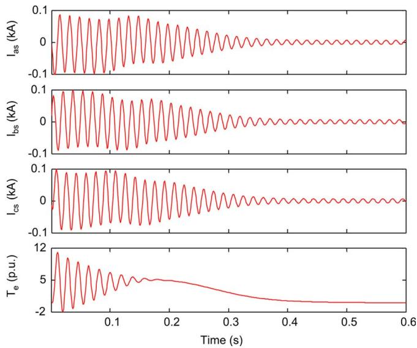  
Fig. 1. Simulation results with a 10- s time step, with all models showing similar responses.

Notice that the notation used in Table I for the VBR model is slightly different from the one used in [6], this is so as to match the notation used in this paper and to enable a more straightforward comparison. In this table, the superior performance of the NR-CC model, is shown. It should be pointed out that since the number of operation required by the matrix inversion for the NR-CF and VBR models is not included in the count, an even greater advantage exist for the NR-CC model. From the flop count comparison between the NR-CC and the PD model, the very significant gain in efficiency brought about by the use of combined phase and transformed quantities, is self evident. It should be noted that the number of mathematical operations reported in Table I match those of the actual computer implementation for the various models proposed. It calls to attention the significant difference in the flop count of the PD model reported in [6], which stand at 260 flops, and the one reported in Table I, which stand at 126 flops. This is the result of two quite different PD model implementations, with varying degrees of optimization.

# IV. MODEL VALIDATION AND TEST CASES

The various models are validated by comparing their responses against that of a commercial grade computer program, namely PSCAD/EMTDC, which uses a representation of the machine [12]. The VBR model is formulated based on [6] but for consistence with the implementations carried out in this paper, (69) and (70) are used to predict the mechanical variables in the VBR model. A test system comprising a 3 HP induction machine connected directly to an ideal voltage source is used to examine the results provided by the various models. The machine parameters are obtained from [8] and reproduced in Appendix B, for completeness. The induction machine start-up transient with no mechanical load is simulated using the various models, thus, at all the machine variables are zero. Fig. 1 shows the simulation results for a number of electrical variables for the various induction machine models, with a time step

TABLE IICPU TIME REQUIRED BY A 600-ms SIMULATION PERIOD  

<table><tr><td>Discrete model</td><td>CPU time (ms)</td><td>CPU time per time step (μs)</td></tr><tr><td>PD</td><td>10.64</td><td>0.177</td></tr><tr><td>NR-CC</td><td>7.68</td><td>0.128</td></tr><tr><td>NR-CF</td><td>11.80</td><td>0.197</td></tr><tr><td>VBR</td><td>13.23</td><td>0.221</td></tr></table>

TABLE III CPU TIME REQUIRED BY A 600-ms SIMULATION WITH ANALYTICALLY INVERTED MATRIX   

<table><tr><td>Discrete model</td><td>CPU time (ms)</td><td>CPU time per time step (μs)</td></tr><tr><td>NR-CF</td><td>10.12</td><td>0.169</td></tr><tr><td>VBR</td><td>11.32</td><td>0.189</td></tr></table>

of 10 s, where it is observed that the models responses are practically identical, thus confirming the models’ equivalency.

# A. Models Computer Performance

The main thrust of this paper is to examine the machine models with direct interface to the external power system and on that basis, the model is no longer considered in the remaining of the paper; its interfacing problems with the external network are well documented in [2]–[7]. To asses the computer performance of the PD, NR-CC, NR-CF and VBR models, these were coded in the ANSI computer language. A single threaded computer program compiled to maximize speed with Microsoft Visual Studio 2008 running in a Core 2 Duo PC at 2.13 GHz with 1 GB of RAM under the Windows XP operating system was used. An LU matrix inversion algorithm was implemented in the simulation. The simulation period was 0.6 s with a time step of s. Table II shows the various CPU times involved in the models solutions.

Based on the results of Table II, the NR-CC synchronous machine model is 39% more efficient in terms of computing time than its nearest competitor. The CF based models, namely the NR-CF and VBR, have a significant drop in efficiency due to the existence of time-variant terms in their equivalent resistance matrices, leading to significant increases in computing time. The number of operations required by the inversion of the 3 3 matrices accounts for about 30% of the total time required by the NR-CF and VBR models. This unwanted time dependency is responsible for their relative poor performance. It should be noticed that the VBR model is the least efficient of the four models assessed.

It may be argued that further savings in computer time may be obtained for the NR-CF and VBR models by employing their analytically inverted equivalent resistance matrices. However, the derivation of their conductance matrices is not a trivial matter and their calculation within the NR-CF and VBR implementations does involve a considerable number of flops. Nevertheless, CPU gains are achieved with respect to the case when the conductance matrices are evaluated numerically. This is illustrated by the figures given in Table III corresponding to a 600-ms simulation period using the NR-CF and VBR models

TABLE IV EFFECTIVE NUMBER OF FLOPS PER MODEL   

<table><tr><td>Operation</td><td>PD</td><td>NR-CC</td><td>NR-CF</td><td>VBR</td></tr><tr><td>+, -,×</td><td>140</td><td>93</td><td>125</td><td>142</td></tr><tr><td>÷</td><td>0</td><td>0</td><td>12</td><td>12</td></tr><tr><td>Trig</td><td>44</td><td>44</td><td>44</td><td>44</td></tr><tr><td>Total</td><td>187</td><td>137</td><td>181</td><td>198</td></tr></table>

with analytically inverted matrices. The expression for the conductance matrix of the VBR model is obtained from [7], with that of the NR-CF having a similar form.

It is noticed from these results that, even after further optimizations, the advantage in performance in favor of the NR-CC model remain very significant, standing at 32% and 47% over the NR-CF and VBR models, respectively. The differences in CPU time are better illustrated by calculating the “effective” number of flops required in each model solution. The “effective” number of flops required for the evaluation of a particular mathematical operation was obtained by comparing the CPU time required to carry out a fix number of operations. It was found that a floating point multiplication, addition or subtraction uses similar CPU time, hence these were considered single flop operations. On other hand, a floating point division and a trigonometric function require 4 and 22 times more CPU time than a single flop operation, respectively. These relationships may vary for different hardware and software combinations. It should be noted that the NR-CF and VBR models require 15 single-flop and three floating-point divisions for the calculation of the analytically inverted conductance matrix. In addition 18 single-flop operations are required for the calculation of the stator currents. In contrast, the PD and NR-CC models only requires six extra single-flop operations for the calculation of stator current. All the models require eight single-flop operations for the evaluation of the mechanical equations. Table IV show the “effective” number of flops required for the complete models solution, including mechanical equations and stator currents calculations.

These results highlight the unassailable advantage of the NR-CC model over the other models. Nevertheless, it should be pointed out that further efficiency gains can be made in the original VBR model [6] if an algorithm similar to the one presented for the NR-CF model is adopted. In such a case, the effective number of flops for the VBR would reduce from 198 to 186. This would bring the VBR model closer to the NR-CF model in terms of efficiency but still behind the most efficient NR-CC model.

# B. Numerical Stability

It has been observed in [4] and [5] that state variable selection has a bearing in the error propagation of the discretized machine models. The VBR model uses stator currents and rotor fluxes to achieve an improved performance compared to the conventional PD model, in both state space representation [4], [5] and in the EMTP-type version [6], although the relevance of the output variable in the EMTP-type models is not clearly established. For instance, the voltage and flux linkage equations for an induction machine with constant air-gap are given by (1) and (2).

After applying the trapezoidal rule, the voltage equation may be expressed as

$$
\begin{array}{l} \mathbf {V} (t) = \frac {2}{\Delta t} \boldsymbol {\Psi} (t) + \mathbf {R I} (t) \\ - \frac {2}{\Delta t} \boldsymbol {\Psi} (t - \Delta t) + \mathbf {R} \mathbf {I} (t - \Delta t) - \mathbf {V} (t - \Delta t) \tag {73} \\ \end{array}
$$

with

$$
\boldsymbol {\Psi} (t) = \mathbf {L} (t) \mathbf {I} (t). \tag {74}
$$

Using (73) and (74), the system matrix of the induction machine using fluxes as output variables may be expressed as

$$
\begin{array}{l} \mathbf {A} _ {\psi} (\Delta t, t, x _ {t - \Delta t}) \\ = \left(\frac {2}{\Delta t} + \mathbf {R L} ^ {- 1} (t)\right) ^ {- 1} \left(\frac {2}{\Delta t} + \mathbf {R L} ^ {- 1} (t - \Delta t)\right). \tag {75} \\ \end{array}
$$

On the other hand, if currents are used as output variables, the system matrix may be expressed as

$$
\begin{array}{l} \mathbf {A} _ {i} (\Delta t, t, x _ {t - \Delta t}) \\ = \left(\frac {2}{\Delta t} \mathbf {L} (t) + \mathbf {R}\right) ^ {- 1} \left(\frac {2}{\Delta t} \mathbf {L} (t - \Delta t) + \mathbf {R}\right). \tag {76} \\ \end{array}
$$

Since $\mathbf { L } ( t ) = \mathbf { L } ^ { T } ( t )$ and is assumed to be diagonal, $\mathbf { A } _ { i }$ may be expressed in terms of $\mathbf { A } _ { \psi }$ as

$$
\mathbf {A} _ {i} (\Delta t, t, x _ {t - \Delta t}) = \mathbf {L} ^ {- 1} (t) \mathbf {A} _ {\psi} (\Delta t, t, x _ {t - \Delta t}) \mathbf {L} (t - \Delta t). \tag {77}
$$

Thus, the systems described by $\mathbf { A } _ { \psi }$ and $\mathbf { A } _ { i }$ are kinematically similar [9], [10], then an identical numerical accuracy would be expected between them. Hence, no link can be established between output variables and numerical accuracy improvement in the EMTP-type models. On the other hand, the EMTP-type version of the VBR and the NR-CF models are derived from stator voltage equations that in the continuous time domain use stator currents as state variables. Even though the former uses rotor fluxes as output variables and the latter uses rotor currents, no significant difference should exist, as shown by the analysis encompassing (73)–(77). It is then reasonable to expect that the NR-CF model will exhibit a similar numerical accuracy to that of the VBR model, but with improved computer efficiency owing to the smaller number of flops required by the former.

On other hand, the NR-CC is derived directly from the classical EMTP-type PD model. Hence, the PD and NR-CC formulations are derived from the same state-space representation and a similar numerical accuracy would be expected between these two models. However, the NR-CC model comprehensibly outperforms the PD model in terms of computer efficiency, owing to its much reduced number of flops.

To study the impact of the step size on the accuracy of the models’ responses, simulations are carried out using a time step of 1 ms. Such a large step-size would reveal any sign of divergence in the models’ responses. Simulation results for several variables are shown in Fig. 2, where the close response between the various models is appreciated, with Fig. 3 showing a more detailed view. These responses are compared with a reference solution achieved with a time step of 1 ms. The PD and the

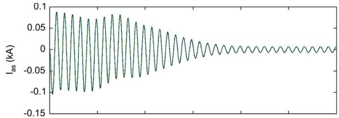

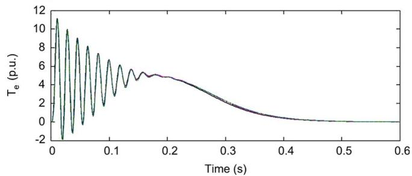  
Fig. 2. Simulation results with 1-ms time step, with all the models’ responses showing a close agreement.

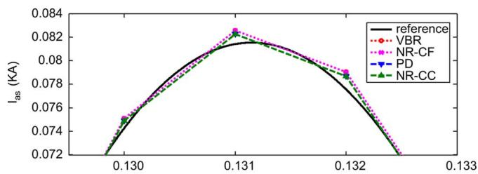

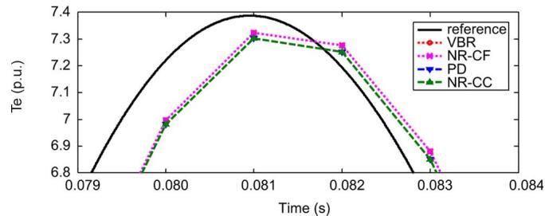  
Fig. 3. Simulation results detail, with the NR-CC and NR-CF showing similar responses to the PD and VBR models, respectively.

NR-CC responses are identical; this is an expected result since both models are derived from the same basic set of equations with the NR technique being used only to improve on the model efficiency. As expected from the previous analysis, the VBR and NR-CF models, although derived from a different set of equations, have responses that are practically identical since their corresponding signals are in fact indistinguishable from each other.

To asses further the models’ accuracy, the relative error between a reference solution, obtained with a time step of 1 s and the various models using different step sizes was calculated using the 2-norm error. Fig. 4(a) shows the difference in relative error for various electrical variables, where a positive value means that the difference is favorable to the CF based models.

Fig. 4(b) shows the relative error for the currents in phases A, which was found to be the variable with the largest error difference. It is noticed that the relative error difference, although favorable to the CF based models, is not very significant. In the

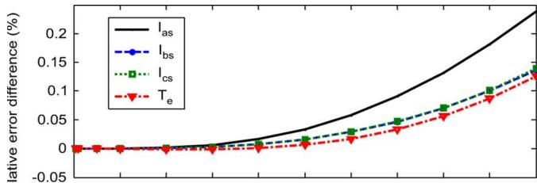  
(a)

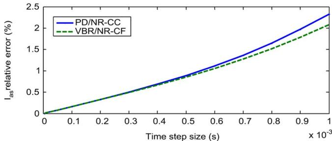

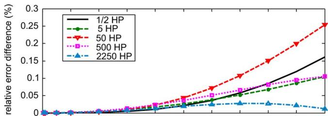  
Fig. 4. Simulation results relative error. (a) Error differences. $( \mathbf { b } ) \mathbf { I } _ { \alpha , s }$ .   
(a)

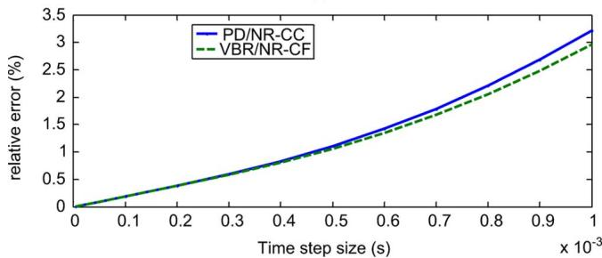  
(b）  
Fig. 5. relative error. (a) Differences. (b) 50 HP machines.

worst case, for $\mathbf { I } _ { a s }$ at 1-ms time step, the NR-CC model would have a comparable accuracy to the NR-CF model by decreasing the time step size by only 6%. Moreover, the performance advantage of the NR-CC model is much more significant than any time saving achieved by increasing the time step using the CF based models at any given accuracy. To verify that the relative error behavior is consistent, a similar study was carried out for a number of induction machines ranging from 1/2 to 2250 HP. The machines’ parameters for the various machines are listed in Appendix B.

The relative error differences between the various models for $\mathbf { I } _ { a s }$ is shown in Fig. 5(a). It is observed that the trend between models is very similar and that the difference is only marginally favorable to the CF based models. Fig. 5(b) shows the relative error for the 50 HP machine’s $\mathbf { I } _ { a s }$ variable, which corresponds to the worst case shown in Fig. 5(a). To have a similar accuracy to the NR-CF model with 1-ms time step, it is necessary to

decrease the time step size of the NR-CC model by 5%, which again does not compensate the difference in computer efficiency favorable to the NR-CC model. This confirms that the NR-CC model is not only a very efficient model but also a very competitive one in terms of accuracy when compared to either the NR-CF or the state-of-the-art VBR model.

# V. IMPACT OF COMPUTER IMPLEMENTATION IN THE MODELS’ ACCURACY

The implementation of the historic terms of the formulations under discussion deserves further attention. At least two different options seem plausible for carrying out its evaluation in any of the four models discussed in the paper: 1) one is to reevaluate at each time step the time-variant inductances of the historic terms using the corrected machine angle obtained at the end of the previous time-step and 2) another is to calculate the historic terms reusing the inductance values obtained at the previous time step (i.e., with no reevaluation in the current time step). In the latter option, the corrected machine angle obtained at the previous time step is used only to predict a more accurate angle for the current time step. At first thought, approach 1) seems a reasonable one to follow, since one may think that the corrected machine angle may be a better approximation to the actual solution and that it would decrease the model error more rapidly. From the numerical efficiency vantage, the number of mathematical operations involved in the model solution increases due to the required reevaluation of the historic term in the current time step.

The two different implementations of the historic term will only be implemented in the PD model, giving rise to models PD-I and PD-II, respectively. In fact, the implementation used in PD-II corresponds to that used in the PD, NR-CC and NR-CF models assessment in Section IV. It should be noticed that the numerical solution of the PD model requires only angle prediction at the start of each time step. However, for the successful implementation of procedure 1) in the PD model, the speed must be predicted using (69) and then the machine angle is calculated using (68); this is in order to keep the error bounded. It has been noticed that failure to do so causes the model to diverge quickly from the solution, a fact that points to a rather weak procedure. In contrast, when implementing 2) in the PD model, which comprises the prediction of the machine angle using (70) at the start of each time step, a rather accurate model solution is assured.

To evaluate the numerical accuracy of the two distinct PD implementations and to enable a direct comparison with published results, the test case used in [6] is reproduced. The startup transient of the 50 HP induction machines operating under no load and connected to a sinusoidal voltage source is considered. Fig. 6 shows a detailed view of the simulation results obtained for the $\mathbf { I } _ { a s }$ variable. No iteration is involved in the solution and a 1-ms time step is used. The results are compared with a reference solution obtained with a time step of s and with the VBR model with a time step of 1 ms. It should be remark that the results in Fig. 6 are for the same variable and time period presented in Fig. 7 in [6]. Fig. 7 shows a detailed view of the simulation results for the electric torque with the two PD implementations and with the VBR model. It covers the same time span and variable presented in [6, Fig. 10].

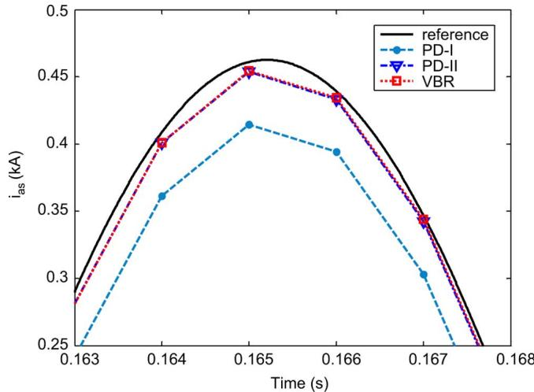  
Fig. 6. simulation results, with the PD-II model showing close agreement with the VBR.

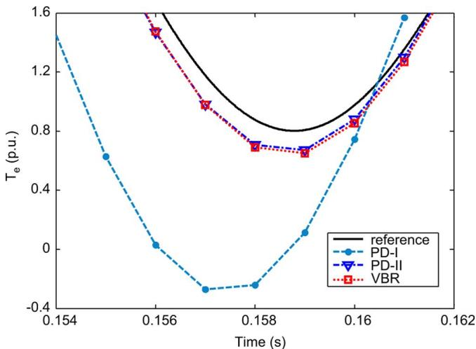  
Fig. 7. simulation results, with the PD-II model showing close agreement with the VBR.

As observed, the PD-II implementation yields results that are in close agreement with those obtained with the VBR model while PD-I yields results that are far away from the reference solution and from the PD-II solution. The difference in results from the PD-I and PD-II implementations arises from the approach used in the calculation of the historic terms. Instead of the expected reduction in numerical error the opposite happens, the error amplifies—one may think of a case of numerical overcompensation. It should be emphasized that the results obtained with PD-I match closely those reported in [6] for the PD.

Remark: It is interesting to observe that implementation of approaches 1) and 2) have a major bearing on the accuracy of models PD and consequently the NR-CC, as shown in Figs. 6 and 7, but that it has little bearing on the accuracy of the VBR and NR-CF models. It may be concluded that the PD and by extension the NR-CC model, are very sensitive to angle mismatches and that, in contrast, the VBR and the NR-CF are immune to them.

Fig. 8 shows the relative error calculated for the $\mathbf { I } _ { a s }$ variable using the 2-norm error for several time steps for the two PD implementations and for the VBR model. The time span used in

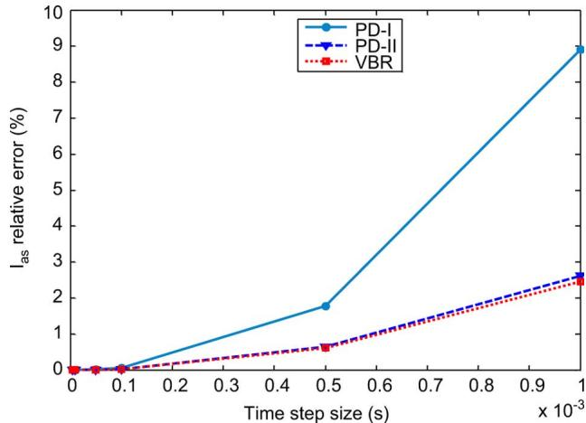  
Fig. 8. ${ \mathbf { I } } _ { a s }$ relative error, with the PD-II model showing close agreement with the VBR.

TABLE V DISCRETE MODELS EIGEN-VALUES   

<table><tr><td>VBR</td><td>PD-I</td><td>PD-II</td><td>NR-CC</td><td>NR-CF</td></tr><tr><td>0.7526-0.1110j</td><td>0.1878</td><td>0.1878</td><td>0.1878</td><td>0.1892-0.0019j</td></tr><tr><td>0.7526+0.1110j</td><td>0.1878</td><td>0.1878</td><td>0.1878</td><td>0.1892+0.0019j</td></tr><tr><td>0.7508</td><td>0.7508</td><td>0.7508</td><td>0.8970</td><td>0.9465</td></tr><tr><td>0.8245</td><td>0.8970</td><td>0.8970</td><td>0.9936</td><td>0.9936</td></tr><tr><td>1.0657-0.1543j</td><td>4.3622</td><td>4.3628</td><td>4.3628</td><td>4.3295-0.0327j</td></tr><tr><td>1.0657+0.1543j</td><td>4.3622</td><td>4.3628</td><td>4.3628</td><td>4.3295+0.0327j</td></tr></table>

the relative error calculation is the same as in [6], it includes the transient response for the 50 HP machine from stand-still to $t = 0 . 6 ~ \mathrm { s }$ , when the machine reaches steady state. As expected, the PD-II implementation follows closely the trend of the VBR model whilst PD-I is markedly different. Once more, the relative error obtained for the PD-I implementation match exactly the results reported in [6, Fig. 11] for the PD model. It may be concluded that the numerical stability of the PD model is rather dependant on its implementation, a fact that may have led the authors of [6], [7] to assume a considerable numerical instability of the PD model, and subsequently deemed the VBR model to be a far superior model than the PD from the vantage of numerical stability.

# A. Eigen-Values Comparison

The eigen-values of a dynamic system encapsulate key information relating to the numerical stability of the system. They give a measure of the local error propagation, which affects system stability [14] and they have become a popular resource when trying to explain differences in numerical accuracy between models of rotating machinery [4]–[6]. However, some caution needs to be exercised since the sole use of the system eigen-values is not sufficient to discriminate model accuracy in a time-varying system. To prove the point, the eigen-values for the various EMTP-type models discussed in the paper are extracted using their corresponding system matrices and given in Table V for a time $t = 0 . 8 s ,$ , which is in line with the eigenvalues results published in Table V in [6]. The system matrices for the NR-CC and NR-CF models are given in Appendix C, the system matrices for the VBR and PD models are given in [6]. As observed in Table V, the larger eigen-values of the NR-CC

model are identical to those of PD-II which, in turn, possess slightly larger eigen-values than the PD-I model. It should be noticed that if we were to adopt the criterion in [6] concerning accuracy of the discrete model based on the magnitudes of the system eigen-values with respect to the unit circle, where the larger the magnitude the less accurate the model is; the NR-CC model would be less accurate than the PD-I, which clearly is not the case. Furthermore, the eigen-values of the NR-CF model are closer in magnitude to those of the PD models than to those of the VBR and yet it has been found in this paper that the NR-CF is as accurate as the VBR.

It is not difficult to agree with the notion that the main objective in any model implementation is to procure the most efficient solution and with the least error and, as shown in this paper, PD-I fails in both counts. Conversely, the approach used in the PD-II and NR-CC models implementation reduces not only the number of mathematical operations by a considerable margin, compared to the PD implementation in [6], but it also reduces significantly the model error, producing results that resemble closely those obtained with the VBR model. This finding carries much practical significance because in general, the full PD model may be used to simulate operating conditions that are beyond the application of the simplified models, such as cases of internal asymmetries and space harmonic effects. Such advanced applications may now be resumed with the certainty of having in the PD a solid formulation from the numerical stability vantage. The results show an improved implementation of the PD model which yield errors that are much smaller than those found in [6], [7]. In light of these results, the use of the approximate models proposed in [7] may not be necessary. This will be expanded on in a future publication.

# VI. CONCLUSION

In this paper, two highly efficient induction machine models for EMTP-type simulations with a direct interface with the external power system have been presented. The models combine transformed and phase quantities to improve on the efficiency of the PD formulations from where they are derived. Their superiority over existing models is thoroughly assessed by considering its computer performance and accuracy for large time steps. The assessment carried out showed that an induction machine model with similar numerical properties to those the VBR model do exist, namely the NR-CF model, but with an improved computer performance. Moreover, it is shown that the NR-CC model offers computational advantages over the other models,

TABLE VI 4 POLES INDUCTION MACHINES PARAMETERS   

<table><tr><td>HP</td><td>1/2*</td><td>31</td><td>52</td><td>501</td><td>5001</td><td>22501</td></tr><tr><td>Voltage</td><td>420</td><td>220</td><td>230</td><td>460</td><td>2300</td><td>2300</td></tr><tr><td>rs(Ω)</td><td>94.904</td><td>0.435</td><td>0.531</td><td>0.087</td><td>0.262</td><td>0.029</td></tr><tr><td>r(Ω)</td><td>79.303</td><td>0.816</td><td>0.408</td><td>0.228</td><td>0.187</td><td>0.022</td></tr><tr><td>Xls(Ω)</td><td>49.079</td><td>0.754</td><td>0.950</td><td>0.302</td><td>1.206</td><td>0.226</td></tr><tr><td>Xlr(Ω)</td><td>49.079</td><td>0.754</td><td>0.950</td><td>0.302</td><td>1.206</td><td>0.226</td></tr><tr><td>XM(Ω)</td><td>528.653</td><td>26.13</td><td>3.193</td><td>13.08</td><td>54.02</td><td>13.04</td></tr><tr><td>J(kg·m-2)</td><td>0.0005</td><td>0.089</td><td>0.100</td><td>1.662</td><td>11.06</td><td>63.87</td></tr></table>

obtained from [8];²obtained from [13];* experimental data.

since no time variant terms exist in its equivalent resistance matrix. Contrary to what has been reported in the open literature, the accuracy gained by using a mixed set of variables (current-flux) in induction machine EMTP-type models is not all that significant when a proper implementation is used. Hence, the NR-CC model is an ideal candidate to use as a general purpose model—it is a highly efficient formulation with a very competitive accuracy for large time steps.

# APPENDIX A

Transformed model inductance matrices [8], where $L _ { \mathrm { l s } } .$ , $L _ { l r }$ and $L _ { M }$ represent the stator leakage, rotor leakage and magnetizing inductance, respectively.

$$
\begin{array}{l} \mathbf {L} _ {s s d q} = \left[ \begin{array}{c c c} L _ {l s} + L _ {M} & 0 & 0 \\ 0 & L _ {l s} + L _ {M} & 0 \\ 0 & 0 & L _ {l s} \end{array} \right] \\ \mathbf {L} _ {r r d q} = \left[ \begin{array}{c c c} L _ {l r} + L _ {M} & 0 & 0 \\ 0 & L _ {l r} + L _ {M} & 0 \\ 0 & 0 & L _ {l r} \end{array} \right] \\ \mathbf {L} _ {s r d q} = \left[ \begin{array}{c c c} L _ {M} & 0 & 0 \\ 0 & L _ {M} & 0 \\ 0 & 0 & 0 \end{array} \right] \\ \mathbf {L} _ {r s d q} = \mathbf {L} _ {s r d q} ^ {T} \\ \end{array}
$$

# APPENDIX B

See Table VI.

# APPENDIX C

NR models system matrices for eigen-values calculation are shown at the bottom of the page.

$$
\pmb {\Phi} _ {N R - C C} \left(\Delta t, t, x _ {t - \Delta t}\right) = \left[ \begin{array}{c c} \frac {2}{\Delta t} \mathbf {L} _ {s s} + \mathbf {R} _ {s} & \frac {2}{\Delta t} \mathbf {L} _ {s r} (t) \mathbf {T} ^ {- 1} (0) \\ \frac {2}{\Delta t} \mathbf {L} _ {r s d q} \mathbf {T} (t) & \frac {2}{\Delta t} \mathbf {L} _ {r r d q} + \mathbf {R} _ {r} \end{array} \right] ^ {- 1} \left[ \begin{array}{c c} \frac {2}{\Delta t} \mathbf {L} _ {s s} - \mathbf {R} _ {s} & \frac {2}{\Delta t} \mathbf {L} _ {s r} (t - \Delta t) \mathbf {T} ^ {- 1} (0) \\ \frac {2}{\Delta t} \mathbf {L} _ {r s d q} \mathbf {T} (t - \Delta t) & \frac {2}{\Delta t} \mathbf {L} _ {r r d q} - \mathbf {R} _ {r} \end{array} \right]
$$

$$
\begin{array}{l} \boldsymbol {\Phi} _ {N R - C F} \left(\Delta t, t, x _ {t - \Delta t}\right) = \left[ \begin{array}{c c} \frac {2}{\Delta t} \mathbf {L} _ {e q} + \mathbf {R} _ {s} + \omega_ {r} \left(t\right) \mathbf {T} ^ {- 1} \left(t\right) \mathbf {Z} _ {1 d q} \mathbf {T} ^ {- 1} \left(t\right) & \mathbf {T} ^ {- 1} \left(t\right) \mathbf {Z} _ {2 d q} \left(t\right) \\ \frac {2}{\Delta t} \mathbf {L} _ {r s d q} \mathbf {T} \left(t\right) & \frac {2}{\Delta t} \mathbf {L} _ {r r d q} + \mathbf {R} _ {r} \end{array} \right] ^ {- 1} \\ \times \left[ \begin{array}{c c} \frac {2}{\Delta t} \mathbf {L} _ {e q} - \mathbf {R} _ {s} - \omega_ {r} (t - \Delta t) \mathbf {T} ^ {- 1} (t - \Delta t) \mathbf {Z} _ {1 d q} \mathbf {T} ^ {- 1} (t - \Delta t) & - \mathbf {T} ^ {- 1} (t - \Delta t) \mathbf {Z} _ {2 d q} (t - \Delta t) \\ \frac {2}{\Delta t} \mathbf {L} _ {r s d q} \mathbf {T} (t - \Delta t) & \frac {2}{\Delta t} \mathbf {L} _ {r r d q} - \mathbf {R} _ {r} \end{array} \right] \\ \end{array}
$$

# REFERENCES

[1] R. H. Park, “Two-reaction theory of synchronous machines, generalized method of analysis-part I,” AIEEE Trans., vol. 48, no. 2, pp. 716–730, Jul. 1929.   
[2] J. R. Marti and T. O. Myers, “Phase-domain induction motor model for power system simulators,” in IEEE WESCANEX Commun., Power, Computing Conf. Proc., May 15–16, 1995, vol. 2, pp. 276–282.   
[3] P. Pillay and V. Levin, “Mathematical models for induction machines,” in 30th IAS Annu. Meet. Conf. Rec.IAS, Oct. 8–12, 1995, vol. 1, pp. 606–616.   
[4] S. D. Pekarek, O. Wasynczuk, and H. J. Hegner, “An efficient and accurate model for simulation and analysis of synchronous machine/ converter systems,” IEEE Trans. Energy Convers., vol. 13, no. 1, pp. 42–48, Mar. 1998.   
[5] W. Liwei, J. Jatskevich, and S. D. Pekarek, “Modeling of induction machines using a voltage-behind-reactance formulation,” IEEE Trans. Energy Convers., vol. 23, no. 2, pp. 382–392, Jun. 2008.   
[6] W. Liwei and J. Jatskevich, “A voltage-behind-reactance induction machines model for the EMTP-type solution,” IEEE Trans. Power Syst., vol. 23, no. 3, pp. 1226–1238, Aug. 2008.   
[7] W. Liwei and J. Jatskevich, “Approximate voltage-behind-reactance induction machines model for efficient interface with EMTP network solution,” IEEE Trans. Power Syst., vol. 25, no. 2, pp. 1016–1031, May 2010.   
[8] P. C. Krause, Analysis of Electric Machinery. New York: McGraw-Hill, 1986.   
[9] J. C. Allwright and C. Manolescu, “Stability assessment for linear timevarying discrete-time systems using orthogonal lyapunov transformations,” Proc. Inst. Electr. Eng.—Control Theory Applic., vol. 151, no. 3, pp. 259–263, May 2004.   
[10] I. Gohberg, M. A. Kaashoek, and J. Kos, “Classification of linear time-varying difference equations under kinematic similarity,” Integral Equations Operator Theory, vol. 25, pp. 445–480, 1996.   
[11] H. W. Dommel, “Electromagnetic Transient Program (EMTP) Rule Book,” Electro Power Res. Inst., Palo Alto, CA, EPRI EL 642-1, Jun. 1989.

[12] “PSCAD/EMTDC V4.2.1, User’s Guide,” Manitova HVDC Research Centre, 2006.   
[13] G. Wenzhong, E. V. Solodovnik, and R. A. Dougal, “Symbolically aided model development for an induction machine in virtual test bed,” IEEE Trans. Energy Convers., vol. 19, no. 1, pp. 125–135, Jan. 2004.   
[14] L. O. Chua and P. Lin, Computer-Aided Analysis of Electronic Circuits: Algorithms and Computational Techniques. Englewood Cliffs, NJ: Prentice-Hall, 1975.

Damian S. Vilchis-Rodriguez (M’09) was born in Mexico. He received the degree from the Universidad Autonoma del Estado de Morelos in 1992 and the Ph.D. degree from the University of Glasgow, Glasgow, U.K., in 2010.

He was a Programmer and Consultant in power quality in Mexico during 1993–2004. He is currently a Research Associate with the Power Conversion Group, University of Manchester, Manchester, U.K. His research interest includes power systems dynamic simulation, electric machine modeling,

wind generation, and condition monitoring.

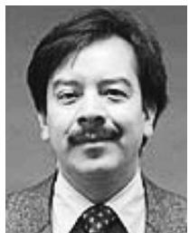

Enrique Acha (SM’02) was born in Mexico. He received the degree from the Universidad Michoacana de San Nicolas de Hidalgo in 1979 and the Ph.D. degree from the University of Canterbury, Christchurch, New Zealand, in 1988.

He was a Professor of electrical power systems with the University of Glasgow, Glasgow, U.K., and he is now a Professor of electrical power systems with Tampere University of Technology, Tampere, Finland.

Dr. Acha is an IEEE Power and Energy Society