# Time-delay estimation through all-pass functions for ULM line and cable models

S. Loaiza-Elejalde a,†,* , J.L. Naredo a , Martin G. Vega-Grijalva b , O. Ramos-Leanos ˜ , E.S. Banuelos-Cabral˜ d

a Cinvestav-Guadalajara, Mexico   
b Intel Corporation, Guadalajara, Mexico   
c IREQ, Varennes, PQ, Canada   
d University of Guadalajara, Mexico

# A R T I C L E I N F O

# Keywords:

All-pass filters

Electromagnetic transients

Line modeling

Minimum phase

Rational fitting

Time delays

Traveling waves

# A B S T R A C T

Traveling-wave line models, such as the ULM, are widely used in time-domain EMT simulations for power systems. These models require the rational approximation of both the characteristic admittance matrix ${ \mathrm { Y } } _ { \mathrm { c } ; }$ , and the propagation matrix H. Rational fitting of H is challenging due to the inclusion of a mix of modal delays in all its elements. These delays must therefore be identified and extracted before proceeding to calculate the rational approximation. This paper proposes a new iterative method to estimate time delays employing all-pass filters and delay equalizations. Unlike other currently used methods, the one proposed here ensures causality and minimum-phase features in the synthesized H model. Three test cases are included: 1) a synthetic transfer function, 2) a system of underground cables, and 3) the EMT response of an aerial line. The obtained results show that the proposed method maintains causality while achieving similar accuracies with fewer iterations compared to a state-of the art method based on rms-error minimization.

# 1. Introduction

PHASE-DOMAIN line models, such as the Universal Line Model (ULM) [1], are widely used in the time-domain (TD) simulation of electromagnetic transients (EMT) in power systems. For each transmission line or cable under study, these models require that the associated matrices, ${ \bf Y _ { c } }$ of characteristic admittances and H of propagation factors, be approximated by rational expressions leading to computationally efficient TD simulations. While rational fit of ${ \bf Y _ { c } }$ is straightforward, the fitting of H presents difficulties due to its elements involving delay factors associated with the modal velocities of the line or cable. Modal delays must therefore be identified and extracted from matrix H for a proper rational fit. Vector Fitting (VF) is the adopted methodology for rational fittings in the ULM [2]. As an alternative, H can be adjusted rationally without prior knowledge of modal delays by means of the Bode-diagram method developed for the FDLine model in [3]; never theless, the rational approximations so obtained tend to be of much higher orders than those from VF.

To enable the application of VF to the fitting of H, Gustavsen and Semlyen introduced in 1998 a method to estimate modal delays [4]. This method is based on an integral by Bode that relates the minimum phase angle response of the modal propagation functions $\mathrm { H } _ { \mathrm { m } }$ to its magnitude response [5]. These authors proposed obtaining a representative time delay for the entire function $\mathrm { H } _ { \mathrm { m } }$ by evaluating Bode integral at a single cutoff frequency Ω at which the magnitude of $\mathrm { H } _ { \mathrm { m } }$ decays to 0.1. However, it was found later that this may not work well in certain cases and modifications in the cutoff frequency evaluation have been proposed [6, 7]. Nevertheless, the issue of determining a proper value for Ω has remained open. Additionally, the magnitude of $\mathrm { H } _ { \mathrm { m } }$ may not decay to the required value within the frequency range of analysis.

To overcome the previous limitations, it has been proposed to first obtain an approximation of the delay, possibly using the Bode integral method, and then to conduct a search around it for a better value of the delay. The criterion for comparing time delay estimates is the rms-error of the synthesized function. Initially, a half-range search algorithm was employed [8] and, later, methods based on Golden Section search (GS)

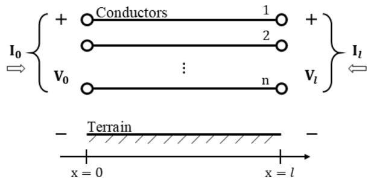  
Fig. 1. Traveling waves model of an aerial transmission line.

were adopted [7–9]. One issue with minimum rms-error methods is that they do not always guarantee the minimum error in the TD transient responses as it is demonstrated in [10,11]. Another problem with these methods is that the delay producing the minimum rms-error can lead to causality violations, i.e. traveling-wave velocities faster than the speed of light. This is demonstrated here in Section 4.2.

This paper proposes a time-delay estimation method that guarantees causality and minimum phase properties in the synthesized models of $\mathrm { H } _ { \mathrm { m } }$ . It is an iterative method based on the use of all-pass filters to counteract the appearance of positive (non-minimum phase) zeros at $\mathrm { H } _ { \mathrm { m } }$ realizations. This method can be considered a continuation and a substantial improvement of the research reported in [11,12]. To demonstrate its effectiveness, the proposed method is applied in three test cases. Its performance and accuracy are compared to those of the Bode integral and the GS methods. The first test case involves the identification of a constant delay in a synthetic transfer function. Comparisons are made and the improvement over its predecessor in [12] is demonstrated. The second test case involves delay identification for a system of three underground cables, each with four conducting layers. The third test compares the fitting and transient-response errors of an aerial line, modeled using the time delays being estimated by the Bode integral, the GS and the proposed all-pass-filter (APF) methods. To evaluate the line transient responses, these are compared with the one obtained with the Numerical Laplace Transform technique, which is used with $2 ^ { 1 5 }$ samples and a tuned accuracy of $1 0 ^ { - 8 }$ [13]. The three test cases show that the proposed method maintains causality, whereas GS method does not. These cases also show that the proposed method requires substantially fewer iterations than GS with comparable accuracy.

# 2. Theory overview

# 2.1. Transmission line representation in phase-domain

Fig. 1 shows the traveling-wave representation of a multi-conductor transmission line where ${ \bf V } _ { 0 }$ and $\mathbf { V } _ { 1 }$ represent the voltage vectors at the beginning and end of the line, respectively, while $\mathbf { I } _ { 0 }$ and Il are the corresponding current vectors. By applying the telegraph-equation solutions, the following expression is obtained for each side of the line,

$$
\mathbf {I} _ {\mathrm {i}} = \mathbf {Y} _ {\mathrm {c}} \mathbf {V} _ {\mathrm {i}} - \mathbf {H I} _ {\mathrm {r}}; \tag {1}
$$

where subindices i and r denote local-incident and remotely reflected variables, respectively. For an n-conductor line, ${ \bf Y _ { c } }$ and H are frequencydependent matrix functions with n × n elements. These are calculated from the series impedance Z and the shunt admittance Y matrixes of the line, both in per unit of length.

To obtain the rational approximation of $\mathbf { H } ,$ it is separated into its modal components as follows:

$$
\mathbf {H} = \sum_ {i = 1} ^ {\mathrm {n}} \mathbf {D} _ {\mathrm {i}} \mathbf {H} _ {\mathrm {m}, \mathrm {i};} \tag {2}
$$

where $\mathbf { D _ { i } }$ is the ith idempotent of H and $\mathrm { H } _ { \mathrm { m , i } }$ is the scalar propagation

function for the ith mode [14]. $\mathrm { H } _ { \mathrm { m } , \mathrm { i } }$ is given in terms of its modal attenuation αi and modal phase βi:

$$
\mathrm {H} _ {\mathrm {m}, \mathrm {i}} = \mathrm {e} ^ {- \left(\alpha_ {\mathrm {i}} + \mathrm {j} \beta_ {\mathrm {i}}\right) /}, \tag {3}
$$

with $\ell$ being the length of the line. The phase-shift term $\beta _ { \mathrm { i } }$ can be separated into two components: one corresponding to the minimum phase and the other related to the modal delay, which can be obtained from the modal velocity [4]. Then, (3) can be rewritten as

$$
\mathrm {H} _ {\mathrm {m}, \mathrm {i}} = \mathrm {e} ^ {- \left(\alpha_ {\mathrm {i}} + j \beta_ {\min , \mathrm {i}}\right) 1} \mathrm {e} ^ {- \mathrm {j} \omega r _ {\mathrm {i}}}; \tag {4}
$$

where the ith modal delay τi has been factored out from $\mathrm { H } _ { \mathrm { m } , \mathrm { i } }$ . Afterwards, the substitution of (4) in (2) produces an expression where each mode is expressed as the product of a minimum phase function and a pure delay function:

$$
\mathbf {H} _ {\mathbf {m}, \mathrm {i}} = \mathbf {D} _ {\mathrm {i}} \mathrm {e} ^ {- \left(\alpha_ {\mathrm {i}} + \mathrm {j} \beta_ {\min , \mathrm {i}}\right) 1} \mathrm {e} ^ {- \mathrm {j} \omega \tau_ {\mathrm {i}}} = \mathbf {H} _ {\min , \mathrm {i}} \mathrm {e} ^ {- \mathrm {j} \omega \tau_ {\mathrm {i}}}. \tag {5}
$$

In practice, modes with similar delays are grouped into a single delay group [1]; therefore, the approximation of H can be expressed as follows:

$$
\mathbf {H} \cong \sum_ {\mathrm {i} = 1} ^ {\mathrm {N} _ {\mathrm {g}}} \left(\sum_ {\mathrm {k} = 1} ^ {\mathrm {N} _ {\mathrm {H}, \mathrm {i}}} \frac {\mathbf {R} _ {\mathrm {i} , \mathrm {k}}}{\mathrm {j} \omega - \mathbf {p} _ {\mathrm {i} , \mathrm {k}}}\right) \mathrm {e} ^ {- \mathrm {j} \omega \tau_ {\mathrm {l}}}; \tag {6}
$$

where $\mathbf { R _ { i , k } }$ and $\mathtt { p _ { i , k } }$ are the residue-matrixes and the poles of the rational synthesis, $\mathrm { N _ { H , \cdot } }$ i is the approximation order of the ith modal delay-group and $\mathrm { N } _ { \mathrm { g } }$ is the number of these groups.

Note that before computing each set of poles and residues in $( 6 ) _ { i }$ , the corresponding modal delays τi must be identified and extracted to ensure that the rational approximations are applied to the minimumphase functions $\mathbf { H _ { \mathrm { m i n , i } } }$ in (5).

# 2.2. Delay estimation with the Bode integral method

Delay estimation with the Bode integral begins with the calculation of the minimum-phase angle of $\mathrm { H } _ { \mathrm { m } , \mathrm { i } }$ at a previously determined cutoff frequency $\Omega _ { \mathrm { i } }$ as follows:

$$
\varphi_ {\min , i} \left(\Omega_ {i}\right) = \frac {1}{\pi} \int_ {- \infty} ^ {\infty} \frac {\mathrm {d} \left(\log \left(| \mathrm {H} _ {\mathrm {m} , i} |\right)\right)}{\mathrm {d} \left(\mathrm {u} _ {\mathrm {i}}\right)} \log \left(\coth \frac {| \mathrm {u} _ {\mathrm {i}} |}{2}\right) \mathrm {d u} _ {\mathrm {i}}, \tag {7}
$$

where

$$
u _ {i} = \log \left(\frac {\omega}{\Omega_ {i}}\right). \tag {8}
$$

Then, the obtained phase-angle is used to find the corresponding modal delay by applying the following formula [4]:

$$
\tau_ {\mathrm {i}} = \frac {1}{v \left(\Omega_ {\mathrm {i}}\right)} + \frac {\varphi_ {\operatorname* {m i n} , \mathrm {i}} \left(\Omega_ {\mathrm {i}}\right)}{\Omega_ {\mathrm {i}}}, \tag {9}
$$

where $\upsilon ( \Omega _ { \mathrm { i } } )$ is the velocity of the ith mode evaluated at $\Omega _ { \mathrm { i } }$

# 2.3. Delay estimation with rms-error minimization

The search for the delays with the lowest fitting error is based on the implementation of a minimization algorithm to repeatedly fit $\mathrm { H } _ { \mathrm { m } , \mathrm { i } } ,$ , while varying $\tau _ { \mathrm { i } } ,$ until the minimum rms-error is obtained. The most used minimization algorithms are those based on the Golden Section search $[ 7 - 9 ]$ . The frequency range for the search can be based on delays precomputed with the Bode integral (7), although this is not strictly necessary [7–15].

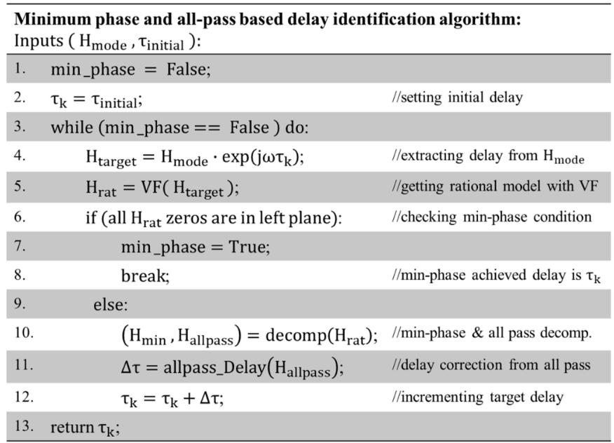  
Fig. 2. Pseudocode for the proposed delay identification method.

# 2.4. Minimum phase systems and all-pass systems

A minimum-phase system is a stable system whose inverse system is also stable. Since the rational representation of a stable system has all its poles on the left-hand-side of the complex s-plane, for this to be minimum-phase all its zeros must also lie on the left-hand-side of the splane [16]. On the other hand, a system is of all-pass type if its magnitude is 1, which implies that, in its rational form, all its zeros must be an exact mirror of its poles in the complex plane [17]. Consequently, an all-pass system cannot be a minimum-phase system and, if it is stable, all its zeros must lie on the right-hand-side of the s-plane.

Although all-pass systems do not change magnitudes, they certainly do affect the phase angles; so, they are often used as phase compensation systems. Due to these properties, an all-pass system can be decomposed into a cascade of first- and second-order all-pass subsystems. In addition, any rational system can be decomposed into the following product

$$
\mathrm {H} (\mathrm {j} \omega) = \mathrm {H} _ {\min } (\mathrm {j} \omega) \mathrm {H} _ {\mathrm {a p}} (\mathrm {j} \omega), \tag {10}
$$

where $\mathrm { H } _ { \mathrm { m i n } }$ (jω) is a minimum phase system and $\mathrm { H } _ { \mathrm { a p } } ( \mathrm { j } \omega )$ is an all-pass system [16].

In summary, on assuming stability any rational function with zeros on the right-hand-side of the s-plane can be compensated with an allpass function containing these zeros, while the remainder becomes a minimum-phase function.

# 2.5. Delay functions and phase distortion

A pure delay system is one that only applies a time shift in the TD. For this to hold true, its magnitude response must be a constant, and its phase response must be a linear function of the frequency. If a function has a non-linear phase response, it is said that it introduces a phase distortion [18]. A more convenient concept for analyzing phase distortion is the one of group delay, which allows the delay to be calculated as a function of the frequency. Given a continuous phase function $\phi ( \omega )$ , its associate group delay τ(ω) is defined as:

$$
\tau (\omega) = - \frac {\mathrm {d} \phi (\omega)}{\mathrm {d} \omega}. \tag {11}
$$

Its deviation from a constant shows the amount of non-linearity in the phase response of the system [16].

# 3. Proposed method

The method proposed here is iterative and is based on the identifi cation and extraction of the all-pass component $\mathrm { H } _ { \mathrm { a p } }$ from a rational synthesis of the original function H, as well as on the assignment of a representative delay to the extracted all-pass component. This delay is used as correction term. The process is repeated until the synthesis of H becomes of the minimum-phase type. Fig. 2 provides the pseudocode for this process. Although the initial estimate for the time delay does not have to be accurate, closer estimates result in faster convergence.

# 3.1. Representative delay for all-pass functions

Clearly from Fig. 2, the most important step in the estimation process is the delay correction calculation at line 11. Since there are many delay values that satisfy the minimum-phase condition, this stage is crucial for ensuring the method’s final accuracy. The delay correction Δτ can be estimated by averaging the group delay values of the all-pass function and this is the approach used in [11,12]. However, the order of the complete all-pass function is expected to be high, leading to considerable phase distortion and consequently a large error in the determination of Δτ.

To improve the calculation of $\Delta \tau ,$ it is proposed here to decompose the all-pass function into first- and second-order cascaded filter functions that can be adequately characterized from their phase responses by applying delay equalization.

Hence, this technique is called the all-pass-filter (APF) method. A comparison between APF and the approach of [11,12] is provided in Section V.A.

# 3.2. Delay correction with delay equalization

Since rational approximations with VF produce only real or complex conjugated pairs of poles and residues, the corresponding zeros will also be either real or complex conjugate pairs [2]; therefore, the compensation of any zero in the right-side of the s-plane implies the synthesis of either a first- or a second-order all-pass function. Hence, to introduce the delay equalization strategy into the estimation process, the all-pass function is now represented as follows

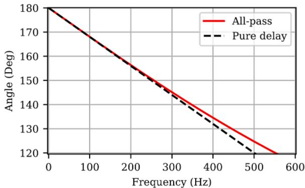  
Fig. 3. Phase response comparison: all-pass and a pure delay function. Case for $\omega _ { 0 } = 6 0 0 0 r a d / s e c$ .

$$
\mathrm {H} _ {\mathrm {a p}} (\mathrm {s}) = \prod_ {\mathrm {r} = 1} ^ {\mathrm {N} _ {1}} \frac {(\mathrm {s} - \mathrm {a} _ {\mathrm {r}})}{(\mathrm {s} + \mathrm {a} _ {\mathrm {r}})} \prod_ {\mathrm {w} = 1} ^ {\mathrm {N} _ {2}} \frac {(\mathrm {s} - \mathrm {z} _ {\mathrm {w}}) (\mathrm {s} - \mathrm {z} _ {\mathrm {w}} ^ {*})}{(\mathrm {s} + \mathrm {z} _ {\mathrm {w}}) (\mathrm {s} + \mathrm {z} _ {\mathrm {w}} ^ {*})}, \tag {12}
$$

where $\mathbf { a } _ { \mathrm { r } }$ corresponds to the real zeros and $\mathbf { Z } _ { \mathbf { W } }$ to the complex ones, along with their corresponding conjugates $\mathbf { z } _ { \mathbf { w } } ^ { * } . \mathbf { N } _ { 1 }$ is the number of real zeros and $\Nu _ { 2 }$ is the number of complex-conjugate pairs of zeros. If a constant and representative delay is estimated for each first- or second-order allpas function, Δτ can be obtained as the sum of all these contributions:

$$
\Delta \tau_ {\mathrm {k}} = \sum_ {\mathrm {r} = 1} ^ {\mathrm {N} 1} \tau_ {\mathrm {r}} ^ {(1)} + \sum_ {\mathrm {w} = 1} ^ {\mathrm {N} 2} \tau_ {\mathrm {w}} ^ {(2)}, \tag {13}
$$

with $\tau _ { \mathrm { r } } ^ { ( 1 ) }$ being the representative delays for the first-order all-pass functions and $\tau _ { \mathrm { w } } ^ { ( 2 ) }$ being those for the second-order all-pass functions.

# 3.3. Representative delay for first-order all-pass functions

Consider the following first-order all-pass function:

$$
\mathrm {H} _ {\mathrm {a p}} ^ {(1)} (\mathrm {s}) = \frac {\mathrm {s} - \omega_ {0}}{\mathrm {s} + \omega_ {0}}, \tag {14}
$$

where ω0 is its cutoff frequency equivalent to ar in (12). The representative delay for expression (14) is established approximating its phase response to that of a pure delay $\mathbf { e } ^ { - s \tau }$ as follows:

$$
\mathrm {e} ^ {- s \tau} = \frac {\mathrm {e} ^ {- s \tau / 2}}{\mathrm {e} ^ {s \tau / 2}} \approx \frac {1 - s \tau / 2}{1 + s \tau / 2}. \tag {15}
$$

Note that the exponential terms in (15) have been approximated by the first two terms of their McLaurin series. It follows from (15) that the phase response of a first-order all-pass filter, whose cutoff frequency is $\omega _ { 0 } = - 2 / \tau ,$ approaches that of a pure delay with a time shift of τ. In fact, if phase responses of both functions are compared, it can be observed that they coincide at low frequencies. See for instance their comparison in $\mathrm { F i g . } 3 .$ , where $\omega _ { 0 } = 6 0 0 0 r a d / s e c .$ .

The expression for the delay group of function (14) is

$$
\tau^ {(1)} (\omega) = \frac {2 / \omega}{1 + \left(\omega / \omega_ {0}\right) ^ {2}}, \tag {16}
$$

Table 1 Constant delay identification results.   

<table><tr><td></td><td>Bode integral</td><td>Golden search</td><td>APF method</td></tr><tr><td>Delay (μs)</td><td>3977.12</td><td>4026.8156</td><td>4026.8150</td></tr><tr><td>Rel. Error</td><td>0.01234081</td><td>4.5 × 10-11</td><td>1.66 × 10-7</td></tr><tr><td>Iterations</td><td>1</td><td>41</td><td>8</td></tr></table>

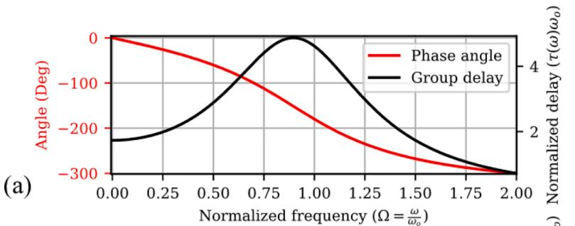

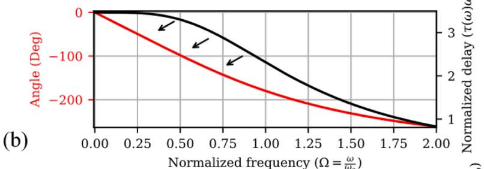

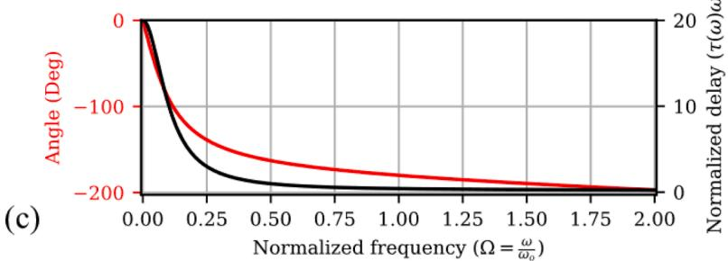  
Fig. 4. Phase response and delay group of a second-order all-pass function: (a) for Q = 2/ ̅̅̅3√ . (b) for Q = 1/ ̅̅̅3√ . (c) for Q = 0.1.

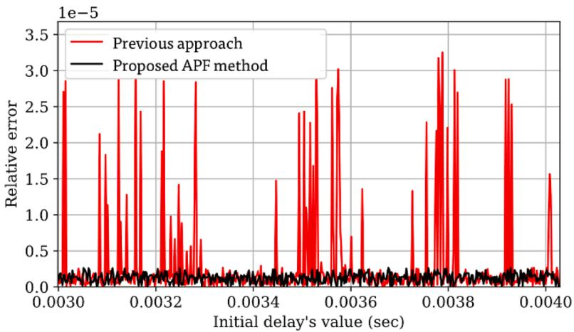  
Fig. 5. Relative error as a function of the initial delay for test case A.

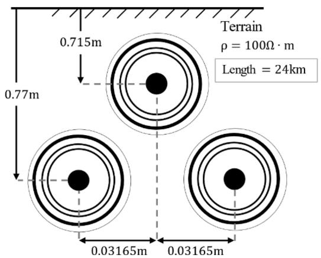  
Fig. 6. Underground cable system for test case B.

Table 2 Modal delays identified in a three phase cable system.   

<table><tr><td colspan="2">Modal group</td><td>Bode integral</td><td>Golden search</td><td>APF method</td></tr><tr><td rowspan="2">1</td><td>Delay (μs)</td><td>234.315</td><td>180.220</td><td>263.061</td></tr><tr><td>rms error</td><td>1.759 × 10-7</td><td>3.936 × 10-9</td><td>9.344 × 10-7</td></tr><tr><td rowspan="2">2</td><td>Delay (μs)</td><td>82.788</td><td>39.733</td><td>96.429</td></tr><tr><td>rms error</td><td>0.0309</td><td>0.0055</td><td>0.0391</td></tr><tr><td rowspan="2">3</td><td>Delay (μs)</td><td>142.840</td><td>101.377</td><td>143.257</td></tr><tr><td>rms error</td><td>0.1622</td><td>0.1028</td><td>0.1638</td></tr></table>

which also represents the slope of its phase response [17]. The highest phase coincidence between (16) and the pure delay occurs at frequency 0; hence, the representative delay value for the first-order function (14) corresponds to the initial decay slope, i.e., (16) being evaluated at $\omega =$ 0:

$$
\tau_ {\mathrm {a p}} ^ {(1)} \approx \tau^ {(1)} (0) = \frac {2}{\omega_ {0}}. \tag {17}
$$

# 3.4. Representative delay for second-order all-pass functions

For the second-order case the all-pass function takes the following form:

$$
\mathrm {H} _ {\mathrm {a p}} ^ {(2)} (\mathrm {s}) = \frac {\mathrm {s} ^ {2} - \left(\omega_ {0} / \mathrm {Q}\right) \mathrm {s} + \omega_ {0} ^ {2}}{\mathrm {s} ^ {2} + \left(\omega_ {0} / \mathrm {Q}\right) \mathrm {s} + \omega_ {0} ^ {2}}, \tag {18}
$$

where the characteristic frequency ω and the Q parameter are obtained

from the coordinates of $\mathbf { Z } _ { \mathbf { W } }$ in the s-plane [19].

The phase response of a filter of type (18) decays to − 2π drawing a curve that is initially concave and then becomes convex, with an inflexion point near $\omega _ { 0 } ,$ where the group delay exhibits a maximum peak. Nevertheless, this response varies as a function of $\omega _ { 0 }$ and Q. Specifically, the inflection point tends to approach frequency 0 as Q decreases, until it disappears [19]. Therefore, to properly characterize the phase response of (18), its group delay must first be obtained as a function of the normalized frequency $\Omega = \omega / \omega _ { 0 }$ , resulting in

$$
\tau^ {(2)} (\Omega) = \frac {2 (1 + \Omega^ {2})}{\omega_ {0} Q ((1 - \Omega^ {2}) + (\Omega / Q) ^ {2})}. \tag {19}
$$

It follows from (18) that the minimum value of Q for which the inflexion point exists is $\mathsf { 1 / \sqrt { 3 } } .$ This is obtained equating the slope of (19) to zero and solving the resulting equation [19]. Thus, in every case where $Q < 1 / { \sqrt { 3 } } ,$ , the phase response decays with a slope that progressively decreases in a similar form as in the first-order case. When $Q \geq 1 / { \sqrt { 3 } } ,$ , the phase response decays with a maximum slope around $\omega _ { 0 } .$ . Phase responses and group delays for $Q > 1 / \sqrt { 3 } , Q = 1 / \sqrt { 3 }$ and $Q <$ < $1 / \sqrt { 3 }$ at normalized frequencies are shown in Fig. 4.

On the grounds of the previous analysis, it is proposed here to establish two cases for the delay estimation of second-order all-pass systems. The first case occurs when $Q < 1 / { \sqrt { 3 } } ,$ where the representative delay is obtained as the initial phase decay slope; this is in much the same way as with the first-order all-pass function. Thus, when evaluating (19) at $\omega = 0$ one obtains:

$$
\tau_ {\mathrm {a p}} ^ {(2)} \approx \frac {2}{\omega_ {0} Q}; \text {f o r} Q <   \frac {1}{\sqrt {3}}. \tag {20}
$$

The second case occurs when $Q \geq 1 / { \sqrt { 3 } } ,$ , where the inflection point in the phase response must be considered. Here the representative delay is approximated by averaging the phase decay-slope [18]; i.e., the average of the group delay values:

$$
\tau_ {\mathrm {a p}} ^ {(2)} \approx \frac {1}{\mathrm {N} _ {\mathrm {s}}} \sum_ {\mathrm {m} = \omega_ {\min }} ^ {\omega_ {\max }} \tau^ {(2)} \left(\omega_ {\mathrm {m}}\right); \text {f o r} Q \geq \frac {1}{\sqrt {3}}, \tag {21}
$$

where $\omega _ { \mathrm { m i n } }$ represents the first frequency sample, $\omega _ { \mathrm { m a x } }$ the last one, $\Nu _ { s }$ is the number of frequency samples within the frequency range and $\tau ( \omega _ { \mathrm { m } } )$ is the evaluation of (19) at $\omega _ { \mathrm { m } }$ .

In conclusion, when pairs of complex conjugate zeros are obtained at the right-hand-side of the s-plane, (20) or (21) should be applied as appropriate.

Note the differences between the proposed methodology (APF) and the previous one in [11,12]. Firstly, in APF, the phase function of each

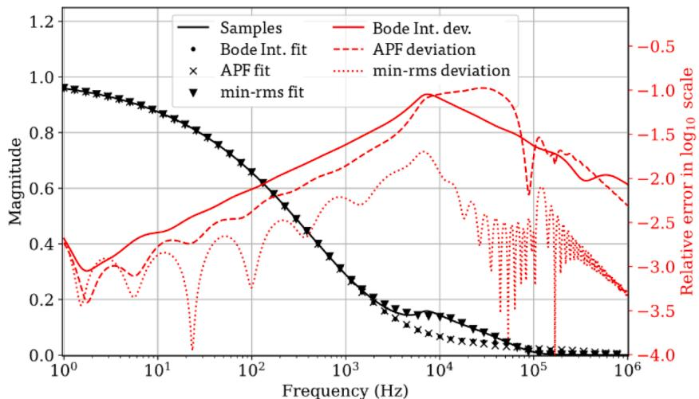  
Fig. 7. Fitting results for modal group 2. Underground cable case.

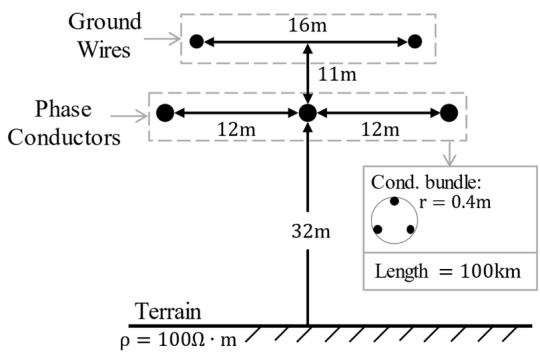  
Fig. 8. Aerial transmission line for test case C.

Table 3 Delays and fitting errors for the aerial line case.   

<table><tr><td colspan="2">Modal domain</td><td>Bode integral</td><td>Golden search</td><td>APF method</td></tr><tr><td rowspan="3">1</td><td>Delay (μs)</td><td>335.52384</td><td>332.75558</td><td>336.36206</td></tr><tr><td>rms error</td><td>2.778 × 10-6</td><td>2.129 × 10-6</td><td>1.898 × 10-5</td></tr><tr><td>max deviation</td><td>5.710 × 10-6</td><td>6.182 × 10-6</td><td>4.226 × 10-5</td></tr><tr><td rowspan="3">2</td><td>Delay (μs)</td><td>333.62785</td><td>333.26810</td><td>333.64826</td></tr><tr><td>rms error</td><td>1.521 × 10-4</td><td>2.917 × 10-5</td><td>3.130 × 10-4</td></tr><tr><td>max deviation</td><td>6.553 × 10-4</td><td>8.235 × 10-5</td><td>1.889 × 10-3</td></tr><tr><td rowspan="3">3</td><td>Delay (μs)</td><td>333.57321</td><td>333.41130</td><td>333.56795</td></tr><tr><td>rms error</td><td>1.474 × 10-3</td><td>1.001 × 10-5</td><td>1.536 × 10-4</td></tr><tr><td>max deviation</td><td>1.439 × 10-2</td><td>3.944 × 10-5</td><td>1.220 × 10-3</td></tr><tr><td colspan="2">Phase domain</td><td>Bode Integral</td><td>Golden Search</td><td>APF method</td></tr><tr><td rowspan="2">-</td><td>avr. deviation</td><td>2.761 × 10-4</td><td>1.003 × 10-4</td><td>1.567 × 10-4</td></tr><tr><td>max deviation</td><td>1.666 × 10-2</td><td>3.522 × 10-3</td><td>2.825 × 10-3</td></tr></table>

all-pass subsystem is adequately identified with exact formulas. Conversely, at the previous approach in [11,12], the phase function of the entire all-pass system is obtained as frequency samples; so, the group delay is computed through numerical differentiation which may introduce additional errors. Secondly, in APF, the number of operations to calculate the delay correction has been reduced. This is because the first-order case and the second-order case with $Q < 1 / { \sqrt { 3 } }$ are evaluated using expressions (17) and (20), which have a computational complexity of $\mathcal { O } ( 1 )$ , whereas calculating and averaging the group delay as in [11, 12] requires $\mathcal { O } (  { \mathrm { N } _ { s } } )$ computer operations. Although the calculation of the second-order case with $Q \geq 1 / { \sqrt { 3 } }$ requires the evaluation of (21) with an $\mathcal { O } (  { \mathrm { N } } _ { s } )$ complexity, in these authors’ experience, this is a very rare

case seldom occurring in practice.

# 4. Test cases

# 4.1. Identification of a constant delay

Consider the following transfer function that is based on a test case presented in [6,7]:

$$
\mathrm {H} _ {\text {t e s t}} (\mathrm {s}) = \mathrm {k} _ {0} \frac {(\mathrm {s} + \mathrm {z} _ {1}) (\mathrm {s} + \mathrm {z} _ {2}) \dots (\mathrm {s} + \mathrm {z} _ {9})}{(\mathrm {s} + \mathrm {p} _ {1}) (\mathrm {s} + \mathrm {p} _ {2}) \dots (\mathrm {s} + \mathrm {z} _ {1 0})} \mathrm {e} ^ {- \mathrm {s} \tau_ {\mathrm {t}}}, \tag {22}
$$

where $\mathbf { k } _ { 0 } = 4 1 1 2 3 . 6 7$ and $\tau _ { \mathrm { t } } = 4 0 2 6 . 8 1 5 6 8 7 3 2 1$ μs is a constant delay. The poles and zeros of (22) are taken from Section 3.1 of [6]. Given that all poles and zeros of this function are located on the left-hand-side of the s-plane, the function without the delay is ensured to be of minimum phase.

For this test, $\mathrm { H } _ { \mathrm { t e s t } } ( \pmb { \mathscr { s } } )$ is represented with 4096 samples at logarithmically spaced frequencies, from 0.01 Hz to 100 MHz. The cut-off frequency for the Bode integral method is determined at the point where the magnitude of the function has decayed to 0.1. The initial delay $\tau _ { 0 }$ for the APF method, is set to 3800 $\mu \mathbf { S } ,$ . The search range for GS is defined between $\tau _ { 0 }$ and $4 1 0 0 \mu s$ with a tolerance of $1 \times 1 0 ^ { - 1 2 }$ . For both GS and the APF methods, the same VF configuration is used, without applying any weighting to the samples and maintaining a fitting order equal to the number of poles in the function. The results obtained are presented in Table 1, which displays the identified delays, the errors relative to the original delay $\tau _ { \mathrm { t } }$ and the number of iterations required. By comparing these results, it is evident that, for this case, the GS method is the most accurate followed by APF, with the Bode integral method exhibiting the highest error. It is also shown that the GS method requires significantly more iterations than APF.

By using test function (22), the dependence of the APF method on the initial estimate $\tau _ { 0 }$ is investigated by assigning to it 500 linearly spaced values between 3000 µs and 4020 µs.

As a result of this experiment, Fig. 5 is produced by plotting for both methods, APF and the previous one in [11,12], the relative errors in the final estimate of the delay as functions of the initial values $\tau _ { 0 } .$ The results in Fig. 5 show that the APF method maintains a consistent error level regardless of the initial delay estimate, whereas the previous approach of [11,12] does not.

# 4.2. Modal delays for an underground cable system

For the second test case consider the underground transmission cable shown in Fig. 6 whose modeling data are taken from Table 1 at [20]. The

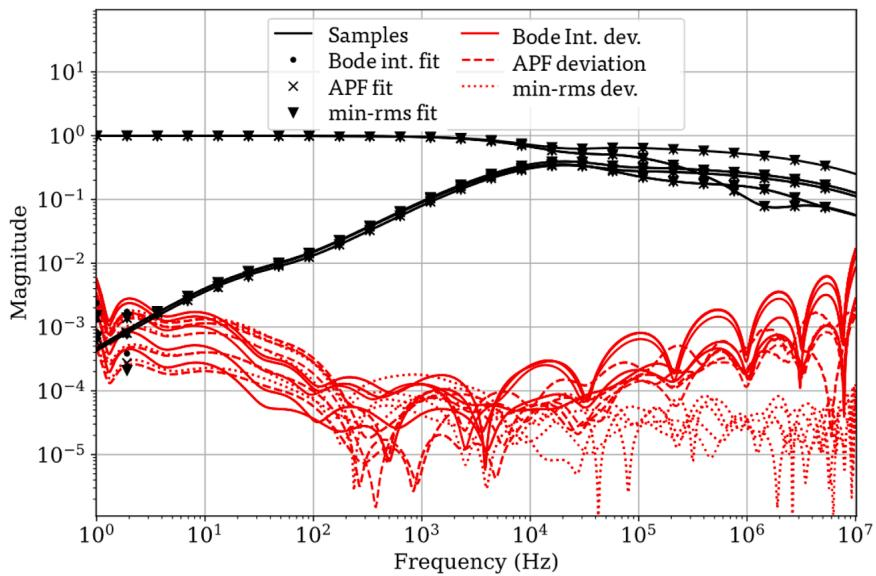  
Fig. 9. Fitting results in phase domain for the aerial line case.

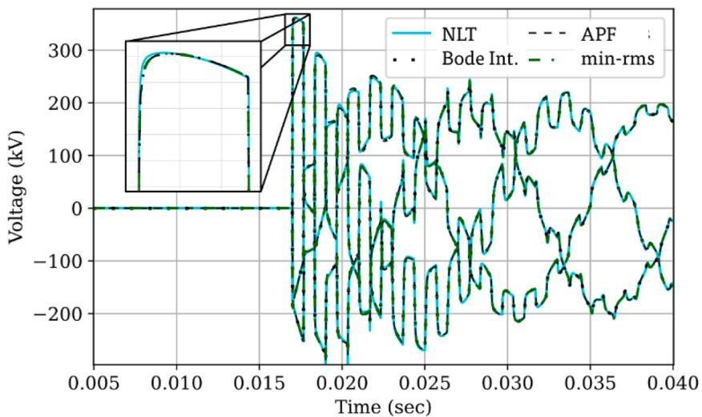  
Fig. 10. Voltage at line end computed with the 3 evaluation models in TD.

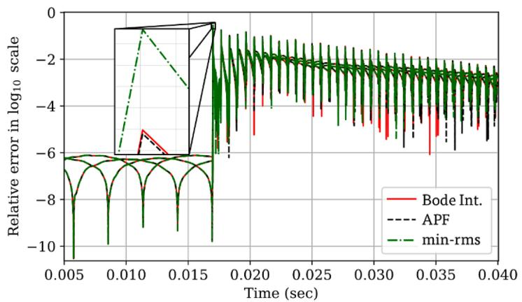  
Fig. 11. Relative deviations of the TD response with respect to NLT.

amours are eliminated to create a 9-conductor system. All fittings are made using 20 poles. Propagation modes with almost identical speeds are grouped into three groups, resulting in the identification of three

delays.

Results for the identification of modal delays are presented in Table $^ { 2 , }$ where similarities are observed between the Bode integral and

the APF methods, while GS reports the lowest fitting errors. It is evident that the fitting of modal groups 2 and 3 is a challenging task. Furthermore, GS attains a better fit in modal group 2 than the other two methods. However, a detailed observation of the delay value identified by GS reveals that it is an anti-causal and physically incorrect delay, as it corresponds to a modal velocity exceeding the speed of light. Fig. 7 shows the fitting results for modal group 2, where the greatest deviation occurs around 10 kHz, and where GS, using the anti-causal delay, achieves the best fit. Conversely, with APF, a causal delay is always obtained, even if an initial delay much lower than the light travel time is used.

# 4.3. Simulation of an aerial transmission line

To investigate the effects of the delay estimation methods on rational fittings and on TD transient responses, the case of a 100 km long overhead line is considered with the geometry and data shown in Fig. 8. Phase conductors are arranged in bundles of three sub-conductors, each with a radius of 2.035 cm and a DC resistance of 0.0321 Ω/km. Ground wires have a radius of 0.905 cm and a DC resistance of 0.4443 Ω/km. After eliminating the ground wires, a 3-conductor system is formed.

1) Delay identification and rational fitting results: In this part of the experiment, 1001 logarithmically spaced samples from 1 Hz to 10 MHz are used in the rational fitting of the corresponding modal propagation functions and all the fittings are performed using 20 common poles. The obtained delays and fitting errors are provided in Table 3. Note that the fitting errors are listed first for the modal domain and then for the phase domain. These results indicate that, although the APF method presents higher fitting errors in the modal domain, it provides the rational model with the lowest peak fitting error in the phase domain. Furthermore, the Bode integral method presents the highest fitting errors in mode 3 due to the magnitude of this mode decaying very slowly and thus affecting the selection of the cut-off frequency.

The deviations of the three rational models synthesized with each method are shown in Fig. 9. H calculated in the phase domain is used as a reference. It is observed that when using the APF method, the model presents less deviation in the low and medium frequencies, while with GS, the errors are lower at high frequencies.

2) Time domain results: The three rational models synthesized in the previous phase are simulated in the TD using recursive convolutions. For this simulation, an integration step of 4.88 µs and an observation window of 0.04 s are established. The simulation case involves a simultaneous closure at 16.6667 ms, applying a three-phase voltage at 60 Hz, with a Line-Ground peak voltage of 187.77 kV, and taking the open circuit voltage at the end of the line as the output.

The voltage waves obtained with each model and with the NLT are shown in Fig. 10. At first glance, no significant differences can be observed between the three methods.

The relative deviations of the three models from the response obtained with the NLT are shown in Fig. 11. It can be observed that the model with the highest peak error is the one obtained with GS, while the one with the lowest peak error is that with the APF model.

# 5. Conclusions

In this paper, a delay estimation method that guarantees the synthesis of rational models from minimum-phase functions has been proposed. This method is accurate and guaranties obtaining causal models.

The proposed method demonstrates significantly higher computational efficiency compared to methods based on rms-error minimization. In all cases, the maximum number of iterations required for the

proposed method to converge was nine, whereas the GS algorithm typically required more than twice as many iterations. Additionally, the proposed method necessitates only a single rational approximation per iteration, in contrast to the GS algorithm, which requires at least two. This advantage is particularly beneficial when modeling multiple instances of transmission lines or cables.

The accuracy of the proposed method at identifying a constant delay is validated with the first test case at Secc. IV.A, showing that the accuracy of the estimation is not compromised even if the estimate changes. The results of this paper also show that the use of delay equalizations to obtain delay corrections Δτ within the estimation process is a substantial improvement over its predecessor in [11,12].

The results obtained at case 2 indicate that delay estimation based solely on the minimum rms-error can produce non-causal models. Conversely, the proposed method guarantees obtaining causal delays.

The results for the aerial line case corroborate that obtaining lower fitting errors in the modal domain does not necessarily produce smaller errors in both the phase domain and the TD. Through the simulation of the TD response, it has been demonstrated that the proposed identification method is reliable for its use in ULM implementations.

# CRediT authorship contribution statement

S. Loaiza-Elejalde: Writing – review & editing, Writing – original draft, Software, Methodology, Investigation, Conceptualization. J.L. Naredo: Writing – review & editing, Writing – original draft, Validation, Supervision, Methodology, Investigation, Conceptualization. Martin G. Vega-Grijalva: Writing – review & editing, Writing – original draft, Visualization, Validation, Supervision, Methodology, Investigation, Formal analysis, Conceptualization. O. Ramos-Leanos: ˜ Validation, Supervision, Resources. E.S. Banuelos-Cabral: ˜ Validation, Supervision, Formal analysis.

# Declaration of competing interest

The authors declare that they have no known competing financial interests or personal relationships that could have appeared to influence the work reported in this paper.

# Data availability

Data will be made available on request.

# References

[1] A. Morched, B. Gustavsen, M. Tartibi, A universal model for accurate calculation of electromagnetic transients on overhead lines and underground cables, IEEE Trans. Power Deliv. 14 (3) (1999) 1032–1038, https://doi.org/10.1109/61.772350. Jul.   
[2] B. Gustavsen, A. Semlyen, Rational approximation of frequency domain responses by vector fitting, IEEE Trans. Power Deliv. 14 (3) (1999) 1052–1061, https://doi. org/10.1109/61.772353. Jul.   
[3] J. Marti, Accurate modelling of frequency-dependent transmission lines in electromagnetic transient simulations, IEEE Trans. Power Appar. Syst. PAS-101 (1) (1982) 147–157, https://doi.org/10.1109/TPAS.1982.317332. Jan.   
[4] B. Gustavsen, A. Semlyen, Simulation of transmission line transients using vector fitting and modal decomposition, IEEE Trans. Power Deliv. 13 (2) (1998) 605–614, https://doi.org/10.1109/61.660941. Apr.   
[5] H.W. Bode, Network Analysis and Feedback Amplifier Design, 10th repri., D. Van Nostrand Company, Incorporated, New York, 1945, p. 1945.   
[6] I. Kocar, J. Mahseredjian, New procedure for computation of time delays in propagation function fitting for transient modeling of cables, IEEE Trans. Power Deliv. 31 (2) (2016) 613–621, https://doi.org/10.1109/TPWRD.2015.2444880. Apr.   
[7] B. Gustavsen, Optimal time delay extraction for transmission line modeling, IEEE Trans. Power Deliv. 32 (1) (2017) 45–54, https://doi.org/10.1109/ TPWRD.2016.2609039. Feb.   
[8] B. Gustavsen, Time delay identification for transmission line modeling, in: Proceedings. 45th Annual IEEE Symposium on Foundations of Computer Science, IEEE, 2004, pp. 103–106, https://doi.org/10.1109/SPI.2004.1409018.   
[9] L. De Tommasi, B. Gustavsen, Accurate transmission line modeling through optimal time delay identification, in: International Conference on Power System

Transients (IPST), 2007 [Online]. Available: http://www.ipstconf.org/papers/Pr oc_IPST2007/07IPST025.pdf.   
[10] M.G. Vega, J.L. Naredo, O. Ramos-Leanos, ˜ Accuracy assessment of a phase domain line model, in: International Conference on Power Systems Transients (IPST), Cavtat, Croatia, 2015.   
[11] M.G. Vega, J.L. Naredo, O. Ramos-Leanos, ˜ Minimum delay systems for the modeling of transmission lines at EMT power system studies, in: International Conference on Power Systems Transients (IPST), Seoul, Republic of Korea, 2017.   
[12] M.G. Vega, PhD Thesis, Cinvestav Guadalajara, Spanish, 2019.   
[13] P. Moreno, P. Gomez, ´ J.L. Naredo, J.L. Guardado, Frequency domain transient analysis of electrical networks including non-linear conditions, Int. J. Electr. Power Energy Syst. 27 (2) (2005) 139–146, https://doi.org/10.1016/j. ijepes.2004.09.003. Feb.   
[14] F.J. Marcano, Modelling of Transmission Lines Using Idempotent Decomposition, University of British Columbia, 1996, https://doi.org/10.14288/1.0065023.

[15] A. Ramirez, J. Morales, J. Mahseredjian, I. Kocar, Advanced wideband line/cable modeling for transient studies, IEEE Trans. Power Deliv. (2024) 1–9, https://doi. org/10.1109/TPWRD.2024.3449868.   
[16] A. Oppenheim, R. Schafer, Discrete-time Signal Processing, 2nd Edit, Prentice Hall, 1999.   
[17] A. Williams, F. Taylor, Electronic Filter Design Handbook, 3rd edit., McGraw-Hill, 1995.   
[18] E.A. Guillemin, Theory of Linear Physical systems: Theory of Physical Systems from the Viewpoint of Classical dynamics, Including Fourier methods, Courier Corporation, Mineola, 2013. Reprint.   
[19] R. Schaumann, M.E. Van Valkenburg, Design of Analog Filters, 2nd, ilust ed., Oxford University Press, New York, 2001.   
[20] B. Gustavsen, J. Nordstrom, Pole identification for the universal line model based on trace fitting, IEEE Trans. Power Deliv. 23 (1) (2008) 472–479, https://doi.org/ 10.1109/TPWRD.2007.911186. Jan.