# Enhancements to Terminal Duality-based models for three-phase multi-limb multi-winding transformers✩,✩✩

Meysam Ahmadi ∗, Ali Dehkordi, Yi Zhang

RTDS Technologies Inc., Winnipeg, Canada

# A R T I C L E I N F O

Keywords:

Terminal Duality Method

EMT model for three-phase multi-limb

multi-winding transformers

Zero-sequence impedance

# A B S T R A C T

This paper introduces an enhanced electromagnetic transient (EMT) model for three-phase multi-limb multiwinding transformers based on the Terminal Duality Method (TDM). The proposed model improves accuracy by incorporating zero-sequence path inductances, specifically for three-limb transformers, which are formulated for the first time. A closed-form formula is developed to precisely calculate the zero-sequence path inductance, ensuring that the transformer’s open-circuit zero-sequence impedance aligns with the user-provided value. Additionally, the inductances of the yoke sections beneath the winding stacks are considered by distributing the yoke inductances across each winding. Furthermore, a stabilization technique is implemented for nonlinear inductive cutsets by introducing a reference node to represent the tank voltage. The proposed model is implemented in RSCAD-RTDS and validated through extensive simulations and comparative studies, demonstrating its effectiveness and accuracy.

# 1. Introduction

The electromagnetic transient (EMT) modeling of three-phase transformers is a cornerstone of power system analysis, providing insights into critical phenomena such as inrush currents, short circuits, and harmonic generation [1–5]. Among the diverse methodologies available for transformer modeling, the Terminal Duality Method (TDM) has gained prominence due to its ability to construct equivalent circuit models with high accuracy and computational efficiency [6–9]. This approach effectively translates the magnetic behavior of the transformer core into an equivalent electrical circuit by leveraging the principle of duality, which captures the fundamental relationships between magnetic flux, reluctance, and winding currents [6].

Transformer modeling remains complex, especially for multi-limb transformers, due to intricate core-limb interactions. TDM simplifies this by relying on manufacturer-provided parameters – such as magnetizing characteristics, core aspect ratios, and test data – rather than core dimensions or material properties. The incorporation of the Normalized Core Concept (NCC) further enhances TDM by improving core-limb interaction modeling and capturing nonlinearities like saturation and hysteresis [6,10–12].

Accurate zero-sequence impedance representation is critical for three-limb transformers, widely used in distributed generation (DG) interconnections due to cost-effectiveness [4]. Their core structure results

in significantly different zero-sequence impedance compared to fivelimb or shell-type transformers. Ignoring this can lead to inaccuracies in fault analysis and unbalanced operating conditions, compromising EMT simulations.

Prior works, such as [6], acknowledge that existing three-limb TDM models cannot handle unbalanced voltage applications. This highlights the need for models incorporating zero-sequence path inductances to fully capture transformer behavior under unbalanced conditions.

This paper presents an enhanced TDM-based model for multi-limb transformers, including zero-sequence path inductances with a closedform calculation, allowing users to specify arbitrary zero-sequence impedance values. This improvement enhances applicability to realworld unbalanced conditions. Additionally, the yoke inductance can be distributed based on the winding stack-to-yoke length ratio.

Another enhancement corrects an error in the phase connections of the [6] model from the PSCAD library. To mitigate numerical chatter from nonlinear inductive cutsets, the tank node voltage is designated as the reference point.

The proposed model is implemented in RSCAD-RTDS and validated through cross-EMT verification against a similar PSCAD model. The validation includes open-circuit, short-circuit, excitation, inrush current studies, and an open-phase case scenario. However, experimental validation is left for future work.

This paper is organized as follows: Section 2 covers the normalized core concept. Section 3 derives the electric dual for multi-limb transformers, focusing on zero-sequence paths and numerical chatter mitigation. Section 4 presents validation results, and Section 5 concludes.

# 2. Normalized core concept

The normalized core concept (NCC) was developed for modeling multi-limb transformers within the Unified Magnetic Equivalent Circuit (UMEC) framework. Introduced by Enright et al. in [12,13], NCC enhances accuracy by normalizing core reluctances and fluxes, eliminating dependence on physical dimensions and material properties. Instead, it relies on normalized parameters derived from standard transformer test data.

In [12], NCC was applied to multi-limb transformers by normalizing limb and yoke reluctances, ensuring accuracy across different core saturation and hysteresis levels. [13] extended this approach to five-limb transformers, broadening its applicability.

Later, [11] adapted NCC for the TDM-based multi-limb transformer model, using magnetizing current and yoke-to-limb ratios to compute limb and yoke inductances in 3-limb transformers and outer limb inductances in 4-limb and 5-limb configurations.

This work further employs NCC to determine essential parameters for the proposed TDM-based model. Eq. (1) outlines the fundamental relationships for winding limb, yoke, and outer limb inductances.

$$
L _ {l m b} = N ^ {2} \mu \frac {a _ {l m b}}{l _ {l m b}}, \quad L _ {y o k} = N ^ {2} \mu \frac {a _ {y o k}}{l _ {y o k}}, \quad L _ {o} = N ^ {2} \mu \frac {a _ {o}}{l _ {o}} \tag {1}
$$

Next, let us consider the following aspect ratios between the crosssectional area and length of the limb, yoke, and outer limb:

$$
r _ {a} = \frac {a _ {y o k}}{a _ {l m b}}, \quad r _ {l} = \frac {l _ {y o k}}{l _ {l m b}}, \quad r _ {a o} = \frac {a _ {y o k}}{a _ {o}}, \quad r _ {l o} = \frac {l _ {y o k}}{l _ {o}} \tag {2}
$$

Considering $( 2 ) ,$ the relationship between $L _ { l m b }$ and $L _ { y o k }$ can be expressed as shown in (3):

$$
\frac {L _ {y o k}}{L _ {l m b}} = \frac {a _ {y o k}}{a _ {l m b}} \cdot \frac {l _ {l m b}}{l _ {y o k}} = \frac {r _ {a}}{r _ {l}} = K _ {r} \tag {3}
$$

Similarly, the relationship between $L _ { l m b }$ and $L _ { o }$ is given by (4):

$$
\frac {L _ {o}}{L _ {l m b}} = \frac {L _ {o}}{L _ {y o k}} \cdot \frac {L _ {y o k}}{L _ {l m b}} = \frac {r _ {l o}}{r _ {a o}} \cdot \frac {r _ {a}}{r _ {l}} = K _ {r o} K _ {r} \tag {4}
$$

As explained in [11], the average magnetizing current, $\begin{array} { r l } { I _ { m } } & { { } = } \end{array}$ $( | I _ { a } | + | I _ { b } | + | I _ { c } | ) / 3 ,$ , along with the ratios $K _ { r }$ and $K _ { r o } ,$ can be used to compute the values of the limb, yoke, and outer limb’s linear inductances, $L _ { l m b }$ and $L _ { y o k }$ and $L _ { o } .$ The details of this approach are discussed in [11] for 3-limb and 5-limb transformers. In this paper, the case of a 4-limb transformer is explained in the Appendix, where the closed-form formula for $X _ { l m b } = 2 \pi f \cdot L _ { l m b }$ is derived. The result is presented in (5):

$$
X _ {l m b} = V _ {s} \cdot \frac {\sqrt {3 K _ {r} ^ {2} + 3 K _ {r} + 1} + \sqrt {K _ {r} ^ {2} + K _ {r} + 1}}{3 I _ {m}} \tag {5}
$$

In (5), $V _ { s }$ represents the nominal line-to-neutral voltage, $I _ { m }$ is the average magnetizing current and the parameters $K _ { r }$ is defined in (3).

By following a similar approach, the formula for $X _ { l m b }$ in the 3-limb case is derived and shown in (6):

$$
X _ {l m b} = V _ {s} \cdot \frac {\left(K _ {r} + 3\right) + \sqrt {2 8 K _ {r} ^ {2} + 6 0 K _ {r} + 3 6}}{9 I _ {m}} \tag {6}
$$

Similarly, the closed-form relation for $X _ { l m b }$ in the 5-limb case is given in (7):

$$
X _ {l m b} = \frac {V _ {s}}{3 I _ {m}} \left(\frac {\sqrt {\delta}}{K _ {r o} + 1} + \frac {K _ {r} + 2}{2}\right) \tag {7}
$$

where in $( 7 ) , \ : \delta = ( 3 K _ { r } ^ { 2 } + 6 K _ { r } + 4 ) K _ { r o } ^ { 2 } + ( 6 K _ { r } + 8 ) K _ { r o } + 4 \ :$ . The yoke and outer limb reactances of 3-limb, 4-limb, and 5-limb transformers can be obtained from $X _ { l m b }$ using (3) and (4).

It should be mentioned that this work introduces the concept of distributed yoke inductances, which will be discussed in subsequent sections. To apply the method from [6] in the presence of distributed yoke inductances, certain modifications were required.

# 3. Derivation of TDM-based model and incorporating the zero sequence path

Fig. 1 illustrates the overlaid graph of the magnetic circuit and its electric dual for a three-phase, three-winding, three-limb core configuration, assuming concentric windings. The detailed magnetic paths and their corresponding reluctances are shown in orange, while the electric equivalent circuit, derived by converting reluctances to their corresponding inductances, is depicted in black.

In Fig. 1, the zero-sequence flux paths for the three-limb transformer are explicitly represented and labeled as ‘‘airin’’ and ‘‘airout’’ in the magnetic circuit. In practice, a portion of the zero-sequence flux flows through the leakage path. However, since the fluxes in all three limbs are in phase, no flux passes through the yokes. Correspondingly, in the electric dual, inductances are introduced to account for these zero-sequence paths, ensuring an accurate representation of the transformer’s electromagnetic behavior.

Additionally, as shown in Fig. 1, for each winding, there is a corresponding yoke reluctance, denoted as $\Re _ { Y o k _ { i } }$ , which accounts for the reluctance of the portion of the yoke beneath each winding stack. This approach is optional in the proposed modeling method. If the required data, i.e., the thickness of the winding stacks relative to the yoke length, is unavailable, all the yoke reluctance can be lumped into a single component, as done in conventional TDM-based models [6].

In order to fully implement the TDM-based electric equivalent network of the three-phase transformer into EMT simulations, certain simplifications and modifications are necessary. In Fig. 1, some inductances, such as $L _ { l 0 } ,$ are negligible and are typically not provided by manufacturers; thus, they are ignored in the simplification process.

Additionally, the leakage and mutual inductances, i.e., for the case of three windings, $L _ { l 1 2 } , \ L _ { l 2 3 }$ , and ??, must be calculated from the short-circuit reactances, $X _ { s c } ,$ of each pair of windings, as shown in (8) and (9). Note that in the per-unit system, inductances and their corresponding reactances are numerically equivalent.

It is important to mention that the short-circuit reactances of threephase transformers are the same across all phases, meaning that $L _ { l 1 2 } ,$ $L _ { l 2 3 }$ , and ?? remain consistent for phases $\begin{array} { r } { \mathsf { A } , \mathsf { B } , } \end{array}$ and C.

These calculations are well-documented in the literature $[ 6 , 7 ]$ and are beyond the primary focus of this paper.

$$
L _ {i, i + 1} = L s c _ {i, i + 1} \tag {8}
$$

$$
M _ {i, j} = \frac {1}{2} \left(L s c _ {i, j + 1} + L s c _ {i + 1, j} - L s c _ {i, j} - L s c _ {i + 1, j + 1}\right) \tag {9}
$$

Fig. 2(a) illustrates the simplified electric equivalent of the 3- winding, 3-limb transformer. The components $L _ { a i r i n }$ and $L _ { a i r o u t }$ are combined into a single element for each phase, denoted as ${ \cal L } _ { a i r } ,$ as they are connected in series. Similarly, the leakage and mutual inductances are merged into one component per phase, as they are also in series.

With similar approach, we get the equivalent circuit for 4-limb and 5-limb transformer in Fig. 2(b) and Fig. 2(c) respectively.

Also, as previously mentioned, the yoke inductances on each winding are optional and depend on the availability of the required data. If such data is not provided, the entire yoke reluctances can be lumped into two yoke inductances, $L _ { Y o k A B }$ and $L _ { Y o k B C }$ .

Lastly, the electric dual circuits in Fig. 2 is connected to the external electrical nodes through ideal transformers with appropriate turn ratios. Additionally, a node labeled ‘‘TANK’’ is included in this figure.

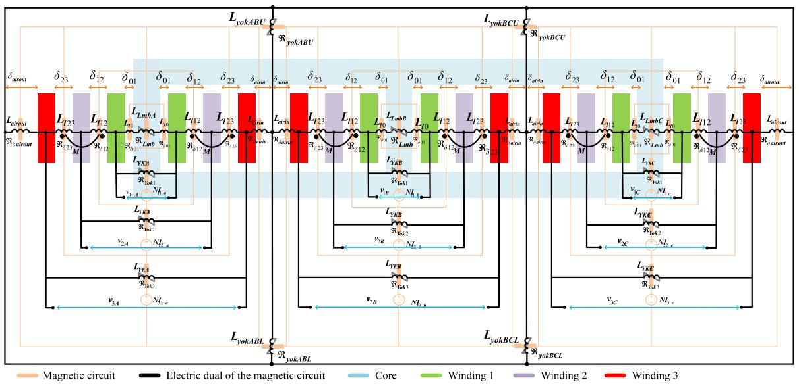  
Fig. 1. The magnetic circuit and its electric dual for a three-phase, three-winding, three-limb core structure, considering the zero-sequence path.

This node represents the outer ring in the electric dual circuit shown in Fig. 1, which magnetically corresponds to the flux return path through the tank of the transformer.

The inclusion of the ‘‘TANK’’ node as an external node addresses the issue of the floating circuit, which contains multiple inductive cutsets, some of which are non-linear. Such a configuration can cause numerical chatter and make the simulation unstable. By providing the ‘‘TANK’’ node, a voltage reference is established for this floating network, thereby enhancing simulation stability in the case of a saturable core. It is notable that under no circumstances will current flow into or out of the ‘‘TANK’’ node. This is because the entire black network in Fig. 2 is floating, with no path for current to enter or leave the network. As a result, no current flows through the ‘‘TANK’’ node, and grounding this node does not compromise simulation accuracy.

Note that in Fig. 2 and other figures, only inductive circuits are depicted. However, in the implementation, resistive branches are included across the limb and yoke inductances to model the core loss.

# 3.1. Zero sequence inductance of 3-limb transformers

From the simplified network shown in Fig. 3(b), we derive the network loop equations, where the loop currents correspond to the three-phase terminal currents, as given in (10).

It is important to note that, for simplicity, the effects of limb inductances are not included in (10), as they are in parallel with the voltage sources. These effects are incorporated after solving the equation. Also, since it is a simulation of zero sequence test, it is considered that $V _ { a } = V _ { b } = V _ { c } = V _ { s } \angle 0 .$ .

$$
\left[ \begin{array}{l} I _ {a} \\ I _ {b} \\ I _ {c} \end{array} \right] = - j \cdot \left[ \begin{array}{c c c} \alpha & - X _ {y} & 0 \\ - X _ {y} & \beta & - X _ {y} \\ 0 & - X _ {y} & \alpha \end{array} \right] ^ {- 1} \cdot \left[ \begin{array}{l} V _ {s} \angle 0 \\ V _ {s} \angle 0 \\ V _ {s} \angle 0 \end{array} \right] \tag {10}
$$

In (10), $\alpha = X _ { 1 3 } + X _ { a i r } + X _ { \nu }$ and $\beta = X _ { 1 3 } + X _ { a i r } + 2 \cdot X _ { y } .$

By analytically solving (10), we obtain the expression presented in (11) for $I _ { a } , I _ { b } ,$ , and $I _ { c }$ .

$$
I _ {a} = I _ {b} = I _ {c} = \frac {V _ {s}}{X _ {\text {a i r}} + X _ {1 3}} \tag {11}
$$

Next, we incorporate the effect of limb inductances into the analysis to account for their contribution to the overall phase currents. With this adjustment, and recognizing that the zero-sequence impedance is defined as the excitation voltage (three in-phase voltages of nominal

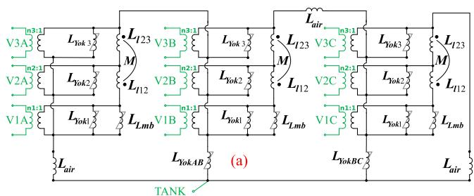

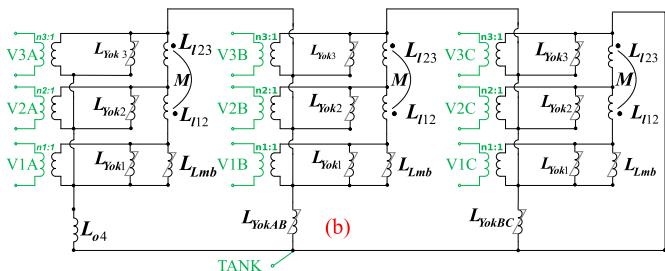

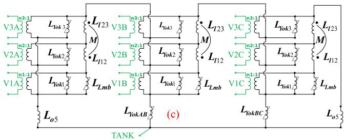  
Fig. 2. The simplified electric equivalent circuit of a three phase, threewinding (a) 3-limb, (b) 4-limb, with the outer limb close to phase A and (c) 5-limb transformer.

values) divided by the arithmetic mean of the phase currents, the zerosequence impedance of the three-limb transformer is determined, as shown in (12).

$$
X _ {z r o} = \frac {V _ {s}}{\frac {1}{3} \left(I _ {a} + I _ {b} + I _ {c} + \frac {3 \cdot V _ {s}}{X _ {l m b}}\right)} \tag {12}
$$

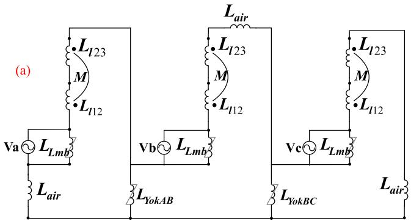

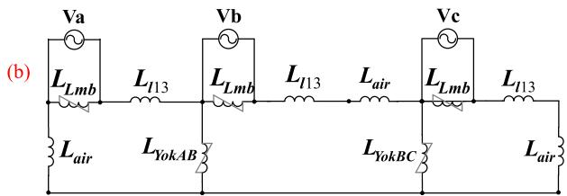  
Fig. 3. (a) The open circuit excitation of the three phase, three-winding threelimb transformer and (b) its simplified equivalent network.

Substituting (11) in (12),

$$
X _ {z r o} = \frac {V _ {s}}{\frac {1}{3} \left(\frac {3 \cdot V _ {s}}{X _ {a i r} + X _ {1 3}} + \frac {3 \cdot V _ {s}}{X _ {l m b}}\right)} \tag {13}
$$

Canceling out $V _ { s }$ from (13), the closed-form expression for the zerosequence impedance of three-limb transformer in (14) will be achieved.

$$
X _ {z r o} = \frac {X _ {l m b} \cdot \left(X _ {a i r} + X _ {1 3}\right)}{X _ {l m b} + X _ {a i r} + X _ {1 3}} \tag {14}
$$

Eq. (15) is rewritten to express the relationship for $X _ { a i r }$ as a function of the limb inductance, $X _ { l m b } ,$ the zero-sequence impedance, $X _ { z r o } ,$ and the leakage inductance between the first and the last winding, $X _ { 1 n } ,$ which in this case is $X _ { 1 3 }$ .

$$
X _ {a i r} = \frac {X _ {l m b} \cdot X _ {z r o}}{X _ {l m b} - X _ {z r o}} - X _ {1 3} \tag {15}
$$

It is notable that in (14), the yoke impedances do not appear in the equation for the zero-sequence impedance, $X _ { z r o } ,$ which emphasizes the fact that the zero-sequence current does not flow through the yoke impedances. Instead, the current circulates in the outer loop of the network depicted in Fig. 3(b). This observation is expected, as it is well known that in the 3-limb transformers, the zero-sequence flux does not pass through the yokes; instead, it flows out of the limbs and into the air and the tank of the transformer.

# 3.2. Zero sequence inductance of 4-limb and 5-limb transformers

Using a similar approach as employed for the 3-limb transformer, closed-form formulas for the outer-limb inductance of 4-limb and 5- limb transformers can be derived. This method is particularly advantageous in scenarios where the open-circuit zero-sequence impedance, $Z _ { z r o } ,$ is provided instead of the outer-limb ratios, $r _ { a y o }$ and $r _ { l y o } .$ .

Fig. 4 illustrates the equivalent open-circuit networks for the threephase, three-winding, 4-limb, and 5-limb transformers. The closed-form formulas for these configurations are derived using the same principles as those applied to the 3-limb case and are presented in (16) and (17), respectively. It is noteworthy that for the 4-limb configuration, the expression for $L _ { o }$ remains unchanged, regardless of whether the outer

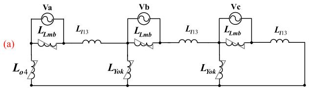

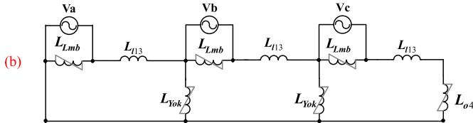

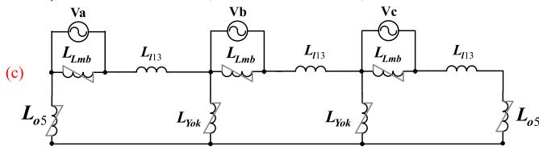  
Fig. 4. The open circuit excitation of the three phase, three-winding (a) 4- limb, 4th limb close to phase A, (b) 4-limb, 4th limb close to phase $\mathbf { C } ,$ and (c) 5-limb .

limb is positioned near phase A or phase $\mathrm { C } ,$ as shown in $\mathrm { F i g . ~ } 4 ( \mathbf { a } )$ and (b).

$$
X _ {o 4} = \frac {9 X _ {z r o} X _ {l m b} X _ {y o k}}{3 X _ {l m b} X _ {y o k} - 3 X _ {z r o} X _ {y o k} - 5 X _ {l m b} X _ {z r o}} \tag {16}
$$

$$
X _ {o 5} = \frac {9 X _ {z r o} X _ {l m b} X _ {y o k}}{6 X _ {l m b} X _ {y o k} - 6 X _ {z r o} X _ {y o k} - X _ {l m b} X _ {z r o}} \tag {17}
$$

Note that in (16) and (17), it is assumed that the leakage reactance $X _ { l 1 3 }$ is negligible compared to other magnetizing reactances, which is a valid assumption. However, in (15), this assumption is not considered valid, as $X _ { l 1 3 }$ and $X _ { a i r }$ are comparable.

Note that unlike the 3-limb core configuration, in the case of 4-limb and 5-limb transformers, the yoke inductances appear in the equations of zero-sequence inductance. This is expected, as the zero-sequence flux must flow through the yokes to reach the outer limbs and complete the path.

# 4. Simulation results and model verification

To validate the proposed method for modeling multi-limb transformers, the TDM-based model introduced in the previous section is implemented in RSCAD-RTDS, an EMT-type simulation program. Multiple simulations are performed to compare the model with the input data, and additional comparisons are conducted against similar models from the PSCAD library as well as some measurements taken from [6].

A three-winding 3-limb transformer data extracted from [6], with specifications listed in Table 1, is considered. The same 3-limb transformer is subsequently treated as a 4-limb and 5-limb transformer solely for simulation purposes, to validate the proposed method and the zero sequence impedance formulas.

# 4.1. Steady state studies

Firstly, the short circuit simulations were carried out, resulting in $\begin{array} { r } { X _ { 1 , 2 } = 0 . 0 7 6 0 4 , \mathtt { p u } , X _ { 1 , 3 } = 0 . 1 1 4 0 6 7 , \mathtt { p u } , } \end{array}$ , and $X _ { 2 . 3 } = 0 .$ 136086, pu, which are very close to the values specified for the transformer in Table 1.

The open-circuit magnetizing current and no-load loss were also recorded, yielding $I _ { m } = 0 . 1 4 0 5 1 \%$ and ???????????????? = 37.098kW, respectively, which align closely with the data provided in Table 1.

Additionally, Table 2 presents the simulation results for opencircuit (o.c.) zero-sequence reactance. In these cases, it is assumed

Table 1 3-Limb transformer specifications and parameters.   

<table><tr><td>Tmva</td><td>50 MVA</td><td>R1,3</td><td>0.4011%</td></tr><tr><td>Freq.</td><td>60 Hz</td><td>R2,3</td><td>0.4785%</td></tr><tr><td>Core Loss</td><td>37.1 kW</td><td>ayok</td><td>310045 mm2</td></tr><tr><td>V1</td><td>138 kV</td><td>almb</td><td>310045 mm2</td></tr><tr><td>V2</td><td>13.8 kV</td><td>ra</td><td>1</td></tr><tr><td>V3</td><td>6.972 kV</td><td>lyok</td><td>2370 mm</td></tr><tr><td>X1,2</td><td>0.076 pu</td><td>limb</td><td>2276 mm</td></tr><tr><td>X1,3</td><td>0.114 pu</td><td>rl</td><td>1.041301</td></tr><tr><td>X2,3</td><td>0.136 pu</td><td>N1</td><td>574</td></tr><tr><td>R1,2</td><td>0.2674%</td><td>Im</td><td>0.140641%</td></tr></table>

Table 2 O.C. zero sequence reactance simulation results.   

<table><tr><td>Case</td><td>3-Limb</td><td>4-Limb</td><td>5-Limb</td></tr><tr><td>Input value (p.u.)</td><td>0.125</td><td>221.0</td><td>379.0</td></tr><tr><td>Simulation (p.u.)</td><td>0.125080</td><td>220.947</td><td>379.056</td></tr></table>

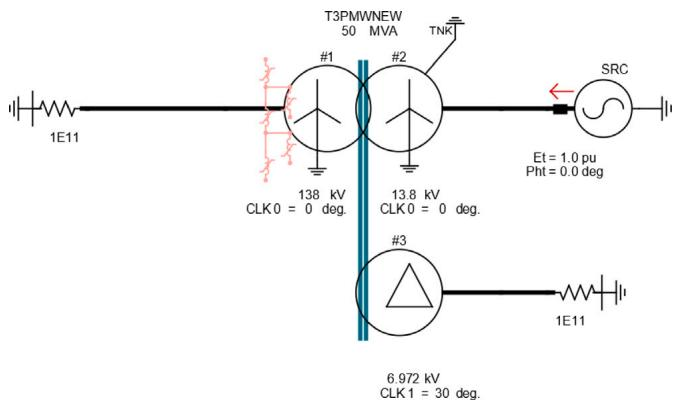  
Fig. 5. The open circuit excitation simulation of the proposed three limb, three-winding transformer in RSCAD.

the same transformer described in Table 1 had 3-limb, 4-limb, or 5-limb core configurations. As mentioned before, this assumption is solely for simulation purposes, to validate the proposed zero sequence impedance formulas. Practical data was used as input for the zerosequence impedance, and the simulation results show an excellent match with the calculated values. These results demonstrate that the closed-form equations proposed in this paper for the zero-sequence path reactances accurately represent the zero-sequence behavior of the transformer in an EMT environment.

# 4.2. Transient behaviors

In order to evaluate the proposed model’s transient response, two case studies are considered: the transformer excitation and the inrush current.

Fig. 5 illustrates the transformer of Table 1 under a no-load scenario in the RSCAD environment, where winding 2 is energized while the other two windings remain open. Here, the transformer is configured as 3-limb with O.C. zero-sequence impedance of 0.125 pu. A similar network was developed in PSCAD using their TDM-based transformer model to facilitate a comparison. The measurement data is also sourced from [6].

In addition, to perform the transient simulations, the transformer is configured with both saturation and hysteresis. A basic model is employed for representing these effects; however, the detailed formulation is beyond the scope of this paper. Table 3 presents the parameters of the hysteresis curve used for the transformer under study.

For excitation validation, the voltage source is gradually increased to nominal value. Fig. 6 compares the three-phase excitation currents

Table 3 Hysteresis curve parameters of the transformer under study.   

<table><tr><td>Parameter</td><td>Value</td></tr><tr><td>Im, (Magnetizing Current)</td><td>0.140641%</td></tr><tr><td>k, (Knee Voltage)</td><td>1.2633 pu</td></tr><tr><td>Xair, (Air Core Inductance)</td><td>0.255408 pu</td></tr><tr><td>Lw, (Hysteresis Loop-width in % of Im)</td><td>14.29%</td></tr></table>

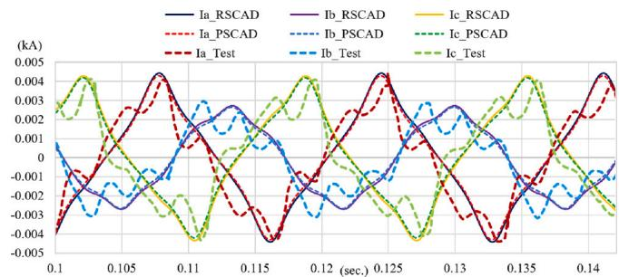  
Fig. 6. The open circuit excitation simulation of the proposed transformer model in RSCAD, PSCAD and from the experimental measurement [6].

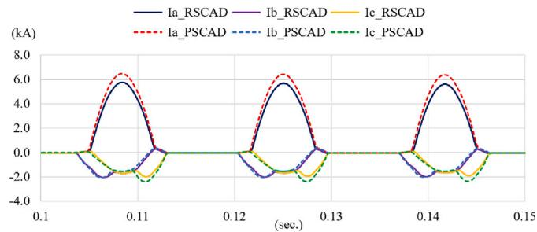  
Fig. 7. The inrush current simulation of the proposed transformer model in RSCAD versus the one from PSCAD.

from the proposed RSCAD model, the PSCAD model, and the measurements. While the two models show similar behavior, both deviate from the measured data. This may result from using the basic hysteresis curve, which may not accurately capture the magnetizing branch non-linearity.

Fig. 7 shows the comparison of the inrush current simulation between the proposed model and the corresponding model from PSCAD. A slight difference can be observed, which could be attributed to the way the models account for winding resistances, zero-sequence impedances and other minor modeling tweaks.

# 4.3. Observations on yoke flux during short-circuit

One key advantage of the proposed model is its accurate representation of yoke flux during short-circuit conditions. During a short circuit, flux becomes trapped in the leakage path between energized and shorted windings. This phenomenon is captured by the proposed model while is absent in the PSCAD model. As discussed earlier, this discrepancy stems from an error in [6], where phase A is connected to phase B, causing the yoke inductances to appear in parallel to the limbs. In reality, short-circuit reactances exist between them, as shown in Fig. 2.

Fig. 8 illustrates this phenomenon in PSCAD model by showing flux versus magnetizing current during a short-circuit study. In this case, nominal voltage is applied to winding 1, and the third winding is shorted. It is evident that the flux in the yoke is as significant as in the limb. In contrast, Fig. 9 shows similar curves for the proposed model in RSCAD, where the yoke flux is nearly zero, accurately reflecting physical behavior during a short circuit.

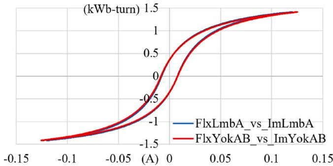  
Fig. 8. The limb and yoke flux versus their magnetizing currents during short circuit study from PSCAD.

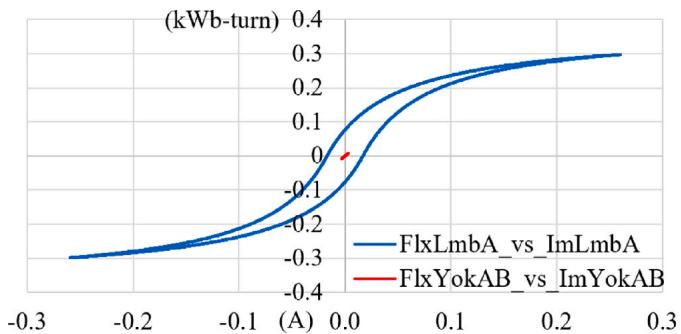  
Fig. 9. The limb and yoke flux versus their magnetizing currents during short circuit study from proposed model in RSCAD.

Table 4 5-Limb transformer specifications and parameters.   

<table><tr><td>Tmva</td><td>390 MVA</td><td>B</td><td>1.741 Tesla</td></tr><tr><td>Freq.</td><td>60 Hz</td><td>ayok</td><td>464469 mm2</td></tr><tr><td>Core Loss</td><td>171.3 kW</td><td>almb</td><td>832250 mm2</td></tr><tr><td>Vector group</td><td>Yny</td><td>lyok</td><td>3601.974 mm</td></tr><tr><td>V1</td><td>238 kV</td><td>lmb</td><td>3382.01 mm</td></tr><tr><td>V2</td><td>22.13 kV</td><td>ra</td><td>0.558088</td></tr><tr><td>X1,2</td><td>0.068 pu</td><td>rl</td><td>1.065039</td></tr><tr><td>R1,2</td><td>0.1297%</td><td>rao</td><td>1.116176</td></tr><tr><td>Xair</td><td>0.210684 pu</td><td>rlo</td><td>0.57891</td></tr><tr><td>Lw</td><td>0.89% of Im</td><td>N1</td><td>338</td></tr><tr><td>k</td><td>1.08497 pu</td><td>Im</td><td>0.125743%</td></tr></table>

# 4.4. Investigating special winding configurations

The response of the transformer model with a ‘‘Yg-y’’ winding configuration in multi-limb transformers is of particular interest in certain cases. This section compares the behavior of a 3-limb transformer (Table 1) and a 5-limb transformer (Table 4) – both sourced from [6] – under an open-phase condition.

In an open-phase condition, a 3-limb transformer can continue to operate as the flux from the other two phases compensates for the missing phase, as illustrated in Fig. 10(a). In contrast, a 5-limb transformer experiences a voltage drop in the missing phase due to the outer limbs providing a path for zero-sequence flux, as shown in Fig. 10(b).

This phenomenon is analyzed using the proposed models in RSCAD and PSCAD for validation and comparison. Both 3-limb and 5-limb transformers are connected to nominal voltage sources on the primary side, unless the phase A which is disconnected. They are also lightly loaded to have some currents in the windings.

Fig. 11 presents the three-phase flux, primary and secondary voltages, and currents for the 3-limb transformer with phase A left open. As shown, the primary current in phase A is zero, yet a fully balanced

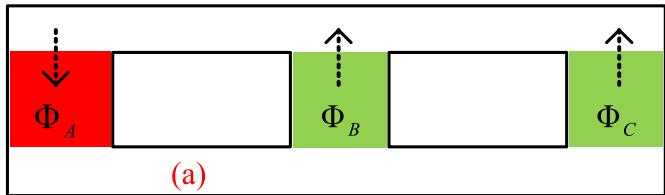

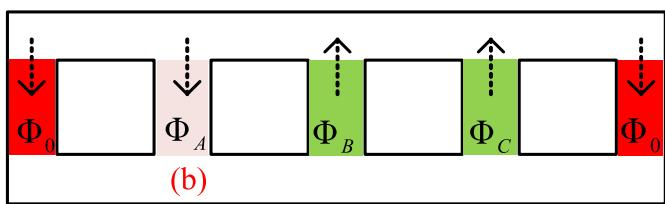  
Fig. 10. Flux distribution in an open-phase scenario for (a) a 3-limb transformer and (b) a 5-limb transformer.

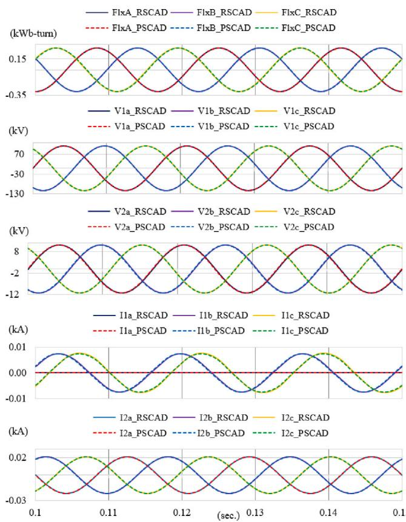  
Fig. 11. From top, limbs’ fluxes, primary, and secondary voltages, and currents during an open-phase scenario for the 3-limb transformer, comparing RSCAD and PSCAD results.

current is maintained on the secondary side. The proposed model in RSCAD produces results consistent with those obtained from the PSCAD model, demonstrating similar responses.

Similar open phase simulation is performed on the 5-limb transformer, shown in Fig. 12. In this case, flux on phase limbs are no longer balanced and significant amount of flux goes through the 4th and 5th limbs. Consequently, voltage of phase A is much smaller in magnitude as well as shifted in angle. Phase A current is also zero in primary (since it was open) and very small in the secondary as expected.

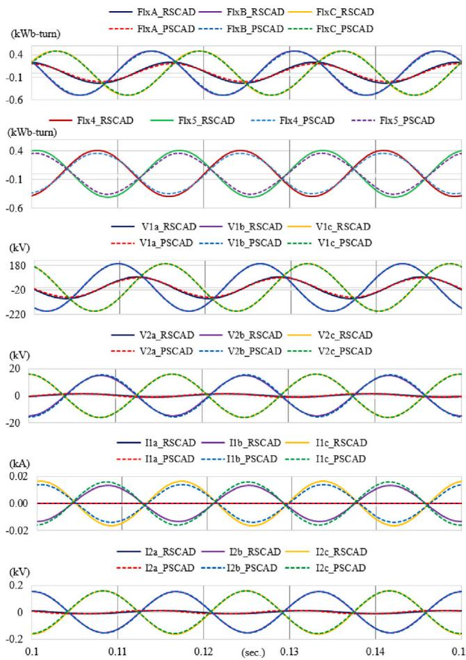  
Fig. 12. From top, phase limbs’ and outer limbs’ fluxes, primary, and secondary voltages, and currents during an open-phase scenario for the 5-limb transformer, comparing RSCAD and PSCAD results.

# 5. Conclusion

This paper presents a comprehensive TDM-based transformer model implemented in RSCAD-RTDS, designed for real-time simulation purposes. The proposed model incorporates advanced features such as multi-limb configurations, multi-windings, distributed magnetizing branches, saturation, hysteresis, and more, making it highly versatile and robust. The model has been extensively validated against offline tools like MathCAD and other simulation platforms such as PSCAD, demonstrating excellent accuracy and reliability.

The model utilizes the Normalized Core Characteristics (NCC) to calculate the limb and yoke inductances. Additionally, it incorporates zero-sequence impedance for the 3-limb configuration and, for the first time, presents a closed-form formula to calculate the zero-sequence inductances for various core configurations.

The validation studies, including steady-state assessments such as short-circuit and zero-sequence scenarios, as well as transient studies like excitation and inrush current comparisons, demonstrate that the proposed model closely matches results obtained from other established tools, i.e. PSCAD.

Furthermore, the model exhibits unique capabilities, such as accurately representing yoke flux behavior during short-circuit conditions— an aspect not captured by other models like PSCAD. These features highlight the model’s ability to handle complex transformer dynamics, making it suitable for various transient and steady-state studies.

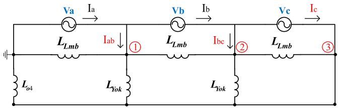  
Fig. 13. Equivalent network for open-circuit excitation of a three-phase 4-limb transformer.

# CRediT authorship contribution statement

Meysam Ahmadi: Visualization, Resources, Investigation, Writing – review & editing, Validation, Formal analysis, Conceptualization, Writing – original draft, Data curation, Software, Methodology, Project administration. Ali Dehkordi: Supervision, Conceptualization, Writing – review & editing, Data curation, Methodology. Yi Zhang: Writing – review & editing, Supervision.

# Declaration of competing interest

The authors declare that they have no known competing financial interests or personal relationships that could have appeared to influence the work reported in this paper.

# Appendix

To compute the values of $L _ { l m b }$ and $L _ { y o k }$ from the magnetizing current $I _ { m }$ and the core aspect ratios $K _ { r }$ and $K _ { r o }$ for the 4-limb transformer in Fig. 2(b), we consider its open-circuit excitation network as shown in Fig. 13. This figure is a simplified version of Fig. 4(a), ignoring the leakage inductances.

Assuming a balanced three-phase voltage (i.e. $V _ { a } + V _ { b } + V _ { c } = 0 )$ and using the corresponding admittances, the nodal equations are written as follows:

$$
\left[ \begin{array}{l} I _ {a b} \\ I _ {b c} \\ I _ {c} \end{array} \right] = \left[ \begin{array}{c c c} \alpha & - Y _ {l m b} & - Y _ {y o k} \\ - Y _ {l m b} & \alpha & \gamma \\ - Y _ {y o k} & \gamma & \beta \end{array} \right] \left[ \begin{array}{l} V _ {a} \\ - V _ {c} \\ 0 \end{array} \right] \tag {18}
$$

In (18), the parameters are defined as $\alpha = 2 Y _ { l m b } + Y _ { y o k } , \beta = Y _ { l m b } +$ $2 Y _ { y o k } + Y _ { o 4 } ,$ and $\gamma = - Y _ { l m b } - Y _ { v o k }$ .

Multiplying both sides of (18) by $X _ { l m b } = 1 / Y _ { l m b } ,$ the left-hand side becomes:

$$
X _ {l m b} \cdot \left[ \begin{array}{l} I _ {a b} \\ I _ {b c} \\ I _ {c} \end{array} \right] = \dots \tag {19}
$$

The right-hand side is transformed into:

$$
\left[ \begin{array}{c c c} 2 + K _ {r} & - 1 & - K _ {r} \\ - 1 & 2 + K _ {r} & - 1 - K _ {r} \\ - K _ {r} & - 1 - K _ {r} & 1 + 2 K _ {r} + K _ {r} K _ {r o} \end{array} \right] \left[ \begin{array}{l} V _ {a} \\ - V _ {c} \\ 0 \end{array} \right] \tag {20}
$$

Using the relation $I _ { m } = ( | I _ { a } | + | I _ { b } | + | I _ { c } | ) / 3$ and analytically solving for $I _ { a } , I _ { b }$ and $I _ { c }$ from (19) and (20), we obtain the final expression as in (21).

$$
X _ {l m b} = V _ {s} \cdot \frac {\sqrt {3 K _ {r} ^ {2} + 3 K _ {r} + 1} + \sqrt {K _ {r} ^ {2} + K _ {r} + 1}}{3 I _ {m}} \tag {21}
$$

# Data availability

No data was used for the research described in the article.

# References

[1] G.R. Slemon, Equivalent circuits for transformers and machines including nonlinear effects, Proc. IEE - Part IV: Inst. Monogr. 47 (7) (1959) 1228–1232.   
[2] D.C. Jiles, D.L. Atherton, Theory of ferromagnetic hysteresis, J. Magn. Magn. Mater. 61 (1986) 48–60.   
[3] F. de Leon, A. Semlyen, Complete transformer model for electromagnetic transients, IEEE Trans. Power Deliv. 9 (1) (1994) 231–239.   
[4] J.S. Song, J.S. Kim, G.J. Cho, C.H. Kim, N.H. Cho, Determination method for zero-sequence impedance of 3-limb core transformer, in: Proc. Int. Conf. on Power Systems Transients, IPST, 2019.   
[5] J.A. Martinez-Velasco, B.A. Mork, Transformer modeling for low frequency transients - The state of the art, in: Proceedings of the International Conference on Power Systems Transients, IPST, New Orleans, USA, 2003.   
[6] M. Shafieipour, W. Ziomek, R.P. Jayasinghe, J.C. Garcia Alonso, A.M. Gole, Application of duality-based equivalent circuits for modeling multilimb transformers using alternative input parameters, IEEE Access 8 (2020) 157046–157060.   
[7] F. de León, J.A. Martinez, Dual three-winding transformer equivalent circuit matching leakage measurements, IEEE Trans. Power Deliv. 24 (1) (2009) 160–168.

[8] C. Alvarez-Marino, F. de Leon, X.M. Lopez-Fernandez, Equivalent circuit for the leakage inductance of multiwinding transformers: Unification of terminal and duality models, IEEE Trans. Power Deliv. 27 (1) (2012) 353–361.   
[9] S. Jazebi, F. de León, Duality-based transformer model including eddy current effects in the windings, IEEE Trans. Power Deliv. 30 (5) 2312–2320, Books.   
[10] P. Kundur, Power System Stability and Control, McGraw-Hill, New York, NY, USA, 1994, Papers Presented at Conferences (Unpublished).   
[11] M. Shafieipour, J.C. Garcia Alonso, R.P. Jayasinghe, A.M. Gole, Principle of duality with normalized core concept for modeling multi-limb transformers, in: Proc. Int. Conf. Power Syst. Transients, IPST, 2019, pp. 1–6.   
[12] W. Enright, O.B. Nayak, G.D. Irwin, J. Arrillaga, An electromagnetic transients model of multi-limb transformers using normalized core concept, in: Proc. Int. Conf. Power Syst. Transients, Seattle, USA, 1997, pp. 93–98.   
[13] W.G. Enright, O. Nayak, N.R. Watson, Three-phase five-limb unified magnetic equivalent circuit transformer models for PSCAD V3, in: Proceedings of the International Conference on Power System Transients, IPST, Budapest, Hungary, 1999.