# Optimized high-frequency white-box transformer model for implementation in ATP-EMTP.

Enrique Esteban Mombello a,* , Guillermo Guidi Venerdini a , Guillermo Andr´es Díaz Florez ´ b

a CONICET, Universidad Nacional de San Juan, Instituto de Energia Electrica, San Juan, Argentina   
b Universidad de La Salle, Bogota, Colombia

# A R T I C L E I N F O

Keywords:

Power transformer

Reduced white-box models

Alternative transient program (ATP)

Transient overvoltages

# A B S T R A C T

Although several high frequency white-box transformer models have been proposed in the literature, the methodology for their implementation in some programs based on EMTP has not been addressed in detail. This is true in particular for ATP, for which the representation of large transformer models is particularly problematic. This work aims to enable the use of ATP to model detailed transformer equivalent circuits, which would otherwise be seriously questioned. To establish these circuit models, the following must be taken into account: model reduction, magnetic circuit decoupling, avoid numerical instability, limit and optimize the use of resistors, generate ATP versions capable of processing large models. To this end, three generally valid methodologies are presented to reduce the model without compromising the accuracy of the calculation results and, finally, additional specific methodologies are implemented to reduce and adapt the models in the ATP environment. The application of these methodologies results in six possible variants of reduced models, which were successfully validated through a case study used by CIGRE JWG A2/C4.52 to verify the accuracy of transformer models.

# 1. Introduction

Power transformers are very important components of power systems. They are very costly assets and their replacement in the event of failure is problematic. The most frequent causes of transformer failures are overvoltages coming from the network. The most studied overvoltages are those due to lightning strikes, the most representative example of the so-called Fast Transients (FT), which represent a threat to transformers. That is why manufacturers have developed various design strategies over time in order to mitigate the effects of these stresses on the internal structure of the transformer. In order to study these effects, it is essential to have efficient analysis tools to be able to predetermine dangerous stresses. High-frequency white-box models are specially designed for this purpose and are widely used in the design stage. Indepth knowledge of the frequency behavior of the inductive impedances of the transformer is necessary to determine reliable models. These models are based on the discretization of the windings, which are divided into sections.

These sections are represented by discrete circuit elements such as self- and mutual inductances, resistances and capacitances [1–5]. All of

these parameters are determined from the geometry of the windings and iron core and the properties of the materials. Each winding section is considered a single inductor, which is magnetically coupled to all other sections. The degree of detail of the discretization must be sufficient to achieve adequate results based on the bandwidth of the applied voltage waveform. There are models of this type able to represent the frequency variation of both inductances and resistances, which is very important in the study of the effects of possible internal resonances in the transformer windings. The models presented in [7,8] are examples of models of this type. The first one is based on an equivalent circuit and the second on a state-space model.

The most widely used EMT-type programs, such as PSCAD, EMTP-RV and ATP, have the ability to model power transformers based on equivalent circuits. The drawback of the detailed model proposed in [7] is the extremely large size of the circuit, which cannot be handled by many programs. An alternative to avoid this problem is to use state-space models, which also entails the problem that not all programs support models of this type with the required characteristics. These latter models generally take the form of terminal (black or gray box) models from white-box state-space models. The introduction of these

terminal (non-circuital) models in EMT programs is neither simple nor straightforward. Recently, methodologies have been proposed for the use of these models, such as reference [9], which presents a direct method by which the model is represented by admittance parameters. Reference [10] shows how to directly include the model [9] in EMTP-RV, without applying a rational fitting. ATP does not support such models. An alternative black-box model with a circuit implementation is described in [11], which applies to all EMT programs. Although this is a circuit model, it is not a white-box model.

White box models are also used to assess the vulnerability of a transformer regarding Very Fast Transients (VFT). In this case the circuit constants are evaluated on turn-to-turn basis directly from the dimensions of transformer winding [12]. To avoid the number of turns or nodes becoming too large, a technique of grouping turns was implemented. The cited reference compares time and frequency domain strategies for modeling and analysis of transformer windings at high frequencies. While time domain analysis requires several combined strategies to extract the equivalent circuit, frequency domain analysis involves the cumbersome inverse Fast Fourier Transformation (FFT) to obtain time-domain results [12]. The authors of [12] add that the model “can be readily used as a usual circuit element in EMTP analysis. Utilizing EMTP, particularly ATPDraw, assures a versatile circuit-building”.

Many authors who have proposed white-box models in the past assumed that they are generally applicable to EMT programs. An example of this is the case of [13], who states "since the model contains only constant parameters, it can be directly interfaced with well-known calculation programs, such as the ATP or EMTP". Although this is partially true, in the specific case of ATP, the interface is not as simple or straightforward when it comes to large white-box models. The objective of this work is to make a contribution in this sense.

Due to its circuit formulation, the model presented in [7] is suitable for use with the Alternative Transients Program (ATP). However, its implementation is not straightforward for two main reasons. First, ATP does not have a large enough model of magnetically coupled inductive branches to represent such a large model. This then requires a prior uncoupling process to be able to enter the model in the form of uncoupled RLC branches. As the number of branches required is very large when applying this methodology, a recompiled version of the ATP must then be used, modifying the dimensions of the internal variables. This represents a difficulty given the in-depth knowledge necessary to be able to carry out these modifications. These recompiled versions are not generally available. The number of branches of the model could be in the order of 1 million for the case study transformer if no reduction technique is applied. This indicates that it is strictly necessary to apply strategies to reduce the size of the model without altering the precision. Several strategies will be described that have made possible not only the implementation of the model [7] in ATP but also its optimization so that its frequency response is adequate throughout the frequency range of interest.

In the present work, several analyzes and contributions are made in relation to the proposed problem, using both general strategies and some specific ones for the transformer model proposed in [7], which are detailed below.

1. The fitting methodology used and the range of validity of the parameters calculated with electromagnetic models of the windings are described (Section 2).   
2. A new methodology is proposed to estimate an initial set of poles for RL impedance fitting (Section 3).   
3. Criteria are provided to adequately fit the behavior of the model at very low frequencies (Section 3).   
4. Brief description of the model proposed in [7] is given (Section 4).   
5. Various methodologies for model reduction are proposed (Section 5).

a) A specific method for the model [7] is used [22]. Its goal is to reduce the number of necessary auxiliary loops while maintaining a correct representation of the frequency behavior of the impedances.   
b) Optimization of the degree of discretization of the model. Valid for all white-box models.   
c) Use of a reduced number of poles for the representation of impedances.

6. Optimization of the resistive model of the main sections so that no additional nodes are generated, preserving the accuracy of the results (Sections 7 and 8).   
7. Application of an uncoupled inductive model as a workaround for the ATP limitation on the number of available coupled branches (Sections 7 and 8).   
8. Application of additional measures in relation to the consequences of the application of the solution given in 6 for the calculation of transients (Sections 7 and 8).   
9. Modification of ATP size limits to finally achieve a successful implementation of the model (Section 7).   
10. The characteristics of six models suitable for application in ATP are given (Sections 6 to 8).   
11. Application example showing the interaction of the transformer model with network components (Section 7).

The merit of the work is to bring together all these elements, within which there are some original contributions to the state of the art, around the solution of the problem posed. One of the main contributions are the specific models mentioned in 10, which are the result of using the combined reduction strategies given in 5, being 5c specific to model [7]. One of these models is used to generate the example mentioned in 11. The specific implementation details and criteria cited in 6 to 9 are also important contributions as a whole.

# 2. Characterization of transformer inductive impedances at high frequencies

The system of magnetically coupled impedances can be represented mathematically as a matrix whose elements are complex and frequencydependent. The real parts of these impedances are resistances that increase continuously with frequency. The imaginary parts are inductive reactances, which are in turn a function of the inductances, which decrease with frequency [3]. The earliest representations of inductive components in high-frequency transformer models merely consisted of a matrix of constant inductances. This type of model has been used in the past to predetermine impulse voltage stresses due to lightning [14]. At that time, it was considered that this representation was sufficient because the goal was to determine the maximum voltage at the initial stage of the phenomenon, which is practically unaffected by the resistive component or by the dependence of the parameters with frequency. One hypothesis for the validity of the above is that there are no resonances during the transient. However, transients of a more complex type can appear in transformers [4,5], exciting internal resonances [6], which has caused many failures. A suitable transformer model to investigate this type of phenomenon cannot merely consist of an inductance matrix, but must contain a representation of damping, which is vital during resonances. In circuit models the damping of the windings is represented by resistors. Since damping is highly variable with frequency, a representation by constant resistors is not suitable. This makes it necessary to use a more complex model, which considers frequency-dependent resistances. However, it is not possible to conceive a model with physical meaning based on frequency-dependent resistances and constant inductances since network theory imposes a certain relationship between the real and imaginary parts of the impedances [15]. This implies that both parts of the impedance must be frequency dependent, since they are closely related.

# 2.1. Analysis of the frequency behavior of inductive impedances

Next, the behavior of inductive impedances as a function of frequency will be analyzed. Wilcox et al. [16] investigated this behavior and proposed analytical methods for its determination. This reference shows comparisons of measured and calculated impedances of transformer coils as a function of frequency. Abeywickrama and others [17, 18] also made contributions in relation to the computation of parameters of power transformer windings for use in frequency response analysis. The typical behavior shown in the cited references is replicated in the results obtained from electromagnetic field calculations in the research carried out in [7]. As an example, the self-inductance and resistance of section 181 of the high-voltage winding of the case study transformer are shown in Fig. 1 (see description in Section 3.3). It can be seen there that the inductance shows a decrease with frequency that is especially apparent in a certain frequency region, where it drops sharply, and then continues to decrease more smoothly. The resistance also exhibits a change in behavior in the aforementioned frequency region, which is clearly observed on a double logarithmic scale.

# 2.2. Influence of capacitances and discretization of the model

In addition to the magnetic effect, there is a capacitive effect on the winding impedances at high frequencies. At nominal frequency the capacitive effect is negligible and an adequate model for that frequency represents only the variables related to magnetic effects. For the analysis of FT or VFT phenomena, the capacitive effect is of primary importance. Traditionally these effects have been treated separately in transformer models. This procedure is similar to that used when modeling transmission lines by discretizing them with pi circuits. In fact, there are transformer models based on line theory [3]. The length of the section to be represented depends on the frequency range of the transient phenomenon to be modeled. For the model to be valid, the travel time in the smallest winding segment of the model must be at least 10 times smaller than the period of the highest frequency of interest [2].

It is important to note that the capacitances used in the transformer models have always been considered as constant values since it has not been proven that there is a frequency dependence of sufficient magnitude to alter the transient voltage calculations.

# 3. Modeling the inductive impedances of the transformer

# 3.1. General aspects

The frequency-dependent impedances of the transformer can be represented with circuits consisting of constant resistances and self- and mutual inductances using the appropriate model [7,8]. Like all RL circuits, these frequency-dependent impedances can be satisfactorily

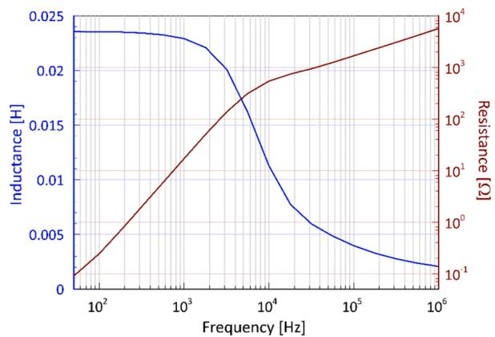  
Fig. 1. Self-inductance and resistance of section 181 of the high-voltage winding of the case study transformer.

represented by rational functions. These functions can in turn be expressed by a partial fraction expansion in the classical form as

$$
\boldsymbol {Z} _ {g} (s) = \boldsymbol {R} _ {\infty} + s \boldsymbol {L} _ {\infty} + \sum_ {k = 1} ^ {N} \frac {\boldsymbol {C} _ {k}}{s + \lambda_ {k}} \tag {1}
$$

In this expansion the poles $a _ { k } ,$ which are negative real values, are represented by the positive parameters λk where $\lambda _ { k } = - a _ { k } .$ In this expansion, the parameter matrices $\scriptstyle R _ { \infty }$ and $\scriptstyle L _ { \infty }$ represent the impedance values for very high frequencies, since for that condition the summation terms tend to zero. There is another way of representing the same impedance, but formulated in such a way that the terms outside the summation represent the impedance values at low frequencies. This expression is as follows

$$
\boldsymbol {Z} _ {g} (s) = \boldsymbol {R} _ {m} + s \boldsymbol {L} _ {m} - s ^ {2} \sum_ {k = 1} ^ {N} \frac {\boldsymbol {K} _ {k}}{s + \lambda_ {k}} \tag {2}
$$

This last way of expressing the expansion is more convenient when representing the inductive impedance of the windings of a transformer, since the low-frequency parameters are easily accessible. This makes it possible to fit them properly so that the transient process to be simulated starts from the correct initial conditions. On the other hand, this type of expression is precisely the one used in the model developed in [7], which is conceived as an emulation of the effect of eddy currents through current loops coupled with the windings. Both formulations are completely equivalent as shown in [7].

Taking into account the expression (2) and the fact that in the frequency domain is $\begin{array} { r } { s = j \omega , } \end{array}$ the impedance matrix of the magnetic model can be expressed as follows:

$$
\boldsymbol {Z} _ {g} = \boldsymbol {R} _ {m} + j \omega \boldsymbol {L} _ {m} + \omega^ {2} \sum_ {k = 1} ^ {N} \frac {\boldsymbol {K} _ {k}}{\lambda_ {k} + j \omega} \tag {3}
$$

Multiplying and dividing each term of the sum by the conjugate of the denominator and then separating the real and imaginary parts, we finally obtain the matrix expressions of the resistances and inductances as a function of ω

$$
\boldsymbol {R} _ {g} = \boldsymbol {R} _ {m} + \sum_ {k = 1} ^ {N} \lambda_ {k} \frac {\omega^ {2}}{\lambda_ {k} {} ^ {2} + \omega^ {2}} \boldsymbol {K} _ {k} \tag {4}
$$

$$
\boldsymbol {L} _ {g} = \boldsymbol {L} _ {m} - \sum_ {k = 1} ^ {N} \frac {\omega^ {2}}{\lambda_ {k} ^ {2} + \omega^ {2}} \boldsymbol {K} _ {k} \tag {5}
$$

These function expressions are the ones that will be used in the models to represent frequency-dependent impedances.

# 3.2. Criteria for selecting initial poles

The most notable characteristic of the frequency behavior of im pedances is the relatively steep drop in inductance at a given frequency. This frequency corresponds to the main pole and is characterized in that the corresponding inductance value is approximately half the inductance value at low frequencies. In this way the main pole can be roughly estimated. Considering that the frequency range of influence of each pole covers approximately a decade, the additional initial poles to be considered should be located so that the distances between them are in the mentioned range starting from the main pole. Furthermore, it has been experimentally determined that it may be desirable to locate a pole at a lower frequency than that of the main pole to allow a good fitting in the low-frequency region. Another element of judgment to consider is that in the case study considered in this work and in the cases observed in the literature $[ 3 , 1 6 ]$ the main pole is located in the range 1–10 kHz. The above suggests that to obtain a good fitting assuming a frequency range of 100 Hz - 1 MHz, at least two additional poles are needed in the high-frequency zone. This means that the minimum number of poles is 4. It will be seen in the next sections that 5 poles improve the fitting

obtained with 4 poles and additionally the frequency range of validity of the approximation is extended. Although the increase in size of the 5-pole model with respect to the 4-pole model is not excessive, this could be a drawback when implementing the model in ATP.

# 3.3. Determination of the parameters of the case study model

The case study used to validate the results of this work is the same transformer used in [7] and [8]. It is a 50 MVA three-winding singlephase transformer with a nominal voltage of 230 $/ \sqrt { 3 } , 6 9 / \sqrt { 3 } ,$ 13.8 kV at 60 Hz. This transformer was used by the CIGRE JWG A2 / C4.52 to validate various types of transformer models. The layout of the windings is shown in Fig. 2. The transformer was modeled using $n _ { n d } = 2 1 9$ nodes and n = 213 inductive branches (winding sections). A more detailed description of this transformer can be found in [7,8].

The high-frequency transformer model is formulated from the discretization of the windings, which are divided into a convenient number of sections. A suitable model must be constructed in such a way that the travel time in the smallest winding section must be 10 times smaller than the period of the higher frequency component of interest of the overvoltages [2]. Once the winding sections have been defined, the basic data of the model are calculated, which consist, on the one hand, of the frequency-dependent matrix of inductive impedances of the winding sections and, on the other hand, of the capacitance matrix of the windings. To determine the corresponding case study parameters, the Finite Element Method (FEM) was applied. The software used was FEMM [19]. The frequencies used in the calculation of the inductive impedances were 18 in total, namely 0.05, 0.1, 0.18, 0.32, 0.56, 1, 1.8, 3.2, 5.6, 10, 18, 32, 56, 100, 180, 320, 560 and 1000 kHz. Details regarding the electromagnetic model of the case study transformer and its implementation in FEMM can be found in reference [7].

Once the 18 matrices have been obtained, which are a discrete representation of the frequency behavior of the inductive impedances, they must be fitted to expression (6). This is carried out by applying an algorithm that combines Vector Fitting (VF) with Particle Swarm Optimization (PSO) to the data [7], first obtaining a type (1) expansion, which then becomes a type (2) one. The corrected initial fitting obtained with VF yielded results that, while guaranteeing the positivity of the impedance expansion residue matrices, deteriorated the solution. The impedances to be fitted in the case of the proposed transformer white-box model present a very smooth frequency behavior and the location of the poles of an expansion to obtain a good fitting are in a range that is not so narrow as in other cases. After residue matrices correction, the poles remain unchanged. In this case it is necessary to also perturb the poles to obtain an acceptable fitting and that is the reason why PSO was applied together with VF. Details of the optimization algorithm can be found in reference [7].

In the following section, the impedance of section 181 of the high

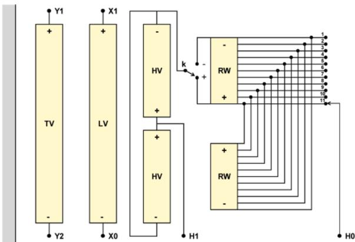  
Fig. 2. Case study transformer.

voltage winding of the case study transformer is analyzed as an example. Eq. (2) was used to build the approximation of the real and imaginary parts of this impedance in the range 50 Hz - 1 MHz, the latter being the maximum frequency for which the model is considered valid. Applying the criteria given in Section 3.2, the number of poles to use in the approximation should be 4 or 5. The results of the fitting of the chosen impedance function using 4 and 5 poles are shown in the next section. An extended high-frequency range was used for the function plots to show the behavior of the expansions for higher frequencies.

# 3.3.1. Modeling with 4 poles

In the case of four poles, the optimization process yielded the values of $\lambda _ { \mathbf { k } }$ shown in Table 1.

In this case a very good precision fit is achieved using a minimum number of poles for impedance functions whose original data covers a range of 5 decades (50 Hz - 1 MHz). Fig. 3 shows the fittings for the inductance and resistance of the analyzed impedance. The extrapolation beyond 1 MHz obtained from the expansion has been drawn in dashed lines. It can be seen that as soon the frequency range of the data is exceeded (1 MHz), the expansion tends rapidly to $\scriptstyle R _ { \infty }$ and $\scriptstyle L _ { \infty }$ of (1) for the given impedance.

# 3.3.2. Modeling with 5 poles

For the 5-pole case, the optimization process yielded the values given in Table 2. In this case the impedance matching error is lower than in the 4-pole case. It can be noted that the first two poles varied very little with respect to those found in the 4-pole case. The remaining three poles differ, since they must be strategically distributed to cover the same frequency region. Pole 3 is smaller than that of the 4-pole fit and pole 5 is larger than pole 4 of the 4-pole fit, located outside the frequency region of the impedance data (see Table 2).

This gives the fit the ability to reasonably match at frequencies slightly higher than 1 MHz.

This characteristic can be better visualized in the resistances than in the inductances, since the latter decrease approaching zero and it is difficult to appreciate it. Comparing the respective resistance plots in Fig. 3, it is clearly seen that for 5 poles the theoretical trend is better represented for frequencies above 1 MHz.

# 3.3.3. Analysis of the low-frequency parameters $R _ { m }$ and $L _ { m }$

# Resistances ${ \pmb R } _ { m }$

As can be seen in Fig. 3, the DC resistance is several orders of magnitude lower than that at high frequencies. Despite the fact that VF is used with a weight that is inversely proportional to the absolute value of the impedance, the fitting results of the partial fraction expansions have very low sensitivity with respect to $\mathbf { R } _ { m } .$ . This can be explained by the fact that the DC impedance has practically no resistive part. This lack of sensitivity causes the results for $\pmb { R } _ { m }$ to have very large errors. It is also fair to say that they are not of the slightest importance when calculating fast transients. Even so, if the model is required to work well at low frequency, the $\pmb { R } _ { m }$ matrix delivered by the fitting process can be replaced with another one calculated at low frequency or in DC. This matrix will result in a diagonal matrix whose elements are the DC resistances of each section. Substitution is performed directly in the expansion (2).

# Inductances $L _ { m }$

The case of $L _ { m }$ is somewhat more complicated. The determination of the values of the frequency-dependent impedance matrices with FEM, which are the starting data for the construction of the model, are carried out using a core permeability value that is much lower than the actual one. For the transformer used as a case study, the actual value of $\mu _ { r }$ is in

Table 1 Impedance expansion poles [kHz].   

<table><tr><td>k</td><td>1</td><td>2</td><td>3</td><td>4</td></tr><tr><td>λk [kHz]</td><td>0.670</td><td>7.058</td><td>93.0</td><td>772.8</td></tr></table>

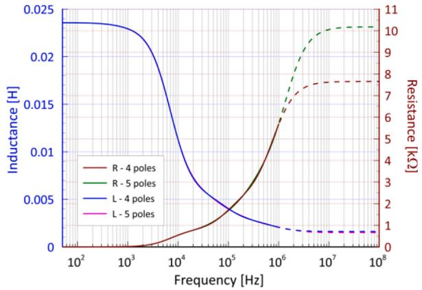  
Fig. 3. Inductance and resistance of winding section 181 fitted using 4 and 5 poles.

Table 2 Impedance expansion poles [kHz].   

<table><tr><td>k</td><td>1</td><td>2</td><td>3</td><td>4</td><td>5</td></tr><tr><td>λk [kHz]</td><td>0.689</td><td>6.968</td><td>66.527</td><td>276.81</td><td>1393.1</td></tr></table>

the order of 25,000 and the recommended value for the calculation is 500 [18]. This avoids the problem of having to deal with very high impedance values during FEM calculations, thus losing the sensitivity to the presence of leakage flux, which is of vital importance to characterize the transient behavior of the transformer. In addition, since the transient behavior is determined mainly by the leakage flux, the use of a reduced value of the permeability does not affect the calculations. However, it could affect the sinusoidal steady state prior to the transient, which in many cases is the starting point in calculations. This is so because a reduction in the high permeability of the core causes a distortion in the transformation ratio of the windings. The correction strategy is to add a constant inductance to each turn of the windings [20].

# 4. General structure of the transformer white-box model

The inductive impedances of the transformer expressed in the form

(2) can be integrated into an equivalent circuit designed to represent their frequency dependence, considering also the damping. Reference [7] proposes a model of the winding section system represented in Eq. (2) using an equivalent circuit as shown in Fig. 11. This equivalent circuit turns out to be an expanded version of the classical high-frequency transformer equivalent circuit that is based on a network made up of constant resistances and inductances. As can be seen in Fig. 4, the representation of the frequency-dependent impedances is carried out by adding auxiliary inductive loops to the circuit [7].

The frequency-dependent impedances described by (2) can be interpreted by means of the following coupled circuit equation system [7].

$$
\left[ \begin{array}{l} \boldsymbol {u} _ {m} \\ \boldsymbol {u} _ {a} \end{array} \right] = \left[ \begin{array}{c c} \boldsymbol {Z} _ {m} & s \boldsymbol {M} \\ s \boldsymbol {M} ^ {T} & \boldsymbol {Z} _ {a} \end{array} \right] \left[ \begin{array}{l} \boldsymbol {i} _ {m} \\ \boldsymbol {i} _ {a} \end{array} \right] \tag {6}
$$

$$
\mathbf {Z} _ {m} = \mathbf {R} _ {m} + s \mathbf {L} _ {m} \tag {7}
$$

$$
\mathbf {Z} _ {a} = \mathbf {R} _ {a} + s \mathbf {L} _ {a} \tag {8}
$$

where ${ \cal Z } _ { m } , { \cal R } _ { m }$ and $L _ { m }$ are the impedance, resistance and inductance matrices of the winding section branches, or main branches; $\mathbf { \mathcal { Z } } _ { a } , \mathbf { \mathcal { R } } _ { a }$ and ${ \cal L } _ { a }$ are the impedance, resistance and inductance matrices of the auxiliary branches for modeling the frequency dependence of the main branches; $i _ { m } , i _ { a }$ are respectively the current vectors of the main and auxiliary branches and $\pmb { u } _ { m } , \pmb { u } _ { a }$ are respectively the voltage vectors of the main and auxiliary branches.

As it can be seen in ${ \mathrm { F i g . ~ } } 4 ,$ the auxiliary loops are short-circuited so that the voltages of the auxiliary branches are zero $( { \pmb u } _ { a } = 0 )$ .

This yields

$$
\mathbf {Z} _ {g} = \mathbf {Z} _ {m} - s ^ {2} \mathbf {M} \mathbf {Z} _ {a} ^ {- 1} \mathbf {M} ^ {T} \tag {9}
$$

Assuming now that the auxiliary loops do not have mutual inductances between each other, the matrix $\scriptstyle { Z _ { a } }$ turns out to be diagonal. Taking this into account, the auxiliary loops can be organized forming a group of circuits for each pole, which leads to the triple product of matrices in (9) becoming

$$
\boldsymbol {M} \boldsymbol {Z} _ {a} ^ {- 1} \boldsymbol {M} ^ {T} = \sum_ {k = 1} ^ {N} \boldsymbol {M} _ {k} \boldsymbol {Z} _ {a k} ^ {- 1} \boldsymbol {M} _ {k} ^ {T} \tag {10}
$$

Since the ${ z } _ { a k }$ submatrices are also diagonals, their inverses are

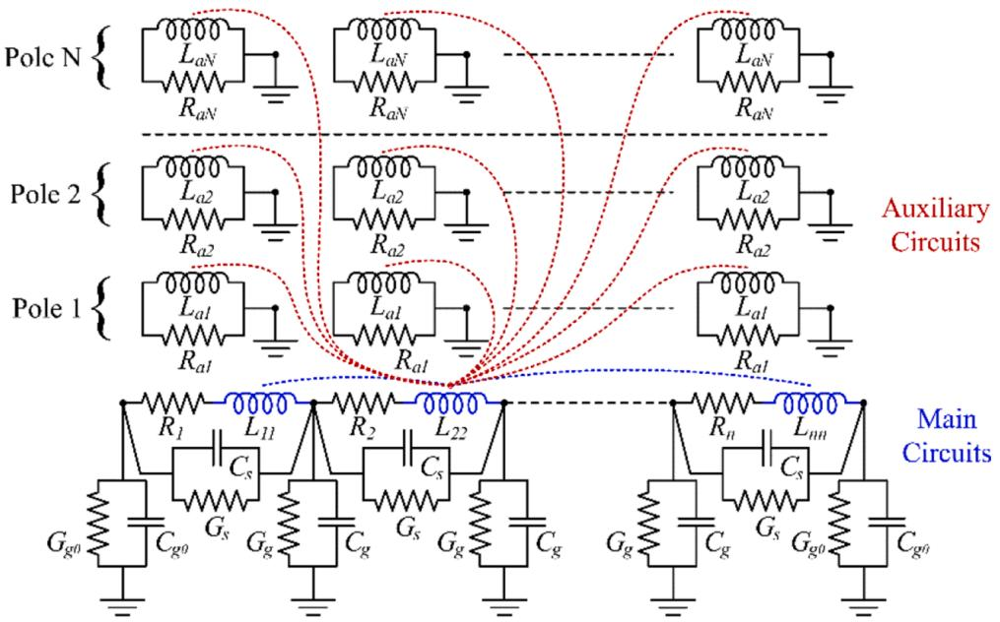  
Fig. 4. Equivalent circuit for frequency-dependent inductances modeling.

$$
\boldsymbol {Z} _ {a k} ^ {- 1} = \operatorname {d i a g} \left(\frac {1}{R _ {a k} + s L _ {a k}}\right) = \frac {1}{s + \lambda_ {k}} \boldsymbol {L} _ {a k} ^ {- 1} \tag {11}
$$

where

$$
\lambda_ {k} = \frac {R _ {a k}}{L _ {a k}} \quad k = 1, \dots , N \tag {12}
$$

therefore, (9) becomes

$$
\mathbf {Z} _ {g} = \mathbf {Z} _ {m} - s ^ {2} \sum_ {k = 1} ^ {N} \frac {\mathbf {M} _ {k} \mathbf {L} _ {a k} ^ {- 1} \mathbf {M} _ {k} ^ {T}}{s + \lambda_ {k}} \tag {13}
$$

Comparing (2) with (13) yields

$$
\boldsymbol {K} _ {k} := \boldsymbol {M} _ {k} \boldsymbol {L} _ {a k} ^ {- 1} \boldsymbol {M} _ {k} ^ {T} \quad k = 1, \dots , N \tag {14}
$$

It should be noted that matrices $\pmb { K } _ { k }$ are numerical values obtained by applying VF, while the right member of (14) represents a family of possible matrices that match this equation. There exist many possible solutions for the matrices $\pmb { M } _ { k }$ and $\scriptstyle L _ { a k } ,$ so as to fulfill (14).

Note that all submatrices in (13) have dimension $n \times n$ in the full model. Considering the case study transformer, its discretization has been carried out using n = 213 sections, which does not seem to be an excessive value. As already mentioned above, the number of poles used for the full model was N = 5 poles. The dimension of the expanded inductance matrix of the equivalent circuit shown in Fig. 4 becomes n(N $+ \ 1 ) = 1 2 7 8$ . But these values are far from being compatible with ATP. This program does not allow data to be entered in inductance matrix form if its order is greater than 40. This could be solved using an uncoupled model, represented only by RLC type branches. The drawback of using a model without applying any reduction is the large number of uncoupled inductive branches generated, which for the case study analyzed would be 1,121,253 if intermediate nodes are considered in each main branch necessary for the connection of the resistors. This number of branches is huge and cannot be entered into ATP since the maximum number of circuit components is limited. Consequently, a significant reduction in model size is required for its application with ATP. It can be stated in general then that, if the number of sections of the transformer to be modeled is large, a large number of auxiliary loops will be required, which represents a drawback. This is so because, on the one hand, it requires a greater calculation effort and, on the other hand, it may even prevent its use with ATP due to limitations in the number of circuit elements that can be processed. Next, three strategies aimed at reducing the model will be proposed.

# 5. Reduction of the inductive model of the transformer

# 5.1. Optimization of the degree of discretization

If the size of the model represents a problem to the point of preventing its implementation in EMTP-based software, there is always the alternative of reducing the number of sections. This must always be done meeting the condition given in Section 2.2 regarding the relationship of the size of the section and the highest frequency of interest [2]. In the case study analyzed, the fact that the degree of discretization of the tertiary winding was greater than that used for the rest of the windings was exploited. This winding was originally represented using 83 winding sections representing one turn each. A reduced model was proposed with only 21 sections representing 4 turns per section. This degree of discretization is more similar to that used with the other windings. This strategy made it possible to reduce the original 213-section model to a 151-section model. Since the basic data of inductances and capacitances was obtained based on a model of 213 sections, it was necessary to convert the parameter matrices to the new dimension. The reduction operations to be performed on the matrices of the inductive impedance model $\mathbf { } { R } _ { m } ,$ L and $\pmb { K } _ { k }$ are based on the fact that this model is a branch model and not a nodal model. On the other hand, the capacitive model is

generally conceived from its origin as a nodal model where capacitances of different types calculated with analytical or numerical procedures are adequately connected to the nodes of the model. That is why the procedures for reducing the inductive and capacitive matrices are different.

The reduction of the parameter matrices of the inductive model are based on the reduction of the $z _ { g }$ matrix in (2). Since (2) relates the parameter matrices ${ \pmb R } _ { m } , { \pmb L } _ { m }$ and $\pmb { K } _ { k }$ with $z _ { g }$ through a sum, the operations to be applied to them are the same as those to be applied to $z _ { g } .$ . The reduction is based on the procedure of connecting a certain number of sections in series to form a single section. Thus, the voltage of the new section is the sum of the voltages of the primitive sections and the current in them is the same and equal to that of the new section. From the point of view of the matrix formulation $( 2 ) ,$ , this means adding the rows of $z _ { g }$ that correspond to the sections to be merged and converting them into a single row, and the same must be done with the respective columns. This procedure should be applied to each group of sections to be merged into a single equivalent section. Based on the above, this procedure was applied to each of the matrices ${ \pmb R } _ { m } , { \pmb L } _ { m }$ and $\pmb { K } _ { k }$ separately. As a consequence of this operation, the dimensions of the matrices were reduced.

The analysis of the capacitive model was carried out independently of the inductive one, as if it were a pure capacitive circuit. The reduction of the parameter matrices of the capacitive model is based on the following nodal model

$$
\boldsymbol {v} = \boldsymbol {Y} _ {C} \boldsymbol {i} \tag {15}
$$

where v is the vector of node voltages, i is the vector of currents injected to the nodes and $\pmb { Y } _ { \mathrm { C } }$ is the nodal admittance matrix of the capacitive model.

The reduction is based on identifying the nodes that are no longer wanted to be an explicit part of the model and placing them in the last rows and columns, partitioning the system as follows

$$
\left[ \begin{array}{l l} \boldsymbol {Y} _ {C 1 1} & \boldsymbol {Y} _ {C 1 2} \\ \boldsymbol {Y} _ {C 2 1} & \boldsymbol {Y} _ {C 2 2} \end{array} \right] \left[ \begin{array}{l} \boldsymbol {v} _ {1} \\ \boldsymbol {v} _ {2} \end{array} \right] = \left[ \begin{array}{l} \boldsymbol {i} _ {1} \\ \boldsymbol {0} \end{array} \right] \tag {16}
$$

where $\nu _ { 1 }$ is the vector of node voltages that remain in the model and $\nu _ { 2 }$ is the vector of node voltages of nodes that are to be eliminated. It is based on the fact that in the latter there are no current injections. From (16) it follows that the equation of the reduced system is

$$
\boldsymbol {v} _ {1} = \left(\mathbf {Y} _ {C 1 1} - \mathbf {Y} _ {C 1 2} \mathbf {Y} _ {C 2 2} ^ {- 1} \mathbf {Y} _ {C 2 1}\right) i _ {1} \tag {17}
$$

Taking into account a pure capacitive system, the nodal matrix of equivalent capacitances is

$$
\boldsymbol {C} _ {e q} = \boldsymbol {C} _ {1 1} - \boldsymbol {C} _ {1 2} \boldsymbol {C} _ {2 2} ^ {- 1} \boldsymbol {C} _ {2 1} \tag {18}
$$

From the nodal matrix given in (18) the capacitances to be connected between the different nodes of the model are calculated, possibly eliminating elements with extremely low values so as not to have to use an excessive number of branches in ATP.

The reduced model described was used for the calculation of transient voltages for the connection configuration of the case study transformer shown in Fig. 5.

Figs. 6 and 7 show the voltages at terminals X1 and Y1 when a standard lightning-impulse voltage is applied to terminal H1. The voltage values are expressed in per unit of the peak value of the applied impulse. Three curves are depicted in each figure, the measured voltage, the voltage calculated with the full model (M1) and the voltage calculated using the model having a reduced number of sections for the tertiary winding (M3). For the complete description of the models see Section 6. It should be noted that these calculations were performed using the state-space model proposed in [8] and not with ATP, since the complete model is not compatible with this program. ATP calculations from even more optimized models will be shown later in Section 7. It can be seen that both models whose responses are shown in Figs. 6 and 7 can

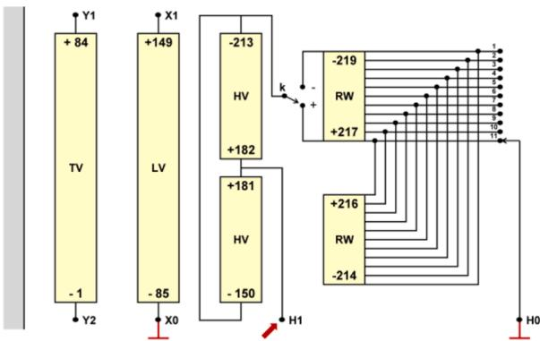  
Fig. 5. Connection diagram of the case study transformer for calculating transient voltages.

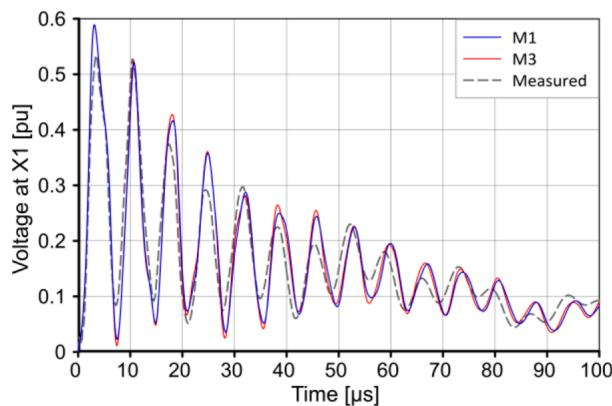  
Fig. 6. Comparison of transient voltages at X1 calculated with models M1 and M3.

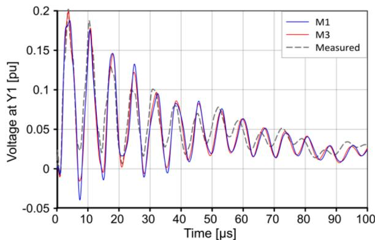  
Fig. 7. Comparison of transient voltages at Y1 calculated with models M1 and M3.

be considered valid for assessing the severity of the overvoltages since the differences between them are small. Moreover, these differences are smaller than those with the measured voltages.

It can then be concluded that by applying an optimization of the degree of discretization, smaller models can be obtained that yield results of comparable precision. This reduced inductive model could be represented in ATP theoretically by 565,516 decoupled inductive branches, which, although they are much less than those corresponding to the model with greater discretization of the tertiary winding, are still too many for ATP. Therefore, it is necessary to further reduce the model by other means.

# 5.2. Reduction by low-rank factorization

Although the optimization of the discretization of the model leads to a smaller model, its size is still excessive. Fortunately, there is the possibility of reducing the size of the model by acting directly on the parameters in the summation of (2), since no restriction is set on the number of auxiliary loops m to be used in each group of loops assigned to each pole. The number of auxiliary loops has a direct relationship with the dimension of the matrix of mutual inductances $\pmb { M } _ { k }$ between the auxiliary loops assigned to pole k and the main winding sections. The row dimension of $\pmb { M } _ { k }$ must be $n ,$ but the column dimension m is not restricted in general. The natural choice used in the past was that $m = n ,$ , i.e., the number of loops of each group of auxiliary loops is equal to the number n of winding sections. In the original version of the model the dimension of the matrices $\pmb { M } _ { k }$ is n × n, i.e., they are square matrices, and are part of the inductance matrix of the complete system. The matrix M has been subdivided into $N = 5$ groups in the case of the full model as in [7]. These groups correspond to an equal number of poles in (2), so that M has dimension n × nN.

The inductance matrix that would be used if there were no need to represent the variable losses with frequency would be only $L _ { m } ,$ whose dimension is $n \times n ,$ but if a representation of the frequency dependence is desired, the inductance matrix becomes $L ,$ of dimension $n ( N + 1 ) \times n$ $( N + 1 )$ . This is a noticeable increase in size, even though such a matrix is not explicitly used, but the matrix M. To reduce the size of the model, it is necessary that the submatrices $\pmb { M } _ { k }$ have a number of columns less than n, so that the matrix M has a smaller column dimension. Reference [21] proposes the factorization of the matrix $\pmb { K } _ { k }$ of rank n so that the resulting $\pmb { M } _ { k }$ matrices have rank $m < n ,$ obtaining an approximation of $\pmb { K } _ { k }$ that hardly differs from the original.

# 5.2.1. Application to the full model of the case study

The procedure proposed in [21] was applied to the full model M1 of the case study transformer (see Section 6), resulting in a reduction in the ranks of the submatrices of approximately 50%, as seen in Table 3.

The criterion used to evaluate the degree of deviation of the frequency response of the reduced model with respect to the full model was evaluated through the Normalized Correlation Coefficient (NCC), used by the Chinese standard DL/T911- 2004 for the diagnosis of faults in transformers using FRA [22]. The number of auxiliary circuits used for calculations with full-rank matrices was 1065 and those used for the solution with low-rank matrices was 520. Figs. 8 and 9 show the comparison of the frequency responses of measured and calculated admittances $\mathrm { Y } _ { 1 1 }$ and $\mathrm { Y } _ { 1 2 }$ of the case study transformer. The connection of the different terminals shown in Fig. 5 is as follows: H1 was the input terminal and H0 and X0 were connected to ground and with the tap in the Nom + position.

Under these conditions, the admittances $\mathrm { Y } _ { 1 1 } , \mathrm { Y } _ { 1 2 } , \mathrm { Y } _ { 1 3 }$ and $\Upsilon _ { 1 4 }$ were calculated, which correspond to the currents that flow from ground at terminals H1, X1, Y1 and Y2 respectively, which have been grounded.

The agreement between the full model and the low-rank model is very high using the reduced-rank values listed in Table 3. It is evident that these ranks were determined for a very high level of coincidence, achieving in spite of this a remarkable decrease in the number of auxiliary circuits necessary for a correct modeling.

Table 3 Rank values of the $\pmb { K } _ { k }$ matrices.   

<table><tr><td>Pole (k)</td><td>1</td><td>2</td><td>3</td><td>4</td><td>5</td></tr><tr><td>Pole value [kHz]</td><td>0.6892</td><td>6.968</td><td>66.53</td><td>276.8</td><td>1393.1</td></tr><tr><td>Full Rank Kk(n)</td><td>213</td><td>213</td><td>213</td><td>213</td><td>213</td></tr><tr><td>Reduced Rank Kk(m)</td><td>110</td><td>110</td><td>100</td><td>100</td><td>100</td></tr></table>

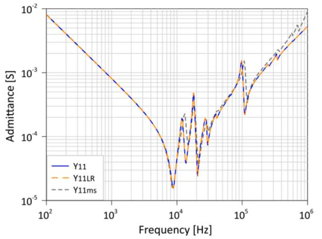  
Fig. 8. Comparison of the admittance $\mathbf { Y } _ { 1 1 }$ calculated with the full-rank and the low-rank models.

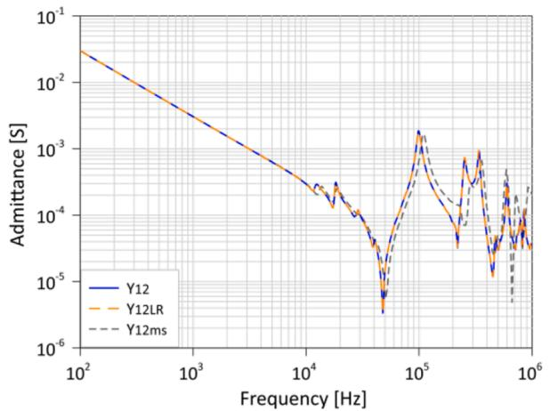  
Fig. 9. Comparison of the admittance $\mathrm { Y } _ { 1 2 }$ calculated with the full-rank and the low-rank models.

# 5.3. Reduction of number of poles

The number of components of the model is a critical factor for the calculation of transient processes with ATP. It was seen in Section 3.3 that there is also the alternative of obtaining an additional reduction using 4 instead of 5 poles for the fitting of the model impedances. Consequently, the use of the least number of poles seems the most appropriate solution to the extent that the errors in the calculations are limited. In the next section several possible models are compared and the impact of varying the number of poles of the impedance expansions on the final size of the model is analyzed.

# 6. Comparison of different models

This section presents a set of white-box models of the case study transformer. This set represents the combined application of all the methodologies mentioned above to reduce the size of the model while preserving the accuracy of the results. Three strategies are then combined: optimization of the degree of discretization, use of fewer poles for impedance fitting and reduction of the model by means of low-rank factorization. The characteristics of the models presented are given in Tables 4 and 5.

# 6.1. Comparison in the frequency domain

These models will first be evaluated using the state-space model [8]

Table 4 Different models to be compared.   

<table><tr><td></td><td colspan="2">Full discretization</td><td colspan="2">Reduced TW</td></tr><tr><td>Number of poles</td><td>5</td><td>4</td><td>5</td><td>4</td></tr><tr><td>Full rank</td><td>M1</td><td>M2</td><td>M3</td><td>M4</td></tr><tr><td>Low rank</td><td>M5</td><td>M6</td><td>M7</td><td>M8</td></tr></table>

implemented in Matlab in the frequency domain. This is aimed, on the one hand, to evaluate their precision from the comparison of the respective responses and, on the other hand, to evaluate the possibility of implementing them in ATP if their size allows it. In the next section the viable models selected in this section will be implemented in ATP. The choice of the ranks used in the low-rank models has been carried out following the same rank selection criteria used in [21], guaranteeing a very high coincidence with the respective full-rank model. Although this is a choice on the safe side, the ranks are not considered to be too high, since, in the range of the selected values, a decrease in the ranks to be used in the model would cause a rapid deterioration in the quality of the model without significantly reducing its size [22].

Figs. 10 and 11 show respectively the calculated values of admittance $\mathrm { Y } _ { 1 1 }$ and $\mathrm { Y } _ { 1 2 }$ using models M1 to M8. These figures show that agreement between full models and the respective low-rank models is very high. There is also a high agreement between models based on expansions using 4 and 5 poles. A somewhat lower degree of coincidence is observed when the discretization used is different, which is observable especially at frequencies greater than 100 kHz.

However, the deviations between models with different degrees of discretization in the tertiary winding are of the order of those that the models have in general with the measurements. It should also be noted that differences of this order in frequency responses are only partially evidenced in time responses, as will be seen below.

# 6.2. Comparison in the time domain

The evaluation in the time domain consisted of calculating the voltages at terminals R1, X1 and Y1 when a standard lightning impulse is applied to H1 (see description in Section 5.1 and Fig. 5) using models M1 to M8, which are shown respectively in the Figs. 12 and 13. These figures show that the degree of coincidence is very high. The largest differences occur in the case of models with different degrees of discretization in the tertiary winding, which are comparatively less than in the comparisons of frequency responses. Since these differences are also of a much smaller order than those with respect to the measured values, all the models can be considered as valid.

The general agreement with the measurements is considered fully satisfactory given the complexity of the problem and the simplifying assumptions adopted in the different steps of development of the models.

Based on the conclusion that all the models presented adequately characterize the behavior of the case study transformer, it remains to be determined which of them are likely to be used with ATP, which will be addressed in the next section.

# 7. Implementation of transformer models in ATP

# 7.1. Increase of the maximum number of RLC-type branches in ATP

Since the normal ATP distribution has a rather small maximum value of the number of RLC-type branches in relation to the size of the models arising from high-frequency modeling of power transformers, it was necessary to recompile the ATP software by extending the limit of the number of branches to the maximum possible value. This was done by using the MinGW compiler (gcc-2.95.3–6) and with the use of the tool Make Tpbig.exe. The compilation was successful for a maximum number of branches of 500,000. It is important to note that not only the variable

Table 5 Characteristics of the models.   

<table><tr><td></td><td>Main branches</td><td>Poles</td><td>Auxiliary branches</td><td>Main nodes</td><td>Auxiliary nodes</td><td>Total nodes</td><td>Uncoupled branches</td><td>Parallel R in ATP</td><td>ATP branches</td></tr><tr><td>M1</td><td>213</td><td>5</td><td>1065</td><td>432</td><td>1066</td><td>1498</td><td>1,121,253</td><td>560,627</td><td>1,681,880</td></tr><tr><td>M2</td><td>213</td><td>4</td><td>852</td><td>432</td><td>853</td><td>1285</td><td>824,970</td><td>412,485</td><td>1,237,455</td></tr><tr><td>M3</td><td>151</td><td>5</td><td>755</td><td>308</td><td>756</td><td>1064</td><td>565,516</td><td>282,758</td><td>848,274</td></tr><tr><td>M4</td><td>151</td><td>4</td><td>604</td><td>308</td><td>605</td><td>913</td><td>416,328</td><td>208,164</td><td>624,492</td></tr><tr><td>M5</td><td>213</td><td>5</td><td>520</td><td>432</td><td>521</td><td>953</td><td>453,628</td><td>226,814</td><td>680,442</td></tr><tr><td>M6</td><td>213</td><td>4</td><td>450</td><td>432</td><td>451</td><td>883</td><td>389,403</td><td>194,702</td><td>584,105</td></tr><tr><td>M7</td><td>151</td><td>5</td><td>520</td><td>308</td><td>521</td><td>829</td><td>343,206</td><td>171,603</td><td>514,809</td></tr><tr><td>M8</td><td>151</td><td>4</td><td>450</td><td>308</td><td>451</td><td>759</td><td>287,661</td><td>143,831</td><td>431,492</td></tr><tr><td>M1m</td><td>213</td><td>5</td><td>1065</td><td>219</td><td>1066</td><td>1285</td><td>824,970</td><td>412,485</td><td>1,237,455</td></tr><tr><td>M2m</td><td>213</td><td>4</td><td>852</td><td>219</td><td>853</td><td>1072</td><td>574,056</td><td>287,028</td><td>861,084</td></tr><tr><td>M3m</td><td>151</td><td>5</td><td>755</td><td>157</td><td>756</td><td>913</td><td>416,328</td><td>208,164</td><td>624,492</td></tr><tr><td>M4m</td><td>151</td><td>4</td><td>604</td><td>157</td><td>605</td><td>762</td><td>289,941</td><td>144,971</td><td>434,912</td></tr><tr><td>M5m</td><td>213</td><td>5</td><td>520</td><td>219</td><td>521</td><td>740</td><td>273,430</td><td>136,715</td><td>410,145</td></tr><tr><td>M6m</td><td>213</td><td>4</td><td>450</td><td>219</td><td>451</td><td>670</td><td>224,115</td><td>112,058</td><td>336,173</td></tr><tr><td>M7m</td><td>151</td><td>5</td><td>520</td><td>157</td><td>521</td><td>678</td><td>229,503</td><td>114,752</td><td>344,255</td></tr><tr><td>M8m</td><td>151</td><td>4</td><td>450</td><td>157</td><td>451</td><td>608</td><td>184,528</td><td>92,264</td><td>276,792</td></tr></table>

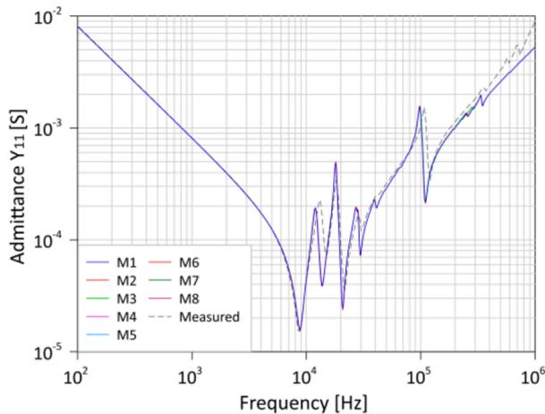  
Fig. 10. Comparison of $\mathbf { Y } _ { 1 1 }$ values calculated with models M1 to M8.

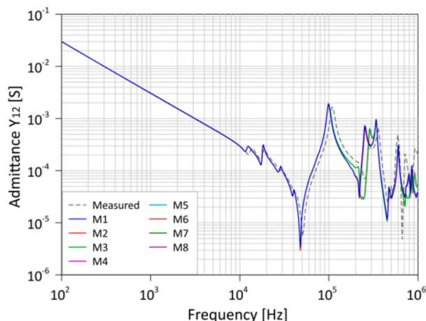  
Fig. 11. Comparison of $\mathrm { Y } _ { 1 2 }$ values calculated with models M1 to M8.

with the maximum number of branches (LBRNCH) was increased, but other variables had to be modified accordingly as well, such as the maximum number of nodes (LBUS) and the maximum size of various tables and vectors for the ATP to be able to run large models. This process must be carried out with extreme care since the erroneous specification of any variable leads to corrupted versions or failed compilations of the program.

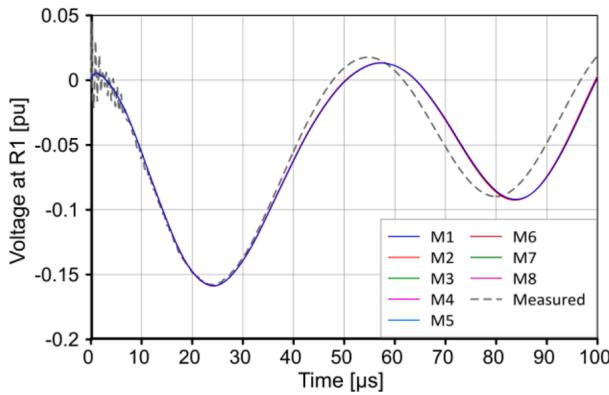  
Fig. 12. Comparison of transient voltages at R1 calculated with models M1 to M8.

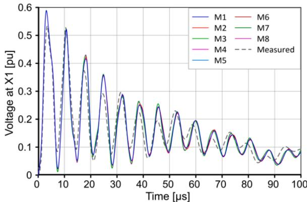  
Fig. 13. Comparison of transient voltages at X1 calculated with models M1 to M8.

# 7.2. Description of the models

For the implementation in ATP of the previously presented models, several factors that affect the size of the model must be taken into account. First of all, it must be said that the implementation of any model of this type in ATP requires an uncoupling process of the inductive network. For this, the methodology described in [7] was applied. This implies a process of converting the system of magnetically coupled inductors into a network of self-inductances that will connect the end nodes of each inductive branch with each of the end nodes of all inductances of the system, which implies a total meshing in the uncoupled

network. If the number of nodes in the system is $n _ { n d } ,$ the number of uncoupled branches that will be required is $n _ { n d } \ ( n _ { n d } - 1 ) / 2 ,$ which is a huge number. Fortunately, the auxiliary branches are grounded, so the number of uncoupled branches is much less than if they were not. On the other hand, one can resort to the approximation of representing the series resistances $\pmb { R } _ { m }$ of the windings in a concentrated form at the beginning and at the end of each winding. This way, the inductances of the main sections are connected in series directly, sharing nodes, which results in a significant decrease in the necessary uncoupled inductive branches. This procedure is reasonable since these resistances, contained in $\mathbf { } { R } _ { m } ,$ are DC resistances and consequently very small (see Fig. 3), and do not affect the transient response. Even if they were completely removed, this would have practically no effect on the transients, but the DC impedance of the windings would be zero.

The characteristics of the models proposed in Table 4 are shown in Table 5. The 8 original models followed by the corresponding modified models with the redistribution of the series resistors (whose name contains the suffix m) are listed. Table 5 shows a notable decrease in size with respect to the original uncoupled model in these last models. Models whose names are in boldface are compatible with the ATP version used.

# 7.3. Viable models for ATP

The models considered viable to be applied in ATP are models with a number of RLC-type branches less than 500,000. This is the maximum number of branches that could be entered in the used ATP version. The complete network to be modeled contains not only inductances but also resistors and capacitors, but the latter do not require more than a few thousand branches, which hardly influence the total number of branches required. For this reason, only the uncoupled inductive branches were taken into account in the viability assessment.

Despite the fact that at this point it might be thought that all the influencing factors for determining viable models are available, a very important one is missing. The uncoupled models generally have selfinductances that can be both positive and negative, and in this case, they are equally distributed. It is known that the inclusion of negative inductances in EMTP-based programs can cause numerical instability and our case was no exception. Fortunately, there is a solution for this and it is the connection of resistors in parallel with the inductive branches that cause problems, a solution that is implemented in ATP’s graphical interface, ATPDraw. Although the numerical instability problem is completely solved, this solution involves the use of a large number of resistive branches, which considerably increase the size of the final model. Table 5 shows the number of branches of each model and the respective total number of branches. Models including these addi tional resistive branches are labeled including the suffix "ATP". It can be seen that the only viable model that does not present relocation of the series resistors is the M8. The rest of the viable models use this simplification and are the M4m to M8m models. All viable models were used in ATP to calculate the transient process in the case study transformer using the connection scheme shown in Fig. 5. For ATP calculations, an integration step of 1 ns and a total simulation time of 100 μs were used. The runtimes and the effective total branches of each model are shown in Table 6.

Fig. 14 compares three variants of the M8 model. The M8 variant is the product of calculations performed with state-space model [8] and serves as a reference to compare with the results obtained by ATP. The other two models were used with ATP, the M8ATP model containing

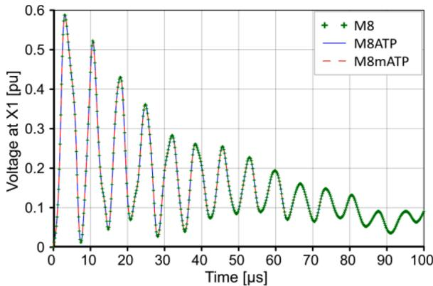  
Fig. 14. Comparison of transient voltages at X1calculated with models M8, M8ATP and M8mATP.

series resistors in the main sections and the M8mATP model with the resistors concentrated at the ends of the windings. The figure shows an excellent agreement of the calculated values with the three models.

Figs. 15 and 16 show the results of the transient voltages at terminals R1, X1 and Y1 calculated with all the models that could be implemented in ATP. The respective measured voltages and the voltages calculated with the model M1 were included as a reference. In these figures, minor differences are noted mainly between the cases that correspond to a different degree of discretization of the tertiary winding, which were also observed in the calculations performed with the state-space model [8]. The conclusions drawn in Section 6 regarding the observed differences are also valid for the ATP calculations.

# 7.4. Application example

One important source of resonant overvoltages is the application of an impulse to a cable-transformer series circuit. Fig. 17 shows a circuit where an impulse voltage is applied to the end of a cable that is connected to the high voltage side of the case study transformer with the low voltage side open at one terminal (see Fig. 5). The cable length is chosen such that its quarter-wave resonance frequency coincides with the peak of the LV to HV voltage ratio transfer function, which is approximately 161 kHz. This implies a cable length of about 279 m. The

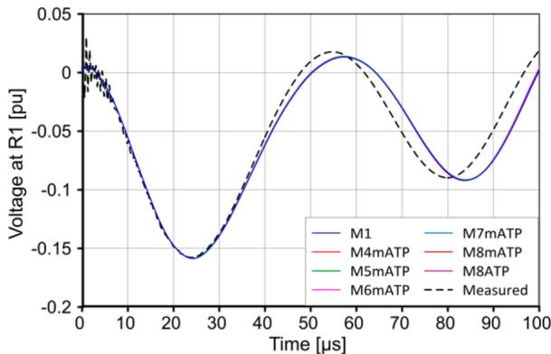  
Fig. 15. Comparison of transient voltages at R1 calculated with all ATP compatible models.

Table 6 Runtimes and total ATP branches of each model.   

<table><tr><td>ATP models</td><td>M4mATP</td><td>M5mATP</td><td>M6mATP</td><td>M7mATP</td><td>M8mATP</td><td>M8ATP</td></tr><tr><td>RLC ATP Branches</td><td>479,672</td><td>415,419</td><td>340,917</td><td>347,151</td><td>280,097</td><td>427,660</td></tr><tr><td>Runtime [s]</td><td>821.922</td><td>694.891</td><td>545.516</td><td>535.656</td><td>411.063</td><td>683.391</td></tr></table>

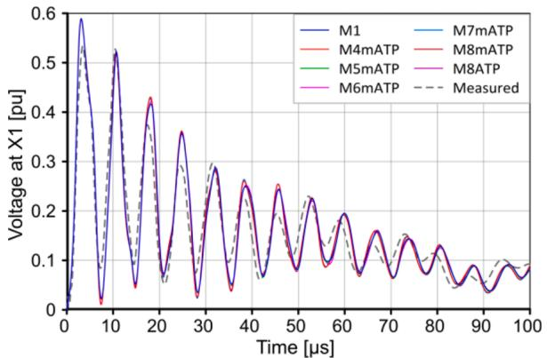  
Fig. 16. Comparison of transient voltages at X1 calculated with all ATP compatible models.

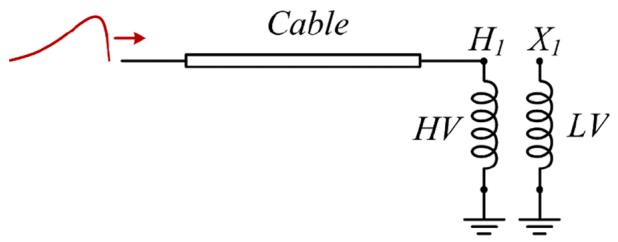  
Fig. 17. Lightning impulse wave impinging a cable-transformer series connection.

cable has a characteristic impedance of 43 Ω.

The transformer model used for the simulation was M5m (see Table 5). The cable was modeled with a distributed parameter line with $\mathrm { R ^ { \prime } } \mathrm { = } 1 \times 1 0 ^ { - 3 } \ \Omega / \mathrm { m } , \mathrm { L ^ { \prime } } \mathrm { = } 2 . 6 8 7 \times 1 0 ^ { - 4 } \ \mathrm { m H / m } , \mathrm { C ^ { \prime } } \mathrm { = } 1 . 4 5 3 \times 1 0 ^ { - 4 } \ \mu \mathrm { F / m } ,$ , length 279 m. The input source was an impulse voltage wave of 1 V (1 p. u.) amplitude and 1.2/50 μs shape. The best numerical stability in ATP was obtained using an integration step of 1 ns. Under these conditions, the case required 613 s to run, on a PC AMD Ryzen 5900 × 3.7Ghz with 32Gb RAM.

Fig. 18 shows an ATP simulation of the waveform of the voltages at the HV and LV terminals. The voltage at the HV terminal is a nearly a square wave in the first two cycles that alternates between zero and $2 { \mathfrak { p } } .$ . u. approximately. The voltage on the low voltage side of the transformer increases to values greater than 3 p.u. (with respect to H.V.!) by resonance at 40 μs. Through this example, it is concluded on the one hand

that this type of configuration implies a serious risk of resonant overvoltages. On the other hand, it is important to note that the calculated maximum values depend largely on the transformer damping. That is why the precise representation of damping is very important in the analysis of phenomena of this type.

# 8. Discussion

The behavior of the inductive impedances of the transformer were modeled by means of the partial fraction expansions given in (4) and (5). Section 3 shows the characteristics of these expansions using 4 and 5 poles. Considering that at very high frequencies R and L should become proportional and inversely proportional to the square root of ω respectively, it can be seen in Fig. 3 that the expansions of R and L follow the theoretical behavior up to 1 MHz and then tend to become constant, as a consequence of the finite number of poles. The expression based on 5 poles is closer to the theoretical behavior in the 1–2 MHz range, which is a direct consequence of the number of poles used. Criteria for the selection of the number and location of initial poles were given in Section 3.2. An important conclusion is that the zone of influence of each pole of the expansion is around a decade and the number of poles to be used will then be a function of the frequency range to be represented.

The analysis of the low-frequency parameters $\pmb { R } _ { m }$ and $L _ { m }$ of the model yielded important results for modeling, especially in the case of ATP. After fitting the impedances with ${ \mathrm { V F } } ,$ the results show that the resistances $\mathbf { } R _ { m } ,$ which are direct current resistances, are very small and the sensitivity of the fitting to them is also very low. This has several implications. The main one is that they practically do not influence the transient response in the case of fast transients and it does not matter in this case if their calculated value is used or they are totally neglected. Given the low sensitivity of these parameters during fitting, their values are very imprecise, to the point of obtaining non-diagonal $\pmb { R } _ { m }$ matrices, when in theory it is diagonal. If for some reason it is desired that these values provide a good fit in $\mathrm { D C } ,$ the matrix $\pmb { R _ { m } }$ can be replaced by a diagonal matrix with precise values in DC.

Finally, in order to minimize the number of inductive branches in the uncoupled ATP model, the effect of the resistances can be modeled by connecting equivalent resistances to the ends of the windings.

The inductances $L _ { m }$ of the model are determined with VF from magnetic field calculations using a core permeability that, although high, is much lower than the one at nominal frequency. The use of reduced permeability during magnetic field calculations avoids loss of precision in relation to the influence of leakage flux in determining impedances.

Given the difficulty of introducing large models in ATP, three general

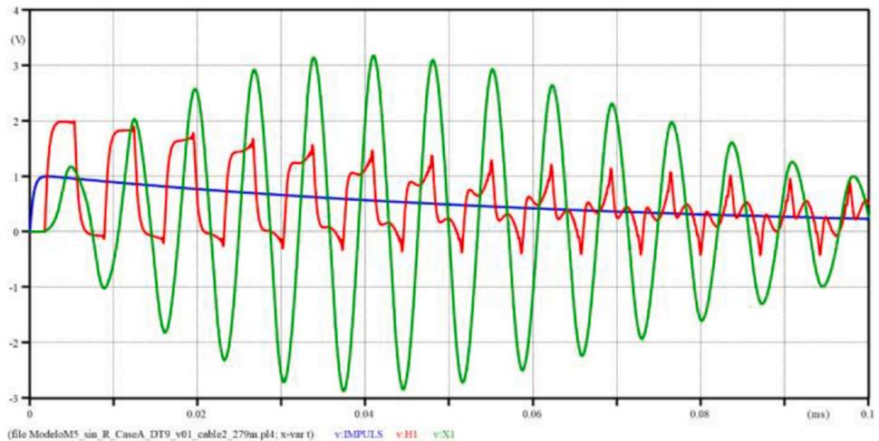  
Fig. 18. ATP simulation showing the impulse voltage (in blue) at the input end of the cable and the voltages at transformer terminals H1 in red and X1 in green, (see Fig. 5).

ways to minimize the size of the model have been studied: optimizing the discretization of the model, using the minimum number of poles to fit the impedances, and applying a low-rank factorization to the coefficient matrices of the expansion to reduce the number of auxiliary loops. As a result, the models shown in Table 5 have been generated. The performance of the different reduction strategies applied individually or in combination to the model M1 is shown in Table 7.

The strategy that has the greatest impact when applied individually is the low-rank factorization. In fact, all the models based on the original discretization considered viable for application in ATP were low-rank models. It can be seen that the improvements obtained in the reduction obtained using the individual strategies do not add directly when applied in combination. For example, Table 7 shows that applying lowrange factorization to the original M1 model produces a reduction of 60%. Also, if a smaller number of poles is used (4 instead of 5) the reduction is 26%. Both strategies combined produce a reduction of only 65%. This is because the number of auxiliary branches required does not decrease proportionally with the number of poles. The percentages mentioned cannot in general be taken as a rule since they depend on the model in question. This can be verified for the case in which the model M3 is taken as the original model, with a different discretization from that of M1, which is shown in Table 8. Although in the case of M3 the impact of reducing the number of poles is the same as in the case of M1, the reduction obtained by applying the low-rank factorization was much lower: 39% versus 65%. It is concluded that the degree of reduction depends on the degree of redundancy in the information contained in the inductance matrix, which in turn depends on the degree of discretization.

The analysis of all models in Table 5 shows that all of them are suitable for the calculation of transients since their time responses coincide very well. There are some minor differences when the degree of discretization is changed, as the models are no longer exactly the same.

Note that changing the degree of discretization was possible in this case because the tertiary winding was originally discretized in a very detailed way and it was possible to reduce the number of sections. In general, this may not be possible to do without altering the validity of the model in the frequency range of interest.

After determining all the models that are compatible with ATP, transient calculations were carried out with them. The resulting degree of agreement between them (Figs. 15 and 16) is the same as that obtained before between state-space models (Figs. 12 and 13) and in turn the calculations made for the same model with ATP and state-space representation coincide exactly (see Fig. 14).

Apart from the three general reduction strategies applied, a fourth strategy was applied especially to ATP models, which is the redistribution of resistances $\mathbf { } R _ { m } ,$ causing a significant reduction in the uncoupled network (compare M models with $\mathbf { M } _ { \mathrm { i m } }$ for $i = 1 , . . . , 8 ,$ in Table 5), allowing many of the uncoupled inductances to combine in parallel. Finally, there was a detrimental factor for the reduction, which was the numerical instability in ATP using the uncoupled model due to the presence of negative inductances. As pointed out in Section 7.2, this

Table 7 Percentage reduction of RLC branches in M1 applying the different strategies in different combinations.   

<table><tr><td></td><td>reduced number of poles</td><td>reduced number of sections</td><td>low-rank factorization</td><td>All</td></tr><tr><td>reduced number of poles</td><td>M2: 26%</td><td></td><td></td><td></td></tr><tr><td>reduced number of sections</td><td>M4: 63%</td><td>M3: 50%</td><td></td><td></td></tr><tr><td>low-rank factorization</td><td>M6: 65%</td><td>M7: 69%</td><td>M5: 60%</td><td></td></tr><tr><td>All</td><td></td><td></td><td></td><td>M8: 74%</td></tr></table>

Table 8 Percentage reduction of RLC branches in M3 applying the different strategies in different combinations.   

<table><tr><td></td><td>reduced number of poles</td><td>low-rank factorization</td></tr><tr><td>reduced number of poles</td><td>M4: 26%</td><td></td></tr><tr><td>low-rank factorization</td><td>M8: 49%</td><td>M7: 39%</td></tr></table>

could be solved without problems by having resistors in parallel connected to them using the ATPDraw tool specially designed to solve this problem, as it is a known issue. This resulted in the inclusion of numerous new resistive branches, increasing the size of the network. Despite this, it was possible to propose 6 models (see Table 6) of different sizes for the case study transformer to be used in ATP, whose responses have a very high degree of agreement with that of the full model M1.

In this work, the different implementation problems of white-box circuit models of large transformers in ATP have been exposed in detail, as well as various proposals for their solutions. From this analysis it follows that, as stated in the introduction, the inclusion of these models in ATP is not straightforward. Many of the exposed methodologies have general validity, but all of them contribute to generate reduced models that are really compatible with ATP. In this way, the applicability of ATP is no longer a mere assumption, but rather a reality.

# 9. Conclusion

This paper presents white-box models for large transformers suitable for processing in EMTP-based programs such as ATP. The drawbacks posed by the large size of these white-box models, and on the other hand, the limitations in the capacity of the program in terms of number of branches, have been successfully overcome. This has been achieved through various strategies aimed at reducing the size of the models. Among them is a novel technique for representing the coefficient matrices of the impedance expansion by means of a low-rank factorization based on SVD. This has resulted in reductions of up to 60%. Reducing the number of poles for impedance matching and reducing the number of sections in places where this is possible has also been proposed. In relation to the specific implementation of the model in ATP, the technique of relocating the series resistances of the main circuit has been additionally applied, thus significantly reducing the number of inductive branches required.

Six possible models of the case study transformer suitable for processing in the used version of ATP has been established. The behaviors of all the proposed models present a high coincidence with that of the most accurate model, which cannot be represented in ATP due to its size. This objective has been achieved by a deep analysis of the frequency dependence of the impedances and their representation by means of a partial fraction expansion. The general model [7] has been analyzed by determining the influence of each parameter involved in the model response, providing criteria for the selection of the models for ATP. The low-frequency response and how to correct the $\pmb { R } _ { m }$ and $L _ { m }$ parameters so that the behavior of the model is as close as possible to that of the actual transformer has also been analyzed. The models have been validated using a case study transformer used by CIGRE JWG A2/C4.52 to test the accuracy of several transformer models. The main contribution of this work is to finally expose a clear path for the development of reduced white-box models of large transformers. The use of these models is always advantageous, but it becomes especially relevant in the case of EMTP-based programs with data size limitations, as is the case of ATP. Enabling the use of transformer white-box models with EMTP-based programs allows the evaluation of their interaction with other components connected to the power system, including the evaluation of situations where different types of overvoltages occur under different scenarios that differ from the simple application of a lightning impulse voltage at the input terminals.

# CRediT authorship contribution statement

Enrique Esteban Mombello: Conceptualization, Methodology, Software, Investigation, Writing – original draft, Writing – review & editing, Supervision. Guillermo Guidi Venerdini: Investigation, Software, Validation. Guillermo Andres ´ Díaz Florez: ´ Investigation, Software, Validation.

# Declaration of Competing Interest

The authors declare that they have no known competing financial interests or personal relationships that could have appeared to influence the work reported in this paper.

# Data availability

The authors do not have permission to share data.

# References

[1] J.A. Martinez-Velasco, Basic methods for analysis of high frequency transients in power apparatus windings, in: C.Q. Su (Ed.), Electromagnetic Transients in Transformer and Rotating Machine Windings, IGI Global, Hershey, 2013, pp. 45–78.   
[2] R.C. Degeneff, Transient-voltage response of coils and windings, in: J.H. Harlow (Ed.), Electric Power Transformer Engineering, CRC Press, Boca Raton, 2012, pp. 1–27, ch.   
[3] M. Popov, B. Gustavsen, J.A. Martinez-Velasco, Transformer modelling for impulse voltage distribution and terminal transient analysis, in: C.Q. Su (Ed.), Electromagnetic Transients in Transformer and Rotating Machine Windings, IGI Global, Hershey, 2013, pp. 239–283.   
[4] JWG A2/C4.39, Electrical transient interaction between transformers and the power system. Part 1 -expertise, CIGRE Tech. Brochure 577A (2014).   
[5] JWG A2/C4.39, Electrical transient interaction between transformers and the power system. Part 2 - case studies, in: CIGRE Tech. Brochure, 577B, 2014.   
[6] M. Popov, General approach for accurate resonance analysis in transformer windings, Electr. Power Syst. Res. 161 (2018) 45–51.

[7] E.E. Mombello, G.A Díaz Florez, ´ An improved high frequency white-box lossy transformer model for the calculation of power systems electromagnetic transients, Electr. Power Syst. Res. 190 (2021), 106838.   
[8] E.E. Mombello, A. ´ Portillo, G.A.D. Florez, ´ New state-space white-box transformer model for the calculation of electromagnetic transients, IEEE Trans. Power Deliv. 36 (2021) 2615–2624.   
[9] B. Gustavsen, A. Portillo, Interfacing k-factor based white-box transformer models with electromagnetic transients programs, IEEE Trans. Power Delivery 29 (6) (2014) 2534–2542.   
[10] B. Gustavsen, A. Portillo, A damping factor-based white-box transformer model for network studies, IEEE Trans. Power Delivery 33 (6) (2018) 2956–2964.   
[11] B. Gustavsen, Computer code for rational approximation of frequency dependent admittance matrices, IEEE Trans. Power Delivery 17 (2002) 1093–1098.   
[12] Y. Shibuya, T. Matsumoto, T. Teranishi, in: Modelling and Analysis of Transformer Winding at High Frequencies, International Conference on Power Systems Transients (IPST’05), Montreal, Canada, 2005. Paper No. IPST05-025.   
[13] M. Eslamian, B. Vahidi, New equivalent circuit of transformer winding for the calculation of resonance transients considering frequency-dependent losses, IEEE Trans. Power Delivery 30 (2015) 1743–1751.   
[14] A. Miki, T. Hosoya, K. Okuyama, A calculation method for impulse voltage distribution and transferred voltage in transformer windings, IEEE Trans. Power Appar. Syst. 97 (1978) 930–939.   
[15] E.A. Guillemin, Synthesis of Passive Networks: Theory and Methods Appropriate to the Realization and Approximation Problems, John Wiley & Sons, New York, USA, 1957.   
[16] D.J. Wilcox, W.G. Hurley, M. Conlon, Calculation of self and mutual impedances between sections of transformer windings, IEE Proc. C (Gener. Transm. Distrib.) 136 (1989) 308–314.   
[17] N. Abeywickrama, A.D. Podoltsev, Y.V. Serdyuk, S.M. Gubanski, Computation of parameters of power transformer windings for use in frequency response analysis, IEEE Trans. Magn. 43 (2007) 1983–1990.   
[18] N. Abeywickrama, Y.V. Serdyuk, S.M. Gubanski, High-frequency modeling of power transformers for use in frequency response analysis (FRA), IEEE Trans. Power Deliv. 23 (2008) 2042–2049.   
[19] D. Meeker, Finite Element Method Magnetics, 2021. http://www.femm.info/wiki /HomePage. 10-Oct-2021.   
[20] P.I. Fergestad, T. Henriksen, Inductances for the calculation of transient oscillations in transformers, IEEE Trans. Power Appar. Syst. 93 (1974) 510–517.   
[21] E.E. Mombello, New compact white-box transformer model for the calculation of electromagnetic transients, IEEE Trans. Power Deliv. 37 (2022) 2921–2931.   
[22] The Electric Power Industry Standard of People’s Republic of China DL/T 911- 2004, Frequency Response Analysis on Winding Deformation of Power Transformers, (2004).