# Accuracy Enhancement of Shifted Frequency-Based Simulation Using Root Matching and Embedded Small-Step

Shilin Gao , Student Member, IEEE, Zhendong Tan, Yankan Song, Member, IEEE,

Ying Chen , Senior Member, IEEE, Chen Shen , Senior Member, IEEE, and Zhitong Yu, Member, IEEE

Abstract—Electromagnetic transients (EMT) simulation is fundamental in power system design and operation. To improve the computational efficiency of EMT simulation, the shifted frequencybased EMT (SFEMT) simulation with large time-steps has been proposed in the literature recently. Nevertheless, the existing SFEMT simulation methods with a large time-step have accuracy issues when there is a sudden change in the power system. In this paper, the causes of the poor accuracy of traditional SFEMT simulation in sudden-change scenarios are first analyzed. Then, it proposes a highly accurate SFEMT simulation algorithm based on the root matching (RM) and embedded small-step (ESS) techniques. Next, the RM-based SFEMT (RM-SFEMT) models of the power system components are derived and the flowchart of RM-SFEMT simulation with ESS is presented. Test results on three power systems of different scales demonstrate the improved accuracy of the proposed SFEMT simulation algorithm.

Index Terms—Accuracy analysis, electromagnetic transient simulation, EMTP, embedded small-step, power system, large time-step simulation, root matching, shifted frequency.

# I. INTRODUCTION

W ITH the development of power systems, the quasi-steady-state (QSS) analysis-based transient stability steady-state (QSS） analysis-based transient stability program no longer meets the requirements of a modern power system in some areas. For instance, severe disturbances in power systems often involve frequency excursions in addition to voltage excursions, where the QSS assumption does not hold. Thus, in the processes of design, operation and control of modern power systems, the electromagnetic transients (EMT) program (abbreviated as EMTP)-type simulator without QSS assumptions is widely used for studying the power system transients [1],

Manuscript received 24 December 2021; revised 22 April 2022; accepted 11 September 2022. Date of publication 16 September 2022; date of current version 22 June 2023. This work was supported by the Natural Science Foundation of China under Grants 52007101, 51877115, and 51861135312. Paper no. TPWRS-01963-2021. (Corresponding author: Yankan Song.)

Shilin Gao, Ying Chen, and Chen Shen are with the Department of Electrical Engineering, Tsinghua University, Beijing 100084, China (e-mail: gaosl19@mails.tsinghua.edu.cn; chen_ying@tsinghua.edu.cn; shenchen@mail.tsinghua.edu.cn).

Zhendong Tan, Yankan Song, and Zhitong Yu are with the Sichuan Energy Research Internet Institute, Tsinghua University, Chengdu 610213, China (e-mail: 664183185@qq.com; songyankan@cloudpss.net; yuzhitong@cloudpss.net).

Color versions of one or more figures in this article are available at https://doi.org/10.1109/TPWRS.2022.3207283.

Digital Object Identifier 10.1109/TPWRS.2022.3207283

[2], [3]. In the simulation of ac transmission and distribution systems with the EMTP-type simulator, there is an upper limit of the time-step size because of the ac carrier, which restricts the efficiency improvement of power system EMT simulation [4], [5], [6].

To enlarge the time-step of EMT simulation, a shiftedfrequency-based EMT (SFEMT) simulation algorithm was proposed in [7], [8]. It finds a solution to the power system differential equations in the shifted frequency domain. The associated analytic signal of the original signal (e.g., voltages and currents) is first derived based on the Hilbert transformation, which only has a positive frequency spectrum. Then, the analytic envelope is obtained by shifting the fundamental frequency of the analytic signal from 50 or 60 Hz to zero. According to the sampling theory, a much larger time-step size can be chosen for the lowpass analytic envelope-based simulation, resulting in considerable savings in computational time. In [9], the Hilbert transformation is replaced by the differential transformation for constructing the analytical signal in SFEMT simulation. However, the high-frequency components may be enlarged by the differential transformation, which may cause accuracy issues. Therefore, the Hilbert transformation is still dominantly used in the SFEMT simulation. As for the application of SFEMT simulation, the SFEMT models of synchronous machines, induction machines, transformers, overhead transmission lines and cables were respectively formulated in [10], [11], [12], [13], [14], [15], achieving highly efficient EMT simulation of ac power system components. Regarding renewable energy system modeling, [16] and [17] constructed the SFEMT models of permanent magnet synchronous wind generator and doublyfed induction generator, and the efficient simulation of wind energy conversion system is made. The above applications of the SFEMT simulation to various power system components demonstrate the effectiveness of SFEMT simulation.

However, the existing SFEMT simulation algorithms will be confronted with accuracy issues when there is a sudden change in the power system. By analyses, it is found that there are two causes for the accuracy problem in sudden-change scenarios. First, when a sudden change happens, the analytic envelope is not a lowpass signal anymore. There will be some frequency components around the negative fundamental frequency in the analytical envelope. For the simulation with the trapezoidal

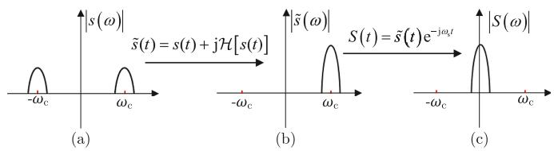  
Fig. 1. Spectra of ac signals with Hilbert transformation and frequency shifting [8]. (a) Spectrum of the original signal. (b) Spectrum of the analytic signal. (c) Spectrum of the analytic envelope.

(TR) method and large time-step, evident truncation errors will emerge when the frequency is large. Second, when a sudden change happens, there will be an unbearable loss of integral for the non-state variable if the time-step is large.

Aiming at the two causes of poor accuracy mentioned above, this paper proposes a large time-step SFEMT simulation algorithm using the root matching (RM) and embedded small-step (ESS) techniques. First, the steps of the RM-based SFEMT (RM-SFEMT) modeling method are presented and the merits of RM-SFEMT simulation are analyzed. Second, the principles and implementation of MET simulation with ESS are derived. Last, the flowchart of the RM-SFEMT simulation with ESS for the power system is elaborated detailedly.

The contributions made in this paper are threefold. 1) The formation mechanism of error of large-step SFEMT simulation in sudden-change scenarios is theoretically analyzed, revealing the causes of poor accuracy in these scenarios. 2) An RM-SFEMT simulation algorithm is proposed. Compared with SFMET simulation, it can accurately emulate the frequency components around both the ac carrier and zero without loss of efficiency. 3) The ESS scheme is proposed and applied to the SFEMT simulation, avoiding the loss of integral for the non-state variable in large-step simulation, further improving the accuracy of SFEMT simulation.

The remainder of this paper is organized as follows. Section II reviews the SFEMT modeling and simulation and analyzes the causes of poor accuracy in sudden-change scenarios. In Sections III and IV, the RM and ESS methods are proposed to solve the two problems that lead to the poor accuracy of SFEMT simulation, respectively. The RM-SFEMT simulation with ESS is detailedly elaborated in Section V. Section VI validates the improved accuracy of the proposed RM-SFEMT simulation with ESS. Section VII concludes this paper.

# II. PROBLEM DESCRIPTION

# A. Brief Introduction to SFEMT Simulation

In an ac power system, the naturally generated bandpass signal $s ( t )$ has both positive and negative frequency spectrums. Its associated analytic signal $\tilde { s } ( t )$ can be obtained based on the Hilbert transformation $\mathcal { H } [ \cdot ]$ and represented as [18]:

$$
\tilde {s} (t) = s (t) + \mathrm {j} \mathcal {H} [ s (t) ] \tag {1}
$$

where $\tilde { s } ( t )$ only has a positive frequency spectrum [7]. The spectrums of $s ( t )$ and $\tilde { s } ( t )$ are depicted in Fig. 1(a) and (b), where $\omega _ { \mathrm { c } } = 2 \pi f _ { \mathrm { c } }$ and $f _ { \mathrm { c } }$ is the fundamental frequency. $\tilde { s } ( t )$ can

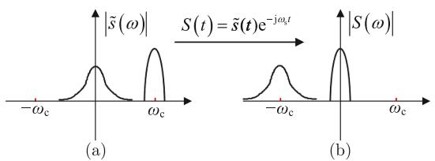  
Fig. 2. Schematic diagram of frequency shifting with low-frequency.

be transformed into an analytic envelope signal $S ( t )$ by

$$
S (t) = \tilde {s} (t) \mathrm {e} ^ {- \mathrm {j} \omega_ {\mathrm {s}} t} \tag {2}
$$

where $\omega _ { \mathrm { s } } = 2 \pi f _ { \mathrm { s } }$ , and $f _ { \mathrm { s } }$ is the shift frequency. If $\omega _ { \mathrm { s } } = \omega _ { \mathrm { c } }$ , a s s s s clowpass analytic envelope signal is obtained, where the maximum frequency is much lower than that of the original bandpass signal, as shown in Fig. 1(c). According to the sampling theory, a much larger time-step can be adopted in the analytic envelope signal-based simulation (called SFEMT simulation). The main steps of SFEMT simulation are [8]: 1) Transform the differential equations in the time domain into the shifted-frequency (SF) domain ones; 2) Use the numerical integration method to discretize the differential equations in the SF domain into difference equations; 3) Solve the difference equations step by step according to EMTP-type solution. In the SFEMT simulation, there is only a minor truncation error when the system is nearly in steady-state. However, the authors found that errors will be evident in the SFEMT simulation when a sudden change happens.

# B. The Causes of Poor Accuracy

The poor accuracy of SFEMT simulation in sudden-change scenarios results from two aspects.

1) Error Caused by Low-Frequency Components: In the cases of sudden changes (e.g., faults), which can be considered as a step input, low-frequency components will emerge in the state variables [19], and the accuracy of traditional SFEMT simulation will be affected. Because the low-frequency components will become ones with negative frequency after the frequency shifting, as shown in Fig. 2. In the simulation using the TR method for integration, the truncation error will be significantly enlarged if the frequencies of the state variables increase [7], [20].   
2) Error Caused by the Loss of Integral for Non-State Variable: For the EMT simulation, the accuracy will be impaired by the sudden change when the time-step size is large. It can be analyzed as follows. The dynamic equation of a power system component can be typically written as:

$$
\dot {x} (t) = A x (t) + B u (t) \tag {3}
$$

where x is the state variable and u is the input $( \mathrm { i . e . }$ , non-state variable). A and B are coefficients of them. On the one hand,

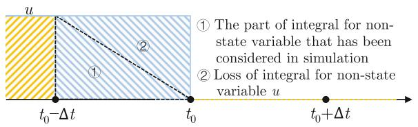  
Fig. 3. Schematic diagram of the loss of the integral for non-state variable.

the state variable $x ( t )$ can be accurately calculated by (4):

$$
\begin{array}{l} x (t) = x (t - \Delta t) + \int_ {t - \Delta t} ^ {t} A x (\tau) + B u (\tau) \mathrm {d} \tau \\ = x (t - \Delta t) + \int_ {t - \Delta t} ^ {t} A x (\tau) \mathrm {d} \tau + \int_ {t - \Delta t} ^ {t} B u (\tau) \mathrm {d} \tau . \tag {4} \\ \end{array}
$$

On the other hand, $x ( t )$ can be approximately calculated by (5) in the EMT simulation based on the TR method:

$$
\begin{array}{l} x (t) = x (t - \Delta t) + \frac {\Delta t}{2} A (x (t - \Delta t) + x (t)) \\ + \frac {\Delta t}{2} B (u (t - \Delta t) + u (t)) \tag {5} \\ \end{array}
$$

In normal operational conditions, $x ( t )$ in (4) and (5) are very close, and we consider $x ( t )$ in (5) as an accurate numerical solution. However, when $u ( t )$ changes suddenly at $t _ { 0 } .$ , an evident difference between the $x ( t _ { 0 } )$ obtained from (4) 0 0and (5) will be seen. This is because that  t0t t u(τ )dτ and $\begin{array} { r } { \int _ { t _ { 0 } - \Delta t } ^ { t _ { 0 } } u ( \tau ) \mathrm { d } \tau } \end{array}$ $\begin{array} { r } { \frac { \Delta t } { 2 } ( u ( t _ { 0 } - \Delta t ) + u ( t _ { 0 } ) ) } \end{array}$ −Δ are not approximately equal anymore. 2 0 0In contrast, they are pretty different from each other. This can be illustrated in Fig. 3. The term $\begin{array} { r } { \frac { \Delta t } { 2 } ( u ( t _ { 0 } - \Delta t ) + u ( t _ { 0 } ) ) } \end{array}$ can be illustrated b 2 rt -1 of Fig. 3, while $\begin{array} { r } { \int _ { t _ { 0 } - \Delta t } ^ { t _ { 0 } } u ( \tau ) \mathrm { d } \tau } \end{array}$ 0is the sum of $\textcircled{2}$ the traditional TR-based simulation. In fact, the loss of integral for the non-state variable happens in all the integration methods that use the non-state variables at $t _ { 0 }$ when they are integrating from $t _ { 0 } - \Delta t$ to $t _ { 0 }$ 0. However, it is ignored in the traditional 0 0EMTP-type simulation because the error is minor with a small time-step size. When $\Delta t$ is large, it should be considered.

# III. SFEMT SIMULATION BASED ON RM

The RM method has been used in traditional EMTP-type simulations [21], [22] and is effective in small-step simulations. However, the traditional RM-based EMTP-type simulation is inaccurate with a large time-step size in both normal operational conditions and transient-state. In the RM-based EMTP-type simulation, the final value theorem is used to derive the EMT model, where the input of the transfer function is assumed as a unit step input. This assumption is hardly satisfied in the traditional EMTP-type simulation of an ac power system because of the existence of the ac carrier. The RM-based EMT simulation will be accurate with large time-steps only when the unit step input assumption is met.

Compared with the traditional EMTP-type simulation, the current and voltage signals are transformed into analytical envelopes in the SFEMT simulation. The analytical envelopes are

dc signals or nearly dc signals. Thus, the condition of a unit step input is naturally fulfilled. Besides, it is worth noting that the sudden changes in power system SFEMT simulation can also be regarded as a step input. Thus, the RM method will work well in this scenario. Considering this, the RM method is considered for the numerical integration of SFEMT simulation.

# A. SFEMT Modeling Based on RM Method

To model the power system components for the SFMET simulation, it is necessary to discretize the continuous model in the s-plane to obtain a discrete model in the z-plane. In the following, the numerical integration method RM is adopted for the discretization of SFEMT models, which can achieve accurate matching of zeros and poles from s-plane to z-plane. The six steps followed in the application of the RM technique to SFEMT simulation are:

1) Step 1: Formulate the differential equations in SF domain based on the Hilbert transformation and frequency shifting.   
2) Step 2: Determine the transfer function $H ( s )$ in the s-plane and the positions of its poles and zeros.   
3) Step 3: Write the transfer function $H ( z )$ in the z-plane using the mapping $z = \mathrm { e } ^ { - s \Delta t }$ with correct positions of the poles and zeros. Also, add an undetermined-constant k to allow adjustment for the final value.   
4) Step 4: Compute the final values of $H ( s )$ and $H ( z )$ for a unit step input using the final value theorem. Then, adjust the constant k to be the correct value according to the equality between the two final values. The $H ( z )$ is thus determined.   
5) Step 5: Add an extra zero $z = - 1$ to $H ( z )$ .   
6) Step 6: Write the resulting discrete time-domain difference equation of $H ( z )$ , and express it in the form of a Norton equivalent circuit.

Taking an R-L series branch as an example, the details of each step in RM-SFEMT modeling are presented as follows.

Step 1: The differential equation for R-L series branch is:

$$
v (t) = R i (t) + L \frac {\mathrm {d} i (t)}{\mathrm {d} t} \tag {6}
$$

where R, $L , v ( t )$ and $i ( t )$ are the resistance, inductance, voltage and current of the branch, respectively. Based on the Hilbert transformation and frequency shifting, (6) can be represented by analytic envelopes:

$$
V (t) = R I (t) + \mathrm {j} \omega_ {\mathrm {s}} L I (t) + L \frac {\mathrm {d} I (t)}{\mathrm {d} t} \tag {7}
$$

where $I ( t )$ and $V ( t )$ are the analytic envelopes of branch current and voltage, respectively.

Step 2: Based on the Laplace transformation, the transfer function $H ( s )$ is obtained:

$$
H (s) = \frac {I (s)}{V (s)} = \frac {1}{L} \frac {1}{s + \mathrm {j} \omega_ {\mathrm {s}} + R / L} \tag {8}
$$

whose pole is $s _ { \mathrm { p 1 } } = - \mathrm { j } \omega _ { \mathrm { s } } - R / L$ .

Step 3: Using the mapping $z = \mathrm { e } ^ { - s \Delta t }$ , $H ( z )$ is obtained:

$$
H (z) = \frac {I (z)}{V (z)} = \frac {k z}{z - \mathrm {e} ^ {- \left(\mathrm {j} \omega_ {\mathrm {s}} + \frac {R}{L}\right) \Delta t}} \tag {9}
$$

Step 4: According to the final value theorem, the value of k can be obtained. Then, $H ( z )$ can be represented as:

$$
H (z) = \frac {I (z)}{V (z)} = \frac {1 - \mathrm {e} ^ {- \left(\mathrm {j} \omega_ {\mathrm {s}} + \frac {R}{L}\right) \Delta t}}{\mathrm {j} \omega_ {\mathrm {s}} L + R} \frac {z}{z - \mathrm {e} ^ {- \left(\mathrm {j} \omega_ {\mathrm {s}} + \frac {R}{L}\right) \Delta t}}. \tag {10}
$$

Step 5: Add the extra zero $z = - 1$ to $H ( z )$ , and then $H ( z )$ becomes:

$$
H (z) = \frac {1 - \mathrm {e} ^ {- \left(\mathrm {j} \omega_ {\mathrm {s}} + \frac {R}{L}\right) \Delta t}}{2 \left(\mathrm {j} \omega_ {\mathrm {s}} L + R\right)} \frac {z + 1}{z - \mathrm {e} ^ {- \left(\mathrm {j} \omega_ {\mathrm {s}} + \frac {R}{L}\right) \Delta t}}. \tag {11}
$$

Step 6: Transform (11) into a time-domain difference equation and represent it as Norton equivalent circuit:

$$
\begin{array}{l} I (t) = \frac {1 - \mathrm {e} ^ {- \left(\mathrm {j} \omega_ {\mathrm {s}} + \frac {R}{L}\right) \Delta t}}{2 (\mathrm {j} \omega_ {\mathrm {s}} L + R)} V (t) + \mathrm {e} ^ {- \left(\mathrm {j} \omega_ {\mathrm {s}} + \frac {R}{L}\right) \Delta t} I (t - \Delta t) \\ + \frac {1 - \mathrm {e} ^ {- \left(\mathrm {j} \omega_ {\mathrm {s}} + \frac {R}{L}\right) \Delta t}}{2 (\mathrm {j} \omega_ {\mathrm {s}} L + R)} V (t - \Delta t). \tag {12} \\ \end{array}
$$

By the above six steps, the RM-SFEMT model of the R-L branch is established. The RM-SFEMT models of other components can be readily obtained in a similar way. When the models of all components have been constructed, the equations of the whole network can be obtained by connecting the models of each component.

# B. Merits of the RM-SFEMT Simulation

1) Accuracy Enhancement: Both the RM and TR methods are second-order methods. Thus, the RM-SFEMT and SFEMT simulations have similar accuracy under normal operating conditions. However, the RM-SFEMT has much better accuracy in scenarios of sudden change. It is elaborated as follows. Without loss of generality, for the dynamic equation of a component (i.e., (3)), assume that the input is:

$$
u (t) = K \cos (\omega t) \tag {13}
$$

where $\omega$ and K are the frequency and amplitude of the input, respectively. For the input $u ( t )$ , the local truncation error of RM-SFEMT simulation is:

$$
\begin{array}{l} T _ {\mathrm {R M}} (t) = \frac {1 + \mathrm {e} ^ {- \mathrm {j} (\omega - \omega_ {\mathrm {s}}) \Delta t}}{2} \frac {1 - \mathrm {e} ^ {A \Delta t - \mathrm {j} \omega_ {\mathrm {s}} \Delta t}}{\mathrm {j} \omega_ {\mathrm {s}} - A} B U (t) - \\ \frac {1 - \mathrm {e} ^ {A \Delta t - \mathrm {j} \omega \Delta t}}{\mathrm {j} \omega - A} B U (t) \tag {14} \\ \end{array}
$$

where $U ( t )$ is the analytic envelope of $u ( t )$ .

As for the traditional SFEMT simulation based on the TR method, the local truncation error is derived as:

$$
\begin{array}{l} T _ {\mathrm {T R}} (t) = \left(\frac {\frac {2}{\Delta t} - \mathrm {j} \omega_ {\mathrm {s}} + A}{\frac {2}{\Delta t} + \mathrm {j} \omega_ {\mathrm {s}} - A} - \mathrm {e} ^ {A \Delta t - \mathrm {j} \omega_ {\mathrm {s}} \Delta t}\right) X (t - \Delta t) \\ + \left(\frac {1 + \mathrm {e} ^ {\mathrm {j} \left(\omega - \omega_ {\mathrm {s}}\right) \Delta t}}{\frac {2}{\Delta t} + \mathrm {j} \omega_ {\mathrm {s}} - A} - \frac {1 - \mathrm {e} ^ {A \Delta t - \mathrm {j} \omega_ {\mathrm {s}} \Delta t}}{\mathrm {j} \omega - A}\right) B U (t) \tag {15} \\ \end{array}
$$

where $X ( t )$ is the analytic envelope of $x ( t )$ . Note that the derivation of (14) and (15) are presented in Appendices A and B.

It can be found from (14) that the truncation error of the RM-SFEMT simulation is independent of the state variable, i.e., X(t). Thus, the state variable’s low-frequency components (negative frequencies after frequency shifting) do not influence the truncation error. When $\omega = \omega _ { \mathrm { s } } , T _ { \mathrm { R M } } ( t ) = 0$ . In contrast to sthe RM-SFEMT simulation, the truncation error of traditional SFEMT simulation is related to the state variable according to (15). The truncation error will be affected by the low-frequency components in the state variables, i.e., negative frequencies after frequency shifting in Fig. 2. When $\omega = \omega _ { \mathrm { s } }$ , the truncation error is not 0. It is

$$
\begin{array}{l} \left. T _ {\mathrm {T R}} \right| _ {\omega = \omega_ {\mathrm {s}}} = \left(\frac {\frac {2}{\Delta t} - \mathrm {j} \omega_ {\mathrm {s}} + A}{\frac {2}{\Delta t} + \mathrm {j} \omega_ {\mathrm {s}} - A} - \mathrm {e} ^ {A \Delta t - \mathrm {j} \omega_ {\mathrm {s}} \Delta t}\right) X (t - \Delta t) \\ + \left(\frac {2}{\frac {2}{\Delta t} + \mathrm {j} \omega_ {\mathrm {s}} - A} - \frac {1 - \mathrm {e} ^ {A \Delta t - \mathrm {j} \omega_ {\mathrm {s}} \Delta t}}{\mathrm {j} \omega_ {\mathrm {s}} - A}\right) B U (t). \tag {16} \\ \end{array}
$$

The local truncation error of traditional SFEMT simulation will be zero only when $B U ( t ) = ( \mathrm { j } \omega _ { \mathrm { s } } - A ) X ( t - \Delta t )$ is satissfied. According to the above analyses, it can be found that the RM-SFEMT simulation is more accurate than the traditional SFEMT simulation.

2) Efficiency Analyses: Since both the RM and TR are one-step and one-stage methods [23], the EMT simulation based on the two methods have the same procedure in the EMTP-type solution. They have the same computation burden.

In summary, the presented RM-SFEMT simulation has better accuracy than the conventional SFEMT simulation without deteriorating the efficiency.

# IV. SFEMT SIMULATION WITH ESS

Aiming at the second cause of poor accuracy elaborated in Section II-B, this paper proposes a scheme of ESS. The details are elaborated as follows.

# A. ESS Scheme in Large-Step EMT Simulation

The procedure of ESS is illustrated in Fig. 4. In the beginning, the power system is simulated with a large time-step size of $\Delta t$ . When a sudden change is detected in the power system at $t _ { 0 } ,$ the 0backward interpolation with a small time-step (δt) is performed. Then, the equivalent nodal matrix of the system is calculated, and numerical integration for the small time-step is implemented to obtain variables at $t _ { 0 } .$ . After that, the power system is simulated with a large time-step Δt again.

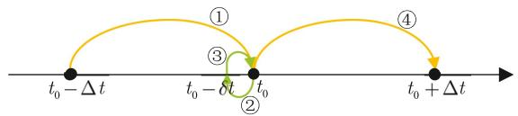  
Fig. 4. The implementation of ESS.

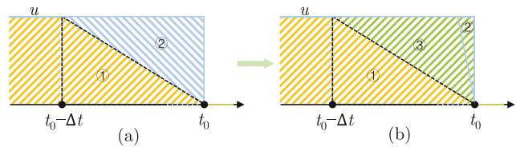  
Fig. 5. Schematic diagram of loss for integral for the non-state variable. (a) without ESS; (b) with ESS.

# B. Characteristics of the ESS Scheme

1) Accuracy Improvement: With the ESS scheme, the loss of integral for the non-state variable (analyzed in Section II-B) can be greatly reduced, which is illustrated in Fig. 5. Specifically, part -2 in Fig. 5(a) depicts the loss of integral for the non-state variable without ESS, and part -2 in Fig. 5(b) illustrates the loss with ESS. The part 3 in Fig. 5(b) is the loss avoided by ESS. It is found that the loss of integral for the non-state variable is much smaller with ESS. This can improve the accuracy of large-step EMT simulation. Besides, Fig. 5(b) shows that the smaller the embedded step is, the smaller the loss will be, which indicates better accuracy. It can be theoretically validated as follows. For the sake of brevity, the dynamic equation of a component, i.e., (3), is rewritten as:

$$
\dot {x} (t) = f (x (t), u (t)) \tag {17}
$$

where $u ( t )$ represents the non-state variable, x(t) represents the state variable in the EMT simulation.

Under normal conditions (i.e., no sudden change), the value of $x ( t )$ at $t _ { 0 }$ can be calculated as (18) by using TR method:

$$
\begin{array}{l} x (t _ {0}) = x (t _ {0} - \Delta t) + \frac {\Delta t}{2} (f (x (t _ {0}), u (t _ {0})) \\ + f \left(x \left(t _ {0} - \Delta t\right), u \left(t _ {0} - \Delta t\right)\right). \tag {18} \\ \end{array}
$$

Similarly, according to TR method, the value of $x ( t )$ at $t _ { 0 }$ is calculated by (19) if a sudden change happens at $t _ { 0 }$ .

$$
\begin{array}{l} x (t _ {0}) ^ {*} = x (t _ {0} - \Delta t) + \frac {\Delta t}{2} \left(f \left(x (t _ {0}) ^ {*}, u (t _ {0}) ^ {*}\right) \right. \\ + f \left(x \left(t _ {0} - \Delta t\right), u \left(t _ {0} - \Delta t\right)\right)). \tag {19} \\ \end{array}
$$

The difference between $x ( t _ { 0 } ) ^ { * }$ (with sudden change) and $x ( t _ { 0 } )$ 0(without sudden change) is:

$$
x \left(t _ {0}\right) ^ {*} - x \left(t _ {0}\right) = \frac {\Delta t}{2} \left(f \left(x \left(t _ {0}\right) ^ {*}, u \left(t _ {0}\right) ^ {*}\right) - f \left(x \left(t _ {0}\right), u \left(t _ {0}\right)\right)\right). \tag {20}
$$

It can be found that $x ( t _ { 0 } ) ^ { * }$ and $x ( t _ { 0 } )$ are not equal because the right-hand side of $( 2 0 )$ 0 0 is obviously not zero. However, the value of state-variable $x ( t _ { 0 } )$ at $t _ { 0 }$ should be the same whether

the sudden change happens or not. This also indicates that traditional large-step EMT simulation is inaccurate in sudden-change scenarios, which has been analyzed in Section II-B.

Furthermore, since $f ( x ( t _ { 0 } ) , u ( t _ { 0 } ) )$ and $f ( x ( t _ { 0 } ) ^ { * } , u ( t _ { 0 } ) ^ { * } )$ are 0 0 0 0finite in EMT simulation, there exist a number L satisfying:

$$
\lim  _ {\Delta t \to 0} f (x (t _ {0}), u (t _ {0})) \leq L, \lim  _ {\Delta t \to 0} f (x (t _ {0}) ^ {*}, u (t _ {0}) ^ {*}) \leq L.
$$

Thus, when time step Δt approaches 0,

$$
\begin{array}{l} \lim  _ {\Delta t \rightarrow 0} (x (t _ {0}) ^ {*} - x (t _ {0})) \\ = \lim  _ {\Delta t \rightarrow 0} \frac {\Delta t}{2} \left(f \left(x \left(t _ {0}\right) ^ {*}, u \left(t _ {0}\right) ^ {*}\right) - f (x \left(t _ {0}\right), u \left(t _ {0}\right))\right) = 0. \tag {21} \\ \end{array}
$$

From (21), it can be found that the error is related to the timestep size, which is in accordance with Fig. 5. When the time-step size is relatively small, the error is small and can be neglected. It means that the ESS scheme can enhance the accuracy of the large-step SFEMT simulation.

2) Efficiency Analyses: Compared with the SFEMT simulation without ESS, there is only the additional computation of one extra time-step in the SFEMT simulation with ESS. The computational time of the extra time-step is negligible in the whole simulation. Thus, the ESS does not affect the efficiency of SFEMT simulation. Above all, the ESS scheme can also improve the accuracy of SFEMT simulation on the premise of ensuring efficiency.   
3) Comments: It is worth noting that this paper assumes the faults and reclosing occur at the time-step points, which is widely adopted in power system stability analysis. If the fault or reclosing occurs directly after a time step point, the loss of integral for the non-state variable in the proposed large-step simulation with ESS will not be smaller than the traditional method anymore. In this case, both the losses of the proposed method and the traditional method are large, which will result in large errors. To address this, the interpolation should be considered [24]. The switching instants are first located by interpolation. Then, the ESS method is applied to the simulation at the switching instant.

Besides, note that the ESS is independent of recognizing network events and the proposed method is applicable in multiple network event scenarios. The network events can be recognized in two ways. First, if the multiple network events within one time-step occur at the time step points and are independent of each other, they can be recognized statically according to the settings before the simulation (e.g., the time and location of the faults and reclosing). Second, if the network events occur between the time step interval $( [ t - \Delta t , t ] )$ , the network events can be recognized dynamically by interpolations. Especially, for the sequential network events within a time-step, not only interpolation but also iterative computation are needed to locate the switching events. Both two methods are widely used in modern simulation tools [22], [25]. When the network events are recognized, the ESS method can be implemented at the switching instants.

# V. RM-SFEMT SIMULATION FOR POWER SYSTEMS WITH ESS SCHEME

# A. RM-SFEMT Models of Network Components

In this subsection, the RM-SFEMT modeling method described in Section III-A is used to build models of basic RLC components, decoupled three-phase components and coupled three-phase components in ac power systems.

1) Modeling of Basic Components: The basic components include the single-phase resistance, inductance and capacitance. The modeling of a series circuit of resistance and inductance has been presented in Section III-A. The RM-SFEMT models of resistance or inductance can be readily obtained by ignoring each other in (12) and are not presented here. The modeling of capacitance is elaborated as follows.

The dynamic equation of capacitance is:

$$
i _ {\mathrm {C}} (t) = C \frac {\mathrm {d} u _ {\mathrm {C}} (t)}{\mathrm {d} t} \tag {22}
$$

where C is the capacitance; $i _ { \mathrm { C } } ( t )$ and $u _ { \mathrm { C } } ( t )$ are the current C Cand voltage of the capacitance, respectively. According to (22) and the RM-SFEMT modeling technique in Section III-A, the RM-SFEMT model of capacitance can be obtained:

$$
I _ {\mathrm {C}} (t) = G _ {\mathrm {C}} V _ {\mathrm {C}} (t) + I _ {\mathrm {h C}} (t) \tag {23}
$$

where $I _ { \mathrm { C } } ( t )$ and $V _ { \mathrm { C } } ( t )$ are the analytic envelopes of capacitance current and voltage, respectively. Besides,

$$
I _ {\mathrm {h C}} (t) = - \mathrm {e} ^ {- \mathrm {j} \omega_ {\mathrm {s}} \Delta t} G _ {\mathrm {C}} V _ {\mathrm {C}} (t - \Delta t) - I _ {\mathrm {C}} (t - \Delta t),
$$

$$
G _ {\mathrm {C}} = \frac {\mathrm {j} 2 \omega_ {\mathrm {s}} C}{1 - \mathrm {e} ^ {- \mathrm {j} \omega_ {\mathrm {s}} \Delta t}}. \tag {24}
$$

2) Modeling of Decoupled Three-Phase Components: For the decoupled three-phase components, the dynamic equations of each phase are decoupled from other phases’. They can be regarded as three independent single-phase components, and each phase is modeled separately. The modeling of two typical decoupled three-phase components, i.e., transformer and load, is elaborated as follows.

a) Three-Phase Transformer: The dynamic equation of a three-phase transformer is [26]:

$$
\left[ \begin{array}{l} \boldsymbol {v} _ {\mathrm {p}} (t) \\ \boldsymbol {v} _ {\mathrm {s}} (t) \end{array} \right] = \left[ \begin{array}{l l} \boldsymbol {y} _ {\mathrm {p}} & \boldsymbol {y} _ {\mathrm {c}} \\ \boldsymbol {y} _ {\mathrm {c}} & \boldsymbol {y} _ {\mathrm {s}} \end{array} \right] ^ {- 1} \frac {\mathrm {d}}{\mathrm {d} t} \left[ \begin{array}{l} \boldsymbol {i} _ {\mathrm {p}} (t) \\ \boldsymbol {i} _ {\mathrm {s}} (t) \end{array} \right] + \left[ \begin{array}{l} \boldsymbol {R} _ {\mathrm {p}} \boldsymbol {i} _ {\mathrm {p}} (t) \\ \boldsymbol {R} _ {\mathrm {s}} \boldsymbol {i} _ {\mathrm {s}} (t) \end{array} \right] \tag {25}
$$

where $i _ { \mathrm { p } } ( t )$ and $ { i _ { \mathrm { s } } } ( t )$ represent the current vectors of the primary p sand secondary windings, and ${ \mathbf { } } { \mathbf { } } { \mathbf { } } { \mathbf { } } { \mathbf { } } { \mathbf { } } { \mathbf { } } { \mathbf { } } { \mathbf { } } { \mathbf { } } \mathbf { } { \mathbf { } } \mathbf { } { \mathbf { } } \mathbf { } { \mathbf { } } \mathbf { } { \mathbf { } } \mathbf { } { \mathbf { } } \mathbf { } \mathbf { } { \mathbf { } } \mathbf { } \mathbf { } \mathbf { } \mathbf { } \mathbf { } \mathbf { } \mathbf { } \mathbf { } \mathbf { } \mathbf { } \mathbf { } \mathbf { } \mathbf { } \mathbf { } \mathbf { } \mathbf { } \mathbf { } \mathbf { } \mathbf { } \mathbf { } \mathbf { } \mathbf { } \mathbf { } \mathbf { } \mathbf { } \mathbf { } \mathbf { } \mathbf { } \mathbf { } \mathbf { } \mathbf { } \mathbf { } \mathbf { } \mathbf { } \mathbf { } \mathbf { } \mathbf { } \mathbf { } \mathbf { } \mathbf { } \mathbf { } \mathbf { } \mathbf { } \mathbf { } \mathbf { } \mathbf { } \mathbf { } \mathbf { } \mathbf { } \mathbf { } \mathbf { } \mathbf { } \mathbf { } \mathbf { } \mathbf { } \mathbf { } \mathbf { } \mathbf { } \mathbf { } \mathbf { } \mathbf { } \mathbf { } \mathbf { } \mathbf { } \mathbf { } \mathbf { } \mathbf { } \mathbf { } \mathbf { } \mathbf { } \mathbf { } \mathbf { } \mathbf { } \mathbf { } \mathbf { } \mathbf { } \mathbf { } \mathbf { } \mathbf { } \mathbf { } \mathbf { } \mathbf { } \mathbf { } \mathbf { } \mathbf { } \mathbf { } \mathbf { } \mathbf { } \mathbf { } \mathbf { } \mathbf { } \mathbf { } \mathbf { } \mathbf { } \mathbf { } \mathbf { } \mathbf { } \mathbf { } \mathbf { } \mathbf { } \mathbf { } \mathbf { } \mathbf { } \mathbf { } \mathbf { } \mathbf { } \mathbf { } \mathbf { } \mathbf \mathbf { } \mathbf { } \mathbf { } \mathbf { } \mathbf \mathbf { } \mathbf { } \mathbf \mathbf { } \mathbf { } \mathbf \mathbf { } \mathbf { } \mathbf \mathbf { } \mathbf { } \mathbf \mathbf { } \mathbf \mathbf { } \mathbf \mathbf { } \mathbf \mathbf { } \mathbf \mathbf { } \mathbf \mathbf { } \mathbf \mathbf { } $ and ${ \pmb v } _ { \mathrm { s } } ( t )$ are the voltage p svectors of the primary and secondary windings. $R _ { \mathrm { p } } = R _ { \mathrm { p } } E$ , $\pmb { R } _ { \mathrm { s } } =  { R _ { \mathrm { s } } } \pmb { E }$ , where $R _ { \mathrm { p } }$ and $R _ { \mathrm { s } }$ p pare the resistances of the primary s s p sand secondary windings, respectively. Besides,

$$
\boldsymbol {y} _ {\mathrm {p}} = y _ {\mathrm {p}} \boldsymbol {E}, \boldsymbol {y} _ {\mathrm {c}} = y _ {\mathrm {c}} \boldsymbol {E}, \boldsymbol {y} _ {\mathrm {s}} = y _ {\mathrm {s}} \boldsymbol {E}, \tag {26}
$$

$$
y _ {\mathrm {p}} = \frac {1}{L _ {\mathrm {t}}}, y _ {\mathrm {c}} = - \frac {a}{L _ {\mathrm {t}}}, y _ {\mathrm {s}} = \frac {a ^ {2}}{L _ {\mathrm {t}}}, \boldsymbol {E} = \left[ \begin{array}{l l l} 1 & 0 & 0 \\ 0 & 1 & 0 \\ 0 & 0 & 1 \end{array} \right] \tag {27}
$$

where a is the turns ratio. $L _ { \mathrm { t } }$ is the equivalent leakage inducttance of the transformer reflected to the primary side, and can

be obtained from the leakage inductances of the primary and secondary windings by: $L _ { \mathrm { t } } = L _ { \mathrm { p } } + a ^ { 2 } L _ { \mathrm { s } }$ .

t p sBased on the proposed method and the dynamic equation (25), each phase of the transformer can be derived in turn and further written in a vector form:

$$
\begin{array}{l} \left[ \begin{array}{c} \boldsymbol {I} _ {\mathrm {p}} (t) \\ \boldsymbol {I} _ {\mathrm {s}} (t) \end{array} \right] = \boldsymbol {G} _ {\mathrm {t}} \left[ \begin{array}{c} \boldsymbol {V} _ {\mathrm {p}} (t) \\ \boldsymbol {V} _ {\mathrm {s}} (t) \end{array} \right] + \boldsymbol {G} _ {\mathrm {t}} \left[ \begin{array}{c} \boldsymbol {V} _ {\mathrm {p}} (t - \Delta t) \\ \boldsymbol {V} _ {\mathrm {s}} (t - \Delta t) \end{array} \right] \\ + \left[ \begin{array}{l} \boldsymbol {I} _ {\mathrm {p}} (t - \Delta t) \\ \boldsymbol {I} _ {\mathrm {s}} (t - \Delta t) \end{array} \right] \mathrm {e} ^ {- \left(\mathrm {j} \omega_ {\mathrm {s}} + \frac {R _ {\mathrm {t}}}{L _ {\mathrm {t}}}\right) \Delta t} \tag {28} \\ \end{array}
$$

where $I _ { \mathrm { p } } ( t )$ and $I _ { \mathrm { s } } ( t )$ are analytic envelopes of $i _ { \mathrm { p } } ( t )$ and $ { i _ { \mathrm { s } } } ( t )$ , and $V _ { \mathrm { p } } ( t )$ and $V _ { \mathrm { s } } ( t )$ are analytic envelopes of ${ \pmb v } _ { \mathrm { p } } ( t )$ and ${ \pmb v } _ { \mathrm { s } } ( t )$ .

$$
\boldsymbol {G} _ {\mathrm {t}} = \frac {1 - \mathrm {e} ^ {- \left(\mathrm {j} \omega_ {\mathrm {s}} + \frac {R _ {\mathrm {t}}}{L _ {\mathrm {t}}}\right)} \Delta t}{\mathrm {j} 2 \omega_ {\mathrm {s}} L _ {\mathrm {t}} + 2 R _ {\mathrm {t}}} \left[ \begin{array}{c c} \boldsymbol {E} & - a \boldsymbol {E} \\ - a \boldsymbol {E} & a ^ {2} \boldsymbol {E} \end{array} \right]. \tag {29}
$$

with $R _ { \mathrm { t } } = R _ { \mathrm { p } } + a ^ { 2 } R _ { \mathrm { s } }$ .

t p sb) Three-Phase Loads: Each phase of the three-phase load can be equivalent as a paralleled R-L branch [27] and the dynamic equation of each phase is decoupled from the others’. Thus, the RM-SFEMT model of the three-phase load can be readily obtained from the models of basic components. Due to the page limitation, it is not presented here.   
3) Modeling of Coupled Three-Phase Components: For such components, the dynamic equations of each phase are related to other phases,’ which makes it complex for obtaining the transfer function and the associated mapping in the z-plane. To address this, the coupled equations in the phase domain can be transformed into decoupled equations in the modal domain. Each equation in the modal domain can be regarded as a single-phase equation, and the RM-SFEMT model in the modal domain can be readily built. Then, the RM-SFEMT model in the phase domain can be obtained by mode-to-phase transformation. The modeling of coupled three-phase components is elaborated as follows.   
a) Three-Phase Synchronous Machine: In the EMTP-type solutions, various kinds of synchronous machine models, such as qd0 [28], phase-domain (PD) [29] and voltage-behind-reactance (VBR) [10] models, have been formulated. In the qd0 model, machines are equivalent to predicted current sources when interfaced with the network model, where numerical instability may occur. As alternatives, the PD and VBR models are directly interfaced with the network solution and are stable even with large time-steps. In [5], a continuous constant-parameter SFEMT VBR synchronous machine model is proposed based on shifted-frequency analysis. This paper formulates a discrete VBR model based on [5] and the proposed RM-SFEMT method. The continuous constant-parameter SFEMT VBR model is:

$$
\boldsymbol {V} _ {\mathrm {a b c s}} (t) = \boldsymbol {L} ^ {\prime \prime} \frac {\mathrm {d}}{\mathrm {d} t} \boldsymbol {I} _ {\mathrm {a b c s}} (t) + \left[ \boldsymbol {R} _ {\mathrm {s y n}} + \mathrm {j} \omega_ {\mathrm {s}} \boldsymbol {L} ^ {\prime \prime} \right] \boldsymbol {I} _ {\mathrm {a b c s}} (t) + \boldsymbol {E} _ {\mathrm {a b c s}} ^ {\prime \prime} (t) \tag {30}
$$

where $V _ { \mathrm { a b c s } } ( t )$ and $I _ { \mathrm { a b c s } } ( t )$ are the stator voltage and current analytic envelope vectors. $R _ { \mathrm { s y n } }$ is the stator resistance matrix. $L ^ { \prime \prime }$ synis the constant part of the subtransient inductance matrix of VBR model. $E _ { \mathrm { a b c s } } ^ { \prime \prime } ( t )$ is the equivalent subtransient electromagnetic force vector [5]. For discretization using RM technique,

(30) is transformed into a modal domain equation:

$$
\begin{array}{l} \boldsymbol {V} _ {0 1 2 \mathrm {s}} ^ {\mathrm {m}} (t) = \left[ \boldsymbol {R} _ {\text {s y n}} ^ {\mathrm {m}} + \mathrm {j} \omega_ {\mathrm {s}} \boldsymbol {L} _ {\text {s y n}} ^ {\prime \prime \mathrm {m}} \right] \boldsymbol {I} _ {0 1 2 \mathrm {s}} ^ {\mathrm {m}} (t) \\ + \boldsymbol {L} _ {\text {s y n}} ^ {\prime \prime \mathrm {m}} \frac {\mathrm {d}}{\mathrm {d} t} \boldsymbol {I} _ {0 1 2 \mathrm {s}} ^ {\mathrm {m}} (t) + \boldsymbol {E} _ {0 1 2 \mathrm {s}} ^ {\prime \prime \mathrm {m}} (t) \tag {31} \\ \end{array}
$$

where $V _ { 0 1 2 \mathrm { s } } ^ { \mathrm { m } } ( t ) , I _ { 0 1 2 \mathrm { s } } ^ { \mathrm { m } } ( t )$ and $E _ { 0 1 2 \mathrm { s } } ^ { \prime \prime \mathrm { m } } ( t )$ are analytic envelope s s svectors of stator voltage, stator current and equivalent subtransient electromagnetic force in the modal domain, respectively. $R _ { \mathrm { { s y n } } } ^ { \mathrm { { m } } }$ and $L _ { \mathrm { s y n } } ^ { \prime \prime \mathrm { m } }$ are the resistance and subtransient inductance synmatrices in the modal domain, respectively:

$$
\boldsymbol {R} _ {\text {s y n}} ^ {\mathrm {m}} = \boldsymbol {T} \boldsymbol {R} _ {\text {s y n}} \boldsymbol {T} ^ {- 1}, \quad \boldsymbol {L} _ {\text {s y n}} ^ {\prime \prime \mathrm {m}} = \boldsymbol {T} \boldsymbol {L} ^ {\prime \prime} \boldsymbol {T} ^ {- 1} \tag {32}
$$

where T is the phase-to-mode transformation matrix:

$$
\boldsymbol {T} = \frac {1}{6} \left[ \begin{array}{c c c} 2 & 2 & 2 \\ 3 & 0 & - 3 \\ - 1 & 2 & 1 \end{array} \right]. \tag {33}
$$

The expansion form of (31) is

$$
\begin{array}{l} \left[ \begin{array}{c} V _ {\mathrm {s}} ^ {\mathrm {m} 0} (t) \\ V _ {\mathrm {s}} ^ {\mathrm {m} 1} (t) \\ V _ {\mathrm {s}} ^ {\mathrm {m} 2} (t) \end{array} \right] = \left[ \begin{array}{c} \left(R _ {\mathrm {s y n}} ^ {\mathrm {m} 0} + \mathrm {j} \omega_ {\mathrm {s}} L _ {\mathrm {s y n}} ^ {\prime \prime \mathrm {m} 0}\right) I _ {\mathrm {s}} ^ {\mathrm {m} 0} (t) \\ \left(R _ {\mathrm {s y n}} ^ {\mathrm {m} 1} + \mathrm {j} \omega_ {\mathrm {s}} L _ {\mathrm {s y n}} ^ {\prime \prime \mathrm {m} 1}\right) I _ {\mathrm {s}} ^ {\mathrm {m} 1} (t) \\ \left(R _ {\mathrm {s y n}} ^ {\mathrm {m} 2} + \mathrm {j} \omega_ {\mathrm {s}} L _ {\mathrm {s y n}} ^ {\prime \prime \mathrm {m} 2}\right) I _ {\mathrm {s}} ^ {\mathrm {m} 2} (t) \end{array} \right] \\ + \frac {\mathrm {d}}{\mathrm {d} t} \left[ \begin{array}{l} L _ {\text {s y n}} ^ {\prime \prime \mathrm {m} 0} I _ {\mathrm {s}} ^ {\mathrm {m} 0} (t) \\ L _ {\text {s y n}} ^ {\prime \prime \mathrm {m} 1} I _ {\mathrm {s}} ^ {\mathrm {m} 1} (t) \\ L _ {\text {s y n}} ^ {\prime \prime \mathrm {m} 2} I _ {\mathrm {s}} ^ {\mathrm {m} 2} (t) \end{array} \right] + \left[ \begin{array}{l} E _ {\mathrm {s}} ^ {\prime \prime \mathrm {m} 0} (t) \\ E _ {\mathrm {s}} ^ {\prime \prime \mathrm {m} 1} (t) \\ E _ {\mathrm {s}} ^ {\prime \prime \mathrm {m} 2} (t) \end{array} \right] \tag {34} \\ \end{array}
$$

Using the RM method to discretize (34) yields:

$$
\begin{array}{l} \left[ \begin{array}{l} I _ {\mathrm {s}} ^ {\mathrm {m 0}} (t) \\ I _ {\mathrm {s}} ^ {\mathrm {m 1}} (t) \\ I _ {\mathrm {s}} ^ {\mathrm {m 2}} (t) \end{array} \right] = \left[ \begin{array}{l} G _ {0} \left(V _ {\mathrm {s}} ^ {\mathrm {m 0}} (t) - E _ {\mathrm {s}} ^ {\prime \prime \mathrm {m 0}} (t)\right) \\ G _ {1} \left(V _ {\mathrm {s}} ^ {\mathrm {m 1}} (t) - E _ {\mathrm {s}} ^ {\prime \prime \mathrm {m 1}} (t)\right) \\ G _ {2} \left(V _ {\mathrm {s}} ^ {\mathrm {m 2}} (t) - E _ {\mathrm {s}} ^ {\prime \prime \mathrm {m 2}} (t)\right) \end{array} \right] + \left[ \begin{array}{l} M _ {0} I _ {\mathrm {s}} ^ {\mathrm {m 0}} (t - \Delta t) \\ M _ {1} I _ {\mathrm {s}} ^ {\mathrm {m 1}} (t - \Delta t) \\ M _ {2} I _ {\mathrm {s}} ^ {\mathrm {m 2}} (t - \Delta t) \end{array} \right] \\ + \left[ \begin{array}{l} G _ {0} \left(V _ {\mathrm {s}} ^ {\mathrm {m} 0} (t - \Delta t) - E _ {\mathrm {s}} ^ {\prime \prime \mathrm {m} 0} (t - \Delta t)\right) \\ G _ {1} \left(V _ {\mathrm {s}} ^ {\mathrm {m} 1} (t - \Delta t) - E _ {\mathrm {s}} ^ {\prime \prime \mathrm {m} 1} (t - \Delta t)\right) \\ G _ {2} \left(V _ {\mathrm {s}} ^ {\mathrm {m} 2} (t - \Delta t) - E _ {\mathrm {s}} ^ {\prime \prime \mathrm {m} 2} (t - \Delta t)\right) \end{array} \right] \tag {35} \\ \end{array}
$$

where

$$
G _ {i} = \frac {1 - \mathrm {e} ^ {- \frac {R _ {\text {s y n}} ^ {\mathrm {m i}}}{L _ {\text {s y n}} ^ {\mathrm {m i}}} \Delta t - \mathrm {j} \omega_ {\mathrm {s}} \Delta t}}{2 \left(R _ {\text {s y n}} ^ {\mathrm {m i}} + \mathrm {j} \omega_ {\mathrm {s}} L _ {\text {s y n}} ^ {\mathrm {m i}}\right)}, M _ {i} = \mathrm {e} ^ {- \frac {R _ {\text {s y n}} ^ {\mathrm {m i}}}{L _ {\text {s y n}} ^ {\mathrm {m i}}} \Delta t - \mathrm {j} \omega_ {\mathrm {s}} \Delta t}, i = 0, 1, 2. \tag {36}
$$

By transforming (35) into phase domain ones, the RM-SFEMT VBR model of a synchronous machine can be obtained and expressed in the vector form:

$$
\boldsymbol {I} _ {\mathrm {a b c s}} (t) = \boldsymbol {G} _ {\text {g e n}} \left(\boldsymbol {V} _ {\mathrm {a b c s}} (t) - \boldsymbol {E} _ {\mathrm {a b c s}} ^ {\prime \prime} (t)\right) + \boldsymbol {I} _ {\mathrm {s h}} (t) \tag {37}
$$

where

$$
\begin{array}{l} \boldsymbol {I} _ {\mathrm {s h}} (t) = \boldsymbol {M} _ {\mathrm {g e n}} \boldsymbol {I} _ {\mathrm {a b c s}} (t - \Delta t) \\ + \boldsymbol {G} _ {\text {g e n}} \left(\boldsymbol {V} _ {\text {a b c s}} (t - \Delta t) - \boldsymbol {E} _ {\text {a b c s}} ^ {\prime \prime} (t - \Delta t)\right) \tag {38} \\ \end{array}
$$

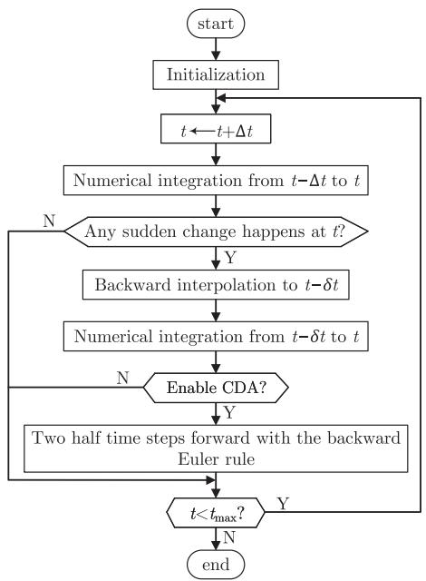  
Fig. 6. Flowchart of SFEMT simulation with ESS.

with

$$
\boldsymbol {G} _ {\text {g e n}} = \boldsymbol {T} ^ {- 1} \operatorname {d i a g} \left\{\frac {1 - \mathrm {e} ^ {- \frac {R _ {\text {s y n}} ^ {\mathrm {m i}}}{L _ {\text {s y n}} ^ {\mathrm {m i}}} \Delta t - \mathrm {j} \omega_ {\mathrm {s}} \Delta t}}{2 \left(R _ {\text {s y n}} ^ {\mathrm {m i}} + \mathrm {j} \omega_ {\mathrm {s}} L _ {\text {s y n}} ^ {\mathrm {m i}}\right)} \right\} \boldsymbol {T} \tag {39}
$$

$$
M _ {\mathrm {g e n}} = T ^ {- 1} \operatorname {d i a g} \left\{\mathrm {e} ^ {- \frac {R _ {\mathrm {s y n}} ^ {\mathrm {m i}}}{L _ {\mathrm {s y n}} ^ {\mathrm {m i}}} \Delta t - \mathrm {j} \omega_ {\mathrm {s}} \Delta t} \right\} T, i = 0, 1, 2.
$$

b) Three-Phase Transmission Line: In power system analyses, the lumped π-type equivalent model of the transmission line is widely used. The schematic diagram of the π-type equivalent model of the line k-m can be found in [8]. By a similar way of modeling a synchronous machine aforementioned, the RM-SFEMT model of the transmission lines can also be readily formulated, where the phase-mode transformation and the modeling of the R-L and C branches are required. Due to page limitations, it is not presented here.

# B. RM-SFEMT Simulation With Embedded Small Step

The flowchart of the SFEMT simulation with the ESS scheme is illustrated in Fig. 6, which has nine steps. The specific procedure is explained as follows:

1) Step 1: The simulation is initialized.   
2) Step 2: The time is updated from $t - \Delta t$ to t.   
3) Step 3: Numerical integration from t  Δt to t is executed.   
4) Step 4: Check whether a sudden change happens at t. If yes, go to step 5. Otherwise, go to step 9.   
5) Step 5: Conduct the backward interpolation with a small step of δt (typically 1 μs).   
6) Step 6: The sudden change is applied to the simulation, and the small-step integration is performed.   
7) Step 7: Check whether the critical damping adjustment (CDA) is required. If yes, go to step 8. Otherwise, go to step 9. It is needed when the TR method is used for

TABLE I PARAMETERS OF SYNCHRONOUS MACHINE IN THE SMIB SYSTEM   

<table><tr><td>Parameters</td><td>Value</td><td>Parameters</td><td>Value</td></tr><tr><td>Rated capacity (MVA)</td><td>325</td><td>Number of poles</td><td>4</td></tr><tr><td>Line-to-line voltage (kV)</td><td>20</td><td>Rated frequency (Hz)</td><td>50</td></tr><tr><td>Stator leakage reactance (p.u.)</td><td>0.1478</td><td>Stator resistance (p.u.)</td><td>0.00234</td></tr><tr><td>Field leakage reactance (p.u.)</td><td>0.2523</td><td>Field resistance (p.u.)</td><td>0.0005</td></tr><tr><td>d-axis damper reactance (p.u.)</td><td>0.1970</td><td>d-axis reactance (p.u.)</td><td>1.0467</td></tr><tr><td>q-axis damper reactance (p.u.)</td><td>0.1267</td><td>q-axis reactance (p.u.)</td><td>0.5911</td></tr></table>

the numerical integration of SFEMT. In contrast, if the RM method is adopted in the simulation, the CDA is unnecessary.

8) Step 8: Two half time-steps forward are performed using the backward Euler method [30].   
9) Step 9: Check if $t < t _ { \mathrm { m a x } }$ , where $t _ { \mathrm { m a x } }$ is simulation duration time. If yes, go to step 2. If no, the simulation ends.

# VI. CASE STUDIES

This section validates the accuracy of the presented method on three test systems. For comparison, all the following cases are simulated by traditional EMTP-type simulation with a time-step of 1 $\mu \mathrm { s } \left( \Delta t = 1 \mu \mathrm { s } \right)$ , and the results are considered as references.

# A. Simulation of Single-Machine Infinite-Bus (SMIB) System

An SMIB system is first considered for demonstrating the improved accuracy of the proposed method. Parameters of the synchronous machine are listed in Table I. This test system is simulated by the SFEMT simulation, RM-SFEMT simulation, SFEMT simulation with ESS and RM-SFEMT simulations with ESS, respectively. All the four types of simulations are implemented with a time-step size of 5 ms.

1) Simulation of Single Line-to-Ground Fault: In the SMIB system, phase A of the synchronous machine is shorted to ground with a transition resistance of 0.01 Ω at $t = 2 \mathrm { ~ s ~ }$ . The fault is cleared at $t = 2 . 1 \ s$ s. Phase A currents $( i _ { \mathrm { g a } } )$ of the synchronous gamachine obtained by these methods are compared with the reference curve and shown in Fig. 7. It can be found that incorrect overcurrents will be obtained by the two SFEMT simulation algorithms without ESS, especially the traditional SFEMT simulation. The proposed RM-SFEMT simulation with ESS scheme is the most accurate among the four types of simulations. It results from two aspects. On the one hand, compared with the TR rule, the RM method can accurately simulate the dc components of the currents and voltages in the simulation. On the other hand, the ESS scheme avoids the loss of integral for the non-state variable when the system suddenly changes.

Furthermore, the angular speeds and active powers of the synchronous machine obtained by the different methods are also studied. They are illustrated in Figs. 8 and 9, respectively. The same conclusions as that in stator current can be drawn. The proposed method is the most accurate among the four SFEMT simulation algorithms. Especially, it is much more accurate than the traditional SFEMT simulation.

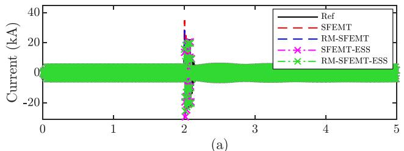

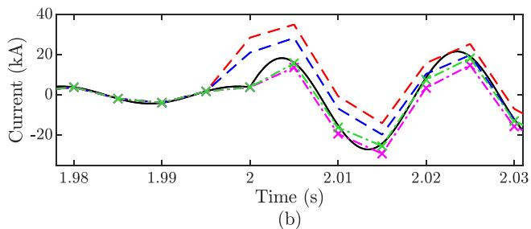  
Fig. 7. (a) Phase A current of the synchronous machine in the SMIB system following a phase-A-to-ground (A2G) fault. (b) A Zoom-ed in view of the phase A current.

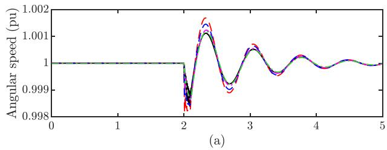

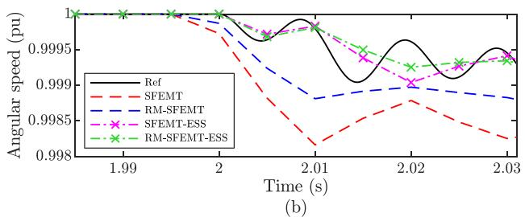  
Fig. 8. (a) Angular speed of the synchronous machine in the SMIB system. (b) A Zoom-ed in view of the angular speed.

2) Accuracy Validation on the SIMB System Under Various Faults: At t=2 s, phase-B-to-ground (B2G), phase-B-tophase-C (B2C), phase-A-phase-C (A2C), phase-A-to-phase-Bto-phase-C (L2L2L) faults are applied to the terminal of the synchronous machine with a transition resistance of 0.001 Ω, respectively. The phase A stator currents of the synchronous machine under different fault conditions obtained by different methods are illustrated in Fig. 10. It can also be concluded that the proposed RMSFEMT simulation with ESS scheme is much more accurate than traditional SFEMT simulation.

To give the readers a better picture of the numerical accuracy achieved by the proposed method, the 2-norm cumulative relative errors [31] of the transient currents (during the time interval [2.0 2.1]) obtained by the traditional method and the

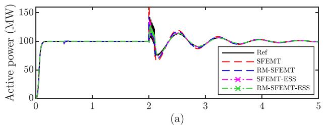

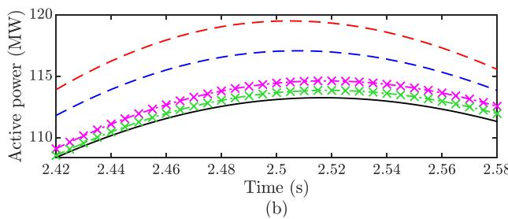  
Fig. 9. (a) Active power of the synchronous machine in the SMIB system. (b) A Zoom-ed in view of the active power.

TABLE II 2-NORM CUMULATIVE DEVIATION OF DIFFERENT METHODS (%)   

<table><tr><td>Faults</td><td>Quantity</td><td>SFEMT</td><td>RM-SFEMT</td><td>SFEMT with ESS</td><td>RM-SFEMT with ESS</td></tr><tr><td>A2G</td><td>iGa</td><td>52.65</td><td>33.04</td><td>15.90</td><td>3.96</td></tr><tr><td>B2G</td><td>iGa</td><td>30.36</td><td>17.74</td><td>14.34</td><td>1.89</td></tr><tr><td>A2C</td><td>iGa</td><td>81.07</td><td>25.04</td><td>77.92</td><td>4.74</td></tr><tr><td>B2C</td><td>iGa</td><td>36.63</td><td>32.14</td><td>21.43</td><td>5.73</td></tr><tr><td>L2L2L</td><td>iGa</td><td>61.33</td><td>31.03</td><td>59.28</td><td>2.42</td></tr></table>

proposed method are calculated and summarized in Table II. As can be observed, the proposed RM-SFEMT simulation with ESS scheme is highly accurate.

# B. Simulation of New England 10-Machine 39-Bus System

To further validate the proposed method, the standard New England 10-machine 39-bus system is considered. The one-line diagram of the test system is shown in Fig. 11. Detailed parameters can be found in [32], [33]. This test system is simulated by the four methods mentioned in Section VI-A with a time-step size of 1 ms $( \Delta t = 1$ ms), respectively.

1) A Fault At Bus 4: Initially, the test system is in the steadystate. An L2L2L fault with a transition resistance of 0.01 Ω is applied to Bus 4 at $t = 2 \mathrm { ~ s , ~ }$ and it is cleared after 0.1 s. The phase B currents of Bus-3-side of transmission line 3-4 obtained by different methods are compared and illustrated in Fig. 12. It can also be concluded that the proposed RM-SFEMT simulation with ESS is the most accurate among the four largestep simulation methods on multi-machine systems. It is worth noting that the traditional SFMET simulation algorithm not only exhibits significant errors in the transient process but also in the steady-state after the fault is cleared. This is because that the truncation error of traditional SFEMT simulation is related to the state variable. In the long simulation process, the simulation error is accumulated. In contrast, the proposed method is accurate during the whole simulation.

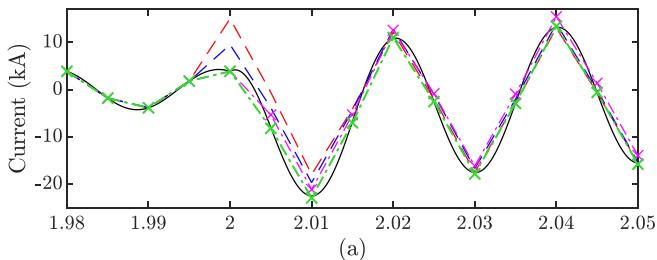

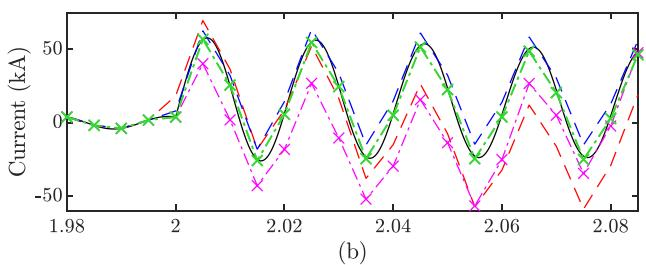

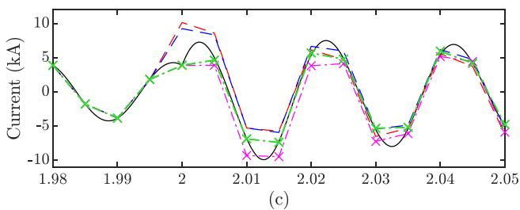

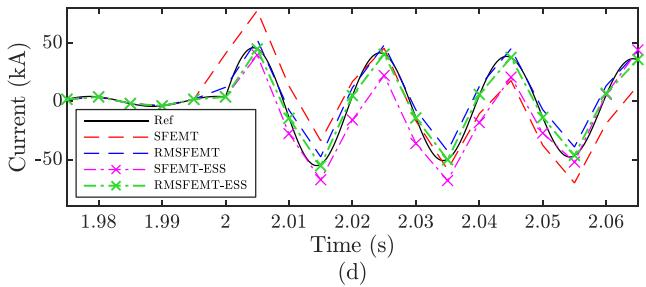  
Fig. 10. Transient current of phase A of the stator in the SMIB system under various faults. (a) B2G fault. (b) A2C fault. (c) B2C fault. (d) L2L2L fault.

2) A Fault At Bus 27: Besides, at t = 2 s, an L2L2L fault with a transition resistance of 0.5 Ω occurs at Bus 27. The phase B currents of Bus-2-side of transmission line 2-25 are calculated by the four SFEMT simulation algorithms with a time-step of 1 ms and compared with the reference, as shown in Fig. 13. It also indicates that the proposed RM-SFEMT simulation with ESS is much more accurate than the traditional SFEMT simulation both in transient-state and post-fault steady-state.

# C. Simulation of Real-Life Large-Scale Power System

The accuracy and scalability of the proposed method are further studied on a provincial power grid in China. The backbone of the system is shown in Fig. 14. This test system has 5253 single-phase nodes, including 67 generators, 721 transmission lines, 561 transformers and 838 loads. At t=2 s, an L2L2L fault occurs at the 500kV-bus GZ. It is simulated by different methods with a time step size of 1 ms (Δt = 1 ms), respectively.

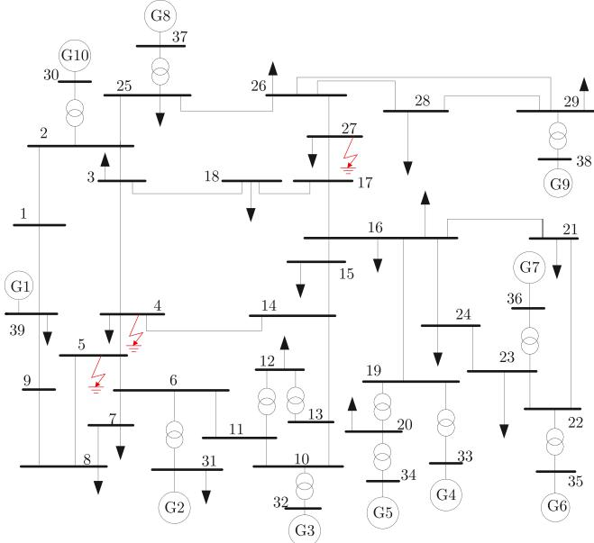  
Fig. 11. One-line diagram of New England 10-machine 39-bus system.

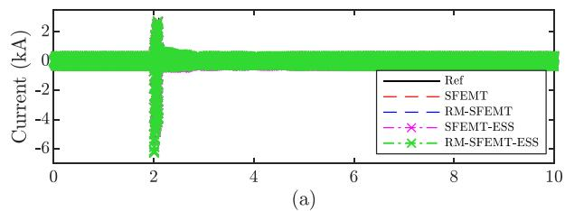

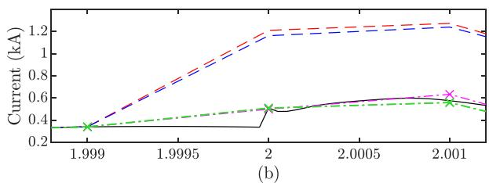

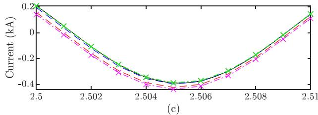

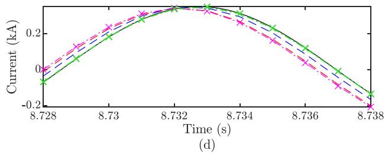  
Fig. 12. Phase B currents of the transmission line 3-4 obtained from different methods. (a) A global perspective of the phase B currents. (b)-(d) Magnified views of the phase B currents.

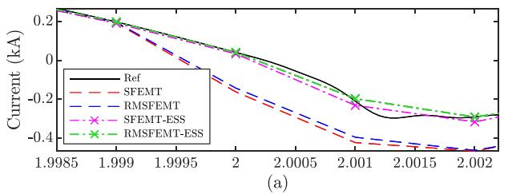

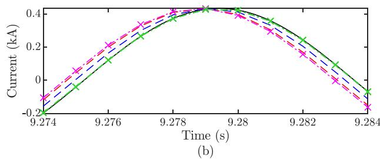  
Fig. 13. Phase B currents of the transmission line 2-25 obtained from different methods. (a) During the fault. (b) After the fault is cleared.

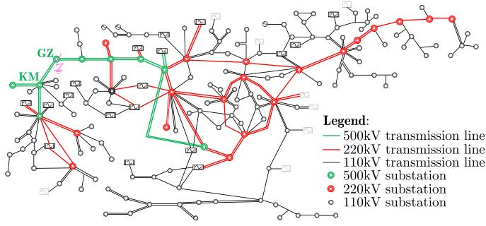  
Fig. 14. Backbone of a real transmission power system.

The phase C currents of Bus-KM-side of the transmission line GZ-KM are shown in Fig. 15. Also, it can be observed that the RM-SFEMT simulation with ESS is the most accurate among the four SFEMT simulation algorithms due to the use of RM and ESS techniques.

Overall, in the power systems with different scales, the proposed RM-SFEMT simulation with ESS is much more accurate than the traditional SFEMT simulation algorithm.

# D. Efficiency Comparison

To show the efficiency, traditional methods and the proposed method are implemented using C++ language with the same software framework. The cases are executed on an Intel i9- 10900 K computer with 32 GB RAM. The computational time consumed by these methods in simulating the aforementioned cases is compared and summarized in Table III. The SFEMT simulation is much more efficient than the reference because the time-step size is much larger. For the SMIB system, the SFEMT simulations are more than 2400 times faster than the reference since their time steps are 5000 times larger than that of the reference.

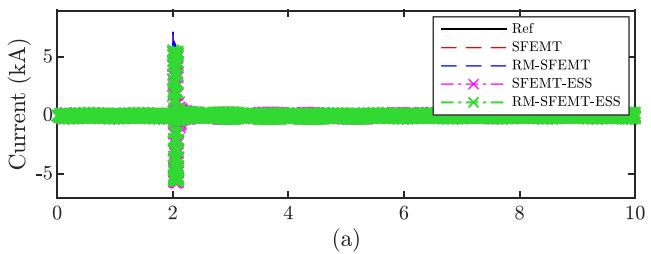

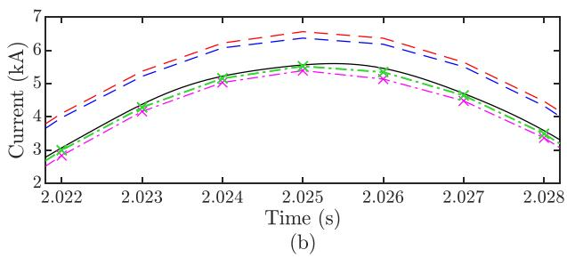  
Fig. 15. Phase C currents of transmission line GZ-KM. (a) The Global perspective. (b) Zoomed-in views.

TABLE III COMPUTATIONAL TIME OF DIFFERENT METHODS ON VARIOUS TEST SYSTEMS (s)   

<table><tr><td>Test Systems</td><td>Faults</td><td>Ref (Δt=1μs)</td><td>SFEMT</td><td>RM-SFEMT</td><td>SFEMT with ESS</td><td>RM-SFEMT with ESS</td></tr><tr><td rowspan="5">SMIB</td><td>A2G</td><td>40.54</td><td>0.017</td><td>0.017</td><td>0.017</td><td>0.017</td></tr><tr><td>B2G</td><td>40.54</td><td>0.017</td><td>0.017</td><td>0.017</td><td>0.017</td></tr><tr><td>A2C</td><td>40.54</td><td>0.017</td><td>0.017</td><td>0.017</td><td>0.017</td></tr><tr><td>B2C</td><td>40.54</td><td>0.017</td><td>0.017</td><td>0.017</td><td>0.017</td></tr><tr><td>L2L2L</td><td>40.54</td><td>0.017</td><td>0.017</td><td>0.017</td><td>0.017</td></tr><tr><td rowspan="2">IEEE 39</td><td>L2L2L</td><td>852.36</td><td>1.81</td><td>1.81</td><td>1.83</td><td>1.83</td></tr><tr><td>L2L2L</td><td>852.36</td><td>1.81</td><td>1.81</td><td>1.83</td><td>1.83</td></tr><tr><td>Real power grid</td><td>L2L2L</td><td>37242.49</td><td>79.22</td><td>79.24</td><td>79.35</td><td>79.37</td></tr></table>

More importantly, it can be found that the simulation efficiency of RM-SFEMT simulation is roughly the same as that of the traditional SFEMT simulation. Besides, since the ESS scheme hardly influences the simulation efficiency of the two methods, the computational times of SFEMT and RM-SFEMT simulation algorithms with ESS are only a little longer. In summary, the efficiency of the RM-SFEMT simulation with ESS is comparable to that of the conventional SFEMT simulation.

# VII. CONCLUSION

Aiming at the accuracy issue of traditional SFEMT simulation in sudden-change scenarios, a highly accurate SFEMT simulation algorithm is proposed. Two unique techniques, i.e., RM and ESS, are presented in the SFEMT simulation. The RM-SFEMT simulation method can accurately emulate both the dc component and ac carrier of currents and voltages. Besides, the ESS scheme can avoid the loss of integral for the non-state variable. Extensive case studies show that the proposed method is much more accurate than the traditional SFEMT simulation in both transient-states and steady-states. The presented method expands the application and role of SFEMT simulation in power system analysis. By the way, although the RM-based SFEMT

simulation is more accurate than the TR-based simulation, the RM method is difficult in modeling some complex and coupled components in power systems [22], which can be further explored. Besides, how to integrate the RM-based models into the commercial simulation tools is also worth studying.

# APPENDIX A

# DERIVATION OF (14)

This section presents how to derive the local truncation error of the RM-SFEMT simulation. First, assume that there is no error in the integration steps before time t, which means that $X ( t - \Delta t )$ is exactly accurate. For the input U (t), the analytical solution of X(t) can be represented as:

$$
X (t) = \mathrm {e} ^ {A \Delta t - \mathrm {j} \omega_ {\mathrm {s}} \Delta t} X (t - \Delta t) + B \frac {1 - \mathrm {e} ^ {A \Delta t - \mathrm {j} \omega \Delta t}}{\mathrm {j} \omega - A} U (t). \tag {A1}
$$

According to the steps of RM-SFEMT modeling and simulation in Section III-A, the analytical form of the numerical solution obtained from RM-SFEMT simulation can be obtained and represented as:

$$
\begin{array}{l} X _ {\mathrm {R M}} (t) = \frac {1 - \mathrm {e} ^ {- (\mathrm {j} \omega_ {\mathrm {s}} - A) \Delta t}}{2 (\mathrm {j} \omega_ {\mathrm {s}} - A)} B U (t - \Delta t) \\ + \frac {1 - \mathrm {e} ^ {- (\mathrm {j} \omega_ {\mathrm {s}} - A) \Delta t}}{2 (\mathrm {j} \omega_ {\mathrm {s}} - A)} B U (t) \\ + \mathrm {e} ^ {- (\mathrm {j} \omega_ {\mathrm {s}} - A) \Delta t} X (t - \Delta t). \tag {A2} \\ \end{array}
$$

Since $U ( t - \Delta t ) = U ( t ) \mathrm { e } ^ { - \mathrm { j } ( \omega - \omega _ { \mathrm { s } } ) \Delta t }$ , $X _ { \mathrm { R M } } ( t )$ can be rewritten as:

$$
\begin{array}{l} X _ {\mathrm {R M}} (t) = \mathrm {e} ^ {A \Delta t - \mathrm {j} \omega_ {\mathrm {s}} \Delta t} X (t - \Delta t) \\ + \frac {1 + \mathrm {e} ^ {- \mathrm {j} (\omega - \omega_ {\mathrm {s}}) \Delta t}}{2} \frac {1 - \mathrm {e} ^ {A \Delta t - \mathrm {j} \omega_ {\mathrm {s}} \Delta t}}{\mathrm {j} \omega_ {\mathrm {s}} - A} B U (t). \tag {A3} \\ \end{array}
$$

The local truncation error of the RM-SFEMT simulation can be calculated by subtracting (A1) from (A3):

$$
\begin{array}{l} T _ {\mathrm {R M}} (t) = \frac {1 + \mathrm {e} ^ {- \mathrm {j} (\omega - \omega_ {\mathrm {s}}) \Delta t}}{2} \frac {1 - \mathrm {e} ^ {A \Delta t - \mathrm {j} \omega_ {\mathrm {s}} \Delta t}}{\mathrm {j} \omega_ {\mathrm {s}} - A} B U (t) \\ - \frac {1 - \mathrm {e} ^ {A \Delta t - \mathrm {j} \omega \Delta t}}{\mathrm {j} \omega - A} B U (t). \tag {A4} \\ \end{array}
$$

# APPENDIX B

# DERIVATION OF (15)

This section presents how to derive the local truncation error of the TR-based SFEMT simulation. The analytical form of the numerical solution obtained from traditional SFEMT simulation can be represented as:

$$
\begin{array}{l} X _ {\mathrm {T R}} (t) = \frac {\frac {2}{\Delta t} - \mathrm {j} \omega_ {\mathrm {s}} + A}{\frac {2}{\Delta t} + \mathrm {j} \omega_ {\mathrm {s}} - A} X (t - \Delta t) \\ + \frac {1}{\frac {2}{\Delta t} + \mathrm {j} \omega_ {\mathrm {s}} - A} B (U (t) + U (t - \Delta t)). \quad (\mathrm {B 1}) \\ \end{array}
$$

Also, since $U ( t - \Delta t ) = U ( t ) \mathrm { e } ^ { - \mathrm { j } ( \omega - \omega _ { \mathrm { s } } ) \Delta t }$ , $X _ { \mathrm { T R } } ( t )$ can be rewritten as:

$$
X _ {\mathrm {T R}} (t) = \frac {\frac {2}{\Delta t} - \mathrm {j} \omega_ {\mathrm {s}} + A}{\frac {2}{\Delta t} + \mathrm {j} \omega_ {\mathrm {s}} - A} X (t - \Delta t) + \frac {1 + \mathrm {e} ^ {- \mathrm {j} (\omega - \omega_ {\mathrm {s}}) \Delta t}}{\frac {2}{\Delta t} + \mathrm {j} \omega_ {\mathrm {s}} - A} B U (t). \tag {B2}
$$

The local truncation error of the traditional SFEMT simulation can be obtained by subtracting (A1) from (B2):

$$
\begin{array}{l} T _ {\mathrm {T R}} (t) = \left(\frac {\frac {2}{\Delta t} - \mathrm {j} \omega_ {\mathrm {s}} + A}{\frac {2}{\Delta t} + \mathrm {j} \omega_ {\mathrm {s}} - A} - \mathrm {e} ^ {A \Delta t - \mathrm {j} \omega_ {\mathrm {s}} \Delta t}\right) X (t - \Delta t) \\ + \left(\frac {1 + \mathrm {e} ^ {\mathrm {j} (\omega - \omega_ {\mathrm {s}}) \Delta t}}{\frac {2}{\Delta t} + \mathrm {j} \omega_ {\mathrm {s}} - A} - \frac {1 - \mathrm {e} ^ {A \Delta t - \mathrm {j} \omega_ {\mathrm {s}} \Delta t}}{\mathrm {j} \omega - A}\right) B U (t). \tag {B3} \\ \end{array}
$$

# REFERENCES

[1] B. Qin, X. Zhang, J. Ma, S. Deng, S. Mei, and D. J. Hill, “Input-to-state stability based control of doubly fed wind generator,” IEEE Trans. Power Syst., vol. 33, no. 3, pp. 2949–2961, May 2018.   
[2] G. Li, H. Ye, S. Gao, Y. Liu, and L. Gao, “Modeling and simulation of large power system with inclusion of bipolar MTDC grid,” Int. J. Electr. Power Energy Syst., vol. 116, Mar. 2020, Art. no. 105565.   
[3] Z. Wang, J. He, Y. Xu, and F. Zhang, “Distributed control of VSC-MTDC systems considering tradeoff between voltage regulation and power sharing,” IEEE Trans. Power Syst., vol. 35, no. 3, pp. 1812–1821, May 2020.   
[4] P. Zhang, J. R. Marti, and H. W. Dommel, “Induction machine modeling based on shifted frequency analysis,” IEEE Trans. Power Syst., vol. 24, no. 1, pp. 157–164, Feb. 2009.   
[5] Y. Huang, M. Chapariha, F. Therrien, J. Jatskevich, and J. R. Marti, “A constant-parameter voltage-behind-reactance synchronous machine model based on shifted-frequency analysis,” IEEE Trans. Energy Convers., vol. 30, no. 2, pp. 761–771, Jun. 2015.   
[6] S. Gao, Y. Chen, Y. Song, and S. Huang, “Three-stage implicit integration for large time-step size electromagnetic transient simulation with shifted frequency-based modeling,” Electr. Power Syst. Res., vol. 198, Sep. 2021, Art. no. 107356.   
[7] K. Strunz, R. Shintaku, and F. Gao, “Frequency-adaptive network modeling for integrative simulation of natural and envelope waveforms in power systems and circuits,” IEEE Trans. Circuits Syst. I., Reg. Papers, vol. 53, no. 12, pp. 2788–2803, Dec. 2006.   
[8] P. Zhang, J. R. Marti, and H. W. Dommel, “Shifted-frequency analysis for EMTP simulation of power-system dynamics,” IEEE Trans. Circuits Syst. I., Reg. Papers, vol. 57, no. 9, pp. 2564–2574, Sep. 2010.   
[9] S. Fan and H. Ding, “Time domain transformation method for accelerating EMTP simulation of power system dynamics,” IEEE Trans. Power Syst., vol. 27, no. 4, pp. 1778–1787, Nov. 2012.   
[10] P. Zhang, J. R. Marti, and H. W. Dommel, “Synchronous machine modeling based on shifted frequency analysis,” IEEE Trans. Power Syst., vol. 22, no. 3, pp. 1139–1147, Aug. 2007.   
[11] Y. Huang, F. Therrien, J. Jatskevich, and L. Dong, “State-space voltagebehind-reactance modeling of induction machines based on shiftedfrequency analysis,” in Proc. IEEE Power Energy Soc. Gen. Meet., Denver, CO, US, 2015, pp. 1–5.   
[12] Y. Xia and K. Strunz, “Multi-scale induction machine model in the phase domain with constant inner impedance,” IEEE Trans. Power Syst., vol. 35, no. 3, pp. 2120–2132, May 2020.   
[13] F. Gao and K. Strunz, “Frequency-adaptive power system modeling for multiscale simulation of transients,” IEEE Trans. Power Syst., vol. 24, no. 2, pp. 561–571, May 2009.   
[14] H. Ye and K. Strunz, “Multi-scale and frequency-dependent modeling of electric power transmission lines,” IEEE Trans. Power Del., vol. 33, no. 1, pp. 32–41, Feb. 2018.   
[15] F. Camara, A. C. Lima, and K. Strunz, “Multi-scale formulation of admittance-based modeling of cables,” Electr. Power Syst. Res., vol. 195, Jun. 2021, Art. no. 107120.   
[16] H. Ye, B. Yue, X. Li, and K. Strunz, “Modeling and simulation of multiscale transients for PMSG-based wind power systems,” Wind Energy, vol. 20, no. 8, pp. 1349–1364, Mar. 2017.

[17] Y. Xia, Y. Chen, Y. Song, and K. Strunz, “Multi-scale modeling and simulation of DFIG-based wind energy conversion system,” IEEE Trans. Energy Convers., vol. 35, no. 1, pp. 560–572, Mar. 2020.   
[18] S. Gao, Y. Song, Y. Chen, Z. Yu, and Z. Tan, “Shifted frequency-based electromagnetic transient simulation for AC power systems in symmetrical component domain,” IET. Renew. Power Gener., pp. 1–12, 2022, doi: 10.1049/rpg2.12418.   
[19] P. Kundur, Power System Stability and Control. New York, NY, USA: McGraw-Hill, 1994.   
[20] S. Gao, Y. Chen, Y. Song, Y. Xia, and Z. Tan, “Determination of optimal shift frequency for shifted frequency-based simulation,” IEEE Trans. Power Syst., vol. 36, no. 5, pp. 4824–4827, Sep. 2021.   
[21] N. R. Watson and G. D. Irwin, “Comparison of root-matching techniques for electromagnetic transient simulation,” IEEE Trans. Power Del., vol. 15, no. 2, pp. 629–634, Apr. 2000.   
[22] N. Watson and J. Arrillaga, Power Systems Electromagnetic Transients Simulation. London, U.K.: IET, 2003.   
[23] J. C. Butcher, Numerical Methods for Ordinary Differential Equations, 2nd ed. New York, NY, USA: Wiley, 2008.   
[24] M. Zou, J. Mahseredjian, G. Joos, B. Delourme, and L. Gérin-Lajoie, “Interpolation and reinitialization in time-domain simulation of power electronic circuits,” Electr. Power Syst. Res., vol. 76, no. 8, pp. 688–694, May 2006.   
[25] P. Kuffel, K. Kent, and G. Irwin, “The implementation and effectiveness of linear interpolation within digital simulation,” Int. J. Electr. Power Energy Syst., vol. 19, no. 4, pp. 221–227, May 1997.   
[26] H. W. Dommel, EMTP Theory Book, 2nd Ed. Portland, OR, USA: Bonneville Power Administration, 1996.   
[27] X. Ye, Y. Tang, and D. Shu, “Large step size electromagnetic transient simulations by matrix transformation-based shifted-frequency phasor models,” IET Gener. Transm. Distrib., vol. 14, no. 15, pp. 2890–2900, Jun. 2020.   
[28] A. M. Gole, R. W. Menzies, H. M. Turanli, and D. A. Woodford, “Improved interfacing of electrical machine models to electromagnetic transients programs,” IEEE Trans. Power App. Syst., vol. PAS-103, no. 9, pp. 2446–2451, Sep. 1984.   
[29] L. Wang and J. Jatskevich, “A phase-domain synchronous machine model with constant equivalent conductance matrix for EMTP-type solution,” IEEE Trans. Energy Convers., vol. 28, no. 1, pp. 191–202, Mar. 2013.   
[30] J. Lin and J. R. Marti, “Implementation of the CDA procedure in the EMTP,” IEEE Trans. Power Syst., vol. 5, no. 2, pp. 394–402, May 1990.   
[31] Y. Xia, Y. Chen, H. Ye, and K. Strunz, “Multiscale induction machine modeling in the dq0 domain including main flux saturation,” IEEE Trans. Energy Convers., vol. 34, no. 2, pp. 652–664, Jun. 2019.   
[32] H. Ye, Y. Liu, P. Zhang, and Z. Du, “Analysis and detection of forced oscillation in power system,” IEEE Trans. Power Syst., vol. 32, no. 2, pp. 1149–1160, Mar. 2017.   
[33] G. Rogers, Power System Oscillations. Boston, MA, USA: Kluwer, 2000.

Shilin Gao (Student Member, IEEE) received the B.S. and M.S. degrees in electrical engineering from Shandong University, Jinan, China, in 2017. He is currently working toward the Ph.D. degree in electrical engineering with the Department of Electrical Engineering, Tsinghua University, Beijing, China. His research interests include power system electromagnetic transient simulation, power system dynamic stability analysis and control, and MTDC grid.

Zhendong Tan received the B.S. and M.S. degrees in electrical engineering from Tsinghua University, Beijing, China, in 2018 and 2021, respectively. He is an Engineer of Center of Cloud-Based Simulation and Intelligent Decision-Making, Sichuan Energy Internet Research Institute, Tsinghua University. His research interests include electromagnetic transient simulation and power system dynamic stability analysis.

Yankan Song (Member, IEEE) received the Ph.D. degree in electrical engineering from Tsinghua University, Beijing, China, in 2018. From 2018 to 2020, he was a Postdoctoral Scholar with Tsinghua University. He is currently the R&D Manager with the Center of Cloud-Based Simulation and Intelligent Decision-Making (CSAID), Sichuan Energy Internet Research Institute, Tsinghua University. His research interests include power system modeling and electromagnetic transient simulation, parallel computing, and hybrid simulation of interconnected AC–DC systems.

Chen Shen (Senior Member, IEEE) received the B.E. and Ph.D. degrees in electrical engineering from Tsinghua University, Beijing, China, in 1993 and 1998, respectively. From 1998 to 2001, he was a Postdoctoral Research Fellow with the Department of Electrical Engineering and Computer Science, University of Missouri Rolla, Rolla, MO, USA. From 2001 to 2002, he was a Senior Application Developer with ISO New England, Inc., MA, USA. Since 2009, he has been a Professor with the Department of Electrical Engineering, Tsinghua University. He is currently the

Associate Director of the State Key Laboratory of Power System and Generation Equipment and the Director of the Center of Cloud-Based Simulation and Intelligent Decision-Making (CSAID), Sichuan Energy Internet Research Institute, Tsinghua University. He is the author or coauthor of more than 180 technical papers and one book, and holds 32 issued patents. His research interests include power system analysis and control, renewable energy generation, and smart grids.

Ying Chen (Senior Member, IEEE) received the B.S. and Ph.D. degrees in electrical engineering from Tsinghua University, Beijing, China, in 2001 and 2006, respectively, where he is currently a Professor with the Department of Electrical Engineering. His research interests include parallel and distributed computing, electromagnetic transient simulation, cyber-physical system modeling, and cyber security of smart grids.

Zhitong Yu (Member, IEEE) received the B.S. and M.S. degrees in electrical engineering from Tsinghua University, Beijing, China, in 2014 and 2017, respectively. He is currently the executive Director of Center of Cloud-Based Simulation and Intelligent Decision-Making, Sichuan Energy Internet Research Institute, Tsinghua University. His research interests include electromagnetic transient simulation, GPUbased high-performance computing, and digital twin of power system.