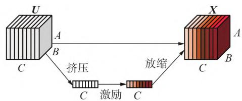
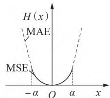
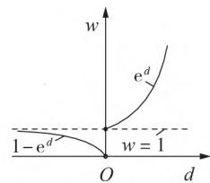
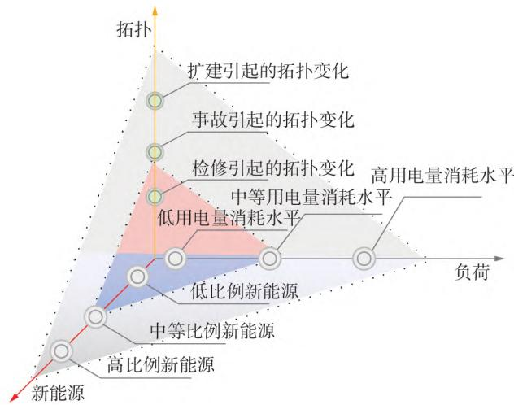
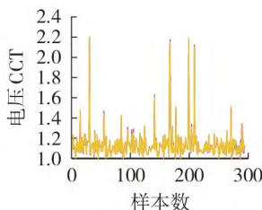
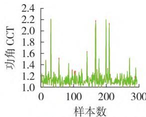
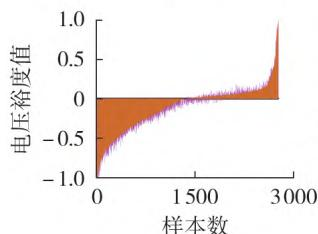
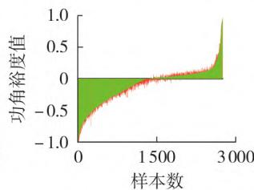

# 基于MRSE-CNN的电力系统多任务暂态稳定自适应评估

吴俊勇1，史法顺1，李栌苏1，赵鹏杰2，张若愚3

（1. 北京交通大学 电气工程学院，北京 100044；2. 国家电网山西省电力公司，山西 太原 030021；

中国长江三峡集团有限公司科学技术研究院，北京 ）

摘要：为解决暂态功角与暂态电压一体化评估中可靠性不足、在线更新耗时过长的问题，提出多任务暂态稳定自适应评估方法。利用变步长二分法从时间维度上构建暂态功角与暂态电压的稳定边界；提出一种融合多尺度残差挤压激励机制的多任务卷积神经网络，该网络直接面向量测数据，仅需3个采样点即可完成输入特征与稳定边界的映射，在保证快速性的基础上实现了高精度的边界拟合；通过引入自适应动态权重的损失函数进一步增强模型在实际应用中的可靠性；在线应用时，通过迁移学习实现模型在负荷、拓扑、新能源 个维度下的自适应更新。在改进的 节点系统中的验证结果表明，所提方法不仅兼顾快速性、准确性与可靠性，而且在未知场景下具备快速更新的能力。

关键词：暂态稳定评估；暂态功角稳定；暂态电压稳定；极限切除时间；自适应动态权重；迁移学习

中图分类号：

文献标志码：

DOI：10.16081/j.epae.202411016

# 0 引言

在“双碳”目标的政策驱动下［1］ ，新型高比例可再生能源系统加速构建，系统发电侧呈现高比例可再生能源化，电网侧呈现高电力电子化［2］。“双高”系统导致系统不确定性增强，且动态过程更为复杂。在此背景下，暂态功角问题与暂态电压问题耦合紧密且频发，大停电事故风险加剧［3］ ，仅依托“盲杖探路”模式的传统方法难以解决新系统下的安全评估问题。人工智能的涌现为研究复杂系统提供了“雷达扫描”模式的新路径。

基于人工智能的相关研究大多将暂态功角评估［4⁃6］ 与暂态电压评估［7⁃9］ 进行割裂简化分析，虽然以上研究在评估方面均取得了不错的效果，但从系统学角度，暂态功角评估与暂态电压评估属于同一非线性动力系统的不同表现形式，且就暂态过程而言，两者处于统一时间尺度［10］ ，割裂评估不利于对系统整体安全进行保护评估，而从算法学角度，将两者割裂不仅耗费计算资源，还不利于模型探索功角与电压之间的复杂关系。

目前，已有少部分研究将电压与功角作为整体进行评估。文献［ ］提出一种融合挤压激励模块的改进卷积神经网络（ ，），实现了功角与电压的共同评估，但模型所需观测时间窗过长，仅适用于仿真分析场景；文献［ ］通过图嵌入算法考虑空间特征，针对功角与电压问

题取得了较高的准确率，但特征采用非连续采样，算法面向工程实际中的流式数据时难以应用，且面临未知场景时难以实现知识的在线迁移；文献［ ］通过决策树进行电压与功角的一体化评估，但仅给出稳定与否的结果，未衡量相应的安全裕度。针对以上问题，文献［ ］提出一种基于时间边界的一体化评估方法，模型直接面向时序的量测数据快速给出电压与功角的评估结果与相应裕度，取得了较高的准确率，但文中未考虑实际工程中漏判（将失稳情况判断为稳定）与误判（将稳定情况判断为失稳）代价不同的影响，且未对未知场景的知识迁移进行研究。

综上所述，为进一步弥补功角与电压一体化评估中所存在的不足，本文基于文献［14］，首先，采用变步长二分法求解极限切除时间（critical clearing， ），从时间维度上构建暂态电压与暂态功角的安全边界；其次，提出一种融合多尺度残差挤压激励机制的卷积神经网络（work with multiscale residual squeeze excitation，- ），模型可精确地拟合电压功角安全边界；然后，提出自适应动态权重的 损失函数，在回归过程中降低对异常数据的敏感度，增强模型可靠性，同时计及误判与漏判的不同代价，进一步增强在实际工程中的可用性；最后，考虑不可预知的动态空间，采用微调迁移实现模型在负荷、拓扑、新能源 个维度下的知识迁移。

# - 算法介绍

本文提出 - ，下面分别介绍算法各部分原理。

# 多尺度一维卷积神经网络

目前，大多研究所采用的一维卷积神经网络

（one-dimensional convolutional neural network，1D-CNN）通过卷积与池化操作逐层提取高维特征。文献［14］对传统一维卷积网络进行了详细的原理说明，本文不再赘述。传统一维卷积网络的卷积过程采用大小相同的卷积核，从算法角度，传统模型所看到的特征视野大小是相同的，但在实际中，对于不同特征需要以不同大小的视野去观察，因而本文采用多尺度卷积技术代替常规卷积，融合不同大小的卷积核，从而充分挖掘系统中不同粗细粒度的特征。

# 挤压-激励机制

不同输入特征对系统整体评估任务的重要程度不同，因而在多尺度卷积后引入挤压-激励（squeeze， ）机制，其核心思想是对不同特征通道赋予不同权重，将计算注意力集中在权重较大的重要通道上，同时抑制权重较小的非重要通道，从而优化计算资源，提高模型性能。SE机制原理如图1所示，包含挤压、激励和放缩三部分。图中：U为特征图；C为维度；A、B分别为特征图的高度和宽度；X为最终的整体输出结果。

  
图1 SE机制原理  
Fig.1 Principle of SE mechanism

）挤压采用全局平均池化压缩特征空间，对特征图U求和后取平均得到多维统计量 $z \in \mathbf { R } ^ { C }$ ，其中第n个统计量 $z _ { n }$ 可表示为：

$$
z _ {n} = f _ {\text {s q u e e z e}} \left(u _ {n} (i, j)\right) = \frac {1}{A B} \sum_ {i = 1} ^ {A} \sum_ {j = 1} ^ {B} u _ {n} (i, j) \tag {1}
$$

式中： $f _ { \mathrm { s q u e e z e } } ( \cdot )$ 表示挤压运算； $; u _ { n } \big ( i , j \big )$ 为输入特征中第i行第 $j$ 列的像素。

）激励挖掘特征通道之间的相互关系并对通道赋予不同权重，过程可表示为：

$$
s = f _ {\text {e x c i t a t i o n}} (z, W) = \sigma \left(W _ {2} \varepsilon \left(W _ {1} z\right)\right) \tag {2}
$$

式中：s 为特征图 U 中各通道的权重值； $f _ { \mathrm { e x c i t a t i o n } } ( \cdot )$ 表示激励运算；W为运算参数； $; \sigma ( \cdot ) , \varepsilon ( \cdot )$ 分别为 Sig⁃和 激活函数； ${ \pmb { W } } _ { 1 } \in { \bf R } ^ { ( C / r ) \times C }$ 、 ${ \pmb W } _ { 2 } \in { \bf R } ^ { ( C / r ) \times C }$ 分别为维度下降层和维度上升层的参数，r为平衡性能与复杂度的缩放参数。

3）放缩将第n个通道特征 ${ \pmb u } _ { n }$ 与对应的权重 $s _ { n }$ 相乘后得到 $\pmb { x } _ { n } { \in } X \mathrm { = } \big \{ \pmb { x } _ { 1 } , \pmb { x } _ { 2 } , \cdots , \pmb { x } _ { C } \big \}$ ，如式（3）所示。

$$
\boldsymbol {x} _ {n} = f _ {\text {s c a l e}} \left(\boldsymbol {u} _ {n} s _ {n}\right) \tag {3}
$$

式中： $f _ { \mathrm { s c a l e } } ( \cdot )$ 表示放缩运算。

# 残差模块

残差模块是深度残差网络的核心部分，有效解决了 因层数增加而导致的过拟合、梯度消失问题，在训练过程中大幅降低了模型训练难度，因而更容易训练出比较理想的模型。本文在多尺度卷积后引入恒等映射型残差模块，其具体原理见文献［ ］，本文不再赘述。

# 多任务模块

研究表明，联系密切的多任务框架比单一任务学习具备更良好的泛化能力［16］ 。由于暂态功角问题与暂态电压问题相互耦合关联，因此构建多任务框架在减少训练代价的同时，更有利于对功角、电压共有知识的学习，实现系统层面的整体安全评估。在模型训练过程中采用同一输入特征学习功角与电压的网络参数，将两者的误差之和作为训练过程的损失函数，最终通过全连接层所构成的多层感知机分别输出暂态功角与暂态电压的边界评估结果，实现一体化评估。

# 1.5 自适应动态权重的Huber损失

在神经网络模型训练时，前向传播过程通过损失函数衡量真实值与预测值的差距，从而指导反向传播更新模型参数，起到目标引导的作用。本文所提改进的损失函数着重解决如下 点问题。

）提升模型泛化能力的问题。在解决回归问题中，往往采用均方误差（mean square error，MSE）损失函数和平均绝对误差（mean absolute error，MAE）损失函数。 函数连续可导，但对误差所产生的离群点异常敏感，因而降低了模型整体性能。函数虽然对离群点更具包容性，但其导函数不连续，会出现函数收敛困难的情况，导致模型训练难度增加。为克服上述缺点，针对本文模型引入 $\mathrm { H u b e r } ^ { [ 1 7 ] }$ 损失函数。改进的 损失函数具体原理如图（a）所示。图中：H(x)为改进的Huber损失函数，x为模型训练误差值；α为敏感参数。改进的Huber损失函数的本质是 和 损失函数的结合，其中α越小则曲线越接近 ，α越大则曲线越接近 ，因而改进的 损失函数同时具备 与损失函数的优点，不仅降低了对离群点的敏感度，而且其导函数连续，在快速收敛的同时提升了模型训练的稳定性。

）漏判代价过高的问题。目前，在分类问题中，已有关于解决漏判问题的研究，即通过设置固定权重系数提高损失函数中出现漏判的代价［18］ ，但随着漏判代价的增加，响应的误判样本也增多。本文引入自适应动态权重系数，在解决漏判代价问题的同时最大可能避免误判的增多，具体原理如图 （）所示。图中 $: d$ 为预测值与真实值的差值；w为权重值。当 的预测值 $P _ { \mathrm { C C T } }$ 不小于真实值 $T _ { \mathrm { c c r } } ( d { \geqslant } 0 )$ ）时，存

在漏判的可能，因而对该情况赋予较大的损失权重，具体权重大小由该工况下预测值与真实值的偏离程度动态决定：偏离程度越大则权重损失越大；偏离程度越小，则权重损失相对较小。当 $P _ { \mathrm { C C T } } { < } T _ { \mathrm { C C T } } ( d { < } 0 )$ ）时，不会出现漏判情况，因而对该情况赋予相对较小的损失权重，具体权重大小仍由偏离程度动态决定，预测值与真实值的偏离程度越大则权重损失越大，反之则越小。

  
（a）Huber损失原理

  
（b）动态权重  
图2 改进的Huber损失函数示意图  
Fig.2 Schematic diagram of improved Huber loss function

考虑以上 点要素所构建的改进的 损失函数为：

$$
\begin{array}{l} H (x) = \left\{ \begin{array}{l l} \frac {1}{2} x ^ {2} & | x | \leqslant \alpha \\ x - \frac {1}{2} \alpha & | x | > \alpha \end{array} \right. (4) \\ L _ {\text {l o s s}} = \left\{ \begin{array}{l l} \mathrm {e} ^ {d} H (x) & d \geqslant 0 \\ \left(1 - \mathrm {e} ^ {d}\right) H (x) & d <   0 \end{array} \right. (5) \\ d = P _ {\mathrm {C C T}} - T _ {\mathrm {C C T}} (6) \\ \end{array}
$$

式中： $: L _ { \mathrm { l o s s } }$ 为最终的改进Huber损失值。

# 基于 - 的一体化自适应方法

# 2.1 暂态功角与电压自适应评估框架

基于 - 的暂态功角与电压一体化自适应评估方法整体可分为 个部分，分别为离线训练、模型更新过程和在线应用，如附录 图 所示。本节对这 个部分进行概要描述。

）离线训练。在离线训练部分，构建暂态稳定样本数据库。首先，通过调用PSASP软件实现变步长二分法求解 ，构建基于时间维度的安全边界；然后，将稳态到暂态瞬间 个连续采样点对应的母线有功、无功功率与电压数据作为样本特征，并将其与对应的 及裕度标签构成样本集；最后，通过训练MRSE-CNN多任务一体化评估模型测试满足预设误差后得到的完备模型。  
）模型更新过程。当完备模型面临未知场景出现性能退化时，启动在线更新环节，选择相应的迁移方案，通过少量样本微调原模型，实现模型在未知场景的自适应更新。  
）在线应用。采用性能优越的完备模型进行在

线评估，模型保持持续监测，当某一扰动发生时，将故障瞬间稳态到暂态的3个连续采样点输入MRSE-中，模型即可给出相应的 结果，并确定当前时刻暂态功角与电压的稳定状态及相应的安全裕度。

# 2.2 时间维度安全边界的构建

目前，系统呈现高维、非线性特性，且动态过程复杂，难以依托准确的数学模型构建暂态功角与暂态电压的稳定边界，因此，本文基于时间维度构建安全边界，采用 语言调用 软件，通过变步长二分法自动求解暂态电压与暂态功角的CCT，具体求解过程见文献［14］，本文不再赘述。

# 2.3 基于MRSE-CNN评估安全边界

本文基于 - 模型构建输入特征与安全边界之间的隐形映射，具体模型结构如附录A图所示，可分为以下 个部分。

）电力系统实时监测数据。本文模型的输入特征面向系统实时输出的量测数据，节省了数据处理时间。将母线电压、有功功率与无功功率相结合，形成的输入特征F可表示为：

$$
\begin{array}{l} \boldsymbol {F} = \left[ V _ {1}, P _ {1}, Q _ {1}, \dots , V _ {l}, P _ {l}, Q _ {l}, \dots , V _ {o}, P _ {o}, Q _ {o} \right] \\ V _ {l}, P _ {l}, Q _ {l} \in \mathbf {R} ^ {t} \tag {7} \\ \end{array}
$$

式中： $V _ { l \setminus } P _ { l \setminus } Q _ { l }$ 分别为第l条母线输出的电压、有功功率和无功功率；o为监测的母线数；t为采样点数，本文仅需 个连续采样点即可完成评估。

）多尺度卷积。在多尺度卷积部分，将不同母线的电压、有功功率、无功功率分开卷积，从而扫描到每条母线的电压、有功功率、无功功率，使模型学习到电压、有功功率、无功功率之间的隐性关系。  
）残差模块。经过一层多尺度卷积后，进入含层卷积的残差路径，配合批标准化与卷积操作，避免模型在卷积层数增加的过程中引发梯度消失与过拟合的问题，降低训练难度。  
）多注意力机制。经过残差模块后，将不同大小卷积核所提取的特征均加入 模块，然后经合并操作将不同尺度下所提取的特征进行融合，形成新的特征，并进一步采用 模块更新注意力权重，实现多注意力机制下的特征更新。  
）多任务。将多注意力部分输出的特征进行展平操作，形成全连接层。在首个全连接层后构建个独立的分支，分别用于输出暂态电压的 与暂态功角的 。

# 基于迁移学习的稳定边界自适应更新

本文面向回归场景，首次将迁移学习［19］ 引入暂态功角与电压一体化评估问题中，采用模型微调的技术，从迁移方案与迁移角度 个方面进行阐述。

）迁移方案。本文考虑 种不同的迁移方案进

行对比：方案1，对原模型随机初始化参数，直接用新场景下的样本重新训练模型；方案2，不对参数进行初始化，用新场景下的样本微调原模型特征提取层和多任务预测层；方案3，用新场景下的样本微调原模型特征提取层，重新训练最后的多任务预测层；方案 ，冻结原模型特征提取层参数，仅微调多任务预测层；方案 ，冻结原模型特征提取层，重新训练最后的多任务预测层。

）迁移角度。可以从负荷、拓扑、新能源 个维度来描述复杂庞大的电力系统动态空间，如图所示。

  
图3 3个维度下的电力系统动态空间  
Fig.3 Dynamic space of power system under three dimensions

# 评价指标

本文将暂态功角稳定指数与暂态电压稳定指数作为稳定判据，依托暂态功角与电压的 构建裕度指标，具体设置见文献［ ］，本文不再赘述。

# 2.5.1 多任务回归评价指标

本文选取 MSE 和 MAE 指标衡量模型对功角与电压 的回归效果。

$$
E _ {\mathrm {M S E}} = \frac {1}{N _ {\text {t e s t}}} \sum_ {m = 1} ^ {N _ {\text {t e s t}}} \left(y _ {m} - \hat {y} _ {m}\right) ^ {2} \tag {8}
$$

$$
E _ {\mathrm {M A E}} = \frac {1}{N _ {\text {t e s t}}} \sum_ {m = 1} ^ {N _ {\text {t e s t}}} \left| y _ {m} - \hat {y} _ {m} \right| \tag {9}
$$

式中： $E _ { \mathrm { { M S E } } }$ 为MSE值； $E _ { \mathrm { { \scriptscriptstyle M A E } } }$ 为MAE值； $N _ { \mathrm { t e s t } }$ 为测试集样本数； $; y _ { m }$ 为测试集中第m个工况下的真实值； $; \hat { y } _ { m }$ 为测试集中第m个工况下的预测值。

# 多任务分类评价指标

为衡量多任务分类的准确率与可靠性，根据表定义准确率 $P _ { \mathrm { ~ A ~ } }$ 、漏判率 $P _ { \mathrm { ~ L ~ } }$ 与误判率 $P _ { \mathrm { ~ R ~ } }$ 分别为：

$$
P_{\mathrm{A}} = \frac{N_{11} + N_{22}}{N_{11} + N_{12} + N_{21} + N_{22}}\times 100\% \tag{10}
$$

$$
P_{\mathrm{L}} = \frac{N_{21}}{N_{21} + N_{22}}\times 100\% \tag{11}
$$

$$
P_{\mathrm{R}} = \frac{N_{12}}{N_{11} + N_{12}}\times 100\% \tag{12}
$$

式中： ${ \bf \sigma } ; N _ { i j } \left( i , j = 1 , 2 \right)$ 为表1矩阵中第i行第 $j$ 列元素表示的样本数。

表1 二维混淆矩阵  
Table 1 Two-dimensional confusion matrix   

<table><tr><td rowspan="2">样本</td><td colspan="2">样本数</td></tr><tr><td>稳定(预测)</td><td>失稳(预测)</td></tr><tr><td>稳定(真实)</td><td>N11</td><td>N12</td></tr><tr><td>失稳(真实)</td><td>N21</td><td>N22</td></tr></table>

# 3 算例分析

# 3.1 10 机 39 节点系统

# 原系统样本集的构造

为充分满足不同稳定问题的研究特点要求，采用详尽的发电机六阶模型，用于模拟发电机侧的动态过程，采用大型工业电机与恒阻抗组成的综合负荷，用于模拟负荷侧的动态过程。以该系统为原系统，构造样本集，具体过程如下。

）样本标签。为使原模型更加完备，采用二分法计算功角与电压 时，考虑附录 表 中设置的各类工况［14］ ，共生成功角与电压各个 结果，对应功角、电压各 个稳定／不稳定结果。  
）样本特征。在仿真时，设置在 时发生故障，在 个周期时切除故障，则特征采样区间可表示为 $\left[ T _ { 0 } , T _ { \mathrm { f a u l t } } \right]$ ，其中 $T _ { 0 }$ 为故障前的稳态时刻， $T _ { \mathrm { f a u l t } }$ 为故障后某时刻，本文取 $T _ { \mathrm { f a u l t } }$ 为1.02 s，即采样区间为［1，］ ，构成负荷节点稳态与暂态时刻的 个连续采样点，生成 个工况下的样本特征。在 预测阶段，将生成的电压与功角各 个样本按照∶∶ 划分为训练集、验证集、测试集来训练原模型。依托 进行系统裕度评估时，设置故障持续时间为 个周期，共生成测试集中 个裕度评估结果。

# - 模型的有效性分析

本节验证多尺度卷积与多注意力残差的有效性。为在同一尺度下进行对比，本节模型均以作为损失函数。在训练过程中，采用 算法进行参数优化，设置样本批量大小为 ，初始学习率为 ，训练步长衰减系数为 ，迭代次数设置为200，以测试集的结果评估模型有效性。

# 1）多尺度卷积有效性。

将未加入多尺度卷积的 与仅加入多尺度卷积的 （记为 - ）进行对比，结果如表 所示。由表可知，采用大小不同的卷积核对特征进行提取时的感受视野不同，所提取到的是不同视觉下的细节特征或宏观特征，整体而言，随着卷积核的增

加，多任务回归精度有细微提升。本文所采用的M-因融合了整个特征层面的细节特征与宏观特征，对功角与电压一体化评估问题有更全面的表征，与单一卷积尺寸的结构相比，其回归精度有进一步的提升。

表2 多尺度卷积核对比实验  
Table 2 Contrast experiment of multiscale convolution kernel   

<table><tr><td rowspan="2">模型</td><td rowspan="2">卷积核大小</td><td colspan="2">电压评估结果</td><td colspan="2">功角评估结果</td></tr><tr><td>E MAE</td><td>E MSE</td><td>E MAE</td><td>E MSE</td></tr><tr><td>CNN1</td><td>1</td><td>9.8×10-3</td><td>2.4×10-4</td><td>1.05×10-2</td><td>2.6×10-4</td></tr><tr><td>CNN2</td><td>3</td><td>9.1×10-3</td><td>2.1×10-4</td><td>9.60×10-3</td><td>2.3×10-4</td></tr><tr><td>CNN3</td><td>5</td><td>8.5×10-3</td><td>1.9×10-4</td><td>8.90×10-3</td><td>2.0×10-4</td></tr><tr><td>M-CNN</td><td>{1,3,5}</td><td>8.0×10-3</td><td>1.6×10-4</td><td>8.40×10-3</td><td>1.8×10-4</td></tr></table>

）多注意力的残差引入效果。

在 - 的基础上进一步引入残差部分与挤压激励机制，初始设置与上一步均相同，将引入残差部分的 - （记为 - ）与引入残差注意力的- （记为 - ）模型进行对比，结果如表3所示。

表3 多注意力残差对比实验  
Table 3 Contrast experiment of multiple attention residuals   

<table><tr><td rowspan="2">模型</td><td rowspan="2">注意力</td><td colspan="2">电压评估结果</td><td colspan="2">功角评估结果</td></tr><tr><td>EMAE</td><td>EMSE</td><td>EMAE</td><td>EMSE</td></tr><tr><td>M-CNN</td><td>无</td><td>8.0×10-3</td><td>1.6×10-4</td><td>8.4×10-3</td><td>1.8×10-4</td></tr><tr><td>MR-CNN</td><td>无</td><td>7.8×10-3</td><td>1.5×10-4</td><td>8.3×10-3</td><td>1.8×10-4</td></tr><tr><td>MRSE-CNN</td><td>单</td><td>7.3×10-3</td><td>1.2×10-4</td><td>7.6×10-3</td><td>1.3×10-4</td></tr><tr><td>MRSE-CNN</td><td>多</td><td>7.0×10-3</td><td>1.1×10-4</td><td>7.2×10-3</td><td>1.2×10-4</td></tr></table>

由表 可知： - 比 - 的回归精度有所提升，但由于网络层数较少，因此提升效果并不明显；在 - 基础上形成的单注意力模型 -通过挤压激励机制大幅提升了回归模型的精度，主要原因是挤压激励环节通过赋予通道不同权重将计算资源集中于重要特征上，起到了优化效果；相较于单注意力，本文所采用的多注意力 -模型效果得到了进一步提升，在电压评估中$E _ { \mathrm { { M A E } } }$ 与 $E _ { \mathrm { { M S E } } }$ 分别达到了 $7 . 0 { \times } 1 0 ^ { - 3 }$ 与 $1 . 1 \times 1 0 ^ { - 4 }$ ，在功角评估中 $E _ { \mathrm { M A E } }$ 与 $E _ { \mathrm { { M S E } } }$ 分别达到了 $7 . 2 \times 1 0 ^ { - 3 }$ 与 1.2×10-4 ，效果十分理想。

为展示拟合效果，将最终 - 模型输出的结果可视化，结果如图 所示。由图 （）、（）的预测图可知， - 可以精准地预测系统电压 与功角 的大小。由图 （）、（）可知，本文方法可以精准地将系统安全裕度映射到区间［ ，］内，其中：小于等于 的区间中，失稳程度越靠近 ，则失稳越严重；大于 的区间表示稳定裕度，稳定裕度越靠近 表示稳定裕度越大。

）回归算法效果对比。

  
—预测值，—真实值（a）电压CCT回归效果

  
一预测值，—真实值（b）功角CCT回归效果

  
—裕度预测值 —裕度真实值   
（c）电压稳定裕度

  
裕度预测值 —裕度真实值   
（d）功角稳定裕度  
图4 模型回归效果可视化  
Fig.4 Visualization of model regression effect

为进一步评估本文所提MRSE-CNN在多任务回归应用中的性能，将该算法与常用的机器学习算法以及部分深度学习算法进行对比验证，对比算法包括常用于回归的 ElasticNet、Ridge、AdaBoost、支持向量机（support vector machine，SVM）、K 近邻算法（K-nearest neighbor classification，KNN）以及部分深度学习模型 ［9］ 、 - ［14］ 。回归算法效果对比如表 所示。由表可知：传统的线性回归算法Ridge 和 ElasticNet 难以表征高维非线性的复杂系统，因而应用效果很不理想；传统的机器学习算法比线性回归算法的特征提取能力更强，因而拟合效果优于线性回归算法；相较于传统算法，深度学习能够更精确地拟合系统安全边界；本文MRSE-CNN得益于多尺度卷积以及多注意力残差的效果，取得了最优性能。

表4 回归算法效果对比  
Table 4 Effect comparison of regression algorithms   

<table><tr><td rowspan="2">评估算法</td><td colspan="2">电压评估结果</td><td colspan="2">功角评估结果</td></tr><tr><td>E MAE</td><td>E MSE</td><td>E MAE</td><td>E MSE</td></tr><tr><td>ElasticNet</td><td>5.37×10-2</td><td>1.278×10-2</td><td>5.41×10-2</td><td>1.321×10-2</td></tr><tr><td>Ridge</td><td>4.78×10-2</td><td>9.060×10-3</td><td>4.91×10-2</td><td>9.520×10-3</td></tr><tr><td>SVM</td><td>5.35×10-2</td><td>6.350×10-3</td><td>5.49×10-2</td><td>6.690×10-3</td></tr><tr><td>AdaBoost</td><td>2.92×10-2</td><td>1.430×10-3</td><td>2.96×10-2</td><td>1.500×10-3</td></tr><tr><td>KNN</td><td>1.18×10-2</td><td>3.900×10-4</td><td>1.24×10-2</td><td>4.300×10-4</td></tr><tr><td>1D-CNN</td><td>9.50×10-3</td><td>2.100×10-4</td><td>10-2</td><td>2.200×10-4</td></tr><tr><td>ResNet</td><td>9.10×10-3</td><td>1.800×10-4</td><td>9.40×10-3</td><td>2.000×10-4</td></tr><tr><td>MRSE-CNN</td><td>7.00×10-3</td><td>1.100×10-4</td><td>7.20×10-3</td><td>1.200×10-4</td></tr></table>

# 改进 损失函数的有效性分析

） 损失函数的效果。

以 为步长遍历区间（ ，］，得到 损失

函数中的敏感参数α为0.04，为验证引入Huber损失函数的效果，将其与MSE和MAE函数进行对比，结果如表5所示。由表可知，Huber函数结合了MAE与 函数的优点，在降低异常值敏感度的同时可以实现处处可导，因而取得了优越的性能，提升了模型的泛化能力。

表5 损失函数效果对比  
Table 5 Loss function effect comparison   

<table><tr><td rowspan="2">模型</td><td rowspan="2">损失函数</td><td colspan="2">电压评估结果</td><td colspan="2">功角评估结果</td></tr><tr><td>E MAE</td><td>E MSE</td><td>E MAE</td><td>E MSE</td></tr><tr><td>MRSE-CNN</td><td>MSE</td><td>7.0×10-3</td><td>1.1×10-4</td><td>7.2×10-3</td><td>1.2×10-4</td></tr><tr><td>MRSE-CNN</td><td>MAE</td><td>6.7×10-3</td><td>1.1×10-4</td><td>6.9×10-3</td><td>1.1×10-4</td></tr><tr><td>MRSE-CNN</td><td>Huber</td><td>6.0×10-3</td><td>9.0×10-5</td><td>6.3×10-3</td><td>10-4</td></tr></table>

# 2）改进的Huber损失函数。

为评估改进的 损失函数对解决漏判问题的有效性，对测试集中的电压与功角的 种工况进行评估，考虑故障切除时间为 个周期共 种情况，生成功角、电压各297×9=2673个样本进行验证，改进的Huber损失函数效果评估如表6所示。

表6 改进的Huber损失函数效果评估  
Table 6 Effect evaluation of improved Huber loss function   
单位：%   

<table><tr><td rowspan="2">损失函数</td><td colspan="3">电压评估结果</td><td colspan="3">功角评估结果</td></tr><tr><td>PA</td><td>PL</td><td>PR</td><td>PA</td><td>PL</td><td>PR</td></tr><tr><td>传统Huber</td><td>97.70</td><td>1.98</td><td>2.23</td><td>97.86</td><td>1.92</td><td>2.37</td></tr><tr><td>改进Huber</td><td>98.54</td><td>0.92</td><td>2.07</td><td>98.43</td><td>1.00</td><td>2.21</td></tr></table>

由表 可知：采用传统的 损失函数训练模型时，针对多任务评估的准确率可达到97%以上，但漏判率仍较高；采用改进的 损失函数训练模型时，通过动态权重实时调整漏判与误判的损失代价，进一步降低了漏判率，最终评估准确率达到以上，正确识别失稳工况的准确率高达 ，满足新系统下的可靠性需求。区别于文献［ ］，本文所提的改进Huber损失函数在降低漏判率的同时，并未提高误判率，反而降低了误判率，这是由于动态权重系数在训练时，会根据距离实际值的误差大小个性化分配相应的损失，从而引导模型更重视边界拟合的精确度，在一定程度上减少了边界样本的误判与漏判，避免了固定权重的弊端。

# 3.1.4 自适应更新

在 节中，针对原系统已经训练出了性能完备的多任务评估模型，当模型面对不可预想的动态空间而出现精度下降时，采用微调将原系统模型迁移至目标系统，本节对比 节中的 种迁移方案，考虑拓扑、负荷水平、感应电动机占比与新能源占比的变化，对原模型进行全方位自适应迁移测试。

# ）目标系统样本生成。

为全面模拟系统未知动态空间中的各类场景，从负荷水平、拓扑变换、新能源占比3个维度模拟目标场景的样本生成，具体设置如附录A表A2所示。

# 2）负荷维度下的自适应更新。

# a）迁移方案。

为选择合适的迁移方案，将 4 个未知场景 $\mathrm { L } _ { 1 } -$ $\mathrm { L } _ { 4 }$ 下的样本按1∶4划分为训练集与测试集，参数设置与3.1.3节相同。不同迁移方案的测试结果如表7所示。由表可知，当原模型未经迁移应用于新场景时，模型拟合能力退化，大体上与传统机器学习模型拟合能力相当，但优于线性回归模型，说明原模型面对未知场景时具备泛化能力。针对4种场景进行迁移时：方案 的重新训练模式精度最低，这是由于新场景下的样本不充分导致所学知识有限；方案2采用新样本微调特征层与预测层，由于共享了原模型已萃取的知识，因而该方案下的模型拟合精度大幅提升，与原模型精度相当；方案3在微调特征层的同时，采用新样本重新训练预测层，未能较好地借助预测层的原有知识，因而该方案下的模型精度比方案下的有轻微下降；方案 与方案 在训练过程中的特征提取部分不进行梯度更新，因而训练耗时缩短，方案5取得了最好的效果（下文中均采用方案5进行对比），在 $\mathrm { L } _ { 2 }$ 场景迁移中该方案下的模型精度超过了原模型精度，电压的MSE仅达到8.00×10-5，功角的达到 $9 . 0 0 \times 1 0 ^ { - 5 }$ ，主要原因是，在深度学习模型中，原模型特征提取层已充分学习到了电压与功角一体化的通识特征，此时对模型进行微调反而会导致模型泛化能力变差，而预测层所学到的是问题的具体特征，因而在通过冻结完美保留原有通识特征的同时，借助预测层的原有知识进行微调能够取得更理想的效果。

# ）迁移效果分析。

按 ∶ 将样本划分为训练集与测试集，设置每次筛选样本数为18，按固定步长从训练集中取出样本进行迁移，生成负荷维度场景下的迁徙效果，如附录 图 所示。为便于直观展示，记录测试集中的$E _ { \mathrm { M S E } }$ 指标，同时统计测试集中生成样本的分类准确率 $P _ { \mathrm { A } ^ { \circ } }$ 。由图中的高负荷场景 $\mathrm { L } _ { 2 } , \mathrm { L } _ { 4 }$ 以及高感应电动机场景可知，面对系统安全裕度较小的未知情况时，模型泛化能力较强，模型准确率下降至 ，此时启动在线迁移进行边界自适应更新，仅需 个样本即可将场景 $\mathrm { L } _ { 2 } \mathrm { , L } _ { 4 }$ 下的准确率快速恢复至95 %以上，随着样本不断累加，最终在新场景下的准确率高达，而系统裕度较高的场景 $\mathrm { L } _ { 1 } , \mathrm { L }$ 也仅需 个样本即可将模型准确率恢复至 以上，最终准确率达到 。可见，本文所提方法可有效继承原模型知识，解决未知负荷空间所引起的精度下降问题。

# ）拓扑维度下的自适应更新。

表7 不同迁移方案的测试结果  
Table 7 Test results of different transfer schemes   

<table><tr><td rowspan="2">未知场景</td><td rowspan="2">迁移方案</td><td rowspan="2">在线训练时间/s</td><td colspan="2">电压评估结果</td><td colspan="2">功角评估结果</td></tr><tr><td>E MAE</td><td>E MSE</td><td>E MAE</td><td>E MSE</td></tr><tr><td rowspan="6">L1</td><td>不迁移</td><td>0</td><td>4.20×10-2</td><td>2.32×10-3</td><td>4.32×10-2</td><td>2.68×10-3</td></tr><tr><td>方案1</td><td>18.78</td><td>9.10×10-3</td><td>4.70×10-4</td><td>9.60×10-3</td><td>5.30×10-4</td></tr><tr><td>方案2</td><td>17.85</td><td>6.30×10-3</td><td>1.40×10-4</td><td>6.40×10-3</td><td>1.50×10-4</td></tr><tr><td>方案3</td><td>18.54</td><td>6.70×10-3</td><td>1.50×10-4</td><td>6.90×10-3</td><td>1.60×10-4</td></tr><tr><td>方案4</td><td>11.57</td><td>6.50×10-3</td><td>1.50×10-4</td><td>6.80×10-3</td><td>1.60×10-4</td></tr><tr><td>方案5</td><td>11.38</td><td>6.30×10-3</td><td>1.30×10-4</td><td>6.30×10-3</td><td>1.40×10-4</td></tr><tr><td rowspan="6">L2</td><td>不迁移</td><td>0</td><td>1.86×10-2</td><td>5.40×10-4</td><td>1.87×10-2</td><td>5.40×10-4</td></tr><tr><td>方案1</td><td>18.68</td><td>6.40×10-3</td><td>1.90×10-4</td><td>6.90×10-3</td><td>2.10×10-4</td></tr><tr><td>方案2</td><td>18.48</td><td>5.70×10-3</td><td>10-4</td><td>6.10×10-3</td><td>1.10×10-4</td></tr><tr><td>方案3</td><td>18.66</td><td>5.80×10-3</td><td>1.20×10-4</td><td>5.90×10-3</td><td>1.20×10-4</td></tr><tr><td>方案4</td><td>11.49</td><td>5.50×10-3</td><td>10-4</td><td>5.90×10-3</td><td>1.10×10-4</td></tr><tr><td>方案5</td><td>11.45</td><td>5.20×10-3</td><td>8.00×10-5</td><td>5.40×10-3</td><td>9.00×10-5</td></tr><tr><td rowspan="6">L3</td><td>不迁移</td><td>0</td><td>2.21×10-2</td><td>1.05×10-3</td><td>2.29×10-2</td><td>1.07×10-3</td></tr><tr><td>方案1</td><td>19.09</td><td>8.30×10-3</td><td>3.50×10-4</td><td>8.60×10-3</td><td>3.70×10-4</td></tr><tr><td>方案2</td><td>18.88</td><td>6.00×10-3</td><td>1.10×10-4</td><td>6.30×10-3</td><td>1.30×10-4</td></tr><tr><td>方案3</td><td>18.91</td><td>6.40×10-3</td><td>1.50×10-4</td><td>7.00×10-3</td><td>1.80×10-4</td></tr><tr><td>方案4</td><td>11.73</td><td>6.10×10-3</td><td>1.20×10-4</td><td>6.00×10-3</td><td>1.30×10-4</td></tr><tr><td>方案5</td><td>11.60</td><td>5.70×10-3</td><td>1.10×10-4</td><td>5.90×10-3</td><td>1.20×10-4</td></tr><tr><td rowspan="6">L4</td><td>不迁移</td><td>0</td><td>1.41×10-2</td><td>8.20×10-4</td><td>1.45×10-2</td><td>8.70×10-4</td></tr><tr><td>方案1</td><td>18.21</td><td>7.10×10-3</td><td>2.40×10-4</td><td>7.90×10-3</td><td>2.30×10-4</td></tr><tr><td>方案2</td><td>17.74</td><td>5.80×10-3</td><td>10-4</td><td>5.90×10-3</td><td>1.10×10-4</td></tr><tr><td>方案3</td><td>17.90</td><td>6.60×10-3</td><td>1.50×10-4</td><td>6.80×10-3</td><td>1.60×10-4</td></tr><tr><td>方案4</td><td>11.34</td><td>6.20×10-3</td><td>1.40×10-4</td><td>6.30×10-3</td><td>1.50×10-4</td></tr><tr><td>方案5</td><td>11.24</td><td>5.10×10-3</td><td>10-4</td><td>5.40×10-3</td><td>1.20×10-4</td></tr></table>

将表 中 种工况的样本按 ∶ 划分为训练集与测试集，设置每次筛选样本数为 ，按固定步长从训练集中取出样本进行迁移。由图 中场景 、可知，这 种拓扑变化情况出现时，仅需 个样本即可使模型准确率从 左右恢复至 以上，而针对准确率下降最为严重的场景 $\mathrm { T } _ { 4 } .$ ，则通过 个样本将准确率从 恢复至 以上，相较于重新训练模式，该模式大幅节省了模型的在线更新周期。

）新能源维度下的自适应更新。

将样本按 ∶ 划分为训练集与测试集，设置每次筛选样本数为 ，按固定步长从训练集中取出样本进行迁移。由图 可知，面对新能源维度下的场景时，模型准确率下降至 左右，这是由于风机以及光伏的随机性与间接性导致数据特性大幅变动，因而模型预测难度增加，在此情况下启动迁移方案进行边界更新，当仿真样本达到 个时，种场景的多任务准确率均恢复至 以上。这种情况下的迁移考虑了多维空间因素，可视为系统动态运行中最复杂的未知工况。假设在这类工况下以准确率 为投入使用标准，对比 种场景下重新训练与微调迁移的平均耗时，结果如表 所示。

重新训练需要 个样本，模型才可达到以上的准确率，而微调迁移仅采用 个样本即可实现模型的继承更新。相较于重新训练：在仿真耗时方面，微调迁移的效率提升了 倍；微调迁移的

表8 在线更新耗时对比  
Table 8 Comparison of online update time   

<table><tr><td>更新方案</td><td>仿真样本数</td><td>仿真耗时/s</td><td>训练耗时/s</td></tr><tr><td>重新训练</td><td>513</td><td>10362.6</td><td>28.76</td></tr><tr><td>微调迁移</td><td>176</td><td>3555.2</td><td>11.91</td></tr></table>

训练耗时仅需11.91 s，效率提升了2.41倍，在如此复杂的工况下，在 内即可完成多任务模型的自适应更新。

# 实际系统的适用性测试

本节通过中国某区域省级互联系统的主网算例验证所提方法在实际系统中的适用性，该系统包含 台发电机、 条母线、 条交流线路和 条直流线路。

省级互联系统样本生成方案如附录 表 所示。样本设置以及 - 的参数设置与节相同。测试集的结果表明，采用本文所提出的方法，在电压评估中 $E _ { \mathrm { { M A E } } }$ 与 $E _ { \mathrm { { M S E } } }$ 分别达到了 $5 . 6 5 \times 1 0 ^ { - 3 }$ 与 $8 . 3 0 { \times } 1 0 ^ { - 5 }$ ，在功角评估中 $E _ { \mathrm { { M A E } } }$ 与 $E _ { \mathrm { { M S E } } }$ 分别达到了$6 . 2 3 \times 1 0 ^ { - 3 }$ 与 $8 . 6 0 \times 1 0 ^ { - 5 }$ 。可见，在大规模实际系统中，稳定边界的预测误差仍然很小，预测效果并没有由于系统规模的扩大而变差。

为了进一步验证所提出的方法在功角与电压一体化评估中的有效性，对测试集中 个 工况进行评估，结果如表 所示。由表可知，当将所提出的方法应用于实际大型系统时，电压和功角评估的

表9 实际系统的测试表现  
Table 9 Testing performance of practical system   
单位：%   

<table><tr><td rowspan="2">模型</td><td colspan="3">电压评估结果</td><td colspan="3">功角评估结果</td></tr><tr><td>PA</td><td>PL</td><td>PR</td><td>PA</td><td>PL</td><td>PR</td></tr><tr><td>MRSE-CNN</td><td>98.52</td><td>0.80</td><td>2.25</td><td>98.23</td><td>1.23</td><td>2.33</td></tr></table>

准确性均在 以上，模型评估的准确性并没有因系统规模的增大而降低。

综上，本文提出的方法不受系统规模的限制，在实际电网中仍能兼顾快速性与准确性，可适用于实际电网的安全评估。

# 4 结论

本文面向新型电力系统的智能评估，以时间维度构建暂态电压与暂态功角的安全边界，提出- 模型以及多任务一体化自适应评估方法，并进行仿真验证，得到以下结论。

）本文构建的 - 模型充分利用多尺度卷积与多注意力残差机制，实现了高精度的功角、电压一体化评估。在在线应用时，面对量测数据，该模型仅需3个采样点即可输出暂态电压与暂态功角的超前评估结果，并给出系统的稳定裕度与失稳程度，兼顾快速性、准确性与直观性。

）本文面向回归问题提出改进的 损失函数，降低了对异常数据敏感度，提升了模型泛化能力。在解决漏判问题中，首次引入动态权重系数，通过距离实际值的误差大小个性化分配损失，在减少漏判的同时没有造成误判的增加，提升了模型的可靠性。

）将微调迁移技术引入多任务回归模型，实现了对不同知识的充分利用，通过对比不同迁移方案验证了模型在未知负荷空间、拓扑空间以及新能源空间下的全方位自适应更新能力，有效解决了因模型精度下降而导致的监测空窗期问题。

后续笔者将探索功角与电压的耦合关系，针对功角与电压共同失稳的情况，给出对应的紧急控制指导，将一体化评估与紧急控制形成闭环，构建由评估到控制的完整体系。

附录见本刊网络版（http：∥www.epae.cn）。

# 参考文献：

［ ］ ［ ］ ， ： -tional Energy Agency，2019.  
［ ］毛安家，马静，蒯圣宇，等 高比例新能源替代常规电源后系统暂态稳定与电压稳定的演化机理［］ 中国电机工程学报，，（）： -  
MAO Anjia，MA Jing，KUAI Shengyu，et al. Evolution mecha⁃ nism of transient and voltage stability for power system with high renewable penetration level［J］. Proceedings of the CSEE， ，（）： -   
「3］叶茂.刘艳.顾雪平.等、大停电背景下考虑系统暂态安全的动

态风电穿透功率极限计算［］ 电力自动化设备， ，（11）：167-173.  
YE Mao,LIU Yan,GU Xueping,et al.Calculation of dynamicwind power penetration limit considering system transientsafety under background of blackout［J］. Electric Power Auto⁃， ，（ ）： -  
［ ］王怀远，陈启凡 基于堆叠变分自动编码器的电力系统暂态稳定评估方法［］ 电力自动化设备， ，（ ）： -  
WANG Huaiyuan，CHEN Qifan. Transient stability assessment method of electric power systems based on stacked variational auto-encoder［J］. Electric Power Automation Equipment，2019， （ ）： -   
［ ］刘俐，李勇，曹一家，等 基于支持向量机和长短期记忆网络的暂态功角稳定预测方法［］ 电力自动化设备， ， （）：129-139.  
LIU Li，LI Yong，CAO Yijia，et al. Transient rotor angle sta⁃ bility prediction method based on SVM and LSTM network ［J］. Electric Power Automation Equipment，2020，40（2）：129-139.   
［ ］卫志农，李超凡，丁爱飞，等 基于 - - 半监督学习算法的电力系统暂态稳定评估［］ 电力自动化设备， ，（）： -  
WEI Zhinong，LI Chaofan，DING Aifei，et al. Power systemtransientstabilityassessment basedonTri-training-SSAEsemi supervised learning algorithm［J］. Electric Power Auto⁃， ，（）： -  
［ 7］ ZHU L P，HILL D J，LU C. Intelligent short-term voltagestability assessment via spatial attention rectified RNN lear-ning［J］. IEEE Transactions on Industrial Informatics，2021，17（10）：7005-7016.  
［ ］侯建兰，刘育权，谢小荣，等 一种量化评估暂态电压稳定性的指标与方法［］ 电力自动化设备， ，（ ）： -  
HOU Jianlan，LIU Yuquan，XIE Xiaorong，et al. Quantitativeassessment index and method of transient voltage stability［J］.Electric Power Automation Equipment，2015，35（10）：151-156.  
［ ］季佳伸，吴俊勇，王彦博，等 基于深度残差网络的电力系统暂态电压稳定评估［］ 电网技术， ，（）： -  
JI Jiashen，WU Junyong，WANG Yanbo，et al. Power system transient voltage stability assessment based on deep residual network［J］. Power System Technology，2022，46（7）：2500-2511.   
［ ］周挺，杨军，詹祥澎，等 一种数据驱动的暂态电压稳定评估方法及其可解释性研究［］ 电网技术， ，（ ）： -  
ZHOU Ting，YANG Jun，ZHAN Xiangpeng，et al. Data-driven method and interpretability analysis for transient voltage sta⁃ bility assessment［J］. Power System Technology，2021，45（11）： 4416-4425.   
［ ］石重托，姚伟，黄彦浩，等 基于 - 和仿真数据的电力系统主导失稳模式智能识别［］ 中国电机工程学报， ，（ ）： -  
SHI Zhongtuo,YAO Wei,HUANG Yanhao,et al．Power sys-tem dominant instability mode identification based on convolu-tional neural networks with squeeze and excitation block and［］ ， ， （ ）：7719-7731,  
［ ］孙黎霞，彭嘉杰，白景涛，等 结合图嵌入算法的电力系统多任务暂态稳定评估[1]．电力系统自动化.2022.46(2)：83-91  
SUN Lixia,PENG Jiajie,BAI Jingtao,et al.Multi-task tran-sient stability assessment of power system incorporating graphembedding algorithm［J］. Automation of Electric Power Sys⁃， ，（）： -  
[13]LASHGARI M,SHAHRTASH S M. Fast online decision treebased scheme for predicting transient and short-term voltage stability status and determining driving force of instability

［J］. International Journal of Electrical Power & EnergySystems，2022，137：107738.  
［ ］史法顺，吴俊勇，吴昊衍，等 基于深度学习的电力系统暂态功角与暂态电压稳定裕度一体化评估［］ 电网技术， ，（）： -  
SHI Fashun，WU Junyong，WU Haoyan，et al. Integrated evaluation of power system transient power angle and transient voltage stability margin based on deep learning［J］. Power Sys⁃ tem Technology，2023，47（2）：731-740.   
［15］ HE K M，ZHANG X Y，REN S Q，et al. Deep residual learning for image recognition［C］∥2016 IEEE Conference on Computer Vision and Pattern Recognition（CVPR）. Las Vegas， NV，USA：IEEE，2016：770-778.   
［16］ HUANG J Y，GUAN L，SU Y S，et al. Recurrent graph convolutional network-based multi-task transient stability assessment framework in power system［J］. IEEE Access，2020，8： 93283-93296.   
［17］ HUBER P J. Robust estimation of a location parameter［J］. The Annals of Mathematical Statistics,1964,35(1):73-101.   
［ ］王怀远，陈启凡 基于代价敏感堆叠变分自动编码器的暂态稳定评估方法［J］. 中国电机工程学报，2020，40（7）：2213-2220，2400.

WANG Huaiyuan，CHEN Qifan. A transient stability assess⁃ ment method based on cost-sensitive stacked variational autoencoder［J］. Proceedings of the CSEE，2020，40（7）：2213-2220， 2400.   
［19］李宝琴，吴俊勇，张若愚，等. 融合多类型深度迁移学习的电力系统暂态稳定自适应评估［］ 电力自动化设备， ，（）：184-192.  
LI Baoqin，WU Junyong，ZHANG Ruoyu，et al. Adaptive as⁃ sessment of transient stability for power system based on transfer multi-type of deep learning model［J］. Electric Power ， ，（）： -

# 作者简介：

吴俊勇（ —），男，教授，博士，研究方向为智能电网运行与控制、综合能源系统、人工智能等（E-mail：wujy@bjtu.edu.cn）；

史法顺（ —），男，博士研究生，通信作者，主要研究方向为人工智能、电力系统稳定与控制等（E-mail：19117018@bjtu.edu.cn）。

（编辑 王锦秀）

# Multi-task transient stability adaptive assessment of power system based on MRSE-CNN

WU Junyong1 ，SHI Fashun1 ，LI Lusu1 ，ZHAO Pengjie2 ，ZHANG Ruoyu3

（1. School of Electrical Engineering，Beijing Jiaotong University，Beijing 100044，China；   
2. State Grid Shanxi Electric Power Company，Taiyuan 030021，China；  
3. Institute of Science and Technology of China Three Gorges Corporation，Beijing 100038，China）

Abstract：In order to solve the problems of insufficient reliability and long time-consuming online update in the integrated assessment of transient power angle and transient voltage，a multi-task transient stability adaptive assessment method is proposed. The variable step size dichotomy method is used to construct the stable boundary of transient power angle and transient voltage from the time dimension. A multi-task convo⁃ lutional neural network incorporating a multi-scale residual squeeze excitation mechanism is proposed，which is directly oriented to the measurement data and requires only three sampling points to complete the map⁃ ping between the input features and the stabilized boundaries，and realizes high-precision boundary fitting on the basis of guaranteeing the rapidity. The reliability of the model in practical application is further en⁃ hanced by introducing the Huber loss function with adaptive dynamic weight. Adaptive updating of the model under three dimensions of load，topology，and renewable energy is realized by transfer learning when applied online. The validation results in an improved IEEE 39-bus system show that the proposed method not only balances the rapidity，accuracy and reliability，but also has the capability of fast updating under unknown scenarios.

Key words：transient stability assessment；transient power angle stability；transient voltage stability；critical clear time；adaptive dynamic weight；transfer learning