# 适用于电磁暂态仿真的变阶变步长3S-DIRK算法

叶小晖 1，汤涌 1，宋强 2，刘文焯 1，吕广宪 1，陆一鸣 1

（1．中国电力科学研究院有限公司，北京市 海淀区 100192；

2．清华大学 电机工程与应用电子技术系，北京市 海淀区 100084）

# Variable Order/Step Integration by 3-stage Diagonally Implicit Runge-Kutta Method for Electromagnetic Transient Simulations

YE Xiaohui1, TANG Yong1, SONG Qiang2, LIU Wenzhuo1, LÜ Guangxian1, LU Yiming1

(1. China Electrical Power Research Institute, Haidian District, Beijing 100192, China;

2. Dept. of Electrical Engineering, Tsinghua University, Haidian District, Beijing 100084, China)

ABSTRACT: When dealing with the numerical oscillation in electromagnetic transient simulation, a lower order numerical integration switched may lead to a larger numerical error. Based on the butcher tableau, firstly, the accuracy and stability of the critical damping adjustment method are studied and a 3-stage diagonally implicit Runge-Kutta(3S-DIRK) formula is proposed. This formula is composed of 4 methods with different advantages suitable for different electromagnetic transient situations. Then the simulation strategies are given by switching among these 4 methods to solve the electromagnetic simulation problems. The accuracy of the proposed 3S-DIRK is no less than 2nd order during the whole calculation, and its L-stable property can eliminate the numerical oscillation and moreover can calculate in variable steps. The equivalent circuit of the linear components is derived, illustrating the application of the 3S-DIRK method. Finally, 2 cases are listed to verify the effectiveness and advantages of the 3S-DIRK method.

KEY WORDS: electromagnetic transient simulation; diagonally implicit RK formula; numerical oscillation; butcher tableau; switching strategy

摘要：电磁暂态仿真在计算过程中将产生数值振荡现象，现有算法切换到低阶数值积分算法将导致较大的数值误差。文章利用布彻矩阵和龙格库塔理论对数值临界阻尼CDA算法的准确性和稳定性进行了分析，提出一种三级半角隐式龙格库 塔 (3-stage diagonally implicit Runge-Kutta formula ，3S-DIRK)算法，该算法具有 4 个分算法，分算法具有不同的优点，可以用在电磁暂态的不同计算情形。文章给出了算法应用于电磁暂态的仿真策略，在切换算法时可以保证元件的等值导纳不变，整个仿真过程中计算精度不低于2阶，且故障期间具有L稳定可以消除数值振荡，支持变步长计算。

文章利用该算法推导了线性元件的等值电路，对该算法的使用方法进行了说明。最后使用 2 个算例验证 3S-DIRK 算法的有效性和优点。

关键词：电磁暂态仿真；半角隐式龙格库塔算法；数值振荡； 布彻矩阵；算法切换策略

DOI：10.13335/j.1000-3673.pst.2020.0918

# 0 引言

电力系统电磁暂态仿真主要用于仿真和分析故障或操作后的电磁场变化以及可能出现的暂态过电压和过电流问题[1]。随着高电压大容量直流输电系统、新能源场站和柔性交流输电技术(flexibleac transmission system，FACTS)装置在电力系统中的广泛应用，互联电网的动态特性发生了深刻的变化，电力电子元件引起的波形畸变及其快速暂态过程对电网稳定性的影响越来越大[2-4]。基于稳态理想状态的机电暂态准稳态模型无法模拟电力电子元件快速开关过程，对换流器特殊运行状态、换相失败等问题的模拟准确度与实际系统仍有一定差距[5-6]。特高压直流工程的详细动态模拟和直流输电系统对电网稳定性的影响分析，需要求助于电磁暂态仿真工具[7-9]。

电 磁暂 态 求解 是典 型的 微 分 代数 方 程(differential algebraic equation，DAE)求解问题，这种 方 程 的 求 解 比 常 微 分 代 数 方 程 (ordinarydifferential equation，ODE)更复杂[10]。电磁暂态仿真可以分为状态变量法和节点分析法 2 种，在状态变量法中可以根据DAE 的微分指数将其转换为ODE 方程进行求解[11]，但是这种转换求解方法的缺点是，破坏了方程中变量的明确物理意义，也不能保持方程可能存在的系数结构。电磁暂态中

应用更广的主要是节点电压法，并采用隐式梯形法作为主算法进行求解，该算法具备对称 A 稳定特性，能够将系统中的不稳定模式都表现出来，同时不存在超稳定性问题，目前在电力系统仿真中应用最广[12-13]。 。

针对 DAE 的数值求解问题，文献[10]发现由于代数方程的存在，A稳定算法将产生数值振荡问题，需要利用 L稳定的算法消除数值振荡。电磁暂态程序在处理开关时，也遇到了类似的数值振荡问题，这主要是由于电容电感等元件在换路过程中隐式梯形积分算法对非状态变量突变的处理不当造成的，一般采用增加数值缓冲电路[14]、阻尼梯形法[15]、数 值 临 界 阻 尼 法 (critical damping adjustment ，CDA)[16]、 2 级 对角 隐式 龙格 库塔算 法 (2 stagediagonally implicit Runge-Kutta，2S-DIRK)[17-18]、root-matching 法[19]等来解决，其中 CDA 法采用两步后退欧拉法不需要修改导纳矩阵，且具有很好的适应性，被广泛应用于 EMTP软件中[20]。但这几种方法在抑制数值振荡的同时，都会造成计算精度的降低和数值误差的产生[21]。

此外，电磁暂态计算中还需要考虑开关元件动作时刻的准确模拟，需要通过插值算法[22]来实现，插值会导致步长减小[23]，在实时仿真时需要多次插值[24-25]或自适应积分调整的方法[26]来重新同步。文献[27]在算法不变的基础上，不断修改步长实现了真正的变步长，但缺点是计算量大，需要反复多次重构矩阵。

近年来，为了解决 DAE 中阶数下降、积分数值振荡、刚性求解等问题，越来越多的算法被提出。文献[28]测试了 15 种对角隐式龙格库塔方法，并对不同方法进行了分析。但自从 Dommel 提出EMTP 程序架构以来，该架构具备的独特优点仍使得该架构下的程序应用广泛，算法方面还是主要用隐式梯形积分法和后退欧拉法[21]结合的 CDA方法。

本文对龙格库塔法进行分析，利用布彻矩阵分析了目前算法的缺点。利用龙格库塔法的理论分析方法，构造了三级对角隐式龙格库塔积分算法(3 stage diagonally implicit RK formula，3S-DIRK)，该算法对隐式梯形积分法进行改造，在正常计算中具备3阶计算精度，发生故障后切换到L稳定算法，计算保持 2阶计算精度，同时具备主动变步长和被动变步长计算能力，可全面提升电磁暂态仿真的计算精度。

# 龙格库塔算法

# 1.1 算法概述

标准的数值积分算法可以分为3 类：单步多级龙格库塔法、多步 Adams 算法、多步 Gear 算法，后 2 种属于多步算法。由于电磁暂态在仿真电力电子元件动作时，需要处理不连续的间断点，多步法需要重新启动，在 DAE 方程中容易造成不收敛的情况，因此，电力电子元件仿真一般采用单步法计算。单步法都可以转换为龙格库塔格式，s 级的龙格库塔法可以写成式(1)的形式。

$$
\left\{ \begin{array}{l} F _ {i} = f \left(t _ {n} + c _ {1} h, y _ {n} + h \sum_ {j = 1} ^ {s} a _ {i j} F _ {j}\right) \\ y _ {n + 1} = y _ {n} + h \sum_ {i = 1} ^ {s} b _ {i} F _ {i} \end{array} \right. \tag {1}
$$

式中Fi表示单步法的中间计算变量。为了描述式(1)，常常使用布彻矩阵对其描述和分析[29]：

$$
\begin{array}{c c c c} c _ {1} & a _ {1 1} & \dots & a _ {1 s} \\ \vdots & \vdots & \ddots & \vdots \\ \frac {c _ {s}}{} & a _ {s 1} & \dots & a _ {s s} \\ \hline & b _ {1} & \dots & b _ {s} \end{array} = \frac {\boldsymbol {c}}{\left| \boldsymbol {b} ^ {\mathrm {T}} \right.} \tag {2}
$$

如果 A 矩阵为满阵，则求解矩阵很大，s 级方法求解 n 维问题时需要生成 snsn 矩阵；A 矩阵为下三角矩阵则可将每一阶段单独计算，而不必生成一个大的矩阵，具备多步法的优点，此时算法称为对 角 隐 式 龙 格 库 塔 法 (diagonally implicit RKformula，DIRK)算法。若 A矩阵同时满足主对角元都相同，那么可以使得求解矩阵不变。

除此之外，还需要满足 $a _ { s i } { = } b _ { i }$ 且 $c _ { s } { = } 1$ 的条件，这个条件可以保证在求解刚性问题时，算法的阶数不发生降阶现象[30]。 。

因此，满足以上条件的龙格库塔算法的布彻矩阵为式(3)或式(4)的形式。

$$
\begin{array}{c c c c c} c _ {1} & \lambda & & & \\ c _ {2} & a _ {2 1} & \lambda & & \\ \vdots & \vdots & \ddots & \ddots & \\ c _ {s - 1} & a _ {(s - 1) 1} & \dots & a _ {(s - 1) (s - 2)} & \lambda \\ 1 & b _ {1} & \dots & b _ {(s - 2)} & b _ {(s - 1)} \quad \lambda \\ \hline & b _ {1} & \dots & b _ {(s - 2)} & b _ {(s - 1)} \quad \lambda \end{array} \tag {3}
$$

$$
\begin{array}{c c c c c} 0 & 0 & & & \\ c _ {2} & a _ {2 1} & \lambda & & \\ \vdots & \vdots & \ddots & \ddots & \\ c _ {s - 1} & a _ {(s - 1) 1} & \dots & a _ {(s - 1) (s - 2)} & \lambda \\ 1 & b _ {1} & \dots & b _ {(s - 2)} & b _ {(s - 1)} \quad \lambda \\ \hline & b _ {1} & \dots & b _ {(s - 2)} & b _ {(s - 1)} \quad \lambda \end{array} \tag {4}
$$

相比于式(3)，式(4)的第一级全为 0，表示公式在计算过程中使用到了上一步的微分值 $f ( t _ { n } , y _ { n } )$ ，

第一级没有计算量。

龙格库塔算法具有完善的理论体系，算法的精度可以根据布彻矩阵进行计算，如式(5)—(8)所示。

1 阶精度： $\pmb { b } ^ { \mathrm { T } } \cdot \pmb { e } = 1$ (5)   
2 阶精度： $\pmb { b } ^ { \mathrm { T } } \cdot \pmb { C } \cdot \pmb { e } = \frac { 1 } { 2 }$ (6)

3阶精度： ${ \pmb b } ^ { \mathrm { T } } \cdot { \pmb C } \cdot { \pmb C } \cdot { \pmb e } = \frac { 1 } { 3 }$ (7)

$$
\boldsymbol {b} ^ {\mathrm {T}} \cdot \boldsymbol {A} \cdot \boldsymbol {C} \cdot \boldsymbol {e} = \frac {1}{6} \tag {8}
$$

式中：e 为元素都为 1 的 s 维列向量；C 为 c 元素组成的对角矩阵 $C = \operatorname { d i a g } \{ c _ { 1 } , c _ { 2 } , \cdots , c _ { s } \}$ 。

# 1.2 CDA 算法精度分析

CDA 算法由于其独特的数值振荡抑制能力受到广泛应用，该算法用到了隐式梯形积分法、后退欧拉法、基于隐式梯形积分法计算结果的一阶线性插值和基于后退欧拉法计算结果的一阶线性插值这4种算法，它们的布彻矩阵如式(9)—(13)所示。

隐式梯形积分法的布彻矩阵为

$$
\begin{array}{c c c} 0 & 0 & 0 \\ 1 & \frac {1}{2} & \frac {1}{2} \\ \hline & \frac {1}{2} & \frac {1}{2} \end{array} \tag {9}
$$

后退欧拉法的布彻矩阵为

$$
\begin{array}{c c} 1 & 1 \\ \hline & 1 \end{array} \tag {10}
$$

假设插值系数为 k，基于隐式梯形积分法计算结果的一阶线性插值的布彻矩阵为

$$
\begin{array}{c c c} 0 & 0 & 0 \\ \frac {1}{k} & \frac {1}{2 k} & \frac {1}{2 k} \\ \hline & \frac {1}{2} & \frac {1}{2} \end{array} \tag {11}
$$

假设插值系数为 k，基于后退欧拉法计算结果的一阶线性插值的布彻矩阵为式(12)，当故障后第一次计算由于计算初始点不正确，需要基于两次后退欧拉法计算的结果进行插值，布彻矩阵为式(13)。

$$
\begin{array}{c c} \frac {1}{k} & \frac {1}{k} \\ \hline & 1 \end{array} \tag {12}
$$

$$
\begin{array}{c c c} \frac {1}{k} & \frac {1}{k} \\ \frac {2}{k} & \frac {1}{k} & \frac {1}{k} \\ \hline & \frac {1}{k} & 1 - \frac {1}{k} \end{array} \tag {13}
$$

根据式(5)—(8)计算分析，隐式梯形积分法具备二阶计算精度，而式(9)—(13)都只有一阶计算精度。也就是说目前的 CDA 算法无法保证整个计算过程中的 2阶精度。特别是在电力电子频繁进行开关操作的过程中，将产生大量的误差。

正常计算过程中采用隐式梯形积分法虽然可以保持 2阶计算精度，但是基于该算法计算结果的一阶线性插值将计算精度降低到了 1 阶。为解决这个问题，需要使用二阶及以上的线性插值算法，但这种情况下需要两步隐式梯形积分法的计算结果，那么，当算法由后退欧拉法刚切换到隐式梯形法时无法进行插值，仍需多计算一步。

因此，为提升电磁暂态仿真程序的计算精度满足大规模电力电子元件仿真需求，需要将所有的算法都进行重新设计。

# 1.3 高阶龙格库塔积分算法

针对所设计的积分算法，满足条件的算法必须具备式(3)或(4)形式的布彻矩阵，还要满足插值后算法精度不降低，故障期间具备 L稳定性的特征。

同时，为了尽量减少计算量，针对式(3)设计 2级龙格库塔算法，针对式(4)设计3级龙格库塔法。

# 1.3.1 基于式(3)的 2S-DIRK 算法

根据式(5)和(6)，推出满足2阶计算误差的2级龙格库塔算法的布彻矩阵为

$$
\begin{array}{c c} \frac {2 - \sqrt {2}}{2} & \frac {2 - \sqrt {2}}{2} \\ 1 & \frac {\sqrt {2}}{2} \quad \frac {2 - \sqrt {2}}{2} \\ \hline & \frac {\sqrt {2}}{2} \quad \frac {2 - \sqrt {2}}{2} \end{array} \tag {14}
$$

这种算法与文献[17]所提算法一致，该算法为L 稳定算法，可以消除计算过程中的数值振荡，是一种比较优秀的算法。

因为该算法每步计算中具有一个中间值，因此，可利用 2 个值或 3个值构造线性插值。利用拉格朗日插值算法计算，并假设插值系数为k，那么，一阶线性插值和二阶线性插值后算法的布彻矩阵分别如(15)和(16)所示。

$$
\begin{array}{c c c} \frac {2 - \sqrt {2}}{2 k} & \frac {2 - \sqrt {2}}{2 k} \\ \frac {1}{k} & \frac {\sqrt {2}}{2 k} & \frac {2 - \sqrt {2}}{2 k} \\ \hline & \frac {\sqrt {2}}{2} & \frac {2 - \sqrt {2}}{2} \end{array} \tag {15}
$$

<table><tr><td>2-√2/2k</td><td>2-√2/2k</td><td></td></tr><tr><td>1/k</td><td>√2/2k</td><td>2-√2/2k</td></tr><tr><td>3√2/2-2+k(1-√2)</td><td>4-3√2/2+k(√2-1)</td><td></td></tr></table>

根据式(5)和(6)，可知线性插值后得到的算法计算精度将降为 1 阶，无法维持2 阶计算精度。

# 1.3.2 基于式(4)的 3S-DIRK 算法

根据式(5)和(6)，推出满足2阶计算误差的3级龙格库塔算法的布彻矩阵为

<table><tr><td>0</td><td>0</td><td></td><td></td></tr><tr><td>2λ</td><td>λ</td><td>λ</td><td></td></tr><tr><td>1</td><td>6λ-4λ2-1/4λ</td><td>1-2λ/4λ</td><td>λ</td></tr><tr><td></td><td>6λ-4λ2-1/4λ</td><td>1-2λ/4λ</td><td>λ</td></tr></table>

从式(17)中可以看出，只要满足以上形式的任意λ都具有 2阶计算误差，式(17)比式(14)灵活性更强，可以根据不同的要求，得到不同用途的算法。

1）算法 A：3 阶算法。

根据式(7)和(8)，求得，

$$
\lambda = \frac {1 \pm \sqrt {1 / 3}}{2} \tag {18}
$$

2）算法 B：L稳定算法。

满足 L 稳定的要求，必须使得 lim ( ) 0R z  ， $\operatorname* { l i m } _ { z \to - \infty } R ( z ) = 0$ -3可以求得，

$$
\lambda = 1 \pm \sqrt {1 / 2} \tag {19}
$$

3）算法 C：主动插值算法。

假设插值系数为 k，那么，

$$
\lambda_ {\text {插}} = \lambda / k \tag {20}
$$

4）算法 $\mathbf { D } \colon$ ：被动插值算法。

利用二阶拉格朗日插值算法，假设插值系数为k，那么插值公式如(21)所示。分析可知，该算法是2阶收敛的。

$$
y _ {n + k} =
$$

$$
\frac {(k - 2 \lambda) (k - 1)}{2 \lambda} y _ {n} + \frac {k (k - 1)}{2 \lambda (2 \lambda - 1)} y _ {n + 2 \lambda} + \frac {k (k - 2 \lambda)}{1 - 2 \lambda} y _ {n + 1} \tag {21}
$$

算法 C和 D两者不同在于：C为提前知道插值位置后，积分到特定步长位置，一般用于再同步计算，也可以用于时间控制的开关元件；D 为提前不知道插值位置，并且得到了积分值，此时利用线性插值方法将计算点回退到特定位置，一般用于状态

控制的开关动作插值计算。

# 1.4 稳定性分析

从上节分析可知，式(17)和式(14)的计算量相似，但式(17)的3S-DIRK 算法具有更大的灵活性，根据不同条件推导出的式(18)—(21)都具备 2 阶计算精度，满足要求。RK 算法公式利用Gramer 法则，就可以求解出 $y _ { n + 1 }$ 关于 $y _ { n }$ 的稳定函数

$$
R (z) = \frac {\det (\mathbf {I} - z \cdot \mathbf {A} + z \cdot \mathbf {e} \cdot \mathbf {b} ^ {\mathrm {T}})}{\det (\mathbf {I} - z \cdot \mathbf {A})} \tag {22}
$$

式中 I表示单位矩阵。根据式(22)推导式(17)的稳定函数为

$$
R (z) = \frac {2 \lambda \left(2 \lambda^ {2} - 4 \lambda + 1\right) z ^ {2} - \left(4 \lambda^ {2} + 2 \lambda - 1\right) z}{4 \lambda \left(1 - \lambda z\right) ^ {2}} \tag {23}
$$

稳定域如图 1 所示，可以看出，式(17)和(18)都具有 A 稳定性。4 种取值下 $\lambda { = } 1 { - } \sqrt { 1 / 3 }$ 具有更好的稳定特性。

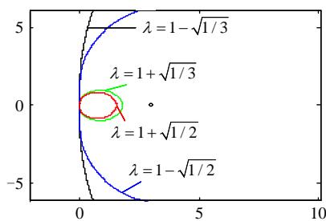  
图1 不同取值下的稳定域  
Fig. 1 Stability domain with different value of 

另一方面， $\lambda { = } 1 { - } \sqrt { 1 / 2 }$ 具有 L 稳定特性，因此，选这 2个值作为算法方案。

# 2 3S-DIRK 算法

# 2.1 电磁暂态程序应用

从上一节中的分析可知，式(17)为推荐算法，根据不同的取值，算法具备不同的特性，并在计算过程中对取值进行切换。同时，为了保证计算过程中的雅克布矩阵不变，将根据的取值，对步长进行变化。

电磁暂态计算是一个复杂的微分代数方程，将其写为公式

$$
\left\{ \begin{array}{l} \frac {\mathrm {d}}{\mathrm {d} t} y = f (t, x, y) \\ 0 = g (t, x, y) \end{array} \right. \tag {24}
$$

式(17)可以写为两步计算，分别如式(25)和(26)所示。

$$
\left\{ \begin{array}{l} y _ {n + 2 \lambda} = y _ {n} + \frac {h _ {\mathrm {T R}}}{2} f _ {n} + \frac {h _ {\mathrm {T R}}}{2} f _ {n + 2 \lambda} \\ 0 = g \left(t _ {n + 2 \lambda}, x _ {n + 2 \lambda}, y _ {n + 2 \lambda}\right) \end{array} \right. \tag {25}
$$

$$
\left\{ \begin{array}{l} y _ {n + 1} = y _ {n} + K _ {1} \frac {h _ {\mathrm {T R}}}{2} f _ {n} + K _ {1} \frac {h _ {\mathrm {T R}}}{2} f _ {n + 2 \lambda} + \frac {h _ {\mathrm {T R}}}{2} f _ {n + 1} \\ 0 = g \left(t _ {n + 1}, x _ {n + 1}, y _ {n + 1}\right) \end{array} \right. \tag {26}
$$

式 中 ： $t _ { n + 2 \lambda } = t _ { n } + 2 \lambda h = t _ { n } + h _ { \mathrm { T R } } \quad ; \quad \ t _ { n + 1 } = t _ { n } \ +$

$$
h = t _ {n} + \frac {h _ {\mathrm {T R}}}{2 \lambda}; K _ {1} = \frac {6 \lambda - 4 \lambda^ {2} - 1}{4 \lambda^ {2}}; K _ {2} = \frac {1 - 2 \lambda}{4 \lambda^ {2}} 。
$$

从式(25)可以分析知道，该算法的第一步计算都是隐式梯形积分法，且两步计算的雅克布矩阵一致。为了能保证在切换过程中的矩阵仍然不发生改变，那么，需要保证不同算法下第一步隐式梯形积分法的积分步长为恒定值，假设为 $h _ { \mathrm { T R } }$ 。

在正常计算时使用算法 A，检测到故障发生时使用算法D 进行被动的插值，然后使用算法 B计算几步消除数值振荡后，利用算法 C进行同步，将计算值同步到原步长的整数倍。算法D 是在积分值的基础上使用二阶拉格朗日插值实现，其他算法中的取值和实际步长分别如式(27)(28)所示。

$$
\left\{ \begin{array}{l l} \lambda_ {\mathrm {A}} = (1 - \sqrt {1 / 3}) / 2 & \text {算 法 A} \\ \lambda_ {\mathrm {B}} = 1 - \sqrt {1 / 2} & \text {算 法 B} \\ \lambda_ {\mathrm {C}} = (1 - \sqrt {1 / 3}) / k & \text {算 法 C} \end{array} \right. \tag {27}
$$

$$
\left\{ \begin{array}{l l} h _ {\mathrm {A}} = \frac {h _ {\mathrm {T R}}}{2 \lambda_ {\mathrm {A}}} & \text {算 法 A} \\ h _ {\mathrm {B}} = \frac {h _ {\mathrm {T R}}}{2 \lambda_ {\mathrm {B}}} = 1. 4 4 3 0 h _ {\mathrm {A}} & \text {算 法 B} \\ h _ {\mathrm {C}} = \frac {h _ {\mathrm {T R}}}{2 \lambda_ {\mathrm {C}}} = k h _ {\mathrm {A}} & \text {算 法 C} \end{array} \right. \tag {28}
$$

本文所提方法与 CDA 算法相比如表 1 所示，可以看出，本文所提方法是一种变阶变步长算法，且保证了整个计算过程中计算精度不低于 2 阶。

表 1 CDA 算法和 3S-DIRK 算法比较  
Tab. 1 Comparation between CDA and 3S-DIRK   

<table><tr><td>算法</td><td>正常计算</td><td>开关插值</td><td>数值振荡消除</td><td>同步插值</td></tr><tr><td>CDA</td><td>2阶精度(隐式梯形法)</td><td>1阶精度(一阶线性插值)</td><td>1阶精度L稳定(后退欧拉法)</td><td>1阶精度(一阶线性插值)</td></tr><tr><td>3S-DIRK</td><td>3阶精度(算法A)</td><td>2阶精度(算法D二阶拉格朗日插值)</td><td>2阶精度L稳定(算法B)</td><td>2阶精度(算法C)</td></tr></table>

# 2.2 线性元件建模

为了说明本文所提算法的建模思路，使用电感元件和电容元件进行说明。电磁暂态程序中一般都将元件处理为等值导纳 $G _ { \mathrm { e q u } }$ 和注入电流 $I _ { \mathrm { h i s t } }$ 并联的方式，如图 2 所示，元件转化为了 $i = G _ { \mathrm { e q u } } u + I _ { \mathrm { h i s t } }$ 的形式，这样式(25)和(26)的求解就可以分为历史电流源 $I _ { \mathrm { h i s t } }$ 的计算和线性方程的求解两步。

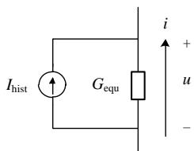  
图2 元件等值电路  
Fig. 2 Equivalent circuit of component

电感元件的动态方程为 $L { \frac { \mathrm { d } } { \mathrm { d } t } } i = u$ 。在电磁暂态程序中，使用隐式梯形法和后退欧拉法两种算法下电感元件的等值导纳都相等，不需要修改阻抗矩阵。在 3S-DIRK 算法下，电感元件的计算公式为

$$
\left\{ \begin{array}{l} i _ {n + 2 \lambda} = i _ {n} + G _ {\mathrm {e q u}} u _ {n} + G _ {\mathrm {e q u}} u _ {n + 2 \lambda} \\ i _ {n + 1} = i _ {n} + K _ {1} G _ {\mathrm {e q u}} u _ {n} + K _ {2} G _ {\mathrm {e q u}} u _ {n + 2 \lambda} + G _ {\mathrm {e q u}} u _ {n + 1} \end{array} \right. \tag {29}
$$

式中 equG $G _ { \mathrm { e q u } } = \frac { h _ { \mathrm { T R } } } { 2 L }$ TRh 可以看出，3S-DIRK 算法下电感元件的等值导纳恒定。

同理，可以推导电容元件的公式如(30)所示，同样，也可以看出在所提算法下电容元件的等值导纳恒定。

$$
\left\{ \begin{array}{l} G _ {\text {e q u}} u _ {n + 2 \lambda} = G _ {\text {e q u}} u _ {n} + i _ {n} + i _ {n + 2 \lambda} \\ G _ {\text {e q u}} u _ {n + 1} = G _ {\text {e q u}} u _ {n} + K _ {1} i _ {n} + K _ {2} i _ {n + 2 \lambda} + i _ {n + 1} \end{array} \right. \tag {30}
$$

式中 $G _ { \mathrm { e q u } } = { \frac { 2 C } { h _ { \mathrm { T R } } } }$ TRh 。

# 2.3 计算流程

本文所提 3S-DIRK 算法分为 A、B、C和D 种子算法。在正常计算时采用算法 A(步骤 0)，当检测到开关动作需要插值时，进入步骤1 二阶拉格朗日插值，并将算法切换到算法 B(步骤2)，等到数值振荡消除后采用算法 C(步骤 3)同步后切换到算法A(步骤 0)，如图 3(a)所示。若在步骤 2 阶段发生插值时，则进入步骤 1插值，如图 3(b)所示。

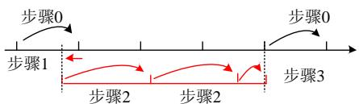  
正常计算流程图

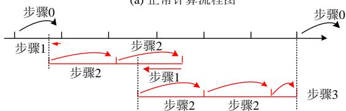  
(b) 步骤2中发生插值的计算流程图  
图3 3S-DIRK算法的计算流程示意图  
Fig. 3 Calculate illustration of 3S-DIRK

3S-DIRK算法的计算步骤可以归纳为以下4步，正常计算下都采用步骤 0 进行仿真，发生故障后采用步骤 1—3 插值和消除数值振荡，然后返回到步骤 0 继续进行计算直到仿真结束。

步骤 0：采用算法 A，进行正常计算，每步计算结束后检测是否需要插值，若需要则进入步骤 1，否则重复步骤 0 继续下一步计算，直至仿真结束。

步骤 1：采用式(21)进行二阶线性插值。

步骤 2：采用算法 B 进行计算 2—3 步消除数值振荡，并在计算过程中检测是否需要插值，若需要插值则进入步骤 1，否则进入步骤 3。

步骤 3：根据当前计算点与初始步长整数倍进行对比确定插值系数，采用算法 C进行同步插值，计算结束后检测是否需要插值，若需要插值则进入步骤1，否则退出特殊计算，返回步骤 0。

以上每一步计算在应用 3S-DIRK 计算时都需要利用式(25)和(26)进行两次计算，其详细的计算流程如图 4所示。

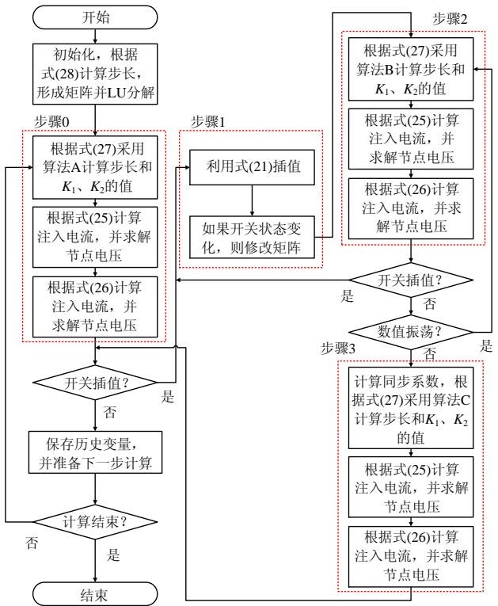  
图 4 3S-DIRK 算法计算流程  
Fig. 4 Simulation flow chart of 3S-DIRK

# 3 仿真算例验证

3S-DIRK 算法具备变阶变步长的优点，可以在开关动作时消除数值振荡，同时保证计算精度不低于2阶。同时，EMT类程序是目前国际上流行的电磁暂态软件，在电力系统电磁暂态仿真得到广泛应用，该软件主要采用 CDA 算法进行开关处理。因此，构造两个算例说明本文所提方法相比于 CDA算法的优点。

# 3.1 算例 1(电感开关电路数值振荡)

开断电感电路会造成数值振荡，PSCAD 软件就提供了一个这样的例子，如图 5所示。其中，电

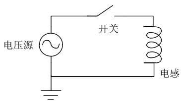  
图5 电感开关电路图  
Fig. 5 Circuit diagram of inductance and breaker

压源采用无内阻的理想电压源，幅值为132.79kV，频率为 60Hz，初始角度为 0°，启动时间为 0.05s；开关的断开电阻为 $1 \times 1 0 ^ { 1 2 } \Omega$ ，断开电阻为 0.0005；电感值为 0.1H。

开关不能强制断开，当 0.1s断开信号到达时，开关电流不为零，必须等到 0.104 167s 电流降为 0才能断开；而 0.14s 投入信号到达时，开关瞬间投入。针对 CDA、3S-DIRK、隐式梯形法以及 3S-DIRK中的 A算法进行测试，后2 个算法为取消切换算法的特例，仿真曲线如图 6(a)所示，在正常计算期间这四种算法计算结果一致。从图 6(b)看出故障之后发生了数值振荡，但是隐式梯形法是对称 A稳定算法，数值振荡不衰减；而式(18)的 A 算法稳定域比隐式梯形法大，也会产生数值振荡，但是数值振荡将逐步衰减，如图 6(c)所示。

CDA 算法和本文所提的 3S-DIRK 算法在故障发生后都切换到 L稳定算法，无数值振荡现象。从图 6(d)中可以看出，开关动作后经过一次步骤 1，两次步骤 2，一次步骤 3 的计算之后，消除了数值振荡，同时将计算点同步到原步长整数倍。

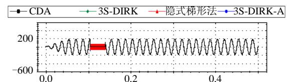

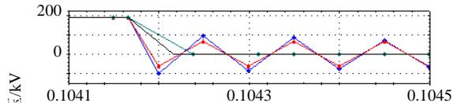  
(a) 电感电压仿真曲线对比  
(b) 开关动作时刻曲线放大

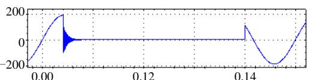  
(c) 3S-DIRK-A算法仿真结果放大

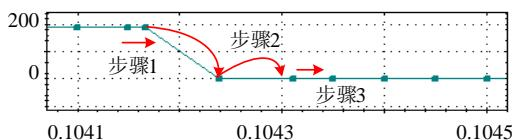  
(d) 3S-DIRK算法仿真结果放大 t/s   
图6 电感电压仿真曲线  
Fig. 6 Simulated curve of inductance voltage

从图 6中可以看出，本文所提的 3S-DIRK 算法具备电磁暂态中开关的基本处理，具备变步长和抑制数值振荡的功能。

# 3.2 算例 2(算法切换下的计算精度)

针对开关过程中的数值振荡问题，本文所提算法和 CDA 算法都必须进行算法切换才能实现。但是，在算法切换过程中，可能导致数值误差。

为研究算法切换中的数值误差，使用平稳后的交流 IEEE9 电路和不断切换算法的电流源型高压直流输电系统(LCC-HVDC)电路同时求解，且两电路之间无电气联系。

LCC-HVDC 系统 2s 启动，3.3s 逆变侧发生三相短路故障，故障持续 0.05s，4s 直流系统退出运行，两种算法仿真曲线如图 7所示。可以看出，两种算法仿真结果一致。

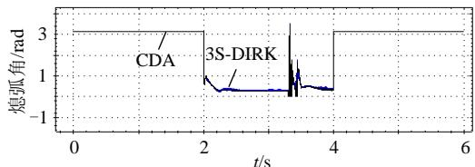  
图7 直流熄弧角(rad)仿真曲线  
Fig. 7 Simulated extinction angle curve of HVDC

IEEE9 系统电路内部没有故障，但是由于算法切换过程中导致计算精度变化，可能产生波动，如图 8 所示，线路上的有功功率产生约 1%的波动。在 CDA 算法中，算法将切换到 1 阶算法，相当于电容电感元件旁路一个电阻，算法切换过程中电阻元件在反复投切，导致产生了误差；而 3S-DIRK 算法在整个仿真过程中，算法精度都不低于 2 阶，计算误差很小。

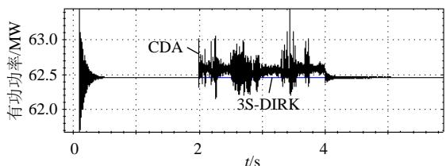  
图8 线路(母线1~母线A)的有功功率(MW)仿真曲线  
Fig. 8 Simulated active power curve of transmission line between bus 1 and bus A

从图 8中可以分析得出结论，CDA算法中的切换策略可以消除数值误差，但是与此同时也引入了1 阶误差，将会使故障传导到整个网络，不适合大电网计算。相比之下，本文提出的 3S-DIRK 算法在精度和变步长方面具有优势。

# 4 结论

本文基于龙格库塔算法理论分析了现有 CDA

算法中的计算误差，在对角隐式龙格库塔法框架下对比了 2S-DIRK 方法和 3S-DIRK 方法的区别，两者都具备 2阶计算精度和 L稳定性，前者是固定步长算法而后者是可以变步长。本文提出 3S-DIRK 变阶变步长仿真策略，该策略下针对不同仿真情景使用不同仿真算法和步长，并使用线性元件对该算法的实现进行了说明，该算法具备以下 5个优点：

1）线性元件都可以表示成注入电流源和等值导纳并联的形式，在整个计算过程中，等值导纳恒定，电路的阻抗矩阵不需要改变。  
2）计算精度高。在正常计算时具备 3 阶计算精度，整个仿真过程中具备不低于2阶的计算精度，可以保证电力系统仿真的计算精度。  
3）采用具备 L 稳定性的算法进行故障计算，可以抑制数值振荡。  
4）每步计算有 1 个中间计算结果，利用二阶拉格朗日插值法得到的插值具有 2 阶计算精度，可以用于开关动作的精确仿真。  
5）算法本身可以在保证 2 阶准确度的情况下实现变步长计算，可以用来进行插值计算和仿真再同步。

最后，本文给出了两个算例验证了 3S-DIRK 算法的以上优点，该算法可以消除电感元件突然开路造成的数值振荡以及保证无故障元件的计算精度，这些优点使得所提算法可以应用于大规模电网的电磁暂态仿真计算。

此外，本文还给出了利用龙格库塔理论构造算法的思路，可以根据该思路进行现有算法准确度的分析以及更高阶更优秀算法的构造。但电磁暂态仿真中将遇到更多的问题，需要在算法方面针对非线性元件处理以及计算速度和效率方面进行进一步的研究和提升。

# 参考文献

[1] 何金良．时频电磁暂态分析理论与方法[M]．清华大学出版社，2015．  
[2] 李明节．大规模特高压交直流混联电网特性分析与运行控制[J]电网技术，2016，40(4)：985-991Li Mingjie ． Characteristic analysis and operational control oflarge-scale hybrid UHV AC/DC power grids[J] ． Power SystemTechnology，2016，40(4)：985-991(in Chinese)  
[3] 徐政，蔡晔，刘国平．大规模交直流电力系统仿真计算的相关问题[J]．电力系统自动化，2002，26(15)：4-8Xu Zheng，Cai Ye，Liu Guoping．Relevant issues in simulation oflarge-scale AC-DC power systems[J]．Automation of Electric PowerSystems，2002，26(15)：4-8(in Chinese)  
[4] Kristmundsson G M，Carroll D P．The effect of AC system frequency spectrum on commutation failure in HVDC inverters[J] ． IEEE Transactions on Power Delivery，1990，5(2)：1121-1128   
[5] 汤涌．电力系统数字仿真技术的现状与发展[J]．电力系统自动化，

2002，26(17)：66-70  
Tang Yong．Present situation and development of power system simulation technologies[J]．Automation of Electric Power Systems， 2002，26(17)：66-70 (in Chinese)   
[6] 万磊，汤涌，吴文传，等．特高压直流控制系统机电暂态等效建模与参数实测方法[J]．电网技术，2017，41(3)：708-714  
Wan Lei，Tang Yong，Wu Wenchuan，et al．Equivalent modeling andreal parameter measurement methods of control systems of UHVDCtransmission systems[J]．Power System Technology，2017，41(3)：708-714(in Chinese)  
[7] Tang Yong，Wan Lei，Hou Junxian．Full electromagnetic transient simulation for large power systems[J] ． Global Energy Interconnection，2019，2(1)：29-36．   
[8] 王薇薇，朱艺颖，刘翀，等．基于 HYPERSIM 的大规模电网电磁暂态实时仿真实现技术[J]．电网技术，2019，43(4)：1138-1143  
Wang Weiwei，Zhu Yiying， Liu Chong，et al．Realization ofElectromagnetic Real-time Simulation of Large-scale Grid Based onHYPERSIM[J] ． Power System Technology ， 2019 ， 43(4) ：1138-1143(in Chinese)  
[9] 叶小晖，汤涌，刘文焯，等．MMC–UPFC 电磁–机电混合仿真技术研究[J]．电网技术，2019，43(4)：1122-1129  
Ye Xiaohui ， Tang Yong ， Liu Wenzhuo ， et al ． Research onMMC-UPFC electromagnetic-electromechanical hybrid simulationtechnology[J]．Power System Technology，2019，43(4)：1122-1129(inChinese)．  
[10] Gear C．Simultaneous numerical solution of differential-algebraic equations[J]．IEEE Transactions on Circuit Theory，1971，18(1)： 89-95．   
[11] 于浩，李鹏，王成山，等．基于状态变量分析的有源配电网电磁暂态仿真自动建模方法[J]．电网技术，2015，39(6)：1518-1524  
Yu Hao，Li Peng，Wang Chengshan，et al．Automated model ogeneration of active distribution networks based on state-spce analysis for electromagnetic transient simulations[J]．Power System Technology，2015，39(6)：1518-1524(in Chinese)   
[12] 王成山，李鹏，王立伟．电力系统电磁暂态仿真算法研究进展[J]电力系统自动化，2009，33(7)：97-103  
Wang Chengshan，Li Peng，Wang Liwei．Progresses on algorithm of electromagnetic transient simulation for electric power system[J] Automation of Electric Power Systems，2009，33(7)：97-103(in Chinese)．   
[13] 戴汉扬，汤涌，宋新立，等．电力系统动态仿真数值积分算法研究综述[J]．电网技术，2018，42(12)：3977-3984  
Dai Hanyang，Tang Yong，Song Xinli，et al．Review on Numerical Integration Algorithms for Dynamic Simulation of Power System[J] Power System Technology，2018，42(12)：3977-3984(in Chinese)   
[14] Alvarado F L，Lasseter R H，Sanchez J J．Testing of trapezoidal integration with damping for the solution of power transient problems[J]．IEEE Transactions on Power Apparatus & Systems， 1983，102(12)：3783-3790(in Chinese)   
[15] 刘益青，陈超英．用以消除数值振荡的阻尼梯形法误差分析与修正[J]．中国电机工程学报，2003，23(7)：57-61．  
Liu Yiqing ，Chen Chaoying． Errors analysis and correction of damping trapezoidal intergration for eliminating numerical oscillations[J]．Proceedings of the CSEE，2003，23(7)：57-61(in Chinese)．   
[16] Marti J R，Lin J．Suppression of numerical oscillations in the EMTP power systems[J]．IEEE Transactions on Power Systems，1989，4(2)： 739-747．   
[17] Noda T，Kikuma T，Yonezawa R．Supplementary techniques for 2S-DIRK-based EMT simulations[J] ． Electric Power Systems Research，2014(115)：87-93   
[18] 杨萌，汪芳宗．基于 2 级 3 阶单对角隐式 Runge-Kutta 法的电磁暂

态计算方法 [J]．电力系统保护与控制，2017，45(6)：68-73  
Yang Ying，Wang Fangzong．2-stage 3-order diagonally implicitRunge-Kutta method for electromagnetic transient calculation[J]Power System Protection and Control ， 2017 ， 45(6) ： 68-73(inChinese)．  
[19] Watson N R，Irwin G D．Comparison of root-matching techniques for electromagnetic transient simulation[J]．IEEE Transactions on Power Delivery，2000，15(2)：629-634   
[20] Lin J，Marti J R．Implementation of the CDA procedure in the EMTP[J]．IEEE Transactions on Power Systems，1990，5(2)： 394-402．   
[21] Tant J，Driesen J．On the numerical accuracy of electromagnetic transient simulation with power electronics[J]．IEEE Transactions on Power Delivery，2018，33(5)：2492-2501．   
[22] Kuffel P，Kent K，Irwin G．The implementation and effectiveness of linear interpolation within digital simulation[J]．International Journal of Electrical Power & Energy Systems，1997，19(4)：221-227   
[23] Kristmundsson G M，Carroll D P．The effect of AC system frequency spectrum on commutation failure in HVDC inverters[J] ． IEEE Transactions on Power Delivery，1990，5(2)：1121-1128   
[24] Strunz K，Linares L，Marti J R，et al．Efficient and accurate representation of asynchronous network structure changing phenomena in digital real time simulators[J]．2000，15(2)：586-592．   
[25] Zou M，Mahseredjian J，Delourme B，et al．On interpolation and reinitialization in the simulation of transients in power electronic systems[C]//14th Power System Computation Conference．Sevilla， Spain：Swiss Federal Institute of Technology of Lausanne．2002：1-7   
[26] Strunz K．Flexible numerical integration for efficient representation of switching in real time electromagnetic transients simulation[J]．IEEE Transactions on Power Delivery，2004，19(3)：1276-1283   
[27] 刘文焯，汤涌，侯俊贤，等．考虑任意重事件发生的多步变步长电磁暂态仿真算法[J]．中国电机工程学报，2009，29(34)：9-15Liu Wenzhuo，Tang Yong，Hou Junxian，et al．Simulation algorithmfor multi variable-step electromagnetic transient considering multipleevents[J]．Proceedings of the CSEE，2009，29(34)：9-15(in Chinese)  
[28] Kennedy C，Carpenter M．Diagonally Implicit Runge-Kutta Methods for Ordinary Differential Equations．A Review[R]．NASA．2016   
[29] Butcher J C．Coefficients for the study of Runge-Kutta integration processes[J]．Journal of the Australian Mathematical Society，1963， 3(2)：185-201．   
[30] Prothero A，Robinson A．Stability and accuracy of one-step methods for solving stiff systems of ordinary differential equations[J] Mathematics of Computation．1974，28(125)：145-162

  
叶小晖

在线出版日期：2020-10-19。

收稿日期：2020-06-23。

作者简介：

叶小晖(1985)，男，硕士，通信作者，高级工程师，主要研究方向为电力系统建模与仿真分析，E-mail：yexiaohui@epri.sgcc.com.cn；

汤涌(1959)，男，教授级高级工程师，主要研究方向为电力系统仿真与分析；

宋强(1975)，男，博士，副教授，研究方向为柔性输配电技术和大功率电力电子技术；

刘文焯(1972)，男，硕士，高级工程师，主要研究方向为电力系统建模；

吕广宪(1975)，男，博士，高级工程师，主要研究方向为配电网信息互操作与态势感知；

陆一鸣(1981)，男，博士，高级工程师，主要研究方向为配电网数据建模与分析。

（实习编辑 李健一）