# New Compact White-Box Transformer Model for the Calculation of Electromagnetic Transients

Enrique E. Mombello , Senior Member, IEEE

Abstract—In a recent work, a successful power transformer white-box model for the calculation of electromagnetic transients has been presented. Although this model gives very satisfactory results, when applied to large transformers it requires a large number of auxiliary loops to model the damping. This can be problematic as it not only requires more computational effort, but the size of the input data may even preclude its use with ATP-EMTP and perhaps with other EMTP-based software that have limitations in this regard. In this work a new reduced model which enables its use with ATP-EMTP is presented. This model requires a much smaller number of circuit components than the original model, which allows the data size and simulation time to be substantially reduced without practically affecting the calculation results. This has been achieved through the reduction of the rank of the submatrices that characterize the inductive coupling between the main winding sections and the auxiliary loops used to model the damping. The new model has been validated by making comparisons of the frequency responses calculated using the new compact model with the ones calculated with the original model developed for the case study used by the CIGRE JWG A2/C4.52 to test the accuracy of various types of transformer models.

Index Terms—Transformers, white-box models, model reduction, power system transients, damping modeling.

# I. INTRODUCTION

P OWER transformers must be designed to withstand surgescoming from the power system. As detailed in [1], the main coming from the power system.As detailed in [1], the main cause of transformer failures reported in the last two decades are the so-called electrical disturbances. Faults that have no clear explanation have often been observed. One possible explanation for these failures is that they are due to resonant phenomena. The analysis of this type of phenomena, for which the damping of the model is of crucial importance [2], [3], requires the use of detailed high frequency transformer models to evaluate the dielectric stresses in different possible scenarios. In recent years, there has been an increasing amount of literature on resonance behavior of power transformers and strategies to develop suitable high frequency transformer models [4]–[14], including book chapters that give a comprehensive treatment of the state of the art [15]–[17]. The most suitable model for this type of analysis is the white-box model, as it is the most complete and detailed. A

Manuscript received June 11, 2021; revised August 18, 2021 and September 27, 2021; accepted October 5, 2021. Date of publication October 11, 2021; date of current version July 25, 2022. Paper no. TPWRD-00859-2021.

The author is with CONICET, Universidad Nacional de San Juan, San Juan J5400ARL, Argentina (e-mail: eemombello@unsj.edu.ar).

Color versions of one or more figures in this article are available at https://doi.org/10.1109/TPWRD.2021.3119272.

Digital Object Identifier 10.1109/TPWRD.2021.3119272

linear lumped-element model of this type was presented in [1]. The transformer windings are subdivided into a certain number of sections that are represented by circuit elements such as their self- and mutual inductances, resistances and capacitances. These parameters are determined from the geometry of the windings and core and the material properties.

The model presented in [1], which is the state-space version of the circuit model presented in [4], allows the damping characteristics of the transformer windings to be fully represented by using auxiliary loops magnetically coupled with the winding sections and whose purpose is to represent eddy currents in the metallic parts of the active part of the transformer. This strategy is very effective since it simulates the physical phenomena that take place in the structure of the transformer and the results have been very satisfactory. However, the mathematical model as it has been formulated up to now requires the use of a large number of auxiliary loops that increase its size considerably in the case of modelling large transformers. If the number of transformer sections to be modeled is large, a large number of auxiliary loops will be required, which represents a drawback since, on the one hand, it requires a greater calculation effort and, on the other hand, it may even prevent its use with certain programs that have limitations in the number of circuit elements that can be processed.

To give an idea of the dimension of this problem, the case study to be analyzed in this work can be taken as an example. The transformer has been discretized in this case using n =213 sections, which does not seem to be a large number. This would be the dimension of the inductance matrix for a constant inductance model. If on the other hand one wants to model the frequency behavior of each inductance by the model presented in [4] using a partial fraction expansion with N  5 poles for =each inductance using auxiliary inductive loops in the equivalent circuit, the expanded inductance matrix dimension becomes n(N 1)  1278. Entering such a matrix as input data in any + =EMTP-based program is at least highly inconvenient if not infeasible for commercially available software versions. The Alternative Transient Program (ATP), for example, does not allow entering an inductance matrix of order greater than 40. This could be solved by using a decoupled model of the winding section system, represented only by RLC-type branches (L in this case). The drawback would be the large number of inductive branches generated, which for the mentioned case study would be 817281. This number of branches is huge and cannot be entered as input data in ATP since the maximum number of circuit components is limited. Consequently, it is necessary to have a reduced size white-box model suitable for use with ATP,

such as the one presented in this work. This reduced model will also facilitate its application with other EMTP-based software.

The mathematical formulation of the inductive part of the state-space model presented in [1] as well as the one used for the circuit model [4] is based on the representation of the frequency behavior of the impedance matrix of the transformer through a partial fraction expansion. The basic impedance data to obtain the frequency behavior of the windings is obtained from quasi-stationary field calculations of the active part of the transformer using the Finite Element Method (FEM). The mathematical expression of the expansion is then obtained by applying Vector Fitting (VF) to these impedance values. The first part of the expansion contains a matrix representing the direct current behavior of the inductive impedances followed by a sum of N terms containing residue matrices $\pmb { K } _ { k } \left( k = I , . . . , N \right)$ where N =is the number of poles of the partial fraction expansion (see (6)). Each of these $\pmb { K } _ { k }$ matrices has a fixed dimension $n \times n ,$ , where n is the number of winding sections that have been used to discretize the transformer windings to be modeled. These matrices contain valuable information on the frequency behavior of the self- and mutual inductances and the damping of the transformer sections. This expansion is compatible with the equivalent inductiveresistive circuit proposed in [4] to model the damping of the winding of n inductive sections using auxiliary loops that are magnetically coupled with the winding sections. These auxiliary loops are organized in N groups of n coils each. While the number of auxiliary loop groups must be equal to the number of poles, the number of loops in each group is not fixed. In the original version of the model, its robustness was mainly sought and it was not evident at first glance that the number of n auxiliary coils per group could be excessive in the case of large transformers. This number of loops per group arises naturally from the fact that each of the n winding sections is going to be represented with N poles, which leads us to think that N auxiliary loops are needed to represent each winding section. If N auxiliary loops are required for each winding section, the necessary number of auxiliary loops will be $n \times N .$ .

The matrices $\pmb { K } _ { k }$ do not appear in the model explicitly, but rather it uses matrices $M _ { k }$ that are the result of their factorization. The procedure to calculate a full-rank factorization in an adequate way was one of the new results presented in [1] and [4]. Since the auxiliary loops are organized in N groups of n coils each, the factorization was formulated so that the resulting $M _ { k }$ matrices have the same dimension as the original inductance matrix (see (15)), $\operatorname { i . e . , } n \times n .$ , which also indicates that these matrices have rank n. It has been noted later that this can lead to an excessive size of the model in certain cases. Fortunately, there is the possibility of applying a factorization to the matrices $\pmb { K } _ { k }$ making use of low-rank matrices by means of the Singular Value Decomposition (SVD) [18], [19], [20], so that the important information is preserved and redundant or irrelevant information is eliminated. This optimized factorization leads to a significant reduction in the number of auxiliary loops used which entails also a significant reduction in the size of the inductance matrix of the system. The matrices of the state-space model are also significantly reduced. The model presented in this work guarantees that the number of auxiliary loops to be used is sufficient to preserve the relevant information, achieving

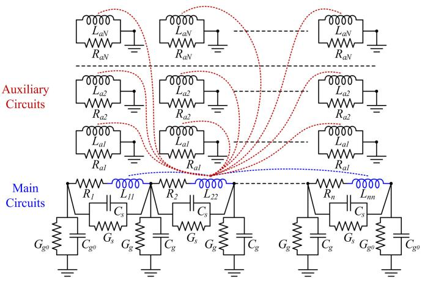  
Fig. 1. Equivalent circuit for representing frequency-dependent inductances and eddy current losses.

a significant reduction in the size of the original model without practically affecting the calculation results.

# II. THE TRANSFORMER WHITE-BOX MODEL

The model presented in this work is an optimization of the models presented in [1] and [4]. Fig. 1 shows a simplified circuit representation of the model. This equivalent circuit contains auxiliary inductances representing the frequency-dependent behavior of the windings and uses only constant RLMCG elements. The equations of the magnetic part of the model are given below [1]

$$
\left[ \begin{array}{l} \boldsymbol {u} _ {m} \\ \boldsymbol {u} _ {a} \end{array} \right] = \left[ \begin{array}{c c} \boldsymbol {Z} _ {m} & s \mathbf {M} \\ s \mathbf {M} ^ {T} & \boldsymbol {Z} _ {a} \end{array} \right] \left[ \begin{array}{l} \boldsymbol {i} _ {m} \\ \boldsymbol {i} _ {a} \end{array} \right] \tag {1}
$$

$$
\boldsymbol {Z} _ {m} = \boldsymbol {R} _ {m} + s \boldsymbol {L} _ {m} \tag {2}
$$

$$
\boldsymbol {Z} _ {a} = \boldsymbol {R} _ {a} + s \boldsymbol {L} _ {a} \tag {3}
$$

${ \cal Z } _ { m } , { \cal R } _ { m }$ and $\pmb { L } _ { m }$ are the impedance, resistance and inductance matrices of the branches representing the different winding sections, or main branches; $\mathbf { \delta Z } _ { a } , \mathbf { \delta R } _ { a }$ and $L _ { a }$ are the impedance, resistance and inductance matrices of the auxiliary branches for modeling the frequency dependence of the main branches; $i _ { m } .$ $i _ { a }$ are the current vectors of the main and auxiliary branches respectively and $\mathbf { } u _ { m } , \mathbf { } u _ { a }$ are the voltage vectors of the main and auxiliary branches respectively.

As it can be seen in Fig. 1, the auxiliary loops are shortcircuited so that the voltages of the auxiliary branches are zero $( { \pmb u } _ { a } = 0 )$ . Substituting this condition in (1) yields:

$$
\boldsymbol {u} _ {m} = \boldsymbol {Z} _ {g} \boldsymbol {i} _ {m} \tag {4}
$$

where

$$
\mathbf {Z} _ {g} = \mathbf {Z} _ {m} - s ^ {2} \mathbf {M} \mathbf {Z} _ {a} ^ {- 1} \mathbf {M} ^ {T} \tag {5}
$$

$\scriptstyle { \mathbf { Z } } _ { g }$ is the branch impedance matrix seen from the terminals of the main winding sections. The subscript g applies to magnitudes of the magnetic model.

The matrix $\scriptstyle { Z _ { g } }$ is calculated in practice for a set of frequencies by means of quasi-stationary magnetic field calculations using FEM. Then the VF algorithm is used to fit these frequency

responses using rational approximation functions. Thus, an expansion of $\mathbf { Z } _ { g }$ is obtained, which can be expressed in the form [4]

$$
\mathbf {Z} _ {g} = \mathbf {Z} _ {m} - s ^ {2} \sum_ {k = 1} ^ {N} \frac {\mathbf {K} _ {k}}{s + \lambda_ {k}} \tag {6}
$$

Comparison between (5) and (6) gives

$$
\mathbf {M} \mathbf {Z} _ {a} ^ {- 1} \mathbf {M} ^ {T} := \sum_ {k = 1} ^ {N} \frac {\mathbf {K} _ {k}}{s + \lambda_ {k}} \tag {7}
$$

where :  means “equal by definition”.

=The organization of the auxiliary circuits by defining a group of auxiliary loops for each pole yields

$$
\mathbf {Z} _ {g} = \mathbf {Z} _ {m} - s ^ {2} \sum_ {k = 1} ^ {N} \mathbf {M} _ {k} \mathbf {Z} _ {a k} ^ {- 1} \mathbf {M} _ {k} ^ {T} \tag {8}
$$

where

$$
\mathbf {M} = \left[ \begin{array}{l l l l} \mathbf {M} _ {1} & \dots & \mathbf {M} _ {k} & \dots & \mathbf {M} _ {N} \end{array} \right] \tag {8a}
$$

It is assumed here that the auxiliary circuits only have magnetic couplings with the main winding sections, but do not have couplings between each other, therefore both $\scriptstyle { Z _ { a } }$ and its sub-matrices ${ \pmb Z } _ { a k }$ are diagonal matrices, hence

$$
\begin{array}{l} \mathbf {Z} _ {a k} ^ {- 1} = \operatorname {d i a g} \left(\frac {1}{R _ {a k} + s L _ {a k}}\right) \\ = \frac {1}{s + \lambda_ {k}} \operatorname {d i a g} \left(\frac {1}{L _ {a k}}\right) = \frac {1}{s + \lambda_ {k}} \mathbf {L} _ {a k} ^ {- 1} \tag {9} \\ \end{array}
$$

where

$$
\lambda_ {k} = \frac {R _ {a k}}{L _ {a k}} \quad k = 1, \dots , N \tag {10}
$$

akfor all elements of the auxiliary circuit group k. Therefore, the impedance matrix is

$$
\mathbf {Z} _ {g} = \mathbf {Z} _ {m} (s) - s ^ {2} \sum_ {k = 1} ^ {N} \frac {\mathbf {M} _ {k} \mathbf {L} _ {a k} ^ {- 1} \mathbf {M} _ {k} ^ {T}}{s + \lambda_ {k}} \tag {11}
$$

The impedance transfer function given in (6) should now be compared with the mathematical expression derived from the proposed equivalent circuit to represent this function, which is given by (11). By doing this, it follows that

$$
\mathbf {K} _ {k} := \mathbf {M} _ {k} \mathbf {L} _ {a k} ^ {- 1} \mathbf {M} _ {k} ^ {T} \quad k = 1, \dots , N \tag {12}
$$

It should be noted that matrices $\pmb { K } _ { k }$ are obtained in numerical form after the fitting process, while the right member of (12) represents a family of possible equivalent circuit matrices that match this equation. It is clear that there exist many possible solutions for the matrices $M _ { k }$ and $\scriptstyle L _ { a k } ,$ , so as to fulfill (12). An important simplification in this regard is to define that

$$
\mathbf {L} _ {a k} ^ {- 1} = \mathbb {I} \quad k = 1, \dots , N \tag {13}
$$

so that (10) and (12) become

$$
R _ {a k} = \lambda_ {k} \quad k = 1, \dots , N \tag {14}
$$

$$
\mathbf {K} _ {k} = \mathbf {M} _ {k} \mathbf {M} _ {k} ^ {T} \quad k = 1, \dots , N \tag {15}
$$

Obtaining the matrices in the right member of (12) is not straightforward since the matrices $\pmb { K } _ { k }$ must be positive definite or positive semi-definite for the model to be stable. Furthermore, as shown in [4], the very structure of the triple product of the right side of (12) implies that $\pmb { K } _ { k }$ must be semi-positive definite. This condition is enforced by means of the VF-PSO optimization

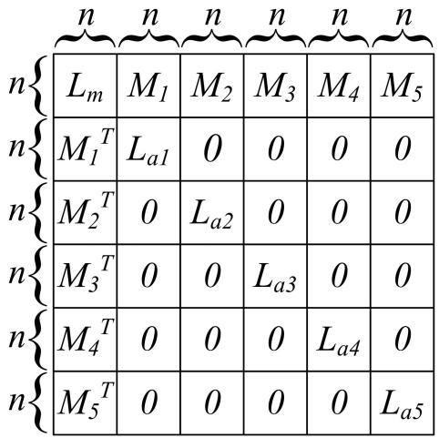  
Fig. 2. Structure of the inductance matrix of the complete inductive model.

algorithm as proposed in [1] and [4]. Once the $M _ { k }$ matrices are determined, they become part of the model together with the rest of the matrices [1]. The detailed representation of the magnetic model matrices in (1) is given below

$$
\mathbf {L} = \left[ \begin{array}{c c c c} \mathbf {L} _ {m} & \mathbf {M} _ {1} & \mathbf {M} _ {2} & \dots \mathbf {M} _ {N} \\ \hline \mathbf {M} _ {1} ^ {T} & \mathbf {L} _ {a 1} & 0 & \dots 0 \\ \mathbf {M} _ {2} ^ {T} & 0 & \mathbf {L} _ {a 2} & \dots 0 \\ \dots & \dots & \dots & \dots \\ \mathbf {M} _ {N} ^ {T} & 0 & 0 & \dots \mathbf {L} _ {a N} \end{array} \right] \tag {16}
$$

$$
\mathbf {R} = \left[ \begin{array}{c c c c c} \mathbf {R} _ {m} & 0 & 0 & \dots & 0 \\ \hline 0 & \mathbf {R} _ {a 1} & 0 & \dots & 0 \\ 0 & 0 & \mathbf {R} _ {a 2} & \dots & 0 \\ \dots & \dots & \dots & \dots & \dots \\ 0 & 0 & 0 & \dots & \mathbf {R} _ {a N} \end{array} \right] \tag {17}
$$

Note that the $\pmb { L } _ { a k }$ matrices in (16) are identity matrices due to the assumption stated in (13).

# III. NEW COMPACT MODEL

Equation (15) does not contain any restriction on the number of circuits m to be used in each group of auxiliary loops assigned to each pole. The matrix of mutual inductances between the auxiliary circuits assigned to pole k and the main sections of the winding is the matrix $M _ { k }$ . The row dimension of the matrix $M _ { k }$ must be n, but the column dimension m is generally unconstrained. In the past it was considered that a natural choice is that $m = n ,$ , i.e., each group of auxiliary coils has the same =number of circuits as the number n of winding sections. Among other things, this allowed the factorization of the matrices using the matrix square root using Matlab’s sqrtm function. In the original version of the model, the matrices $M _ { k }$ have dimension $n \ \times \ n ,$ that is, they are square matrices, and are part of the inductance matrix of the complete system.

The structure of this inductance matrix is shown in Fig. 2 in which it can be seen that the matrix M has been subdivided in this case into $N { = } 5$ groups as was done in [1] (see (8a)). These groups =correspond to the same number of poles in expression (6), so M has a dimension $n \times n N$ in this case. The inductance matrix to be used if there were no need to represent the frequency-dependent losses would only be $\scriptstyle L _ { m } .$ , whose dimension is $n \times n$ , but if

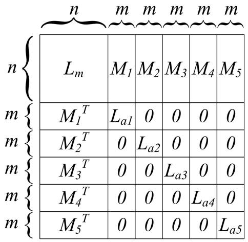  
Fig. 3. Structure of the inductance matrix of the reduced inductive model.

this representation is desired, the inductance matrix becomes L, having a dimension $n ( N { + } I ) \times n ( N { + } I )$ . This is a notable size + +increase, despite the fact that this matrix is not used explicitly, but M. In order to reduce the size of the model, the question that arises is whether the matrices $M _ { k }$ can have a number of columns less than n, so that the matrix M has a smaller column dimension. In case of performing the reduction, the inductance matrix of the complete inductive model would be as shown in Fig. 3.

As it can be seen in Fig. 3 the sub-matrix $\pmb { L } _ { m }$ has the same dimension $n \times n$ as in Fig. 2, and it is the only sub-matrix that retains its dimension, since it represents the winding sections, which are not going to be reduced. Note that Figs. 2 and 3 are not to scale, for better visibility. Also note in Fig. 3 that the matrices $M _ { k }$ have the same column dimension, but this in general does not necessarily have to be the case.

The possibility of making a reduction is found in (12) or (15). The question is whether it is possible to factorize the matrix $\pmb { K } _ { k }$ of rank n such that the resulting matrices $M _ { k }$ have rank $m < n$ and their dimension is then $n \times m$ . The answer is that it is possible to factor the $\pmb { K } _ { k }$ matrix using low-rank matrices [21], thus obtaining an approximation of $\pmb { K } _ { k }$ that hardly differs from the original.

# A. The Singular Value Decomposition and the Low-Rank Approximation

The author decided to perform the necessary low-rank factorizations using the SVD, which is a powerful technique in linear algebra. Perhaps the most important property of the singular value decomposition is its ability to deliver the best low-rank approximations to a matrix. Reference [22] mentions that “the SVD is the crème de la crème of rank-reducing decompositions – the decomposition that all others try to beat”.

The SVD of a matrix A is a factorization $\pmb { A } = \pmb { U } \Sigma \pmb { V } ^ { \mathrm { T } }$ where

= Σ- is a diagonal matrix of singular values sorted in descend-Σing order $\sigma _ { 1 } \geq \sigma _ { 2 } \geq \cdot \cdot \cdot \geq \sigma _ { n } > 0$   
n 0- U has orthonormal columns, the left singular vectors   
- V has orthonormal columns, the right singular vectors

If A is a symmetric matrix the singular values are the absolute values of the eigenvalues of A: $\sigma _ { i } = | \lambda _ { i } | , U = V$ is a unitary

matrix and its columns are the eigenvectors of A. If in addition A is a symmetric positive-definite matrix then U and  are square non-singular matrices [23].

The matrices to be factorized in our case are $K _ { k } \left( k = 1 , . . . , N \right)$ , =which are real symmetric square positive-definite matrices. Hence the following holds

$$
\mathbf {K} _ {n \times n} = \mathbf {U} _ {n \times n} \boldsymbol {\Sigma} _ {n \times n} \mathbf {U} _ {n \times n} ^ {T} \tag {18}
$$

Note that the subscript k in $\pmb { K } _ { k }$ has been omitted for simplicity. The matrix  is a square diagonal matrix whose entries $\sigma _ { i }$ are Σcalled singular values and are sorted in descending order along the diagonal, so that

$$
\sigma_ {1} \geq \sigma_ {2} \geq \dots \geq \sigma_ {n} > 0 \tag {19}
$$

The SVD can be expressed in its dyadic form [24]

$$
\mathbf {K} = \sum_ {j = 1} ^ {n} \sigma_ {j} \mathbf {u} _ {j} \mathbf {u} _ {j} ^ {T} \tag {20}
$$

where $\sigma _ { j }$ is the j-th singular value of K and u is its j-th singular vector, which is contained in the j-th column of U. This expression allows us to express the matrix K of rank n as the sum of n matrices of rank 1.

Now, since condition (19) holds, one might think that the partial sum

$$
\mathbf {K} ^ {\prime} = \sum_ {j = 1} ^ {m} \sigma_ {j} \mathbf {u} _ {j} \mathbf {u} _ {j} ^ {T} \quad m \ll n \tag {21}
$$

could be a good approximation of K. This can be estimated to some extent by observing the distribution of the singular values. Once the appropriate value of m is determined, the approximation of the matrix K reads as follows

$$
\mathbf {K} _ {n \times n} = \mathbf {U} _ {n \times m} \boldsymbol {\Sigma} _ {m \times m} \mathbf {U} _ {m \times n} ^ {T} \tag {22}
$$

Finally, the matrices in (15) can be obtained as

$$
\mathbf {M} = \mathbf {U} \boldsymbol {\Sigma} ^ {1 / 2} \tag {23}
$$

where M is now an $n \times m$ matrix, so it has a much smaller number of columns than the matrices used in the original model, as shown in Figs. 2 and 3.

# B. Analysis of the Possibilities of Model Reduction

The low-rank approximation of a matrix has diverse applications, such as image processing, data mining, noise reduction, seismic inversion, latent semantic indexing, principal component analysis, machine learning, regularization for ill-posed problems, statistical data analysis applications, DNA microarray data, web search model, etc. [21].

The most widespread application is perhaps image processing and it is an application that presents certain similarities with our case. The two main applications in this area are:

- Data Compression: The low-rank approximation gives us a useful tool for compressing data and images.   
- Data Denoising: A low-rank approximation of an image or data can also be used as a denoising technique.

Our case could be considered as a denoising problem if the reduction of rank n down to a rank $m < n$ does not appreciably distort the model response. This could also be considered a compression without loss of essential information. Beyond this critical value, further reductions would fall into the category of compression with loss of information.

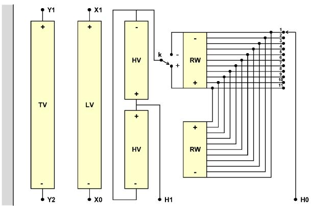  
Fig. 4. Single-phase three-winding transformer.

It is necessary to investigate in our case whether it is possible to obtain a good approximation of $\pmb { K } _ { k }$ for some value of m that is much smaller than n. This can be true if $\pmb { K } _ { k }$ models a low-rank phenomenon, but some “deviations” or “noise” causes $\pmb { K } _ { k }$ to have full rank n. If the noise is small relative to the relevant data in $\pmb { K } _ { k }$ , it is possible that it has a number of very small singular values that could be neglected.

The model used for the case study analyzed in [1] has been chosen to carry out this research. The transformer case study was a single-phase, three winding 50 MVA unit with rated voltage 230/-3, 69/-3, 13.8 kV at 60 Hz. This transformer was used by the CIGRE JWG A2/C4.52 to test the accuracy of various types of transformer models [8]. The winding arrangement of the single-phase transformer is shown in Fig. 4. The transformer was modeled using $n _ { n d } = 2 1 9$ nodes and $n = 2 1 3$ inductive = =branches (winding sections). A more detailed description of this transformer can be found in [1].

The model developed for this transformer uses $N = 5$ poles =for the representation of the inductive impedances and therefore contains the matrix $\pmb { L } _ { m }$ and 5 matrices $\pmb { K } _ { k } ,$ all of order $2 1 3 \times 2 1 3$ .

The following equation can be derived from (6), (13), (14) and (15)

$$
\mathbf {Z} _ {g} (s) = \mathbf {R} _ {g} (s) + s \mathbf {L} _ {g} (s) = \mathbf {Z} _ {m} - s ^ {2} \sum_ {k = 1} ^ {5} \frac {\mathbf {M} _ {k} \mathbf {M} _ {k} ^ {T}}{s + R _ {k}} \tag {24}
$$

The explicit expressions of the resistive and inductive parts of the impedance matrix $\scriptstyle { Z _ { g } }$ in the frequency domain are given below

$$
\mathbf {R} _ {g} (\omega) = \mathbf {R} _ {m} + \sum_ {k = 1} ^ {5} \mathbf {M} _ {k} \mathbf {M} _ {k} ^ {T} R _ {k} \frac {\omega^ {2}}{\omega^ {2} + R _ {k} {} ^ {2}} \tag {25}
$$

$$
\mathbf {L} _ {g} (\omega) = \mathbf {L} _ {m} - \sum_ {k = 1} ^ {5} \mathbf {M} _ {k} \mathbf {M} _ {k} ^ {T} \frac {\omega^ {2}}{\omega^ {2} + R _ {k} ^ {2}} \tag {26}
$$

Note that the frequency behavior of the resistive and inductive parts are closely related. The sums represent in both cases the frequency-varying parts of $\pmb { R } _ { g }$ and $L _ { g } ,$ where the $\pmb { K } _ { k }$ matrices contain the weight factors of the functions of ω in the expansions of each inductive impedance and are represented here by the products $\pmb { M } _ { k } \times \pmb { M } _ { k } ^ { \ T }$ . This is where the question arises whether low-rank $M _ { k }$ matrices can be used. To have an answer to this,

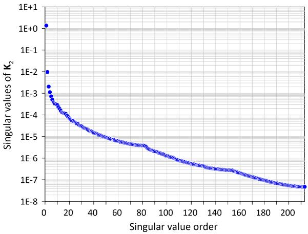  
Fig. 5. Singular values of matrix $\mathbf { M } _ { 2 }$ .

the SVD factorization of the 5 matrices (see (18)) have been performed and the distribution of the respective singular values were analyzed. As an example, Fig. 5 shows the distribution of singular values of the $M _ { 2 }$ matrix corresponding to the main pole (second pole).

The significant difference between the first singular values and the rest suggests that an important reduction could be achieved. This is also the case with the other $M _ { k }$ matrices. The next question is to know what rank to use for each matrix. The authors of reference [25] make the following observation in this regard: $\mathrm { ^ { 6 6 } A }$ useful rule of thumb is to retain enough singular values to make up 90% of the energy in . That is, the sum of the squares of the retained singular values should be at least 90% of the sum of the squares of all the singular values”.

However, in our case this recommendation merely gives a minimum value well below what is necessary after investigating the frequency behavior of the model with different rank reductions in the $M _ { k }$ matrices.

The conclusion reached in this section is that there is a certain possibility of achieving a reduction in the matrices, but it remains to determine the rank values to use in such a way that it does not significantly affect the response of the model. This is done in the next section.

# IV. DETERMINATION OF THE PARAMETERS OF THE COMPACT MODEL

# A. Methodology

Since the recommendation for the selection of the most suitable reduced rank mentioned in the previous section is not very useful in our case, it is necessary to propose a methodology for comparing models to achieve a solution. The first assumption to be made is that the determination of the appropriate rank of the matrices $M _ { k }$ will be based on an evaluation of the frequency behavior of the model, in order to be able to evaluate the response at all frequencies of interest. The degree of deviation of the model using low-rank matrices with respect to the model using full-rank matrices can be evaluated through statistical indices commonly used to evaluate Frequency Response Analysis (FRA) records [26], [27]. One of them is the Normalized Correlation Coefficient

(NCC) [28], on which the Chinese Standard DL/T911-2004 [29] for the diagnosis of faults in transformers using FRA is based.

This standard defines the following frequency bands:

LF: 1 – 100 kHz

MF: 100 – 600 kHz

HF: 600 – 1000 kHz

The standard also defines an index $\mathrm { R } _ { x y }$ that can be derived from the normalized correlation coefficient as follows:

$$
R _ {x y} =
$$

$$
\left\{ \begin{array}{c c} 1 0 & \text {f o r} 1 - \rho \left(f _ {1}, f _ {2}\right) <   1 0 ^ {- 1 0} \\ - \log_ {1 0} \left(1 - \rho \left(f _ {1}, f _ {2}\right)\right) & \text {o t h e r w i s e} \end{array} \right. \tag {29}
$$

where the normalized correlation coefficient is

$$
\rho \left(f _ {1}, f _ {2}\right) = \frac {\sum_ {i = 1} ^ {N} \left(f _ {1 i} ^ {*} \times f _ {2 i} ^ {*}\right)}{\sqrt {\sum_ {i = 1} ^ {N} \left(f _ {1 i} ^ {*}\right) ^ {2} \sum_ {i = 1} ^ {N} \left(f _ {2 i} ^ {*}\right) ^ {2}}} \tag {30}
$$

and

$$
f _ {1} ^ {*} = \left| f _ {1} \right| - \frac {1}{N} \sum_ {i = 1} ^ {N} \left| f _ {1 i} \right| \quad f _ {2} ^ {*} = \left| f _ {2} \right| - \frac {1}{N} \sum_ {i = 1} ^ {N} \left| f _ {2 i} \right|
$$

According to this standard, a winding is in a normal condition if

$$
R _ {L F} \geq 2, R _ {M F} \geq 1 \text {a n d} R _ {H F} \geq 0. 6 \tag {31}
$$

Obviously in our case these values are merely a reference and represent minimum values that will turn out to be too low. In the evaluation of the agreement in the responses of two models the expected values of these indices should be much higher, which implies a requirement for a much higher level of agreement. These increased levels with respect to the standard have been determined with the help of a visual inspection of the frequency responses of different alternatives in the ranks of the $\pmb { K } _ { k }$ matrices.

An important aspect to take into account when analyzing the possibility of expressing a matrix by means of a low-rank factorization is its complexity. This complexity has to do with the degree of uniformity of the self- and mutual inductances of the system of winding sections that the matrix represents. A matrix with very similar elements will be more likely to be represented with a very low-rank factorization. In fact, a matrix whose elements are all the same can be represented with a factorization of rank 1. In our case the degree of complexity is moderate, since within the system there are 4 windings (TW, LV, HV, RW) whose inductances are very different.

# B. Determination of the Reduced Ranks of Matrices $K _ { k }$

First, a preliminary comparative analysis of the successive low-rank versus full-rank models was performed based on the frequency responses of the case study transformer presented in Section III.B. This was made possible by having the measurements performed in 2017 by members of the JWG A2/C4.52 [8]. The transformer was considered as a 4-terminal network, and frequency response measurements were performed by successively injecting 1V into each of the terminals and measuring the currents flowing from ground to this terminal and also into

TABLE I TRANSFORMER TERMINAL CONNECTION DURING MEASUREMENTS   

<table><tr><td>Case</td><td>Input Terminal</td><td colspan="4">Grounded Terminals</td><td colspan="4">Measured Current</td></tr><tr><td>1</td><td>H1</td><td>-</td><td>X1</td><td>Y1</td><td>Y2</td><td>H1</td><td>X1</td><td>Y1</td><td>Y2</td></tr><tr><td>2</td><td>X1</td><td>H1</td><td>-</td><td>Y1</td><td>Y2</td><td>H1</td><td>X1</td><td>Y1</td><td>Y2</td></tr><tr><td>3</td><td>Y1</td><td>H1</td><td>X1</td><td>-</td><td>Y2</td><td>H1</td><td>X1</td><td>Y1</td><td>Y2</td></tr><tr><td>4</td><td>Y2</td><td>H1</td><td>X1</td><td>Y1</td><td>-</td><td>H1</td><td>X1</td><td>Y1</td><td>Y2</td></tr></table>

the remaining terminals, which were connected to ground. Considering the terminal names shown in Fig. 4, the measurements performed are detailed in Table I.

During these measurements the tap was in the  Nom position +and the H0 and X0 terminals were grounded. An amount of 16 frequency sweeps of complex admittances were then carried out, which are reduced to 10 due to symmetry. Given the way the measurements were made, the recorded signals can be interpreted as admittances. The admittances measured in this way are termed according to Table II.

The comparative analysis mentioned above was carried out by comparing the responses (admittances) calculated with the full-rank model with those of the successive low-rank models proposed. The degree of similarity was evaluated on the one hand by the index defined in (29) and on the other hand by visual inspection. In the first phase of the analysis, low-rank models were proposed in which the rank used was the same for the $5 K _ { k }$ sub-matrices. The full rank value of these matrices is $n = 2 1 3$ . It was found that for models with ranks greater =than approximately $m = n / 2 .$ , no appreciable differences were =observed in the responses. This continues to be the case until an approximate value of $m = 1 0 0$ . From this value, the decrease in =rank begins to be appreciable in the frequency responses of the admittances. From this point on, the second phase of analysis began, in which models with lower ranks were proposed, but analyzing the results of this decrease for each pole (i.e., each $\pmb { K } _ { k }$ matrix) individually. This analysis showed that there is greater sensitivity in matrices corresponding to poles of lower frequency.

# V. RESULTS

# A. Recommended Ranks of Matrices $K _ { k }$

In order to determine the most suitable values of the ranks of the $\pmb { K } _ { k }$ matrices, a large number of simulations were performed for different descending values of rank. In this preliminary analysis, the same rank was considered for the 5 matrices $K _ { 1 }$ to $K _ { 5 } .$ Simulations were performed with increasing values of rank from 5 to 210 with increments of 5 yielding 42 values. For all these cases, the values of the indices RLF, RMF and RHF were calculated for the admittances shown in Table II. Figs. 6–8 show respectively the values of $\mathrm { R } _ { \mathrm { L F } } , \mathrm { R } _ { \mathrm { M F } }$ and $\mathtt { R } _ { \mathrm { H F } }$ corresponding to case 1, i.e., the admittances $\Upsilon _ { \mathrm { 1 j } } , j = 1 , . . . , 4$ .

=The horizontal black solid lines in Figs. 6–8 show the lower limits of the indices given by the DL/T911-2004 standard and the horizontal blue solid lines show the lower limits of the indices determined in this work that correspond to an adequate frequency behavior of the model (see discussion). Prospective

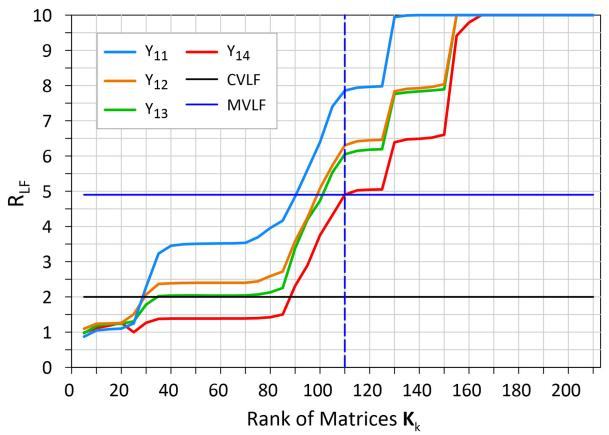

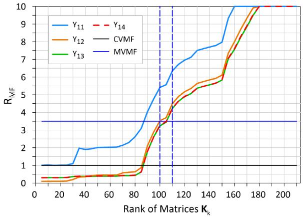  
Fig. 6. RLF indices (1 – 100 kHz) comparing $\mathrm { Y _ { 1 1 } , \mathrm { Y _ { 1 2 } , \mathrm { Y _ { 1 3 } , \mathrm { \Lambda } } } }$ , and $\mathrm { Y _ { 1 4 } }$ calculated with different low-rank models taking the full-rank model as a reference.   
Fig. 7. RMF indices (100 – 600 kHz) comparing $\mathrm { Y _ { 1 1 } , Y _ { 1 2 } , Y _ { 1 3 } , }$ and $\mathrm { Y _ { 1 4 } }$ calculated with different low-rank models taking the full-rank model as a reference.

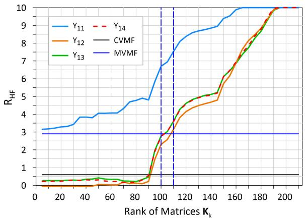  
Fig. 8. RHF indices (600 – 1000 kHz) comparing $\mathrm { Y _ { 1 1 } , \mathrm { Y _ { 1 2 } , \mathrm { Y _ { 1 3 } , } } }$ and $\mathrm { Y _ { 1 4 } }$ calculated with different low-rank models taking the full-rank model as a reference.

simulations were performed using matrices with ranks equal to 90, which are compatible with the minimum indices given in the standard and appreciable differences arise as can be seen in Fig. 9.

The blue dashed vertical lines in Figs. 7 and 8 indicate the range of rank values that were considered adequate after visual

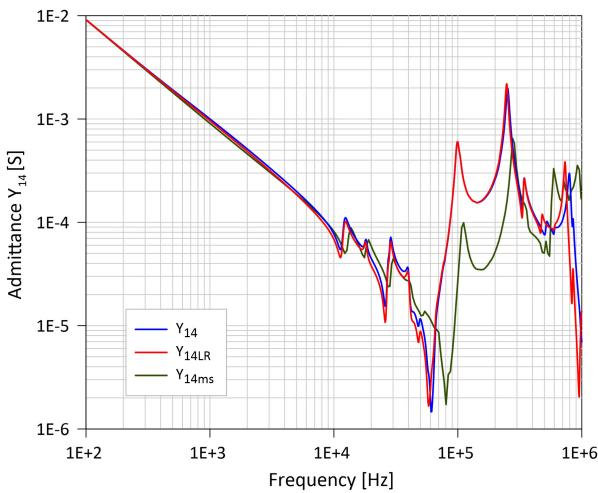  
Fig. 9. Comparison of the admittance $\mathrm { Y _ { 1 4 } }$ calculated with the full-rank model and the admittance $\mathrm { Y _ { 1 4 L R } }$ calculated with a low-rank model using uniform ranks of 90. The measured admittances $\mathrm { Y _ { 1 4 m s } }$ were also included for reference.

TABLE II NAMES OF ADMITTANCES MEASURED ACCORDING TO THE SCHEME IN TABLE I   

<table><tr><td>Case</td><td>Input Terminal</td><td colspan="4">Admittance</td></tr><tr><td>1</td><td>H1</td><td>Y11</td><td>Y12</td><td>Y13</td><td>Y14</td></tr><tr><td>2</td><td>X1</td><td>Y21</td><td>Y22</td><td>Y23</td><td>Y24</td></tr><tr><td>3</td><td>Y1</td><td>Y31</td><td>Y32</td><td>Y33</td><td>Y34</td></tr><tr><td>4</td><td>Y2</td><td>Y41</td><td>Y42</td><td>Y43</td><td>Y44</td></tr></table>

TABLE III CRITICAL AND RECOMMENDED RANK VALUES OF $\mathbf { K } _ { \mathrm { k } }$ MATRICES   

<table><tr><td>Pole (k)</td><td>1</td><td>2</td><td>3</td><td>4</td><td>5</td></tr><tr><td>Pole value [kHz]</td><td>0.6892</td><td>6.968</td><td>66.53</td><td>276.8</td><td>1393.1</td></tr><tr><td>Full Rank (n)</td><td>213</td><td>213</td><td>213</td><td>213</td><td>213</td></tr><tr><td>Recommended ranks (m)</td><td>110</td><td>110</td><td>100</td><td>100</td><td>100</td></tr><tr><td>Std. critical ranks (m)</td><td>100</td><td>100</td><td>90</td><td>80</td><td>80</td></tr></table>

inspection of the frequency responses. The need to define a zone and not a single value is due to the fact that each matrix has its own characteristics and the minimum permissible rank values do not coincide. It should also be noted that on the one hand the standard defines 3 ranks for the indices and on the other hand the rank of 5 matrices must be set and they do not behave in the same way in the event of a decrease in rank. This is explained taking into account that Figs. 6–8 were determined by varying the ranks under the simplifying assumption that all the ranks of the $\pmb { K } _ { k }$ matrices are equal and that on the other hand the final rank values determined in this work are the product of a fine adjustment of the ranks of each matrix, which did not end up being equal (see Table III ). Note that in Fig. 6 there is only one value (dashed vertical line in blue) and not a zone, which is the highest in the range, since in no case acceptable results with a rank lower than 110 have been obtained for the first two matrices, which influence the low frequency range.

The rank values corresponding to the intersection of the R index curves with the black horizontal lines (minimum standard

TABLE IV ${ \bf R } _ { \mathrm { L F } } , { \bf R } _ { \mathrm { M F } } ,$ , AND $\mathtt { R } _ { \mathrm { H F } }$ INDICES CORRESPONDING TO THE RECOMMENDED RANK VALUES GIVEN IN TABLE III   

<table><tr><td></td><td>RLF</td><td>RMF</td><td>RHF</td></tr><tr><td>Y11</td><td>7.86</td><td>6.16</td><td>7.38</td></tr><tr><td>Y12</td><td>6.29</td><td>4.28</td><td>2.99</td></tr><tr><td>Y13</td><td>6.05</td><td>4.01</td><td>3.46</td></tr><tr><td>Y14</td><td>4.87</td><td>4.03</td><td>3.45</td></tr><tr><td>Y22</td><td>6.13</td><td>3.73</td><td>3.13</td></tr><tr><td>Y23</td><td>7.87</td><td>3.89</td><td>2.95</td></tr><tr><td>Y24</td><td>8.07</td><td>3.52</td><td>2.85</td></tr><tr><td>Y33</td><td>7.36</td><td>3.95</td><td>2.95</td></tr><tr><td>Y34</td><td>8.13</td><td>3.58</td><td>2.87</td></tr><tr><td>Y44</td><td>7.39</td><td>3.98</td><td>3.00</td></tr></table>

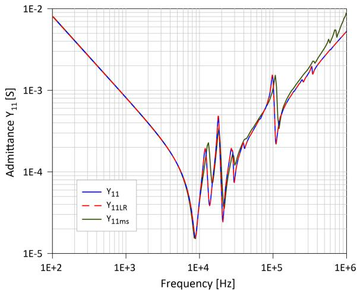  
Fig. 10. Comparison of the admittance $\mathrm { Y } _ { 1 1 }$ calculated with the full-rank model and the admittance $\mathrm { Y } _ { \mathrm { 1 1 L R } }$ calculated with the recommended low-rank model.

values) are termed “critical standard rank values”. After determining approximate minimum ranks during the preliminary analysis, a finer analysis of the ranks was made, detecting that the ranks of matrices $K _ { \varLambda }$ and $K _ { \mathcal { 2 } }$ have greater sensitivity. It was also found that considerable improvements in the values of the indexes can be achieved with slight increases in the ranks, thus being able to obtain an almost perfect match. As a consequence, the final solution presents ranks somewhat higher than the critical standard values and also deviates slightly from the condition of equality of ranks in all matrices. The critical standard ranks and the minimum ranks finally considered as adequate are shown in Table III. It should be noted that all the values mentioned are approximate in a certain way but are within a region of optimal values in the range of approximately 10%. Table IV shows the R indexes for the ranks recommended in Table III for the admittances in Table II.

# B. Frequency Domain Responses

Figs 10 –13 show the frequency responses of admittances $\mathrm { Y } _ { 1 1 } .$ $\mathrm { Y _ { 1 2 } , Y _ { 1 3 } }$ and $\mathrm { Y _ { 1 4 } }$ respectively. In each of the figures two curves are represented, the curve obtained from the calculation with full rank matrices, in blue solid line, and the curve calculated

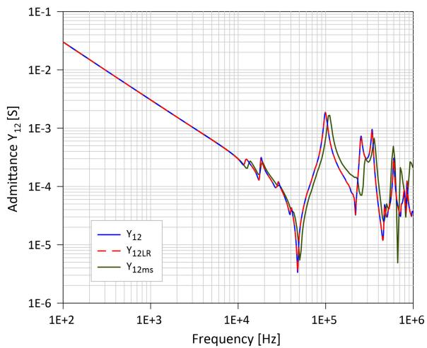  
Fig. 11. Comparison of the admittance $\mathrm { Y } _ { 1 2 }$ calculated with the full-rank model and the admittance Y12LR calculated with the recommended low-rank model.

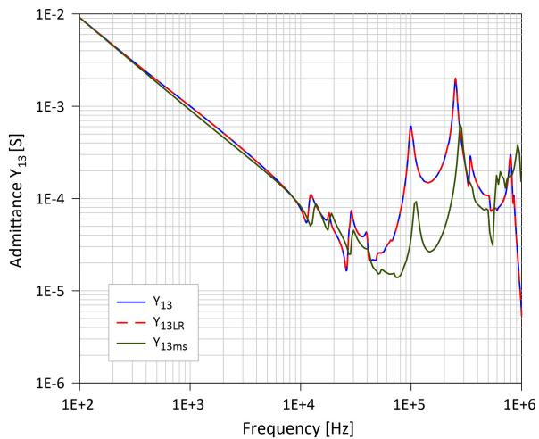  
Fig. 12. Comparison of the admittance $\mathrm { Y } _ { 1 3 }$ calculated with the full-rank model and the admittance $\mathrm { Y _ { 1 3 L R } }$ calculated with the recommended low-rank model.

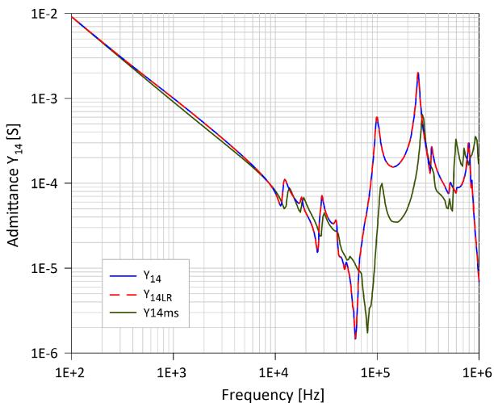  
Fig. 13. Comparison of the admittance $\mathrm { Y _ { 1 4 } }$ calculated with the full-rank model and the admittance $\mathrm { Y _ { 1 4 L R } }$ calculated with the recommended low-rank model.

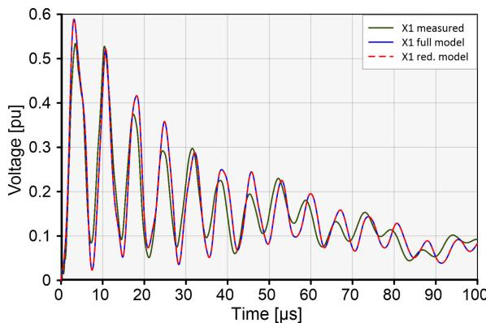

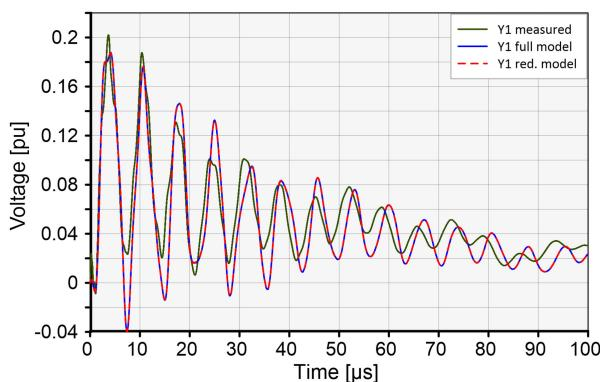  
Fig. 14. Transient voltages at terminal X1.   
Fig. 15. Transient voltages at terminal $\mathrm { Y } _ { 1 . }$

with the recommended ranks, in red dashed line. The level of visual similarity is extremely high. The measured admittances $\mathrm { Y } _ { \mathrm { m s } }$ were also included for reference.

The number of auxiliary circuits used for the calculations with the full rank matrices was 1065 and those used for the solution with the low-rank matrices was 520.

A comparison has also been made between the computation times required to calculate the frequency response of the full state-space model and the reduced one. Taking the $\mathrm { Y } _ { 1 1 }$ admittance calculations as an example, 1397 runs were performed in Matlab, where the matrix of the system of equations was of order 1497. The time required for the calculation was 327 seconds. A similar calculation was performed using the reduced model, where the system of equations was of order 952. The time required for the calculation was 98 seconds, that is, 30% of the time required by the full model.

# C. Time Domain Responses

The case study transformer was also analyzed in the time domain. The accessible terminals are H1, X1, Y1, Y2, R1, R6 and R11 (see Fig. 4).

For the case analyzed, a standard lightning impulse voltage 1.2/50 µs was applied to the HV winding terminal H1. The terminals H0 and X0 were grounded, terminal R11 was connected to H0, and the switch k was connected to the regulation winding at Nom . This same case was presented in [1] and [7]. Figs. 14 –16 +show the measured and calculated voltages at terminals X1, Y1 and R1 respectively. The curves calculated with the full model

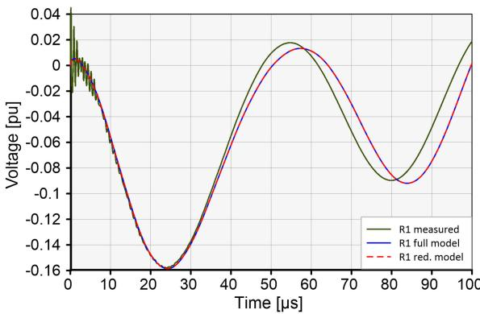  
Fig. 16. Transient voltages at terminal $\mathrm { R } _ { 1 } .$

TABLE V COMPARISON OF TRANSIENT COMPUTATION TIMES   

<table><tr><td>Model/Software</td><td>Delta t [μs]</td><td>Final time [μs]</td><td>CPU time [s]</td></tr><tr><td>Full Rank / Matlab</td><td>1.E-8</td><td>100.0</td><td>43.03</td></tr><tr><td>Full Rank / Matlab</td><td>1.E-9</td><td>100.0</td><td>422.6</td></tr><tr><td>Low Rank / Matlab</td><td>1.E-8</td><td>100.0</td><td>16.12</td></tr><tr><td>Low Rank / Matlab</td><td>1.E-9</td><td>100.0</td><td>159.4</td></tr><tr><td>Low Rank / ATP</td><td>1.E-9</td><td>100.0</td><td>667.5</td></tr></table>

were plotted using a solid blue line and those calculated with the reduced model using a red dashed line. This helps visualization in this case, where the overlap is near perfect. The corresponding measurements were also included for reference, for which solid dark green lines were used.

The reduced model was used to perform the transient calculations using both ATP and Matlab. The results were in complete agreement, as expected, so they are presented as a single curve in Figs. 14 and 15. Note that ATP does not allow modeling a coupled circuit with more than 40 coupled branches, nor to enter more than 150000 RLC branches (BIG version). The new circuit model made it possible to reduce the initial 817281 RLC branches to 269011 using a bigger version of ATP. The explanation for the significant reduction is that by removing the resistors in series the nodes of contiguous inductive branches are joined in a single node. A comparison has also been made between the calculation times of the transient response of the full and reduced state-space models using Matlab and the decoupled reduced model in ATP. The integration algorithm used in Matlab was based on the trapezoidal rule, the same integration rule used in ATP. Table V shows the computation times as a function of time step and the software used.

The state-space matrices A of the complete and reduced models (Matlab) are of the order 1497 and 952 respectively. The time required by the reduced model to calculate the time response was 37% of that required by the full model. While a time step of 1.E–8 was adequate in the case of Matlab, there were slight precision issues in ATP. The problem was solved by reducing the time step to 1.E–9. It can be seen in Table V that the time consumed by ATP is much higher than that used by Matlab for the reduced model. This is most likely due to having to use a decoupled model in ATP.

# VI. DISCUSSION

As mentioned before, the reduction of the number of auxiliary loops of the model is a great advantage, since it reduces the size of the model considerably and makes the calculations much faster. This has been achieved without compromising accuracy at all. A very important question is what ranks to use in the model, so as to decrease its size without compromising its performance. This issue was first investigated by performing the calculations summarized in Figs. 6–8. In all of them, the lower limit established by the Chinese standard [29] for the correlation between the curves if the condition of the unit is normal is indicated with a black horizontal line. It is evident that the rank value to be adopted in our case must be such that the corresponding R values are above this black line. Table III gives the rank values corresponding to indices that are in the order of the critical indices of the standard. It should be noted that the criteria of the Chinese standard [29] were not intended to compare models but to detect incipient faults in transformers and are less stringent than those required in the first case. Some deviations can already be seen by evaluating the behavior of the admittance $\mathrm { Y _ { 1 4 } }$ using a critical standard rank of 90 for all the matrices, which is shown in Fig. 9. This is why it was necessary to determine the rank values that ensure the goodness of the model, which will correspond to index values that are above those given by the standard, which are shown in Table III. As can be seen, these minimum ranks are not much higher than the critical standard ranks, but the corresponding R indices.

Figs 6–8 reveal that the admittance $\mathrm { Y _ { 1 1 } }$ , measured at the input terminal, is the one that admits smaller ranks without deteriorating its response and this is more notable as the frequency increases. For this function, using a rank as low as 40 would not alter the response too much. To adopt a safe criterion, we must observe the curve that crosses the black line at higher rank values and this corresponds to $\mathrm { Y _ { 1 4 } }$ , with a crossing between ranks 80 and 90. Therefore, the ranks in this interval are considered as critical.

The frequency response of $\mathrm { Y _ { 1 4 } }$ using rank 90 depicted in Fig. 9 shows differences with respect to the full rank model in the regions from 10 to 80 kHz and from 500 kHz to 1 MHz. It can be seen in Figs. 6–8 that to the right of the point where the curves cross the black line, their slopes are large, especially for $\mathrm { Y _ { 1 3 } }$ and $\mathrm { Y _ { 1 4 } }$ . This reveals that the goodness of the model will increase rapidly with a modest increase in the ranks from that point on. From a fine tuning of the ranks based on a visual evaluation, it is possible to propose the recommended values of Table III, which yield the responses shown in Figs. 10–13. In this analysis, the ranks of each matrix were individually determined, verifying that the effect of a change in the rank of the matrices corresponding to lower poles has a greater influence on the response than the same variations in the ones corresponding to higher poles. This gives the possibility of decreasing the ranks of the high frequency pole matrices a little more, which can be observed in the recommended ranks.

The influence of decreasing the rank of the $M _ { k }$ matrix of a given pole is more evident for a given frequency range. In this regard the modification of the rank affects the response at frequencies higher than the pole frequency. In other words, variations in the rank of a high-frequency pole matrix do not

alter the low-frequency response, but variations in the rank of a low-frequency pole matrix alter virtually the entire response.

Finally, minimum values of the $\mathrm { R } _ { \mathrm { L F } } , \mathrm { R } _ { \mathrm { M F } }$ and $\mathtt { R } _ { \mathrm { H F } }$ indices for the solution of optimal ranks for this case study could be calculated and are given in Table IV, and their values are 4.9, 3.5 and 2.9 respectively. As already mentioned, these minimum index values were represented with blue horizontal lines in Figs 6–8.

Regarding the inclusion of this model in EMT calculation programs, the methodology does not differ at all from that used for the models described in [1] and [4]. This is so because the model presented is a reduced version of them and there are no differences regarding how to use them with EMT programs. The state-space model implementation was explained in detail in [1] and also in references [5–9]. In the case of the transformer circuit model [4], its implementation often requires decoupling of the inductive network. The amount of data of the decoupled model can be very large and exceed the input data limits of the program. The reduced model presented in this work solves this problem by making it possible to use it with programs such as ATP, which offers the possibility of analyzing the behavior of the transformer being connected to other components of the network.

# VII. CONCLUSION

This paper presents a new compact white-box power transformer model for the calculation of electromagnetic transients. This model notably improves the original model presented in [1] and [4] by substantially reducing its size. The main advantage of this reduction is that it is possible to implement this model in EMTP-based programs with limitations on the number of components that can be entered as input data. This is a very important advantage in the particular case of ATP. In addition, this size reduction leads to a significant reduction in simulation time without practically affecting the computational results. It has been shown that the new reduced white-box model of the transformer can be used with programs such as ATP, which is not possible using the full model [4] even with the larger versions of the software normally available. The reduction achieved in the size of the inductance matrix used in the model is approximately 50%, so the number of magnetic interactions between winding sections is reduced to about 25%, since the relationship between these interactions and the order of the matrix is quadratic. Since apart from the inductive components there are also resistors and capacitances that are part of the system, the size reduction of the system of equations to be solved is not the same as that of the inductance matrix. That is why the reduction in the size of the problem is of the order of 63% and the calculation times decrease to 30-37%.

The strategy used was to represent the frequency variation of the damping and the magnetic coupling of the windings with approximately half of the auxiliary loops that the full model requires. This has been achieved through the representation of the matrices $\pmb { K } _ { k }$ of the inductive model by means of a factorization using low-rank matrices applying the SVD. This is a novel application to circuit theory of a linear algebra technique known in image processing.

The question of which are the most adequate ranks to be used in the mentioned matrices was answered by means of

an exhaustive sensitivity analysis of the frequency responses using models using matrices with different ranks and comparing these responses with that of the original full-rank model. The reference model used corresponds to the single-phase three winding 50 MVA transformer case study, which was used by the CIGRE JWG A2/C4.52 to test the accuracy of various types of transformer models. To compare the responses, the indices suggested in the Chinese standard DL/T911-2004 were used. Since the limits for the indexes established by the standard are not suitable for the comparison of models, indicative values of these indexes were determined to guarantee an adequate degree of response agreement.

In this way, a completely optimized model has been presented, which allows representing the winding damping characteristics by using a reduced number of auxiliary inductive loops magnetically coupled with the winding sections. In this way, the relevant information is preserved, achieving a significant reduction in the dimension of the original model without practically affecting the calculation results. The use of this type of tool is unavoidable when analyzing dielectric stresses in the transformer caused by overvoltages coming from the power system through EMTPtype programs.

# ACKNOWLEDGMENT

The author wish to extend his thanks to Álvaro Portillo and Bjørn Gustavsen for their support and many fruitful discussions on transformer modeling in the last years working together in the CIGRE JWG A2/C4.52.

# REFERENCES

[1] E. E. Mombello, A. Portillo, and G. A. Diaz, “New state-space whitebox transformer model for the calculation of electromagnetic transients,” IEEE Trans. Power Del., vol. 36, no. 5, pp. 2615–2624, Oct. 2021, doi: 10.1109/TPWRD.2020.3023824.   
[2] JWG A2/C4.39, “Electrical transient interaction between transformers and the power system. Part 1–Expertise,” CIGRE, Tech. Brochure 577A, Apr. 2014.   
[3] JWG A2/C4.39, “Electrical transient interaction between transformers and the power system. Part 2– Case studies,” CIGRE, Tech. Brochure 577B, Apr. 2014.   
[4] E. E. Mombello and G. A. Díaz Flórez, “An improved high frequency white-box lossy transformer model for the calculation of power systems electromagnetic transients,” Electric Power Syst. Res., vol. 190, 2021, Art. no. 106838, doi: 10.1016/j.epsr.2020.106838.   
[5] B. Gustavsen and H. M. J. De Silva, “Inclusion of rational models in an electromagnetic transients program – Y-parameters, Z-parameters, Sparameters, transfer functions,” IEEE Trans. Power Del., vol. 28, no. 2, pp. 1164–1174, Apr. 2013.   
[6] B. Gustavsen and A. Portillo, “Interfacing k-factor based white-box transformer models with electromagnetic transients programs,” IEEE Trans. Power Del., vol. 29, no. 6, pp. 2534–2542, Dec. 2014.   
[7] B. Gustavsen and A. Portillo, “A damping factor-based white-box transformer model for network studies,” IEEE Trans. Power Del., vol. 33, no. 6, pp. 2956–2964, Dec. 2018.   
[8] B. Gustavsen, Á. Portillo, and H. K. Høidalen, Modelling of Transformers and Reactors for Electromagnetic Transient Studies. Paris, France: CIGRE, 2018, Paper A2-213.   
[9] B. Gustavsen, C. Martin, and Á. Portillo, “Time-domain implementation of damping factor white-box transformer model for inclusion in EMT simulation programs,” IEEE Trans. Power Del., vol. 35, no. 2, pp. 464–472, Apr. 2020.   
[10] M. Popov, “General approach for accurate resonance analysis in transformer windings,” Electric Power Syst. Res., vol. 161, pp. 45–51, 2018.   
[11] S. M. H. Hosseini, M. Vakilian, and G. B. Gharehpetian, “Comparison of transformer detailed models for fast and very fast transient studies,” IEEE Trans. Power Del., vol. 23, no. 2, pp. 733–741, Apr. 2008.

[12] N. Abeywickrama, Y. V. Serdyuk, and S. M. Gubanski, “High-frequency modeling of power transformers for use in frequency response analysis (FRA),” IEEE Trans. Power Del., vol. 23, no. 4, pp. 2042–2049, Oct. 2008.   
[13] Á. Portillo, L. F. de Oliveira, and F. Portillo, “Calculation of circuit parameters of high frequency models for power transformers using FEM,” in Proc. 5th Int. Colloq. Transformer Res. Asset Manage., 2020, pp. 163–182.   
[14] A. Theocharis and M. Popov, “Modelling of foil-type transformer windings for computation of terminal impedance and internal voltage propagation,” IET Electric Power Appl., vol. 9, no. 2, pp. 128–1137, Feb. 2015.   
[15] J. A. Martinez-Velasco, “Basic methods for analysis of high frequency transients in power apparatus windings,” in Electromagnetic Transients in Transformer and Rotating Machine Windings, C. Q. Su, Ed., 1st. ed. Hershey, PA, USA: IGI Global, 2013, pp. 45–78.   
[16] R. C. Degeneff, “Transient-Voltage response of coils and windings,” in Electric Power Transformer Engineering, J. H. Harlow, Ed., 3rd ed. Boca Raton, FL, USA: CRC Press, 2012, pp. 1–27.   
[17] M. Popov, B. Gustavsen, and J. A. Martinez-Velasco, “Transformer modelling for impulse voltage distribution and terminal transient analysis,” in Electromagnetic Transients in Transformer and Rotating Machine Windings, C. Q. Su, Ed., 1st. ed. Hershey, PA, USA: IGI Global, 2013, pp. 239–283.   
[18] S. Banerjee and A. Roy, “Linear algebra and matrix analysis for statistics,” in Texts in Statistical Science, 1st ed. Boca Raton, FL, USA: Chapman and Hall/CRC, 2014.   
[19] G. H. Golub and C. F. Van Loan, Matrix Computations, 4th ed. Baltimore, MD, USA: Johns Hopkins Univ. Press, 2013.   
[20] L. N. Trefethen and D. Bau, III, Numerical Linear Algebra. Philadelphia, PA, USA: Soc. Ind. Appl. Math.. 1997.   
[21] N. K. Kumar and J. Schneider, “Literature survey on low rank approximation of matrices,” Linear Multilinear Algebra, vol. 65, no. 11, pp. 2212–2244, 2017, doi: 10.1080/03081087.2016.1267104.   
[22] G. W. Stewart, Matrix Algorithms. Vol 1: Basic Decompositions. Philadelphia, PA, USA: Soc. Ind. Appl. Math., 1998.   
[23] G. Lebanon, Probability: The Analysis of Data. CreateSpace Independent Publishing Platform, 2012.   
[24] M. Embree, “The singular value decomposition,” in Matrix Methods For Computational Modeling and Data Analytics, Lecture Notes (Mathematical Modeling: Tools and Techniques II). Blacksburg, VA, USA: Virginia Tech., Spring 2019, ch. 6, Accessed: May 7, 2021. [Online]. Available: https://intranet.math.vt.edu/people/embree/cmda3606/chapter6.pdf   
[25] J. Leskovec, A. Rajaraman, and J. D. Ullman, Mining of Massive Datasets. New York, NY, USA: Cambridge Univ. Press, 2014.   
[26] R. Wimmer, S. Tenbohlen, M. Heindl, A. Kraetge, M. Krüger, and J. Christian, “Development of algorithms to assess the FRA,” presented at the 15th Int. Symp. High Voltage Eng., Ljubljana, Slovenia, 2007, Paper T7-523.   
[27] E. Rahimpour, M. Jabbari, and S. Tenbohlen, “Mathematical comparison methods to assess transfer functions of transformers to detect different types of mechanical faults,” IEEE Trans. Power Del., vol. 25, no. 4, pp. 2544–2555, Oct. 2010, doi: 10.1109/TPWRD.2010.2054840.   
[28] M. H. Samimi, S. Tenbohlen, A. A. S. Akmal, and H. Mohseni, “ Evaluation of numerical indices for the assessment of transformer frequency response,” IET Gener., Transmiss. Distrib., vol. 11, no. 1, pp. 218–227, Jan. 2017, doi: 10.1049/iet-gtd.2016.0879.   
[29] Frequency Response Analysis on Winding Deformation of Power Transformers, Professional Standard of the People’s Republic of China, Standard DL/T911-2004, ICS27.100, F24, Jun. 2005.

Enrique E. Mombello (Senior Member, IEEE) was born in Buenos Aires, Argentina, in 1957. He received the B.S. and Ph.D. degrees in electrical engineering from the Universidad Nacional de San Juan, San Juan, Argentina, in 1982 and 1998, respectively. From 1989 to 1991, he was with High Voltage Institute, RWTH, Aachen, Germany. He is currently a Principal Researcher with the National Council of Technical and Scientific Research (CONICET), Buenos Aires, Argentina, and a Lecturer with the Instituto de Energía Eléctrica, National University of San Juan, San Juan, Argentina. He has more than 35 years of experience in research projects. His main research interests include the development of high-frequency transformer models, design and diagnostics of power transformers, asset management, transformer life management, electromagnetic transients in power systems, and low-frequency electromagnetic fields.