# A steady-state initialization procedure for generic voltage-source converters in electromagnetic transient simulations✩,✩✩

Guilherme Cirilo Leandro ∗, Taku Noda

ENIC Division, Grid Innovation Research Laboratory, Central Research Institute of Electric Power Industry (CRIEPI), 2-6-1 Nagasaka, Yokosuka, Kanagawa 240-0196, Japan

# A R T I C L E I N F O

Keywords:

Control-system part initialization

Electromagnetic transient simulation

Heuristic procedure

Steady-state initialization

Systematic procedure

Voltage-source converter

# A B S T R A C T

Electromagnetic transient (EMT) simulations are often performed to analyze disturbances which occur during a steady-state operation of the power grid. In modern transmission and distribution power grids, a number of voltage-source converters (VSCs) are used for renewable energy interconnections and system control. To perform EMT simulations with such VSCs, a time step of the order of microseconds is used to represent the switching operations of the VSCs. In order to avoid a prohibitively-long computation time, a steadystate initialization method is required to directly start from a steady state. This paper proposes a systematic and heuristic procedure for the steady-state initialization of generic VSCs. Using an AC steady-state solution, detailed portions in the circuit part and the control-system part of a VSC are systematically initialized. For validation, EMT simulations of a 6.6-kV distribution grid with two VSCs are performed with and without the proposed initialization procedure in this paper. Practically no transient is observed in the result with the proposed procedure, and therefore it is confirmed that directly starting from a steady state is made possible. On the other hand, the result without the proposed procedure does not reach the steady state even after continuing the EMT simulation for 300 ms.

# 1. Introduction

Electromagnetic transient (EMT) simulations are often performed to analyze disturbances which occur during a steady-state operation of the power grid. In modern transmission and distribution power grids, a number of power-electronics converters are being used. Most of those power-electronics converters are voltage-source converters (VSCs) [1]. To perform EMT simulations of such modern power grids with VSCs, the time step needs to be in the order of microseconds to represent the switching operations of the VSCs. If the simulation was started from a zero initial condition, a prohibitively-long computation time would be required to establish a steady state. In some cases, a steady state will not be reached at all [2]. Therefore, it is essential to use a steady-state initialization method to start directly from a steady state [3,4].

Mathematically, the existing steady-state initialization methods can be classified, in general, into the following categories: time-domain methods, frequency-domain methods and hybrid time–frequency domain methods. Most of them are based on power flow calculation, and

linear circuit elements can be initialized in a straightforward way based on an AC steady state obtained by a power-flow solution [4–7]. Nonlinear elements can also be initialized, if the method proposed in [8] is used. Some methods can be expanded to consider harmonics [9,10]. The methods proposed in [11,12] are based on the shooting method, and therefore they involve a significant number of unknown variables for the calculation. On the other hand, the method proposed in [13] reduces the number of unknown variables by applying the chainmatrix concept to represent the VSCs. The method proposed in [14] is able to initialize a modular multilevel converter (MMC), which is a more complicated power-electronics converter. The methods above are algorithmically sophisticated and general. Since they are general, however, they involve iterative calculations requiring a relatively large amount of computations. It should be noted that some experts often implement custom-made initialization procedures based on their own heuristic knowledge to speed up the simulation.

Rather than exploiting algorithmically-sophisticated general methods, this paper proposes a heuristic but systematic procedure for the

<table><tr><td colspan="2">Nomenclature</td></tr><tr><td>Vh, VHΔ</td><td>Phase voltage at the ideal transformer primary side and its line-to-line counterpart.</td></tr><tr><td>Ch, ChΔ</td><td>Capacitor&#x27;s capacitance for the Y-connected and the Δ-connected LC filters.</td></tr><tr><td>θ</td><td>Phase angle of Vg.</td></tr><tr><td>θ̂</td><td>Value of θ measured by the PLL block.</td></tr><tr><td>vdc</td><td>VSC&#x27;s DC voltage.</td></tr><tr><td>ˆdc</td><td>Value of vdc in per-unit (pu).</td></tr><tr><td>ˆdc*</td><td>Reference value of vdc.</td></tr><tr><td>ia, ib, ic</td><td>Currents flowing through the filter inductor and VSC&#x27;s converter part.</td></tr><tr><td>ˆa,ˆb,ˆc</td><td>Values of ia, ib, ic in pu.</td></tr><tr><td>ˆd,ˆq</td><td>Values ofˆa,ˆb,ˆc in the dq domain.</td></tr><tr><td>ˆd*,ˆq*</td><td>Reference values ofˆd,ˆq.</td></tr><tr><td>ˆP</td><td>Active power injected into the grid, in pu.</td></tr><tr><td>ˆP*</td><td>Reference value ofˆP.</td></tr><tr><td>ˆVg</td><td>Value of Vg in pu.</td></tr><tr><td>ˆQ</td><td>Reactive power injected into the grid, in pu.</td></tr><tr><td>ˆQ*</td><td>Reference value ofˆQ.</td></tr><tr><td>vga, vgb, vgc</td><td>Voltages at the grid connection point.</td></tr><tr><td>ˆga,ˆgb,ˆgc</td><td>Values of vga, vgb, vgc in pu.</td></tr><tr><td>ˆgd,ˆgq</td><td>Values of ˆga, ˆgb, ˆgc in the dq domain.</td></tr><tr><td>ˆh</td><td>Value of Ch in pu.</td></tr><tr><td>ˆh</td><td>Value of Vh in pu.</td></tr><tr><td>Vg</td><td>Positive-sequence voltage at the grid connection point.</td></tr><tr><td>ˆVg*</td><td>Reference value of Vg.</td></tr><tr><td>ˆga*,ˆgb*,ˆgc*</td><td>Reference values of ˆga, ˆgb, ˆgc.</td></tr><tr><td>AQR</td><td>Automatic reactive power regulator.</td></tr><tr><td>PLL</td><td>Phase locked loop.</td></tr><tr><td>PWM</td><td>Pulse width modulation.</td></tr><tr><td>ACAVR</td><td>AC automatic voltage regulator.</td></tr><tr><td>LPF</td><td>Low-pass filter.</td></tr><tr><td>PI</td><td>Proportional-integral.</td></tr><tr><td>DCAVR</td><td>DC automatic voltage regulator.</td></tr><tr><td>ACR</td><td>Automatic current regulator.</td></tr><tr><td>PID</td><td>Proportional-integral-differential.</td></tr></table>

steady-state initialization of generic VSCs in EMT simulations. The main contribution of this paper is to avoid a prohibitively-long computation time when performing EMT simulations of modern power grids with VSCs by providing a practical steady-state initialization procedure. To apply the proposed procedure, first, an unbalanced AC steady state is obtained by a power flow solution using the method proposed in [7]. Then, detailed portions in the circuit part and the control-system part of a VSC are initialized using their own calculation procedures. For each portion, an initialization procedure is established by heuristic knowledge considering the operation of a VSC, and those are organized as a systematic procedure. In this paper, EMT simulations of a 6.6-kV distribution grid with two VSCs are performed with and without the proposed initialization procedure to show its effectiveness.

First, Section 2 describes the overall steady-state initialization procedure. Section 3 and Section 4 respectively describe the detailed initialization methods of the circuit part and the control-system part of a VSC. For validation, Section 5 presents EMT simulation results with and without the proposed procedure, and Section 6 discusses the results. Finally, Section 7 concludes the paper.

# 2. Overall steady-state initialization procedure

The overall steady-state initialization procedure proposed in this paper consists of the following three stages.

• Stage 1: Positive-sequence power-flow calculation,   
• Stage 2: Three-phase AC steady-state calculation, and   
• Stage 3: Initialization of individual component models.

Actually, Stages 1 and 2 have already been proposed in [7], and this paper proposes the VSC part of Stage 3 only. The flowchart of the overall steady-state initialization procedure is shown in Fig. 1.

At Stage 1, the positive-sequence or balanced power-flow solution of the simulation case is calculated with the slack node, P–Q nodes and P–V nodes which appropriately replace component models in the simulation. In most cases, generators and upper-voltage substations are replaced by P–V nodes, and loads are replaced by P–Q nodes. A VSC is replaced by a P–Q node or a P–V node depending on its control mode. When the control system is in a constant reactive-power mode (AQR), the VSC is replaced by a P–Q node. When the control system is in a constant voltage mode (AVR), on the other hand, it is replaced by a P–V node.

At Stage 2, the three-phase AC steady-state solution is calculated based on the power-flow solution obtained at Stage 1. The generators and the upper-voltage substation busses among the P–V and P–Q nodes are replaced by three-phase voltage sources whose voltages and phase angles are obtained by the power-flow solution from Stage 1. The loads which are usually represented by P–Q nodes at Stage 1 are represented by RLC circuits of the user’s choice, and the circuit parameters are obtained by the power-flow solution. A VSC is represented by a three-phase balanced current or voltage source depending on its control mode. When the control system is in a AQR mode, the VSC is represented by a three-phase balanced current source whose magnitudes and phase angles are calculated by the power-flow solution obtained at Stage 1. When the control system is in a AVR mode, the VSC is represented by a three-phase balanced voltage source whose magnitudes and phase angles are also calculated by the power-flow solution obtained at Stage 1. With these replacements, now the threephase AC steady-state solution can be calculated in the ???? domain. This is an unbalanced AC steady-state solution in a practical sense. The details are described in [7].

At Stage 3, all component models including VSCs are individually initialized using the solutions obtained at the previous two stages.

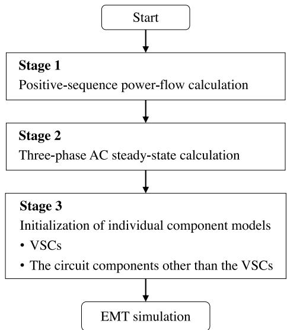  
Fig. 1. Flowchart of the overall steady-state initialization procedure.

The circuit element components such as inductors and capacitors are initialized as follows. First, the state variable of the component, current or voltage, at time zero is calculated from the three-phase AC steadystate solution, and then the calculated value is set to the past history of the integration formula used for the subsequent EMT calculation. When the trapezoidal rule is used for the numerical integration, the integration of the state variable ?? to proceed from ?? = 0 to ?? = ℎ is approximated by the following equation [15]

$$
\int_ {0} ^ {h} x d t \cong \frac {h}{2} \left(x _ {0} + x _ {1}\right) \tag {1}
$$

The time step is denoted by $h ,$ and ?? = 0 and ?? = ℎ respectively correspond to subscript 0 and 1. At the beginning of an EMT simulation, the value of $x _ { 0 }$ as the past history of ?? is needed. Appendix A describes the case where the 2-stage diagonally implicit Runge–Kutta (2S-DIRK) method [16] is used for the numerical integration. More complicated circuit components such as line models and generator models have their own initialization routines. The next two sections describe procedures to initialize both the circuit and control-system parts of a VSC using its terminal voltages and currents.

# 3. Initialization of the circuit part

As shown in Fig. 2, the circuit part of a VSC is further divided into the AC circuit part, the converter part and the DC circuit part. From the grid side, the AC circuit part is composed of an interconnection transformer and a harmonic filter. The converter part is the core powerelectronics bridge circuit of the VSC consisting only of semiconductor switches and diodes. The DC circuit part is composed of a DC capacitor bank only. Systematic procedures to initialize those component models are described in this section.

# 3.1. Initialization of the AC circuit part

Since a VSC is represented by a three-phase balanced current or voltage source during Stage 2, the voltages and currents at the grid connection point are assumed to be balanced. This assumption is realistic, because the VSC is controlled so that it generates balanced voltages and currents. Starting from those balanced voltages and currents at the grid connection point, the interconnection transformer is first initialized and then the harmonic filter is initialized.

(1) Interconnection transformer is used for stepping-down the grid voltage to the operation voltage of the VSC and also for electrical insulation. According to the practical experience of the authors, the winding connection of interconnection transformers used in distribution systems is ??–?? in most cases, and therefore the ??–?? connection is taken as the example for this illustration. However, since a threephase transformer with any winding connection can be considered a set of three single-phase transformers connected each other according to the connection type, the following illustration can be extended to any connection without problems.

A single-phase transformer can be represented by Steinmetz’s equivalent circuit. Since the magnetizing circuit does not have a major

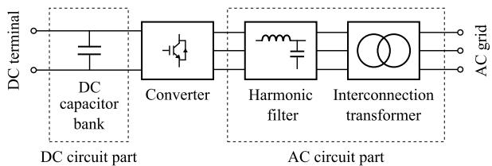  
Fig. 2. Circuit part of a VSC.

impact on simulation results, the case where it is neglected is illustrated in Fig. 3. If the magnetizing circuit needs to be considered, the method described in Appendix B can be used. Steinmetz’s equivalent circuit now consists of the winding resistance and the leakage inductance on the primary winding (converter side), $R _ { p }$ and $L _ { p } ,$ those on the secondary winding (grid side), $R _ { s }$ and $L _ { s }$ , and the ideal transformer whose turn ratio is 1 ∶ ??.

The positive-sequence voltage and current at the grid connection point are denoted by $V _ { g }$ and $I _ { g } .$ . As mentioned earlier, they are balanced, and the direction of $I _ { g }$ is taken so that the current injected from the VSC to the grid is positive. In order to initialize the interconnection transformer, it is necessary to initialize the currents through the two sets of the inductances $L _ { p }$ and $L _ { s } .$ . Since the winding connection of the grid side is ??, the current through $L _ { s }$ in the winding from phase ?? to ?? can be calculated by

$$
I _ {s} = \frac {I _ {g}}{\sqrt {3}} \exp \left(j \frac {\pi}{6}\right) \tag {2}
$$

The current from phase ?? to ?? and that from ?? to ?? can be calculated by multiplying the factors exp $( - j { \frac { 2 \pi } { 3 } } )$ ) and exp $( + j { \frac { 2 \pi } { 3 } } )$ ) respectively. Using the information obtained from (2), the currents through the three $L _ { s }$ at time zero are calculated so that the $x _ { 0 }$ terms in (1) of those inductor currents for the subsequent EMT calculation are initialized. The current through $L _ { p }$ from phase ?? to ?? can be calculated by

$$
I _ {p} = a I _ {s} \tag {3}
$$

In the same way as $I _ { s } ,$ the current from phase ?? to ?? and that from phase ?? to ?? are calculated by multiplying the factors exp $( - j \frac { 2 \pi } { 3 } )$ ) and $\exp { ( + j { \frac { 2 \pi } { 3 } } ) }$ ) respectively. Then, those currents at time zero are obtained so that the $x _ { 0 }$ terms in (1) of those inductor currents are initialized.

Before initializing the harmonic filter, the voltage $V _ { h }$ applied to it must be calculated. This voltage is calculated via the delta voltage $V _ { h \Delta }$ as follows.

$$
V _ {h \Delta} = \left(R _ {p} + j \omega_ {0} L _ {p}\right) I _ {p} + \frac {1}{a} \left\{\left(j \omega_ {0} L _ {s} + R _ {s}\right) I _ {s} + V _ {g} \right\} \tag {4}
$$

$$
V _ {h} = \frac {V _ {h \Delta}}{\sqrt {3}} \exp \left(- j \frac {\pi}{6}\right) \tag {5}
$$

where $\omega _ { 0 }$ is the angular frequency of the grid.

(2) Harmonic filter is used to eliminate harmonics due to highfrequency switching of the semiconductor switches used in the converter. As a harmonic filter, the two topologies shown in Fig. 4 are the most used ones. One phase of both topologies can result in the same equivalent circuit shown in Fig. $^ { 5 , }$ if the capacitance $C _ { h \Delta }$ and its series resistance $R _ { c \varDelta }$ are converted to $C _ { h }$ and $R _ { c }$ in the case of Fig. 4(b) using the following equations.

$$
C _ {h} = 3 C _ {h \Delta}, \quad R _ {c} = \frac {R _ {c \Delta}}{3} \tag {6}
$$

The voltage applied to the capacitor of phase ?? is calculated from (5) as $V _ { h } / \left( 1 + j \omega _ { 0 } C _ { h } R _ { c } \right)$ , and those applied to the capacitors of phase ?? and ?? are calculated by multiplying exp (∓?? $\scriptstyle { \frac { 2 \pi } { 3 } } )$ respectively. Therefore, their voltage values at time zero can be obtained, and they are set to the $x _ { 0 }$

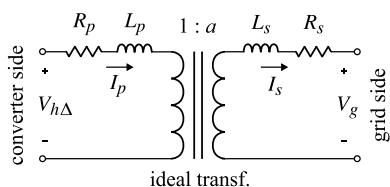  
Fig. 3. Steinmetz’s equivalent circuit used for the interconnection transformer.

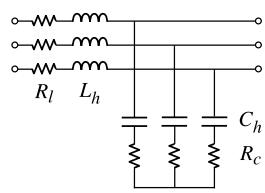  
(a)

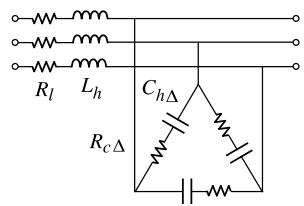  
(b)

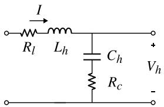  
Fig. 4. Common topologies of harmonic filters. (a) Y-connected LC filter. (b) ??-connected LC filter.   
Fig. 5. Equivalent circuit of the harmonic filter.

terms in (1) of the capacitor voltages. Note that the equivalent series resistance $R _ { l }$ of the inductors do not contribute to the initialization.

The current ?? flowing through the phase ?? of the inductors $L _ { h }$ can be calculated by

$$
I = \sqrt {3} \exp \left(- j \frac {\pi}{6}\right) I _ {p} + \frac {j \omega_ {0} C _ {h} V _ {h}}{1 + j \omega_ {0} C _ {h} R _ {c}} \tag {7}
$$

Those flowing through the phase ?? and ?? can be calculated by multiplying exp $( \mp j { \frac { 2 \pi } { 3 } } )$ , and the value at time zero for each inductor current is obtained to set the $x _ { 0 }$ term in (1).

# 3.2. Initialization of the converter part

As shown in Fig. 6, the converter part is composed only of semiconductor switches and diodes. There is no need to initialize the diodes. Regarding the semiconductor switches, their initial ON/OFF states should be set for better initialization, but its impact on the simulation result is quite small. This is because the simulation time step used for EMT simulations with VSCs is fairly small. This point will be mentioned in Section 5.

# 3.3. Initialization of the DC circuit part

The DC circuit part is composed of a DC capacitor bank only. Its voltage is controlled by the control system, and the voltage is regulated to a value designated by the user. In most cases, the value is the rated DC voltage of the converter. There may be a small ripple superimposed on the DC capacitor voltage, but it is small in a steady state and can be ignored in the initialization process. When several capacitors are used to form the DC capacitor bank and connected in series, their voltages are controlled to be equal. Once the voltage to which the voltage value of the DC capacitor bank is regulated is obtained, the voltage across the capacitor is initialized so that its $x _ { 0 }$ term in (1) is set to that value.

# 4. Initialization of the control-system part

As shown in Fig. 7, a generic control system is assumed, which can be further divided into the voltage/current measurement blocks, the ??????–???? transformation blocks, the phase locked loop (PLL) block, the regulator blocks, and the pulse width modulation (PWM) signal generator block. A selector is used to choose one of the Automatic reactive power Regulator (AQR) and the AC Automatic Voltage Regulator

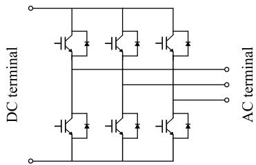  
Fig. 6. Converter circuit.

(ACAVR) block, as these blocks cannot be used simultaneously. This section describes systematic procedures to initialize those components. Note that only dynamic components whose outputs are dependent on their past-history values require initialization. Since the outputs of the remaining components can readily be calculated by their inputs using algebraic or logical expressions, they do not require initialization. By the way, it is interesting to note that a VSC can be represented by an impedance including its control system for stability analysis [17].

# 4.1. Voltage/current measurement blocks

They are used to measure the voltage of the DC capacitor bank and the voltages and currents at the grid connection point as the inputs to the control-system part. Any actual (physical) voltage or current measurement device is subject to a delay in its time response, and this delay must be represented in the model. In most cases, the delay can be approximated by a first-order low-pass filter (LPF) with sufficient accuracy. The transfer function of an LPF is expressed by the following rational function of ???? [18]

$$
H (j \omega) = \frac {1}{1 + j \omega \tau} \tag {8}
$$

where ?? is the time constant of the LPF. Since the control system generally uses per-unit quantities, the output from the LPF is multiplied by a constant ?? so as to convert a volt-based voltage or an amperebased current into its per-unit counterpart. Fig. 8 shows the voltage/current measurement block, where ?? is the input voltage/current in volt/ampere and ̂?? is the output voltage/current in per-unit.

Since the LPF block is a dynamic one, it must be initialized. The steady-state voltage of the DC capacitor bank is given by the user. It is usually the rated voltage of the DC capacitor bank. The AC steadystate voltages and currents at the grid connection point are obtained at Stage 2. Once those DC and AC steady-state voltages and currents are obtained, each value is substituted as the input to (8) in the ???? domain to obtain its output. Using the output value in the ???? domain, the time-domain value at time zero is calculated. With this value, the $x _ { 0 }$ term in (1) of the LPF block output is initialized for the subsequent EMT calculation.

# 4.2. ??????–???? Transformation blocks

Among the voltages and currents measured by the voltage/current measurement blocks mentioned above, the three-phase voltages and currents are transformed from the ?????? to the ???? domain by the ??????–???? transformation blocks. This is because the main controls carried out by the regulator blocks are performed in the $d q$ frame.

Since the ??????–???? transformation blocks which do not include differential equations thus are not dynamic blocks, those blocks do not require initialization. However, the accuracy of the phase angle which is one of the input variables of these blocks gives a significant impact on the accuracy of their outputs. Therefore, the accuracy of the phase angle identified by the PLL block mentioned in the following subsection is the key to perform accurate ??????–???? transformation.

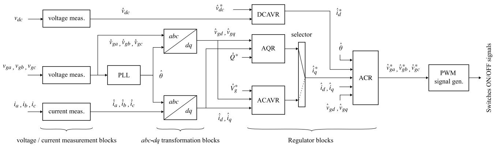  
Fig. 7. Entire structure of the control-system part.

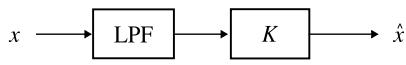  
Fig. 8. Voltage/current measurement block.

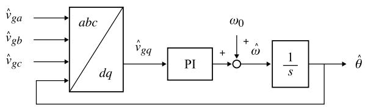  
Fig. 9. PLL block.

# 4.3. PLL block

The PLL block identifies the phase angle of the voltage at the grid connection point, and the identified phase angle is used for the synchronization of the regulator blocks described below. Fig. 9 shows the diagram of the PLL block used [19,20]. It is composed of an ??????–???? transformation block mentioned in the previous subsection, a proportional–integral (PI) controller and an integrator. It identifies the phase angle so that the ?? component becomes zero.

The PLL block includes the PI controller and the integrator which are dynamic, and thus those components must be initialized. Since the output from the PI controller is the angular frequency deviation, its steady-state value should be zero. Therefore, the $x _ { 0 }$ term in (1) of the PI controller output is set to zero. On the other hand, the output from the integrator will converge to the following value

$$
\hat {\theta} = \theta + \angle H (j \omega) \tag {9}
$$

where ?? is the phase angle of the voltage at the grid connection point and $\angle H ( j \omega )$ is the phase angle of (8) at the power frequency. The value of ??̂ calculated by (9) is set to the $x _ { 0 }$ term in (1) of the integrator output.

# 4.4. Regulator blocks

There are four major regulator blocks in the control system part: DC Automatic Voltage Regulator (DCAVR), Automatic reactive power Regulator (AQR), AC Automatic Voltage Regulator (ACAVR), and Automatic Current Regulator (ACR).

Fig. 10 shows the DCAVR block. The PI controller requires initialization, since it is a dynamic one. In the steady state, the DC voltage $\hat { v } _ { d c }$ multiplied by the DC current $\hat { i } _ { d } ^ { * }$ that is the output from this PI controller should match the active power ${ \hat { P } } ^ { * }$ designated to this VSC. Therefore, the initial value of $\hat { i } _ { d }$ can be calculated by

$$
\hat {i} _ {d} = \frac {\hat {P}}{\hat {V} _ {\mathrm {g}}} \tag {10}
$$

and it is set to the $x _ { 0 }$ term in (1) of the PI controller output.

Fig. 11 shows the AQR block in which the PI controller requires initialization. The reactive power $\hat { Q }$ is calculated by multiplying the ??-axis voltage $\hat { v } _ { g d }$ and the ??-axis current $\hat { i } _ { q } ,$ and this value is controlled

to match $\hat { Q } ^ { * }$ designated to this VSC. In the steady state, $\hat { Q }$ reaches $\hat { Q } ^ { * }$ , and therefore, the ??-axis current can be calculated by

$$
\hat {i} _ {q} = \frac {\hat {Q}}{\hat {V} _ {g}} + \omega_ {0} \hat {C} _ {h} \hat {V} _ {h} \tag {11}
$$

where the second term is due to the harmonic filter. The value obtained by the equation above is set to the $x _ { 0 }$ term in (1) of the PI controller output.

Fig. 12 shows the ACAVR block. In the first half of the process, the voltage magnitude is calculated by $\hat { v } _ { g d }$ and $\hat { v } _ { g q }$ and then compared with its designated value ${ \hat { V } } _ { g } ^ { * } .$ . The ??-axis current $\hat { i } _ { q }$ is controlled so that the voltage magnitude reaches $\hat { V } _ { g } ^ { * }$ by the final PI controller which requires initialization. In the steady state, $\hat { V } _ { g }$ reaches $\hat { V } _ { g } ^ { * } ;$ , and therefore, the ??- axis current can be calculated by (11), and it is set to the $x _ { 0 }$ terms in (1) of the PI controller output.

Although the preceding three blocks are similar, the ACR block shown in Fig. 13 has a different structure. It consists of two proportional–integral–differential (PID) controllers (one for the ??-axis current and the other for the ??-axis current), crossing feed-forward blocks, and a ????–?????? transformation block. Among them, only the integration part of the two PID controllers require initialization. Since the outputs from the PID controllers become zero in the steady state, their $x _ { 0 }$ terms in (1) are set to zero.

# 4.5. PWM signal generator block

The PWM signal generator block shown in Fig. 14 is based on a generic triangular-carrier comparison with a third-harmonics injection for increasing voltage efficiency. Dead-time generators, which are dynamic blocks, are used to generate the ON/OFF signals of the semiconductor switches of the converter. Since the impact on the simulation result is quite small, the initialization may be omitted.

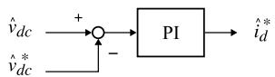  
Fig. 10. DCAVR block used for the control of the DC voltage.

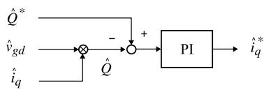  
Fig. 11. AQR block used for the control of the reactive power injected in the grid.

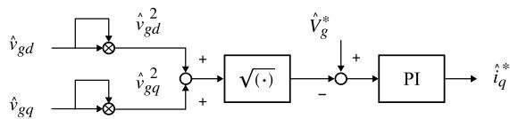  
Fig. 12. ACAVR block for the control of the voltage at the grid connection point.

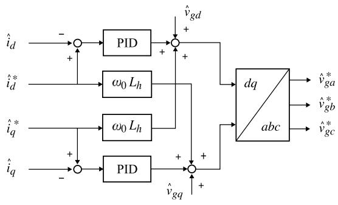  
Fig. 13. ACR block used to control the current.

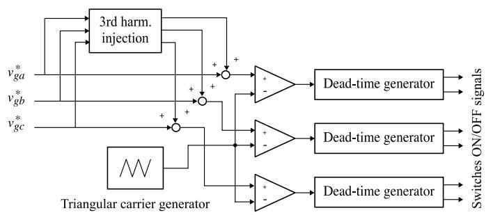  
Fig. 14. PWM signal generator block.

# 5. Simulation results

For the validation of the proposed procedure, EMT simulations are carried out for a 6.6-kV distribution grid with two VSCs, one for representing the power conditioning system (PCS) of a photovoltaic (PV) power generation system and the other for representing a STATic synchronous COMpensator (STATCOM). The simulations are performed using the eXpandable Transient Analysis Program (XTAP) [21]. Fig. 15 shows the distribution grid. A time step of 0.5 μs is used for all simulations. The distribution substation is represented by a three-phase

50-Hz, 6.7-kV voltage sources with series inductances. The total length of the distribution line is 18.5 km, and the three wires are horizontally arranged at a height of 11.5 m with a separation of 72.5 cm. As shown in Fig. 15, the wires are OC 150 mm2 or OC 60 mm2, and a ground resistivity of 100 Ωm is assumed. With these conditions, ??-equivalents are created for the distribution-line sections by calculating the line constants [22]. The PCS of the PV power generation system injects 1.8 MW of power into the distribution grid. The PV array is represented by a DC current source, and the PCS is operated in the AQR mode with the reference reactive power set to zero. The STATCOM is used to prevent the grid voltage from exceeding the operating range. It is operated in the ACAVR mode with the reference voltage set to 1 pu, which is 6.6 kV.

Fig. 16 shows the calculated result without the proposed initialization procedure, where the initial values of the variables requiring initialization have been set to zero. On the other hand, Fig. 17 shows the calculated result with the proposed initialization procedure. Discussions on these results will follow in the next section.

# 6. Discussions

As observed from Fig. 16, without the proposed initialization procedure, the VSCs do not reach their steady states within 300 ms which is the maximum simulation time. Initially, the voltages and currents of the PCS and the STATCOM quickly increase from zero until ?? = 150 ms. Since the voltages and currents are the input to the control system part as the feedback, variables in the control system part diverge due to the large input values. Then, the voltages and currents of the PCS and the STATCOM converge to operating points which are different from the correct ones. It is interesting to note that the voltage waveforms are highly distorted with low harmonics due to the wrong operating points.

As observed from Fig. 17, with the proposed initialization procedure, both VSCs namely the PCS and the STATCOM immediately reach their steady states after a fairly small transient. This transient occurs due to the fact that the initialization of the ON/OFF states of the semiconductor switches is omitted as mentioned in Section 4.5. But the impact is negligible.

From the simulation results, the effectiveness of the proposed procedure is obvious. In addition, it should be noted from Fig. 17 that necessary harmonics quickly develop in the waveforms right after starting the simulation at ?? = 0 although harmonics are not considered in the proposed initialization procedure.

# 7. Conclusion

To start an EMT simulation of a modern transmission or distribution power grid with VSCs directly from the steady state, this paper has proposed a systematic and heuristic procedure for the steady-state initialization of a VSC. Using an AC steady-state solution obtained by the EMT simulation software, detailed portions of the power-circuit part of a VSC including the DC side and the control-system part are systematically initialized, and the EMT simulation can be performed directly from the steady state. For the validation of the proposed procedure, EMT simulations have been carried out for a 6.6-kV distribution grid with two VSCs, and the following result has been obtained. The EMT simulation case with the proposed initialization procedure immediately reaches the steady state right after the beginning of the simulation, while the same simulation case without an initialization procedure does not reach the steady state within 300 ms which is the maximum simulation time in the case of this paper.

The proposed initialization procedure is applicable only to generic VSCs as also mentioned in the title of this paper. Of course, it cannot be applicable to specific types of control system. This may be considered as a limitation. As future work, the proposed method will be extended to include generic three-level converters and MMCs. In addition, a comparison with other methods is considered an important future work.

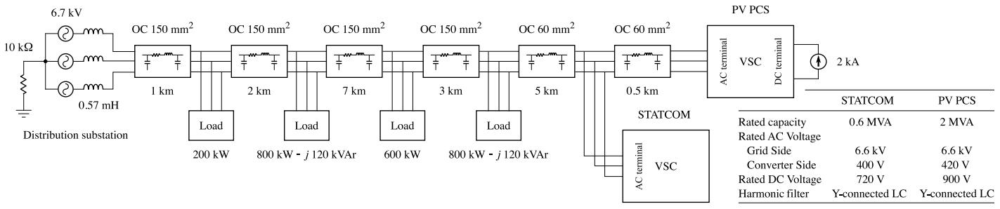  
Fig. 15. 6.6-kV distribution grid with two VSCs.

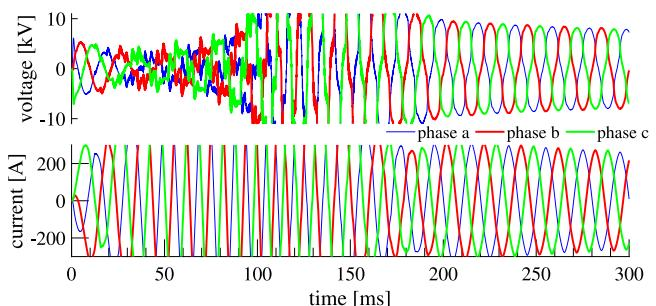

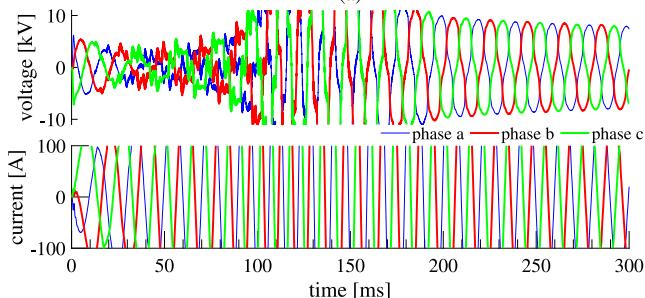  
  
（b）

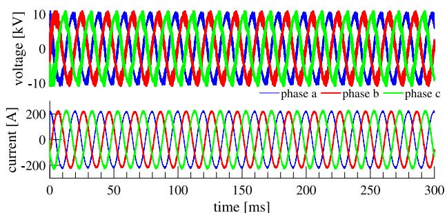  
Fig. 16. Calculated result without the proposed initialization procedure. (a) line-to-line voltages and line currents of the PV power generation system. (b) line-to-line voltages and line currents of the STATCOM.

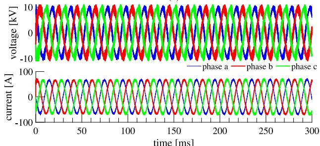  
(a)   
  
Fig. 17. Calculated result with the proposed initialization procedure. (a) line-to-line voltages and line currents of the PV power generation system. (b) line-to-line voltages and line currents of the STATCOM.

# CRediT authorship contribution statement

Guilherme Cirilo Leandro: Writing – original draft, Conceptualization. Taku Noda: Supervision, Writing – review & editing.

# Declaration of competing interest

The authors declare the following financial interests/personal relationships which may be considered as potential competing interests: The authors report support was provided by Hokkaido Electric Power Company, Tohoku Electric Power Company, Tokyo Electric Power Company Holdings, Hokuriku Electric Power Company, Chubu Electric Power Company, Kansai Electric Power Company, Chugoku Electric Power Company, Shikoku Electric Power Company, Kyushu Electric Power Company, and Okinawa Electric Power Company.

# Data availability

We can ask the sponsors to disclose the data.

# Appendix A. Initialization in the case of 2S-DIRK

The value of the state variable ?? at time zero, or $x _ { 0 } ,$ , is also required in the case where the 2-stage diagonally implicit Runge–Kutta (2S-DIRK) method [16] is used for the numerical integration of the EMT simulation. The 2S-DIRK method performs numerical integration using two stages. In the first stage, the value of $x _ { 0 }$ is required to proceed from $t = 0 \ t _ { 0 } \ t = ( 1 - 1 / { \sqrt { 2 } } ) h$ at the beginning of the EMT simulation in the same way as the trapezoidal method.

# Appendix B. Consideration of the magnetizing circuit

When the magnetizing circuit consisting of a magnetizing inductance $L _ { m }$ and a core-loss resistance $R _ { m }$ in parallel is considered in the interconnection transformer, $L _ { m }$ must be initialized. The current $I _ { m }$ of $L _ { m }$ from phase ?? to ?? is

$$
I _ {m} = \frac {I _ {s} (R _ {s} + j \omega_ {0} L _ {s}) + V _ {g}}{j \omega_ {0} L _ {m} a}
$$

and (3) can be brought to

$$
I _ {p} = a I _ {s} + I _ {m} + \frac {I _ {s} \left(R _ {s} + j \omega_ {0} L _ {s}\right) + V _ {g}}{R _ {m} a}
$$

In the same way described in Subsection 3.1(1), the initialization of the magnetizing inductances of all windings can be performed.

# References

[1] A. Yazdani, R. Iravani, Voltage-Sourced Converters in Power Systems: Modeling, Control, and Applications, Wiley-IEEE Press, 2010.   
[2] J. Mahseredjian, I. Kocar, U. Karaagac, Solution techniques for electromagnetic transients in power systems, in: Transient Analysis of Power Systems: Solution Techniques, Tools and Applications, Wiley-IEEE Press, 2015.   
[3] J.A. Martinez-Velasco, Digital computation of electromagnetic transients in power systems: current status, in: IEEE Power and Energy Society, Tech. Rep. PES-TR7 Modeling and Analysis of System Transients Using Digital Programs Part 1, 1–1–1-19, 1998.   
[4] K.W. Louie, A. Wang, P. Wilson, P. Buchanan, Discussion on the initialization of the EMTP-type programs, in: Proc. 2005 Canadian Conf. on Electrical and Computer Engineering, pp. 1962–1965.   
[5] D.A. Woodford, A.M. Gole, R.W. Menzies, Digital simulation of DC links and AC machines, IEEE Trans. Power Appar. Syst. PAS-102 (6) (1983) 1616–1623.   
[6] J. Mahseredjian, S. Dennetière, L. Dubé, B. Khodabakhchian, L. Gérin-Lajoie, On a new approach for the simulation of transients in power systems, Electr. Power Syst. Res. 77 (2007) 1514–1520.   
[7] T. Noda, K. Takenaka, A practical steady-state initialization method for electromagnetic transient simulations, in: Proc. 2011 IPST Netherlands, pp. 1–7.   
[8] B.K. Perkins, J.R. Marti, H.W. Dommel, Nonlinear elements in the EMTP: Steady-state initialization, IEEE Trans. Power Syst. 10 (2) (1995) 593–601.   
[9] T. Noda, A. Semlyen, R. Iravani, Entirely harmonic domain calculation of multiphase nonsinusoidal steady state, IEEE Trans. Power Deliv. 19 (3) (2004) 1368–1377.   
[10] K.L. Lian, T. Noda, A time-domain harmonic power-flow algorithm for obtaining nonsinusoidal steady-state solutions, IEEE Trans. Power Deliv. 25 (3) (2010) 1888–1898.   
[11] K.L. Lian, P.W. Lehn, Steady-state solution of a voltage-source converter with full closed-loop control, IEEE Trans. Power Deliv. 21 (4) (2006) 2071–2081.

[12] K.L. Lian, M. Syai’in, Steady-state solutions of a voltage source converter with DQ-frame controllers by means of the time-domain method, IEEJ Trans. Electr. Electron. Eng. 9 (2) (2014) 165–175.   
[13] A. Ramirez, G.C. Lazaroiu, Fast steady-state computation of electrical networks involving nonlinear and photovoltaic components, IEEE Trans. Smart Grid 12 (4) (2021) 3107–3114.   
[14] A. Stepanov, H. Saad, U. Karaagac, J. Mahseredjian, Initialization of modular multilevel converter models for the simulation of electromagnetic transients, IEEE Trans. Power Deliv. 34 (1) (2019) 290–300.   
[15] H.W. Dommel, Digital computer solution of electromagnetic transients in singleand multiphase networks, IEEE Trans. Power Appar. Syst. PAS-88 (4) (1969) 388–399.   
[16] T. Noda, K. Takenaka, T. Inoue, Numerical integration by the 2-stage diagonally implicit Runge–Kutta method for electromagnetic transient simulations, IEEE Trans. Power Deliv. 24 (1) (2009) 390–399.   
[17] E. Zhao, Y. Han, X. Lin, P. Yang, F. Blaabjerg, A.S. Zalhaf, Impedance characteristics investigation and oscillation stability analysis for two-stage PV inverter under weak grid condition, Electr. Power Syst. Res. 209 (2022) 108053.   
[18] F.F. Kuo, Network Analysis and Synthesis, John Wiley & Sons, Inc, 1966.   
[19] V. Kaura, V. Blasko, Operation of a phase locked loop system under distorted utility conditions, IEEE Trans. Ind. Appl. 33 (1) (1997) 58–63.   
[20] L.R. Limongi, R. Bojoi, C. Pica, F. Profumo, A. Tenconi, Analysis and comparison of phase locked loop techniques for grid utility applications, in: Proc. 2007 Power Conversion Conf. - Nagoya, pp. 674–681.   
[21] T. Noda, K. Takenaka, T. Inoue, Numerical integration by the 2-stage diagonally implicit Runge–Kutta method for electromagnetic transient simulations, IEEE Trans. Power Deliv. 24 (1) (2009) 390–399.   
[22] T. Noda, Numerical techniques for accurate evaluation of overhead line and underground cable constants, IEEJ Trans. Electr. Electron. Eng. 3 (5) (2008) 549–559.