# Parallel Massive-Thread Electromagnetic Transient Simulation on GPU

Zhiyin Zhou, Student Member, IEEE, and Venkata Dinavahi, Senior Member, IEEE

Abstract—The electromagnetic transient (EMT) simulation of a large-scale power system consumes so much computational power that parallel programming techniques are urgently needed in this area. For example, realistic-sized power systems include thousands of buses, generators, and transmission lines. Massive-thread computing is one of the key developments that can increase the EMT computational capabilities substantially when the processing unit has enough hardware cores. Compared to the traditional CPU, the graphic-processing unit (GPU) has many more cores with distributed memory which can offer higher data throughput. This paper proposes a massive-thread EMT program (MT-EMTP) and develops massive-thread parallel modules for linear passive elements, the universal line model, and the universal machine model for offline EMT simulation. An efficient node-mapping structure is proposed to transform the original power system admittance matrix into a block-node diagonal sparse format to exploit the massive-thread parallel GPU architecture. The developed MT-EMTP program has been tested on large-scale power systems of up to 2458 three-phase buses with detailed component modeling. The simulation results and execution times are compared with mainstream commercial software, EMTP-RV, to show the improvement in performance with equivalent accuracy.

Index Terms—Electromagnetic transient analysis, graphics processors, massive-thread, parallel algorithms, parallel programming, power system simulation.

# I. INTRODUCTION

HE USE of electromagnetic transient (EMT) simulation tools is no longer restricted to specialized studies that focus on analyzing the propagation of EM transients. Due to their versatility and breadth of modeling capability, offline EMT simulation tools, such as EMTP-RV [1], PSCAD/EMTDC [2], Alternative Transients Program (ATP) [3] etc., are routinely used in the planning, design, and operation of power systems, to study dynamic phenomena over a wide frequency range—from steady-state studies, such as load flow and harmonic analysis, to high-frequency studies, such as restrike overvoltages in gas-insulated substations [4]. Along with modeling and application diversity, the size of the power system simulated by EMT tools has grown concomitantly [5]. These days, it

Manuscript received August 16, 2012; revised May 08, 2013, July 12, 2013, and October 22, 2013; accepted December 23, 2013. Date of publication February 17, 2014; date of current version May 20, 2014. This work is supported by the Natural Science and Engineering Research Council of Canada (NSERC). Paper no. TPWRD-00863-2012.

The authors are with the Department of Electrical and Computer Engineering, University of Alberta, Edmonton, AB T6G 2V4 Canada (e-mail: zhiyin@ualberta.ca; dinavahi@ualberta.ca).

Color versions of one or more of the figures in this paper are available online at http://ieeexplore.ieee.org.

Digital Object Identifier 10.1109/TPWRD.2013.2297119

is not uncommon to simulate in detail systems containing hundreds of buses using such tools. Nevertheless, the common characteristic of the aforementioned EMT simulation tools is that they are single-thread sequential programs designed to run efficiently on single-core CPUs based on the x86 processor architecture. Throughout the 1990s and 2000s, the CPU clock speed steadily increased and memory costs decreased, fueling a sustained increase in the speed of these programs. But now with the clock speed saturated around 3 GHz due to chip power dissipation and fabrication constraints, the computer industry has transitioned to multicore CPU and many-core GPU hardware architectures, which require multithread parallel programming. Executing a single-thread EMT program on a multicore architecture is inefficient because the code is executed on a single core, one instruction after another in a homogeneous fashion, unable to exploit the full resource of the underlying hardware. The overall performance of the code can be severely degraded especially when simulating large-scale systems with high data throughput requirements. A multithread parallel code can provide substantial gain in speed and throughput over a single-thread sequential code on the multicore architecture. Even on single-core processor systems, multiple threads can add palpable performance improvement in some applications. What this means for the EMT program is that the system component models and the EMT algorithm need to be reformulated to be executed in parallel on multiple cores. Since data independence is the key requirement for efficient parallel programming, the serial component models and network data structure have to be transformed to meet this requirement. Although the focus of this paper is offline EMT simulation, it is worth mentioning that real-time EMT simulation tools are available, such as RSCAD and Hypersim, etc., which can also run offline simulations on multicore CPUs. However, these tools do require specialized expensive hardware to run real-time EMT simulation.

In this paper, we propose a GPU-based parallel massive-thread EMT simulation program (MT-EMTP). The GPU [6]–[8] has native parallel many-core processing units and high-performance floating-point number processors. To circumvent understanding the cumbersome assembly language of GPU, compute unified device architecture (CUDA) [9], a general-purpose parallel computing environment, was introduced by NVIDIA to offer an efficient C-like language to develop an application. Researchers have already begun to exploit GPUs for power system applications [10]–[18], such as data visualization, load-flow computations, electromagnetic transient, and transient stability simulations. The objective of this paper is to develop massive-thread parallel modules for

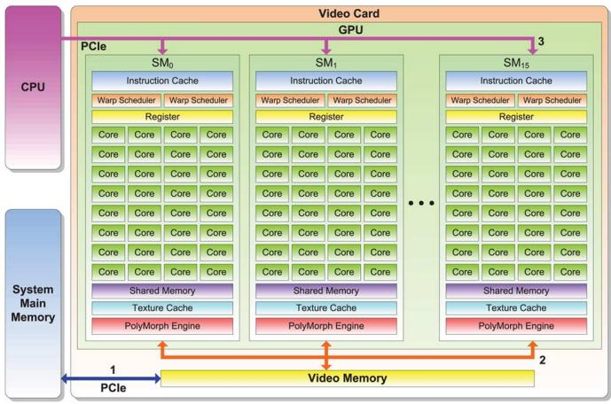  
Fig. 1. GPU hardware architecture: 1) data transmission between host and device, 2) data dispatched to/from many cores, and 3) control instruction dispatch.

three ubiquitous and computationally demanding system components for EMT simulation: linear passive elements (LPE), the universal line model (ULM), and the universal machine model (UMM). A new efficient node mapping structure (NMS) is proposed to reorder the original power system bus numbers using the block-node adjustment (BNA) method to obtain a block diagonal pattern for the system admittance matrix that is ideally suited for the GPU-based massive-thread parallel architecture. The performance of the developed parallel EMT program was evaluated for accuracy, computational efficiency, and scalability by using several large-scale test power systems, and compared with the EMTP-RV software program.

This paper is organized as follows: Section II describes the key features of the GPU and CUDA, which enable the design of the parallel component models and the proposed data structure used in the EMT simulation. Section III gives the details of the parallel massive-thread component models. Section IV explains the NMS using the BNA method and the sparse linear network solution. Then, the experimental results for various large-scale test systems are shown and compared with EMTP-RV. Finally, Section V gives the conclusion.

# II. GPU ARCHITECTURE AND CUDA ABSTRACTION

Since the most advanced concept, the Fermi architecture (shown in Fig. 1) [6] of the GPU from NVIDIA, is chosen for developing the parallel massive-thread modules for EMT simulation, it consists of several streaming multiprocessors (SMs). Each SM is.populated with many compute cores which share the registers, caches, and dedicated memory inside the SM. Since the GPU is designed to work as a coprocessor, all data and instructions come from the CPU via the PCIe interface.

In order to make every core in the GPU work efficiently, enough data must be fed to catch up to the instruction cycles; without data input, the cores can only remain idle, thus reducing computing speed. Since the GPU has far more (hundreds) cores than the CPU, the data bandwidth requirement is increased tremendously. However, the system main memory and the video memory cannot offer that ideal bandwidth; therefore, specific memory access routes have to be followed to reach the optimal speed. The data-transmission paths between the

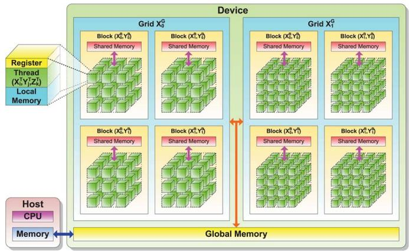  
Fig. 2. CUDA abstraction.

memories, that is, path 1 and path 2 in Fig. 1 are the main bottlenecks of the architecture. As explained later, the proposed massive-thread parallel EMT modules are designed to minimize the use of these paths in order to maximize computational efficiency.

CUDA is the programming tool used to implement the parallel program without dealing with the GPU assembly language. The details of the GPU hardware are taken care of by CUDA’s mapping and abstraction, as shown in Fig. 2. A CUDA program (kernel) separates the hardware resources into two parts: CPU side as the host, on which the serial parts of the program run, and the GPU side as the device, on which the parallel parts of the program run.

In the CUDA thread hierarchy, Grid, Block, and Thread map to GPU, SM, and Core, respectively. However, the user need not be concerned with the actual number of GPUs, SMs, and Cores since the number of abstracted threads are automatically assigned to the physical cores in parallel or serial fashion. Therefore, even if the GPU used has fewer cores than what the CUDA program requires, the programmer can still claim the number of threads needed. The developed parallel EMT program can adapt to various CUDA-supported GPUs with a varying number of cores without change. A group of threads makes up a block, and a group of blocks makes up a grid. All threads inside a grid execute the same instruction simultaneously with multiple data input, which requires complete data independence and unified processing flow in the kernel. This is known as the single instruction multiple data (SIMD) format. On the other hand, the single-instruction multiple thread (SIMT) enables the program with thread-level parallel code for independent, scalar threads [9], thereby allowing the GPU to handle multiple branches and operations in a single instruction. The developed parallel EMT component modules and the sparse linear solver utilize the SIMD and SIMT concepts.

In the CUDA memory hierarchy, each thread has its own register and local memory. Threads of the device cannot access the host memory directly due to it being on the CPU side. Thus, all data that are processed by the GPU have to be first copied into the global memory of the device. Since the global memory (video memory) is not on-chip though it is onboard, accessing it is relatively inefficient. Shared memory, which is much faster than global memory, is offered for each block, which can be

accessed by all threads in the block. Thus, using this limited resource (48 kB/block) wisely can effectively optimize the performance of the program. The advanced Fermi architecture (compute capability 2.0 and above) offers a data cache which requires a well-organized data input to maximize access speed. In the global and shared memories, a memory address normally can only be accessed once in an instruction cycle, especially for write operation. Therefore, simultaneous multiple and random memory access should be avoided in the CUDA kernel because not all threads can guarantee that their memory access is safe. Furthermore, unlike the previous GPU generations, the Fermi architecture enables the execution of multiple kernels simultaneously for increased efficiency.

Thus, these are the aforementioned considerations of the GPU architecture and CUDA that the design of the data structure and parallel modules for massive-thread EMT simulation is based on.

# III. PARALLEL MASSIVE-THREAD COMPONENT MODELS

# A. Linear Passive Elements

1) Model Formulation: Linear passive elements (LPEs), such as resistance, inductance, capacitance, switches, and their combinations, are represented by a discrete-time lumped model [19]. As mentioned in Section II, since all threads in a kernel run the same instruction concurrently, a unified model is required for all LPEs in the system. Using the trapezoidal rule of integration, any LPE combination can be modeled as a discrete Norton equivalent circuit, comprised of an equivalent conductance and a history current source. In the unified model, every LPE has an R, $\mathrm { L , }$ or C character. An arbitrary LPE shown in Fig. 3(a) can be represented as an $\mathrm { ~ R , ~ L , }$ and C Thévenin equivalent circuit as shown in Fig. 3(b), where $R _ { \mathrm { e q } } ^ { R }$ is the equivalent resistance of R, $R _ { e q } ^ { C }$ is the equivalent resistance of $\mathrm { C } , R _ { e q } ^ { L }$ is the equivalent resistance of L, $V _ { h } ^ { C }$ is the capacitive history voltage, and $V _ { h } ^ { L }$ is the inductive history voltage. Depending on the LPE character, constant flag coefficients can be defined, for example, $p ^ { L }$ and $p ^ { C }$ for the L or C character. Source transformation results in the unified Norton equivalent circuit are shown in Fig. 3(c), where $G _ { \mathrm { e q } }$ is the total equivalent conductance and $I _ { h }$ is the history current source of the unified model [21]. The LPE current is given as

$$
i (t) = G _ {\mathrm {e q}} v (t) + I _ {h} (t - \Delta t). \tag {1}
$$

With the unified LPE lumped model, all linear elements can be processed in the same kernel.

2) Massive-Thread Parallel Implementation: Fig. 4 shows the designed parallel module for unified LPE computation. For each LPE, a CUDA thread is assigned to execute the computation based on the SIMT format. When the number of LPEs exceeds the limitations of thread per block , they will be divided into groups assigned to multiple blocks

$$
m = \left[ \frac {n - 1}{k} \right] + 1, \tag {2}
$$

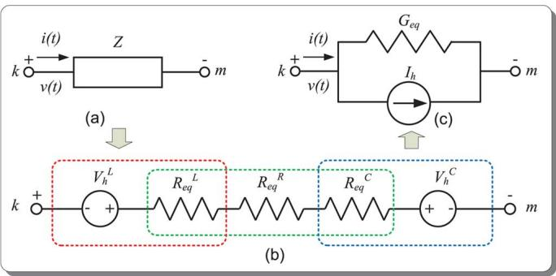  
Fig. 3. Unified linear passive element lumped model.

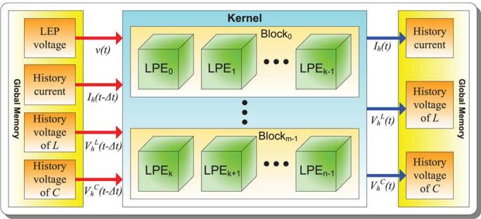  
Fig. 4. Massive-thread parallel unified LPE module.

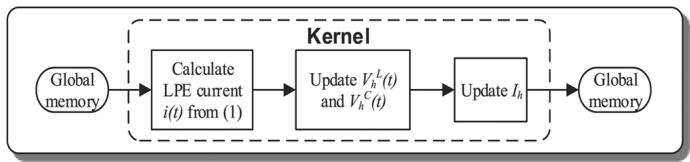  
Fig. 5. Kernel operation flow in the unified LPE module.

where and are integers. The operation flow of the LPE kernel is shown in Fig. 5.

# Algorithm III.1: ULPE_Kernel $( k , m , n )$

Assign blocks

Assign threads per block

Config Shared Memory

Shared Memory Global Memory

（foreachThread∈ BlockTask1 $i  G _ { e q } \times v + I _ { h }$ synchronization

$\int V _ { h } ^ { L }  p _ { 1 } ^ { L } \times \bar { V } _ { h } ^ { L } + p _ { 2 } ^ { L } \times R _ { e q } ^ { L } \times i$ Task2 $\Big \{ V _ { h } ^ { C }  p _ { 1 } ^ { C } \times V _ { h } ^ { C } + p _ { 2 } ^ { C } \times R _ { e q } ^ { \dot { C } } \times i$ （synchronization

(foreach Thread ∈ Block Task3 $I _ { h }  G _ { e q } \times ( V _ { h } ^ { L } + V _ { h } ^ { C } )$ (synchronization

Global Memory Shared Memory

Algorithm III.1 shows the pseudocode for the CUDA kernel of the unified LPE module. Inside the kernel, there are three sequential tasks with the same CUDA thread and memory configuration. First, the LPE current is computed from (1), then the inductive and capacitive history voltages $V _ { h } ^ { L } ( t )$ and ${ V } _ { h } ^ { C } ( t )$ are calculated and, finally, the history current $I _ { h }$ is updated.

The only global memory accesses are reading the input variables and writing the output variables, and all computations of LPE take place inside the threads. During the EMT simulation, all variables are stored and reused on the device side; thus, the host-device and device-host data transmission is minimized in each timestep.

# B. Transmission Lines

1) Model Formulation: The universal line model (ULM) is a phase-domain wideband fully frequency-dependent line model [24] capable of representing symmetrical and asymmetrical overhead transmission lines and underground cables. Traditional frequency-dependent transmission-line models [22] were constituted in the modal-domain based on real and constant transformation matrices with a frequency-dependent model for the traveling waves. These models are mainly suited for symmetrical (transposed) lines and cables. The transformation matrix of untransposed lines is, in general, complex and frequency dependent; nevertheless, such models can also be applied to untransposed conditions after appropriate numerical modifications, including eigenvector rotations, to make the coefficients in the transformation matrices real and constant. The ULM avoids the transformation matrices and is constituted directly in the phase domain; however, it involves computationally expensive convolutions.

The ULM represents the sending-end $" k "$ and the receiving-end $^ { \circ } m ^ { \prime \prime }$ of a line of arbitrary length, shown in Fig. 6(a), as two decoupled Norton equivalent circuits, as shown in Fig. 6(b). The ULM current is given as

$$
\boldsymbol {i} (t) = \boldsymbol {G} _ {Y} \boldsymbol {v} (t) - \boldsymbol {I} _ {h} \tag {3}
$$

where $G _ { Y }$ is the equivalent conductance matrix and the history currents $I _ { h }$ are expressed as

$$
\boldsymbol {I} _ {h} = \boldsymbol {Y} * \boldsymbol {v} (t) - 2 \boldsymbol {H} * \boldsymbol {i} _ {r} (t - \tau) \tag {4}
$$

where the reflected current $\dot { \pmb { \imath } } _ { r }$ is defined as

$$
\boldsymbol {i} _ {r} = \boldsymbol {i} (t) - \boldsymbol {i} _ {i} \tag {5}
$$

where $\mathbf { \delta } _ { i }$ is the incident current [24].

In (4), the characteristic admittance matrix and propagation matrix are approximated by the finite-order rational functions using the vector-fitting (VF) method [26]; the $^ { \dag \ell } \ast ^ { \dag \mathrm { , ~ } }$ denotes the numerical complex matrix-vector convolution. The numerical convolution $Y * v ( t )$ is defined as

$$
\boldsymbol {Y} * \boldsymbol {v} (t) = \boldsymbol {c} _ {Y} \boldsymbol {x} _ {Y} (t) \tag {6}
$$

where the coefficient matrix $c _ { Y }$ can be obtained from the residues $\pmb { r } _ { Y }$ and the coefficients $\pmb { \alpha } _ { Y }$ which are, in turn, functions of the poles $\mathbf { \Delta } _ { \pmb { p } _ { Y } , \pmb { \cdot } }$ and the state variables $\pmb { x } _ { Y }$ are obtained

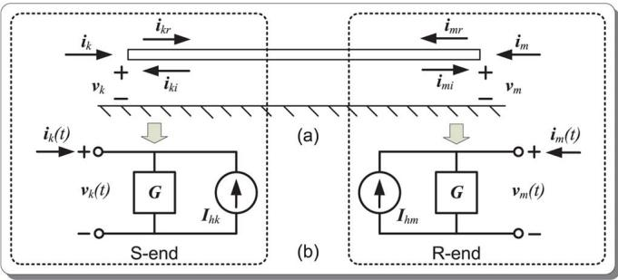  
Fig. 6. Universal line model.

from the coefficients $\pmb { \alpha } _ { Y }$ and line voltages . Similarly, the numerical convolution $\pmb { H } * \pmb { i } _ { r } ( t - \tau )$ is defined as

$$
\boldsymbol {H} * \boldsymbol {i} _ {r} (t - \tau) = \boldsymbol {c} _ {H} \boldsymbol {x} _ {H} (t) + \boldsymbol {G} _ {H} \boldsymbol {i} _ {r} (t - \tau), \tag {7}
$$

where $G _ { H }$ is the propagation matrix of . Since the wave traveling time is not an integral multiple of the time step normally, linear interpolation is used to approximate the reflected current $\pmb { i } _ { r } ( t - \tau )$ .

2) Massive-Thread Parallel Implementation: As shown in Fig. 7, the designed parallel module for the ULM includes eight kernels grouped into four stages. Stage 1 updates the reflected current $\dot { \pmb { \imath } } _ { r }$ and calculates the interpolation for the reflected current before delay , Stage 2 updates the state variable , Stage 3 computes the convolutions, and Stage 4 updates the incident current $\mathbf { i } _ { i }$ and the history current $I _ { h }$ . All of the kernels inside the same stage are executed concurrently in the Fermi architecture space. The computation for each ULM unit is done by a CUDA block running in SIMT, inside which multiple threads are assigned to handle vector and matrix operations based on SIMD. Therefore, every kernel has blocks (the number of ULM units) in every stage, and the number of threads in a block depends on the dimension of computed vectors and matrices, which is typically based on the number of poles and residues from vector fitting. The data are transferred deliberately from the global memory into the shared memory first to improve the memory access performance due to the critical bandwidth requirement of vector and matrix operations.

The kernel operation flow of the ULM module is shown in Fig. 8. Since the thread dimension and shared memory size have to be reconfigured in different tasks, such as in updating variables, interpolation, and convolutions, they are separated into different kernels, and their results are output to global memory and shared with other kernels. Since the parallel computation is based on each ULM unit instead of its sending and receiving ends, ${ \mathrm { a l l } } ^ { \left. } k ^ { \right. }$ and “ ” variables are computed within one kernel, avoiding the data exchange between $" k "$ and $^ { \ast } m ^ { \ast }$ ends. Similar to the LPE module, all of the module variables are limited to the device side, that is, to the global and shared memories of the GPU; thus, there is no data exchange between the host and device during ULM execution.

# C. Electrical Machines

1) Model Formulation: There are several types of rotating machine models that can be used for EMT studies. The advantage of the unified machine model (UMM) [23], [25] is that

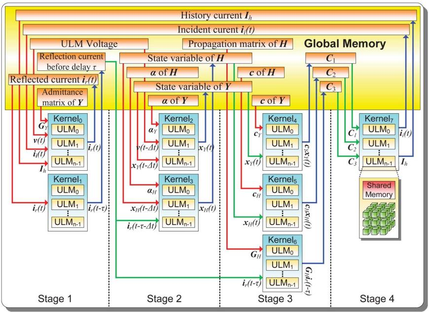  
Fig. 7. Massive-thread parallel ULM module.

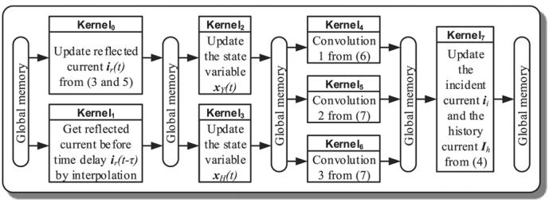  
Fig. 8. Kernel operation flow in the ULM module.

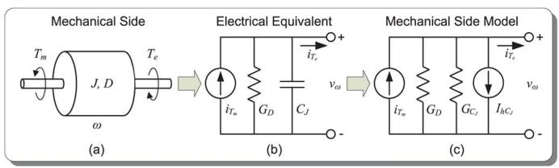  
Fig. 9. Electrical model of the mechanical part of UMM.

it provides a unified mathematical framework to model up to 12 types of rotating machines, including asynchronous, synchronous, and dc machines. The electrical part of the UMM includes the armature and field windings. The UMM is allowed to have up to three armature windings (converted to 3 windings), and an unlimited number of windings on the field structure. The mechanical part of the UMM is modeled as an equivalent lumped electric network, where the electromagnetic torque appears as a current source. An alternate representation of the mechanical part as a multimass model (up to a maximum of 6 masses representing various turbine stages) is also possible.

a) Electrical Part: In the UMM used for synchronous machines in this paper, there are three-phase stator armature windings $\{ a , b , c \}$ , one field winding , up to 2 damper windings $\{ D _ { 1 } , D _ { 2 } \}$ on the rotor direct -axis, and up to three3

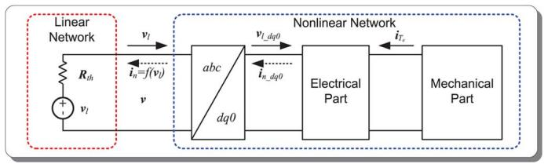  
Fig. 10. Interfacing UMM with the network using compensation.

damper windings $\{ Q _ { 1 } , Q _ { 2 } , Q _ { 3 } \}$ on the rotor quadrature -axis. Thus there are a maximum of nine coupled windings whose discretized winding equations are described as

$$
\boldsymbol {v} _ {d q 0} (t) = - \boldsymbol {R} i _ {d q 0} (t) - \frac {2}{\Delta t} \boldsymbol {\lambda} _ {d q 0} (t) + \boldsymbol {u} (t) + \boldsymbol {V} _ {h} \tag {8}
$$

where is the winding resistance matrix, and $\lambda _ { d q 0 }$ is the flux linkage. The history term $V _ { h }$ using Trapezoidal discretization can be expressed as

$$
\boldsymbol {V} _ {h} = - \boldsymbol {v} _ {d q 0} - \boldsymbol {R} i _ {d q 0} + \frac {2}{\Delta t} \boldsymbol {\lambda} _ {d q 0} + \boldsymbol {u}. \tag {9}
$$

The Park’s transformation orthogonal matrix links the abc phase domain with the rotating reference domain.

b) Mechanical Part: The dynamics of the rotor, as shown in Fig. 9(a), can be represented as a linear electrical equivalent circuit in the UMM instead of the mass-shaft system, as shown in Fig. 9(b), where the torque $T ,$ inertia $J ,$ damping $D ,$ and rotor speed are mapped to the current $i _ { T }$ , capacitance $C _ { J }$ , conductance $G _ { D } ,$ , and voltage $v _ { \omega } ,$ , respectively. The equivalent differential equation is given as

$$
i _ {T _ {m}} = C _ {J} \frac {d v _ {\omega}}{d t} + G _ {D} v _ {\omega} + i _ {T _ {e}}. \tag {10}
$$

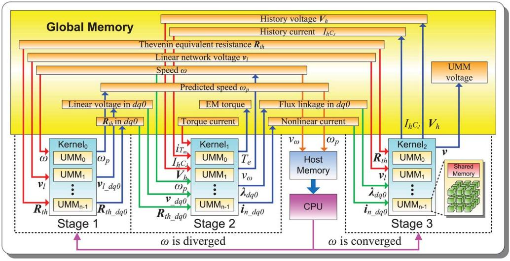  
Fig. 11. Massive-thread parallel UMM module.

Discretizing the lumped equivalent capacitance $C _ { J }$ , the mechanical side model is shown in Fig. 9(c). Thus, the equivalent voltage $v _ { \omega }$ is expressed as

$$
v _ {\omega} (t) = \frac {i _ {T _ {m}} (t) - i _ {T _ {e}} (t) - I _ {h C _ {J}} (t - \Delta t)}{G _ {D} + G _ {C _ {J}}} \tag {11}
$$

where $G _ { C _ { J } }$ is the equivalent conductance and $I _ { h C , J }$ is the history current.

Since the UMM is a nonlinear model which connects to the linear network, the compensation method [20] is used to circuit interface it with the EMT network solution. As shown in Fig. 10, the open-circuit node voltage of the nonlinear component , which is also the Thévenin equivalent voltage of the linear network, is first solved. Considering ${ \pmb v } _ { l }$ as the input to the nonlinear component, the reaction current $\mathbf { i } _ { n }$ from the nonlinear system can be calculated by the relational function $f$ between ${ \mathbf { } } v _ { l }$ and $\dot { \iota } _ { n }$ . Injecting $\dot { \iota } _ { n }$ into the linear network, the node voltage of nonlinear components after compensation is given as

$$
\boldsymbol {v} = \boldsymbol {v} _ {l} + \boldsymbol {R} _ {t h} \boldsymbol {i} _ {n} \tag {12}
$$

where th is the Thévenin equivalent resistance of the linear network looking into the open port from the nonlinear side.

The electromagnetic torque $T _ { e }$ involving the product of fluxes and currents is calculated iteratively. Once the speed has converged, the currents ${ \bf i } _ { n - d q 0 }$ are transferred back to the phase domain as an incident current $\scriptstyle { i _ { n } }$ from the nonlinear network to the linear network.

2) Massive-Thread Parallel Implementation: As shown in Fig. 11, the designed parallel module for the UMM includes three kernels within three stages. Stage 1 predicts the rotor speed $\omega _ { p }$ and transfers the phase-domain inputs into the $d q 0$ reference domain. Stage 2 is responsible for the computations of electrical part and mechanical part, and gets the electromagnetic torque $T _ { e }$ , the nonlinear current $i _ { n \_ d q 0 }$ in $d q 0$ , and the equivalent speed voltage $v _ { \omega }$ . Before proceeding to Stage 3, the convergence of the rotor speed for all UM units is determined by the CPU to avoid the synchronous, efficient, and random memory-access issues arising from the parallel determination, and Stages 1 to

2 are repeated until all UMM units are converged or the maximum number of iterations are reached. Finally, Stage 3 updates the history variables and completes the calculation of the integrated UMM voltage . Similar to the ULM module, each UMM unit occupies a CUDA block running in SIMT, where multiple threads are assigned to handle the vector and matrix operations based on SIMD, according to their dimensions. Shared memory inside the CUDA block is used for critical memory access during the vector and matrix operations.

Fig. 12 shows the operation flow in the kernels of the UMM module. In order to reduce the extra cost for the kernels’ switch of the CUDA program, as many as possible tasks are contained in a kernel unless the configuration (threads and memory) of the kernel has to be changed. Inside the kernel , the rotor speed $\omega _ { p }$ is predicted by extrapolation first, then the Park’s transformation matrix is updated to transfer the linear network voltages ${ \pmb v } _ { l }$ and Thévenin equivalent resistance $\pmb { R } _ { t h }$ th into the variables ${ \pmb v } _ { l \_ d q 0 }$ and $R _ { t h \_ d q 0 }$ . The kernel first solves the linear system using LU decomposition and forward-backward substitution from (8) to obtain the frame-domain currents $i _ { n \_ d q 0 }$ . Then, the flux linkages $\lambda _ { d q 0 }$ are updated and, finally, the equivalent speed voltage $v _ { \omega }$ is calculated using (11). In kernel , the reference domain currents ${ \dot { \pmb { \imath } } } _ { n - d q 0 }$ are transferred back to the phase-domain current $\dot { \iota _ { n } }$ with the Park’s transformation matrix $P ^ { - 1 }$ based on the converged rotor speed $\omega ;$ then, the UMM voltages are computed from (12) with the linear network voltages ${ \mathbf { } } v _ { l } ,$ , Thévenin equivalent resistance th, and the incident currents $\mathbf { i } _ { n }$ ; finally, the history current $I _ { h C , }$ and the history voltages $V _ { h }$ are updated for the next timestep.

# IV. MASSIVE-THREAD NETWORK SOLUTION

Using the UMM, ULM, and LPE to model a network, the nodal equation for the network is assembled as

$$
\boldsymbol {Y} \boldsymbol {v} = \boldsymbol {i} \tag {13}
$$

where is the admittance matrix, is the node voltage vector, and is the vector of nodal current injections. In general, is very sparse. For example, for the test system shown in Fig. 13,

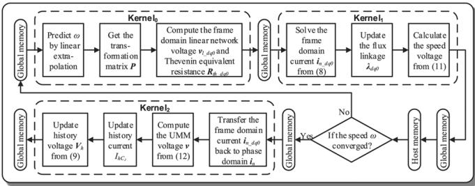  
Fig. 12. Kernel operation flow in the UMM module.

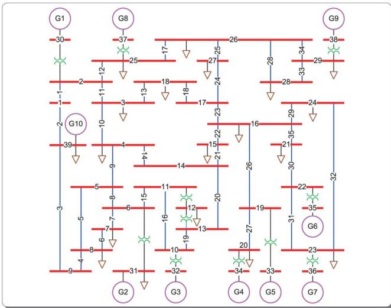  
Fig. 13. Single-line diagram of the Scale 1 test power system.

the original is shown in Fig. 14(a). It is 97.39% sparse with 357 nonzero elements. With increasing network size, the admittance matrix becomes even more sparse. It is considerably inefficient to handle a sparse matrix with traditional parallel dense algorithms, and the traditional parallel sparse algorithm is unsuitable for the GPU architecture; therefore, a specific sparse structure, where the nonzero elements are regrouped into diagonal blocks which are decoupled from each other, is proposed using the block-node adjustment (BNA). In the BNA, a graph optimizing algorithm is applied to adjust the node IDs inside each subsystem, which are divided by traveling-wave delays of transmission-line models, into sequential addresses in memory. Since the node IDs created by users are typically random, which do not conform with the rules of the BNA, they are mapped to new node IDs, which are serial and ordered, by the node mapping structure (NMS), where the original IDs are hashed and one-to-one mapping to the new IDs. The minimal perfect hash [27] and integer sorting are applied to avoid string operations so that the complexity is reduced from $O ( n ^ { 2 } )$ to $O ( n )$ .

The matrix derived from the NMS is a perfect block diagonal matrix, whose condition number is not affected, as shown in Fig. 14(b), where the number of blocks depends on the number of decoupled systems. Therefore, a large-scale system is divided into independent smaller subsystems $Y _ { k } { \pmb v } _ { k } = { \pmb i } _ { k }$ $( k = 1 , 2 , \ldots , n )$ , where is the number of blocks. Only the decoupled blocks in the admittance are stored in the host/device memory, which significantly reduces the pressure of data

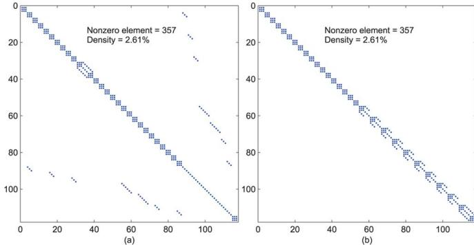  
Fig. 14. Pattern of the Y matrix of the IEEE 39-bus system. (a) Before blocknode adjustment (BNA). (b) After BNA.

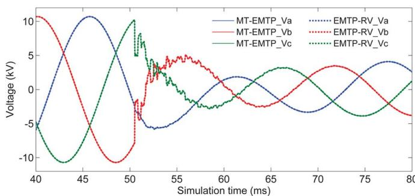  
Fig. 15. Comparison of simulation results (three-phase voltages) between MT-EMTP and EMTP-RV at Bus 5 during a three-phase fault at Bus 4.

transfer for large-scale admittance matrices. All small matrices are considered as dense matrices, and all subsystems are solved independently by the normal dense algorithm in parallel on the GPU. The linear solver uses LU decomposition and forward-backward substitution, implemented in a CUDA kernel to compute the unknown node voltages $( \pmb { v } = [ \pmb { v } _ { 1 } , \pmb { v } _ { 2 } , \dots , \pmb { \dots } , \pmb { v } _ { n } ] ^ { \prime } )$ .

# V. LARGE-SCALE EMT SIMULATION CASE STUDY

The Scale-1 test power system is shown in Fig. 13. It is the modified IEEE 39-bus New England test system. The specifications of the hardware used for the simulation are listed in Table I. The MT-EMTP (64-b code) program was executed on the Fermi GPU, while EMTP-RV (32-bit code) was running on the AMD CPU, both using 64-b double precision floating-point data. The time-domain voltage waveforms at Bus 5 of the test power system (Fig. 13) are shown in Fig. 15, during a threephase fault event at Bus 4. The fault currents at Bus 4 are shown in Fig. 16. The simulation time is 100 ms and the timestep is 20 s, and the total simulation steps are 5000. The results from EMTP-RV and MT-EMTP are superimposed in Figs. 15–18, which show close agreement.

The zoomed-in figures (Figs. 17 and 18) also show a close match in the transients.

To evaluate computational efficiency, execution times of test systems of increasing size were recorded. Eight large-scale test cases were created by expanding the original IEEE 39-bus system with detailed modeling of all components. Subsystems (39-bus) were interconnected with the systems around them by two additional transmission lines. The execution times are shown in Table II, which also includes the number of buses

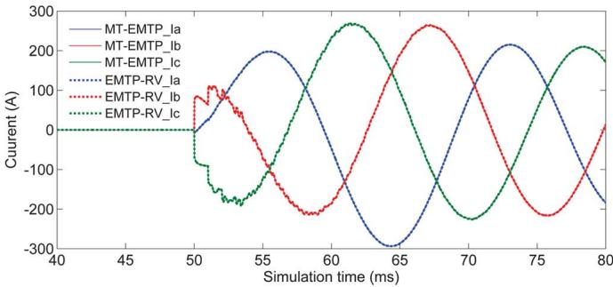  
Fig. 16. Comparison of simulation results (three-phase fault currents) between MT-EMTP and EMTP-RV at Bus 4.

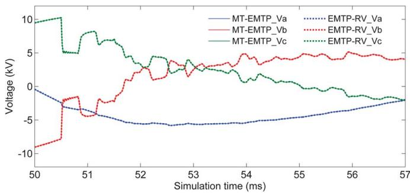  
Fig. 17. Zoomed-in view of Fig. 15 from $t = 0 . 0 5 \mathrm { s } \tan t = 0 . 0 5 7$ s.

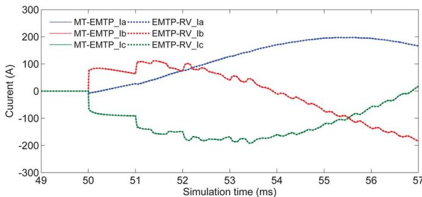  
Fig. 18. Zoomed-in view of Fig. 16 from $t = 0 . 0 4 9 \mathrm { ~ s ~ t o ~ } t = 0 . 0 5 6 \mathrm { ~ s ~ }$ .

TABLE I HARDWARE SPECIFICATION   

<table><tr><td colspan="2">GPU</td><td colspan="2">CPU</td></tr><tr><td colspan="2">TeslaTM C2050 (Fermi)</td><td colspan="2">AMD PhenomTM II 955BE</td></tr><tr><td>Cores</td><td>448</td><td>Cores</td><td>4</td></tr><tr><td>Frequency</td><td>1.15GHz</td><td>Frequency</td><td>3.2GHz</td></tr><tr><td>Global memory</td><td>3GB</td><td>System memory</td><td>16GB</td></tr><tr><td>CUDA Version</td><td>4.0</td><td>L2 Cache</td><td>2MB</td></tr><tr><td>CUDA Capability</td><td>2.0</td><td>L3 Cache</td><td>6MB</td></tr></table>

and devices in the systems. All of the lines in these test cases were modeled using ULM and the uncontrolled machines using UMM. As can been seen, when the system size is relatively small, the speedup is less than 1; however, when the system scale is increased to 63 times of the original IEEE 39-bus system, the achieved speedup is up to 5.63.

Fig. 19 shows the execution time and speedup with increasing system size. It is obvious that the computation time of EMTP-RV follows a high-order complexity $O ( n ^ { a } ) ( a > 2 )$ with respect to the system scale, since most vector and matrix operations have high-order complexity $O ( n ^ { 2 } )$ and $O ( n ^ { 3 } )$ in

TABLE II COMPARISON OF EXECUTION TIME FOR VARIOUS SYSTEM SIZES BETWEEN EMTP-RV AND GPU-BASED MT-EMTP FOR SIMULATION DURATION 100 ms WITH TIMESTEP 20 s   

<table><tr><td colspan="5">System structure (3-phase)</td><td colspan="2">Execution time (s)</td><td rowspan="3">Speedup</td></tr><tr><td rowspan="2">Scale</td><td rowspan="2">Buses</td><td colspan="3">Devices</td><td rowspan="2">EMTP-RV</td><td rowspan="2">MT-EMTP</td></tr><tr><td>LPEs</td><td>ULMs</td><td>UMMs</td></tr><tr><td>1</td><td>40</td><td>31</td><td>35</td><td>10</td><td>0.967</td><td>1.837</td><td>0.53</td></tr><tr><td>2</td><td>79</td><td>61</td><td>72</td><td>20</td><td>2.012</td><td>2.350</td><td>0.86</td></tr><tr><td>4</td><td>157</td><td>121</td><td>148</td><td>40</td><td>4.118</td><td>3.304</td><td>1.25</td></tr><tr><td>8</td><td>313</td><td>241</td><td>300</td><td>80</td><td>9.625</td><td>5.345</td><td>1.80</td></tr><tr><td>16</td><td>625</td><td>481</td><td>608</td><td>160</td><td>26.988</td><td>9.116</td><td>2.96</td></tr><tr><td>32</td><td>1249</td><td>961</td><td>1224</td><td>320</td><td>65.567</td><td>16.895</td><td>3.88</td></tr><tr><td>48</td><td>1873</td><td>1441</td><td>1840</td><td>480</td><td>115.724</td><td>23.319</td><td>4.96</td></tr><tr><td>63</td><td>2458</td><td>1891</td><td>2425</td><td>630</td><td>168.502</td><td>29.946</td><td>5.63</td></tr></table>

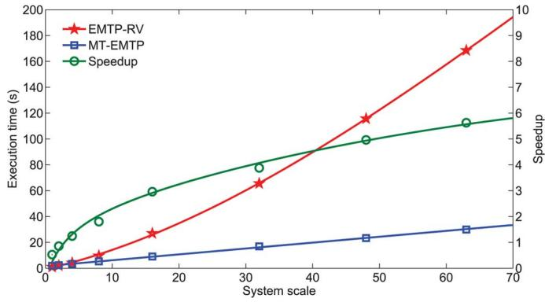  
Fig. 19. Execution time and speedup with respect to the scale of test systems in EMTP-RV and the GPU-based MT-EMTP program.

serial CPU algorithms. The execution time of the proposed MT-EMTP program, however, only increases linearly with first-order complexity $O ( n )$ , derived from SIMD-based parallel programming. Thanks to the complexity order reduction, a GPU-based EMT simulator is always faster than the conventional CPU-based simulator when the scale of the test case is large enough. Therefore, the speedup can be expected to increase without saturation for increasing system sizes. Larger systems (greater than Scale 63) could also be tested on MT-EMTP, but the EMTP-RV licence only allowed a maximum of 5000 devices. Note that in a commercial and industrial program, such as EMTP-RV, there are many input and output activities, and a large collection of models/codes that require extra processing time. Nevertheless, this experiment clearly demonstrates the advantage of parallel massive-thread computation in accelerating EMT simulation.

# VI. CONCLUSION

The GPU with its massive-core architecture shows promise for higher computational performance, provided the system size and the data throughput requirements are large. Detailed EMT simulation of the large-scale system is therefore ideally suited to exploit GPU technology for reducing computational burden. This paper proposed a parallel massive-thread module for linear passive element, transmission line, and electrical machine for implementing the MT-EMTP program on the GPU, a nodemapping structure is proposed for an efficient sparse network solution. Large-scale test cases are used to evaluate the performance of the MT-EMTP program in comparison with the commercial EMTP-RV software. With lower order complexity,

the massive-thread parallel implementation shows substantial speedup under the same accuracy and precision. Finally, the proposed methods, algorithm, and data structure also can be applied to the multithread computing system, which is also pervasive these days as a mainstream CPU architecture.

# APPENDIX A

The parameters for the test power system in Fig. 13 are given below:

1) ULM transmission-line (Line1–Line35) parameters: three conductors, resistance: 0.0583/km, diameter: 3.105 cm, line length: 50 km (line 5, 6, 7, 8, 15, 16, 18, 19, 23, 27, 29, 30, 31, 35); 150 km (line 2, 3, 4, 9, 10, 11, 13, 14, 20, 21, 22, 24, 25, 26, 32, 33); and 500 km (line 1, 12, 17, 28, 34). and are 3 3 matrices, whose elements are approximated with ninth-order rational functions. Line geometry: flat horizontal phase spacing; horizontal distance between 4.87 m; vertical distance: phases a to ground, c to ground 30 m, phase b to ground 28 m, and shield wire to tower arm 6 m.   
2) UMM synchronous machine (G1–G10) parameters: 1000 MVA, 22 kV, Y-connected, field current: 2494 A, 2 poles, 60 Hz, moment of inertia: 5.628e4 kg m /rad and damping: 6.780e3 kg m/s/rad.   
3) Loads and transformer parameters: load parameter: $\textrm { R } =$ 500 0.05 H, $\mathrm { ~ C ~ = ~ 1 \mu F }$ and transformer leakage impedance 0.5 0.03 H.

# REFERENCES

[1] J. Mahseredjian, S. Dennetière, L. Dubé, B. Khodabakhchian, and L. Gérin-Lajoie, “On a new approach for the simulation of transients in power systems,” presented at the Int. Conf. Power Syst. Transients, Montreal, QC, Canada, Jun. 19–23, 2005, IPST05-139.   
[2] Manitoba HVDC Research Centre, in EMTDC User’s Guide, Winnipeg, MB, Canada, 2003.   
[3] “Alternative Transients Program (ATP) Rule Book,” CAN/AM EMTP Users Group, 2000.   
[4] J. Mahseredjian, V. Dinavahi, and J. A. Martinez, “Simulation tools for electromagnetic transients in power systems: Overview and challenges,” IEEE Trans. Power Del., vol. 24, no. 3, pp. 1657–1669, Jul. 2009.   
[5] L. Gérin-Lajoie and J. Mahseredjian, “Simulation of an extra large network in EMTP: From electromagnetic to electromechanical transients,” presented at the Int. Conf. Power Syst. Transients, Kyoto, Japan, Jun. 3–6, 2009.   
[6] NVIDIA Corporation, NVIDIAs Next Generation CUDA Compute Architecture: Fermi, 2009.   
[7] D. Blythe, “Rise of the graphics processor,” Proc. IEEE, vol. 96, no. 5, pp. 761–778, May 2008.   
[8] J. D. Owens, M. Houston, D. Luebke, S. Green, J. E. Stone, and J. C. Phillips, “GPU computing,” Proc. IEEE, vol. 96, no. 5, pp. 879–899, May 2008.   
[9] “NVIDIA CUDA C Programming Guide Version 4.0,” NVIDIA Corp., May 6, 2011.   
[10] A. Gopal, D. Niebur, and S. Venkatasubramanian, “DC power flow based contingency analysis using graphics processing units,” in Proc. IEEE Power Tech., Jul. 1–5, 2007, pp. 731–736.   
[11] J. E. Tate and T. J. Overbye, “Contouring for power systems using graphical processing units,” in Proc. 41st Annu. Int. Conf. Syst. Sci., HI, USA, Jan. 7–10, 2008, p. 168.   
[12] V. Jalili-Marandi and V. Dinavahi, “Large-scale transient stability simulation on graphics processing units,” in Proc. IEEE Power Energy Soc. Gen. Meeting, Jul. 26-30, 2009, pp. 1–6.

[13] N. Garcia, “Parallel power flow solutions using a biconjugate gradient algorithm and a Newton method: A GPU-based approach,” in Proc. IEEE Power Energy Soc. Gen. Meeting, Jul. 25–29, 2010, pp. 1–4.   
[14] V. Jalili-Marandi and V. Dinavahi, “SIMD-based large-scale transient stability simulation on the graphics processing unit,” IEEE Trans. Power Syst., vol. 25, no. 3, pp. 1589–1599, Aug. 2010.   
[15] J. Singh and I. Aruni, “Accelerating power flow studies on graphics processing unit,” in Proc. IEEE Ann. India Conf. , Dec. 17–19, 2010, pp. 1–5.   
[16] C. Vilacha, J. C. Moreira, E. Miguez, and A. F. Otero, “Massive Jacobi power flow based on SIMD-processor,” in Proc. 10th Int. Conf. Envir. Elect. Eng., May 8–11, 2011, pp. 1–4.   
[17] J. K. Debnath, W. Fung, M. A. Gole, and S. Filizadeh, “Simulation of large-scale electrical power networks on graphics processing units,” in Proc. IEEE Elect. Power Energy Conf., Oct. 3–5, 2011, pp. 199–204.   
[18] V. Jalili-Marandi, Z. Zhou, and V. Dinavahi, “Large-scale transient stability simulation of electrical power systems on parallel GPUs,” IEEE Trans. Parallel Distrib. Syst., vol. 23, no. 7, pp. 1255–1266, Jul. 2012.   
[19] H. W. Dommel, “Digital computer solution of electromagnetic transients in single and multiphase networks,” IEEE Trans. Power App. Syst., vol. PAS-88, no. 4, pp. 388–399, Apr. 1969.   
[20] H. W. Dommel, “Nonlinear and time-varying elements in digital simulation of electromagnetic transients,” IEEE Trans. Power App. Syst., vol. PAS-90, no. 4, pp. 2561–2567, Jun. 1971.   
[21] H. W. Dommel, EMTP Theory Book. Portland, OR, USA: Bonneville Power Admin., 1984.   
[22] J. R. Marti, “Accurate modeling of frequency-dependent transmission lines in electromagnetic transients simulations,” IEEE Trans. Power App. Syst., vol. PAS-101, no. 1, pp. 147–157, Jan. 1982.   
[23] H. K. Lauw and W. S. Meyer, “Universal machine modeling for the representation of rotating electric machinery in an electromagnetic transients program,” IEEE Trans. Power App. Syst., vol. PAS-101, no. 6, pp. 1342–1350, Jun. 1982.   
[24] A. Morched, B. Gustavsen, and M. Tartibi, “A universal model for accurate calculation of electromagnetic transients on overhead lines and underground cables,” IEEE Trans. Power Del., vol. 14, no. 3, pp. 1032–1038, Jul. 1999.   
[25] H. K. Lauw, “Interfacing for universal multi-machine system modeling in an electromagnetic transients program,” IEEE Trans. Power App. Syst., vol. PAS-104, no. 9, pp. 2367–2373, Sep. 1985.   
[26] B. Gustavsen and A. Semlyen, “Simulation of transmission line transients using vector fitting and modal decomposition,” IEEE Trans. Power Del., vol. 13, no. 2, pp. 605–614, Apr. 1998.   
[27] R. J. Cichelli, “Minimal perfect hash functions made simple,” Commun. ACM, vol. 23, no. 1, pp. 17–19, Jan. 1980.   
[28] J. R. Marti and J. Lin, “Suppression of numerical oscillations in the EMTP,” IEEE Trans. Power Syst., vol. 4, no. 2, pp. 739–747, May 1989.

Zhiyin Zhou (S’12) received the M.Sc. degree in electrical and computer engineering from the University of Alberta, Edmonton, AB, Canada, in 2012 and is currently pursuing the Ph.D. degree in electrical and computer engineering at the University of Alberta.

His research interests include large-scale parallel and distributed computing, massive-thread parallel programming, power system simulation, and electromagnetic transient studies.

Venkata Dinavahi (SM’08) is a Professor in the Department of Electrical and Computer Engineering at the University of Alberta, Edmonton, AB, Canada.

His research interests include real-time simulation of power systems and power-electronic systems, large-scale system simulation, and parallel and distributed computing.