# Harmonics Interaction Mechanism and Impact on Extinction Angles in Multi-Infeed HVDC Systems

Wei Yao , Senior Member, IEEE, Lingrao Wang , Hongyu Zhou , Student Member, IEEE, Yongxin Xiong , and Jinyu Wen , Member, IEEE

Abstract—Harmonics interaction is an important factor in causing concurrent commutation failures (CCF) of multiple converter stations in multi-infeed HVDC (MI-HVDC) systems, but it was not studied sufficiently in existing literature. In this paper, the mechanism analysis and quantitative calculation of harmonic interaction are investigated. Firstly, the generation and interaction process of harmonic during AC fault events in the MI-HVDC systems with single-terminal connection and hierarchical connection on the receiving-end are illustrated, respectively. Then, the common characteristics of harmonic interaction in generalized MI-HVDC systems are concluded. Moreover, to evaluate the impact of harmonic interaction on the commutation process quantitatively, an equivalent circuit model of harmonic transfer in MI-HVDC systems is established. Based on this equivalent model, the harmonic voltage transfer coefficient is deduced, and the extinction angle of inverters considering harmonic interaction in MI-HVDC systems can be calculated. Finally, the calculation accuracy based on equivalent model is verified via the electromagnetic transient simulation of MI-HVDC systems. Simulation results show that harmonic interaction will eventually cause the formation of harmonic sources in each converter station of MI-HVDC systems. These harmonic components will change the extinction angle of remote inverters to increase the risk of CCFs.

Index Terms—Commutation failure, extinction angle calculation, harmonics interaction, hierarchical connection, LCC-HVDC, multi-infeed.

# LIST OF SYMBOLS AND ABBREVIATIONS

Abbreviations   

<table><tr><td>CCF</td><td>Concurrent commutation failure.</td></tr><tr><td>CF</td><td>Commutation failure.</td></tr><tr><td>LCC-HVDC</td><td>Line-commutated converter based high-voltage direct current.</td></tr><tr><td>LCF</td><td>Local commutation failure.</td></tr><tr><td>MI-HVDC</td><td>Multi-infeed high-voltage direct current.</td></tr></table>

Manuscript received 10 August 2022; revised 12 November 2022 and 29 January 2023; accepted 5 February 2023. Date of publication 9 February 2023; date of current version 25 July 2023. This work was supported by the National Natural Science Foundation of China under Grant 52022035 Paper no. TPWRD-01197-2022. (Corresponding author: Yongxin Xiong.)

Wei Yao, Hongyu Zhou, Yongxin Xiong, and Jinyu Wen are with the State Key Laboratory of Advanced Electromagnetic Engineering and Technology, School of Electrical and Electronic Engineering, Huazhong University of Science and Technology, Wuhan 430074, China (e-mail: w.yao@hust.edu.cn; ee.henry_zhou@foxmail.com; yxio@energy.aau.dk; jinyu.wen@hust.edu.cn).

Lingrao Wang is with the North China Branch of State Grid Corporation of China, Beijing 100053, China (e-mail: 1956278378@qq.com).

Color versions of one or more figures in this article are available at https://doi.org/10.1109/TPWRD.2023.3243412.

Digital Object Identifier 10.1109/TPWRD.2023.3243412

THD Total harmonic distortion ratio.

VTA Voltage-time area.

Parameters   

<table><tr><td>E1</td><td>Equivalent electromotive force of the AC system near bus 1.</td></tr><tr><td>E2</td><td>Equivalent electromotive force of the AC system near bus 2.</td></tr></table>

Variables   

<table><tr><td>α</td><td>Firing angle.</td></tr><tr><td>β</td><td>Leading firing angle.</td></tr><tr><td>I12h</td><td>The hthorder harmonic current on AC coupling channel between bus 1 and 2.</td></tr><tr><td>I1h</td><td>The hthorder harmonic current flows into bus 1.</td></tr><tr><td>I2h</td><td>The hthorder harmonic current flows into bus 2.</td></tr><tr><td>U1h</td><td>The hthorder harmonic voltage of bus 1.</td></tr><tr><td>U2h</td><td>The hthorder harmonic voltage of bus 2.</td></tr><tr><td>γ</td><td>Extinction angle.</td></tr><tr><td>γ&#x27;</td><td>Extinction angle considering the impact of harmonics.</td></tr><tr><td>γmin</td><td>Minimum extinction angle for a normal commutation.</td></tr><tr><td>μ</td><td>Commutation overlap angle.</td></tr><tr><td>μ&#x27;</td><td>Commutation overlap angle considering the impact of harmonics.</td></tr><tr><td>φ</td><td>Zero-crossing point shift of commutation voltage caused by harmonics.</td></tr><tr><td>Id</td><td>DC current in inverters.</td></tr><tr><td>Z12h</td><td>The hthorder harmonic impedance of the AC coupling channel between bus 1 and 2.</td></tr><tr><td>Z1h</td><td>The hthorder harmonic impedance of the receiving system connected to bus 1.</td></tr><tr><td>Z2h</td><td>The hthorder harmonic impedance of the receiving system connected to bus 2.</td></tr><tr><td>ZFault</td><td>Fault impedance.</td></tr></table>

# I. INTRODUCTION

2 OMMUTATION failure (CF) is a common fault in the C converter station of line-commutated converter based high voltage direct current (LCC-HVDC) line [1], [2], which is usually caused by the short-circuit fault of the receiving-end AC system [3]. As the continuous construction and operation of LCC-HVDC projects, situations are arising that two or more DC lines with single-terminal or hierarchical connection feeding into

one regional AC system [4], and the interaction between AC-DC and DC-DC system becomes more complex [5]. Particularly, it is pointed out in [6] that due to the interaction characteristic in multi-infeed HVDC (MI-HVDC) systems, the impact of harmonics on CFs is more significant than that of single HVDC line. The harmonic components induced by AC fault transient process can transfer between buses, easily leading to the CFs of multiple converter stations and forming a serious power impact on power grids. Therefore, the harmonic interaction mechanism is an important topic for stability analysis and control of power grids in MI-HVDC systems.

The existing researches about the interaction characteristics of MI-HVDC systems mainly focus on the voltage coupling and power exchange between converter buses considering AC network parameters and DC control strategy [7], [8], [9], whereas the discussion about harmonic interaction is few.Currently, some researchers have observed the abnormal CF phenomenon of the inverter groups far from the AC-fault point in the MI-HVDC system based on simulation results [6]. And it is pointed out in Refs. [10] and [11] that the voltage distortion is caused by DC components and low-order harmonics. Ref. [12] claims that the harmonic voltage at inverter buses arising during the AC fault transient process, especially the 2nd and 3rd order ones are very likely to cause CFs in the MI-HVDC system by shifting the zero-crossing point of commutation voltage. Thus, an extinction angle prediction algorithm based on FFT analysis of commutation voltage is proposed in Ref. [12] for CF prevention control. However, the above researches fail to further investigate the specific harmonic interaction process in the MI-HVDC system. In Ref. [13], the process of fault components transferring through an AC network in an MI-HVDC system is analyzed by a modified switching function, in which the 3rd order harmonic component is especially taken into consideration. Whereas, the analysis in Ref. [13] is not extended to the harmonic components with other orders to obtain a general principle of harmonic interaction in the MI-HVDC system. Preliminary mechanism analysis of the harmonic interaction process in MI-HVDC systems with hierarchical connection is provided in the authors’ previous paper Ref. [14]. But the analysis of the harmonic interaction mechanism in MI-HVDC system with single-terminal connection is still lacking. Based on the equivalent impedance of AC network matrix to evaluate the voltage coupling strength between buses in MI-HVDC systems, Ref. [15] proposes an AC-DC voltage interaction factor. Refs. [16] and [17] use the minimum eigenvalue of the AC-DC Jacobian matrix and interactive effective short-circuit ratio to consider the power distribution in interaction quantization. Ref. [18] notices that the commutation failure prevention (CFPREV) control [19] of the converter station close to the fault will increase its reactive power exchange with adjacent buses. Currently, some researches have observed the harmonic interaction phenomenon in MI-HVDC systems based on simulation results. Refs. [10], [13] clearly point out that harmonics transferring through AC networks can cause the shift of commutation voltage zero-crossing points. However, most above studies fail to further investigate the generation and interaction mechanism of harmonic components in MI-HVDC systems.

To evaluate the influence of harmonic on the commutation process and provide guidance in practical operation, several explorations of quantitative calculation have been carried out based on CIGRE standard single HVDC line. Ref. [11] introduces a criterion of the extinction angle for CF prediction based on the time-domain responses of DC current and the Fourier coefficient of commutation voltage. Ref. [20] proposed an index based on voltage-time area (VTA) to quantitatively analyze the influence of harmonic voltage on CF. However, due to the randomness of the harmonic component phase angle, the researches above simplify the phase angle in the calculation of the extinction angle. An extinction angle prediction algorithm based on FFT analysis of commutation voltage is proposed in Ref. [12] for CF prevention control. Whereas, the mechanism of FFT causes it to have a certain lag in the analysis during the fault transient process. And this disadvantage is particularly prominent when analyzing the harmonic voltage of the converter bus far from the fault in the MI-HVDC system. In addition, a computational method of pseudo extinction angle is proposed in [21], which can be used as a direct control variable to achieve real-time extinction angle control. But this method is insufficient in accuracy and applicability for some scenarios because the commutation voltages are assumed values based on historical data. Converter modulation theory has been used to describe the harmonic distortion of HVDC systems operating on an unbalanced supply condition [22]. With the converter modulation theory, the harmonic transformation of HVDC systems is interpreted in [23]. However, the above analysis of harmonic transformation is also aimed at the single HVDC system, the quantitative analysis of harmonic transfer in MI-HVDC systems is rarely discussed.

Besides, most researches on MI-HVDC systems at present are aimed at HVDC lines with conventional single-terminal connection mode on receiving-end. A preliminary exploration of harmonic interaction in HVDC systems with hierarchical connection is provided in [14], where the mechanism of CFs in HVDC systems with hierarchical connection is analyzed considering harmonic interaction, and a CF prevention control strategy is also proposed based on harmonics detection. However, this research is limited to qualitative analysis, abstract modeling and quantitative calculation have not been achieved. As the wide application of hierarchical connection mode, the MI-HVDC systems including both single-terminal and hierarchical connection modes on receiving-end begin to appear in central and eastern area of China. Therefore, extracting the common interaction characteristics of single-terminal and hierarchical connection modes, and summarizing the harmonic interaction mechanism of generalized MI-HVDC systems will be necessary to provide guidance for such MI-HVDC systems with the hybrid structure on receiving-end.

To address the above problems, this paper extends our previous work in [14]. The generation and interaction mechanism of harmonic components in the MI-HVDC system with a single-terminal connection under the AC fault case is first analyzed in detail. Then, common points and differences in harmonic interaction characteristics of MI-HVDC systems with single-terminal and hierarchical connections are compared and

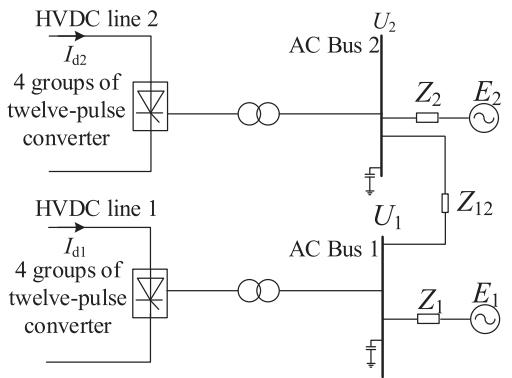  
(a)

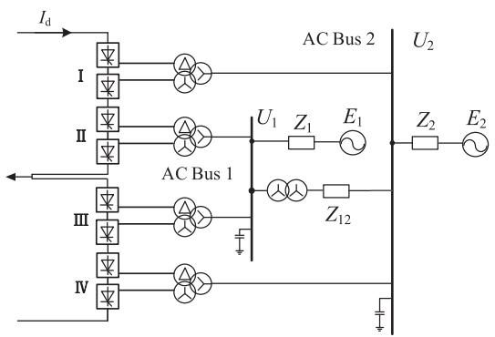  
(b)   
Fig. 1. Structures of multi-infeed HVDC systems on receiving-end. (a) With single-terminal connection; (b) With hierarchical connection.

summarized. Based on the common characteristics, an equivalent circuit model of harmonic interaction is established for quantitative calculation in generalized MI-HVDC systems. With this model, the harmonic interaction parameter and its impact on extinction angles can be fast evaluated without electromagnetic simulation, which can assist in possible CF warning and control parameter setting in practical operation.

The main contributions of this paper are listed as follows,

- In multi-infeed HVDC systems with single-terminal connection, the generation mechanism and interaction process of harmonic components under fault cases is revealed. And comparing the harmonic interaction process in MI-HVDC systems with various connection modes, a common characteristic in MI-HVDC systems is proposed that harmonic interaction will finally cause the fault current inrush of each converter transformer.   
- To calculate the harmonic voltage transfer coefficient, an equivalent circuit model of harmonic interaction in MI-HVDC systems is established, which describes the amplitude transformation and phase shift of harmonic voltage in the transfer process quantitatively.   
- Based on the harmonic transfer model, the impact of harmonic interaction on the extinction angle of inverters of the MI-HVDC systems is calculated. The accuracy of the harmonic interaction equivalent model and extinction angle calculation is verified and analyzed via the MI-HVDC systems by simulation.

The rest of this paper is organized as follows. Section II introduces termination modes on receiving-end of MI-HVDC systems. Section III analyzes the generation and interaction process of harmonics in MI-HVDC systems. An equivalent circuit of harmonic interaction is established in Section IV. Case studies are carried out to verify the calculation of harmonic transfer coefficient and extinction angle in Section V. Conclusions are drawn in Section VI.

# II. STRUCTURE OF MULTI-INFEED SYSTEM

MI-HVDC refers that two or more HVDC lines that terminating into one regional receiving-end AC system, and the electric interaction between converter stations is formed through the AC network. And an HVDC line with a hierarchical connection at the

receiving end can be considered as a dual-infeed HVDC system. There are two connection modes for HVDC lines to terminate into the AC system on receiving-end in multi-infeed system [6]. The first is the conventional single-terminal connection, and the other is the hierarchical connection. In Fig. 1(a), the structure of the HVDC line with conventional single termination on receiving-end is indicated, where the four 12-pulse inverters on the receiving-end of each HVDC transmission line all connect to one AC bus. The AC grid near each converter bus is represented by equivalent impedance $Z _ { i }$ and equivalent electromotive force $E _ { i }$ . A smaller $\left| Z _ { i } \right|$ value corresponds to a stronger AC grid and a larger short-circuit capacity near the converter station [24]. The electric interaction channel between converter buses is formed through the AC network. And the equivalent interaction impedance between converter bus i and j is $Z _ { i j } .$ . A smaller $\lvert Z _ { i j } \rvert$ value represents a closer electric distance and stronger interaction between buses i and j. The difference between the single-terminal connection and the hierarchical connection is the number of converter buses on the receiving end of an HVDC line. According to Fig. 1(a), single-terminal connection refers that each HVDC line terminating to one converter bus on the receiving end.

To alleviate the impact of HVDC transmission line with large capacity on the receiving power system, the way of terminating HVDC lines into AC system is modified as Fig. 1(b), where the HVDC line is divided into two parts on receiving-end, and each part has the half capacity and connected to different converter buses, thus, the hierarchical and multi-terminal connection modes are formed. For brevity, the topology in Fig. 1(b) is uniformly referred to as a hierarchical connection structure, where each HVDC line terminates to two converter buses on the receiving end. The hierarchical connection refers that high-side inverters I and IV are terminated to 500 kV AC bus, and low-side inverters II and III are terminated to 1000 kV AC bus. Such arrangement of connecting the high-side inverters with the AC bus at low-voltage grade is to reduce the insulation pressure of the converter transformer [25]. Whereas, the multi-terminal connection refers that high-voltage and low-voltage inverters being terminated to different AC buses with the same voltage grade (both are 500 kV for example).

It can be seen that hierarchical connection and multi-terminal connection share the same topological structure and electric

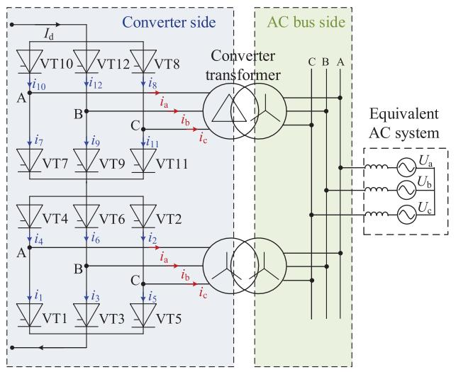  
Fig. 2. Circuit of 12-pulse converter on receiving-end of HVDC line.

interaction characteristics, only the voltage levels on receiving power systems are different. For brevity, the topology in Fig. 1(b) is uniformly referred as hierarchical connection structure. According to Fig. 1, the electric interaction between buses in the multi-infeed systems with single-terminal connection is only achieved through the AC-side coupling. Since the high-voltage and low-voltage converters are connected in series with hierarchical connection, there is also existing DC-side coupling between the two converter buses on the receiving end.

# III. MECHANISM OF HARMONICS INTERACTION INMULTI-INFEED HVDC SYSTEM

# A. Mechanism of Harmonics Induced by Commutation Failure

CF is an inherent drawback of LCC-HVDC projects due to the application of semi-controlled thyristor in inverter stations [26]. The mechanism of commutation process is briefly introduced as follows [27]. The 12-pulse converter is the basic unit for the HVDC project, which is composed of Y/D and Y/Y sixpulse converters connected in series, as depicted in Fig. 2. Take the six-pulse converter connected to the Y/Y transformer as an example, and the situation of that connected to Y/D transformer can be referred to [1]. In steady-state operating conditions, the six thyristors labeled from VT1 to VT6 are triggered in sequence in converter bridge, the DC currents in VT1-VT6 denoted as $i _ { 1 } \cdot$ $i _ { 6 }$ are inverted as three phase current $i _ { \mathrm { a } } , i _ { \mathrm { b } } , i _ { \mathrm { c } }$ on converter side. The equivalent circuit and commutation process (commutation from VT3 to VT5 in a 6-pulse Graetz bridge connected to the transformer) are described in Fig. 3, α represents the firing angle, $\beta$ represents the leading firing angle $( \alpha + \beta = \pi ) . \ U _ { \mathrm { d } }$ and $I _ { \mathrm { d } }$ represent the DC current and voltage. $U _ { \mathrm { a } } , U _ { \mathrm { b } } , U _ { \mathrm { c } }$ represent the three-phase voltage, which are at the inverter side, $L _ { \mathrm { c } }$ is the commutation inductance. Owing to the converter transformer leakage inductance and the AC system impedance, a certain time consumption is required once the DC current changing from one valve to another, which is represented as $\mu$ and known as the overlap angle or commutation time. After the valve current returns to 0, the reverse voltage is required to withstand for an

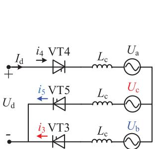

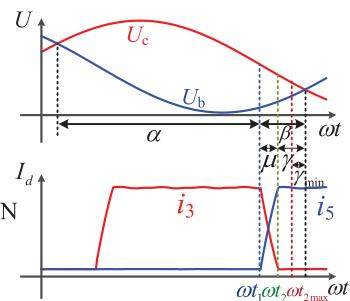  
(b)   
Fig. 3. The commutation dynamic process from VT3 to VT5. (a) Equivalent circuit; (b) Diagram of commutation process.

interval in the thyristor, the forward voltage will be blocked during this period. The interval time between the valve current and the commutation voltage returning to 0 is known as the de-ionisation time, which can be also described as the extinction angle and presented as $\gamma .$ Once the $\gamma < \gamma _ { \mathrm { m i n } } .$ , the de-ionisation time will be inadequate, which will lead to the current regaining in this thyristor,thus, the CF will occur. Therefore, γ is the key factor for the success of commutation.

The commutation process in Fig. 3(b) consists of three parts: 1) period before $t _ { 1 }$ , a circuit is constituted with VT3 and VT4 turning on, the commutation process has not begun at this period; 2) period between $t _ { 1 }$ and $t _ { 2 } .$ , during this period, VT3-VT5 are turning on, $i _ { 3 }$ is decreasing while i5 is rising from 0 in Fig. 3(b), therefore, the commutation from VT3 to VT5 can be realized; 3) period after $t _ { 2 } .$ , $i _ { 3 }$ will drop to 0, therefore, VT3 will turn off, but VT4 and VT5 will turn on and constitute a new circuit. The detialed mathematical description of the commutation process illustrated above is represented in (1):

$$
\int_ {t _ {1}} ^ {t _ {2}} \left(U _ {\mathrm {c}} - U _ {\mathrm {b}}\right) \mathrm {d} t = L _ {\mathrm {c}} \left(I _ {\mathrm {d}} \left(t _ {1}\right) + I _ {\mathrm {d}} \left(t _ {2}\right)\right) \tag {1}
$$

where, $I _ { \mathrm { d } } ( t _ { 1 } )$ and $I _ { \mathrm { d } } ( t _ { 2 } )$ are different currents at $t _ { 1 }$ and $t _ { 2 } .$ . In (1), the right side can be denoted as $S _ { \mathrm { d } } .$ it represents the voltage-time area (VTA) demand for valve current commutation, and it is depended on $I _ { \mathrm { d } }$ while $L _ { \mathrm { c } }$ remains unchanged. The left side of (1) represents the voltage-time area provided by commutation voltage, mainly depended on the integral time and commutation voltage. To make the commutation process successful, (2) should be satisfied.

$$
\int_ {t _ {1}} ^ {t _ {2 \max }} \left(U _ {\mathrm {c}} - U _ {\mathrm {b}}\right) \mathrm {d} t \geq L _ {\mathrm {c}} \left(I _ {\mathrm {d}} \left(t _ {1}\right) + I _ {\mathrm {d}} \left(t _ {2}\right)\right) \tag {2}
$$

where, the left side represents the maximum voltage-time area, and denoted as $S _ { \mathrm { m a x } } . S _ { \mathrm { m a x } }$ is calculated in critical situation that $\gamma = \gamma _ { \mathrm { m i n } }$ .

The interaction in MI-HVDC systems gives CF more diverse behaviors. According to the position relationship between the short-circuit fault point and commutator suffering CF, the CFs in MI-HVDC systems could be classified as concurrent CF (CCF) and local CF (LCF) [28]. LCF refers that the commutator connected to the bus close to the fault point suffers CF, while CCF refers that the commutator terminated to the bus far away from the fault point also suffer CF due to the electric fluctuation

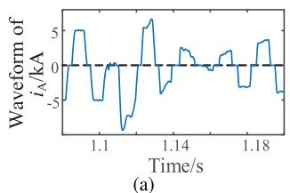

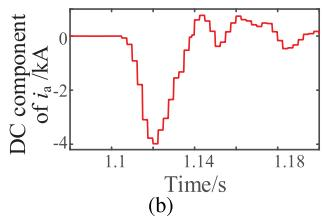  
Fig. 4. Change of AC current on converter side after CF. (a) Waveform of AC current; (b) DC component of current.

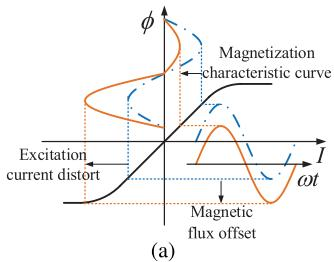

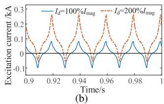  
Fig. 5. Diagram of transformer inrush current induced by DC current. (a) DC magnetic bias of transformer; (b) Impact of DC current on distortion.

caused by LCF transferring through the interaction in MI-HVDC system.

There are many reasons for the generation of harmonics after CF, including the destruction of the symmetrical operation, the asymmetry firing angle during the dynamic DC control process, the parallel resonance with filter due to the change of system parameters, and the DC magnetic bias of converter transformer, etc [29]. Among the reasons for the generation of harmonics after CF, the influence of the DC magnetic bias of the converter transformer on harmonic instability of the AC-DC system is the most common and significant, which is consequently focused in the harmonic generation mechanism analysis of this paper. The change of converter side current flowing into the converter transformer after CF is indicated in Fig. 4. In Fig. 4(a) that the positive and negative amplitudes of the AC are equal under steady-state operating conditions on the converter side. When the CF occurs at 1.1 s, because of the single-guided conductivity of the thyristor, the current waveform on the converter side will no longer be symmetrical about the horizontal axis, but begins to bias toward one side of the horizontal axis, containing the DC component.

According to the blue dash-dot curve in Fig. 5(a), the iron core of the converter transformer works in the linear part of the magnetic characteristic curve under steady-state operation, and the excitation current amplitude is symmetric. Once CF occurs, the DC component of the converter side current makes the magnetic flux of the iron core offset. And the working point of the iron core is shifted into the nonlinear region, resulting in the distortion of the excitation current, as the orange curve in Fig. 5(a). Furthermore, the impact of DC value on excitation current distortion degree is shown in Fig. 5(b), where the value of $I _ { \mathrm { d } }$ injected into the winding is expressed as a percentage of rated excitation current $I _ { \mathrm { m a g } } ,$ . With the increase of $I _ { \mathrm { d } } .$ the saturation degree of the transformer is higher, the inrush current is more serious. Moreover, since the inrush current is caused by

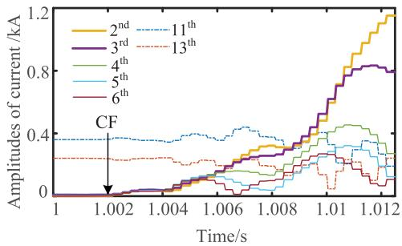  
Fig. 6. Fault inrush current flowing from converter transformer to AC system.

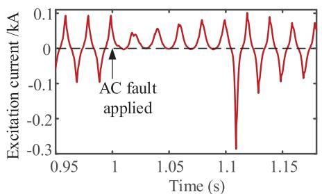  
Fig. 7. Saturation characteristic curve during the AC fault transient process.

the short-circuit fault, it is different from the common excitation inrush current and is called a “fault inrush current”.

After CF occurs, the amplitudes of harmonic current flowing from converter transformer to AC bus increase in Fig. 6. The harmonic currents flowing into the converter bus under steady-state operation are mainly the $1 1 ^ { t h }$ and $1 3 ^ { t h }$ order characteristic ones generated by twelve-pulse inverters. However, during the fault transient process, the amplitudes of these two order harmonic currents do not increase further. Oppositely, as the short-circuit fault in AC system is applied at 1 s and CF occurs at 1.002 s, the amplitudes of low-order non-characteristic harmonic currents increase dramatically, and the amplitudes growth decrease with the increase of order, which is because the AC/DC system usually has higher impedance characteristics in high frequency range. So the harmonic currents induced by the fault inrush current are mainly low-order non-characteristic components, among which the 2nd and $3 ^ { r d }$ order harmonic currents are the main components.

The excitation current curve of the converter transformer during the AC fault transient process is provided in Fig. 7. According to Fig. 7, the excitation current amplitude is symmetric under steady-state operating conditions. Once an AC fault occurs, the DC component of the converter side current makes the magnetic flux of the iron core offset, resulting in the distortion of the excitation current. As the excitation current is no longer symmetrical about the horizontal axis, a large amount of harmonic current is generated in the converter transformer and flows to the AC system.

# B. Mechanism of Harmonics Interaction in Multi-Infeed HVDC Systems With Single-Terminal Connection

As the converter has discrete switching characteristic, the DC voltage can be obtained by the modulation of AC voltage though

switching function, and the AC current can be obtained by the modulation of DC current through switching function:

$$
\left\{ \begin{array}{l} u _ {\mathrm {d c}} = u _ {\mathrm {a}} S _ {u \mathrm {a}} + u _ {\mathrm {b}} S _ {u \mathrm {b}} + u _ {\mathrm {c}} S _ {u \mathrm {c}} \\ i _ {\mathrm {a}} = i _ {\mathrm {d c}} S _ {i \mathrm {a}} \\ i _ {\mathrm {b}} = i _ {\mathrm {d c}} S _ {i \mathrm {b}} \\ i _ {\mathrm {c}} = i _ {\mathrm {d c}} S _ {i \mathrm {c}} \end{array} \right. \tag {3}
$$

where, $S _ { i \mathrm { a } } , S _ { i \mathrm { b } } , S _ { i \mathrm { c } }$ are the switching function of current; $S _ { u \mathrm { a } } .$ $S _ { u \mathrm { b } } , S _ { u \mathrm { c } }$ are the switching function of voltage. The voltage on AC side can be represented as:

$$
\left\{ \begin{array}{l} u _ {\mathrm {a}} = U _ {\mathrm {a n}} \cos \left(\omega_ {n} t + \alpha_ {\mathrm {a n}}\right) \\ u _ {\mathrm {b}} = U _ {\mathrm {b n}} \cos \left(\omega_ {n} t + \alpha_ {\mathrm {b n}}\right) \\ u _ {\mathrm {c}} = U _ {\mathrm {c n}} \cos \left(\omega_ {n} t + \alpha_ {\mathrm {c n}}\right) \end{array} \right. \tag {4}
$$

rewrite the three phase voltages in (4) by symmetric component and substitute them into (3). Considering the commutation overlap angle $\mu$ and taking the first term of Fourier decomposition, it can be found that the positive sequence voltage component on AC side is modulated to DC side by the converter, forming the voltage component with order decreasing by one:

$$
\begin{array}{l} \frac {3 U _ {n} ^ {+}}{2} A _ {1 u} \cos [ (\omega_ {n} - \omega) t + \alpha_ {n} ^ {+} ] \\ = \frac {3 \sqrt {3}}{\pi} \cos \frac {\mu}{2} U _ {n} ^ {+} \cos [ (\omega_ {n} - \omega) t + \alpha_ {n} ^ {+} ] \tag {5} \\ \end{array}
$$

the negative sequence voltage component on AC side is modulated to DC side by the converter, forming the voltage component with order increment by one:

$$
\begin{array}{l} \frac {3 U _ {n} ^ {-}}{2} A _ {1 u} \cos [ (\omega_ {n} + \omega) t + \alpha_ {n} ^ {-} ] \\ = \frac {3 \sqrt {3}}{\pi} \cos \frac {\mu}{2} U _ {n} ^ {-} \cos [ (\omega_ {n} + \omega) t + \alpha_ {n} ^ {-} ] \tag {6} \\ \end{array}
$$

where $A _ { 1 u }$ is the first term coefficient of Fourier decomposition. The process of the converter modulating the harmonic component from the DC side to the AC side is deduced below. It is assumed that there is AC current $i _ { \mathrm { d } }$ on DC side:

$$
i _ {\mathrm {d}} = I _ {\mathrm {d n}} \cos \left(\omega_ {\mathrm {d n}} t + \varphi_ {\mathrm {d n}}\right) \tag {7}
$$

substitute (7) into (3) to obtain the expression of three phase current, and then perform Fourier expansion on it. Take the first term as:

$$
\left\{ \begin{array}{l} i _ {\mathrm {a}} = \frac {\sqrt {3} \sin \mu}{\pi \mu} I _ {\mathrm {d n}} [ \cos \alpha + \cos \beta ] \\ i _ {\mathrm {b}} = \frac {\sqrt {3} \sin \mu}{\pi \mu} I _ {\mathrm {d n}} [ \cos (\alpha - \frac {2 \pi}{3}) + \cos \beta (\alpha + \frac {2 \pi}{3}) ] \\ i _ {\mathrm {c}} = \frac {\sqrt {3} \sin \mu}{\pi \mu} I _ {\mathrm {d n}} [ \cos (\alpha + \frac {2 \pi}{3}) + \cos \beta (\alpha - \frac {2 \pi}{3}) ] \end{array} \right. \tag {8}
$$

where $\alpha = ( \omega _ { \mathrm { d } n } + \omega ) t + \varphi _ { \mathrm { d } n } ; \beta = ( \omega _ { \mathrm { d } n } - \omega ) t + \varphi _ { \mathrm { d } n }$ . According to (8), the harmonic current on DC side is modulated to AC side by converter, forming the positive sequence component with order increment by one and the negative sequence component with order decreasing by one. The harmonic components generated during the transient process of CF will circulate and transform between AC-DC sides though the modulation of converter, resulting the harmonic instability of power system.

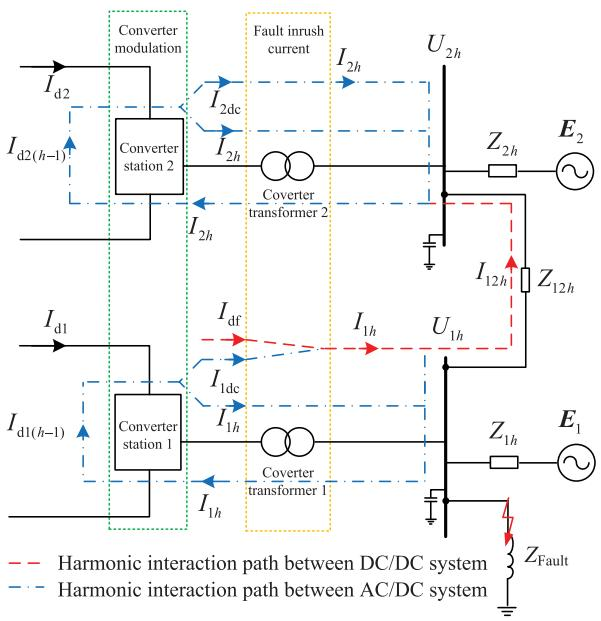  
Fig. 8. Harmonic interaction path in multi-infeed HVDC systems with singleterminal connection.

Based on the converter switching modulation theory, the harmonic interaction process of in MI-HVDC systems with singleterminal connection is depicted in Fig. 8, where $Z _ { i h }$ and $U _ { i h }$ represent the equivalent AC system impedance and the voltage at bus i for the $h ^ { t { \hat { h } } }$ order harmonic component; $E _ { i }$ is the equivalent electromotive force near bus i (fundamental frequency) of AC system; $Z _ { i j h }$ represents the equivalent impedance between bus i and $\cdot j$ for the $h ^ { t { \bar { h } } }$ order harmonic component. The red dotted line path represents the harmonic interaction between DC/DC system through the AC-side coupling, and the blue point line indicates the harmonic interaction between AC/DC system through the converter modulation.

As a short-circuit fault is applied near a converter bus (bus 1 in Fig. 8 for example), the voltage of the bus will descend significantly and the LCF occurs. Then the DC component of current on converter side $I _ { \mathrm { d f } }$ caused by LCF flows into converter transformer, inducing the fault inrush current. Under this circumstance, converter transformer is equivalent to a harmonic current source, injecting harmonic current into bus $1 . I _ { 1 h }$ in Fig. 8 refer to the sum of harmonic currents injected into AC bus $1 . I _ { 1 h }$ acts on the $h ^ { t h }$ harmonic impedance on AC side, further generating the harmonic voltage $U _ { 1 h }$ , which distorts the voltage of AC bus. In Fig. 8, the harmonic voltage $U _ { 1 h }$ of the bus near the fault leads to the formation of harmonic current $I _ { 1 2 h }$ in equivalent coupling channel, making the harmonic components be able to transfer to the bus far from the fault, generating the harmonic voltage $U _ { 2 h }$ on bus 2.

Note that the AC filters installed on converter bus are designed to filter out the harmonics with specific frequency generated in steady-state operating condition, such as the $1 1 ^ { i h } , 1 3 ^ { t h } , 2 3 ^ { t h }$ , $2 5 ^ { t h }$ and $3 ^ { r d }$ order harmonics. So AC filters cannot effectively cope with the non-characteristic low-order harmonic components generated during fault transient process. In addition, in the

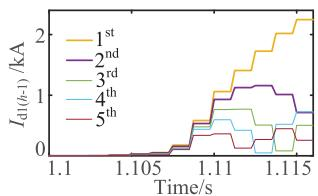

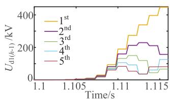  
(b)   
Fig. 9. AC components on DC side of converter station 1 generated by converter modulation. (a) AC current; (b) AC voltage.

converter station, the smoothing reactor can limit the amplitude and rising rate of the DC current during the transient process, and resists the harmonic components induced by CF to some extent rather than eliminates them. Thus, during the short-circuit fault transient process, the harmonic interaction in MI-HVDC system is inevitable.

According to the converter switch modulation theory, $I _ { 1 h }$ and $I _ { 2 h }$ in converter station 1 and 2 are modulated to DC side with order decreasing by 1, generating the $( h - 1 ) ^ { t h }$ order harmonic currents $I _ { \mathrm { d 1 } ( h - 1 ) }$ and $I _ { \mathrm { d 2 ( } h - 1 ) }$ on DC side, as the blue dotted path shown in Fig. 8. As shown in Fig. 9, there is a high amplitude of the fundamental component on DC side of Converter 1, which agrees with the analysis that the positive sequence $2 ^ { n d }$ order harmonic component with high amplitude on the AC side will be modulated to the DC side and forms fundamental component. The AC current $I _ { \mathrm { d 1 } ( h - 1 ) }$ and $I _ { \mathrm { d 2 ( } h - 1 ) }$ on DC side are then modulated back to the AC side forming the negative sequence component with order decreasing by 1 and the positive sequence component with order increasing by 1. Therefore, the fundamental current on DC side modulated to the AC side will generate the DC current and positive sequence of the $2 ^ { n d }$ order harmonic current. And then, DC components $I _ { \mathrm { 2 d c } } , I _ { \mathrm { 1 d c } }$ on AC side will flow into the transformer winding and continue causing the inrush current, forming the harmonic transfer circulation of AC-DC system.

Because the harmonic current induced by fault inrush current is mainly the $2 ^ { n d }$ order component, the transfer process of the $2 ^ { n d }$ order harmonic component in MI-HVDC systems with single-terminal connection is illustrated in Fig. 10 as an example.

# C. Mechanism of Harmonics Interaction in Multi-Infeed HVDC Systems With Hierarchical Connection

In MI-HVDC systems with hierarchical connection, the ACside coupling on receiving-end is formed through the AC network and transformer between two buses, as the blue path depicted in Fig. 11. And the DC-side coupling is formed though the same DC current path of high-side and low-side inverters, indicated as the the red path in Fig. 11. When a short-circuit fault occurs, the inverter connected to the bus near the fault (bus 2 in Fig. 11 for example) will suffer the LCF due the voltage sag. Thus, the current on converter side is no longer symmetric about the horizontal axis in Fig. 11, resulting in DC component $I _ { \mathrm { { 2 d f } } } . \mathrm { { A t } }$ the same time, the bypass pair will be formed temporarily in the converter with LCF, making the DC current $I _ { \mathrm { d } }$ rise sharply. The dramatic rise of $I _ { \mathrm { d } }$ will directly cause the current on converter

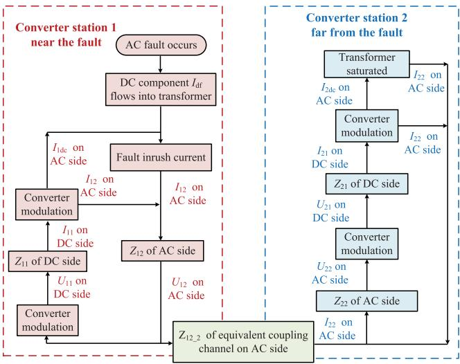  
Fig. 10. Transfer process of the $2 ^ { n d }$ order harmonic component in singleterminated multi-infeed HVDC system.

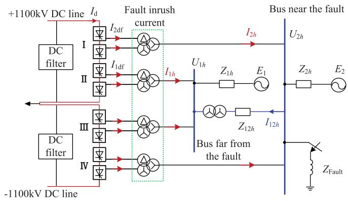  
Fig. 11. Harmonic interaction path in HVDC system with hierarchical connection.

side far from the fault becomes unsymmetrical and generating DC component $I _ { \mathrm { 1 d f } } . ~ I _ { \mathrm { 2 d f } }$ and $I _ { \mathrm { 1 d f } }$ flow into the transformer winding and causes fault inrush current, generating the $h ^ { t h }$ order harmonic currents. $I _ { 1 h }$ and $I _ { 2 h }$ in Fig. 11 refer to the sum of harmonic currents injected into AC bus 1 and 2. And $U _ { 1 h } , U _ { 2 h }$ are the harmonic voltages of converter buses 1 and 2 caused by $I _ { 1 h }$ and $I _ { 2 h }$ , respectively. $U _ { 2 h }$ and $U _ { 1 h }$ also cause the formation of the $h ^ { t h }$ order harmonic current $I _ { 1 2 h }$ in AC-side coupling channel, inducing the harmonics exchange between two buses.

According to the analysis above, the harmonic interaction process in MI-HVDC systems with hierarchical connection is indicated in Fig. 12. The DC-side harmonic coupling in HVDC system with hierarchical connection can directly cause fault inrush current in the converter transformer far away from the fault. Meanwhile, the AC-side harmonic interaction in the HVDC system with hierarchical connection is not a one-way transfer process from the bus near the fault to the bus far away from the fault, but an interaction between $U _ { 2 h }$ and $U _ { 1 h }$ . And the value of $I _ { 1 2 h }$ is determined by the inrush currents(values of $I _ { 2 h }$ and $I _ { 1 h } )$

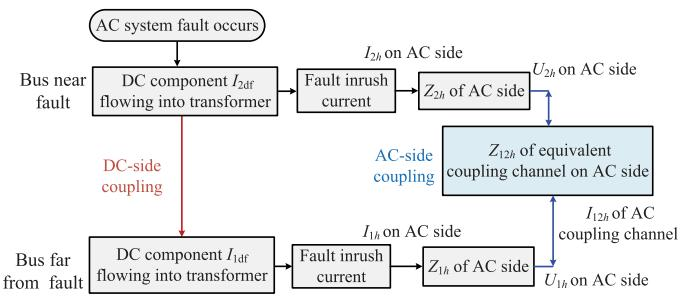  
Fig. 12. Harmonic interaction in multi-infeed HVDC systems with hierarchical connection.

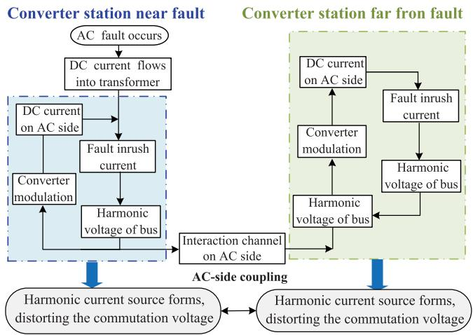  
Fig. 13. Diagram of harmonic interaction in multi-infeed HVDC systems with single-terminal connection.

and parameters of the AC network near two bus locations(values of $Z _ { 2 h } , Z _ { 1 h }$ and $Z _ { 1 2 h } )$ .

# IV. IMPACT OF HARMONIC INTERACTION ON EXTINCTIONANGLE OF MULTI-INFEED HVDC SYSTEMS

# A. Equivalent Circuit Model of Harmonic Transfer in Multi-Infeed HVDC Systems

The harmonic interaction process in MI-HVDC systems with single-terminal connection in Fig. 8 could be simplified as the diagram in Fig. 13. The impact of a series of process in the blue dotted box can be summarized as: a harmonic current source is formed in the converter station close to the fault, causing the distortion of converter bus voltage. Similarly, the impact of a series of process in the green dotted box could be summarized as: a harmonic current source is also formed in the converter station far away from the fault, causing the distortion of converter bus voltage.

The harmonic coupling processes in MI-HVDC systems with hierarchical connection described in Fig. 11 and Fig. 12 can be simplified as the diagram in Fig. 14. The consequence of DCside coupling is that harmonic sources are formed both in two transformers on the receiving end, and harmonic currents flow into the buses to distort the commutation voltage. Meanwhile, due to the existence of AC-side coupling, there is also harmonic voltage exchange between the two buses.

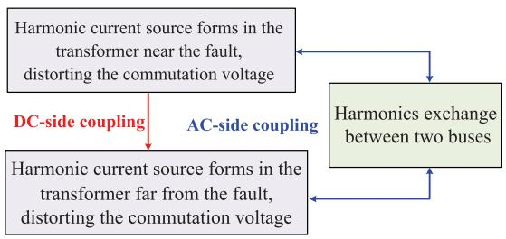  
Fig. 14. Diagram of harmonic interaction in multi-infeed HVDC systems with hierarchical connection.

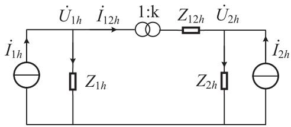  
Fig. 15. Equivalent circuit model of harmonic transfer in MI-HVDC systems.

Based on the analysis of Figs. 12 and 14, it can be found that the difference between the harmonic interaction processes in MI-HVDC systems with single-terminal connection and the hierarchical connection is brought about by the topology structure diversity. In detail, the harmonic interaction between converter buses in MI-HVDC systems with single-terminal connection achieves only through an AC-side channel. If the electrical distance between two converter buses is assumed to be infinite and the AC-side channel is cut, then the harmonic interaction process between converter buses will no longer exist. Whereas, the harmonic interaction between converter buses in MI-HVDC systems with a hierarchical connection can achieves both through AC-side and DC-side channels. As a result, if the electrical distance between two converter buses is assumed to be infinite and the AC-side channel is cut, the harmonic interaction process between converter buses in the multi-infeed system with hierarchical connection will still exist. Although the harmonic interaction processes in the MI-HVDC systems with single-terminal connection and hierarchical connection are different, the final consequences caused by the harmonic interaction have something in common, which can be summarized as follows: 1) The harmonic source will form both in the converter transformer near the faut and that far from the fault, injecting harmonic currents into the converter bus. 2) Harmonic voltage of converter buses exchanges through AC network. And the effect of transformers between buses of different voltage levels on harmonic amplitudes should also be considered in MI-HVDC systems with hierarchical connection.

Based on the conclusion above, in Fig. 15, an equivalent circuit model of harmonic transfer in MI-HVDC systems is established. For simplification, the sum of harmonic currents injecting into AC bus i is equivalent to harmonic sources $\dot { I } _ { i h }$ in Fig. 15; $\dot { U } _ { i h }$ and $Z _ { i h }$ represent the $h ^ { t h }$ order harmonic voltage of AC bus i and the equivalent $\mathrm { A C }$ impedance close to bus i, respectively; $\dot { I } _ { i j h }$ represents the $h ^ { t h }$ order harmonic current in the AC-side between bus i and $j ; Z _ { i j h }$ represents the $h ^ { t h }$

order harmonic equivalent impedance between i and $j ,$ including transformer impedance and transmission line impedance; k is the transformer ratio between two buses. As for a MI-HVDC systems with single-terminal or multi-terminal connection, the transformer ratio k is 1.

${ \dot { I } } _ { 1 h }$ and $\dot { I } _ { 2 h }$ generate harmonic voltages on bus 1 and 2 as:

$$
\dot {U} _ {1 h} = \left(\dot {I} _ {1 h} - \dot {I} _ {1 2 h}\right) Z _ {1 h} \tag {9}
$$

$$
\dot {U} _ {2 h} = \left(\dot {I} _ {2 h} + \frac {1}{k} \dot {I} _ {1 2 h}\right) Z _ {2 h} \tag {10}
$$

considering the impact of transformer, the harmonic exchange between $\dot { U } _ { 1 h }$ and $\dot { U } _ { 2 h }$ is:

$$
k \dot {U} _ {1 h} - \dot {U} _ {2 h} = \frac {1}{k} \dot {I} _ {1 2 h} Z _ {1 2 h} \tag {11}
$$

combine (9)–(11):

$$
\dot {I} _ {1 2 h} = \frac {k \dot {I} _ {1 h} - \dot {I} _ {2 h} Z _ {2 h}}{k Z _ {1 h} + \frac {1}{k} Z _ {2 h} + \frac {1}{k} Z _ {1 2 h}} \tag {12}
$$

the transfer coefficient $T _ { 1 2 h }$ of the $h ^ { t h }$ order harmonic voltage from bus 1 to bus 2 is:

$$
T _ {1 2 h} = \frac {\dot {U} _ {2 h}}{\dot {U} _ {1 h}} = \frac {\left(k \dot {I} _ {1 h} + k ^ {2} \dot {I} _ {2 h}\right) Z _ {1 h} Z _ {2 h} + \dot {I} _ {2 h} Z _ {1 2 h} Z _ {2 h}}{\left(\dot {I} _ {1 h} + k \dot {I} _ {2 h}\right) Z _ {1 h} Z _ {2 h} + \dot {I} _ {1 h} Z _ {1 2 h} Z _ {1 h}} \tag {13}
$$

$T _ { 1 2 \ h }$ describes the amplitude transformation and phase shift of $h ^ { t h }$ order harmonic voltage transferring from bus 1 to bus 2 in MI-HVDC systems. In $( 1 3 ) , T _ { 1 2 h }$ is determined by parameters of fault inrush current $\dot { I } _ { 1 h } , \dot { I } _ { 2 h } , \mathrm { A C }$ network parameters $Z _ { 1 h }$ , $Z _ { 2 h } , Z _ { 1 2 h }$ and voltage grade ratio k of converter buses.

According to the analysis of the dual-infeed system above, the equivalent circuit model of harmonic transfer in more general cases, such as the MI-HVDC systems with three converter buses on the receiving-end in Fig. 16 can be deduced easily as Fig. 17, where $k _ { i j }$ is the transformer ratio between two bus i and $j .$ The variable relationships in Fig. 17 can be described by the following six equations:

$$
\dot {U} _ {1 h} = \left(\dot {I} _ {1 h} - \dot {I} _ {1 2 h} - \dot {I} _ {1 3 h}\right) Z _ {1 h} \tag {14}
$$

$$
\dot {U} _ {2 h} = \left(\dot {I} _ {2 h} + \frac {1}{k _ {1 2}} \dot {I} _ {1 2 h} - \dot {I} _ {2 3 h}\right) Z _ {2 h} \tag {15}
$$

$$
\dot {U} _ {3 h} = \left(\dot {I} _ {3 h} + \frac {1}{k _ {1 3}} \dot {I} _ {1 3 h} - \frac {1}{k _ {2 3}} \dot {I} _ {2 3 h}\right) Z _ {3 h} \tag {16}
$$

$$
k _ {1 2} \dot {U} _ {1 h} - \dot {U} _ {2 h} = \frac {1}{k _ {1 2}} \dot {I} _ {1 2 h} Z _ {1 2 h} \tag {17}
$$

$$
k _ {2 3} \dot {U} _ {2 h} - \dot {U} _ {3 h} = \frac {1}{k _ {2 3}} \dot {I} _ {2 3 h} Z _ {2 3 h} \tag {18}
$$

$$
k _ {1 3} \dot {U} _ {1 h} - \dot {U} _ {3 h} = \frac {1}{k _ {1 3}} \dot {I} _ {1 3 h} Z _ {1 3 h} \tag {19}
$$

Then harmonic transfer parameters $I _ { 1 2 h } , \ I _ { 1 3 h } , \ I _ { 2 3 h } , \ U _ { 1 h }$ , $U _ { 2 h } , U _ { 3 h }$ can be solved by combining (14)–(19). In the actual engineering project, the MI-HVDC system containing two or three converter buses on the receiving end is the most common. Therefore, the situations displayed in Figs. 15 and 17 can meet most of the analysis requirements. For the cases of MI-HVDC systems containing more converter buses, the analysis method

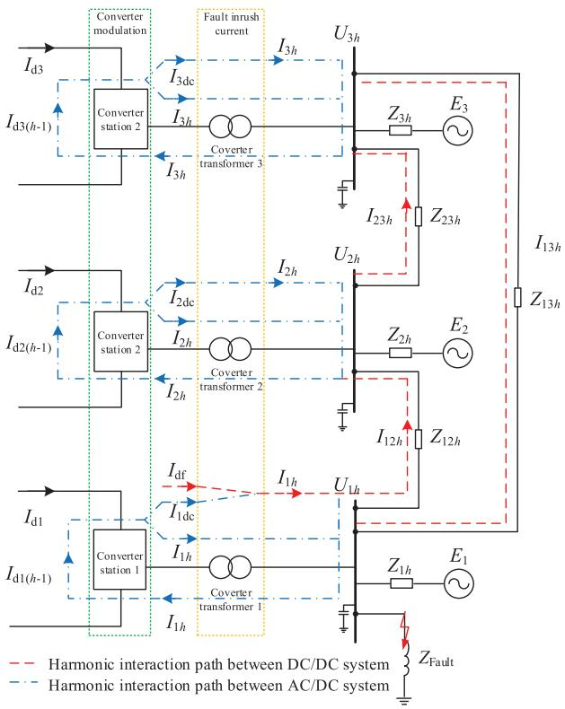  
Fig. 16. Harmonic interaction path in MI-HVDC systems with three converter buses on receiving-end.

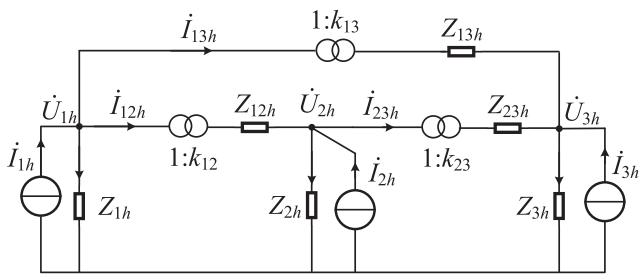  
Fig. 17. Equivalent circuit model of harmonic transfer in MI-HVDC systems with three converter buses on receiving-end.

is the same as those in Figs. 15 and 17, which can be easily derived.

# B. Quantitative Calculation of Extinction Angles in Multi-Infeed HVDC Systems Considering Harmonic Interaction

The impact of harmonic voltage on extinction angle is illustrated in Fig. 18 [30]. As the analysis in previous sections, the harmonic components generated by LCF will transfer from nearfault converter bus to remote ones through AC-side interaction channel (in MI-HVDC system with single-terminal connection) or both AC-side and DC-side interaction channels (in MI-HVDC system with hierarchical connection). As shown in Fig. 18, these harmonic components will distort the voltage of the remote convert bus from sine curve U to $U ^ { \prime }$ , and cause the zero-crossing point shift of commutation voltage φ. Under this circumstance, to keep $S _ { \mathrm { d } }$ (blue shadow area)=S- (orange shadow area), the

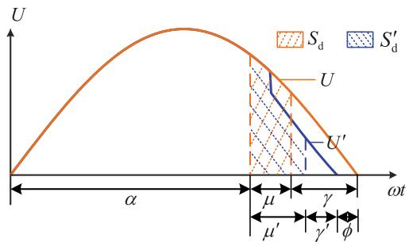  
Fig. 18. Diagram of the impact of harmonic voltage on extinction anlge.

commutation time $\mu$ will be changed to $\mu ^ { \prime }$ . Consequently, the extinction angle of the remote inverter will be compressed from $\gamma \ { \mathrm { t o } } \ \gamma ^ { \prime } . \ \gamma ^ { \prime }$ is smaller than the minimum extinction angle γmin for a normal commutation, and CCF of the remote inverter will occur. Thus, the extinction angle $\gamma ^ { \prime }$ considering the impact of harmonic component is:

$$
\gamma^ {\prime} = \pi - \alpha - \mu^ {\prime} - \phi \tag {20}
$$

With the equivalent circuit model of harmonic transfer in the MI-HVDC systems, the harmonic interaction parameters can be calculated. Then the impact of harmonic interaction on the extinction angle can be calculated according to (20). In the early period of harmonic generation, DC control will not change the firing angle α immediately. Thus, to simplify the calculation, firing angle α is considered to be constant, and the DC current $I _ { \mathrm { d } }$ does not change immediately, so $S _ { \mathrm { d } } = S _ { \mathrm { d } } ^ { \prime }$ . Modifying (1), the following relations of VTA before and after harmonics generation can be obtained:

$$
\begin{array}{l} \int_ {\frac {\mu + \alpha}{\omega}} ^ {\frac {\alpha}{\omega}} E _ {1} \cos (\omega t + \varphi_ {1}) \mathrm {d} t = \int_ {\frac {\mu^ {\prime} + \alpha}{\omega}} ^ {\frac {\alpha}{\omega}} [ E _ {1} \cos (\omega t + \varphi_ {1}) \\ + \sum_ {n = 2} ^ {N} E _ {n} \cos (n \omega t + \varphi_ {n}) ] d t \tag {21} \\ \end{array}
$$

where, $\varphi _ { n }$ and $E _ { n }$ represent the and phase and amplitude of the $n ^ { t h }$ order commutation voltage, respectively. Simplify (21):

$$
\begin{array}{l} E _ {1} \left[ \sin (\mu + \alpha + \varphi_ {1}) - \sin (\mu^ {\prime} + \alpha + \varphi_ {1}) \right] \\ = \sum_ {n = 2} ^ {N} \frac {E _ {n}}{n} \left[ \sin \left[ n \left(\mu^ {\prime} + \alpha\right) + \varphi_ {n} \right] - \sin \left(n \alpha + \varphi_ {n}\right) \right] \tag {22} \\ \end{array}
$$

In MI-HVDC systems, based on the calculation of harmonic voltages induced by fault inrush current. By solving (22), $\mu ^ { \prime }$ could be obtained. The zero-crossing point shift φ of commutation voltage caused by harmonic components can be calculated by numerical solution of waveforms.

# V. SIMULATION VERIFICATION

# A. Verification of Equivalent Circuit Model via Electromagnetic Simulation

1) Verification in Single-Terminal Connected MI-HVDC System: Firstly, the accuracy of $T _ { 1 2 h }$ is verified in the MI-HVDC system with single-terminal connection as follows, which takes

TABLE IMAIN PARAMETERS OF THE ELECTROMAGNETIC TRANSIENT MODEL OFMI-HVDC SYSTEM WITH SINGLE-TERMINAL CONNECTION  

<table><tr><td>Parameter</td><td>Value</td><td>Parameter</td><td>Value</td></tr><tr><td>U1(L–L)</td><td>525 kV</td><td>U2(L–L)</td><td>525 kV</td></tr><tr><td>Z11</td><td>8.50∠84.24°Ω</td><td>Z21</td><td>15.58∠81.84°Ω</td></tr><tr><td>Z12</td><td>33.41∠83.09°Ω</td><td>Z22</td><td>67.22∠76.46°Ω</td></tr><tr><td>Z13</td><td>48.63∠−26.95°Ω</td><td>Z23</td><td>53.92∠−28.56°Ω</td></tr><tr><td>Z14</td><td>35.37∠−74.55°Ω</td><td>Z24</td><td>25.46∠−49.55°Ω</td></tr><tr><td>Z12-1</td><td>65.88∠85.0°Ω</td><td>Z12-2</td><td>131.38∠87.5°Ω</td></tr><tr><td>Z12-3</td><td>196.97∠88.33°Ω</td><td>Z12-4</td><td>262.57∠88.75°Ω</td></tr><tr><td>k</td><td>525/525</td><td></td><td></td></tr></table>

TABLE IIPARAMETERS OF 2ND ORDER HARMONIC TRANSFER CIRCUIT IN MI-HVDCSYSTEM WITH SINGLE-TERMINAL CONNECTION  

<table><tr><td>Parameter</td><td>Value</td><td>Parameter</td><td>Value</td></tr><tr><td>I12</td><td>0.1∠30° kA</td><td>I22</td><td>0.2∠30° kA</td></tr><tr><td>Z12</td><td>33.41∠83.09°Ω</td><td>Z22</td><td>67.22∠76.46°Ω</td></tr><tr><td>Z12-2</td><td>131.38∠87.5°Ω</td><td>k</td><td>525/525</td></tr></table>

TABLE IIIACCURACY OF THE CALCULATION BASED ON THE $2 ^ { n d }$ ORDER HARMONICMODEL WITH SINGLE-TERMINAL CONNECTION  

<table><tr><td rowspan="2">Parameter</td><td rowspan="2">Calculated value</td><td rowspan="2">Measured value</td><td colspan="2">Amplitude Angle</td></tr><tr><td>error</td><td>error</td></tr><tr><td>I12-2 /kA</td><td>0.0576∠149.63°</td><td>0.0589∠155.88°</td><td>2.2%</td><td>6.25°</td></tr><tr><td>U12 /kV</td><td>5.165∠89.67°</td><td>5.042∠88.89°</td><td>2.4%</td><td>0.78°</td></tr><tr><td>U22 /kV</td><td>12.53∠100.85°</td><td>12.72∠99.43°</td><td>1.5%</td><td>1.42°</td></tr><tr><td>T12-h</td><td>2.434∠11.19°</td><td>2.523∠10.54°</td><td>3.5%</td><td>0.65°</td></tr></table>

the calculation of A-phase as an example. The diagram and main parameters of the MI-HVDC system with single-terminal connection in the simulation are indicated in Fig. 8 and Table I, respectively. And the harmonic impedance of the system in Table I is acquired by the impedance scanning.

The verification result of the $2 ^ { n d }$ order harmonic transfer circuit is provided as follows, and the known parameters of the $2 ^ { n d }$ harmonic transfer equivalent circuit model are listed in Table II. The two buses 1 and 2 on the receiving end of the MI-HVDC system with single-terminal connection depicted in Fig. 8 are injected into the $2 ^ { n d }$ harmonic current source $I _ { 1 2 }$ and $I _ { 2 2 } ,$ , respectively. $Z _ { 1 2 }$ and $Z _ { 2 2 }$ are the equivalent impedances of the 2nd harmonic component near bus 1 and 2, consisting of the impedance of the AC network and AC filter. $Z _ { 1 2 , 2 }$ is the equivalent impedance of the AC-side interaction channel between buses 1 and 2 to the $2 ^ { n d }$ harmonic component, including the leakage reactance of the transformer and impedance of the transmission line. Substitute these parameters into (13) to calculate the transfer coefficient of the $2 ^ { n d }$ harmonic component. The comparison of the calculated and measured values is shown in Table III.

According to Table III, the harmonic parameters calculated with the equivalent circuit model are highly consistent with the

TABLE IVMAIN PARAMETERS OF DIFFERENT ORDER HARMONIC TRANSFER CIRCUIT INHIERARCHICAL CONNECTION MI-HVDC SYSTEM  

<table><tr><td>Parameter</td><td>Value</td><td>Parameter</td><td>Value</td></tr><tr><td>U1(L–L)</td><td>1100 kV</td><td>U2(L–L)</td><td>525 kV</td></tr><tr><td>Z11</td><td>72.88∠90°Ω</td><td>Z21</td><td>18.49∠90°Ω</td></tr><tr><td>Z12</td><td>147.77∠82.39°Ω</td><td>Z22</td><td>388.49∠89.99°Ω</td></tr><tr><td>Z13</td><td>272.32∠-82.71°Ω</td><td>Z23</td><td>49.71∠-20.17°Ω</td></tr><tr><td>Z14</td><td>108.75∠-73.62°Ω</td><td>Z24</td><td>53.11∠-71.78°Ω</td></tr><tr><td>Z12-1</td><td>411.86∠90°Ω</td><td>Z12-2</td><td>823.72∠90°Ω</td></tr><tr><td>Z12-3</td><td>1235.58∠90°Ω</td><td>Z12-4</td><td>1647.44∠90°Ω</td></tr><tr><td>k</td><td>1100/525</td><td></td><td></td></tr></table>

TABLE VACCURACY OF THE CALCULATION BASED ON THE $2 ^ { n d }$ ORDER HARMONICTRANSFER MODEL WITH HIERARCHICAL CONNECTION  

<table><tr><td>Parameter</td><td>Calculated value</td><td>Measured value</td><td>Amplitude error</td><td>Angle error</td></tr><tr><td>I12-2 /kA</td><td>0.0129∠ - 18.44°</td><td>0.0130∠ - 15°</td><td>0.31%</td><td>3°</td></tr><tr><td>U12 /kV</td><td>22.13∠85.86°</td><td>23.00∠84.00°</td><td>3.8%</td><td>1.86°</td></tr><tr><td>U22 /kV</td><td>12.93∠83.18°</td><td>13.00∠83.00°</td><td>0.54%</td><td>0.18°</td></tr><tr><td>T12-h</td><td>1.712∠2.68°</td><td>1.769∠1°</td><td>3.2%</td><td>1.68°</td></tr></table>

measured values. The main causes of errors are as follows: (1) The excitation admittance of the transformer is ignored. (2) The influence of transmission line capacitance is ignored. However, because the AC filter capacitance is much bigger than that of overhead wire, harmonic interaction analysis in the MI-HVDC system concentrates on the low-order components. Therefore, considering the capacitance of the AC filter, there is little influence on the result of low-order harmonic transfer analysis while ignoring the capacitance of the overhead wire.

2) Verification in Hierarchical Connected MI-HVDC System: The diagram and main parameters of the MI-HVDC system with hierarchial connection in simulation are indicated in Fig. 11 and Table IV, respectively. And the harmonic impedance of the system in Table IV is also acquired by the impedance meter. The two buses 1 and 2 on receiving-end of the MI-HVDC system with hierarchical connection depicted in Fig. 11 are injected into the $2 ^ { n d }$ harmonic current source $\dot { I } _ { 1 2 }$ and $\dot { I } _ { 2 2 }$ , respectively. And the parameters of $\dot { I } _ { 1 2 }$ and $\dot { I } _ { 2 2 }$ are as same as those in Table II. Substitute these known parameters above into (13) to calculate the transfer coefficient of the $2 ^ { n d }$ harmonic component. The comparison of the calculated and measured values are shown in Table V.

According to Table V, the harmonic parameters calculated with the equivalent circuit model are highly consistent with the measured values. And the time and wave recording of measured amplitudes and angles of $U _ { 1 2 }$ and $U _ { 2 2 }$ in case Table V are shown in Fig. 19. It can be found that the time-domain wave is consistent with the analysis results in Table V.

The recording waves of electrical quantities on AC/DC side during harmonic current interference in case Table V are depicted in Fig. 20. The variation of harmonic components of AC current and voltage before and after interference are shown in

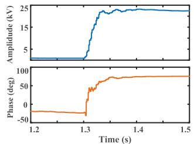

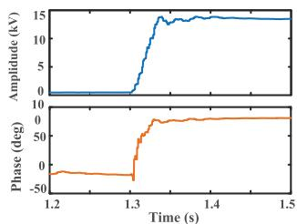  
(b)

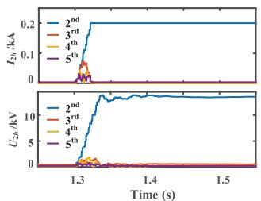  
Fig. 19. Amplitude and phase recording of measured voltages: (a) $U _ { 1 2 }$ (b) $U _ { 2 2 }$ .   
(a)

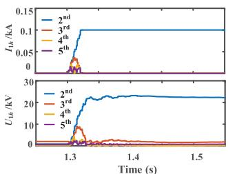  
(b)

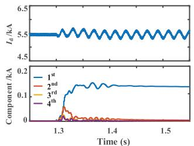  
(c）

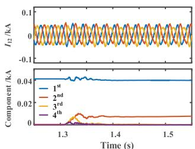  
(d)   
Fig. 20. Recording wave analysis of electrical quantity on AC/DC side during harmonic current interference. (a) Component of $I _ { 2 h }$ and $U _ { 2 h }$ (b) Component of $I _ { 1 h }$ and $U _ { 1 h } ; ( \mathbf { c } )$ Waveform and component of $I _ { \mathrm { d } } ; ( \mathrm { d } )$ Waveform and component of $I _ { 1 2 }$ .

Fig. 20(a) and (b). According to the converter switch modulation theory, the positive sequence of the $2 ^ { n d }$ order harmonic current injected into the AC side will be modulated to the DC side, forming a fundamental component. And this conclusion is confirmed by the recording waveform of $I _ { \mathrm { d } }$ in Fig. 20(c). With the injection of the $2 ^ { n d }$ order harmonic current at 1.3 s, the DC current waveform appears sinusoidal fluctuation with a period of 0.2 s. And the fundamental AC component appears in the component analysis of $I _ { \mathrm { d } } .$ . In Fig. 20(d), the equivalent coupling channel on the AC side originally contains a stable fundamental component current of 0.04 kA. After harmonic source injection, the $2 ^ { n d }$ order harmonic component appears, which brings harmonic exchange between buses 1 and 2.

The recording wave of excitation current and magnetic flux before (in blue) and after (in orange) the injection of harmonic current sources in the case Table V is displayed in Fig. 21. It can be seen that after the harmonic injection, the magnetic flux of the converter transform will be offset, which results in the increased distortion of the excitation current.

Besides, the calculation results of the $2 ^ { n d } , 3 ^ { r d }$ and $4 ^ { t h }$ harmonic transfer coefficients in MI-HVDC system with hierarchical connection are indicated in Table VI, and the parameter of

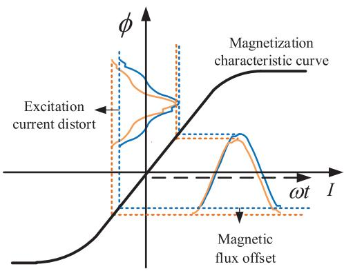  
Fig. 21. DC magnetic bias of transformer under the injection of $2 ^ { n d }$ order harmonic current.

TABLE VI ACCURACY OF THE CALCULATION BASED ON THE $2 ^ { n d } , 3 ^ { r d } , 4 ^ { r d }$ ORDER HARMONIC TRANSFER MODEL WITH HIERARCHICAL CONNECTION   

<table><tr><td>Harmonic order</td><td>Calculated T12-h</td><td>Measured T12-h</td><td>Amplitude error</td><td>Angle error</td></tr><tr><td>2</td><td>1.712∠2.68°</td><td>1.769∠1°</td><td>3.2%</td><td>1.68°</td></tr><tr><td>3</td><td>5.03∠-70.9°</td><td>4.81∠-70°</td><td>4.6%</td><td>0.9°</td></tr><tr><td>4</td><td>0.9068∠-3.91°</td><td>0.9611∠-3.5°</td><td>5.6%</td><td>0.41°</td></tr></table>

TABLE VII COMPARISON OF CALCULATED AND MEASURED COMMUTATION PARAMETERS CONSIDERING IMPACT OF $2 ^ { n d }$ ORDER HARMONIC INTERACTION   

<table><tr><td>Stable value</td><td>Calculated value</td><td>Measured value</td></tr><tr><td>μ1=14.4°</td><td>μ1′=15.01°</td><td>μ1′=15.12°</td></tr><tr><td>μ2=14.4°</td><td>μ2′=13.68°</td><td>μ2′=13.60°</td></tr><tr><td>φ1=0°</td><td>φ1=1.250°</td><td>φ1=1.251°</td></tr><tr><td>φ2=0°</td><td>φ2=1.006°</td><td>φ2=1.008°</td></tr><tr><td>γ1=21.10°</td><td>γ1′=18.1°</td><td>γ2′=18.8°</td></tr><tr><td>γ2=21.13°</td><td>γ2′=19.8°</td><td>γ2′=20.5°</td></tr></table>

harmonic current injected into bus 1 and 2 are also $0 . 2 \angle 3 0 ^ { \circ }$ kA and $0 . 1 \angle 3 0 ^ { \circ } \mathrm { k A }$ , respectively. According to Table VI, the accuracy of the main low-order harmonic components participate in harmonic interaction in MI-HVDC systems is acceptable.

# B. Calculation Verification via Electromagnetic Simulation

Taking the $2 ^ { n d }$ order harmonic case shown in Table V as an example, the commutation parameters of Y/Y connection converter in the second commutation process after harmonic injection is calculated in Table VII. Substitute the $2 ^ { n d }$ order harmonic interaction parameters in Table V into (22) to solve the value of $\mu ^ { \prime } .$ In Table VII, the $2 ^ { n d }$ order harmonic coupling makes the commutation time of commutator 1 becomes longer, while that of commutator 2 becomes shorter. The zerocrossing point shift of commutation voltage $\phi$ is acquired by computer numerical solution. A positive value of φ represents left shift, referring the advance of the zero-crossing moment, and a negative value represents right shift, referring the lag of

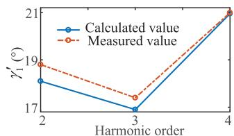  
(a)

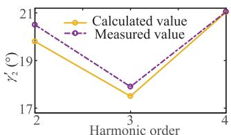  
  
Fig. 22. Comparison of calculated and measured $\gamma ^ { \prime }$ considering impact of various order harmonic interaction. (a) Commutator 1; (b) Commutator 2.

zero-crossing moment. According to Table VII, under the impact of the $2 ^ { n d }$ order harmonic component, the zero crossing time of commutation voltage of bus 1 and 2 is both advanced, and φ is positive. Substitute the calculated values of $\mu ^ { \prime }$ and φ into (20) to obtain the values of $\gamma ^ { \prime }$ . It can be seen that $2 ^ { n d }$ order harmonic interaction makes the extinction angles of commutator 1 and 2 both decreases, and the extinction angle of commutator 1 with larger amplitude of harmonic current reduces more obviously.

The comparison of calculated and measured $\gamma ^ { \prime }$ considering impacts of the $2 ^ { n d } , 3 ^ { r d }$ and $4 ^ { t h }$ order harmonic interactions is shown Fig. 22. And the parameter of harmonic current injected into bus 1 and 2 are $0 . 1 \angle 3 0 ^ { \circ } \mathrm { k A }$ and $0 . 2 \angle 3 0 ^ { \circ } \mathrm { k A }$ , respectively. The main reasons for errors in the calculation of extinction angle are as follows: 1) The calculation assumes that the firing angle α is constant, but actually, α is always under dynamic feedback adjustment. Even in the steady-state operation, the α of each firing control is different, with a fluctuation range of about $0 . 2 5 ^ { \circ } ; 2 )$ The calculation assumes that the fundamental voltage is unchanged, but the amplitude of fundamental voltage amplitude will change as the harmonic component is being injected; 3) In the process of harmonic interaction, the angle values measured is continuing fluctuated rather than constant, so the read of measured value also cause errors; 4) The power system itself contains a certain amount of harmonic components with other frequencies, which are not taken into account in the calculation.

In Section V, the transfer coefficient of each low-order harmonic component and its influence on the extinction angle have been verified separately according to the order. There will be multiple harmonics superpositions at the same time. In future work, authors will verify more complicated study cases with multiple harmonic sources superposition simultaneously. It is worth pointing out that although this paper only introduces and displays the analysis and calculation method of the MI-HVDC system with two converter buses on the receiving end. The mechanism and formulas can be generalized to the MI-HVDC systems with three or more converter buses on the receiving end.

# C. Discussion

Calculations based on the harmonic transfer equivalent model proposed in this paper are demonstrated under the stable harmonic current source cases. Based on this model, the harmonic interaction parameters and the fluctuation of extinction angle under quasi-steady-state harmonic interference can be evaluated with high accuracy. However, because FFT harmonic analysis requires a complete periodic sampling of harmonics, its analysis

in the transient process where harmonic parameters change rapidly shows hysteresis. Thus, the online harmonic analysis at present usually reduces the requirement of accuracy to ensure rapidity. In future work, an engineering practical algorithm of harmonics analysis with both symmetric and asymmetric faults, and the CF prevention methods under its guidance will be the major tasks to improve the accuracy of fast online analysis.

# VI. CONCLUSION

This paper investigates the mechanism and quantitative calculation of harmonic interaction in MI-HVDC systems. The mechanism of harmonic generation in CF transient process caused by AC system short-circuit fault is analyzed. After CF, the DC current component of the current on converter side flows into the converter transformer and leads to the fault inrush current, inducing a large number of low-order non-characteristic harmonics components into AC system. The harmonic interaction process in the MI-HVDC systems with single-terminal connection and hierarchical connection are illustrated respectively. And the common characteristic of harmonic interaction in generalized MI-HVDC systems is concluded that the harmonic interaction will finally cause the formation of harmonic sources in each converter station. So that the transfer of harmonic between DC-DC system is not a one-way process which is from the converter near the fault to the converter station far from the fault. On this basis, an equivalent circuit model of harmonic transfer in MI-HVDC system is established to provide a fast calculation method of harmonic interaction parameter and its impact on extinction angles in practical operation. The case study result shows that the harmonic voltage transfer coefficient deduced based on equivalent model can instruct the amplitude and phase transformation of harmonic accurately. Moreover, the evaluation of extinction angle under harmonic interaction is also consistent with the trend of electromagnetic simulation result.

# REFERENCES

[1] W. Yao, C. Liu, J. Fang, X. Ai, J. Wen, and S. Cheng, “Probabilistic analysis of commutation failure in LCC-HVDC system considering the CFPREV and the initial fault voltage angle,” IEEE Trans. Power Del., vol. 35, no. 2, pp. 715–724, Apr. 2020.   
[2] J. Ouyang, Z. Zhang, M. Li, M. Pang, X. Xiong, and Y. Diao, “A predictive method of LCC-HVDC continuous commutation failure based on threshold commutation voltage under grid fault,” IEEE Trans. Power Syst., vol. 36, no. 1, pp. 118–126, Jan. 2021.   
[3] L. Hou, S. Zhang, Y. Wei, B. Zhao, and Q. Jiang, “A dynamic series voltage compensator for the mitigation of LCC-HVDC commutation failure,” IEEE Trans. Power Del., vol. 36, no. 6, pp. 3977–3987, Dec. 2021.   
[4] C. Yin and F. Li, “Reactive power control strategy for inhibiting transient overvoltage caused by commutation failure,” IEEE Trans. Power Syst., vol. 36, no. 5, pp. 4764–4777, Sep. 2021.   
[5] H. Xiao, Y. Li, A. M. Gole, and X. Duan, “Computationally efficient and accurate approach for commutation failure risk areas identification in multi-infeed LCC-HVDC systems,” IEEE Trans. Power Electron., vol. 35, no. 5, pp. 5238–5253, May 2020.   
[6] H. Zhou, W. Yao, X. Ai, D. Li, J. Wen, and C. Li, “Comprehensive review of commutation failure in HVDC transmission systems,” Electric Power Syst. Res., vol. 205, 2022, Art. no. 107768.   
[7] H. Xiao, X. Duan, Y. Zhang, T. Lan, and Y. Li, “Analytically quantifying the impact of strength on commutation failure in hybrid multi-infeed HVDC systems,” IEEE Trans. Power Electron., vol. 37, no. 5, pp. 4962–4967, May 2022.

[8] Y. Zhang and A. M. Gole, “Quantifying the contribution of dynamic reactive power compensators on system strength at LCC-HVDC converter terminals,” IEEE Trans. Power Del., vol. 37, no. 1, pp. 449–457, Feb. 2022.   
[9] D. L. H. Aik and G. Andersson, “Analysis of voltage and power interactions in multi-infeed HVDC systems,” IEEE Trans. Power Del., vol. 28, no. 2, pp. 816–824, Apr. 2013.   
[10] T. Li, T. Zhao, M. Lv, L. Zou, and L. Zhang, “The mechanism and solution of the anomalous commutation failure of multi-infeed HVDC transmission systems,” Int. J. Electric Power Energy Syst., vol. 114, Jan. 2020, Art. no. 105400.   
[11] Q. Wang, C. Zhang, X. Wu, and Y. Tang, “Commutation failure prediction method considering commutation voltage distortion and DC current variation,” IEEE Access, vol. 7, pp. 96531–96539, 2019.   
[12] H. Xiao, Y. Li, and X. Duan, “Enhanced commutation failure predictive detection method and control strategy in multi-infeed LCC-HVDC systems considering voltage harmonics,” IEEE Trans. Power Syst., vol. 36, no. 1, pp. 81–96, Jan. 2021.   
[13] W. Yang et al., “A commutation failure risk analysis method considering the interaction of inverter stations,” Int. J. Elect. Power Energy Syst., vol. 120, Sep. 2020, Art. no. 106009.   
[14] L. Wang, W. Yao, Y. Xiong, Z. Shi, and J. Wen, “Commutation failure analysis and prevention of UHVDC system with hierarchical connection considering voltage harmonics,” IEEE Trans. Power Del., vol. 37, no. 4, pp. 3142–3154, Aug. 2022.   
[15] Y. Shao and Y. Tang, “Fast evaluation of commutation failure risk in multi-infeed HVDC systems,” IEEE Trans. Power Syst., vol. 33, no. 1, pp. 646–653, Jan. 2018.   
[16] B. Rehman, C. Liu, W. Wei, C. Fu, and H. Li, “Applications of eigenvalues in installation of multi-infeed HVDC system for voltage stability,” Int. Trans. Elect. Energy Syst. vol. 30, 2020, Art. no. e12645.   
[17] H. Xiao, Y. Zhang, X. Duan, and Y. Li, “Evaluating strength of hybrid multi-infeed HVDC systems for planning studies using hybrid multiinfeed interactive effective short-circuit ratio,” IEEE Trans. Power Del., vol. 36, no. 4, pp. 2129–2144, Aug. 2021.   
[18] W. Yao et al., “Interaction mechanism and coordinated control of commutation failure prevention in multi-infeed ultra HVDC system,” Int. Trans. Elect. Energy Syst., vol. 2022, 2022, Art. no. 7088114.   
[19] L. Zhang and L. Dofnas, “A novel method to mitigate commutation failures in HVDC systems,” in Proc. IEEE Int. Conf. Power Syst. Technol., 2002, pp. 51–56.   
[20] F. Wang, T. Liu, and X. Li, “Decreasing the frequency of HVDC commutation failures caused by harmonics,” IET Power Electron., vol. 10, no. 2, pp. 215–221, Feb. 2017.   
[21] L. Liu et al., “A calculation method of pseudo extinction angle for commutation failure mitigation in HVDC,” IEEE Trans. Power Del., vol. 34, no. 2, pp. 777–779, Apr. 2019.   
[22] L. Hu and R. E. Morrison, “The use of modulation theory to calculate the harmonic distortion in HVDC systems operating on an unbalanced supply,” IEEE Trans. Power Syst., vol. 12, no. 2, pp. 973–980, May 1997.   
[23] W. Cao, X. Yin, X. Qi, Y. Wang, W. Liu, and Y. Pan, “Analysis for DC transmission line harmonics originated from AC transformer inrush current and improved method for DC harmonic protection,” J. Eng., vol. 2019, no. 16, pp. 1056–1061, Dec. 2019.   
[24] D. L. H. Aik and G. Andersson, “Voltage stability analysis of multi-infeed HVDC systems,” IEEE Trans. Power Del., vol. 12, no. 3, pp. 1309–1318, Jul. 1997.   
[25] Z. Liu, X. Qin, L. Zhao, and Q. Zhao, “Study on the application of UHVDC hierarchical connection mode to multi-infeed HVDC system,” Proc. Chin. Soc. Elect. Eng., vol. 33, no. 10, pp. 1–7, Apr. 2013.   
[26] D. Tian and X. Xiong, “Corrections of original CFPREV control in LCC-HVDC links and analysis of its inherent plateau effect,” Chin. Soc. Elect. Eng. J. Power Energy Syst., vol. 8, no. 1, pp. 10–16, Jan. 2022.   
[27] S. Mirsaeidi and X. Dong, “An enhanced strategy to inhibit commutation failure in line-commutated converters,” IEEE Trans. Ind. Electron., vol. 67, no. 1, pp. 340–349, Jan. 2020.   
[28] E. Rahimi, A. Gole, B. Davies, I. Fernando, and K. Kent, “Commutation failure analysis in multi-infeed HVDC systems,” IEEE Trans. Power Del., vol. 26, no. 1, pp. 378–384, Jan. 2011.   
[29] H. Huang, J. Ma, S. Wang, Y. Dong, N. Jiao, and T. Liu, “Accurate analysis of harmonic transmission of line commutated converter considering firing angle fluctuation,” IEEE Access, vol. 8, pp. 205206–205215, 2020.   
[30] C. Xu et al., “A novel hybrid line commutated converter based on IGCT to mitigate commutation failure for high-power HVDC application,” IEEE Trans. Power Electron., vol. 37, no. 5, pp. 4931–4936, May 2022.

Wei Yao (Senior Member, IEEE) received the B.S. and Ph.D. degrees in electrical engineering from the Huazhong University of Science and Technology (HUST), Wuhan, China, in 2004 and 2010, respectively. He was a Postdoctoral Researcher with the Department of Power Engineering, HUST, from 2010 to 2012 and a Postdoctoral Research Associate with the Department of Electrical Engineering and Electronics, University of Liverpool, Liverpool, U.K., from 2012 to 2014. He is currently a Professor with the School of Electrical and Electronics Engineering,

HUST, Wuhan, China. His research interests include stability analysis and control of power system with bulk renewable energy, AC/DC hybrid power system, cyber physical power systems, and artificial intelligence and its application.

Yongxin Xiong received the B.S. degrees in electrical engineering and the Ph.D. degree in electrical engineering from the Huazhong University of Science and Technology, Wuhan, China, in 2017 and 2022, respectively. He is currently a Postdoctoral Researcher with the Department of Energy, Aalborg University, Aalborg, Denmark. His research interests include the control and stability analysis of grid-integrated VSC systems.

Lingrao Wang received the B.S degree in electrical engineering from Chongqing University, Chongqing, China, in 2019, and the M.S. degree in electrical engineering with the Huazhong University of Science and Technology (HUST), Wuhan, China, in 2022. She is currently with the North China Branch of State Grid Corporation of China, Beijing, China. Her research interests include the stability analysis and control of AC/DC hybrid power system.

Jinyu Wen (Member, IEEE) received the B.S. and Ph.D. degrees in electrical engineering from the Huazhong University of Science and Technology (HUST), Wuhan, China, in 1992 and 1998, respectively. He was a Visiting Student from 1996 to 1997 and a Research Fellow from 2002 to 2003 with the University of Liverpool, Liverpool, U.K., and a Senior Visiting Researcher with the University of Texas at Arlington, Arlington, TX, USA, in 2010. From 1998 to 2002, he was a Director Engineer with XJ Electric Co. Ltd., China. In 2003, he joined the HUST and is

currently a Professor with the School of Electrical and Electronics Engineering, HUST. His research interests include renewable energy integration, energy storage, multi-terminal HVDC, and power system operation and control.

Hongyu Zhou (Student Member, IEEE) received the B.S. degree in electrical engineering from Southwest Jiaotong University, Chengdu, China, in 2020. He is currently working toward the Ph.D. degree in electrical engineering with the Huazhong University of Science and Technology. His research interests include fault ride-through for MMC-HVDC integrated offshore wind farms and DC Grid.