# Evaluation of the impact of different frequency dependent soil models on lightning overvoltages

Marco Aurélio O. Schroeder a,∗, Maria Teresa Correia de Barros b, Antonio C.S. Lima c, Márcio M. Afonso d, Rodolfo A.R. Moura a,c

a Universidade Federal de São João del-Rei, UFSJ, São João del-Rei, Brazil   
b Instituto Superior Técnico, Universidade de Lisboa, Portugal   
c Universidade Federal do Rio de Janeiro, COPPE/UFRJ, Rio de Janeiro, Brazil   
d Centro Federal de Educac¸ ão Tecnológica de Minas Gerais, CEFET-MG, Belo Horizonte, Brazil

# a r t i c l e i n f o

Article history:

Received 15 February 2017

Received in revised form 22 August 2017

Accepted 17 September 2017

Available online 23 October 2017

Keywords:

Lightning performance of transmission lines

Wideband modeling of grounding

EMT-type programs

Frequency dependence of soil parameters

# a b s t r a c t

This work assesses the influence of including the wideband behaviour of grounding systems in EMT-type programs on evaluation of transients resulting from direct lightning strikes to transmission lines. The grounding frequency behaviour is determined by using an accurate electromagnetic model and included in EMTP/ATP by means of an equivalent circuit derived from Vector Fitting technique. Furthermore, the impact of the frequency dependence of soil parameters on the lightning performance of transmission lines is addressed. It was found that representing the tower-footing grounding by a simple resistance can lead to significant errors in terms of grounding potential rise. However, for the overvoltages that appear across the insulator strings, the representation of the grounding system by a simple resistance leads to results whose accuracy is similar to those obtained using more complex representations which consider the wideband behaviour. Also, it was shown that the frequency dependence of soil parameters leads to a reduction of the grounding impulse impedance and causes a decrease of the backflashover rates, improving the lightning performance of transmission lines. In addition, the effect of considering the variation of soil parameters with frequency is more intense in the ground potential rise than in the overvoltages in the insulator strings.

© 2017 Elsevier B.V. All rights reserved.

# 1. Introduction

Direct lightning strikes are a frequent cause of transmission line outages. As well detailed in Ref. [1], when a stroke hits a tower, a portion of the current travels down the tower and the remainder portion goes through the shield wires. The tower current flows to earth at the tower base through the grounding system. The resultant voltage wave reflected back up to the tower top depends directly on the value of the footing impedance encountered by the current. A sufficiently high voltage may stress the insulator strings and result in backflashover. According to Ref. [1]: “Since the tower voltage is highly dependent on the footing impedance, it follows

that footing impedance is an extremely important factor in determining lightning performance”.

The overvoltages on transmission lines yielded by direct lightning strikes are usually computed by using simplified analytical approaches or by simulations using full electromagnetic models or EMT-type programs [1–9]. The use of simplified analytical approaches should be avoided, since they consider certain assumptions that could lead to errors in estimating the lightning performance of transmission lines. The use of full electromagnetic models, although they provide the most accurate results, has the drawback of being very computational time consuming. On the other hand, the widespread EMT-type programs have several models of the electrical system components that allow in most cases a sufficient accurate analysis of the lightning overvoltages propagation along transmission lines. However, EMT-type programs usually do not have accurate models to represent the lightning response of grounding, including its wideband behaviour.

As already mentioned, the grounding system is an extremely important component in determining lightning performance of transmission lines [10]. Nevertheless, in most evaluations consid-

ering simplified approaches or EMT-type programs, the grounding is represented by a simple resistance [1–6,11–13]. Such representation disregards some effects that arise when the grounding is subjected to lightning currents, for instance, capacitive and inductive effects along with propagation phenomena [11,14]. Also, even when more elaborate models are used for grounding representation, the frequency dependence of soil parameters is not included in evaluations [7,8]. However, according to recent experimental works, disregarding the frequency dependence of soil parameters can lead to significant errors on estimating the lightning performance of grounding electrodes [12,15–17].

The impact of the frequency dependence of soil parameters on the lightning performance of transmission lines was recently addressed in Ref. [9], where an accurate representation of grounding systems and transmission line is presented [18]. However, application of the Hybrid ElectroMagnetic (HEM) model to simulate the entire transmission system results into a large computation effort.

The aim of this paper is to present an efficient solution allowing interfacing a wideband modeling of grounding systems with EMT-type programs in order to accurately assess the influence of grounding frequency behaviour on developed overvoltages across insulators. Furthermore, the impact of the frequency dependence of soil on the developed overvoltages on transmission lines due to direct lightning strokes is addressed.

# 2. Frequency dependence of soil parameters

According to classical laboratorial measurements, there is a significant frequency dependence of soil resistivity - and permittivity ε in the representative frequency range of lightning currents [19–21]. In spite of the knowledge of such frequency dependence of soil parameters, it had been neglected until recently in studies evaluating the lightning performance of grounding systems, probably due to the lack of an accurate general formulation to describe it. According to Ref. [15], in a conservative approach, soil resistivity is assumed as the value measured by conventional measuring instruments, which employ low-frequency signals. In the same approach, soil relative permittivity is assumed to vary from 4 to 81, according to the soil humidity, being very common to assume values between 10 and 20.

In this paper it is analysed the impact of considering the variation with the frequency in the overvoltages developed at the point of current injection in the grounding (Grounding Potential Rise) and in the insulator strings. For this, three formulations are considered, an older one [21] and two more recent [15,22]. These works are briefly presented in the following subsections.

# 2.1. Formulations of R. Alipio and S. Visacro

Recently, R. Alipio and S. Visacro proposed Eqs. (1) and (2) to compute the frequency dependence of soil conductivity  and relative permittivity $\boldsymbol { \varepsilon } _ { r }$ based on a large number of field measurements and on the causal Kramers–Kronig’s relationships and Maxwell Equations [22].

$$
\sigma = \sigma_ {0} + \sigma_ {0} \times h \left(\sigma_ {0}\right) \left(\frac {f}{1 \mathrm {M H z}}\right) ^ {\gamma} \tag {1}
$$

$$
\varepsilon_ {\mathrm {r}} = \varepsilon_ {\mathrm {r} \infty} + \frac {\tan (\pi \gamma / 2) \times 1 0 ^ {- 3}}{2 \pi \varepsilon_ {0} (1 \mathrm {M H z}) ^ {\gamma}} \sigma_ {0} \times h \left(\sigma_ {0}\right) f ^ {\gamma - 1} \tag {2}
$$

In Eqs. (1) and $( 2 ) , \sigma$ is the soil conductivity in m $1 S / \mathrm { m } , \sigma _ { 0 }$ is the low-frequency conductivity (100 Hz) in mS/m, $\varepsilon _ { r }$ is the relative permittivity, $\varepsilon _ { r \infty }$ is the relative permittivity at higher frequencies, ε0 is the vacuum permittivity $( \varepsilon _ { 0 } \cong 8 . 8 5 4 \times 1 0 ^ { - 1 2 } { \mathrm { ~ F / m } } )$ and f is the frequency in Hz. The parameters $h ( \sigma _ { 0 } ) , \gamma \in \varepsilon _ { r \infty }$ are given by Eq. (3) in

Table 1 Coefficient $a _ { n }$ for the universal soil model [21]—see Eqs. (5) and (6).   

<table><tr><td>N</td><td>an</td><td>N</td><td>an</td><td>N</td><td>an</td></tr><tr><td>1</td><td>3,4 × 106</td><td>6</td><td>1,33 × 102</td><td>11</td><td>9,8 × 10-1</td></tr><tr><td>2</td><td>2,74 × 105</td><td>7</td><td>2,72 × 101</td><td>12</td><td>3,92 × 10-1</td></tr><tr><td>3</td><td>2,58 × 104</td><td>8</td><td>1,25 × 101</td><td>13</td><td>1,73 × 10-1</td></tr><tr><td>4</td><td>3,38 × 103</td><td>9</td><td>4,8 × 100</td><td></td><td></td></tr><tr><td>5</td><td>5,26 × 102</td><td>10</td><td>2,17 × 100</td><td></td><td></td></tr></table>

order to obtain mean results for the frequency dependence of soil parameters, as detailed in Ref. [22].

$$
h \left(\sigma_ {0}\right) = 1. 2 6 \times \sigma_ {0} ^ {- 0. 7 3} \tag {3a}
$$

$$
\gamma = 0. 5 4 \tag {3b}
$$

$$
\varepsilon_ {r \infty} = 1 2 \tag {3c}
$$

It is worth mentioning that the consistency of such expressions to compute the frequency dependence of soil parameters was proved based on experimental results [22].

# 2.2. Formulations of C. M. Portela

C. M. Portela carried out a series of measurements which comprises experimental data obtained in several geological areas in Brazil and considers soil samples measured from 100 Hz up to 2 MHz. The value of the effective conductivity $\sigma ,$ as well as relative permittivity, is expressed as a function of the low frequency conductivity $\sigma _ { 0 }$ obtained from the measured 100 Hz soil resistivity, according to Eq. (4).

$$
\sigma + \mathrm {j} \omega \varepsilon \approx \sigma_ {0} + \Delta i \left[ \cot a n g \left(\frac {\pi}{2} \alpha + j\right) \left(\frac {\omega}{2 \pi \times 1 0 ^ {6}}\right) ^ {\alpha} \right] \tag {4}
$$

where ω is the angular frequency, $\sigma _ { 0 } = { ^ 1 } / { \rho _ { 0 } }$ (where $\rho _ { 0 }$ is the low frequency ground resistivity), i and ˛ are statistical parameters, which express the frequency dependence of soil conductivity and permittivity. To evaluate the probability density functions associated with parameters i and $\alpha ,$ Weibull distributions were adopted. As discussed in Ref. [15], for most cases of interest, it may be acceptable to consider median values for both i and ˛, which are 11.71 S/m and 0.706 respectively.

# 2.3. Formulations of C. L. Longmire and K. S. Smith

In 1975, C. L. Longmire and K. S. Smith published a paper with a general formulation to compute the frequency dependence of the soil’s impedance based on the idea that a differential volume of the soil, named “universal soil”, can be represented by a RC net [21]. The formulation is valid for frequencies in the range of 100 Hz to 1 MHz. Relative permittivity and soil conductivity are calculated by Eqs. (5) and (6), respectively.

$$
\varepsilon_ {r} = \varepsilon_ {\infty} + \sum_ {n = 1} ^ {N} \frac {a _ {n}}{1 + \left(f / f _ {n}\right) ^ {2}} \tag {5}
$$

$$
\sigma = \sigma_ {i} + 2 \pi \varepsilon_ {0} \sum_ {n = 1} ^ {N} a _ {n} f _ {n} \frac {\left(f / f _ {n}\right) ^ {2}}{1 + \left(f / f _ {n}\right) ^ {2}} \tag {6}
$$

where $\mathfrak { s } _ { \infty } = 5 , f _ { n } = \left( ^ { P } / 1 0 \right) ^ { 1 . 2 8 } \times 1 0 ^ { n - 1 }$ Hz; $a _ { n }$ assumes the values of Table $1 ; \sigma _ { i } = \mathrm { ~ 8 ~ \times ~ } 1 0 ^ { - 3 } \left( ^ { P } / 1 0 \right) ^ { 1 . 5 4 } \mathrm { { s / m } } .$ . P is adjustable according to the value of low frequency soil resistivity [21].

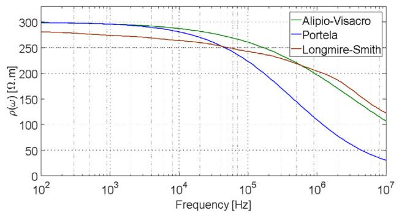

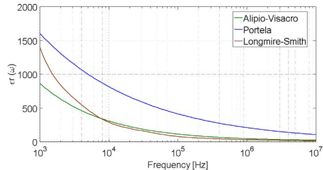

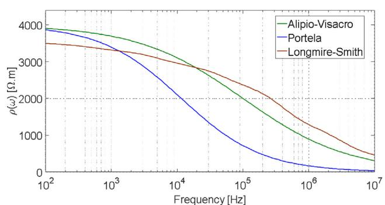

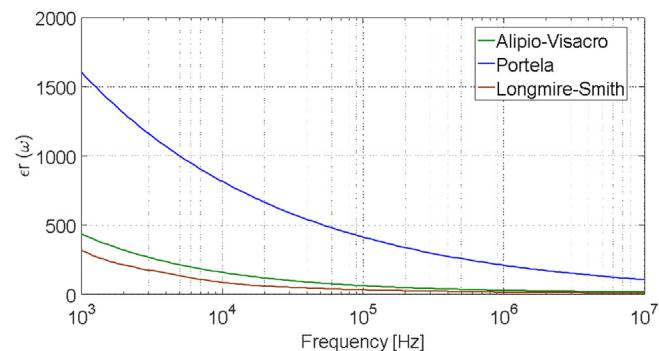  
  
Fig. 1. Frequency dependence of the soil resistivity and relativity permittivity, considering low-frequencies values of soil resistivity -0 of: a) 300 	m and b) 4000 	m.

# 2.4. Comparisons between formulations

Fig. 1 shows the frequency dependence of soil resistivity, where $\rho ( \omega ) = 1 / \sigma ( \omega )$ and $\rho _ { 0 } = { ^ 1 } / { \sigma _ { 0 } }$ is the low-frequency soil resistivity, and relative permittivity, obtained by applying Eqs. (1)–(6), respectively, in the frequency range of 100 Hz to 2 MHz, and considering values of $\rho _ { 0 }$ equal to 300 	m Fig. 1(a), and 4000 	m, Fig. 1(b). As can be observed, the soil resistivity shows a significant reduction with frequency increasing, being such reduction relatively more pronounced for soils with higher resistivity. Also, it can be noted that the relative permittivity assumes high values along the frequency range of few kHz to around 1 MHz, reaching values around 20–10 only in the higher frequency range for Eqs. (1)–(3). The three formulations, although qualitatively presenting the same behaviour, differ significantly in quantitative terms [23]. Such differences can impact the overvoltages at the grounding and in the insulator strings (see Section 5).

Moreover, according to results presented in Refs. [12,14,16,23–25] the frequency dependence of soil parameters has a significant impact on the lightning performance of grounding electrodes. These results suggest that in lightning-protection applications that require accurate results, the frequency dependence of electrical parameters of soil should not be disregarded [25].

It is worth mentioning that in reference [23] the authors tested the causality of the Longmire–Smith and Portela models. This test was performed with the help of Kramers–Kronig relationships. Both models satisfy such relationships and thus provide causal results. The Alipio–Visacro model is also a causal model [22].

# 3. System description

# 3.1. Introduction

In order to assess the impact of considering the lightning frequency behaviour of grounding systems along with the frequency

Table 2 Parameters for the 138 kV transmission line.   

<table><tr><td>Operating voltage</td><td>138 kV</td><td>Height phase C</td><td>25 m</td></tr><tr><td>Span</td><td>400 m</td><td>Sags of phase</td><td>10 m</td></tr><tr><td>Number of conductors/phase</td><td>1</td><td>Horizontal distance between phases</td><td>5.8 m</td></tr><tr><td>Number of shield wires</td><td>1</td><td>Shield wire code</td><td>3/8&quot;</td></tr><tr><td>Phase conductor code</td><td>Linnet</td><td>Height of shield wire</td><td>31.61 m</td></tr><tr><td>Height phase A</td><td>28.72 m</td><td>Sag of shield wire</td><td>6 m</td></tr><tr><td>Height phase B</td><td>26.86 m</td><td></td><td></td></tr></table>

dependence of soil parameters, three towers and two spans of a 138-kV line were considered, with lightning striking the central tower. All aerial conductors were impedance matched 400 m away from the adjacent towers. The line parameters are summarized in Table 2. The tower geometry is depicted in Fig. 2(a) and (b) shows the typical grounding arrangement of the considered transmission line. The modeling options of each component are briefly described hereafter.

# 3.2. Shield wires and phase conductors

The shield wires and phase conductors were represented using the LCC tool of ATP/EMPT [26,27], which includes the well-known LINE CONSTANTS and CABLE CONSTANTS routines. JMarti-Model [28] was used to calculate the line parameters and the data presented in Fig. 2(a) were entered on the LCC routine.

# 3.3. Tower surge impedance

The tower surge impedance was calculated using the revised Jordan’s formula, which was extended in Ref. [29] to take into account vertical multiconductor systems. According to this reference, the surge impedance of a vertical conductor is obtained by Eq. (7).

$$
Z = 6 0 \left[ \ln \frac {4 h}{r} - 1 \right] \tag {7}
$$

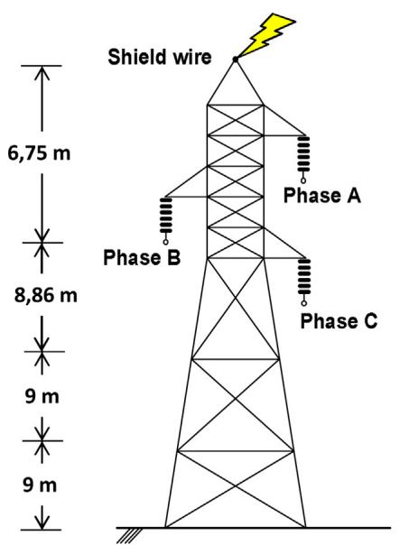  
(a)

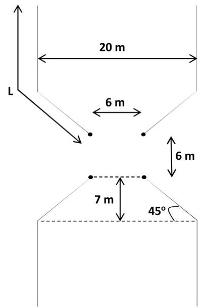  
(b)   
Fig. 2. (a) Tower configuration. (b) Grounding electrode arrangement. The dimensions are out of scale.

where h is the height of the conductor and r is the conductor radius. Note that Eq. (7) is valid for a single vertical conductor. However, is often necessary to represent arrangements composed by a set of vertical conductors, such as transmission line towers. This has motivated the extension of Eq. (7) for evaluating the mutual surge impedance of vertical conductors of same height h. By calculating the voltage drop at the j-th vertical conductor caused by the current circulating in the i-th vertical conductors, the expression Eq. (8) can be obtained [29].

$$
Z _ {i j} = 6 0 \ln \frac {2 h + \sqrt {4 h ^ {2} + d _ {i j} {} ^ {2}}}{d _ {i j} {} ^ {2}} + 3 0 \frac {d}{h} - 6 0 \sqrt {1 + \frac {d _ {i j} {} ^ {2}}{4 h ^ {2}}} \tag {8}
$$

where $Z _ { i j }$ is the mutual surge impedance between conductors i and j, h is defined as in Eq. (7) and $d _ { i j }$ corresponds to the distance between the centers of conductors i and j.

Using Eqs. (7) and (8), one can write a matrix solution in the form [V] = [Z][I], where [V] and [I] are column vectors of order n 1 containing the voltages and currents associated to a system of n lossless vertical conductors, and [Z] is a n × n impedance matrix, whose elements are obtained from Eqs. (7) and (8). If the n vertical conductors are connected at the current injection point, then it is possible to represent the whole multiconductor system as a single transmission line with equivalent surge impedance $Z _ { e q }$ given by Eq. (9).

$$
Z _ {e q} = \frac {V}{I} = \frac {Z + Z _ {1 2} + Z _ {1 3} + \dots + Z _ {1 n}}{n} \tag {9}
$$

If slants and crossbar are disregarded in modeling the tower of Fig. 2(a), then only four vertical conductors are used to represent the tower. In particular, the tower was divided into four sections. The lower portion of the tower was divided in a cascade of three transmission lines (two of 9 m and one of 8.86 m), while its upper part was represented as a single 6.75-m long transmission line. This is necessary since the cross section of the tower, Fig. 2(a), varies with position, which leads to a slight modification of the mutual surge impedance with varying height. In this case, n = 4 and the equivalent impedance of each tower segment was computed using Eqs. $( 7 ) - ( 9 )$ , considering average spaces between tower conductors and the heights of h = 9, 18, 26.86, and 33.61 m. Fig. 3 shows the

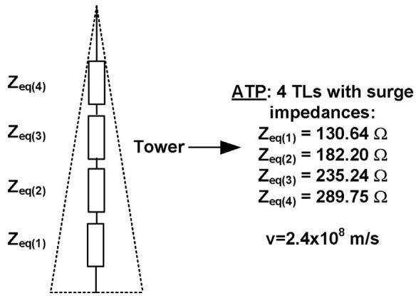  
Fig. 3. Tower model.

obtained results. Note each tower section is represented by single surge impedance, although a single equivalent surge impedance could be obtained. The propagation velocity of the waves in the tower is considered equal to 80% of the speed of light in the vacuum [1,25].

# 3.4. Lightning current waveforms

An accurate assessment of lightning effects on power systems depends, among other factors, on an appropriate representation of the lightning current, since the quality of results provided by simulations is conditioned by the representability of assumed lightning currents waves [13].

According to measurements of instrumented towers, such as those of Refs. [30,31], the first stroke currents are characterized by a pronounced concavity at the front and by the occurrence of multiple peaks, being the second peak usually the highest one, and the maximum steepness occurring near the first peak. The waveform of most subsequent-stroke currents presents a single peak and a relatively smooth shape.

Considering the aforementioned aspects the currents waves depicted in Fig. 4, which closely reproduce the main median parameters of first, Fig. 4(a), and subsequent strokes, Fig. 4(b), measured

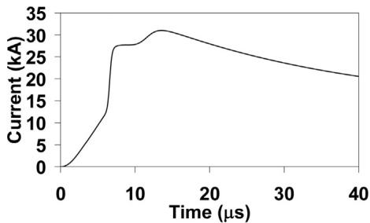

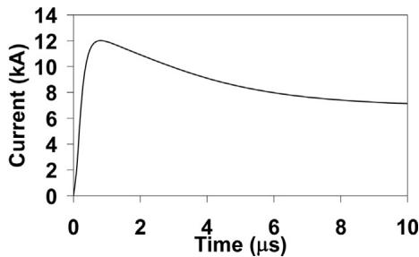  
Fig. 4. Representative current waveforms of first (left) and subsequent (right) strokes impressed on tower top.

at Mount San Salvatore, were used in simulations. As detailed in Ref. [25], the waveforms of Ref. Fig. 4 are obtained by a sum of Heidler functions.

# 3.5. Interfacing wideband modeling of grounding and ATP

Although the grounding behaviour can be described by a simple resistance when subjected to low-frequency currents, during lightning strokes it is better represented by an impedance. In this respect, the grounding response was simulated using a field approach based on the application of the Hybrid Electromagnetic Model (HEM) [18], which solves Maxwell’s equations numerically via the vector and scalar potentials using the thin wire approximations. The calculations are performed in frequency domain and time domain results can be obtained by means of inverse Fourier or Laplace transform. The accuracy of the results provided by this model in terms of the impulse grounding behaviour was shown by comparison with experimental results, considering different grounding arrangements [12,14,22].

One of the simulation outputs of the HEM model is the harmonic grounding impedance $\scriptstyle { Z ( \mathrm { j } \omega ) }$ in a frequency range from 0-Hz up to the highest frequency of interest in transient studies, which depends on the impressed current pulse. Based on $\scriptstyle { Z ( \mathrm { j } \omega ) }$ , the associated admittance $\mathrm { Y } ( \mathrm { j } \omega )$ is obtained and the Vector Fitting (VF) approach is used for fitting the calculated frequency domain grounding response with rational function approximations [32], being the passivity enforced by perturbation [33]. Finally, based on the obtained rational function, we proceed to the synthesis of an electrical network which can be promptly included in timedomain simulations [25]. It should be mentioned that the obtained electrical network allows to completely represent the grounding behaviour, including the capacitive and inductive effects along with the frequency dependence of soil parameters and the propagation effects [25].

It is worth mentioning that a similar approach was recently used in Ref. [34] to investigate the effect of the frequency-dependent characteristics of grounding on the performance of time-dependent surge arresters.

Fig. 5 shows an example of the frequency-dependent admittance of a grounding arrangement of the type depicted in Fig. 2(b) obtained by HEM model and by an equivalent circuit obtained from Vector Fitting. A length of L = 52 m and radius of 7 mm are considered for the electrodes, which are buried 0.5 m depth in a soil of 1000 	m, $\varepsilon _ { r } = 1 0$ and $\mu _ { r } = 1$ . As can be observed, the results are consistent.

# 4. Test cases

In order to evaluate the influence of grounding behaviour, the values considered for low-frequency soil resistivity $\rho _ { 0 }$ are: 300, 600, 1000, 2000 and 4000 	m. The following assumptions were considered for soil modeling: i) constant soil parameters, with $\rho = \rho _ { 0 } \mathrm { ~ e ~ } \varepsilon _ { r } = 1 0 ; \mathrm { i i } )$ frequency-dependent soil parameters, $\rho ( \omega )$ and

Table 3 Counterpoise lengths according to soil resistivity.   

<table><tr><td>ρ0(Ωm)</td><td>300</td><td>600</td><td>1000</td><td>2000</td><td>4000</td></tr><tr><td>L(m)</td><td>22</td><td>37</td><td>52</td><td>82</td><td>132</td></tr></table>

$\varepsilon ( \omega )$ , according to Eqs. (1)–(6). The counterpoises length were chosen taking into account the effective length for first stroke currents, which depends on the low-frequency soil resistivity, as discussed in Refs. [12,25]; the used values are indicated in Table 3.

In simulations, the soil ionization was disregarded. As it is well known, the effects of soil ionization are important especially for large lightning currents and short electrodes, leading to a decrease of grounding impedance in these cases [35–39]. In case of long electrodes, this effect becomes less relevant. Furthermore, as discussed in Ref. [11], it is also a matter of discussion if a single value of the critical electric field can be assumed for all types and conditions of the soil, since values in the range of 70–2700 kV/m have been reported, for instance [37–39]. Considering the aforementioned aspects, the soil ionization was disregarded in a conservative approach [25].

# 5. Results

# 5.1. Impact of lightning transient grounding behaviour on the response of tower-footing electrodes

Fig. 6 illustrates the simulated Grounding Potential Rise (GPR) in response to the impression of representative current waves of first and subsequent strokes of Fig. 4 directly on the grounding arrangements of Fig. 2(b), whose lengths L and low-frequency soil resistivity are given in Table 3. The results are shown considering: i) grounding represented by a simple resistance equal to the low-frequency grounding resistance (RLF); ii) lightning transient grounding representation using HEM model and fitted by VF, considering constant soil parameters $\left( \mathrm { V F } _ { \mathbb { C } S } \right)$ , and iii) the same of ii) but assuming frequency-dependent soil parameters, considering Eqs. $( 1 ) - ( 3 ) \left( \mathsf { V F } _ { \mathsf { A V } } \right)$ , Eq. $\left( 4 \right) \left( \mathsf { V F } _ { \mathsf { P } } \right)$ and Eq. $( 5 ) , ( 6 ) ( \mathsf { V F _ { L S } } )$ .

At a glance, it can be observed that representing the tower footing electrodes as a simple resistance leads to GPR curves that are quite different from those obtained by using the wideband modeling. Note that differences are observed both in the GPR peak values and also on the resultant waveform. This occurs for both the first and subsequent strokes and for all resistivity values.

Also, it can be noted that: i) considering the frequency dependence of soil parameters leads to a decrease of GPR peaks, both for first and subsequent strokes, for all Formulations, $( 1 ) \mathrm { - } ( 3 ) ( \mathsf { V F } _ { \mathsf { A V } } ) ,$ (4) $( \mathsf { V F } _ { \mathrm { P } } ) \mathsf { a n d } ( 5 ) , ( 6 ) ( \mathsf { V F } _ { \mathrm { L S } } )$ , and for all resistivity values, taking constant soil parameters $\left( \mathrm { V F } _ { \mathbb { C } S } \right)$ as reference. This effect becomes more pronounced with increasing soil resistivity, as expected according to curves in Fig. 1; ii) the GPR waveforms are quite sensitive to the formulation for the consideration of the variation with the frequency, being more accentuated as the resistivity increases; iii) all cases, GPR levels are less conservative (lower values) for Formulation (4).

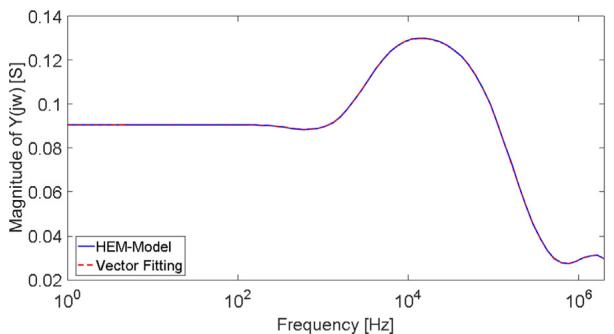  
(a)

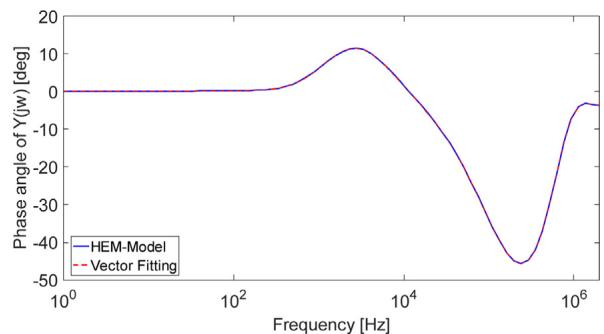  
(b）  
Fig. 5. Frequency-dependent grounding admittance (arrangement type depicted in Fig. 2, with electrode length o $L = 5 2$ m and radius of 7 mm, buried 0.5 m depth in a soil of 1000 	m, $\varepsilon _ { \mathrm { r } } = 1 0$ and $\vert \mu _ { \mathrm { r } } = 1 \rangle$ . Results obtained by HEM model and by an equivalent circuit obtained from Vector Fitting.

Table 4 Impulse impedance of tower grounding system.   

<table><tr><td rowspan="2">ρ0(Ωm)</td><td colspan="3">Impulse impedance (Ω) (first stroke current)</td><td colspan="3">Impulse impedance (Ω) (subsequent stroke current)</td></tr><tr><td>VFCS with ρ = ρ0; εr = 10</td><td>VFp</td><td>%</td><td>VFCS with ρ = ρ0; εr = 10</td><td>VFp</td><td>%</td></tr><tr><td>300</td><td>7.27</td><td>6.53</td><td>-10.2</td><td>10.22</td><td>5.62</td><td>-45.0</td></tr><tr><td>600</td><td>9.87</td><td>7.81</td><td>-20.8</td><td>15.54</td><td>6.47</td><td>-58.3</td></tr><tr><td>1000</td><td>13.07</td><td>8.88</td><td>-32.0</td><td>20.72</td><td>6.94</td><td>-66.5</td></tr><tr><td>2000</td><td>18.90</td><td>9.91</td><td>-47.6</td><td>29.35</td><td>7.38</td><td>-74.9</td></tr><tr><td>4000</td><td>26.40</td><td>8.90</td><td>-66.3</td><td>39.17</td><td>7.64</td><td>-80.5</td></tr></table>

It should be also noted that the decreases of GPR peaks are more significant for subsequent strokes, in comparison with first strokes currents. This steams from the higher frequency content of subsequent strokes, since they present shorter front times. In order to compare the effect of the frequency dependence of soil parameters, Table 4 summarizes the grounding impulse impedance computed for both first and subsequent strokes, and considering constant and frequency dependent soil parameters calculated according to Eq. (4) for illustration purposes. The grounding impulse impedance $Z _ { P }$ is given by the ratio between the GPR and impressed current peak values, $Z _ { P } = V _ { P } / I _ { P }$ .

It should be mentioned that some similar qualitative results were obtained for other grounding arrangements, such as simple horizontal and vertical electrodes and substation grids [12,14,16,25,40].

In the GPR calculations, the models of Longmire–Smith and Alipio–Visacro are quite similar one to another, while the model of Portela gives quite different results. The explanation for such similarities and differences lies in the trends of variation with frequency, illustrated in Fig. 1. The reductions of both resistivity and permittivity, as the frequency increases, are much more pronounced for the Portela model. This makes GPR levels even more pronounced. On the other hand, the variations with frequency from the Longmire–Smith and Alipio–Visacro models are relatively close, thus leading to closer GPR levels.

The discussion presented in the previous paragraph may raise the following question: what is the most appropriate model for considering variation with frequency?

The authors think that there is not yet a general formulation of variation with the frequency that can be applied to any type of soil, anywhere on earth. Naturally, this assertion is associated with the enormous diversity of existing soils, with quite different physic-chemical characteristics. However, based on the available technical literature, the Alipio–Visacro model is the only one based on measurements directly under field conditions (on natural soil). The other models are based on laboratory measurements, in which soil samples are collected and taken to the laboratory. In addition, the Alipio–Visacro model was properly validated through comparisons between simulation and measurement results. For these

reasons, according to the current knowledge, it seems that the Alipio–Visacro model is the most suitable for soil modeling.

# 5.2. Overvoltages across insulator strings

Fig. 7 shows the overvoltages experienced across the upper phase insulator string due to a direct stroke to the tower top, Fig. 2(a). Simulations consider the impression of currents of Fig. 4, tower model of Fig. 3, electrodes arrangements of Fig. 2(b), 400- m long spans and both hypotheses of constant $( \mathsf { R } _ { \mathrm { L F } }$ and VFCS) and frequency-dependent soil parameters considering Eqs. $_ { ( 1 ) - ( 3 ) }$ $( \mathsf { V F } _ { \mathsf { A V } } )$ ), Eq. (4) $\left( \mathsf { V F } _ { \mathsf { P } } \right)$ and Eqs. (5), (6) $( \mathrm { V F } _ { \mathrm { L S } } ) .$ . It is opportune to comment that the adopted tower model allows calculating the overvoltage in the insulator string considering crossarm position.

In case of first stroke currents, it can be observed that the frequency dependence of soil parameter leads to a reduction of the peak of overvoltage waves, particularly for values of soil resistivity higher than 600 	m. Table 5 summarizes the results showing reductions of overvoltage peaks for first stroke currents. It can be seen that the greatest reductions are associated with Formulation (4). The overvoltage peaks associated to $\mathsf { R } _ { \mathrm { L F } } ,$ Eqs. $_ { ( 1 ) - ( 3 ) }$ and $( 5 ) ,$ (6) are always among those due to the consideration of the soil parameters constant and Formulation (4). The overvoltage waveforms, coming from all formulations, become increasingly distinct as the resistivity of the soil increases.

In case of subsequent strokes, the frequency dependence of soil parameters basically does not affect the peak values of the developed overvoltages. Such results might be puzzling since Table 4 shows a very significant reduction of grounding impulse impedance in case of subsequent strokes, when the frequency dependence of soil is considered. This behaviour is attributed to the low influence of grounding on overvoltages across insulators yielded by subsequent strokes. Due to the short front time of subsequent strokes, the effect of negative voltage wave reflected at the tower base basically does not influence the reduction of overvoltage at top of tower. Table 6 is similar to Table 5, however for subsequent strokes. It is noticed that the changes in the overvoltage peaks, due to the effect of the variation with the frequency, are very small. This fact illustrates that in the case of subsequent strokes the modeling of the tower is more important than that of grounding.

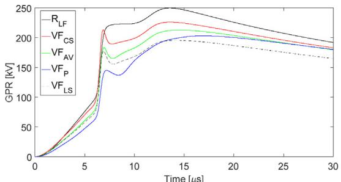  
(a)

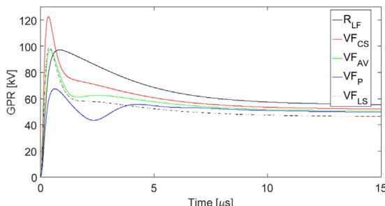

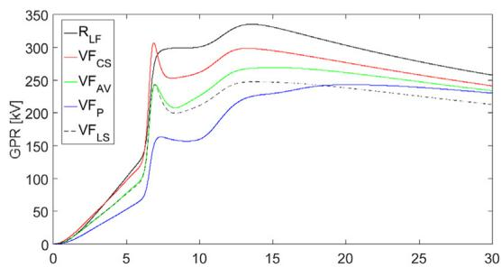

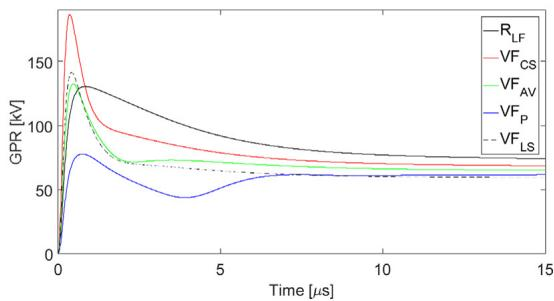

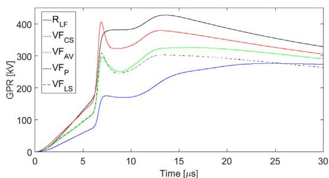

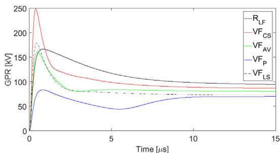

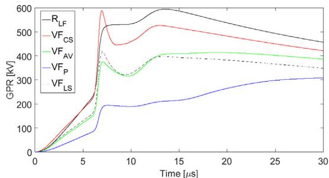

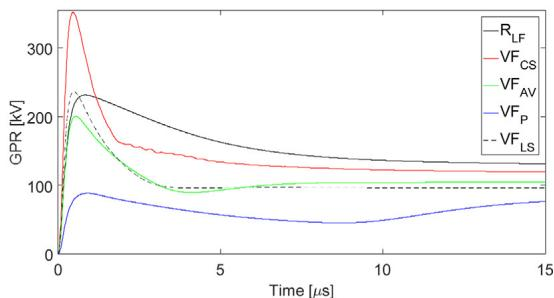

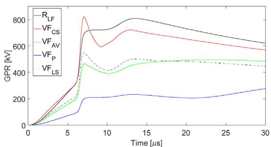

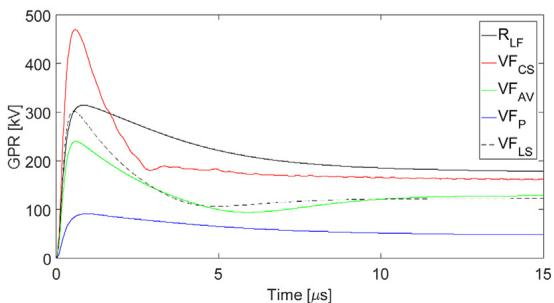  
Fig. 6. Simulated GPR of the tower grounding footing under the assumptions of constant $( \mathrm { V F } _ { \mathbb { C } } ) ,$ , frequency-dependent soil parameters, considering Alipio-Visacro $( \mathsf { V F } _ { \mathsf { A V } } ) ,$ Portela $\left( \mathrm { V F _ { P } } \right)$ and Longmire-Smith $\left( \mathrm { V F } _ { \mathrm { L S } } \right)$ formulations, and simple resistance representation $( \operatorname { R } _ { \mathrm { L F } } ) .$ . The grounding system is subjected to representative currents of first (left) and subsequent strokes (right) for soil resistivity $\mathbf { \rho } _ { \mathbf { \rho } } \mathbf { 0 } \mathrm { ~ \ }$ of: (a) 300 	m (b) 600 	m (c) 1000 	m (d) 2000 	m and (e) 4000 	m.

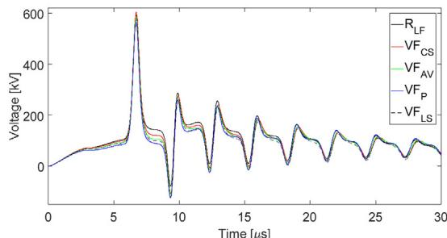

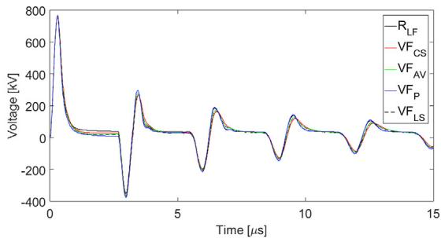

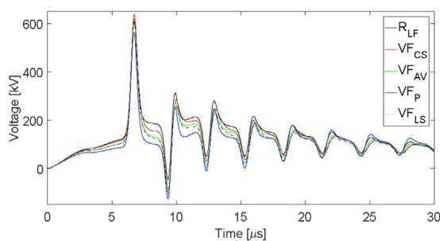  
(b)

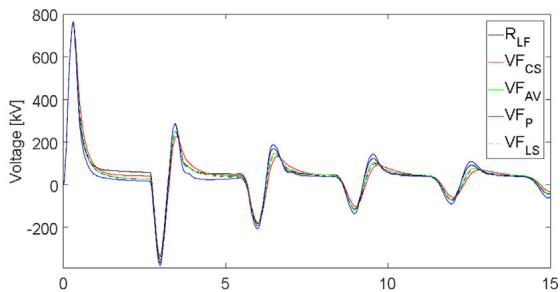

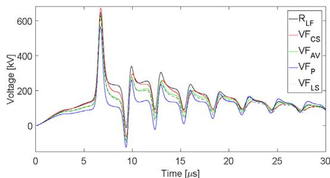

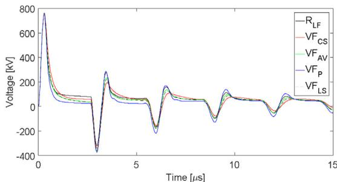

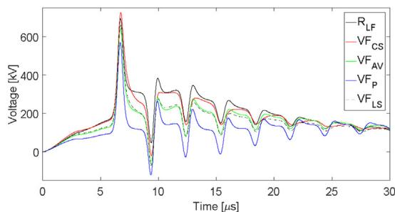

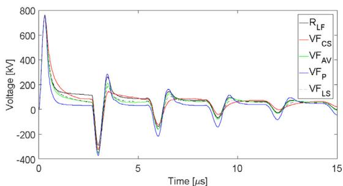

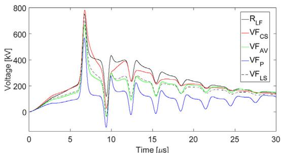  
(e)

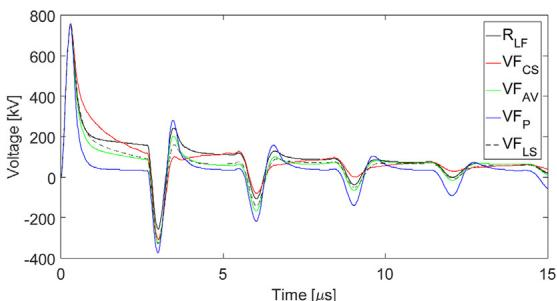  
Fig. 7. Simulated over voltages across upper insulator string considering constant $( \mathrm { V F } _ { \mathbb { C } S } ) ,$ , frequency-dependent soil parameters (Alipio-Visacro $( \mathsf { V F } _ { \mathsf { A V } } ) ,$ , Portela (VFP) and Longmire-Smith $\mathrm { ( V F _ { L S } ) }$ formulations) and simple resistance representation $( \operatorname { R } _ { \mathrm { L F } } ) .$ The tower top is subject to direct strokes representative of first (left) and subsequent strokes (right). Low-frequency soil resistivity 0: (a) 300 	m (b) 600 	m (c) 1000 	m (d) 2000 	m and (e) 4000 	m.

Table 5 Peak overvoltage (kV) developed across upper insulator string (first stroke current) and percentage reductions (%) in relation to the overvoltage with constant parameters $( \mathsf { V F } _ { \mathbb { C } } ) { \mathrm { - } } \mathsf { V F } _ { \mathsf { A V } } ,$ VFP and $\mathrm { V F } _ { \mathrm { L } S }$ refer to frequency-dependent soil parameters considering Alipio–Visacro, Portela and Longmire–Smith formulations, respectively, and $\mathtt { R } _ { \mathtt { L F } }$ to simple resistance representation.   

<table><tr><td>ρ0(Ωm)</td><td>VFCS with ρ = ρ0; εr = 10</td><td>RLF (%)</td><td>VFAV (%)</td><td>VFP (%)</td><td>VFLS (%)</td></tr><tr><td>300</td><td>604.66</td><td>592.89 (-1.9)</td><td>586.51 (-3.0)</td><td>564.20 (-6.7)</td><td>585.31 (-3.2)</td></tr><tr><td>600</td><td>638.74</td><td>618.45 (-3.2)</td><td>604.84 (-5.3)</td><td>564.88 (-11.6)</td><td>607.52 (-4.9)</td></tr><tr><td>1000</td><td>671.66</td><td>645.95 (-3.8)</td><td>620.65 (-7.6)</td><td>566.15 (-15.7)</td><td>628.44 (-6.4)</td></tr><tr><td>2000</td><td>724.88</td><td>693.70 (-4.3)</td><td>642.16 (-11.4)</td><td>569.12 (-21.5)</td><td>661.26 (-8.8)</td></tr><tr><td>4000</td><td>780.63</td><td>752.10 (-3.6)</td><td>666.43 (-14.6)</td><td>568.93 (-27.1)</td><td>698.20 (-10.6)</td></tr></table>

Table 6 Peak overvoltage (kV) developed across upper insulator string (subsequent stroke current) and percentage reductions (%) in relation to the overvoltage with constant parameters $( \mathsf { V F } _ { \mathsf { C S } } ) { - } \mathsf { V F } _ { \mathsf { A V } }$ , VFP and $\mathrm { V F } _ { \mathrm { L S } }$ refer to frequency-dependent soil parameters considering Alipio–Visacro, Portela and Longmire–Smith formulations, respectively, and RLF to simple resistance representation.   

<table><tr><td>ρ0(Ωm)</td><td>VFCS with ρ = ρ0; εr= 10</td><td>RLF (%)</td><td>VFAV (%)</td><td>VFP (%)</td><td>VFLS (%)</td></tr><tr><td>300</td><td>768.63</td><td>766.48 (-0.3)</td><td>767.28 (-0.2)</td><td>765.94 (-0.4)</td><td>767.80 (-0.1)</td></tr><tr><td>600</td><td>767.02</td><td>765.05 (-0.3)</td><td>765.56 (-0.2)</td><td>763.99 (-0.4)</td><td>766.27 (-0.1)</td></tr><tr><td>1000</td><td>765.46</td><td>763.84 (-0.2)</td><td>763.96 (-0.2)</td><td>762.23 (-0.4)</td><td>764.83 (-0.1)</td></tr><tr><td>2000</td><td>762.93</td><td>761.93 (-0.1)</td><td>761.28 (-0.2)</td><td>759.38 (-0.5)</td><td>762.35 (-0.1)</td></tr><tr><td>4000</td><td>759.20</td><td>758.69 (-0.1)</td><td>758.05 (-0.2)</td><td>755.99 (-0.4)</td><td>758.50 (-0.1)</td></tr></table>

It is worth noting that the effect of considering the variation of soil parameters with frequency is more intense in the ground potential rise than in the overvoltages in the insulator strings (see Tables 4–6). This is one of the main findings of this paper. Such effect regards all models represented in the paper, and is very noticeable when comparing Alipio–Visacro model with Longmire–Smith model: even though soil resistivity and relative soil permittivity trends versus frequency present some not negligible differences, as well as GPR trends versus time, overvoltages at insulator strings are practically the same. This is due to the surge impedance of the tower. The same effect was evidenced in Ref. [41], where a complete circuit model of grounding systems and its synthesis, represented by a simple pi-circuit, were compared: in that case, frequency dependence of soil parameters was disregarded, whereas soil ionization was taken into account. Moreover, these results may evidence that the models yielded the same results as regards the backflashover occurrence.

In addition, from Fig. 7 and Tables 5 and 6, it can be seen that the effect of the frequency dependence and the adopted model (with the exception of the Portela model for high resistivities and for first return stroke) is almost insignificant on the overvoltages. This is quite an interesting result and the authors believe that constant soil parameters is a good approximation for determining the overvoltages (unlike GPR which seems to be much more sensitive to this). Another interesting and expressive (and even, in principle, unexpected) result is that the representation of grounding by its simple resistance at low frequency generates overvoltages also very close, in practical terms, to those generated by constant parameter models and Alipio–Visacro and Longmire–Smith models, even for the first return strokes and high resistivities.

The explanation for such behavior is as follows: while GPR is basically dictated by the behaviour of ground and grounding electrodes, the overvoltages in the insulator strings depend, besides these elements, on the surge impedance of the various tower sections, phase conductors, ground wires and electromagnetic couplings between phases and ground wires. In this way, the influence of grounding is diluted in the corresponding electromagnetic transient that determines the time distributions of such overvoltages.

# 6. Conclusions

The impact of considering a lightning transient grounding representation, along with the frequency dependence of soil parameters, on the lightning performance of an existing 138-kV transmission

line was assessed. In order to include an accurate wideband modeling of grounding system on ATP/EMTP, an electromagnetic model together with the Vector Fitting was used. The main conclusions of this work are summarized below.

• The representation of the tower footing grounding by a simple resistance equal to the value of the low-frequency grounding resistance can lead to significant errors, both in the GPR peak values and on waveforms. In accurate evaluations of lightning performance of grounding systems, an equivalent circuit obtained by using electromagnetic models and rational fitting techniques should be preferred. However, Fig. 7 shows clearly that, in the analysis of the lightning performance of a transmission line, for which the most important voltages are those which appear across the insulator strings, the representation of the grounding system by a simple resistance equal to the lowfrequency ground resistance $\left( \mathsf { R } _ { \mathrm { L F } } \right)$ leads to results whose accuracy is similar to those obtained using more complex representations which consider the wideband behaviour of grounding systems. Actually the differences between the results obtained with the different models that take into account the variation of the soil parameters with frequency may be larger than the difference between the results of one of these models and those corresponding to calculations done assuming $\mathsf { R } _ { \mathrm { L F } } .$ . This is a very important and useful conclusion And is considered one of the main of this paper.   
• The frequency dependence of soil parameters leads to a reduction of the grounding impulse impedance. Such reduction is more significant for subsequent strokes than for first strokes, and also for soils of higher resistivity. Considering the analysed cases in this work, the largest reductions of impulse impedance of around 45.0%, 58.3%, 66.5%, 74.9% and 80.5% were observed for subsequent strokes and values of $\rho _ { 0 }$ of 300, 600, 1000, 2000 and 4000 	m, respectively, considering Portela formulation (see Table 4). Reductions of around 10.2%, 20.8%, 32.0%, 47.6% and 66.3% were observed respectively for the same soils, first strokes and formulation (see Table 4).   
• The frequency dependence of soil parameters leads to a reduction of overvoltages developed across insulator strings for first strokes currents. In these cases, the greatest reductions are associated to the Portela formulation to consider the variation of the soil parameters with the frequency. In case of subsequent strokes, the impact of frequency dependence on reducing the overvoltages across insulators is negligible. However, this conclusion does not contradict the previous one, as discussed in subsection 5.2.

• The effect of variation of soil parameters with frequency has a much greater impact on the reduction of ground potential rise when compared to the reductions of the overvoltages in the insulator strings. The largest reduction in the case of the first strokes is around 27.1% (see Table 5), while for subsequent strokes it is approximately 0.4% (see Table 6), both for the Portela formulation.

Ultimately, the authors consider it opportune to make some comments regarding the inclusion of soil ionization. As widely reported in the literature, such an effect tends to reduce the impulsive impedance of the grounding. Thus, it tends to lead to an additional reduction in GPR peaks. However, it would not cause a similar reduction in the overvoltages established in the insulator strings. As discussed in this paper (when contemplating the effect of variation with frequency), the effect of impedance reduction on the inclusion of ionization tends to be diluted in the electromagnetic transient, given the presence of the other elements in this situation (tower, phase conductors and ground wires). Thus, the joint inclusion of soil ionization and variation with frequency tends to decrease the levels of GPR (on a larger scale) and the overvoltages in the insulator strings (on a smaller scale). However, for the proper quantification of the phenomenon it is necessary to develop techniques that combine modeling in the time and frequency domains. The authors are just working on this topic.

# Acknowledgment

The present work was carried out with the support of CNPq, National Council of Scientific and Technological Development—Brazil. The authors are also grateful for the financial support granted by INERGE (National Institute of Electrical Energy), FAPEMIG (Foundation for Research Support of the State of Minas Gerais) and CAPES (Coordination of Improvement of Higher Level Personnel).

# References

[1] IEEE Guide for Improving the Lightning Performance of Transmission Lines, IEEE Standard 1243-1997, December 1997.   
[2] CIGRE Working Group 33-01, Guide to procedures for estimating the lightning performance of transmission lines, Study Committee 33. Dallas, TX, USA, 1991.   
[3] J.G. Anderson, Monte Carlo computer calculation of transmission-line lightning performance, IEEE Trans. Power Appl. Syst. PAS-80 (April (3)) (1961) 414–419.   
[4] W.A. Chisholm, Y.L. Chow, K.D. Srivastava, Lightning surge response of transmission towers, IEEE Trans. Power Appar. Syst. PAS-102 (September (9)) (1983) 3232–3242.   
[5] J.A. Martinez, F. Castro-Aranda, Lightning performance analysis of overhead transmission lines using the EMTP, IEEE Trans. Power Deliv. 20 (July (3)) (2005) 2200–2210.   
[6] A. Ametani, T. Kawamura, A method of a lightning surge analysis recommended in Japan using EMTP, IEEE Trans. Power Deliv. 20 (April (2)) (2005) 867–875.   
[7] A. Borghetti, C.A. Nucci, M. Paolone, Statistical evaluation of lightning performances of distribution lines, in: 5th International Conference on Power System Transient, Rio de Janeiro, Brazil, June, 2001.   
[8] P. Chowdhuri, S. Li, P. Yan, Rigorous analysis of back-flashover outages caused by direct lightning strokes to overhead power lines, Proc. Inst. Electr. Eng. Gener. Transm. Distrib. 149 (January (1)) (2002) 58–65.   
[9] S. Visacro, F. Silveira, The impact of the frequency dependence of soil parameters on the lightning performance of transmission lines, IEEE Trans. Electromagn. Compat. 57 (June (3)) (2015) 434–441.   
[10] J. Wu, J. He, B. Zhang, R. Zeng, Influence of grounding impedance model on lightning protection analysis of transmission system, Electr. Power Syst. Res. 139 (2016) 133–138.   
[11] L. Grcev, Impulse efficiency of ground electrodes, IEEE Trans. Power Deliv. 2009 (January (1)) (2009) 441–451.   
[12] R. Alipio, S. Visacro, Impulse efficiency of grounding electrodes: effect of frequency dependent soil parameters, IEEE Trans. Power Deliv. 29 (April (2)) (2014) 716–723.   
[13] G.C. Guimarães, M.L.R. Chaves, W.C. Boaventura, D.A. Caixeta, M.A. Tamashiro, A.R. Rodrigues, Lightning performance of transmission lines based upon real

return-stroke current waveforms and statistical variation of characteristic parameters, Electr. Power Syst. Res. (2016), Available online 10 December 2016 https://doi.org/10.1016/j.epsr.2016.12.003.   
[14] S. Visacro, R. Alipio, C. Pereira, M. Guimarães, M.A.O. Schroeder, Lightning response of grounding grids: simulated and experimental results, IEEE Trans. Electromagn. Compat. 57 (February (1)) (2015) 121–127.   
[15] C.M. Portela, Measurement and modeling of soil electromagnetic behavior, in: Proceedings of IEEE Internationa Symposium on Electromagnetic Compatibility, Seattle, WA, 1999, pp. 1004–1009.   
[16] A.G. Pedrosa, M.A.O. Shroeder, M.M. Afonso, R. Alipio, S.C. Assis, Transient response of grounding electrodes for the frequency-dependence of soil parameters, IEEE/PES Transmission and Distribution Conference and Exposition: Latin America (2010) 839–845.   
[17] S. Visacro, R. Alipio, Frequency dependence of soil parameters: experimental results, predicting formula and influence on the lightning response of grounding electrodes, IEEE Trans. Power Deliv. 27 (April (2)) (2012) 927–935.   
[18] S. Visacro, A. Soares, HEM: a model for simulation of lightning-related engineering problems, IEEE Trans. Power Deliv. 20 (April (2)) (2005) 1026–1208.   
[19] R.L. Smith-Rose, The electrical properties of soils for alternating currents at radiofrequencies, Proc. R. Soc. 140 (841 A) (1933) 359–377.   
[20] J.H. Scott, Electrical and Magnetic Properties of Rock and Soil, U.S. Geol. Surv., Dep. of the Interior, Washington, D.C, 1966.   
[21] K.S. Smith, C.L. Longmire, Universal Impedance for soil, Defense Nuclear, Washington, October, 1975.   
[22] R. Alipio, S. Visacro, Modeling the frequency dependence of electrical parameters of soil, IEEE Trans. Electromagn. Compat. 56 (October (5)) (2014) 1163–1171.   
[23] D. Cavka, N. Mora, F. Rachidi, A comparison of frequency-dependent soil models: application to the analysis of grounding systems, IEEE Trans. Electromagn. Compat. 56 (February (1)) (2014) 177–187.   
[24] M. Akbari, K. Sheshyekani, M.R. Alemi, The effect of frequency dependence of soil electrical parameters on the lightning performance of grounding systems, IEEE Trans. Electromagn. Compat. 55 (August (4)) (2013) 739–746.   
[25] M.A.O. Schroeder, M.T.C. Barros, A.C.S. Lima, M.M. Afonso, R.A.R. Moura, Assessment of a frequency dependent soil model impact on lightning overvoltages, in: 33rd International Conference on Lightning Protection, Estoril, Portugal, September, 2016.   
[26] H.W. Dommel, Electromagnetic Transients Program Rule Book, Bonneville Power Administration, Portland, USA, 1982.   
[27] H.W. Dommel, Electromagnetic Transients Program Reference Manual: EMTP Theory Book, Bonneville Power Administration, Portland, USA, 1986.   
[28] J.R. Marti, Accurate modelling of frequency-dependent transmission lines in electromagnetic transient simulation, IEEE Trans. Power Appar. Syst. PAS-101 (January (1)) (1982) 147–157.   
[29] A. De Conti, S. Visacro, A. Soares, M.A.O. Schroeder, Revision, extension and validation of Jordan’s formula to calculate the surge impedance of vertical conductors, IEEE Trans. Electromagn. Compat. 48 (August (3)) (2006) 530–536.   
[30] K. Berger, R.B. Anderson, H. Kroninger, Parameters of lightning flashes, Electra, no. 80 K. Berger, R.B. Anderson, H. Kroninger, 1975, pp. 223–237.   
[31] S. Visacro, A. Soares, M.A.O. Schroeder, L.C.L. Cherchiglia, V.J. Sousa, Statistical analysis of lightning current parameters: measurements at Morro do Cachimbo station, J. Geophys. Res. 109 (January (D01105)) (2004) 1–11.   
[32] B. Gustavsen, A. Semlyen, Rational approximation of frequency domain responses by vector fitting, IEEE Trans. Power Deliv. 14 (July) (1999) 1052–1061.   
[33] B. Gustavsen, Fast passivity enforcement for pole-residue models by perturbation of residue matrix eigenvalues, IEEE Trans. Power Deliv. 23 (October (4)) (2008) 2278–2285.   
[34] M. Popov, L. Grcev, H. Hoidalen, B. Gustavsen, V. Terzija, Investigation of the overvoltage and fast transient phenomena on transformer terminals by taking into account the grounding effects, IEEE Trans. Ind. Appl. 51 (November/December (6)) (2015) 5218–5227.   
[35] J.C. Salari, C. Portela, Grounding systemsmodeling including soil ionization, IEEE Trans. Power Deliv. 23 (October (4)) (2008) 1939–1945.   
[36] A. Geri, Behavior of grounding systems excited by high impulse currents: the model and its validation, IEEE Trans. Power Deliv. 14 (July (3)) (1999) 1008–1017.   
[37] A.C. Liew, M. Darveniza, Dynamic model of impulse characteristics of concentrated earths, Proc. Inst. Electr. Eng. 121 (February) (1974) 123–135.   
[38] E.E. Oettle, A new general estimation curve for predicting the impulse impedance of concentrated earth electrodes, IEEE Trans. Power Deliv. 3 (October (4)) (1988) 2020–2029.   
[39] A.M. Mousa, The soil ionization gradient associated with discharge of high currents into concentrated electrodes, IEEE Trans. Power Deliv. 9 (July (3)) (1994) 1669–1677.   
[40] R. Alipio, M.A.O. Schroeder, M.M. Afonso, Voltage distribution along Earth grounding grids subjected to lightning currents, IEEE Trans. Ind. Appl. 51 (November/December (6)) (2015) 4912–4916.   
[41] F.M. Gatta, A. Geri, S. Lauria, M. Maccioni, Generalized pi-circuit tower grounding model for direct lightning response simulation, Electr. Power Syst. Res. Elsevier 116 (November) (2014) 330–337.