Received 10 May 2023; revised 21 June 2023; accepted 17 July 2023. Date of publication 20 July 2023; date of current version 2 August 2023. The review of this article was arranged by Associate Editor Fei Liu.

Digital Object Identifier 10.1109/OJPEL.2023.3297449

# Real-Time HIL Emulation of DRM With Machine Learning Accelerated WBG Device Models

SONGYANG ZHANG 1 (Graduate Student Member, IEEE), TIAN LIANG 1,2 (Member, IEEE), AND VENKATA DINAVAHI 1 (Fellow, IEEE)

1Department of Electrical and Computer Engineering, University of Alberta, Edmonton, Alberta T6G 2V4, Canada 2RTDS Technologies Inc., Winnipeg, MB R3T 2E1, Canada

CORRESPONDING AUTHOR: TIAN LIANG (e-mail: tliang5@ualberta.ca).

This work was supported in part by the Natural Science and Engineering Research Council of Canada (NSERC) through Mitacs Accelerate Program and in part by RTDS Technologies Inc.

ABSTRACT The proliferation of artificial intelligence (AI) has opened up new avenues for the modeling of power electronics with ultra-fast transient responses, such as wide-bandgap (WBG) devices. This article highlights the significance of ultra-fast transient device-level hardware emulation for the DC railway microgrid (DRM) in real-time. To this end, the proposed approach partitions the DRM power system by transmission line method (TLM) and employs gated recurrent unit (GRU) and electromagnetic transient (EMT) modeling techniques for system-level subsystems. Meanwhile, for WBG devices, gallium nitride (GaN) high electron mobility transistors (HEMT) and silicon carbide (SiC) insulated gate bipolar transistors (IGBT) are modeled using a novel physical feature neuron network (PFNN), which offers high flexibility with a variable time-step (as low as 1 ns), thereby improving the accuracy, efficiency and accelerating the emulation on the field-programmable gate array (FPGA). The effectiveness of the proposed approach is confirmed by comparing the emulation results with offline simulation results obtained from PSCAD/EMTDC for system-level and SaberRD for device-level transients. The proposed PFNN approach provides strong versatility, ultra-fast transient emulation capability, and significantly improved accuracy, which bodes well for the future of power electronics device-level emulation.

INDEX TERMS Artificial intelligence (AI), DC railway microgrid (DRM), field-programmable gate arrays (FPGAs), gallium nitride (GaN), gated recurrent units (GRU), hardware-in-the-loop (HIL), machine learning (ML), power electronics, real-time systems, silicon carbide (SiC), wide-bandgap (WBG).

# I. INTRODUCTION

In the era of heightened emphasis on energy conservation and emission reduction, DC railway microgrid (DRM) [1], [2], [3], [4] is poised to become a cornerstone solution for sustainable railway transportation. Among the crucial components of DRM, wide-bandgap (WBG) devices [5], [6], including gallium nitride (GaN) high electron mobility transistors (HEMT) and silicon carbide (SiC) insulated gate bipolar transistors (IGBT), hold a pivotal position in ensuring its efficient operation. GaN HEMT [7] and SiC IGBT [8] have witnessed an upsurge in popularity in recent years, thanks to their superlative characteristics of high power density, fast switching

speed, and low on-state resistance, which make them ideally suited for the DRM environment [9], [10]. Therefore, precise modeling of these devices and their intricate interactions with the DRM is indispensable for realizing optimal performance and control.

Accurate modeling of power electronic devices is a crucial prerequisite for designing and optimizing power circuits. Traditional modeling methods for WBG devices can be divided into two categories: physics-based models and empirical models [11], [12], [13], [14]. Physics-based nonlinear models aim to capture the physical mechanisms and phenomena of the devices, such as the channel formation, the current

conduction, the charge distribution, and the temperature effects. These models provide a detailed understanding of the device operation and performance, but are usually complex and computationally intensive. Empirical models, on the other hand, rely on fitting mathematical equations to the experimental data, such as the output characteristics, the transfer characteristics, and the switching behavior. These models are often simpler and faster, but may lack accuracy and generality. A trade-off between complexity and accuracy is often required when choosing a suitable modeling method for SiC IGBT and GaN HEMT devices for power circuit simulation. As the demand for high-performance and energy-efficient power circuits continues to grow, more advanced modeling techniques are required to capture the complex behavior and interactions of these WBG devices in power circuits.

While there exist numerous offline simulation and solution methods for modeling WBG devices, most of these nonlinear models cannot fulfill the real-time execution requirements of hardware-in-the-loop (HIL) emulation. However, the establishment of a real-time emulation is an emerging and crucial demand for the control and performance verification of transportation systems. To overcome the challenges of real-time emulation with traditional computation methods, utilizing FPGA-based parallel accelerated computation is a highly effective approach [15]. This approach has been widely adopted in real-time system-level microgrids emulation, including aircraft power systems [16], and traction systems [17]. For real-time device-level modeling, several methods such as nonlinear behavioral model (NBM) [18] and curve-fitting models [19] employ FPGA to achieve device-level emulation, thereby reflecting the transient of power electronic devices.

With the growing demand for accurate and efficient modeling of power electronics devices in HIL applications, machine learning (ML) methods have emerged as a promising solution. Traditional modeling methods for SiC IGBT and GaN HEMT devices often suffer from high computational complexity, parameter sensitivity, and a lack of accuracy under dynamic conditions. In contrast, ML methods offer several advantages by leveraging large datasets to learn the underlying relationships between input and output data, leading to more accurate and efficient models. For SiC IGBT and GaN HEMT, ML methods can overcome the limitations of traditional modeling methods by capturing their nonlinear and time-varying behavior and predicting their performance under different operating conditions. Moreover, ML methods can significantly reduce the latency and hardware resource consumption required for model development and validation, enabling rapid prototyping and optimization of power electronic systems. Therefore, ML methods have become a promising alternative to traditional modeling methods for SiC IGBT and GaN HEMT in HIL applications. Although numerous research papers have utilized neural networks (NNs) for modeling the transient behavior of IGBT [20], [21], [22], [23], the application of ML methods to GaN HEMTs modeling is still underexplored. The ultra-short transient process of GaN HEMT, which lasts

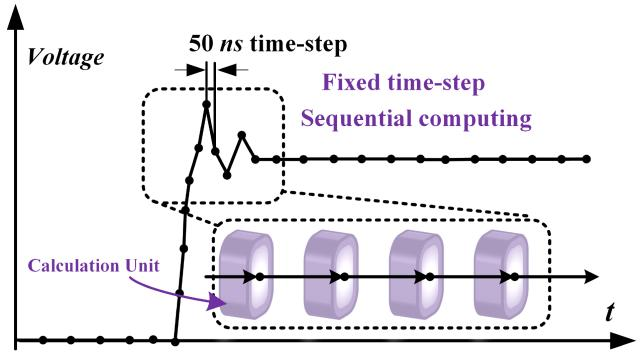  
FIGURE 1. Traditional point-to-point calculation algorithm.

for approximately 10 ns, requires a extremely small timestep, making it challenging to implement fixed time-step ML methods. To address this issue, this article proposes the physical feature neural network (PFNN), which integrates ML algorithms with interdisciplinary physical-based modeling to accurately model the transient process of GaN HEMT. The PFNN offers ultra-fast transient emulation capability, and significantly improved accuracy, which is a variable-timestep non-linear model distinguished from other traditional approaches. Additionally, the PFNN method is not limited to GaN HEMTs, as it can be applied to model device-level devices such as SiC IGBT (excellent versatility).

This article presents a novel approach for real-time HIL emulation of DRM using PFNN accelerated WBG SiC/GaNbased models on the Xilinx Ultrascale+ architecture FPGA hardware platform. The main contributions of this work are described in the following sections. Section II introduces the ML method adopted for modeling the SiC and GaN devices. Section III presents the DRM system and the implementation of its real-time emulation using the proposed ML-based models. Section IV demonstrates the effectiveness of the proposed approach through real-time emulation results and verification using experimentally verified software, PSCAD/EMTDC for system-level and SaberRD for device-level transients. Finally, Section V concludes the article.

# II. MACHINE LEARNING MODELING METHODS

This section introduces the operational models of traditional device-level computational models, followed by an overview of commonly used ML topology types for modeling and comparative analysis among different NNs. Subsequently, a fixed time-step-points neural network (FTPNN) based on fully connected artificial NNs (FNNs) is proposed for GaN HEMT and SiC IGBT modeling. In view of the limitations of FTPNN, the PFNN modeling process is further proposed. Finally, a comparative discussion is presented on the advantages and limitations of these modeling methods.

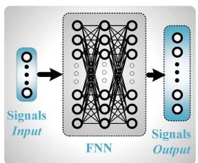  
(a)

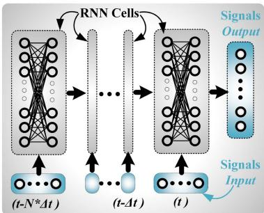  
(b)   
FIGURE 2. NN topologies: (a) FNN; (b) RNN.

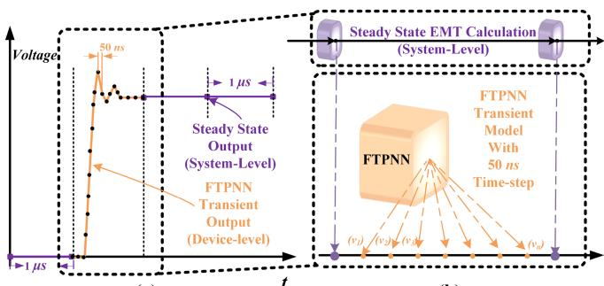  
(a)   
(b)   
FIGURE 3. FTPNN-EMT hybrid model: (a) output waveform; (b) parallel algorithm.

# A. TRADITIONAL EMT CALCULATION MODEL

Fig. 1 illustrates the conventional device-level IGBT waveform calculation process, which is point-to-point in nature: based on the circuit topology and parameters, historical voltages and currents are used to calculate the output voltage and current for the next time-step from the last computation result. Undoubtedly, this calculation analysis method is highly accurate, but for SiC/GaN-based transient waveform changes occurring within 1 μs or even 50 ns, this calculation strategy is difficult to accomplish from one time-step to the next (usually about $1 0 \mu \mathrm { s } )$ . Due to the nonlinearity of the elements (the internal equivalent capacitance value changes with the change of current and voltage), the circuit parameters in these calculation processes are dynamically changing, and the iterative matrix calculation typically consumes a large amount of computing resources and causes significant latency. Moreover, this point-to-point fixed time-step calculation method is sequential and difficult to accelerate through FPGA hardware parallel architecture. Therefore, for device-level waveforms, traditional electromagnetic transient (EMT) calculation methods are inefficient to implement real-time parallel execution.

# B. ML MODELING TOPOLOGY

To develop an ML model for power electronics devices, it is necessary to employ reliable and precise NN topologies, such as traditional FNNs, classical recurrent NNs (RNNs) [24], long short-term memory (LSTM) [25] NNs, gated recurrent units (GRU) [26] NNs, and others. For most power electronics ML applications, near-future prediction is more crucial than long sequence prediction or coarse prediction. Therefore, complex NNs, which require significant computational resources and sub-microsecond real-time execution, are unacceptable for these applications. In [27], a comparison of several NN algorithms reveals that FNN and conventional RNN are the most cost-effective, although LSTM may enhance accuracy at the expense of larger hardware resources. GRU is a compromise between conventional RNN and LSTM, and is often used as a substitute for RNN in many-step applications or when hardware resources are sufficient. As illustrated in Fig. 2(a), the simplest ML model, the FNN, calculates data at the current time-step based on the signal at the

previous time-step. When building models with time-series signal inputs, there may be differences in the data processing structure between FNN and classical RNN, which is shown in Fig. 2(b).

# C. SIC/GAN FTPNN MODEL

Compared with the EMT point-to-point fixed time-step model that is difficult and inefficient to implement on parallel hardware, using NN to calculate transient waveforms can achieve highly efficient parallel execution for real-time emulation. In previous studies [27], [28], the effectiveness of FTPNN method was demonstrated using FNN or system-level EMT and device-level ML algorithms for IGBT models. The NN results of this type of model generally use FNN and minimize the number of layers and neurons as much as possible due to real-time requirements and the need for outputting dozens of data points, such as using 50 data points to emulate a 1 μs waveform with a fixed time-step size of 20 ns or 20 data points to emulate a 1 μs waveform with a fixed time-step size of 50 ns. Fig. 3(a) shows the output waveform of this FTPNN model: the purple dots are generated by the EMT calculation algorithm, while the orange dots generate a series of data points with a fixed time-step to emulate the transient waveform using FTPNN. Fig. 3(b) shows the parallel computing process and output of data points for EMT and FTPNN of this model. This model is easy to train and can achieve an optimal point in terms of hardware resources, accuracy, and latency, making it an exemplary application of the intersection of power electronics and ML technologies.

# D. SIC/GAN PFNN MODEL

The FTPNN method effectively solves the problem of realtime emulation of IGBT device-level transient waveforms. However, for the ultra-short transient processes of GaN devices, it is still difficult for the FTPNN method to achieve small time-steps (less than 20 ns). Moreover, when using small time-steps, the FTPNN method increases latency and consumes significant hardware resources due to the large size of the output matrix caused by the large number of output data points. Therefore, another more efficient method, PFNN, is proposed in this article to emulate SiC/GaN-based transient

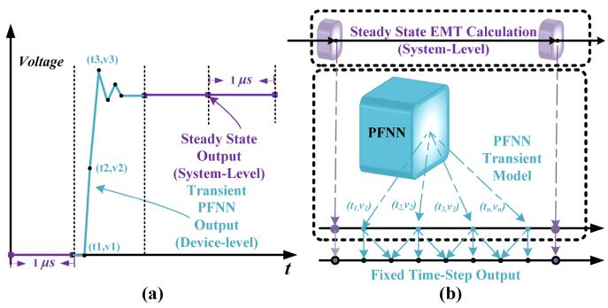  
FIGURE 4. PFNN-EMT hybrid model: (a) output waveform; (b) parallel algorithm.

waveforms. As shown in Fig. 4(a), the PFNN method significantly reduces hardware resource consumption by allowing customizable time-steps while outputting only the critical data points, such as waveform inflection points and waveform peak and valley points, based on the model’s physical features (PF). The output data points of the PFNN method include not only voltage values but also their corresponding time values. By reducing the output of irrelevant information, this method can greatly reduce the consumption of hardware resources when the waveform does not change much. Similarly, the systemlevel data points are calculated using the EMT model, while transient data points are calculated in parallel using the PFNN method. After obtaining the data points (t , v ) to $( t _ { n } , v _ { n } )$ , the piecewise linearization method can be used to insert intermediate data points according to the required time-step, as shown in Fig. 4(b). This allows for the output of data points with a time-step of 10 ns or even 1 ns. Although this data insertion process requires some extra hardware resources, this method saves significant computational resources and reduces latency compared to the FTPNN method using ML training and output strategies.

Fig. 5 illustrates the modeling and data selection process of PFNN. Taking IGBT turn-off transient waveform as an example, Fig. 5(a) shows a 3D dataset containing voltage, current, and time. FTPNN method collects voltage and current data at fixed time-steps for training neural networks, while FPNN method requires data filtering before training. For instance, as shown in Fig. 5(d), the voltage and current waveforms are differentiated with respect to time, and the zero-crossing times of the derivative waveform are marked as key data points. Then, the (t , v, i) values at those time points are collected to form a dataset for training the corresponding PFNN transient waveform model. Fig. 5(b) and (e) show the original (t, v, i) dataset and the waveform in 3D space with voltage or current dimension reduced, respectively, while Fig. 5(c) and (f) display the compressed waveform in 2D for easier data analysis and identification of critical data points. It is evident that NNs have strong fitting capability for continuous 3D waveforms, while 2D waveform plots are suitable for data analysis and identification of critical data points.

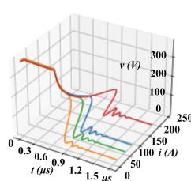  
(a)

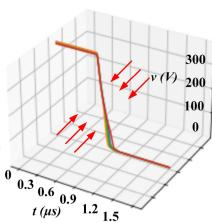  
(b)

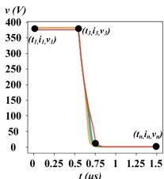  
(c)

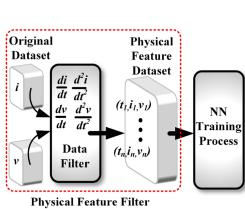  
(d)

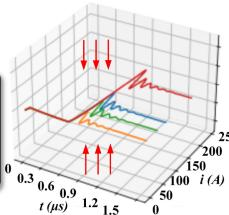  
(e)

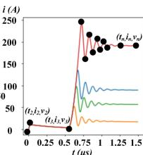  
()   
FIGURE 5. PFNN modeling: (a) 3-D original current-voltage-time datasets; (b) compressed 3-D voltage-time waveform; (c) 2-D voltage-time waveform; (d) PFNN training dataset selection; (e) 3-D original current-time datasets; (f) 2-D current-time waveform.

TABLE 1. Comparison of Models for Transient Waveforms   

<table><tr><td>Feature</td><td>LUT</td><td>EMT</td><td>FTPNN</td><td>PFNN</td></tr><tr><td>Complexity</td><td>+</td><td>++++</td><td>++</td><td>++</td></tr><tr><td>Execution Time</td><td>+</td><td>++++</td><td>+++</td><td>++</td></tr><tr><td>Resource Consumption</td><td>++++</td><td>+++</td><td>++</td><td>++</td></tr><tr><td>Accuracy</td><td>+</td><td>+++</td><td>++</td><td>+++</td></tr><tr><td>Generality</td><td>+</td><td>++++</td><td>+++</td><td>++++</td></tr><tr><td>Long-Period Output</td><td>No</td><td>No</td><td>No</td><td>Yes</td></tr></table>

# E. COMPARISON OF DIFFERENT METHODS

The comparison between models for transient waveforms is presented in Table 1, primarily focusing on aspects such as complexity, execution time, resource consumption, accuracy, generality, and long-period output capability.

The look-up table (LUT) approach (empirical model) is the simplest and most direct, with the advantage of having low computation time and properly outputting the data points of the transient waveform. The disadvantage of this method is that 1) obtaining the data from the LUT or measuring the parameters of the model details is complicated, and 2) the model’s adaptability and generalization capacity is vulnerable.

The EMT approach is now the most widely used offline simulation method. When compared to other methods, it has the advantages of high accuracy, versatility, and excellent generalization potential. The downside is that the computational burden is heavy, and iterative or serial processes are necessary, making the real-time emulation of a tiny time-step impractical.

The FTPNN method is a straightforward ML application. In comparison to the EMT technique, this method sacrifices precision but employs parallel computing to achieve real-time emulation of the minuscule step size. When compared to the

LUT technique, it is more versatile and simple because it only requires input and output data to train.

The PFNN approach, incorporating FTPNN and a physical model, yields accurate results with minimal resource consumption and latency. It exhibits robust generalization and long-term output capabilities, but requires empirical knowledge and skill in data processing, feature extraction, and NN training.

# III. IMPLEMENTATION FOR REAL-TIME DRM HIL EMULATION

In this section, the topology and modeling of the DRM system is introduced firstly. Then, the data processing, training, and parameter determination of ML models are discussed. Finally, the latency and resource consumption of the both EMT and ML models are analyzed.

# A. OVERALL DRM POWER SYSTEM

Fig. 6(a) shows the complete topology of the DRM system, including the AC-transformer-rectifier subsystem (ACTRS), DC railway subsystems, energy storage subsystems (ESSs), and isolated DC/DC (IDCDC) converters, which are connected via an 8 kV MVDC bus. The MVDC bus generates 380 V LVDC, which is utilized to charge electric vehicles via the IDCDCs. SiC IGBTs are used in the MVDC to LVDC IDCDC to adapt to high-power operation, while GaN HEMTs are used in the LVDC to electric vehicle IDCDC in order to increase the switching frequency and reduce the power loss of the charging device. Fig. 6(b) shows the topology of the IDCDC, which mainly consists of 8 switches, one transformer, and one LC filter. The transmission line method (TLM) is applied to partition different subsystems for parallel computation. The ACTRS topology is modeled using the traditional EMT method, and the IDCDC module is also built by the EMT algorithm to ensure accuracy and solubility. For example, the transformer in the IDCDC system is modeled using the trapezoidal rule algorithm, which can be expressed:

$$
i _ {1} ^ {t} = i _ {1} ^ {t - \Delta t} + \frac {d t \left(v _ {1} ^ {t} + v _ {1} ^ {t - \Delta t}\right)}{2 L _ {1 1}} - \frac {L _ {1 2} \left(i _ {2} ^ {t} - i _ {2} ^ {t - \Delta t}\right)}{L _ {2 2}}, \tag {1}
$$

$$
v _ {2} ^ {t} = - v _ {2} ^ {t - \Delta t} + \frac {2 L _ {1 2} \left(i _ {1} ^ {t} - i _ {1} ^ {t - \Delta t}\right)}{d t} + \frac {2 L _ {2 2} \left(i _ {2} ^ {t} - i _ {2} ^ {t - \Delta t}\right)}{d t}, \tag {2}
$$

where, i1, i2, v1, v2 are current and voltage on the primary and secondary sides of the transformer, respectively; $L _ { 1 1 }$ , $L _ { 2 2 }$ , $L _ { 1 2 }$ are the self-inductance of the primary winding, the self-inductance of the secondary winding, and the mutual inductance between the primary and secondary windings.

These EMT methods can ensure sufficient accuracy and low computational complexity with a time-step of 1 μs. Then, the GRU is applied to model the DC railway subsystem and ESS, which is advantageous in terms of balancing hardware resource consumption, accuracy, and latency. The expression of the relative GRU DC railway subsystems and ESSs is given:

$$
i _ {t} = f \left(v _ {t - \Delta t}, \dots , v _ {t - n \Delta t}, i _ {t - \Delta t}, \dots , i _ {t - n \Delta t}\right), \tag {3}
$$

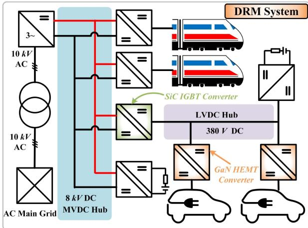

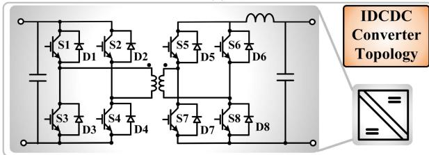  
(a)   
(b)

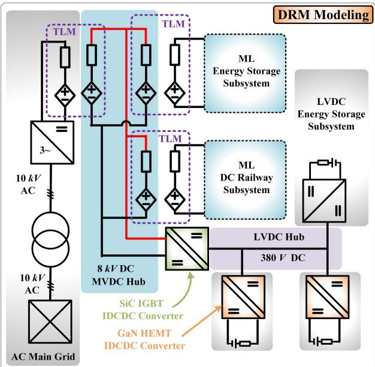  
  
FIGURE 6. DRM: (a) overall system; (b) IDCDC topology; and (c) time-domain modeling.

where n is the number of sequences length; v and i are the two port output voltage and current of the subsystem.

For the SiC IGBT and GaN HEMT in the IDCDC, ML methods are used for modeling, whose expressions are:

$$
\{\mathbf {i}, \mathbf {v} \} = f _ {F T P N N} \left(v _ {t _ {1}}, v _ {t _ {1} + \Delta t}, i _ {t _ {1}}, i _ {t _ {1} + \Delta t}\right), \tag {4}
$$

$$
\left\{\mathbf {t}, \mathbf {i}, \mathbf {v} \right\} = f _ {P F N N} \left(v _ {t _ {1}}, v _ {t _ {1} + \Delta t}, i _ {t _ {1}}, i _ {t _ {1} + \Delta t}\right), \tag {5}
$$

where t, i, v, are output time, current, voltage vectors of device transient; $\Delta t$ is the system-level time-step; and $t _ { 1 }$ represents the moment when the transient of the switch starts.

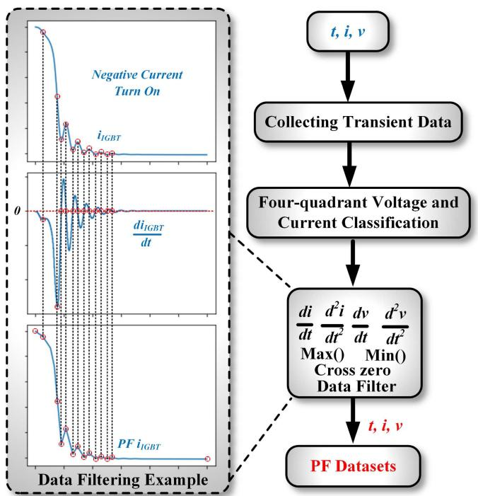  
FIGURE 7. PF Data processing.

# B. DATASET PROCESSING FOR PFNN MODELING

The crucial step in PFNN modeling is the careful selection of data points with pertinent physical feature, directly impacting the resultant waveform. The selection process is guided by the waveform characteristics specific to GaN HEMT or SiC IGBT devices, allowing for precise data point identification. For instance, based on current polarity (turn-on, turn-off) and voltage polarity (positive or negative), waveforms under positive voltage can be categorized into four groups: positive current on, positive current off, negative current on, and negative current off. Each category exhibits distinct characteristics. Subsequently, within each category, relevant data points are chosen based on current and voltage derivatives, as well as the identification of maximum and minimum values. Fig. 7 exemplifies this process, highlighting the extraction of important characteristic data points.This variable-time-step, non-linear modeling approach (PFNN) enables the reconstruction of waveforms using a reduced number of data points, in contrast to previous fixed-time-step methods (SaberRD and FTPNN). Notably, the data point selection process is guided by human expertise rather than AI algorithms, demanding a deep understanding of power electronics and practical experience. This selection strategy relies on specialized knowledge to guarantee precise representation of the waveforms, ensuring their accurate capture and fidelity within the PFNN model.This meticulous data point selection procedure ensures the fidelity of the PFNN model and its ability to faithfully capture the intricate details of the device behavior.

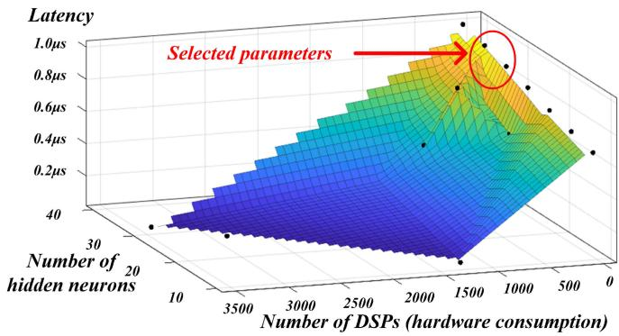  
FIGURE 8. Parameter selection.

# C. TRAINING PROCESS AND PARAMETER DESIGN

For ML models, to ensure their generalization and accuracy, various operating conditions data need to be collected and normalized for efficient and effective training. It is worth noting that the device-level data was obtained from offline simulations performed using SaberRD for the SiC IGBT CMH1200DC-34S [29] and GaN HEMT IGT60R00D1 [30]. Before feeding the dataset into the training program, the data are grouped and shuffled. Then 80% of the data are utilized for training, while the remaining 20% are used for testing and validation. For training a single GRU, the total training times are about 5,000,000 forward computations and error backpropagations. For SiC IGBT transient PFNN and FTPNN, it is about 800,000 times, and it is about 650,000 times for that of GaN HEMT. The training process uses the Adam [31] training strategy with an initial learning rate of 0.001.

As for the design of the number of hidden layers and neurons in the hidden layer of the model, it is a process constantly obtained through experience and testing. According to our previous research [27], [28], the general hidden layer for the IGBT transient FNN is 1 with about 20–40 neurons, which is a balance between hardware resource consumption and accuracy. In pursuit of improved accuracy and generalization in ML models, it is advantageous to employ a larger number of neurons under identical conditions. Nonetheless, it is important to acknowledge that this approach comes with the trade-off of increased hardware consumption and latency. Hence, when determining the parameters for PFNN, careful consideration is given to hardware implementation constraints and requirements. The selection process aims to strike a balance between achieving high accuracy and minimizing resource utilization, ensuring efficient and practical deployment of the model. As depicted in Fig. 8, when the latency requirement is set to be less than 1 μs, a pipeline design for the FPGA matrix is devised. This design aims to maximize the number of neurons while minimizing the number of digital signal processors (DSPs). Eventually, the number of neurons is set to approximately 30. Following thorough verification, it has been established that these parameters fulfill the criterion of maintaining an average prediction error of less than 1%.

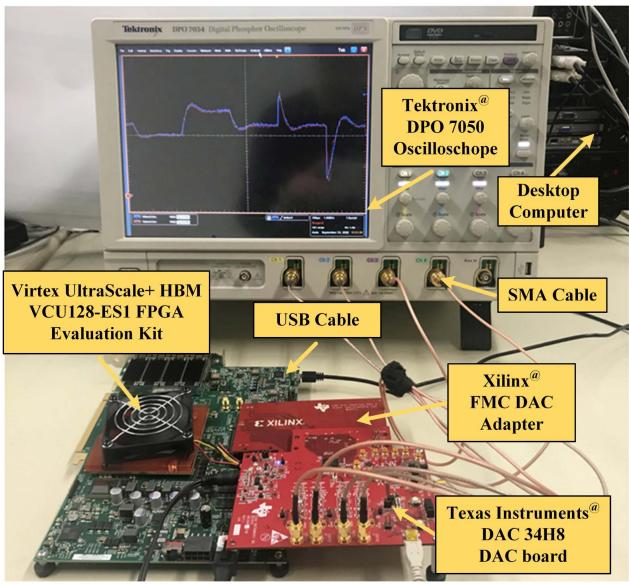  
FIGURE 9. Hardware setup of the DRM real-time emulation.

TABLE 2. Model Hardware Resource Consumption on Xilinx UltraScale+ XCVU37P FPGA   

<table><tr><td>Device</td><td>BRAM</td><td>DSP</td><td>FF</td><td>LUT</td><td>Latency</td></tr><tr><td>EMT ACTRS</td><td>2%</td><td>1%</td><td>1%</td><td>2%</td><td>0.64μs</td></tr><tr><td>EMT IDCDC</td><td>1%</td><td>6%</td><td>3%</td><td>5%</td><td>0.83μs</td></tr><tr><td>GRU DRS</td><td>2%</td><td>4%</td><td>3%</td><td>3%</td><td>8.3μs</td></tr><tr><td>GRU ESS</td><td>2%</td><td>1%</td><td>1%</td><td>2%</td><td>4.1μs</td></tr><tr><td>PFNN GaN HEMT</td><td>1.5%</td><td>0.9%</td><td>0.2%</td><td>0.5%</td><td>0.69μs</td></tr><tr><td>PFNN SiC IGBT</td><td>1.5%</td><td>0.9%</td><td>0.1%</td><td>0.6%</td><td>0.89μs</td></tr><tr><td>FTPNN GaN HEMT</td><td>0%</td><td>0.9%</td><td>0.1%</td><td>5%</td><td>0.61μs</td></tr><tr><td>FTPNN SiC IGBT</td><td>0%</td><td>0.9%</td><td>0.1%</td><td>9%</td><td>0.82μs</td></tr><tr><td>Total Utilization</td><td>16%</td><td>47%</td><td>39%</td><td>83%</td><td></td></tr><tr><td>Available</td><td>4332</td><td>9024</td><td>2607k</td><td>1304k</td><td></td></tr></table>

The GRU sequence length needs to be determined based on the complexity of the model. The sequence length of the DRS GRU is approximately 30, while the ESS GRU is relatively simple with a length of about 5. Moreover, the sequence length should take into account the emulation time-step. For instance, if the emulation time-step is 1 μs, the sequence length needs to be much larger than that for the emulation time-step of 100 μs. The sequence length mentioned above is determined by the parameters selected for a time-step of 50 μs for DRSs.

# D. HARDWARE PLATFORM

Fig. 9 depicts the hardware connection diagram of the DRM emulation system. For this study, the Xilinx VCU128 board with UltraScale+ XCVU37P FPGA was utilized, and Table 2 showcases the main hardware resource consumption of individual modules. The Xilinx VCU128 board offers abundant hardware resources, including 4332 block random access memories (BRAMs), 9024 DSPs, 2607 k flip flops (FFs), and 1304 k LUTs. The entire system is designed with one

ACTRS, three IDCDCs, three GRU DRSs, three ESSs, four device-level SiC IGBTs, and four device-level GaN HEMTs. The EMT subsystem features a simple model and calculations, which can be achieved with less than 5% of hardware resources for a emulation step size of 1 μs. The GRU model is implemented in relatively complex switch-controlled systems, and after TLM segmentation, only the current output is considered. Therefore, the emulation step size is set to 50 μs, resulting in relatively low hardware resource consumption. The SiC IGBT transient model FTPNN has the input, output, and hidden neuron numbers set to the exact same values, leading to nearly identical computational resource consumption and latency. As for the GaN transient model, the PFNN output data points are fewer, making it significantly reduced parameters and calculations than the FTPNN model, resulting in lower resource consumption and latency (0.5 μs).

# E. REAL-TIME HARDWARE IMPLEMENTATION OF PFNN

In the context of real-time PFNN requiring hardware acceleration, the selection of data types in FPGA implementations is crucial. While traditional methods often utilize floatingpoint data types for their precision and larger data range, fixed-point data types are more suitable for resource-saving and low-latency applications. In this article, we leverage the advantages of fixed-point data types, as the ML models employed have normalized training data, including inputs, outputs, weights, and biases within the range of -1 to 1. Consequently, the ap_fixed< 32, 12 > data type is employed for matrix operations in the FPNN model. This data type achieves a precision of 10e-6 for the decimal part, while the integer part adequately satisfies the requirements of a simple LUT. By utilizing the ap_fixed data type, a significant reduction in the utilization of DSP resources is achieved. To expedite the tanh calculation, a LUT method is employed as described in reference [27], necessitating a certain amount of BRAMs. In contrast, this article adopts the rectified linear activation function (ReLU) activation function within the FPNN model, which significantly conserves hardware resources. These considerations in selecting appropriate data types and activation functions contribute to optimizing hardware resource utilization and improving the efficiency of FPGA implementations.

The hardware optimization for PFNN implementation primarily targets the matrix operations involved. Fig. 10 compares the hardware resource consumption of different configurations for matrix operations, including pipeline design using for loops, partial unrolling, and full unrolling, as well as the utilization of fixed-point and floating-point data types under the pipeline strategy. To facilitate comparison, the resource consumption is expressed as percentages. According to Fig. 10, the pipeline design demonstrates the lowest resource utilization. For the SiC IGBT PFNN model with fixed-point data types, it consumes 60 BRAMs, 80 DSPs, 3418 FFs, and 7261 LUTs, representing 1.5%, 0.9%, 0.1%, and 0.6% of the total available FPGA resources, respectively, while achieving a latency of 0.89 μs. Partial unrolling reduces the latency to 0.58 μs at the cost of additional DSPs (291), FFs

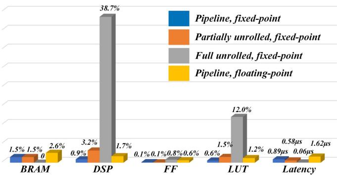  
FIGURE 10. SiC IGBT PFNN hardware resource consumption with different optimized implementations.

(2302), and LUTs (19804). Full unrolling of the for loop enables a computation time of just 60 ns but requires 3489 DSPs, 21109 FFs, and 158025 LUTs, occupying 38.7%, 0.8%, and 12.0% of the total resources, respectively. By employing floating-point data types instead of fixed-point, the same PFNN model experiences an increased latency from 0.89 μs to 1.6 μs, along with the consumption of 105 BRAMs, 155 DSPs, 16734 FFs, and 15839 LUTs, corresponding to 2.6%, 1.7%, 0.6%, and 1.2% of the total resources, respectively. The use of fixed-point data types reduces both hardware resource consumption and latency. It is worth noting that the actual resource consumption may vary based on coding and optimization techniques. For instance, utilizing LUT methods for partial function calculations can reduce DSP usage while increasing LUT utilization. Storage options may involve reducing LUTs in favor of BRAMs. Specific optimization strategies and hardware implementations are case-specific and depend on the scenario.

# IV. RESULTS AND DISCUSSION

This section presents a comparison of the DRM emulation results at both system-level and device-level. The system-level reference comparison results are obtained from PSCAD/EMTDC, while the device-level reference comparison results are obtained from SaberRD. The SaberRD method, which represents the existing traditional approach validated by commercial software. Although it offers high accuracy due to the Newton-Raphson method, it falls short in real-time simulation requirements due to point-to-point calculations and extensive iterative computations. The IGBT device-level modeling provided by SaberRD has been experimentally validated in published papers [32], [33], [34]. The FTPNN method, which we previously developed in [27] and [28]. This method meets real-time emulation requirements for SiC IGBTs and regular IGBTs. However, it requires significant computational resources, particularly when dealing with short transient processes, and the training of the ML component presents increased challenges. The PFNN method, proposed in this article, builds upon the latest advancements of the FTPNN approach. It achieves a balance between accuracy and hardware resource consumption, enabling data output with a minimum

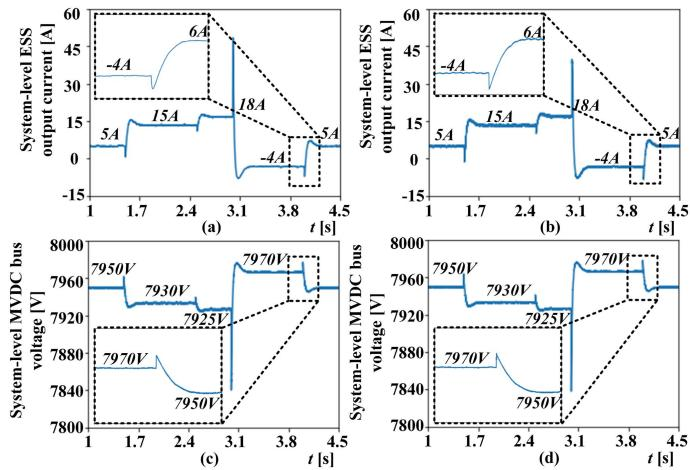  
FIGURE 11. System-level waveforms: (a) ESS output current from PSCAD/EMTDC; (b) ESS GRU output current from real-time emulation; (c) MVDC bus voltage from PSCAD/EMTDC; (d) MVDC bus voltage from real-time emulation.

step size of 1 ns for the emulation of ultra-fast transient processes in GaN HEMTs. The system-level emulation includes outputs from both GRU models with a time-step of 100 μs and EMT models with a time-step of 1 μs. For device-level emulation, the FTPNN model has a fixed time-step of 50 ns, while the PFNN model has a variable time-step that can reach a minimum resolution of 1 ns.

Fig. 11(a) and (b) show the current outputs of the ESS in PSCAD/EMTDC and the GRU ESS model, respectively, as the current varies from 5 A to 15 A, then 18 A, 5 A and finally returns to 5 A. This variation is determined by the voltage changes on the MVDC bus, as shown in Fig. 11(c) and (d). The voltage changes with power variations, and the steady-state range is maintained between 7.9 kV and 8 kV.

Fig. 12 shows the voltage-current and power loss waveforms of the GaN HEMT switch transient process. The waveform suffix “1” represents the reference waveform from SaberRD, while the suffix “2” represents the output waveform from the PFNN. Fig. 12(a) to (h) represent the positive current turn-on current transient, positive current turn-off current transient, positive current turn-on voltage transient, positive current turn-off voltage transient, negative current turn-on current transient, negative current turn-off current transient, negative current turn-on voltage transient, and negative current turn-off voltage transient, respectively. The voltage operates in the range of 370 V to 390 V corresponding to the LVDC bus voltage of 380 V. The turn-on and turn-off range of current is from 100 A to 150 A. Each graph uniformly shows waveforms for six different currents. The results show that even though the GaN HEMT transient is less than 10 ns, the PFNN model can efficiently and accurately reproduce the transient waveform with an average error of less than 2%. Furthermore, the comparison between the SaberRD waveform and the PFNN waveform, and the FTPNN waveform is shown in Fig. 12(i), (j), (k), and (l), respectively. They correspond to

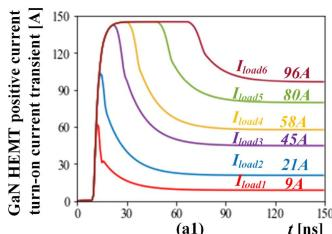

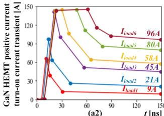

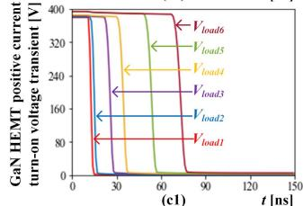

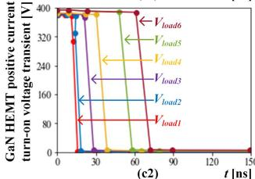

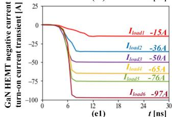

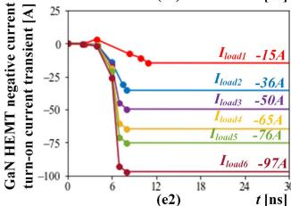

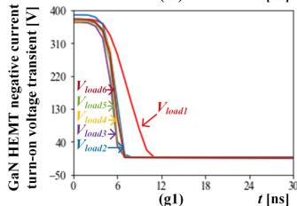

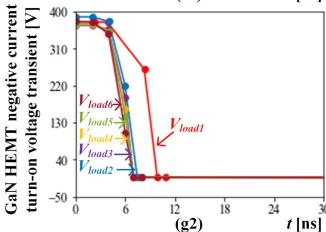

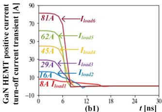

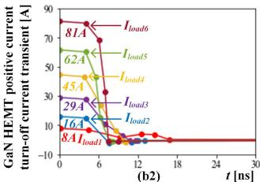

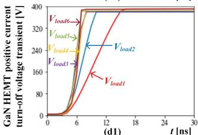

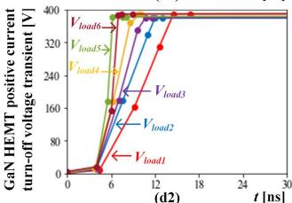

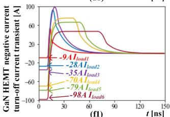

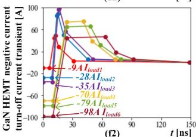

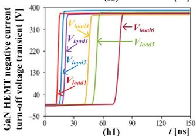

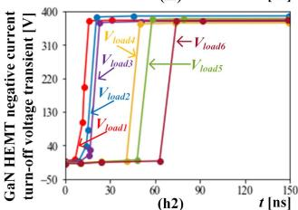

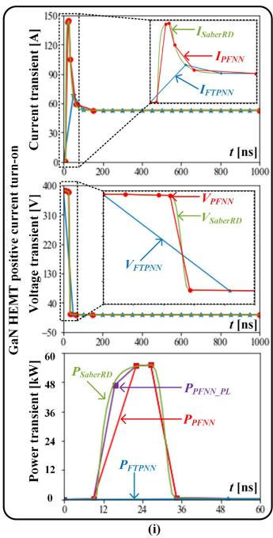

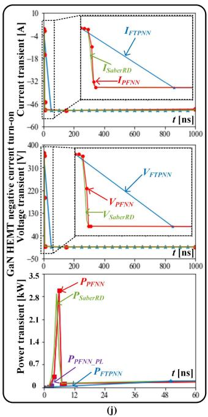

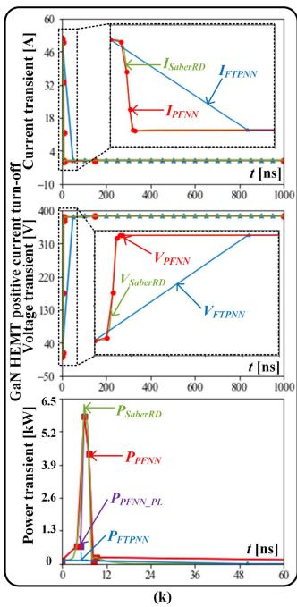

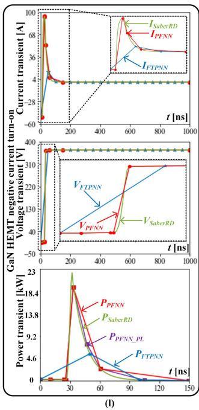  
FIGURE 12. Device-level GaN HEMT transient waveforms under changing load conditions (the 1st for offline SaberRD, and the 2nd for real-time PFNN): (a) positive current turn-on transient current; (b) positive current turn-off transient current; (c) positive current turn-on transient voltage; (d) positive current turn-off transient voltage; (e) negative current turn-on transient current; (f) negative current turn-off transient current; (g) negative current turn-on transient voltage; and (h) negative current turn-off transient voltage; and waveform comparison: (i) positive current turn-on; (j) negative current turn-on; (k) positive current turn-off; and (l) negative current turn-off.

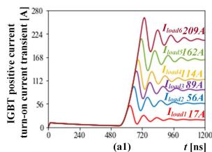

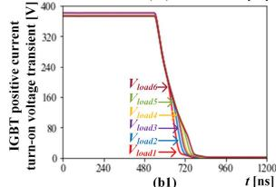

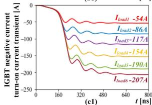

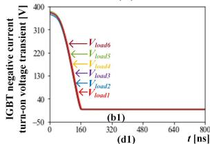

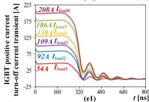

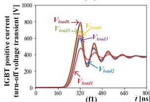

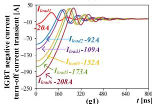

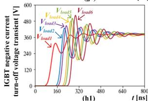

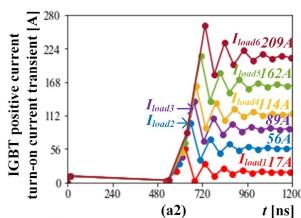

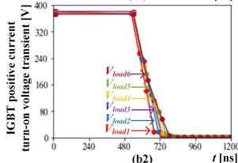

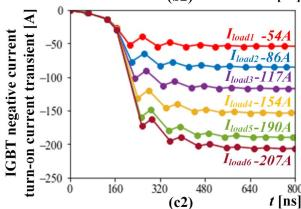

  
FIGURE 13. Device-level SiC IGBT transient waveforms under changing load conditions (the 1st column for offline SaberRD, the 2nd column for real-time PFNN, the 3rd column for real-time FTPNN, and the 4th column for the comparison among SaberRD, PFNN, and FTPNN): (a) positive current turn-on transient current; (b) positive current turn-on transient voltage; (c) negative current turn-on transient current; (d) negative current turn-on transient voltage; (e) positive current turn-off transient current; (f) positive current turn-off transient voltage; (g) negative current turn-off transient current; and (h) negative current turn-off transient voltage.

four transients: positive current turn-on, positive current turnoff, negative current turn-on, and negative current turn-off, all at 100 A. From Fig. 12, the PFNN can accurately reproduce the GaN HEMT transient power loss, while the FTPNN cannot reflect the power loss (the transient integrated power loss is less than $1 0 \mu J )$ , because the transient is approximately 10 ns, which is far smaller than the fixed time-step of 50 ns for FTPNN. The power loss calculated from the SaberRD data for these four states is $1 0 1 6 \mu J , 3 4 \mu J , 1 7 \mu J .$ , and 348 $\mu J ,$ , while the power loss for PFNN is $8 5 2 \mu J , 3 2 \mu J , 1 7 \mu J ,$ and 484 $\mu J ,$ , respectively. The error in power loss arises due to the selective feature extraction employed in PFNN, which solely relies on current and voltage features. Incorporating power loss as a feature point in accordance with user specifications would yield results more consistent with SaberRD, at the expense of heightened hardware resource utilization. The optimized PFNN with power loss as a feature point, denoted as $P _ { P I N N \_ P L }$ , is illustrated in Fig. 12, with respective values of $9 7 8 \mu J , 3 2 \mu J , 1 7 \mu J$ , and 388 $\mu J .$ .

Fig. 13 depicts the transient waveforms of SiC IGBT. The suffix “1” denotes the reference waveform from SaberRD, the suffix “2” represents the output waveform from PFNN, the suffix “3” represents the output waveform from FTPNN, and suffix “4” compares the output waveforms of the three models. Similar to Figs. 12 and 13(a) to (h) represent the current and voltage transients during turn-on and turn-off under positive or negative current for six different current levels ranging from 0 to 200 A. By comparing the waveforms in the first, second, and third columns, it is evident that while FTPNN can also reflect the IGBT transient process to some extent (since the transient lasts for about 500 ns), PFNN is closer to the SaberRD model output. PFNN accurately captures the maximum and minimum values of the waveform during oscillation intervals. Moreover, PFNN is more efficient in not wasting data points in smooth and unchanged intervals. The waveforms in the fourth column at 100 A positive or negative current reveal that PFNN can output more detailed transients than FTPNN.

# V. CONCLUSION

This article presents a novel approach for real-time hardware emulation of the DRM system using ML-accelerated WBG models. The proposed system is divided into different parallel EMT or ML parts through TLM. To achieve WBG SiC/GaNbased device-level transient modeling outputs for the critical IDCDC converter, two NN strategies, namely FTPNN and PFNN, are introduced. The GRU model at system-level is validated by PSCAD/EMTDC, while the GaN HEMT and SiC IGBT models at device-level are verified by SaberRD. The proposed PFNN model offers several advantages over existing approaches: 1) strong versatility–PFNN can be applied to different device-level components, such as SiC IGBTs, GaN HEMTs, and conventional IGBTs, with varying power, voltage, current ranges, and transient time lengths; 2) ultra-fast transient emulation capability–PFNN can emulate voltage and current transients at the 10 ns level; 3) high flexibility with

variable time-step–PFNN can achieve a ultra-small time-step (as low as 1 ns) or a time-step greater than 1 μs. In summary, the proposed ML-accelerated PFNN model offers high accuracy, strong generality, ultra-fast emulation capability, and high flexibility, which has the potential to significantly accelerate the performance of real-time DRM emulation system.

# REFERENCES

[1] M. Brenna, F. Foiadelli, and H. J. Kaleybar, “The evolution of railway power supply systems toward smart microgrids: The concept of the energy hub and integration of distributed energy resources,” IEEE Electrific. Mag., vol. 8, no. 1, pp. 12–23, Mar. 2020.   
[2] A. Verdicchio, P. Ladoux, H. Caron, and C. Courtois, “New mediumvoltage DC railway electrification system,” IEEE Trans. Transp. Electrific., vol. 4, no. 2, pp. 591–604, Jun. 2018.   
[3] N. H. Baars, J. Everts, H. Huisman, J. L. Duarte, and E. A. Lomonova, “A 80-kW isolated DC–DC converter for railway applications,” IEEE Trans. Power Electron., vol. 30, no. 12, pp. 6639–6647, Dec. 2015.   
[4] J. Fabre et al., “Characterization and implementation of resonant isolated DC/DC converters for future MVDC railway electrification systems,” IEEE Trans. Transp. Electrific., vol. 7, no. 2, pp. 854–869, Jun. 2021.   
[5] H. A. Mantooth, K. Peng, E. Santi, and J. L. Hudgins, “Modeling of wide bandgap power semiconductor devices–Part I,” IEEE Trans. Electron Devices, vol. 62, no. 2, pp. 423–433, Feb. 2015.   
[6] E. Santi, K. Peng, H. A. Mantooth, and J. L. Hudgins, “Modeling of wide bandgap power semiconductor devices–Part II,” IEEE Trans. Electron Devices, vol. 62, no. 2, pp. 434–442, Feb. 2015.   
[7] J. Gareau, R. Hou, and A. Emadi, “Review of loss distribution, analysis, and measurement techniques for GaN HEMTs,” IEEE Trans. Power Electron., vol. 35, no. 7, pp. 7405–7418, Jul. 2020.   
[8] L. Han, L. Liang, Y. Kang, and Y. Qiu, “A review of SiC IGBT: Models, fabrications, characteristics, and applications,” IEEE Trans. Power Electron., vol. 36, no. 2, pp. 2080–2093, Feb. 2021.   
[9] M. Fu, C. Fei, Y. Yang, Q. Li, and F. C. Lee, “A GaN-based DC–DC module for railway applications: Design consideration and high-frequency digital control,” IEEE Trans. Ind. Electron., vol. 67, no. 2, pp. 1638–1647, Feb. 2020.   
[10] J. Fabre, P. Ladoux, and M. Piton, “Characterization and implementation of dual-SiC MOSFET modules for future use in traction converters,” IEEE Trans. Power Electron., vol. 30, no. 8, pp. 4079–4090, Aug. 2015.   
[11] X. Long, Z. Jun, B. Zhang, D. Chen, and W. Liang, “A unified electrothermal behavior modeling method for both SiC MOSFET and GaN HEMT,” IEEE Trans. Ind. Electron., vol. 68, no. 10, pp. 9366–9375, Oct. 2021.   
[12] X. Wang, C. Jiang, B. Lei, H. Teng, H. K. Bai, and J. L. Kirtley, “Power-loss analysis and efficiency maximization of a silicon-carbide MOSFET-based three-phase 10-kW bidirectional EV charger using variable-DC-bus control,” IEEE J. Emerg. Sel. Top. Power Electron., vol. 4, no. 3, pp. 880–892, Sep. 2016.   
[13] X. Huang, Q. Li, Z. Liu, and F. C. Lee, “Analytical loss model of high voltage GaN HEMT in cascode configuration,” IEEE Trans. Power Electron., vol. 29, no. 5, pp. 2208–2219, May 2014.   
[14] K. Shah and K. Shenai, “Simple and accurate circuit simulation model for gallium nitride power transistors,” IEEE Trans. Electron Devices, vol. 59, no. 10, pp. 2735–2741, Oct. 2012.   
[15] V. Dinavahi and N. Lin, Real-Time Electromagnetic Transient Simulation of AC-DC Networks. Hoboken, NJ, USA: Wiley-IEEE Press, 2021.   
[16] Z. Huang and V. Dinavahi, “An efficient hierarchical zonal method for large-scale circuit simulation and its real-time application on more electric aircraft microgrid,” IEEE Trans. Ind. Electron., vol. 66, no. 7, pp. 5778–5786, Jul. 2019.   
[17] T. Liang and V. Dinavahi, “Real-time device-level simulation of MMCbased MVDC traction power system on MPSoC,” IEEE Trans. Transp. Electrific., vol. 4, no. 2, pp. 626–641, Jun. 2018.

[18] N. Lin and V. Dinavahi, “Detailed device-level electrothermal modeling of the proactive hybrid HVDC breaker for real-time hardware-in-theloop simulation of DC grids,” IEEE Trans. Power Electron., vol. 33, no. 2, pp. 1118–1134, Feb. 2018.   
[19] N. Lin and V. Dinavahi, “Behavioral device-level modeling of modular multilevel converters in real time for variable-speed drive applications,” IEEE J. Emerg. Sel. Topics Power Electron., vol. 5, no. 3, pp. 1177–1191, Sep. 2017.   
[20] H. Bai, C. Liu, E. Breaz, K. Al-Haddad, and F. Gao, “A review on the device-level real-time simulation of power electronic converters: Motivations for improving performance,” IEEE Ind. Electron. Mag., vol. 15, no. 1, pp. 12–27, Mar. 2021.   
[21] Q. Li, H. Bai, E. Breaz, R. Roche, and F. Gao, “ANN-aided data-driven IGBT switching transient modeling approach for FPGA-based real-time simulation of power converters,” IEEE Trans. Transp. Electrific., vol. 9, no. 1, pp. 1166–1177, Mar. 2023.   
[22] B. Shang, T. Cheng, T. Liang, N. Lin, and V. Dinavahi, “Real-time nonlinear behavioral electrothermal device-level emulation of IGBT on heterogeneous adaptive compute acceleration platform,” IEEE Open J. Ind. Electron. Soc., vol. 3, pp. 663–673, 2022.   
[23] T. Liang, Q. Liu, and V. R. Dinavahi, “Real-time hardware-in-the-loop emulation of high-speed rail power system with SiC-based energy conversion,” IEEE Access, vol. 8, pp. 122348–122359, 2020.   
[24] M. Schuster and K. K. Paliwal, “Bidirectional recurrent neural networks,” IEEE Trans. Signal Process., vol. 45, no. 11, pp. 2673–2681, Nov. 1997.   
[25] S. Hochreiter and J. Schmidhuber, “Long short-term memory,” Neural Comput., vol. 9, no. 8, pp. 1735–1780, Nov. 1997.   
[26] J. Chung, C. Gulcehre, K. Cho, and Y. Bengio, “Empirical evaluation of gated recurrent neural networks on sequence modeling,” 2014, arXiv:1412.3555.   
[27] S. Zhang, T. Liang, and V. Dinavahi, “Machine learning building blocks for real-time emulation of advanced transport power systems,” IEEE Open J. Power Electron., vol. 1, pp. 488–498, 2020.   
[28] S. Zhang, T. Liang, T. Cheng, and V. Dinavahi, “Machine learning based modeling for real-time inferencer-in-the-loop hardware emulation of high-speed rail microgrid,” IEEE J. Emerg. Sel. Top. Ind. Electron., vol. 3, no. 4, pp. 920–932, Oct. 2022.   
[29] Mitsubishi Electric Corporation, “CMH1200DC-34S datasheet,” 2023. [Online]. Available: https://www.mitsubishielectric.com/semiconduc tors/content/product/powermodule/hvigbt_ipm/s_series/cmh1200dc-34s_e.pdf   
[30] Infineon Technologies AG, “IGT60R070D1 Datasheet,” 2023. [Online]. Available: https://www.infineon.com/dgdl/Infineon-IGT60R070D1-Da taSheet-v02_12-EN.pdf?fileId=5546d46265f064ff016686028dd56526   
[31] D. P. Kingma and J. Ba, “Adam: A method for stochastic optimization,” in Proc. 3rd Int. Conf. Learn. Representation, 2015, pp. 1–15.   
[32] A. R. Hefner and D. M. Diebolt, “An experimentally verified IGBT model implemented in the saber circuit simulator,” IEEE Trans. Power Electron., vol. 9, no. 5, pp. 532–542, Sep. 1994.   
[33] H. A. Mantooth and A. R. Hefner, “Electrothermal simulation of an IGBT PWM inverter,” IEEE Trans. Power Electron., vol. 12, no. 3, pp. 474–484, May 1997.   
[34] A. Courtay, “MAST power diode and thyristor models including automatic parameter extraction,” in Proc. SABER User Group Meeting, Brighton, U.K., 1995.

SONGYANG ZHANG (Graduate Student Member, IEEE) received the B.Eng. and M.Eng. degrees in electrical engineering from the Huazhong University of Science and Technology, Wuhan, Hubei, China, in 2017 and 2019, respectively. He is currently working toward the Ph.D. degree in electrical and computer engineering with the University of Alberta, Edmonton, AB, Canada. His research interests include machine learning, real-time simulation, power electronics, and field programmable gate arrays.

TIAN LIANG (Member, IEEE) received the B.Eng. degree in electrical engineering from Nanjing Normal University, Nanjing, Jiangsu, China, in 2011, the M.Eng. degree from Tsinghua University, Beijing, China, in 2014, the Ph.D. degree in energy systems from the University of Alberta, Edmonton, AB, Canada, in 2020. He is currently with RTDS Technologies Inc., Winnipeg, MB, Canada. His research interests include real-time simulation of power systems, power electronics, artificial intelligence, field-programmable gate arrays, and system on chip.

VENKATA DINAVAHI (Fellow, IEEE) received the B.Eng. degree in electrical engineering from the Visvesvaraya National Institute of Technology (VNIT), Nagpur, India, in 1993, the M.Tech. degree in electrical engineering from the Indian Institute of Technology (IIT) Kanpur, India, in 1996, and the Ph.D. degree in electrical and computer engineering from the University of Toronto, Toronto, ON, Canada, in 2000. He is currently a Professor of energy systems with the Department of Electrical and Computer Engineering, University of Alberta,

Edmonton, AB, Canada. He is also a Professional Engineer with the Province of Alberta, Canada. His research interests include real-time simulation of large-scale power systems and power electronic systems, electromagnetic transients, device-level modeling, machine learning, artificial intelligence, and parallel and distributed computing. He is also the Fellow of the Engineering Institute of Canada (EIC) and Asia-Pacific Artificial Intelligence Association (AAIA).