# An FPGA based electromagnetic transient analysis of power distribution network


Swati Shukla a,* , Abhishek Agrawal b , Balbir Singh b , Gaurav Trivedi

a School of Energy Sciences and Engineering, Indian Institute of Technology Guwahati, India   
b Department of Electronics and Electrical Engineering, Indian Institute of Technology Guwahati, India

# A R T I C L E I N F O

Keywords:

Power distribution network (PDN)

Electromagnetic transient (EMT) analysis

Field programmable gate array (FPGA)

# A B S T R A C T

The electrical power distribution network (PDN) is in the transition phase due to the integration of distributed energy resources (DERs). Therefore, an accurate and efficient modeling and simulation platform is the need of the hour to determine the dynamic behavior of the PDN. The recent computational hardware, such as GPU, FPGA, etc. enables new simulation paradigm and develop a more realistic platform in the form of system emulators. In this paper, an FPGA based electromagnetic transient (EMT) simulation framework for the PDN is presented. Conjugate-gradient (CG) based electrical network solver is implemented in the proposed framework, and a test case is analyzed for Jail substation of Guwahati city, India, to validate the simulation environment. It has been compared with the MATLAB based implementation for verifying its accuracy. The proposed EMT simulator is approximately 12.5 times faster as compared to its MATLAB implementation and exhibits good accuracy as well.

# 1. Introduction

The electrical power distribution network (PDN) is evolving for the effective integration of the distributed generation (DG). In this scenario, an accurate and efficient modeling and simulation tool is desired to determine the dynamic behavior of the PDN [1]. A typical PDN mainly consists of a distribution transformer, distribution feeder, and connected load [2]. The equivalent PDN can be represented by a combination of network elements such as resistor, inductor, capacitor, etc. [2,3]. The new generation high-performance hardware accelerators such as GPU, FPGAs based simulation framework may be useful for the efficient modeling and simulation of the PDN [4,5]. The efficiency of a PDN simulation framework is evaluated by the accuracy of the PDN model and the performance of solver incorporated in the simulation environment [6]. Considerable efforts are devoted to the development of accurate PDN models and efficient solvers [7–9].

The Electromagnetic Transient (EMT)Figure 13 simulation is a useful tool for the design, planning, operation, and control of the PDN [6]. The EMT simulation framework with FPGA [10,11] and GPU [12] based hardware accelerator to improve computational performance is introduced. The EMT simulation framework with FPGA enables improved computational performance over GPUs as inter-processor

communication imposes additional overhead time [13]. Therefore, several work on the development of FPGA based simulation framework is presented [14–17].

Another approach, in the progress of FPGA based simulator, i.e., a system on chip (SoC) implementation, is presented in [18]. The simulator performs a complete solution of the system for each simulation time step. Prior to this work, the FPGA-based simulator was based on the pre-storing the resulting inverse matrices for all possible combinations of the states of the time-variant elements. Pre-storing the possible inverse matrices limits the scope of simulation upto a few no of time-variant power system elements. Most recent FPGA based EMT simulator design approach is presented in [19]. In this work a co-simulation framework, integrating the MATLAB/Simulink based user oriented section and hardware oriented (FPGA based) computational framework is presented.

Exhaustive reflection of the literature review reveals the scope of further improvement in network matrix formulation and the development of an effective solver. The system conductance matrix generated during the PDN network analysis is sparse, Symmetric Sositive Definite (SPD), but ill-conditioned. The conjugate-gradient (CG) based solver is an appropriate choice for the SPD matrix [20]. As the condition number of conductance matrix is very high; the preconditioned CG based

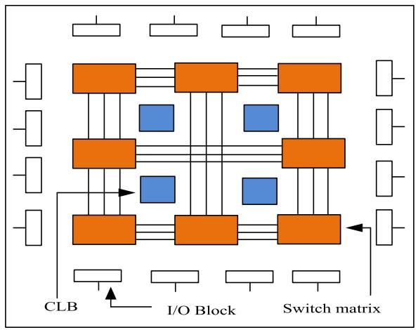  
(a)

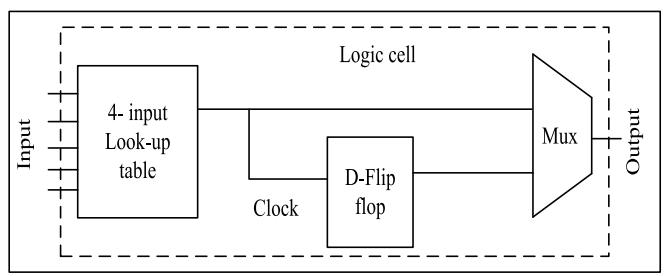  
(b)   
Fig. 1. (a) Basic architecture of FPGA. (b) Logic cell diagram.

network solver is preferred to improve the convergence.

In this paper, the EMT simulation framework for PDN with SoC-FPGA board is presented. A detailed discussion on the selection of CG based solver is presented. A preconditioned CG (PCG), based network matrix solver unit is developed. The proposed solver is developed with

• Memory efficient storage format for sparse matrix   
• Optimized matrix vector multiplication   
• Pipelined floating point adder and multiplier

For this implementation, Zedboard, Zynq-7000 ARM/FPGA SoC development board, and Vivado programming environment have been used. The SoC development board provides the integrated software programmability of a processor with the hardware programmability of an FPGA into a single device [21]. Therefore, they deliver improved integration with reduced power, the smaller board size, and better bandwidth communication between the processor and FPGA. Detailed discussion on the architecture, pipelining, data representation, and network matrix solution has been presented.

The rest of the paper is organized as follows: Section 2 presents an overview of SoC FPGA. Section 3 describes the choice of iterative solver. Section 4 describes the framework for EMTP type simulation on SoC FPGA. Section 5 presents the implementation and operation of the SoC FPGA. Result and discussion are presented in Section 6. Finally, the paper concludes with Section 7.

# 2. Overview of SoC FPGA

Xilinx Zynq-7000 series chips are based on SoC FPGA architecture, which consists of Programmable Logic (FPGA) and Programmable Sys tem (Processor) integrated on a single chip. Programmable System (PS) consists of a dual-core ARM Cortex-A9 application processor, capable of running embedded operating systems to support software application modules and high-speed interfaces of the hardware system design. The choice of OS depends on system design specifications; however, embedded Linux OS is popularly used because it efficiently utilizes memory management unit (MMU) of the processor and also provides symmetric multiprocessing (SMP) capabilities to take advantage of multiple processors. The OS kernel can support applications developed in C, C++, Python, and many other programming languages. AXI interconnect ports provide low latency and high throughput data transfer between the PS and the Programmable Logic (PL). AXI ports offer access from the PL to DDR3 RAM and on-chip memory (OCM) in the PS. PL consists of Artix-7 or Kintex-7 based FPGA chip along with optimized Digital Signal Processing (DSP) blocks.

FPGA is a programmable VLSI circuit. The underlying architecture of FPGA consists of an array of the configurable logic block (CLB), I/O block, and interconnect switch matrices, as shown in Fig. 1(a). Internally, the user-defined logic is implemented in FPGA by programming the basic logic-building units of CLB, called a logic cell (Xilinx). A logic cell usually contains function generators (4-input Look-up table), flipflops, and multiplexers, as shown in Fig. 1(b). A Lookup table (LUT) stores the truth table of the function being implemented and provides the combinational circuit functionality to the logic block. An n-input LUT can generate any arbitrary function of at most n-input variables. Dflip flops are used to synchronously register the data with respect to the system clock. Multiplexers serve as the control units for data flow. A grid of programmable switch matrices overlays the CLBs to provide a general-purpose interconnect for branching and routing throughout the device. The I/O blocks corresponding to each user-programmable I/O pins are responsible for configuring the pin as an input, output, or bidirectional.

A typical FPGA design flow begins with the description of user application using hardware description languages like Verilog, System Verilog, or VHDL, generally at register transfer level (RTL). The functional verification and debugging of code are done through behavioural simulation. EDA tools like Xilinx Vivado are used for synthesis, implementation, placement, and routing. After these processes are over, a binary configuration file, called bitstream is generated by the tool. Finally, the FPGA is programmed by downloading this generated bitstream file, which then, functions according to the user-defined logic.

A vital characteristic of the FPGA is its intrinsic parallel architecture. Contrary to a general-purpose processor (GPP), the hardware logic blocks of FPGA are not hard-wired, i.e., the user can program the hardware, multiple times. The memory blocks of FPGA can be configured as ROM, single port, or Dual-port RAM, with varying sizes of data and address buses. This enables the hardware resources to be configured into different blocks, all of which are capable of operating parallelly. On the other hand, GPP executes the instructions sequentially and has shared memory resources.

# 3. Choice of iterative solver

The EMTP-type solver performs numerical integration with a step size of Δt to analyze dynamic network equation. A linearized system of equations, i.e. GV = I, are formulated. Here, $G \in R ^ { N \times N }$ is a N × N matrix and N is the number of nodes of the PDN. $V \in R ^ { N }$ is the node voltage vector, and I represents the history-current and the known current sources. The selection of an appropriate solver can significantly improves performance of the solver. Traditionally, solution of the linear

Table 1 Condition number, sparsity and SPD test for the system admittance matrix (G).   

<table><tr><td>No. of nodes</td><td>Condition No.</td><td>Sparsity</td><td>SPD</td></tr><tr><td>50</td><td>290700</td><td>0.94</td><td>yes</td></tr><tr><td>150</td><td>290700</td><td>0.98</td><td>yes</td></tr><tr><td>200</td><td>290700</td><td>0.985</td><td>yes</td></tr><tr><td>250</td><td>290700</td><td>0.988</td><td>yes</td></tr><tr><td>300</td><td>290700</td><td>0.99</td><td>yes</td></tr><tr><td>400</td><td>290700</td><td>0.992</td><td>yes</td></tr><tr><td>500</td><td>297400</td><td>0.994</td><td>yes</td></tr><tr><td>1000</td><td>297400</td><td>0.997</td><td>yes</td></tr></table>

system of equations is performed with direct solvers, such as, the LUdecomposition. However, in [22] the advantage of iterative solvers over the LU-decomposition method is described.

There are numerous iterative methods available for the solution of a linear system of equations. The Jacobi and Gauss-Seidel (GS) are wellknown iterative methods used to solve linear systems of equations. However, these iterative methods cannot analyze all kinds of linear system efficiently as the performance of iterative solver mainly depends upon the characteristics of the coefficient matrix. Because of the complexity of large circuits, sometimes the coefficient matrix can be illconditioned after formulation. The Table 1, presents condition number, sparsity, and SPD test for the system admittance matrix G. It may be observed that the system admittance matrix of the network is consistently sparse, SPD, and ill-conditioned. The CG based algorithm has

improved performance over conventional methods to solve the sparse, positive-definite, linear systems of equation. It offers scope for the parallelization of the matrix solution over traditional matrix solvers.

The CG based iterative method is derived from the orthogonal projection to the Krylov-subspace. Several iterative techniques, such as $\mathbf { C G } ,$ PCG, CG square (CGS), and GMRES are known for the solution of the linear system of equations.

A comparative analysis with arbitrary chosen electrical circuit of Krylov subspace-based methods is performed. All the experiments are performed on a computer with the Intel Xeon ES2609 processor with 16- GB RAM. From Fig. 2(a) and (b), it can be observed that GMRES method converges in less number of iteration; however, the time of convergence (ToC) is more than CG, PCG and CGS method. At the same time, CG and PCG methods converges with an equal number of iterations, whereas the ToC for PCG is higher. Detailed test results are presented in Table 2. It is observed that CG based iterative solver performs better than the PCG, CGS, and GMRES method for the circuits chosen for the analysis.

# 4. Framework for EMTP type simulation on SoC FPGA

# 4.1. System architecture of proposed SoC FPGA based EMTP simulator

The hardware submodules of the EMTP are shown in Fig. 3. The submodules can be grouped as follows: 1. Network Modelling Unit; 2. Source Unit; 3. Switch Unit; 4. Matrix Formation Unit; 5. History Current Unit; 6. Matrix Solution; 7. Network Solution; and 8. ALU Unit. Data and

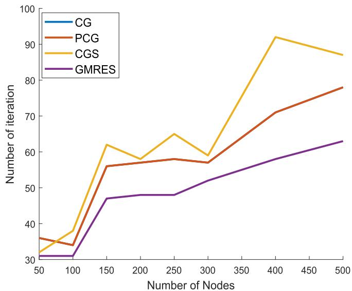  
(a）

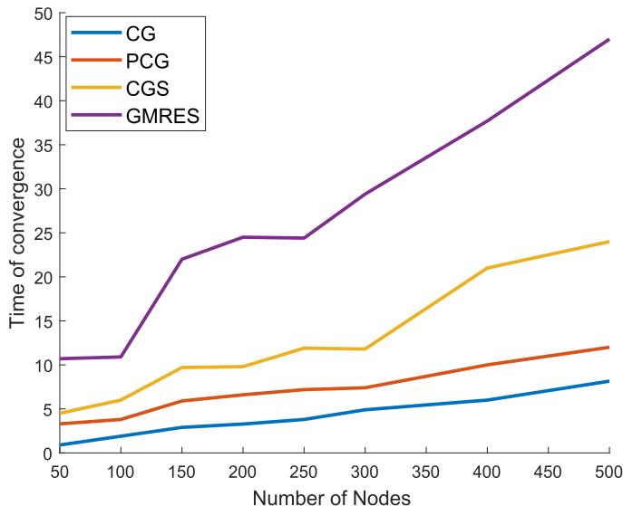  
(b)   
Fig. 2. (a) Number of iteration, and (b) Time of convergence; of the iterative solvers with respect to increasing number of nodes.

Table 2 Comparative study of different iterative solvers used in solution of EMT simulationa.   

<table><tr><td>Nodes</td><td colspan="3">CGb</td><td colspan="3">PCGc</td><td colspan="3">CGSd</td><td colspan="3">GMRESe</td></tr><tr><td></td><td>A</td><td>B</td><td>C</td><td>A</td><td>B</td><td>C</td><td>A</td><td>B</td><td>C</td><td>A</td><td>B</td><td>C</td></tr><tr><td>50</td><td>36</td><td>0.9</td><td>528</td><td>36</td><td>3.3</td><td>785</td><td>32</td><td>4.5</td><td>956</td><td>31</td><td>10.7</td><td>1545</td></tr><tr><td>100</td><td>34</td><td>1.9</td><td>1319</td><td>34</td><td>3.8</td><td>1533</td><td>38</td><td>6</td><td>1730</td><td>31</td><td>10.9</td><td>2260</td></tr><tr><td>150</td><td>56</td><td>2.9</td><td>1472</td><td>56</td><td>5.9</td><td>1813</td><td>62</td><td>9.7</td><td>2155</td><td>47</td><td>22</td><td>3415</td></tr><tr><td>200</td><td>57</td><td>3.28</td><td>1902</td><td>57</td><td>6.6</td><td>2273</td><td>58</td><td>9.8</td><td>2484</td><td>48</td><td>24.5</td><td>4050</td></tr><tr><td>250</td><td>58</td><td>3.8</td><td>2347</td><td>58</td><td>7.19</td><td>2885</td><td>65</td><td>11.9</td><td>3135</td><td>48</td><td>24.4</td><td>4430</td></tr><tr><td>300</td><td>57</td><td>4.9</td><td>2836</td><td>57</td><td>7.4</td><td>3367</td><td>59</td><td>11.8</td><td>3522</td><td>52</td><td>29.4</td><td>5369</td></tr><tr><td>400</td><td>71</td><td>6</td><td>4015</td><td>71</td><td>10</td><td>4719</td><td>92</td><td>21</td><td>5463</td><td>58</td><td>37.7</td><td>7276</td></tr><tr><td>500</td><td>78</td><td>8.15</td><td>5224</td><td>78</td><td>12</td><td>5892</td><td>87</td><td>24</td><td>6754</td><td>63</td><td>47</td><td>9287</td></tr></table>

aA= No. of iteration, B= Time of convergence (in milliseconds), C= Total time (in seconds) taken by the iterative solver for the simulation of PDN (for 1 s) bConjugate gradient cPrecondition conjugate gradient dConjugate gradient square eGeneral minimal residual

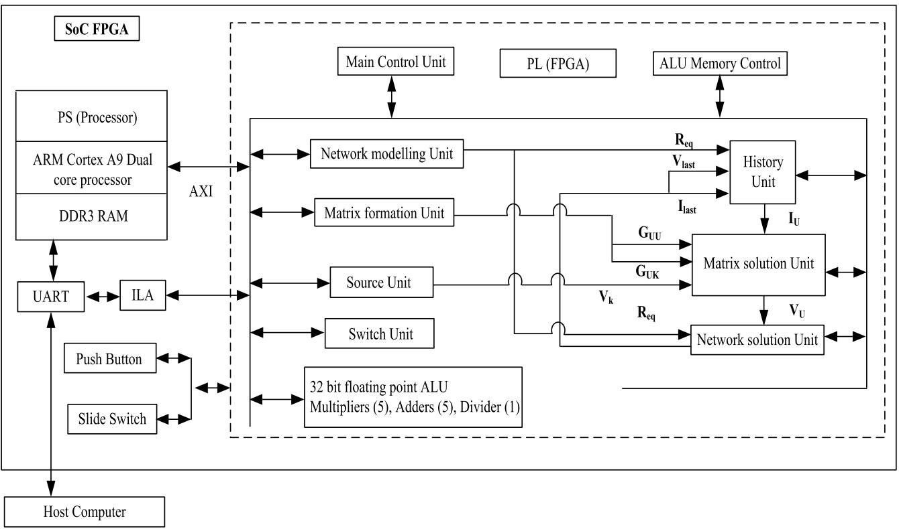  
Fig. 3. System architecture of proposed SoC FPGA based EMTP simulator.

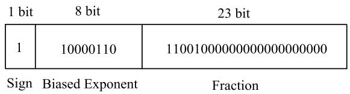  
Fig. 4. A 32-bit single precision floating point.

state machine flow are controlled by the ‘Main Control Unit’ module. The arithmetic and BRAM memory operations are controlled by the ‘ALU Memory Control Unit’ module. The ALU block of the EMTP em ploys five 32-bit floating-point multipliers and adders, and one 32-bit floating-point divider.

# 4.2. Data representation

In a binary number system domain, real numbers can be represented in fixed-point or floating-point format. The choice of data format is an important design decision as it affects the computational performance of the system. In fixed-point notation, the number of bits assigned to the integer and fractional part is ‘fixed.’ The precision of the fixed-point number is directly proportional to the number of bits allocated to the fractional part. Floating-point notation does not have fixed bit-width assigned to the fractional part, i.e., the decimal point is ‘floating.’ Due to higher accuracy and a greater dynamic range of floating-point format over fixed-point format, the former is ideal for FPGA implementations involving real number arithmetic.

In the proposed EMTP, a 32-bit floating-point format (single-precision, IEEE 754 standard) is used as it matches the precision and dynamic range requirements of the design. The binary representation of a 32-bit floating-point consists of 1 sign bit, eight exponent bits, and 23 mantissa bits, with an exponent bias of 127, as shown in Fig. 4. Mathematically a floating-point number N is given as,

$$
N = (- 1) ^ {\text {s i g n}} \times 2 ^ {(\text {e x p o n e n t - b i a s})} \times (1. \text {m a n t i s s a}) \tag {1}
$$

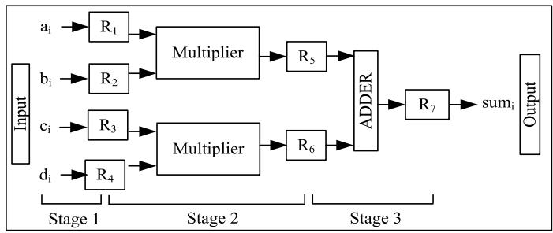  
Fig. 5. An example of arithmetic pipeline.

32-bit floating-point format can represent data in the approximate range of − $^ { - 1 0 ^ { 3 8 } }$ to 1038. Floating-point addition, subtraction, multiplication, and division units are used for arithmetic operations on floatingpoint data.

# 4.3. Pipelining

Pipelining is another crucial technique for enhancing hardware performance. Pipelining refers to the method of decomposing a sequential process into sub-operations, each of which can be executed in a dedicated stage of the pipeline, concurrently with all other steps. Each stage of a pipeline starts with a clock edge-triggered register followed by the combinational logic circuit for carrying out stage-specific operations. On each clock edge, the processed data of a stage is passed into the registers of the next step.

As an example, consider a multiply and add operation as given in (2), with its pipelined hardware implementation in Fig. 5. The pipeline consists of three stages. Stage-1 registers the inputs a , b , c and d . The multiplication is carried out in stage-2. In stage-3, the products are added together, and the final result (sumi) is stored in the output register.

$$
\operatorname {s u m} _ {i} = a _ {i} b _ {i} + c _ {i} d _ {i}; \quad i = 1, \dots \dots , n \tag {2}
$$

The latency (input to output delay) is three clock cycles, whereas throughput is one per clock cycle. However, if the whole operation is performed sequentially (as in the case of GPP or DSP), the latency will be three clock cycles, and throughput will be one per three clock cycles. As evident pipelining significantly increases the performance of the system. Inherent hardware parallelism and pipelining make FPGA ideal for computationally intensive programs. Therefore, we choose FPGA for implementing EMTP.

# 4.4. Floating point arithmetic unit

32-bit single-precision floating-point multipliers with 5-stages of the pipeline are used to carry out multiplication of floating-point numbers. The pseudo-code of the algorithm is described in Algorithm 1. A and B are the 32-bit floating-point inputs to the block, and prod is the 32-bit output depicting A × B. In stage 1, sign of output (prod sign) is calculated. A one-bit register, ‘zero’, is used to determine whether the output result is zero.

In stage 2, the intermediate exponent of the output is calculated by adding input exponents. In stage 3, the product of the mantissa of input numbers is stored in a 48-bit register. In stage 4, the higher 25 bits of this product are assigned to the intermediate output mantissa. In stage 5, the intermediate mantissa is normalized, and the output exponent is adjusted accordingly. Overflow and underflow checks are performed. If zero register bit is high, then the output result is $0 ;$ otherwise, the final result is determined by concatenating the prod sign, prod exp, and prod mantissa.

The pseudo-code of the 32-bit floating-point 5-stage pipelined adder is described in Algorithm 2. A and B are the 32-bit floating-point inputs to the block, and sum is the 32-bit output depicting A + B. In stage 1, the type of operation (operation = 0 implies addition and operation = 1 implies subtraction) is determined by comparing the sign of inputs. If the operation is high and the magnitude of the input number is equal, then the output is zero, and consequently, zero register bit is high. In stage 2, the magnitude of the input is compared, and the greater number is determined. An eight-bit register (exp diff) stores the difference of the input exponents. The sign bit of the greater number is assigned to the output sign bit (sum sign). At the end of the second stage, the greater number is stored in A. In stage 3, the exponent of a greater number (A) is assigned to the output exponent sum exp and the mantissa of other input is shifted right by exp diff bits to balance input exponents.

In stage 4, the addition or subtraction of input mantissa is carried out based on the value of the operation register. In step 5, the intermediate mantissa is normalized, and the output exponent has adjusted accordingly. Overflow and underflow checks are performed. If zero register bit is high, then the output result is zero; otherwise, the final result is determined by concatenating the sum sign, sum exp, and sum mantissa.

# 4.5. User interface

The input network model is stored in BRAM of the FPGA, and the start signal to the system is supplied through a push-button. The branch number for which the voltage and current are to be observed is given as input through slide switches. The input branch number is represented as binary numbers with the bits being modeled the state of the slide switches (ON or OFF). The output (branch voltage and branch current) is stored in BRAM of FPGA, and the waveforms are observed on the Xilinx Vivado ILA window. Using the UART serial interface, this output data can also be transferred to the host computer for further analysis on MATLAB.

# 4.6. Sources

The ideal voltage sources are modeled by sinusoidal functions of

Algorithm 1. Pipelined pseudo code of floating point multiplier:   

<table><tr><td>Input: A, B</td></tr><tr><td>Output: prod</td></tr><tr><td>Stage 1:</td></tr><tr><td>prod_sign = zero = (A ==</td></tr><tr><td>Stage 2:</td></tr><tr><td>prod_exp =</td></tr><tr><td>Stage 3:</td></tr><tr><td>temp_mantis</td></tr><tr><td>Stage 4:</td></tr><tr><td>prod_mantis</td></tr><tr><td>Stage 5:</td></tr><tr><td>check underf</td></tr><tr><td>normalize ma</td></tr><tr><td>if (zero</td></tr><tr><td>else prod</td></tr><tr><td>assign result</td></tr></table>

```txt
Input: A, B  
Output: result  
Stage 1:  
    operation = sign_A xor sign_B;  
    zero = (operation && (|A| == |B|))1 : 0;  
Stage 2:  
    if(exp_A < exp_B) A_gt_B = 1;  
    else if(exp_A > exp_B) A_gt_B = 0]  
    else  
        if(mantissa_A > mantissa_B) A_gt_B = 1;  
        else A_gt_B = 0;  
    if(A_gt_B == 1) sum_sign = sign_A;  
        exp_diff = exp_A - exp_B;  
    else swap mantissa_A and mantissa_B;  
        sum_sign = sign_B;  
        exp_diff = exp_B - exp_A;  
Stage 3:  
    sum_exp = exp_A;  
    mantissa_B = mantissa_B >> (exp_diff);  
Stage 4:  
    if(operation == 1) sum_mantissa = mantissa_A - mantissa_B;  
    else sum_mantissa = mantissa_A + mantissa_B;  
Stage 5:  
    check underflow or overflow;  
    normalize mantissa and adjust exponent;  
    if(zero == 1) sum = 0;  
    else  
        sum = {sum_sign, sum_exp, sum_mantissa};  
assign result to output 
```

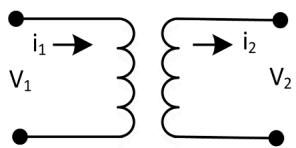

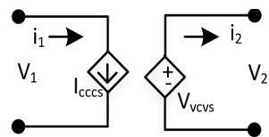

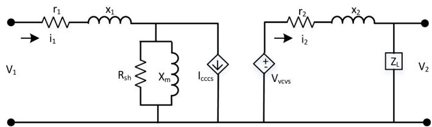  
Fig. 6. (a) Ideal transformer, and (b) Equivalent circuit.   
Fig. 7. Complete equivalent circuit of transformer.

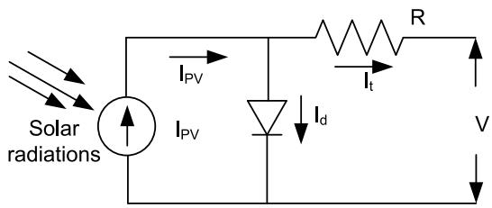  
Fig. 8. Single diode representation of PV array.

fixed frequency (50 Hz). Before the simulation, the values of a unit magnitude sine function has been calculated for each time-step, over one clock cycle and stored in the BRAM of FPGA. After network modeling, at each time step, the value of voltage sources is calculated by multiplying its source magnitude with the corresponding stored value. This is implemented by source unit. The output of the module provides the values of known node-voltages $\left( V _ { K } \right)$ .

# 4.7. PDN modelling

The PDN can be represented by the linear equivalent network for the EMT analysis [3,10]. The dynamic equations of the PDN model are discretized with the trapezoidal integration method. The branch elements are represented by the relationship which they maintain between branch current and nodal voltage.

# 4.7.1. Transformer modelling

A transformer is the key element of the PDN. Various modeling methodologies for EMT analysis of transformer is presented [23]. In the present work, a two-winding transformer is modeled with nodal analysis. As shown in the ${ \mathrm { F i g . ~ } } 6 ,$ the ideal two winding transformers can be represented as dependent current and voltage sources [24].

The loss component of the transformer can be obtained with an opencircuit and short-circuit test and the name plate rating. Considering the loss component of the transformer, equivalent circuit can be given as the Fig. 7.

# 4.7.2. Modelling of PV system for EMT analysis

The PV array can be represented with single diode model as discussed [25]. Fig. 8 represents the single diode model of PV array. From Fig. 8 it can be represented as:

$$
I _ {t} = I _ {P V} - I _ {d} \tag {3}
$$

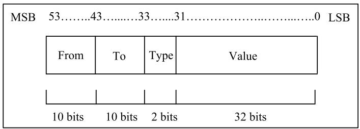  
Fig. 9. Input data format.

$$
I _ {t} = I _ {P V} - I _ {s a t} \left[ \exp \left(\frac {V _ {t} + I R _ {s}}{n V _ {T}} - 1\right) \right] \tag {4}
$$

Where $I _ { s a t }$ is the diode saturation current (A), V is the terminal voltage of a module, n is the ideal constant of diode

$$
V _ {T} = \frac {m (K T)}{q} \tag {5}
$$

K is the Boltzmann’s constant, $q = 1 . 6 \times 1 0 ^ { - 1 9 } , C = 1 . 3 8 e ^ { - 2 3 }$ , m is the number of module.

Several proposals for modelling and simulation of various power electronic devices (PEDs) are presented [13,17]. FPGA based implementation of PEDs can be advantageous as simulation time step can be as low as 100 ns. Therefore, modelling and realization of FPGA based power electronic converter with ideal switch is considered as part of the future extension of present work.

# 4.8. Discretization of passive nonlinear network elements

Each of the passive elements (R, L, and C) is stored in 54 bits format, as shown in Fig. 9. The first 10 bits (from MSB) represent the ‘From’ field, and the next 10 bits represent the ‘To’ field. These fields denote the value of the nodes between which the element is connected. The type of component is decided from the ‘Type’ field (2 bits) and coded as: ‘00’ - Resistor, ‘01’ - Inductor, and ‘10’-Capacitor. The rest 32-bits from LSB represent the value of the element in a single-precision floating-point format.

Network modeling unit calculates the equivalent resistance of the discrete-time models of passive elements, for each branch, given as (1) For resistor, $R _ { e q } = \mathrm { ~ \bf ~ R ~ } ; ~ ( 2 )$ For inductor, $R _ { e q } = \ ( 2 ^ { \ast } \mathrm { L } ) / \mathrm { D e l t a T } ;$ (3) For capacitor, $R _ { e q } = \mathrm { D e l t a T } / ( 2 ^ { * } \mathrm { C } )$ .

It can be seen that in many of the arithmetic operations involving $R _ { e q } ,$ , the reciprocal of $R _ { e q }$ is required. Thus, in order to save division operation, $\mathbf { R } _ { e q } ^ { - 1 }$ is directly calculated and stored in BRAM.

# 4.9. History current unit

This unit calculates the branch current vector $\mathbf { ( I _ { U } ) }$ using history current vector $\mathbf { ( I _ { h i s t } ) } .$ . Ihist depends on the value of branch history current $\mathbf { I _ { b r n \_ h i s t } }$ , which in turn depends on the type of elements connected with the branch and the relation is described as below,

1. If branch element is a resistor (R), then $\mathrm { { I } _ { b r n \mathrm { { \_ h i s t } } } } = 0$   
2. Else if branch element is an inductor (L), then $I _ { b r n \_ h i s t } = I _ { l a s t } +$ $V _ { l a s t } / R _ { e q }$   
3. Else if branch element is an capacitor (C), then $I _ { b r n \_ h i s t } = I _ { l a s t }$ t − $V _ { l a s t } / f R _ { e q }$

If k denotes the current iteration number then, history current $\left( I _ { h i s t } \right)$ 号 for each branch is updated as,

$1 . \ I _ { h i s t , k } \ = I _ { h i s t , k - 1 } + I _ { b r n \_ h i s t }$   
$2 . \ I _ { h i s t , k } \ = I _ { h i s t , k - 1 } - I _ { b r n _ { - } h i s t }$

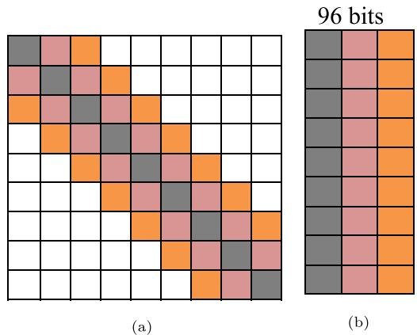  
Fig. 10. (a) Representation of matrix in conventional format (b) Memory efficient storage format for sparse matrix.

For the branches with unknown node voltages, branch current vector $\mathbf { I _ { U } }$ is formed using history current vector $( \mathbf { I _ { h i s t } } ) \mathrm { i . e . }$ , IU contains currents for that node element of $\mathbf { I _ { h i s t } }$ in which, any voltage sources are not connected.

# 4.10. Switches

In the Switch unit, switches are modeled as a resistance in the same format as the passive elements. The ‘Type’ field for switch is $\mathbf { \epsilon } _ { 1 1 } ,$ . The starting and ending time instant for which a switch is closed is stored in BRAM, where the time is measured in the multiples of the simulation time-step. In each iteration, a counter checks if the particular switch is in open or closed state and updates the state of the switches. If the switch is in the closed state, the resistance is low (∼0); otherwise, the resistance is high (∼ ∞).

# 4.11. Network matrix formation and solution

The electrical network can be represented by the following nodal equation:

$$
\mathbf {G} \times \mathbf {v} (\mathbf {t}) = \mathbf {i} (\mathbf {t}) + \mathbf {i} _ {\text {h i s t}} \tag {6}
$$

Where, G is the system admittance matrix, v is node voltage vector and i is the current source vector and $\mathbf { i } _ { \mathrm { h i s t } }$ is the history current of the branch. Matrix formation unit calculates the system admittance matrix, G, taking $R _ { e q }$ values as input.

For every branch connected between node i and node j, having $R _ { e q }$ as equivalent resistance, the value of an element of G is given as:

• If the element is connected to GND, i.e. either (i = 0) or (j = 0), then

$$
G _ {m m} = G _ {m m} - \left(\mathrm {R} _ {e q}\right) ^ {- 1}; \quad m = | i - j | \tag {7}
$$

• For other cases,

$$
\begin{array}{l} G _ {i i} = G _ {i i} + \left(\mathrm {R} _ {\text {e f f}}\right) ^ {- 1} \\ G _ {i i} = G _ {i i} + \left(\mathrm {R} _ {\text {e f f}}\right) ^ {- 1} \tag {8} \\ G _ {i j} = G _ {i j} - \left(\mathrm {R} _ {\text {e f f}}\right) ^ {- 1} \\ G _ {j i} = G _ {j i} - \left(\mathrm {R} _ {\text {e f f}}\right) ^ {- 1} \\ \end{array}
$$

It is observed in Fig. 10(a) that G is a sparse, symmetric, and pentadiagonal matrix. Using Elementary row operations, G matrix is further rearranged as $\mathbf { G } _ { \mathbf { U U } }$ and $\mathbf { G } _ { \mathbf { U K } }$ matrices, where $\mathbf { G } _ { \mathbf { U K } }$ is the admittance matrix of the branches that have a voltage source connected to one of

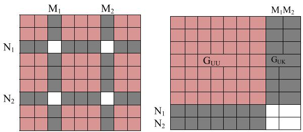  
Fig. 11. Rearrangement of system matrix.

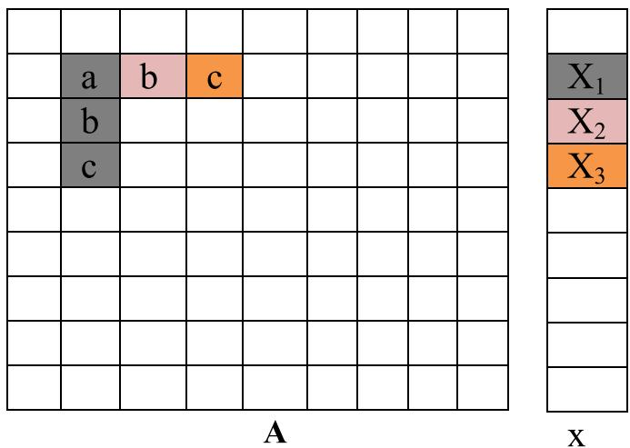  
Fig. 12. Optimization of matrix-vector multiplication operation.

their nodes. $\mathbf { G _ { U U } }$ is the admittance matrix of the branches with unknown node voltages. This rearrangement is shown in Fig. 11, GUU matrix is also symmetric and pentadiagonal. $\mathbf { G _ { U U } }$ is stored in a BRAM with the cell bit-width of 96 bits, as shown in Fig. 10(b). Each cell stores the upper three diagonal elements of $\mathbf { G _ { U U } }$ , having a size of 32-bits each.

$\mathbf { \Delta ^ { 6 } V _ { k } } ^ { \prime }$ is the known node voltage connected directly to the voltage sources. For other nodes, the nodal equation is represented as $\mathbf { G } _ { \mathbf { U U } } \ast \mathbf { V } _ { \mathbf { U } } =$ $\mathbf { I } _ { \mathbf { U } } ,$ , CG algorithm is used to find an efficient solution of this linear system of equations. Jacobi preconditioning is employed to improve the convergence rate of the algorithm. The pre-conditioner matrix, J, is a diagonal matrix computed as:

$$
\mathbf {J} _ {\mathrm {i i}} = \left\{\begin{array}{l}\frac {1}{\left(\mathbf {G} _ {\mathbf {U U}}\right) _ {i i}}; i = 1 \rightarrow d i m \left(\mathbf {G} _ {\mathbf {U U}}\right)\\0; \quad e l s e w h e r e\end{array}\right. \tag {9}
$$

The pseudo code of the CG algorithm used in matrix solution is given in [26]. Here, $\mathbf { A { \to } G _ { U U } , B { \to } I _ { U } , x { \to } V _ { U } }$ and J is pre-conditioner matrix

The format used to store GUU (Fig. 10(b)) helps to optimize the operation of matrix-vector multiplication by reducing the number of operations involved. An instance of this operation is shown in Fig. 12. Consider the multiplication of the second row of A with x, the output will be $\begin{array} { r } { \mathfrak { \iota } _ { \ldots } + a * x _ { 1 } + b * x _ { 2 } + c * x _ { 3 } + \ldots ^ { , } . } \end{array}$ . Similarly, the outputs of the multiplication of x with third and fourth row of A $\mathrm { a r e \ ^ { \ast } } . . . + b \ast x _ { 1 } + . . . ^ { , }$ and $\mathbf { \Phi } _ { \cdot \cdot . . + \textit { c } * x _ { 1 } + \textit { \dots } } ^ { * }$ respectively. Matrix A is stored in BRAM, thus, there is latency in accessing the elements of A through read operation. If conventional format is used to store $\mathbf { G _ { U U } }$ , then we require N read operations per row, where N is the dimension of $\mathbf { G _ { U U } }$ matrix. However, if we apply read operation on the first row of matrix format given in Fig. 10(b), then from these 96 bits, we can get a, b and c elements of the matrix. Thus, only in one read operations we can calculate a ∗ $\mathbf { \sigma } : x _ { 1 } , b * x _ { 2 }$ $c * x _ { 3 } , b * x _ { 1 }$ and $c * x _ { 1 }$ , where $b * x _ { 1 }$ and $c * x _ { 1 }$ are stored in register for later operations. Consequently, the total number of read operation is reduced from $N ^ { 2 }$ to N for the entire operation.

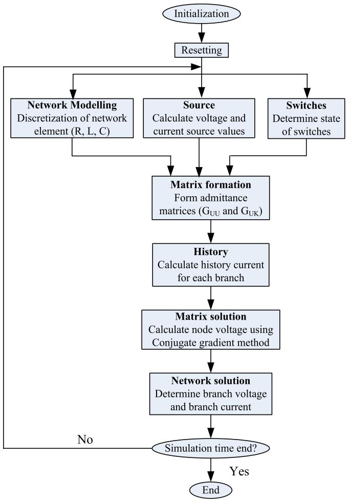  
Fig. 13. Control and data flow diagram.

The elements of $\mathbf { V _ { k } }$ matrix represent the voltages of the nodes directly connected to the voltage sources. Node voltages, $\mathbf { V _ { U } }$ (with respect to ground) are already known after network matrix solution. The branch voltage $\bf ( V _ { \mathrm { l a s t } } )$ is calculated by taking the difference of node voltages. Once the branch voltages have been calculated, the branch currents $\mathbf { ( I _ { l a s t } ) }$ are calculated by merely dividing branch voltage $\bf ( V _ { l a s t } )$ by the equivalent resistance $( R _ { e q } )$ of the branch. The complete data flow and control diagram is presented in Fig. 13

# 5. Implementation and operation

The proposed EMT simulation framework is implemented on Digilent ZedBoard Zynq-7000 ARM/FPGA SoC Development Board. The dual-core ARM processor of the PS runs open-source Embedded Linux operating system, which is primarily responsible for communicating with the host computer through the UART interface. The processor receives the input data (network model) in the form of an excel data sheet (.xlsx). A python script (running on Linux) converts the network model (. xlsx) into the Xilinx coefficient file (.coe) that is stored in the BRAM of FPGA as input data. The values of network elements are converted into 32-bit floating number. A python script (running on Linux) reads the network model (.xlsx), converts the network data into a suitable input format (Fig. 9) and stores this data into the BRAM of FPGA.

The network is modeled as collections of interconnected voltage sources, resistors, inductors, capacitors, and switches. The network data is initially stored in an excel (.xlsx) or csv (.csv) file in the form of the netlist. To reduce the network model size, the elements between insignificant nodes are combined. MATLAB can be used for preimplementation analysis, simulation, and verification purposes. A

Table 3 FPGA resources utilized by EMTP unit.   

<table><tr><td>Name</td><td>Logic Cells</td><td>Block RAM</td><td>DSP Blocks</td></tr><tr><td>Main control unit</td><td>55</td><td>0</td><td>0</td></tr><tr><td>ALU memory control unit</td><td>934</td><td>0</td><td>0</td></tr><tr><td>Network modelling and switch</td><td>79</td><td>1.5</td><td>0</td></tr><tr><td>Source unit</td><td>185</td><td>2</td><td>0</td></tr><tr><td>Matrix formation unit</td><td>4142</td><td>3</td><td>0</td></tr><tr><td>History unit</td><td>547</td><td>2</td><td>0</td></tr><tr><td>Matrix solution unit</td><td>20263</td><td>1</td><td>0</td></tr><tr><td>Network solution unit</td><td>230</td><td>1</td><td>0</td></tr><tr><td>Floating point multipliers (5)</td><td>452</td><td>0</td><td>20</td></tr><tr><td>Floating point adders (5)</td><td>2768</td><td>0</td><td>0</td></tr><tr><td>Floating point divider</td><td>777</td><td>0</td><td>0</td></tr><tr><td>ILA</td><td>2478</td><td>31</td><td>0</td></tr><tr><td>Others</td><td>388</td><td>2</td><td>0</td></tr><tr><td>Total</td><td>32910</td><td>41.5</td><td>20</td></tr><tr><td>Available resource</td><td>55000</td><td>72</td><td>120</td></tr><tr><td>% Resource utilization</td><td>59.83</td><td>57.63</td><td>16.66</td></tr></table>

python script converts the network model (.xlsx or .csv) into the Xilinx coefficient (.coe) file that is stored in the BRAM of FPGA as input network data .

The values of network elements are converted into a 32-bit floating number. The time-step for EMTP simulation is a user-configurable variable. It is to be mentioned that the timestep used in the FPGA based analysis of power distribution network is $2 ^ { - 1 6 } s$ , which can be expressed equivalently as 15.25μs. As we know, certain computing systems can be optimized significantly in terms of area and/or performance, if the numerical values are in the form $2 ^ { \mathbb { Z } }$ , where Z is an integer. The timestep proposed in the literature is 50μs [27], and $l o g _ { 2 } [ 5 0 \times 1 0 ^ { - 6 } ]$ is approximately equal to − 14.29. Since, Z is an integer, we may choose an upper bound for $\mathbb { Z } , \mathbf { i . e . } \mathbb { Z } < = - 1 5$ . This bound permits us to employ both $2 ^ { - 1 5 }$ $\textbf { s } ( = 3 0 . 5 \mu s )$ as well as $2 ^ { - 1 6 } s ( = 1 5 . 2 5 \mu s )$ for analyzing the design on an FPGA. Since the accuracy of the numerical analysis depends on the timestep chosen, a lower timestep would yield better analytical outcome. Therefore, 15.25μs, i.e. $2 ^ { - 1 6 }$ s is selected as the stepsize in the proposed emulation framework.

This network modeling technique is highly scalable as the process of converting input (.xlsx) to the final model (.coe) is automated using python programming. The circuit equations have been formulated after the discretization of differential equations with the trapezoidal numerical integration method. The discretized nodal equation is given in (6). This equation is solved by the CG method. One of the advantages of the CG method is that the step parallelization is possible with this method; also, a Pre-conditioner provides faster convergence. However, due to the round-off error, residual is not ideally zero, $\mathrm { i . e . , }$ the exact solution cannot be achieved with the CG method. Since 32- bit precision has been used to round-off error is very small, and it can be ignored.

Once the network model has been stored in BRAM as input data, the code is compiled, followed by synthesis, implementation, and bitstream generation in Xilinx Vivado. The bitstream is downloaded to the FPGA to program the device. Thus the FPGA is now in a ready state to start EMT emulation. Table 3 presents the details of the resource utilization of the FPGA board by the EMTP emulator. It is observed that the ‘Matrix Solution Unit’ utilizes the highest number of logic cells, as it involves a large number of matrix-vector computations and arithmetic operations (for conjugate gradient algorithm). For each time step in the simulation time, the ‘ILA’ block stores the output (branch voltage and branch current) for each branch in the BRAM memory. Consequently, the BRAM utilization of the ILA block is considerably high. In floating-point multipliers, mantissa multiplication is resource intensive operation. Thus, internal multipliers of DSP blocks are used in mantissa multiplication as they efficiently implement multiplication operation.

The start trigger is given by the push button. After the program has finished computation, the resulting waveform of the output data (branch voltages and branch currents) can be easily analyzed with the help of the

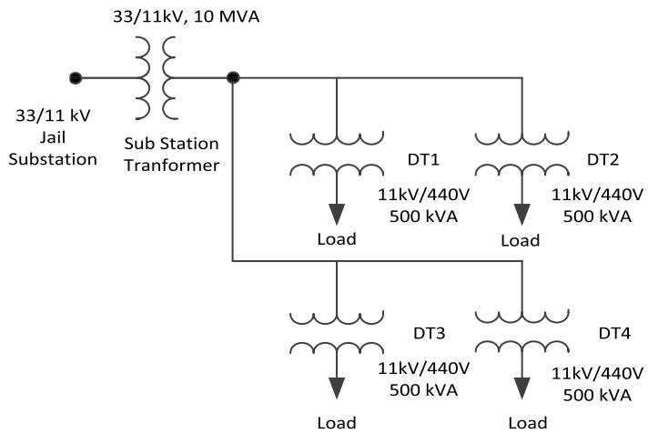  
Fig. 14. Single line diagram of PDN of Guwahati city, India [3].

Xilinx ILA. Slide switches are used to give the input branch number for which the output is to be observed.

# 6. Result and discussion

A case study on the implementation of the EMT simulation framework to study the instantaneous behavior of a PDN is presented in this section. The test system considered in this paper is a part of a real power

distribution network of Jail substation at Guwahati, Assam, India. As shown in Fig. 14, the substation has one 33 kV feeder with 10 MVA, 33/ 11 kV transformers. There are four secondary feeders of 11 kV with a transformer rating of 500 kVA, 11 kV/440 V. The total numbers of 440 V nodes are four, starting from DT-1 to DT-4. Components of the distribution network, such as transformer, feeders and loads, etc. have been modeled to the equivalent lumped electrical network. Its load data on hourly basis was obtained from Assam state electricity board (ASEB). Initially, the substation is modeled using MATLAB and Simulink, and is validated with realistic values provided by ASEB, Guwahati. Since the transient simulation is performed for a very small time duration (i.e. 1-5 s), a constant load model is considered in our proposed analysis. It is to mention that Jail substation is used to feed primarily commercial as well as residential loads, and in this area the penetration of renewable energy sources is almost negligible. Therefore, at the time of problem formu lation, integration of renewable energy sources was not considered. However, present work can be extended in future to include integrated renewable energy sources as well.

Fig. 15 presents the load current drawn by the main feeder of the jail substation of Guwahati city. The simulation results of FPGA based simulator is compared with MATLAB based EMTP-type solver and PSCAD. The computational performance of MATLAB based EMTP-type solver and FPGA-based solver can be performed considering the maximum synthesizable frequency of the FPGA board. The SoC FPGA considered for the present work has 45 MHz of maximum frequency (i.e. time period per clock is 22.22 ns). The system frequency of PDN is 50 Hz and the time step for FPGA based simulator is considered to be 15.25 μs.

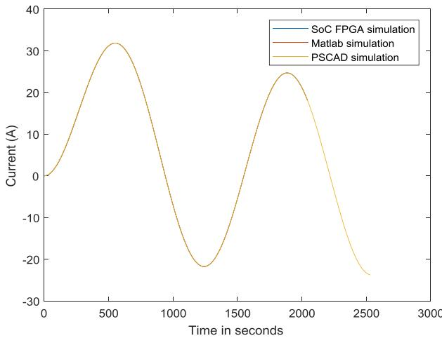

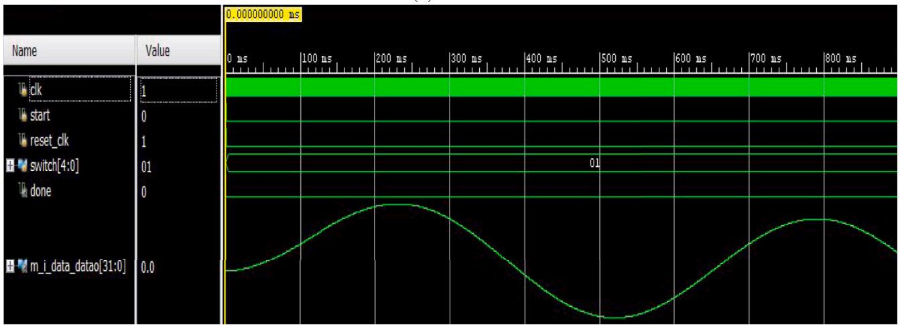  
  
(b)   
Fig. 15. Load current of main feeder (a) Comparison of FPGA, MATLAB and PSCAD simulations. (b) Screen-shot of FPGA simulation.

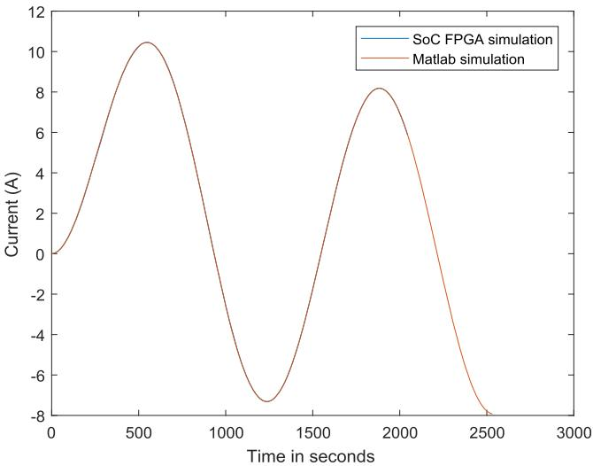  
（a)

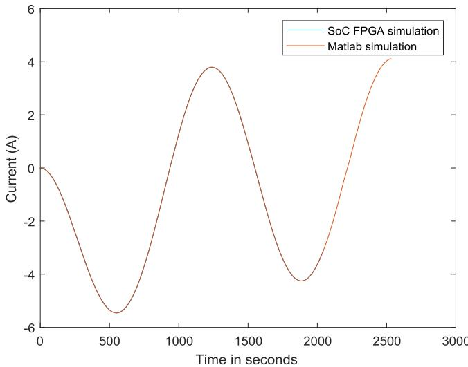

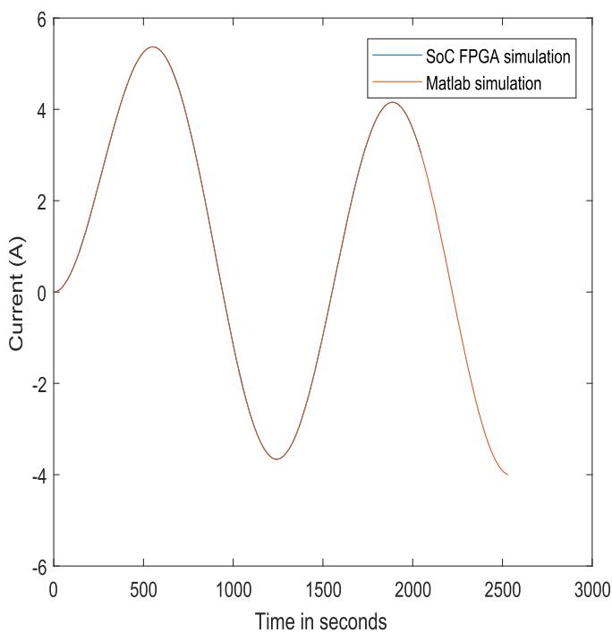  
（c）

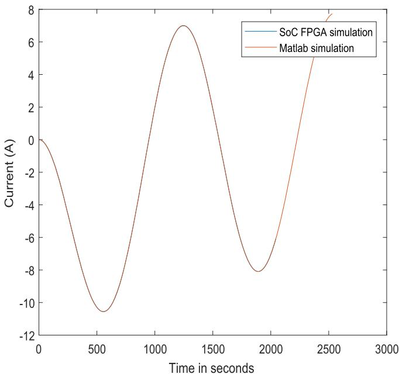  
(d)   
Fig. 16. Comparison of FPGA and MATLAB for Load current of (a) AT road. (b) Fancy road. (c) Lakhtokia. (d) MS road.

Therefore, the EMTP-type solver requires 1308 iterations to performs the simulation of one cycle. For each iteration, the FPGA based solver requires 26236 clocks. Therefore, FPGA based simulators requires 582.96 μs per iteration, whereas; MATLAB based EMTP-type solver on a computer having 3.4 GHz Intel Corei7 processor with 16GB RAM, takes 7.36 ms per iteration. Therefore, the FPGA-based EMT simulator provides approx. 12.5 times speed-up over MATLAB based EMTP-type simulator.

Currents drawn by the MS road, Fancy road, AT road and Lakhtokia subfeeders are shown in Fig. 16. An open circuit fault has been introduced in MS road subfeeder. The switch is opened at 300 × 15.25μs. Fig. 17 shows the fault current at MS road and its impact on neighboring subfeeder (Fancy road subfeeder). The results obtained by FPGA based solver and MATLAB based solver are in close agreement.

It is to be noted that the aim of the proposed work is the efficient

implementation of EMTP-type simulation framework on an FPGA and its application in the analysis of PDN. In order to utilize it in the analysis of complex and larger power distribution networks in future, it is imperative to validate the correctness of FPGA based EMTP-type emulation engine. This was concluded by first developing a MATLAB and Simulink based solution framework and later testing its correctness by comparing it with the realistic data. After accomplishing the above mentioned task, the proposed method was implemented on FPGA having memory elements, such as inductor and capacitor, modeled as accurately as possible along with the optimal realization of compute intensive modules, such as matrix solver and other matrix operations etc. Later, this FPGA based implementation was tested with a testcase of Jail substation to validate its efficiency on the hardware platform. In order to achieve this goal, the output produced by this implementation was successfully verified with the outcome of MATLAB and Simulink based implementation and

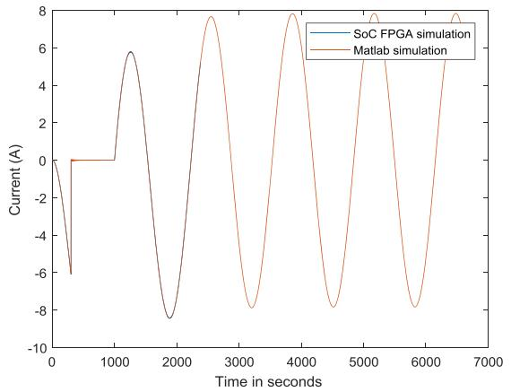  
(a)

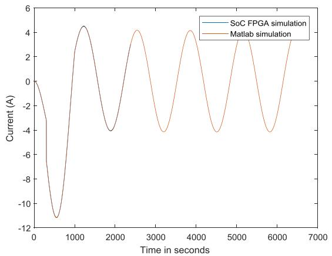  
(b)

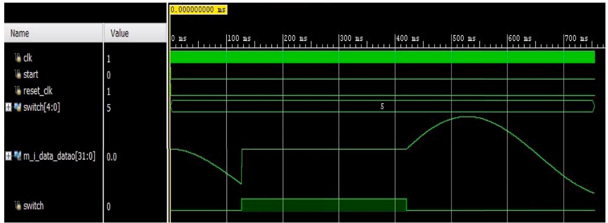  
(c）  
Fig. 17. Current for MS road and Fancy road during fault condition (a) Comparison of FPGA and MATLAB simulation for MS road. (b) Comparison of FPGA and MATLAB simulation for Fancy road. (c) Screen-shot of FPGA simulation for MS road.

realistic data provided by ASEB. This implementation was also tested with various faults for correctness. This can also be observed in Figures 15, 16 and 17 in the revised manuscript. In future, our endeavour is to extend this work for the efficient analysis of large and complex PDNs.

# 7. Conclusion

In this paper, FPGA basedEMT simulation framework for PDN is presented. Detailed discussion on modeling, problem formulation, and network solver are described. CG based solver is employed to solve the network equation GV = I, where the conductance matrix (G) is highly sparse. A detailed discussion of the architecture of this solver is also illustrated. The efficient design implementation of the EMT analysis engine on FPGA enables us to achieve approximately 12.5 times speed up as compared to MATLAB based implementation while exhibiting acceptable accuracy. It is also validated by analyzing the Jail substation of Guwahati city, India.

# CRediT authorship contribution statement

Swati Shukla: Conceptualization, Project administration, Funding acquisition, Writing – original draft, Writing – review & editing, Visualization. Abhishek Agrawal: Formal analysis. Balbir Singh: Formal analysis. Gaurav Trivedi: Validation.

# Declaration of Competing Interest

The authors declare that they have no known competing financial interests or personal relationships that could have appeared to influence the work reported in this paper.

# Acknowledgements

All persons who have made substantial contributions to the work reported in the manuscript (e.g., technical help, writing and editing assistance, general support), but who do not meet the criteria for authorship, are named in the Acknowledgements and have given us their written permission to be named. If we have not included an Acknowledgements, then that indicates that we have not received substantial contributions from non-authors.

# References

[1] R.C. Green, L. Wang, M. Alam, Applications and trends of high performance computing for electric power systems: focusing on smart grid, IEEE Trans. Smart Grid 4 (2) (2013) 922–931, https://doi.org/10.1109/TSG.2012.2225646.   
[2] W.H. Kersting, Distribution System Modelling and Analysis, CRC Press, 2002.   
[3] S. Shukla, A. Prince, G. Trivedi, Power distribution network model of Jail substation of Guwahati city for EMT analysis. 2016 International Conference on Next Generation Intelligent Systems (ICNGIS), 2016, pp. 1–6, https://doi.org/ 10.1109/ICNGIS.2016.7854078.

[4] J. Mahseredjian, V. Dinavahi, J.A. Martinez, An overview of simulation tools for electromagnetic transients in power systems. 2007 IEEE Power Engineering Society General Meeting, 2007, pp. 1–6, https://doi.org/10.1109/PES.2007.385779.   
[5] J. Mahseredjian, Computation of power system transients: overview and challenges. 2007 IEEE Power Engineering Society General Meeting, 2007, pp. 1–7, https://doi.org/10.1109/PES.2007.386054.   
[6] J. Mahseredjian, V. Dinavahi, J.A. Martinez, Simulation tools for electromagnetic transients in power systems: overview and challenges, IEEE Trans. Power Deliv. 24 (3) (2009) 1657–1669, https://doi.org/10.1109/TPWRD.2008.2008480.   
[7] S. Saha, M. Aldeen, Dynamic modeling of power systems experiencing faults in transmission/distribution networks, IEEE Trans. Power Syst. 30 (5) (2015) 2349–2363, https://doi.org/10.1109/TPWRS.2014.2365809.   
[8] J.R. Marti, Accurate modelling of frequency-dependent transmission lines in electromagnetic transient simulations, IEEE Trans. Power Apparatus Syst. PAS-101 (1) (1982) 147–157, https://doi.org/10.1109/TPAS.1982.317332.   
[9] A. Abur, O. Ozgun, F.H. Magnago, Accurate modeling and simulation of transmission line transients using frequency dependent modal transformations. 2001 IEEE Power Engineering Society Winter Meeting. Conference Proceedings (Cat. No.01CH37194) vol. 3, 2001, pp. 1443–1448, https://doi.org/10.1109/ PESW.2001.917314.   
[10] Y. Chen, V. Dinavahi, FPGA-based real-time EMTP, IEEE Trans. Power Deliv. 24 (2) (2009) 892–902, https://doi.org/10.1109/TPWRD.2008.923392.   
[11] Q. Huang, X. Chen, B. Wang, R. Cai, K. Qin, The concept of computing on chip (CoC) for electric power system application. International Symposium on Parallel Computing in Electrical Engineering (PARELEC’06), 2006, pp. 433–437, https:// doi.org/10.1109/PARELEC.2006.79.   
[12] Z. Zhou, V. Dinavahi, Parallel massive-thread electromagnetic transient simulation on GPU. 2015 IEEE Power Energy Society General Meeting, 2015, https://doi.org/ 10.1109/PESGM.2015.7285591.1–1   
[13] M. Matar, R. Iravani, FPGA implementation of the power electronic converter model for real-time simulation of electromagnetic transients, IEEE Trans. Power Deliv. 25 (2) (2010) 852–860.   
[14] Y. Chen, V. Dinavahi, An iterative real-time nonlinear electromagnetic transient solver on FPGA, IEEE Trans. Ind. Electron. 58 (6) (2011) 2547–2555.   
[15] Y. Chen, V. Dinavahi, Multi-FPGA digital hardware design for detailed large-scale real-time electromagnetic transient simulation of power systems, IET Gener. Transm. Distrib. 7 (5) (2012) 451–463.

[16] Y. Chen, V. Dinavahi, Hardware emulation building blocks for real-time simulation of large-scale power grids, IEEE Trans. Ind. Inf. 10 (1) (2014) 373–381.   
[17] W. Li, J. B´elanger, An equivalent circuit method for modelling and simulation of modular multilevel converters in real-time HIL test bench, IEEE Trans. Power Deliv. 31 (5) (2016) 2401–2409.   
[18] I. Herrera-Leandro, P. Moreno-Villalobos, S. Ortega-Cisneros, J. Rivera, F. Sandoval-Ibarra, Implementation of SoC based real-time electromagnetic transient simulator, Math. Probl. Eng. 2017 (2017).   
[19] E. Mylonas, N. Tzanis, M. Birbas, A. Birbas, An automatic design framework for real-time power system simulators supporting smart grid applications, Electronics 9 (2) (2020) 299.   
[20] N.C. Nguyen, P. Fernandez, R.M. Freund, J. Peraire, Accelerated residual methods for the iterative solution of systems of equations, SIAM J. Sci. Comput. 40 (5) (2018) A3157–A3179, https://doi.org/10.1137/17M1141369.   
[21] C. Wu, K. Weng, The development and implementation of a real-time depth image capturing system using SoC FPGA. 2016 30th International Conference on Advanced Information Networking and Applications Workshops (WAINA), 2016, pp. 934–938, https://doi.org/10.1109/WAINA.2016.167.   
[22] A. Basermann, U. Jaekel, M. Nordhausen, K. Hachiya, Parallel iterative solvers for sparse linear systems in circuit simulation, Future Gener. Comput. Syst. 21 (8) (2005) 1275–1284.   
[23] S.-D. Cho, Three-phase transformer model and parameter estimation for ATP, J. Electr. Eng. Technol. 1 (3) (2006) 302–307.   
[24] M.A. Cinar, A.B. Yildiz, Time-domain analysis of transformer by using modified nodal equations. 2006 IEEE PES Power Systems Conference and Exposition, IEEE, 2006, pp. 1059–1062.   
[25] S. Shukla, P. Tiwari, P. Jan, Z. Nĕmec, G. Trivedi, Object oriented EMT simulation framework for on-grid centralized microgrid. 2019 29th International Conference Radioelektronika (RADIOELEKTRONIKA), IEEE, 2019, pp. 1–6.   
[26] P. Concus, G.H. Golub, D.P. O’Leary, A generalized conjugate gradient method for the numerical solution of elliptic partial differential equations, in: J.R. BUNCH, D. J. ROSE (Eds.), Sparse Matrix Computations, Academic Press, 1976, pp. 309–332, https://doi.org/10.1016/B978-0-12-141050-6.50023-4.https://www.sciencedi rect.com/science/article/pii/B9780121410506500234   
[27] Transient Analysis of Power Systems: Solution Techniques, Tools and Applications, in: J.A. Martinez-Velasco (Ed.), John Wiley & Sons, 2014.