# Modeling of cross-magnetization effects in saturated synchronous machines for electro-magnetic transient programs

A.B. Dehkordi a,* , A.M. Gole b , T.L. Maguire

a A. B. Dehkordi is with RTDS Technologies Inc., Winnipeg, Canada   
b Ani Gole is with the University of Manitoba, Winnipeg, Canada   
c T L. Maguire is retired from RTDS Technologies Inc. as a co-founder, Canada

# A R T I C L E I N F O

# Keywords:

Synchronous machine

Generator

Saturation

Cross-magnetizing effects

Electro-magnetic transient programs

Real-time digital simulation

# A B S T R A C T

The saturation of magnetizing paths in synchronous machines significantly impacts machine performance, including loading capability. In electromagnetic transient (EMT) programs, magnetic saturation is traditionally modeled by adjusting the d-axis or q-axis magnetizing inductances (or flux linkages) [1-4]. A similar approach is applied in phasor-domain programs [5]. While these methods account for d- and q-axis saturation simultaneously, they overlook the rotor’s inherent structure and the angular displacement of the MMF wave in the airgap.

This paper presents the development and validation of an EMT synchronous machine model that incorporates cross-magnetizing effects into the saturation algorithm. The proposed method evaluates saturation based on the magnitude and angle of the MMF. Additionally, the paper examines the impact of various simplifications on the loading capability of synchronous generators.

# 1. Introduction

Magnetic saturation in synchronous machines impacts both steadystate loading and transient performance. Although the presence of an air gap in electric machines reduces the severity of saturation compared to power transformers, accurately modeling saturation effects in the magnetizing path is essential for simulating networks containing electric machines. The most direct consequence of saturation is the alteration of magnetizing reactances, which affects a machine’s capability to handle various loading conditions. Additionally, saturation can influence the rotor angle stability limit of synchronous generators.

The scope of this paper focuses on modeling saturation in synchronous machines used as generators in power system networks. For such studies, an idealized machine model is sufficient. This model assumes sinusoidal magnetomotive force (MMF) distributions from the windings and sinusoidally distributed permeance, effectively ignoring space harmonics.

This assumption enables the use of the two-reaction theory [6] and [7] and the widely adopted D- and q-axis equivalent circuit for synchronous machines in power system studies. One key advantage of the dq equivalent circuit is its simplicity, making it accessible to a broader

group of power engineers. Moreover, the model effectively predicts essential behaviors of synchronous generators concerning the network, including time constants, loading capability, short-circuit currents, and more.

In the two-reaction theory, also known as the dq0 theory, the effects of iron saturation in synchronous machines are modeled by adjusting the D- and q-axis magnetizing inductances $L _ { m d }$ and $L _ { m q }$ (or reactances) in the machine’s equivalent circuit. This adjustment is typically based on the magnitudes of the magnetizing currents $i _ { m d }$ and $i _ { m q } ,$ or the corresponding flux linkages.

The following assumptions are generally made when representing magnetic saturation in synchronous machines using the two-reaction theory [6] and [7]:

• Leakage inductances are independent of saturation. Since leakage fluxes flow predominantly through air, their path is minimally influenced by the saturation of the iron portion. Consequently, only the magnetizing inductances in the equivalent circuit are affected by saturation.   
• Saturation does not deform the sinusoidal distribution of the magnetic field. It is assumed that the magnetic field over the face of

a pole retains its sinusoidal distribution, ensuring that all inductances maintain their sinusoidal dependence on rotor position.

Given the above assumptions, the effect of saturation can be represented by (1). In this equation, Lmdu and Lmqu are the unsaturated values of Lmd and Lmq respectively. Ksd and Ksq are called the saturation factors and identify the level of saturation in the D- and q- axes respectively. These factors are functions of D- and/or q- axis magnetizing fluxes (or currents) referred to as saturation indices. In unsaturated conditions these factors are equal to 1.0.

$$
\begin{array}{l} L _ {m d} = K _ {s d} \cdot L _ {m d u} \\ L _ {m q} = K _ {s q} \cdot L _ {m q u} \end{array} \tag {1}
$$

Minor differences between various approaches to modeling saturation in the dq0 theory arise from how the dependency of these saturation factors on magnetizing fluxes (or currents) is represented:

One method [1] and [8] assumes that both the D- and q-axes magnetizing inductances $L _ { m d }$ and $L _ { m q }$ vary with saturation. Additionally, $K _ { s d }$ and $K _ { s q }$ are both functions of total air-gap flux linkage which is defined in (2). These functions are identified by the saturation characteristics of D- and q- axes [1] and [8–12].

$$
\Psi_ {a t} = \sqrt {\Psi_ {m d} ^ {2} + \Psi_ {m q} ^ {2}}
$$

where : (2)

$$
\Psi_ {m d} = L _ {m d} \cdot i _ {m d}, \Psi_ {m q} = L _ {m q} \cdot i _ {m q}
$$

Transient stability programs like PSSE [5] and electromagnetic transient programs like EMTP [1] use this approach to implement the effects of saturation in the synchronous machine models. While this method considers separate saturation curves for the D- and q-axes, it employs a single saturation index $\left( \Psi \omega \right)$ for both axes. This assumption overlooks the angular displacement between the MMF fundamental component and the fundamental component of the flux density wave, making it more suitable for fully round rotors, such as those in induction machines. In [10] and [11] a single-saturation factor approach is used to model magnetic saturation in salient pole synchronous machines. In this approach, the q-axis is re-scaled by the so-called saliency factor $( L _ { m q } / L _ { m d } )$ .

Other methods assume that saturation occurs in both the D- and qaxes, with $K _ { s d }$ being a function of $\Psi m d$ and $K _ { s q }$ being a function of $\Psi m q \cdot$ The relation between $K _ { s d }$ and $\Psi m d$ is identified from the D-axis saturation characteristics, and the relation between $K _ { s q }$ and $\Psi _ { m q }$ is defined based on the saturation characteristics of the q-axis. Existing models in the current commercial release of programs like EMTDC [2] and RTDS [4] use this approach of realizing saturation in synchronous machines. These programs, in addition to the above assumptions, introduce approximation by ignoring the effects of q-axis saturation (i.e. $K _ { s q } = 1 )$ . This assumption stems from the relatively large air-gap on the q-axis, which is not accurate, especially for non-salient pole synchronous machines.

This paper begins by explaining the phenomenon of crossmagnetization in saturated synchronous machines. It then outlines the procedure for implementing cross-magnetizing saturation effects in transient synchronous machine models. Since the aim is to incorporate the model into an electromagnetic transient program [13], the coupled electric circuit approach is used for modeling of this type of machine. The simulation results of a real-time EMT synchronous machine model are validated using experimental results. The paper also shows the sensitivity of simulation results to various saturation routines.

# 2. The cross-magnetization phenomenon in saturated synchronous machines

This section describes the mechanism in which the loading conditions affect the saturation in various parts of magnetizing path and consequently causes the so-called cross-magnetization phenomenon.

# 2.1. Macroscopic and microscopic view of synchronous machine open circuit characteristics

Open circuit characteristics are typically the primary data set available for modeling saturation in simulation studies. These characteristics are obtained by operating the synchronous machine at open circuit, running it at the rated rotor speed, and gradually increasing the field winding current. The terminal voltage is measured and recorded (usually in per-unit) as a function of the field current. This open circuit saturation characteristic is also referred to as the D-axis magnetization characteristic. To replicate this behavior in a numerical model of a synchronous machine, it is sufficient to vary the D-axis magnetizing inductance as a function of the D-axis magnetizing current or flux linkage.

Now, let us examine this phenomenon from a more microscopic perspective. Fig. 1 illustrates the simplified rotor structure for salientpole and cylindrical rotor synchronous machines. In both configurations, the average length of the air gap is shorter in the pole face area compared to the interpole region, resulting in greater permeance in the pole face area. This is depicted in Fig. 2a with the dotted line, representing the unsaturated permeance function (P) of a two-pole synchronous machine with a pole-arc expansion of βπ. The permeances in the pole-face and interpole regions are denoted as $\mathrm { P } _ { d } = \mathrm { P } _ { p o l e f a c e }$ and $\mathbf { P } _ { q } =$ $\mathrm { P _ { i n t e r r p o l e } } = \alpha { \cdot } \mathrm { P } _ { d } ,$ respectively. We will refer to α as the Permeance Saliency Factor. The unsaturated permeance function is expressed in (3).

As mentioned earlier, throughout this paper, we assume that the total magneto-motive force in the air-gap has a sinusoidal distribution, i.e. the effects of winding space harmonics are ignored. This behaviour is represented by the following equation. Here, $I _ { m a g } 0 \bf { r } \it { A } T$ is the magnitude of the MMF and ξ is its angle. Magnitude and angle of the total MMF is a function of loading conditions. This MMF wave interacts with the permeance distribution, altering its shape by saturating the iron in the magnetizing path. The change in the permeance function at each angular position depends on two factors:

• The magnitude of the MMF at that angular position.   
• The unsaturated value of the permeance at that position.

$$
\mathrm {P} \left(\phi_ {r}\right) = \left| \begin{array}{l l} \mathrm {P} _ {d} = \mathrm {P} _ {\text {p o l e f a c e}} & - \beta \frac {\pi}{2} \leq \phi_ {r} \leq \beta \frac {\pi}{2} \quad \text {p o l e f a c e a r e a} \\ \mathrm {P} _ {q} = \mathrm {P} _ {\text {i n t e r p o l e}} = \alpha \cdot \mathrm {P} _ {d} & \phi_ {r} \leq - \beta \frac {\pi}{2} \\ & \beta \frac {\pi}{2} \leq \phi_ {r} \end{array} \right. \tag {3}
$$

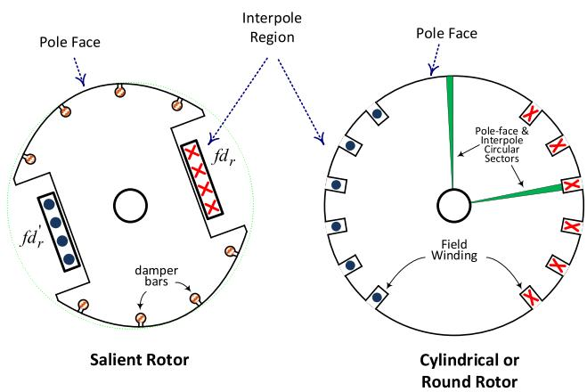  
Fig. 1. Simplified representation of the salient and cylindrical rotors.

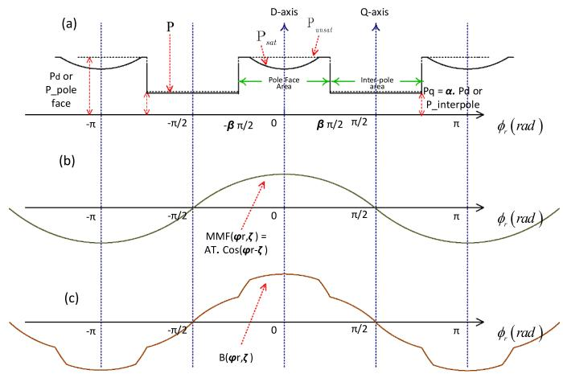  
Fig. 2. The effect of MMF distribution on saturation of permeance in open circuit conditions.

$$
\begin{array}{l} F \left(\phi_ {r}, \xi\right) = I _ {\text {m a g}} \cdot \cos \left(\phi_ {r} - \xi\right) \\ I _ {m a g} = A T = \sqrt {i _ {m d} ^ {2} + i _ {m q} ^ {2}}, \quad \xi = \tan^ {- 1} \left(i _ {m q} / i _ {m d}\right) \tag {4} \\ i _ {m d} = \sum_ {n = 1, 2..} i _ {d _ {n}}, \quad i _ {m q} = \sum_ {n = 1, 2..} i _ {q _ {n}} \\ \end{array}
$$

Consider a circular sector with an angular width $d \varphi _ { r }$ located at an angular position $\varphi _ { r } .$ If this sector is in the pole-face region, it contains a larger proportion of iron and a smaller air-gap, whereas in the interpole region, the air-gap length is greater. These circular sectors for the poleface and interpole regions are shown in Fig. 1. Circular sectors in the pole-face region are more susceptible to saturation under the same MMF compared to those in the interpole region. In salient pole synchronous machines, the air-gap in the interpole region is sufficiently large so that the circular sections in this area can generally be assumed to remain unsaturated.

The saturated value of the permeance is given by the following equation. In (5), S and $s _ { q }$ represent the saturation characteristics for the above defined circular sectors in the pole-face and interpole regions. Their value is 1.0 when the total MMF at the angular position $\varphi _ { r }$ is low and decreases as the MMF increases. For a salient-pole machine, the value of $S _ { d }$ will be smaller than $s _ { q }$ for the same value of MMF, as the ratio of iron to air is larger in the pole-face region of the machine.

$$
\mathrm {P} _ {\text {s a t}} \left(\phi_ {r}\right) = S \left(F \left(\phi_ {r}\right)\right) \cdot \mathrm {P} \left(\phi_ {r}\right) = \left| \begin{array}{l l} S _ {d} \left(F \left(\phi_ {r}\right)\right) \cdot \mathrm {P} _ {d} & \text {p o l e f a c e r e g i o n} \\ S _ {q} \left(F \left(\phi_ {r}\right)\right) \cdot \alpha \cdot \mathrm {P} _ {d} & \text {i n t e r p o l e r e g i o n} \end{array} \right. \tag {5}
$$

In open-circuit conditions, the stator windings do not contribute to the total MMF; hence, the peak of the MMF wave aligns with the midpoint of the pole arc or the D-axis, as shown in Fig. Fig. 2b -b. In other words, the angle of MMF (ξ) is zero. The higher the field current excitation, the greater the MMF peak.

As shown in Fig. 2a, under open-circuit conditions, the permeance in the middle of the pole arc experiences the maximum change due to saturation effects, as the maximum value of the MMF wave occurs at this location. Other parts of the permeance function also change due to saturation. As seen, this saturated permeance function is symmetrical with respect to the D-axis. The permeance in the interpole region experiences less change due to saturation because the MMF magnitude is lower in this area, and the air gap is larger. Note that, in a salient-pole machine, the ratio of the pole-arc angle to the angle of the interpole region is much larger compared to cylindrical rotor machines.

The MMF wave interacts with the saturated permeance to generate the flux density (B) waveform. The approximate shape of the flux density waveform during the open-circuit test is shown in Fig. 2c. This

waveform also peaks in the middle of the pole arc but contains spatial harmonics. Note that during the open-circuit test, the measured quantities are the winding voltages. The windings accumulate the flux density waveform as flux linkage, and the time derivative of the flux linkage corresponds to the voltage measured in the open-circuit test. Depending on the spatial distribution of the windings, some flux wave spatial harmonics and their resulting time harmonics are filtered. Increasing the field excitation raises the magnitude of the resulting flux density, but not linearly, since the permeance decreases with saturation. This phenomenon is reflected in the non-linear characteristics of the open-circuit saturation curve.

Note that during the open-circuit test, the flux density wave is symmetrical with respect to the D-axis (or the axis of its peak). This means the flux density wave has a component only on the D-axis and not on the q-axis. Therefore, the phenomenon of saturation during the opencircuit test can be represented by varying the D-axis magnetizing inductance as a function of the saturation level. While saturation affects the q-axis magnetizing inductance, these effects are minimal because the MMF wave has low values in the interpole region, and the air gap is larger in this area. These effects vary depending on the pole-arc angle and the saliency ratio.

# 2.2. Saturation of synchronous machine in loaded conditions

Now, consider a situation where the machine is loaded. The appli cation of load causes the peak of the total MMF to deviate from the center of the pole arc, as shown in Fig. 3. In this case, one side of the pole face becomes more saturated than the other, and the saturated permeance function is no longer symmetrical with respect to the D-axis. As seen, due to the high value of the MMF, parts of the interpole region may also saturate. Again, the MMF wave interacts with the saturated permeance to generate the flux density waveform. The approximate shape of the flux density waveform for the open-circuit test is shown in Fig. 3c. As seen, the shape of this wave is more affected by saturation compared to the one in Fig. 2c. It contains more harmonics and is not symmetrical with respect to the axis of its peak. The asymmetry of the permeance and flux distribution with respect to the D-axis means that, in the dq equivalent representation, not only the D-axis magnetizing inductance saturates, but the q-axis magnetizing inductance also experiences saturation. Note that in this situation, the total MMF is generated by magnetizing currents in both the D- and q-axes. Therefore, magnetizing currents in the D- or q-axis saturate the magnetizing inductance along the respective axis. This phenomenon is often referred to as cross-magnetizing effects in the saturation of synchronous machines [14–17].

In the following section, the procedure for implementing the effects of the cross-magnetization phenomenon in saturated synchronous

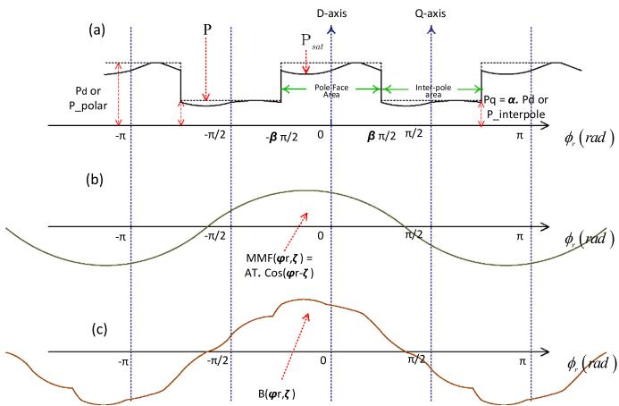  
Fig. 3. The effect of MMF distribution on saturation of permeance in loaded conditions.

machines is explained. The key technique in this procedure is extracting the saturation behavior of angular sectors in the pole-face and interpole regions from the available open-circuit characteristics. This information is then used to generate the variation of D- and q-axis magnetizing inductances as functions of the D- and q-axis magnetizing currents. This wave of flux density contains space harmonics. The fundamental component of the flux density can be expressed as shown in (8).

# 3. Implementation of the cross-magnetization routine for saturated synchronous machines

In the following section, the procedure for implementing the effects of the cross-magnetization phenomenon in saturated synchronous machines is explained. The key technique in this procedure is extracting the saturation behaviors of angular sectors in the pole-face and interpole regions from the available open-circuit characteristics. These characteristic functions are referred to as $S _ { d }$ and $s _ { q }$ in Section II -A. This information is then used to generate two-dimensional tables of D- and qaxis magnetizing inductances as functions of the D- and q-axis magnetizing currents.

# 3.1. Preparing two-dimensional tables of flux linkages and magnetizing inductances as functions of magnetizing currents

As mentioned earlier, the saturation functions $S _ { d }$ (pole-face region) and $S _ { q }$ (interpole region) have values in the range of [0, 1]. These factors are close to unity for small values of MMF and decrease with the increase in MMF. Let us approximate these saturation functions by polynomial functions, as proposed in [16].This is shown in (6). The goal of this section is to evaluate the $\mathbf { a } _ { i }$ polynomial factors in the saturation functions $s _ { d }$ and $s _ { q } .$ In this approach, the saturation factors are approximated by polynomials, and the least-square fitting ensures that the measured Dand q-axis open-circuit saturation characteristics match those calculated using the saturation factor method.

$$
S _ {d} \left(F \left(\phi_ {r}\right)\right) = 1 - \sum_ {\substack {i = 1 \\ n}} ^ {n} a _ {i d} \left| F \left(\phi_ {r}\right) \right| ^ {i} \tag{6}
$$

$$
S _ {q} \left(F \left(\phi_ {r}\right)\right) = 1 - \sum_ {i = 1} ^ {n} a _ {i q} \left| F \left(\phi_ {r}\right) \right| ^ {i}
$$

As mentioned earlier, the MMF wave acts upon the saturated permeance and creates the waveform for the flux density (B). The air-gap flux density at angle $\varphi _ { r }$ is computed using $( 7 ) ,$ , where $K _ { B }$ is a constant that depends on the machine dimensions [16]. By applying the Fourier analysis, we have the equations for the D- and q-axis components of flux density wave $( B _ { d }$ and $B _ { q } )$ as shown in (9) and (10).

$$
\begin{array}{l} B \left(\phi_ {r}\right) = k _ {B} \cdot \mathrm {P} _ {\text {s a t}} \left(\phi_ {r}\right) \cdot F \left(\phi_ {r}\right) \tag {7} \\ = k _ {B} \cdot S (F (\phi_ {r})) \cdot P (\phi_ {r}) \cdot F (\phi_ {r}) \\ \end{array}
$$

$$
\begin{array}{l} B _ {1} \left(\phi_ {r}\right) = B _ {d} \cdot \operatorname {C o s} \left(\phi_ {r}\right) + B _ {q} \cdot \sin \left(\phi_ {r}\right) \\ \left\{\begin{array}{l}B _ {d} \rightarrow \text {A m p l i t u d e o f f l u x d e n s i t y i n d} - \text {a x i s}\\B _ {q} \rightarrow \text {A m p l i t u d e o f f l u x d e n s i t y i n q} - \text {a x i s}\end{array}\right. \tag {8} \\ \end{array}
$$

$$
B _ {d} = \frac {2}{\pi} \int_ {- \frac {\pi}{2}} ^ {\frac {\pi}{2} B (\phi_ {r}) \cdot \cos (\phi_ {r}) d \phi_ {r}} = \frac {2}{\pi} \int_ {- \frac {\pi}{2}} ^ {\frac {\pi}{2} k _ {B} \cdot S (F (\phi_ {r})) \cdot P (\phi_ {r}) \cdot F (\phi_ {r}) \cdot \cos (\phi_ {r}) d \phi_ {r}} \tag {9}
$$

$$
B _ {q} = \frac {2}{\pi} \int_ {- \frac {\pi}{2}} ^ {\frac {\pi}{2} B (\phi_ {r}) \cdot \sin (\phi_ {r}) d \phi_ {r}} = \frac {2}{\pi} \int_ {- \frac {\pi}{2}} ^ {\frac {\pi}{2} k _ {B} \cdot S (F (\phi_ {r})) \cdot P (\phi_ {r}) \cdot F (\phi_ {r}) \cdot \sin (\phi_ {r}) d \phi_ {r}} \tag {10}
$$

The D- and q-axis components of air-gap flux linkage can be

computed using the following equation. Here, $k _ { \Phi }$ is a constant that depends on the distribution of stator windings.

$$
\begin{array}{l} \Psi_ {d} = \Phi_ {d} = k _ {\Phi} B _ {d} \\ \Psi_ {q} = \Phi_ {q} = k _ {\Phi} B _ {q} \end{array} \tag {11}
$$

Now that the picture is clearer, we can expand the relation between the D- and q-axis flux linkages and the ai polynomial factors in saturation functions $s _ { d }$ and $s _ { q } .$ The detailed expansion of these equations is shown in $\left[ 1 7 - 1 9 \right] .$ . The D- and q-axis flux linkages are effectively the winding voltages in per unit. Therefore, from the D-axis open-circuit characteristics and the q-axis open-circuit characteristics (if available), we will have a set of known flux linkages that satisfy the relation between these ai polynomial factors and flux linkages. By solving this set of equations, the $\mathrm { a } _ { i }$ polynomial factors can be calculated. Such a solution can be achieved using a least-squares fitting approach, as done in [16–17] and [19], and adopted here with a few modifications to make it more applicable for users of simulation tools. The solution can also be obtained using other methods, such as optimization techniques, which can be explored in future research.

Once these ${ \bf { a } } _ { i }$ polynomial factors are evaluated, in other words, the saturation characteristics for the pole-face and interpole regions are determined, the D- and q-axis flux linkages can be evaluated from (4)- (11). These flux linkages are calculated and tabulated for a range of operating conditions, $\mathrm { i . e . , }$ the magnitude and angle of the total MMF or the D- and q-axis magnetizing currents. Additionally, the D- and q-axis magnetizing inductances $( L _ { m d }$ and $L _ { m q } )$ can also be tabulated as functions of the D- and q-axis magnetizing currents. As an example, let us consider the 220 V, 3.0 kVA, 60 Hz cylindrical rotor synchronous machine used for laboratory experiments in [16]. Electric parameters and open-circuit characteristics of this machine are shown in Table 1 in the Appendix. Fig. 4 shows the variations of saturation characteristics $S _ { d }$ and $s _ { q }$ for the sectors in the pole-face and interpole regions. The horizontal axis of this curve represents the magnetizing current in per-unit. As seen, for magnetizing currents close to 0.0, the value of the saturation factor is close to 1.0. As the absolute value of the magnetizing current increases, the value of these saturation factors decreases.

For this machine, the D- and q-axis flux linkages as functions of magnetizing currents are shown in Figs. 5 and 6 respectively. In these figures, all the values are in per-unit. For clarity, the flux linkages are plotted only for positive values of magnetizing currents. In Fig. 5, the variation of D-axis flux linkage vs i (for $i _ { m q } { = } O )$ is effectively the D-axis open circuit characteristics of the machine. In addition to the flux linkages, D- and q-axis magnetizing inductances are computed and shown in Fig. 7. As expected, magnetizing inductances decrease with the increase in the magnitude of magnetizing currents.

# 3.2. EMT implementation of the synchronous machine model considering the effects of cross-magnetizing saturation

Once the D- and q-axis flux linkages and magnetizing inductances are computed and tabulated, one can implement the effects of cross-

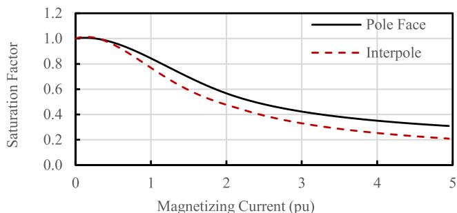  
Fig. 4. Saturation characteristics Sd and Sq for the sectors in the pole-face and interpole regions.

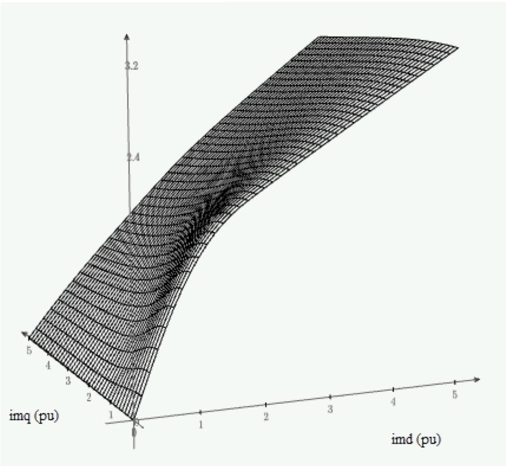  
Fig. 5. D-axis flux linkage vs D-and q-axis magnetizing currents.

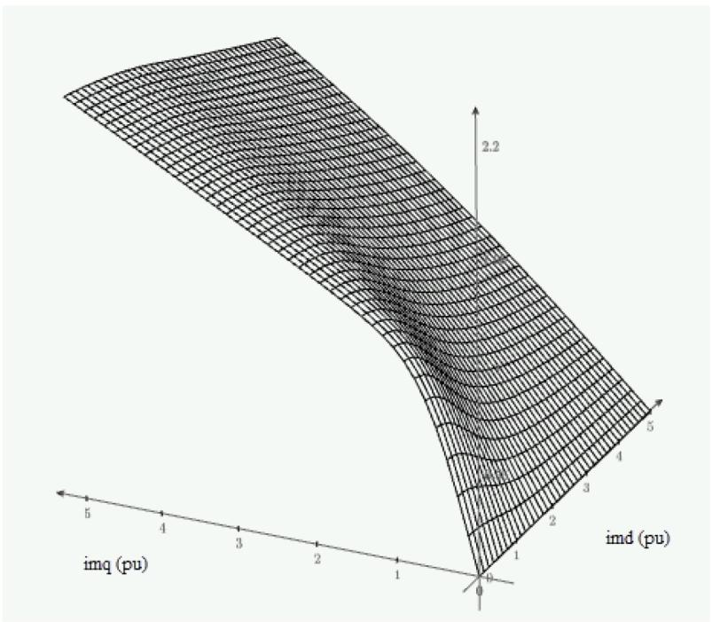  
Fig. 6. Q-axis flux linkage vs D-and q-axis magnetizing currents.

magnetization in a flux-based [2,3,21] or inductance base [18] and [19] EMT model of a synchronous machines. Details for implementation of the synchronous machine model in the environment of the EMT program is previously presented in $[ 4 , 1 9 , 2 0 ]$ , and are outside the scope of this paper. Some of the details are shown in the appendix. For each machine, based on the procedure described in the previous section, D- and q-axis magnetizing inductances are calculated and stored in tabular form as

functions of $i _ { m d }$ and $i _ { m q } .$ This operation is done before the EMT simulation starts. During the real-time simulation, based on the operation of the machine, the machine model evaluates the magnetizing inductances using two-dimensional interpolations and extrapolation. These updated magnetizing inductances are then used to update the phase domain inductance matrix of the machine for simulation purposes. Note that, with a slight modification in the procedure, one can implement the

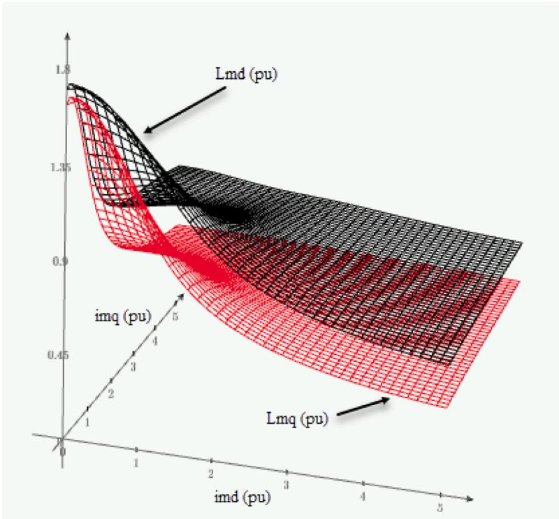  
Fig. 7. Variation of D- and q-axis magnetizing inductances as functions of magnetizing currents in per-unit.

cross-magnetizing saturation in a flux-based EMT machine model [2,3] or a phasor domain solution [5].

Often, q-axis open circuit saturation characteristics are not available to the users. In this case, options are prepared so the user can estimate the q-axis OC characteristics by scaling the D-axis OC characteristics by a factor of $\begin{array} { r } { ( L _ { m q } / L _ { m d } ) . } \end{array}$ . This assumption is close to what is proposed in [10, 11]. Also, in case of salient pole synchronous machines, users may assume that characteristics of the interpole region in linear. That means that ${ \tt a } _ { \mathrm { i q } } = 0$ in (6). It is shown in the next section that these assumptions provide acceptable simulation results.

# 4. Experimental validation of the model and discussion of the simulation results

In this section, first, the cross-magnetization saturation routine implemented in the environment of a real-time EMT program is validated using previously performed laboratory experiments. Then, various scenarios on two types of large synchronous machines were simulated and important conclusions were drawn.

# 4.1. Experimental validation of the model

This section provides validations for the cross-magnetization saturation routine implemented in the proposed model. To check the accuracy of the model including cross-magnetization saturation effects, the active and reactive powers under various levels of saturation at different load angles for a cylindrical-rotor machine have been simulated. The machine is the 220 V, 3.0 kVA, 60 Hz cylindrical rotor synchronous machines used in the previous section [16]. Data for this machine is shown in Table 1 of the Appendix. These results are compared to the experimental measurements described in Chapter 4 of [16]. The test circuit is comprised of a source applying voltage to the machine model.

The results are presented for two levels of field current excitations. In the first test, the field current is set to 1.622 normalized value and the terminal voltage is maintained at 1.0 pu. In the second test, the field current is set to 2.079 normalized value and the terminal voltage is maintained at 1.09 pu. Note that according to the definition, 1.0 normal

field current is the field current that generates 1.0 pu open-circuit voltage at rated speed on the air-gap line [4]. According to the definition of per-unit field current in [16], these excitation levels correspond to 0.96 pu and 1.23 pu respectively. Variations of active and reactive power versus the load angle for the excitation currents of 1.622 (normal) and 2.079 (normal) are shown in Figs. 8 and 9 respectively. In these figures, the experimental measurements are shown by black dots. The

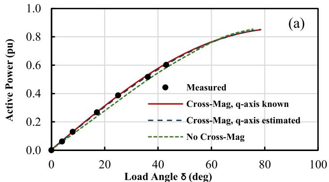

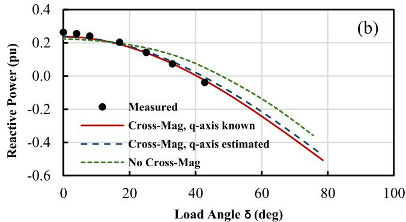  
Fig. 8. Variation of active and reactive powers (pu) vs load angle (deg) for the 3 kVA cylindrical rotor synchronous machine, If = 1.622 (Norm).

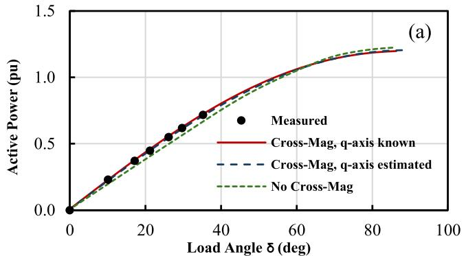

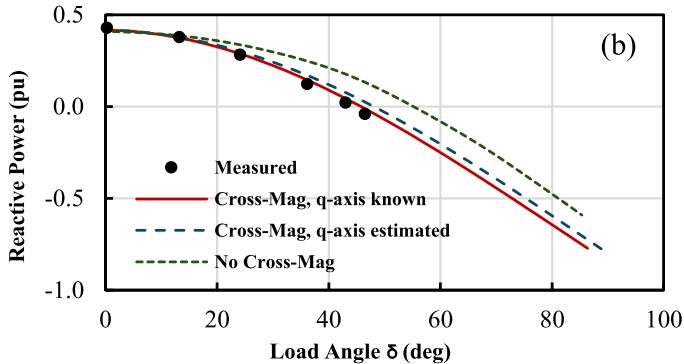  
Fig. 9. Variation of active and reactive power (pu) vs load angle (deg) for the 3 kVA cylindrical rotor synchronous machine, If = 2.079 (Norm).

solid red curves show the simulation results where cross-magnetization is included and both D-axis and q-axis magnetization curves are known. As can be seen, the simulation results including the effects of cross-magnetization match the experimental measurements for both active and reactive power, in both levels of field excitations and in the entire range of recorded load angle.

In these tests, simulations are repeated for situations where the q-axis magnetization curve is not known, and it is estimated by scaling the Daxis OC characteristics by a factor of $( L _ { m q } / L _ { m d } )$ . These results are shown by the blue dotted curve. Lastly, simulation is repeated where the effects of cross-magnetization is ignored altogether, and saturation is only modeled on the D-axis. These results are shown by the green dotted line. As shown, large errors can be observed in the simulated reactive power when the effects of cross-magnetization are ignored. This error increases with the increase in the value of load-angle. Another interesting conclusion from this experiment is that, the simulation results are acceptable even if the q-axis magnetization curve is estimated.

# 4.2. Simulation results for a large cylindrical rotor synchronous machine

In this section, the above experiments are repeated only in simulation for a large 555 MVA cylindrical rotor synchronous generator [8]. The D- and q-axes magnetizing inductances $L _ { m d }$ and $L _ { m q }$ for this machine are 1.66 and 1.61 pu respectively. The generator is operated at the terminal voltage of 1.0 pu and the excitation current is changed from under-excitation to over-excitation range, i.e. 1.0, 2.0 and 3.0 normalized values. Similar to the previous experiment, the active and reactive power are recorded over a range of load angles. Since the active power is tightly coupled to the load angle and plots containing the variations of active power vs load angle do not provide much information with respect to the study in this section, only the variations of reactive power versus load angle are shown here. Fig. 10a and 10-b show the variations of generator reactive power versus load angle for excitation currents 2.0 and 3.0 (Norm), respectively. Since the model with the inclusion of cross-magnetizing effects is validated in the previous section, these results are considered as reference in this figure. In this figure,

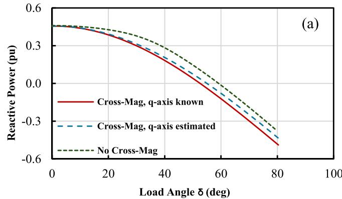

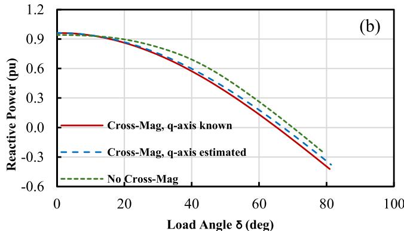  
Fig. 10. Variation of reactive power (pu) vs load angle (deg) for the 555 MVA cylindrical rotor synchronous machine. (a) If = 2.0 (Norm) (b) If = 3.0 (Norm).

additionally, we have simulation results when the q-axis magnetizing curve is estimated and the results when the effects of cross-magnetization are ignored. As can be observed again, estimating the q-axis magnetizing curve may be acceptable, however ignoring the cross-magnetization effects may result in large errors in simulated reactive power depending on the load angle. This can also be interpreted that ignoring the effects of cross-magnetization in saturation may result errors in the simulated load angle of the generator depending on the loading conditions.

# 4.3. Simulation results for a large salient pole synchronous machine

In this section, the simulations in the previous section are repeated for a large 100 MVA salient pole synchronous generator [4]. The D- and q-axes magnetizing inductances Lmd and $L _ { m q }$ for this machine are 1.66 and 1.08 pu respectively. Similarly. The generator is operated at the terminal voltage of 1.0 pu and the excitation current is changed from under-excitation to over-excitation range, i.e. 1.0, 2.0 and 3.0 normalized. Fig. 11 show the variations of generator reactive power versus load angle for the excitation current of 2.0 (Norm). In this figure, we have simulation results for four scenarios:

- The cross-magnetization is fully incorporated, knowing the q-axis OC curve.   
- The cross-magnetization is incorporated; however, the q-axis magnetization curve is not known, and it is estimated by scaling the d-axis OC characteristics by a factor of $( L _ { m q } / L _ { m d } )$ .   
- The characteristic of interpole region is assumed linear.   
- The effects of cross-magnetization are ignored altogether.

As can be observed, assuming linear characteristics for interpole region and estimating the q-axis saturation curve results are acceptable, however ignoring the cross-magnetization effects may result in large errors in simulated reactive power depending on the load angle.

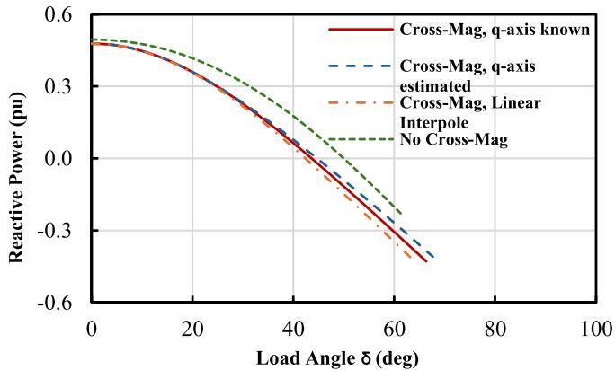  
Fig. 11. Variation of reactive power (pu) vs load angle (deg) for the 100 MVA salient pole synchronous machine. If = 2.0 (Norm).

# 5. Conclusions and contributions

This paper presents the development and validation of an EMT synchronous machine model that incorporates the so-called crossmagnetizing effects in the saturation algorithm. The approach essentially considers the magnitude and angle of MMF in evaluating the state of saturation. The paper also demonstrates the effects of various

simplifications on the loading capability of synchronous generators.

The effects of cross-magnetization are implemented in the EMT synchronous machine model. This approach effectively considers the magnitude and angle of MMF in evaluating the state of saturation, as well as the structure of the rotor.

It is shown that ignoring the effects of cross-magnetization in saturation could potentially result in large errors in modeling the loading conditions of synchronous generators. It is also shown that certain simplifications in the algorithm for cross-magnetization effects could produce acceptable results.

# CRediT authorship contribution statement

A.B. Dehkordi: Validation, Software, Writing – original draft, Conceptualization, Formal analysis. A.M. Gole: Writing – review & editing, Supervision. T.L. Maguire: Writing – review & editing, Supervision.

# Declaration of competing interest

The authors declare that they have no known competing financial interests or personal relationships that could have appeared to influence the work reported in this paper.

# Appendix I

Table 1   
Table 1 Parameters of the small round rotor synchronous MACHINE [16].   

<table><tr><td colspan="2">Per-Unit Base</td><td colspan="2">Value</td></tr><tr><td colspan="2">Line-neutral rated voltage</td><td colspan="2">220 V</td></tr><tr><td colspan="2">Rated MVA</td><td colspan="2">3.0 kVA</td></tr><tr><td colspan="2">Rated Frequency</td><td colspan="2">60 Hz</td></tr><tr><td colspan="2">D- and Q-axes Parameters</td><td colspan="2">Value (pu)</td></tr><tr><td colspan="2">Stator Leakage Reactance</td><td colspan="2">0.15</td></tr><tr><td colspan="2">D-axis Unsaturated Magnetizing Reactance</td><td colspan="2">1.69</td></tr><tr><td colspan="2">Q-axis Magnetizing Reactance</td><td colspan="2">1.62</td></tr><tr><td colspan="4">Open Circuit Curve</td></tr><tr><td colspan="2">D-axis</td><td colspan="2">Q-axis</td></tr><tr><td>Magnetizing Current (norm)</td><td>OC Voltage (pu)</td><td>Magnetizing Current (norm)</td><td>OC Voltage (pu)</td></tr><tr><td>0</td><td>0</td><td>0</td><td>0</td></tr><tr><td>0.481</td><td>0.481</td><td>0.446</td><td>0.446</td></tr><tr><td>0.741</td><td>0.688</td><td>0.899</td><td>0.806</td></tr><tr><td>0.985</td><td>0.877</td><td>1.129</td><td>0.948</td></tr><tr><td>1.24</td><td>1.03</td><td>1.336</td><td>1.036</td></tr><tr><td>1.466</td><td>1.158</td><td>1.55</td><td>1.114</td></tr><tr><td>1.964</td><td>1.318</td><td>1.783</td><td>1.176</td></tr><tr><td>2.306</td><td>1.4</td><td>2.12</td><td>1.243</td></tr><tr><td>2.682</td><td>1.463</td><td>2.457</td><td>1.299</td></tr><tr><td>3.418</td><td>1.564</td><td>3.05</td><td>1.373</td></tr></table>

# Appendix II

In this appendix, the formulation of the synchronous machine model in the environment of the EMT program is briefly explained. Due to the inherent nature of the EMT algorithm, we used the coupled electric circuit approach for modeling the induction machine. In this method, the machine is treated as a set of mutually coupled inductances. These inductances vary with rotor position and magnetic saturation, both of which are timedependent, making the inductance matrix time-varying. EMT programs generally use trapezoidal integration for discretizing the differential equations of power system components such as electric machines [1]. The coupled circuit representation and resulting discrete equations are shown in (12), where [L] and [R] represent the inductance and resistance matrices, respectively, with matrix [R] being diagonal for winding resistances. Winding voltages and currents are denoted by v(t) and i(t). After discretization, an equivalent admittance matrix [GEQ(t)] is computed and overlaid onto the

main network’s admittance matrix in each time step [4,19,20]. The vector Ih, representing history terms, is injected as current sources to the corresponding nodes in every time step. A novel technique is used to invert $[ R _ { E Q } ( t ) ]$ matrix, which will be the subject of future publications.

$$
\underline {{v}} (t) = \frac {d}{d t} \underline {{\lambda}} (t) + [ R ] \underline {{i}} (t) = \frac {d}{d t} \left\{\left[ L (t) \right] \underline {{i}} (t) \right\} + [ R ] \underline {{i}} (t)
$$

afterdiscretizingusingthetrapezoidalintegration :

$$
\underline {{i}} (t) = \left[ G _ {E Q} (t) \right] \underline {{\nu}} (t) + \underline {{h}}
$$

where :

$$
\begin{array}{l} \left[ G _ {E Q} (t) \right] = \left[ R _ {E Q} (t) \right] ^ {- 1} = \left\{\frac {2}{\Delta t} [ L (t) ] + [ R ] \right\} ^ {- 1} \\ \underline {{I}} \underline {{h}} = \left[ G _ {E Q} (t) \right] \left\{\underline {{v}} (t - \Delta t) + \left[ R _ {E Q} ^ {\prime} (t - \Delta t) \right] \underline {{i}} (t - \Delta t) \right\} \\ \left[ R _ {E Q} ^ {\prime} (t - \Delta t) \right] = \frac {2}{\Delta t} \left[ L (t - \Delta t) \right] - [ R ] \\ \end{array}
$$

# Data availability

Data will be made available on request.

# References

[1] H.W. Dommel, EMTP Theory Book, Microtran Power System Analysis Corporation, Vancouver, Canada, 1992.   
[2] A.M. Gole, R.W. Menzies, D.A. Woodford, H. Turanli, Improved interfacing of electrical machine models in electromagnetic transients programs, IEEE Trans. Power Apparatus Syst. PAS-103 (9) (Sept. 1984) 2446–2451.   
[3] T.L. Maguire, An efficient saturation algorithm for real time synchronous machine models using flux linkages as State variables,” Electrimacs 2002, Montreal, Canada, June 2002, IEEE Trans. Power Apparatus Syst. PAS-103 (9) (Sept. 1984) 2446–2451.   
[4] RTDS Technologies Inc., RTDS™ User’s Manual Set, Winnipeg, CA, 2024.   
[5] PSS/E Program Application Guide-Manual, II, Power Technologies, Inc., 2024. Volume.   
[6] R.H. Park, Two reaction theory of synchronous machines, part 1, AIEE Transac. 48 (1929) 716–730.   
[7] R.H. Park, Two reaction theory of synchronous machines, part 2, AIEE Transac. 52 (1933) 352.   
[8] P.S. Kundur, Power System Stability and Control, McGraw-Hill., New York, 1983. Chapter 3.   
[9] F.P. de Mello, L.H. Hannett, Representation of saturation in synchronous machines, IEEE Trans. Power Syst. 1 (Nov. 1986) 8–18.   
[10] E. Levi, State-space D-q axis models of saturated salient pole synchronous machines, IEE Proc. Electr. Power Appl. 145 (3) (Mar. 1998) 206–216.

[11] E. Levi, Saturation modelling in D-q axis models of salient pole synchronous machines, IEEE Trans. Energy Convers. 14 (1) (Mar. 1999) 44–50.   
[12] S.H. Minnich, R.P. Schulz, D.H. Baker, D.K. Sharma, R.G. Farmer, J.H. Fish, Saturation functions for synchronous generators from finite elements, IEEE Transac. Energy Conv. EC-2 (1987) 680–692.   
[13] H.W. Dommel, Digital computer solution of electromagnetic transients in single and multiphase networks, IEEE Trans. Power Apparat. Syst. PAS-88 (4) (Apr. 1969) 388–399.   
[14] A.M. El-Serafi, A.S. Abdallah, M.K. El-Sherbiny, ’ E.H. Badawy, Experimental study of the saturation and the cross-magnetizing phenomenon in saturated synchronous machines, IEEE Transac. Energy Conver. EC-3 (1988) 815–823.   
[15] A.M. El-Serafi, E. Demeter, Cross-magnetization phenomenon in saturated cylindrical-rotor synchronous machines, Canadian Conf. Electric. Comput. Eng. 2 (7-10 March 2000) 922–926.   
[16] E. Demeter, Modeling of Saturated Cylindrical-Rotor Synchronous Machines, University of Saskatchewan, July 1998. Master’s Thesis.   
[17] A.M. El-Serafi, Kar, Methods for determining the q-axis saturation characteristics of salient-pole synchronous machines from the measured D-axis characteristics, IEEE Trans. On Energy Convers. 18 (1) (Mar 2003) 80–86.   
[18] A.B. Dehkordi, P. Neti, A.M. Gole, T.L. Maguire, Development and validation of a comprehensive synchronous machine model for a real-time environment, IEEE Trans. Energy Conver. 25 (1) (Mar 2010) 34–48.   
[19] A.B. Dehkordi, “Improved models of electric machines for real-time digital simulation”, Ph.D. dissertation, Dept. Elec. Eng., Univ. Manitoba, Winnipeg, 2010.   
[20] J.R. Marti, K.W. Louie, A phase-domain synchronous generator model including saturation effects, IEEE Trans. Power Syst. 12 (2) (Feb. 1997) 222–229.   
[21] MathWorks, User Guide - MATLAB & Simulink, 2024.