# Modeling for large-scale offshore wind farm using multi-thread parallel computing☆

Ming Zou , Chengyong Zhao , Jianzhong Xu *

State Key Laboratory of Alternate Electrical Power System with Renewable Energy Sources, North China Electric Power University (NCEPU), 102206 Beijing, China

# A R T I C L E I N F O

Keywords:

Offshore Wind Farm (OWF)

Electro-Magnetic Transient (EMT)

Electrical collection network

Multi-thread parallel computing

# A B S T R A C T

Large-scale Offshore Wind Farms (OWFs) face difficulty when carrying out microsecond-level Electro-Magnetic Transient (EMT) simulations due to the large number of Wind Turbines (WTs) and electrical nodes. This paper provides an OWF modeling method considering the electrical collection network based on the integrated equivalent modeling method of single WT, which can eliminate the internal nodes and reduce the order of admittance matrix. Meanwhile, the multi-thread parallel computing is integrated into the whole solution procedure, which achieves further simulation speedup. Moreover, simulations are performed in PSCAD/EMTDC to compare the model accuracy and time efficiency of the proposed method with the detailed model. The simulation results show that the proposed method can accurately simulate the dynamic characteristics of large-scale OWFs with large speedup factors.

# 1. Introduction

With the worsening of climate warming and environmental pollu tion, the transition from conventional fossil energy power to renewable energy power becomes urgent [1,2]. Offshore wind power has become a promising approach for China to achieve the goal of “carbon peak and carbon neutrality” and plays a very important role in the construction of new-type power system with renewable energy as the main body due to its advantages of abundant resource reserves, no occupation of land resources and high utilization rate of wind energy [3–5].

To accurately reflect the internal and external dynamic characteristics of large-scale Offshore Wind Farms (OWFs), the Electro-Magnetic Transient (EMT) simulation has become an important tool for wind farm planning, control protection design, and reproducing and handling abnormal working conditions [6–8]. Since there are large number of WTs in the OWF, the microsecond-level time-step size is required. However, the detailed EMT simulation model, which employs discrete components, requires super high-order admittance matrix reconstruction and inversion operations, resulting in extremely low simulation efficiency [9–11].

To fill the research gap, many scholars have carried out researches on accelerating the EMT simulations. References [12–16] focus on

improving the serial solution efficiency of the model based on mathematical and equivalence principles. While references [17–21] pay attention to the parallelism of model solution procedure and introduce multi-thread parallel computing to EMT simulation, thus to maximize the computing potential of the CPU processors.

In terms of serial computation acceleration, reference [12] proposed a Th´evenin’s equivalent EMT simulation model for Modular Multilevel Converter (MMC) based on Nested Fast and Simultaneous Solution (NFSS) algorithm. This method can improve the simulation efficiency by eliminating internal nodes. Based on [12], the equivalent modeling method is extended to Power Electronic Transformers (PET) [13,14]. However, this method is only applicable to models with modular cascaded topologies, and special considerations are required when topologies are more complex. So far, no literatures have employed the above equivalent method to accelerate the accurate EMT simulations of the Wind Turbines (WT). A large time step simulation technology for WT is proposed in [15] based on matrix transformation and phasor-domain shifted frequency modeling methods, although reduced the computational burden, it is only fit for sub-/super-synchronous interaction conditions. In [16], the average-value modeling techniques are applied to WT model by representing the characteristics of switching systems with a set of algebraic equations. Yet, the simulation accuracy is

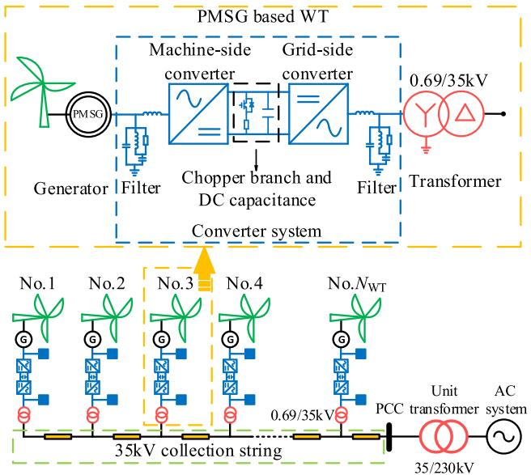  
Fig. 1. The classical chain connection and topology of PMSG based WT.

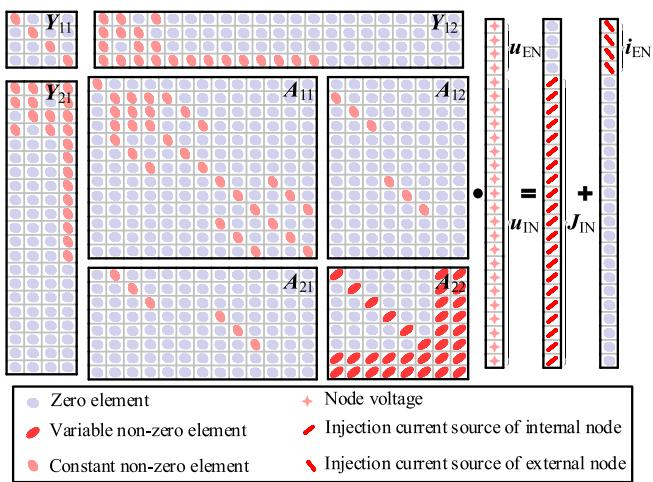  
Fig. 2. The nodal admittance equation of complete circuit of WT.

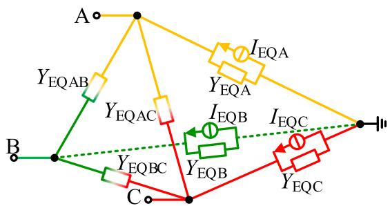  
Fig. 3. The EMT equivalent model of single WT.

# reduced.

In terms of parallel computation acceleration, reference [17] proposed an Electric Network Interface (ENI) technology based on Bergeron transmission line model, which realized system partitioning and parallel simulation. Yet this method is only suitable for networks containing transmission lines, and the network decoupling is largely dependent on the length of transmission lines and simulation time step size. A master–slave co-simulation scheme is proposed in [18] based on Functional Mock-up Interface (FMI) standard, which effectively improves the

efficiency of EMT simulation procedure, but its universality is poor compared with other equivalent programs. In [19], a one-step timedelay parallel method is proposed based on the parallelism of the explicit integration formula of the forward Euler method. The natural decoupling of the network can be achieved by using a single inductor or capacitor. However, due to the low accuracy of the forward Euler method, numerical oscillation problem exists, and its applicability needs to be improved. In [20], a fine-grained electrical circuit partitioning method is proposed in which the graphics processing unit (GPU) based parallel architecture is utilized. In addition, there are many multi-thread parallel technologies with good performance. One of the typical methods is OpenMP, which is a multi-thread programming scheme based on shared memory to realize system parallelism. The “fork-join” architecture is applied, which supports $\mathrm { C } , \mathrm { C } { + } { + }$ , and Fortran programming languages, and is suitable for completing parallel programming on multi-core CPU computers. OpenMP has been widely applied in many fields, but have not been effectively employed in EMT simulation [21].

Aiming at the problem that the transmission lines in OWFs are short and may not meet the natural decoupling requirements, based on the previous research, which is briefly introduced in Section II and the Appendix, this paper proposes an integrated modeling method for largescale OWFs considering the electrical collection network. Further, a parallel equivalent computing method for large-scale OWFs is proposed, and the parallel method is applied to the solution procedure of OWFs, which improves the simulation speed.

The rest of the paper is organized as follows: Section III introduces the interphase decoupled method of WT model based on the integrated equivalent model for WT. Section IV elaborates the modeling method of OWF considering electrical collection network by integrating WT models and transmission lines. A multi-thread parallel equivalent computing method is proposed in Section V based on the modularity and parallelism of computation among the WTs. Section VI verifies the accuracy and efficiency of the proposed model. Finally, conclusions are drawn in Section VII.

# 2. Integrated equivalent model for WT based on matrix order reduction

The integrated equivalent model for PMSG based WT was previously developed by the authors and is briefly introduced in this Section. To better illustrate the background knowledge of this paper, the main equations of the model are listed in Appendix.

# A. PMSG Based WT

The topology of PMSG based WT as shown in Fig. 1 includes PMSG, back-to-back Full Rated Converter (FRC) with DC chopper branch, LC filter, and three-phase AC transformer. Due to the complex equipment, black-box model and large number of nodes, the detailed modelling of WT is extremely low and the equivalent modeling is necessary.

# B. EMT Equivalent Model

Firstly, the mathematical equations of devices in a WT are discretized by Trapezoidal Rule (TR) and established to obtain their companion circuits. Then the complete circuit of PMSG based WT is obtained and its nodal admittance equation is shown in Fig. 2. Using the idea of partitioned matrix, the equation in Fig. 2 is written in a much-simplified form as in (1) by separating the internal and external nodes.

$$
\left[ \begin{array}{l l} \mathbf {Y} _ {1 1} & \mathbf {Y} _ {1 2} \\ \mathbf {Y} _ {2 1} & \mathbf {Y} _ {2 2} \end{array} \right] \left[ \begin{array}{l} \boldsymbol {u} _ {\mathrm {E N}} \\ \boldsymbol {u} _ {\mathrm {I N}} \end{array} \right] = \left[ \begin{array}{l} 0 \\ \boldsymbol {J} _ {\mathrm {I N}} \end{array} \right] + \left[ \begin{array}{l} \boldsymbol {i} _ {\mathrm {E N}} \\ 0 \end{array} \right] \tag {1}
$$

where, the subscript “EN” represents the external nodes and “IN” represents the internal nodes.

Finally, by eliminating the internal nodes of (1), the admittance

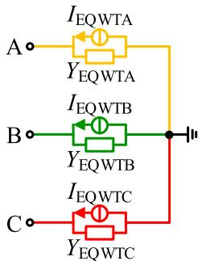  
Fig. 4. Interphase decoupled model of single WT.

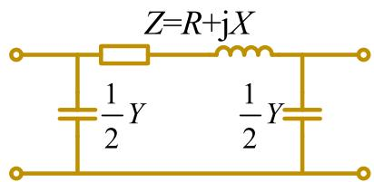  
Fig. 5. Equivalent circuit of single-phase π-section transmission line.

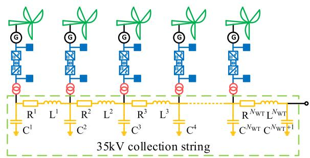

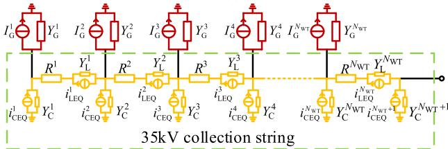  
  
(b)   
Fig. 6. OWF collection string using π-section line model: (a) structural topology in three-phase view; (b) single-phase companion circuit.

equation of the external nodes is obtained as in (2).

$$
\left(\boldsymbol {Y} _ {1 1} - \boldsymbol {Y} _ {1 2} \boldsymbol {Y} _ {2 2} ^ {- 1} \boldsymbol {Y} _ {2 1}\right) \boldsymbol {u} _ {\mathrm {E N}} = \boldsymbol {i} _ {\mathrm {E N}} - \boldsymbol {Y} _ {1 2} \boldsymbol {Y} _ {2 2} ^ {- 1} \boldsymbol {J} _ {I N} \tag {2}
$$

Therefore, the EMT equivalent model of single WT with much reduced computational burden, which contains only 4 external nodes, is shown in Fig. 3.

The serial equivalent model (SEM) can be obtained by replacing all WTs in the OWF with the proposed model. The accuracy of the proposed model was tested and have shown very high precision with maximum relative error under 0.96%.

Note that due to the existence of non-diagonal elements in ${ \pmb Y } _ { 1 1 } { - } { \pmb Y } _ { 1 2 } { \pmb Y } _ { 2 2 }$ $^ { 1 } \pmb { Y } _ { 2 1 } ,$ there is coupled mutual-impedance among three phases of single WT model.

# 3. Interphase decoupled method of single WT

Modular Multilevel Converter (MMC) has a modular cascaded

structure, and all sub-modules are the same and bridge arm can be equivalent to one sub-module through Th´evenin or Norton theorem, thus greatly reducing the computation burden and improving the simulation efficiency [12,22]. The modeling procedure of Power Electronic Transformer (PET) is similar [13,14].

WTs in an OWF also have similar structural characteristics. For example, the typical chain connection shown in Fig. 1 connects each WT in a collection string through transmission lines. If the WT model and the transmission line model can be processed to carry out Norton parallel connection, then the number of simulation nodes can also be significantly reduced. However, the WT model in Section II is phase-coupled, indicating that there is mutual-impedance among three phases, which makes the WT model fail to meet the conditions of parallel connection. For this reason, this Section proposes an interphase decoupled method.

Re-organize (2) and obtain:

$$
\begin{array}{l} \begin{array}{r} \boldsymbol {i} _ {\mathrm {E N}} (t) = (\boldsymbol {Y} _ {1 1} - \boldsymbol {Y} _ {1 2} \boldsymbol {Y} _ {2 2} ^ {- 1} \boldsymbol {Y} _ {2 1}) \boldsymbol {u} _ {\mathrm {E N}} (t) + \boldsymbol {Y} _ {1 2} \boldsymbol {Y} _ {2 2} ^ {- 1} \boldsymbol {J} _ {I N} (t - \Delta t) \\ \hat {\Delta C} _ {\text {(a)}} + \boldsymbol {J} _ {(t - \Delta t)} \end{array} \tag {3} \\ \triangleq \mathbf {G} u _ {\mathrm {E N}} (t) + \mathbf {J} (t - \Delta t) \\ \end{array}
$$

where, G is the node admittance matrix and J(t-Δt) is the node injection current from the last simulation step.

Then, define $\pmb { Y } _ { \mathrm { d i a g } }$ and $\pmb { Y } _ { \mathrm { r e s t } }$ as the matrix composed of diagonal elements and none-diagonal elements of G, respectively. Therefore, (3) can be written as (4).

$$
\boldsymbol {i} _ {\mathrm {E N}} (t) = \left(\boldsymbol {Y} _ {\text {d i a g}} + \boldsymbol {Y} _ {\text {r e s t}}\right) \boldsymbol {u} _ {\mathrm {E N}} (t) + \boldsymbol {J} (t - \Delta t) \tag {4}
$$

To eliminate the influence of $\pmb { Y } _ { \mathrm { r e s t } }$ on the final equivalent circuit of single WT, single time-step approximation is applied to $\pmb { u } _ { \mathrm { E N } } ,$ with the assumption of $\pmb { u } _ { \mathrm { E N } } ( t )$ is close to $\pmb { u } _ { \mathrm { E N } } ( t - \Delta t )$ . The rationality of the above assumption is validated by considering that the voltage of the earth capacitance of submarine cable at the outlet of the WT will not change abruptly, and that the change of AC voltage can be ignored in each time step. Therefore, $\pmb { Y } _ { \mathrm { r e s t } } \pmb { u } _ { \mathrm { E N } } ( t - \Delta t )$ is incorporated into $\pmb { J } ( t { - } \Delta t )$ as history value. Then, (5) is obtained:

$$
\begin{array}{l} \boldsymbol {i} _ {\mathrm {E N}} (t) \approx \boldsymbol {Y} _ {\text {d i a g}} \boldsymbol {u} _ {\mathrm {E N}} (t) + \boldsymbol {Y} _ {\text {r e s t}} \boldsymbol {u} _ {\mathrm {E N}} (t - \Delta t) + \boldsymbol {J} (t - \Delta t) \tag {5} \\ = \mathbf {Y} _ {\mathrm {d i a g}} \mathbf {u} _ {\mathrm {E N}} (t) + \mathbf {I} _ {\mathrm {E Q}} (t - \Delta t) \\ \end{array}
$$

Both the TR integration method and the Backward Euler (BE) method are numerically stable integration methods. The single time-step approximation makes the integration result fall in between the TR and BE methods, which is actually a modified TR method and thus has good numerical stability. According to (5), the interphase decoupled model of single WT is developed, as shown in Fig. 4. It is seen that there is no electrical connection among three phases since the mutual-admittances are zero.

# 4. Modeling method of OWF considering electrical collection network

Aiming at the problem that transmission lines among WTs are relatively short that the natural decoupling conditions [17] are not necessarily satisfied, this Section will introduce the short transmission line model and the equivalent modeling of OWF considering the collection network.

# A. Transmission Line Model

The impact of the capacitance effect of transmission line on the protection strategy during fault ride-through cannot be ignored [23,24]. Meanwhile, transmission lines also reflect the spatial distance distribution among WTs. Therefore, the influence of transmission lines should be considered when modeling OWF. Generally, in EMT simulations, there are two basic methods to represent transmission lines. The first is the π-section approach and the second method is a distributed parameter representation.

A π-section model will give the correct fundamental impedance. It is

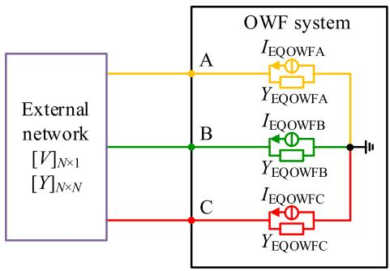  
Fig. 7. External network with Norton equivalent of all WTs in OWF system.

suitable for very short lines where the distributed parameter representation models cannot be used due to time step constraints [17]. The transmission lines among WTs in an OWF are electrically short compared to the simulation step. Therefore, they can be represented with reasonable accuracy by a simple circuit consisting of a seriesimpedance and shunt-admittance [25] as shown in Fig. 5.

The π-section circuit model is convenient for node elimination. However, the π-section lines will bring greater computational time because it increases the EMTDC admittance matrix size, which will be discussed below.

B. Integrated Equivalent Model of OWF Considering the Collection Network

The integrated equivalent model of OWF considering the collection network is proposed in this sub-Section, which can further improve the simulation speed by eliminating the nodes. The schematic diagram of the OWF collection string using π-section line model is shown in Fig. 6 (a). It is seen from Fig. 6 that the three nodes (represent three phases respectively) located between the series resistance and inductance are added when a π-section line between WTs is considered.

The computational complexity of the system solution is ${ \mathrm { O } } ( n ^ { 3 } )$ , which is proportional to the third power of the node count n. Fig. 2 indicates that the n of a single WT is 25, and the n increases to 28 after considering the π-section line, thus increasing the computational complexity by

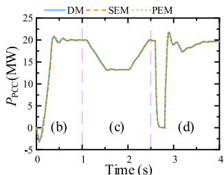

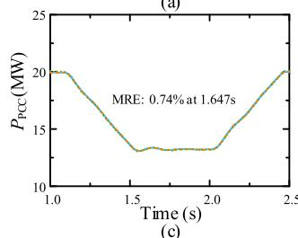

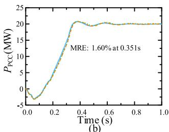

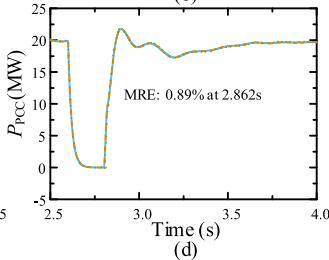  
Fig. 9. Comparisons of DM, SEM, and PEM: (a) overall procedure; (b) startup; (c) wind speed variation; (d) three-phase-to-ground short-circuit fault.

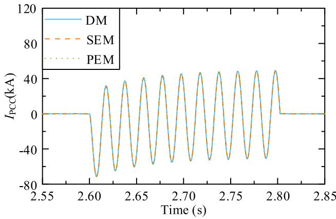  
Fig. 10. Comparisons of DM, SEM, and PEM during fault.

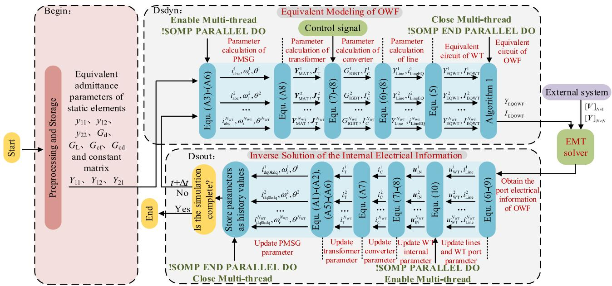  
Fig. 8. Flow chart of parallel equivalent algorithm for OWFs.

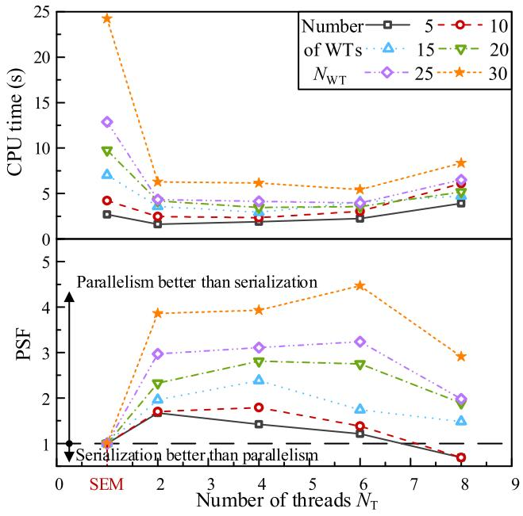  
Fig. 11. PSF test under different threads.

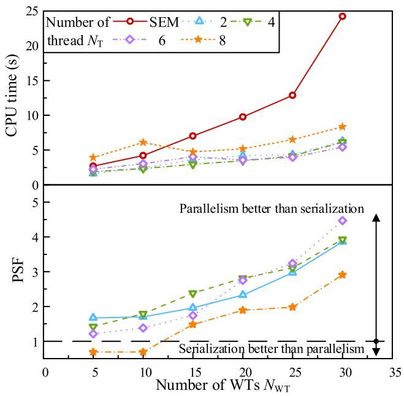  
Fig. 12. PSF test under different number of WTs.

Table 1 Comparison of DM&SEM&OPEM.   

<table><tr><td rowspan="2">Number of WTs NWT</td><td colspan="3">CPU time/s</td><td colspan="2">Speedup factor</td><td rowspan="2">Optimal number of threads</td></tr><tr><td>DM</td><td>SEM</td><td>OPEM</td><td>SFs</td><td>SFp</td></tr><tr><td>5</td><td>97.66</td><td>2.69</td><td>1.61</td><td>36.3</td><td>60.7</td><td>2</td></tr><tr><td>10</td><td>1072.28</td><td>4.20</td><td>2.34</td><td>255.3</td><td>458.2</td><td>4</td></tr><tr><td>15</td><td>4313.49</td><td>7.02</td><td>2.95</td><td>614.5</td><td>1462.2</td><td>4</td></tr><tr><td>20</td><td>12843.78</td><td>9.75</td><td>3.47</td><td>1317.3</td><td>3701.4</td><td>4</td></tr><tr><td>25</td><td>22939.39</td><td>12.87</td><td>3.97</td><td>1782.4</td><td>5778.2</td><td>6</td></tr><tr><td>30</td><td>52534.41</td><td>24.23</td><td>5.42</td><td>2168.2</td><td>9692.7</td><td>6</td></tr></table>

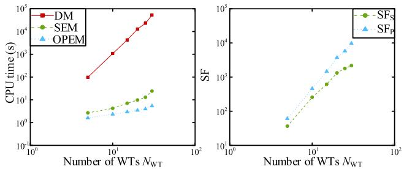  
Fig. 13. Comparison of speedup factors of DM&SEM&PEM.

about 40.49%.

Algorithm 1: Equivalent procedure of collection string   
1 $Y _ { \mathrm { E Q N E W } } = 0 !$ Initialization   
2 $Y _ { \mathrm { E Q } } = 0$   
3 $J _ { \mathrm { E Q } } = 0$   
4 DO $K = 1 , N _ { \mathrm { W T } }$ !Serial and parallel equivalent of No. 1 WT to No. $N _ { W T }$ line   
5 $Y _ { \mathrm { E Q } } = Y _ { \mathrm { E Q N E W } } + Y _ { \mathrm { C } } ^ { K } + Y _ { \mathrm { G } } ^ { K }$   
6 $J _ { \tt E Q } = J _ { \tt E Q } - i _ { \tt C E Q } ^ { K } + I _ { \tt G } ^ { K }$   
7 $\boldsymbol { Y } _ { \mathrm { E Q N E W } } = 1 / ( 1 / Y _ { \mathrm { E Q } } + R ^ { K } + 1 / Y _ { \mathrm { L } } ^ { K } )$   
8 $J _ { \mathrm { E Q } } = Y _ { \mathrm { E Q N E W } } { } ^ { * } ( 1 / Y _ { \mathrm { E Q } } { } ^ { * } J _ { \mathrm { E Q } } + 1 / Y _ { \mathrm { L } } ^ { K * } i _ { \mathrm { L E Q } } ^ { K } )$   
9 END DO   
10 $Y _ { \mathrm { E Q O W F } } = Y _ { \mathrm { E Q N E W } } + Y _ { \mathrm { C } } ^ { N _ { \mathrm { W T } } + 1 }$ !parallel equivalent of No. $N _ { W T } + 1$ line   
$I _ { \mathrm { E Q O W F } } = J _ { \mathrm { E Q } } - i _ { \mathrm { C E Q } } ^ { N _ { \mathrm { W T } } + 1 }$

Discrete the π-section line circuit and replace the WTs with equivalent circuits shown in ${ \mathrm { F i g . ~ } } 4 ,$ then the companion circuit of OWF collection string can be obtained as shown in Fig. 6(b). Since the WT model is interphase decoupled, the collection string is represented in single phase. Thus, it is convenient to determine its Norton equivalent circuits. Since the equivalent circuit of WT and shunt-admittance of the line are connected in parallel as a whole part, they are connected in series with the series-impedance of the line, the equivalent circuit parameters of the OWF collection string can be presented as the following pseudocode in Algorithm 1.

In Algorithm 1, $N _ { \mathrm { W T } }$ is the number of WTs; Y and I are equivalent admittance and equivalent history current source of OWF collection string, respectively; $Y _ { \mathrm { E Q } } ,$ , YEQNEW and $J _ { \mathrm { E Q } }$ are intermediate variables.

The pseudocode can be converted into a Norton equivalent circuit consisting of a parallel connected equivalent current source and an admittance. This pseudocode can be used to develop a dynamic equivalent model for OWF collection string as in Fig. 7, which is simple, yet exact. Although all the WTs are now collapsed into a single equivalent, their individual identities are still available in the main EMT solver. The proposed method is only equivalent to the circuit of the WT and superimposed with the transmission line. The interfaces of wind speed and control of each WT are retained. Therefore, the actual wind speed fluctuation scenario can also be reproduced.

All WTs in OWF collection string are thus reduced to a single 3-nodes element in the main EMT solver as shown in Fig. 7 and, thus, the size of the resulting admittance matrix of the full network is reduced typically by several orders of magnitude. This greatly speeds up the computation as will be shown later. Another benefit of the model is that the number of WTs is user-selectable.

Thus, different OWF collection strings can be further connected in parallel. Also, a detailed transmission line model can be applied once the line length and simulation time step meet the decoupling conditions. Therefore, the equivalent modeling of OWF can be realized.

# C. Inverse Solution of the Internal Information of WTs

After the EMT calculation, the port information of the OWF collection string can be obtained. To reflect the characteristics of each WT inside the OWF and update the equivalent history values, it is necessary

to obtain the internal information of the collection string.

Shunt-capacitance and series-inductance branch current can be updated separately by (6) and (7):

$$
i _ {\mathrm {L}} (t) = Y _ {\mathrm {L}} \cdot u _ {\mathrm {L}} (t) + i _ {\mathrm {L E Q}} (t - \Delta t) \tag {6}
$$

$$
i _ {\mathrm {C}} (t) = Y _ {\mathrm {C}} \cdot u _ {\mathrm {C}} (t) - i _ {\mathrm {C E Q}} (t - \Delta t) \tag {7}
$$

In which,

$$
\left\{ \begin{array}{l} Y _ {\mathrm {L}} = \frac {\Delta t}{2 L}; Y _ {\mathrm {C}} = \frac {2 C}{\Delta t} \\ i _ {\mathrm {L E Q}} (t - \Delta t) = Y _ {\mathrm {L}} \cdot u _ {\mathrm {L}} (t - \Delta t) + i _ {\mathrm {L}} (t - \Delta t) \\ i _ {\mathrm {C E Q}} (t - \Delta t) = Y _ {\mathrm {C}} \cdot u _ {\mathrm {C}} (t - \Delta t) + i _ {\mathrm {C}} (t - \Delta t) \end{array} \right. \tag {8}
$$

Then, apply KVL to the transmission line, and obtain the port voltage of WTs, which is shown in (9).

$$
u _ {\mathrm {W T}} ^ {N - 1} = u _ {\mathrm {W T}} ^ {N} - i _ {\mathrm {L}} ^ {N - 1} (t) \cdot R - 1 / Y _ {\mathrm {L}} \cdot \left[ i _ {\mathrm {L}} ^ {N - 1} (t) - i _ {\mathrm {L E Q}} ^ {N - 1} (t - \Delta t) \right] \tag {9}
$$

By repeating (6)–(9), the port voltage information of all WTs can be iteratively solved.

The internal node information of each WT can be preserved by (10), which is obtained by solving (1).

$$
\boldsymbol {u} _ {\mathrm {I N}} = \boldsymbol {Y} _ {2 2} ^ {- 1} \left(\boldsymbol {J} _ {\mathrm {I N}} - \boldsymbol {Y} _ {2 1} \boldsymbol {u} _ {\mathrm {E N}}\right) \tag {10}
$$

# 5. Multi-thread parallel equivalent computing method for largescale OWF

In this Section, based on the proposed equivalent model, the OpenMP parallel technology is employed to construct the parallel simulation framework of the OWF.

# A. OpenMP

OpenMP is a shared memory based multi-threaded parallel programming scheme [21]. Based on the original serial code, parallelism can be realized by adding the compiled instruction statement (“!$OMP PARALLEL DO” and “!$OMP END PARALLEL DO”), library functions of the parallel program control and optimized (OMP_SET_NUM_THREADS $( ) ,$ and the environment variables. Although the data is transferred through multiple threads, they are declared using clauses such as “PRIVATE”, “FIRSTPRIVATE”, and “SHARED” to avoid data competition. Therefore, it does not have any impact on the accuracy of the serial equivalent.

# B. Parallelism Analysis

The equivalent circuits of each interphase decoupled equivalent model are identical, and their equivalent admittance and history current sources are determined by the control signals of the WT converters. Therefore, the subfunction of calculation of equivalent parameters among the WTs are independent with high parallelism and modularization.

# C. Parallel Algorithm Procedure

Combined with the calling rules of OpenMP and the application of “Begin”, “Dsdyn” and “Dsout” code segments of PSCAD custom components, the parallel simulation procedure of the OWF equivalent model is shown in Fig. 8.

# (1) Preprocessing and Storage

It is observed that most of the elements in the nodal admittance matrix shown in Fig. 2 are constant due to the nature of static devices, and only the elements related to FRC are time-varying. As a result, the

“Begin” code segment is responsible for the calculation of the constant elements in the admittance matrix and the calculation results are prestored in registers for subsequent simulation. It is worth noting that the code in “Begin” segment is only executed at the first step after the start of the simulation. Then the calculation results can be directly read from the registers in each simulation step to avoid repetitive calculation.

# (2) Equivalent Modeling of OWF

The formation of OWF equivalent model is implemented in “Dsdyn” code segment. After reading the control signals and pre-stored data, the calculation procedure of each WT is realized in different threads. After the parallel calculation of all WT is completed, their circuit parameters are superimposed by Algorithm 1 to obtain the Norton equivalent of OWF, which will be connected to external system and brought into EMT solver.

# (3) Inverse Solution of the Internal Electrical Information

“Dsout” code segment is responsible for internal information inverse solution. Based on the port information of OWF, the port voltage of all WTs can be iteratively solved by (9). Then, multi-thread instructions are applied to realize the simultaneous inverse solution according to (10). After the parallel calculation of inverse solution, the relevant data signals are stored for simulation of next time-step.

By using the OpenMP, the simulation speed can be further improved without additional errors. Another benefit of the parallel scheme is that the number of threads is user-selectable.

# D. Parallel Effect Analysis

To measure the acceleration effect of parallel programs compared with serial programs, Parallel Speedup Factor (PSF) is proposed as follows:

$$
\mathrm {P S F} = \frac {T _ {\mathrm {s}}}{T _ {\mathrm {p}}} \tag {11}
$$

In which, $T _ { s }$ and $T _ { \mathfrak { p } }$ are the simulation time of serial model and parallel model respectively.

The serial simulation time is defined as:

$$
T _ {\mathrm {s}} = T _ {0} + N _ {\mathrm {W T}} \cdot T _ {\mathrm {W T}} \tag {12}
$$

where, $T _ { 0 }$ is the simulation cost of EMT solution, plotting, and control and is considered both in serial and parallel model. $N _ { \mathrm { W T } }$ is the number of $\mathbf { W T s } ,$ and $T _ { \mathrm { W T } }$ is the simulation time of single WT (total time of equivalent modeling and inverse solution of internal information).

The parallel simulation time is defined as:

$$
T _ {\mathrm {p}} = T _ {0} + T _ {\text {d e l a y}} + \left[ N _ {\mathrm {W T}} / N _ {\mathrm {T}} \right] \cdot T _ {\mathrm {W T}} \tag {13}
$$

where, $N _ { \mathrm { T } }$ represents the number of enabled threads $( N _ { \mathrm { T } } < N _ { \mathrm { c o r e } } ,$ which is the number of system cores). $T _ { \mathrm { d e l a y } }$ is the simulation time of opening, allocating, and closing threads. [x] is the ceiling symbol, and $[ N _ { \mathrm { W T } } / N _ { \mathrm { T } } ] \cdot T _ { \mathrm { W T } }$ indicates the parallel multi-thread simulation time, which is determined by the thread with the longest simulation time.

Therefore, PSF is given in (14).

$$
\mathrm {P S F} = \frac {T _ {0} + N _ {\mathrm {W T}} \cdot T _ {\mathrm {W T}}}{T _ {0} + T _ {\text {d e l a y}} + \left[ N _ {\mathrm {W T}} / N _ {\mathrm {T}} \right] \cdot T _ {\mathrm {W T}}} \tag {14}
$$

It is observed that PSF is related to the number of enabled threads $N _ { \mathrm { T } } ,$ , the number of WTs $N _ { \mathrm { W T } }$ and the simulation time of single WT $T _ { \mathrm { W T } }$ .

# 6. Model validation

In PSCAD/EMTDC, the Detailed Model (DM) established by discrete components, the Serial Equivalent Model (SEM) obtained by replacing

all WTs in OWF with the model proposed in Section II, and the proposed Parallel Equivalent Model (PEM) are compared in terms of model accuracy and time efficiency.

# A. Accuracy Test

The accuracy test system of OWF, which contains 10 WTs, is built and its schematic and parameters are shown in Fig. 1 and Appendix B. The grid-side control is adopted to control the DC voltage and the reactive power, while the machine-side controller is used to regulate the real power and AC voltage.

The working conditions are set as follows:

In the first 1.0 s, OWF is started and the real power is gradually increased from 0 to 20 MW and the system reaches a steady-state at $t =$ 1.0 s with wind speed 10 m/s. The wind speed decreases to 8 m/s starting at 1.0 s and then ramps up from 8 m/s to 10 m/s at 2.5 s. At t = 2.6 s, a temporary 200 ms three-phase-to-ground short-circuit fault occurs at PCC. Then the system starts to recover from fault and the simulation ends at 4.0 s finally. The real power and AC current at PCC of DM, SEM, and PEM with 2 threads are shown in Figs. 9 and 10.

The results show that SEM and PEM agree with DM very well and multithread does not create additional simulation errors, indicating that the SEM and PEM have full ability to capture the various transient dynamics of OWF. The maximum relative error (MRE) is 1.60% at $t =$ 0.351 s.

# B. Computation Efficiency Test

The DM, SEM, and PEM with 5, 10, 15, 20, 25, and 30 WTs are established in PSCAD/EMTDC. The simulation time-step is set to 10 μs, and the duration is 0.1 s. As the selection of wind speed does not affect the computation efficiency, the wind speed of all WTs is set to 10 m/s. All the simulation models are implemented on a PC with an Intel i7- 6700HQ 8-core CPU running at 2.60 GHz. The CPU times are recorded by the PSCAD/EMTDC built-in function.

The CPU time of SEM and PEM and parallel speedup factor are shown in Appendix C. To verify the correctness of the theoretical analysis of Section $\mathrm { v , }$ the PSF is verified from the number of enabled threads $N _ { \mathrm { T } }$ and the number of WTs $N _ { \mathrm { W T } }$ .

# (1) The Impact of Number of Enabled Threads $N _ { \mathrm { T } }$

The number of enabled threads is set to increase between 2 and 8 with different number of WTs, and the CPU time of SEM and PEM and the PSF are given in Tables C1 and C2 in Appendix C. The CPU times as well as the PSF are also graphically shown in Fig. 11 with the number of threads $N _ { \mathrm { T } }$ as x-axis.

The parallel simulation takes less time than the serial simulation with small number of threads, which leads to the rapid increase of PSF. As the number of threads continues to increase, the additional overhead time $T _ { \mathrm { d e l a y } }$ increases, which weakens the speed acceleration effect of parallelism and slows down the growth rate of PSF. When the number of threads further increases, the PSF reaches a maximum value, and then the additional overhead becomes more obvious, and the PSF will show a downward trend. As a result, there is an optimal number of threads in parallel simulation.

# (2) The Impact of Number of WTs $N _ { \mathrm { W T } }$

The CPU times as well as the PSF are graphically shown in Fig. 12 with the number of WTs N as x-axis.

Fig. 12 shows that with the increase of the number of $\mathbf { W T s } ,$ the growth rate of the numerator term ${ N _ { \mathrm { W T } } } { \cdot } T _ { \mathrm { W T } }$ is obviously greater than that of the denominator term $[ N _ { \mathrm { W T } } / N _ { \mathrm { T } } ] \cdot T _ { \mathrm { W T } } ,$ so the PSF increases accordingly. This means that the acceleration is more significant when the number of WTs increases.

# (3) The Optimal Speedup Factor of PEM Test

To obtain the best parallel effect, the number of threads can be increased find the optimal number of threads when the number of modules is determined. Through this method, the Optimal Parallel Equivalent Model (OPEM) can be obtained.

The speedup factor (SF) is defined as (15):

$$
\mathrm {S F} = \frac {T _ {\mathrm {D M}}}{T _ {\mathrm {E M}}} \tag {15}
$$

In (15), TDM and $T _ { \mathrm { E M } }$ are the CPU time of DM and EM, respectively.

The DM, SEM, and OPEM are compared. The CPU time as well as SF are shown in Table 1. They are also graphically shown in Fig. 13 with both x-axis and y-axis scales are logarithmic. In which, $S \mathrm { F } _ { S }$ is the SF of SEM and SF is the SF of PEM.

Due to the large number of nodes in DM and high-frequency switching devices, the size of system admittance matrix is large and the elements are time-varying, which seriously affects the simulation efficiency, and thus the CPU times increase exponentially.

Using the efficient equivalent modeling method proposed in this paper, the CPU times of SEM and OPEM increases linearly, and the growth rate of OPEM is smaller, whose slope is approximately half of that of SEM.

According to Table 1, the simulation speed of SEM is 2168.2 times faster than DM when the $N _ { \mathrm { W T } }$ is 30. After employing parallel computing, the simulation is further accelerated by about 2 to 5 times, and SF can reach more than 9690 times under the optimal number of threads when $N _ { \mathrm { W T } }$ is 30.

Hence, the proposed method can effectively speed up DM. When the number of WTs increases, the acceleration is more significant. Considering resource utilization and simulation efficiency, PEM, in which parallelization is employed, is applied to fully exploit the performance of multi-core CPU to improve the calculation speed.

# 7. Conclusions

In this paper, a modeling method using multi-thread parallel computing is proposed for large-scale Offshore Wind Farm (OWF). In the method, the order of the nodal admittance matrix is reduced using the node elimination algorithm and the interphase decoupling method is employed to construct the Wind Turbine (WT) equivalent circuit. The equivalent method of the OWF collection string is improved to further eliminate the simulation nodes, which is beneficial to reduce the simulation time. Throughout the modeling procedure, the individual calculations of WTs are parallelized to remarkably accelerate the simulation speed.

Simulation results show that the proposed method is sufficiently accurate, with a maximum relative error under 1.60%. The proposed method can accelerate the simulation by 3 orders of magnitude. Parallelization contributes to the simulation acceleration by 2 to 5 times. Another benefit is that the number of WTs and threads is user-selectable. As the proposed method reduces the computational burden and properly designs the parallel structure of the model, it is equally applicable to other simulation platforms as well as real-time simulations.

# CRediT authorship contribution statement

Ming Zou: Conceptualization, Methodology, Software, Validation, Formal analysis, Data curation, Writing – original draft, Writing – review & editing, Visualization. Chengyong Zhao: Investigation, Supervision, Project administration, Funding acquisition. Jianzhong Xu: Writing – original draft, Writing – review & editing, Supervision, Project administration, Funding acquisition.

# Declaration of Competing Interest

The authors declare that they have no known competing financial interests or personal relationships that could have appeared to influence the work reported in this paper.

# Data availability

Data will be made available on request.

# Acknowledgement

None.

# Appendix

# A. Main equations of the model introduced in Section II

# (1) PMSG Related Equations

The stator and rotor currents:

$$
\boldsymbol {I} _ {\mathrm {d q 0}} (t) = \boldsymbol {G} _ {\mathrm {d q 0}} (t) \boldsymbol {U} _ {\mathrm {d q 0}} (t) + \boldsymbol {I} _ {\mathrm {d q 0 E Q}} (t - \Delta t) \tag {A1}
$$

$$
\boldsymbol {I} _ {\mathrm {k d q}} (t) = \boldsymbol {G} _ {\mathrm {k d q}} (t) \boldsymbol {U} _ {\mathrm {d q 0}} (t) + \boldsymbol {I} _ {\mathrm {k d q E Q}} (t - \Delta t) \tag {A2}
$$

The PMSG equivalent circuit equation:

$$
\boldsymbol {i} _ {\mathrm {a b c}} (t) = \boldsymbol {G} _ {\mathrm {a b c}} (t) \boldsymbol {u} _ {\mathrm {a b c}} (t) + \boldsymbol {i} _ {\mathrm {a b c E Q}} (t - \Delta t) \tag {A3}
$$

The admittance expressions of stator matrix $G _ { \mathrm { a b c } } ( t )$ and history current source in abc frame $I _ { \mathrm { a b c E Q } } ( t { - } \Delta t )$ are:

$$
\left\{ \begin{array}{l} \boldsymbol {G} _ {\mathrm {a b c}} (t) = \boldsymbol {P} (t) ^ {- 1} \boldsymbol {G} _ {\mathrm {d q 0}} (t) \boldsymbol {P} (t) \\ \boldsymbol {I} _ {\mathrm {a b c E Q}} (t - \Delta t) = \boldsymbol {P} (t) ^ {- 1} \boldsymbol {I} _ {\mathrm {d q 0 E Q}} (t - \Delta t) \end{array} \right. \tag {A4}
$$

The electromechanical transient equations of PMSG:

$$
\omega_ {\mathrm {r}} (t) = K \omega_ {\mathrm {r}} (t - \Delta t) + M [ \Delta T (t) + \Delta T (t - \Delta t) ] \tag {A5}
$$

$$
\theta (t) = \theta (t - \Delta t) + \frac {\Delta t}{2} \left[ \omega_ {\mathrm {r}} (t) + \omega_ {\mathrm {r}} (t - \Delta t) \right] \tag {A6}
$$

# (2) Transformer Related Equations

Apply KVL to the T-type circuit of single-phase transformer and then use TR method and then obtain:

$$
\left[ \begin{array}{l} i _ {\mathrm {T} 1} (t) \\ i _ {\mathrm {T} 2} (t) \end{array} \right] = \mathbf {Y} _ {\mathrm {M A T}} \cdot \left[ \begin{array}{l} v _ {\mathrm {T} 1} (t) \\ v _ {\mathrm {T} 2} (t) \end{array} \right] + \left[ \begin{array}{l} J _ {\mathrm {T} 1} (t - \Delta t) \\ J _ {\mathrm {T} 2} (t - \Delta t) \end{array} \right] \tag {A7}
$$

In which,

$$
\left\{ \begin{array}{l} \boldsymbol {R} = \left[ \begin{array}{l l} R _ {1} & 0 \\ 0 & R _ {2} \end{array} \right] \\ \boldsymbol {Y} _ {\mathrm {T}} = \frac {\Delta t}{2} \cdot \left[ \begin{array}{c c} L _ {1} + L _ {\mathrm {m}} & L _ {\mathrm {m}} / N \\ L _ {\mathrm {m}} / N & L _ {\mathrm {m}} / N ^ {2} + L _ {2} \end{array} \right] ^ {- 1} \\ \boldsymbol {Y} _ {\mathrm {M A T}} = (\boldsymbol {E} _ {2} + \boldsymbol {Y} _ {\mathrm {T}} \cdot \boldsymbol {R}) ^ {- 1} \boldsymbol {Y} _ {\mathrm {T}} \triangleq \left[ \begin{array}{l l} y _ {1 1} & y _ {1 2} \\ y _ {1 2} & y _ {2 2} \end{array} \right] \\ \boldsymbol {Y} _ {\mathrm {O U T}} = (\boldsymbol {E} _ {2} + \boldsymbol {Y} _ {\mathrm {T}} \cdot \boldsymbol {R}) ^ {- 1} \cdot (\boldsymbol {E} _ {2} - \boldsymbol {Y} _ {\mathrm {T}} \cdot \boldsymbol {R}) \\ \left[ \begin{array}{l} J _ {\mathrm {T 1}} (t - \Delta t) \\ J _ {\mathrm {T 2}} (t - \Delta t) \end{array} \right] = \boldsymbol {Y} _ {\mathrm {O U T}} \cdot \left[ \begin{array}{l} i _ {\mathrm {T 1}} (t - \Delta t) \\ i _ {\mathrm {T 2}} (t - \Delta t) \end{array} \right] + \boldsymbol {Y} _ {\mathrm {M A T}} \cdot \left[ \begin{array}{l} v _ {\mathrm {T 1}} (t - \Delta t) \\ v _ {\mathrm {T 2}} (t - \Delta t) \end{array} \right] \end{array} \right. \tag {A8}
$$

# B. Parameters of test system

See Table B1.

Table B1 The parameters of test system.   

<table><tr><td>Symbol</td><td>Parameter description</td><td>Value</td></tr><tr><td>Vbwind</td><td>Rated wind speed (m/s)</td><td>10</td></tr><tr><td>SbPMSG</td><td>Rated capacity (MVA)</td><td>2</td></tr><tr><td>UbPMSG</td><td>Rated voltage of PMSG (kV)</td><td>0.69</td></tr><tr><td>fbPMSG</td><td>Base frequency of PMSG (Hz)</td><td>25</td></tr><tr><td>SbFRC</td><td>Rated capacity of FRC (MVA)</td><td>2</td></tr><tr><td>UbDC</td><td>Rated DC voltage (kV)</td><td>1.45</td></tr><tr><td>C</td><td>DC-side capacitance (μF)</td><td>15,000</td></tr><tr><td>fs</td><td>Switching frequency (Hz)</td><td>3800</td></tr><tr><td>vbT1</td><td>Primary-side voltage rating of transformer (kV)</td><td>35</td></tr><tr><td>vbT2</td><td>Secondary-side voltage rating of transformer (kV)</td><td>0.69</td></tr><tr><td>Rc</td><td>35 kV Cable resistance (Ω/km)</td><td>0.128</td></tr><tr><td>Lc</td><td>35 kV Cable inductance (H/km)</td><td>0.001</td></tr><tr><td>Cc</td><td>35 kV Cable capacitance (μF/km)</td><td>0.206</td></tr><tr><td>vNT1</td><td>Primary-side voltage rating of unit transformer (kV)</td><td>220</td></tr><tr><td>vNT2</td><td>Secondary-side voltage rating of unit transformer (kV)</td><td>35</td></tr><tr><td>SbAC</td><td>Rated capacity of AC system (MVA)</td><td>200</td></tr><tr><td>UbAC</td><td>Rated voltage of AC system (kV)</td><td>220</td></tr><tr><td>fbAC</td><td>Base frequency of AC system (Hz)</td><td>50</td></tr></table>

# C. Simulation Time of SEM and PEM and PSF

See Tables C1 and C2.

Table C1 CPU time of SEM&PEM.   

<table><tr><td rowspan="2">CPU time/s</td><td rowspan="2">SEM</td><td colspan="4">Number of threads of PEM NT</td></tr><tr><td>2</td><td>4</td><td>6</td><td>8</td></tr><tr><td rowspan="6">Number of WTs NWT</td><td>5</td><td>2.69</td><td>1.61</td><td>1.89</td><td>2.23</td></tr><tr><td>10</td><td>4.20</td><td>2.47</td><td>2.34</td><td>3.05</td></tr><tr><td>15</td><td>7.02</td><td>3.58</td><td>2.95</td><td>4.03</td></tr><tr><td>20</td><td>9.75</td><td>4.19</td><td>3.47</td><td>3.55</td></tr><tr><td>25</td><td>12.87</td><td>4.33</td><td>4.14</td><td>3.97</td></tr><tr><td>30</td><td>24.23</td><td>6.28</td><td>6.16</td><td>5.42</td></tr></table>

Table C2 Test of PSF.   

<table><tr><td rowspan="2">PSF</td><td></td><td colspan="4">Number of threads of PEM NT</td></tr><tr><td></td><td>2</td><td>4</td><td>6</td><td>8</td></tr><tr><td rowspan="6">Number of WTs NWT</td><td>5</td><td>1.67</td><td>1.42</td><td>1.21</td><td>0.69</td></tr><tr><td>10</td><td>1.70</td><td>1.79</td><td>1.38</td><td>0.69</td></tr><tr><td>15</td><td>1.96</td><td>2.38</td><td>1.74</td><td>1.48</td></tr><tr><td>20</td><td>2.33</td><td>2.81</td><td>2.75</td><td>1.89</td></tr><tr><td>25</td><td>2.97</td><td>3.11</td><td>3.24</td><td>1.98</td></tr><tr><td>30</td><td>3.86</td><td>3.93</td><td>4.47</td><td>2.91</td></tr></table>

# References

[1] Ouyang J, Tang T, Yao J, Li M. Active voltage control for DFIG-based wind farm integrated power system by coordinating active and reactive powers under wind speed variations. IEEE Trans Energy Convers 2019;34(3):1504–11.   
[2] Chakraborty A, Kumar S, Tudu B, Mandai KK, Mukherjee I. Dynamic response analysis of a back-to-back converter based DFIG wind farm under variable wind speed. 2017 2nd International Conference on Communication and Electronics Systems (ICCES), Coimbatore, India; 2017. p. 116–121.   
[3] Yao J, Guo L, Zhou T, Xu D, Liu R. Capacity configuration and coordinated operation of a hybrid wind farm with FSIG-based and PMSG-based wind farms during grid faults. IEEE Trans Energy Convers 2017;32(3):1188–99.   
[4] Tao S, Xu Q, Feijoo ´ A, Zheng G. Joint optimization of wind turbine micrositing and cabling in an offshore wind farm. IEEE Trans Smart Grid 2021;12(1):834–44.   
[5] Abeynayake G, Van Acker T, Hertem DV, Liang J. Analytical model for availability assessment of large-scale offshore wind farms including their collector system. IEEE Trans Sust Energy 2021;12(4):1974–83.   
[6] Rezaei N, Uddin MN, Amin IK, Othman ML, Marsadek M. Genetic algorithm-based optimization of overcurrent relay coordination for improved protection of DFIG operated wind farms. IEEE Trans Ind Appl 2019;55(6).

[7] Golshani A, Sun W, Zhou Q, Zheng QP, Wang J, Qiu F. Coordination of wind farm and pumped-storage hydro for a self-healing power grid. IEEE Trans Sust Energy 2018;9(4):1910–20.   
[8] Paul S, Rather ZH. A pragmatic approach for selecting a suitable wind turbine for a wind farm considering different metrics. IEEE Trans Sust Energy 2018;9(4): 1648–58.   
[9] Ali HR, Kunjumuhammed LP, Pal BC, Adamczyk AG, Vershinin K. A trajectory piecewise-linear approach to nonlinear model order reduction of wind farms. IEEE Trans Sust Energy 2020;11(2):894–905.   
[10] Thakallapelli A, Nair AR, Biswas BD, Kamalasadan S. Frequency regulation and control of grid-connected wind farms based on online reduced-order modeling and adaptive control. IEEE Trans Ind Appl 2020;56(2):1980–9.   
[11] Zhang Y, Gole AM, Wu W, Zhang B, Sun H. Development and analysis of applicability of a hybrid transient simulation platform combining TSA and EMT elements. IEEE Trans Power Syst 2013;28(1):357–66.   
[12] Gnanarathna UN. Gole AM, Jayasinghe RP.Efficient Modeling of Modular Multilevel HVDC Converters (MMC) on electromagnetic transient simulation programs. IEEE Trans Power Del 2011;26(1):316–24.   
[13] Xu J, Gao C, Ding J, Shi X, Feng M, Zhao C, et al. High-Speed Electromagnetic Transient (EMT) equivalent modelling of power electronic transformers. IEEE Trans Power Del 2021;36(2):975–86.

[14] Gao C, Feng M, Ding J, Zhang H, Xu J, Zhao C, et al. Accelerated Electromagnetic Transient (EMT) equivalent model of solid-state transformer. IEEE J Emerg Select Top Power Electron 2022;10(4):3721–32.   
[15] Shi F, Shu D, Yan Z, Song Z. A shifted frequency impedance model of Doubly Fed Induction Generator (DFIG)-based wind farms and its applications on S2 SI analysis. IEEE Trans Power Electron 2021;36(1):215–27.   
[16] Zhang Q, He J, Xu Y, Hong Z, Chen Y, Strunz K. Average-value modeling of directdriven PMSG-based wind energy conversion systems. IEEE Trans Energy Convers 2022;37(1):264–73.   
[17] Falcao DM, Kaszkurewicz E, Almeida HLS. Application of parallel processing techniques to the simulation of power system electromagnetic transients. IEEE Trans Power Syst 1993;8(1):90–6.   
[18] Cai M, Mahseredjian J, Karaagac U, El-Akoum A, Fu X. Functional Mock-up interface based parallel multistep approach with signal correction for electromagnetic transients simulations. IEEE Trans Power Syst 2019;34(3):2482–4.   
[19] Kato T, Inoue K, Fukutani T, Kanda Y. Multirate analysis method for a power electronic system by circuit partitioning. IEEE Trans Power Electron 2009;24(12): 2791–802.

[20] Lin N, Dinavahi V. Exact nonlinear micromodeling for fine-grained parallel EMT simulation of MTDC grid interaction with wind farm. IEEE Trans Ind Electron 2019;66(8):6427–36.   
[21] Ayguade E, Copty N, Duran A, Hoeflinger J, Lin Y, Massaioli F, et al. The Design of OpenMP tasks. IEEE Trans Parallel Distrib Syst 2009;20(3):404–18.   
[22] Xu J, Ding H, Fan S, Gole AM, Zhao C. Enhanced high-speed electromagnetic transient simulation of MMC-MTdc grid. Int J Electr Power Energy Syst 2016;83: 7–14.   
[23] Dechanupaprittha S, Hongesombut K, Watanabe M, Mitani Y, Ngamroo I. Stabilization of tie-line power flow by robust smes controller for interconnected power system with wind farms. IEEE Trans Appl Supercond 2007;17(2):2365–8.   
[24] Shi D, Lu Y, Zhang X. Study on short circuit characteristics of DFIG and its impact on current protection of collector lines in wind farms. In: 2017 2nd International Conference on Power and Renewable Energy (ICPRE), Chengdu, China; 2017. p. 350–5.   
[25] Grainger JJ, Stevenson WD. Current and voltage relations on a transmission line. In: Power system analysis. New York, USA: McGraw Hill Inc.; 1994. p. 193–233.