# Neural Electromagnetic Transients Program

Yifan Zhou, Member, IEEE, and Peng Zhang, Senior Member, IEEE

Abstract—This paper devises a neural electromagnetic transients program (NeuEMTP), an unsupervised, physics-informed learning approach to numerical-integration-free EMTP solutions. The main contributions lie in: (1) a learning-based NeuEMTP architecture to simultaneously generate the electromagnetic states at all desired time steps, making the step-by-step integration unnecessary; (2) an unsupervised, physics-informed training procedure to realize the NeuEMTP functionality without requiring any EMTP trajectories beforehand; (3) an EMTP-orientedneural-network (EMTPNet) accompanied with a novel activation function Act mix to enable efficient extrapolations of diverse oscillation modes under arbitrary frequencies. Case studies systematically verify that NeuEMTP generates high-fidelity EMTP trajectories without involving any numerical integration before or during the training process, and is promising to achieve fasterthan-real-time EMTP simulations on the off-the-shelf computers.

Index Terms—Electromagnetic transients program (EMTP), deep learning, physics-informed deep learning, trapezoidal rule, data-driven computing.

# I. INTRODUCTION

E LECTROMAGNETIC transients program (EMTP), anindispensable tool for modern power systems, is known /indispensable tool for modern power systems,is known for its formidably daunting computational complexity. The step-by-step numerical integration makes the classical EMTP extraordinarily time-consuming since tiny discretizations are required to precisely trace the electromagnetic waveforms [1].

Recent developments of machine learning (ML) shed light on revolutionizing the dynamical system analytics [2]. In contrast to the numerical solvers, learning-based methods directly learn trajectories from data without repeatedly solving the dynamical equations, which are promising for achieving orders of magnitude of acceleration. Nevertheless, conventional learning-based dynamics prediction approaches mostly adopt a supervised learning architecture. The strong reliance on sufficient training data, although workable for slow dynamics prediction of power systems [3], may not be practical for learning the high-frequency electromagnetic oscillations. The reason is that generating and storing a large quantity of highfidelity EMTP trajectories could be exceedingly inefficient.

Physics-informed deep learning is a newly-emerged learning technique, where a physics-informed neural network (PINN) predicts a dynamical system’s behaviour leveraging the differential equations behind the dynamical responses [4]. Benefiting from the exploration of the physics laws, this learning procedure can be accomplished with fewer or even no training data. PINN can promisingly accelerate the solving of ordinary/partial differential equations and has been applied in diverse disciplines such as fluid flows, biological simulation,

This work was supported in part by the National Science Foundation under Grant Nos. OIA-2040599 and OIA-2134840.

Y. Zhou and P. Zhang are with the Department of Electrical and Computer Engineering, Stony Brook University, New York 11794-2350, USA (e-mails: yifan.zhou.1@stonybrook.edu, p.zhang@stonybrook.edu).

molecular dynamics. A few studies also investigated the potential of PINN in power system analytics, such as steady-state analysis [5] and electro-mechanical dynamics analysis [6].

This paper tackles the EMTP obstacle by leveraging the physics-informed learning philosophy. Two major challenges are to be addressed: (i) how to properly embed the trapezoidal discretization-based EMTP formulation into the machine learning architecture; (ii) how to accurately imitate the highly-oscillating electromagnetic waveforms by a neural network. Our key innovation is a Neural EMTP (NeuEMTP) approach, which integrates an EMTP-oriented-neural-network (EMTPNet) and an EMTP-physics-law-informed training process to enable ultra-efficient, high-fidelity, and unsupervised EMTP computation. The contributions of this work include:

• A learning-based EMTP architecture is designed, which generates the electromagnetic transients at all time steps simultaneously via a single forward propagation of EMTPNet.   
• An EMTP-physics-law-informed and unsupervised training procedure is established, which completely removes the hard requirements to have massive EMTP trajectories as training samples, making NeuEMTP more efficient than any existing learning-based power system dynamic analytics.   
• An EMTP-oriented-neural-network (EMTPNet) is devised, which designs a novel activation function Act mix and an EMTP interpretation layer to jointly capture diverse electromagnetic oscillation modes under arbitrary frequencies.

The remainder of the paper is organized as follows. Section II devises the NeuEMTP algorithm. Section III provides case studies. Section IV concludes the paper.

# II. METHODOLOGY

# A. Preliminaries of Classical EMTP

For an arbitrary electrical component, its EMTP formulation is established by discretizing the state-space model into algebraic equations of an equivalent resistance using numerical integration rules [1], such as the trapezoidal discretization:

$$
i (t) = g v (t) - i _ {h} (t) \tag {1}
$$

Here, i(t) and v(t) respectively denote the current and voltage of the component; g denotes the equivalent conductance; ih(t) denotes a historical current injection, which reflects the impact from the previous time step. Specifically, (2) details the expression of g and $i _ { h } ( t )$ for resistance, inductance and capacitance:

$$
g _ {R} = \frac {1}{R}, i _ {h, R} (t) = 0 \tag {2a}
$$

$$
g _ {L} = \frac {\Delta t}{2 L}, i _ {h, L} (t) = - g _ {L} v _ {L} (t - \Delta t) - i _ {L} (t - \Delta t) \tag {2b}
$$

$$
g _ {C} = \frac {2 C}{\Delta t}, \quad i _ {h, C} (t) = g _ {C} v _ {C} (t - \Delta t) + i _ {C} (t - \Delta t) \tag {2c}
$$

where ∆t denotes the step size in the EMTP computation.

By assembling the discretized formulation of each component, the EMTP model of the entire system can be established:

$$
\boldsymbol {G} \boldsymbol {v} (t) = \boldsymbol {i} _ {s} (t) + \boldsymbol {i} _ {h} (t) := \boldsymbol {i} (t) \tag {3}
$$

Here, v denotes the vector of nodal voltages; i denotes the vector of nodal current injections, which assembles currents from both power sources (i.e., is) and history terms $( \mathrm { i } . \mathrm { e } . , i _ { h } ) ;$ G denotes the equivalent conductance matrix of the system.

Therefore, at each time step, EMTP updates the electromagnetic states at the current step based on the results at the previous step(s), as depicted in Fig. 1(a). This step-by-step numerical integration makes EMTP exceedingly inefficient.

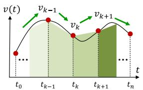  
(a) Classical step-by-step EMTP

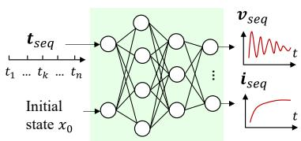  
(b) Learning-based NeuEMTP   
Fig. 1: Illustration of NeuEMTP and its comparison with the classical EMTP

# B. NeuEMTP: A Neural EMTP Methodology

Motivated by the need to resolve existing obstacles in the EMTP computation, we devise NeuEMTP, a learning-based EMTP approach. Denote $\ b { t _ { s e q } } ~ = ~ [ \ b { t _ { 1 } } , \ b { \cdot } \ b { \cdot } \ b { \cdot } , \ b { t _ { n } } ] ~ \in ~ \mathbb { R } ^ { 1 \times n }$ as the time sequence which is desired to perform the EMTP simulation, where $t _ { k } = k \Delta t$ . Without loss of generality, this paper studies impedance networks, whereas the method is universal and can be directly applied to power networks with arbitrary dynamic components. Denote $\pmb { v } _ { s e q } ~ \in ~ \mathbb { R } ^ { n _ { v } \times n }$ and $\mathbf { \Delta } _ { i _ { s e q } } \in \mathbb { R } ^ { n _ { i } \times n }$ as the time-series of unknown nodal voltages and component currents.

As illustrated in Fig. 1(b), in contrast to the classical EMTP, NeuEMTP reads in $t _ { s e q }$ and directly generates the electromagnetic trajectories through the forward propagation of the neural network. Upon this design, the electromagnetic states at all time steps (i.e., $v _ { s e q }$ and $i _ { s e q } )$ will be computed simultaneously, making the intractable step-by-step computation unnecessary.

The following details the NeuEMTP methodology.

1) Unsupervised Learning Architecture of NeuEMTP: The overarching feature of NeuEMTP is that the entire algorithm is achieved under an unsupervised learning architecture, meaning that no EMTP trajectory needs to be generated even for the training purpose. This feature differentiates our method from any existing learning-based power system dynamic analytics.

Under a supervised learning architecture, it is trivial to train a deep neural network (DNN) for replicating arbitrary curves. As depicted in Fig. 2(a), a DNN can be readily optimized by minimizing the mean squared error (MSE) between the training data and the DNN outputs. Nevertheless, supervised learning strongly relies on a sufficiently large training set to guarantee accuracy and avoid overfitting. This requirement, as aforementioned, could be extremely unattainable in the EMTP learning, given that EMTP requires a small simulation time step and therefore, computing and saving massive EMTP results are very challenging and resource-consuming.

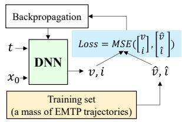  
(a) Conventional supervised ML

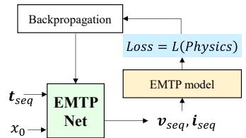  
(b) Unsupervised, physics-informed NeuEMTP   
Fig. 2: Illustration of the unsupervised learning architecture of NeuEMTP and its comparison with conventional supervised ML approaches

This observation motivates the establishment of NeuEMTP as an unsupervised learning-based EMTP approach. Fig. 2(b) summarizes the schematic of NeuEMTP. Kernel ingredients of NeuEMTP include:

(i) An EMTP-oriented-neural-network (EMTPNet) to efficaciously express the highly-oscillating electromagnetic waveforms (see Subsection II-B2).   
(ii) A physics-informed loss function to enforce EMTPNet to comply with the underlying physics laws of EMTP (see Subsection II-B3);

As shown in Fig. 2(b), by fully exploring the EMTP physics to guide the EMTPNet training, NeuEMTP completely exterminates the reliance on the training set, and hence no EMTP simulation is required in the whole procedure.

2) EMTPNet for Electromagnetic Waveform Generation: Power system electromagnetic waveforms normally contain a fundamental-frequency carrier superimposed with highfrequency harmonics. Unfortunately, standard activation functions, such as Sigmoid, Tanh, ReLU and their variants, can hardly learn oscillatory functions, because of the “lack of a periodic inductive bias” [7].

To this end, we design a new activation function, i.e., Act mix, to enable the extrapolation of highly-oscillating electromagnetic waveforms. As illustrated in Fig. 3(b), Act mix is a weighted combination of different activation functionality:

$$
o u t = \alpha_ {1} z + \alpha_ {2} \frac {1}{1 + e ^ {- z}} + \alpha_ {3} \log \left(1 + e ^ {- \beta_ {1} z}\right) \sin^ {2} \left(\beta_ {2} z\right) \tag {4}
$$

Here, $z ~ = ~ \sum w _ { j } i n _ { j } + b$ is a weighted linear summation of the outputs from the previous layer; $\alpha _ { 1 } , \alpha _ { 2 } , \alpha _ { 3 } , \beta _ { 1 } , \beta _ { 2 }$ are parameters of the Act mix activation function. In (4), the first and second terms respectively refer to a linear and nonlinear activation; the third term devises a novel decayed periodical activation, where $\beta _ { 1 }$ and $\beta _ { 2 }$ enables learning different oscillation modes such as damped/undamped/divergent oscillations under arbitrary frequencies. An obvious distinction of Act mix against conventional activation functions is that it is a parameterized activation, which allows for superior expressibility of either oscillating harmonics or overdamped transients.

Leveraging Act mix, the EMTPNet is designed as depicted in Fig. 3(a). Three modules are arranged in the EMTPNet:

(i) An input layer, which reads in $t _ { s e q }$ and variable conditions of the system (i.e., exemplified by initial conditions $x _ { 0 }$ here); (ii) Hidden layers, which employ Act mix at the first layer and standard activation functions at the remainder layers. Specifically, the output of the final hidden layer, i.e., $\pmb { x } _ { s e q } \in \mathbb { R } ^ { n _ { x } \times n }$ , is designated as the independent state variables of the system (e.g., currents of inductances and voltages of capacitances).

(iii) An EMTP layer, which interprets $\pmb { x } _ { s e q }$ into ${ \pmb v } _ { s e q }$ and $\dot { \pmb { \imath } } _ { s e q }$ based on the Kirchhoff’s law of the power network. The reason of introducing the EMTP interpretation layer is to best reduce the redundancy of the hidden layer structure to enhance the training efficiency of EMTPNet.

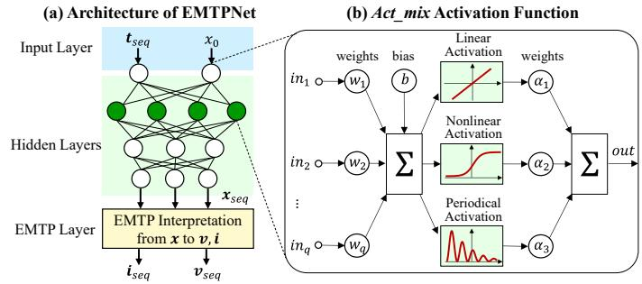  
Fig. 3: Schematic diagram of EMTPNet

3) EMTP-Informed Loss Function: Further, an EMTPinformed loss function is established to guide the unsupervised training of EMTPNet. On the one hand, (2) enables computing the historical currents of each component as:

$$
\boldsymbol {i} _ {h, L, s e q} = - \boldsymbol {g} _ {L} \left(\boldsymbol {N} _ {L, n} \boldsymbol {v} _ {s e q} + \boldsymbol {N} _ {L, s} \boldsymbol {v} _ {s, s e q}\right) - \boldsymbol {N} _ {L} \boldsymbol {i} _ {s e q} \tag {5a}
$$

$$
\boldsymbol {i} _ {h, C, s e q} = \boldsymbol {g} _ {C} \left(\boldsymbol {N} _ {C, n} \boldsymbol {v} _ {s e q} + \boldsymbol {N} _ {C, s} \boldsymbol {v} _ {s, s e q}\right) + \boldsymbol {N} _ {C} \boldsymbol {i} _ {s e q} \tag {5b}
$$

Here, $i _ { h , L , s e q }$ and $i _ { h , C , s e q }$ are the time-series history terms estimated by the EMTPNet’s outputs $\pmb { v } _ { s e q }$ and $i _ { s e q } ; ~ v _ { s , s e q }$ denotes the time-series voltages of power sources; $g _ { L }$ is a diagonal matrix constructed by the equivalent conductance of inductances; $N _ { L , n }$ and $N _ { L , \varepsilon }$ s are respectively the incidence matrices between inductances and non-source/source buses; $N _ { L }$ extracts the inductance currents from $i _ { s e q } ;$ gC , $N _ { C , n } ,$ $N _ { C , s }$ and $N _ { C }$ are analogously defined for capacitances.

On the other hand, (1) enforces the historical currents to satisfy the Ohm’s law of each component:

$$
\Delta \boldsymbol {F} = \left[ \begin{array}{l} \boldsymbol {g} _ {L} \left(N _ {L, n} \boldsymbol {v} _ {s e q} + N _ {L, s} \boldsymbol {v} _ {s, s e q}\right) - N _ {L} \boldsymbol {i} _ {s e q} - \boldsymbol {i} _ {h, L, s e q} \\ \boldsymbol {g} _ {C} \left(N _ {C, n} \boldsymbol {v} _ {s e q} + N _ {C, s} \boldsymbol {v} _ {s, s e q}\right) - N _ {C} \boldsymbol {i} _ {s e q} - \boldsymbol {i} _ {h, C, s e q} \end{array} \right] \tag {6}
$$

Therefore, $\Delta F \in \mathbb { R } ^ { ( n _ { L } + n _ { C } ) \times n }$ assesses the violation level of EMTPNet’s outputs against the EMTP physics laws, i.e., the mismatch between the historical currents obtained from EMTPNet and the historical currents governed by the EMTP physics model. Only if EMTPNet produces the true EMTP results, $\Delta F$ will converge to zero.

Accordingly, a physics-informed EMTP loss function is established as a weighted sum of squares of $\Delta { \pmb F } \colon$

$$
\mathcal {L} = \sum_ {j, k} \left(\lambda_ {j} \Delta F _ {j, k}\right) ^ {2} \tag {7}
$$

where $\lambda _ { j }$ denotes the weight for the j-th dimension.

As a result, by minimizing L, EMTPNet will be enforced to generate time-series trajectories that rigorously conform with the electromagnetic physics laws of the system, which theoretically guarantees the qualification of EMTPNet as an authentic EMTP computation tool.

Again, we emphasize that although ∆F is derived from the discretized EMTP model (1) and (2), it does not perform the step-by-step calculation as classical EMTP solvers do. Instead, $\Delta F$ assesses the EMTP law violation at all time steps simultaneously with the time-series $v _ { s e q }$ and $i _ { s e q } .$ . Therefore, the computation of $\Delta F$ only involves matrix calculations, which can be highly efficient.

4) Overall Procedure of NeuEMTP: Finally, we outlines the overall procedure of NeuEMTP:

(i) Training preparation: EMTP models and parameters of a power system are prepared.   
(ii) EMTPNet training: A randomly-initialized EMTPNet is trained by minimizing L in (7). In this unsupervised procedure, the EMTP-informed loss function and the EMTP layer will invoke the EMTP physics information.   
(iii) Generation of EMTP Trajectories: With a well-trained EMTPNet, the EMTP trajectories are generated through the forward propagation of EMTPNet:

$$
\left[ \begin{array}{l} \boldsymbol {v} _ {\text {s e q}} \\ \boldsymbol {i} _ {\text {s e q}} \end{array} \right] = \mathcal {E} \circ \mathcal {W} _ {L + 1} \circ \mathcal {A} _ {L} \circ \mathcal {W} _ {L} \dots \mathcal {A} _ {1} \circ \mathcal {W} _ {1} (\boldsymbol {t} _ {\text {s e q}}, x _ {0}) \tag {8}
$$

where $\mathcal { E }$ denotes the EMTP interpretation function; Wl and $A _ { l }$ respectively denote the weighted summation and activation functions at the l-th layer.

Equation (8) again evidences that NeuEMTP generates the electromagnetic trajectories at all time steps via a single forward propagation of EMTPNet, in replacement of the step-bystep numerical integration. This peculiarity conforms with our expectancy for NeuEMTP as designed in Fig. 1(b). Meanwhile, the overall NeuEMTP procedure does not rely on any EMT data, which mitigates the efforts for performing the step-bystep EMTP computation.

# III. CASE STUDY

This section verifies the NeuEMTP methodology. A typical Latency circuit is studied, which abstracts the multi-timescale dynamic characteristics of power systems [8]. The NeuEMTP code is developed in Python 3.8.8 with Pytorch 1.10.0. The classical EMTP code is implemented in MATLAB R2021a.

# A. Verification of Act mix

First, we demonstrate the necessity of introducing Act mix as a new type of activation function for learning the periodical waveforms of EMTP. Four test functions are employed, which imitate typical oscillation phenomena in power systems:

• $E x p ( t ) = e ^ { - 3 0 0 t }$ as a non-periodical test.   
• Sin(t)= sin 1000πt as a periodical test.   
• SSin(t)=0.3 sin 1000πt+0.5 sin 400πt+ sin 200πt: a summation of harmonics to imitate the distorted signals.   
• $D S i n ( t ) { = } 2 e ^ { - 2 0 0 t }$ sin 1000πt: a decayed sinusoidal function to imitate the damped oscillations.

Three different neural networks are compared, which share the same architecture but use different activation functions:

• Net with Act mix: which employs Act mix at the first layer and Sigmoid at the second layer.   
• Net with Sigmoid: which employs Sigmoid at both layers.   
• Net with Tanh: which employs Tanh at both layers.

All the three neural networks employ the identical optimizer and training settings. The maximum iteration is set as $2 \times 1 0 ^ { 6 }$ .

Fig. 4 presents the simulation results. It can be observed that Act mix precisely simulates all different oscillations. In contrast, conventional activation functions such as Sigmoid and Tanh only replicate the non-periodical overdampled oscillations (see Fig. 4(a)), but fail to capture the periodical oscillations (see Fig. 4(b)-(d)) within the maximum iteration.

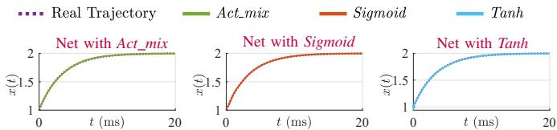  
(a) Exp: an overdamped test

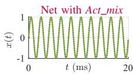

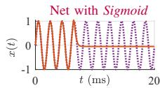

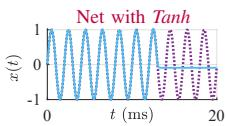  
(b) Sin: an undamped oscillation test

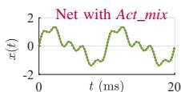

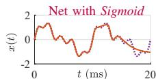

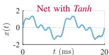  
(c) SSin: a distorted test with harmonics

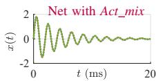

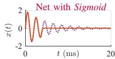

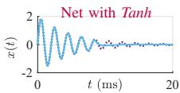  
(d) DSin: a damped oscillation test   
Fig. 4: Efficacy of the Act mix activation function

Further, Fig. 5 illustrates the loss function evolution for each test case using different activation functions. Simulations clearly reveal that while Sigmoid and Tanh could be easily stuck in local minimums and fail to provide meaningful results for the oscillating scenarios even after a huge number of epochs (see the red and blue lines), Act mix swiftly converges for all the scenarios (see the green lines). The reason is that Act mix inherently embeds the power system oscillation characteristics so that a neural network equipped with Act mix can more efficiently and effectively identify the oscillation modes with a reduced neural network scale or within fewer training iterations. The aforementioned discussions verify the necessity of employing Act mix, rather than any other standard activation functions, for the NeuEMTP study.

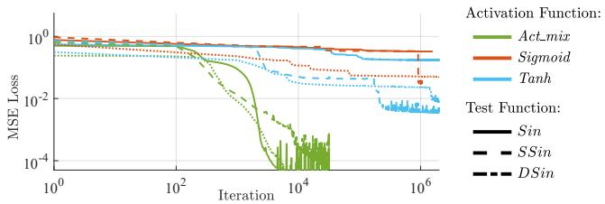  
Fig. 5: Loss function evolution under different activation functions

# B. Verification of NeuEMTP

This subsection verifies the validity of NeuEMTP in terms of accuracy, efficiency and generalization ability. The parameters of the Latency circuit is visualized in Fig. 6. The time step for NeuEMTP and classical EMTP is set as ∆t = 0.2µs.

1) Accuracy of NeuEMTP: As designed in Fig. 3, EMTPNet takes the simulating time sequence as inputs, and outputs the time-series EMTP. A two-layer fully connected EMTPNet is constructed for the Latency circuit, with 10 neurons at the first layer and 20 neurons at the second layer, which involves 374 parameters. Fig. 7 illustrates the training process of NeuEMTP. The EMTPNet training takes 993.08s until convergence. The

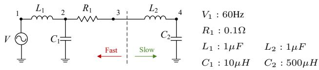  
Fig. 6: Illustration of the Latency circuit

loss function evolution is presented, which indicates the violation level of EMTPNet against the EMTP physics laws as formulated in (6). The fidelity between NeuEMTP and classical EMTP results is also provided. Nevertheless, it should be emphasized that the real EMTP results as well as this fidelity information are never utilized for EMTPNet training. Instead, they only serve as the ground truth to post-evaluate the performance of NeuEMTP. Simulation results in Fig. 7 show that at the starting stage, a randomly-initialized EMTPNet generates large loss value and low fidelity level. Then, the EMTPNet parameters are progressively trained; along with this process the loss function decreases and the fidelity level raises.

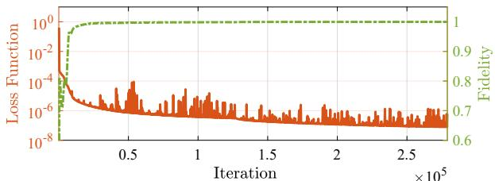  
Fig. 7: Loss function evolution during NeuEMTP training

Consequently, Fig. 8 presents the EMTP results obtained by the optimized EMTPNet. The satisfactory match between the classical EMTP and NeuEMTP trajectories verifies the correctness and effectiveness of NeuEMTP. Fig. 8(b) also investigates whether the NeuEMTP results conform with the EMTP model, which is the kernel indicator for evaluating the convergence of NeuEMTP training. It can be observed that the optimized EMTPNet leads to a negligibly low violation level against EMTP rules, which reveals its inherent consistency with the physics nature of EMTP.

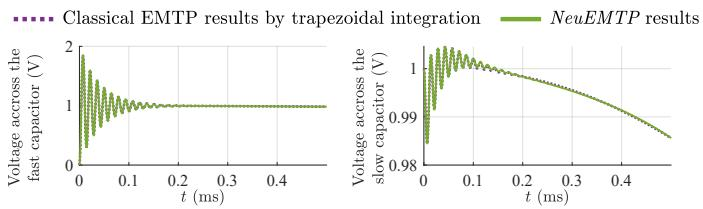

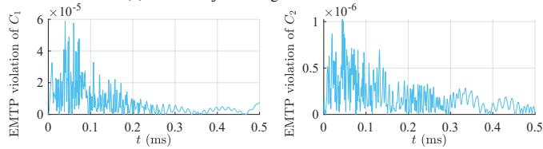  
(a) EMTP trajectories generated from NeuEMTP   
(b) EMTP law violation of the optimized EMTPNet   
Fig. 8: NeuEMTP results and its comparison with classical EMTP

More importantly, the NeuEMTP functionality is realized under an unsupervised architecture, not relying on any prior EMTP simulating data. Therefore, NeuEMTP is completely immune to the onerous step-by-step EMTP computation dur-

ing both training and prediction, which makes this new method superior to any existing learning-based EMTP approaches.

2) Efficiency of NeuEMTP: Another salient feature of NeuEMTP is its superior efficiency. Table I compares the computing time of NeuEMTP and that of classical EMTP. A noteworthy observation is that while the classical EMTP consumes 18.45s for simulating a one-second transient process for the Latency circuit, NeuEMTP only consumes 0.28s, which achieves a speedup for nearly 60 times.

TABLE I: Computational Efficiency of NeuEMTP   

<table><tr><td>Simulating Period</td><td>Classical EMTP by Trapezoidal Integration</td><td>NeuEMTP</td></tr><tr><td>[0, 0.5ms]</td><td>18.9452 ms</td><td>0.2480 ms</td></tr><tr><td>[0, 10ms]</td><td>28.6051 ms</td><td>2.9336 ms</td></tr><tr><td>[0, 1s]</td><td>18.4489 s</td><td>0.2891 s</td></tr><tr><td>[0, 10s]</td><td>179.2356 s</td><td>3.0086 s</td></tr></table>

The rationale behind the super-efficiency of NeuEMTP lies in its simultaneous calculation of the EMTP states at all time steps through a single forward propagation of EMTPNet. Without involving the step-by-step procedure required by the classical EMTP, NeuEMTP significantly accelerates the EMTP computation. Additionally, while the computational complexity of the classical EMTP depends on the scale of the system, the complexity of NeuEMTP is only impacted by the scale of the neural network. Rather, the complexity of NeuEMTP is mainly related to the waveform characteristics which determine how complicated a neural network should be to learn such electromagnetic transients.

3) Generalization Ability of NeuEMTP: Finally, we study the generalization ability of NeuEMTP.

First, the capability of NeuEMTP for generating EMTP trajectories under unknown initial conditions is tested. An EMTPNet is trained with 100 different initial conditions and tested under newly-input initial conditions. Fig. 9 demonstrates that NeuEMTP consistently maintains satisfactory fidelity to trace the ultra-fast electromagnetic transients triggered by untrained initial conditions, which evidences the robustness of NeuEMTP against boundary conditions of EMTP models.

Second, Fig. 10 studies the capability of NeuEMTP for inferring EMTP trajectories beyond the simulating period. An EMTPNet is trained to respect the EMTP physics laws within [0, 0.1ms] and is tested in a moderately longer time period [0, 0.15ms]. Simulation shows that NeuEMTP trajectories not only accurately match the classical EMTP results during the training period (see the green line), but also properly trace the high-frequency oscillations beyond the training period (see the red line). This experiment demonstrates the generalization ability of NeuEMTP from the perspective of inferring future tendencies of EMT in the power grids.

# IV. CONCLUSION

This paper devises NeuEMTP, a learning-based, physicsinformed EMTP approach to tackle power system electromagnetic transients analysis. The most salient features of NeuEMTP include: 1) an unsupervised learning architecture without relying on any prior EMTP simulation data, which significantly saves the effort for generating EMTP training

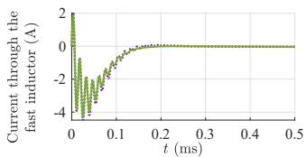  
***· Classical EMTP results by trapezoidal integration NeuEMTPresults

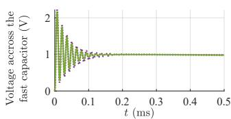

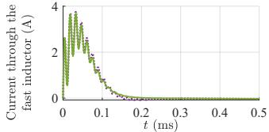  
(a) NeuEMTP results under an initial state vC2,0 = 1.4702V

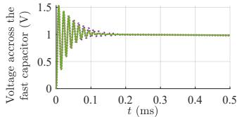  
(b) NeuEMTP results under an initial state vC2,0 = 0.5787V   
Fig. 9: Generalization ability of NeuEMTP for newly-input initial conditions

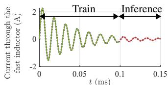  
Classical EMTP results —NeuEMTPResults NeuEMTPInference

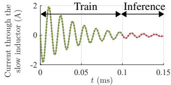

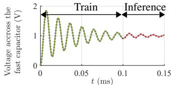

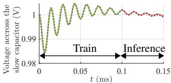  
Fig. 10: Generalization ability of NeuEMTP for future time periods

samples; 2) excellent accuracy and generalization ability by exploiting the underlying EMTP laws behind the electromagnetic waveforms; 3) unprecedented acceleration attributed to the use of EMTPNet for simultaneously generating EMTP states at all time steps rather than performing the step-by-step integration. Case studies in a typical Latency circuit verifies the accuracy, efficiency and efficacy of NeuEMTP. NeuEMTP is a promising accurate, simulation-free electromagnetic computation tool. Our next step is to implement NeuEMTP in large grids and to enable ultra-fast prediction of N-1 contingencies.

# REFERENCES

[1] H. W. Dommel, EMTP theory book. Microtran Power System Analysis Corporation, 1996.   
[2] S. L. Brunton and J. N. Kutz, Data-driven science and engineering: Machine learning, dynamical systems, and control. Cambridge University Press, 2019.   
[3] S. Wen, Y. Wang, Y. Tang, Y. Xu, P. Li, and T. Zhao, “Real-time identification of power fluctuations based on LSTM recurrent neural network: A case study on singapore power system,” IEEE Transactions on Industrial Informatics, vol. 15, no. 9, pp. 5266–5275, 2019.   
[4] M. Raissi, P. Perdikaris, and G. E. Karniadakis, “Physics-informed neural networks: A deep learning framework for solving forward and inverse problems involving nonlinear partial differential equations,” Journal of Computational Physics, vol. 378, pp. 686–707, 2019.   
[5] H. Khazaei and Y. Zhao, “Physics-aware fast learning and inference for predicting active set of DC-OPF,” 2021.   
[6] C. Moya and G. Lin, “DAE-PINN: A physics-informed neural network model for simulating differential-algebraic equations with application to power networks,” arXiv preprint arXiv:2109.04304, 2021.   
[7] Z. Liu, T. Hartwig, and M. Ueda, “Neural networks fail to learn periodic functions and how to fix it.,” in NeurIPS, 2020.   
[8] J. A. Hollman and J. R. Marti, “Step-by-step eigenvalue analysis with emtp discrete-time solutions,” IEEE Transactions on Power Systems, vol. 25, no. 3, pp. 1220–1231, 2010.