# 电力电子变压器电磁暂态并行仿真等效建模方法

孙昱昊，许建中

（新能源电力系统国家重点实验室(华北电力大学)，北京市 昌平区 102206）

# Equivalent Modeling Method of Parallel Electromagnetic Transient Simulation for Power Electronic Transformer

SUN Yuhao, XU Jianzhong

(State Key Laboratory of Alternate Electrical Power System With Renewable Energy Sources

(North China Electric Power University), Changping District, Beijing 102206, China)

ABSTRACT: Power electronic transformer (PET) has the characteristics of modularity, multiple nodes, and high frequency. However, the inefficient electromagnetic transient simulation (EMT) of its detailed model poses an urgent need for simulation acceleration. In this paper, starting from speeding up the model and improving the CPU computation efficiency, an equivalent modeling method of parallel electromagnetic transient simulation for the power electronic transformer is proposed. Taking the cascaded H-bridge type power electronic transformer (CHB-PET) as an example, the theoretical derivation and simulation verification are carried out. Firstly, on the condition that an admittance is fixed, the power module (PM) is divided into circuits of different admittance units. Secondly, from the perspective of the loaded two ports, it is deduced that the H-bridge element contains only 2 equivalent admittances, which can be simplified as a two-value admittance unit. By prestoring the admittance parameters of each unit and calculating the port short-circuit current with the superposition theorem, the PM Norton equivalent circuit parameters are quickly obtained and aggregated to form a CHB-PET serial equivalent model. Finally, a parallel simulation framework is constructed in combination with the high parallelism of the model. Through simulation verification on the PSCAD/EMTDC, the result shows that the model highly fits the detailed model under various working conditions with the maximum error as less than 3%. When the number of the single-phase modules is 48, the optimal parallel equivalent model is able to achieve a simulation speedup over the detailed model by more than 10000 times.

KEY WORDS: power electronic transformer; cascaded H-bridge; admittance unit prestorage; parallel equivalent modelling; multithreaded parallel computing

摘要：电力电子变压器(power electronic transformer，PET)具有模块化、多节点、频率高的特点，其详细模型的电磁暂态仿真(electromagnetic transient，EMT)效率低下，仿真提速需求迫切。从模型自身提速与提高 CPU 计算效率两方面入手，提出了 PET 电磁暂态并行仿真等效建模方法，并以级联 H 桥型 PET(cascaded H-bridge type power electronictransformer，CHB-PET)为例进行了理论推导与仿真验证。首先，以导纳是否可定为标准，将功率模块(power module，PM)划分为不同导纳单元电路的组合；其次，从有载二端口的角度出发，推导出 H 桥单元对外仅含 2 种等效导纳，可简化为二值导纳单元；将各单元的导纳参数预存，利用叠加定理求取端口短路电流，即可快速获取 PM 诺顿等效电路参数，聚合形成CHB-PET串行等效模型；最后，结合该模型的高度并行性构建了并行仿真框架。在 PSCAD/EMTDC 中进行仿真验证，该模型实现了对详细模型的多工况高度拟合，最大误差小于 3%。当单相模块数为 48 时，最佳并行等效模型可实现对详细模型10000多倍的仿真提速。

关键词：电力电子变压器；级联 H 桥型；导纳单元预存； 并行等效建模；多线程并行计算

DOI：10.13335/j.1000-3673.pst.2022.0432

# 0 引言

电力电子变压器(power electronic transformer，PET)因兼具多端口电能汇集与综合功率调控等功能，已逐渐成为大规模交直流混联和新能源并网的关键设备[1-5]。目前国内外针对 PET 的控制器设计、性能优化、样机研发和示范工程建设方兴未艾，总体呈现电压等级、容量不断提高，功率端口与拓扑结构日渐灵活，工作频率不断上升的趋势[6-11]。

为准确反映 PET 高频开关动作引起的瞬态过程，电磁暂态(electromagnetic transient，EMT)仿真已成为辅助样机参数设计、性能测试等方面的重要工具。但是，由于 PET 高矩阵阶数和小仿真步长的特点，基于分立元器件的 EMT 详细仿真模型面临

大量高阶矩阵的重构与求逆运算，仿真效率极低，严重影响了研究效率[5,12]。

针对上述问题，目前已有较多学者开展了关于PET电磁暂态加速仿真方法的研究，主要呈现两大趋势。一方面，着重提高模型自身求解速率，即从数学原理或等效机制出发，提高模型串行解算速率，但在仿真精度制约下，串行速率将趋于极值；另一方面，关注模型的并行性以提高计算机计算效率，最大限度挖掘处理器计算潜力，从而实现仿真提速。

在串行提速方面，文献[13-15]建立了 PET 平均值模型，可实现高速率仿真，但忽略了换流器内部特性，仿真工况受到限制，使得应用场景受限。文献[16]基于 RT-LAB 开发了 PET 纳秒级实时仿真模型，利用 L/C 等效电路模拟电力电子开关获取定导纳模型，但其本质上仍是一种详细模型，需占用大量仿真资源，且仿真时会产生虚拟功率，仿真精度较差。文献[17-19]采用变压器端口解耦思路建立了通用的 PET 串行等效模型，利用嵌套快速同时求解法降低系统节点数，有明显提速效果。但由于导纳不定，消去过程中每步长须进行矩阵求逆更新导纳值，模块数较多时会影响仿真效率。

探 索 并 行 性 方 面 ， 文 献 [20-22] 提 出 基 于Bergeron 线路模型的电气网络接口(electric networkinterface，ENI)技术，实现了不同子系统的并行仿真，但受限于电路结构，该方法仅适用于含传输线网络。文献[23]以 MAB 为例，先建立 PET 单模块串行等效模型，再进行模块间并行提速，但其单模块等效方法与文献[17-19]相同，由于拓扑复杂，每个步长内矩阵求逆次数更多，有较大提速空间。

本文从模型自身提速与提高 CPU 计算效率两方面入手，提出一种 PET 电磁暂态并行仿真等效建模方法，以级联 H 桥型 PET(cascaded H-bridge typepower electronic transformer，CHB-PET)为例进行了理论推导与仿真验证。首先，以导纳是否可定划分功率模块伴随电路，并求取各单元电路导纳参数；预存所有导纳单元参数后，快速获取 PM 诺顿等效电路，聚合后形成 CHB-PET 串行等效模型；最后，结合该模型的高度并行性构建了并行仿真框架，且对并行提速效果进行了仿真验证与分析。

# 功率模块导纳单元建模

# 1.1 导纳单元划分

图 1 为 CHB-PET 系统示意图，其每相由若干功率模块(power module，PM)采用输入侧串联输出

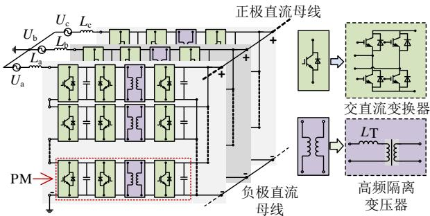  
图 1 CHB-PET 系统示意图  
Fig. 1 Schematic diagram of CHB-PET system

侧并联(input-series-output-parallel，ISOP)方式连接而成。单个 PM 由输入侧的 AC/DC 变换器以及含高频隔离变压器的双有源桥(dual active bridge，DAB)型 DC/DC 变换器组成，可实现 AC-DC-AC-DC 四级电能变换。PM 输出侧可直接接入直流负载，或通过 DC/AC换流器接入交流负载。

# 1.1.1 PM 伴随电路形成

针对上述 PM 电路，可采用文献[17]的方法，对 IGBT-二极管开关组电路采用二值电阻等值，电容元件与 高 频隔 离变 压 器采用梯形积分法(trapezoidal rule，TR)离散化，可得到 PM 伴随电路如图 2 所示，其中的参数由式(1)计算获得。

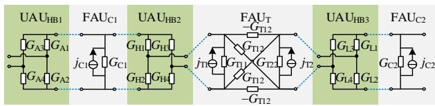  
图 2 PM 伴随电路  
Fig. 2 Companion circuits of PM

$$
\left\{ \begin{array}{l} G _ {\mathrm {C i}} = \frac {2 C _ {i}}{\Delta t}, \quad i = 1, 2 \\ j _ {\mathrm {C i}} = G _ {\mathrm {C i}} u _ {\mathrm {C i}} (t - \Delta t) + i _ {\mathrm {C i}} (t - \Delta t), \quad i = 1, 2 \\ \boldsymbol {G} _ {\mathbf {T}} = \left[ \begin{array}{l l} G _ {\mathrm {T} 1 1} & G _ {\mathrm {T} 1 2} \\ G _ {\mathrm {T} 2 1} & G _ {\mathrm {T} 2 2} \end{array} \right] = \frac {\Delta t}{2} \left[ \begin{array}{c c c} L _ {1} + L _ {\mathrm {T}} + L _ {\mathrm {m}} & L _ {\mathrm {m}} / N \\ L _ {\mathrm {m}} / N & L _ {2} + L _ {\mathrm {m}} / N ^ {2} \end{array} \right] ^ {- 1} \\ \boldsymbol {J} _ {\mathbf {T}} = \left[ \begin{array}{l} j _ {\mathrm {T} 1} \\ j _ {\mathrm {T} 2} \end{array} \right] = \boldsymbol {G} \left[ \begin{array}{l} u _ {\mathrm {T} 1} (t - \Delta t) \\ u _ {\mathrm {T} 2} (t - \Delta t) \end{array} \right] + \left[ \begin{array}{l} i _ {\mathrm {T} 1} (t - \Delta t) \\ i _ {\mathrm {T} 2} (t - \Delta t) \end{array} \right] \end{array} \right.
$$

式中：下标 A、H 和L 分别表示交流侧、直流高压侧和直流低压侧； $\Delta t$ 为仿真步长； $G _ { \mathrm { C } i }$ 与 $j _ { \mathrm { C } i }$ 分别为电容等效导纳与等效历史电流源； $G _ { \mathrm { T 1 1 } }$ 、 $G _ { \mathrm { T } 2 2 } ,$ ， $G _ { \mathrm { T } 1 2 }$ 、$G _ { \mathrm { T } 2 1 }$ 分别为变压器端口的输入导纳、转移导纳； $j _ { \mathrm { T 1 } }$ 、$j _ { \mathrm { T } 2 }$ 为端口等效历史电流源； $L _ { 1 }$ 和 $L _ { 2 }$ 为变压器原、副边漏电感； $L _ { \mathrm { m } }$ 为励磁电感； $L _ { \mathrm { T } }$ 为附加电感。考虑到在系统级仿真中，主要关注变压器正常工作状态下的外特性，且设计时通常会预留足够的饱和余量，可忽略饱和特性与磁滞效应的影响。

# 1.1.2 导纳单元划分

由式(1)可知，在仿真步长、积分方法及变压器

参数确定时，PM 伴随电路中的变压器与电容导纳参数均为定值。然而，由于高频控制信号的施加，开关组导纳具有不确定性。

为分析 PM 伴随电路导纳参数的变化规律，按照导纳参数是否可定，将 PM 网络划分为 6 个子单元，如图 2 所示。其中，灰色部分(电容单元 1、2，高 频隔 离变 压 器单 元)表示定导 纳单 元(fixedadmittance unit，FAU)，绿色部分(H 桥单元 1、2、3) 表 示 不 定 导 纳 单 元 (unfixed admittance unit ，UAU)，下标 HB、C、T 分别表示 H 桥、电容、变压器。

# 1.2 H 桥二值导纳单元推导

二值电阻的引入，使得任意开关组导纳含 2种取值，作用到单个 H桥则含 $2 ^ { 4 } { = } 1 6$ 种组合，对于含3 个 H 桥的 PM 伴随电路，其网络导纳参数含$2 ^ { 4 } { \times } 2 ^ { 4 } { \times } 2 ^ { 4 } { = } 4 0 9 6$ 种组合，这使得 PM 等值电路构建十分复杂。若能减少 UAU 导纳参数变化的可能性，将大大提高模型的解算效率。

本节将从二端口输入导纳的角度出发，推导出H 桥 UAU 对外输入导纳仅含 2 种，可转化为二值导纳单元(two-values admittance unit, TAU)。

# 1.2.1 短路导纳参数矩阵

由于高频隔离变压器的存在，PM 网络满足严格的二端口条件。对于单个 H桥单元，其有载二端口网路如图 3所示。

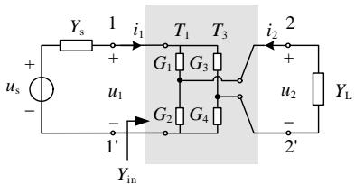  
图3 H桥有载二端口电路  
Fig. 3 Loaded two port circuit of H-bridge

在非闭锁运行状态下，由 CHB 的控制方式可知，PM 的 H 桥单元导通信号满足同桥臂互补，可用控制信号 $T _ { 1 }$ 、 $T _ { 3 }$ 表示全桥单元的导通状态(导通为 1，关断为 0)，如表 1 所示。其中， $G _ { \mathrm { O N } }$ 和 $G _ { \mathrm { O F F } }$ 为 二 值 导 纳 值 ( 导 通 时 取 $G _ { \mathrm { O N } } { = } 1 0 0 \mathrm { S }$ ， 关 断 时$G _ { \mathrm { O F F } } { = } 1 0 ^ { - 6 } \mathrm { S } )$ 。

表1 H桥单元导通状态  
Table 1 Working mode of H-bridge unit   

<table><tr><td rowspan="2">导通信号</td><td colspan="4">开关组导纳取值</td></tr><tr><td>G1</td><td>G2</td><td>G3</td><td>G4</td></tr><tr><td>T1=1, T3=0</td><td>GON</td><td>GOFF</td><td>GOFF</td><td>GON</td></tr><tr><td>T1=0, T3=1</td><td>GOFF</td><td>GON</td><td>GON</td><td>GOFF</td></tr><tr><td>T1=T3=1</td><td>GON</td><td>GOFF</td><td>GON</td><td>GOFF</td></tr><tr><td>T1=T3=0</td><td>GOFF</td><td>GON</td><td>GOFF</td><td>GON</td></tr></table>

在4种导通状态下分别求取H桥单元的短路导纳参数矩阵，其各元素定义如式(2)所示：

$$
\boldsymbol {Y} = \left[ \begin{array}{l l} Y _ {1 1} & Y _ {1 2} \\ Y _ {2 1} & Y _ {2 2} \end{array} \right], Y _ {i j} = \frac {i _ {i}}{u _ {j}} \Bigg | _ {\boldsymbol {u} _ {k = 0, k \neq j}} \tag {2}
$$

式中： $Y _ { 1 1 }$ 、 $Y _ { 2 2 }$ 表示端口的输入导纳； $Y _ { 1 2 }$ 、 $Y _ { 2 1 }$ 表示转移导纳。

1） $T _ { 1 } { \neq } T _ { 3 }$ 时。

该状态下 H 桥任意相邻开关组导通状态互补，短路导纳参数矩阵可表示为

$$
\mathbf {Y} = \left[ \begin{array}{l l} \frac {G _ {\mathrm {O N}} + G _ {\mathrm {O F F}}}{2} & K \frac {G _ {\mathrm {O F F}} - G _ {\mathrm {O N}}}{2} \\ K \frac {G _ {\mathrm {O F F}} - G _ {\mathrm {O N}}}{2} & \frac {G _ {\mathrm {O N}} + G _ {\mathrm {O F F}}}{2} \end{array} \right] \tag {3}
$$

式中 K 表示由 $T _ { 1 }$ 、 $T _ { 3 }$ 控制的符号函数，满足下式：

$$
K = \left\{ \begin{array}{l l} 1, & T _ {1} = 1 \text {且} T _ {3} = 0 \\ - 1, & T _ {1} = 0 \text {且} T _ {3} = 1 \end{array} \right. \tag {4}
$$

2） $T _ { 1 } { = } T _ { 3 }$ 时。

此时 H 桥单元两桥臂同位置的开关组导通状态相同，短路导纳参数矩阵为

$$
\mathbf {Y} = \left[ \begin{array}{c c} \frac {2 G _ {\mathrm {O N}} G _ {\mathrm {O F F}}}{G _ {\mathrm {O N}} + G _ {\mathrm {O F F}}} & 0 \\ 0 & \frac {G _ {\mathrm {O N}} + G _ {\mathrm {O F F}}}{2} \end{array} \right] \tag {5}
$$

由式(3)—(5)可知，H 桥单元的短路导纳参数矩阵均满足 $Y _ { 1 2 } { = } Y _ { 2 1 }$ ，为互易二端口网络。值得注意的是，当 $T _ { 1 } { = } T _ { 3 }$ 时还满足 $Y _ { 1 1 } { = } Y _ { 2 2 }$ ，此时该网络为严格的对称二端口网络，输入输出端口可不加区别，无论从哪个端口观察，其电气性能完全相同。

# 1.2.2 有载二端口输入导纳

为研究 H桥对外的导纳特性，可从输入导纳的角度切入。假设在有载情况下，如图 3 所示，可求取 H桥二端口的输入导纳。

1） $T _ { 1 } { \neq } T _ { 3 }$ 时。

由于对称性，从两个端口观察的输入导纳相等。假设从端口 1、1看，联立端口导纳方程，可求得输入导纳为

$$
Y _ {\mathrm {i n}} = Y _ {1 1} - \frac {Y _ {1 2} Y _ {2 1}}{Y _ {\mathrm {L}} + Y _ {2 2}} =
$$

$$
\frac {G _ {\mathrm {O N}} + G _ {\mathrm {O F F}}}{2} - \frac {K ^ {2} \left(\frac {G _ {\mathrm {O F F}} - G _ {\mathrm {O N}}}{2}\right) ^ {2}}{Y _ {\mathrm {L}} + \frac {G _ {\mathrm {O N}} + G _ {\mathrm {O F F}}}{2}} \tag {6}
$$

式(6)中，满足 $K ^ { 2 } { = } 1$ ，当负载 $Y _ { \mathrm { L } }$ 为定值时，输入导纳 $Y _ { \mathrm { i n } }$ 也必为定值。因此，当 $T _ { 1 } { = } T _ { 3 }$ 时，无论从哪个端口看，H 桥单元对外的等效导纳均为定值。

2） $T _ { 1 } { = } T _ { 3 }$ 时。

类似式(6)可求得两端口的输入导纳分别如下：从端口 1、1看，则

$$
Y _ {\text {i n}} = Y _ {1 1} - \frac {Y _ {1 2} Y _ {2 1}}{Y _ {\mathrm {L}} + Y _ {2 2}} = \frac {2 G _ {\mathrm {O N}} G _ {\mathrm {O F F}}}{G _ {\mathrm {O N}} + G _ {\mathrm {O F F}}} = Y _ {1 1} \tag {7}
$$

从端口 2、2看，则

$$
Y _ {\text {i n}} = Y _ {2 2} - \frac {Y _ {1 2} Y _ {2 1}}{Y _ {\mathrm {L}} + Y _ {1 1}} = \frac {G _ {\mathrm {O N}} + G _ {\mathrm {O F F}}}{2} = Y _ {2 2} \tag {8}
$$

由于转移导纳 $Y _ { 1 2 } { = } Y _ { 2 1 } { = } 0$ ，两个端口彼此独立，此时，H桥单元表现为两个单端口电路，端口导纳值唯一确定，分别为 $Y _ { 1 1 }$ 、 $Y _ { 2 2 }$ 。

经过上述证明可得，在考虑控制方式后，无论从哪个端口观察，H桥对外表现出的输入导纳仅含2 种情况，具体计算值整理为表 2所示。

表2 H桥单元输入导纳  
Table 2 Input admittance of H-bridge   

<table><tr><td rowspan="2">观察端口</td><td colspan="2">导通状态</td></tr><tr><td>T1≠T3</td><td>T1=T3</td></tr><tr><td>端口</td><td>YHin-1=YL(GON+GOFF)+2GONGOFF</td><td rowspan="2">YHin-2=2GONGOFF</td></tr><tr><td>1、1&#x27;</td><td>2YL+GON+GOFF</td></tr><tr><td>端口</td><td>YHin-1=YL(GON+GOFF)+2GONGOFF</td><td>YHin-3=GON+GOFF</td></tr><tr><td>2、2&#x27;</td><td>2YL+GON+GOFF</td><td>2</td></tr></table>

当 $Y _ { \mathrm { L } }$ 为定值时， $Y _ { \mathrm { i n - 1 } } ^ { \mathrm { H } }$ 、 $Y _ { \mathrm { i n } - 2 } ^ { \mathrm { H } }$ 、 HY $Y _ { \mathrm { i n - 3 } } ^ { \mathrm { H } }$ in-3 均为常数。

综上，H 桥时变导纳单元已简化为对外仅含 2种导纳参数的 TAU，这大幅降低了 PM 网络导纳参数变化的可能性，为 CHB-PET 等值电路的形成提供了便利。

# 2 CHB-PET 串行等效模型

将上述 FAU、TAU 所有导纳参数预先计算后存储，本文将给出 CHB-PET 串行等效模型的快速建立方法。

考虑到CHB-PET采用ISOP的连接方式，为了使模块间等值电路的聚合更加便捷，本文采用文献[17]所提算法，对高频隔离变压器端口电压进行单步长约等，将式(1)中 $G _ { \mathrm { T } 1 2 }$ 、 $G _ { \mathrm { T } 2 1 }$ 的贡献转移到等效历史电流源中，实现变压器原副边电气解耦，此时变压器等效参数表达式为

$$
\left\{ \begin{array}{l} \boldsymbol {G} _ {\mathbf {T}} ^ {\prime} = \left[ \begin{array}{c c} G _ {\mathrm {T} 1 1} & 0 \\ 0 & G _ {\mathrm {T} 2 2} \end{array} \right] \\ \boldsymbol {J} _ {\mathbf {T}} ^ {\prime} = \left[ \begin{array}{l} j _ {\mathrm {T} 1 1} \\ j _ {\mathrm {T} 2 2} \end{array} \right] = \left[ \begin{array}{l l} G _ {\mathrm {T} 1 1} & 2 G _ {\mathrm {T} 1 2} \\ 2 G _ {\mathrm {T} 2 1} & G _ {\mathrm {T} 2 2} \end{array} \right] \left[ \begin{array}{l} u _ {\mathrm {T} 1} (t - \Delta t) \\ u _ {\mathrm {T} 2} (t - \Delta t) \end{array} \right] + \left[ \begin{array}{l} i _ {\mathrm {T} 1} (t - \Delta t) \\ i _ {\mathrm {T} 2} (t - \Delta t) \end{array} \right] \end{array} \right. \tag {9}
$$

PM 中 DAB 的工作频率为 1~10kHz，为了保证移相控制精度，其仿真步长一般小于 10μs，因此采用小步长约等不会对仿真精度产生显著影响，该结论已在文献[18]中得到验证。

此时 PM 伴随电路可由图 4(a)表示，变压器高低压侧解耦为 2 个诺顿电路，分别与各侧 H 桥单元相连。PM 网络则被分割为 2 个单端口电路，仅由FAU与 TAU 构成，导纳参数均确定且有限。

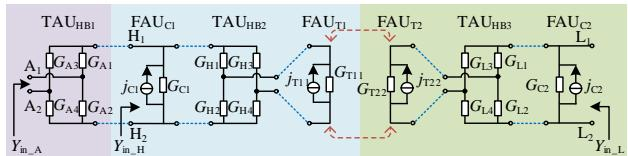

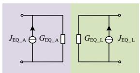  
(a) PM解耦伴随电路   
(b) PM诺顿等效电路  
图4 PM解耦伴随电路及等效电路  
Fig. 4 Decoupled companion circuits and equivalent circuit of PM

# 2.1 PM 诺顿等效电路构建

对于任意线性含源单端口电路，一定能表示为诺顿等效电路的形式，因此，图4(a)电路可用图 4(b)所示的 2个诺顿电路等效。本节将利用预存的导纳单元参数，给出 PM 诺顿电路等效导纳与等效电流源的快速求取方法。

# 2.1.1 等效导纳

将图 4(a)中所有历史源置零，从端口 $\mathrm { H } _ { 1 }$ 、 $\mathrm { H } _ { 2 }$ 看入，表现为电容支路与带载 H 桥并联的形式，查表 2可直接求取其输入导纳 $Y _ { \mathrm { i n \_ H } }$ ，同理，可求得端口 $\mathrm { L } _ { 1 }$ 、 $\mathrm { L } _ { 2 }$ 的输入导纳 $Y _ { \mathrm { i n \_ I } }$ ，如式(10)所示：

$$
\left\{ \begin{array}{l} Y _ {\text {i n} - \mathrm {H}} = \left\{ \begin{array}{l l} \frac {G _ {\mathrm {T} 1 1} \left(G _ {\mathrm {O N}} + G _ {\mathrm {O F F}}\right) + 2 G _ {\mathrm {O N}} G _ {\mathrm {O F F}}}{2 G _ {\mathrm {T} 1 1} + G _ {\mathrm {O N}} + G _ {\mathrm {O F F}}} + G _ {\mathrm {C} 1}, & T _ {\mathrm {H} 1} \neq T _ {\mathrm {H} 3} \\ \frac {2 G _ {\mathrm {O N}} G _ {\mathrm {O F F}}}{G _ {\mathrm {O N}} + G _ {\mathrm {O F F}}} + G _ {\mathrm {C} 1}, & T _ {\mathrm {H} 1} = T _ {\mathrm {H} 3} \end{array} \right. \\ Y _ {\text {i n} - \mathrm {L}} = \left\{ \begin{array}{l l} \frac {G _ {\mathrm {T} 2 2} \left(G _ {\mathrm {O N}} + G _ {\mathrm {O F F}}\right) + 2 G _ {\mathrm {O N}} G _ {\mathrm {O F F}}}{2 G _ {\mathrm {T} 2 2} + G _ {\mathrm {O N}} + G _ {\mathrm {O F F}}} + G _ {\mathrm {C} 2}, & T _ {\mathrm {L} 1} \neq T _ {\mathrm {L} 3} \\ \frac {2 G _ {\mathrm {O N}} G _ {\mathrm {O F F}}}{G _ {\mathrm {O N}} + G _ {\mathrm {O F F}}} + G _ {\mathrm {C} 2}, & T _ {\mathrm {L} 1} = T _ {\mathrm {L} 3} \end{array} \right. \end{array} \right. \tag {10}
$$

式中： $T _ { \mathrm { H 1 } }$ 、 $T _ { \mathrm { H 3 } }$ 为 H 桥单元 2 的控制信号； $T _ { \mathrm { L 1 } }$ 、$T _ { \mathrm { L } 3 }$ 为 H 桥单元 3 的控制信号。

从端口 $\mathbf { A } _ { 1 } , \mathbf { A } _ { 2 }$ 看入，仍表现为 H 桥带载形式，结合表 2 与式(10)可进一步求取 PM 输入侧端口输入导纳：

$$
Y _ {\text {i n} \mathrm {A}} = \left\{ \begin{array}{l l} \frac {Y _ {\text {i n} \mathrm {H}} \left(G _ {\mathrm {O N}} + G _ {\mathrm {O F F}}\right) + 2 G _ {\mathrm {O N}} G _ {\mathrm {O F F}}}{2 Y _ {\text {i n} \mathrm {H}} + G _ {\mathrm {O N}} + G _ {\mathrm {O F F}}}, & T _ {\mathrm {A} 1} \neq T _ {\mathrm {A} 3} \\ \frac {G _ {\mathrm {O N}} + G _ {\mathrm {O F F}}}{2}, & T _ {\mathrm {A} 1} = T _ {\mathrm {A} 3} \end{array} \right. \tag {11}
$$

式中 $T _ { \mathrm { A 1 } }$ 、 $T _ { \mathrm { A } 3 }$ 为 H桥单元 1的控制信号。

PM 输入、输出侧诺顿等效导纳 $G _ { \mathrm { E Q \_ A } } \setminus \ G _ { \mathrm { E Q \_ L } }$ 即两端口的输入导纳：

$$
\left\{ \begin{array}{l} G _ {\mathrm {E Q} _ {-} \mathrm {A}} = Y _ {\mathrm {i n} _ {-} \mathrm {A}} \\ G _ {\mathrm {E Q} _ {-} \mathrm {L}} = Y _ {\mathrm {i n} _ {-} \mathrm {L}} \end{array} \right. \tag {12}
$$

# 2.1.2 等效电流源

等效电流源的取值即端口短路电流值，取流入端口为正，PM 输入、输出侧的端口短路电流 $i _ { \mathrm { s c } _ { \perp } \mathrm { A } }$ 、$i _ { \mathrm { s c } _ { \perp } }$ 求取过程如图 5 所示。

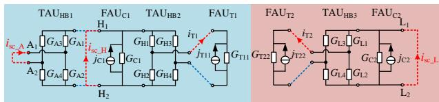  
图5 PM端口短路电流  
Fig. 5 Short-circuit current of PM port

由式(2)可知，当 H 桥单元 $\mathrm { T A U } _ { \mathrm { H B } 2 }$ 、 $\mathrm { T A U } _ { \mathrm { H B } 3 }$ 外端口短路时，其对变压器单元 $\mathrm { F A U } _ { \mathrm { T 1 } }$ 、 $\mathrm { F A U } _ { \mathrm { T } 2 }$ 的作用均表现为输入导纳 $Y _ { 2 2 }$ ，此时有：

$$
Y _ {2 2} = \frac {- i _ {\mathrm {T} 1}}{u _ {\mathrm {T} 1}} = \frac {- i _ {\mathrm {T} 2}}{u _ {\mathrm {T} 2}} = \frac {G _ {\mathrm {O N}} + G _ {\mathrm {O F F}}}{2} \tag {13}
$$

变压器 $\mathrm { F A U } _ { \mathrm { T 1 } }$ 、 $\mathrm { F A U } _ { \mathrm { T } 2 }$ 端口满足：

$$
\left\{ \begin{array}{l} i _ {\mathrm {T} 1} = G _ {\mathrm {T} 1 1} u _ {\mathrm {T} 1} + j _ {\mathrm {T} 1 1} \\ i _ {\mathrm {T} 2} = G _ {\mathrm {T} 2 2} u _ {\mathrm {T} 2} + j _ {\mathrm {T} 2 2} \end{array} \right. \tag {14}
$$

联立式(13)(14)，可解出 $i _ { \mathrm { T 1 } }$ 、iT2：

$$
\left\{ \begin{array}{l} {\left[ \begin{array}{l} u _ {\mathrm {T} 1} \\ u _ {\mathrm {T} 2} \end{array} \right] = D _ {1} \left[ \begin{array}{l} j _ {\mathrm {T} 1 1} \\ j _ {\mathrm {T} 2 2} \end{array} \right]} \\ {\left[ \begin{array}{l} i _ {\mathrm {T} 1} \\ i _ {\mathrm {T} 2} \end{array} \right] = - Y _ {2 2} D _ {1} \left[ \begin{array}{l} j _ {\mathrm {T} 1 1} \\ j _ {\mathrm {T} 2 2} \end{array} \right]} \\ D _ {1} = - \left[ \begin{array}{c c} 1 / \left(G _ {1 1} + Y _ {2 2}\right) & 0 \\ 0 & 1 / \left(G _ {2 2} + Y _ {2 2}\right) \end{array} \right] \end{array} \right. \tag {15}
$$

对图 5 中 $\mathrm { H } _ { 1 }$ 、 $\mathrm { H } _ { 2 }$ 端口列写 KVL可解得端口短路电流 $i _ { \mathrm { s c \_ H } } \mathrm { : }$ ：

$$
i _ {\mathrm {s c} \_ \mathrm {H}} = K _ {\mathrm {H}} \frac {G _ {\mathrm {O F F}} - G _ {\mathrm {O N}}}{G _ {\mathrm {O N}} + G _ {\mathrm {O F F}}} i _ {\mathrm {T 1}} - j _ {\mathrm {C 1}} \tag {16}
$$

其中：

$$
K _ {\mathrm {H}} = \left\{ \begin{array}{l l} 0, & T _ {\mathrm {H} 1} = T _ {\mathrm {H} 3} \\ 1, & T _ {\mathrm {H} 1} = 1 \text {且} T _ {\mathrm {H} 1} \neq T _ {\mathrm {H} 3} \\ - 1, & T _ {\mathrm {H} 1} = 0 \text {且} T _ {\mathrm {H} 1} \neq T _ {\mathrm {H} 3} \end{array} \right. \tag {17}
$$

对于端口 $\mathrm { L } _ { 1 } .$ 、 $_ { \mathrm { L } _ { 2 } , }$ ，同理可得：

$$
\left\{ \begin{array}{l} i _ {\mathrm {s c} - \mathrm {L}} = K _ {\mathrm {L}} \frac {G _ {\mathrm {O F F}} - G _ {\mathrm {O N}}}{G _ {\mathrm {O N}} + G _ {\mathrm {O F F}}} i _ {\mathrm {T 2}} - j _ {\mathrm {C 2}} \\ K _ {\mathrm {L}} = \left\{ \begin{array}{l l} 0, & T _ {\mathrm {L 1}} = T _ {\mathrm {L 3}} \\ 1, & T _ {\mathrm {H 1}} = 1 \text {且} T _ {\mathrm {L 1}} \neq T _ {\mathrm {L 3}} \\ - 1, & T _ {\mathrm {L 1}} = 0 \text {且} T _ {\mathrm {L 1}} \neq T _ {\mathrm {L 3}} \end{array} \right. \end{array} \right. \tag {18}
$$

继续对 $\mathrm { T A U } _ { \mathrm { H B 1 } }$ 列写 KVL，可求得 PM 输入侧

端口短路电流：

$$
\left\{ \begin{array}{l} i _ {\mathrm {s c} - \mathrm {A}} = K _ {\mathrm {A}} \frac {G _ {\mathrm {O N}} + G _ {\mathrm {O F F}}}{G _ {\mathrm {O F F}} - G _ {\mathrm {O N}}} i _ {\mathrm {s c} - \mathrm {H}} \\ K _ {\mathrm {A}} = \left\{ \begin{array}{l l} 0, & T _ {\mathrm {A} 1} = T _ {\mathrm {A} 3} \\ 1, & T _ {\mathrm {A} 1} = 1 \text {且} T _ {\mathrm {A} 3} = 0 \\ - 1, & T _ {\mathrm {A} 1} = 0 \text {且} T _ {\mathrm {A} 3} = 1 \end{array} \right. \end{array} \right. \tag {19}
$$

综合式(16)—(19)，PM输入、输出侧端口短路电流可整理为

$$
\left\{ \begin{array}{l} {\left[ \begin{array}{l} i _ {\mathrm {s c} - \mathrm {A}} \\ i _ {\mathrm {s c} - \mathrm {L}} \end{array} \right] = D _ {2} \left[ - \left[ \begin{array}{l} j _ {\mathrm {C} 1} \\ j _ {\mathrm {C} 2} \end{array} \right] - \left[ \begin{array}{c c} K _ {\mathrm {H}} & 0 \\ 0 & K _ {\mathrm {L}} \end{array} \right] M Y _ {2 2} D _ {1} \left[ \begin{array}{l} j _ {\mathrm {T} 1 1} \\ j _ {\mathrm {T} 2 2} \end{array} \right] \right]} \\ D _ {2} = \left[ \begin{array}{c c} K _ {\mathrm {A}} / M & 0 \\ 0 & 1 \end{array} \right] \\ M = \frac {G _ {\mathrm {O F F}} - G _ {\mathrm {O N}}}{G _ {\mathrm {O N}} + G _ {\mathrm {O F F}}} \end{array} \right. \tag {20}
$$

PM 网络的诺顿等效电流源为

$$
\left\{ \begin{array}{l} J _ {\mathrm {E Q} - \mathrm {A}} = i _ {\mathrm {s c} - \mathrm {A}} \\ J _ {\mathrm {E Q} - \mathrm {L}} = i _ {\mathrm {s c} - \mathrm {L}} \end{array} \right. \tag {21}
$$

综上，图 4(b)所示的 PM 诺顿等效电路，其参数可由式(12)(21)获得，仅包含符号函数与少量常数，极大地简化了计算。

# 2.2 CHB-PET 等效模型形成与反解

# 2.2.1 CHB-PET 等效模型形成

图 1 所示的 CHB-PET 采用 ISOP 型连接方式，为便于级联的实现，将 PM 输入侧诺顿等效电路转化为戴维南等效电路，并将参数写为标准符号，此时等效电路可由附录图 A1(a)电路表示，其中$r _ { \mathrm { e q 1 } } { = } 1 / G _ { \mathrm { E Q \_ A } } , g _ { \mathrm { e q 2 } } { = } G _ { \mathrm { E Q \_ I } }$ ，等效电源的计算表达式为

$$
\left\{ \begin{array}{l} u _ {\mathrm {e q} 1} = - G _ {\mathrm {E Q} _ {-} \mathrm {A}} J _ {\mathrm {E Q} _ {-} \mathrm {A}} \\ j _ {\mathrm {e q} 2} = - J _ {\mathrm {E Q} _ {-} \mathrm {L}} \end{array} \right. \tag {22}
$$

进一步对串并联侧参数求和，可得 CHB-PET系统的等效模型及参数如附录图 A1(b)和式(23)所示。

$$
\left\{ \begin{array}{l} r _ {\mathrm {e q} 1} ^ {\text {t o t}} = \sum_ {i = 1} ^ {N} r _ {\mathrm {e q} 1} ^ {i} \\ u _ {\mathrm {e q} 1} ^ {\text {t o t}} = \sum_ {i = 1} ^ {N} u _ {\mathrm {e q} 1} ^ {i} \\ g _ {\mathrm {e q} 2} ^ {\text {t o t}} = \sum_ {i = 1} ^ {N} g _ {\mathrm {e q} 2} ^ {i} \\ j _ {\mathrm {e q} 2} ^ {\text {t o t}} = \sum_ {i = 1} ^ {N} j _ {\mathrm {e q} 2} ^ {i} \end{array} \right. \tag {23}
$$

式中：N 为 CHB-PET 模块数； $r _ { \mathrm { e q 1 } } ^ { \mathrm { t o t } } \setminus u _ { \mathrm { e q 1 } } ^ { \mathrm { t o t } } \setminus g _ { \mathrm { e q 2 } } ^ { \mathrm { t o t } }$ t2 和 toteq2j ;tot $j _ { \mathrm { e q 2 } } ^ { \mathrm { t o t } }$ 分别为 CHB-PET 输入侧与输出侧等效参数。

# 2.2.2 内部电气信息反解

EMT解算结束之后，可获取 CHB-PET 系统等

值模型端口电气量。为体现模块内部特性，同时更新等效历史源，准备下一步长迭代计算，需要对CHB-PET内部电气信息进行反解。

# 1）PM 外端口电压反解。

PM 按照输入串联、输出并联的形式级联，其输入侧电流、输出侧电压与 CHB-PET 端口一致，因此，PM 端口电压 $\pmb { u } _ { \mathrm { P } } { = } [ u _ { \mathrm { I N } } , ~ u _ { \mathrm { O U T } } ] ^ { \mathrm { T } }$ 可表达为

$$
\boldsymbol {u} _ {\mathrm {p}} = \left[ \begin{array}{l l} r _ {\mathrm {e q 1}} ^ {i} & 0 \\ 0 & 1 \end{array} \right] \left[ \begin{array}{l} i _ {\mathrm {I N} - \mathrm {S}} \\ u _ {\mathrm {O U T} - \mathrm {S}} \end{array} \right] + \left[ \begin{array}{c} - u _ {\mathrm {e q 1}} ^ {i} \\ 0 \end{array} \right] \tag {24}
$$

式中 $i _ { \mathrm { I N } \_ S \setminus u _ { \mathrm { O U T } \_ S } }$ 为CHB-PET输入电流与输出电压。

# 2）PM 变压器端口电压反解。

变压器端口电压 $\pmb { u } _ { \mathrm { T } } { = } [ u _ { \mathrm { T 1 } } , \quad u _ { \mathrm { T 2 } } ] ^ { \mathrm { T } }$ 由电容电压$\pmb { u } _ { \mathrm { C } } { = } [ u _ { \mathrm { C 1 } } , ~ u _ { \mathrm { C 2 } } ] ^ { \mathrm { T } }$ 与变压器历史源 ${ j _ { \mathrm { T } } } \mathrm { { = } } [ j _ { \mathrm { T 1 1 } } , \ j _ { \mathrm { T 2 2 } } ] ^ { \mathrm { T } }$ 共同作用产生，可用叠加定理分析。

仅考虑 $j _ { \mathrm { T } }$ 作用时，由式(15)可知：

$$
\boldsymbol {u} _ {\mathrm {T}} = \boldsymbol {D} _ {1} \boldsymbol {j} _ {\mathrm {T}} \tag {25}
$$

仅考虑 $\pmb { u } _ { \mathrm { { C } } }$ 作用时，首先利用PM端口电压求得 $\pmb { u } _ { \mathrm { { C } } } \mathbf { : }$

$$
\boldsymbol {u} _ {\mathrm {C}} = \left[ \begin{array}{c c} K _ {\mathrm {A}} / M & 0 \\ 0 & 1 \end{array} \right] \boldsymbol {u} _ {\mathrm {P}} \tag {26}
$$

式中 $K _ { \mathrm { A } }$ 、M 可由式(19)(20)获得。

由 $\pmb { u } _ { \mathrm { { C } } }$ 作用产生的变压器端口电压为

$$
\boldsymbol {u} _ {\mathrm {T}} = M \left[ \begin{array}{c c} K _ {\mathrm {H}} & 0 \\ 0 & K _ {\mathrm {L}} \end{array} \right] \boldsymbol {u} _ {\mathrm {C}} \tag {27}
$$

综合考虑式(25)—(27)，由叠加可得变压器端口电压为

$$
\left\{ \begin{array}{l} \boldsymbol {u} _ {\mathrm {T}} = \boldsymbol {D} _ {1} \boldsymbol {j} _ {\mathrm {T}} + \boldsymbol {D} _ {3} \boldsymbol {u} _ {\mathrm {p}} \\ \boldsymbol {D} _ {3} = M \left[ \begin{array}{c c} K _ {\mathrm {H}} & 0 \\ 0 & K _ {\mathrm {L}} \end{array} \right] \left[ \begin{array}{c c} K _ {\mathrm {A}} / M & 0 \\ 0 & 1 \end{array} \right] \end{array} \right. \tag {28}
$$

综上，CHB-PET 的串行等效模型已形成。得益于预存的导纳单元参数，CHB-PET 模型解算可由简单的代数运算完成，仅包含符号函数与少量常数。该方法借鉴了 L/C 定导纳法的思路，最大限度固定 PET 单元电路导纳参数，既规避了传统“二值电阻”法因开关时变导致矩阵更新求逆，造成仿真效率低下的问题，在算法上也保证了较高的精度，在仿真速率与精度间取得了平衡。

# 2.3 模型适用性分析

本文所提的等效建模方法适用于含隔离变压器的级联型 PET 拓扑，如 DAB、多有源桥(multipleactive bridge，MAB)型 PET，以及其他全控型变换器的电磁暂态仿真。与 CHB-PET 相比，DAB的拓扑更为简单，其等效方法已在上文中囊括，MAB中的高频变压器由双绕组变为多绕组，但其研究思路与 CHB-PET 基本一致，本文所提模型同样适用。

然而，针对如单有源桥(single active bridge，SAB)等非全控型 PET 的仿真，由于存在二极管电路，无法直接等效为二值电阻[24]，阻碍了定导纳单元的形成。针对该问题，可采用文献[19]中提出的基于电流过零点预计算的方法，其核心思想如附录图 A2所示。通过分析 SAB 的工作模式，可得到不控整流桥电流的表达式，凭借电流过零点预计算，即可生成二极管的虚拟触发信号，使得二极管也可等效为二值电阻，本文所提的等效算法同样适用。

# 3 基于OpenMP 的并行仿真框架

OpenMP 是一套基于共享内存实现并行系统的多线程程序设计方案[25]，其采用“fork-join”架构，支持 C、C++和 Fortran 编程语言，适合在多核 CPU计算机上完成并行程序设计。附录图 A3 为经典的OpenMP 代码段，起到标记并行程序块的作用。其中，主要包含 3 个要素，即为编译器提供辨识标注功能的编译指导语句(!$OMP PARALLEL、!$OMPDO 等)、进行并行程序控制及优化的库函数(OMP_SET_NUM_THREADS()等)，以及支持库函数具体执行的环境变量(在并行区域内派生线程的数量 N 等)[26]。

本文将在第2节所提串行等效模型的基础上，结合OpenMP并行技术，构建CHB-PET并行仿真框架。

# 3.1 并行仿真框架

# 3.1.1 并行性分析

2.1 节“PM诺顿等效电路构建”中，PET 各模块结构完全相同，PM 等效导纳与历史源的值仅取决于该模块控制信号，各模块间等效参数的计算子函数互相独立，天然具有高度的并行性。  
2.2.1 节“CHB-PET 等效模型形成”包含对各模块等效参数的求和运算，可以待各模块并行计算结束后，统一串行累加得到。  
2.2.2 节“内部电气信息反解”中，需要考虑EMT解算后各模块端口之间的串并联关系，利用式(24)可以解开各模块端口电压之间的关联，使得各模块间无数据牵连，满足并行要求。

综上，“PM诺顿等效电路构建”与“内部电气信息反解”可放入并行体中，实现各模块独立解算；CHB-PET系统模型生成与 EMT 解算，则仍采用串行处理。

# 3.1.2 并行仿真流程

结合 OpenMP 的调用规则，及 PSCAD 自定义元件 Begin、Dsdyn 和 Dsout 代码段的使用方法，CHB-PET等效模型并行仿真流程可由图 6表示。

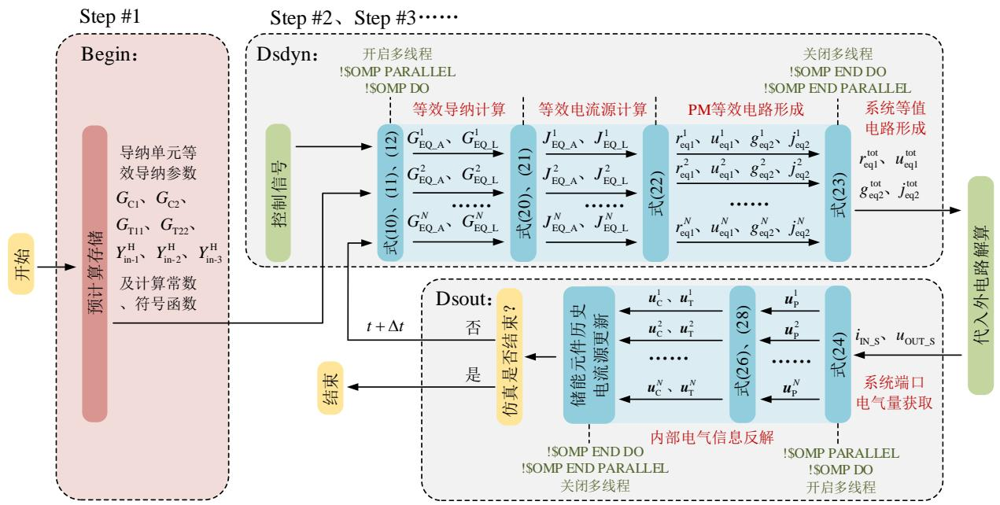  
图 6 CHB-PET 等效模型并行仿真流程  
Fig. 6 Parallel simulation process of CHB-PET equivalent model

# 1）预计算存储。

Begin 代码段负责完成各导纳单元等效导纳参数的计算，计算结果与仿真所需计算常数、符号函数一并存入寄存器中，供仿真时使用。值得注意的是，Begin 段计算代码只在仿真开始后第 1 个步长(Step#1)执行，之后各仿真步长可直接从寄存器中读取计算结果。

# 2）等效模型形成。

CHB-PET 等效模型的形成过程在 Dsdyn 代码段中实现。在读取控制信号、预存常数和储能元件历史电流源后，使用!$OMP PARALLEL !$OMP DO和!$OMP END DO !$OMP END PARALLEL指令约束 PM 等值电路求取的串行代码，即可实现多模块等值电路的并行计算。待所有模块并行计算完毕，利用式(23)对模块等效参数进行串行累加，即可获取 CHB-PET 系统等效电路参数。需注意的是，为避免各线程计算对求和变量的数据竞争，需要使用OpenMP 提供的 REDUCTION 字句对式(23)中 $r _ { \mathrm { e q 1 } } ^ { \mathrm { t o t } }$ 、toteq1u 、 toteq2g 、 toteq2j 进行规约操作。 $u _ { \mathrm { e q 1 } } ^ { \mathrm { t o t } }$ $g _ { \mathrm { e q 2 } } ^ { \mathrm { t o t } }$ $j _ { \mathrm { e q 2 } } ^ { \mathrm { t o t } }$

# 3）内部电气信息反解。

Dsout 代码段负责进行内部电气信息反解。系统等效模型代入外电路解算后，完成端口电气量更新，此时利用 OpenMP 指令开启多线程，待各模块内部电气信息反解完毕后，关闭多余线程，并将数据信号输出，进入下一步长解算。

综上，在 PSCAD 自定义元件中，利用 Fortran编写 PET 等效模型串行程序后，按照上述规则调用OpenMP 指令，即可生成并行仿真程序。

# 3.2 并行效果理论分析

针对不同的模型和仿真条件，并行效果有所不同。为衡量并行提速效果，利用并行加速比(parallelspeed factor，PSF)指标来判定：

$$
\mathrm {P S F} = T _ {\mathrm {S}} / T _ {\mathrm {P}} \tag {29}
$$

式中 $T _ { \mathrm { { S } } }$ 、 $T _ { \mathrm { P } }$ 分别为串行与并行模型的仿真用时，受如下因素影响。

固定仿真开销 $T _ { \mathrm { { f } } } { \mathrm { { : } } }$ ：仿真的单步长内需经过画图、控制、EMT 解算的环节，这部分的仿真用时为固定仿真开销，串、并行仿真都需考虑。

模块数 $N _ { \mathrm { P M } } { \bf : \Lambda }$ ：模块数增加，串、并行仿真用时均会增加，且串行的仿真用时增速明显大于并行。

单模块解算用时 $T _ { \mathrm { P M } }$ (等效模型形成与反解总用时)：由于 PET 模块数较多，该因素对仿真时长的影响也较为显著。

以上因素均影响着 $T _ { \mathrm { { S } } }$ 和 $T _ { \mathrm { P } }$ ，针对并行仿真用时 $T _ { \mathrm { P } }$ ，还需考虑以下因素。

开启线程数 $N _ { \mathrm { { T } } } \colon$ ：并行仿真时 $N _ { \mathrm { T } }$ 根据 CPU 可开启线程数 $N _ { \mathrm { c o r e } }$ 和仿真需要人为选取。一方面，为了优化并行效果，需满足 $N _ { \mathrm { T } } { < } N _ { \mathrm { c o r e } }$ ；另一方面，当并行任务(即模块数 $N _ { \mathrm { P M } } )$ 无法平均分配给各线程时，会造成并行等待开销，即任务数较少的线程将等待任务数最多的线程执行完毕后方可结束并行。

并行附加开销 $T _ { \mathrm { d e l a y } } ( N _ { \mathrm { T } } )$ ：每个步长内打开、分配、关闭线程时需要一定的时间开销，与开启线程数成正比。

经过以上理论分析，可得串行、并行的仿真用时计算公式如式(30)(31)所示：

$$
T _ {\mathrm {S}} = T _ {\mathrm {f}} + N _ {\mathrm {P M}} T _ {\mathrm {P M}} \tag {30}
$$

$$
T _ {\mathrm {P}} = T _ {\mathrm {f}} + T _ {\text {d e l a y}} \left(N _ {\mathrm {T}}\right) + \left[ N _ {\mathrm {P M}} / N _ {\mathrm {T}} \right] T _ {\mathrm {P M}} \tag {31}
$$

式中 $[ { N _ { \mathrm { P M } } } / { N _ { \mathrm { T } } } ]$ ]表示对 $N _ { \mathrm { P M } } / N _ { \mathrm { T } }$ 的向上取整，用于模拟并行等待开销，因此并行加速比(记为 $\tau _ { \mathrm { P S F } } )$ 可表示为

$$
\tau_ {\mathrm {P S F}} = \frac {T _ {\mathrm {f}} + N _ {\mathrm {P M}} T _ {\mathrm {P M}}}{T _ {\mathrm {f}} + T _ {\text {d e l a y}} \left(N _ {\mathrm {T}}\right) + \left[ N _ {\mathrm {P M}} / N _ {\mathrm {T}} \right] T _ {\mathrm {P M}}} \tag {32}
$$

综上，可确定并行加速比的理论计算表达式如式(32)所示。在 4.2.1 节中将通过并行仿真测试，验证本节理论分析的正确性。

# 4 仿真验证

本 文 在 PSCAD/EMTDC 中 分 别 搭 建 了10kV/3kV 的 CHB-PET 详细模型(detailed model，DM)、采用本文所提算法的串行模型(serial equivalentmodel ， SEM) 以 及 并 行 模 型 (parallel equivalentmodel，PEM)。所述案例基于 Inter(R) Core(TM)i9-10900K CPU@3.70GHz 计算机开展测试。

# 4.1 精度测试

在PSCAD中搭建CHB-PET仿真精度测试系统模型，模型示意图与详细参数见附录 B。测试系统每相含 3 个功率模块，其中，级联 H 桥级采用定电容电压控制有功功率；DAB 级采用定直流电压控制。为全面测试本文所提等效模型的精度，设置如下系统工况，对 DM、SEM 以及 2 线程 PEM 展开精度对比测试。

1）0—0.115s，级联 H 桥侧不控充电，限流电阻 10Ω，且 3kV直流电压源给输出侧电容 $C _ { 2 }$ 充电；2）0.115—0.165s，所有 H 桥解锁，为 DAB 输入侧电容 $C _ { 1 }$ 充电；3）0.165—1.1s，3kV 直流电压源退出运行，DAB解锁建立磁链，1.1s 系统达到稳态；4）1.2s 时刻CHB-PET输出侧发生直流短路故障，过渡电阻为 0.005Ω，5ms 后 PET 完全闭锁，1.5s时刻仿真结束。仿真时间为 1.5s，仿真步长 1μs。

分别测试 DM、SEM 与 PEM 的输出直流电压$U _ { \mathrm { d c } }$ 和输入侧交流电流 $I _ { \mathrm { a c } }$ 的波形如图7和图8所示。经测算，在启动、稳态、直流故障等多种工况下，采用本文所提算法的串行模型(SEM)与 2 线程并行模型(PEM)的仿真波形完全相同，考虑到并行仅改变计算流程，不会影响计算结果，因此该现象与理论相契合。

在精度方面，SEM 与 PEM 均可以实现对 DM的精确拟合，经测算，输出直流电压波形最大相对误差小于 0.47%，平均相对误差为 0.24%；输入侧交流电流波形最大相对误差小于 3.0%，平均相对误差 1.02%。

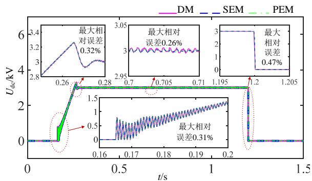  
图 7 输出侧直流电压波形

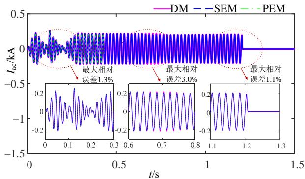  
Fig. 7 Waveforms of output DC voltage   
图8 输入侧交流电流波形  
Fig. 8 Waveforms of input AC current

# 4.2 加速比测试

本节在 PSCAD 中搭建了单相含 6、12、18、30、48、60、84、96 个 PM 的三相 CHB-PET 系统DM、SEM 和 PEM 进行仿真用时测试，测试系统设置仿真时间为 1s，仿真步长为 5μs，测试 3 组实验数据后取平均值作为最终结果，SEM 与 PEM 的仿真用时及并行加速比见附录 C。

# 4.2.1 并行提速效果测试与分析

为验证 3.2 节理论分析的正确性，现从模块数$N _ { \mathrm { P M } }$ 、线程数 $N _ { \mathrm { T } } .$ 、单模块解算用时 $T _ { \mathrm { P M } }$ 这 3 个方面出发，研究 PSF 的变化趋势。

# 1）模块数 $N _ { \mathrm { P M } }$ 的影响。

根据附录表 C2，绘制在不同线程数下，PSF随模块数变化的关系，如图 9 所示。随着模块数的增加，相同线程数下，PSF 与模块数近似成正比。

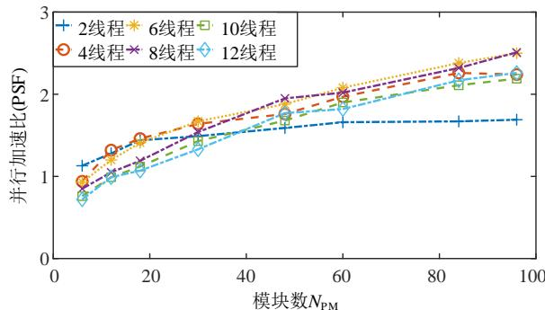  
图9 不同模块数PSF测试  
Fig. 9 Parallel PSF test under different $N _ { \mathbf { P M } }$

模块数较多时，增速趋于饱和。考虑到式(32)中，当 $N _ { \mathrm { P M } }$ 增大，分子项 $N _ { \mathrm { P M } } T _ { \mathrm { P M } }$ 增速显然大于分母项$[ N _ { \mathrm { P M } } / N _ { \mathrm { T } } ] T _ { \mathrm { P M } }$ ，PSF 必然会随着 $N _ { \mathrm { P M } }$ 的增大而增大，测试结果与理论分析相吻合。

# 2）线程数 $N _ { \mathrm { T } }$ 的影响。

由附录表 C2 绘制并行加速比随线程数变化的关系如图 10 所示。

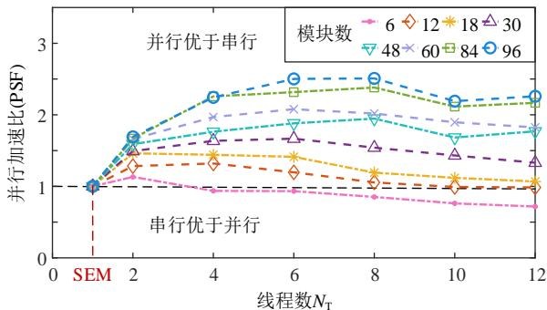  
图 10 不同线程数 PSF 测试  
Fig. 10 PSF test under different threads

由图 10 与式(32)可知，随着线程数由 2 到 12等间隔递增(1线程代表串行 SEM)，其对 PSF 的影响表现以下 3个过程：

1）当线程数较少时，随着线程数增加，并行仿真耗时 $[ N _ { \mathrm { P M } } / N _ { \mathrm { T } } ] T _ { \mathrm { P M } }$ 将明显小于串行仿真耗时$N _ { \mathrm { P M } } T _ { \mathrm { P M } }$ ，导致 PSF 迅速增加；2）随着线程数继续增多，并行附加开销 $T _ { \mathrm { d e l a y } } ( N _ { \mathrm { T } } )$ 线性增大，削弱了并行提速效果，PSF 增速减缓；3）当线程数达到 6或 8线程时，PSF 取得最值，继续增加线程数，并行附加开销的耗时愈加明显，PSF 呈现下降趋势，因此并行仿真存在最优线程数。

值得注意的是，根据 3.2 节分析，当模块数无法整除线程数时，会产生并行等待开销。图 10中，当线程数为 10，模块数为 48、84、96 的 PSF 有明显下降，其并行提速效果均受到了并行等效开销的影响。

# 3）单模块解算用时 $T _ { \mathrm { P M } }$ 的影响。

为研究单模块解算时长变化时对 PSF 的影响，采用本文所提算法对 DAB 型变换器等效建模。考虑到 DAB 拓扑与控制较 CHB 更为简单，因此其$T _ { \mathrm { P M } }$ 必然小于 CHB-PET。在相同的仿真条件下对DAB开展并行加速比测试，仿真测试结果见附录表C3，同样绘制 DAB并行仿真线程数与 PSF 的关系如图 11 所示。

不同于 CHB-PET，DAB 在线程数为 2 时取得最佳并行提速效果，此时再增大线程数，加速比都呈现下降趋势。此外，当模块数较少时，DAB相较于 CHB也会出现更多串行优于并行的情况。

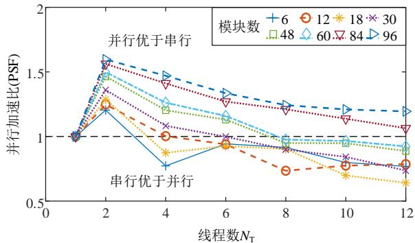  
图 11 DAB 不同线程数 PSF 测试  
Fig. 11 PSF test of DAB under different threads

由于 DAB 的 $T _ { \mathrm { P M } }$ 更小，对应于式(32)中的并行耗时 $[ N _ { \mathrm { P M } } / N _ { \mathrm { T } } ] T _ { \mathrm { P M } }$ 与串行耗时 $N _ { \mathrm { P M } } T _ { \mathrm { P M } }$ 都相应减小，导致并行附加开销 $T _ { \mathrm { d e l a y } } ( N _ { \mathrm { T } } )$ 的影响更为明显，因此在线程数较小时 $( N _ { \mathrm { T } } { = } 2 )$ ，达到最佳并行提速效果。当 $N _ { \mathrm { P M } }$ 与 $T _ { \mathrm { P M } }$ 都较小时，可能出现 $N _ { \mathrm { P M } } T _ { \mathrm { P M } }$ 小于$T _ { \mathrm { d e l a y } } ( N _ { \mathrm { T } } )$ 与 $[ N _ { \mathrm { P M } } / N _ { \mathrm { T } } ] T _ { \mathrm { P M } }$ 之和的情况，导致串行优于并行的情况发生。

# 4.2.2 最优并行等效模型加速比测试

为获取最佳的并行效果，可在模块数确定的情况下，逐个递增线程数，寻找该模块数下提速最优的并行线程，通过此方法，可得到最优并行等效模型，记为 $\mathrm { P E M _ { B } }$ 。

为更直观地展示最优并行等效模型的提速效果，定义加速比(speed factor，SF，记为 $\tau _ { \mathrm { S F } } )$ ：

$$
\tau_ {\mathrm {S F}} = T _ {\mathrm {E M}} / T _ {\mathrm {D M}} \tag {33}
$$

式中： $T _ { \mathrm { E M } }$ 表示等效模型的仿真用时； $T _ { \mathrm { D M } }$ 表示详细模型的仿真用时。

分别测试 DM、 $\mathrm { P E M _ { B } }$ 的仿真用时，计算加速比，并与 SEM 的提速效果进行对比。值得注意的是，当单相模块数大于等于 60 时，DM 仿真时间过长，其仿真 1s 的用时可采用仿真 0.1s 的用时乘以10 的方法估算。最终的测试结果如表 3 与图 12所示。

由于 CHB-PET 详细模型节点数多，开关器件动作频繁，当模块数增多时，系统节点导纳矩阵庞大且时变，严重影响了详细模型的仿真效率，其仿真用时按指数倍增加。

采用了本文所提的高效算法，串行(SEM)与最优并行等效模型 $\left( \mathrm { P E M _ { B } } \right)$ 的仿真用时增速呈线性增长，且 $\mathrm { P E M _ { B } }$ 的增速更为平缓，斜率近似为 SEM的一半。由表 3 可知，当单相模块数达到 48 时，SEM 可实现对详细模型 6000 多倍的提速。引入并行后，在最优线程数下， $\mathrm { P E M _ { B } }$ 可进一步对 SEM 完成2~3倍的二次提速，使得仿真效率得到显著提高。

综上所述，本文所提等效建模方法可实现对详

表 3 最优并行等效模型加速比对比  
Table 3 Comparison of SF of PEMB   

<table><tr><td>模块数 NPM</td><td>DM 仿真用时/s</td><td>SEM 仿真用时/s</td><td>PEMB 仿真用时/s</td><td>SEM 加速比</td><td>PEMB 加速比</td><td>最优线程数 NT</td></tr><tr><td>6</td><td>335</td><td>3.15</td><td>2.78</td><td>106.3</td><td>120.5</td><td>2</td></tr><tr><td>12</td><td>2156</td><td>4.67</td><td>3.54</td><td>461.7</td><td>609.4</td><td>4</td></tr><tr><td>18</td><td>8363</td><td>6.26</td><td>4.28</td><td>1338.1</td><td>1954.2</td><td>4</td></tr><tr><td>30</td><td>27383</td><td>8.88</td><td>5.33</td><td>3083.7</td><td>5173.6</td><td>6</td></tr><tr><td>48</td><td>82150</td><td>12.99</td><td>6.67</td><td>6324.1</td><td>12316.3</td><td>8</td></tr><tr><td>60</td><td>&gt;48×3600</td><td>15.59</td><td>7.50</td><td>&gt;1×10^4</td><td>&gt;2.3×10^4</td><td>6</td></tr><tr><td>84</td><td>&gt;100×3600</td><td>22.07</td><td>9.27</td><td>&gt;1.5×10^4</td><td>&gt;3.8×10^4</td><td>8</td></tr><tr><td>96</td><td>&gt;300×3600</td><td>23.77</td><td>9.48</td><td>&gt;4×10^4</td><td>&gt;11.4×10^4</td><td>8</td></tr></table>

细模型的显著提速，且模块数越多，加速效果越显著。在仿真模块较多、功率模块拓扑较复杂的 PET系统时，本文所提的并行算法也可以最大限度利用计算资源，进一步提高等效模型的仿真效率。

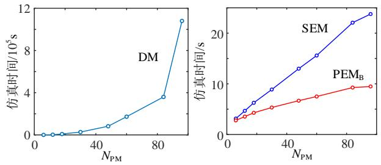  
图 12 仿真用时对比  
Fig. 12 Comparison of simulation time

# 5 结论

本文提出了一种电力电子变压器电磁暂态并行仿真等效建模方法，以 CHB-PET 拓扑为例，详细介绍了导纳单元的划分及等效导纳的推导，以及PET 串行等效模型的形成过程。其次，基于 OpenMP技术，构建了所提等效模型的并行仿真框架，并对并行提速的影响因素进行了理论分析与仿真验证。

基于 PSCAD/EMTDC 仿真软件，本文将所提算法的串行、并行等效模型与详细模型进行对比，开展精度与加速比测试。结果表明，串行与并行等效模型均可实现对详细模型的高度拟合，证实了并行的引入不会影响仿真精度。当单相模块数为 48时，本文所提的并行等效模型可实现对详细模型10000 多倍的仿真提速。在针对大规模 PET 系统仿真时，本文所提的等效模型在满足精度与保留内部特性的前提下，具有十分可观的提速效果。

附 录 见 本 刊 网 络 版 (http://www.dwjs.com.cn/CN/1000-3673/current.shtml)。

# 参考文献

[1] 赵争鸣，冯高辉，袁立强，等．电能路由器的发展及其关键技术[J]．中国电机工程学报，2017，37(13)：3823-3834ZHAO Zhengming，FENG Gaohui，YUAN Liqiang，et al．Thedevelopment and key technologies of electric energy router[J]．

Proceedings of the CSEE，2017，37(13)，3823-3834(in Chinese)  
[2] 赵彪，安峰，宋强，等．双有源桥式直流变压器发展与应用[J]中国电机工程学报，2021，41(1)：288-298  
ZHAO Biao，AN Feng，SONG Qiang，et al．Development and application of DC transformer based on dual-active-bridge[J] ． Proceedings of the CSEE，2021，41(1)：288-298(in Chinese)．   
[3] 廖国虎，邱国跃，袁旭峰．电力电子变压器研究综述[J]．电测与仪表，2014，51(16)：5-10，36  
LIAO Guohu，QIU Guoyue，YUAN Xufeng．Summary of the power electronic transformer research[J] ． Electrical Measurement & Instrumentation，2014，51(16)：5-10，36(in Chinese)   
[4] 汤建，邹志翔，刘星琦，等．基于电力电子变压器的逆变器并网系统建模、稳定性分析及控制[J]．电网技术，2021，45(11)：4224-4232  
TANG Jian，ZOU Zhixiang，LIU Xingqi，et al．Modeling，stability analysis and control of grid-connected inverter system using power electronics transformer[J]．Power System Technology，2021，45(11)： 4224-4232(in Chinese)   
[5] 许建中，高晨祥，丁江萍，等．高频隔离型电力电子变压器电磁暂态加速仿真方法与展望[J]．中国电机工程学报，2021，41(10)：3466-3479  
XU Jianzhong ， GAO Chenxiang ， DING Jiangping ， et al ．Electromagnetic transient acceleration simulation methods andprospects of high-frequency isolated power electronic transformer[J]．Proceedings of the CSEE，2021，41(10)：3466-3479(in Chinese)  
[6] 文武松，赵争鸣，莫昕，等．基于高频汇集母线的电能路由器能量自循环系统及功率协同控制策略[J]．电工技术学报，2020，35(11)：2328-2338  
WEN Wusong，ZHAO Zhengming，MO Xin，et al．Energy self-circulation scheme and power coordinated control of highfrequency-bus based electric energy router[J]．Transactions of China Electrotechnical Society，2020，35(11)：2328-2338(in Chinese)．   
[7] TRIPATHI A K， MAINALI K， PATEL D C ，et al． Design considerations of a 15-kV SiC IGBT-based medium-voltage high-frequency isolated DC-DC converter[J]．IEEE Transactions on Industry Applications，2015，51(4)：3284-3294   
[8] 周京华，吴杰伟，陈亚爱，等．张北阿里云数据中心柔性直流输配电系统[J]．电气应用，2019，38(1)：54-58．  
ZHOU Jinghua，WU Jiewei，CHEN Yaai，et al．Zhangbei Alibaba cloud data center flexible DC transmission and distribution system[J] Electrotechnical Application，2019，38(1)：54-58(in Chinese)．   
[9] GUILLOD T，ROTHMUND D，KOLAR J W．Active magnetizing current splitting ZVS modulation of a 7 kV/400 V DC transformer[J] IEEE Transactions on Power Electronics，2020，35(2)：1293-1305   
[10] 胡钰杰，李子欣，罗龙，等．串联谐振间接矩阵型电力电子变压器高频电流特性分析及开关频率设计[J]．电工技术学报，2022，37(6)：1442-1454  
HU Yujie，LI Zixin，LUO Long，et al．Characteristic analysis of

high-frequency-link current of series resonant indirect matrix type power electronics transformer and switching frequency design[J] Transactions of China Electrotechnical Society ， 2022 ， 37(6) ： 1442-1454(in Chinese)．   
[11] 李磊，李彬彬，刘建莹，等．全直流海上风电场高压直流变压器及其换相失败故障穿越策略[J]．电网技术，2022，46(4)：1391-1400LI Lei，LI Binbin，LIU Jianying，et al．Ride-through strategy undercommutation failure of high-voltage DC/DC transformer for All DCoffshore wind farms[J]．Power System Technology，2022，46(4)：1391-1400(in Chinese)  
[12] WATSON N ， ARRILLAGA J ． Power systems electromagnetic transients simulation[M]．London：Institution of Electrical Engineers， 2003．   
[13] ZHAO Tiefu，ZENG Jie，BHATTACHARYA S，et al．An average model of solid state transformer for dynamic system simulation [C]//Proceedings of 2009 IEEE Power & Energy Society General Meeting．Calgary：IEEE，2009：1-8   
[14] PAVLOVIC T，BJAZIC T，BAN Z．Simplified averaged models of DC-DC power converters suitable for controller design and microgrid simulation[J]．IEEE Transactions on Power Electronics，2013，28(7)： 3266-3275．   
[15] LI Zixin，QU Ping，WANG Ping，et al．DC terminal dynamic model of dual active bridge series resonant converters[C]//Proceedings of 2014 IEEE Conference and Expo Transportation Electrification Asia-Pacific (ITEC Asia-Pacific)．Beijing：IEEE，2014：1-5   
[16] 尹平平，王韦华．基于 FPGA 的直流变压器实时仿真研究[J]．电力系统保护与控制，2017，45(10)：140-145YIN Pingping，WANG Weihua．FPGA based real time simulation andresearch of DCSST[J]．Power System Protection and Control，2017，45(10)：140-145(in Chinese)  
[17] 高晨祥，丁江萍，许建中，等．输入串联输出并联型双有源桥变换器等效建模方法[J]．中国电机工程学报，2020，40(15)：4955-4964GAO Chenxiang，DING Jiangping，XU Jianzhong，et al．Equivalentmodeling method of input series output parallel type dual activebridge converter[J]．Proceedings of the CSEE，2020，40(15)：4955-4964(in Chinese)  
[18] 丁江萍，高晨祥，许建中，等．级联 H 桥型电力电子变压器的电磁暂态等效建模方法[J]．中国电机工程学报，2020，40(21)：7047-7055DING Jiangping ， GAO Chenxiang ， XU Jianzhong ， et alElectromagnetic transient equivalent modeling method of cascadedH-bridge power electronic transformer[J]．Proceedings of the CSEE，2020，40(21)：7047-7055(in Chinese)  
[19] 高晨祥，王晓婷，丁江萍，等．基于电流过零点预计算的单有源 桥变换器等效建模方法[J]．中国电机工程学报，2021，41(7)： 2463-2473 GAO Chenxiang，WANG Xiaoting，DING Jiangping，et al．Equivalent modelling method of single active bridge converter by pre-calculating

the current zero-crossing[J]．Proceedings of the CSEE，2021，41(7)：2463-2473(in Chinese)  
[20] FALCAO D M，KASZKUREWICZ E，ALMEIDA H L S．Application of parallel processing techniques to the simulation of power system electromagnetic transients[J]．IEEE Transactions on Power Systems， 1993，8(1)：90-96   
[21] 徐政，李宁璨，肖晃庆，等．大规模交直流电力系统并行计算数字仿真综述[J]．电力建设，2016，37(2)：1-9．XU Zheng，LI Ningcan，XIAO Huangqing，et al．A review of parallelcomputing digital simulation of large-scale AC/DC power system[J]Electric Power Construction，2016，37(2)：1-9(in Chinese)  
[22] 穆清，李亚楼，周孝信，等．基于传输线分网的并行多速率电磁 暂态仿真算法[J]．电力系统自动化，2014，38(7)：47-52 MU Qing，LI Yalou，ZHOU Xiaoxin，et al．A parallel multi-rate electromagnetic transient simulation algorithm based on network division through transmission line[J]．Automation of Electric Power Systems，2014，38(7)：47-52(in Chinese)   
[23] 高晨祥，丁江萍，孙昱昊，等．基于 MAB 的 PET 多线程并行等效建模方法[J]．中国电机工程学报，2022，42(11)：4112-4124GAO Chenxiang，DING Jiangping，SUN Yuhao，et al．Multi-threadparallel equivalent modelling method for MAB-based PET[J]Proceedings of the CSEE，2022，42(11)：4112-4124(in Chinese)  
[24] 丁江萍，樊强，林畅，等．采用二值开关电阻的 MMC 等效模型在阀内故障仿真中的适用性[J]．电网技术，2020，44(7)：2701-2709DING Jiangping，FAN Qiang，LIN Chang，et al．Applicability ofMMC equivalent model based on two-value switched resistance ininternal valve fault simulation[J]．Power System Technology，2020，44(7)：2701-2709(in Chinese)  
[25] 姚远．计算机系统结构简述[J]．计算机光盘软件与应用，2014(4)：304，306YAO Yuan．Brief description of computer system structure[J]Computer CD Software and Applications，2014(4)：304，306(inChinese)．  
[26] 雷洪，胡许冰．多核并行高性能计算 OpenMP[M]．北京：冶金工业出版社，2016：22-38．

  
孙昱昊

在线出版日期：2022-05-07。

收稿日期：2022-03-21。

作者简介：

孙昱昊(1998)，男，硕士研究生，研究方向为电力电子变压器电磁暂态等效建模，E-mail：1720822565@qq.com；

许建中(1987)，男，通信作者，副教授，博士生导师，主要从事高压直流输电和直流电网技术研究，E-mail：xujianzhong@ncepu.edu.cn。

（责任编辑 马晓华）

附录 A

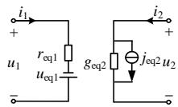  
(a) 适用于ISOP级联的PM等值电路

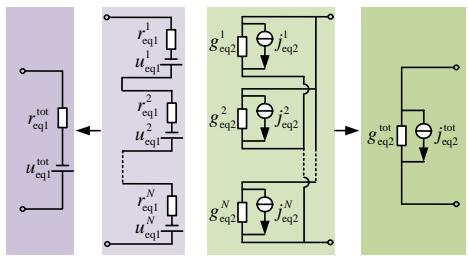  
(b) CHB-PET等值电路

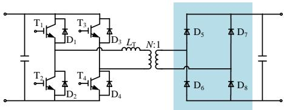  
图 A1 CHB-PET 等效模型  
Fig. A1 Equivalent model of CHB-PET

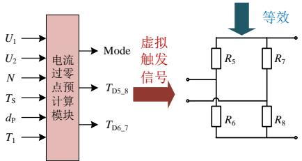  
图 A2 SAB 等效思路  
Fig.A2 Equivalent method of SAB

<table><tr><td>库函数</td><td>CALL OMP_SET_NUM_THREAD(S(N) !开启N个线程</td></tr><tr><td>编译指导 语句 (fork)</td><td>\$OMP PARALLEL PRIVATE(I) REDUCTION(+:SUMA) \$OMP DO</td></tr><tr><td>并行 代码段</td><td>DO I=1,COUNT SUMA=SUMA+1 END DO</td></tr><tr><td>编译指导 语句 (join)</td><td>\$OMP END DO \$OMP END PARALLEL</td></tr></table>

图 A3 经典 OpenMP 代码段

Fig. A3 Classic OpenMP code

附录 B

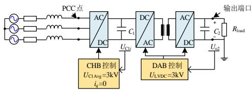  
图 B1 CHB-PET 系统示意图  
Fig. B1 Schematic of CHB-PET system

表 B1 CHB-PET 测试系统参数  
Table B1 Parameters of CHB-PET Testing System   

<table><tr><td>参数</td><td>取值</td></tr><tr><td>系统基频fsys/Hz</td><td>50</td></tr><tr><td>CHB级载波开关频率fsw1/Hz</td><td>200</td></tr></table>

<table><tr><td>储能电容C1容值Cout_AC-DC/μF</td><td>4700</td></tr><tr><td>PET输入侧滤波电感LAC/H</td><td>0.06</td></tr><tr><td>交流系统线电压有效值UL-Lrated/kV</td><td>10</td></tr><tr><td>电容C1上的额定电压Uo1Rated/kV</td><td>3</td></tr><tr><td>PET输出侧额定有功功率PoRated/MW</td><td>2.25</td></tr><tr><td>PET级联子模块个数NCHB</td><td>3</td></tr><tr><td>DAB级开关频率(同变压器频率)fsw2/Hz</td><td>1000</td></tr><tr><td>高频变压器额定容量Sfr/MVA</td><td>0.25</td></tr><tr><td>变压器一次侧额定电压Utr1/kV</td><td>3</td></tr><tr><td>变压器二次侧额定电压Utr2/kV</td><td>3</td></tr><tr><td>变压器漏抗(含附加电感)标幺值XtrPU/pu</td><td>0.376</td></tr><tr><td>PET输出额定电压Uo2Rated/kV</td><td>3</td></tr><tr><td>储能电容C2容值Cout_DAB/μF</td><td>50</td></tr><tr><td>额定直流负载Rload/Ω</td><td>4</td></tr></table>

附录 C

表 C1 SEM、PEM 仿真用时测试  
Table C1 Simulation time of SEM&PEM   
表C2 并行加速比测试  

<table><tr><td rowspan="2" colspan="2">仿真用时/s</td><td rowspan="2">SEM</td><td colspan="6">PEM线程数 NT</td></tr><tr><td>2</td><td>4</td><td>6</td><td>8</td><td>10</td><td>12</td></tr><tr><td rowspan="8">模块数</td><td>6</td><td>3.15</td><td>2.78</td><td>3.36</td><td>3.38</td><td>3.70</td><td>4.13</td><td>4.38</td></tr><tr><td>12</td><td>4.67</td><td>3.64</td><td>3.54</td><td>3.91</td><td>4.43</td><td>4.71</td><td>4.74</td></tr><tr><td>18</td><td>6.26</td><td>4.34</td><td>4.28</td><td>4.43</td><td>5.25</td><td>5.59</td><td>5.86</td></tr><tr><td>30</td><td>8.88</td><td>5.95</td><td>5.43</td><td>5.33</td><td>5.77</td><td>6.20</td><td>6.68</td></tr><tr><td>48</td><td>12.99</td><td>8.17</td><td>7.37</td><td>6.91</td><td>6.67</td><td>7.72</td><td>7.34</td></tr><tr><td>60</td><td>15.59</td><td>9.39</td><td>7.92</td><td>7.50</td><td>7.73</td><td>8.23</td><td>8.55</td></tr><tr><td>84</td><td>22.07</td><td>13.23</td><td>9.77</td><td>9.52</td><td>9.27</td><td>10.44</td><td>10.18</td></tr><tr><td>96</td><td>23.77</td><td>14.05</td><td>10.59</td><td>9.50</td><td>9.48</td><td>10.85</td><td>10.52</td></tr></table>

Table C2 Test of PSF   
表 C3 DAB 并行加速比测试  

<table><tr><td rowspan="2" colspan="2">PSF</td><td colspan="6">线程数</td></tr><tr><td>2</td><td>4</td><td>6</td><td>8</td><td>10</td><td>12</td></tr><tr><td rowspan="8">模块数</td><td>6</td><td>1.13</td><td>0.94</td><td>0.93</td><td>0.85</td><td>0.76</td><td>0.72</td></tr><tr><td>12</td><td>1.28</td><td>1.32</td><td>1.20</td><td>1.05</td><td>0.99</td><td>0.99</td></tr><tr><td>18</td><td>1.44</td><td>1.46</td><td>1.41</td><td>1.19</td><td>1.12</td><td>1.07</td></tr><tr><td>30</td><td>1.49</td><td>1.64</td><td>1.67</td><td>1.54</td><td>1.43</td><td>1.33</td></tr><tr><td>48</td><td>1.59</td><td>1.76</td><td>1.88</td><td>1.95</td><td>1.68</td><td>1.77</td></tr><tr><td>60</td><td>1.66</td><td>1.97</td><td>2.08</td><td>2.02</td><td>1.90</td><td>1.82</td></tr><tr><td>84</td><td>1.67</td><td>2.26</td><td>2.38</td><td>2.32</td><td>2.11</td><td>2.17</td></tr><tr><td>96</td><td>1.69</td><td>2.24</td><td>2.50</td><td>2.51</td><td>2.19</td><td>2.26</td></tr></table>

Table C3 Test of PSF of DAB   

<table><tr><td rowspan="2" colspan="2">PSF</td><td colspan="6">线程数</td></tr><tr><td>2</td><td>4</td><td>6</td><td>8</td><td>10</td><td>12</td></tr><tr><td rowspan="8">模块数</td><td>6</td><td>1.20</td><td>0.77</td><td>0.94</td><td>0.92</td><td>0.80</td><td>0.77</td></tr><tr><td>12</td><td>1.25</td><td>1.00</td><td>0.94</td><td>0.73</td><td>0.77</td><td>0.79</td></tr><tr><td>18</td><td>1.29</td><td>0.87</td><td>0.93</td><td>0.90</td><td>0.70</td><td>0.64</td></tr><tr><td>30</td><td>1.36</td><td>1.08</td><td>1.00</td><td>0.90</td><td>0.84</td><td>0.74</td></tr><tr><td>48</td><td>1.46</td><td>1.20</td><td>1.13</td><td>0.95</td><td>0.95</td><td>0.89</td></tr><tr><td>60</td><td>1.50</td><td>1.26</td><td>1.16</td><td>0.98</td><td>0.97</td><td>0.92</td></tr><tr><td>84</td><td>1.56</td><td>1.41</td><td>1.27</td><td>1.21</td><td>1.14</td><td>1.06</td></tr><tr><td>96</td><td>1.60</td><td>1.47</td><td>1.33</td><td>1.24</td><td>1.21</td><td>1.19</td></tr></table>

# Equivalent Modeling Method of Parallel Electromagnetic Transient Simulation for Power Electronic Transformer

SUN Yuhao, XU Jianzhong

(State Key Laboratory of Alternate Electrical Power System With Renewable Energy Sources

(North China Electric Power University), Changping District, Beijing 102206, China)

KEY WORDS: Power electronic transformer; cascaded H-bridge (CHB); admittance unit prestorage; parallel equivalent modelling ; multithreaded parallel computing

Power Electronic Transformer (PET) has characteristics of modularity, multiple nodes and high frequency. The electromagnetic transient simulation (EMT) of its detailed model is inefficient, and the simulation acceleration is urgently needed.

In this paper, starting from model speeding up and improvement of CPU efficiency, an equivalent modeling method of parallel electromagnetic transient simulation for power electronic transformer is proposed. Taking cascaded H-bridge type power electronic transformer (CHB-PET) as an example, theoretical derivation and simulation verification are carried out.

Firstly, the power module (PM) is divided into

circuits of different admittance units based on whether admittance is fixed. Secondly, from the perspective of loaded two ports, it is deduced that H-bridge element contains only 2 equivalent admittance, which can be simplified as a two-values admittance unit. By prestoring admittance parameters of each unit and calculating port short-circuit current using superposition theorem, the PM norton equivalent circuit parameters can be quickly obtained and aggregated to form CHB-PET serial equivalent model. Finally, a parallel simulation framework is constructed in combination with high parallelism of model. The parallel simulation process of CHB-PET equivalent model is shown in Fig.1.

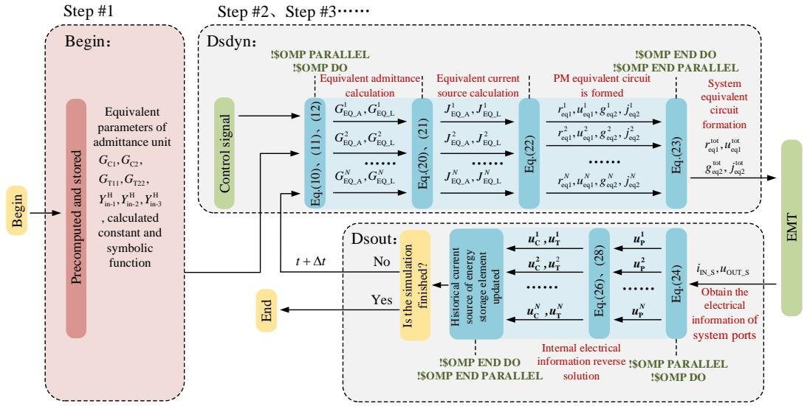  
Fig. 1 Parallel simulation process of CHB-PET equivalent model

According to the theoretical analysis of parallel acceleration effect, parallel speed factor (PSF) can be expressed by the following equation:

$$
\mathrm {P S F} = \frac {T _ {\mathrm {S}}}{T _ {\mathrm {P}}} = \frac {T _ {\mathrm {f}} + N _ {\mathrm {P M}} \cdot T _ {\mathrm {P M}}}{T _ {\mathrm {f}} + T _ {\text {d e l a y}} \left(N _ {\mathrm {T}}\right) + \left[ N _ {\mathrm {P M}} / N _ {\mathrm {T}} \right] \cdot T _ {\mathrm {P M}}} \tag {1}
$$

Where, $T _ { \mathrm { { S } } }$ and $T _ { \mathrm { P } }$ are the simulation time of serial model and parallel model, respectively. $T _ { \mathrm { d e l a y } }$ and $T _ { \mathrm { f } }$ are the parallel simulation cost and fixed simulation cost, respectively. PSF is mainly affected by module number $( N _ { \mathrm { P M } } )$ , thread number $( N _ { \mathrm { T } } )$ and single module simulation time (TPM).

Through simulation verification on PSCAD/EMTDC, the result shows that the model can highly fit detailed model under various working conditions, and the maximum error is less than 3%. When the number of single-phase modules is 48, the optimal parallel equivalent model can achieve a simulation speedup of more than 10000 times over the detailed model.