# Methods of Interfacing Rotating Machine Models in Transient Simulation Programs

IEEE Task Force on Interfacing Techniques for Simulation Tools L. Wang, J. Jatskevich, V. Dinavahi, H. W. Dommel, J. A. Martinez, K. Strunz, M. Rioual, G. W. Chang, and R. Iravani

Abstract—The electromagnetic transient programs (EMTP-like tools) are based on the nodal (or modified nodal) equations that enable an efficient numerical solution and, subsequently, fast time-domain simulations. The state-variable-based simulation programs, such as Simulink, are also used for studying the dynamics of electrical systems. Both the offline and real-time versions of these two types of simulation tools are widely used by the researchers and engineers in industry and academia to study the transient phenomena and dynamics in power systems with rotating electrical machines. This paper provides a summary of the interfacing techniques that are utilized to integrate the general-purpose models of electrical machines with the rest of the power system network for these studies. The interfacing methods are broadly classified as indirect and direct approaches. The paper also describes the numerical properties as well as limitations imposed by the interfacing of the commonly used machine models that should be considered when selecting the simulation parameters and assessing the final results.

Index Terms—Electrical machines, electromagnetic transients, Electromagnetic Transients Program (EMTP), interfacing techniques, simulation, state-variable approach.

# I. INTRODUCTION

R OTATING electrical machines have been an integralpart of power systems for as long as the latter have part of power systems for as long as the latter have existed. The electrical machines are used as generators and motors in numerous applications in power systems in a wide range of voltage and power levels. This paper mainly considers the machine models that are based on the coupled electric circuit approach, which leads to a relatively small number of equations and have been very effectively utilized for analyzing power systems transients [1]–[4]. The validity of this type of models for both balanced and unbalanced power system operations has been confirmed [5], [6]. Over time,

Manuscript received June 18, 2009; revised December 02, 2009. First published February 17, 2010; current version published March 24, 2010. Task Force on Interfacing Techniques for Simulation Tools is with the Working Group on Modeling and Analysis of System Transients Using Digital Programs, IEEE Power and Energy Society, T&D Committee. Paper no. TPWRD-00457-2009.

Task Force members: U. Annakkage, G. W. Chang, V. Dinavahi (Chair), S. Filizadeh, A. M. Gole, R. Iravani, J. Jatskevich, A. J. Keri, P. Lehn, J. Mahseredjian, J. A. Martinez, B. A. Mork, A. Monti, L. Naredo, T. Noda, A. Ramirez, M. Rioual, M. Steurer, K. Strunz.

L. Wang and J. Jatskevich are with the Department of Electrical and Computer Engineering, University of British Columbia, Vancouver, BC V6T 1Z4, Canada (e-mail: liweiw@ece.ubc.ca; jurij@ece.ubc.ca).

Color versions of one or more of the figures in this paper are available online at http://ieeexplore.ieee.org.

Digital Object Identifier 10.1109/TPWRD.2009.2039809

numerous models have been developed concurrently with the development of digital computer programs. The modeling methods were influenced by many factors such as type and size of the machine, objectives of the power system study, and the method of exchanging data between the machine and the network. While a large number of machine models may offer beneficial options to the user, it also creates challenges in terms of proper model selection. For example, the same machine modeled in two separate software programs would yield different results leading to much confusion during the implementation and validation stages. Some researchers have also questioned the applicability of the established model to unbalanced conditions [7]–[9]. The authors of [10], [11] made similar conclusions by comparing the simulation results of the classical model and the coupled-circuit phase-domain (PD) model under unbalanced operation. As the software programs matured the root causes of the modeling differences were eventually recognized and corrected [5], [12].

The objective of this task force paper is to present to the reader the various interfacing techniques used to integrate the machine models with the power system network in different simulation programs. The Electromagnetic Transients Program (EMTP) [4], [13] approach and its many derivative programs (such as ATP [14], MicroTran [15], PSCAD/EMTDC [16], EMTP-RV [17], VTB [18], etc.) are based on nodal (or modified nodal) equations and are widely used. The state variable (SV) approach is also used for the analysis of dynamic systems including electric power systems. The examples of SV-based software packages include acslX [19], Easy5 [20], Eurostag [21], MATLAB/Simulink [22], etc. Within the EMTP and SV solution methodologies, this paper broadly classifies the methods of interfacing electrical machine models with power system network into indirect and direct approaches. This paper also provides numerous examples and studies that should help many engineers and researchers in correct use of various machine models and software packages.

Another important aspect of machine modeling is the representation of magnetic saturation, which improves the accuracy and the range of applications of such models. Different approaches have been considered for various machine model structures (e.g., , PD) and/or simulation languages (EMTP or SV based). However, the saturation modeling methods for transient simulation programs are not discussed here as this issue requires more thorough literature survey which is beyond the scope of this paper.

The paper is organized as follows: Section II describes the typical machine models used for power systems transients. Sections III and IV describe and demonstrate the interfacing approaches used in the EMTP and the SV programs, respectively. The final conclusions are summarized in Section V. The parameters of synchronous and induction machines used for simulation studies of this paper are summarized in the Appendix.

# II. GENERAL-PURPOSE MACHINE MODELS

For the purpose of consistency and without loss of generality, this section considers a conventional general purpose synchronous machine model [2]–[6], whereas induction machine model is somewhat similar. The dynamics of machine can be represented by equations of corresponding electrical and mechanical subsystems. Depending on the application and the scope of studies (e.g., subsynchronous resonance, torsional dynamics, etc.), the mechanical subsystem may be represented as a lumped-parameter spring-mass system [23]. However, since the focus of this paper is on interfacing the machine models with the solution of electrical network-system, a single rigid-body mechanical subsystem is assumed here. Specifically, the equations for mechanical subsystem for all models and studies presented are

$$
\frac {d \theta_ {r}}{d t} = \omega_ {r} \tag {1}
$$

$$
\frac {d \omega_ {r}}{d t} = \frac {P}{2 J} \left(T _ {e} - T _ {m}\right) \tag {2}
$$

where $\theta _ { r }$ and $\omega _ { r }$ denote the rotor position and the angular electrical speed; is the number of poles, is the moment of inertia; $T _ { m }$ and $T _ { \epsilon }$ are the mechanical torque and electromagnetic torque, respectively. Motor convention is used for all models. Throughout this manuscript, bold capital case is used to denote matrices and bold lower case is used to denote vectors.

The original coupled-circuit phase-domain (PD) model is commonly expressed in terms of the machine’s physical variables and phase coordinates. In particular, the voltage equation is expressed as

$$
\left[ \begin{array}{l} \mathbf {v} _ {a b c s} \\ \mathbf {v} _ {q d r} \end{array} \right] = \mathbf {R} \left[ \begin{array}{l} \mathbf {i} _ {a b c s} \\ \mathbf {i} _ {q d r} \end{array} \right] + \frac {d}{d t} \left[ \begin{array}{l} \boldsymbol {\lambda} _ {a b c s} \\ \boldsymbol {\lambda} _ {q d r} \end{array} \right] \tag {3}
$$

and the flux linkages are represented as

$$
\left[ \begin{array}{l} \boldsymbol {\lambda} _ {a b c s} \\ \boldsymbol {\lambda} _ {q d r} \end{array} \right] = \mathbf {L} (\theta_ {r}) \left[ \begin{array}{l} \mathbf {i} _ {a b c s} \\ \mathbf {i} _ {q d r} \end{array} \right]. \tag {4}
$$

The equations for the electrical subsystem are determined by the number of machine’s windings. A typical synchronous machine model may include three stator windings , one field winding $f d ,$ , and one damper winding in the axis, and two damper windings and in the axis. is a diagonal and constant matrix containing the stator and rotor resistances. Vectors ${ \bf v } _ { a b c s } , \mathbf { i } _ { a b c s }$ , and $\lambda _ { a b c s }$ denote the stator voltages, current, and flux linkages, respectively. Similarly, vectors $\mathbf { v } _ { q d r } , \mathbf { i } _ { q d r }$ , and $\lambda _ { q d r }$ denote the rotor voltages, current, and flux linkages. The combined stator and rotor self and mutual inductance matrix $\mathbf { L } ( \theta _ { r } )$ depends on the rotor position $\theta _ { r }$ . The exact equations for

the self and mutual inductances are given in [3] and are not included here due to the limited space. The electromagnetic torque is expressed in the machine variables as

$$
T _ {e} = \frac {1}{2} \left[ \begin{array}{l} {\bf i} _ {a b c s} \\ {\bf i} _ {q d r} \end{array} \right] ^ {T} \frac {\partial}{\partial \theta_ {r}} {\bf L} (\theta_ {r}) \left[ \begin{array}{l} {\bf i} _ {a b c s} \\ {\bf i} _ {q d r} \end{array} \right]. (5)
$$

Although the model defined by (3)–(5) is relatively straightforward, it contains the terms (matrices) that depend on the rotor position $\theta _ { r }$ (and, hence, changes with time), which results in an additional computational burden and complexity of the final model whether it is implemented in the EMTP or the SV approach.

To achieve a machine model with constant parameters, a change of variables can be performed. In particular, in the case of synchronous machine, all variables are typically referred to the stator side (using appropriate turns-ratios) and then transformed (projected) onto the orthogonal coordinates that are fixed on the rotor. This is known as the Park’s transformation [1], [3], wherein the $q$ axis of the rotor reference frame is assumed to be $9 0 ^ { \circ }$ leading the axis. The corresponding transformation matrix has the following form:

$$
\mathbf {K} _ {s} = \frac {2}{3} \left[ \begin{array}{c c c} \cos \theta & \cos \left(\theta - \frac {2 \pi}{3}\right) & \cos \left(\theta + \frac {2 \pi}{3}\right) \\ \sin \theta & \sin \left(\theta - \frac {2 \pi}{3}\right) & \sin \left(\theta + \frac {2 \pi}{3}\right) \\ \frac {1}{2} & \frac {1}{2} & \frac {1}{2} \end{array} \right]. (6)
$$

This transformation is applied to the stator circuit and variables . The rotor circuit and variables $( q d r )$ are already expressed in the $q d$ coordinates and need not be transformed. The last row of (6) corresponds to the zero sequence (which produces the corresponding zero-sequence circuit on the stator side) and is needed to represent the unbalanced cases.

The voltage equations of the machine model can be represented in terms of transformed variables as

$$
\left[ \begin{array}{l} \mathbf {v} _ {q d 0 s} \\ \mathbf {v} _ {q d r} \end{array} \right] = \mathbf {R} \left[ \begin{array}{l} \mathbf {i} _ {q d 0 s} \\ \mathbf {i} _ {q d r} \end{array} \right] + \frac {d}{d t} \left[ \begin{array}{l} \boldsymbol {\lambda} _ {q d 0 s} \\ \boldsymbol {\lambda} _ {q d r} \end{array} \right] + \omega_ {r} \left[ \begin{array}{l} \boldsymbol {\lambda} _ {\mathrm {d q}} \\ 0 \end{array} \right] \quad (7)
$$

where vectors ${ \bf v } _ { q d 0 s } , \mathbf { i } _ { q d 0 s }$ and $\lambda _ { q d 0 s }$ denote the stator voltages, currents, and flux linkages in variables, respectively. Similarly, vectors $\mathbf { v } _ { q d r } , \mathbf { i } _ { q d r }$ and $\pmb { \lambda } _ { q d r }$ denote the rotor voltages, currents, and flux linkages in variables. The quantity $\omega _ { r } \pmb { \lambda } _ { d q }$ is the speed voltage term, where $\begin{array} { r } { \pmb { \lambda } _ { d q } \ = \ [ \lambda _ { d } \ - \lambda _ { q } \ 0 ] ^ { T } } \end{array}$ . This term appears in the stator voltage equation only. The flux linkage equations are given as

$$
\left[ \begin{array}{l} \boldsymbol {\lambda} _ {q d 0 s} \\ \boldsymbol {\lambda} _ {q d r} \end{array} \right] = \mathbf {L} _ {\mathrm {q d}} \left[ \begin{array}{l} \mathbf {i} _ {q d 0 s} \\ \mathbf {i} _ {q d r} \end{array} \right] \tag {8}
$$

where the combined self and mutual inductance matrix $\mathbf { L } _ { q d }$ is a constant, due to Park’s transformation. The electromagnetic torque may be calculated in terms of the stator and/or the rotor currents $\mathbf { i } _ { q d s }$ and $\mathbf { i } _ { q d r }$ , the flux linkages $\lambda _ { q d s }$ and $\lambda _ { q d r }$ , as well as in terms of the magnetizing flux linkages $\lambda _ { m q }$ and $\lambda _ { m d } \ [ 3 ]$ . For example

$$
\begin{array}{l} T _ {e} = \frac {3 P}{4} (\lambda_ {d s} i _ {q s} - \lambda_ {q s} i _ {d s}) \\ = \frac {3 P}{4} (\lambda_ {q r} i _ {d r} - \lambda_ {d r} i _ {q r}) \\ = \frac {3 P}{4} (\lambda_ {m d} i _ {q s} - \lambda_ {m q} i _ {d s}). \qquad (9) \\ \end{array}
$$

Implementing model (7)–(8), by itself, is much easier than implementing (3)–(4). Similarly, calculating the electromagnetic torque using (9) requires significantly less effort than using (5). However, the $q d 0$ model has to be interfaced with the external power network which is typically formulated in physical variables.

# III. INTERFACING MACHINE MODELS IN EMTP

Although there are a number of software packages based on nodal analysis (or modified nodal analysis) including the EMTP-type and the Spice-type programs, the underlying solution approach is based on discretizing the differential equations for each circuit component by usng a particular integration rule. The EMTP [4], [13] uses an implicit trapezoidal rule for discretization and formulating the network nodal equation that has the following general form:

$$
\mathbf {G V} _ {n} = \mathbf {I} _ {h} \tag {10}
$$

where is the network nodal conductance matrix, and the vector $\mathbf { I } _ { h }$ includes the so-called history current sources injected into the nodes. The nodal voltages ${ \bf V } _ { n }$ are unknown and calculated by solving (10) at every time step. The solution of (10) is one of the key factors that has made the EMTP languages so efficient and ultimately widely used. As the matrix is usually sparse, specially designed techniques, such as optimal reordering schemes and partial LU factorization [24], [25], are often used to solve this linear system instead of inverting directly. Branches with variable parameters are typically ordered such that their equivalent conductance submatrices appear in the bottom-right corner of to minimize the re-factorization effort [4].

In the EMTP formulation, the rotating machines are represented outside of the network, thus requiring a special interface. This interface also represents challenges for initialization and the use of the program for harmonic analysis. A frequency-domain machine model was proposed for multiphase unbalanced harmonic load flow program in [26]. The interface between machine model and external network in frequency domain was achieved by harmonic Norton current source and admittance matrix. For time-domain machine models, significant efforts have been made by many researchers and software developers to come up with computationally efficient and numerically robust models and their respective interfaces for the network solution of the program. Based on the commonly used EMTP packages and the published literature, this paper discusses direct and indirect interfacing methods as follows:

# A. Indirect Approaches

As the machine equations are usually represented in the coordinates/variables while the power system networks are most often expressed in physical variables and phase coordinates, the following indirect methods have been utilized.

1) Thevenin Prediction-Based Method: First of all, the machine equivalent circuits are discretized using implicit trapezoidal rule similar to other components [4], [27]–[29]. For example, the resulting discretized equivalent circuit for the axis of synchronous machine with one damper and one field winding

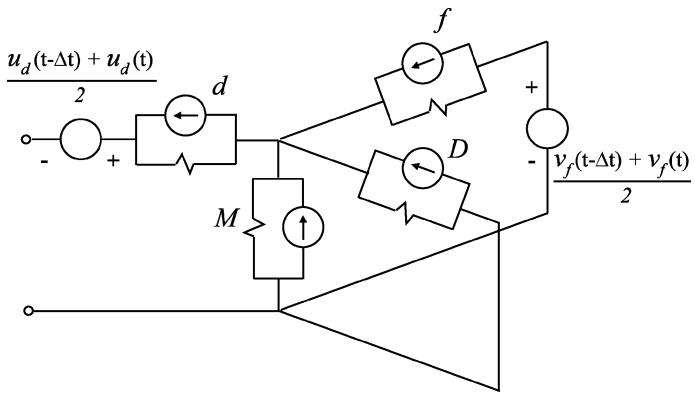  
Fig. 1. Example of discretized  axis equivalent circuit for the EMTP solution.

is shown in Fig. 1, where the conventional circuit elements are replaced by the sources and resistances due to discretization. The axis discretized circuit is similar and not shown here.

Based on the discretized circuit of Fig. 1, the machine’s Thevenin equivalent circuits are then formulated as depicted in Fig. 2(a). As explained in [4], this step requires the prediction of electrical variables, such as the speed voltage terms $u _ { d } ( t ) , u _ { q } ( t )$ and the field-winding voltage $v _ { f } ( t )$ , if the excitation is externally controlled. It is also observed from Fig. 2(a) that the equivalent resistances in the and axes, $r _ { d }$ and $r _ { q } ,$ , are usually not equal due to the saliency effect. If this is the case, then direct transformation of the Thevenin equivalent circuits of Fig. 2(a) into the coordinates will result in the time-variant conductance matrix which is not desirable. Instead, the resistances $r _ { d }$ and $r _ { q }$ may be averaged, and the new saliency terms $( r _ { d } - r _ { q } ) / ( 2 ) \cdot i _ { d } ( t )$ and $( r _ { q } - r _ { d } ) / ( 2 ) \cdot i _ { q } ( t )$ are then combined with the back electromotive-force terms $\it { e } _ { d }$ and $e _ { q }$ as shown in Fig. 2(b). Thus, to formulate the saliency terms using this method, the stator currents $i _ { d } ( t )$ and $i _ { q } ( t )$ are required to be predicted. Finally, the machine’s Thevenin equivalent circuits of Fig. 2(b) are transformed back to coordinates using the inverse transformation (6) and the predicted rotor angle .

Assuming that the system solution at $t - \Delta t$ is known and the solution at the next time step, at time is required, the aforementioned requires the prediction of several mechanical and electrical variables. The advantage of the prediction-based interfacing method resides in the fact that the resulting machine’s equivalent resistance submatrix is constant (assuming magnetically linear machine model). This constant submatrix is then used in (10) which also avoids re-factorization of the entire network conductance matrix at every time step. Programs, such as MicroTran (machine model Type 50) [15], EPRI/DCG EMTP [30] and Alternate Transients Program (ATP) (machine model Type 59) [14] utilize this method to interface the models with the external network.

However, the prediction of electrical variables may significantly deteriorate simulation accuracy and numerical stability (especially for large time steps) as has been documented in [31]–[34].

2) Norton Current Source Method: The machine model may also be interfaced with the network as a Norton current source. This type of machine-network interface is shown in Fig. 3 [16], [35], [36]. For the simplicity of the diagram, only one

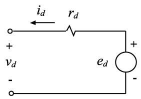  
(a)

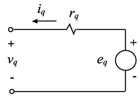

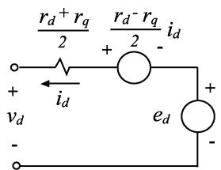  
(b)

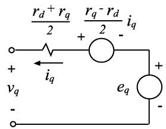  
Fig. 2. Discretized - Thevenin equivalent circuits for prediction-based interfacing method. (a) Circuit with different resistances in  and - axes due to saliency. (b) Circuit with averaged resistances to include the saliency effect.

phase is depicted. The injection current $i _ { m } ( t )$ is calculated using the terminal bus voltages from the previous time step, which implies a one time-step delay in calculating the machine variables. A problem of numerical instability may arise especially when the machine is in near open-circuit conditions. In order to improve the numerical stability and prevent the machine from being completely open-circuited, a terminating characteristic impedance/resistor $r ^ { \prime \prime }$ is introduced to the machine network interface [36]. The effect of this added resistor is then compensated by an additional current source $i _ { c } ( t )$ injected into the machine terminals as shown in Fig. 3. The value of this compensating resistor and the additional current source are calculated as follows [36]:

$$
r ^ {\prime \prime} = \frac {2 L ^ {\prime \prime}}{N \cdot \Delta t} \tag {11}
$$

$$
i _ {c} (t) = \frac {V (t - \Delta t)}{r ^ {\prime \prime}} \tag {12}
$$

where $L ^ { \prime \prime }$ represents the characteristic inductance of the machine, is the number of coherent machines in parallel, and $V ( t - \Delta t )$ is the terminal voltages from the previous time step. From Fig. 3, it is observed that the actual current injected into the network is given as

$$
i _ {m a} (t) = i _ {m} (t) + \frac {V (t - \Delta t) - V (t)}{r ^ {\prime \prime}}. \tag {13}
$$

As the time step is usually small, the characteristic impedance $r ^ { \prime \prime }$ is large. For small time steps, $V ( t - \Delta t ) \approx V ( t )$ , which gives $i _ { m a } ( t ) \approx i _ { m } ( t )$ .

This method is used, for example, in PSCAD/EMTDC [16] to interface all conventional machine models. In addition to traditional EMTP, the Norton equivalent interfacing has been adapted to the multiscale and shifted-frequency simulation approach [37]. The advantages of the Norton current source method are: 1) the machine equivalent resistance is very simple— $- r ^ { \prime \prime }$ per phase and 2) the interfacing resistance/impedance is constant (given a magnetically linear machine model). However, a one-time-step delay exists in the

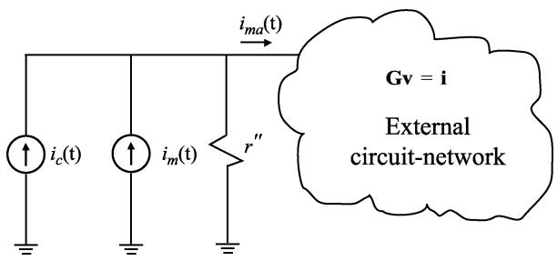  
Fig. 3. Norton current-source interface of the machine model with an external network.

injecting current $i _ { m } ( t )$ , and the extra interfacing error is being introduced due to the term $( V ( t - \Delta t ) - V ( \bar { t } ) ) / ( r ^ { \prime \prime } )$ . These factors may affect the simulation accuracy and numerical stability, and one should be mindful of these properties especially when considering large time steps.

3) Compensation-Based Method: In the compensationbased method [38], the machine model is treated as a nonlinear device. The external network is represented as a Thevenin equivalent circuit and is interfaced with the machine model in the axes. The prediction of rotor speed is used at the beginning of each time step to formulate the transformation matrix and to facilitate the solutions of machine equations in coordinates. The machine stator currents are then solved and injected into the external network as ideal current sources. The complete network solutions are therefore sought according to the superposition principle which superimposes the solutions with and without the nonlinear components (i.e., the machine model). The advantage of the compensation-based method is that the subsequent numerical iterations that may be required to obtain a convergent solution with nonlinear components are confined to the machine’s equations only. However, the compensation method requires the machines to be separated by the distributed-parameter transmission lines. Otherwise, artificial “stub-lines” are used which may complicate the network modeling and reduce the accuracy or require a very small time step to accommodate the models of very short lines. In ATP, the universal-machine (UM) model is implemented by using the compensation-based method [14], [38], [39].

4) Network Iterative Method: In EMTP-RV [17], the machine models are solved with the network equations simultaneously by using Newton’s iterative method [40], [41]. In addition, inside the EMTP-RV machine models, speed and voltage iterative loops are utilized to obtain a convergent solution of the machine equations at each time step [17]. These two loops are controlled by the user-specified error tolerances. Thus, the constraint existing with the compensation method and UM models that the machines need to be separated by transmission lines is eliminated. However, iterative solutions of the machine and network equations at every time step generally require more computational resources and, therefore, reduce the overall simulation efficiency. At the same time, if a large time step is used, the system may converge at a solution that is slightly away from the correct solution even after several iterations and high tolerance settings. This effect may subsequently result in the shift of the solution trajectories relative to the correct solutions.

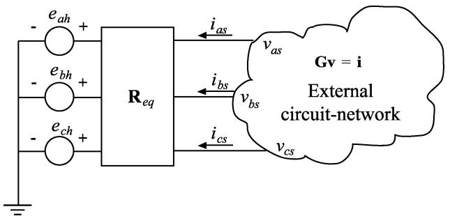  
Fig. 4. Thevenin equivalent circuit for interfacing PD and VBR machine models in EMTP.

# B. Direct Approaches

To improve the simulation accuracy and numerical stability, coupled-circuit PD models [31], [32], [44]–[49] and voltage-behind-reactance (VBR) models [12], [33], [34] have been proposed, respectively. Thus, the direct interface with the external network is readily achieved since the stator circuit is naturally represented in the coordinates. The machines are interfaced with the external network as three-phase Thevenin equivalent circuits. For example, such an interface is shown in Fig. 4, assuming a Y-connected stator winding. No electrical variables are predicted, and the slow mechanical variables (rotor speed and/or position $\theta _ { r , \cdot }$ ) are predicted similar to the other EMTP interfacing methods. This achieves a simultaneous solution of machine and network electrical equations (variables) and greatly improves the numerical accuracy and stability of these models.

The generic interfacing equation for PD and VBR machine models, using the Thevenin equivalent circuit method, can be represented as

$$
\mathbf {v} _ {a b c s} = \mathbf {R} _ {\mathrm {e q}} \mathbf {i} _ {a b c s} + \mathbf {e} _ {h} \tag {14}
$$

where $\mathbf { R } _ { \mathrm { e q } }$ is the equivalent resistance matrix and $\mathbf { e } _ { h }$ is the equivalent history voltage source that contains the information from the previous time steps. This equation is obtained by discretizing the voltage equations of the respective model using the implicit trapezoidal rule and then carefully arranging the terms to achieve the compact form (14). The matrix $\mathbf { R } _ { \mathrm { e q } }$ is used to calculate the equivalent conductance submatrix and modify the network matrix and the history current source vector $\mathbf { I } _ { h }$ in (10). Although similar in terms of the interfacing equation, the PD and VBR models have significant differences in terms of their numerical properties and computational costs for calculating terms in (14).

1) Phase-Domain Model: The PD model is based on discretization of (3) and (4) and calculation of the electromagnetic torque according to (5). However, the existence of time-variant self and mutual inductances in (4) increases the computational burden of this model. Generally, matrix $\mathbf { R } _ { \mathrm { e q } } ^ { \mathrm { p d } }$ and the equivalent history voltage source $\mathbf { e } _ { h } ^ { \mathrm { p d } }$ are quite costly to calculate, and it has to be performed at each time step. Moreover, as the analysis has shown, the discretized PD model may have eigenvalues that are far outside the unit circle, which further reduces the numerical accuracy per time step achievable by this model. However, due to its advantageous direct interface, this model has been well

recognized. Present implementations of the PD model include Type 58 machine model [45]–[47] in ATP and the VTB machine model [48] as well as its previous implementations [31], [42]–[44], [49].

2) Voltage-Behind-Reactance Model: The VBR formulation is based on algebraically manipulating the machine equations (3)–(9) in order to achieve the following voltage equation for the stator circuit [33], [34], [50]:

$$
\mathbf {v} _ {a b c s} = \mathbf {R} _ {s} \mathbf {i} _ {a b c s} + \frac {d}{d t} \left[ \mathbf {L} _ {a b c s} ^ {\prime \prime} \left(\theta_ {r}\right) \mathbf {i} _ {a b c s} \right] + \mathbf {e} _ {a b c s} ^ {\prime \prime} \tag {15}
$$

where the terms $\mathbf { L } _ { a b c s } ^ { \prime \prime } ( \theta _ { r } )$ and ${ \mathbf { e } } _ { a b c s } ^ { \prime \prime }$ are the so-called subtransient inductance matrix and voltages, respectively, and the rotor is modeled by using the flux linkages as independent variables. The presently reported implementations include synchronous machines [50], [33] and induction machines [34], [76], [77].

The VBR model also represents the stator circuit branches in the phase coordinates. Following the same discretization procedure using implicit trapezoidal rule, the VBR models [33], [34] also enable direct interface of the machine model with the external network according to Fig. 4 and interfacing (14). Similar to the PD model, simultaneous EMTP solution of the network and machine electrical variables is achieved without the prediction of any electrical variables. However, the terms $\mathbf { R } _ { \mathrm { e q } } ^ { v b r }$ and $\mathbf { e } _ { h } ^ { v b r }$ in (14) require less than half of the flops and are much easier to compute compared to the equivalent PD model [33], [34]. Also, the eigenvalues of the discretized VBR model tend to be better conditioned which improves the numerical accuracy.

# C. Case Studies With EMTP

To demonstrate the behavior of various models and their interfaces in a clear way, a single-machine infinite-bus system with a steam-turbine generator is assumed. The corresponding parameters are summarized in the Appendix. The same system has been implemented using several popular EMTP software packages, including MicroTran, ATP, PSCAD, EMTP-RV, as well as the PD and VBR models [33].

In the transient study considered here, the machine initially operates in an idle steady-state mode with the load torque $T _ { m } =$ . Throughout the study, the excitation is kept constant at nominal value. $\mathbf { A } \mathbf { t } \ t = 0$ , a symmetric three-phase fault is applied at the machine terminals. Observing all considered models it was found that their dynamic responses are all convergent to the same solution. This is an expected result since the identical machine parameters were used in each case, which also proves the consistency of these software packages and different models. To produce a very accurate solution, the same study was also run using a small time step of $\Delta t = 1 \mu \mathrm { s }$ . The solution trajectories produced with this small time step were then considered as a reference for responses produced by various models using different time steps.

Overall, it was observed that the accuracy of various models may be significantly affected by the time-step size. To illustrate this point, the transient solutions predicted by various models using a fairly large time step of 1 ms are shown in Figs. 5–7. Due to the limited space, the plotted variables are limited to

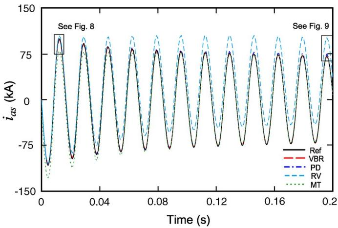  
Fig. 5. Phase current as predicted by various models using a time step of 1 ms.

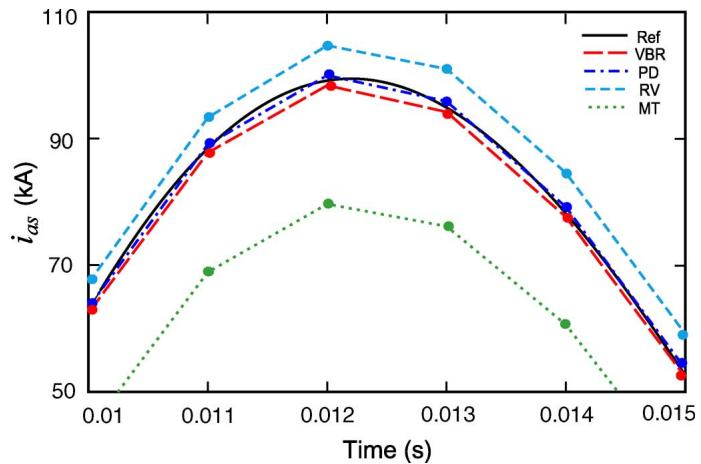  
Fig. 8. Detailed view of the beginning transient of $i _ { \mathrm { a s } }$ with a time step of 1 ms.

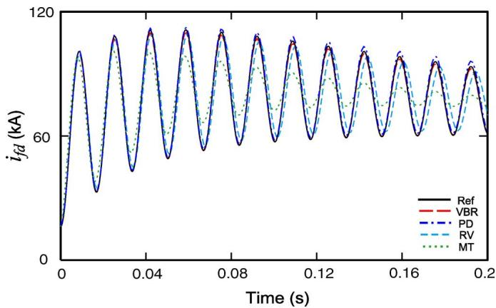  
Fig. 6. Field current as predicted by various models using a time step of 1 ms.

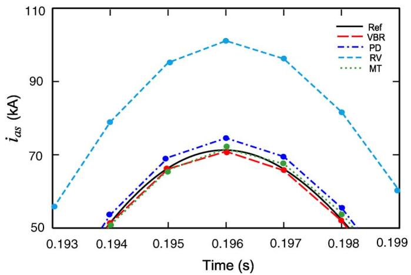  
Fig. 9. Detailed view of $\dot { \iota } _ { \mathrm { a s } }$ in the end of study using a time step of 1 ms.

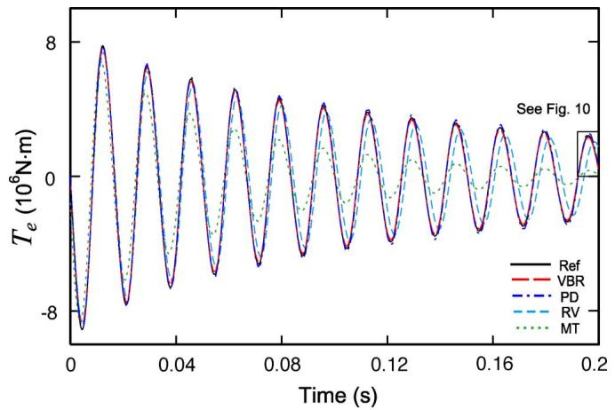  
Fig. 7. Electromagnetic torque as predicted by various models using the time step of 1 ms.

the -phase current $i _ { a s } ,$ the field current $i _ { f d } ,$ , and the electromagnetic torque $T _ { e }$ . The $q d$ models of PSCAD and ATP were not convergent with the given time step and, therefore, are not shown in Figs. 5–7. The studies were conducted using the time steps of 50 $\mu \mathbf { s } ,$ , 100 $\mu \mathrm { s } .$ , and 1 ms.

To evaluate the accuracy of each modeling interface approach, it is possible to compare the error of each model with respect to the known reference solution. Without the loss of

generality, the peak of electromagnetic torque shown in Figs. 7 and 10 at time $t = 0 . 1 9 6 \mathrm { ~ s ~ }$ has been considered. The value of the torque predicted by each model has been compared with the reference value to calculate the relative error at this time. Although there are various methods of evaluating the accuracy of trajectories [33], in this paper the relative error of the peak has been considered as a sufficient and an illustrative measure. The results of error calculations for all considered models are summarized in Table I. The studies performed using a typical time step $5 0 \mu \mathrm { s }$ were visually very close for all the models. This is also consistent with the errors summarized in Table I for this time step size. However, the accuracy of models with indirect interface deteriorates quickly when the step size is increased to 100 $\mu \mathrm { s }$ and above. Finally, at the large time step of 1 ms, the only stable models are MT, RV, PD, and VBR. Figs. 8–10 show the details of the phase current $i _ { a s }$ and torque $T _ { e }$ for the remaining stable models. As can be seen in these figures, the solutions of some models clearly deviate from the reference solution. On the one hand, the very significant errors of MT and RV models (and the non-convergence of the PSCAD and ATP models) are attributed to the indirect interface of these models. Table I (third row) summarizes the errors in predicting the torque $T _ { e }$ corresponding to Fig. 10. Such errors are quite large, and would limit the usefulness or validity of the models

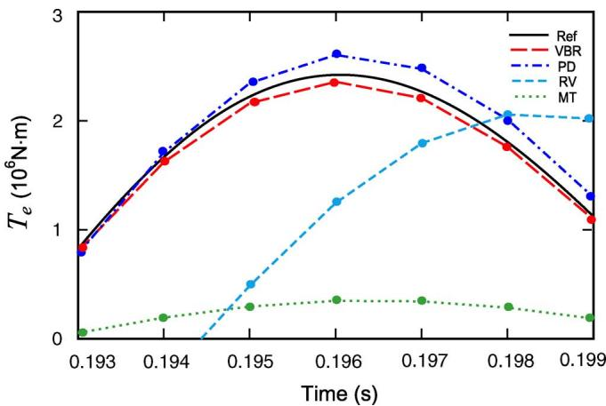  
Fig. 10. Detailed view of electromagnetic torque $T _ { e }$ in the end of the study using a time step of 1 ms.

TABLE I COMPARISONS OF MODEL ACCURACY USING A PEAK OF TORQUE AT 0.196 S   

<table><tr><td>Models</td><td>MT</td><td>ATP</td><td>PSCAD</td><td>EMTP-RV</td><td>PD</td><td>VBR</td></tr><tr><td>50μs</td><td>0.037%</td><td>0.75%</td><td>0.8%</td><td>0.7%</td><td>0.42%</td><td>0.0041%</td></tr><tr><td>100μs</td><td>0.24%</td><td>1.5%</td><td>1.1%</td><td>1.4%</td><td>0.85%</td><td>0.037%</td></tr><tr><td>1ms</td><td>86%</td><td>N/A</td><td>N/A</td><td>49%</td><td>7.5%</td><td>2.7%</td></tr></table>

with indirect interface to the time steps of no more than 100 to 200 s. On the other hand, the models with direct circuit interface, PD and VBR, remain stable and relatively accurate even at such a large time step of 1 ms (with the last one offering the most accuracy).

# IV. INTERFACING MACHINE MODELS IN STATE VARIABLE-BASED PROGRAMS

The SV approach is also used for the analysis of dynamic systems, including electric power systems [51]–[58] and the electrical machines in particular [59]–[61]. The examples of software packages include ACSL, Easy5, Eurostag, and, of course, the MATLAB/Simulink. There are also more specialized tools, such as SimPowerSystems (SPS) [62], PLECS [63], and ASMG [64], etc., that come with circuit interfaces and built-in libraries for the simulation of transients in power and power-electronic circuits. Internally, the program engine assembles the system of differential and/or differential algebraic equations (DAEs) that constitute the state-variable-based model of the overall system. Depending upon the features of a given program, the DAEs may be converted into a first-order system of ordinary differential equations (ODE) as

$$
\begin{array}{l} \frac {d \mathbf {x}}{d t} = \mathbf {f} (\mathbf {x}, \mathbf {u}, t) \\ \mathbf {y} = \mathbf {g} (\mathbf {x}, \mathbf {u}, t) \tag {16} \\ \end{array}
$$

where is the vector of state variables, is the vector of inputs, is a scalar to denote time, and is the vector of outputs. Whenever appropriate, the linear time-invariant part of the

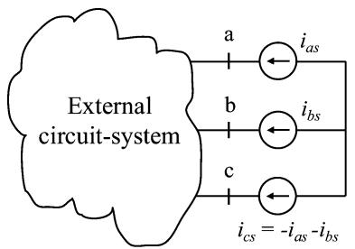  
Fig. 11. Machine model interface in state-variable-based programs using voltage-controlled current sources.

system/circuit may then be represented by using a more compact state-space equation

$$
\begin{array}{l} \frac {d \mathbf {x}}{d t} = \mathbf {A x} + \mathbf {B u} \\ \mathbf {y} = \mathbf {C x} + \mathbf {D u} \tag {17} \\ \end{array}
$$

where , and are the so-called state-space matrices that are computed for the given topology and parameters of the linear circuit. In some tools, such as SimPowerSystems, the circuit part is directly implemented in the form of (17), whereas the remaining part of the system (e.g., control blocks, mechanical subsystem, etc.) are in a more general form (16).

The time-domain transient responses are then calculated numerically by integrating the state-space equation (16)–(17) by using either fixed- or variable-step ODE solvers embedded in the SV program. The formulations (16)–(17) also contain useful information about the system’s dynamical modes which is often utilized together with numerical linearization for the frequencydomain characterization and the design of controllers.

Similar to EMTP, the machine models in SV programs may differ depending on the choice of reference frames/coordinates and selection of the state variables. The commonly considered models here also include the classical , the coupled-circuit PD, and the VBR models. These models may then be interfaced with the external circuit system using either direct or indirect approaches as will be explained.

# A. Indirect Approach

The machine models are very common and appear as the built-in library components in many SV simulation tools, including SimPowerSystems and PLECS. To interface the models with the external circuits, which is typically modeled in physical variables and phase coordinates, it is usually assumed that the machines are represented by voltage-controlled current sources [62], [63] as shown in Fig. 11. The reason for using the controlled-current-sources resides in the fact that the machine model is usually formulated as a proper state-variable model with flux linkages and/or currents as internal state variables, and the machine’s terminal voltages as the inputs. Therefore, the interfacing method shown in Fig. 11 assumes a voltage-input, current-output machine model. This input–output requirement of the machine model is determined by its proper state model and results in compatible and incompatible interconnection with the external circuit system

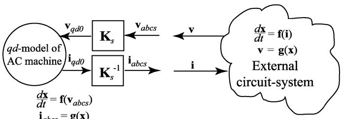

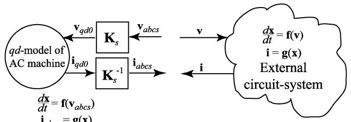  
(a)   
(b)   
Fig. 12. Compatible and incompatible machine-network interfaces in state-variable-based programs. (a) Input–output compatible. (b) Input–output incompatible.

as depicted in Fig. 12. Here, the external system may be a circuit and/or subsystem which is represented by its own state equations similar to (16) and (17).

As shown in Fig. 12(a), when the external circuit system has a current-input voltage-output characteristic at the interfacing terminals, it matches the machine model input and output. For example, this interface is possible whenever the external circuit system has capacitors and/or defined voltage sources that are connecting to the machine’s terminals. In this case, the combined state equation for the entire system is readily formed by simply routing the respective input and output variables among the coupled subsystems models.

However, such an interface is not always available due to constraints of the external circuits system which itself may have voltage-input current-output characteristic (similar to the machine model) as shown in Fig. 12(b). For example, the external system may be another synchronous machine model which is supposed to represent a generator in the power system. In the case of an incompatible input–output interface as in Fig. 12(b), the combined state equations cannot be directly formulated as the needed input variables (voltages) are unknown.

In order to demonstrate the concept of an incompatible interface, a simpler example is shown in Fig. 13(a). Here, an inductor is connected in series with a voltage-controlled current source $( d i _ { m } ) / ( \mathrm { d t } ) = \mathrm { f } ( \boldsymbol { v } )$ (which may be another inductor). This example may be viewed as a simplified machine-network system since the machine models are usually represented as voltagecontrolled current sources according to Fig. 11. As seen in Fig. 13(a), from the block diagram realization of these components, inductor and current source require the terminal voltage as input and produce currents as output, thus creating an incompatible interface.

1) Indirect Interfacing Using Snubbers: To enable the connection of these components and create a compatible interface, an artificial snubber circuit may be used to calculate the required input variable—the terminal voltage. For example, a snubber

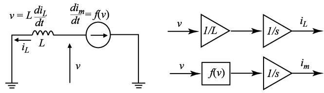  
(a)

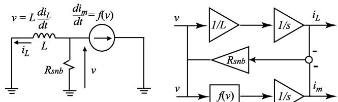  
(b)   
Fig. 13. Example of interface in state-variable-based programs using an artificial snubber circuit. (a) Incompatible interface. (b) Interface with snubber resistance.

may be realized by using a very large resistor connected in parallel to the terminals as shown in Fig. 13(b). As can be seen in the block diagram implementation of Fig. 13(b), the added snubber is used to calculate the required terminal voltage. Here, the snubber current is calculated as the difference between the inductor current and that of the current source. This, in turn, enables the formulation of the proper state-space model of the combined system. Alternatively, one may also use a very small capacitor which will perform a similar function here.

The value of these snubbers should be selected so that the drawing current is sufficiently small and may be considered negligible within the scope of the model and studies being considered. Solving the combined system together using a single ODE solver ensures simultaneous solution of all its subsystems, albeit the solution trajectories will be affected (shifted) due to the snubbers. However, in general, these artificial snubber circuits may significantly affect the simulation accuracy and efficiency and, therefore, should be used with care. Examples of interfacing the built-in machine models using snubber circuits include SimPowerSystems [62] and PLECS [63].

2) Indirect Interfacing Using Time-Step Relaxation: The indirect interfacing may also be a powerful tool when the machine model and the external circuit system are formulated to have an input-output-compatible interface of the type Fig. 12(a). The numerical relaxation can be achieved if the interfacing variables are simply exchanged (updated) at each time step, allowing for the decoupled and parallel solution of each subsystem. This option may be useful, for example, when the machine model is discretized using different ODE solver and is then interfaced to the network. For example, in order to avoid forming algebraic loops, the SimPowerSystems also uses such interfacing approach when the external circuit system is discretized with the trapezoidal rule (therein referred as Tustin method) separately from the remaining Simulink blocks, while the machine models are discretized with the Forward Euler method [62]. This interface is similar to the sample-hold (zero-order-hold) that is typically attained in hardware-in-the-loop simulations [65] or the multirate simulations [66] (with or without iterations).

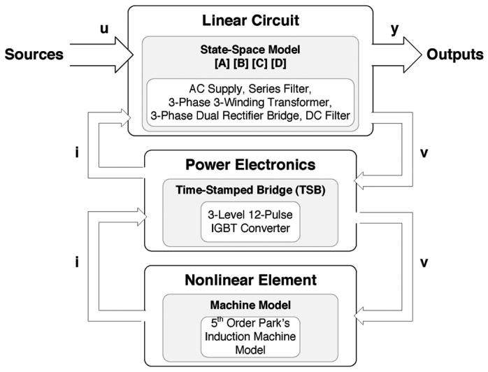  
Fig. 14. Example of the machine model interfaced with a voltage-source inverter for real-time simulation [67].

This type of indirect interfacing method has also been successfully used in real-time simulations of multilevel variable frequency drives [67]. Therein, the complete electrical model was divided into three subsystems as shown in Fig. 14. All of the linear circuit elements (ac supply, series filter, transformer, the three-phase dual rectifier bridge, and the dc filter) were modeled using state space (17). The three-phase dual rectifier bridge is treated as a linear circuit since it is modeled by ideal switches. The second subsystem, the IGBT converter, was modeled by using a first-level feedback interfacing with the main state-space model through the input voltages and output currents. As depicted in Fig. 14, the IGBT converter model is formulated to provide the voltage output required by the state model of the machine, thus enabling an input-output-compatible interface. However, using time-step relaxation and solving the models separately allows the use of custom-machine models and permits using multirate integration techniques for the overall system. Moreover, accurate real-time simulation of power-electronic converters typically requires smaller time steps and correction algorithms [68] to account for the interstep switching events. An example of this interfacing approach, used with multirate integration, includes a field-programmable gate array (FPGA)-based hardware-in-the-loop simulation of a drive system [69], where the converter model and machine model were using very different time steps of 12.5 ns and 10 s, respectively. Using sufficiently small time steps ensures convergence of this type of interfacing.

# B. Direct Approaches

Whenever the external circuit system can be formulated to have an input–output compatible interface with the machine model as depicted in Fig. 12(a), the respective models can be directly connected [59]–[61] and solved together by the same ODE solver. This achieves a simultaneous solution of machine and network subsystems, which is desirable for numerical stability and good accuracy. Alternatively, the PD and VBR models can also be used in SV programs with the same goal of achieving a direct interface.

1) Phase-Domain Model: As can be seen from (3) and (4), the state model can be formed by using either the flux linkages as the state variables, which gives the following state equation:

$$
\frac {d \boldsymbol {\lambda}}{\mathrm {d t}} = - \mathbf {R} \left[ \mathbf {L} \left(\theta_ {r}\right) \right] ^ {- 1} \boldsymbol {\lambda} + \mathbf {v} \tag {18}
$$

or the currents as the state variables, which gives a somewhat different structure but otherwise algebraically equivalent state equation

$$
\frac {d \mathbf {i}}{\mathrm {d t}} = - \left[ \mathbf {L} \left(\theta_ {r}\right) \right] ^ {- 1} \cdot \left[ \left(\mathbf {R} + \frac {d}{\mathrm {d t}} \mathbf {L} \left(\theta_ {r}\right)\right) \mathbf {i} - \mathbf {v} \right]. \tag {19}
$$

The PD model can be implemented as a coupled circuit that is simply either a part of the overall circuit-system or a subsystem with voltage input and current output [as in Fig. 12(a) and as defined by either (18) or (19)]. To do this, one has to implement stator and rotor branches with all of the respective self and mutual inductances that appropriately change with the rotor position [70]. Of course, one should be mindful of the complexity of implementing the variable inductances in (4) and (5) and (18) or (19). Otherwise, the model is a straightforward inductive circuit with rotor-position-dependent magnetic coupling among the branches. The direct implementation of PD models includes [42], [70]–[73], etc., which can be readily carried out using, for example, ASMG, wherein the user has a choice of currents and/or fluxes as the state variables. Higher fidelity PD models may also be obtained by utilizing the finite-element analysis (FEA)-based programs first for constructing detailed representation of the windings [74], [75].

2) Voltage-Behind-Reactance Model: As was mentioned in Section III-B, the full-order models of either synchronous or induction machines can be formulated in the VBR form (15) [50], [76], [77]. In this formulation, the stator circuit is expressed in terms of subtransient resistances/inductances in coordinates using phase currents as the independent variables, and the rotor subsystem is expressed in variables and coordinated using flux linkages as the state variables. As a result, the equivalent stator branches can be readily included into the external circuit as depicted in Fig. 15, thus achieving a direct interface. Unlike the interface depicted in Fig. 11, here the current-controlled voltage sources are utilized to represent the stator subtransient voltages ${ \mathbf { e } } _ { a b c s } ^ { \prime \prime }$ . This is easily achievable as it preserves the voltage-input current-output structure of the external circuit system as in Fig. 12(b). At the same time, the rotor state model is formulated to have stator currents $\mathbf { i } _ { a b c s }$ as inputs and the subtransient voltages ${ \mathbf { e } } _ { a b c s } ^ { \prime \prime }$ as the output, thus forming a direct interface. Depending on the interfacing requirements, the equivalent stator branches can have a different structure for synchronous machine [50], [65], [66] and for induction machine [76], [77]. For example, due to the symmetry of induction machine, there may be several implementations of the VBR model to account for possible connection of the stator windings (delta, wye, grounded/ungrounded neutral, etc.). One implementation [76, Sec. IV, VBR-III] results in constant and decoupled branches (diagonal resistance and inductance matrices). Therefore, interfacing machine models using this approach can be easily carried out in various simulation tools, such as Matlab/

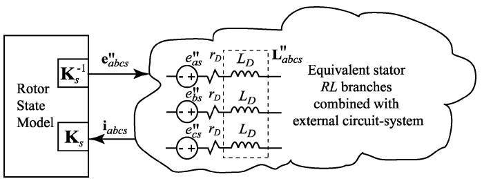  
Fig. 15. Interfacing induction machine model with an external circuit using voltage-behind-reactance machine model formulation.

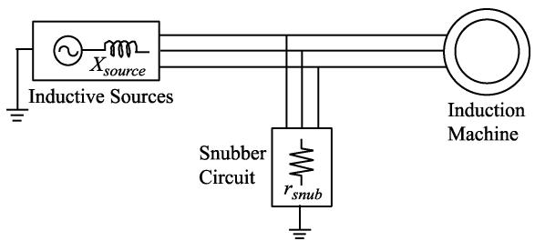  
Fig. 16. Induction machine is fed from a voltage source with inductive impedance. Artificial shunt resistors are used to interface the model.

Simulink, for non-real-time applications using SimPowerSystems [77] as well as for real-time hardware-in-the-loop simulations [65].

# C. Case Studies With SV Programs

To demonstrate the interfacing methods described in this section, a system composed of an induction motor, fed from an inductive source with reactance $X _ { \mathrm { s o u r c e } } ,$ , is considered here. The corresponding circuit diagram is depicted in Fig. 16, where the artificial snubber resistors $r _ { \mathrm { s n u b } }$ required by the indirect interfacing approach are also shown. The system’s parameters are summarized in the Appendix for consistency. This simple system is quite sufficient to demonstrate and explain the behavior of the underlying interfaces.

A no-load startup transient is considered here as this study spans a wide range of operating conditions in terms of mechanical and electrical variables. The time-domain responses of the rotor phase current $i _ { \mathrm { a r } }$ predicted by the considered models are shown in Fig. 17. Other variables were consistent with previously published literature [76], [77] and are not included here due to space considerations. The models with direct and indirect interfaces have been implemented in Matlab/Simulink using the ASMG and SimPowerSystems (SPS) toolboxes. In particular, to obtain a reference solution, the VBR model was run with a very small time step of 1 $\mu \mathbf { S } .$ . The built-in model of Sim-PowerSystems is used here to demonstrate the indirect interface requiring snubbers ( -SPS). The directly interfaced PD model can be implemented by using either currents (PD- ) or flux linkages (PD- ) as the state variables, respectively. These two models have been implemented using the ASMG toolbox which permits including branches with variable self and mutual inductances and allows for the choice of state variables. The last model with direct circuit interface is the VBR model that can be easily implemented in either SimPowerSystems or ASMG, yielding identical results [76], [77].

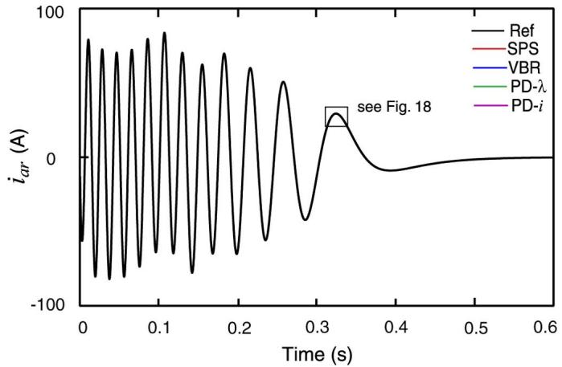  
Fig. 17. Rotor current during startup transient as predicted by models with different interfacing methods.

TABLE II MODEL EFFICIENCY COMPARISONS   

<table><tr><td>Model</td><td>qd-SPS</td><td>VBR</td><td>PD-λ</td><td>PD-i</td></tr><tr><td>CPU Time, s</td><td>1.703</td><td>0.266</td><td>0.297</td><td>0.844</td></tr><tr><td>Num. of Steps</td><td>10015</td><td>2091</td><td>1732</td><td>2262</td></tr><tr><td>CPU Time per Step, μs</td><td>170.0</td><td>127.2</td><td>171.5</td><td>373.1</td></tr></table>

To provide a fair comparison, the same solver, ODE15s, was used for each model. To ensure smooth and accurate solutions that approach the reference trajectory, the relative and absolute error tolerances were set to $1 0 ^ { - 6 }$ , and the maximum and minimum time-step limits were set to $1 0 ^ { - 3 }$ and $1 0 ^ { - 1 0 } \ \mathrm { s } ,$ , respectively. As seen in Fig. 16, due to the inductance $X _ { \mathrm { s o u r c e } }$ in the source, the direct connection of the -SPS is not possible, thus resulting in an indirect interface which requires snubbers $r _ { \mathrm { s n u b } } .$ To achieve acceptable accuracy and visibly the same results as shown in Fig. 17, we used fairly large snubbers $r _ { \mathrm { s n u b } } = 1 0 0 0 \Omega .$ .

Assuming the same simulation accuracy for each model, the numerical efficiency of the interfacing methods may be evaluated by considering two factors: 1) the total number of integration steps taken to complete the study and 2) the computational load/cost per time step. The studies were run on a personal computer (Pentium 4, 2.66-GHz processor) using standard (not compiled, non-real-time) Simulink. The total CPU times, number of integration steps, and CPU times per step required to complete the study of Fig. 17 are summarized in Table II.

As can be observed in Table II, all models with a direct interface performed similarly in terms of the number of time steps taken (1732 to 2262). The longer CPU time required by the PDmodel is attributed to the rotor-position-dependent inductance matrix and its time derivative in (19), which is more costly than (18). The VBR model does not have any variable inductances and is therefore the fastest. At the same time, the -SPS took about five times more integration steps (10 015) to satisfy the same error tolerances.

To analyze the results of these studies, a fragment of the transient is shown in more detail in Fig. 18. The first property to notice is that the models with direct interface took fairly large time steps. Among these models, the results produced by VBR

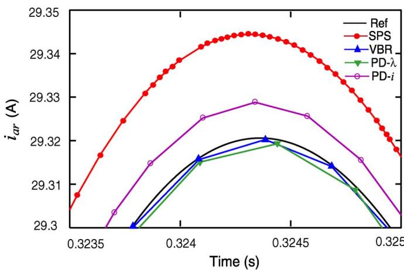  
Fig. 18. Detailed view of the rotor current transient predicted by models with different interfacing methods. The relative errors are calculated by considering peak values at time  - 0.3243 s.

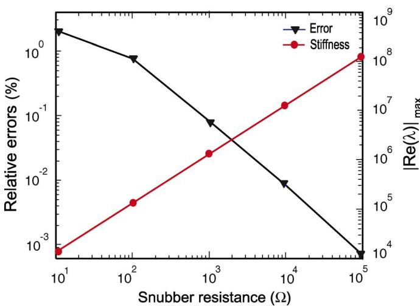  
Fig. 19. Relative error and numerical stiffness for different values of the snubber circuit in the indirect interfacing method.

and PD- models appear to be close to the reference solution. At the same time, the -SPS not only required significantly more steps but it also converged to a different solution than the reference. This phenomenon is consistent with the fact that due to snubbers, the stator current (and, therefore, rotor current as well) will be somewhat different compared to the models that do not have such snubbers.

The effect of varying the snubbers is further investigated in Figs. 19 and 20. Here, the same simulation study was conducted again several times using the indirectly interfaced -SPS model with the snubber resistance changed in the range from 10 to 100 000 , respectively. Fig. 19 (left vertical axis) shows the relative error of the rotor phase current $i _ { \mathrm { a r } } .$ Similar to the studies in Section III-C, this error was calculated by considering the peak values at a given time instance (e.g., $t = 0 . 3 2 4 3 \ \mathrm { : }$ s) shown in Fig. 18. As can be seen in Figs. 18 and 19, the 1000 snubber resistance results in a relative error of about 0.1%, which may be considered acceptable for many applications. If needed, this error can be reduced even further by increasing the value of the

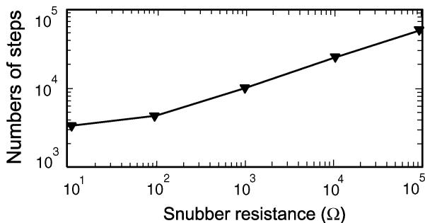  
Fig. 20. Number of integration time steps taken to complete the 0.6-s study for different values of the snubber circuits in the indirect interfacing method.

snubbers, for example, to 10 000 or 100 000 , which may appear as a good option. However, one has to be aware of the potential challenges introduced by the snubber approach.

In general, adding the snubbers introduces the new current loops into the circuit and changes the state-space model by adding the associated dynamic modes. When the snubber resistors are made very large, the eigenvalues associated with these dynamic modes also become very large. This phenomenon is shown in Fig. 19 (right vertical axis). These very large eigenvalues contribute to the numerical stiffness of the system. As can be observed here, the additional 1000 snubbers introduced the eigenvalues on the order of $1 0 ^ { 6 }$ to the system that was otherwise non-stiff. The consequence of numerical stiffness is that the ODE solver would generally require smaller time steps in order to satisfy the needed tolerances. This effect is demonstrated in Fig. 20, which shows the number of integration time steps taken to complete the same study for different values of the snubbers. This also explains why the -SPS model required significantly more time steps as summarized in Table II and can be clearly seen in Fig. 18.

# V. CONCLUSION

This paper gives an overview of the interfacing methods that are available and used for implementing the existing models of rotating electrical machines in the commonly used simulation programs. We first discuss the machine models and their interfacing approaches that are applicable to the EMTP-type programs that are based on discretization of the circuit elements and subsequent solution of the nodal equations. Both indirect and direct interfacing approaches are demonstrated on an example system with one synchronous machine using a number of available models and EMTP software versions. It is suggested that machine models with indirect interface should be used with care especially for time steps larger than 100 to 200 s, that is, when their accuracy may start to deteriorate.

The methods of interfacing the machine models in state-variable-based simulation programs can also be classified as direct and indirect. Similar to the EMTP, the direct interfacing of machine models offers better numerical accuracy and can be used with much larger time-step sizes. In many cases, the direct interfacing may be achieved either by appropriately formulating the systems equations or by using more contemporary machine models (i.e., PD and/or VBR). The indirect interfacing that is

achieved using artificial snubbers is a simple but yet very practical way of interconnecting otherwise input-output incompatible subsystems (i.e., the machine model and the external circuit-system). When the machine model and the external circuit can form input-output compatible subsystems, interfacing them using a time-step relaxation and solving the machine model separately, is another simple method of interconnecting the machine models. When these approaches are used, one should be aware of a potential deviation of the solution trajectory, impact on the numerical stiffness of the system, and restrictions on the step size.

# APPENDIX

Synchronous machine parameters [3]: Steam turbine generator, 835 MVA, 26 kV, 0.85 pf, 2 poles, 3600 r/min

$$
J = 0. 0 6 5 8 \times 1 0 ^ {6} \mathrm {J} \cdot \mathrm {s} ^ {2}, H = 5. 6 \mathrm {s},
$$

$$
r _ {s} = 0. 0 0 2 4 3 \Omega ,
$$

$$
X _ {l s} = 0. 1 5 3 8 \Omega , X _ {q} = 1. 4 5 7 \Omega , r _ {k q 1} = 0. 0 0 1 4 4 \Omega ,
$$

$$
X _ {l k q 1} = 0. 6 5 7 8 \Omega , \quad r _ {k q 2} = 0. 0 0 6 8 1 \Omega ,
$$

$$
X _ {l k q 2} = 0. 0 7 6 0 2 \Omega ,
$$

$$
X _ {d} = 1. 4 5 7 \Omega , r _ {f d} = 0. 0 0 0 7 5 \Omega , X _ {l f d} = 0. 1 1 4 5 \Omega ,
$$

$$
r _ {k d} = 0. 0 1 0 8 \Omega , X _ {l k d} = 0. 0 6 5 7 7 \Omega .
$$

Induction machine parameters [3]: 3-HP, 220 V, 1710 r/min, 4 poles, $6 0 \mathrm { - } \mathrm { H z } , r _ { s } \ = \ 0 . 4 3 5 \ \Omega , X _ { l s } \ = \ 0 . 7 5 4 \ \Omega , X _ { m } \ =$ $2 6 . 1 3 \Omega , r _ { r } = 0 . 8 1 6 \Omega , X _ { l r } = 0 . 7 5 4 \Omega , J = 0 . 0 8 9 \mathrm { k g \cdot m ^ { 2 } }$

Source reactance $X _ { \mathrm { s o u r c e } } = 0 . 3 7 7 \Omega ;$

Snubber resistance $r _ { \mathrm { s n u b } } = 1 0 0 0 \Omega .$

# REFERENCES

[1] R. H. Park, “Two-reaction theory of synchronous machines-generalized method of analysis,” AIEE Trans., vol. 48, pp. 716–727, July 1929.   
[2] P. Kundur, Power System Stability and Control. New York: McGraw-Hill, 1994, ch. 4.   
[3] P. C. Krause, O. Wasynczuk, and S. D. Sudhoff, Analysis of Electric Machinery and Drive Systems, 2nd ed. Piscataway, NJ: IEEE Press, 2002.   
[4] H. W. Dommel, EMTP Theory Book. Vancouver, BC, Canada: MicroTran Power System Analysis Corp., May 1992, ch. 8.   
[5] Y. Cui, H. W. Dommel, and W. Xu, “A comparative study of two synchronous machine modeling techniques for EMTP simulation,” IEEE Trans. Energy Convers., vol. 19, no. 2, pp. 462–463, Jun. 2004.   
[6] E. Kyriakides, G. T. Heydt, and V. Vittal, “On-line estimation of synchronous generator parameters using a damper current observer and a graphic user interface,” IEEE Trans. Energy Convers., vol. 19, no. 3, pp. 499–507, Sep. 2004.   
[7] O. Rodriguez and A. Medina, “Synchronous machine stability analysis using an efficient time domain methodology: Unbalanced operation analysis,” in Proc. IEEE Power Eng. Soc. Summer Meeting, 2002, vol. 2, pp. 677–681.   
[8] O. Rodriguez and A. Medina, “Efficient methodology for stability analysis of synchronous machines,” Proc. Inst. Elect. Eng., Gen., Transm. Distrib., vol. 150, no. 4, pp. 405–412, Jul. 2003.   
[9] O. Rodriguez and A. Medina, “Efficient methodology for the transient and periodic steady-state analysis of the synchronous machine using a phase coordinates model,” IEEE Trans. Energy Convers., vol. 19, no. 2, pp. 464–466, Jun. 2004.

[10] K. H. Chan, E. Acha, M. Madrigal, and J. A. Parle, “The use of direct time-phase domain synchronous generator model in standard EMTPtype industrial packages,” IEEE Power Eng. Rev., vol. 21, no. 6, pp. 63–65, Jun. 2001.   
[11] K. H. Chan, J. A. Parle, and E. Acha, “Real-time transient simulation of multimachine power system networks in the phase domain,” Proc. Inst. Elect. Eng., Gen., Transm. Distrib., vol. 151, no. 2, pp. 192–200, Mar. 2004.   
[12] L. Wang, J. Jatskevich, and H. W. Dommel, “Reexamination of synchronous machine modeling techniques for electromagnetic transient simulations,” IEEE Trans. Power Syst., vol. 22, no. 3, pp. 1221–1230, Aug. 2007.   
[13] H. W. Dommel, “Digital computer solution of electromagnetic transients in single- and multiphase networks,” IEEE Trans. Power App. Syst., vol. PAS-88, no. 4, pp. 388–399, Apr. 1969.   
[14] “Alternative Transients Programs, Rule Book,” ATP–EMTP, ATP User Group, OR, 1995.   
[15] “Transients Analysis Program for Power and Power Electronic Circuits, Reference Manual,” MicroTran Power System Analysis Corp., BC, Canada, 1997. [Online]. Available: http://www.microtran.com   
[16] “PSCAD/EMTDC V4.0 On-Line Help,” Manitoba HVDC Research Center and RTDS Technologies, Inc., Canada, 2005. [Online]. Available: http://www.hvdc.ca   
[17] “Electromagnetic Transient Program Restructured Version, EMTP-RV On-Line Help 2005,” CEATI Int., Inc., QC, Canada, 2005. [Online]. Available: http://www.emtp.com   
[18] “Resistive Companion Modeling and Simulation for the Virtual Test Bed (VTB), Modeling Guide,” Univ. South Carolina, 2003. [Online]. Available: http://vtb.ee.sc.edu   
[19] “acslX, Advanced Continuous Simulation Language, User’s Guide Ver. 2.4,” AEgis Technologies Group, Inc., AL, Mar. 2008. [Online]. Available: http://www.acslsim.com   
[20] MSC SimEnterprise, Inc., EASY5 engineering software for the design, analysis and simulation. [Online]. Available: http://www.mscsoftware.com   
[21] Tractebel Energy Engineering., EUROSTAG: Software for simulation of large electric power systems. [Online]. Available: http://www.eurostag.be   
[22] “Simulink Dynamic System Simulation Software—Users Manual” MathWorks, Inc., MA, 2008. [Online]. Available: http://www.mathworks.com   
[23] IEEE Task Force on SSR, “First benchmark model for computer simulation of subsynchronous resonance,” IEEE Trans. Power App. Syst., vol. PAS-9618, no. 5, pp. 1565–1571, Sep./Oct. 1977.   
[24] H. W. Dommel, “Nonlinear and time-varying elements in digital simulation of electromagnetic transients,” IEEE Trans. Power App. Syst., vol. PAS-90, no. 6, pp. 2561–2567, Nov./Dec. 1971.   
[25] S. M. Chan and V. Brandwajn, “Partial matrix refactorization,” IEEE Trans. Power Syst., vol. PWRS-1, no. 1, pp. 193–200, Feb. 1986.   
[26] W. Xu, H. W. Dommel, and J. R. Marti, “A synchronous machine model for three-phase harmonic analysis and EMTP initialization,” IEEE Trans. Power Syst., vol. 6, no. 4, pp. 1530–1538, Nov. 1991.   
[27] V. Brandwajn and H. W. Dommel, “Interfacing generator models with an electromagnetic transients program,” presented at the IEEE Power Eng. Soc. Summer Meeting, Portland, Jul. 1976, paper no. A76359-0.   
[28] V. Brandwajn and H. W. Dommel, “A new method for interfacing generator models with an electromagnetic transients program,” Proc. 10th IEEE PICA Conf., pp. 260–265, May 1977.   
[29] V. Brandwajn, “Synchronous generator models for the analysis of electromagnetic transients,” Ph.D. dissertation, Univ. British Columbia, Vancouver, BC, Canada, 1977.   
[30] EMTP Development Coordination Group (DCG) and Electric Power Rese. Inst. (EPRI), Inc., 1999, Electromagnetic Transient Programs (EMTP96) Rule Book I.   
[31] X. Cao, A. Kurita, H. Mitsuma, Y. Tada, and H. Okamoto, “Improvements of numerical stability of electromagnetic transient simulation by use of phase-domain synchronous machine models,” Elect. Eng. Jpn., vol. 128, no. 3, Apr. 1999.   
[32] A. B. Dehkordi, A. M. Gole, and T. L. Maguire, “Permanent magnet synchronous machine model for real-time simulation,” presented at the Int. Conf. Power Systems Transients, Montreal, QC, Canada, Jun. 2005.   
[33] L. Wang and J. Jatskevich, “A voltage-behind-reactance synchronous machine model for the EMTP-type solution,” IEEE Trans. Power Syst., vol. 21, no. 4, pp. 1539–1549, Nov. 2006.   
[34] L. Wang, J. Jatskevich, C. Wang, and P. Li, “A voltage-behind-reactance induction machine model for the EMTP-type solution,” IEEE Trans. Power Syst., vol. 23, no. 3, pp. 1226–1238, Aug. 2008.

[35] D. A. Woodford, A. M. Gole, and R. W. Menzies, “Digital simulation of DC links and AC machines,” IEEE Trans. Power App. Syst., vol. PAS-102, no. 6, pp. 1616–1623, Jun. 1983.   
[36] A. M. Gole, R. W. Menzies, H. M. Turanli, and D. A. Woodford, “Improved interfacing of electrical machine models to electromagnetic transients programs,” IEEE Trans. Power App. Syst., vol. PAS-103, no. 9, pp. 2446–2451, Sep. 1984.   
[37] F. Gao and K. Strunz, “Frequency-adaptive power system modeling for multiscale simulation of transients,” IEEE Trans. Power Syst., vol. 24, no. 2, pp. 561–571, May 2009.   
[38] H. K. Lauw and W. S. Meyer, “Universal machine modeling for the representation of rotating electrical machinery in an electromagnetic transients program,” IEEE Trans. Power App. Syst., vol. PAS-101, no. 6, pp. 1342–1351, Jun. 1982.   
[39] G. J. Rogers and D. Shirmohammadi, “Induction machine modeling for electromagnetic transient program,” IEEE Trans. Energy Convers., vol. EC-2, no. 4, pp. 622–628, Dec. 1987.   
[40] J. Mahseredjian, L. Dube, M. Zou, S. Dennetiere, and G. Joos, “Simultaneous solution of control system equations in EMTP,” IEEE Trans. Power Syst., vol. 21, no. 1, pp. 117–124, Feb. 2006.   
[41] J. Mahseredjian, S. Dennetiere, L. Dube, B. Khodabakhchian, and L. Gerin-Lajoie, “On a new approach for the simulation of transients in power systems,” presented at the Int. Conf. Power Systems Transients, Montreal, QC, Canada, Jun. 2005.   
[42] P. Subramaniam and O. P. Malik, “Digital simulation of a synchronous generator in the direct-phase quantities,” Proc. Inst. Elect. Eng., vol. 118, no. 1, pp. 153–160, Jan. 1971.   
[43] J. R. Marti and T. O. Myers, “Phase-domain induction motor model for power system simulators,” in Proc. IEEE Conf. Communications, Power, Computing, May 1995, vol. 2, pp. 276–282.   
[44] J. R. Marti and K. W. Louie, “A phase-domain synchronous generator model including saturation effects,” IEEE Trans. Power Syst., vol. 12, no. 1, pp. 222–229, Feb. 1997.   
[45] Can/Am EMTP News, Voice of the Canadian/American EMTP User Group, vol. 96-4, Oct. 1996. [Online]. Available: http://www.eeug.org   
[46] Can/Am EMTP News, Voice of the Canadian/American EMTP User Group, vol. 97-2, Apr. 1997. [Online]. Available: http://www.eeug.org   
[47] Can/Am EMTP News, Voice of the Canadian/American EMTP User Group, vol. 99-3, Jul. 1999. [Online]. Available: http://www.eeug.org   
[48] W. Gao, E. V. Solodovnik, and R. A. Dougal, “Symbolically aided model development for an induction machine in virtual test bed,” IEEE Trans. Energy Convers., vol. 19, no. 1, pp. 125–135, Mar. 2004.   
[49] R. Takahashi, J. Tamura, Y. Tada, and A. Kurita, “Derivation of phase-domain model of an induction generator in terms of instantaneous values,” in Proc. IEEE Power Eng. Soc. Winter Meeting, Jan. 2000, vol. 1, no. 23–27, pp. 359–364.   
[50] S. D. Pekarek, O. Wasynczuk, and H. J. Hegner, “An efficient and accurate model for the simulation and analysis of synchronous machine/converter systems,” IEEE Trans. Energy Convers., vol. 13, no. 1, pp. 42–48, Mar. 1998.   
[51] M. Stubbe, A. Bihain, J. Deuse, and J. C. Bmder, “STAG—A new unified software program for the study of the dynamic behaviour of electrical power systems,” IEEE Trans. Power Syst., vol. 4, no. 1, pp. 129–138, Feb. 1989.   
[52] B. Meyer and M. Stubbe, “EUROSTAG—A single tool for power system simulation,” Transm. Distrib. Int., Mar. 1992.   
[53] J. Y. Astic, M. Jerosolimski, and A. Bihain, “The mixed adams-BDF variable step size algorithm to simulate transient and long term phenomena in power systems,” presented at the IEEE/Power Eng. Soc. Summer Meeting, Vancouver, BC, Canada, May 1993, paper 93 SM 482-0-PWRS.   
[54] J. F. Vernotte, P. Panciatici, B. Meyer, J. P. Antoine, J. Deuse, and M. Stubbe, “High fidelity simulation power system dynamics,” IEEE Comput. Appl. Power, vol. 8, no. 1, pp. 37–41, Jan. 1995.   
[55] M. Jerosolimski and L. Levacher, “A new method for fast calculation of Jacobian matrices: Automatic differentiation for power system simulation,” IEEE Trans. Power Syst., vol. 9, no. 2, pp. 700–706, May 1994.   
[56] J. L. Sancha, M. L. Llorens, J. M. Moreno, B. Meyer, J. F. Vernotte, W. W. Price, and J. J. Sanchez-Gasca, “Application of long-term simulation programs for analysis of system islanding,” presented at the IEEE/Power Eng. Soc. Winter Meeting, Baltimore, MD, Jan. 1996, paper 96WM242-8 PWRS.

[57] J. Deuse, K. Karoui, A. Petersson, and B. Thorvaldsson, “TCSC modelled with the power system simulation software EUROSTAG,” SRBE—Rev. E, vol. 111, no. 3-4/95, pp. 49–54, Jan. 1996.   
[58] D. Daniel, P. Cholley, P. G. Therond, A. Le Du, and J. Lacoste, “Impact of power electronics controllers on power system operation; study methodology and first results,” presented at the IERE General Meeting, Nagoya, Japan, Apr. 1994.   
[59] L. A. Dessaint, K. Al-Haddad, H. Le-Huy, G. Sybille, and P. Brunelle, “A power system simulation tool based on Simulink,” IEEE Trans. Ind. Electron., vol. 46, no. 6, pp. 1252–1254, Dec. 1999.   
[60] D. Logue and P. T. Krein, “Simulation of electrical machinery and power electronics interfacing using MATLAB/SIMULINK,” in Proc. 7th Workshop Computers in Power Electronics, Jul. 2000, pp. 34–39.   
[61] R. Champagne, L.-A. Dessaint, H. Fortin-Blanchette, and G. Sybille, “Analysis and validation of a real-time AC drive simulator,” IEEE Trans. Power Electron., vol. 19, no. 2, pp. 336–345, Mar. 2004.   
[62] SimPowerSystems 4—Reference Manual, , 2007. [Online]. Available: www.mathworks.com, The MathWorks, Inc.   
[63] “Piecewise Linear Electrical Circuit Simulation (PLECS) User Manual,” ver. 1.5, Plexim GmbH, 2006. [Online]. Available: www.plexim.com   
[64] “Automated State Model Generator (ASMG), Reference Manual,” ver. 2, PC Krause and Associates Inc., 2002. [Online]. Available: www. pcka.com   
[65] W. Zhu, S. D. Pekarek, J. Jatskevich, O. Wasynczuk, and D. Delisle, “An interface for representing power sources in power electronic hardware testbed systems with simulation-in-the-loop,” IEEE Trans. Power Electron., vol. 20, no. 2, pp. 438–445, Mar. 2005.   
[66] S. D. Pekarek, O. Wasynczuk, E. A. Walters, J. Jatskevich, P. T. Lamm, and N. Wu, “An efficient multi-rate simulation technique for power electronic-based systems,” IEEE Trans. Power Syst., vol. 19, no. 1, pp. 399–409, Feb. 2004.   
[67] L. F. Pak, M. O. Faruque, X. Nie, and V. Dinavahi, “A versatile cluster-based real-time digital simulator for power engineering research,” IEEE Trans. Power Syst., vol. 21, no. 2, pp. 455–465, May 2006.   
[68] M. O. Faruque, V. Dinavahi, and W. Xu, “Algorithms for the accounting of multiple switching events in the digital simulation of power electronic apparatus,” IEEE Trans. Power Del., vol. 20, no. 2, pt. 1, pp. 1157–1167, Apr. 2005.   
[69] G. G. Parma and V. Dinavahi, “Real-time digital hardware simulation of power electronics and drives,” IEEE Trans. Power Del., vol. 22, no. 2, pp. 1235–1246, Apr. 2007.   
[70] O. Wasynczuk and S. D. Sudhoff, “Automated state model generation algorithm for power circuits and systems,” IEEE Trans. Power Syst., vol. 11, no. 4, pp. 1951–1956, Nov. 1996.   
[71] J. Jatskevich, O. Wasynczuk, S. D. Pekarek, E. A. Walters, C. E. Lucas, and P. T. Lamm, “Automated identification of operational modes of switched electrical circuits,” SAE Trans., J. Aerosp., pp. 955–961, 2000, Sec. 1, Sec. 3.   
[72] L. Wang, S. C. Foroosh, J. Jatskevich, and A. Davoudi, “Physical variable modeling of multiphase induction machines,” in Proc. IEEE Canadian Conf. Electrical and Computer Engineering, Niagara Falls, ON, Canada, May 4–7, 2008, pp. 999–1004.   
[73] L. Wang, A. Davoudi, J. Jatskevich, and P. Chapman, “Accelerated state-variable modeling of synchronous machine-converter systems,” in Proc. IEEE Int. Symp. Circuits and Systems, Seattle, WA, May 18–21, 2008, pp. 3037–3040.   
[74] O. A. Mohammed, S. Liu, and Z. Liu, “A phase variable model of brushless dc motor based on physical FE model and its coupling with external circuits,” IEEE Trans. Magn., vol. 41, no. 5, pp. 1576–1579, May 2005.   
[75] S. Liu, O. A. Mohammed, and Z. Liu, “An improved FE-based phase variable model of PM synchronous machines including dynamic core losses,” IEEE Trans. Magn., vol. 43, no. 4, pp. 1801–1804, Apr. 2007.   
[76] L. Wang, J. Jatskevich, and S. D. Pekarek, “Modeling of induction machines using a voltage-behind-reactance formulation,” IEEE Trans. Energy Convers., vol. 23, no. 2, pp. 382–392, Jun. 2008.   
[77] L. Wang, J. Jatskevich, and S. C. Foroosh, “A VBR induction machine model implementation for simpowersystem toolbox in matlabsimulink,” presented at the IEEE Power Eng. Soc. General Meeting, Pittsburgh, PA, Jul. 20–24, 2008.