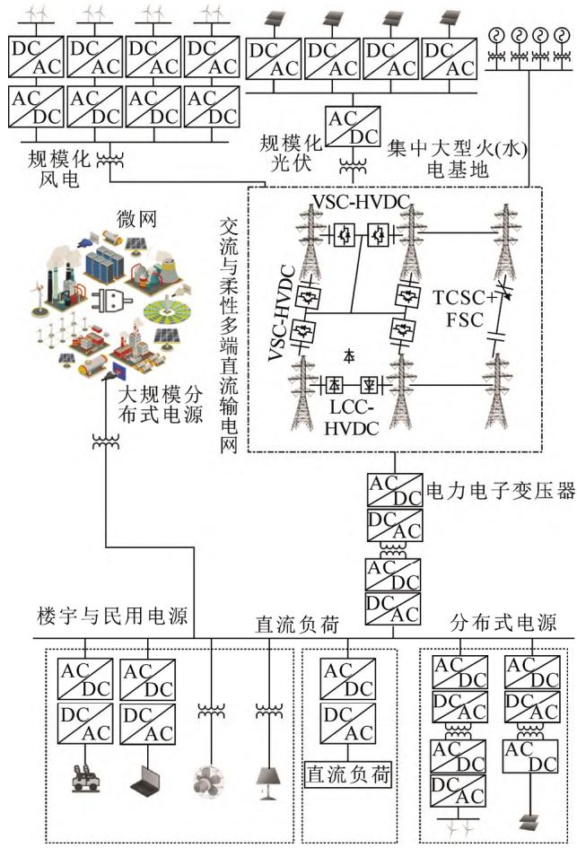
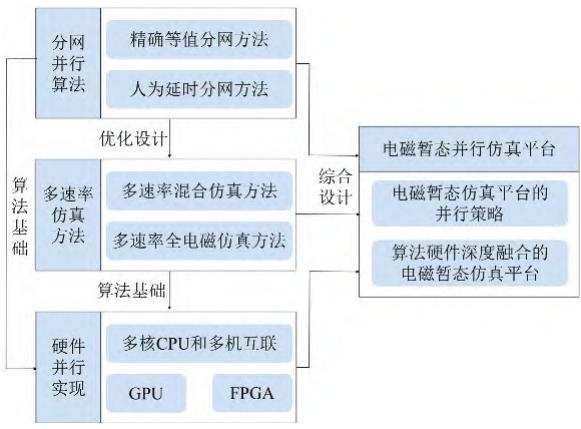
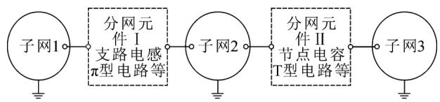
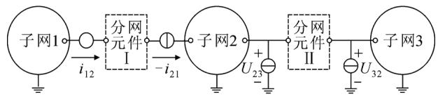
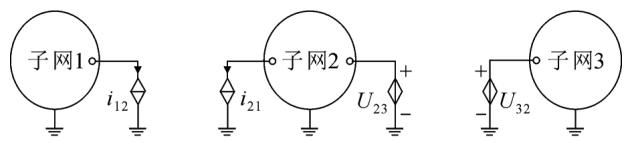
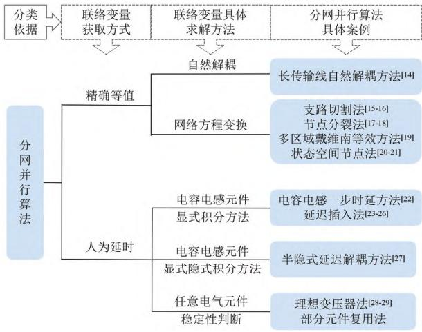
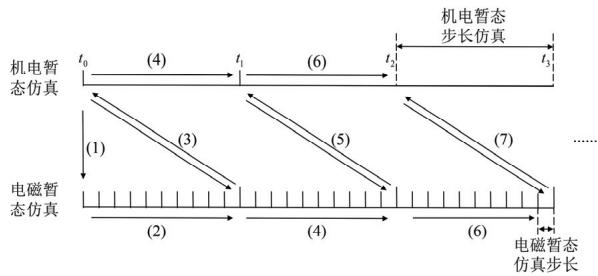
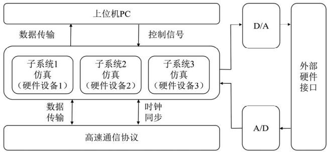

# 新型电力系统电磁暂态并行仿真关键技术及展望

江艺宝，于佳乐，赵浩然，李 冰，韩明哲，赵长旺

（山东大学电气工程学院，济南 250061）

摘 要：在“碳达峰、碳中和”战略目标驱动下，电力系统逐渐发展成为高比例新能源并网和高比例电力电子设备接入的新型电力系统，其电源结构、电网形态和运行特征发生了显著变化。电磁暂态仿真由于能够全面、精确刻画电力系统的高频动态特性，已成为掌握新型电力系统运行特性的关键手段。然而，传统串行计算模式下的电磁暂态仿真技术在仿真效率上无法应对新能源大规模并网、交直流复杂耦合的仿真场景，亟需从高效并行算法和硬件加速角度出发，开展并行计算模式下的电磁暂态仿真相关研究。为此，首先概括了新型电力系统对电磁暂态仿真的新需求；其次，介绍了电磁暂态仿真的分网并行算法；再次，介绍了能够进一步提升电磁暂态仿真效率的多速率仿真方法；接着，介绍了基于并行计算设备的并行仿真实现方案；最后，梳理了国内外电磁暂态仿真平台的并行策略，总结指出算法硬件深度融合的仿真平台是未来的发展方向，并对其中的关键技术进行分析和展望。

关键词：新型电力系统；电磁暂态；并行计算；多速率；硬件加速；仿真平台

# Key Technologies and Prospects for Electromagnetic Transient Parallel Simulation in New Power Systems

JIANG Yibao, YU Jiale, ZHAO Haoran, LI Bing, HAN Mingzhe, ZHAO Changwang

(School of Electrical Engineering, Shandong University, Jinan 250061, China)

Abstract：Driven by the strategic goals of “peak carbon emissions” and “carbon neutrality”, power system is transforming into a new power system marked by extensive integration of new energy sources and a significant presence of power electronic devices. This transformation induces significant changes in its power source structure, and operational characteristics. Electromagnetic transient simulation, possessing the capability to comprehensively and precisely depict the high-frequency dynamic traits of the power system, has become a pivotal tool for understanding the operational features of the new power system. However, electromagnetic transient simulation techniques under the traditional serial computing mode is inadequate in addressing the simulation scenarios involving the large-scale integration of new energy sources and the complex coupling of AC and DC systems. Urgent research is needed to explore efficient parallel algorithms and hardware acceleration perspectives for electromagnetic transient simulation in a parallel computing mode. To this end, this paper first outlines the new demands of the new power system for electromagnetic transient simulation. It then introduces parallel algorithms for electromagnetic transient simulation, followed by a presentation of multi-rate simulation methods to further enhance efficiency, and introduces parallel simulation implementation schemes based on parallel computing devices. Finally, it reviews the parallel strategies of electromagnetic transient simulation platforms domestically and internationally, concludes that a simulation platform with deep integration of algorithm and hardware is the future direction, and also provides an analysis and outlook on key technologies involved.

Key words：new power system; electromagnetic transient; parallel computing; multi-rate; hardware acceleration; simulation platform

# 0 引言

构建新型电力系统，是贯彻落实我国能源安全

新战略、实现“双碳”目标的重要途径。伴随着新型电力系统建设的不断进行，电力系统在源网荷储各环节呈现出高比例电子电子化和高比例新能源趋势，使得电力系统具有越来越明显的低惯性，强不确定性、弱抗扰性等特征[1]。相较于传统电力系统，新型电力系统的平衡与稳定将更加难以保证，开展大量仿真研究已成为推进新型电力系统建设的必要

手段。但大量电力电子设备微秒级的开关动作和交流系统毫秒级的过渡过程相互影响，使得电力系统呈现出多时间尺度的宽频特征，机电暂态仿真由于仅考虑电气量的基波分量，无法反映系统中的高频动态，因而难以满足新型电力系统精确仿真的需求；而电磁暂态仿真能够表征电力电子设备的高频开关过程和新型电力系统的复杂控制策略，因此成为当前的重要仿真手段[2]。

然而，在新型电力系统仿真时，传统电磁暂态仿真方法仍面临仿真效率不足的问题，原因可概括为如下 3 个方面[3]：首先，新型电力系统源网荷储各环节均引入了大量电力电子设备，为准确模拟电力系统高频动态特性，需要纳秒级或亚微秒级的仿真步长；其次，伴随着多区域交直流电网混联和高比例新能源并网的不断推进，电力系统节点数目大幅增加，导致系统方程维数骤增；最后，新型电力系统中接入了大量复杂电气设备(分布式电源、换流器等)，以模块化多电平换流器(modular multilevelconverter，MMC)为例[4]，单个 MMC 可包含数百个开关器件，使得仿真面临海量开关状态判断困难、电气设备计算复杂度显著提升的问题。

因此，亟需建立面向新型电力系统的高效电磁暂态仿真方法。并行仿真技术作为提升计算效率的重要手段，正在与电磁暂态仿真方法相融合，成为新型电力系统仿真技术研究的重点[5]。近年来，该技术已在并行仿真算法和硬件实现方面得到了不断的发展与改进。在并行仿真算法层面[6]，可按需选取高精度或高效率的分网算法，进而满足交直流混联输电网络、新能源场站、有源配电网等多元场景下的分网需求；同时，还可通过多速率仿真设计进一步提升分网并行算法的效率。在硬件实现方面[7]，中央处理单元(central processing unit，CPU)、图形处理器单元(graphics processing unit，GPU)、现场可编程门列阵(field programmable gate arrays，FPGA)等并行计算设备高速发展，计算机运算速度不断提升，异构型硬件设计方案的不断出现，既为并行算法的高效实现提供了必要的硬件基础，又能够提供强大的算力支持，使得仿真超大规模新型电力系统的详细电磁暂态过程成为可能。

因此，本文旨在通过详细的论文综述，梳理国内外电磁暂态并行仿真技术的新进展。本文从新型电力系统对电磁暂态仿真的新需求出发，引出电磁暂态并行仿真技术；然后从分网并行算法、多速率

仿真设计、硬件并行实现、并行仿真平台4个方面对电磁暂态并行仿真技术进行详细梳理，并总结其中可进一步研究的重点内容以供参考。

# 1 新型电力系统对电磁暂态仿真的新需求

伴随着新型电力系统的发展，电力系统在源网荷储各环节都经历了深刻的变化[8]，呈现图 1 所示的全景态势。在电源侧，风电、光伏等可再生能源将成为电量供应主体；在电网侧，特高压直流输电、柔性交直流输电技术将得到广泛应用，形成大规模交直流混联的网架结构；在负荷侧，以分布式发电设备、电动汽车为代表的电力电子类负荷将持续提升，配电网络结构将愈发复杂；在储能侧，多元化储能设备将配置于源网荷各环节。上述各方面的变化对电力系统的电磁暂态仿真提出了如下3个方面的新需求。

# 1.1 更高的仿真维度需求

为解决我国资源分布极不均衡的问题，我国电力行业制定了“西电东送、南北互供、全国联网”的电网发展战略，电力系统规模不断扩大[9]；同时，

  
图1 新型电力系统全景态势  
Fig.1 Comprehensive overview of new power system

新能源成为新型电力系统装机主体，但其单机容量通常小于传统同步发电机组，还经常以分布式电源的形式接入，使得电力系统中新能源发电设备数量众多；此外，高压场景下电力电子设备常采用级联型拓扑，设备电路模型愈发复杂[10]。因而，相较于传统电力系统仿真，新型电力系统仿真面临着系统节点数目急剧增加、网络方程维数骤增的问题，对电磁暂态仿真的维度也提出了更高的需求。

# 1.2 更高的仿真精度需求

在进行电磁暂态仿真时，现有方法通常对复杂设备采用简化或等值模型，如大规模新能源场站仿真时通常采用聚合等值模型，开关设备仿真时采用平均值模型或开关函数模型。此种方法在电网级的仿真分析中能够满足仿真精度的要求，但是在考虑设备级运行状态的仿真中，该模型既无法反映新能源场站内部故障，也无法涵盖多元运行工况，使得仿真面临精度不高、应用场景受限、灵活性不足等问题[11]。近年来，在新型电力系统数字化、智能化转型需求下，基于详细模型实现大规模电网、新能源场站的电磁暂态仿真具有重要意义。因而，新型电力系统对电磁暂态仿真的仿真精度提出了更高的要求。

# 1.3 更高的仿真速度需求

一方面，新型电力系统中电力电子设备高频的开关动作、复杂的控制策略和拓扑结构严重制约了电磁暂态仿真速度的提升，采用传统的电磁暂态仿真方法仿真新型电力系统的时间成本高，已难以满足科研和实际工程的需求。另一方面，在大规模新型电力系统背景下，硬件在环技术缩短研发周期、降低仿真成本、提升仿真结果可靠性的优势愈发明显，因而得到了广泛的研究与应用[12]，但硬件在环技术要求具有与实物严格同步的能力，必须采用对算法和硬件要求都较高实时仿真[13]。综上，新型电力系统对电磁暂态的仿真速度提出了更高的要求。

针对以上3方面的需求，电磁暂态并行仿真技术提供了有效的解决和缓解方法：对于高仿真维度需求，其能够实现高维矩阵的降维求解；对于高仿真速度需求，其能够利用并行算法和并行计算设备提升仿真速度；对于高仿真精度需求，其能有效缓解高精度仿真带来的计算量庞大的问题，因而成为近年来的研究热点。

在后文中，本文将依照图2所示框架对电磁暂态并行仿真技术进行详细介绍。即首先分类梳理现有的电磁暂态仿真分网并行算法；其次，考虑到新

  
图2 电力系统电磁暂态并行仿真技术  
Fig.2 Parallel simulation technology for electromagnetic transients in power system

型电力系统不同子网络存在不同的动态特性，介绍了能够进一步提升仿真效率的多速率仿真设计；然后，总结归纳了基于多核中央处理器(central pro-cessing unit, CPU)、图形处理器(graphic processingunit, GPU)、现场可编程门阵列(field programmablegate array, FPGA)等并行计算设备进行电磁暂态并行仿真的不同方案；最后，梳理了国内外电磁暂态并行仿真平台的并行策略，总结指出算法硬件深度融合的电磁暂态仿真平台是未来的发展方向，并对其中的关键技术进行了分析和展望。

# 2 电磁暂态仿真的分网并行算法

新型电力系统中交直流电网节点数目庞大且构成复杂，在传统交流电网的基础上，融合了柔性交流输电、柔性直流输电、新能源发电等多类电力电子设备，导致网络方程高阶并呈现快速时变特征，难以进行快速求解。借助于电磁暂态仿真的分网并行算法，能够实现复杂电气设备或新型电力系统状态方程的降维与并行求解，从而显著提升电力系统的仿真效率。其基本思想经抽象总结，可概括为如图3所示的3个环节。首先，选择合适的分网元件，将复杂电气设备或大规模电力系统分解成若干规模较小的子网络；然后，在分割边界处对每个子网络分别进行计算，求解出各子网络间的联络变量；最后，将各子网络的相邻子网络用受控源进行等效替代(长传输自然解耦法等效为受控电流源并联波阻抗的形式)，联络变量作为受控源的控制量，进而实现各子网络在当前时刻的解耦。

在上述环节中，联络变量的精确、高效求解一

  
(a)选择分网元件划分子网络

  
(b)求解联络变量 $i _ { 1 2 } , \ i _ { 2 1 } , \ U _ { 2 3 } , \ U _ { 3 2 }$

  
(c)使用受控源进行等效替代  
图3 分网并行算法的基本思想  
Fig.3 Fundamental concept of network partitioning parallel algorithms

直是其中的难点，存在难以兼顾精确性与计算量的问题。因此，本部分依照不同的联络变量获取方式，将现有的电磁暂态分网并行算法分为精确等值和人为延时两类，如图4所示。在后文中将分别对其进行详细介绍。

# 2.1 基于精确等值的并行方法

精确等值分网并行方法研究起步早，在电力系统电磁暂态仿真领域研究成果丰富。精确等值分网并行算法完全基于电气元件机理或网络方程变换，推导出在 t 时刻联络变量的等值求解计算式。该等值求解计算式的特点在于联络变量的值仅与其他子网络t t −Δ 时刻的仿真结果相关联，从而能达到先行求解 t 时刻联络变量，然后并行求解 t 时刻各子网络内部状态量的目的；同时，由于在并行原理上不存在任何简化过程，因此在分网并行算法中具有最高的计算精度。此类方法具体包含：长传输线自然解耦方法、节点分裂法、支路切割法、多区域戴维南等效法(multi-area Thevenin equivalents，MATE)、状态空间节点法(state-space nodal，SSN)及其组合。

长传输线自然解耦方法是目前应用最为广泛的分网方法[14-15]，当电力系统中存在可以用分布参数线路模型模拟的长距离输电线路时，可以根据分布参数线路模型的自然解耦特性将电力系统进行分网。此方法的优势在于子网络间通信量小，并且不会因为分网并行而增加额外的计算负担。但是，这种分网并行计算方法要求网络中必须含有传输时间延迟大于仿真步长的长距离传输线，从而使得这类

  
图 4 分网并行算法分类  
Fig.4 Classification of network partitioning parallel algorithms

方法的应用场景受限，缺乏足够的灵活性。

在传输线自然解耦方法应用场景受限的背景下，考虑到灵活分网的需求，文献[16-17]和文献[18-19]基 于 Dommel 提 出 的 电 磁 暂 态 程 序(electromagnetic transient program，EMTP)法，分别建立了支路切割法与节点分裂法。两种方法均采用降阶方程对联络变量进行求解，并利用节点电压法求得子网络各时刻状态。两种方法的区别在于联络变量分别对应切割线电流与分裂点电压，使得其在分析子网络间电流的传输分布和分裂点电压的稳定性或波动情况时各有优势。文献[20]扩展了“Diakoptics”网络分块思想，同时融合改进节点电压方法[21]、多节点戴维南等效电路的概念，提出了一种 MATE 分网方法[22-23]。文献[24-25]总结了RT-Lab 中采用的 SSN 算法，其基于节点电压法进行联络变量求解，基于状态变量法形成复杂代数-微分方程组进行子网络求解，具有易于调整仿真步长和处理非线性元件的优势，但其网络方程的构建与EMTP法相比较为复杂。

目前，电力系统已发展成为大规模交直流混联的非线性系统，系统节点数目骤增，必须通过划分更多的子网络来提升并行程度，进而提升仿真效率。但节点分裂法、支路切割法、MATE 方法、SSN 算法的联络变量均必须串行求解；且随着划分子网络数目的增多，上述算法联络变量的计算复杂度会以$O ( n ^ { 3 } )$ 的速率急剧增长[26]，使得其在进行大规模电力系统仿真分析时，仍面临仿真效率不足的问题。

为进一步提升上述并行算法的仿真效率，文献

[27]提出一种预先计算并存储各子网络节点电压方程与降阶方程系数逆矩阵的方法，显著加快了节点分裂法、支路切割法和MATE方法的仿真速度，但在仿真新能源场站、柔性交直流输电系统时，开关状态切换将导致网络拓扑发生变化，使得该方法存在预存储数据量过大的问题。文献[28]在 MATE 方法的基础上，提出了交直流网络分割并行与 MATE网络分割并行的双层并行技术，使得直流系统拓扑变化不影响其他子网络，从而大幅降低了计算量。

综上，精确等值分网方法在对计算精度要求较高、分网数量较少的场景中，能够实现高精度、高效率的电磁暂态仿真，因而得到了广泛的应用。但如果考虑系统中无长传输线、含大量电力电子器件的场景，仅采用精确等值分网并行算法时，计算量仍然十分庞大，无法满足高效仿真的要求。针对上述问题，目前存在一些通过牺牲部分仿真精度的方式来提高计算效率的分网并行算法，具体如下所述。

# 2.2 基于人为延时的并行算法

除精确等值外，分网并行计算的另一种实现方法是在变化缓慢的状态上添加人为延时，如电感电流或电容电压，进而实现系统间的解耦。其整体思路为：首先选取子网络间特定的分网元件，如电感、电容及其组合等，将电力系统划分为多个子网络；然后，利用分网元件部分状态变化缓慢的特性，通过历史时刻状态估算分网元件当前的时刻状态，并将估算得到的分网元件状态作为联络变量输送到对应的子网络中；最后，各子网络间的联络变量在当前时刻已知，从而可以实现子网络的解耦与并行运算。

目前，国内外已对基于人为延时的分网并行算法展开了部分研究。文献[29]采用前向欧拉方法对选定的电感和电容元件进行离散化处理，利用显示积分方法的可并行性，建立了具有一步时延的分网并行方法。然而，在开关动作时，该方法会由于非状态变量突变而引起数值振荡，从而不得不采用隐式积分方法，导致失去并行特性。文献[30-33]提出了延迟插入法(latency insertion method，LIM)，通过附加小电感与小电容的方式，使得支路电流与节点电压的求解相差半步时延，从而能够实现细粒度并行。但是由于附加元件改变了系统的动态特性，因此此方法只适用于纳秒级或亚微秒级的小步长仿真。文献[34]基于传输线建模方法，将电感或电容元件等效为短截线或链接线，然后利用线路传输延迟进行解耦。然而，此种方法仿真精度与仿真步长、

电容电感参数密切相关，为保证仿真精度，仿真步长一般为亚微秒级，从而极大地影响了计算效率。

为了提升精度和稳定性，一些研究采用显式积分方法和隐式积分方法相结合的方式来消除这些非自然延迟的影响。文献[35]将电力系统分为多个子网络后，在子网络内部采用后向欧拉法进行离散，对子网络之间的状态采用前向欧拉法进行求解，并使用迭代算法来提升精度。虽然这种方法给出了可接受的仿真结果，但是迭代过程的引入可能会导致计算量的大幅增加，从而失去分网并行提升计算效率的优势。文献[36]结合矩阵分裂与延迟解耦技术，针对各子网络内部和外部状态变量，分别采用隐式的梯形积分形式和显式的中心积分形式进行处理，建立了一种具有半步时延的半隐式延迟解耦方法。该方法具有分网过程更加灵活、适用范围更广的优势，但该方法要求分网元件中含有较大的电感或电容，否则可能存在数值不稳定的问题。

同时，考虑到对分网并行算法灵活性的需求，理想变压器法[37-38]、阻尼阻抗法、部分元件复用方法不再局限于特定元件变化缓慢的状态，而是对分网点的电压或电流信息直接进行延时处理，并将其结果作为下一时刻的仿真输入。文献[39]结合传递函数和 Nyquist 稳定判据，给出了上述算法的稳定性与精确性分析手段，并指出此类算法具有可接受的精度，但稳定性难以保证，使用时必须进行稳定性校验或对仿真延时进行补偿。

综上所述，这类基于人为延时的分网算法由于联络变量的求解仅与分网点附近的分网元件相关联，同时不同分网点的联络变量求解步骤也基本相同，从而使得联络变量计算量与分网数目近似呈现线性关系。相较于精确等值分网算法，此类方法的联络变量运算量大幅降低，目前已在双馈风电场、有源配电网的精细化分网设计中得到了广泛的应用。但是，由于引入了人为仿真延时，在无特定分网元件和仿真步长选择不当时，此种分网方法存在数值不稳定的问题，甚至会引入严重的仿真误差。

# 2.3 分网并行算法发展方向

本节在分网并行算法层面介绍了电磁暂态并行仿真技术的发展现状。上述研究表明，在电力系统仿真时，现有并行仿真方法能够显著提升仿真效率；但在大规模新型电力系统电磁暂态仿真场景下，仍存在仿真规模、仿真精度和仿真效率相互制约的问题。可从以下两方面来解决。

1）考虑人为延时分网并行算法和精确等值分网并行算法各有优势与不足，可通过建立双层或多层分网并行算法，实现不同算法的融合，以充分发挥不同分网并行算法的优势，实现高效灵活分网。  
2）考虑到某些分网并行算法子网络与分网元件状态量的求解存在人为延时，必然会引入仿真误差，甚至导致稳定性问题。因此，需要对这些分网并行算法建立误差补偿机制和稳定性量化评估策略，进而达到提升仿真效率和保证精确性与稳定性的目的。

# 3 新型电力系统的多速率仿真方法

新能源的并网、传输和消纳环节在源-网-荷-储端广泛引入电力电子设备，使得新型电力系统动态特性既包含旋转电机主导的慢时间尺度机电暂态特性，又包含电力电子主导的快时间尺度电磁暂态特性。若全部采用小步长对电力系统动态过程进行求解，则存在慢动态子网络非必要计算量大幅度上升，从而严重影响仿真效率的问题。多速率并行仿真是解决上述问题的关键，其基本思想为：首先，根据电力系统各部分的动态响应时间常数，将电力系统划分为多个子网络，各子网络依照自身快慢动态特性选择仿真步长；然后，对具有相同仿真步长的子网络并行求解，对具有不同仿真步长的子网络间通过串行或并行多速率接口进行数据交互；最后，将各子网络的仿真数据进行整合，以获得整个电力系统的仿真结果。

目前，根据快慢动态子网络采用的仿真方法，可将多速率仿真划分为多速率混合仿真和多速率全电磁仿真两类，具体如下所述。

# 3.1 多速率混合仿真方法

多速率混合仿真方法对于具有不同动态响应时间常数的子网络，通常采用不同的建模和仿真方法。具体而言，对于动态常数较小的部分，采用小步长在时域进行运算，以精确追踪系统演变，并反映系统中的快速暂态现象；对于动态常数较大的部分，采用大步长在时域或相量域进行运算，通过忽略部分暂态细节，将系统中细微的高频变化近似为线性或平滑的过程，从而大幅降低仿真运算量，显著提升仿真效率。现有的多速率混合仿真方法包含机电-电磁混合仿真、动态相量-电磁混合仿真[40]等。其中，机电-电磁暂态混合仿真方法研究起步早，国内外学者已针对其展开了很多有益研究，本部分将着重对其进行介绍。

机电-电磁暂态仿真方法的基本原理为对含快速暂态过程的子网络采用微秒级的电磁暂态仿真，对常规交流系统采用毫秒级的机电暂态仿真，从而能够结合机电仿真和电磁仿真的优势，特别是在交流系统所占比例较大的大规模交直流混联系统中，其既能够利用机电暂态大步长仿真模型实现计算量的大幅度降低，又能够获得直流系统在不同控制和故障下详细准确的动态过程，在保证精度的同时取得良好的加速效果[41-43]。

同时，考虑到机电侧、电磁侧采用的仿真模型与时间步长均不相同，因此需要通过接口设计实现两侧的数据交互。其中，接口位置和接口算法是接口设计中最为重要的部分。在进行接口位置选择时，需要考虑其对稳定性和计算速度产生的影响。对于含有高压直流输电(high voltage direct current trans-mission ， HVDC) 和 柔 性 交 流 输 电 (flexible ACtransmission systems，FACTS)线路的电力系统，接口位置一般选择在 HVDC 换流器交流母线以及FACTS装置连接变压器一次侧母线处。此种分网方式能够使采用小步长进行电磁暂态仿真的子网络范围最小；同时，该方式下母线处的电压电流相对稳定，有助于提高混合仿真算法的稳定性[44]。

在接口算法方面，机电-电磁混合仿真需要确立数据交互时序，并形成两侧相互的等值电路。其中，机电-电磁混合仿真的数据交互时序包含串行、并行、迭代和混合接口时序4种[45]，并行接口时序如图5所示。等值电路由机电侧网络等值电路和电磁侧网络等值电路两部分构成。在机电暂态网络计算中，串行时序下通常将电磁侧网络等效成负荷或电流源的形式，但在并行时序下，上述方法无法保证仿真精度和算法的稳定性，通常采用诺顿电路进行等值[46]。在电磁暂态网络计算中，机电侧可采用时变的戴维南等效电路和三相耦合的诺顿等效电路来表示，此等值方法可应用于串行或并行时序[47]。文

  
图5 机电-电磁混合仿真并行接口时序  
Fig.5 Electromechanical-electromagnetic hybrid simulation parallel interface timing

献[48]针对常规诺顿等值电路不能精确表示机电侧高频响应的问题，采用频率相关的等值方法对机电侧网络进行等值，提高了仿真的精度，但其需要保证网络的无源性，因此应用场景有限。

# 3.2 全电磁多速率仿真方法

新型电力系统整体动态过程受电力电子设备开关过程和快速保护逻辑的影响，使得其暂态过程时间范围覆盖秒级到微秒级；而混合仿真方法的大步长则大多只针对基频信号进行分析，无法响应高频动态，从而使得其仿真精度低，数值稳定性差。全电磁仿真是解决上述问题的关键，本部分将首先介绍电磁暂态仿真的大步长仿真方法，并针对目前大步长仿真算法应用场景受限的问题，进一步介绍全电磁多速率仿真设计。

# 3.2.1 大步长电磁暂态仿真方法

根据 Nyquist 采样定律，采样信号至少为原始信号的2倍才能避免原始信息的丢失。同时，在传统基于EMTP方法的电磁暂态仿真中，为了精确捕捉仿真过程中电气量的快速变化，保证仿真精度，仿真步长对应的采样频率一般为系统最高频率的10倍，从而使得新型电力系统整体必须采用亚微秒级小步长求解[49]，进而严重影响了仿真的效率。为实现系统的大步长电磁暂态仿真，具体可从以下 2个方面入手。

一方面，考虑到上述最高频率的影响，可以将具有慢动态过程的子系统分离出来，由于这类子系统不含开关频率较高的电力电子设备，因此可以采用相对较大的仿真步长(通常为数百微秒到数毫秒)，直接利用状态变量法或基于离散网络分析的EMTP法进行电磁暂态仿真。

另一方面，可以进一步研究在不损失精度的条件下，将高频信号转为低频信号的仿真技术，进而实现系统最高频率降低的目的。移频电磁暂态仿真方法[50-52]是目前的重要手段，其借助通信理论中的解调原理，将传统电磁暂态仿真所得的瞬时信号频谱向左平移一个固定频率(通常是工频)，使原本按正弦信号周期变化的交流信号转化为缓慢变化的解析包络信号，其频率远小于原信号的频率，从而可以采用相对传统电磁暂态仿真更大的仿真步长[53]。但是，现有的移频仿真技术主要针对交流系统，对于含电力电子设备较多的新型电力系统，即使降低工频，系统中也仍含有高频信号，因此无法达到明显降低仿真步长的目的。

# 3.2.2 大小步长结合的电磁暂态仿真设计

考虑到上述大步长电磁暂态仿真方法在应用场景方面仍然存在局限性，而小步长仿真算法存在计算量过大的问题，因此在大规模新型电力系统全电磁仿真实现中，通常结合分网并行算法对具有快慢动态过程的区域进行划分，并采用多速率接口进行交互，形成大小步长结合的全电磁多速率仿真方法。其中，不同仿真场景下的参考仿真步长如表1所示。

其接口设计也分为接口位置选择和接口算法 2个重要方面。在接口位置选择方面，全电磁多速率方法与机电-电磁混合仿真方法大致相同。在接口算法设计方面，由于接口算法与多速率仿真的精度和计算效率密切相关，因而其成为多速率仿真的关键。传统的多速率仿真方法主要为外插法[61]和松弛变量法[62]，但外插法会降低仿真精度与数值稳定性，松弛变量法则存在大量的迭代过程，使得计算效率不高。文献[63]综述了目前常用的多时间尺度接口算法，包括平均值法、预计算法和渐进法，并指出不同算法的适用范围不同，在实际应用时，应根据多时间尺度模型的仿真速度、精度和收敛性来选择合适的接口算法。

目前，全电磁多速率仿真通常结合分网并行算法与上述多速率接口算法来进行设计，即首先通过分网并行算法进行分网，然后采用多速率接口进行数据交互，从而能够在提升仿真效率的同时保证多速率仿真算法的精度。例如，文献[64]结合长传输线自然解耦方法和全隐式内插值多速率仿真基本模型，设计了一种并行多速率仿真方法，并针对算法稳定性稍差的问题，提出了保证算法稳定性的保守分网判据。文献[60]提出了基于 LIM 的快慢系统交替求解的多速率仿真方法。文献[28,65]和文献[66]分别介绍了基于MATE算法和节点分裂法分网的多速率电磁暂态并行仿真方法，能在基本不损失仿真

表1 新型电力系统不同场景下的参考仿真步长  
Table 1 Reference simulation time step in different scenarios of the new power system   

<table><tr><td>文献</td><td>仿真场景</td><td>仿真步长</td></tr><tr><td>[44,54]</td><td>大规模/超大规模交流电网</td><td>大步长(百微秒级、毫秒级)</td></tr><tr><td>[55-56]</td><td>详细仿真的交流电网</td><td>小步长(≤50 μs)</td></tr><tr><td>[57-58]</td><td>新能源发电设备(风电、光伏发电单元等)</td><td>小步长(≤10 μs)</td></tr><tr><td>[59]</td><td>换相换流器(LCC)、传统直流输电</td><td>小步长(≤50 μs)</td></tr><tr><td>[37,60]</td><td>电压源换流器(VSC、MMC)、柔性交直流输电</td><td>小步长(≤2 μs)</td></tr></table>

精度的前提下大幅提升仿真效率。

# 3.3 多速率仿真方法发展方向

多速率仿真方法对具有不同动态特性的子系统采用不同仿真步长进行仿真，从而提升计算效率。笔者认为可从仿真步长的自适应选择、移频法-小步长电磁暂态多速率仿真方法的设计等方面进一步研究，以保证算法稳定，提升仿真效率。

1）小步长侧的仿真步长一般设定为系统最高频率的10 倍，但大步长侧的仿真步长多基于经验进行选取。在后续的设计中，可围绕电力系统暂态仿真计算的稳定性，提出保证稳定性和仿真精度的仿真步长范围解析表达，以实现大步长侧仿真步长的自适应选择。  
2）移频设计能够显著降低电磁暂态仿真步长，并能以较高精度进行电磁暂态仿真。未来可进一步研究移频电磁暂态仿真模型与小步长电磁暂态仿真模型相结合的多速率仿真技术，在保证高精度的同时，降低新型电力系统仿真的计算量。

# 4 基于并行计算设备的硬件实现方案

上述并行仿真算法需要依托于硬件设备进行实现，近年来，随着多核 CPU、GPU、FPGA 等并行计算设备芯片设计和制造技术的不断发展，硬件设备的计算能力得到了极大提升，最大化挖掘并行计算设备的计算潜力成为实现高效电磁暂态并行仿真的又一重要途径。目前，已有众多研究基于并行计算设备，实现了换流器[67-69]、新能源场站[57-58]和大规模交直流混联系统[54-56]等场景的电磁暂态并行仿真。上述研究指出，这种基于并行计算设备的并行仿真实现方法，不仅是分网并行算法作用下子网络层级粗粒度并行仿真的硬件实现，还体现在算法可以结合硬件特点方面，通过“多线程[70]”、“流水线处理[71]”等技术，设计元件层级、运算流程层级和底层算法层级的细粒度并行策略，从而实现电磁暂态仿真运算的进一步加速[72]。

在此背景下，考虑到多核 CPU、GPU、FPGA在时钟频率、计算资源、逻辑运算能力、存储能力等方面存在较大差异，其并行仿真实现方案各不相同。本章将分别介绍各硬件设备在电磁暂态并行仿真领域的具体应用和专用并行设计，为后续并行仿真硬件实现提供参考。

# 4.1 基于多核 CPU 和多机互联的并行仿真实现

多核 CPU 通过将多个处理器内核集成在一个

处理器芯片中来提升计算能力。目前，多核CPU不仅具有优异的单线程性能和强逻辑运算能力，还具备并行仿真能力和高度的可扩展性，这些卓越的性能使其得到了快速的发展和广泛的应用，已成为现代处理器的主流[44,73]。在电力系统仿真领域，多核CPU 的优势体现在以下两方面：一方面，在仿真实现时，其能够将分网后的子网络分配到多核CPU不同的计算核心中，并行执行子网络仿真运算，从而提升仿真效率；另一方面，多核CPU 与现有电磁暂态仿真软件适配程度高，可基于现有电力系统仿真软件进行建模调试，从而大幅度简化前期建模的工作量。

但是，在进行超大规模新型电力系统电磁暂态仿真时，单台硬件设备存在核心数和计算能力不足的问题，使其难以满足新型电力系统海量算力的需求。因此，通常要求基于多核CPU的仿真器具备多机互联的能力，以便利用分布式硬件设备结构，将任务分配给计算集群中的多台计算设备，进而实现超大规模新型电力系统的并行仿真[74]。但由于多机信息交互时必然存在通信延迟，因此数据同步、通信延迟以及阻塞问题成为制约仿真效率提升的关键因素。目前，电力系统全数字仿真装置(advanceddigital power system simulator，ADPSS)、RTDS、RT-Lab 等仿真平台通过小型可热插拔光收发一体模块(small form-factor pluggable，SFP)、高速串行计算机扩展总线(peripheral component interconnectexpress，PCIe)等高速通信接口提供可靠的数据传输与通信服务，为实现多机互联提供了可靠方案。

# 4.2 基于 GPU的并行仿真实现

GPU在设计中集成了大量的并行计算单元，在处理密集型数据和并行数据时具有显著优势。但是，由于 GPU 的逻辑控制和存储能力相较于 CPU 都较弱，并且没有分支预测等控制组件，因此在基于GPU进行电磁暂态并行仿真实现时，通常需要CPU与 GPU 结合形成异构架构，借助于 CPU 强大的逻辑控制单元和大容量的存储结构来实现对仿真流程的整体控制[75-76]。

目前，在基于 CPU-GPU 异构架构进行电磁暂态并行仿真领域，已进行了一些相关研究。文献[77]介绍了英伟达公司于 2006 年推出的统一设备架构(compute unified device architecture，CUDA)，用户可直接采用CUDA 支持的高级语言，如C、C++等进行开发，使得 GPU 编程的难度大大降低，为实

现基于 GPU 的电力系统并行仿真奠定了良好的基础。文献[78]评估了 GPU用于大规模电力系统电磁暂态并行仿真的可行性，并利用GPU上基于CUDA线性代数库进行节点电压的求解，能够实现大规模系统仿真运算的显著加速。文献[66,79]基 于CPU-GPU 异构架构设计了多端直流输电系统的细粒度并行仿真策略，指出 MMC 柔性直流、新能源换流器等高频电力电子设备计算量庞大，但计算流程单一，更适合在以 GPU 单指令多线程为基础的众核架构上进行仿真实现。文献 [80] 介绍了CloudPSS 实时仿真平台，该平台基于 CPU-GPU 异构架构，能够实现面向新型电力系统和海量场景的细粒度并行仿真加速，从而较好地满足电力系统分析的需求。

但该上述异构架构设计方法的最大缺点在于CPU 和 GPU 之间的数据交换过于频繁，在系统节点数目较大时，同步过程和通信耗时可能会抵消GPU并行带来的加速效果，导致计算效率提升不明显。文献[81-82]提出了完全基于 GPU 的细粒度电磁暂态仿真技术，并指出该技术的关键在于将系统所建立的数学模型转化为脱离物理背景的抽象线程运算，使得电磁暂态仿真的所有程序都能够部署到GPU中。文献[83]通过使用 GPU中内置的单指令多数据流(single instruction multiple thread，SIMD)和共享内存的运算级并行策略重构了传统的 EMTP 算法，创造了一种细粒度并行算法。文献[84]指出完全基于 GPU 的电磁暂态仿真算法存在大量依赖共享内存和仿真规模受限的问题，建立了一种基于有向图分层的控制系统细粒度并行仿真算法，并结合并行计算模型和计算需求，给出了 GPU 计算资源分配方法，可最大程度地提高并行计算能力。

# 4.3 基于 FPGA 的并行仿真实现

FPGA 是一种可编程使用的信号处理器件，用户可以通过改变配置信息对FPGA的功能进行自定义，以满足设计需求[85]。与 GPU相比，虽然 FPGA在时钟频率、计算能力和开发简易程度等方面略逊色于 GPU，但 FPGA在含有大量并行计算单元和逻辑单元的同时，能够提供亚微秒级别的低延迟，也兼具灵活性和可拓展性，可以适应新型电力系统不同场景的仿真需求[86]，因而基于 FPGA 的电磁暂态仿真得到了越来越广泛的关注。

在电磁暂态仿真领域，FPGA 在以下两方面研究中得到了广泛应用：一方面，考虑到 FPGA 的可

编程性和低延迟特点，可以利用 FPGA 对复杂电气元件的电磁暂态仿真过程进行高度优化[87]。例如，文献[88]提出了一种基于 FPGA 的高瞬态分辨率绝缘栅双极型晶体管(insulated gate bipolar transistor，IGBT)的行为模型，能够在保证计算精度的前提下以5 ns 的极小时间步长对 IGBT暂态波形进行高效仿真。另一方面，FPGA 可以通过多 FPGA 级联和异构设计，更经济高效地满足仿真规模和复杂度日益增长的新型电力系统仿真需求。例如，文献[89-90]针对单块 FPGA 逻辑资源受限，无法高效仿真大规模电力系统的问题，设计了一种多FPGA 实时仿真架构，能够有效增加仿真计算能力并缩短仿真步长。文献[91]从并行仿真架构和可扩展性硬件架构两方面入手，实现了基于多FPGA的有源配电网实时仿真，在系统规模进行扩展时，仍能保持微秒级恒定时间步长的实时仿真。

上述基于FPGA进行并行化的仿真取得了较好的加速效果，但 FPGA编程设计的复杂性使得在基于 FPGA进行并行仿真时仍然存在以下问题：一方面，目前的仿真大多局限于特定的应用场景，缺乏通用性的框架结构；另一方面，现有仿真基本沿用了基于 CPU 的仿真方法，对 FPGA 天然并行架构的研究不足。针对上述问题，文献[92-93]根据网络结构特征，将电力系统划分为多个子系统，并基于FPGA 的数据并行与流水线并行，设计了用于有源配电网求解的系统级并行、模块级并行以及底层并行的多层级并行暂态实时仿真系统架构。文献[94]针对电气装置不同元件之间存在耦合过程、难以进行并行化处理的问题，提出了一种采用 FPGA的多随机存取存储器(random access memory，RAM)对各类耦合元件和线性方程组进行处理的解决方法，使得系统能够充分利用FPGA的高度并行结构和流水线并行技术提升运算速度，为超大规模电力系统高效仿真实现提供了有益参考。

# 4.4 硬件实现方案发展方向

多核CPU、GPU、FPGA等并行计算设备已广泛用于电磁暂态并行仿真实现中，极大地提高了新型电力系统的仿真效率。可对以下两方面内容进一步研究，从而进一步提升仿真效率、简化硬件实现流程。

1）现有的电磁暂态仿真多采用串行建模方式，使得GPU、FPGA 高度并行优势难以得到充分发挥。因此，需要从硬件特性出发，建立新型电力系统各

类基础元件细粒度并行仿真所需的“代数化”、“并行化”模型，即将基于物理意义的模型转变为大量简单的数学运算，以适应 GPU、FPGA 固有的高度并行架构。

2）FPGA综合优化、布局布线、板级仿真与验证整体流程复杂，开发难度和时间成本高。因此，可针对新型电力系统中的各类元件进行通用化设计，使其能够在不重新综合的前提下实现对仿真算例的在线修改；同时，优化上述设计的交互模式，从而使用户更加便捷地使用 FPGA进行仿真。

# 5 基于并行计算架构的电磁暂态仿真平台

上述并行算法和硬件实现方案均为新型电力系统仿真的基础技术，若要将其应用到实际工程中，则仿真平台必不可缺。这是由于仿真平台能够提供丰富的模型库、强大的可视化工具和数据分析功能，从而大幅度简化电磁暂态仿真模型的构建和初始化流程，降低电力系统运行分析、故障模拟和控制测试的时间成本。目前，随着柔性直流输电技术和新能源发电的快速发展，电力系统仿真的规模和复杂度均大幅度提升，导致现有仿真平台的计算效率越来越难以满足科研和实际工程的需求。因此，结合上述分网并行算法、多速率仿真方法和硬件实现方案研究新成果，构建面向新型电力系统的高效电磁暂态并行仿真平台，具有重要的理论研究和工程实践意义。

在上述背景下，本章将首先梳理国内外主流电磁暂态仿真平台所采用的并行策略，然后归纳总结出算法硬件深度融合的仿真平台，并对其中的关键技术进行总结与展望。

# 5.1 国内外电磁暂态仿真平台并行策略概述

目前，并行仿真技术已广泛应用于 RTDS、RT-Lab、ADPSS、CloudPSS、YXPRCP、EasyGo、Modeling-Tech 等商用化实时仿真平台中，本部分将分别对其并行策略进行归纳和总结。

# 5.1.1 RTDS[95]

RTDS 是由加拿大 RTDS 公司开发的实时数字仿 真 系 统 ， 是 PSCAD/EMTDC(electromagnetictransients including DC)[96]的实时化版本。在算法方面，RTDS 采用 EMTP 方法进行电磁暂态仿真，利用长传输线自然解耦等分网方法进行大模型拆分和并行计算。在硬件架构方面，其既可以基于多核CPU 进行并行化仿真，又可以将 FPGA 作为 CPU

的协处理器，从而实现部分运算的深度加速。

# 5.1.2 RT-Lab

RT-Lab是由加拿大Opal-RT公司开发的实时仿真系统平台，其基于 MATLAB/Simulink 软件进行仿真模型的搭建和调试。在算法方面，RT-Lab采用状态变量法进行电磁暂态仿真，采用状态空间节点法(SSN)等分网方法进行电力系统的解耦和并行运算。在硬件架构方面，RT-Lab 基于多核 CPU 或CPU-FPGA 异构架构进行并行化仿真实现。

# 5.1.3 ADPSS[97-98]

ADPSS 是中国电力科学研究院有限公司开发的新一代实时仿真平台。在并行算法方面，其电磁暂态仿真采用以传输线分网方法为主、节点分裂法为辅的分网方法，机电暂态仿真采用空间并行的方法。在硬件架构方面，ADPSS采用高性能计算集群进行并行仿真实现。目前，ADPSS可以进行含4000台发电机、40 000个节点的大规模交直流复杂电力系统机电暂态和电磁暂态实时和超实时仿真。

# 5.1.4 CloudPSS[99]

CloudPSS 是由清华大学开发的基于云端计算的电磁暂态高性能实时仿真平台，能够通过高度优化的并行技术提升仿真效率。其在建模层面采用了数据-机理融合建模、多时间尺度仿真等技术；在算法层面提出了面向异构众核处理器的细粒度并行算法与海量场景批量仿真多层计算图模型；在硬件层面采用了 CPU-GPU 异构架构。目前，CloudPSS 可进行电磁暂态仿真、移频暂态仿真、硬件在环仿真等，能够精确刻画微秒级到秒级的宽频振荡、控制和保护响应等电磁暂态过程，为模拟大规模电力系统和多场景研究提供了有效的解决方案。

# 5.1.5 YXPRCP

YXPRCP 是由南京研旭电气科技有限公司开发的一套功率硬件模型开发平台，能够实现与Matlab/Simulink 的无缝连接，从而降低代码开发与调试的时间成本。同时，该平台能够将复杂模型划分成多个可并行执行的子系统，并分配到多个CPU或 FPGA上，进而形成可伸缩的分布式实时仿真系统。目前，YXPRCP主要用于功率类硬件在环仿真测试，为系统性能和稳定性分析提供了强有力的仿真工具。

# 5.1.6 EasyGo

EasyGo 是武汉森木磊石科技有限公司开发的一套半实物仿真平台，其利用高性能 CPU、FPGA

进行并行仿真实现，并支持单机箱扩展，可实现基于CPU-FPGA 异构架构的联合仿真与控制。目前，此平台能够满足大规模电力系统测试和多设备级联测试需求，已广泛应用于新能源发电、多电平电力电子装置、智能电网等领域。

# 5.1.7 Modeling-Tech

Modeling-Tech 是由上海远宽能源有限科技公司开发的一套电力实时超算平台。在算法层面，其支持电力电子开关的 $R _ { \mathrm { o n } } / R _ { \mathrm { o f f } }$ 和 L/C 建模方法，采用状态空间方法进行电磁暂态仿真分析，并可按实际需求对分网算法进行选择与设计；在硬件架构方面，Modeling-Tech 可 基 于 多 核 CPU 、 FPGA 以 及CPU-FPGA异构架构进行新能源场站、微网和多电平系统的仿真实现。

# 5.2 算法硬件深度融合的电磁暂态仿真平台

由上述内容可知，基于并行计算架构的电磁暂态仿真平台近年来得到了快速的发展，极大地提高了仿真效率。但是现有的仿真平台仍然存在以下问题：一是计算负载分配不均，导致硬件资源难以充分利用；二是电磁暂态仿真算法和硬件适配程度不高，导致算法加速困难。借助于仿真平台强大的算力和数据分析功能，构建算法硬件深度融合的仿真平台，将是解决上述问题的关键。笔者认为，其主要技术分为硬件架构及算法设计两方面，本节将分别进行叙述。

# 5.2.1 硬件架构设计

合理的硬件架构设计是实现算法硬件深度融合电磁暂态仿真的基础。已有研究指出，在新型电力系统发展背景下，异构架构将是未来硬件架构发展的方向[80]。相较于同构架构，合理的异构架构设计能够提升仿真平台的计算能力、可扩展性和灵活性等性能，使得算法实现时可以根据仿真需求选择合适的硬件配置，为分网并行算法和多速率仿真算法的高效硬件实现提供必要支撑。

面向新型电力系统的并行仿真平台异构架构可简要概括为图 6。图 6 中，上位机负责下发控制信号，协调各子系统的运行；各子系统按照仿真需求选择多核CPU、GPU、FPGA等硬件设备进行仿真；在每个离散的时间步长内，各子系统进行数据运算并通过高速通信接口实现数据交互与同步。此外，硬件设备可预留 A/D(模/数转换)、D/A(数/模转换)数据通信接口，用于实现与外部模拟系统的联合仿真。

  
图6 新型电力系统并行仿真平台异构架构  
Fig.6 Heterogeneous architecture for new power system parallel simulation platform

在上述异构架构中，通信是否高效是衡量架构优劣的重要标准之一。这是由于各硬件设备间频繁大量的数据交互，使得通信时延在总体仿真时间中占据了越来越大的比重。为防止通信延时增加抵消并行运算带来的加速效果，设备间需要采用兼具高保真和低时延的 PCIe 或光纤接口等高速通信接口进行数据交互。其中，PCIe或光纤通信均能以高于125 MB/s 的通信速率进行数据传输，传输 32 个单精度浮点数时延小于1 μs，从而能够保证数据通信的高效性。在保证高精度、高效率通信的前提下，仿真平台还可基于高速通信网络，进一步发展云计算和分布式计算技术，推动异构仿真平台计算算力不断增强，为超大规模新型电力系统仿真提供必要的算力支撑。

# 5.2.2 算法设计

为实现算法硬件的深度融合，必须将硬件相关的特征纳入算法设计中，可从建立计及硬件资源的最优分网方法以及适配硬件特性的电磁暂态建模仿真方法两方面进一步展开研究。

一方面，可建立计及硬件资源的最优分网方法。通过最优分网可以解决现有算法中各子系统仿真时间不均衡、硬件设备利用率不高的问题，实现最大仿真步长的降低。而要实现计及硬件资源的最优分网，首先要建立算法层面的子系统仿真计算量和信息交互量及硬件层面的通信时长与硬件算力的精确评估策略；其次，要建立通信时长、硬件计算资源峰值、子系统计算量峰值等约束；最后，通过选择合适的分网点和分网并行算法，使各硬件设备负载均衡，通信量最小。

另一方面，未来电磁暂态仿真算法在实现和设计时需要充分考虑硬件特性。在算法实现时，需要考虑不同子网络对仿真步长、计算资源的要求，以

及不同硬件设备在逻辑运算、并行特性方面的差异性，做到算法硬件特性的初步适配。具体表现在，具有慢动态过程的控制系统和传统交流系统，可基于适合处理复杂逻辑运算、并行度低的计算设备进行求解；具有高频特性的电力电子设备和脉冲宽度调制(pulse width modulation, PWM)系统，可采用运算速度快、并行程度高的硬件设备来实现。同时，在后续算法设计时，需从仿真平台硬件架构和计算设备特性出发，建立适合于各类硬件设备特点的电磁暂态仿真模型和仿真方法，从而充分发挥各类设备计算潜力，更经济高效地实现新型电力系统的仿真。

# 6 结论

新型电力系统中节点众多、设备结构复杂、动态过程多样，实现其准确稳定的仿真具有很大的难度，电磁暂态仿真的并行化设计为其提供了一种行之有效的解决方法。本文以新型电力系统的电磁暂态高效并行仿真技术为主线，首先介绍了新型电力系统对电磁暂态仿真的新需求，其次介绍了电磁暂态仿真的分网并行算法，再次介绍了能够进一步提升计算效率的多速率仿真设计，然后介绍了基于并行计算设备的并行仿真实现方法；最后，分析了现有的并行化电磁暂态仿真平台发展现状与架构，并进一步总结指出算法硬件深度融合的异构架构仿真平台是未来电磁暂态仿真平台的发展方向。

随着国家能源转型和电网企业的发展，未来电力系统将是以变流器为主要设备的大规模交直流混联电力系统，使得仿真整体向高精度、小步长、大规模发展，而并行化仿真设计作为在系统规模扩展时保持计算时间近乎不变的重要手段，将会面临更大的挑战。

# 参考文献 References

[1] 张智刚，康重庆. 碳中和目标下构建新型电力系统的挑战与展望[J].中国电机工程学报，2022，42(8)：2806-2818.  
ZHANG Zhigang, KANG Chongqing. Challenges and prospects for constructing the new-type power system towards a carbon neutrality future[J]. Proceedings of the CSEE, 2022, 42(8): 2806-2818.   
[2] 谢小荣，贺静波，毛航银，等.“双高”电力系统稳定性的新问题及分类探讨[J]. 中国电机工程学报，2021，41(2)：461-474.  
XIE Xiaorong, HE Jingbo, MAO Hangyin, et al. New issues and classification of power system stability with high shares of renewables and power electronics[J]. Proceedings of the CSEE, 2021, 41(2): 461-474.   
[3] 熊 卿，张路寅，张庆华，等. 适应新型电力系统的高性能电磁暂态仿真技术及其应用[J]. 电力系统自动化，2022，46(10)：43-52.

XIONG Qing, ZHANG Luyin, ZHANG Qinghua, et al. High-performance electromagnetic transient simulation technology and application for new power system[J]. Automation of Electric Power Systems, 2022, 46(10): 43-52.   
[4] 文劲宇，孟沛彧，向 往，等. 面向新型电力系统的直流输电换流器统一拓扑架构[J]. 新型电力系统，2023，1(1)：84-98.  
WEN Jinyu, MENG Peiyu, XIANG Wang, et al. Unified high voltage direct current converter topology dedicated for new power systems[J]. New Type Power Systems, 2023, 1(1): 84-98.   
[5] DUAN T. On computation and implementation techniques for fast and parallel electromagnetic transient power system simulation[D]. Edmonton, Canada: University of Alberta, 2021.   
[6] 徐 晋，汪可友，李国杰. 电力电子设备及含电力电子设备电力系统实时仿真研究综述[J]. 电力系统自动化，2022，46(10)：3-17.  
XU Jin, WANG Keyou, LI Guojie. Review of real-time simulation of power electronic devices and power systems integrated with power electronic devices[J]. Automation of Electric Power Systems, 2022, 46(10): 3-17.   
[7] SUBEDI S, RAUNIYAR M, ISHAQ S, et al. Review of methods to accelerate electromagnetic transient simulation of power systems[J]. IEEE Access, 2021, 9: 89714-89731.   
[8] 李建林，郭兆东，马速良，等. 新型电力系统下“源网荷储”架构与评估体系综述[J]. 高电压技术，2022，48(11)：4330-4341.  
LI Jianlin, GUO Zhaodong, MA Suliang, et al. Overview of the “source-grid-load-storage” architecture and evaluation system under the new power system[J]. High Voltage Engineering, 2022, 48(11): 4330-4341.   
[9] 康重庆，杜尔顺，郭鸿业，等. 新型电力系统的六要素分析[J]. 电网技术，2023，47(5)：1741-1750.  
KANG Chongqing, DU Ershun, GUO Hongye, et al. Primary exploration of six essential factors in new power system[J]. Power System Technology, 2023, 47(5): 1741-1750.   
[10] 郑 通，王 奎，郑泽东，等. 基于MMC拓扑的电力电子变压器研究综述[J]. 中国电机工程学报，2022，42(15)：5630-5648.  
ZHENG Tong, WANG Kui, ZHENG Zedong, et al. Review of power electronic transformers based on modular multilevel converters[J]. Proceedings of the CSEE, 2022, 42(15): 5630-5648.   
[11] 曾子文. 风电场站电磁暂态解耦与并行仿真研究[D]. 北京：华北电力大学，2022.  
ZENG Ziwen. Research on electromagnetic transient decoupling and parallel simulation of wind farm station[D]. Beijing, China: North China Electric Power University, 2022.   
[12] ZHENG J L, ZENG Y B, ZHAO Z M, et al. A semi-implicit parallel leapfrog solver with half-step sampling technique for FPGA-based real-time HIL simulation of power converters[J]. IEEE Transactions on Industrial Electronics, 2024, 71(3): 2454-2464.   
[13] LI Y, SHEN X J. A novel wind speed-sensing methodology for wind turbines based on digital twin technology[J]. IEEE Transactions on Instrumentation and Measurement, 2022, 71: 2503213.   
[14] 多梅尔. 电力系统电磁暂态计算理论[M]. 李永庄，译. 北京：水利电力出版社，1991：1-6.  
DOMMEL H W. EMTP theory book[M]. LI Yongzhuang, translated. Beijing, China: Water Resources and Electric Power Press, 1991: 1-6.   
[15] WATSON N, ARRILLAGA J. Power systems electromagnetic transients simulation[M]. 2nd ed. London, UK: Institution of Engineering and Technology, 2018.   
[16] LAU K, TYLAVSKY D J, BOSE A. Coarse grain scheduling in parallel triangular factorization and solution of power system matrices[J].

IEEE Transactions on Power Systems, 1991, 6(2): 708-714.   
[17] 王成山，张家安. 基于支路分割和区域迭代的暂态稳定性仿真并行算法[J]. 电网技术，2004，28(1)：22-26.  
WANG Chengshan, ZHANG Jiaan. Parallel algorithm for transient stability simulation based on branch cutting and subsystem iterating[J]. Power System Technology, 2004, 28(1): 22-26.   
[18] 岳程燕，周孝信，李若梅. 电力系统电磁暂态实时仿真中并行算法的研究[J]. 中国电机工程学报，2004，24(12)：1-7.  
YUE Chengyan, ZHOU Xiaoxin, LI Ruomei. Study of parallel approaches to power system electromagnetic transient real-time simulation[J]. Proceedings of the CSEE, 2004, 24(12): 1-7.   
[19] WU F. Solution of large-scale networks by tearing[J]. IEEE Transactions on Circuits and Systems, 1976, 23(12): 706-713.   
[20] JIN C, JI Z D, LIU K L, et al. A region-folding electromagnetic transient simulation approach for large-scale power electronics system[J]. IEEE Transactions on Power Electronics, 2023, 8(8): 9755-9766.   
[21] HO C W, RUEHLI A, BRENNAN P. The modified nodal approach to network analysis[J]. IEEE Transactions on Circuits and Systems, 1975, 22(6): 504-509.   
[22] TOMIM M A, MARTÍ J R, DE RYBEL T, et al. MATE network tearing techniques for multiprocessor solution of large power system networks[C]//IEEE PES General Meeting. Minneapolis, USA: IEEE, 2010: 1-6.   
[23] TOMIM M A, MARTÍ J R, WANG L. Parallel solution of large power system networks using the multi-area Thévenin equivalents (MATE) algorithm[J]. International Journal of Electrical Power & Energy Systems, 2009, 31(9): 497-503.   
[24] 郝晓亮，付立军，马 凡，等. 中压直流综合电力系统建模与实时仿真实现方法[J]. 电网技术，2021，45(3)：1100-1108.  
HAO Xiaoliang, FU Lijun, MA Fan, et al. Modeling and real-time simulation of MVDC integrated power system[J]. Power System Technology, 2021, 45(3): 1100-1108.   
[25] 谭 伟，邱华静，邹毅军. SSN算法在大型风电系统实时仿真中的应用[J]. 电力系统保护与控制，2014，42(5)：98-103.  
TAN Wei, QIU Huajing, ZOU Yijun. Application of SSN algorithm in large wind power system real-time simulation[J]. Power System Protection and Control, 2014, 42(5): 98-103.   
[26] 沈卓轩，姜齐荣. 电力系统电磁暂态仿真IGBT详细建模及应用[J].电力系统自动化，2020，44(2)：235-247.  
SHEN Zhuoxuan, JIANG Qirong. Detailed IGBT modeling and applications of electromagnetic transient simulation in power system[J]. Automation of Electric Power Systems, 2020, 44(2): 235-247.   
[27] CHALANGAR H. Methods for FPGA-based real-time simulation of fast transients in power electronics systems and fault locating applications[D]. Montréal, Canada: Polytechnique Montréal, 2021.   
[28] LI Y P, SHU D W, HU J W, et al. A multi-area thevenin equivalent based multi-rate co-simulation for control design of practical LCC HVDC system[J]. International Journal of Electrical Power & Energy Systems, 2020, 115: 105479.   
[29] KATO T, INOUE K, FUKUTANI T, et al. Multirate analysis method for a power electronic system by circuit partitioning[J]. IEEE Transactions on Power Electronics, 2009, 24(12): 2791-2802.   
[30] 陈蔚然，徐 晋，汪可友，等. 基于分块延迟插入法的三相输电网络细粒度并行化电磁暂态仿真[J]. 中国电机工程学报，2022，42(7)：2577-2587.  
CHEN Weiran, XU Jin, WANG Keyou, et al. Fine-grained parallel electromagnetic transient simulation of three-phase transmission network based on block latency insertion method[J]. Proceedings of the

CSEE, 2022, 42(7): 2577-2587.   
[31] SCHUTT-AINÉ J E. Latency insertion method(LIM) for the fast transient simulation of large networks[J]. IEEE Transactions on Circuits and Systems I: Fundamental Theory and Applications, 2001, 48(1): 81-89.   
[32] 王啟国，徐 晋，汪可友，等. 新能源电力系统细粒度并行与多速率电磁暂态仿真[J]. 电力系统自动化，2024，48(3)：113-121.  
WANG Qiguo, XU Jin, WANG Keyou, et al. Fine-grained parallel and multi-rate electromagnetic transient simulation for power system with renewable energy[J]. Automation of Electric Power Systems, 2024, 48(3): 113-121.   
[33] MILTON M, BENIGNI A. Latency insertion method based real-time simulation of power electronic systems[J]. IEEE Transactions on Power Electronics, 2018, 33(8): 7166-7177.   
[34] CHRISTOPOULOS C. The transmission-line modeling (TLM) method in electromagnetics[M]. Cham, Switzerland: Springer, 2022.   
[35] KATO T, INOUE K, OGAWA T. Automatic circuit partitioning for parallel simulation of a power electronic system[C]//2014 IEEE 15th Workshop on Control and Modeling for Power Electronics (COMPEL). Santander, Spain: IEEE, 2014: 1-7.   
[36] 姚蜀军，庞博涵，吴国旸，等. 半隐式延迟解耦电磁暂态并行仿真方法(一)：原理及交流分网与并行[J]. 中国电机工程学报，2022，42(7)：2486-2496.  
YAO Shujun, PANG Bohan, WU Guoyang, et al. A method of parallel computing for electromagnetic transient simulation based on semi-implicit latency decoupling technology (part I): theory and AC network partitioning and parallel[J]. Proceedings of the CSEE, 2022, 42(7): 2486-2496.   
[37] 张宏俊，郝正航，陈 卓，等. 适用于模块化多电平换流器实时仿真的建模方法[J]. 电力系统自动化，2017，41(7)：120-126.  
ZHANG Hongjun, HAO Zhenghang, CHEN Zhuo, et al. Modeling method for real time simulation of modular multilevel converter[J]. Automation of Electric Power Systems, 2017, 41(7): 120-126.   
[38] 邹 明，王 焱，许建中，等. 大规模海上风电场电磁暂态受控源解耦加速模型[J]. 电力系统自动化，2024，48(2)：1-8.  
ZOU Ming, WANG Yan, XU Jianzhong, et al. Electromagnetic transient controlled source based decoupling acceleration model for large-scale offshore wind farm[J]. Automation of Electric Power Systems, 2024, 48(2): 1-8.   
[39] 辛业春，江守其，李国庆，等. 电力系统数字物理混合仿真接口算法综述[J]. 电力系统自动化，2016，40(15)：159-167.  
XIN Yechun, JIANG Shouqi, LI Guoqing, et al. Review on interface algorithms of power hardware-in-the-loop simulation for power systems[J]. Automation of Electric Power Systems, 2016, 40(15): 159-167.   
[40] GONG Z, LIU C X, YAO L Z. Multi-timescale simulator of nonlinear electrical elements by interfacing shifted equivalent phasors and electromagnetic transient simulation[J]. Electric Power Systems Research, 2022, 208: 107856.   
[41] JALILI-MARANDI V, DINAVAHI V, STRUNZ K, et al. Interfacing techniques for transient stability and electromagnetic transient programs IEEE task force on interfacing techniques for simulation tools[J]. IEEE Transactions on Power Delivery, 2009, 24(4): 2385-2395.   
[42] ESPINOZA R F, JUSTINO G, OTTO R B, et al. Real-time RMS-EMT co-simulation and its application in HIL testing of protective relays[J]. Electric Power Systems Research, 2021, 197: 107326.   
[43] 边晓燕，杨云轶，黄阮明，等. 基于机电-电磁混合仿真的交直流

混联受端电网连锁故障筛选指标及搜索策略[J]. 中国电机工程学报，2023，43(17)：6614-6627.  
BIAN Xiaoyan, YANG Yunyi, HUANG Ruanming, et al. Screening indices and search strategy for AC-DC hybrid receiving-end power grid cascading failures based on hybrid electromechanical-electromagnetic simulation[J]. Proceedings of the CSEE, 2023, 43(17): 6614-6627.   
[44] 占 鹏. 基于多核 CPU 的电力系统多速率电磁暂态仿真[D]. 北京：华北电力大学，2018.  
ZHAN Peng. Multi-rate electromagnetic transient simulation of power system based on multicore CPU[D]. Beijing, China: North China Electric Power University, 2018.   
[45] 董毅峰，王彦良，韩 佶，等. 电力系统高效电磁暂态仿真技术综述[J]. 中国电机工程学报，2018，38(8)：2213-2231.  
DONG Yifeng, WANG Yanliang, HAN Ji, et al. Review of high efficiency digital electromagnetic transient simulation technology in power system[J]. Proceedings of the CSEE, 2018, 38(8): 2213-2231.   
[46] 周孝信，田 芳，李亚楼，等. 电力系统并行计算与数字仿真[M].北京：清华大学出版社，2014：16-100.  
ZHOU Xiaoxin, TIAN Fang, LI Yalou, et al. Parallel computing and digital simulation of power systems[M]. Beijing, China: Tsinghua University Press, 2014: 16-100.   
[47] 张 辉. 电力系统机电-电磁暂态混合仿真接口算法的精度和计算效率的改进研究[D]. 北京：华北电力大学，2016.  
ZHANG Hui. Research on improvement of accuracy and computational efficiency of interface algorithm in power system electromechanical-electromagnetic hybrid simulation[D]. Beijing, China: North China Electric Power University, 2016.   
[48] 张 怡，吴文传，张伯明，等. 电磁-机电暂态混合仿真中的频率相关网络等值[J]. 中国电机工程学报，2012，32(13)：61-68.  
ZHANG Yi, WU Wenchuan, ZHANG Boming, et al. Frequency dependent network equivalent for electromagnetic and electromechanical hybrid simulation[J]. Proceedings of the CSEE, 2012, 32(13): 61-68.   
[49] 高仕林，宋炎侃，陈 颖，等. 电力系统移频电磁暂态仿真原理及应用综述[J]. 电力系统自动化，2021，45(14)：173-183.  
GAO Shilin, SONG Yankan, CHEN Ying, et al. Overview on principle and application of shifted frequency based electromagnetic transient simulation for power system[J]. Automation of Electric Power Systems, 2021, 45(14): 173-183.   
[50] MARTI J R. Shifted frequency analysis (SFA) for EMTP simulation of fundamental frequency power system dynamics[M]. Vancouver, Canada: The University of British Columbia, 2005.   
[51] MARTÍ A T J, JATSKEVICH J. Transient stability analysis using shifted frequency analysis (SFA)[C]//2018 Power Systems Computation Conference (PSCC). Dublin, Ireland: IEEE, 2018: 1-7.   
[52] ZHANG P, MARTI J R, DOMMEL H W. Shifted-frequency analysis for EMTP simulation of power-system dynamics[J]. IEEE Transactions on Circuits and Systems I: Regular Papers, 2010, 57(9): 2564-2574.   
[53] 宋炎侃，陈 颖，黄少伟，等. 基于序分量移频变换的三相交流系统宽频域电磁暂态仿真[J]. 电网技术，2018，42(12)：3864-3871.  
SONG Yankan, CHEN Ying, HUANG Shaowei, et al. Wide frequency-domain electromagnetic transient simulation for three-phase AC system based on sequence component modeling and shifted frequency transform[J]. Power System Technology, 2018, 42(12): 3864-3871.   
[54] SUN J F, DEBNATH S, SAEEDIFARD M, et al. Real-time electromagnetic transient simulation of multi-terminal HVDC-AC grids based on GPU[J]. IEEE Transactions on Industrial Electronics, 2021,

68(8): 7002-7011.   
[55] LIN N, DINAVAHI V. Exact nonlinear micromodeling for fine-grained parallel EMT simulation of MTDC grid interaction with wind farm[J]. IEEE Transactions on Industrial Electronics, 2019, 66(8): 6427-6436.   
[56] XIONG K, SHU D W, ZHANG J L, et al. A fast and accurate double-precision floating point format paralleled transient emulator of AC/DC grids on heterogeneous CPU-FPGAs[J]. IEEE Journal of Emerging and Selected Topics in Industrial Electronics, 2022, 3(1): 133-143.   
[57] GAO H X, CHEN Y, XU Y, et al. A GPU-based parallel simulation platform for large-scale wind farm integration[C]//2014 IEEE PES T&D Conference and Exposition. Chicago, USA: IEEE, 2014: 1-5.   
[58] ZOU M, ZHAO C Y, XU J Z. Modeling for large-scale offshore wind farm using multi-thread parallel computing[J]. International Journal of Electrical Power & Energy Systems, 2023, 148: 108928.   
[59] 贺杨烊，郑晓冬，刘文焯，等. 电网换相换流器整体化电磁暂态仿真模型及算法[J]. 电力系统自动化，2020，44(22)：22-30.  
HE Yangyang, ZHENG Xiaodong, LIU Wenzhuo, et al. Integrated electromagnetic transient simulation model and algorithm of line commutated converter[J]. Automation of Electric Power Systems, 2020, 44(22): 22-30.   
[60] BENIGNI A, MONTI A, DOUGAL R A. Latency-based approach to the simulation of large power electronics systems[J]. IEEE Transactions on Power Electronics, 2014, 29(6): 3201-3213.   
[61] BARTEL A, GÜNTHER M. A multirate W-method for electrical networks in state-space formulation[J]. Journal of Computational and Applied Mathematics, 2002, 147(2): 411-425.   
[62] DO COUTO BOAVENTURA W, SEMLYEN A, IRAVANI M R, et al. Robust sparse network equivalent for large systems: part I - methodology[J]. IEEE Transactions on Power Systems, 2004, 19(1): 157-163.   
[63] 陈 垣，张 波，谢 帆，等. 电力电子化电力系统多时间尺度建模与算法相关性研究进展[J]. 电力系统自动化，2021，45(15)：172-183.  
CHEN Yuan, ZHANG Bo, XIE Fan, et al. Research progress of interrelationship between multi-time-scale modeling and algorithm of power-electronized power system[J]. Automation of Electric Power Systems, 2021, 45(15): 172-183.   
[64] 穆 清，李亚楼，周孝信，等. 基于传输线分网的并行多速率电磁暂态仿真算法[J]. 电力系统自动化，2014，38(7)：47-52.  
MU Qing, LI Yalou, ZHOU Xiaoxin, et al. A parallel multi-rate electromagnetic transient simulation algorithm based on network division through transmission line[J]. Automation of Electric Power Systems, 2014, 38(7): 47-52.   
[65] 韩 佶，董毅峰，苗世洪，等. 基于 MATE 的电力系统分网多速率电磁暂态并行仿真方法[J]. 高电压技术，2019，45(6)：1857-1865.HAN Ji, DONG Yifeng, MIAO Shihong, et al. Multi-rate electromag-netic transient parallel simulation of power system based on MATE[J].High Voltage Engineering, 2019, 45(6): 1857-1865.  
[66] MU X, LIANG J, ZHOU X X, et al. A node splitting interface algorithm for multi-rate parallel simulation of DC grids[J]. CSEE Journal of Power and Energy Systems, 2018, 4(3): 388-397.   
[67] HASAN S U, TOWN G E. An FPGA-based aperiodic modulation strategy for EMI suppression in quasi-Z-source DC-DC converters[C]//2017 IEEE International Symposium on Circuits and Systems (ISCAS). Baltimore, USA: IEEE, 2017: 1-4.   
[68] LIU P, LIN N, DINAVAHI V. Integrated massively parallel simulation of thermo-electromagnetic fields and transients of converter transformer interacting with MMC in multi-terminal DC grid[J]. IEEE

Transactions on Electromagnetic Compatibility, 2020, 62(3): 725-735.   
[69] 刘志文，林智莘，周治国，等. 电压源换流器实时多速率仿真研究[J]. 高电压技术，2015，41(7)：2362-2369.  
LIU Zhiwen, LIN Zhixin, ZHOU Zhiguo, et al. Research on real-time multi-rate simulation of voltage source converters[J]. High Voltage Engineering, 2015, 41(7): 2362-2369.   
[70] 高晨祥，丁江萍，孙昱昊，等. 基于MAB 的PET 多线程并行等效建模方法[J]. 中国电机工程学报，2022，42(11)：4112-4124.  
GAO Chenxiang, DING Jiangping, SUN Yuhao, et al. Multi-thread parallel equivalent modelling method for MAB-based PET[J]. Proceedings of the CSEE, 2022, 42(11): 4112-4124.   
[71] 李静梅. 多核处理器的设计技术研究[D]. 哈尔滨：哈尔滨工程大学，2010.  
LI Jingmei. Design and research of multicore processor[D]. Harbin, China: Harbin Engineering University, 2010.   
[72] ZHOU Z Y, DINAVAHI V. Fine-grained network decomposition for massively parallel electromagnetic transient simulation of large power systems[J]. IEEE Power and Energy Technology Systems Journal, 2017, 4(3): 51-64.   
[73] 游佐勇. OpenMP 并行编程模型与性能优化方法的研究及应用[D].成都：成都理工大学，2011.  
YOU Zuoyong. Study and application of OpenMP parallel programming model and optimization method of performance[D]. Chengdu, China: Chengdu University of Technology, 2011.   
[74] 张松树，陈 勇，李 芳，等. 电力系统运行方式计算协同系统的功能设计与实现[J]. 电网技术，2012，36(10)：270-274.  
ZHANG Songshu, CHEN Yong, LI Fang, el al. Functional design and implementation of collaborative system for power grid operation mode calculation[J]. Power System Technology, 2012, 36(10): 270-274.   
[75] 廖湘科，肖 侬. 新型高性能计算系统与技术[J]. 中国科学：信息科学，2016，46(9)：1175-1210.  
LIAO Xiangke, XIAO Nong. Emerging high-performance computing systems and technology[J]. Scientia Sinica Informationis, 2016, 46(9): 1175-1210.   
[76] 郑志高. GPU上图处理算法优化关键技术研究[D]. 武汉：华中科技大学，2022.  
ZHENG Zhigao. Research on the key optimization technologies of graph processing algorithms on GPU[D]. Wuhan, China: Huazhong University of Science and Technology, 2022.   
[77] 樊哲勇. CUDA 编程[M]. 北京：清华大学出版社，2020.  
FAN Zheyong. CUDA programming[M]. Beijing, China: Tsinghua University Press, 2020.   
[78] 陈来军，陈 颖，许 寅，等. 基于 GPU 的电磁暂态仿真可行性研究[J]. 电力系统保护与控制，2013，41(2)：107-112.  
CHEN Laijun, CHEN Ying, XU Yin, et al. Feasibility study of GPU based electromagnetic transient simulation[J]. Power System Protection and Control, 2013, 41(2): 107-112.   
[79] YAN S H, ZHOU Z Y, DINAVAHI V. Large-scale nonlinear device-level power electronic circuit simulation on massively parallel graphics processing architectures[J]. IEEE Transactions on Power Electronics, 2018, 33(6): 4660-4678.   
[80] 陈 颖，高仕林，宋炎侃，等. 面向新型电力系统的高性能电磁暂态云仿真技术[J]. 中国电机工程学报，2022，42(8)：2854-2863.  
CHEN Ying, GAO Shilin, SONG Yankan, et al. High-performance electromagnetic transient simulation for new-type power system based on cloud computing[J]. Proceedings of the CSEE, 2022, 42(8): 2854-2863.   
[81] SONG Y K, CHEN Y, HUANG S W, et al. Fully GPU-based electro-

magnetic transient simulation considering large-scale control systems for system-level studies[J]. IET Generation, Transmission & Distribution, 2017, 11(11): 2840-2851.   
[82] SONG Y K, CHEN Y, YU Z T, et al. A fine-grained parallel EMTP algorithm compatible to graphic processing units[C]//2014 IEEE PES General Meeting | Conference & Exposition. National Harbor, USA: IEEE, 2014: 1-6.   
[83] 高海翔，陈 颖，于智同，等. 基于平均化理论的PWM变流器电磁暂态快速仿真方法(三)适用于图像处理器的改进 EMTP 并行仿真算法[J]. 电力系统自动化，2014，38(6)：43-48，79.  
GAO Haixiang, CHEN Ying, YU Zhitong, et al. Fast electromagnetic transient simulation method for PWM converters based on averaging theory part three improved EMTP parallel algorithm for graphic processing unit[J]. Automation of Electric Power Systems, 2014, 38(6): 43-48, 79.   
[84] 宋炎侃，黄少伟，陈 颖，等. 应用有向图分层的控制系统暂态仿真并行算法及其 GPU 实现[J]. 电力系统自动化，2016，40(12)：137-143.  
SONG Yankan, HUANG Shaowei, CHEN Ying, et al. Layered Directed acyclic graph based parallel algorithm for control system transient simulation and its GPU realization[J]. Automation of Electric Power Systems, 2016, 40(12): 137-143.   
[85] 杨海钢，孙嘉斌，王 慰. FPGA 器件设计技术发展综述[J]. 电子与信息学报，2010，32(3)：714-727.  
YANG Haigang, SUN Jiabin, WANG Wei. An overview to FPGA device design technologies[J]. Journal of Electronics & Information Technology, 2010, 32(3): 714-727.   
[86] 朱瑞敏. 大规模电力电子系统器件级高效并行仿真方法及电磁骚扰特性研究[D]. 北京：华北电力大学(北京)，2020.  
ZHU Ruimin. Research on device-level highly efficiency parallel simulation method and EMI characteristics of large-scale power electronics system[D]. Beijing, China: North China Electric Power University (Beijing), 2020.   
[87] 何冰松，李 松，周治国，等. 模块化多电平换流器实时仿真的快速实现方法[J]. 高电压技术，2018，44(7)：2165-2172.  
HE Bingsong, LI Song, ZHOU Zhiguo, et al. Fast realization method for real-time simulation of modular multilevel converter[J]. High Voltage Engineering, 2018, 44(7): 2165-2172.   
[88] BAI H, LIU C, RATHORE A K, et al. An FPGA-based IGBT behavioral model with high transient resolution for real-time simulation of power electronic circuits[J]. IEEE Transactions on Industrial Electronics, 2019, 66(8): 6581-6591.   
[89] MILTON M, BENIGNI A, MONTI A. Real-time multi-FPGA simulation of energy conversion systems[J]. IEEE Transactions on Energy Conversion, 2019, 34(4): 2198-2208.   
[90] 付 浩，李 鹏，富晓鹏，等. 面向多FPGA实时仿真器的资源优化配置方法[J]. 电力系统自动化，2023，47(11)：88-100.  
FU Hao, LI Peng, FU Xiaopeng, et al. Optimal resource allocation method for real-time simulator based on multiple field programmable gate arrays[J]. Automation of Electric Power Systems, 2023, 47(11): 88-100.   
[91] 王智颖. 基于多 FPGA 的有源配电网可扩展实时仿真方法与系统设计[D]. 天津：天津大学，2018.  
WANG Zhiying. Extendable real-time simulation method and simulator design of active distribution networks based on FPGAs[D]. Tianjin, China: Tianjin University, 2018.   
[92] 王成山，丁承第，李 鹏，等. 基于FPGA的配电网暂态实时仿真研究(二)：系统架构与算例验证[J]. 中国电机工程学报，2014，

34(4)：628-634.  
WANG Chengshan, DING Chengdi, LI Peng, et al. Real-time transient simulation for distribution systems based on FPGA, part II: system architecture and algorithm verification[J]. Proceedings of the CSEE, 2014, 34(4): 628-634.   
[93] 陈厚合，杨 政，叶 华，等. 基于 FPGA 的双馈风力发电机定转子解耦数字镜像超实时仿真[J]. 高电压技术，2023，49(5)：1819-1830.  
CHEN Houhe, YANG Zheng, YE Hua, et al. Faster-than-real-time simulation of stator-rotor decoupling digital twin of doubly-fed induction generator based on FPGA[J]. High Voltage Engineering, 2023, 49(5): 1819-1830.   
[94] 王成山，丁承第，李 鹏，等. 基于FPGA的配电网暂态实时仿真研究(一)：功能模块实现[J]. 中国电机工程学报，2014，34(1)：161-167.  
WANG Chengshan, DING Chengdi, LI Peng, et al. Real-time transient simulation for distribution systems based on FPGA, Part I: module realization[J]. Proceedings of the CSEE, 2014, 34(1): 161-167.   
[95] RTDS Technologies Inc. RTDS handbook[R]. Manitoba, Canada: RTDS Technologies Inc, 2007.   
[96] 鄂志君. 基于 PSCAD/EMTDC 的电力系统机电暂态与电磁暂态混合仿真[D]. 天津：天津大学，2005.  
E Zhijun. Implementation electromechanical and electromagnetic hybrid simulation for power system using PSCAD/EMTDC[D]. Tianjin, China: Tianjin University, 2005.   
[97] 王 玭，李亚楼，陈绪江，等. 基于 ADPSS 新一代仿真平台的大规模交直流电网数模混合仿真[J]. 电网技术，2021，45(1)：227-234.WANG Pin, LI Yalou, CHEN Xujiang, et al. Digital-analog hybridsimulation of large-scale AC-DC power grids based on ADPSSnext-generation simulation platform[J]. Power System Technology,2021, 45(1): 227-234.  
[98] 汤 涌. 电力系统数字仿真技术的现状与发展[J]. 电力系统自动化，2002，26(17)：66-70.  
TANG Yong. Present situation and development of power system simulation technologies[J]. Automation of Electric Power Systems, 2002,

26(17): 66-70.   
[99] SONG Y K, CHEN Y, YU Z T, et al. CloudPSS: a high-performance power system simulator based on cloud computing[J]. Energy Reports, 2020, 6: 1611-1618.

  
JIANG Yibao   
Ph.D.

# 江艺宝

1993—，男，博士，助理研究员

研究方向为风力发电、数字孪生和综合能源系统

E-mail: yjiang@sdu.edu.cn

  
YU Jiale

# 于佳乐

2000—，男，硕士

从事大规模电力系统解耦并行算法方面的研究

E-mail: Yujiale2000@qq.com

  
ZHAO Haoran

Ph.D., Professor

Corresponding author

# 赵浩然(通信作者)

1983—，男，博士，教授，博导

研究方向为新能源发电与并网、新型电力系统建模与仿真、综合能源优化运行与控制

E-mail: hzhao@sdu.edu.cn

收稿日期 2023-09-26 修回日期 2024-01-31 编辑 何秋萍