# Compacting and partitioning-based simulation solution for frequency-dependent network equivalents in real-time digital simulator

Yizhong Hu, Wenchuan Wu ✉, Boming Zhang

Department of Electrical Engineering, Tsinghua University, Beijing, People’s Republic of China

✉ E-mail: wuwench@tsinghua.edu.cn

ISSN 1751-8687

Received on 23rd March 2015

Revised on 6th July 2015

Accepted on 2nd August 2015

doi: 10.1049/iet-gtd.2015.0368

www.ietdl.org

Abstract: Rational models of frequency-dependent network equivalents (FDNEs) have been used in real-time digital simulator (RTDS) for power-system simulation. However, this can lead to a computational burden issue; the application of FDNEs may result in a loss of real-time simulation features because the computational cost of the FDNE component exceeds the limits of RTDS. The authors describe a solution that combines compacting and partitioning of the FDNEs, whereby the former reduces the redundancy in the mathematical model and the latter allows us to exploit parallel computer architectures. Then they describe the results of numerical simulations that demonstrate the effectiveness of the approach. Moreover, the proposed simulation solution is not limited to the applications of FDNEs in RTDS, it solves a set of subsistent computational issues when apply rational models in real-time electromagnetic transients programs tools.

# Nomenclature

EMTP electromagnetic transient program

FDNE frequency dependent network equivalent

RTDS real-time digital simulator

Y (s) rational model of FDNE (matrix)

element of Y (s)

ai poles in rational model

$c _ { i }$ residues in rational model

d constant term in rational model

h one-degree term in rational model

N number of FDNE ports

n number of poles

P number of network ports

O computational cost

Δt time step of simulation

$G _ { \mathrm { e q } } , I _ { \mathrm { h i s } }$ equivalent admittance matrix and historical current in EMTP simulation

# 1 Introduction

Frequency-dependent network equivalents (FDNEs) are applied in electromagnetic transients programs (EMTP) tools for power system simulation, since they can reduce the scale of the system while keep the frequency characteristics of the original network. FDNEs were firstly proposed in the form of simple RLC modules, whose parameters are tuned to match the network’s frequency response [1, 2]. This kind of model seems to be complex and inflexible by now. With the development of rational modelling [3] and fitting method [4], the rational model of FDNEs [5] has become popular. In [6–9], some examples of implementing FDNE rational models in EMTP tools are shown.

EMTP tools are classified into two main categories: off-line and real time [10]. The main difference is that real-time EMTP tools are able to conduct real-time simulation, i.e. generating results in synchronism with a real-time clock. Such tools can be interfaced with physical devices via power amplifiers, therefore having significant advantages in the study and testing of high-voltage direct current (HVDC) and flexible alternating-current transmission system control, excitation control, and relays. Currently, there are

several industrial grade real-time EMTP tools [10] such as HYPERSIM [11], RT-LAB [12] and real-time digital simulator (RTDS) [13].

RTDS, as with other real-time EMTP tools, is based on parallel computer architectures, so the required resources scale approximately linearly with the size of the problem [14]. In this respect, it is appropriate to use FDNEs to represent the parts of a system that need not be modelled in detail to simulate large systems in real time [6–8]. However, compressing some part of a system to an FDNE model may lead to local overload of the computational resources. Specifically, although the size of an FDNE model is significantly less than that of the original network, the latter can be handled by parallel computing, whereas the former can only utilise limited computational resources since it is modelled on an individual processor. Therefore, when the computational cost is particularly high, it may not be possible to simulate an FDNE component in real time.

This issue has not been discussed in any detail, however, because only small-scale FDNEs with relatively few ports and poles have been studied [6–8]. (It will be shown in Section 3 that the computational cost of FDNEs is directly related to the number of ports and poles.) This is a critical issue for real-time simulation using FDNEs: if the application of FDNEs results in the loss of real-time simulation capacity, then the most important attribute of FDNEs will be lost. In this paper, we discussed two techniques to tackle the issue of FDNEs for real-time application. The first is compacting, which decreases the calculation time by reducing the redundancy of the mathematical model. The second is partitioning, which separates the FDNE into several modules so as to utilise more computing resources in a parallel platform. The effectiveness of the approach is demonstrated using numerical tests.

It should be noted that, although this paper mainly presents the solution of accelerating FDNE simulation in RTDS, the idea can also be used for the applications of other rational models in other real-time EMTP tools.

# 2 Basics of RTDS

Most EMTP tools are based on the 1969 work of Dommel [15], so is the RTDS. All components can be represented as an equivalent admittance $G _ { \mathrm { e q } } ,$ as well as the historical current $I _ { \mathrm { h i s } } ,$ using the

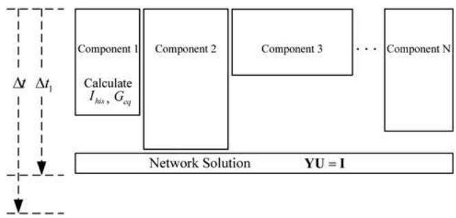  
Fig. 1 Schematic diagram of each time step in RTDS

trapezoidal rule of integration. Thus, during each time step, $G _ { \mathrm { e q } }$ and $I _ { \mathrm { h i s } }$ for each component can be independently calculated, depending on the current state of the system. The state of the system in the following time step can be obtained by solving a linear equation. Further details can be found in [15].

Real-time simulation can be achieved mainly based on the fact that procedures used to calculate $G _ { \mathrm { e q } }$ and $I _ { \mathrm { h i s } }$ for each component are independent, allowing the implementation of parallel computation as shown in Fig. 1. It should be noted that the solution for the network can be obtained only after obtaining $G _ { \mathrm { e q } }$ and $I _ { \mathrm { h i s } }$ for all components. If the time for computation $\Delta t _ { 1 }$ is less than the simulated time step Δt, the system can be simulated in real time (see [13] for further details). When this cannot be satisfied (i.e. it takes too long to calculate a certain complex component such as a rational model of FDNE), the real-time simulation capacity is lost.

# 3 Basics of FDNEs

# 3.1 Rational model of FDNEs

A rational model of FDNEs [5] can be expressed as

$$
\boldsymbol {Y} (s) = \left[ \begin{array}{c c c c} y _ {1 1} (s) & y _ {1 2} (s) & \dots & y _ {1 N} (s) \\ y _ {2 1} (s) & y _ {2 1} (s) & \dots & y _ {2 N} (s) \\ \vdots & \vdots & \ddots & \vdots \\ y _ {N 1} (s) & y _ {N 2} (s) & \dots & y _ {N N} (s) \end{array} \right], \tag {1}
$$

where N is the number of ports, $s { = } j 2 \pi f$ , and f is the frequency. Each element y(s) can be expressed as

$$
y (s) = \sum_ {i = 1} ^ {n} \frac {c _ {i}}{s - a _ {i}} + d + s h, \tag {2}
$$

where a are poles, c are residues, d is a constant, and h is a one-degree term, all of which are unknown coefficients, and n is the number of poles.

In practice, all elements share the poles and the one-degree term h is zero [6–9]. This model can be appropriately solved using vector fitting [4, 16, 17], and passivity can be guaranteed [18, 19].

# 3.2 Realisation in EMTP and computational cost

Equation (1) can be written as a transfer function, i.e.

$$
\boldsymbol {Y} (s) = \boldsymbol {C} (s \boldsymbol {E} - \boldsymbol {A}) ^ {- 1} \boldsymbol {B} + \boldsymbol {D}, \tag {3}
$$

where E is the identity matrix. The forms of the coefficient matrices A, B, C, and D can be found in [5]. The state equations can then be established in the time domain, i.e.

$$
\left\{ \begin{array}{l} \dot {\boldsymbol {x}} = A x + B U \\ \boldsymbol {I} = \boldsymbol {C} \boldsymbol {x} + \boldsymbol {D} \boldsymbol {U}, \end{array} \right. \tag {4}
$$

where I is a vector of injected currents, U is a vector of node voltages, and x is a vector of state variables.

Using (4), the equivalent admittance and historical current can be derived using the trapezium rule for integration [8], i.e.

$$
\boldsymbol {I} (t) = \boldsymbol {I} _ {\text {h i s}} + \boldsymbol {G} _ {\text {e q}} \boldsymbol {U} (t); \tag {5}
$$

and

$$
\boldsymbol {G} _ {\mathrm {e q}} = \boldsymbol {C} \boldsymbol {\lambda} + \boldsymbol {D}, \tag {6}
$$

$$
\boldsymbol {I} _ {\text {h i s}} = \boldsymbol {C} \boldsymbol {\alpha} \boldsymbol {x} (t - \Delta t) + \boldsymbol {C} \boldsymbol {\lambda} \boldsymbol {U} (t - \Delta t),
$$

where

$$
\boldsymbol {\alpha} = \left(\boldsymbol {E} - \frac {\Delta t}{2} \boldsymbol {A}\right) ^ {- 1} \left(\boldsymbol {E} + \frac {\Delta t}{2} \boldsymbol {A}\right), \tag {7}
$$

$$
\boldsymbol {\lambda} = \frac {\Delta t}{2} \left(\boldsymbol {E} - \frac {\Delta t}{2} \boldsymbol {A}\right) ^ {- 1} \boldsymbol {B},
$$

and Δt is the time step for integration.

Considering the fact that $G _ { \mathrm { e q } }$ is constant, only $ { I _ { \mathrm { h i s } } }$ needs to be calculated continuously. The computational cost of preparing the components of the FDNE $ { I _ { \mathrm { h i s } } }$ for each step in the iteration step of the EMTP simulation (assessed in terms of the number of floating-point multiplications) is

$$
O = 2 n N ^ {2} + N ^ {2} + 2 n N. \tag {8}
$$

A derivation is given in Appendix 1. Note that the FDNE model is three-phase so ${ \bar { N } } { = } 3 P ; P$ is the number of the network ports.

Based on our experience as users of RTDS using processors based on giga processor cards (GPCs) [8], when the time step is 50 µs (which is common in EMTPs), FDNE components with $N = 6$ and n = 40 are close to the limit of real-time simulation. In previous reports of FDNEs in RTDS [6–8], the number of the poles in rational models n was not clearly established, and the number of network ports P was always one or two. There is clearly a problem with local overload of the computational cost caused by the FDNE component when implementing FDNE rational models in RTDS; however, this has yet to be reported in detail.

# 4 Solutions to accelerate FDNE simulations

# 4.1 Compacting

The first part of the acceleration solution described here is compacting. The original idea comes from [20], which proposes a robust approach that uses vector fitting to fulfil the system identification.

The coefficient matrices A, B, C, and D can have different forms and formats [20]. An example with $N = 3$ and $n = 4$ is illustrated in Fig. 2. (Further details are given in Appendix 2.) With the original format (i.e. Format 1 shown in Fig. 2a), the poles are repeated N times in A, resulting in redundancy of state variables; hence, the matrices can be rearranged, resulting in the new format (Format 2 shown in Fig. 2b). The model can be compacted when some residue matrix $\pmb { R } _ { k }$ (shown in Fig. 2b) is not full rank, and a physically more correct state equation can be obtained [20].

If the rank of $\pmb { R } _ { k }$ is r (see Appendix 3), then according to singular value decomposition (SVD), $\pmb { R } _ { k }$ can be decomposed as

$$
\boldsymbol {R} _ {k} = \boldsymbol {U} \boldsymbol {\Sigma} \boldsymbol {V} ^ {\mathrm {T}}, \tag {9}
$$

where $\pmb { \Sigma } = \mathrm { d i a g } ( \sigma _ { 1 } , \sigma _ { 2 } , . . . , \sigma _ { r } )$ is the singular value, $U = ( u _ { 1 } , u _ { 2 } , . . . ,$ $u _ { r } )$ and $V { = } ( \nu _ { 1 } , \ \nu _ { 2 } { , } \ . . . , \ \nu _ { r } )$ are the left and right singular vectors,

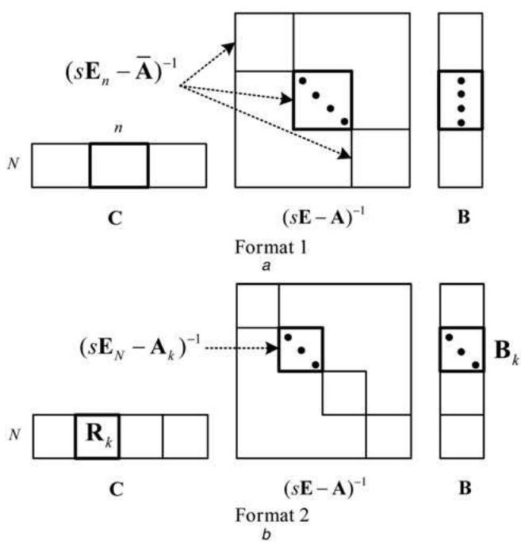  
Fig. 2 a Forms of the coefficient matrices A, B, and C in original format b Forms of the coefficient matrices A, B, and C in rearranged format

respectively. Then, the initial $\pmb { R } _ { k } , \pmb { A } _ { k } ,$ , and $\pmb { { B } } _ { k }$ can be replaced by

$$
\boldsymbol {R} _ {k} ^ {\prime} = \boldsymbol {U} \boldsymbol {\Sigma}, \tag {10}
$$

$$
A _ {k} ^ {\prime} = \operatorname {d i a g} \left(\left(a _ {k} a _ {k} \dots a _ {k}\right) _ {(1 \times r)}\right), \tag {11}
$$

$$
\boldsymbol {B} _ {k} ^ {\prime} = \boldsymbol {V} ^ {\mathrm {T}}, \tag {12}
$$

to fulfil the compacting as illustrated in Fig. 3.

In this work, the objective of FDNE compacting is to improve the computational efficiency of the model. However, a side effect of compacting is that the corresponding sub-matrix in B [i.e. $\pmb { B } _ { k } ]$ is no longer sparse. Prior to compacting, the computational cost due to $\pmb { R } _ { k }$ (and its corresponding sub-matrices in A and B) is

$$
O _ {k} = 2 N ^ {2} + 2 N; \tag {13}
$$

after compacting, the computational cost is

$$
O _ {k} ^ {\prime} = 4 r N. \tag {14}
$$

It follows that $O _ { 1 } < O _ { 0 }$ leads to the condition that

$$
r <   \frac {N + 1}{2}, \tag {15}
$$

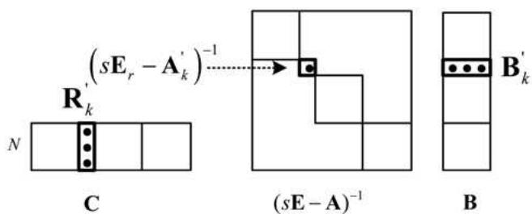  
Fig. 3 FDNE in Format 2, following compacting

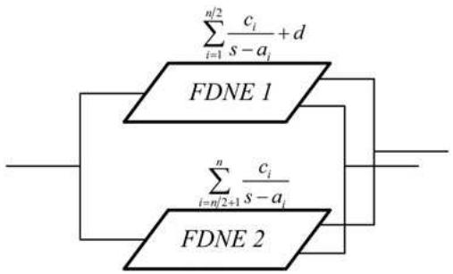  
Fig. 4 Schematic diagram showing FDNE partitioning

and this process of compacting one residue matrix $\pmb { R } _ { k }$ decreases the FDNE component’s computational cost by

$$
O _ {\text {r e d u c e}} = 2 N ^ {2} + 2 N - 4 r N. \tag {16}
$$

It is important to note that, there are total n residue matrices in an FDNE rational model, i.e. $R _ { 1 } , R _ { 2 } , . . . , R _ { k } , . . . , R _ { n } .$ . The rank of all residue matrices should be checked and those with a rank of less than N + 1/2 should be compacted.

# 4.2 Partitioning

As described in Section 4, one of the major issues is that an FDNE is modelled as a single component. FDNE compacting does not address this issue, and this limits the improvements in computational efficiency.

A single FDNE model can be partitioned into several parts for the following two reasons. First, physically, an FDNE is an admittance, and so adding admittances corresponds to parallel connections. Second, mathematically, the rational model of an FDNE is the sum of fractional functions, and so it can be easily separated.

Here, we take the example of an FDNE model partitioned into two components. The elements can be separated as follows

$$
\sum_ {i = 1} ^ {n} \frac {c _ {i}}{s - a _ {i}} + d = \left(\sum_ {i = 1} ^ {n / 2} \frac {c _ {i}}{s - a _ {i}} + d\right) + \sum_ {n / 2 + 1} ^ {n} \frac {c _ {i}}{s - a _ {i}}. \tag {17}
$$

It can then be modelled as two components, which can be solved in parallel using EMTP tools as shown in Fig. 4.

From (8), if the FDNE model can be further partitioned equally into k components, then the computational cost of each component is given by

$$
O _ {\text {c o m p o n e n t}} = 2 n N ^ {2} / k + N ^ {2} + 2 n N / k. \tag {18}
$$

This concept is simple, yet highly effective in improving the computational efficiency. The partitioned model can exploit computational resources to solve for a single module in parallel, which significantly decreases the term n in (8).

# 5 Numerical tests

In this section, first we give some examples to discuss how the problem is modelled using the existing approach, and then go on to show how compacting and partitioning can be used to increase the performance of an EMTP calculation. The numerical tests discussed in this section are based on RTDS with GPC processors. Although the example is specific, the idea of the proposed solution is general.

The RTDS we used has four racks, each rack containing four GPC cards. As mentioned in Section 4, an FDNE with N = 6 and $n = 4 0$ is the approximate limit for RTDS with GPC processors, i.e. the limit of the computational cost is approximately $\mathrm { \bar { \it O } _ { l i m } } = 3 3 9 6$ (simulation time step is 50 μs).

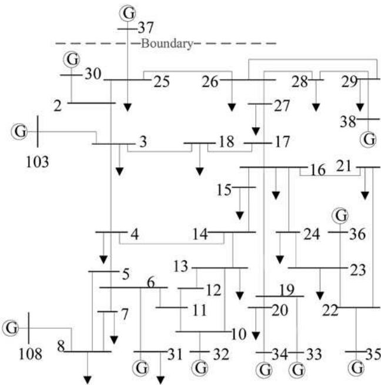  
Fig. 5 Modified New England 39-bus system

# 5.1 Existing approach

Test cases were based on a modified New England 39-bus system as shown in Fig. 5, and different boundaries were chosen to define different FDNEs. The sampling data to describe the frequency characteristics of the original networks, which were used to solve the rational model, were obtained based on power-flow data using the method described in [6]. The FDNEs were three-phase equivalents, and considered mutual impedance among the phases.

5.1.1 FDNEs for a one-port network: First, boundaries were chosen at internal bus #37 and external bus #25 as shown in Fig. 5, so that bus #37 was retained and the rest of the system could be represented by an FDNE with P = 1 (and N = 3).

To determine the proper number of poles n, the rational model was solved while increasing n from 10 to 80 using the root-mean square (RMS) error to evaluate the precision as shown in Fig. 6. More detailed information on the two rational models with n = 30 and n = 46 (termed Y1 and Y2) is listed in the table shown in Fig. 6, including the RMS error, computational cost O, and whether or

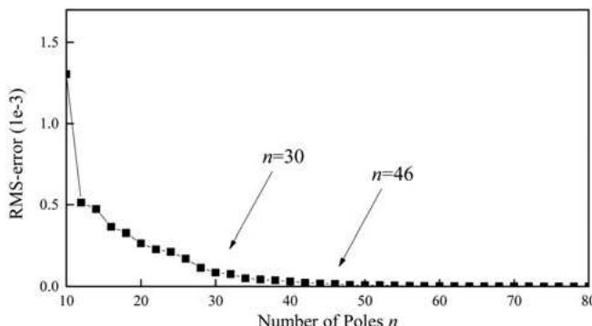

<table><tr><td></td><td>n</td><td>RMS error</td><td>O</td><td>Real Time</td></tr><tr><td>Y1</td><td>30</td><td>8.54×10-5</td><td>729</td><td>Yes</td></tr><tr><td>Y2</td><td>46</td><td>1.68×10-5</td><td>1113</td><td>Yes</td></tr></table>

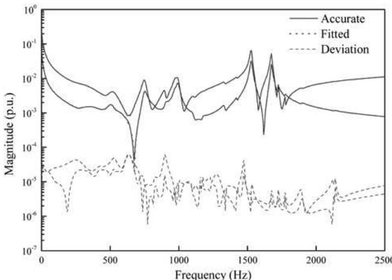  
Fig. 6 Computational analysis of the rational models of the FDNE with boundaries at internal bus #37 and external bus #25   
Fig. 7 Approximating the FDNE using 46 poles with boundaries at internal bus #37 and external bus #25

not the model can be simulated in real time. (These two values of n were chosen so that the RMS error was ∼1–9 × 10 5.)

Fig. 7 shows the results of approximating the FDNE using 46 poles. Here, the model was 3 × 3, and due to the symmetry, the nine elements have only two values: diagonal and non-diagonal. We selected the 2.5 kHz range based on the time step typically used in RTDS simulation; which is 50 m/s. A total of 50 m/s is the inverse of 20 kHz. It is a rule of thumb that the simulation is accurate to about 1/10–1/5 of this frequency, which gives 2–4 kHz. This time step has been widely used and continuers to be used for LCC-HVDC and several protection studies. Hence the FDNE was selected to be accurate up 2.5 kHz, as the simulator itself has questionable accuracy after this frequency. If the time step were smaller (such as in off-line simulation), we would have fitted the FDNE over a wider bandwidth.

5.1.2 FDNE for a two-port network: Rational models of the FDNE for a two-port network (i.e. a network with two boundaries Y3–Y6) are illustrated in Figs. 8 and 9. Note that FDNEs with the same number of ports but different boundaries require a different number of poles to achieve a given precision. From the data shown in Figs. 8 and 9, Y4–Y6 cannot be simulated in real time because of the large computation cost.

5.1.3 FDNEs for networks with more ports: Rational models of the FDNE for a network with three ports (Y7–Y8) are shown in Fig. 10, and for a network with six ports (Y9–Y10) are shown in

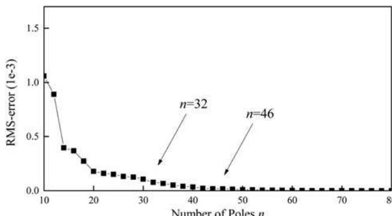  
Fig. 8 Computational analysis of the rational models of the FDNE with boundaries at internal buses #37 and #38, and external buses #25 and #29

<table><tr><td>n</td><td>RMS error</td><td>O</td><td>Real Time</td></tr><tr><td>32</td><td>7.71×10-5</td><td>2724</td><td>Yes</td></tr><tr><td>46</td><td>1.64×10-5</td><td>3900</td><td>No</td></tr></table>

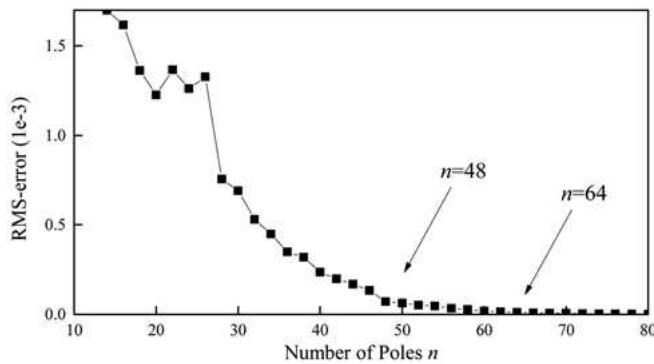

<table><tr><td>n</td><td>RMS error</td><td>O</td><td>Real Time</td></tr><tr><td>48</td><td>6.70×10-5</td><td>4068</td><td>No</td></tr><tr><td>64</td><td>1.12×10-5</td><td>5412</td><td>No</td></tr></table>

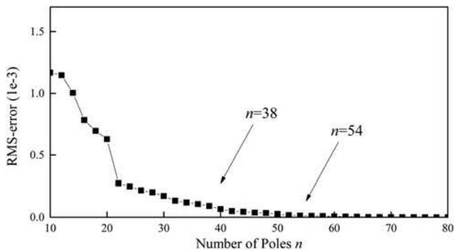  
Fig. 9 Computational analysis of the rational models of the FDNE with boundaries at internal buses #103 and #108, and external buses #3 and #8

<table><tr><td>n</td><td>RMS error</td><td>O</td><td>Real Time</td></tr><tr><td>38</td><td>8.33×10-5</td><td>6921</td><td>No</td></tr><tr><td>54</td><td>1.17×10-5</td><td>9801</td><td>No</td></tr></table>

Fig. 10 Computational analysis of the rational models of the FDNE with boundaries at internal buses #103, #37, and #38, and external buses #3, #25, and #29

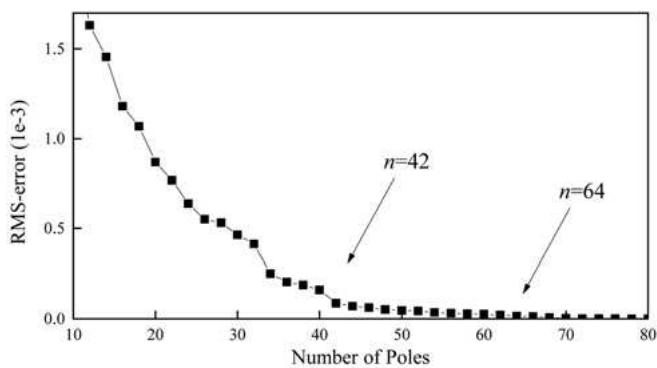  
Fig. 11 Computational analysis of the rational models of the FDNE with boundaries at internal buses #37, #103, #108, #31, #32, and #34, and external buses #25 #3, #8, #6, #10, and #20

<table><tr><td rowspan="3">Y9
Y10</td><td>n</td><td>RMS error</td><td>O</td><td>Real Time</td></tr><tr><td>42</td><td>7.85 × 10-5</td><td>29052</td><td>No</td></tr><tr><td>64</td><td>1.29 × 10-5</td><td>44100</td><td>No</td></tr></table>

Table 1 Rank of $\pmb { R } _ { j }$ with Y4 (N = 6 and n = 46)   

<table><tr><td>Rank of Ri</td><td>1</td><td>2</td><td>3</td><td>4</td><td>5</td><td>6</td></tr><tr><td>Number of Ri matrices with the same rank</td><td>0</td><td>12</td><td>16</td><td>6</td><td>6</td><td>6</td></tr></table>

Fig. 11. With three ports, even when $n = 2 0 ( \mathrm { R M S \ e r r o r } = 6 . 3 \times 1 0 ^ { - 4 }$ , O = 3681), the computational cost exceeds the limit for real-time simulations.

By examining these situations with one, two, three, and six ports, we obtain an idea of the limitations with the existing approach: FDNEs with $P = 1$ can usually be simulated in real time; FDNEs with P = 2 may have issues with computational cost, depending on the number of poles; and FDNEs with $P \geq 3$ usually cannot be simulated in real time with satisfactory precision.

The FDNEs reported previously [6–8] were all characterised by $P \leq 2 .$ , and were applied to test systems. However, this is not satisfactory for application to real systems. For example, when FDNEs are used to represent AC networks when simulating large-scale AC–DC hybrid systems [8], there are typically more than two interface buses between the AC and DC subsystems.

# 5.2 Effects of FDNE compacting

In this section, we describe the effects of FDNE compacting, and discuss whether it can be used to address the large computational cost of simulating systems with Y4–Y10.

Take Y4 as an example. The computational cost is O = 3900, which exceeds the limit $\mathrm { \bar { \it O } _ { l i m } } = 3 3 9 6$ . The rank of $\pmb { R } _ { i }$ was assessed using SVD with a threshold of $\lambda { \it \Delta \phi } = 0 . 9 9 9 9$ (see Appendix 3), and the results are listed in Table 1.

From (15), $\pmb { R } _ { i }$ matrices with ranks 1–3 can be compacted, i.e., there are 28 $\pmb { R } _ { i }$ matrices that can be compacted. The detailed data of Y4 compacting is available online [21] and the effects of compacting are listed in Table 2; the computational cost was decreased from 3900 to 3276 with very little loss of precision (from $1 . 6 4 \times 1 0 ^ { - 5 } ~ \mathrm { ~ t o ~ } ~ 1 . 9 6 \times 1 0 ^ { - 5 } )$ , thus solving the problem of excessive computational cost and enabling simulation in real time. In this case, FDNE compacting was effective.

Using the same process FDNEs with Y5–Y10 after compacting gave the results are listed in Table 3. We can notice the performance that, (i) generally, the effect of compacting decreased the computational cost without significantly decreasing the precision because the original form of $\mathrm { \ F D N E { } ^ { \circ } s }$ state equations established by vector fitting was mathematically redundant; (ii) for the same network, a rational model with more poles could be compacted more; and (iii) compacting was more effective with FDNEs with more ports (i.e. Y9 and Y10). However, the computational cost of Y5–Y10 still exceeded the limit following compacting. Therefore, although FDNE compacting is clearly

Table 2 Effects of FDNE compacting for Y4   

<table><tr><td rowspan="2">FDNE</td><td colspan="2">Before compacting</td><td colspan="3">After compacting</td></tr><tr><td>RMS error</td><td>O</td><td>RMS error</td><td>O</td><td>Real time</td></tr><tr><td>Y4</td><td>1.64 × 10-5</td><td>3900</td><td>1.96 × 10-5</td><td>3276</td><td>yes</td></tr></table>

Table 3 Effects of FDNE compacting for Y5–Y10   

<table><tr><td rowspan="2">FDNE</td><td colspan="2">Before compacting</td><td colspan="3">After compacting</td></tr><tr><td>RMS error</td><td>O</td><td>RMS error</td><td>O</td><td>Real time</td></tr><tr><td>Y5</td><td>6.70 × 10-5</td><td>4068</td><td>6.86 × 10-5</td><td>3420</td><td>no</td></tr><tr><td>Y6</td><td>1.12 × 10-5</td><td>5412</td><td>2.81 × 10-5</td><td>4140</td><td>no</td></tr><tr><td>Y7</td><td>8.33 × 10-5</td><td>6921</td><td>8.71 × 10-5</td><td>6273</td><td>no</td></tr><tr><td>Y8</td><td>1.17 × 10-5</td><td>9801</td><td>3.68 × 10-5</td><td>7425</td><td>no</td></tr><tr><td>Y9</td><td>7.85 × 10-5</td><td>29,052</td><td>8.34 × 10-5</td><td>18,720</td><td>no</td></tr><tr><td>Y10</td><td>1.29 × 10-5</td><td>44,410</td><td>3.29 × 10-5</td><td>26,964</td><td>no</td></tr></table>

Table 4 $\pmb { R } _ { j }$ of Y10 after compacting (sorted by rank)   

<table><tr><td>Rank</td><td>Ri</td></tr><tr><td>1</td><td>R1-R6</td></tr><tr><td>2</td><td>R7-R22</td></tr><tr><td>3</td><td>R23-R27</td></tr><tr><td>4</td><td>R28-R29</td></tr><tr><td>5</td><td>R30-R31</td></tr><tr><td>6</td><td>-</td></tr><tr><td>7</td><td>R32-R33</td></tr><tr><td>8</td><td>R34-R38</td></tr><tr><td>9</td><td>R39-R42</td></tr><tr><td>18</td><td>R43-R64</td></tr></table>

Table 5 Partitioning solution for Y10   

<table><tr><td>Component</td><td>Ri</td><td>O</td><td>Real time</td></tr><tr><td>1</td><td>R1-R22</td><td>3060</td><td>yes</td></tr><tr><td>2</td><td>R23-R29</td><td>1980</td><td>yes</td></tr><tr><td>3</td><td>R30-R33</td><td>2052</td><td>yes</td></tr><tr><td>4</td><td>R34-R38</td><td>3204</td><td>yes</td></tr><tr><td>5</td><td>R39-R42</td><td>2916</td><td>yes</td></tr><tr><td>6</td><td>R43-R46</td><td>3060</td><td>yes</td></tr><tr><td>7</td><td>R47-R50</td><td>3060</td><td>yes</td></tr><tr><td>8</td><td>R51-R54</td><td>3060</td><td>yes</td></tr><tr><td>9</td><td>R55-R58</td><td>3060</td><td>yes</td></tr><tr><td>10</td><td>R59-R62</td><td>3060</td><td>yes</td></tr><tr><td>11</td><td>R63-R64</td><td>1692</td><td>yes</td></tr></table>

useful, FDNE compacting alone is not sufficient to address computational cost issues completely.

# 5.3 Effects of FDNE partitioning

The hardware of RTDS can be counted in terms of the number of racks, and the subsystems modelled in different racks are connected via transmission lines or cables to exploit the travelling wave characteristics, so that the network solution for each rack can be separated [13]. Therefore, the FDNEs should be modelled in a single rack. There are typically four GPC cards in one rack; each GPC card has two processors. Based on our experience, each processor can handle three FDNE components with $O _ { \mathrm { l i m } } .$ Considering that network solutions require one GPC card, in total 18 FDNE components can be modelled in one rack, i.e. the FDNE can be partitioned into 18 sections at most.

Here, we take Y10 as an example, and discuss how FDNE partitioning works. Firstly, through compacting, $\pmb { R } _ { i }$ matrices with ranks 1–9 were compacted, and the remainders were retained as listed in Table 4. Then, it is straightforward to partition Y10 into several components so that the computational cost of each component is within the limits required for real-time simulation. The partitioning strategy can be quite flexible and Table 5 lists a solution for 11 components. The performance of partitioning is very remarkable since it exploits parallel computer architectures.

Similarly, the computational burden issue with Y5–Y9 can be overcome via partitioning.

The maximum number of ports of the FDNE that can be simulated in real time following partitioning depends on the specific real-time EMTP tools; however, the power of FDNE partitioning has clearly been demonstrated.

# 6 Conclusions

Rational models of FDNEs have been used in RTDS to reduce the scale of a system. However, the problem of local computational overload due to the FDNE components has not been discussed previously in detail.

In this paper, we have addressed issues with the computational cost of FDNE components where the implementation of FDNEs may result in the loss of the ability to perform real-time

simulations. A solution that combines FDNE compacting and FDNE partitioning was proposed, where the former reduces the redundancy of the FDNE mathematical model and the latter separates the model into several components to exploit parallel computer architectures. Through a number of numerical tests, compacting and partitioning were shown to be a particularly effective solution to the problem of local overload in the computational cost of FDNEs.

Moreover, the proposed solution is not limited to the applications of FDNEs in RTDS, it is suitable for solving the computational issues when implementing rational models in other real-time EMTP tools.

# 7 Acknowledgments

The authors thank B. Gustavsen of SINTEF Energy Research for his contribution to vector fitting as well as providing a publicly available Matlab code, and Prof. A.M. Gole of University of Manitoba for his insightful comments and suggestions on this work. This work was supported in part by the National Key Basic Research Program of China (2013CB228206), in part by the National Science Foundation of China (51177080, 51321005), CEPRI Research project (XT71-14-042) and New Century Excellent Talents in University (NCET-11-0281).

# 8 References

1 Morched, A.S., Ottevangers, J.H., Marti, L.: ‘Multi-port frequency dependent network equivalents for the EMTP’, IEEE Trans. Power Deliv., 1993, 8, (3), pp. 1402–1412   
2 Watson, N.R., Arrillaga, J.: ‘Frequency-dependent AC system equivalents for harmonic studies and transient convertor simulation’, IEEE Trans. Power Deliv., 1988, 3, (3), pp. 1196–1203   
3 Gustavsen, B., Semlyen, A.: ‘Simulation of transmission line transients using vector fitting and modal decomposition’, IEEE Trans. Power Deliv., 1998, 13, pp. 605–614   
4 Gustavsen, B., Semlyen, A.: ‘Rational approximation of frequency domain responses by vector fitting’, IEEE Trans. Power Deliv., 1999, 14, (3), pp. 1052–1061   
5 Gustavsen, B.: ‘Computer code for rational approximation of frequency dependent admittance matrices’, IEEE Power Eng. Rev., 2002, 22, (6), p. 64   
6 Lin, X., Gole, A.M., Yu, M.: ‘A wide-band multi-port system equivalent for real-time digital power system simulators’, IEEE Trans. Power Syst., 2009, 24, (1), pp. 237–249   
7 Liang, Y., Lin, X., Gole, A.M., et al.: ‘Improved coherency-based wide-band equivalents for real-time digital simulators’, IEEE Trans. Power Syst., 2011, 26, (3), pp. 1410–1417   
8 Hu, Y., Wu, W., Zhang, B., et al.: ‘Development of an RTDS-TSA hybrid transient simulation platform with frequency dependent network equivalents’. Proc. 2013 Fourth IEEE/PES Innovative Smart Grid Technologies Europe (ISGT EUROPE, 2013), pp. 1–5   
9 Zhang, Y., Gole, A.M., Wu, W., et al.: ‘Development and analysis of applicability of a hybrid transient simulation platform combining TSA and EMT elements’, IEEE Trans. Power Syst., 2013, 28, (1), pp. 357–366   
10 Mahseredjian, J., Dinavahi, V., Martinez, J.A.: ‘Simulation tools for electromagnetic transients in power systems: overview and challenges’, IEEE Trans. Power Deliv., 2009, 23, (3), pp. 1657–1669   
11 Paré, D., Turmel, G., Soumagne, J.-C., et al.: ‘Validation tests of the Hypersim digital real time simulator with a large AC-DC network’. Proc. Int. Conf. Power Systems Transients (IPST 2003), New Orleans, LA, 28 September–2 October 2003   
12 Abourida, S., Dufour, C., Belanger, J., et al.: ‘Real-time PC-based simulator of electric systems and drives’. Proc. 17th IEEE APEC, Annual Applied Power Electronics Conf. and Exposition, 10–14 March 2002, vol. 1, pp. 433–438   
13 Kuffel, R., Giesbrecht, J., Maguire, T., et al.: ‘RTDS – a fully digital power system simulator operating in real time’. Proc. 1995 First Int. Conf. on Digital Power System Simulators, 2005, p. 19   
14 Forsyth, P., Kuffel, R., Wierckx, R., et al.: ‘Comparison of transient stability analysis and large-scale real time digital simulation’. Proc. 2001 IEEE Porto Power Tech Proc., 2001, pp. 4–7   
15 Dommel, H.W.: ‘Digital computer solution of electromagnetic transients in singleand multiphase networks’, IEEE Trans. Power Appar. Syst., 1969, PAS-88, (4), pp. 388–399   
16 Gustavsen, B.: ‘Improving the pole relocating properties of vector fitting’, IEEE Trans. Power Deliv., 2006, 21, (3), pp. 1587–1592   
17 Deschrijver, D., Mrozowski, M., Dhaene, T., et al.: ‘Macromodeling of multiport systems using a fast implementation of the vector fitting method’, IEEE Microw. Wirel. Compon. Lett., 2008, 18, (6), pp. 383–385   
18 Semlyen, A., Gustavsen, B.: ‘A half-size singularity test matrix for fast and reliable passivity assessment of rational models’, IEEE Trans. Power Deliv., 2009, 24, (1), pp. 345–351

19 Gustavsen, B.: ‘Fast passivity enforcement for pole-residue models by perturbation of residue matrix eigenvalues’, IEEE Trans. Power Deliv., 2008, 23, (4), pp. 2278–2285   
20 Gustavsen, B., Semlyen, A.: ‘A robust approach for system identification in the frequency domain’, IEEE Trans. Power Deliv., 2004, 19, (3), pp. 1167–1173   
21 Detailed Data of Y4 Compacting. avaiable at: https://www.drive.google.com/file/d/ 0B9Yw8VKnb1AzNmNaOGh3eWdmY3c/view

# 9 Appendix

# 9.1 Appendix 1: Derivation of the computational cost of FDNEs

Hence $G _ { \mathrm { e q } }$ is constant, only $ { I _ { \mathrm { h i s } } }$ needs to be calculated during each time step. For brevity, some constant matrices are defined in Table 6, and the procedure for preparing $ { I _ { \mathrm { h i s } } }$ for each time step, as well as the corresponding computational cost (assessed in terms of the number of floating-point multiplications) is listed in Table 7.

Once $ { I _ { \mathrm { h i s } } }$ has been calculated via Procedure 2, the network solution and Procedure 3 can progress simultaneously (this feature is supported by some real-time EMTP tools such as RTDS). The real-computational cost of the FDNE component in each iterative step is given by

$$
O = 2 n N ^ {2} + N ^ {2} + 2 n N. \tag {19}
$$

This can be rewritten as

$$
O = (2 N ^ {2} + 2 N) n + N ^ {2}, \tag {20}
$$

since the contribution of each pole is $2 N ^ { 2 } + 2 N ,$ , where $N ^ { 2 }$ is an additional part.

# 9.2 Appendix 2: Different forms of coefficient matrices in different formats

When N = 3 and $n = 4 ,$ the rational model of FDNEs can be expressed as

$$
\begin{array}{l} \boldsymbol {Y} (s) = \left[ \begin{array}{l l l} \sum_ {i = 1} ^ {4} \frac {c _ {i} ^ {1 1}}{s - a _ {i}} & \sum_ {i = 1} ^ {4} \frac {c _ {i} ^ {1 2}}{s - a _ {i}} & \sum_ {i = 1} ^ {4} \frac {c _ {i} ^ {1 3}}{s - a _ {i}} \\ \sum_ {i = 1} ^ {4} \frac {c _ {i} ^ {2 1}}{s - a _ {i}} & \sum_ {i = 1} ^ {4} \frac {c _ {i} ^ {2 2}}{s - a _ {i}} & \sum_ {i = 1} ^ {4} \frac {c _ {i} ^ {2 3}}{s - a _ {i}} \\ \sum_ {i = 1} ^ {4} \frac {c _ {i} ^ {3 1}}{s - a _ {i}} & \sum_ {i = 1} ^ {4} \frac {c _ {i} ^ {3 2}}{s - a _ {i}} & \sum_ {i = 1} ^ {4} \frac {c _ {i} ^ {3 3}}{s - a _ {i}} \end{array} \right] \\ + \left[ \begin{array}{l l l} d ^ {1 1} & d ^ {1 2} & d ^ {1 3} \\ d ^ {2 1} & d ^ {2 2} & d ^ {2 3} \\ d ^ {3 1} & d ^ {3 2} & d ^ {3 3} \end{array} \right]. \tag {21} \\ \end{array}
$$

D is determined by comparing with (3). The forms of A, B, and C depend on the formats.

In Format 1, which is the original one using vector fitting to solve the FDNEs [5], the matrices are partitioned by the column.

Table 6 Constant matrices   

<table><tr><td>Matrix</td><td>Dimension and features</td></tr><tr><td>C1=Cα</td><td>N×nN</td></tr><tr><td>C2=Cλ</td><td>N×N</td></tr><tr><td>C3=α</td><td>nN×nN, where only the diagonal elements are non-zero</td></tr><tr><td>C4=λ</td><td>nN×N, where only one element in each row is non-zero</td></tr></table>

The second part marked in Fig. 2a is given by

$$
\begin{array}{l} \left[ \begin{array}{c c c c} c _ {1} ^ {1 2} & c _ {2} ^ {1 2} & c _ {3} ^ {1 2} & c _ {4} ^ {1 2} \\ c _ {1} ^ {2 2} & c _ {2} ^ {2 2} & c _ {3} ^ {2 2} & c _ {4} ^ {2 2} \\ c _ {1} ^ {3 2} & c _ {2} ^ {3 2} & c _ {3} ^ {3 2} & c _ {4} ^ {3 2} \end{array} \right] \left[ \begin{array}{c c c c} \frac {1}{s - a _ {1}} & & & \\ & \frac {1}{s - a _ {2}} & & \\ & & \frac {1}{s - a _ {3}} & \\ & & & \frac {1}{s - a _ {4}} \end{array} \right] \\ \times \left[ \begin{array}{c c c} 0 & 1 & 0 \\ 0 & 1 & 0 \\ 0 & 1 & 0 \\ 0 & 1 & 0 \end{array} \right] \\ = \left[ \begin{array}{l l l} 0 & \sum_ {i = 1} ^ {4} \frac {c _ {i} ^ {1 2}}{s - a _ {i}} & 0 \\ 0 & \sum_ {i = 1} ^ {4} \frac {c _ {i} ^ {2 2}}{s - a _ {i}} & 0 \\ 0 & \sum_ {i = 1} ^ {4} \frac {c _ {i} ^ {3 2}}{s - a _ {i}} & 0 \end{array} \right]. \tag {22} \\ \end{array}
$$

In Format 2, which is described in [20], the matrices are partitioned by poles to complete the system identification. The second part marked in Fig. 2b is given by

$$
\begin{array}{l} \left[ \begin{array}{l l l} c _ {2} ^ {1 1} & c _ {2} ^ {1 2} & c _ {2} ^ {1 3} \\ c _ {2} ^ {2 1} & c _ {2} ^ {2 2} & c _ {2} ^ {2 3} \\ c _ {2} ^ {3 1} & c _ {2} ^ {3 2} & c _ {2} ^ {3 3} \end{array} \right] \left[ \begin{array}{c c c} \frac {1}{s - a _ {2}} & & \\ & \frac {1}{s - a _ {2}} & \\ & & \frac {1}{s - a _ {2}} \end{array} \right] \left[ \begin{array}{c c c} 1 & & \\ & 1 & \\ & & 1 \end{array} \right] \\ = \left[ \begin{array}{c c c} \frac {c _ {2} ^ {1 1}}{s - a _ {2}} & \frac {c _ {2} ^ {1 2}}{s - a _ {2}} & \frac {c _ {2} ^ {1 3}}{s - a _ {2}} \\ \frac {c _ {2} ^ {2 1}}{s - a _ {2}} & \frac {c _ {2} ^ {2 2}}{s - a _ {2}} & \frac {c _ {2} ^ {2 3}}{s - a _ {2}} \\ \frac {c _ {2} ^ {3 1}}{s - a _ {2}} & \frac {c _ {2} ^ {3 2}}{s - a _ {2}} & \frac {c _ {2} ^ {3 3}}{s - a _ {2}} \end{array} \right]. \tag {23} \\ \end{array}
$$

# 9.3 Appendix 3: Numerical rank of matrix $\pmb { R } _ { j }$

In this paper, the rank of $\pmb { R } _ { i }$ is assessed by SVD as follows. Using SVD, we obtain

$$
\boldsymbol {R} _ {i} = \boldsymbol {U} \boldsymbol {\Sigma} \boldsymbol {V} ^ {\mathrm {T}}, \tag {24}
$$

where Σ is a diagonal matrix holding N singular values of $\pmb { R } _ { i }$ in

Table 7 Procedure for preparing Ihis and the associated computational cost   

<table><tr><td>Procedure</td><td>Task</td><td>Cost</td></tr><tr><td>(i) Calculate x(t-Δt)</td><td>x(t-Δt)=y+C4U(t-Δt)</td><td>2 nN</td></tr><tr><td>(ii) Calculate Ihis</td><td>Ihis=C1x(t-Δt)+C2U(t-Δt)</td><td>2nN2+N2</td></tr><tr><td>(iii) Update y(intermediate variable for x)</td><td>y=C3x(t-Δt)+C4U(t-Δt)</td><td>4nN</td></tr></table>

Remarks: $\pmb { c } _ { 1 } , \pmb { c } _ { 3 } , \pmb { c } _ { 4 }$ , and x are complex. ${ \pmb { c } } _ { 2 } , { \pmb { I } } _ { \mathrm { h i s } } ,$ , and U are real. The features of the constant matrices are fully utilised to reduce the computational cost as much as possible; $\pmb { C } _ { 4 } \pmb { U } ( t - \Delta t )$ is obtained via Procedure 1, and the result can be used in Procedure 3.

descending order, i.e.

$$
\sigma_ {1} \geq \sigma_ {2} \geq \dots \geq \sigma_ {N} \geq 0. \tag {25}
$$

Ideally, if the rank of $\pmb { R } _ { i }$ is r

$$
\sigma_ {1} \geq \sigma_ {2} \geq \dots \geq \sigma_ {r} > \sigma_ {r + 1} = \dots = \sigma_ {N} = 0. \tag {26}
$$

In practice, the rank of $\pmb { R } _ { i }$ is estimated numerically using

$$
v (k) = \left(\frac {\sigma_ {1} ^ {2} + \sigma_ {2} ^ {2} + \cdots + \sigma_ {k} ^ {2}}{\sigma_ {1} ^ {2} + \sigma_ {2} ^ {2} + \cdots + \sigma_ {N} ^ {2}}\right) ^ {1 / 2} \quad (1 \leq k \leq N), \tag {27}
$$

where v(k) increases monotonically with k. When a given threshold l is reached, we have

$$
v (r - 1) <   \lambda <   v (r) \tag {28}
$$

and hence r is recognised as the rank of $\pmb { R } _ { i }$ .