# Electromechanical Transient Modeling of Modular Multilevel Converter Based Multi-Terminal HVDC Systems

Sheng Liu, Zheng Xu, Member, IEEE, Wen Hua, Geng Tang, and Yinglin Xue, Student Member, IEEE

Abstract—This paper studies the techniques for modeling modular multilevel converter (MMC) based multi-terminal HVDC (MTDC) systems in the electromechanical transient mode. Firstly, the mathematical model of the MMC and its corresponding equivalent circuit are established, which are similar to those of the two level converters. Then, a power flow calculation method for AC/DC systems containing MMC-MTDC systems is developed. Two dynamic models for MMC-MTDC systems are developed in the paper. One is the detailed model, taking into account of the AC side circuit, the inner controllers, the modulation strategies, the outer controllers and the MTDC circuit. The other is the simplified model, which only reserves the outer controllers and partial dynamics of the MTDC circuit based on a quantitative analysis of the detailed model’s dynamic processes, and it can be used in electromechanical transient simulation with a larger step size. Both the detailed and the simplified models are implemented on PSS/E and compared with the accurate electromagnetic transient models on PSCAD in a four terminal MMC-MTDC system; the result proves the validity of the developed models. Lastly, a stability study of a modified New England 39-bus system is executed, and the result shows that the AC fault can be isolated well in an MMC-MTDC asynchronously connected AC grid.

Index Terms—Electromagnetic transient, electromechanical transient, modeling, modular multilevel converter, multi-terminal HVDC (MTDC), simplified model.

# I. INTRODUCTION

W ITH the rapid development of high-voltage, high-powerand full-controlled power electronic devices, andfull-controlledpowerelectronicdevices, voltage source converter based high voltage direct current (VSC-HVDC) systems have become an attractive innovation for their immunity against commutation failure and relatively easy extension to multi-terminal (MTDC) configurations. There has been a variety of topologies for VSC, and the modular multilevel converter (MMC), due to its low switching-frequency, low losses, small harmonic components and other benefits [1]–[4], is gaining increasing attention.

Manuscript received September 07, 2012; revised January 23, 2013, April 11, 2013, and June 08, 2013; accepted August 06, 2013. Date of publication August 30, 2013; date of current version December 16, 2013. This work was supported by the National High Technology Research and Development Program of China under Project 2012AA050205. Paper no. TPWRS-01035-2012.

S. Liu, Z. Xu, G. Tang, and Y. Xue are with the Department of Electrical Engineering, Zhejiang University, Hangzhou 310027, Zhejiang, China (e-mail: lszju@zju.edu.cn; xuzheng007@zju.edu.cn; tanggeng7@zju.edu.cn; yinglinxue@gmail.com).

W. Hua is with the Zhejiang Electric Power Corporation Research Institute, Hangzhou 310014, Zhejiang, China (e-mail: huawenpin@gmail.com).

Color versions of one or more of the figures in this paper are available online at http://ieeexplore.ieee.org.

Digital Object Identifier 10.1109/TPWRS.2013.2278402

MMC-MTDCs are regarded as grid shock absorbers. Although there is no MMC-MTDC system in practice at present, several MMC-MTDC projects are being designed in China. Therefore, studying the interaction between MMC-MTDC systems and AC systems has become an important task. However, before this can be done, a valid model of the MMC-MTDC system needs to be developed at first.

Research in the field of MMC modeling and control has become more and more active and some significant modeling approaches have been proposed [5]–[10]. A continuous model to describe the operation of the MMC system was derived and the principle allowing the control of the total energy and the balance between the upper and lower arm of a phase was presented in [5]. Furthermore, [6] evaluates four control methods for the MMC together with an experimental comparison. Reference [7] develops a comprehensive mathematical model based on the negative and positive sequence decomposition technique. For modeling the switching behavior of the power electronic devices in MMC-MTDC systems, simulation in electromagnetic transient mode is a convenient method, which can study the dynamic behavior of the MMC accurately [9]–[11]. Based on the electromagnetic transient simulation, different control strategies for VSC-MTDCs [12]–[15] and applications of the VSC-MTDCs in wind farms [16], [17] have been studied. Moreover, there was a breakthrough on the efficient modeling of MMC in the electromagnetic transient simulation mode, which significantly increases the simulation speed and makes it possible to simulate an MMC-MTDC system even if the converters contain hundreds of submodules (SM) [9].

However, electromagnetic transient simulation is still not suitable for studying large-scale systems at present. To study the stability of large-scale AC/DC systems containing MMC-MTDC systems, the electromechanical transient simulation is preferred. Therefore, the MMC-MTDC model suitable for electromechanical transient simulation is necessary and still needs further studies. Several steady-state VSC-MTDC models for power flow analysis were proposed [18], [19]. And a generalized dynamic VSC-MTDC model for power system stability studies has been derived and implemented on MatDyn [20], [21], which presented a comprehensive analysis for the electromechanical transient modeling of the VSC-MTDC. Furthermore, based on the generalized dynamic model, a distributed DC voltage control strategy was proposed and tested [22]. The generalized dynamic model was derived based on the 2-level VSC. Though the MMC and the 2-level VSC are similar, there are still some differences among their modeling. In the field of modeling the MMC for stability studies, a simplified two-terminal MMC-HVDC dynamic model was developed in

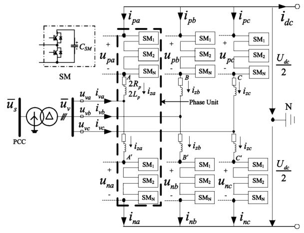  
Fig. 1. Basic structure of an MMC.

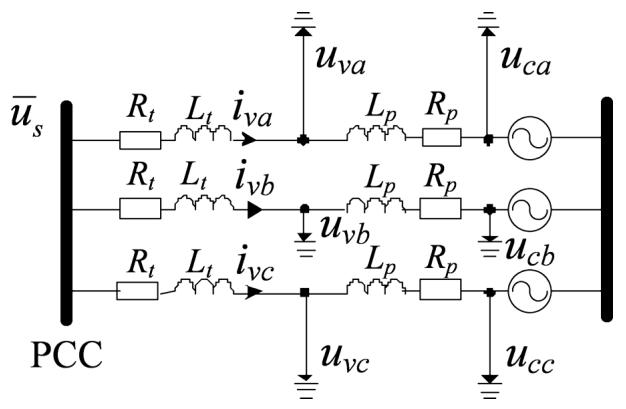  
Fig. 2. Equivalent model of the MMC on the AC side.

PSLF [8] and applied in modeling the Trans Bay Cable Project [23].

A proper MMC-MTDC electromechanical transient model will contribute to the stability study of large-scale AC/DC systems. However, there is no standard MMC-MTDC model in commercial electromechanical transient simulation software so far, thus the aim of this paper is to develop a valid model on PSS/E.

This paper is organized as follows. In Section II, the basic theory about the MMC is described. In Section III, a power flow calculation method based on PSS/E for systems with MMC-MTDC is presented. In Section IV, a detailed MMC-MTDC electromechanical transient model is given, focusing on the modeling of the SM capacitors and the MTDC circuit. The limitation of the detailed model is also discussed. Section V discusses how to increase the simulation step size by simplifying the very fast dynamic processes in the detailed model, and thus proposes a simplified model. In Section VI, the validity of both the detailed and the simplified models is tested by their comparison with the accurate electromagnetic transient MMC-MTDC models on PSCAD, and then a stability study of a modified New England 39-bus system is implemented. Conclusions are presented in Section VII.

# II. BASIC THEORY

The MMC and other VSCs are similar in some aspects. The important structural differences for modeling between the MMC and the well-known 2-level converter are that: the former adopts arm series inductors and SM capacitors, while the latter adopts phase inductors and two DC capacitors. And these differences will be discussed in the following text.

This section introduces the basic theory of the MMC and derives an equivalent circuit on the AC side, which is the basic model for the following steady-state analysis and dynamic modeling.

The basic structure of an MMC is shown in Fig. 1, where $2 L _ { p }$ is the series arm inductor and $2 R _ { p }$ is the equivalent resistor of each arm.

The following equations can be derived:

$$
\left\{ \begin{array}{l} i _ {p k} = - \frac {i _ {v k}}{2} + i _ {z k} - \frac {i _ {d c}}{3} \\ i _ {n k} = \frac {i _ {v k}}{2} + i _ {z k} - \frac {i _ {d c}}{3} \end{array} \right. (k = a, b, c) \tag {1}
$$

where $i _ { p k }$ and $i _ { n k }$ are the upper and lower arm currents in phase- $( k = a , b , c )$ , respectively, $i _ { v k }$ is the corresponding line current, $i _ { d c }$ is the DC current injected into the DC side and $i _ { z k }$ is the corresponding circulating current.

Take phase- as an example, the voltages of point $( u _ { A } )$ and point $A ^ { \bar { \prime } } \left( u _ { A ^ { \prime } } \right)$ are

$$
u _ {A} = u _ {v a} + \left(2 L _ {P} \frac {d i _ {p a}}{d t} + 2 R _ {P} i _ {p a}\right) \tag {2}
$$

$$
u _ {A ^ {\prime}} = u _ {v a} - \left(2 L _ {P} \frac {d i _ {n a}}{d t} + 2 R _ {P} i _ {n a}\right). \tag {3}
$$

The sum of (2) and (3) divided by 2 is

$$
\frac {u _ {A} + u _ {A ^ {\prime}}}{2} = u _ {v a} - \left(L _ {P} \frac {d i _ {v a}}{d t} + R _ {P} i _ {v a}\right). \tag {4}
$$

Now introduce a new variable $u _ { c a }$ , which can be regarded as a virtual potential [24]

$$
u _ {c a} = \frac {u _ {A} + u _ {A ^ {\prime}}}{2}. \tag {5}
$$

Equation (4) for three phases $( a , b , c )$ can be written as

$$
\left\{ \begin{array}{l} u _ {v a} - u _ {c a} = L _ {P} \frac {d i _ {v a}}{d t} + R _ {P} i _ {v a} \\ u _ {v b} - u _ {c b} = L _ {P} \frac {d i _ {v b}}{d t} + R _ {P} i _ {v b} \\ u _ {v c} - u _ {c c} = L _ {P} \frac {d i _ {v c}}{d t} + R _ {P} i _ {v c}. \end{array} \right. \tag {6}
$$

The equivalent circuit of the MMC on the AC side is shown in Fig. 2, where $R _ { t }$ is the resistance of the converter transformer, $L _ { t }$ is the leakage inductance of the converter transformer.

The above equivalent model of the MMC transforms the arm series inductors into phase inductors theoretically and is the fundamental for the following steady-state analysis and dynamic modeling.

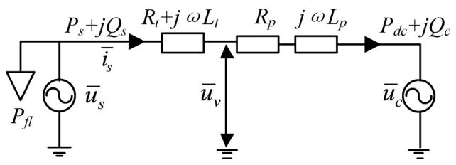  
Fig. 3. AC side steady-state equivalent circuit of MMC.

# III. STEADY-STATE

Power flow calculation is the basis of simulation. This section gives a method to calculate power flow on PSS/E. Since there is no power flow model for MMC-MTDC on PSS/E, each converter is modeled as a generator in the power flow.

The AC side steady-state equivalent circuit of the MMC is shown as Fig. 3 where the positive conventions for active and reactive power are from AC side into the converter. In Fig. 3, $\bar { u } _ { v }$ is the voltage behind the transformer, $\bar { u } _ { c }$ is the voltage of the virtual potential point, $R _ { p }$ is the equivalent phase resistor representing the losses of the converter circuit and $P _ { f l }$ denotes the fixed losses of the converter station. Each AC bus of the converter can be regarded as a PQ or PV bus. A typical steady-state control strategy for the MMC-MTDC system is that one converter regulates the DC voltage (slack converter) and the others control the AC side active power (constant power converters). Another control strategy is that some converters use DC voltage droop control (slack converters) and the others use active power control. The two control strategies are essentially the same for power flow calculation.

The method for power flow calculation takes the following steps:

Step 1): Ordering the DC nodes. Assume that there are slack converters and joint nodes in an -terminal MMC-MTDC system. The joint nodes refer to the nodes which are not connected directly to converters. Let the 1st to the th nodes be slack converters, the th to the th nodes be constant power converters, and the th to the th nodes be joint nodes. In fact, since the injection powers of the joint nodes are all zero, they can also be regarded as constant power nodes. Therefore, the th to the $( n + p )$ th nodes are regarded as constant power nodes together.

In the following steps, the subscript $^ { \mathfrak { a } _ { i } \mathfrak { s } }$ of each variable means that the variable corresponds to the th converter. The subscripts “slack”, “set”, “joint” and $^ { \circ \circ }$ of each vector mean that the vector corresponds to the slack converters, the constant power converters, the joint nodes and the constant power nodes, respectively.

Step 2): Determining known quantities. The DC voltages of the slack converters $\begin{array} { r l } { ( U _ { d c - s l a c k } } & { { } = } \end{array}$ $[ \bar { U } _ { d c 1 } , U _ { d c 2 } , \ldots , U _ { d c k } ] ^ { \mathrm { T } } )$ , the AC side active powers of the constant power converters $( P _ { s _ { - } s e t } ~ = ~ [ P _ { s ( k + 1 ) } , \ldots , P _ { s n } ] ^ { \bar { \Gamma } } )$ , all converters’ AC side reactive powers $Q _ { s i }$ (or AC voltage magnitudes $| \bar { u } _ { s i } | )$ and the DC network admittance matrix $\mathbf { Y } _ { d \mathrm { c } }$ can be given at first.

Step 3): Estimating the variable losses of the constant power converters $( P _ { v l \_ s e t } = [ P _ { v l ( k + 1 ) } , \ldots , P _ { v l n } ] ^ { \mathrm { T } } )$ . Note that $P _ { v l i }$ does not include the fixed loss $P _ { f l i }$ . In this paper $P _ { v l \_ s e t }$ is estimated by (7):

$$
\boldsymbol {P} _ {\boldsymbol {v l} \_ s e t} = \boldsymbol {a} _ {\boldsymbol {s e t}} \otimes | \boldsymbol {P} _ {\boldsymbol {s} \_ s e t} | \tag {7}
$$

where $^ { \mathfrak { c } \mathfrak { c } } \otimes ^ { \mathfrak { n } }$ denotes the element-by-element multiplication. $\mathbf { a } _ { \pmb { s } e t } = [ a _ { ( k + 1 ) } , \ldots , a _ { n } ] ^ { \mathrm { T } }$ and $a _ { i }$ is the coefficient of the variable loss.

Step 4): Calculating the DC powers of the constant power nodes $( P _ { d c \_ P }$ 三 $[ P _ { d c ( k + 1 ) } , \dots , P _ { d c n } , \dots , P _ { d c ( n + p ) } ] ^ { \mathrm { T } } )$ . The DC side powers of the constant power converters $( P _ { d c \_ s e t } \bar { = } [ P _ { d c ( k + 1 ) } , \dots , P _ { d c n } ] ^ { \bar { \bf T } } )$ can be obtained by

$$
\boldsymbol {P} _ {\boldsymbol {d c} \_ s e t} = \boldsymbol {P} _ {\boldsymbol {s} \_ s e t} - \boldsymbol {P} _ {\boldsymbol {v l} \_ s e t}. \tag {8}
$$

The injection powers of the joint buses in DC network $\left( P _ { d c \_ j o i n t } \right)$ are all zeros:

$$
\boldsymbol {P} _ {\boldsymbol {d c} \_ j o i n t} = \left[ P _ {d c (n + 1)}, \dots , P _ {d c (n + p)} \right] ^ {\mathrm {T}} = [ 0, \dots , 0 ] ^ {\mathrm {T}}. \tag {9}
$$

Thus $P _ { d c \_ P }$ can be obtained:

$$
\boldsymbol {P} _ {\boldsymbol {d c} - P} = \left[ P _ {d c (k + 1)}, \dots , P _ {d c (n + p)} \right] ^ {\mathrm {T}} = \left[ \begin{array}{l} \boldsymbol {P} _ {\boldsymbol {d c} - s e t} \\ \boldsymbol {P} _ {\boldsymbol {d c} - j o i n t} \end{array} \right]. \tag {10}
$$

Step 5): Calculating the DC voltages of the constant power nodes $( \pmb { U _ { d c \_ P } } = [ U _ { d c ( k + 1 ) } , \ldots , U _ { d c ( n + p ) } ] ^ { \mathbf { T } } )$ . The equation set of the DC power flow can be represented as

$$
\begin{array}{l} \left[ \begin{array}{c} P _ {\mathbf {d c} \_ s l a c k} \\ P _ {\mathbf {d c} \_ P} \end{array} \right] - \left[ \begin{array}{c} U _ {\mathbf {d c} \_ s l a c k} \\ U _ {\mathbf {d c} \_ P} \end{array} \right] \\ \otimes \left(\left[ \begin{array}{l l} \boldsymbol {Y} _ {\boldsymbol {d c} - s s} & \boldsymbol {Y} _ {\boldsymbol {d c} - s p} \\ \boldsymbol {Y} _ {\boldsymbol {d c} - p s} & \boldsymbol {Y} _ {\boldsymbol {d c} - p p} \end{array} \right] \left[ \begin{array}{c} \boldsymbol {U} _ {\boldsymbol {d c} - s l a c k} \\ \boldsymbol {U} _ {\boldsymbol {d c} - P} \end{array} \right]\right) = \left[ \begin{array}{l} 0 \\ 0 \end{array} \right]. \tag {11} \\ \end{array}
$$

Equation (12) can be derived from (11):

$$
\begin{array}{l} \boldsymbol {P} _ {\boldsymbol {d c} - P} - \boldsymbol {U} _ {\boldsymbol {d c} - P} \\ \otimes \left(\boldsymbol {Y} _ {\boldsymbol {d c} _ {- p s}} \boldsymbol {U} _ {\boldsymbol {d c} _ {- s l a c k}} + \boldsymbol {Y} _ {\boldsymbol {d c} _ {- p p}} \boldsymbol {U} _ {\boldsymbol {d c} _ {- P}}\right) = 0. \tag {12} \\ \end{array}
$$

In (12), only $U _ { d c \_ P }$ is unknown, and (12) can be solved by the Newton-Raphson method, where the initial values of $U _ { d c \_ P }$ can be set to the nominal DC voltage. Therefore, $\pmb { U } _ { d c \_ P }$ can be obtained.

Step 6): Calculating the DC side powers of the slack converters $\begin{array} { r c l } { ( \bar { P _ { d c \_ s l a c k } } } & { = } & { \bar { [ { P _ { d c 1 } } , \ldots , { P _ { d c k } } ] ^ { \mathrm { T } } } ) } \end{array}$ . From (11), $P _ { d c \_ s l a c k }$ can be derived:

$$
\begin{array}{l} \boldsymbol {P} _ {\boldsymbol {d c} \text {- s l a c k}} = \boldsymbol {U} _ {\boldsymbol {d c} \text {- s l a c k}} \\ \otimes \left(\boldsymbol {Y} _ {\boldsymbol {d c} _ {- s s}} \boldsymbol {U} _ {\boldsymbol {d c} _ {- s l a c k}} + \boldsymbol {Y} _ {\boldsymbol {d c} _ {- s p}} \boldsymbol {U} _ {\boldsymbol {d c} _ {- P}}\right). \tag {13} \\ \end{array}
$$

Step 7): Calculating the AC side active powers of the slack converters $( P _ { s \_ s l a c k } = [ P _ { s 1 } , \ldots , P _ { s k } ] ^ { \mathrm { T } } )$ and their variable losses $( P _ { \pmb { v l } _ { - } s l a c k } = [ P _ { \pmb { v l 1 } } , \ldots , P _ { \pmb { v l k } } ] ^ { \mathbf { T } } )$ . The associated equations are

$$
\boldsymbol {P} _ {\boldsymbol {s} \_ s l a c k} = \boldsymbol {P} _ {\boldsymbol {d c} \_ s l a c k} + \boldsymbol {a} _ {\boldsymbol {s l a c k}} \otimes | \boldsymbol {P} _ {\boldsymbol {s} \_ s l a c k} | \tag {14}
$$

where $\mathbf { \mathbf { \Phi } } _ { \mathbf { \Phi } } \mathbf { a } _ { s l a c k } \ \mathbf { \Phi } = \ \left[ a _ { 1 } , \ldots , a _ { k } \right] ^ { \mathrm { T } }$ . Since ${ \pmb a } _ { s l a c k }$ can be estimated, $P _ { s . s l a c k }$ can be derived according to (14).

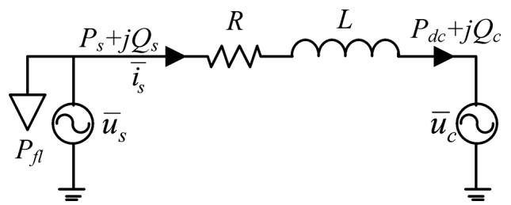  
Fig. 4. AC side dynamic equivalent circuit of MMC.

After $P _ { s . s l a c k }$ are derived, $P _ { { \it v l } \_ { \it s l a c k } }$ can be obtained:

$$
\boldsymbol {P} _ {\boldsymbol {v l} _ {- s l a c k}} = \boldsymbol {a} _ {\boldsymbol {s l a c k}} \otimes | \boldsymbol {P} _ {\boldsymbol {s} _ {- s l a c k}} |. \tag {15}
$$

Step 8): Calculating the power flow of the whole AC/DC system. Since the AC side active powers of all converters are known, the power flow of the whole AC/DC system can be calculated by PSS/E, and all AC buses’ voltages $\bar { u } _ { s i }$ , active powers $P _ { s i }$ and reactive powers $Q _ { s i }$ are obtained, as well as the AC side injection current $\overline { { i } } _ { s i }$ of each converter:

$$
\bar {i} _ {s i} = \operatorname {c o n j} \left[ \left(P _ {s i} + j Q _ {s i}\right) / \bar {u} _ {s i} \right] \quad (i = 1, \dots , n) \tag {16}
$$

where “conj” means the complex conjugation.

Step 9): Calculating the equivalent phase resistor $R _ { p i }$ :

$$
R _ {p i} = P _ {v l i} / \left| \bar {i} _ {s i} \right| ^ {2} - R _ {t i} \quad (i = 1, \dots , n). \tag {17}
$$

Step 10): Calculating $\bar { u } _ { v i }$ and $\bar { u } _ { c i } .$

$$
\bar {u} _ {v i} = \bar {u} _ {s i} - \bar {i} _ {s i} \left(R _ {t i} + j \omega L _ {t i}\right) (i = 1, \dots , n) \tag {18}
$$

$$
\bar {u} _ {c i} = \bar {u} _ {v i} - \bar {i} _ {s i} \left(R _ {p i} + j \omega L _ {p i}\right) \quad (i = 1, \dots , n). \tag {19}
$$

During the process, both the DC network power flow and the power flow of the whole AC/DC system are calculated only once.

It should be noted that the above method to represent the converter station losses may not be the best way, because it only takes account of fixed losses and variable losses proportional to the square of the converter current, and it may be more precise to represent the converter station losses by a generalized losses formula with the losses quadratically dependent on the converter current [19]. However, the losses of the converter stations are very small compared with their nominal powers, and it would cause quite limited impact on the result of the power flow and the transient stability. Moreover, the method avoids solving AC and DC equations simultaneously and is easy to realize in PSS/E. Therefore, it is a trade-off between accuracy and easy implementation.

# IV. MMC-MTDC DYNAMIC MODELING

This section introduces the modeling processes of the AC side, the controllers and the DC side of the MMC-MTDC system, during which the method of modeling the SM capacitors and the MTDC circuit is presented. The limitation of the detailed model is also discussed.

This section builds a detailed model of the MMC-MTDC system based on its fundamental frequency mathematical

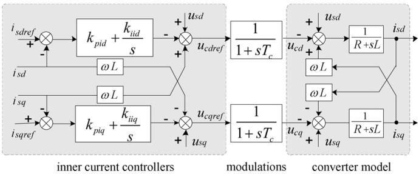  
Fig. 5. Structure of an MMC with inner current decoupled controllers and modulations.

model, assuming that the phase-locked loop is ideal and the d-axis is always aligned with the AC system voltage. Because the phase-locked loop can be safely neglected in the study of power system stability [20].

# A. AC Side Modeling

The AC side dynamic model of the MMC can be derived from Fig. 2 and is shown as Fig. 4. In this dynamic model, the effects of the transformer, the phase resistor and the phase reactor are represented as an equivalent resistor and an equivalent reactor :

$$
R = R _ {t} + R _ {p} \tag {20}
$$

$$
L = L _ {t} + L _ {p}. \tag {21}
$$

# B. Controllers Modeling

Generally, controllers of an MMC-MTDC system consist of inner controllers, modulations and outer controllers.

The structure of an MMC with inner controllers and modulations is shown in Fig. 5.

Outer controllers have five typical control modes [25]: 1) DC voltage droop control, 2) active power control, 3) DC voltage control, 4) reactive power control and 5) AC voltage control.

For an MMC-MTDC system, there are two typical DC voltage control strategies [22]. One is the DC voltage margin control strategy which is similar to the mode shift in LCC based HVDC systems. If some faults happen at the slack converter, the DC voltage may lose control and fluctuate in a large range, and at this moment the DC voltage control would be taken over by another converter which adopts the DC voltage margin control. The other one is the DC voltage droop control strategy, where converters with DC voltage droop controllers will adjust their active powers simultaneously to control the DC voltage. Section VI will test these two DC control strategies.

# C. DC Side Modeling

1) Equivalent Method of SM Capacitors: The SM capacitors of the MMC are used to store energy and control DC voltage. In the electromechanical transient simulation, the outer dynamic behavior of the whole converter rather than that of the SMs is the focus. For this purpose, this paper tries to represent all the SM capacitors by an equivalent capacitor $( C _ { e q } )$ .

Assuming that an arm of the MMC contains $N _ { S M }$ SMs, then in per phase there will always be $N _ { S M }$ SMs inserted and the rest $N _ { S M }$ SMs are bypassed. However, no matter which state the

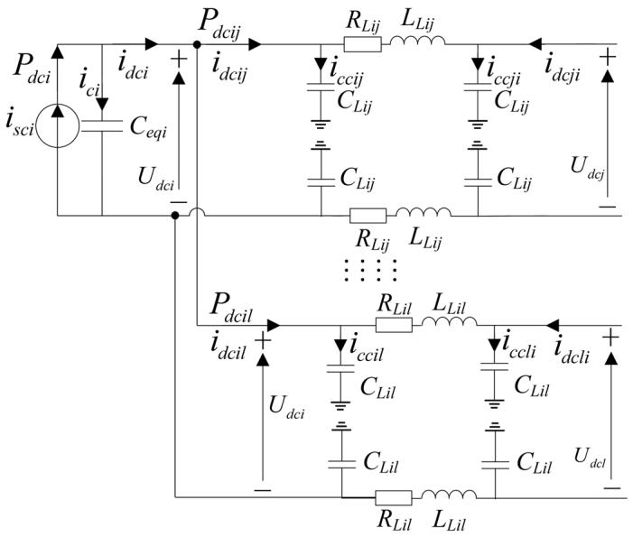  
Fig. 6. Equivalent DC side circuit of a single MMC.

SMs are in, voltages of all the 6 $N _ { S M }$ SMs in the six arms are almost same because of the capacitor voltage balancing control [26], [27]. And the above characteristic makes the overall effect, produced by $2 N _ { S M }$ SMs in per phase, on the DC voltage similar to that of a single DC capacitor. Therefore, the value of $C _ { e q }$ can be calculated according to the principle that at any time the energy stored in the equivalent capacitor equals that stored in the whole SM capacitors:

$$
6 N _ {S M} \left(\frac {1}{2} C _ {S M} U _ {S M} ^ {2}\right) = \frac {1}{2} C _ {e q} U _ {d c} ^ {2} \tag {22}
$$

$$
U _ {S M} = \frac {U _ {d c}}{N _ {S M}}. \tag {23}
$$

The left-hand side of (22) represents all the energy stored in the six arms of an MMC, where $C _ { S M }$ is the capacitance of an SM, $U _ { S M }$ is the voltage of an SM and $U _ { d c }$ is the DC voltage. The value of $C _ { e q }$ can be derived by substituting (23) in (22):

$$
C _ {e q} = \frac {6}{N _ {S M}} C _ {S M}. \tag {24}
$$

Through the above equivalent, the MMC and the 2-level converter are now almost the same. And the DC side equivalent circuit of the MMC can be represented as Fig. 6, which can also be applied to the 2-level converter. In the DC circuit, the DC line is represented as the “ ” type RLC circuit.

2) DC Side Equations: DC side equations can be obtained from Fig. 6. For converter node :

$$
C _ {e q i} \frac {d U _ {d c i}}{d t} = i _ {c i} = i _ {s c i} - i _ {d c i} \tag {25}
$$

$$
i _ {d c i} = \sum_ {j = 1, j \neq i} ^ {l} i _ {d c i j} \tag {26}
$$

where $i _ { s c i }$ , the total current injected from the converter into its DC side, consists of the current flowing to the equivalent

capacitor $( i _ { c i } )$ and $i _ { d c i . } i _ { d c i j }$ is the current flowing from node to node $j .$

For joint node :

$$
i _ {d c i} = \sum_ {j = 1, j \neq i} ^ {l} i _ {d c i j} = 0. \tag {27}
$$

Note that if a converter is blocked, the corresponding node will become a joint node.

For DC line between node and node :

$$
C _ {L i j} \frac {d \left(U _ {d c i} / 2\right)}{d t} = i _ {c c i j} \tag {28}
$$

$$
\begin{array}{l} L _ {L i j} \frac {d \left(i _ {d c i j} - i _ {c c i j}\right)}{d t} = \frac {U _ {d c i} - U _ {d c j}}{2} \\ - R _ {d c i j} \left(i _ {d c i j} - i _ {c c i j}\right) \tag {29} \\ \end{array}
$$

$$
C _ {L i j} \frac {d \left(U _ {d c j} / 2\right)}{d t} = i _ {c c j i} \tag {30}
$$

$$
i _ {d c i j} - i _ {c c i j} = i _ {c c i j} - i _ {d c j i}. \tag {31}
$$

If all the dynamics of the DC lines are considered, the MTDC circuit will become a very complex RLC circuit, and it will be a very difficult task to implement a generalized MTDC model in a commercial software. Moreover, the time constants associated with the RLC dynamics of the DC lines are much shorter than those normally used by PSS/E, and the simulation might be prone to numerical instability when a larger time step size is used.

To enhance the generality of the model, this paper absorbs the PSS/E’s modeling philosophy of pseudo steady-state HVDC models, such as two-terminal models (CDC4, CDC6) and LCC-MTDC models (MTDC01, MTDC03). Because the response of the DC current is so rapid in relation to the time scale of most electromechanical transient simulations in general, the above DC transmission models are not concerned with the internal dynamic behavior of DC lines, just as the internal transient behavior of transformers and AC transmission lines are not concerned in the AC network model.

According to the similar idea and also considering that the capacitances of the cables may contribute significantly to the overall system capacitance, this paper represents each DC line as a simplified $^ { \mathfrak { c } } \Pi ^ { \mathfrak { d } }$ type RC circuit, which consists of a lumped resistor and two lumped capacitors. After the simplification, (29), the dynamics of the DC line inductor, is removed from the DC side equations and the MTDC circuit becomes an RC network as shown in Fig. 7. In order to verify the validity of the simplified MTDC circuit, Section VI specifically compares the results of the MTDC circuit represented by the Bergeron model [28], [29] and the simplified “ ” type RC circuit.

To facilitate the representation of the simplified MTDC circuit, $C _ { N i }$ , the node lumped capacitance, is defined at first. $C _ { N i }$ can be regarded as an equivalent capacitance comprising all the lumped capacitance of the DC lines connected to node , and it can be calculated as (32):

$$
C _ {N i} = \sum_ {j = 1, j \neq i} ^ {l} C _ {L i j}. \tag {32}
$$

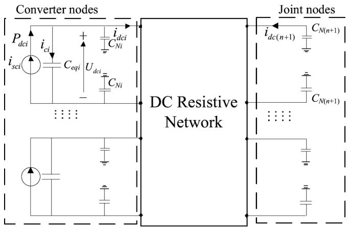  
Fig. 7. Simplified MTDC circuit of MMC-MTDC.

Still assuming there are joint nodes in the -terminal MMC-MTDC system. The DC side equation sets can be rewritten in matrix forms:

$$
C _ {e q} \otimes \dot {U} _ {d c - C} + C _ {N - C} \otimes \left(\dot {U} _ {d c - C} / 2\right) = i _ {s c - C} - i _ {d c - C} \tag {33}
$$

$$
\boldsymbol {C} _ {N _ {- J}} \otimes (\dot {\boldsymbol {U}} _ {\boldsymbol {d} _ {c - J}} / 2) = - \boldsymbol {i} _ {\boldsymbol {d} _ {c - J}} \tag {34}
$$

$$
\left[ \begin{array}{l} i _ {d c - C} \\ i _ {d c - J} \end{array} \right] = \left[ \begin{array}{l l} Y _ {d c - C C} & Y _ {d c - C J} \\ Y _ {d c - J C} & Y _ {d c - J J} \end{array} \right] \left[ \begin{array}{l} U _ {d c - C} \\ U _ {d c - J} \end{array} \right] \tag {35}
$$

where $^ { \mathfrak { c } \mathfrak { c } } \otimes ^ { \mathfrak { n } }$ denotes the element-by-element multiplication. In $( 3 3 ) , \ : \ : C _ { e q } = [ C _ { e q 1 } , \ldots , \bar { C } _ { e q n } ] ^ { \mathrm { T } } , \ : \ : C _ { N _ { - } C } = $ $\begin{array} { r l r } { [ C _ { N 1 } , \ldots , C _ { N n } ] ^ { \mathrm { T } } , \ { \dot { U } } _ { d c \_ C } } & { { } = } & { [ d U _ { d c 1 } / d t , \ldots , d U _ { d c n } / d t ] ^ { \mathrm { T } } , } \end{array}$ $\begin{array} { r l r l r } { i _ { s c _ { - } C } } & { { } = } & { [ i _ { s c 1 } , \ldots , i _ { s c n } ] ^ { \mathrm { T } } , \ i _ { d c _ { - } C } } & { { } = } & { [ i _ { d c 1 } , \ldots , i _ { d c n } ] _ { \phantom { \mathrm { T } } _ { \infty } } ^ { \mathrm { T } } . } \end{array}$ $\mathrm { I n } \quad ( 3 4 ) , \quad { \cal C } _ { N _ { - } J } \qquad = \qquad [ { \cal C } _ { N ( n + 1 ) } , \ldots , { \cal C } _ { N ( n + p ) } ] ^ { \mathrm { T } } ,$ $\begin{array} { r l r } { \dot { U } _ { d c _ { - } J } } & { { } \quad } & { = \quad } & { { } \quad [ d U _ { d c ( n + 1 ) } / d t , \dots , d U _ { d c ( n + p ) } / d t ] ^ { \mathrm { T } } , } \end{array}$ $\begin{array} { r l r } { i _ { d c \_ J } } & { { } = } & { [ i _ { d c ( n + 1 ) } , \dots , i _ { d c ( n + p ) } ] ^ { \mathrm { T } } } \end{array}$ . In (35), $Y _ { d c \_ C C }$ is of dimension $n \ \times \ n , \ Y _ { d c \_ C J } n \ \times \ p , \ Y _ { d c \_ J C } p \ \times \ n$ , and $Y _ { d c \_ J J } p \times p .$ .

In summary, once the initial values of the state variables $( U _ { d c \_ C }$ and $U _ { d c _ { - } J } )$ and the algebraic variables $( i _ { s c \_ C } , i _ { d c \_ C } ,$ $\dot { \pmb { \imath } } _ { \pmb { d } \mathrm { c } _ { - } J }$ and so on) of the MTDC circuit are determined in Section III, the differential algebraic equation set (33)–(35) can be solved at every simulation step by the following procedures.

In (33)–(35), $U _ { d c \_ C }$ and $U _ { d c \_ J }$ are state variables which need to be updated at every step. At the beginning of every simulation step, $U _ { d c \_ C }$ and $U _ { d c \_ J }$ are already known, thereby $i _ { s c \_ C }$ can be derived from (36) at first:

$$
\boldsymbol {i} _ {\mathbf {s c} - C} = \boldsymbol {P} _ {\mathbf {d c} - C \cdot} / U _ {\mathbf {d c} - C} \tag {36}
$$

where $P _ { d c \_ C } = [ P _ { d c 1 } , \ldots , P _ { d c n } ] ^ { \mathrm { T } }$ and $^ { \ast } \cdot \ j ^ { \ast }$ denotes element-byelement division.

Next $i _ { d c \_ C }$ and $i _ { d \mathrm { c } _ { - } J }$ can be calculated from (35). After $i _ { s c \_ C } ,$ $\textbf { \textit { i } } _ { d c \_ C }$ and $\ i _ { d c \_ J }$ have been obtained, $\dot { U } _ { d c \_ C }$ and $\dot { U } _ { d c \_ J }$ can be calculated as (33) and (34), and then $U _ { d c \_ C }$ and $U _ { d c \_ J }$ for the next simulation step can be obtained by the Modified Euler integration method.

Now the detailed model, which consists of the AC side circuit, inner controllers, modulations, outer controllers and the simplified MTDC circuit, has been built.

# D. Limitation of the Detailed Model

In theory the detailed model can reflect the accurate fundamental frequency dynamic characteristic of an MMC-MTDC

system. However, it has the limitation that some of its processes are very fast, which means it needs to be simulated with very small step size. If the step size is too small, it will take considerable time to complete an electromechanical transient simulation on a large scale AC/DC power system. Therefore, to increase the simulation step size and to improve the simulation efficiency, the model needs to be simplified.

# V. SIMPLIFIED MODEL OF MMC-MTDC

The objective of this section is to derive a simplified model which is suitable for the electromechanical transient step size (usually the default is 10 ms). The section will discuss how to complete the simplification by quantitative analyses of the different parts of the detailed model. The main idea for the simplification is to neglect the dynamic processes of very small time constants, which means that the very fast dynamic processes are considered to be completed instantly.

To compare the time constants of different equations in a convenient way, all the components are per-unitized. The variables with the superscript “*” are of per-unit values.

# A. Modulation Simplification

Firstly, if the modulation block is ideal, the time delay can be eliminated as follows:

$$
u _ {c d} = u _ {c d r e f} \tag {37}
$$

$$
u _ {c q} = u _ {c q r e f}. \tag {38}
$$

# B. Simplification of MMC With Inner Controllers

Secondly, let us consider the dynamic processes of the inner controllers and the MMC. In Fig. 5, the structures of the current loops along axes d and q are symmetrical, so take the d axis current loop for analysis. Then (39) can be derived from Fig. 5:

$$
H (s) = \frac {i _ {s d} ^ {*} (s)}{i _ {s d r e f} ^ {*} (s)} = \frac {k _ {p i d} s + k _ {i i d}}{L ^ {*} s ^ {2} + \left(R ^ {*} + k _ {p i d}\right) s + k _ {i i d}}. \tag {39}
$$

Now one should consider the range of $L ^ { * } , R ^ { * }$ and $k _ { p i d }$ . Usually the per-unit value of the MMC’s equivalent reactance $( X ^ { * } )$ ranges from 0.1 pu to 0.3 pu, and it can be converted to $L ^ { * }$ through (40):

$$
L ^ {*} = \frac {X ^ {*}}{2 \pi f} <   \frac {0 . 3}{3 1 4 . 1 5 9} \approx 9. 5 5 \times 1 0 ^ {- 4}. \tag {40}
$$

The equivalent resistor is used to indicate the variable losses of the converter, which is usually about 1% of the rated transmission power, so the per-unit value of the equivalent resistor is

$$
R ^ {*} \approx \frac {\frac {0 . 0 1 S _ {N}}{T _ {N} ^ {2}}}{Z _ {a c , b a s e}} = 0. 0 1. \tag {41}
$$

The gain coefficient $\left( k _ { p i d } \right)$ of the inner PI controller is usually large enough for the system to achieve the ideal response, and the following relationship will be established:

$$
k _ {p i d} \gg L ^ {*} \tag {42}
$$

$$
k _ {p i d} \gg R ^ {*}. \tag {43}
$$

From (39), it can be observed that the time domain expression of transfer function $H \mathbf { \Sigma } ( s )$ will contain components with time

constants $L ^ { * } / k _ { p i d }$ and $R ^ { * } / k _ { p i d }$ . These components are usually too fast to simulate in the electromechanical transient simulation with the default step size, so in order to adapt the MMC-MTDC model to a relatively large simulation step, (39) can be simplified as follows:

$$
H (s) = \frac {i _ {s d} ^ {*} (s)}{i _ {s d r e f} ^ {*} (s)} \approx \frac {k _ {p i d} s + k _ {i i d}}{k _ {p i d} s + k _ {i i d}} = 1. \qquad (4 4)
$$

Through the assumptions and simplifications above, the dynamics of the inner controller and the MMC are completely neglected, which means that $i _ { s d } ~ ( i _ { s q } )$ and $i _ { s d r e f } \ ( i _ { s q r e f } )$ are the same.

Note that if (42) or (43) is false, $i _ { s d } ~ ( i _ { s q } )$ will not track $i _ { s d r e f }$ $( i _ { s q r e f } )$ instantaneously. As a complement to the simplified model, a first order inertia block can be inserted between $i _ { s d }$ $( i _ { s q } )$ and $i _ { s d r e f } \ ( i _ { s q r e f } )$ , whose time constant can be adjusted to achieve the desired response characteristics approximately.

# C. Discussion of DC Side Dynamics

Thirdly, the DC side differential equations (33) will be discussed. The per-unit value of the equivalent capacitor $( C _ { e q } ^ { * } )$ , which is also the time constant of the equivalent capacitor, can be calculated by (45):

$$
C _ {e q} ^ {*} = \frac {C _ {e q}}{S _ {d c , b a s e} / U _ {d c , b a s e} ^ {2}}. \tag {45}
$$

To calculate $C _ { e q } ^ { * } , C _ { e q }$ should be known at first. Before this, parameters of the SM capacitors are needed and can be derived from the following equation [27]:

$$
C _ {S M} = \frac {P _ {N} / \cos \varphi}{3 k N _ {S M} \omega_ {0} \varepsilon \left(\frac {U _ {d c N}}{N _ {S M}}\right) ^ {2}} \left[ 1 - \left(\frac {k \cos \varphi}{2}\right) ^ {2} \right] ^ {\frac {3}{2}} \tag {46}
$$

where $P _ { N }$ is the rated active power of the converter, the power factor, the voltage modulation index, $N _ { S M }$ the number of SMs per arm, $\omega _ { 0 }$ the fundamental frequency, the voltage ripple of the capacitor, and $U _ { d c N }$ the nominal DC voltage.

After substitution of (46) for $C _ { S M }$ in (24), the expression for $C _ { e q }$ is

$$
C _ {e q} = \frac {2 P _ {N} / \cos \varphi}{k \omega_ {0} \varepsilon U _ {d c N} ^ {2}} \left[ 1 - \left(\frac {k \cos \varphi}{2}\right) ^ {2} \right] ^ {\frac {3}{2}}. \tag {47}
$$

When the converter is in the rated operating condition

$$
P _ {N} / \cos \varphi = S _ {N} = S _ {d c, b a s e} \tag {48}
$$

$$
U _ {d c N} = U _ {d c, b a s e}. \tag {49}
$$

Substitute (47), (48) and (49) in (45) to get

$$
C _ {e q} ^ {*} = \frac {2}{k \omega_ {0} \varepsilon} \left[ 1 - \left(\frac {k \cos \varphi}{2}\right) ^ {2} \right] ^ {\frac {3}{2}}. \tag {50}
$$

Equation (50) demonstrates that $C _ { e q } ^ { * }$ is independent of $P _ { N }$ $N _ { S M }$ and $U _ { d c N }$ . Instead it is determined by $k , \omega _ { 0 } , \varepsilon$ and $\phi .$ . Values of these four quantities change in a relatively small range in generrad/ $\mathrm { s } , \varepsilon = 8 \%$ ake a se and $\phi = 0 . 9 5$ l values,. Then w $k = 0 . 9 , \omega _ { 0 } =$ $C _ { e q } ^ { * } =$

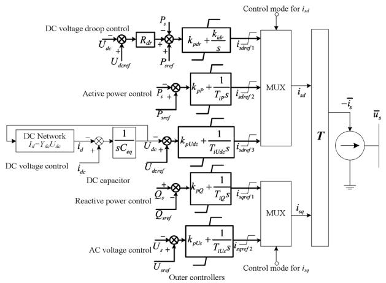  
Fig. 8. Structure of the MMC-MTDC simplified model.

s, and it is already a relatively large time constant. So (33) represent relatively slow dynamics. No matter how large the time constants of node lumped capacitances $( C _ { N _ { - } C } ^ { * } )$ are, (33) should be reserved in the simplified model.

Lastly, (34), dynamics of the joint buses, should be discussed. Generally the time constant of a DC line is determined by its type, length, $P _ { N }$ and $U _ { d c N \cdot } \mathrm { I f } C _ { N i } ^ { * }$ , the time constant of the node lumped capacitance at a joint node, is larger than the simulation step, its dynamics should be reserved. Otherwise, its dynamics should be removed from (34) to avoid numerical instability, and the joint node will become a floating node which can be contracted to the DC resistive network.

# D. MMC-MTDC Simplified Model

Now the simplified MMC-MTDC model, which removes the dynamic processes of the inner controllers, the converters, the modulations and only reserves the outer controllers and the partial dynamics of the MTDC circuit, is obtained. The structure of the MMC-MTDC simplified model, containing five kinds of outer controllers, is shown in Fig. 8. Three $i _ { s d r e f }$ and two $i _ { s q r e f }$ are selected separately according to the control mode before the $_ { x }$ transformation block, for example, if the control mode of the converter is the DC voltage droop control, $i _ { s d }$ will be $i _ { s d r e f 1 }$ . The $\mathbf { \Delta } ^ { T }$ transformation is used to transform the variables from the dq reference frame to the common R-I reference frame of the AC network. The equation is

$$
\boldsymbol {T} = \left[ \begin{array}{c c} \cos \theta & - \sin \theta \\ \sin \theta & \cos \theta \end{array} \right] \tag {51}
$$

where $\theta$ is the angle from the R-axis to the d-axis.

After $i _ { s d }$ and $i _ { s q }$ are determined, $i _ { s }$ can be calculated by the $_ { x }$ transformation.

Let

$$
\bar {u} _ {s} = u _ {s} \angle \theta_ {s} \tag {52}
$$

$$
\bar {i} _ {s} = i _ {s R} + j i _ {s I}. \tag {53}
$$

Since we have assumed that the phase-locked loop works ideally, the following equation can be obtained:

$$
\theta = \theta_ {s}. \tag {54}
$$

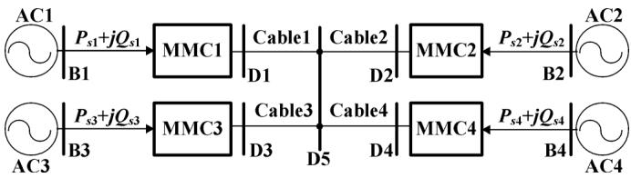  
Fig. 9. Structure of the MMC-MTDC system.

The transformation block can be expressed as

$$
\left[ \begin{array}{l} - i _ {s R} \\ - i _ {s I} \end{array} \right] = \boldsymbol {T} \left[ \begin{array}{l} i _ {s d} \\ i _ {s q} \end{array} \right] = \left[ \begin{array}{c c} \cos \theta_ {s} & - \sin \theta_ {s} \\ \sin \theta_ {s} & \cos \theta_ {s} \end{array} \right] \left[ \begin{array}{l} i _ {s d} \\ i _ {s q} \end{array} \right]. \tag {55}
$$

Then $\overline { { i } } _ { s }$ can be obtained from (53) and (55).

The advantage of the simplified model is that a larger step size can be adopted in the simulation. The basic assumption of the simplified model is that the inner controllers and modulations work ideally, that is to say, $i _ { s d } ~ ( i _ { s q } )$ can track $\textit { i } _ { s d r e f } \left( i _ { s q r e f } \right)$ instantaneously from the viewpoint of electromechanical transient simulation. However, it should be noted that the above assumption may fail under some cases, such as the DC line faults and the SM faults, and the simplified model will be unable to accurately reflect the behavior of the converter.

# VI. MODEL VALIDATION AND SIMULATIONS

This section will verify the validity of the detailed model and the simplified model with a four-terminal MMC-MTDC system and study the stability of a modified New England 39-bus system containing an MMC-MTDC.

# A. Four-Terminal System

A four-terminal MMC-MTDC system (Fig. 9) is simulated to verify the validity of the detailed model and the simplified model, and the data are included in the Appendix. The AC1 and AC3 are the sending ends, while AC2 and AC4 are the receiving ends. The steady-state control parameters are given in Table V.

This section will test the performance of the two control strategies. In strategy A, MMC2 controls the DC voltage and other MMCs control their active powers at the normal condition, when MMC2 loses its control ability owing to some faults, MMC1 will activate the DC voltage margin control. In strategy B, all MMCs use DC voltage droop controllers shown in Fig. 8. In both strategies, all MMCs control their reactive powers.

Two accurate electromagnetic transient MMC-MTDC systems (EMTDC MMC-MTDC switching models) are modeled and simulated on PSCAD. In one case the Bergeron model is used to simulate the cable while in the other case the simplified “ ” type RC lumped circuit is used. Another two electromechanical transient MMC-MTDC models, the detailed model and the simplified model, are implemented on PSS/E as userwritten models.

1) Power Flow Comparison: The power flow results of the MMC-MTDC system are shown in Table I. The power flow result of the detailed model is the same as that of the simplified one on PSS/E. Because the output quantities of PSCAD are always changing over a very small range, only one decimal is reserved.

In the steady state, there is little difference between the case of the Bergeron model and that of the RC lumped circuit; and the power flow on PSCAD and PSS/E are almost the same.

TABLE I COMPARISON OF POWER FLOW   

<table><tr><td></td><td>PSCAD (Bergeron)</td><td>PSCAD (RC circuit)</td><td>PSS/E</td></tr><tr><td>MMC1 DC voltage (Udc1) (kV)</td><td>307.5</td><td>307.5</td><td>307.54</td></tr><tr><td>MMC2 DC voltage (Udc2) (kV)</td><td>300.0</td><td>300.0</td><td>300.00</td></tr><tr><td>MMC3 DC voltage (Udc3) (kV)</td><td>307.5</td><td>307.5</td><td>307.54</td></tr><tr><td>MMC4 DC voltage (Udc4) (kV)</td><td>299.6</td><td>299.6</td><td>299.64</td></tr><tr><td>MMC1 active power (Psl)(MW)</td><td>300.0</td><td>300.0</td><td>300.00</td></tr><tr><td>MMC2 active power (Psl2) (MW)</td><td>-273.5</td><td>-273.5</td><td>-273.33</td></tr><tr><td>MMC3 active power (Psl3) (MW)</td><td>300.0</td><td>300.0</td><td>300.00</td></tr><tr><td>MMC4 active power (Psl4) (MW)</td><td>-300.0</td><td>-300.0</td><td>-300.00</td></tr><tr><td>MMC1 reactive power (Qsl) (Mvar)</td><td>-60.0</td><td>-60.0</td><td>-60.00</td></tr><tr><td>MMC2 reactive power (Qsl2) (Mvar)</td><td>-60.0</td><td>-60.0</td><td>-60.00</td></tr><tr><td>MMC3 reactive power (Qsl3) (Mvar)</td><td>-60.0</td><td>-60.0</td><td>-60.00</td></tr><tr><td>MMC4 reactive power (Qsl4) (Mvar)</td><td>-60.0</td><td>-60.0</td><td>-60.00</td></tr></table>

* The positive conventions for active and reactive power are from AC side into the converter.

2) Transient Simulation and Comparison: The step size on PSCAD is 20 s, and on PSS/E is 0.1 ms for the detailed model and 10 ms for the simplified model. It should be noted that the numerical instability will occur if the step size is larger than 0.4 ms for the detailed model on PSS/E.

From Table IV, the time constant of the DC cable lumped capacitance Ci $C _ { L i j } ^ { * }$ can be calculated:

$$
C _ {L i j} ^ {*} = \frac {2 . 9 5 \times 1 0 ^ {- 1 0} (\mathrm {F} / \mathrm {m}) \times 1 0 0 (\mathrm {k m})}{3 0 0 (\mathrm {M W}) / (3 0 0 (\mathrm {k V})) ^ {2}} = 0. 0 0 8 8 5 \mathrm {s}. \tag {56}
$$

Since the four cables are connected to DC node D5, the time constant of the node lumped capacitance at D5 is

$$
C _ {N (\mathrm {D} 5)} ^ {*} = 4 C _ {L i j} ^ {*} = 0. 0 3 5 4 \mathrm {s}. \tag {57}
$$

$C _ { N ( \mathrm { { D 5 } ) } } ^ { * }$ is a relatively large time constant even when com-h the simulation step of the simplified model, so its dynamics should be reserved in the simplified model.

When the system runs to 2.0 s, a three-phase short-circuit fault is applied to bus B2 and is cleared 0.1 s later. The same faults under two different control strategies are simulated. Figs. 10 and 11 show the responses of the DC voltage, the active power and the reactive power. The DC voltage is per-unitized on the base value of 300 kV, and the positive conventions of the active power and the reactive power are from AC side into the converter.

Figs. 10 and 11 demonstrate that the dynamic responses of the four models coincide well. The results of the PSCAD models contain some very high frequency oscillations, but it is clear that the effect of the high frequency oscillations on the transient stability is limited. The results of the detailed model and the simplified model on PSS/E are almost same. The differences between the four cases are mainly caused by the fact that high frequency information is included in the electromagnetic transient model on PSCAD, while the detailed model and the simplified model on PSS/E only consider the fundamental frequency information.

a) Strategy A, Fault Applied at B2: In strategy A, MMC2 controls DC voltage and other MMCs control active powers

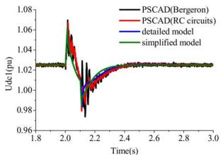

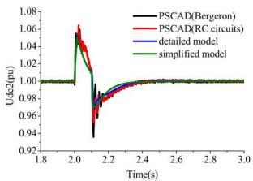  
(b)

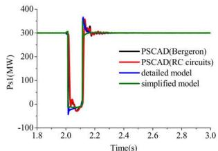  
（c）

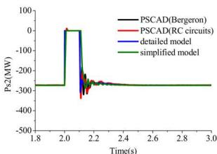  
(@

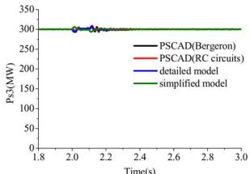

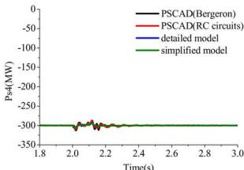  
（f）

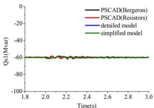  
（g）

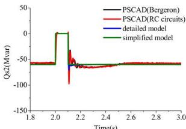  
（h)

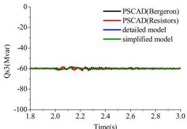  
1

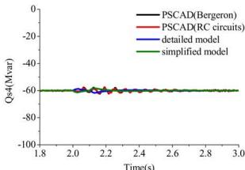  
  
Fig. 10. Dynamic responses of the MMC-MTDC in strategy A. (a) DC voltage of MMC1. (b) DC voltage of MMC2. (c) Active power of MMC1. (d) Active power of MMC2. (e) Active power of MMC3. (f) Active power of MMC4. (g) Reactive power of MMC1. (h) Reactive power of MMC2. (i) Reactive power of MMC3. (j) Reactive power of MMC4.

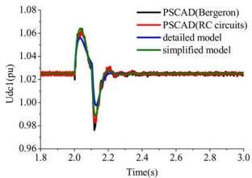  
(a)

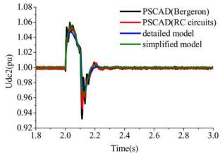  
(b)

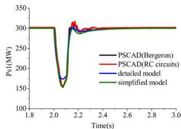

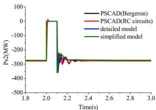

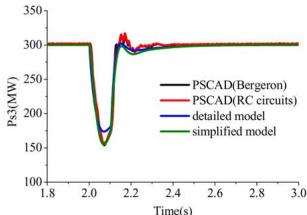

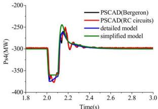  
(f)

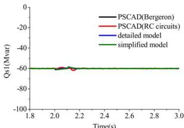  
（g）

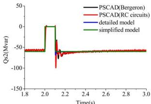  
(h)

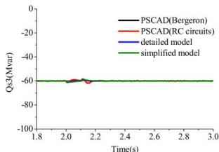

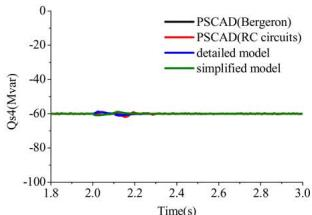  
i   
Fig. 11. Dynamic responses of the MMC-MTDC in strategy B. (a) DC voltage of MMC1. (b) DC voltage of MMC2. (c) Active power of MMC1. (d) Active power of MMC2. (e) Active power of MMC3. (f) Active power of MMC4. (g) Reactive power of MMC1. (h) Reactive power of MMC2. (i) Reactive power of MMC3. (j) Reactive power of MMC4.

at the normal condition. When MMC2 loses its control ability owing to some faults, the DC voltage increase obviously, and MMC1 will shift to the DC voltage margin control, which is similar to the mode shift in LCC based HVDC systems. The DC voltage margin control logic of MMC1 is set as follows:

1) If MMC1 is under the active power control and its DC voltage is higher than 1.06 pu, its control mode will shift to the DC voltage control and maintain at least 0.1 s;   
2) If MMC1 is under the DC voltage control and its DC voltage is lower than 1.02 pu, its control mode will shift to the active power control and maintain at least 0.1 s.

Fig. 10 shows the dynamic responses of the MMC-MTDC. During the fault, since B2 is three-phase short-circuited, the ac-

tive and reactive power injected from MMC2 to AC2 becomes zero, depriving MMC2 of the ability to control the DC voltage. Nevertheless, MMC1, MMC3 and MMC4 still control their active and reactive powers at the reference value. And the excess active power in the DC network causes the DC voltage to rise. At about 2.01 s, the DC voltage of MMC1 reaches 1.06 pu, thus it activates the DC voltage margin control and decreases its active power quickly, making the DC voltage begin to decrease. After the fault is clear at 2.1 s, the active power of MMC2 recovers fast and the DC voltage continues to decrease. At about 2.11 s, the DC voltage of MMC1 is lower than 1.02 pu, and MMC1 shifts to the active power control. The system becomes stable quickly.

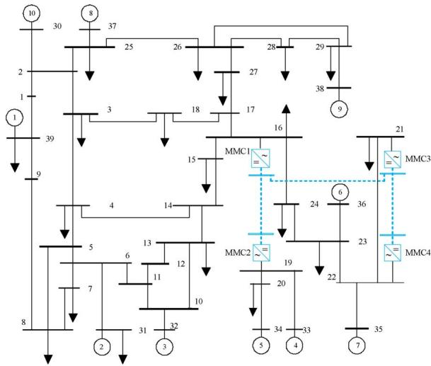  
Fig. 12. Modified New England 39-bus system.

b) Strategy B, Fault Applied at B2: In strategy B, all converters use DC voltage droop controllers whose structures are shown in Fig. 8. Note that the coefficients of DC voltage deviations $( R _ { d r } )$ of the droop controllers are relatively large on this simulation, so as to make the controlling of their DC voltages rather than the active powers the primary objective. During the simulation the same fault as above is applied, and Fig. 11 shows the dynamic responses of the MMC-MTDC.

During the short-circuited fault, the active power and the reactive power injected from MMC2 to AC2 become zero. The excess power in the DC network makes the DC voltage rise abruptly. Because other converters use DC voltage droop controllers, MMC1 and MMC3 reduce their active powers injected to the converters, and MMC4 increases its active power absorbed from the converter. They adjust their active powers to decrease the DC voltage simultaneously, and the DC voltage starts to decrease. After the fault is clear at 2.1 s, the active and reactive powers of MMC2 recover fast and the DC voltage decreases more quickly. Then the system is adjusted to a stable condition. During the transient process, the DC voltage fluctuates in a relatively small range.

# B. Modified New England 39-Bus System

To study the interaction between the AC system and the MMC-MTDC system, a stability study is performed on a modified New England 39-bus system which consists of two asynchronous AC grids (Fig. 12). In Fig. 12, four MMCs are configured at bus 16, 19, 21, and 22, respectively. The dash lines refer to DC lines. They constitute a four-terminal 400-kV MMC-MTDC system in the 345-kV AC system.

The data of the MMCs are shown in Table II. Table III summarizes the power flow solution of the MMC-MTDC system, showing that the converter transformers and the phase reactors consume reactive powers and make an impact on reactive power dispatch and voltage magnitudes in the network. The active power losses of the converters are relatively small.

To study the transient interaction between the AC system and the MMC-MTDC system, this paper analyzes a contingency as an example. When the system runs to 1.0 s, a three-phase shortcircuit fault is applied to bus 16; 0.1 s later, AC line 16–17 trips

TABLE II MMC DATA   

<table><tr><td>Converter</td><td>MMC1</td><td>MMC2</td><td>MMC3</td><td>MMC4</td></tr><tr><td>Control mode</td><td>Droop-V</td><td>Margin-Q</td><td>P-V</td><td>Droop-Q</td></tr><tr><td>Rating capacity (MVA)</td><td>500</td><td>400</td><td>500</td><td>400</td></tr><tr><td>Rt(pu)</td><td>0.004</td><td>0.004</td><td>0.004</td><td>0.004</td></tr><tr><td>Xt(pu)</td><td>0.10</td><td>0.10</td><td>0.10</td><td>0.10</td></tr><tr><td>Xp(pu)</td><td>0.07</td><td>0.07</td><td>0.07</td><td>0.07</td></tr><tr><td>Variable loss coefficient a</td><td>1.15 %</td><td>1.15 %</td><td>1.15 %</td><td>1.15 %</td></tr><tr><td>Pfl(MW)</td><td>1.20</td><td>1.00</td><td>1.20</td><td>1.00</td></tr><tr><td>Rp(pu)</td><td>0.0083</td><td>0.0080</td><td>0.0092</td><td>0.0087</td></tr></table>

TABLE III POWER FLOW SOLUTION   

<table><tr><td>Converter</td><td>MMC1</td><td>MMC2</td><td>MMC3</td><td>MMC4</td></tr><tr><td>Ps(MW)</td><td>-371.39</td><td>380.00</td><td>-350.00</td><td>375.00</td></tr><tr><td>Qs(Mvar)</td><td>-26.09</td><td>0.00</td><td>-39.81</td><td>0.00</td></tr><tr><td>|u̅s| (pu)</td><td>1.0000</td><td>0.9978</td><td>1.0100</td><td>1.0181</td></tr><tr><td>∠u̅s(°)</td><td>-11.14</td><td>-5.47</td><td>5.71</td><td>5.09</td></tr><tr><td>Pvl(MW)</td><td>4.27</td><td>4.37</td><td>4.02</td><td>4.31</td></tr><tr><td>Qc(Mvar)</td><td>-78.06</td><td>-54.39</td><td>-85.43</td><td>-50.88</td></tr><tr><td>|u̅c| (pu)</td><td>1.0306</td><td>0.9966</td><td>1.0442</td><td>1.0158</td></tr><tr><td>∠u̅c(°)</td><td>-3.42</td><td>-13.71</td><td>12.79</td><td>-2.72</td></tr><tr><td>Pdc(MW)</td><td>-375.66</td><td>375.63</td><td>-354.03</td><td>370.69</td></tr><tr><td>±Udc(kV)</td><td>400.00</td><td>409.18</td><td>400.21</td><td>409.27</td></tr></table>

* The positive conventions for active and reactive power are from AC side into the converter.

and the fault is cleared. Fig. 13 shows the simulation results. The simplified model of the MMC-MTDC is used in the simulation.

When bus 16 is three-phase short-circuited, the active power of MMC1 becomes zero suddenly. Active powers of both MMC3 and MMC4 also reduce since their AC voltages drop quickly. The DC voltage starts to rise. With the DC voltage droop control, MMC4 decreases its active power further to control the DC voltage. However, since the adjustment speed of MMC4 is not fast enough, the DC voltage continues to rise. At 1.01 s, the DC voltage of MMC2 reaches 1.06 pu, and MMC2 activates the DC voltage margin control and decreases its active power quickly, making the DC voltage begin to decrease. After the fault is clear at 1.1 s, The AC voltages and the active and reactive powers of all MMCs recover fast. At 1.11 s, the DC voltage of MMC2 is below 1.02 pu, and MMC2 shifts to the active power control. During the transient process, MMC1 and MMC3 can provide the reactive power support.

In this contingency, all generators can keep the rotor angle stability. Even though MMC2 adjusts its active power during a short time, this adjustment has quite limited effects on its AC system. Therefore, the AC fault is isolated well.

# VII. CONCLUSION

In this paper, two kinds of electromechanical transient MMC-MTDC models are presented. The main features of the detailed model are: 1) the SM capacitors are represented as an equivalent capacitor, which makes the MMC and the 2-level converter almost the same; 2) the DC line is represented as the simplified “ ” type RC circuit, which facilitates the solving of the DC network. However, the limitation of the detailed model is that some of its processes are too fast and require quite small step size to simulate. To overcome the disadvantage, a simplified model suitable for the electromechanical transient step size is derived

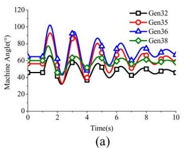

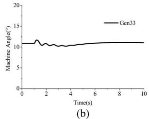

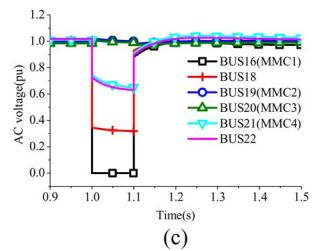

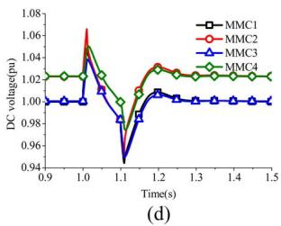

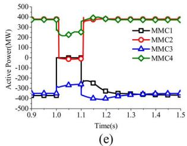

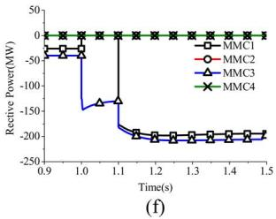  
Fig. 13. Dynamic responses of the modified New England 39-bus system. (a) Machine angles (Reference machine is Gen39). (b) Machine angles (Reference machine is Gen34). (c) AC voltages. (d) DC voltages of MMC-MTDC. (e) Active powers of MMC-MTDC. (f) Reactive powers of MMC-MTDC.

based on the quantitative analysis of the detailed model, and the limitation of the simplified model is also discussed.

Both the models are implemented on PSS/E and compared with the accurate electromagnetic transient MMC-MTDC models on PSCAD. The consistency of their simulation results validates the models. During the validation, the DC voltage margin control strategy and the DC droop voltage control strategy are tested. The results show that both strategies are able to control the DC voltage during transients. Furthermore, to study the interaction between the AC system and the MMC-MTDC system, a stability study is performed on the modified New England 39-bus system. The results demonstrate that the AC fault can be isolated well in the asynchronous AC grids by the MMC-MTDC.

MMC-MTDCs have been regarded as grid shock absorbers. Much more work concerning how to exploit MMC-MTDCs to improve the stability of the AC/DC system remains to be done and is currently being pursued.

# APPENDIX

Data of Test System: The data of the power system shown in Fig. 9 are given in Tables IV and V. The parameters of the four MMCs, the four AC systems (AC1, AC2, AC3, and AC4), and their converter transformers are the same, respectively.

The steady-state control parameters of the converters are given in Table V.

The same PI controllers are used in the electromagnetic transient MMC-MTDC model on PSCAD, the detailed model on PSS/E and the simplified model on PSS/E.

TABLE IV PARAMETERS OF MMC-MTDC SYSTEM’S SIMULATION PLATFORM   

<table><tr><td>Parameters of MMCi (i = 1, 2, 3, 4)</td><td>Value</td></tr><tr><td>Line-to-neutral nominal voltage of ACi</td><td>220 kV</td></tr><tr><td>Impedance of ACi (Rst+jXst)</td><td>5+5j (Ω)</td></tr><tr><td>Nominal DC voltage Udc i</td><td>±150 kV</td></tr><tr><td>Rated capacity of converter transformers</td><td>420 MVA</td></tr><tr><td>Nominal ratio of converter transformers</td><td>220 kV /150 kV</td></tr><tr><td>Leakage reactance of converter transformers</td><td>10.5 %</td></tr><tr><td>Converter nominal power</td><td>300 MW</td></tr><tr><td>Number of SM per arm (NSMi)</td><td>20</td></tr><tr><td>SM capacitor (CSMi)</td><td>765 μF</td></tr><tr><td>Arm inductor</td><td>33.42 mH</td></tr><tr><td>DC cable&#x27;s length</td><td>100 km</td></tr><tr><td>DC cable&#x27;s resistance (RLij)</td><td>2×10-5Ω/m</td></tr><tr><td>DC cable&#x27;s inductance (L1ij)</td><td>1.91×10-7H/m</td></tr><tr><td>DC cable&#x27;s capacitance (CLij)</td><td>2.95×10-10F/m</td></tr><tr><td>Variable loss coefficient (ai)</td><td>1 %</td></tr><tr><td>Fixed loss (Pfli)</td><td>1.00 MW</td></tr></table>

TABLE V CONTROL PARAMETERS OF STEADY-STATE CONTROL STRATEGY   

<table><tr><td>Converter</td><td>Control parameter</td></tr><tr><td rowspan="2">MMC1</td><td>P_sref1 = 300 MW</td></tr><tr><td>Q_sref1 = -60 Mar</td></tr><tr><td rowspan="2">MMC2</td><td>U_dcref2 = ±150 kV</td></tr><tr><td>Q_sref2 = -60 Mar</td></tr><tr><td rowspan="2">MMC3</td><td>P_sref3 = 300 MW</td></tr><tr><td>Q_sref3 = -60 Mar</td></tr><tr><td rowspan="2">MMC4</td><td>P_sref4 = -300 MW</td></tr><tr><td>Q_sref4 = -60 Mar</td></tr></table>

*The positive conventions for active and reactive power are from AC side into the converter.

# REFERENCES

[1] J. Dorn, H. Huang, and D. Retzmann, “Novel voltage-sourced converters for HVDC and FACTS applications,” presented at the CIGRE Symp., Osaka, Japan, 2007.   
[2] J. Dorn, H. Huang, and D. Retzmann, “A new multilevel voltagesourced converter topology for HVDC applications,” in Proc. CIGRE, Paris, France, 2008, pp. 1–8, paper B4–304.   
[3] H. Huang, “Multilevel voltage-sourced converters for HVDC and FACTS applications,” presented at the CIGRÉ SC B4 2009 Bergen Colloq., Bergen and Ullensvang, Norway, 2009.   
[4] Y. Xue, Z. Xu, and Q. Tu, “Modulation and control for a new hybrid cascaded multilevel converter with dc blocking capability,” IEEE Trans. Power Del., vol. 27, no. 4, pp. 2227–2237, Oct. 2012.   
[5] A. Antonopoulos, L. Angquist, and H. Nee, “On dynamics and voltage control of the modular multilevel converter,” in Proc. 13th Eur. Conf. Power Electronics and Applications, 2009 (EPE’09), pp. 1–10.   
[6] D. Siemaszko, A. Antonopoulos, K. Ilves, M. Vasiladiotis, L. Angquist, and H. Nee, “Evaluation of control and modulation methods for modular multilevel converters,” in Proc. 2010 Int. Power Electronics Conference (IPEC), pp. 746–753.   
[7] M. Saeedifard and R. Iravani, “Dynamic performance of a modular multilevel back-to-back HVDC system,” IEEE Trans. Power Del., vol. 25, no. 4, pp. 2903–2912, Oct. 2010.   
[8] S. P. Teeuwsen, “Simplified dynamic model of a voltage-sourced converter with modular multilevel converter design,” in Proc. 2009 IEEE/PES Power Systems Conf. Expo., 2009 (PSCE’09), Mar. 15–18, 2009, pp. 1–6.

[9] U. N. Gnanarathna, A. M. Gole, and R. P. Jayasinghe, “Efficient modeling of modular multilevel HVDC converters (MMC) on electromagnetic transient simulation programs,” IEEE Trans. Power Del., vol. 26, no. 1, pp. 316–324, Jan. 2011.   
[10] J. Peralta, H. Saad, S. Dennetiere, J. Mahseredjian, and S. Nguefeu, “Detailed and averaged models for a 401-level MMC-HVDC system,” IEEE Trans. Power Del., vol. 27, no. 3, pp. 1501–1508, Jul. 2012.   
[11] A. D. Rajapakse, A. M. Gole, and P. L. Wilson, “Electromagnetic transients simulation models for accurate representation of switching losses and thermal performance in power electronic systems,” IEEE Trans. Power Del., vol. 20, no. 1, pp. 319–327, Jan. 2005.   
[12] N. R. Chaudhuri, R. Majumder, B. Chaudhuri, and P. Jiuping, “Stability analysis of VSC-MTDC grids connected to multimachine AC systems,” IEEE Trans. Power Del., vol. 26, no. 4, pp. 2774–2784, Oct. 2011.   
[13] T. M. Haileselassie and K. Uhlen, “Impact of DC line voltage drops on power flow of MTDC using droop control,” IEEE Trans. Power Syst., vol. 27, no. 3, pp. 1441–1449, Aug. 2012.   
[14] N. R. Chaudhuri, R. Majumder, and B. Chaudhuri, “System frequency support through multi-terminal DC (MTDC) grids,” IEEE Trans. Power Syst., vol. 28, no. 1, pp. 347–356, Feb. 2013.   
[15] N. R. Chaudhuri and B. Chaudhuri, “Adaptive droop control for effective power sharing in multi-terminal DC (MTDC) grids,” IEEE Trans. Power Syst., vol. 28, no. 1, pp. 21–29, Feb. 2013.   
[16] E. Prieto-Araujo, F. D. Bianchi, A. Junyent-Ferre, and O. Gomis-Bellmunt, “Methodology for droop control dynamic analysis of multiterminal VSC-HVDC grids for offshore wind farms,” IEEE Trans. Power Del., vol. 26, no. 4, pp. 2476–2485, Oct. 2011.   
[17] X. Chen et al., “Integrating wind farm to the grid using hybrid multiterminal HVDC technology,” IEEE Trans. Ind. Appl., vol. 47, no. 2, pp. 965–972, Mar.–Apr. 2011.   
[18] X. Zhang, “Multiterminal voltage-sourced converter-based HVDC models for power flow analysis,” IEEE Trans. Power Syst., vol. 19, no. 4, pp. 1877–1884, Nov. 2004.   
[19] J. Beerten, S. Cole, and R. Belmans, “Generalized steady-state VSC-MTDC model for sequential AC/DC power flow algorithms,” IEEE Trans. Power Syst., vol. 27, no. 2, pp. 821–829, May 2012.   
[20] S. Cole, J. Beerten, and R. Belmans, “Generalized dynamic VSC-MTDC model for power system stability studies,” IEEE Trans. Power Syst., vol. 25, no. 3, pp. 1655–1662, Aug. 2010.   
[21] S. Cole and R. Belmans, “A proposal for standard VSC HVDC dynamic models in power system stability studies,” Elect. Power Syst. Res., vol. 81, no. 4, pp. 967–973, 2011.   
[22] C. Dierckxsens, K. Srivastava, M. Reza, S. Cole, J. Beerten, and R. Belmans, “A distributed DC voltage control method for VSC-MTDC systems,” Elect. Power Syst. Res., vol. 82, no. 1, pp. 54–58, 2012.   
[23] S. P. Teeuwsen, “Modeling the Trans Bay Cable Project as voltagesourced converter with modular multilevel converter design,” in Proc. 2011 IEEE Power and Energy Society General Meeting, Jul. 24–29, 2011, pp. 1–8.   
[24] M. Guan and Z. Xu, “Modeling and control of a modular multilevel converter-based HVDC system under unbalanced grid conditions,” IEEE Trans. Power Electron., vol. 27, no. 12, pp. 4858–4867, Dec. 2012.   
[25] J. Beerten and R. Belmans, “Modeling and control of multi-terminal VSC HVDC systems,” Energy Procedia, vol. 24, pp. 123–130, 2012.   
[26] Q. Tu, Z. Xu, and L. Xu, “Reduced switching-frequency modulation and circulating current suppression for modular multilevel converters,” IEEE Trans. Power Del., vol. 26, no. 3, pp. 2009–2017, Jul. 2011.   
[27] Q. Tu and Z. Xu, “Impact of sampling frequency on harmonic distortion for modular multilevel converter,” IEEE Trans. Power Del., vol. 26, no. 1, pp. 298–306, Jan. 2011.   
[28] L. J. B. Bergeron, Water Hammer in Hydraulics and Wave Surges in Electricity. New York, NY, USA: Wiley, 1961.   
[29] N. R. Watson and J. Arrillaga, Power Systems Electromagnetic Transients Simulation, Institution of Electrical Engineers, 2003.

Sheng Liu was born in Jiangxi, China, in November 1990. He received the B.S. degree in electrical engineering from Zhejiang University, China, in 2011. He is currently pursuing the Ph.D. degree in the Electrical Engineering Department of Zhejiang University.

His main field of interest includes power system stability and HVDC transmission.

Zheng Xu (M’00) was born in Zhejiang, China, in September 1962. He received the B.S., M.S., and Ph.D. degrees from Zhejiang University, China, in 1983, 1986, and 1993, respectively, all in electrical engineering.

He has been with the Electrical Engineering Department of Zhejiang University since 1986. Since 1998, he has been a Professor of Zhejiang University. His research area includes HVDC, FACTS, power harmonics, and power quality.

Wen Hua was born in Zhejiang, China, in 1986. He received the B.S. and M.S. degrees from Zhejiang University, China, in 2009 and 2012, respectively, both in electrical engineering.

His main field of interest includes power system stability analysis.

Geng Tang was born in Fujian, China, in 1988. He received the B.S. degree in electrical engineering from Zhejiang University, China, in 2011. He is currently pursuing the Ph.D. degree in the Electrical Engineering Department of Zhejiang University.

His main field of interest includes the application of VSC-HVDC and flexible ac transmission systems for renewable energy.

Yinglin Xue (S’13) was born in Hebei, China, in 1986. He received the B.S. degree in electrical engineering from Zhejiang University, China, in 2009. He is currently pursuing the Ph.D. degree in the Electrical Engineering Department of Zhejiang University.

His main field of interest includes the application of VSC-HVDC and flexible ac transmission systems for renewable energy.