# Analysis of Frequency-Dependent Network Equivalents in Dynamic Harmonic Domain

Ehsan Karami, Conceptualization; Methodology; Software a, Ehsan Hajipour, Methodology; Writing– Original draft preparation a , Mehdi Vakilian, Visualization; Investigation and Supervision a , Kumars Rouzbehi, Software; Validation b

a Center of Excellence in Power System Management and Control, Department of Electrical Engineering, Sharif University of Technology, Tehran, Iran b Department of Electrical Engineering, University of Sevilla, Sevilla, Spain

# A B S T R A C T

Rational function-based models have proved to be very efficient for accurate frequency-dependent modeling of power system components. These models are able to characterize the components terminal behaviours (analysing the admittance matrix) for nodal analysis. This provides a fast convergence and inherent stability to the solution routine of the model. This work presents a general framework for interfacing the dynamic phasor method to the rational models. That would be promising for the electromagnetic transient analysis (under harmonic distortion), in the frequency domain. Therefore, Y-element rational pole-residue models (employing the vector fitting method) are developed. Moreover, the pole-residue model is converted into the state-space representation. Next, the dynamic harmonic approach (in the frequency domain) is employed for harmonic analysis. It is shown that the order of state-space system can become a major concern for frequency-dependent networks analysis. Therefore, to generate a reduced-order model, the balanced realization theory is applied. Moreover, (for the sake of simplicity and efficiency) the trapezoidal integration rule is employed to discretise the state-space equations. For validation of the modelling, it is applied on three test case studies and results of these studies are compared with their time-domain analysis results.

# 1. Introduction

Network equivalents are widely used in the simulation of power systems to reduce the unnecessary complex network of a part of those systems. These network equivalents can be employed for analyzing the terminal-based behavior of the network. In order to define the relationships between the terminals’ voltages and currents, in Electromagnetic Transients Programs (EMTPs), typically a Y-matrix (admittance matrix) is formed [1]. Since the rational models can characterize the frequency-dependent behavior of linear components, the rational model of Y-matrix can be used in EMTPs to provide a frequency-dependent nodal analysis of the network equivalents [2, 3].

Review of the literatures shows that different techniques are avail able for rational function approximation which precisely reproduce the ports’ features over the desired frequency band, and satisfy the physical requirements of stability, causality, symmetry, and passivity [4–9]. Among these techniques, the vector fitting (VF) method is well-known to be very effective in reproducing the frequency domain responses with resonance peaks [8]. In [9], a modified VF method has been introduced by replacing the high-frequency asymptotic constraint of the scaling function with a more relaxed condition. This replacement significantly

reduces the dependence of the VF method on the initial poles selection. In [10], a Prony-based method has been proposed to identify the order of the rational model reproduced by the VF method in frequency-dependent network equivalents.

One of the widely used (frequency domain based) approaches is the dynamic phasor (DP) approach. This approach is used for modeling the power system components such as electrical machines [11], simulation of inrush dynamics [12], power system dynamics [13], Flexible AC Transmission Systems [14], sub-synchronous resonance [15], unbalanced distribution systems [16], and HVDC systems [17]. In [18], a shifted frequency-based analysis using DP variables instead of instantaneous time variables has been proposed. In [19], the application of DP concept has been shown in two main areas: i) DP modeling for frequency varying condition, ii) DP modeling of multi-frequency in multi-generator systems. The interface model for EMT and transient stability hybrid simulations has been put forward in [20].

The Dynamic Harmonic Domain (DHD) method is an extended version of DP and can be efficiently used to perform dynamic analysis of harmonic components during the transient periods. The DHD methodology has been successfully used to investigate the dynamic harmonic response of power transformers, synchronous machines, and also

different FACTS devices [21–23]. A modified harmonic domain formulation has been introduced in [24] to include interharmonics. In [25], an extended harmonic domain model of a wind turbine generator system has been represented. Reference [26] discusses the main issue about the implementation of DHD models. This paper shows that spurious oscillations of individual harmonics can appear when there is a step-change in input variables or the circuit parameters. In [27], a decomposed framework has been introduced to solve different harmonic sources separately. An approach for reduction of a non-linear system in both harmonics and states has been presented in [28], which reduces computational burden while keeping accuracy. In [29], the ability of the DHD method to analyze the effects of the input source phase-angle on the resultant harmonic content has been investigated. In [30], by using the DHD method and property of phase-shifting proposed in [29], a single-phase modeling approach has been presented for balanced three-phase systems. In [31], the generalized symmetrical components have been employed to analyze unbalanced three-phase systems in the presence of harmonic distortion.

In the existing body of knowledge, there is not a general framework to represent the frequency-dependent behavior of systems in the DHD, and this method has only been used to analyze the power systems based on the conventional RLC representation. Where to perform transient studies, it is vital to precisely model the frequency-dependent characteristics of the system components. As the main noteworthy contribution, this paper presents a detailed procedure for interfacing the DHD method to the rational models very generally, which can be used in EMTPs to compute the frequency-dependent responses of the networks. This procedure consists of the following four steps:

1 At first, rational models are used to characterize the ports’ behavior of the equivalent network considering its Y-elements;   
2 The rational models are approximated by using the VF method, which is a popular tool for modeling of linear systems in the frequency domain;   
3 The pole-residue model of the Y-matrix is converted to state-space equations;   
4 Finally, the DHD methodology, along with trapezoidal integration rule, is employed to provide harmonic analysis in the frequency domain during both transient and steady-state conditions.

The proposed procedure of this paper is applied to two test cases. As will be discussed in this paper, the order of system can emerge as a major issue for frequency-dependent networks since instantaneous variables in the time domain would be a vector, which contains harmonic information. To tackle this problem, this paper uses the balanced realization theory to provide appropriate model order reduction while preserving the majority of the system characteristics. The main advantage of the balanced realization approach is that it assures the controllability and observability of the resultant reduced system [32]. Also, the error of the dynamics in the reduced system can be related to the second-order modes of the balanced system [32].

This paper is organized as follows. The proposed methodology as the main novelty of the paper has been introduced in section 2. Application of the balanced realization as a practical tool for model order reduction is discussed in section 3. Test cases and results are presented in section 4 followed by conclusion and remarks in section 5.

# 2. The Proposed Methodology

According to the concept of the DHD method, a periodical or quasiperiodic function x(τ) with a period of T, can be represented by its complex Fourier series in which coefficients are time-variant as follows [14, 26]:

$$
x (\tau) = \sum_ {h = - \infty} ^ {\infty} X _ {h} (t) e ^ {j h \omega \tau} \tag {1}
$$

where, τϵ[t $, t + T ) , X _ { h } ( t )$ is a time-varying complex number, and ω is the angular frequency equal to 2π/T. Equation (1) can be rewritten in the matrix form as follows:

$$
x (\tau) = \boldsymbol {E} (\tau) X (t) \tag {2}
$$

where,

$$
\boldsymbol {X} (t) = \left[ \begin{array}{l l l l l l l} \dots & X _ {- 2} (t) & X _ {- 1} (t) & X _ {0} (t) & X _ {1} (t) & X _ {2} (t) & \dots \end{array} \right] ^ {T}
$$

$$
\boldsymbol {E} (\tau) = \left[ \begin{array}{c c c c c c c} \dots & e ^ {- j 2 \omega \tau} & e ^ {- j \omega \tau} & 1 & e ^ {j \omega \tau} & e ^ {j 2 \omega \tau} & \dots \end{array} \right]
$$

# 2.1. State Space Representation

Assume a single input-single output expression of the state-space equation:

$$
\dot {x} (t) = a (t) x (t) + b (t) u (t) \tag {3}
$$

In (3), a(t) and b(t) are periodic functions with a period of $T ,$ state variable x(t) is in the form of (1) and u(t) is vector of system inputs. The state-space form in the DHD method can be presented as follows [26]:

$$
\dot {\boldsymbol {X}} (t) = \left(\boldsymbol {A} _ {h} - \boldsymbol {D} _ {h}\right) \boldsymbol {X} (t) + \boldsymbol {B} _ {h} \boldsymbol {U} \tag {4}
$$

where, $D _ { h }$ is the differentiation matrix. $A _ { h }$ and $B _ { h }$ are Toeplitz matrices formed by the harmonic content of a(t) and b(t), respectively [26]. U is a harmonic vector which is obtained by the harmonic content of u(t). Equation (4) transforms (3) into the dynamic harmonic domain, where the vector of state variables in (3) is x(t) and in (4) is the harmonic contents of x(t).

By comparing (3) and (4), it can be observed that the DHD transforms a linear time-periodic system to linear time-invariant system. The steady-state response of (4) can be calculated as follows [26]:

$$
X = - \left(A _ {h} - D _ {h}\right) ^ {- 1} B _ {h} U \tag {5}
$$

According to (5), it is clear that calculating the steady-state condition is reduced to solving a set of algebraic equations. It is worth mentioning that (1)-(5) can be further extended to multi input-multi output systems.

# 2.2. Vector Fitting

The objective of the VF method is to approximate a simulated or measured frequency response f(s) with a rational model as follows [8]:

$$
f (s) = \sum_ {m = 1} ^ {N} \left(\frac {r _ {m}}{s - a _ {m}}\right) + d + s e \tag {6}
$$

here, N denotes the fitting order, $r _ { m }$ and $a _ { m }$ are residues and poles of f(s) which are complex conjugate pairs in general, d and e are optional real constant parameters [8].

In (6), the unknown coefficients are optimized so that the leastsquares distance between the simulated f(s) in (6) and the measured data samples is achieved. This optimization procedure requires an iterative process by relocating the initial-guessed poles until the convergence is attained, as explained in [5]. Equation (6) can be rewritten in the form of state-space equation as follows:

$$
f (s) = \boldsymbol {C} (s \boldsymbol {I} - \boldsymbol {A}) ^ {- 1} \boldsymbol {B} + d + s e \tag {7}
$$

In $( 7 ) , A$ (diagonal matrix), B (column vector of 1’s) and C (full matrix) are constant.

# 2.3. Time Domain Description

In the time domain, the state-space equations associated with (7) can be shown as follows:

$$
\dot {x} = A x + B v
$$

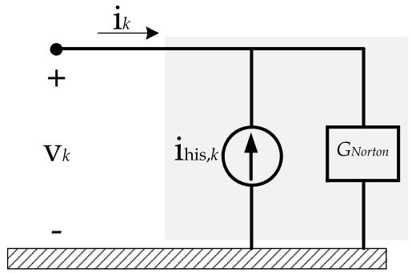  
Fig. 1. Norton equivalent.

$$
i = C x + D v \tag {8}
$$

where the input is the vector of node voltages $\nu ,$ and the output is the vector of node currents i. In $( 7 ) , f ( s )$ is considered as one of the elements of an arbitrary Y-matrix (admittance matrix). By using central difference equation, (8) can be rewritten as follows:

$$
\frac {x _ {k} - x _ {k - 1}}{\Delta t} = \boldsymbol {A} \frac {x _ {k} + x _ {k - 1}}{2} + \boldsymbol {B} \frac {v _ {k} + v _ {k - 1}}{2}
$$

$$
i _ {k} = C x _ {k} + D v _ {k} \tag {9}
$$

where, k denotes the $k ^ { \mathrm { { t h } } }$ time step. Solving (9) for $x _ { k } ,$ it is concluded that:

$$
x _ {k} = \left(I - A \frac {\Delta t}{2}\right) ^ {- 1} \times \left[ \left(I + A \frac {\Delta t}{2}\right) x _ {k - 1} + \frac {\Delta t}{2} B \left(v _ {k} + v _ {k - 1}\right) \right]
$$

$$
i _ {k} = C x _ {k} + D v _ {k} \tag {10}
$$

By defining new matrices, (10) can be simplified as follows:

$$
x _ {k} = \boldsymbol {\alpha} x _ {k - 1} + \boldsymbol {\gamma} \boldsymbol {B} v _ {k} + \boldsymbol {\mu} \boldsymbol {B} v _ {k - 1}
$$

$$
i _ {k} = C x _ {k} + D v _ {k} \tag {11}
$$

where,

$$
\boldsymbol {\alpha} = \left(I - A \frac {\Delta t}{2}\right) ^ {- 1} \left(I + A \frac {\Delta t}{2}\right)
$$

$$
\gamma = \boldsymbol {\mu} = \left(I - A \frac {\Delta t}{2}\right) ^ {- 1} \frac {\Delta t}{2} \tag {12}
$$

According to (11), $x _ { k }$ depends on the input voltage $\nu _ { k }$ at the same time step. In order to eliminate this dependency, by defining $x _ { k } = \overset { ^ { \prime } } { x _ { k } } \ +$ 上 $\gamma B { \nu _ { k } }$ , then scaling the input by αγ + μ considering the linear property and finally renaming the state variable to $x ,$ it is concluded:

$$
x _ {k} = \boldsymbol {\alpha} x _ {k - 1} + \boldsymbol {B} v _ {k - 1}
$$

$$
i _ {k} = \widetilde {\boldsymbol {C}} x _ {k} + \boldsymbol {G} v _ {k} \tag {13}
$$

where,

$$
\widetilde {\boldsymbol {C}} = \boldsymbol {C} (\boldsymbol {\alpha} \boldsymbol {\gamma} + \boldsymbol {\mu}), \boldsymbol {G} = (\boldsymbol {D} + \boldsymbol {C} \boldsymbol {\gamma} \boldsymbol {B}) \tag {14}
$$

For nodal analysis, Norton equivalent circuit is required, as shown in Fig. 1. In this case, considering $( 1 3 ) , - { \widetilde { C } } x _ { k }$ could be represented as ihis,k. Moreover, $G _ { N o r t o n }$ is equal to G.

# 2.4. Dynamic Harmonic Domain Description

Equation (13) in the DHD can be written as follows:

$$
\boldsymbol {X} _ {k _ {d}} = \boldsymbol {\alpha} _ {d} \boldsymbol {X} _ {k - 1 _ {d}} + \boldsymbol {B} _ {d} \boldsymbol {V} _ {k - 1 _ {d}}
$$

Table 1 Order of Matrices in (15)   

<table><tr><td>Matrix</td><td>αd, Dd</td><td>Bd</td><td>Cd</td><td>Gd</td></tr><tr><td>Dimension</td><td>(n1N)(2h+1) × (n1N)(2h+1)</td><td>(n1N)(2h+1) × (n1N)(2h+1)</td><td>(n2)(2h+1) × (n1N)(2h+1)</td><td>(n2)(2h+1) × (n1)(2h+1)</td></tr><tr><td></td><td>1)</td><td>1)</td><td></td><td>1)</td></tr></table>

Table 2 Harmonic Content of Input Voltages at Ports A and B   

<table><tr><td>Harmonic 
Order</td><td>“a”</td><td>Port A 
“b”</td><td>“c”</td><td>“a”</td><td>Port B 
“b”</td><td>“c”</td></tr><tr><td>1</td><td>1&lt;45°</td><td>1&lt;4-115°</td><td>1&lt;4125°</td><td>1&lt;40°</td><td>1&lt;4-120°</td><td>1&lt;4120°</td></tr><tr><td>3</td><td>0.05&lt;45°</td><td>0</td><td>0</td><td>0</td><td>0</td><td>0</td></tr><tr><td>5</td><td>0.02&lt;40°</td><td>0</td><td>0</td><td>0</td><td>0</td><td>0</td></tr></table>

Table 3 Harmonic Content (Magnitude) of Currents at Ports A and B   

<table><tr><td>Harmonic order</td><td>“a”</td><td>Port A “b”</td><td>“c”</td><td>“a”</td><td>Port B “b”</td><td>“c”</td></tr><tr><td>1</td><td>6.64</td><td>6.92</td><td>6.98</td><td>6.41</td><td>6.67</td><td>6.74</td></tr><tr><td>3</td><td>1.70</td><td>0.62</td><td>0.49</td><td>1.70</td><td>0.61</td><td>0.48</td></tr><tr><td>5</td><td>0.46</td><td>0.17</td><td>0.13</td><td>0.46</td><td>0.17</td><td>0.13</td></tr></table>

$$
\boldsymbol {I} _ {k d} = \widetilde {\boldsymbol {C}} _ {d} \boldsymbol {X} _ {k d} + \boldsymbol {G} _ {d} \boldsymbol {V} _ {k d} \tag {15}
$$

In (15), $\alpha _ { d } , B _ { d } , \widetilde { C } _ { d } ,$ , and $G _ { d }$ are Toeplitz matrices formed by harmonic content of α, $B , { \tilde { C } } ,$ and $G ,$ respectively. It should be noted that in order to transform (13) into the DHD, according to (4), A in (8) should be replaced by $\left( { \cal A } _ { d } - { \cal D } _ { d } \right)$ , and then, one can calculate $\alpha _ { d } , B _ { d } , \widetilde { C } _ { d } ,$ , and $G _ { d }$ in the DHD. $A _ { d }$ is formed by harmonic contents of A, and $D _ { d }$ is as follows:

$$
D _ {d} = \left[ \begin{array}{c c c c c c c c} D _ {h} & & & & & & & \\ & \ddots & & & & & \\ & & D _ {h} & & & & \\ & & & D _ {h} & & & \\ & & & & D _ {h} & & \\ & & & & & \ddots & \\ & & & & & & D _ {h} \end{array} \right] \tag {16}
$$

For a system with $n _ { 1 }$ input voltages, $n _ { 2 }$ output currents, N poleresidue terms, and h harmonics, the dimension of matrices in (15) becomes as listed in Table 1. Moreover, the dimension of the state variable $X _ { k _ { d } }$ in (15) is $( n _ { 1 } N ) ( 2 h + 1 ) \times 1$ .

# 3. Balanced Realization

The procedure described in the previous section is a general procedure, which completely considers frequency-dependent features of the under-study system in the presence of harmonic distortion. However, as can be seen in Table 1, if the system is modeled in the DHD precisely, a large amount of computational resources is required. Therefore, employing of a model order reduction approach is vital to decrease this computational burden. Considering Table 1, the system order could be reduced by selecting a lower value for N in (6); however, the proper dynamics of the system may not be preserved. For instance, if appropriate order is not selected for the VF method and the frequency response is not reproduced accurately, implementation of a model order reduction approach can significantly increase the error of the system modeling, especially during the fast transient analysis.

As discussed in [33], the balanced realization method is not a new technique; however, its application in power engineering to reduce large networks is novel. A lower-order approximation of system model can be achieved by neglecting states that have relatively low effect on the

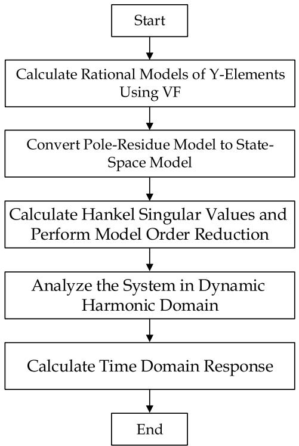  
Fig. 2. Flow chart of the simulation procedure 1.

overall model response. Using a lower-order approximation that preserves the dynamics of interest can promisingly simplify analysis. For this purpose, in the balanced truncation method of model reduction, the state contributions are measured by Hankel singular values, and states with smaller values are discarded. Consider a system with minimal realization as follows:

$$
G = \left[ \begin{array}{l l} A & B \\ C & D \end{array} \right] \tag {17}
$$

The controllability gramian P that characterizes input-to-state behavior and the observability gramian Q that characterizes state-tooutput behavior are determined as solutions to the following Lyapunov equation.

$$
A P + P A ^ {T} + B B ^ {T} = 0
$$

$$
A ^ {T} Q + Q A + C ^ {T} C = 0 \tag {18}
$$

Hankel singular values, ξ , are defined as the square roots of the eigenvalues of the PQ (λ ) as follows [34]:

$$
\xi_ {i} ^ {\Delta} = \left(\lambda_ {i} (P Q)\right) ^ {\frac {1}{2}} \tag {19}
$$

Hankel singular values define the energy of each state in the system. Considering the Hankel singular values and defining a transformation matrix, the reduced-order system can be obtained; however, the effect of states which are omitted in the reduced system should be small enough.

Flowchart of the simulation procedure is illustrated in Fig. 2.

# 4. Tests and Results

In order to investigate the effectiveness of the proposed methodology, two test cases are simulated. In the first case, an electrical circuit with a known port characteristic (Y-elements) is used. In the second one, the proposed method is applied to the frequency response of a threephase distribution system in order to evaluate the proposed approach in a more complex system. The computer used for the presented simulations is an Intel® Core (TM) i7-3612QM 2.10 GHz Central Processing

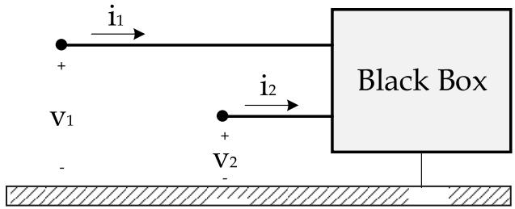  
Fig. 3. Two port test system.

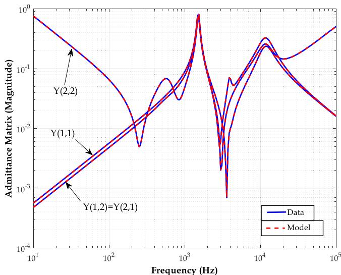  
Fig. 4. Rational approximation for magnitude of Y(s).

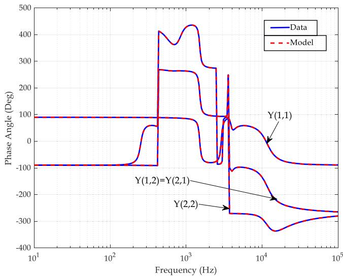  
Fig. 5. Rational approximation for phase angle of Y(s).

Unit (CPU) with 8 GB of Random Access Memory. In order to validate time domain results obtained by using the proposed method in this paper, EMTP Works version 2.0.2 is employed.

# 4.1. Electrical Circuit with Known Y-Elements

Fig. 3 depicts the terminal-based representation of an electrical network with two external ports. The corresponding electrical network can be found in Appendix I. This two-port system can be described by a

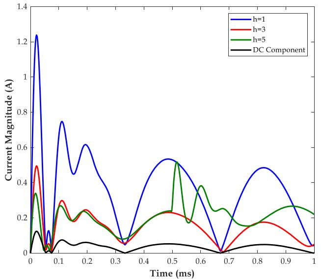  
Fig. 6. Harmonic content of the current response at port 1.

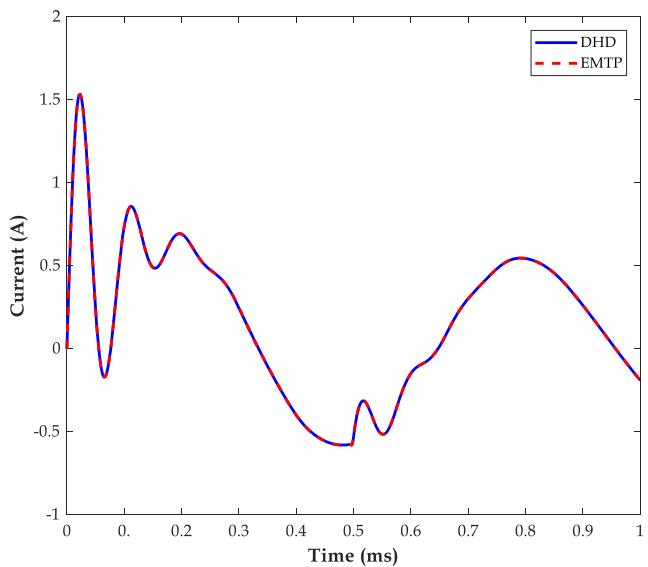  
Fig. 7. Time domain waveform of current response at port 1.

$2 \times 2$ frequency-dependent Y-matrix. Here, 250 logarithmically spaced frequency samples between 10Hz and 100kHz are computed for each element of Y-matrix, and $1 0 ^ { \mathrm { t h } } .$ -order pole-residue model is fitted to each element of Y matrix by using VF method with relaxation [13]. The pole relocation procedure for this test case converges in 4 iterations with an elapsed time of 0.138s. Figs. 4 and 5 depict the magnitude and phase angle of these fitted Y-elements, respectively. In Figs. 4 and 5, “Data” is the exact admittance matrix while “Model” depicts the fitted results using the VF method. The maximum deviations (between the model and the exact data) for the magnitudes of Y(1, 1), Y(1, 2) = Y(2, 1) and Y(2, 2) are $3 . 2 9 7 \times 1 0 ^ { - 1 4 }$ , $1 . 7 7 7 \times 1 0 ^ { - 1 5 }$ , and $5 . 8 0 8 \times 1 0 ^ { - 1 4 }$ , respectively; and hence, it can be concluded that all matrix elements are accurately fitted. It should be noted that in this test system, since the circuit is small, model order reduction is not used.

In this test case, port 1 is supplied by the voltage source of 10cos(ω0t) $+ 4 \mathrm { c o s } ( 3 \omega _ { 0 } t ) + 1$ V in which $\omega _ { 0 }$ is equal to 100π rad/s. Port 2 is firstly connected to a voltage source of 2cos(5ω t) V and then, it is directly grounded at t = 0.5ms. The simulation time-step is assumed to be 100μs. Furthermore, initial conditions are assumed to be zero. Since the system is linear, only the excited frequency components in the input sources

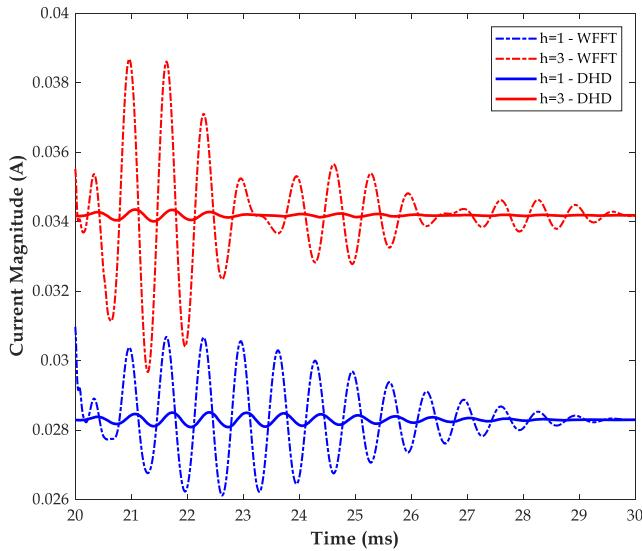  
Fig. 8. Results of WFFT for current response at port 2.

would be present at the output waveforms. Therefore, using five harmonic-order for the DTD method provides the required accuracy. The simulated harmonic content of current response at port 1, using the proposed methodology, is shown in Fig. 6. As expected, by using the DHD method, only DC-component, first, third and fifth harmonics can be seen in the harmonic content.

In order to validate the time-domain waveforms, the test case is also implemented in an EMTP software with a time step of 1 μs. Fig. 7 depicts the time-domain waveform of the current response at port 1. According to Fig. 7, it is concluded that time-domain results of the DHD and EMTP methods are well-matched since the deviation is negligible. However, the required time to perform conventional lumped circuit simulation using the EMTP software is 0.378s, while the elapsed time by using the DHD method is 0.135s. The simulation time and computational efficiency can be further improved if the model is converted to a real-only pole model. By using this feature, which is presented in [35], the required simulation time for this test case can reduce to 0.107s (21% reduction in the required time).

If time-frequency tools such as Windowed Fast Fourier Transform (WFFT) are used in order to extract the harmonic content of the current response during the transient period, incorrect transients will be added to the actual harmonic response. In fact, during transient periods such as switching of sources, when the moving window of FFT includes both samples of before and after switching inception, the WFFT method can lead to inappropriate transient response. Therefore, the results of WFFT are not accurate for harmonic analysis during transient periods. One may recognize a significant difference between results of the DHD and WFFT methods (see Fig. 8). The results of the DHD and WFFT methods are similar while the system operates in its steady-state condition.

# 4.2. Three-Phase Distribution System

In this test case study, a small three-phase distribution system is analysed in which the admittance matrix $\left( 6 \times 6 \right)$ is known with respect to two distinct three-phase buses as shown in Fig. 9. This test system includes transmission lines and underground cables represented by their accurate distributed models. The employed parameters are presented in [9]. The frequency scan is performed in 10Hz steps from 1Hz to 100kHz in order to calculate the frequency-dependent Y-matrix. $5 0 ^ { \mathrm { t h } }$ -order pole-residue model is fitted to each element of the Y-matrix by using the VF method with relaxation. Fig. 10 depicts the rational approximation for the magnitude of diagonal elements of the system admittance matrix.

For the sake of simplicity, waveforms are shown in the range of 1Hz to 50kHz. The pole relocation procedure for this test case converges in 5

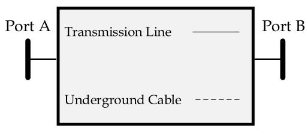

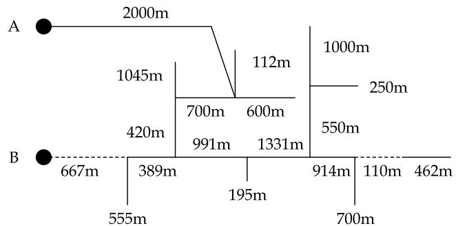  
Fig. 9. The studied distribution system network.

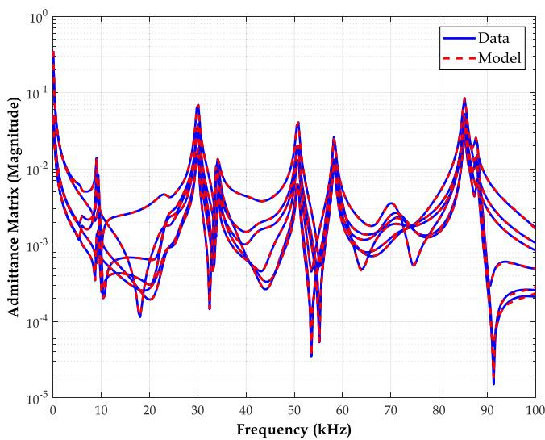  
Fig. 10. Rational approximation for the magnitude of diagonal elements.

iterations, the elapsed time of 1.021s for VF method with a maximum deviation of $4 . 0 2 9 \times 1 0 ^ { - 5 }$ . Three-phase input voltages with a frequency of 50Hz at ports A and B are presented in Table 2 in per-unit with a 400 V

base value for the line-to-line voltage. According to this table, it is clear that the fundamental components in ports A and B are balanced. However, third and fifth harmonics have a significant magnitude in the phase “a” at port A. For this test case, five harmonics are used in the DHD method, and the time step for numerical integration is assumed to be 50μs.

# 1 Steady-State Response

Steady-state response of the system is efficiently calculated in the frequency domain by (5). Using the proposed method, the elapsed time to obtain steady-state response of the system is 0.039s. The harmonic content of three-phase currents at ports A and B are listed in Table 3 (in Amperes). According to Table 3, as expected, third and fifth harmonics are present in all ports with different values since the system is unbalanced in both structure and input sources.

# 1 Transient Response

In the previous subsection, the harmonic analysis was performed during the steady-state condition. In order to perform a transient analysis of harmonics, it is assumed that all initial conditions are zero, and the input voltages at ports A and B are the same as ones used for the steady-state analysis (reported in Table 2). In this case, since all of the initial conditions are assumed equal to zero, an extreme transient

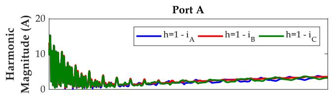

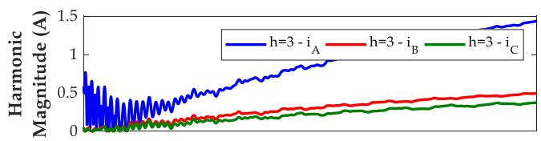

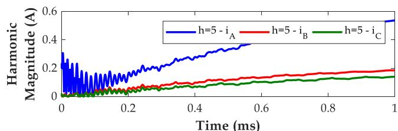

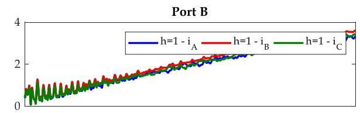

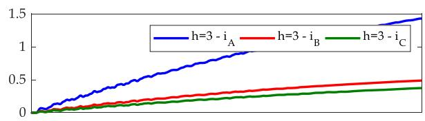

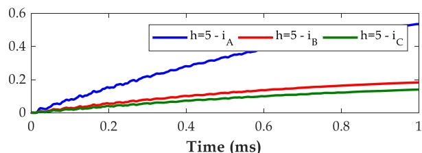  
Fig. 11. Harmonic content of three phase current responses at ports A and B.

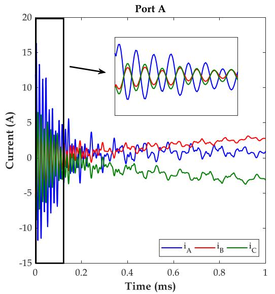

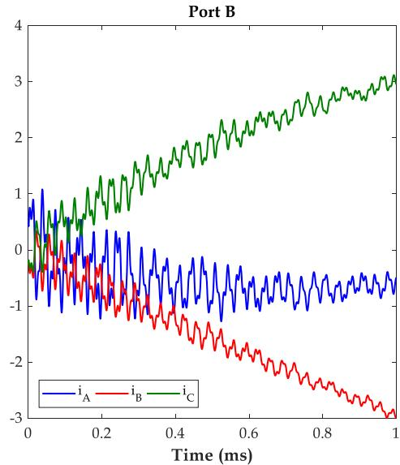  
Fig. 12. Three-phase current responses at ports A and B.

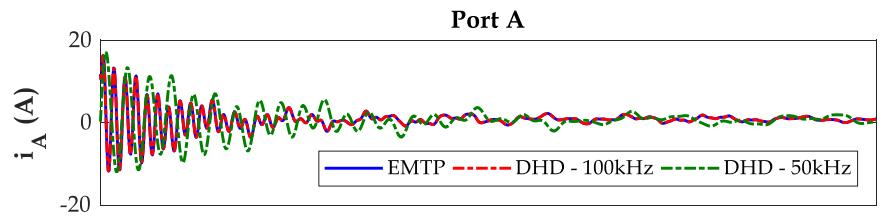

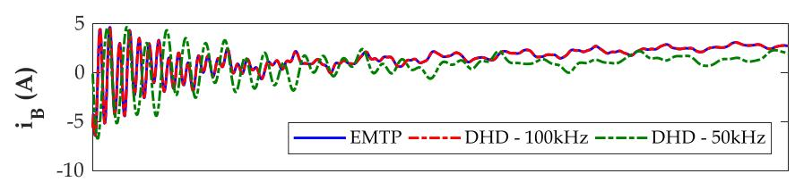

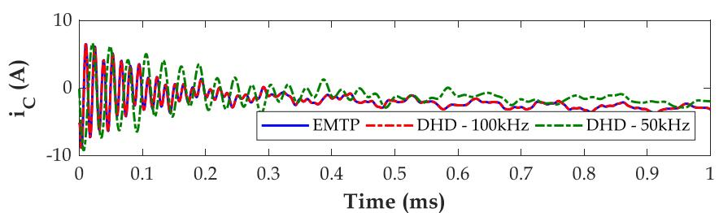  
Fig. 13. Results of the EMTP software and the DHD method for different values of upper-frequency limit.

response is expected. The harmonic content of three-phase currents at ports A and B are shown in Fig. 11.

According to Fig. 11, it can be seen that due to the presence of both low- and high-frequency components in the pole-residue model of the admittance matrix, harmonics experience extreme transients, especially during the first 0.15ms. Time-domain response of three-phase currents at ports A and B are depicted in Fig. 12. The results provided by the proposed method and ones obtained by performing the conventional lumped circuit simulation using EMTP (time step of 100μs) are entirely in line.

In this test system, if one measures the frequency-dependent Y-matrix only up to the 50 kHz limit, the reproduction of high-frequency components will be significantly affected. Fig. 13 depicts the results of

the EMTP and DHD methods when both 50 and 100 kHz values are selected as the upper-frequency limit for the measurement of the admittance matrix.

According to Fig. 13, it is clear that if the upper-frequency limit is assumed equal to 50kHz, the calculated results during the transient period are not reliable; however, when the upper-frequency is set to 100kHz, the output results of the proposed method are in good agreement with those of the EMTP software. In this test system, steady-state response is accurately reproduced if the low-frequency model is used for the components; however, for transient studies, results are not accurate enough if the frequency-dependent models are not employed.

The required simulation time for the proposed method is 112.13 s, while the elapsed time by the EMTP software is 36.56s. However, if the

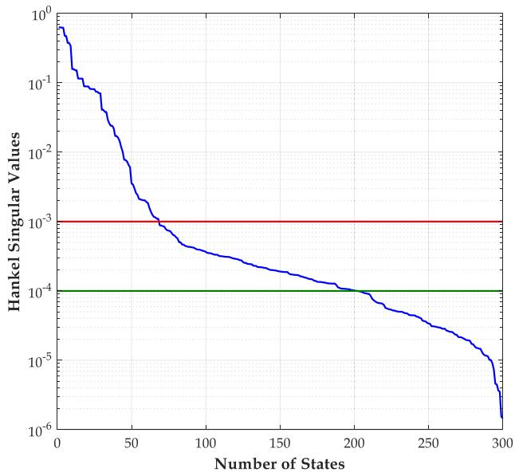  
Fig. 14. Hankel singular values corresponding to the three-phase distribution system.

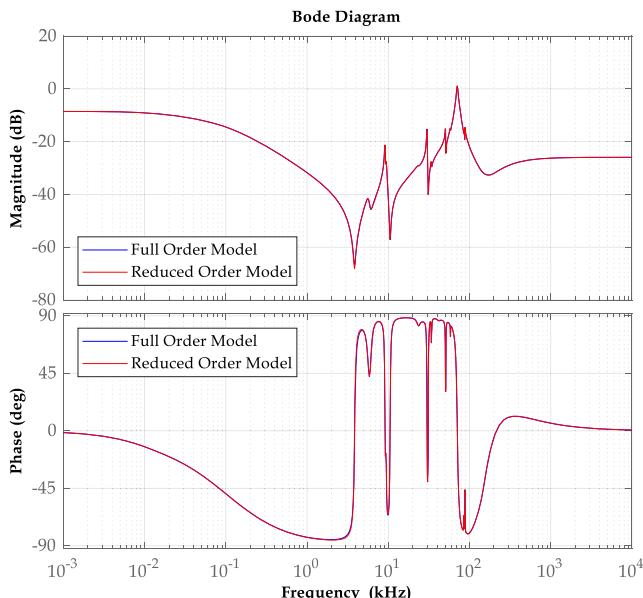  
Fig. 15. Bode diagram of Y(1,1) element for both full order and reduced order models.

model is converted to its real-only pole model, the required simulation time would reduce to 71.82s (36% reduction). Moreover, it should be noted that harmonic analysis in the EMTP cannot be directly performed, and another time-frequency tool such as WFFT is required. Fast variations in the time-domain waveform are challenging to be detected using WFFT, which leads to large errors during transient analysis.

As shown in this section, applying the proposed methodology to provide direct harmonic analysis in the frequency-domain can lead to a significant computational burden compared to the time-domain solution. Therefore, as discussed before, using model order reduction is inevitable. Considering the upper-frequency limit equal to 100kHz, Hankel singular values that define the energy of each state in the system based on controllability and observability gramians are depicted in Fig. 14.

Based on the magnitudes of Hankel singular values and by defining a dominancy condition (error bound), the order of each sequence can be reduced. According to Fig. 14, maximum and minimum values for

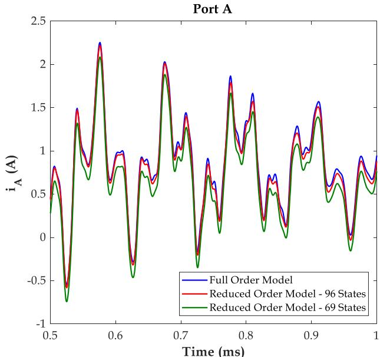  
Fig. 16. Phase $\mathbf { \ddot { a } } _ { } ^ { }$ current of port A.

Hankel singular values are equal to 0.631 and $1 . 4 5 \times 1 0 ^ { - 6 } ,$ respectively. By defining a dominancy condition of $1 0 ^ { - 3 }$ , an order of 69 is chosen for the reduced-order model. In this case, by defining an error bound to measure how close is the reduced model $G _ { r e d }$ to full order model G, it can be seen that the additive error, $G - G _ { r e d \infty } ,$ is equal to 0.0822. However, defining a dominancy condition and selecting the corresponding order does not guarantee the error to be less than the predefined specified value. In this case, if the additive error is considered to be less than 0.05, the system order can be reduced to 96. Fig. 15 depicts the determined bode diagram of one of the system admittance matrix elements, Y(1,1), for full-order model and the reduced-order model (using 96 states) as a function of the frequency.

To verify the accuracy of the reduced-order model in comparison with the full-order one, the aforementioned transient scenario is simulated. Fig. 16 depicts the resulted current for the phase “a” at port A by using the reduced-order model for the time interval of 0.5 to 1ms. As it can be seen, by using 96 states, the obtained results are in good agreement with the complex full-order model. It should be noted that by using the model order reduction, the required simulation time is reduced to 47.023s.

# 4.3. Distribution System

This test case is used to show the effect of “model order reduction” (proposed in this paper) on the computational burden in a more elaborated system including a load and transformers. In this case study, a 5- bus (three-phase) distribution system shown in Fig. 17 is studied which is modelled by $1 5 \times 1 5$ admittance matrix. This 20kV test system with nominal frequency of 50Hz includes overhead transmission lines represented by distributed models and an electrical load of 14 MVA, PF=0.8Lag modelled by shunt elements. It should be noted that the soil resistivity is assumed 100Ωm and its copper conductor has an equivalent Rdc=0.1548Ω/km. The 63/20 kV transformers which have a rated power of 15MVA, the vector group of YNd11 and the short circuit impedance of 12.42%, are used. In order to calculate the frequencydependent Y-matrix, the frequency scan analysis is performed over 10Hz steps, from 1Hz to 100kHz. A 45th-order pole-residue model is fitted to each element of the Y-matrix by using the VF method with relaxation. A harmonic source is connected to the LV side of transformer at port E. According to the practical measurements performed by Unilyzer 900 (a power quality analyzer manufactured by Unipower) the average value of third harmonic after connection of this load to the

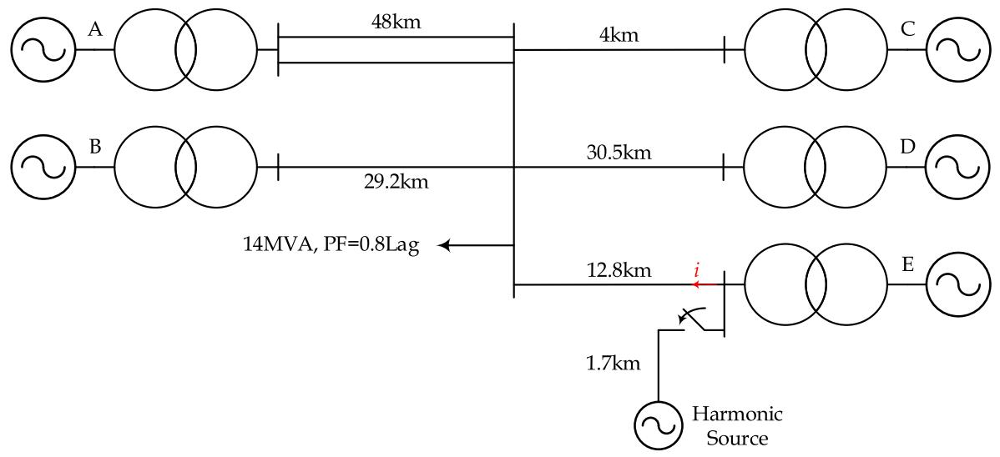

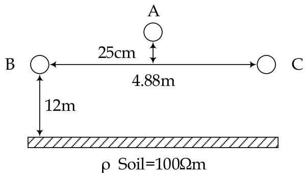  
a) Distribution System Used in Test Case 3   
b) Configuration of 20kV Overhead Line   
Fig. 17. The studied distribution system network with harmonic source.

Table 4 Harmonic Content of Input Voltages at Ports A-E   

<table><tr><td>Bus</td><td>Fundamental Component (p.u)</td></tr><tr><td>A</td><td>1.0263&lt;23.0644*</td></tr><tr><td>B</td><td>1.0412&lt;23.7191*</td></tr><tr><td>C</td><td>1.0360&lt;23.4755*</td></tr><tr><td>D</td><td>1.0302&lt;27.0548*</td></tr><tr><td>E</td><td>1.0452&lt;27.7034*</td></tr></table>

system for more than 5 cycles is equal to 0.152p.u. (the base voltage of 20kV). Effect of this harmonic source is modelled by a voltage source connected to the LV side of transformer at port E that includes third harmonic. The system parameters are initialized using the results of load flow solution, as listed in Table 4 and it is assumed that the harmonic source is connected to the system at t=0s and the current i which is shown in Fig. 17, is monitored. The pole relocation procedure for this case study converges in 4 iterations, the elapsed time of 0.884s is observed for VF method with a maximum deviation of $8 . 1 3 4 \ \times \ 1 0 ^ { - 5 }$ . The required computation time for 50ms simulation with the computation time step of 10μs is equal to 10.08s for EMTP and 33.025s for DHD. Considering Hankel singular values for this system, it is concluded that the maximum value of state energy is equal to 0.8866 while the minimum value of state energy is $1 . 5 2 2 \times 1 0 ^ { - 7 }$ . If the additive error is considered to be less than 0.05, the system order can be significantly reduced to the value of 19. Fig. 18 depicts the results of the EMTP and

DHD reduced order model results and as expected, the results are in complete agreement. Using this reduced order model, the required simulation time is 17.058s which shows significant reduction if compared with full order model.

# 5. Summery and Conclusion

In this paper, a general framework has been introduced to interface the DHD method to the rational models. The proposed methodology can be employed to analyse the frequency-dependent systems using a terminal-based Y-matrix. At the first step, this paper proposes to evaluate the corresponding rational models employing the VF method. Then, the obtained pole-residue models are converted into its standard statespace representation. Finally, the DHD method along with trapezoidal integration rule have been used for discretization of the state-space equations. In order to validate the effectiveness of the proposed method, two test cases are analyzed.

As mentioned in the paper, using the proposed method for linear systems which are described by RLC parameters is fast and provides exact results. However, for systems with measured frequency response, due to the complex frequency response spectrum, using a system order reduction method, such as; balanced realization, or limiting the frequency range to a desirable range is vital to decrease the computational burden. Otherwise, the state-space system order in DHD would be significant, and the solution could be inefficient. By using a numerical example, it was shown that for complex networks, the proposed methodology requires more simulation time if compared to the time required

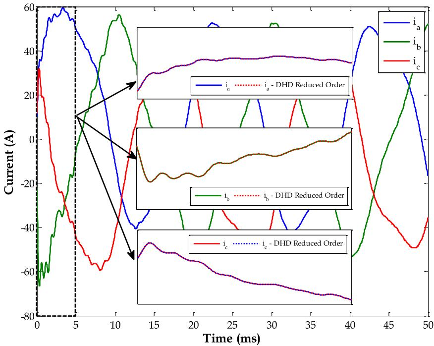  
Fig. 18. Three Phase Currents.

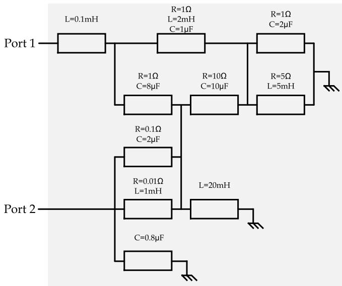  
Fig. 19. Two port test system used in Section 4.1.

by the conventional EMT programs. In the reduced-order model, the states that have a relatively small impact on the overall model response, can be omitted.

Simulation results reveal that the proposed methodology can precisely compute the frequency response of power system networks directly in the frequency-domain. This paper shows that during the transient periods such as switching events, the results of a conventional windowed FFT are not reliable, while the proposed methodology can accurately solve the dynamic equations of harmonics. Therefore, the proposed methodology can evaluate the harmonic contents for frequency-dependent systems even during their transient periods.

# Declaration of Competing Interest

This paper aims to provide accurate results for transient analysis in the presence of harmonic distortion. Proposed methodology is

completely frequency dependent and can be efficiently implemented in frequency based software. Results are compared with those obtained using EMTP.

# Appendix

Fig. 19 depicts the electrical circuit used in Section 4.1. The admittance matrix of the system is 2 × 2 and it is calculated with respect to ports 1 and 2. In Fig. 19, each impedance is formed by series connection of R, L and C elements.

# References

[1] A.S. Morched, J.H. Ottevangers, L. Marti, Multi-port frequency dependent network equivalents for the EMTP, IEEE Trans. Power Del. 8 (3) (1993) 1402–1412. Jul.   
[2] B. Gustavsen, Computer code for rational approximation of frequency dependent admittance matrices, IEEE Trans. Power Del. 17 (4) (2002) 1093–1098. Oct.   
[3] H. Xue, et al., Transient Responses of Overhead Cables Due to Mode Transition in High Frequencies, IEEE Trans. Electromagn. Compat. 60 (3) (2018) 785–794. June.   
[4] D. Deschrijver, M. Mrozowski, T. Dhaene, D. De Zutter, Macromodeling of multiport systems using a fast implementation of the vector fitting method, IEEE Microw. Wireless Compon. Lett. 18 (6) (2008) 383–385. Jun.   
[5] B. Gustavsen, Fast passivity enforcement for S-parameter models by perturbation of residue matrix eigenvalues, IEEE Trans. Adv. Packag. 33 (1) (2010) 257–265. Feb.   
[6] T. Dhaene, D. Deschrijver, N. Stevens, Efficient algorithm for passivity enforcement of S-parameter-based macromodels, IEEE Trans. Microw. Theory Tech. 57 (2)   
[7] Y. Hu, W. Wu, A.M. Ghole, B. Zhang, A Guaranteed and Efficient Method to Enforce Passivity of Frequency-Dependent Network Equivalents, IEEE Trans. Power Syst. 32 (3) (2017) 2455–2463. May.   
[8] B. Gustavsen, A. Semlyen, Rational approximation of frequency domain responses by vector fitting, IEEE Trans. Power Del. 14 (3) (1999) 1052–1061. Jul.   
[9] B. Gustavsen, Improving the pole relocating properties of vector fitting, IEEE Trans. Power Del. 21 (3) (2006) 1587–1592. Jul.   
[10] Y. Hu, W. Wu, B. Zhang, A Fast Method to Identify the Order of Frequency-Dependent Network Equivalents, IEEE Trans. Power Syst. 31 (1) (2016) 54–62. Jan.   
[11] A.M. Stankovic, S.R. Sanders, T. Aydin, Dynamic phasors in modeling and analysis of unbalanced polyphase AC machines, IEEE Trans. Energy Convers. 17 (2002) 107–113. Mar.   
[12] M. Elizondo, F. Tuffner, K. Schneider, Simulation of Inrush Dynamics for Unbalanced Distribution Systems using Dynamic-Phasor Models, IEEE Trans. Power Syst. 32 (1) (2017). Jan.   
[13] T. Demiray, Simulation of power system dynamics using dynamic phasor models,” Ph.D. dissertation, Swiss Fed. Inst. Technol. (2008).   
[14] A.M. Stankovic, P. Mattavelli, V. Caliskan, G.C. Verghese, Modeling and analysis of FACTS devices with dynamic phasors, 2000 IEEE Power Engineering Society

Winter Meeting. Conference Proceedings (Cat. No.00CH37077 2 (2000) 1440–1446.   
[15] M.C. Chudasama, A.M. Kulkarni, Dynamic phasor analysis of SSR mitigation schemes based on passive phase imbalance, IEEE Trans. Power Syst. 26 (2011) 1668–1676. Aug.   
[16] Z. Miao, L. Piyasinghe, J. Khazaei, L. Fan, Dynamic Phasor-Based Modeling of Unbalanced Radial Distribution Systems, IEEE Trans. Power Syst. 30 (6) (2015) 3102–3109. Nov.   
[17] H. Zhu, Z. Cai, H. Liu, Q. Qi, Y. Ni, Hybrid-model transient stability simulation using dynamic phasors based HVDC system model, Elect. Power Syst. Res. 76 (2006) 582–591. Apr.   
[18] P. Zhang, J.R. Marti, H.W. Dommel, Synchronous machine modelling based on shifted frequency analysis, IEEE Trans. Power Syst. 22 (3) (2007) 1139–1147. Aug.   
[19] T. Yang, S. Bozkho, J. Le-Peuvedic, Asher G, C. Hill, Dynamic Phasor Modeling of Multi-Generator Variable Frequency Electrical Power Systems, IEEE Trans. Power Syst. 31 (1) (2015) 563–571. Feb.   
[20] D. Shu, et al., Dynamic Phasor Based Interface Model for EMT and Transient Stability Hybrid Simulations, IEEE Trans. Power Syst. (2015), https://doi.org/ 10.1109/TPWRS.2017.2766269.   
[21] E. Karami, M. Madrigal, S.M. Kouhsari, S.M. Mazhari, A dynamic harmonic domain–based framework to detect 3-phase balanced systems under dynamic transients: the test case of inrush current in transformers, Int. Trans. Electr. Energ. Syst. 27 (2) (2017). Feb.   
[22] J.J. Chavez, A. Ramirez, V. Dinavahi, Dynamic harmonic domain modeling of synchronous machine and transmission line interface, IET Gener. Transm. Distrib. 5 (9) (2011) 912–920. Sep.   
[23] B. Vyakaranam, F.E. Villaseca, Dynamic modeling and analysis of generalized unified power flow controller, Electr. Power Syst. Res. 106 (2014) 1–11. Jan.   
[24] A. Ramirez, The Modified Harmonic Domain: Interharmonics, IEEE Trans. Power Deliv. 26 (1) (2011) 235–241. Jan.

[25] U. Vargas, A. Ramirez, Extended Harmonic Domain Model of a Wind Turbine Generator for Harmonic Transient Analysis, IEEE Trans. Power Deliv. 31 (3) (2016) 1360–1368. Jun.   
[26] F. Yahyaie, P.W. Lehn, On Dynamic Evaluation of Harmonics Using Generalized Averaging Techniques, IEEE Trans. Power Syst. 30 (5) (2015) 2216–2224. Sep.   
[27] S.M. Mazhari, S.M. Kouhsari, A. Ramirez, E. Karami, Interfacing Transient Stability and Extended Harmonic Domain for Dynamic Harmonic Analysis of Power Systems, IET Gener. Transm. Distrib. 10 (11) (2016) 2720–2730. Aug.   
[28] A. Ramirez, J.J. Rico, Harmonic/State Model Order Reduction of Non-linear Networks, IEEE Trans. Power Deliv. 31 (1) (2016) 1379–1387. Jun.   
[29] E. Karami, G.B. Gharehpetian, M. Madrigal, A Step Forward in Application of Dynamic Harmonic Domain: Phase Shifting Property of Harmonics, IEEE Trans. Power Deliv. 32 (1) (2017) 219–225. Feb.   
[30] E. Karami, M. Madrigal, G.B. Gharehpetian, K. Rouzbehi, P. Rodriguez, Single-Phase Modeling Approach in Dynamic Harmonic Domain, IEEE Trans. Power Syst. 33 (1) (2018) 257–267. Jan.   
[31] E. Karami, G.B. Gharehpetian, M. Madrigal, J.J. Chavez, Dynamic Phasor-Based Analysis of Unbalanced Three-Phase Systems in Presence of Harmonic Distortion, IEEE Trans. Power Syst. 33 (6) (2018) 6642–6654. Nov.   
[32] B. Moore, Principal component analysis in linear systems: Controllability, observability, and model reduction, IEEE Trans. Automatic Control (1) (1981) 17–32. AC-26Feb.   
[33] A. Ramirez, et al., Application of balanced realizations for model order reduction of dynamic power system equivalents, IEEE Trans. Power Del. 31 (5) (2016) 2304–2312. Oct.   
[34] M. Dahleh, M. A. Dahleh, G. Verghese, Lectures on Dynamic Systems and Control, MA, Cambridge: MIT Press, vol. Course 6.241.   
[35] E.-P. Li, E.-X. Liu, L.W. Li, M.-S. Leong, A coupled efficient and systematic fullwave time-domain macromodeling and circuit simulation method for signal integrity analysis of high-speed interconnects, IEEE Trans. Adv. Packag. 27 (1) (2004) 213–223. Feb.