# 考虑不对称故障的

# 机电暂态-电磁暂态混合仿真方法

刘文焯，侯俊贤，汤涌，宋新立，万磊，范圣韬

(中国电力科学研究院，北京市海淀区 100192)

# Electromechanical Transient/Electromagnetic Transient Hybrid Simulation Method Considering Asymmetric Faults

LIU Wen-zhuo, HOU Jun-xian, TANG Yong, SONG Xin-li, WAN Lei, FAN Sheng-tao

(China Electric Power Research Institute, Haidian District, Beijing 100192, China)

ABSTRACT: An effective solution of electromechanical transient and electromagnetic transient hybrid simulation was proposed, including interface selection, mutual equivalence methods between electromechanical transient and electromagnetic transient network. It is able to deal with the situation that the positive and negative sequence parameters of equivalence circuit are different. Least square method was adopted to obtain three-sequence fundamental frequency current which indicated the influence of electromagnetic transiet simulation on the electromechanical network. The solution is demonstrated effective and feasible through several cases. Problems in hybrid simulation are solved when various faults (including symmetric and asymmetric faults) occur in electromechanical network.

KEY WORDS: HVDC transmission; electromechanical transient; electromagnetic transient; hybrid simulation; Norton equivalence

摘要：提出一套机电暂态-电磁暂态混合仿真方案，包括接口母线的选取方法、机电暂态子系统对电磁暂态子系统的等效、等值电路正序和负序参数不相等情况的处理(基波负序补偿法)，并采用最小二乘法求取3序基波电流来反映电磁暂态系统仿真结果对机电暂态网络的影响。仿真计算结果证明了该套仿真方案的有效性和可行性，解决了机电暂态网络发生各种对称和不对称故障复杂情况下局部电路的详细电磁暂态仿真问题，并通过了大型电网仿真的检验。

关键词：高压直流输电；机电暂态；电磁暂态；混合仿真；

诺顿等值

# 0 引言

电磁暂态仿真与机电暂态仿真进行接口混合仿真的需求是从直流输电研究开始的。机电暂态程序描述直流换流站和直流线路时通常采用准稳态模型，其假设条件为：1）换流器母线的三相交流电压是对称、平衡的正弦波；2）换流器本身的运行是完全对称平衡的；3）直流电流和直流电压都是平直的；4）换流变压器不考虑饱和，忽略激磁电流。

直流准稳态模型的缺陷是非常明显的，具体表现在：1）准稳态模型在不对称故障期间不适用；2）换流器本身的暂态过程忽略不计，不能表示详细的换相过程，不能表示不对称故障对换流阀的影响和换流器内部故障、逆变器换相失败以及控制系统对换流过程的影响等；3）不能确切表示直流线路故障，以及在此情况下的直流后续控制行为。因此，要想准确研究直流系统的详细暂态过程，直流的仿真必须采用电磁暂态模型。

传统电磁暂态程序受到模型、算法以及步长的限制，只能对局部小型装置或网络进行电磁暂态仿真，并且需要将与其相连的外部电网进行等值化简。当接口处与外部电网联系较弱，如直流系统换流母线两端交流系统的短路容量相对于直流额定输送功率较小(有效短路比小于2.5)，以及计算时间超过常见的电磁暂态仿真领域而进入电网中机组的摇摆过程(数秒至数十秒)时，采用等值化简后的系统来表示整个外部电网就不能满足仿真

的需要。

为弥补上述机电暂态仿真和电磁暂态仿真的不足，Heffernan等人首先提出了在暂态稳定程序中考虑HVDC系统详细暂态模型的混合仿真算法[1-9]，其基本思想是根据对电力系统各区域研究兴趣的不同，把电力系统分解为电磁暂态子系统、机电暂态系统以及接口母线这3个部分。含有电力电子装置的详细系统定义为电磁暂态子系统，使用电磁暂态程序进行详细仿真；而把传统的外部交流电力网络定义为机电暂态系统，使用机电暂态程序进行仿真；联接2个子系统的母线定义为混合仿真的接口母线，电磁暂态子系统和机电暂态子系统通过接口母线进行2种仿真的同步和数据交换。由于超大规模的电网采用的是机电暂态程序进行仿真，而局部需详细研究的小系统使用微秒级步长的电磁暂态仿真，所以机电暂态-电磁暂态混合仿真算法既可以精确地模拟非线性电力电子器件的动态特性，又可以准确仿真大规模电网，具有较高的仿真效率。

由于中国东部和南方面临能源紧缺的问题，中国采取了西电东送、发展特高压智能电网的战略，特高压长距离直流送电显得极其重要，许多国内学者自2005年以来，先后开展了电力系统机电暂态、电磁暂态以及机电暂态-电磁暂态的混合仿真研究[10-22]。

本文提出一套机电暂态-电磁暂态混合仿真方法，包括接口选取方法、机电暂态子系统对电磁暂态子系统的等效方法、等值电路正序和负序参数不相等情况的处理以及电磁暂态系统仿真结果对机电暂态网络的等效方法等，能完全适应电网中发生任意形式故障的情况，尤其是接口处附近发生电网不对称故障的情况。

# 1 网络划分及接口母线的选取

将网络划分为电磁暂态子系统、机电暂态系统以及接口母线这3个部分，关键的接口母线选择为换流器终端母线，如图1所示，而网络具体的划分方法及相关的区别参见表1。

由于电磁暂态子系统只包括高压直流等局部系统(换流器、换流变压器、无功补偿、滤波器、平波电抗器、直流线路和控制系统等), 而不包括常规的交流系统, 所以这种网络分解方法的优点是详细系统只包含最小规模的电磁暂态元件, 混合仿真的

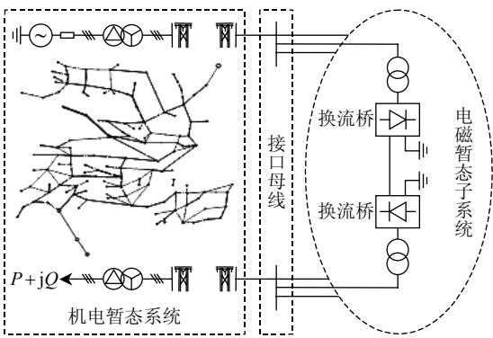  
图1采用AC-DC系统换流器端母线作为接口母线的混合仿真方法  
Fig. 1 Hybrid simulation method which selects converter AC buses as the interface buses

表 1 电磁暂态和机电暂态网络划分与计算的对比  
Tab. 1 Differences of network partition and calculation between electromechanical and electromagnetic transient simulation   

<table><tr><td>项目</td><td>机电暂态系统</td><td>电磁暂态子系统</td></tr><tr><td>网络划分</td><td>发电机、励磁、调速、电力系统稳定器、变压器、线路、负荷和安全自动装置等</td><td>换流器、换流变压器、无功补偿、滤波器、直流线路、平波电抗器、灵活交流输电系统和控制保护系统等</td></tr><tr><td>网络规模</td><td>庞大,几万个节点,几千台发电机</td><td>规模小,只限于局部系统的详细研究,如直流、灵活交流输电系统和微网等</td></tr><tr><td>积分算法</td><td>隐式梯形算法、吉尔(Gear)法、龙格-库塔法等</td><td>隐式梯形算法(需处理网络突变和事件发生)和状态空间解法等</td></tr><tr><td>步长</td><td>周波级</td><td>微秒级</td></tr><tr><td>计算速度</td><td>快</td><td>慢</td></tr><tr><td>电网模型</td><td>基波、正序、相量模型,用负序、零序表达网络不对称情况</td><td>abc三相、瞬时值模型</td></tr><tr><td>研究目标</td><td>全网能量传输、功角稳定、电压稳定等问题</td><td>详细研究局部系统的响应和接口处功率的变化</td></tr></table>

效率高。

如果接口母线选为换流器的终端母线，电磁暂态子系统和机电暂态系统之间的相互等值比较简单，并且不受网络复杂程度的限制。而这种接口选法的缺陷在于：对于弱交流系统和高压直流系统直接相联的网络，当发生非对称故障及靠近逆变器终端的严重故障时，相位不平衡以及由谐波引起的逆变器终端波形畸变比较严重。由于机电暂态是基于基波、单相、相量模型，不能有效反映逆变器终端的波形畸变和相位不平衡，所以如果仍然使用换流器终端作为机电暂态子系统和电磁暂态子系统的接口母线，混合仿真结果将会有较大误差。

但由于中国现有的和正在规划建设中的直流线路，与直流相连的都是强联系交流系统，有效短路比大于5，因此这种接口方式产生的误差较小，比较适合中国国情，尤其是华东和南方电网多馈入

直流受端系统。

# 2 机电暂态系统对电磁暂态系统的等效处理

# 2.1 补偿算法基本原理

为便于使用已有的暂态稳定程序和数据，对传统外部交流系统采用了基波正序、负序及零序3序等值模型。外部机电暂态子系统对电磁暂态子系统等效为诺顿电路。

由于网络中含有多条直流或灵活交流输电系统元件的电力系统，接口母线的数量不止1个，可采用多端口耦合的诺顿等值电路(同戴维南等值)来代替外部交流系统进行电磁暂态仿真。

求解诺顿等值电路主要是使用补偿法来计算机电暂态网络在接口母线处的正、负、零3序等值导纳和等值电流源。补偿算法的等效电路如图2所示。

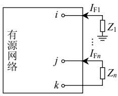  
(a) 端口附加阻抗时

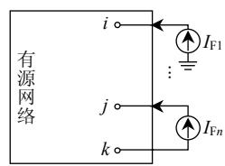  
(b) 用等值电流源代替时  
图2补偿法基本原理图  
Fig. 2 Basic principle of compensation method

图2(a)中的 $Z_{1}, Z_{2}, \dots, Z_{n}$ 为端口连接的附加阻抗。根据替代定理，在已知流经阻抗的电流的情况下，端口阻抗的变化量可以用该电流源代替，即可等效为图2(b)。

端口电压计算方法如下：

1）从端口向网络内部看，要满足

$$
\boldsymbol {U} _ {\mathrm {F}} = \boldsymbol {U} _ {\mathrm {F}} ^ {0} + \boldsymbol {Z} _ {\mathrm {T}} \boldsymbol {I} _ {\mathrm {F}} \tag {1}
$$

式中： $U_{\mathrm{F}}$ 为端口电压向量； $U_{\mathrm{F}}^{0}$ 为端口开路电压向量； $Z_{\mathrm{T}}$ 为端口开路时的端口等值阻抗矩阵； $I_{\mathrm{F}}$ 为端口注入的电流向量。

2）反之，如果已经知道端口电压向量 $U_{\mathrm{F}}$ 和端口注入的电流矢量 $I_{\mathrm{F}}$ ，那么可以推导出端口开路电压矢量 $U_{\mathrm{F}}^{0}$ 的计算公式。

$$
\boldsymbol {U} _ {\mathrm {F}} ^ {0} = \boldsymbol {U} _ {\mathrm {F}} - \boldsymbol {Z} _ {\mathrm {T}} \boldsymbol {I} _ {\mathrm {F}} \tag {2}
$$

# 2.2 电磁暂态计算与机电暂态稳定计算的交互过程

根据2.1节中的补偿法基本原理可以设计出以下电磁暂态计算与机电暂态稳定计算的交互过程：

1）初始化或计算过程中机电暂态网络发生变化时，在原网络的正、负、零3序节点导纳阵中删

除参与电磁暂态仿真的系统对导纳阵的贡献，即相当于从原系统中删除了参与电磁暂态仿真的局部系统，从而构成一个新的机电暂态仿真系统。

2）对机电暂态仿真新系统在电磁暂态仿真网络端口上进行等值处理，计算出相应的端口等值阻抗矩阵 $Z_{\mathrm{T}}$ 。

首先，计算各个端口注入单位电流时各个节点的电压。

$$
\left\{ \begin{array}{c} \boldsymbol {U} _ {1} = \left[ u _ {1, 1} \quad u _ {1, 2} \quad u _ {1, 3} \quad \dots \quad u _ {1, n - 1} \quad u _ {1, n} \right] \\ \boldsymbol {U} _ {2} = \left[ u _ {2, 1} \quad u _ {2, 2} \quad u _ {2, 3} \quad \dots \quad u _ {2, n - 1} \quad u _ {2, n} \right] \\ \vdots \\ \boldsymbol {U} _ {m} = \left[ u _ {m, 1} \quad u _ {m, 2} \quad u _ {m, 3} \quad \dots \quad u _ {m, n - 1} \quad u _ {m, n} \right] \end{array} \right. \tag {3}
$$

式中： $m$ 为直流端口数； $n$ 为总的节点数。

然后，形成电磁暂态网络端口之间的阻抗矩阵，其中自阻抗对应本端口注入单位电流时的本节点的电压，互阻抗对应本端口注入单位电流时其它端口节点的电压。

$$
\boldsymbol {Z} _ {\mathrm {T}} = \left[ \begin{array}{c c c c} Z _ {1, 1} & Z _ {1, 2} & \dots & Z _ {1, m} \\ Z _ {2, 1} & Z _ {2, 2} & \dots & Z _ {2, m} \\ & & \vdots \\ Z _ {m, 1} & Z _ {m, 2} & \dots & Z _ {m, m} \end{array} \right] \tag {4}
$$

3）每一步都计算电磁暂态网路端口的等值电压，即电磁暂态网络端口的开路电压。

首先，从全网的节点电压中抽出电磁暂态网络的端口电压。

$$
\boldsymbol {U} _ {\mathrm {F}} = \left[ \begin{array}{l l l l l} u _ {1} & u _ {2} & u _ {3} & \dots & u _ {m} \end{array} \right] ^ {\mathrm {T}} \tag {5}
$$

然后，根据上一次迭代计算出的电磁暂态网路的注入系统的电流 $I_{\mathrm{F}}$ ，由补偿法原理式(2)，反推出本次迭代的戴维南等值电压。

$$
\boldsymbol {U} _ {\mathrm {F}} ^ {0} = \boldsymbol {U} _ {\mathrm {F}} - \boldsymbol {Z} _ {\mathrm {T}} \boldsymbol {I} _ {\mathrm {F}} ^ {\prime} \tag {6}
$$

4）得到开路电压 $U_{\mathrm{F}}^{0}$ 和端口等值阻抗阵 $\mathbf{Z}_{\mathrm{T}}$ 后，将其作为戴维南等值电路参数传递给电磁暂态网络；电磁暂态网络进行电磁暂态仿真计算，计算出新的电磁暂态端口注入系统的电流 $I_{\mathrm{F}}$ ，进入下一次网络求解迭代计算。  
5）在计算过程中的每一步，根据电磁暂态网路注入系统的电流 $I_{\mathrm{F}}$ ，应用补偿法计算式(1)计算并修正全网的节点电压。

# 2.3 3序等值电路到三相电路的转换

因为电磁暂态计算过程是针对 abc 三相瞬时值网络进行求解，因此在得到机电暂态网络的正、负、零 3 序诺顿等值电路形式后，需要把基于正、负、

零3序的诺顿等值导纳和等值电流源转换为基于abc三相的瞬时值模型，最后并入电磁暂态方程中求解。

如果考虑电磁暂态子系统返回的3序等值电流，那么接口处的3序网络方程式为

$$
\boldsymbol {Y} _ {\mathrm {e q}} ^ {(1, 2, 0)} \boldsymbol {U} ^ {(1, 2, 0)} = \boldsymbol {I} _ {\mathrm {e q}} ^ {(1, 2, 0)} + \boldsymbol {I} _ {\mathrm {e m t}} ^ {(1, 2, 0)} \tag {7}
$$

若端口有 $m$ 个，则：1） $Y_{\mathrm{eq}}^{(1,2,0)}$ 为正、负、零3序诺顿等值导纳阵，矩阵阶数为 $(3m) \times (3m)$ 阶；2） $U^{(1,2,0)}$ 为 $3m$ 阶的正、负、零3序接口处母线电压向量；3） $I_{\mathrm{eq}}^{(1,2,0)}$ 为 $3m$ 阶的正、负、零3序诺顿等值电流向量；4） $I_{\mathrm{emt}}^{(1,2,0)}$ 为 $3m$ 阶电磁暂态子系统对应的正、负、零3序等值电流向量(将电磁暂态子系统看成诺顿等值电路的负荷)。

定义变换矩阵为

$$
\boldsymbol {s} = \left[ \begin{array}{l l l} 1 & 1 & 1 \\ a ^ {2} & a & 1 \\ a & a ^ {2} & 1 \end{array} \right], \quad a = \mathrm {e} ^ {\mathrm {j} 1 2 0 ^ {\circ}} = - 0. 5 + \mathrm {j} \frac {\sqrt {3}}{2} \tag {8}
$$

如果接口母线有 $m$ 个，定义分块对角阵 $\mathbf{S}$ 及其逆阵 $\mathbf{S}^{-1}$ 为

$$
\left\{ \begin{array}{l} \boldsymbol {S} = \left[ \begin{array}{c c c c} s & \mathbf {0} & \mathbf {0} & \mathbf {0} \\ \mathbf {0} & s & \mathbf {0} & \mathbf {0} \\ \vdots & \vdots & \ddots & \vdots \\ \mathbf {0} & \mathbf {0} & \mathbf {0} & s \end{array} \right] \\ \boldsymbol {S} ^ {- 1} = \left[ \begin{array}{c c c c} s ^ {- 1} & \mathbf {0} & \mathbf {0} & \mathbf {0} \\ \mathbf {0} & s ^ {- 1} & \mathbf {0} & \mathbf {0} \\ \vdots & \vdots & \ddots & \vdots \\ \mathbf {0} & \mathbf {0} & \mathbf {0} & s ^ {- 1} \end{array} \right] \end{array} \right. \tag {9}
$$

式中 $S$ 及其逆阵为 $3m$ 阶。

式(7)左乘 $\pmb{S}$ 得到

$$
\boldsymbol {S} \boldsymbol {Y} _ {\mathrm {e q}} ^ {(1, 2, 0)} \boldsymbol {U} ^ {(1, 2, 0)} = \boldsymbol {S} \boldsymbol {I} _ {\mathrm {e q}} ^ {(1, 2, 0)} + \boldsymbol {S} \boldsymbol {I} _ {\mathrm {e m t}} ^ {(1, 2, 0)}
$$

即为

$$
\left(\boldsymbol {S} \boldsymbol {Y} _ {\mathrm {e q}} ^ {(1, 2, 0)} \boldsymbol {S} ^ {- 1}\right) \boldsymbol {U} ^ {(\mathrm {a}, \mathrm {b}, \mathrm {c})} = \boldsymbol {S} \boldsymbol {I} _ {\mathrm {e q}} ^ {(1, 2, 0)} + \boldsymbol {S} \boldsymbol {I} _ {\mathrm {e m t}} ^ {(1, 2, 0)}
$$

可得

$$
\boldsymbol {Y} _ {\mathrm {e q}} ^ {(\mathrm {a}, \mathrm {b}, \mathrm {c})} \boldsymbol {U} ^ {(\mathrm {a}, \mathrm {b}, \mathrm {c})} = \boldsymbol {I} _ {\mathrm {e q}} ^ {(\mathrm {a}, \mathrm {b}, \mathrm {c})} + \boldsymbol {I} _ {\mathrm {e m t}} ^ {(\mathrm {a}, \mathrm {b}, \mathrm {c})} \tag {10}
$$

这样就将接口处的正、负、零3序诺顿等值电路转换为abc三相瞬时值的诺顿等值电路形式，其中：

1）abc三相形式的诺顿等值电流向量为

$$
\boldsymbol {I} _ {\mathrm {e q}} ^ {(\mathrm {a}, \mathrm {b}, \mathrm {c})} = \boldsymbol {S I} _ {\mathrm {e q}} ^ {(1, 2, 0)} \tag {11}
$$

2）abc三相形式的电磁暂态注入电流为

$$
\boldsymbol {I} _ {\text {e m t}} ^ {(a, b, c)} = \boldsymbol {S} \boldsymbol {I} _ {\text {e m t}} ^ {(1, 2, 0)} \tag {12}
$$

3）abc三相形式的诺顿等值导纳阵为

$$
\boldsymbol {Y} _ {\mathrm {e q}} ^ {(a, b, c)} = \boldsymbol {S} \boldsymbol {Y} _ {\mathrm {e q}} ^ {(1, 2, 0)} \boldsymbol {S} ^ {- 1} \tag {13}
$$

由于 $S$ 及其逆阵 $S^{-1}$ 为分块对角阵，因此在式(13)的计算过程中，可将 $(3m)\times (3m)$ 的矩阵乘法运算为 $m\times m$ 个 $3\times 3$ 的小矩阵的计算，如 $Y_{\mathrm{eq}}^{(\mathrm{a},\mathrm{b},\mathrm{c})}$ 中第 $i$ 行第 $j$ 列分块矩阵 $\mathbf{y}_{\mathrm{eqij}}^{(\mathrm{a,b,c})}$ 的值为

$$
\boldsymbol {y} _ {\text {e q i j}} ^ {(\mathrm {a}, \mathrm {b}, \mathrm {c})} = \boldsymbol {s y} _ {\text {e q i j}} ^ {(1, 2, 0)} \boldsymbol {s} ^ {- 1} \tag {14}
$$

式(14)的实际意义是：正、负、零3序诺顿等值导纳阵转换为abc三相诺顿等值导纳阵的过程中，abc三相导纳阵中单个元素的计算只与该元素的正、负、零3序导纳值有关，而与其它元素的正、负、零3序导纳值无关。这样就做到了计算过程中不同支路之间的解耦，大大提高了计算速度。

最后可得到多端口 abc 三相瞬时值形式的诺顿等值电路。

# 3 等值电路正序和负序参数不相等情况的处理

由于电网中旋转电机(同步发电机和动态负荷)存在，这些电机的正序和负序阻抗不相等，造成诺顿等值电路中正序和负序导纳不相等。 $y_{\mathrm{eqij}}^{(1,2,0)}$ 通过式(14)变换到abc三相导纳 $y_{\mathrm{eqij}}^{(\mathrm{a},\mathrm{b},\mathrm{c})}$ 后，出现了矩阵不对称的情况，在电磁暂态计算中，无法用简单的LRC电路来表示，即使不发生电网故障，稳态时都会出现很大的错误。以图3中的IEEE9节点测试系统来解释这种误差。

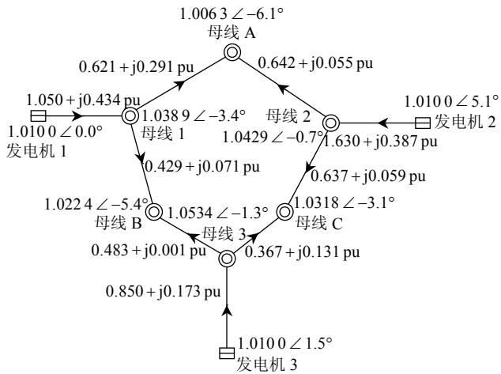  
图3 IEEE9节点测试系统  
Fig. 3 Testing system of IEEE 9

将图3中的线路“母线1—母线A”进行电磁暂态计算，正常运行状况下，在混合仿真处的正、负、零3序诺顿等值参数为

$$
\boldsymbol {Y} _ {\mathrm {c q}} ^ {(1, 2, 0)} = \left[ \begin{array}{l l l} 0. 9 3 3 - \mathrm {j} 1 1. 3 2 2 & & \\ & 0. 9 3 1 - \mathrm {j} 1 2. 0 6 & \\ & & 0. 9 9 5 - \mathrm {j} 2 0. 8 2 5 \\ - 0. 0 9 0 + \mathrm {j} 0. 5 3 2 & & \\ & - 0. 0 9 1 + \mathrm {j} 0. 5 3 & \\ & & - 0. 0 5 + \mathrm {j} 0. 1 7 2 \end{array} \right]
$$

式中：第1、4列为正序参数；第2、5列为负序参数；第3、6列为零序参数。其中正序和负序之间的差距很小(最大差距为 $0.002 - \mathrm{j}0.738\mathrm{pu}$ )。但是如果不对等值电路中正序和负序参数不相等情况进行处理，将引起很大的错误。表2是不做任何处理时，PSD潮流程序计算出的有功和无功功率与混合仿真稳态计算结果的对比。

表 2 IEEE 9 节点系统不进行处理时的稳态结果  
Tab. 2 Steady-state results without dealing with the difference between positive and negative sequence parameters   

<table><tr><td rowspan="2">计算结果</td><td colspan="2">母线1处线路</td><td colspan="2">母线A处线路</td></tr><tr><td>有功功率/MW</td><td>无功功率/Mvar</td><td>有功功率/MW</td><td>无功功率/Mvar</td></tr><tr><td>PSD潮流程序计算</td><td>62.10</td><td>29.10</td><td>-61.60</td><td>-34.40</td></tr><tr><td>电磁暂态计算</td><td>50.27</td><td>40.24</td><td>-49.79</td><td>-44.18</td></tr></table>

对于这种不对称的电路形式，可以通过在计算中采用受控电压源和电流源的技术来求解，但计算复杂，编程实现也比较困难；也可以采取将负序取值强制与正序值的相等的近似方法，但这种方法在仿真过程中具有较大的误差。

本文提出一种简单易行的近似算法——基波负序电流补偿法，来解决等值系统中负序参数和正序参数不相等的问题。

先考察支路 $i - j$ 的电流方程式，其负序电流可表示为

$$
i _ {i j} ^ {(2)} = y _ {\text {e q i j}} ^ {(2)} \left(u _ {i} ^ {(2)} - u _ {j} ^ {(2)}\right) = y _ {\text {e q i j}} ^ {(1)} \left(u _ {i} ^ {(2)} - u _ {j} ^ {(2)}\right) + \Delta i _ {\text {d i f f - i j}} ^ {(2)} \tag {15}
$$

式中： $y_{\mathrm{eqij}}^{(1)}$ 、 $y_{\mathrm{eqij}}^{(2)}$ 、 $y_{\mathrm{eqij}}^{(0)}$ 为支路 $i-j$ 的正、负、零3序导纳； $u_i^{(2)}$ 、 $u_j^{(2)}$ 为节点 $i$ 和节点 $j$ 的负序电压； $i_{ij}^{(2)}$ 为流过支路 $i-j$ 的负序电流； $\Delta i_{\mathrm{diff-ij}}^{(2)}$ 为改变负序导纳后的基波负序补偿电流，其计算方法为

$$
\Delta i _ {\text {d i f f -} i j} ^ {(2)} = \left(y _ {\text {e q} i j} ^ {(2)} - y _ {\text {e q} i j} ^ {(1)}\right) \left(u _ {i} ^ {(2)} - u _ {j} ^ {(2)}\right) \tag {16}
$$

通过上述推导，支路 $i - j$ 的负序导纳用正序导纳强制代替，产生的误差用一个基波负序电流源来弥补，这样支路 $i - j$ 完全可以满足正序和负序相等的要求。其等值电路可做图4所示的变换。

基波负序电流补偿法具有以下特点：

1）实际计算过程中，若非发生不对称故障，电网基本都是对称的，基波负序和零序的诺顿等值

$$
\begin{array}{r l} - 0. 0 9 0 + \mathrm {j} 0. 5 3 2 & - 0. 0 9 1 + \mathrm {j} 0. 5 3 \\ 1. 8 5 8 - \mathrm {j} 4. 0 9 8 & 1. 8 6 5 - \mathrm {j} 4. 1 6 3 \\ & 2. 0 0 2 - \mathrm {j} 5. 0 5 9 \end{array} \Bigg ] \text {p u}
$$

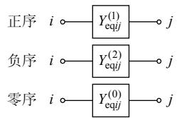  
(a) 原支路的3序导纳

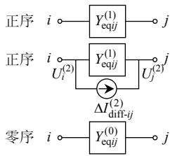  
(b) 修改后支路的3序导纳  
图4等值电路变换(处理负序和正序不相等的情况)  
Fig. 4 Equivalence circuit transformation (dealing with the difference between positive and negative sequence parameters)

电流基本为 0 , 该近似算法不会改变电网的基波正序参数, 在电网对称运行条件下是正确的;

2）如果发生了不对称故障或运行情况，为了避免迭代计算，采用上一个电磁暂态步长上的负序电压作为本步 $\Delta i_{\mathrm{diff - ij}}^{(2)}$ 的计算，会产生一个电磁暂态步长上的误差，但是因为在诺顿等值电路中，一般基波负序和正序的差异不是非常大， $\Delta y_{\mathrm{diff - ij}}^{(2)}$ 比较小，而且电磁暂态计算步长非常小，因此误差在可以接受的范围内；  
3）该近似算法没有考虑谐波的影响，因此在波形严重畸变的条件下有一些误差，但是因为该等值电路变换属于诺顿等值系统的一部分，离基波电流源非常近，因此流过该电路的波形基本没有畸变，谐波含量很小；  
4）实际计算表明了该近似算法的计算速度快、编程简单、误差在可接受的范围内。

对图3所示的IEEE9算例系统采用该近似算法处理后，其稳态计算结果如表3所示，该算法的稳态计算结果很好。

表 3 IEEE 9 节点系统处理后的稳态结果  
Tab. 3 Steady-state results of IEEE 9 after transformation   

<table><tr><td rowspan="2">计算结果</td><td colspan="2">母线1处线路</td><td colspan="2">母线A处线路</td></tr><tr><td>有功功率/MW</td><td>无功功率/Mvar</td><td>有功功率/MW</td><td>无功功率/Mvar</td></tr><tr><td>PSD潮流程序计算</td><td>62.10</td><td>29.10</td><td>-61.60</td><td>-34.40</td></tr><tr><td>混合仿真计算</td><td>62.09</td><td>29.14</td><td>-61.62</td><td>-34.44</td></tr></table>

母线 1 的 a 相母线发生金属性非永久性短路，考察线路两端的有功和无功功率，PSD 机电暂态稳定程序、混合仿真以及 PSCAD 电磁暂态计算结果对比如图 5、6 所示。

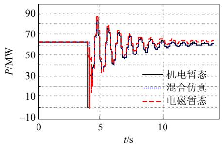

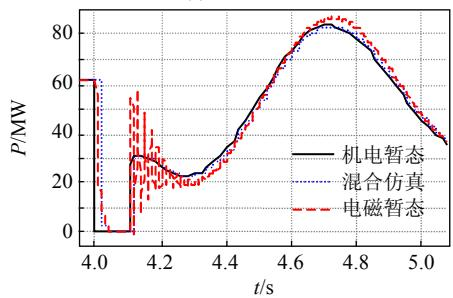  
(a) 线路有功功率   
(b) 图(a)的局部放大  
图5 线路“母线1—母线A”的有功功率

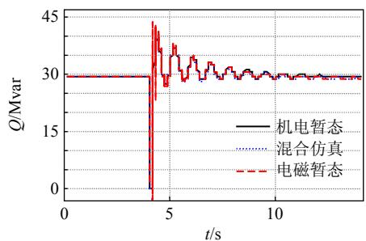  
Fig. 5 Active power from bus 1 to bus A

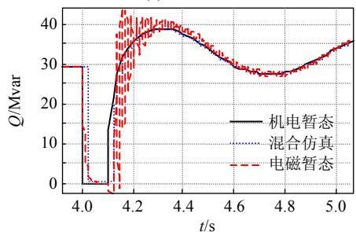  
(a) 线路无功功率   
(b) 图(a)的局部放大  
图6 线路“母线1—母线A”的无功功率  
Fig. 6 Reactive power from bus 1 to bus A

以上结果表明，基波负序电流补偿法处理等值电路正序和负序不相等的情况具有较好的效果。

# 4 机电暂态网络对电磁暂态系统仿真结果的考虑

由于电磁暂态子程序仿真结果是详细系统元件电压、电流的三相瞬时值，而外部交流系统是基于基波、正序、单相、相量的模型，因此需要把电磁暂态子程序仿真得到的接口母线电压、电流瞬时值等转化为基波相量值。

常用的方法有离散傅里叶变换和最小二乘曲线拟合法。离散傅里叶变换求取电压、电流信号的基波正序分量需要获得整周波数据，而最小二乘曲线拟合方法只需要半个周波长度的数据量，并使用接口母线的瞬时频率作为电压、电流信号的频率进行曲线拟合。因此，在系统频率偏移的情况下，相对于离散傅里叶变换法，应用最小二乘曲线拟合法可以提高机电暂态-电磁暂态混合仿真的精度。

电磁暂态子系统中将机电暂态子系统等值为基波负荷或基波电流源。在故障过程中，尤其是在接口处金属性三相短路的条件下，电压为0，因此基波功率必然为0。然而此刻，电磁暂态子系统仍然有基波电流注入到机电暂态子系统，零值的基波功率和零值的基波电压使得基波电流无法准确得到，因此，本文认为应该直接求取基波正、负、零3序电流，而不是采用通常由基波功率来求取的方法。

由于机电暂态系统相对于电磁暂态系统而言属于慢变系统，因此可以采用在一个机电暂态仿真步长内的基波恒电流作为等效电磁暂态子系统来进行机电暂态子程序仿真计算。

可见，使用最小二乘曲线拟合法求取电磁暂态子系统基波电流，在一个机电暂态仿真步长内该基波电流保持恒定，忽略接口母线电压和注入网络电流的各次谐波分量，示意参见图7。

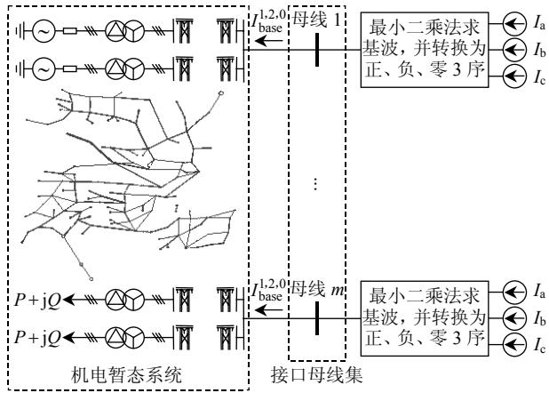  
图7 基波正、负、零3序电流注入机电暂态系统示意图  
Fig. 7 Diagram of three-sequence injection current to electromechanical transient network

# 5 实际电网的混合仿真计算

基于本文提出的机电暂态- 电磁暂态混合仿真算法对2015年的川电特高压直流送出方案进行混合仿真分析。2015年，四川电网向家坝和溪落渡大型水电工程将向家坝—上海、溪洛渡—浙西和溪洛渡—湖南这3回超/特高压直流送出工程建成，如

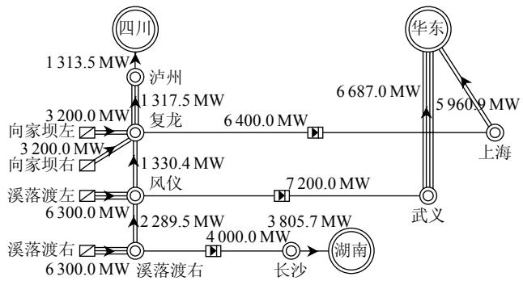  
图8所示，下文采用混合仿真算法对该3回直流进行详细建模。  
图8 2015年川电送出示意图  
Fig. 8 HVDC systems in Sichuan power grid in 2015

0s时刻，向上直流整流侧复龙站附近发生三相短路故障，0.1s切除复龙—泸州I线时发生a相开关单相拒动，0.34s该线的后备保护切除故障线路，并在0.4s切除复龙—凤仪I线，仿真结果如图9所示。

以上仿真结果表明，在交流系统发生不对称故障情况下，混合仿真的结果基本符合直流系统在交流系统不对称情况下的响应。

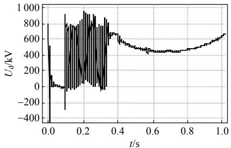

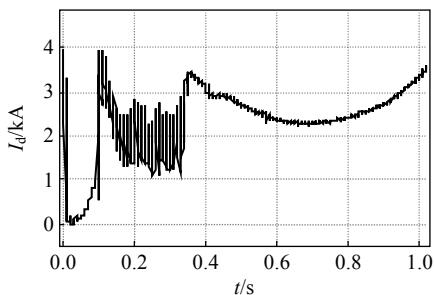  
(a) 直流电压

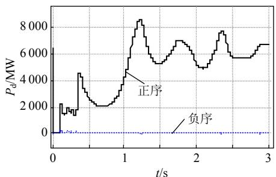  
(b) 直流电流  
(c) 直流功率

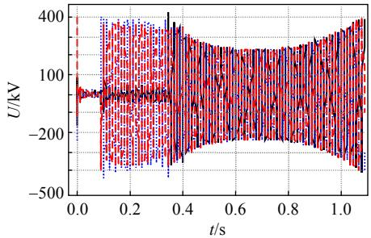  
(d) abc三相交流电压a相； b相；   
图9仿真结果  
Fig. 9 Simulation results

# 6 结论

本文提出了一套机电暂态-电磁暂态混合仿真方案：

1）对于中国现有的和正在规划建设中的直流输电系统，与直流相连的都是强联系交流系统，有效短路比大于5，接口选取在直流换流母线处，这种接口方式电磁暂态网络小、计算速度快；  
2）机电暂态子系统对电磁暂态子系统的等效采用正、负、零3序诺顿等值，并采用补偿法基本原理设计出电磁暂态部分与机电暂态稳定程序的计算交互过程；  
3）机电暂态网络对电磁暂态系统仿真结果的考虑，采用最小二乘法求取基波三序电流，并注入机电暂态网络中来求解；  
4）针对等值电路正序和负序参数不相等情况，提出近似算法——基波负序电流补偿法，该方法计算速度快、编程简单、误差在可接受的范围内。

该混合仿真方案立足于中国电网的实际情况，适用于接口附近发生电网对称和不对称故障情况的机电暂态-电磁暂态的混合仿真，并经过了大型电网仿真的检验，仿真计算结果表明了该套仿真方案的有效性和可行性。

# 参考文献

[1] Hefernan M D, Tunrer K S, Arrillaga J, et al. Computation of AC-DC system disturbances, parts I: interactive coordination of generator and converter transient models[J]. IEEE Trans. on Power Apparatus and Systems, 1981, PAS-100(11): 4341-4348.   
[2] Tuner K S, Hefernan M D, Arnold C P, et al. Computation of AC-DC system disturbances, parts II: derivation of power frequency variables from converter transient response[J]. IEEE Trans. on Power Apparatus and Systems, 1981, PAS-100(11): 4349-4355.   
[3] Tuner K S, Hefernan M D, Arnold C P, et al. Computation of AC-DC system disturbances, parts III: transient stability assessment[J]. IEEE Trans. on Power Apparatus and Systems, 1981, PAS-100(11): 4356-4363.

[4] Reeve J, Adapa K. A new approach to dynamic analysis of AC networks incorporating detailed modeling of DC systems, part I: principles and implementation[J]. IEEE Trans. on Power Delivery, 1988, 3(4): 2005-2011.   
[5] Reeve J, Adapa K. A new approach to dynamic analysis of AC networks incorporating detailed modeling of DC systems, part II: application to interaction of DC and weak AC systems[J]. IEEE Trans. on Power Delivery, 1988, 3(4): 2012-2019.   
[6] Anderson G W J, Watson N R. A new hybrid algorithm for analysis of HVDC and FACTS systems[J]. IEEE Energy Management and Power Delivery, 1995, 2(21-23): 462-467.   
[7] Woodford D A, Validation of digital simulation of DC links[J]. IEEE Transactions on Power Apparatus and Systems, 1985, 104(9): 2588-2596.   
[8] Sultan M, Reeve J, Adapa R. Combined transient and dynamic analysis of HVDC and FACTS systems[J]. IEEE Trans. on Power Delivery, 1998, 13(4): 1271-1277.   
[9] Jalili-Marandi V, Dinavahi V. Interfacing techniques for transient stability and electromagnetic transient programs[J]. IEEE Trans. on Power Delivery, 2009, 24(4): 2385-2395.   
[10] 岳程燕，田芳，周孝信，等．大规模交直流系统全暂态数字仿真研究报告之2：算法、模型和对比分析[R].北京：中国电力科学研究院，2005. Yue Chengyan，Tian Fang，Zhou Xiaoxin，et al．Research report of large-scale AC/DC power system transient digital simulation，part II: algorithm，model and comparison[R].Beijing：China Electric Power Research Institute，2005(in Chinese).  
[11] 岳程燕，田芳，周孝信，等．电力系统电磁暂态-机电暂态混合仿真接口原理[J].电网技术，2006，30(1)：23-27. Yue Chengyan, Tian Fang, Zhou Xiaoxin, et al. Principle of interfaces for hybrid simulation of power system electromagneticelectromechanical transient process[J]. Power System Technology, 2006, 30(1): 23-27(in Chinese).   
[12] 岳程燕，田芳，周孝信，等．电力系统电磁暂态-机电暂态混合仿真的应用[J].电网技术，2006，30(11)：1-5. Yue Chengyan，Tian Fang，Zhou Xiaoxin，etal. Application of interfaces for hybrid simulation of power system electromagneticielectromechanical transient process[J].Power System Technology, 2006，30(11):1-5(in Chinese).  
[13] 岳程燕，田芳，周孝信，等．电力系统电磁暂态-机电暂态混合仿真接口实现[J]. 电网技术，2006，33(4)：6-10. Yue Chengyan，Tian Fang，Zhou Xiaoxin，et al. Implementation of interfaces for hybrid simulation of power system electromagnetic-electromechanical transient process[J]. Power System Technology, 2006，33(4):6-10(in Chinese).   
[14] 刘皓明，朱浩骏，严正，等．含统一潮流控制器装置的电力系统动态混合仿真接口算法研究[J].中国电机工程学报，2005，25(16)：1-7. Liu Haoming，Zhu Haojun，Yan Zheng，et al．Study on interface algorithm for power system transient stability hybrid model simulation with UPFC device[J].Proceedings of the CSEE，2005，25(16):1-7(in Chinese).  
[15] 王栋，童陆园，洪潮．数字计算机机电暂态与RTDS电磁暂态混合实时仿真系统[J].电网技术，2008，32(6)：42-46.WangDong，TongLuyuan，HongChao．Digitalcomputer

electromechanical transient and RTDS electromagnetic transient hybrid real-time simulation system[J]. Power System Technology, 2008, 32(6): 42-46(in Chinese).   
[16] 王路，李兴源，罗凯明，等．关于电力系统电磁与机电暂态混合仿真的研究[J]. 电网技术，2005，29(15)：23-27. Wang Lu, Li Xingyuan, Luo Kaiming, et al. Study on multirate hybrid simulation technology for AC/DC power system[J]. Power System Technology, 2005, 29(15): 23-27(in Chinese).  
[17] 柳勇军，梁旭，闵勇，等．电力系统混合仿真的接口算法[J].电力系统自动化，2006，30(11)：44-48. Liu Yongjun, Liang Xu, Min Yong, et al. Interface algorithm in power system electromechanical transient and electromagnetic transient hybrid simulation[J]. Automation of Electric Power Systems, 2006, 30(11): 44-48(in Chinese).   
[18] 宋强，刘文华，范子超．大功率电力电子装置的混合实时仿真[J].清华大学学报：自然科学版，2008，48(7)：1069-1072. Song Qiang, Liu Wenhua, Fan Zichao. Real-time hybrid simulation for high power electronic system[J]. Journal of Tsinghua University: Science and Technology, 2008, 48(7): 1069-1072(in Chinese).  
[19] 贺洋，李兴源．关于电力系统电磁与机电暂态混合仿真的研究[J].现代电力，2008，25(5)：20-24. He Yang，Li Xingyuan. Hybrid simulation of power system based on electromagnetic and electromechanical transient simulation[J]. Modern Electric Power，2008，25(5)：20-24(in Chinese).  
[20] 于庆广，胥填伦．大功率电力电子装置的混合实时仿真[J].中国电力，2007，40(11)：38-41. Yu Qingguang，Xu Zhilun．Electromagnetic-electromechanical transient hybrid simulation in power system[J].Electric Power,2007,40(11):38-41(in Chinese).  
[21] 刘文焯，汤涌，万磊，等．大电网特高压直流系统建模与仿真技术[J]. 电网技术，2008，32(22)：1-3，7. Liu Wenzhuo，Tang Yong，Wan Lei，et al. Modeling and simulation technologies for large UHVDC power grid[J]. Power System Technology，2008，32(22)：1-3，7(in Chinese).  
[22] 刘文焯，郭小江，张键，等．大规模交直流系统全暂态数字仿真研究报告之1：电磁暂态计算程序PSModel技术报告[R].北京：中国电力科学研究院，2005. Liu Wenzhuo，Guo Xiaojiang，Zhang Jian，et al，Research report of large-scale AC/DC power system transient digital simulation，part I: technical report of electromagnetic transient simulation program—PSMODEL[R].Beijing：China Electric Power Research Institute, 2005(in Chinese).

  
刘文焯

收稿日期：2010-02-01。

作者简介：

刘文焯(1972—)，男，硕士，高级工程师，长期从事电力系统仿真与分析技术研究及软件开发工作，liuwzh@epri.sgcc.com.cn;

侯俊贤(1978—)，男，硕士，高级工程师，长期从事电力系统仿真与分析技术研究及软件开发工作；

汤涌(1959—)，男，博士，教授级高级工程师，博士生导师，主要从事电力系统仿真与分析技术的研究。

(责任编辑 谷子)