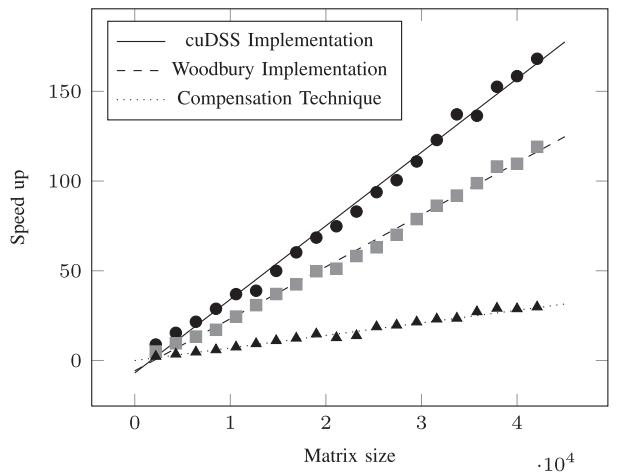
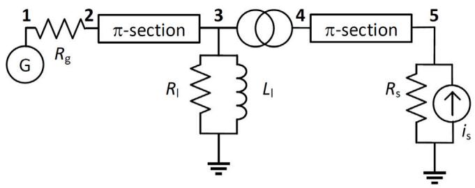
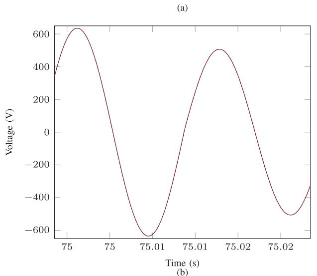
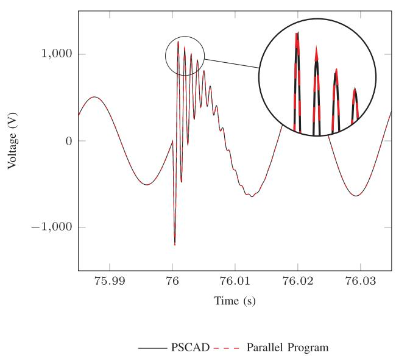

# Accelerating electromagnetic transient simulations using graphical processing units✩,✩✩,★

Devin Aluthge a , Ian Jeffrey a , Shaahin Filizadeh a ,∗, Dharshana Muthumuni b

a University of Manitoba, Winnipeg, MB, Canada   
b Manitoba Hydro International, Winnipeg, MB, Canada

# A R T I C L E I N F O

Keywords:

EMT simulations

GPUs

Large systems

cuDSS

# A B S T R A C T

This paper explores and evaluates various approaches to accelerate Electromagnetic Transient (EMT) simulations of power systems using Graphical Processing Units (GPUs). Existing EMT simulation methods face computational challenges in systems with extensive renewable energy sources due to the complexity and switching dynamics of the system. The paper focuses on simulation methods based upon specialized GPU solvers to handle simulations of large and complicated power systems (e.g., with extensive switching components) with computational efficiency. Results from benchmark systems show significant speedups, particularly for large networks with high-frequency switching events.

# 1. Introduction

Electromagnetic Transient (EMT) simulators are necessary tools to model modern power systems [1], due to their accuracy in representing fast transients. The escalating adoption of inverter-based resources (IBRs) has resulted in significant presence of power-electronic converters leading to the erosion of system inertia and the need for EMT modeling and simulations of uncommonly large networks; this has exposed crippling computational limitations of current EMT solvers. Substantial efforts are underway to develop new algorithms, solution methods, and platforms to enable EMT simulation of exceedingly large and complex networks [2–4].

In EMT simulations node voltages are calculated using current injections as inputs to network equations. Normally these are done in sequence, resulting in computational inefficiencies. Various factorization methods, e.g., the KLU method (particularly suited for large networks) [5,6], are used to solve network equations efficiently. Sequential solutions, which have inherent computational deficiencies, can be avoided by using parallel computing. Although distributed parallel computing scales well, its communication overhead, required at each time step, drastically slows the simulation [2]. The distributed parallel model created in [2] has an exponential increment in the communication time as the number of sub-networks increases, which effectively

nullifies any reduction in calculation time due to smaller sub-networks; the computational burden of EMT simulations is impacted by both the network size and complexity [3].

A shared-memory implementation of the network solution is presented in [7]; a recent study [8] introduces a parallel-in-time equation (re-)grouping technique for CPU-based parallelization with KLU factorization. Since load balancing is needed if the (re-)grouping blocks are more than the number of processors [7], an inefficient hardware scaling of shared memory implementation will occur. Otherwise, this approach might be sub-optimal when modeling practical power systems.

Perhaps the most promising approach to accelerating network simulation is the use of graphics processing units (GPUs). Specifically, the sizes of networks encountered in practice (even large networks), combined with the ability to implement the entire network solution on the GPU (eliminating communication between the host CPU and the device GPU), make GPUs well-suited to the application. While the work presented in [9] addresses basic acceleration using GPUs, it does not develop a fully-fledged GPU-based EMT solver. The authors of [10] present timing and speedup gains, using GPUs, but do not address how classical network equations can be solved efficiently, nor do they compare results to existing serial algorithms, e.g., KLU [5]. Primitive techniques, such as pre-inverting the admittance matrix [4], may enhance the simulation (serial or GPU implementation), however,

switching devices, which are exceedingly common and abundant in modern power systems, pose significant challenges to such methods as the matrix needs to be altered frequently. The GPU-based pre-inversion of the matrix is shown in [4] although no comparison of KLU with direct sparse techniques is given.

This paper delves into GPU-based computations for EMT solutions, and compares the performance of several GPU and CPU-based solution methods with the aim to determine the most suited algorithm for GPU-based solution large systems. The overall goal is to present an efficient EMT simulator that runs entirely on the GPU. Section 2 discusses several existing solution methods, e.g., KLU factorization, Cholesky decomposition [11], the Woodbury implementation [12], and the compensation method. Their potential for solving large networks are discussed in Section 3. Section 4 discusses the GPU-based solver developed and shows a number of examples.

# 2. Existing methods of solving network equations

EMT simulations involve solving for node voltages, ??(??), in (1), where ?? (??) is the network’s admittance matrix and ??(??) is the vector of current injections to the nodes from dynamic devices and history current terms in the companion models of network elements [1].

$$
\boldsymbol {Y} (t) \boldsymbol {v} (t) = \boldsymbol {i} (t) \tag {1}
$$

The solution proceeds on a discretized time axis, and involves factorization (or inversion) of ?? (??). For networks whose admittance matrix does not change, one may factor (or invert) ?? (??) and use it throughout the simulation. Frequent changes in the network arising from faults, and more commonly from switching power electronic converters, require repetitive re-factorizations of ?? (??), which rapidly becomes computationally taxing, especially in large and sophisticated networks. With the expansion of IBRs and diminishing system inertia, the solution of large networks with significant high-frequency switching converters has become a crippling challenge for existing EMT solvers.

Since the companion circuit theory [1] converts all elements to current sources and resistors, ?? (??) becomes a real-valued matrix. In the remaining Sections of this paper, the time dependence of ?? is suppressed for brevity.

EMT equations are commonly solved using numerical methods such as LU factorization. Furthermore, techniques such as Cholesky decomposition and LDL can be used to handle matrices with symmetry. These techniques are briefly reviewed next.

# 2.1. KLU factorization

The LU decomposition method [13] is commonly used to solve (1); however, it is advantageous to use the KLU method [5] for factorization of large admittance matrices. Here the matrix is permuted to result in a block triangular form. The approximate minimum degree method and nested dissection [5] are used to minimize filling. As per [5,14], the KLU factorization method improves computational performance; KLU factorization and its improved variations are used in EMT simulators [6, 15] for circuits with a large number of nodes. KLU factorization is used as a benchmark CPU-based algorithm in this paper.

# 2.2. Cholesky decomposition

While in many EMT models the admittance matrix is not symmetric, a network comprising of typical power system devices will result in a symmetric admittance matrix. Taking symmetry into account, the Cholesky factorization [16] offers performance benefits, as it can be applied to symmetric positive definite (SPD) matrices. The Cholesky factorization is currently used in EMT solvers, e.g., [17].

Improvements come from representing the SPD matrix factorization in terms of a single lower triangular matrix ?? such that $Y = L L ^ { T }$ , ideally reducing time and memory requirements by half. KLU supports Cholesky decompositions [5] through the CHOLMOD library [18].

# 2.3. The Woodbury formula

The Woodbury formula [12] accounts for modifications to the ?? matrix without inverting (or solving) the entire matrix when there is a change in the network. Assuming that ?? entries in the admittance matrix change, the Woodbury formula can be stated as follows.

$$
\left(\boldsymbol {Y} + \boldsymbol {U} \boldsymbol {V} ^ {T}\right) ^ {- 1} = \tag {2}
$$

$$
Y ^ {- 1} - Y ^ {- 1} U (I + V ^ {T} Y ^ {- 1} U) ^ {- 1} V ^ {T} Y ^ {- 1}
$$

where

• ?? is the original ?? × ?? admittance matrix,   
• ?? is an ?? × ?? matrix,   
• ?? is a ?? × ?? identity matrix,   
• ?? is a ?? × ?? matrix.

The product $U V ^ { T }$ is an ?? × ?? matrix of rank at most ??, which represents the changes of the admittance matrix. The columns of ?? correspond to the modified rows and the columns of ?? correspond to the modified columns. For example if a 5 × 5 admittance matrix has three changes at (3, 4), (2, 2) and (4, 1), ?? and ?? are be defined as:

$$
\boldsymbol {U} = \left[ \begin{array}{c c c} 0 & 0 & 0 \\ 0 & 1 & 0 \\ 1 & 0 & 0 \\ 0 & 0 & 1 \\ 0 & 0 & 0 \end{array} \right], \quad \boldsymbol {V} = \left[ \begin{array}{c c c} 0 & 0 & \Delta_ {3} \\ 0 & \Delta_ {2} & 0 \\ 0 & 0 & 0 \\ \Delta_ {1} & 0 & 0 \\ 0 & 0 & 0 \end{array} \right],
$$

where the ?? values are the numerical changes made to the matrix. When changes occur, the ?? × ?? matrix $( I + V ^ { T } Y ^ { - 1 } U )$ needs to be evaluated and inverted. Assuming the ?? × ?? matrix $\pmb { Y } ^ { - 1 } \pmb { U }$ has been precomputed and that ?? is sparse, the cost to construct the matrix is ??(????) and the cost to invert it is ??(??3) where ?? ≪ ??.

# 2.4. Compensation method

Unlike the previous numerical methods, which may be applied to any linear system of equations, the compensation method is a circuits solution technique. This method [19–21] was developed as a result of Kron’s Diakoptics as per [22]. The main idea of the algorithm is to solve a large network by partitioning it in to smaller pieces. Each sub-network may be solved in parallel with the rest, while other sub-networks are represented using Thevenin equivalents. The method allows network segmentation at arbitrary locations without relying on long transmission lines. Collecting all switching nodes of a large network into one block of the ?? matrix also allows for further computational advantage, by combining it with the Woodbury formula. The efficiency of the compensation method is evaluated in Section 3 together with the Woodbury formula and GPU implementation of network solution.

# 3. Performance of algorithms

With the goal of developing an efficient EMT simulator entirely on the GPU, this Section first explores various GPU-based methods for solving (1). CPU-based methods are also tested to establish a baseline for computational comparisons. For all tests, two ?? matrices were examined. The first matrix, with a size of 81 × 81, represents the IEEE 39-bus benchmark system [23]; note that transformers, generators, and ??-sections models of transmission lines increase the number of nodes to 81 per-phase. Simulations in Section 4.3 consider a three-phase representation of the system. The second matrix is 10 000 × 10 000 with all the properties of an actual admittance matrix but without stemming from a particular network.

CPU implementation methods (i) Eigen/Sparse [24], (ii) PARD-SIO [25], and (iii) various MATLAB solver approaches including the backslash operator [26] are considered first. Note that these solvers

Table 1 Timing of various solving algorithms.   

<table><tr><td>Algorithm name</td><td>Size of matrix</td><td>Timing (ms)</td></tr><tr><td>Eigen/Sparse library (CPU)</td><td>81 × 81</td><td>6</td></tr><tr><td>cusolverSpDcsrlsvchol (GPU)</td><td>81 × 81</td><td>1.2</td></tr><tr><td>MATLAB Backslash (CPU)</td><td>81 × 81</td><td>0.102</td></tr><tr><td>cuDSS solver (including symbolic factorization) (GPU)</td><td>81 × 81</td><td>0.089</td></tr><tr><td>cusolverSpDcsrlsvluHost (CPU)</td><td>81 × 81</td><td>0.088</td></tr><tr><td>cusolverSpDcsrlsvcholHost (CPU)</td><td>81 × 81</td><td>0.084</td></tr><tr><td>cuDSS solver (excluding symbolic factorization) (GPU)</td><td>81 × 81</td><td>0.022</td></tr><tr><td>cusolverSpDcsrlsvluHost (CPU)</td><td>10000 × 10000</td><td>12.73 min</td></tr><tr><td>cusolverSpDcsrlsvcholHost (CPU)</td><td>10000 × 10000</td><td>4.25 min</td></tr><tr><td>PARDISO (real and structurally symmetric type) (CPU)</td><td>10000 × 10000</td><td>18000</td></tr><tr><td>MATLAB Inversion and multiplication (CPU)</td><td>10000 × 10000</td><td>12000</td></tr><tr><td>MATLAB sparse LU decomposition (CPU)</td><td>10000 × 10000</td><td>9806</td></tr><tr><td>PARDISO (real and symmetric positive definite type) (CPU)</td><td>10000 × 10000</td><td>9000</td></tr><tr><td>cuDSS solver (including symbolic factorization) (GPU)</td><td>10000 × 10000</td><td>5216</td></tr><tr><td>cusolverSpDcsrlsvchol (Device implementation) (GPU)</td><td>10000 × 10000</td><td>5000</td></tr><tr><td>MATLAB Backslash (CPU)</td><td>10000 × 10000</td><td>1302</td></tr><tr><td>cuDSS solver (excluding symbolic factorization) (GPU)</td><td>10000 × 10000</td><td>0.030</td></tr></table>

are generally multi-threaded shared memory implementations. In addition to these standard CPU-based libraries, Compute Unified Device Architecture (CUDA) functions that run on the CPU are considered. CUDA is a parallel computing platform and programming model created by Nvidia that is generally designed to execute user functions on an Nvidia GPU. However, CUDA libraries for solving systems of equations provide functionality that can execute on either the CPU or the GPU, and some CUDA-based CPU (host) implementations are evaluated. For the GPU-based solutions, CUDA-based GPU (device) implementations are considered exclusively. Both the CUDA Solver package (cuSOLVER) [27], and the more recent CUDA Direct Sparse Solve (cuDSS) [28] are included in the testing.

The properties of the cuSOLVER function that is used are deciphered according to the following naming convention:

• cusolver: library name   
• Sp: denotes Sparse matrix   
• D: denotes data type is double   
• csr: denotes the matrix is stored in compressed row format   
• lsv: denotes it is a linear solver   
• chol/lu: denotes whether Cholesky or LU factorization is used   
• Host: denotes the function is executed on the Host instead of the GPU.

Table 1 presents the computational times associated with solving the two test systems using the various solvers. The time presented in the table only includes the solution time and excludes the data transfer time.

Comparing the cuSOLVER’s device (GPU) and host (CPU) implementation it is conclusive that the GPU implementation consumed more time than the host implementation. Using the Cholesky factorization for the 81 × 81 matrix, the GPU implementation consumed 1.2 ms whereas the CPU implementation for the same matrix consumed 84 μs. Based on these timing results, the cuSOLVER library was not considered further for admittance matrix equation solutions.

Nvidia introduced cuDSS [28] to solve ???? = ?? in cases when the matrix is sparse and when there are multiple right hand vectors. This provides great speedup compared to any of the algorithms mentioned earlier. This algorithm initially determines a symbolic factorization (identifying where the filing occurs in the factorization); afterwards values are arithmetically calculated. While, the symbolic factorization takes time the numerical solution is relatively fast. For completeness it should be note that it may be possible to achieve similar results with the cuSPARSE [29] library, though improving performance depends largely on user optimization. cuDSS, on the other hand, outperforms cuSPARSE as it is highly tuned for the factorization and solution phases without requiring user optimization. While the cuDSS factorization phases took

5.2 s for the 10 000 × 10 000 system, this costs would be encountered only when the system is initially factored or changes. In cases where switching is present, the matrix structure does not change and the symbolic factorization can be reused. Once factored, solving takes only 30 $\mu \mathrm { s } ,$ which includes the numerical factorization and the forward and backwards substitution passes, which suggests that cuDSS is a good candidate for EMT simulations.

# 3.1. Implemented algorithm using Woodbury formula

While implementing the Woodbury formula, testing was done for storing $\pmb { Y } ^ { - 1 }$ explicitly versus storing the matrix factorization. Testing on a 30 000 × 30 000 example resulted in a 10-fold increase in speed when storing the inverted matrix, and so the implementation of the Woodbury algorithm correspondingly adopts the matrix inversion approach.

The GPU implementation of the Woodbury formula is provided in Algorithm 1. Line 3 shows multiplication of the inverted admittance matrix with the currents. Only the lower part of the impedance matrix is stored as the matrix is symmetrical. Line 4 evaluates the ?? × ?? matrix $( I + V ^ { T } Y ^ { - 1 } U ) ;$ line 5 factors the matrix enabling the evaluation of line 6. As briefly discussed in Section 2, $\ b { C } = \ b { Y } ^ { - 1 } \ b { U }$ is computed once at the beginning of the simulation and stored, and serves as an input to the Woodbury implementation.

The cuBLAS [30] library provides GPU implementations of matrix multiplication (and other basic linear algebra subroutines) and is combined with cuSOLVER [27] to implement the Woodbury solution. Since $( I + V ^ { T } Y ^ { - 1 } U )$ is generally a small ?? × ?? matrix (with dimensions equal to the number of changes), cuSOLVER is an appropriate choice.

# 3.2. GPU performance results

In this section an evaluation is conducted to test the performance of (i) cuDSS, (ii) the Woodbury implementation, and (iii) the compensation technique, by evaluating their speedup compared to the serial KLU factorization. Results shown in Fig. 1 evaluate the speedup as a function of matrix size from 2200 × 2200 to 42 100 × 42 100, which are generated as per the code shown in [31]. The matrices are symmetrical positive definite and sparse. Furthermore, they are near block diagonal, making it easier to separate them into two parts when evaluating the compensation method. The matrices have 25 linking branches, and the top block of the matrix has ?? = 400 changes (i.e., 100 changes in the network, equal to 400 changes in the matrix) dictating the size of ?? and ?? in the Woodbury implementation. The two blocks of the matrix are equal in size, and the changes are to emulate the switching of the network. The results of this testing lead to adopt cuDSS as the GPU solver of choice in the developed GPU-based EMT solver.

Algorithm 1 Algorithm to Develop the Woodbury Formula   
1: Input: $V^T, C, Y^{-1}$ // Here $C = Y^{-1}U$ .  
2: Initialize: $i(t), V^T(t)$ // Current vector $i$ and the change of admittance $V^T$ are initialized at time $t$ .  
3: CUBLASDSPMV( $Y^{-1}, i, v$ ) // Calculating $v$ from $Y^{-1}i$ 4: CUBLASDGEMM( $C, V^T, I$ ) // The identity matrix is updated to the inner calculation $I = (I + V^T C)$ 5: CUSOLVERDNGETRF( $I + V^T C$ ) // LU factorization of matrix ( $I + V^T C$ )  
6: CUSOLVERDNGETRS( $I + V^T C, V^T, E$ ) // Forward and backward substitution $E = (I + V^T C)^{-1}V^T$ 7: CUBLASDGEMM( $C, E$ ) // Multiplication of the two matrices  
8: CUBLASDSPMV( $CE, v$ ) // The final value for $v$ is calculated $v = v - ECv$

  
Fig. 1. Speedup of GPU implementations relative to serial KLU as a function of matrix size.

  
Fig. 2. Schematic diagram of the test system.

The speedup results provided in Fig. 1 show that the best performance is obtained by using the cuDSS solver. This result is despite the fact that the Woodbury timing does not include pre-computing the factorization or evaluating $Y ^ { - 1 } U$ (both of which are excluded from the timing). The bottleneck in the Woodbury implementation appears to be the factorization of the dense matrix $I + V ^ { T } Y ^ { - 1 } U ,$ , which has a complexity of $O ( k ^ { 3 } )$ . For $k = 4 0 0$ changes, the number of operations required are in the order of 104, which is in the same order as the number of non-zeros in the original admittance matrix. Additional research and testing must be devoted to testing the relationship between the Woodbury timing and the number of changes, ??; however, for the examples considered this complexity supersedes that of the cuDSS.

The compensation method [19,20] requires two additional equations to be solved serially to link the two sub-networks once each one has been solved independently. This step further reduces the speedup over the CPU serial baseline. Furthermore, only the numerical factorization is considered in cuDSS as the structure of the admittance matrix does not change throughout the simulation.

# 4. cuDSS for EMT simulations

In the process of developing a fully fledged GPU implementation of an EMT model three systems are considered. The first is a simple two-source system as shown in Fig. 2. The second system is the IEEE 39-bus network [23] and the last one is the 2000-bus Texas synthetic grid [32,33]. The first two systems are modeled in both PSCAD/EMTDC and the GPU-based EMT solver. The cuDSS solver is used to solve the network equations. The computer used for CPU-based simulations had a 14-core, 2.1 GHz, Intel Core i7 processor and 32 GB of RAM. For GPU-based simulations, an NVIDIA Tesla V100-PCIE-16 GB GPU was utilized. The next Subsection describes the algorithm developed.

# 4.1. The solution methodology

The typical EMT simulation scheme of [1] is used in the developed parallel solver. Generators are modeled using the conventional model as per [34,35]. A CUDA kernel (function executed on a GPU device) is developed to solve the synchronous generators independently from one other. Transmission lines are modeled as ??-sections and loads are only LRC elements. Furthermore, mutual inductors are present in transformers. All these elements are solved in a separate CUDA kernel enabling them to calculate the history current terms independently. Algorithm 2 shows the GPU based EMT solver.

The Cholesky factorization is used to solve the network equations. Line 5 shows the symbolic factorization of ?? and line 6 shows the numerical factorization on the GPU. The main time-stepping loop starts on line 7. The generators start off without the rotor dynamics. The rotor dynamics of the generators are released after some time, denoted as $t = t _ { 1 }$ .

Line 13 of the algorithm updates the current sources (in parallel) that are not having their dynamics modeled. This is followed by the generator kernel. Here, the machine data, fluxes, direct- and quadrature-axis currents, and ?? are given to the kernel as inputs together with the terminal voltages. The kernel outputs the present time-step current by solving the conventional generator equations. This is followed by line 15, which solves the inductors, mutual circuits and the capacitors of the network and returns the current values. The righthand-side of the network equations is updated in line 16. It should be noted that the block sizes of these kernels (lines 13 to 15) are dispatched in multiples of CUDA warps [36], in an effort to seek maximum effective use of the GPUs streaming multiprocessors.

Lines 17 to 25 are used in this case of a fault or a change in the admittance matrix. Once a change occurs, numerical re-factorization is required. However, a symbolic re-factorization is unnecessary at this point as the structure of the matrix remains intact. Once factorization is done (numerical factorization is not done if the matrix does not change), line 26 applies forward and backward substitution to obtain the new voltage values. Finally, in line 27 the present time-step current injection is determined and the right-hand-side of the network equations is set to zero.

Algorithm 2 Simplified EMT Simulation Algorithm on GPU   
1: Input: System data, Admittance matrix data, Time step dt  
2: Initialize: Simulation time $t \gets 0$ , flag for events $flag \gets 0$ , locked rotor state $S2M \gets 0$ Step 1: Allocate and copy data to GPU memory  
3: Allocate memory for system data, Admittance matrix, currents, and voltages on GPU  
4: Copy input data (system parameters and admittance matrix) from host (CPU) to GPU  
Step 2: Factorize the Admittance matrix Y  
5: Compute symbolic structure of Y  
6: Perform numerical factorization of Y  
7: while $t \leq T_{\text{max}}$ do  
8: if $t < t1$ then  
9: $S2M \gets 0 //$ Locked rotor mode enabled until t1 seconds  
10: else  
11: $S2M \gets 1 //$ Enable mechanical dynamics after t1 seconds  
12: end if  
Step 3: Update and solve the system at each time step  
13: Update current sources in the system (GPU implemented kernel)  
14: Solve generator model equations using previous voltages (GPU implemented kernel)  
15: Update currents for passive elements (e.g., inductors, capacitors) (GPU implemented kernel)  
16: Prepare the system equations (RHS vector) for solving (GPU implementation)  
17: if System fault or clearance conditions occur then  
18: if Fault is applied ( $t > t2$ and $flag = 1$ ) then // A fault is applied at t2 time  
19: Update faulted conductance matrix $Y$ and re-factorize  
20: $flag \gets 2$ 21: else if Fault is cleared ( $t > t3$ and $flag = 0$ ) then // The fault is cleared at t3 time  
22: Update cleared conductance matrix $Y$ and re-factorize  
23: $flag \gets 1$ 24: end if  
25: end if  
26: Solve for node voltages using forward/backward substitution  
27: Compute the present time step currents for passive elements (post-processing) (GPU implemented kernel)  
28: $t \gets t + dt$ 29: end while  
30: End Algorithm

Table 2 Implemented system data.   
Generator data
Rating: 120 MVA Terminal voltage: 13.8 kV Frequency: 60 Hz
H: 2 s X1: 0.17 p.u. Xd: 1.4 p.u.
Xfd: 0.152 p.u. X1d: 0.0437 p.u. Xq: 0.92 p.u.
X1q: 0.106 p.u. X2q: 0.0942 p.u. Ra: 0.004 p.u.
Rfd: 0.0007 p.u. R1d: 0.0051 p.u. R1q: 0.00842 p.u.
R2q: 0.00819 p.u. Rg: 0.001 Ω
Transformer data
Rating: 100 MVA Voltage: 13.8/115 kV Leakage reactance: 0.1 p.u.
Copper loss: 0.001 p.u. Magnetizing current: 1%
Transmission line data
Base voltage: 230 kV Base MVA: 100 MVA R: 0.000038 p.u.
X: 0.00713 p.u. B: 0.3989 p.u.
Load data
Rj: 3.174 Ω Lj: 8.42 mH
Current source data
Current RMS: 10 kA Frequency: 60 Hz Rg: 0.001 Ω

# 4.2. Single generator, single current-source model

The system shown in Fig. 2 is modeled both in the developed program and in PSCAD/EMTDC to determine the accuracy of the results. Here a variable resistance bank at node 4 is changed from 1 MΩ to 0.1 mΩ at ?? = 75 s and is set to 1 MΩ again at ?? = 76 s to emulate a fault. Voltages from various nodes of the system computed by the PSCAD/EMTDC and by the GPU-based, cuDSS-based solver are

compared to verify the accuracy of the solution. Table 2 shows the system data and Fig. 3 shows the voltage of node 3 at the inception of the fault and after recovery; the traces show complete conformity, thus confirming the accuracy of the solution.

# 4.3. Modeling of IEEE 39-bus system

The IEEE 39-bus system [31] was simulated for 101 s with a time step of 50 μs, using synchronous generators and ??-section transmission line models. The developed GPU-based code completed the simulation in 220 s versus 260 s for the PSCAD/EMTDC model. Although GPU speed-up may appear modest, this is partly due to PSCAD/EMTDC’s approach of skipping admittance matrix updates when the network is unchanged, while the developed parallel code performs numerical factorization at each time step, emulating switching occurring in each time step, which is unrealistic in practice but shows the worst-case scenario. Moreover, while detailed control systems (AVR and governors) and magnetization effects were not modeled explicitly, their inclusion would have minimal impact on performance since generator control complexity scales as $O ( { \textstyle { \frac { g } { p } } } )$ where $g$ is the number of generators and ?? is the number of processors. This complexity will effectively be effectively ??(1) given typical generator counts; magnetization can be handled via a low-complexity compensation current source. It should be also noted that timings reflect only the simulation runtime (including iterative network solution steps) and exclude initialization or compilation overhead.

# 4.4. Modeling of Texas synthetic grid with 2000 buses

The synthetic grid with 2000 3-phase buses [32,33] is simulated using the developed parallel EMT solver. The ?? matrix of the system

  
Fig. 3. Simulation results of the system in Fig. 2 (a) voltage fluctuation at the start of the fault, (b) voltage fluctuation at recovery with a magnified view of the transient portion.

has a dimension of 15 618 × 15 618, due to the ??-section modeling of transmission lines and the generator and transformer models. In conventional EMT simulations, systems of this size are handled by separating them into subsystems, and by taking advantage of the latency of long transmission lines. This approach is intentionally avoided in this paper to create a single, large admittance matrix in order to assess the computational performance of the developed parallel solver. The system comprised of 306 synchronous generators and 125 independent current sources.

A 5-s GPU-based simulation of this network with a time step of 50 μs took 51 s (510 μs per time step) to complete whereas the same simulation conducted on PSCAD/EMTDC took 2016 s (20.16 ms per time step) showing a speed-up factor of 39.5 in favor of the GPU-based solver. Similar to the IEEE 39-bus system, the numerical factorization was applied at each step for worst-case performance metrics. In most cases PSCAD/EMTDC separates subsystems to solve the network which has presently prevented, from testing an equivalent single-system solution approach in PSCAD/EMTDC for timing comparisons. However, results of the single-machine model, the IEEE 39-bus system, and the 2000- bus Texas synthetic grid show that a fully GPU-based EMT simulator is achievable. Furthermore, the developed EMT simulator is both accurate

and fast, and can handle more than 10 000 nodes in a single subsystem than partitioning the network using transmission lines.

# 5. Conclusions

The paper analyzed existing factorization methods commonly used for network solutions. The KLU factorization was compared with other GPU-based solution techniques and speedups were compared for matrices of different sizes. It was shown that the cuDSS solver with Cholesky factorization can offer meaningful computational improvements over KLU factorization. The merits of using the compensation algorithm were also assessed and it was shown that even though modest speedups were obtained, the method did not surpass the benefits of cuDSS, due to dense matrix solutions and having to solve the matrix twice within one time step. The cuDSS method was used to develop a GPU-based EMT solver, which was validated against the PSCAD/EMTDC. Currently, the results shows the promise of developing a GPU-based EMT simulator.

The developed simulator did not use line latency to form smaller subsystems, making a single large admittance matrix. Though currently such matrices are circumvented in EMT simulators using line latency, with the integration of microgrids, network tearing may be more difficult and solution methods suitable for large systems will be necessary. Future work will focus on tuning the newly developed GPU-based EMT simulator for improved speedup over a wide range of problem types and sizes, including practical networks with intensive IBRs.

# CRediT authorship contribution statement

Devin Aluthge: Writing – review & editing, Writing – original draft, Visualization, Validation, Software, Methodology, Investigation, Formal analysis. Ian Jeffrey: Writing – review & editing, Writing – original draft, Visualization, Validation, Supervision, Software, Methodology, Investigation, Funding acquisition, Formal analysis, Conceptualization. Shaahin Filizadeh: Writing – review & editing, Writing – original draft, Supervision, Project administration, Methodology, Investigation, Funding acquisition, Conceptualization. Dharshana Muthumuni: Supervision, Resources, Methodology, Funding acquisition, Formal analysis, Conceptualization.

# Declaration of competing interest

The authors declare that they have no known competing financial interests or personal relationships that could have appeared to influence the work reported in this paper.

# Data availability

No data was used for the research described in the article.

# References

[1] H.W. Dommel, Digital computer solution of electromagnetic transients in singleand multiphase networks, IEEE Trans. Power Appar. Syst. PAS-88 (4) (1969) 388–399.   
[2] Q. Mu, L. Niu, Y. Cheng, The communication methodology on the large-scale power system realtime simulation, in: The 16th IET International Conference on AC and DC Power Transmission, ACDC 2020, Online Conference, 2020, pp. 497–504.   
[3] P. Le-Huy, S. Guérette, F. Guay, Performance evaluation of communication fabrics for offline parallel electromagnetic transient simulation based on MPI, Electr. Power Syst. Res. 223 (2023) 109629.   
[4] Y. Song, Y. Chen, S. Huang, Y. Xu, Z. Yu, J.R. Marti, Fully GPU-based electromagnetic transient simulation considering large-scale control systems for system-level studies, IET Gener. Transm. Distrib. 11 (11) (2017) 2840–2851.   
[5] T.A. Davis, E.P. Natarajan, User guide for KLU and BTF, 2011, Version 1.1.2. [Online]. Available: https://www.suitesparse.com/klu.   
[6] PSCAD Version 5 Features, PSCAD, (Accessed 9 October 2024). [Online]. Available: https://www.pscad.com/software/pscad/v5-features.

[7] R. Yonezawa, T. Noda, A study of solution process parallelization for an EMT analysis program using OpenMP, in: International Conference on Power Systems Transients, IPST, Seoul, Rupublic of Korea, 2017, p. 17IPST131.   
[8] M. Cai, J. Mahseredjian, I. Kocar, X. Fu, A. Haddadi, A parallelization-in-time approach for accelerating EMT simulations, Electr. Power Syst. Res. 197 (2021) 107346.   
[9] S. Subedi, R.K. Shrestha, L. Vanfretti, N.L. Louie, D. Lin, K. Sun, F. Qiu, Review of methods to accelerate electromagnetic transient simulation of power systems, IEEE Access 9 (2021) 89714–89731.   
[10] Y. Song, Y. Chen, S. Huang, Y. Xu, Z. Yu, W. Xue, Efficient GPUbased electromagnetic transient simulation for power systems with threadoriented transformation and automatic code generation, IEEE Access 6 (2018) 25724–25736.   
[11] G.P. Krawezik, G. Poole, Accelerating the ANSYS direct sparse solver with GPUs, in: 2010 Symposium on Application Accelerators in High Performance Computing, SAAHPC10, 2010.   
[12] X. Chen, C. Gu, Y. Zhang, R. Mittra, Analysis of partial geometry modification problems using the partitioned-inverse formula and Sherman– Morrison–Woodbury formula-based method, IEEE Trans. Antennas and Propagation 66 (10) (2018) 5425–5431.   
[13] D.G. Zill, Advanced Engineering Mathematics, seventh ed., Jones & Bartlett Learning, Sudbury, MA, USA, 2020.   
[14] L. Razik, L. Schumacher, A. Monti, A. Guironnet, G. Bureau, A comparative analysis of LU decomposition methods for power system simulations, in: 2019 IEEE Milan PowerTech, Milan, Italy, 2019, pp. 1–6.   
[15] B. Bruned, J. Mahseredjian, S. Dennetière, A. Abusalah, O. Saad, Sparse solver application for parallel real-time electromagnetic transient simulations, Electr. Power Syst. Res. 223 (2023) 109585.   
[16] T.A. Davis, Direct Methods for Sparse Linear Systems, in: Fundamentals of Algorithms, Society for Industrial and Applied Mathematics (SIAM), Philadelphia, PA, USA, 2006.   
[17] Y. Hu, Y. Zhang, T. Maguire, Two-core parallel network solution for NovaCor® real-time digital simulator, in: 2022 IEEE Power & Energy Society General Meeting, PESGM, Denver, CO, USA, 2022, pp. 01–05.   
[18] Y. Chen, T.A. Davis, W.W. Hager, S. Rajamanickam, Algorithm 887: CHOLMOD, supernodal sparse Cholesky factorization and update/downdate, ACM Trans. Math. Software 35 (3) (2009).   
[19] W.F. Tinney, Compensation methods for network solutions by optimally ordered triangular factorization, IEEE Trans. Power Appar. Syst. PAS-91 (1) (1972) 123–127.

[20] O. Alsac, B. Stott, W.F. Tinney, Sparsity-oriented compensation methods for modified network solutions, IEEE Trans. Power Appar. Syst. PAS-102 (5) (1983) 1050–1060.   
[21] B. Bruned, J. Mahseredjian, S. Dennetière, J. Michel, M. Schudel, N. Bracikowski, Compensation method for parallel and iterative real-time simulation of electromagnetic transients, IEEE Trans. Power Deliv. 38 (4) (2023) 2302–2310.   
[22] A. Brameller, M.N. John, M.R. Scott, Practical Diakoptics for Electrical Networks, Chapman & Hall, London, 1969, p. 242.   
[23] PSCAD, IEEE 39 bus system, 2018), [Online]. Available: https://www.pscad.com/ uploads/knowledge_base/ieee_39_bus_technical_note.pdf.   
[24] Eigen - main page, 2021, (Accessed 28 December 2024). [Online]. Available: https://eigen.tuxfamily.org/index.php?title=Main_Page.   
[25] O. Schenk, K. Gärtner, PARDISO user guide, version 7.2, 2020), [Online]. Available: https://community.intel.com/cipcp26785/attachments/cipcp26785/oneapimath-kernel-library/31031/1/manual.pdf.   
[26] Systems of Linear Equations, MathWorks, (Accessed 28 December 2024). [Online]. Available: https://www.mathworks.com/help/matlab/math/systems-oflinear-equations.html.   
[27] NVIDIA, CUDA cuSOLVER, 2018), [Online]. Available: https://docs.nvidia.com/ cuda/cusolver/index.htmlcusolverspxcsrissym.   
[28] NVIDIA, NVIDIA cuDSS (preview): A high-performance CUDA library for direct sparse solvers, 2023, [Online]. Available: https://docs.nvidia.com/cuda/cudss/ index.html.   
[29] NVIDIA, CUDA cuSPARSE, 2022), [Online]. Available: https://docs.nvidia.com/ cuda/cusparse/.   
[30] NVDIA, CUDA cuBLAS, 2024), [Online]. Available: https://docs.nvidia.com/ cuda/cublas/index.html.   
[31] D. Aluthge, IPST 2025, 2025, https://github.com/DevinAluthge/IPST2025.git.   
[32] T. Xu, A.B. Birchfield, K.S. Shetye, T.J. Overbye, Creation of synthetic electric grid models for transient stability studies, in: 2017 IREP Symposium Bulk Power System Dynamics and Control, Espinho, Portugal, 2017.   
[33] T. Xu, A.B. Birchfield, T.J. Overbye, Modeling, tuning and validating system dynamics in synthetic electric grids, IEEE Trans. Power Syst. (2018).   
[34] A.M. Gole, Exciter Stresses in Capacitively Loaded Synchronous Generators (Ph.D. dissertation), University of Manitoba, Winnipeg, Manitoba, Canada, 1982.   
[35] P. Kundur, Power System Stability and Control, McGraw-Hill Education, 2022.   
[36] NVIDIA, Using CUDA warp-level primitives, 2018, https://developer.nvidia.com/ blog/using-cuda-warp-level-primitives/, (Accessed 11 April 2025).