# 双馈风力发电机组的电磁暂态−机电暂态混合仿真研究

顾卓远，汤涌，刘文焯，易俊，张健，戴汉扬，于强

（中国电力科学研究院，北京市 海淀区 100192）

# Electromechanical Transient-Electromagnetic Transient Hybrid Simulation of Doubly-Fed Induction Generator

GU Zhuoyuan, TANG Yong, LIU Wenzhuo, YI Jun, ZHANG Jian, DAI Hanyang, YU Qiang

(China Electric Power Research Institute, Haidian District, Beijing 100192, China)

ABSTRACT: To analyze the dynamic response of double-fed induction generator (DFIG) in-depth, based on the operation principle of DFIG an electromagnetic transient model of DFIG is built and the electromagnetic transient-electromechanical transient hybrid simulation of DFIG is performed. The hybrid simulation of DFIG is implemented by the self-developed large-scale power system analysis software package based hybrid simulation platform named Power System Department-Power System Model (PSD-PSModel), and the frame of the basic model of DFIG is established. The wind farm is equivalently simulated by single machine, and IEEE 14-bus test system is utilized for the detailed simulation to analyze the dynamic behavior of the system, the control strategy and dynamic response. The achievement can contribute to facilitate the cooperation with wind power generator manufactures to built detailed electromagnetic transient model of actual DFIG to provide powerful technical support for the in-depth study on the impacts of wind power generation units on power grid stability.

KEY WORDS: doubly-fed induction generators; electromagnetic transient; hybrid simulation; modeling

摘要：为深入分析双馈型风力发电机组的动态响应，基于双馈风机的运行原理，建立了双馈风机的电磁暂态模型，并进行了电磁暂态–机电暂态混合仿真研究。在自主开发的大型电 力 系 统 分 析 软 件 包 混 合 仿 真 平 台 (power systemdepartment-power system model，PSD-PSModel)中实现了双馈风机的混合仿真功能，建立了双馈风机的基本模型框架。采用单台机等值模拟风电场，并利用 IEEE 14 节点算例进行了详细的仿真研究，分析了其控制策略和暂态过程中的动态

响应。便于今后与风机制造厂家合作建立实际风机的详细电磁暂态模型，为深化研究风电机组对电网稳定的影响提了供有力的技术支持。

关键词：双馈风力发电机组；电磁暂态；混合仿真；建模

DOI：10.13335/j.1000-3673.pst.2015.03.005

# 0 引言

随着全球化石能源逐渐枯竭，可再生能源在各国能源战略中的地位越来越重要。在众多新能源中，风能以其清洁、蕴藏量大、技术相对成熟等优势成为世界各国开发绿色能源的首选，双馈风力发电机(doubly-fed induction generator，DFIG)也得到了广泛应用。风能具有间歇性和随机性的特点，大规模双馈机组接入系统对电网的安全稳定运行有诸多影响，主要表现在以下几个方面[1]：

1）对电力系统暂态稳定性的影响。随着风电接入比例的逐渐增大，其对电力系统暂态稳定性的影响不容忽视。文献[2]认为双馈风电机组接入后会降低同步机组的阻尼特性，不利于同步机组功角的快速稳定。文献[3]认为双馈风机和同步电机的功角摇摆曲线存在两类交点，在大扰动时，首摆期间双馈风机会降低系统的暂态稳定性。  
2）对电压稳定性的影响。一般认为双馈风力发电机组可以实现有功无功解耦控制，通过控制策略的调整具备电压支撑能力。文献[4]详细研究了双馈风电机组对系统电压稳定性的影响。  
3）对频率稳定性的影响。大多通过控制手段来增强风电机组对电网频率的支撑能力[5]。

因此，有必要开发风电机组的动态模型，研究其与电力系统之间的相互影响。目前在风电机组建模、风功率预测等方面，欧盟电网已达到较

高水平，部分研究成果已经开始投入商业使用，如 PSS/E(power system simulator/engineering) [6]、PowerFactory，在今后相当长的一段时间内，这些研究成果都属于商业机密[7]。在这种条件下，如何自主研发风力发电机组的动态模型且具备较强的仿真能力成为我国风电发展面临的主要问题之一。

根据研究的目的不同，双馈风电机组可以建立不同的数学模型。但是在建模的详细程度上仍然存在争议[8]。文献[9]给出了双馈风力发电机的降阶模型，忽略了定子和转子的暂态过程，换流器采用可控电流源模型，只给出了有限的控制细节。文献[10]介绍了一种适用于大规模电力系统稳定计算的双馈风力发电机动态模型，并分析了控制参数对暂态稳定的影响。文中将转子侧换流器处理为可控电压源，并且假设直流母线电压恒定，网侧换流器采用电流源模拟。

文献[11]为了提高计算速度，方便与机电暂态程序接口，对双馈风机模型做了大幅简化，忽略转子和换流器动态过程。文献[12]认为在电网故障情况下，应该计及类似于同步发电机的次暂态电抗，使用双鼠笼模拟转子回路。文献[13]认为，双馈风力发电机模型采用降阶模型时，在无故障情况下可以很好地反映 DFIG 的动态响应。文献[14]提出恒速风力机应该使用完整的暂态模型，不应忽略定子暂态过程。对于双馈风力发电机，发电机模型的选择会影响到定子电流，可能会导致暂态期间保护系统误动作。

本文从双馈风力发电机建模仿真的现状和实际 需 求 出 发 ， 借 助 PSD-PSModel(power systemdepartment-power system model)电磁暂态-机电暂态混合仿真平台，对风力发电机组开展电磁暂态-机电暂态混合仿真研究，为今后深化研究风电机组对电网影响提供有力的技术支持。

# 双馈风力发电机组的电磁暂态建模

# 1.1 双馈风力发电机组的基本结构

双馈型风力发电系统结构如图 1 所示，主要包括风力机模型、轴系传动系统模型、双馈感应发电机模型及换流器模型 4部分和控制系统。由于时间常数不同，控制系统采用分层控制，包括风力机的控制系统和双馈发电机的控制系统。

# 1.2 风力机与传动系统的数学模型

# 1.2.1 风力机的数学模型

根据空气动力学原理，风机从风能中捕获的能

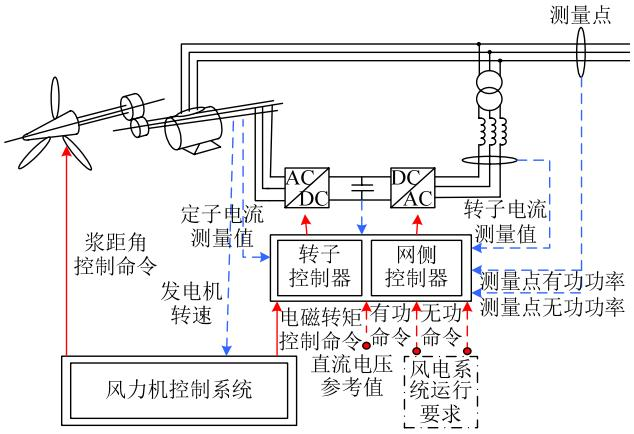  
图1 双馈风力发电机组结构  
Fig. 1 Structure of doubly-fed induction generator

量可表示为

$$
P = \frac {1}{2} \rho \pi R ^ {2} C _ {\mathrm {P}} V _ {\text {w i n d}} ^ {3} \tag {1}
$$

式中：P代表风力机的输出功率； $\rho$ 代表空气密度；R 代表叶片半径； $C _ { \mathfrak { p } }$ 代表风能利用效率系数； $V _ { \mathrm { w i n d } }$ 代表风速。效率系数 $C _ { \mathfrak { p } }$ 是表征风力机运行效率的重要参数，它与风速、风轮转速、风轮半径、浆距角均有关系，是一个非常复杂的非线性函数。

# 1.2.2 传动系统的数学模型

轴系传动系统由旋转部分、齿轮箱和轴系组成。惯量主要是风力机风轮和发电机转子质量块，齿轮箱的齿轮只占很小一部分，可以忽略齿轮惯性，只考虑变比。选用双质量块模型进行模拟，建模时采用标幺值系统，低速旋转的风轮和发电机转子转速基准值的比值选取为齿轮箱变比，其数学模型为

$$
\left\{ \begin{array}{l} \frac {\mathrm {d} \omega_ {\mathrm {t}}}{\mathrm {d} t} = \frac {T _ {\mathrm {t}} - T _ {\text {s h a f t}}}{2 H _ {\mathrm {t}}} \\ \frac {\mathrm {d} \omega_ {\mathrm {g}}}{\mathrm {d} t} = \frac {T _ {\text {s h a f t}} - T _ {\mathrm {e}}}{2 H _ {\mathrm {g}}} \\ T _ {\text {s h a f t}} = K _ {\text {d a m p i n g}} \left(\omega_ {\mathrm {r}} - \omega_ {\mathrm {g}}\right) + K _ {\text {s t i f f n e s s}} \theta_ {\mathrm {k}} \\ \frac {\mathrm {d} \theta_ {\mathrm {k}}}{\mathrm {d} t} = \omega_ {\mathrm {r}} - \omega_ {\mathrm {g}} \end{array} \right. \tag {2}
$$

式中： $\omega _ { \mathrm { t } }$ 代表风力机风轮转速；t 代表时间； $T _ { \mathrm { t } }$ 代表风力机输出的机械转矩； $T _ { \mathrm { s h a f t } }$ 代表轴转矩；$H _ { \mathrm { t } }$ 代表风力机惯性时间常数； $\omega _ { \mathrm { g } }$ 代表发电机转子转速； $T _ { \mathrm { e } }$ 代表发电机电磁转矩； $H _ { \mathrm { g } }$ 代表发电机惯性时间常数； $K _ { \mathrm { d a m p i n g } }$ 代表阻尼系数； $\omega _ { \mathrm { r } }$ 代表轴转速； $K _ { \mathrm { s t i f f n e s s } }$ 代表轴的刚性系数； $\theta _ { \mathrm { k } }$ 代表轴扭转的角度。

# 1.3 风力机的控制系统模型

# 1.3.1 浆距角控制系统

浆距角控制系统的作用是在风速过大时，增大

浆距角，减小效率系数 $C _ { \mathrm { p } } ,$ ，从而减少风力机输入的机械功率，使其在额定范围内运行。而在额定功率以下运行时，使浆距角保持在最小，以便最大程度地利用风能，如图 2 所示。

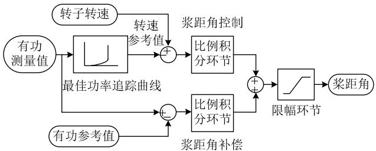  
图2 浆距角控制系统  
Fig. 2 Pitch angle control system

# 1.3.2 转速控制系统

转速控制系统的作用是在不同风速下，都能使发电机运行在最佳转速，完成最大风能追踪，如图3 所示。

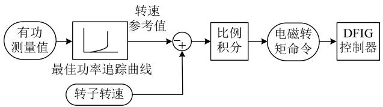  
图3 转速控制器框图  
Fig. 3 Block diagram of speed controller

# 1.4 双馈感应电机模型的实现

# 1.4.1 双馈感应电机数学模型

根据研究目的以及精确度不同，旋转电机模型可以分为 3类：有限元模型、等效磁路模型和耦合电路模型。前两者能够提供更好的计算精度，但是效率较低，主要应用于电机设计；耦合电路模型在电力系统仿真分析中得到了广泛应用，此类模型还分为基于 qd0 变换的模型、相域模型以及阻抗后的电压源模型(voltage-behind-reactance，VBR)。其中基于 qd0 坐标变换的模型最为成熟可靠，主流的电磁暂态仿真程序(如PSCAD/EMTDC)采用的都是这种模型。

电力工业涉及到很多不同种类的电机，为了增强程序的实用性和灵活性，本文建立了通用电机模型。选择基于转子转速旋转的 dq 坐标系，电枢侧和励磁侧的电压和电流满足等式[15]

$$
\left\{ \begin{array}{l} V _ {\mathrm {P}} = - R _ {\mathrm {P}} i _ {\mathrm {P}} - \frac {\mathrm {d} \lambda_ {\mathrm {P}}}{\mathrm {d} t} + \omega N \lambda_ {\mathrm {P}} \\ V _ {\mathrm {E}} = - R _ {\mathrm {E}} i _ {\mathrm {E}} - \frac {\mathrm {d} \lambda_ {\mathrm {E}}}{\mathrm {d} t} \end{array} \right. \tag {3}
$$

式中： $V _ { \mathrm { P } }$ 和 $V _ { \mathrm { E } }$ 分别代表电枢侧和励磁侧电压； $R _ { \mathrm { P } }$ 和 $R _ { \mathrm { E } }$ 分别代表电枢侧和励磁侧回路电阻； $i _ { \mathrm { P } }$ 和 $i _ { \mathrm { E } }$ 分别代表电枢侧和励磁侧电流； $\lambda _ { \mathrm { P } }$ 和 $\lambda _ { \mathrm { E } }$ 分别代表电

枢侧和励磁侧磁链矩阵；ω为转子旋转的电角速度；

$$
\boldsymbol {N} = \left[ \begin{array}{c c c} 0 & 0 & 0 \\ 0 & 0 & - 1 \\ 0 & 1 & 0 \end{array} \right] _ {\circ}
$$

此表达式为微分形式的电路方程，求解时需要进行离散化，在实现 PSD-PSModel 时采用梯形法进行离散化。

# 1.4.2 双馈感应电机模型与网络的接口

双馈感应电机的模型是在 dq0 坐标系下描述和求解的，而外部网络采用的则是ABC相域描述，因此必须采用某种方式与外部网络进行接口。PSD-PSModel 中的实现思路是根据外部网络的戴维南等值电路得到端口电压，然后计算注入电流与外部网络进行迭代求解。电机开路时为了保证计算稳定性，需要采用更小的计算步长。为了消除这方面的影响，在定子三相端口处并联大电阻，使用额外的补偿电流来消除计算误差[15-16]。这时，在正常计算的情况下，电机对于系统的注入电流并没有改变，而在电机开路时又可以保证数值稳定性。

# 1.5 双馈风电机组数学模型及其控制系统模型

# 1.5.1 转子侧换流器控制系统

为了方便控制发电机转速，使其运行在最佳转速上实现最大功率追踪，采用转矩电流双闭环控制系统实现双馈电机的控制，转矩控制外环，电流控制内环。对于无功功率的控制，采用无功功率外环、电流内环的控制方式，如图 4 所示。

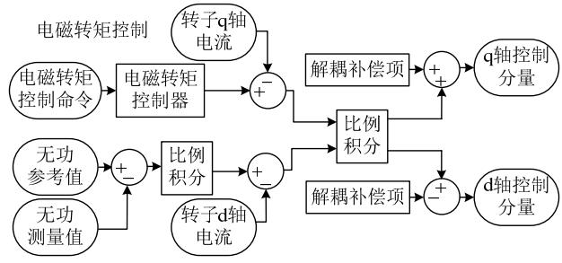  
图4 转子侧换流器控制系统  
Fig. 4 Rotor-side converter control system

# 1.5.2 网侧换流器控制系统

网侧换流器的控制目标是保持直流母线电压稳定，调整电网和直流母线间的功率流动，保持单位功率因数运行。一般对于网侧换流器采用直流母线电压外环、交流侧电流内环的双闭环控制系统，如图 5 所示。直流母线电压作为外环控制目标，电压控制器的输出作为电流内环的整定，电流控制器控制交流侧电流，使之快速跟踪电流指令。

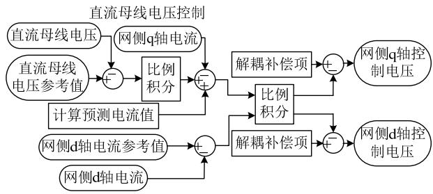  
图 5 网侧换流器控制系统  
Fig. 5 Grid-side converter control system

# 2 双馈风机电磁暂态-机电暂态混合仿真

# 2.1 PSD-PSModel 电磁暂态-机电暂态混合仿真程序

随着区域电网互联的形成，我国电网的规模越来越大，很难再孤立地考虑局部电网的安全问题。实际上，电网中任何一个局部条件的变化都可能引起整体行为的改变。同时，大功率电力电子元件，如 直 流 输 电 、 静 止 无 功 补 充 装 置 (static varcompensator，SVC)、可控串补(thyristor controlledseries compensation，TCSC)和各种快速自动控制装置的广泛应用，也使得电网的动态特性日趋复杂。

然而，在现有的基于基波相量分析的机电暂态和长过程分析软件中，对于柔性交流输电系统(flexible alternative current transmission systems，FACTS)等电力电子设备的仿真，均采用准稳态模型模拟，对其快速暂态特性和非线性元件引起的波形畸变均不能反映；而基于 ABC 三相瞬时值的电磁暂态分析软件，系统所有元件动态特性均采用微分方程描述，计算步长小、计算量大，仿真规模受到限制，往往需要通过对交流系统大规模等值才能完成，大大影响了系统分析的准确性和可靠性。

因此，将电磁暂态仿真和机电暂态仿真进行接口，完成电磁暂态、机电暂态的混合仿真，在一次仿真过程中实现对大规模电力系统的机电暂态仿真和局部网络的电磁暂态仿真，对研究大规模电力系统的暂态稳定特性具有很强的工程实用价值和理论意义。

PSD-PSModel 电磁暂态-机电暂态混合仿真程序是中国电力科学研究院在国家科技部和国家电网公司科技项目的资助下，独立研制开发的具有全部自主知识产权的电磁暂态仿真软件，具备与机电暂态仿真的各种不同类型接口，可以与机电暂态程序联立运行，实现混合仿真研究。

# 2.2 双馈风力发电机组混合仿真的意义

双馈风力发电机组的电磁暂态-机电暂态混

合仿真，首先是对双馈风机进行电磁暂态建模、控制系统通过自定义的方式实现，根据研究目的对空气动力学部分和机械部分的动态过程进行不同程度的简化，完全能够满足大电网机电暂态稳定计算对风力发电系统精确仿真研究的需求。在此平台上，可以深入开展风力发电系统不同程度的简化对系统暂态稳定性影响的研究，对于开展风力发电机组仿真的深化研究具有重要的意义和应用价值。

# 3 算例

采用 IEEE14 节点系统算例进行仿真研究，见图 6，该系统有 5 台发电机，发电机 1 为平衡机，母线 3、6、8连接同步调相机，系统共 14 个节点，15 条支路。系统中所有发电机均采用详细的次暂态参数模型并考虑励磁控制系统，所有机组均未安装PSS(power system stabilizer) 。利用 PSD-PSModel电磁暂态-机电暂态混合仿真程序作为仿真工具。节点 2 为双馈风力发电机，其有功出力为 36 MW，由于所搭建的双馈风力发电机的额定有功功率为1.5 MW，在这里假设 24台 DFIG处于同一个运行点上，外部条件相同，将 24 台风机等值为一台机后接入系统。

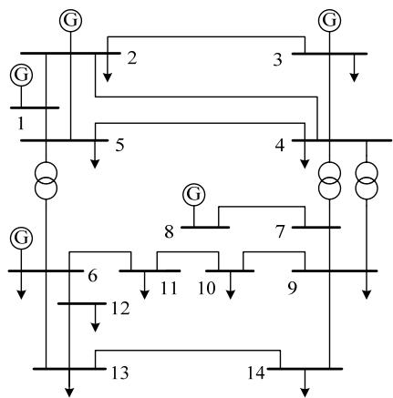  
图 6 IEEE14 节点系统结构图  
Fig. 6 Grid structure of IEEE14 system

第 1 种情况为系统处于稳态，在 1 s时刻，母线4与母线5之间支路发生三相接地对称短路故障，0.1 s后切除，仿真结果如图 7 所示。

图 7(a)(b)分别为发电机和同步调相机的端电压曲线。图 7(c)所示为 DFIG 在故障期间的有功出力变化曲线，可以看到扰动结束后大约 3 s，DFIG的有功出力达到平稳状态。从图 7(d)可以看出，无功出力除了在扰动时刻比较剧烈外，能很快按照控制策略达到平稳状态，因此可以看出解耦控制是有效的。

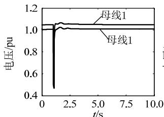  
(a)发电机端电压

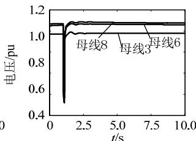  
(b)同步调相机端电压

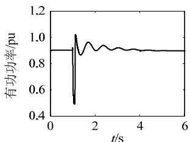  
(c)DFIG有功功率输出

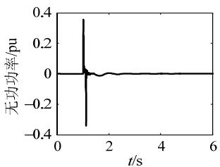  
(d)DFIG无功功率输出

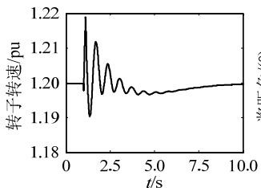  
(e)DFIG转子转速

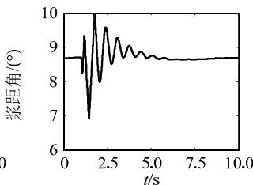  
(f)DFIG桨距角

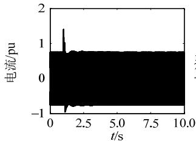  
(g)定子A相电流

  
(h)转子A相电流

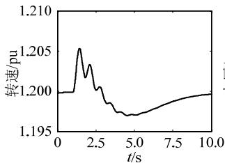  
(i)风力机转速

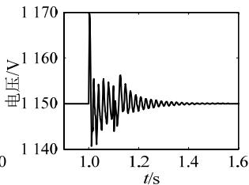  
(i)直流母线电压   
图7 第1 种情况仿真结果曲线  
Fig. 7 Curve of simulation result in case 1

由于涉及到机械系统且惯性时间常数较大，转子需要相对较长的时间恢复到初始稳态。暂态期间转速发生变化，为了保护机械系统，风力机控制系统将开始动作，通过调节浆距角来防止转子转速过快变化，整个过程如图 7(e)(f)所示。

从图 7(h)(j)中可以清晰地看到，在暂态过程中双馈电机的转子电流和直流电容电压受到了很大冲击，是引起保护动作的主要原因。混合仿真可以提供暂态期间更多的变量信息，为详细分析双馈机组响应提供了技术手段。

下面分析非对称故障，即第 2 种情况为系统处于稳态，在 1 s时刻，母线 4 与 5 之间支路发生单相接地短路故障，0.1 s后切除，图8 为各变量的仿

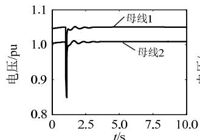  
(a)发电机端电压

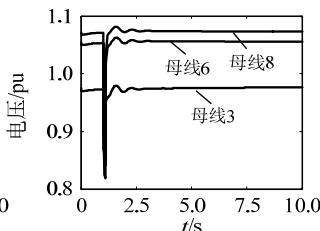  
(b)同步调相机端电压

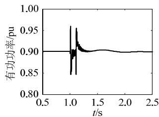  
(c)DFIG有功功率输出

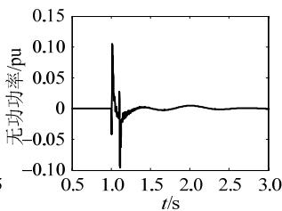  
(d)DFIG无功功率输出

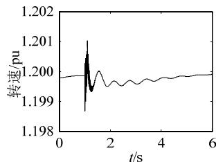  
(e)DFIG转子转速

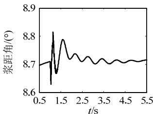  
(f)DFIG桨距角

  
(g)定子A相电流

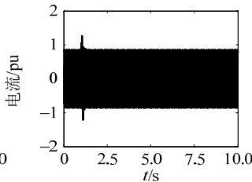  
(h)转子A相电流

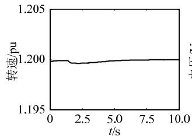  
(i)风力机转速

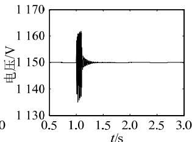  
(i)直流母线电压   
图 8 第 2 种情况仿真结果曲线  
Fig. 8 Curve of simulation result in case 2

真结果。

综上，通过混合仿真，可以清楚地得到风机内部的动态响应。由于 DFIG 属于交流励磁的同步发电机，对于电网暂态稳定性的影响直接取决于其控制系统的结构、响应速度和内部的限幅环节。随着风电接入系统比例的逐渐扩大，其对电力系统运行带来的影响值得深入分析。

# 4 结论

本文主要研究了双馈风力发电机的电磁暂态模型，并利用自主研发程序 PSD-PSModel 进行了双馈风电机组的电磁暂态-机电暂态混合仿真研究。利用外网的戴维南等值电路进行 DFIG 的电磁暂态

计算，并得到对系统的注入电流，同时外网利用DFIG 的注入电流进行全网的机电暂态计算。采用单台机等值模拟风电场的方法实现了双馈风力发电机群的电磁暂态-机电暂态混合仿真，最后利用IEEE14 节点系统进行了混合仿真研究。

双馈风力发电机的机电暂态简化模型与电磁暂态模型有不同的响应，目前还没有量化研究来分析两种模型对电力系统影响的差异性，这将是下一步研究工作的重点。

# 参考文献

[1] Sun Yuanzhang，Lin Jin，Li Guojie，et al．A survey on the grid integration of wind farms with variable speed wind plant systems[J] Automation of Electric Power Systems，2010，34(3)：75-80   
[2] 于强，孙华东，汤涌，等．双馈风电机组接入对电力系统功角稳 定性的影响[J]．电网技术，2013，37(12)：3399-3405 Yu Qiang，Sun Huadong，Tang Yong，et al．Impact on angle stability of power system with doubly fed induction generators connected to grid[J]．Power System Technology，2013，37(12)：3399-3405 (in Chinese)   
[3] 郝正航，余贻鑫．双馈风力发电机组对电力系统稳定性影响[J]电力系统保护与控制，2011，39(3)：7-11Hao Zhenghang，Yu Yixin．The influence of doubly-fed inductiongenerator on stability of power system[J]．Power System Protectionand Control，2011，39(3)：7-11(in Chinese)  
[4] 丁明，李宾宾，韩平平．双馈风电机组运行方式对系统电压稳定 性的影响[J]．电网技术，2010，34(10)：26-31 Ding Ming，Li Binbin，Han Pingping．Calculation analysis and control strategy for voltage stability of power grid with large capacity wind farm interconnected[J]．Power System Technology，2010，34(10)： 26-31(in Chinese)   
[5] RG de Almeida，JAP Lopes．Participation of doubly fed induction wind generators in system frequency regulation[J]．IEEE Trans on Power Systems，2007，22(3)：944-950   
[6] 徐琼璟，徐政．PSS/E中的风电机组通用模型概述[J]．电网技术，2010，34(8)：176-181Xu Qiongjing，Xu Zheng．A survey on general models of wind turbinegenerators in PSS/E[J]．Power System Technology，2010，34(8)：176-181(in Chinese)  
[7] 雷亚洲，Lightbody G．国外风力发电导则及动态模型简介[J]．电网技术，2005，29(12)：27-32．Lei Yazhou，Lightbody G．An introduction on wind power grid code

and dynamic simulation[J]．Power System Technology，2005，29(12)：27-32(in Chinese)  
[8] 许寅，陈颖，梅生伟．风力发电机组暂态仿真模型[J]．电力系统自动化，2011，35(9)：100-107Xu Yin，Chen Ying，Mei Shengwei．Review on wind turbine modelsfor power system transient simulations[J]．Automation of ElectricPower Systems，2011，35(9)：100-107 (in Chinese)  
[9] Slootweg J G，Polinder H，Kling W L．Dynamic modelling of a wind turbine with doubly fed induction generator[C]//Proceedings of IEEE Power Engineering Society Summer Meeting．Van Couver：IEEE， 2001：644-649   
[10] Ekanayake J B，Holdsworth L，Wu X G，et al．Dynamic modelingof doubly fed induction generator wind turbines[J]．IEEE Trans onPower Systems，2003，18(2)：803-809  
[11] Ledesma P，Usaola J．Doubly fed induction generator model for transient stability analysis[J] ． IEEE Trans on Power Energy Conversion，2005，20(2)：388-397   
[12] Kalsi S S，Stephen D D，Adkins B．Calculation of system fault currents due to induction motors[J]．Proceedings of the Institution of Electrical Engineers，1971，118(1)：201-215   
[13] Sørensen P，Hansen A D，Lund T，et al．Reduced models of doubly fed induction generator system for wind turbine simulations[J]．Wind Energy，2006，9(4)：299-311   
[14] Ackermann T．Wind power in power systems[M]．Hoboken，New Jersey：Wiley Online Library，2005：525-602   
[15] Lauw H K，Meyer W S．Universal machine modeling for the representation of rotating electric machinery in an electromagnetic transients program[J]．IEEE Trans on Power Apparatus and Systems， 1982，PAS-101(6)：1342-1349   
[16] Lauw H K．Interfacing for universal multi-machine system modeling in an electromagnetic transients program[J]．IEEE Trans on Power Apparatus and Systems，1985，PAS-104(9)：2367-2373

  
顾卓远 顾卓远

收稿日期：2014-09-03。

作者简介：

顾卓远(1985)，男，博士，研究方向为电力系统稳定与控制，E-mail：guzy@epri. sgcc.com.cn；

汤涌(1959)，男，博士，教授级高级工程师，博士生导师，研究方向为电力系统稳定与控制、电力系统仿真与分析；

刘文焯(1972)，男，硕士，高级工程师，长期从事电力系统仿真与分析技术研究及软件开发工作，E-mail：liuwzh@epri.sgcc.com.cn；

戴汉扬(1989)，男，博士研究生，研究方向为电力系统仿真与分析。

（责任编辑 王金芝）