# Electromagnetic transient (EMT) and quasi static time series (QSTS) Co-simulation for analyzing integration of power electronics based generation/power quality improvement solution in secondary distribution networks

Dhaval Yogeshbhai Raval a,∗, Saurabh N. Pandya b

a Ph.D. Scholar, Gujarat Technological University, 380005, Chandkheda Ahmedabad, Gujarat, India   
b Vishwakarma Government Engineering College, 380005, Chandkheda Ahmedabad, Gujarat, India

# a r t i c l e i n f o

Keywords:

Co-simulation

Electromagnetic transient (EMT)

Quasi-static time-series (QSTS)

Renewable energy

Power quality

Distribution network

# a b s t r a c t

This paper presents a novel Co-simulation framework that integrates the Open Distribution System Simulator (OpenDSS) – a phasor-domain analysis tool–with an electromagnetic transient (EMT) model developed in MAT-LAB/Simulink. The proposed tool is designed to evaluate the impact of incorporating power electronics (PE)- based generators and power quality improvement devices into large and complex distribution networks, which is crucial for enabling the transition from conventional power sources to renewable energy (RE) systems. By combining EMT and quasi-static time-series (QSTS) simulations, this approach overcomes the modeling limitations of OpenDSS while reducing the computational complexity associated with full EMT simulations. The paper elaborates on the methodology and theoretical framework used for integrating EMT models with OpenDSS and demonstrates its applicability through multiple case studies based on the IEEE 13-bus test feeder integrated with a photovoltaic (PV) system. The validity of the proposed Co-simulation framework was established by comparing its results with a detailed EMT simulation model implemented in Simulink. The findings indicate that the Cosimulation framework produces results in close agreement with the full EMT model while achieving a reduction in computational time by approximately 60–70 %. These results confirm that the proposed Co-simulation tool provides an efficient and reliable platform for analyzing power-electronic-integrated distribution systems with high RE penetration.

# 1. Introduction

India’s electricity demand has been rising steadily, with per capita consumption reaching 985 kWh in 2023 and total electricity consumption growing by 6 % annually since 2020, including a 6.7 % surge in 2023 to 1407 TWh. This increasing demand, however, has fueled a sharp rise in coal and lignite consumption, which has grown at an alarming rate of 11 % per year since 2020, reaching 1.3 Gt in 2023. Power generation and industry are the primary consumers, accounting for 62 % and 34 %, respectively. While India has committed to reducing its CO2 emission intensity of GDP by 45 % by 2030 (compared to 2005 levels) and achieving net-zero emissions by 2070, the reliance on coal highlights the challenge of balancing energy needs with environmental commitments [1]. To address this, transitioning to RE sources is imperative for meeting the growing electricity demand while curbing pollution.

Integrating 9RE sources such as solar and wind into the grid, while essential for reducing reliance on fossil fuels, presents significant challenges in maintaining power quality [2]. RE based Distributed Generators (DGs) can cause issues such as voltage rise, voltage fluctuations, and flicker due to their intermittent nature [2,3]. The use of inverters in these systems often introduces harmonics [4–6]. Reverse power flow (RPF), a result of power injection at the consumer end, complicates grid operations and protection schemes [7]. Low power factor operation and altered fault contributions further strain the network’s stability and reliability [8–10]. Therefore, a thorough and comprehensive study is crucial to ensure the seamless integration of RE sources into the distribution network, addressing these challenges while supporting India’s transition to a sustainable energy future.

To study the power quality issues associated with RE integration, EMT simulations are commonly employed due to their ability to analyze

detailed dynamics of PE based generators, such as those used in solar and wind energy systems [11–16]. EMT simulations are particularly effective in studying harmonics, voltage fluctuations, and fault contributions [17–19]. However, these simulations demand extensive computational power [20], when long-duration studies spanning hours or days are required to accurately capture the intermittent behavior of renewables. As the complexity and size of the network increase, computational demands also increases exponentially.

Dynamic simulations are used for analyzing the impact of RE generation, particularly due to the inherent variability of RE resources. Since RE generation is influenced by weather conditions, time of day, and seasonal changes, it introduces significant fluctuations in the grid. To address this, QSTS analysis has become a useful tool [21–25]. QSTS involves performing a series of consecutive power flow solutions to account for the slow variations in RE generation and load profiles. While QSTS provides valuable insights into the grid’s response to gradual changes, it does not capture the transient behavior of the system, such as rapid fluctuations or short-term disturbances [26].

Co-simulation has emerged as an effective solution to address some of the challenges in power system simulation, particularly in integrating RE sources and managing their impact on power quality. Co-simulation is a term that is interpreted differently across various fields of study. In general, it means simulating interconnected systems together by combining multiple simulators [27]. This approach combines different simulation tools to leverage their strengths and overcome the limitations of individual methods as demonstrated in existing studies on Co-simulation [28–36]. In [28,29], MATLAB script-based algorithms are employed to drive phasor-domain simulations in OpenDSS. This concept is further advanced in [30] by developing EMT simulations within the MATLAB script environment and integrating them with phasor simulations in OpenDSS. Similarly, Hariri et al. [31] adopts this approach but implements the EMT simulation using Python. Modeling EMT simulations in a script-based environment requires detailed mathematical representations of the EMT domain. The accuracy of the simulation is directly influenced by the fidelity of the EMT model used. This paper address these issues by presenting a novel Co-simulation environment that integrates OpenDSS (Open Distribution System Simulator) and Simulink. Simulink is chosen for EMT modeling due to its familiarity among students, academicians, and researchers, making it a widely preferred tool in academic and research. By combining these two powerful tools, the Co-simulation environment enables a more accurate and comprehensive analysis of distribution networks, capturing both the steadystate and dynamic behavior of large distribution network with high penetration of distributed generators.

The increasing penetration of RE-based distributed generators has created a pressing need for simulation frameworks that can accurately represent both steady-state and transient phenomena in large distribution networks without incurring excessive computational costs. Conventional QSTS tools fail to capture high-frequency and do not pro-

vide flexibility to modify control algorithms, while full EMT simulations, although accurate, are computationally impractical for simulating complex distribution networks. These limitations motivate a hybrid EMT-QSTS Co-simulation approach, where detailed controller-level EMT models of DERs or Power Quality improvement devices interact with a full feeder solved in the QSTS domain. Additionally, MAT-LAB/Simulink offers Hardware-in-the-Loop (HIL) capability, enabling real-time testing of converter and controllers, integrated with a realistic distribution network model using EMT-QSTS Co-simulation framework, which further strengthen the applicability of proposed method.

Accordingly, the primary objectives of this study are to: (i) develop an integrated OpenDSS–Simulink Co-simulation framework that couples QSTS and EMT domains, (ii) validate the proposed framework against a full-system EMT model under different operating conditions, and (iii) evaluate its computational efficiency and accuracy relative to standalone EMT simulation.

The Co-simulation approach is validated by modeling and comparing the results of a modified IEEE 13-bus test feeder using both, the Co-simulation method and the full-system MATLAB/Simulink model. Section II provides a detailed explanation of the Simulink-OpenDSS Co-simulation interface. Section III presents the validation of the Cosimulation environment under varying irradiance, changes in reactive power, and grid-side fault conditions.

# 2. Simulink-OpenDSS Co-simulation interface

# 2.1. Methodology of the proposed approach

OpenDSS, an open-source simulator for distribution systems, is selected to model the distribution network for the time series simulation. Meanwhile, Simulink is utilized as a versatile simulation platform for simulating the EMT domain components of the system.

OpenDSS features a Component Object Model (COM) interface that enables external software to control and modify its functionality [31]. Simulink is a widely used simulation environment with built-in libraries for various electrical subdomain like power system, power electronics, RE which can communicate with MATLAB script through the internal MATLAB Application Programming Interface (API). MATLAB can drive and control OpenDSS through the COM interface. Although MAT-LAB/Simulink itself is not open-source, combining it with OpenDSS allows for an effective hybrid simulation tool that offers several advantages, including flexibility to analyse both time series and EMT behaviours, comprehensive analysis of system performance across different time scales, enhanced accuracy by capturing both steady-state and dynamic phenomena and resource optimization by focusing detailed EMT simulations only for critical scenarios.

Fig. 1 shows the methodology of co-simulation. Co-simulation contains 3 parts. Fig. 1(a) represents QSTS simulation in OpenDSS. OpenDSS

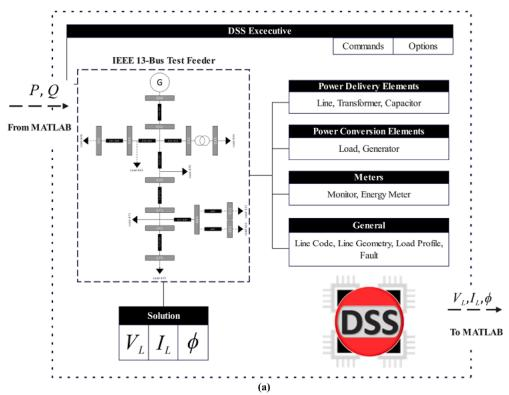

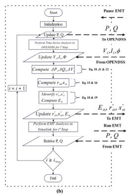

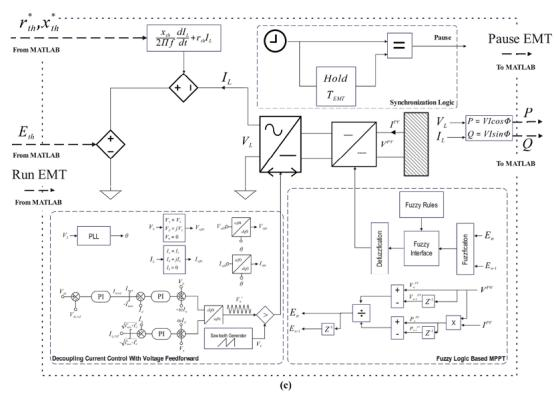  
Fig. 1. Co-simulation approach (a) QSTS simulation in OpenDSS (b) MATLAB Algorithm (c) EMT Simulation in Simulink.

performs time-series simulation by evaluating a power distribution system’s behaviour over a sequence of time steps, using time-varying inputs such as load profiles. It calculates system conditions like voltage, current, and power flow at each step to analyse the system’s dynamic performance over time. At every time step it sends data to the MATLAB through COM interface.

The Thevenin parameter extraction method, detailed in Section. $2 . 2 ,$ is implemented in MATLAB, as shown in Fig. 1(b). This MATLAB script receives data from OpenDSS, extracts the Thevenin equivalent of the distribution network, and transmits it to the EMT simulation. This serves as link between QSTS simulation and EMT simulation.

The EMT model of the PE based generator, illustrated in Fig. 1(c) utilizes the data from MATLAB to construct the Thevenin equivalent of the distribution network. Within the EMT domain, the PE based generator synchronizes with the Thevenin equivalent model to facilitate power exchange. After each EMT simulation run, information about the power exchange is communicated back to OpenDSS through MATLAB script, enabling the next step of the power flow solution. Below is a description of step by step execution of co-simulation approach Fig. 3.

I Establish the COM interface between MATLAB and OpenDSS.

II Solve the initialising power flow in OpenDSS and initialize EMT simulation.

III Define point of interest in MATLAB.

IV Update the active power and reactive power values obtained from EMT into OpenDSS.

V Perform the power flow analysis in OpenDSS.

VI Retrieve the results from OpenDSS back into MATLAB.

VII Extract the thevenin equivalent parameters from the retrieved data using MATLAB API.

VIII Update thevenin parameters in the EMT simulation.

IX Run the Electromagnetic Transient (EMT) simulation for a duration of $T _ { \mathrm { E M T } } ,$ , using a time step $T _ { s }$ such that $T _ { s } \ll T _ { \mathrm { E M T } }$ .

X Retrieve necessary data from EMT simulation back into MATLAB.

XI Repeat step IV to X until the total simulation time is reached.

# 2.2. Thevenin equivalent of distribution network

As shown in Fig. 1(c) thevenin equivalent which includes thevenin voltage $E _ { \mathrm { t h } }$ and thevenin impedance $( R _ { \mathrm { t h } }$ and $X _ { \mathrm { t h } } ) ,$ , has been modeled in an EMT domain by a controlled voltage source based on the following equation:

$$
V _ {z} = \frac {X _ {\text {t h}}}{2 \pi f} \frac {d i _ {L}}{d t} + R _ {\text {t h}} I _ {L} \tag {1}
$$

$$
V _ {L} = E _ {t h} - V _ {z} \tag {2}
$$

For every run of the EMT simulation, the values of $E _ { \mathrm { t h } } , R _ { \mathrm { t h } }$ , and $X _ { \mathrm { t h } }$ are updated from the MATLAB workspace.

To extract the thevenin parameters at each time step, the method builds upon prior research [37], refining it into a more generalized form to increase its applicability across a wider range of scenarios. The emphasis is on the implementation phase, ensuring the method can be seamlessly adapted to various applications with minimal modifications.

Consider the phasor diagram shown in Fig. 2, which represents the relationship between the measured quantities $V _ { L }$ and $I _ { L }$ and the thevenin equivalent parameters $E _ { \mathrm { t h } }$ and $Z _ { \mathrm { t h } }$ . From the phasor diagram,

The Thevenin equivalent voltage $E _ { \mathrm { t h } }$ is related to the measured quantities $V _ { L }$ and $I _ { L }$ as follows:

$$
E _ {\text {t h}} ^ {2} = \left(V _ {L} + I _ {L} Z _ {\text {t h}} \cos (\theta - \varphi)\right) ^ {2} + \left(I _ {L} Z _ {\text {t h}} \sin (\theta - \varphi)\right) ^ {2} \tag {3}
$$

Simplifying the above equation:

$$
E _ {\mathrm {t h}} ^ {2} = V _ {L} ^ {2} + I _ {L} ^ {2} Z _ {\mathrm {t h}} ^ {2} + 2 V _ {L} I _ {L} \cos (\theta - \varphi) (r _ {\mathrm {t h}} + j x _ {\mathrm {t h}}) \tag {4}
$$

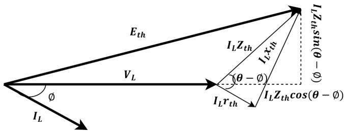  
Fig. 2. Phasor diagram representing the relationship between the measured quantities $V _ { L }$ and $I _ { L }$ and the Thevenin equivalent parameters $E _ { \mathrm { t h } }$ and $Z _ { \mathrm { t h } }$ .

Further expanding:

$$
E _ {\mathrm {t h}} ^ {2} = V _ {L} ^ {2} + I _ {L} ^ {2} Z _ {\mathrm {t h}} ^ {2} + 2 P _ {\mathrm {n}} r _ {\mathrm {t h}} + 2 Q _ {\mathrm {n}} x _ {\mathrm {t h}} \tag {5}
$$

Under the assumption that the distribution network remains unchanged over a short time period and that the thevenin parameters are constant within this interval, a dataset comprising ?? samples of voltage and current measurements are considered. Therefore, the equation becomes:

$$
E _ {\mathrm {t h}} ^ {2} = V _ {L _ {n}} ^ {2} + I _ {L _ {n}} ^ {2} Z _ {\mathrm {t h}} ^ {2} + 2 P _ {n} r _ {\mathrm {t h}} + 2 Q _ {n} x _ {\mathrm {t h}} \tag {6}
$$

Subtracting subsequent samples yields:

$$
\begin{array}{l} \left(V _ {L _ {n}} ^ {2} - V _ {L _ {n - 1}} ^ {2}\right) + \left(I _ {L _ {n}} ^ {2} - I _ {L _ {n - 1}} ^ {2}\right) Z _ {\text {t h}} ^ {2} + 2 \left(P _ {n} - P _ {n - 1}\right) r _ {\text {t h}} \\ + 2 \left(Q _ {n} - Q _ {n - 1}\right) x _ {\text {t h}} = 0 \tag {7} \\ \end{array}
$$

$$
\begin{array}{l} \left(V _ {L _ {n - 1}} ^ {2} - V _ {L _ {n - 2}} ^ {2}\right) + \left(I _ {L _ {n - 1}} ^ {2} - I _ {L _ {n - 2}} ^ {2}\right) Z _ {\mathrm {t h}} ^ {2} + 2 \left(P _ {n - 1} - P _ {n - 2}\right) r _ {\mathrm {t h}} \\ + 2 \left(Q _ {n - 1} - Q _ {n - 2}\right) x _ {\mathrm {t h}} = 0 \tag {8} \\ \end{array}
$$

To eliminate $Z _ { \mathrm { t h } } \colon$

$$
\frac {V _ {L _ {n}} ^ {2} - V _ {L _ {n - 1}} ^ {2}}{V _ {L _ {n - 1}} ^ {2} - V _ {L _ {n - 2}} ^ {2}} + \frac {2 \left(P _ {n} - P _ {n - 1}\right) r _ {\text {t h}}}{2 \left(P _ {n - 1} - P _ {n - 2}\right) r _ {\text {t h}}} + \frac {2 \left(Q _ {n} - Q _ {n - 1}\right) x _ {\text {t h}}}{2 \left(Q _ {n - 1} - Q _ {n - 2}\right) x _ {\text {t h}}} = \frac {I _ {L _ {n}} ^ {2} - I _ {L _ {n - 1}} ^ {2}}{I _ {L _ {n - 1}} ^ {2} - I _ {L _ {n - 2}} ^ {2}} \tag {9}
$$

$$
\begin{array}{l} \left(V _ {L _ {n}} ^ {2} - V _ {L _ {n - 1}} ^ {2}\right) \left(I _ {L _ {n - 1}} ^ {2} - I _ {L _ {n - 2}} ^ {2}\right) \\ - \left(V _ {L _ {n - 1}} ^ {2} - V _ {L _ {n - 2}} ^ {2}\right) \left(I _ {L _ {n}} ^ {2} - I _ {L _ {n - 1}} ^ {2}\right) \\ + \left(P _ {n} - P _ {n - 1}\right) \left(I _ {L _ {n - 1}} ^ {2} - I _ {L _ {n - 2}} ^ {2}\right) \\ - \left(P _ {n - 1} - P _ {n - 2}\right) \left(I _ {L _ {n}} ^ {2} - I _ {L _ {n - 1}} ^ {2}\right) 2 r _ {\text {t h}} \\ + \left(Q _ {n} - Q _ {n - 1}\right) \left(I _ {L _ {n - 1}} ^ {2} - I _ {L _ {n - 2}} ^ {2}\right) \\ - \left(Q _ {n - 1} - Q _ {n - 2}\right) \left(I _ {L _ {n}} ^ {2} - I _ {L _ {n - 1}} ^ {2}\right) 2 x _ {\text {t h}} = 0 \tag {10} \\ \end{array}
$$

Eq. (10) includes three different sets of subsequent measurements $n ,$ $( n - 1 )$ , and (?? − 2). It can be rewritten as:

$$
\Delta V ^ {2} + 2 \Delta P r _ {\mathrm {t h}} + 2 \Delta Q x _ {\mathrm {t h}} = 0 \tag {11}
$$

Where:

$$
\Delta V ^ {2} = \det  \left[ \begin{array}{c c c} 1 & 1 & 1 \\ V _ {m - 2} ^ {2} & V _ {m - 1} ^ {2} & V _ {m} ^ {2} \\ I _ {m - 2} ^ {2} & I _ {m - 1} ^ {2} & I _ {m} ^ {2} \end{array} \right] \tag {12}
$$

$$
\Delta P = \det  \left[ \begin{array}{c c c} 1 & 1 & 1 \\ P _ {m - 2} & P _ {m - 1} & P _ {m} \\ I _ {m - 2} ^ {2} & I _ {m - 1} ^ {2} & I _ {m} ^ {2} \end{array} \right] \tag {13}
$$

$$
\Delta Q = \det  \left[ \begin{array}{c c c} 1 & 1 & 1 \\ Q _ {m - 2} & Q _ {m - 1} & Q _ {m} \\ I _ {m - 2} ^ {2} & I _ {m - 1} ^ {2} & I _ {m} ^ {2} \end{array} \right] \tag {14}
$$

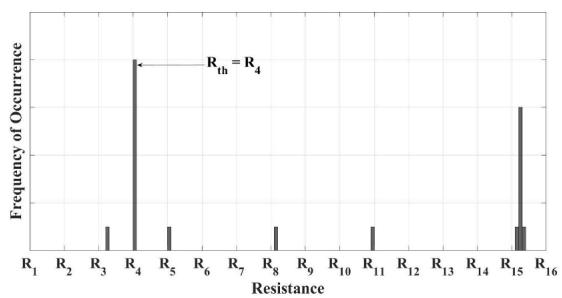  
(a) Selection of $r _ { \mathrm { t h } }$

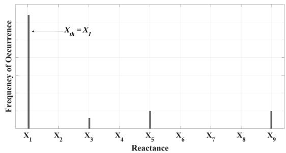  
(b) Selection of $x _ { \mathrm { t h } }$

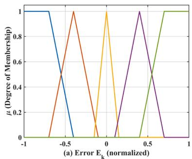  
Fig. 3. Illustration of $r _ { \mathrm { t h } }$ and $x _ { \mathrm { t h } }$ selection.

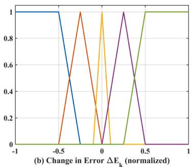

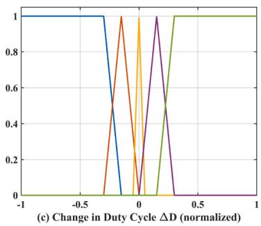  
Fig. 4. Fuzzification of input and output variables.

Where ?? should be selected such that 3 $< m \leq n .$ . For ?? samples, the number of possible combinations is:

$$
N = \binom {n} {3} = \frac {n (n - 1) (n - 2)}{3 !} \tag {15}
$$

Eq. (11) represents a straight line. With ?? possible triplets, it is possible to obtain ?? distinct straight lines.

$$
\Delta V _ {i} ^ {2} + 2 \Delta P _ {i} r _ {\mathrm {t h}} + 2 \Delta Q _ {i} x _ {\mathrm {t h}} = 0 \quad \text {f o r} \quad i = 1, 2, 3, \dots , N \tag {16}
$$

From the set of ?? straight lines, the intersection of any two $j ^ { \mathrm { t h } }$ and $k ^ { \mathrm { { t h } } }$ lines provides the solution for $r _ { \mathrm { t h } }$ and $x _ { \mathrm { t h } }$ as follows:

$$
r _ {\mathrm {t h}} = \frac {\Delta Q _ {j} \Delta V _ {k} ^ {2} - \Delta Q _ {k} \Delta V _ {j} ^ {2}}{2 \left(\Delta P _ {j} \Delta Q _ {k} - \Delta P _ {j} \Delta Q _ {k}\right)} \tag {17}
$$

$$
x _ {\text {t h}} = \frac {\Delta P _ {k} \Delta V _ {j} ^ {2} - \Delta P _ {j} \Delta V _ {k} ^ {2}}{2 \left(\Delta P _ {j} \Delta Q _ {k} - \Delta P _ {k} \Delta Q _ {j}\right)} \tag {18}
$$

The number of possible solutions for $r _ { \mathrm { t h } }$ and $x _ { \mathrm { t h } }$ can be given by:

$$
N _ {r} = N _ {x} = \binom {N} {2} = \frac {N (N - 1)}{2 !} \tag {19}
$$

From the $N _ { r }$ and $N _ { x }$ possible values of $r _ { \mathrm { t h } }$ and $x _ { \mathrm { { t h } } } ,$ respectively, the value(s) that occur most frequently can be identified and selected as shown in Fig. 3.

$$
r _ {\mathrm {t h}} ^ {*} = \operatorname {m o d e} \left(r _ {\mathrm {t h}} ^ {1}, r _ {\mathrm {t h}} ^ {2}, r _ {\mathrm {t h}} ^ {3}, \dots , r _ {\mathrm {t h}} ^ {N _ {r}}\right) \tag {20}
$$

$$
x _ {\mathrm {t h}} ^ {*} = \operatorname {m o d e} \left(x _ {\mathrm {t h}} ^ {1}, x _ {\mathrm {t h}} ^ {2}, x _ {\mathrm {t h}} ^ {3}, \dots , x _ {\mathrm {t h}} ^ {N _ {x}}\right) \tag {21}
$$

From the selected values of $r _ { \mathrm { t h } }$ and $x _ { \mathrm { t h } } , \ E _ { \mathrm { t h } }$ can be calculated as follows:

$$
E _ {\mathrm {t h}} = \sqrt {V _ {L _ {n}} ^ {2} + I _ {L _ {n}} ^ {2} \left(r _ {\mathrm {t h}} ^ {* 2} + x _ {\mathrm {t h}} ^ {* 2}\right) + 2 P _ {n} r _ {\mathrm {t h}} ^ {*} + 2 Q _ {n} x _ {\mathrm {t h}} ^ {*}} \tag {22}
$$

Eqs. (7)– (22) are utilized to determine the Thevenin equivalent voltage and impedance, which serve as the linking parameters for integrating the EMT model with the QSTS simulation framework.

Table 1   
Formation of PV array under different connection types.   

<table><tr><td>Connection Type</td><td>Resultant Impp</td><td>Resultant Vmpp</td><td>Resultant Pmpp</td></tr><tr><td>Series Connection</td><td>Impp</td><td>NS × Vmpp</td><td>NS × Pmpp</td></tr><tr><td>Parallel Connection</td><td>NP × Impp</td><td>Vmpp</td><td>NP × Pmpp</td></tr><tr><td>Series–Parallel Connection</td><td>NP × Impp</td><td>NS × Vmpp</td><td>NS × NP × Pmpp</td></tr></table>

# 2.3. PV array

Table 1 outlines the PV array formation rule, considering the number of series panels $N _ { S }$ and parallel panels $N _ { P }$ [38] .The number of required series panels $N _ { S }$ can be determined based on the grid voltage $V _ { \mathrm { g r i d ( R M S ) } } ,$ the desired voltage gain of the DC-DC converter $m _ { \mathrm { d c } } ,$ , the maximum power point voltage of the selected panel $V _ { \mathrm { M P P } } .$ , and the modulation index of the inverter $m _ { a } ,$ as given by the formula in Eq. (23). Additionally, the number of parallel panels $N _ { P }$ can be calculated using the desired PV system power $P _ { \mathrm { s y s t e m } }$ and the maximum power point current of the selected panel $I _ { \mathrm { { m p p } } } ,$ as expressed in Eq. (24).

$$
N _ {S} > \left\lceil \frac {V _ {\text {g r i d (R M S)}} \times \sqrt {2}}{m _ {\mathrm {d c}} \times V _ {\mathrm {m p p}} \times m _ {a}} \right\rceil \tag {23}
$$

$$
N _ {P} > \left\lceil \frac {P _ {\text {s y s t e m}}}{N _ {S} \times V _ {\mathrm {m p p}} \times I _ {\mathrm {m p p}}} \right\rceil \tag {24}
$$

# 2.4. Decoupling converter

A DC-DC converter, commonly used as a decoupling converter, plays a crucial role in isolating the PV array from the standalone load or the grid-interfacing power electronic converter. This decoupling ensures constant impedance at the input terminals of the PV array, thereby maintaining its operating point at the maximum power point (MPP).

In this work, a boost converter is employed to decouple the gridinterfacing inverter while ensuring maximum power extraction from the

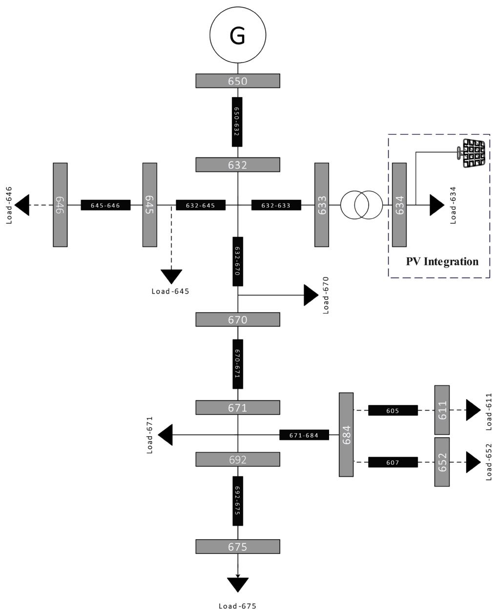  
Fig. 5. Modified IEEE - 13 bus test feeder.

PV array. Unlike conventional design approaches [39] ,the design presented here is specifically adapted to the known parameters of the PV array and the grid. The duty cycle of the boost converter can be defined as per Eq. (25):

$$
D > 1 - \frac {m _ {a} \times N _ {S} \times V _ {\mathrm {m p p}}}{V _ {\mathrm {g r i d (R M S)}} \times \sqrt {2}} \tag {25}
$$

The inductor current and inductance can be designed using Eqs. (26) and (27), respectively:

$$
I _ {L} = \frac {P _ {\text {s y s t e m}}}{m _ {d c} \times N _ {s} \times V _ {\text {m p p}} \times (1 - D)} \tag {26}
$$

$$
L \geq \frac {N _ {S} \times V _ {m p p} \times D}{2 \times \Delta I _ {L} \times f _ {s}} \tag {27}
$$

Here:

• $f _ { s }$ is the switching frequency.

• $\Delta I _ { L }$ represents the inductor current ripple, typically 5 % to 10 % of the inductor current $I _ { L }$ .

$$
C \geq \frac {D \times (1 - D) ^ {2} \times N _ {P}}{\sqrt {1 2} \times \gamma \times f _ {s} \times R _ {m p p}} \tag {28}
$$

Where:

– $\gamma$ is the output voltage ripple factor, which should be limited to $_ 2$   
– $R _ { m p p }$ is defined as per Eq. (29).

$$
R _ {m p p} = \frac {V _ {m p p}}{I _ {m p p}} \tag {29}
$$

The diode current and switch current should be designed using Eqs. (30) and (31), respectively:

$$
I _ {d} = N _ {P} \times I _ {m p p} \times (1 - D) \tag {30}
$$

$$
I _ {s w} = \frac {\Delta I _ {L}}{2} + N _ {P} \times I _ {m p p} \times (1 - D) \tag {31}
$$

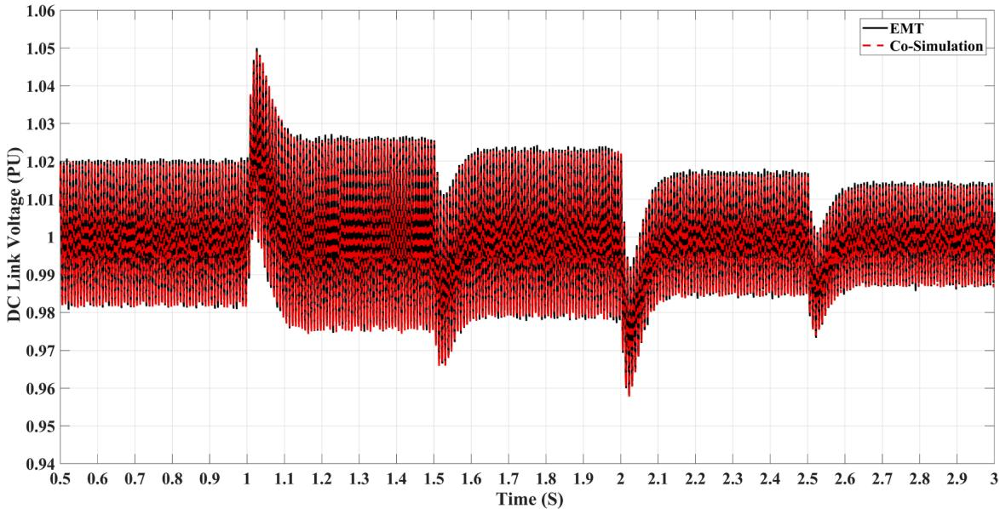  
Fig. 6. DC link voltage under varying irradiance.

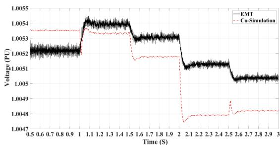  
(a) RMS Voltage

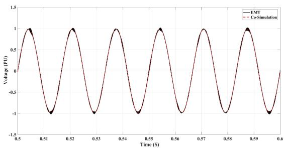  
(b) Instantaneous Voltage   
Fig. 7. Effect of irradiance on PCC voltage.

# 2.5. Fuzzy logic based MPPT

The fuzzy logic-based Maximum Power Point Tracking (MPPT) system is a control mechanism designed to optimize the power output of photovoltaic (PV) systems under varying environmental conditions. The fuzzy logic controller takes two inputs: error $( E _ { k } )$ and change in error $( \Delta E _ { k } ) _ { i }$ , which are calculated as follows:

$$
E _ {k} = \frac {P _ {k} - P _ {k - 1}}{V _ {k} - V _ {k - 1}} \tag {32}
$$

and

$$
\Delta E _ {k} = E _ {k} - E _ {k - 1} \tag {33}
$$

Here, $P _ { k }$ and $P _ { k - 1 }$ are the current and previous power outputs of the PV system, and $V _ { k }$ and $V _ { k - 1 }$ are the corresponding voltages. These inputs provide information about the slope of the power-voltage (P-V) curve and its rate of change, which help determine the operating region of the PV array.

The two input variables, error $( E _ { k } )$ and change in error $( \Delta E _ { k } ) _ { : }$ , have ranges defined as [Min, Max]. Each input is represented by five trapezoidal membership functions (MFs) that describe linguistic terms: Negative Big (NB), Negative Small (NS), Zero (ZE), Positive Small (PS), and Positive Big (PB).

The change in duty cycle (Δ??) depends on 25 fuzzy rules that define the relationship between the input variables $( E _ { k }$ and $\Delta E _ { k } )$ and the output variable (Δ??). These rules are structured as:

$$
R _ {j}: \text {I F} E _ {k} = A _ {i} \text {A N D} \Delta E _ {k} = B _ {i}, \text {T H E N} \Delta D = C _ {i} \tag {34}
$$

Table 2 Fuzzy rule base for MPPT controller.   

<table><tr><td>Ek/ΔEk</td><td>NB</td><td>NS</td><td>ZE</td><td>PS</td><td>PB</td></tr><tr><td>NB</td><td>ZE</td><td>ZE</td><td>NS</td><td>PS</td><td>PB</td></tr><tr><td>NS</td><td>ZE</td><td>ZE</td><td>NS</td><td>PS</td><td>PB</td></tr><tr><td>ZE</td><td>NS</td><td>NS</td><td>ZE</td><td>PS</td><td>PS</td></tr><tr><td>PS</td><td>PB</td><td>PB</td><td>PS</td><td>ZE</td><td>ZE</td></tr><tr><td>PB</td><td>PB</td><td>PB</td><td>PS</td><td>ZE</td><td>ZE</td></tr></table>

Note: NB = Negative Big, NS = Negative Small, ZE = Zero, PS = Positive Small, PB = Positive Big.

Where:

• ?? and $B _ { i }$ correspond to the respective row and column of the fuzzy rule table, representing the linguistic terms of $E _ { k }$ (error) and $\Delta E _ { k }$ (change in error).   
• $C _ { i }$ is the output linguistic term located at the intersection of row $A _ { i }$ and column $B _ { i }$ in the rule table, determining the corresponding value of Δ?? (change in duty cycle).

The complete rule set are shown in Table 2.

In the defuzzification stage, the aggregated fuzzy output is converted into a crisp value for $\Delta D$ using the centroid method:

$$
\Delta D = \frac {\int_ {x} \mu_ {\text {o u t p u t}} (x) \cdot x d x}{\int_ {x} \mu_ {\text {o u t p u t}} (x) d x} \tag {35}
$$

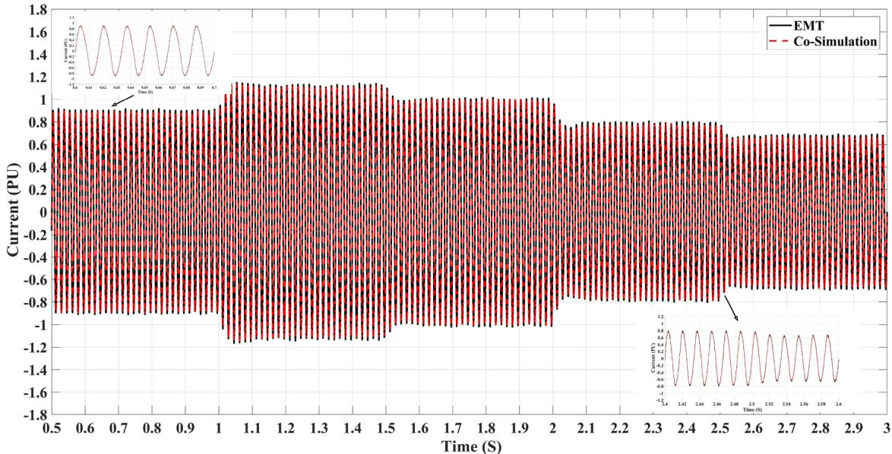  
Fig. 8. Effect of irradiance on PCC current.

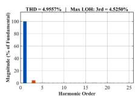  
(a) EMT 0.5-1.0 s

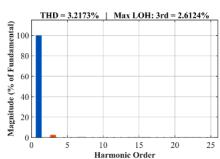  
(b)EMT 1.0-1.5 s

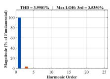  
(c) EMT 1.5-2.0 s

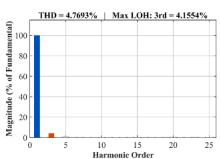  
(d) EMT 2.0-2.5 s

  
(e)EMT2.5-3.0 s

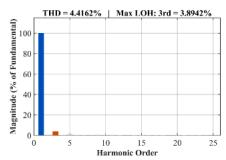  
(f) Co-sim 0.5-1.0 s

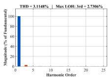  
(g) Co-sim 1.0-1.5 s

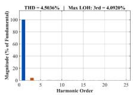  
(h) Co-sim 1.5-2.0 s

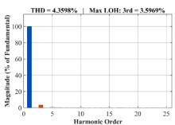  
(i) Co-sim 2.0-2.5 s

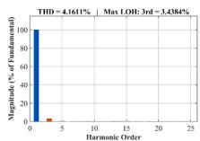  
(j) Co-sim 2.5-3.0 s   
Fig. 9. Effect of irradiance on the %THD of PCC current under different simulation environments.

Fig. 4 illustrates the fuzzification of input and output variables used in the fuzzy logic–based MPPT controller, where each variable is expressed through five linguistic terms over a normalized range of [−1, 1]. Fig. 4(a) represents the Error (?? ), corresponding to the slope of the instantaneous power–voltage (P–V) curve. A highly negative error (NB, NS) indicates operation on the right side of the maximum power point (MPP), whereas a positive slope (PS, PB) signifies the left side. The wide spread of membership functions allows the controller to interpret a broad range of slope deviations, ensuring effective identification of the MPP region. Fig. 4(b) shows the Change in Error $( \Delta E _ { k } ) _ { i }$ , reflecting how rapidly the slope is varying between consecutive measurements. These membership functions are narrower and concentrated near zero, highlighting sensitivity to fine dynamic changes in the power curve.

Fig. 4(c) depicts the Output variable (Δ??), representing the change in the converter’s duty cycle. The membership functions here are tightly clustered around the zero region, signifying that once the system approaches the MPP, the controller applies only small corrective adjustments to maintain stability and avoid oscillations. Larger changes in duty cycle occur only when the operating point is far from the MPP (NB or PB regions).

The output (Δ??) is used to adjust the duty cycle of the DC-DC converter:

$$
D _ {\text {n e w}} = D _ {\text {o l d}} + \Delta D \tag {36}
$$

# 2.6. Decoupled current control

Decoupled current control, a commonly employed strategy in gridconnected inverters, enables the independent regulation of active and reactive power. For a detailed explanation of this method, readers are encouraged to refer [40–42].

# 2.7. Synchronization logic

The clock signal can be represented as:

$$
T _ {\mathrm {c l k}} (t) = t \tag {37}
$$

The hold signal can be expressed as:

$$
T _ {\text {h o l d}} (t) = \left\lfloor \frac {t}{T _ {\text {h o l d}}} \right\rfloor \cdot T _ {\text {h o l d}} \tag {38}
$$

where ⌊??⌋ represents the floor function, which rounds down ?? to the nearest integer. The output of the comparator, pause(??):

$$
\operatorname {p a u s e} (t) = \left\{ \begin{array}{l l} 1 & \text {i f} T _ {\mathrm {c l k}} (t) = T _ {\mathrm {h o l d}} (t) \\ 0 & \text {o t h e r w i s e} \end{array} \right. \tag {39}
$$

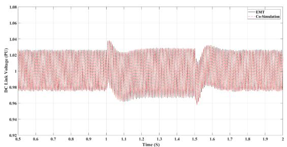  
(a) Effect of reactive power injection on DC link voltage

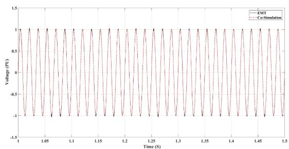  
(b) Effect of reactive power injection on PCC voltage

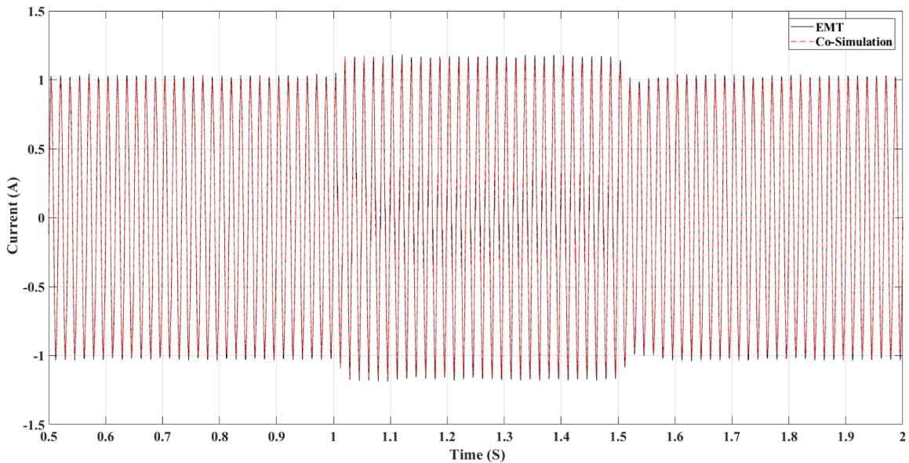  
(c) Effect of reactive power injection on PCC current   
Fig. 10. Effect of reactive power injection: (a) DC link voltage, (b) PCC voltage, (c) PCC current.

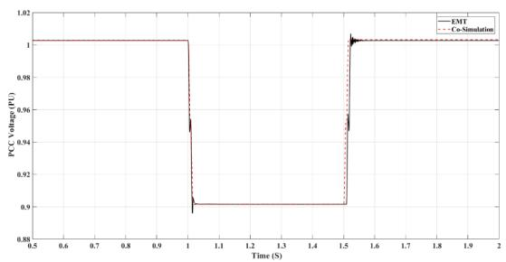  
(a) PCC Voltage (RMS) during Fault

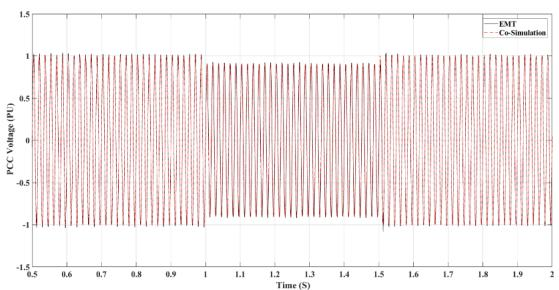  
(b)PCC Voltage (Instantaneous) during Fault

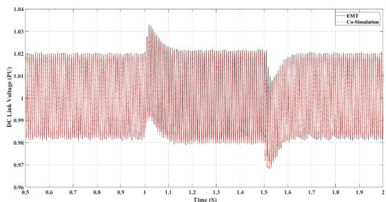  
(c) DC Link Voltage during Fault

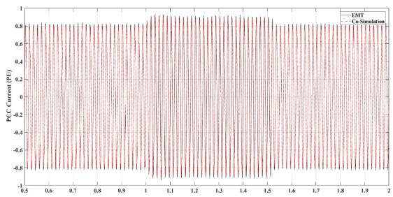  
(d) PCC Current during Fault   
Fig. 11. Performance of the system during fault: (a) PCC Voltage (RMS), (b) PCC Voltage (Instantaneous), (c) DC Link Voltage, (d) PCC Current.

Table 3 Load demand.   

<table><tr><td>Load Name</td><td>Load Type</td><td>Voltage (kV)</td><td>Active Power (kW)</td><td>Reactive Power (kVAR)</td></tr><tr><td>Load-671</td><td>3-phase</td><td>4.16</td><td>115.5</td><td>66.0</td></tr><tr><td>Load-634a</td><td>1-phase</td><td>0.277</td><td>6.0</td><td>4.5</td></tr><tr><td>Load-634b</td><td>1-phase</td><td>0.277</td><td>12.0</td><td>9.0</td></tr><tr><td>Load-634c</td><td>1-phase</td><td>0.277</td><td>12.0</td><td>9.0</td></tr><tr><td>Load-645</td><td>1-phase</td><td>2.40</td><td>17.0</td><td>12.5</td></tr><tr><td>Load-646</td><td>3-phase</td><td>4.16</td><td>23.0</td><td>13.2</td></tr><tr><td>Load-675a</td><td>1-phase</td><td>2.40</td><td>48.5</td><td>19.0</td></tr><tr><td>Load-675b</td><td>1-phase</td><td>2.40</td><td>6.8</td><td>6.0</td></tr><tr><td>Load-675c</td><td>1-phase</td><td>2.40</td><td>29.0</td><td>21.2</td></tr><tr><td>Load-611</td><td>1-phase</td><td>2.40</td><td>17.0</td><td>8.0</td></tr><tr><td>Load-652</td><td>1-phase</td><td>2.40</td><td>12.8</td><td>8.6</td></tr><tr><td>Load-670a</td><td>1-phase</td><td>2.40</td><td>1.7</td><td>1.0</td></tr><tr><td>Load-670b</td><td>1-phase</td><td>2.40</td><td>6.6</td><td>3.8</td></tr><tr><td>Load-670c</td><td>1-phase</td><td>2.40</td><td>11.7</td><td>6.8</td></tr></table>

Note: Voltages for 3-phase loads are given as line-to-line voltages, while those for 1-phase loads are phase voltages.

Table 4 Irradiance profile applied during simulation.   

<table><tr><td>Time Interval (s)</td><td>0.5–1.0</td><td>1.0–1.5</td><td>1.5–2.0</td><td>2.0–2.5</td><td>2.5–3.0</td></tr><tr><td>Irradiance (p.u.)</td><td>0.8</td><td>1.0</td><td>0.9</td><td>0.7</td><td>0.6</td></tr></table>

# 3. Validation of Co-simulation in modified IEEE - 13 bus test feeder

The proposed Co-simulation framework is validated using the modified IEEE 13-bus test feeder, as illustrated in Fig. 5. A 9 kW singlephase photovoltaic (PV) system is designed and connected to phase–A of Bus 634. To enable EMT-based transient analysis, the feeder loading has been uniformly scaled down by a factor of ten, thereby reducing the total load demand to 10 % of its nominal value, as summarized in Table 3.

As shown in Fig. 1, the IEEE 13-bus distribution network is modeled in OpenDSS to perform QSTS analysis with a time step of 1 minute, while the PV system which includes PV array, MPPT converter and grid connected inverter are modeled in the EMT domain of MAT-LAB/Simulink. At each QSTS time step in OpenDSS, the corresponding Thevenin equivalent parameters (voltage and impedance) of the feeder are extracted and transferred to the EMT environment. Using these parameters, a Thevenin equivalent circuit is dynamically reconstructed within Simulink.

For every 1 minute QSTS interval, the EMT simulation runs for a duration of $T _ { \mathrm { E M T } } = 0 . 5 ~ \mathrm { s }$ with an EMT time step (????) of 50 $\mu \mathrm { s } ,$ thereby capturing the fast transient dynamics within each quasi-static interval. To maintain consistency, the complete network is also implemented within the EMT environment of MATLAB/Simulink using the same 50 ??s resolution.

A total of 5 minutes of QSTS simulation is considered for the analysis, corresponding to 2.5 s of EMT simulation time (spanning from 0.5 to 3 s).

Subsequent sections provide a comprehensive validation of the Cosimulation framework under various operating scenarios, including (i) varying solar irradiance conditions, (ii) reactive power injection from the PV system, and (iii) grid fault conditions. The comparative analysis between the Co-simulation and the full-system EMT responses demonstrates the accuracy and reliability of the proposed approach in capturing both steady-state and transient dynamics of the integrated distribution network.

# 3.1. Effect of varying irradiance

Variations in irradiance can lead to sudden changes in photovoltaic (PV) power output. These abrupt changes can cause transients in the

DC link voltage. QSTS simulations are unable to effectively capture such transient behavior. In contrast, a Co-simulation approach provides detailed insights into DC link voltage transients during irradiance changes, as well as steady-state voltage ripples. Table 4 presents the irradiance profile used for both simulations, while Fig. 6 highlights the similarities in DC link voltage variations observed in EMT simulation and Cosimulation.

Table 5 compares the steady-state and transient performance of EMT simulation and Co-simulation for the DC link voltage. Steady-state performance is evaluated based on the peak-to-peak variation of the DC link voltage, while transient performance is assessed by the settling time following a change in irradiance.

Table 5 reveals that the steady-state performance of both simulation approaches is highly consistent, with only minor deviations in the peakto-peak voltage ripple. For instance, during the time interval 0.5–1.0 s, the ripple is 0.040 p.u. for the EMT model and 0.036 p.u. for the Cosimulation, yielding an RMSE of 0.0040. Across the remaining intervals, the deviations remain minimal, with the average RMSE for the steadystate response calculated as 0.0026 p.u., confirming that both methods maintain nearly identical DC link voltage ripple characteristics.

In terms of transient performance, both simulations exhibit generally consistent settling times across the considered intervals. However, noticeable deviations occur at 1.0 s and 2.0 s, where the EMT and Cosimulation models show settling times of 0.19 s and 0.22 s, 0.12 s and 0.14 s, respectively. These differences correspond to instances where a large change in irradiance is applied, resulting in slightly higher RMSE values at those points. For the remaining intervals, such as 1.5 s and 2.5 s, both approaches achieve identical settling times, indicating uniform dynamic response. The average RMSE for the transient response is 0.0125, confirming that both simulation environments demonstrate closely matched transient characteristics and stable convergence under varying irradiance conditions.

Varying irradiance leads to slight deviations in the Point of Common Coupling (PCC) voltage from its rated value. Table 6 presents the comparison between EMT and Co-simulation results, showing strong correlation with RMSE values between 0.00007 and 0.00034. A marginal rise in RMSE around 2.0–2.5 s corresponds to transient effects caused by irradiance variation. Fig. 7(a) depicts the RMS voltage response, while Fig. 7(b) provides a snapshot of the instantaneous PCC voltage from 0.5 s to 0.6 s, confirming consistent voltage behavior across both models. The mean RMSE of 0.00019 further supports the numerical accuracy of the Co-simulation framework.

Fig. 8 shows the effect of irradiance on PCC current. Table 7 compares the PCC current values in a PV system, as obtained from EMT and Co-simulation environments over different time intervals. B The RMSE values, ranging from 0.0020 to 0.0100, indicate close numerical agreement between the two approaches. The Co-simulation consistently

Table 5 Comparison of DC link voltage performance between EMT and Co-simulation.   

<table><tr><td colspan="4">Steady-State Analysis (Peak-to-Peak Ripple, p.u.)</td><td colspan="4">Transient Analysis (Settling Time, s)</td></tr><tr><td>Time (s)</td><td>EMT</td><td>Co-Sim.</td><td>RMSE</td><td>Time (s)</td><td>EMT</td><td>Co-Sim.</td><td>RMSE</td></tr><tr><td>0.5–1.0</td><td>0.040</td><td>0.036</td><td>0.0040</td><td>1.0</td><td>0.19</td><td>0.22</td><td>0.0300</td></tr><tr><td>1.0–1.5</td><td>0.048</td><td>0.050</td><td>0.0020</td><td>1.5</td><td>0.15</td><td>0.15</td><td>0.0000</td></tr><tr><td>1.5–2.0</td><td>0.046</td><td>0.043</td><td>0.0030</td><td>2.0</td><td>0.12</td><td>0.14</td><td>0.0200</td></tr><tr><td>2.0–2.5</td><td>0.030</td><td>0.031</td><td>0.0010</td><td>2.5</td><td>0.15</td><td>0.15</td><td>0.0000</td></tr><tr><td>2.5–3.0</td><td>0.024</td><td>0.026</td><td>0.0020</td><td>-</td><td>-</td><td>-</td><td>-</td></tr><tr><td>Average RMSE</td><td>0.0026</td><td></td><td></td><td>-</td><td>0.0125</td><td></td><td></td></tr></table>

Table 6 Comparison of PCC voltage under varying irradiance conditions.   

<table><tr><td>Time Duration (s)</td><td>EMT (p.u.)</td><td>Co-Simulation (p.u.)</td><td>RMSE</td></tr><tr><td>0.5–1.0</td><td>1.00522</td><td>1.00535</td><td>0.00013</td></tr><tr><td>1.0–1.5</td><td>1.00540</td><td>1.00533</td><td>0.00007</td></tr><tr><td>1.5–2.0</td><td>1.00530</td><td>1.00518</td><td>0.00012</td></tr><tr><td>2.0–2.5</td><td>1.00513</td><td>1.00479</td><td>0.00034</td></tr><tr><td>2.5–3.0</td><td>1.00503</td><td>1.00482</td><td>0.00021</td></tr><tr><td>Mean RMSE</td><td></td><td></td><td>0.00019</td></tr></table>

Table 7 PCC current under varying irradiance conditions.   

<table><tr><td>Time Duration (s)</td><td>EMT (p.u.)</td><td>Co-Simulation (p.u.)</td><td>RMSE</td></tr><tr><td>0.5–1.0</td><td>0.805</td><td>0.795</td><td>0.0100</td></tr><tr><td>1.0–1.5</td><td>1.000</td><td>0.998</td><td>0.0020</td></tr><tr><td>1.5–2.0</td><td>0.902</td><td>0.898</td><td>0.0040</td></tr><tr><td>2.0–2.5</td><td>0.711</td><td>0.705</td><td>0.0060</td></tr><tr><td>2.5–3.0</td><td>0.599</td><td>0.597</td><td>0.0020</td></tr><tr><td>Mean RMSE</td><td></td><td></td><td>0.0048</td></tr></table>

Table 8 Comparison of %THD, highest LOH, and RMSE of PCC current under varying irradiance.   

<table><tr><td rowspan="2">Time Duration (s)</td><td colspan="2">EMT</td><td colspan="2">Co-Simulation</td><td colspan="2">RMSE</td></tr><tr><td>%THD</td><td>LOH</td><td>%THD</td><td>LOH</td><td>%THD</td><td>LOH</td></tr><tr><td>0.5–1.0</td><td>4.9557</td><td>4.5250</td><td>4.4162</td><td>3.8942</td><td>0.5395</td><td>0.6308</td></tr><tr><td>1.0–1.5</td><td>3.2173</td><td>2.6124</td><td>3.1148</td><td>2.7306</td><td>0.1025</td><td>0.1182</td></tr><tr><td>1.5–2.0</td><td>3.9901</td><td>3.5350</td><td>4.5036</td><td>4.0920</td><td>0.5135</td><td>0.5570</td></tr><tr><td>2.0–2.5</td><td>4.7693</td><td>4.1554</td><td>4.3598</td><td>3.5969</td><td>0.4095</td><td>0.5585</td></tr><tr><td>2.5–3.0</td><td>4.9240</td><td>3.8617</td><td>4.1611</td><td>3.4384</td><td>0.7629</td><td>0.4233</td></tr></table>

Table 9 Comparison of total simulation time for 3 s duration.   

<table><tr><td>Simulation Type</td><td>Time (s)</td><td>Time Saved (s)</td><td>Time Saving (%)</td></tr><tr><td>EMT Simulation</td><td>56.78</td><td>-</td><td>-</td></tr><tr><td>Co-Simulation</td><td>16.55</td><td>40.23</td><td>70.85%</td></tr></table>

exhibits slightly lower current magnitudes compared to EMT, with the highest deviation observed during the 0.5–1.0 s interval (RMSE = 0.0100).

Table 8 compares the Total Harmonic Distortion (THD) and the Lowest Order Harmonic (LOH) of the PCC current obtained from EMT and Co-simulation models under varying irradiance conditions. The results show close correlation between the two methods, with RMSE ranging from 0.10 to 0.76. The LOH values follow a similar trend, exhibiting minor variation with RMSE between 0.12 and 0.63, indicating that both simulations capture comparable harmonic behavior. Fig. 9(a–e) illustrate the FFT spectra from the EMT simulation, while Fig. 9(f–j) present the corresponding Co-simulation results, both confirming consistent harmonic profiles and dominant frequency components across varying irradiance levels.

Table 10 Comparison of PCC parameters during fault condition.   

<table><tr><td>Parameter (p.u.)</td><td>EMT</td><td>Co-Simulation</td><td>RMSE</td></tr><tr><td>VFault</td><td>0.902</td><td>0.902</td><td>0.0000</td></tr><tr><td>IFault</td><td>0.900</td><td>0.892</td><td>0.0080</td></tr></table>

Table 9 presents the total simulation time for a 3 s run in both EMT and co-simulation environments. The co-simulation completes the same operation in 16.55 s compared to 56.78 s for the EMT model, resulting in an overall time saving of 40.23 s, equivalent to approximately 70.85 %. This demonstrates the computational efficiency of the co-simulation framework, offering substantial reduction in execution time without compromising simulation accuracy.

# 3.2. Effect of reactive power injection

Reactive power injection from the PV system can cause transients in the DC link voltage, which are not observable in phasor domain simulations. However, Co-Simulation techniques enable the study of these transients. As illustrated in Fig. 10(a), the DC link voltage experiences a transient when a reactive current injection command is applied between 1s and 1.5s. Both EMT and Co-Simulation methods capture this transient behavior consistently during the reactive current injection period. Fig. 10(b) and (c) depict the PCC voltage and PCC current during the same interval. An increase in current is noticeable between 1s and 1.5s, corresponding to the commanded additional reactive current. In both simulation environments, the voltage and current demonstrate identical steady-state and transient responses.

# 3.3. Effect of grid side fault

The fault condition simulation performed in both EMT and Cosimulation environments demonstrates a high degree of consistency between the two methods, as shown in Table 10. The fault voltage remains identical at 0.902 p.u. in both simulations, while the fault current shows an RMSE of 0.0080 p.u. (EMT: 0.900, Co-simulation: 0.892). Fig. 11(a) to (d) confirm the capability of the Co-simulation framework to accurately reproduce EMT behavior during fault conditions, particularly for key parameters such as DC link voltage, PCC voltage, and PCC current.

# 4. Conclusion

This study presents a hybrid Co-simulation framework integrating OpenDSS with the Simulink-based EMT model to analyze photovoltaic (PV) system integration within distribution networks. The Co-simulation approach effectively captures both steady-state and transient behaviors of DC link voltage, PCC voltage, and PCC current, offering a detailed representation of grid dynamics that phasor-based simulations cannot fully resolve. Validation using the IEEE 13-bus test feeder confirmed strong agreement between EMT and Co-simulation results across key performance indices, including voltage regulation, current response, and Total Harmonic Distortion (THD).

The hybrid framework demonstrated high numerical accuracy, with deviations typically below 1 %, while achieving a significant reduction in computational time compared to full EMT simulations. This efficiency highlights its suitability for analyzing fast-switching converter systems and RE interactions. Moreover, the Co-simulation model accurately captured system transients under varying irradiance, reactive power injection, and fault conditions, confirming its robustness and reliability for PV-integrated grid studies.

However, the accuracy of the Co-simulation depends on the precision of the Thevenin equivalent parameter extraction method employed, which can influence result fidelity under highly dynamic grid conditions. Overall, this Co-simulation framework can serve as a strong foundation for advanced studies on RE integration, power quality enhancement, and control strategy development in highly complex and largescale distribution networks.

# CRediT authorship contribution statement

Dhaval Yogeshbhai Raval: Writing – original draft, Software, Methodology, Investigation, Formal analysis, Data curation, Conceptualization; Saurabh N. Pandya: Writing – review & editing, Validation, Supervision.

# Data availability

No data was used for the research described in the article.

# Declaration of competing interest

The authors declare that they have no known competing financial interests or personal relationships that could have appeared to influence the work reported in this paper.

# References

[1] Per capita consumption of energy. ministry of power, https://pib.gov.in/ PressReleaseIframePage.aspx?PRID=2084914.   
[2] M. Bajaj, A.K. Singh, Grid integrated renewable DG systems: a review of power quality challenges and state-of-the-art mitigation techniques, Int. J. Energy Res. 44 (1) (2020) 26–69.   
[3] V. Saxena, S. Manna, S.K. Rajput, P. Kumar, B. Sharma, M.H. Alsharif, M.-K. Kim, Navigating the complexities of distributed generation: integration, challenges, and solutions, Energy Rep. 12 (2024) 3302–3322.   
[4] H. Eroglu,˘ E. Cuce, Harmonic problems in renewable and sustainable energy systems: a comprehensive review, Sustainable Energy Technol. Assess. 48 (2021) 101566. Pinar Mert Cuce, Fatih Gul and Abdulkerim Iskenderoglu.˘   
[5] E. Zhao, Y. Han, X. Lin, E. Liu, P. Yang, A.S. Zalhaf, Harmonic characteristics and control strategies of grid-connected photovoltaic inverters under weak grid conditions, Int. J. Electr. Power Energy Syst. 142 (2022) 108280.   
[6] A. Arranz-Gimon, A. Zorita-Lamadrid, D. Morinigo-Sotelo, O. Duque-Perez, A review of total harmonic distortion factors for the measurement of harmonic and interharmonic pollution in modern power systems, Energies 14 (20) (2021) 6467.   
[7] F. Özveren, Ö. Usta, A power based integrated protection scheme for active distribution networks against asymmetrical faults, Electr. Power Syst. Res. 218 (2023) 109223.   
[8] D.Y. Raval, S.N. Pandya, Phase shifting strategy for mitigation of local voltage rise in highly PV penetrated distribution network, in: Th IEEE International Conference on Power Systems (ICPS), Kharagpur, India, 2021, pp. 1–6. https://doi.org/10.1109/ ICPS52420.2021.9670088   
[9] C.D. Iweh, S. Gyamfi, E. Tanyi, E. Effah-Donyina, Distributed generation and renewable energy integration into the grid: prerequisites, push factors, practical options, issues and merits, Energies 14 (17) (2021) 5375.   
[10] Y.M. Nsaif, M.S.H. Lipu, A. Ayob, Y. Yusof, A. Hussain, Fault detection and protection schemes for distributed generation integrated to distribution network: challenges and suggestions, IEEE Access 9 (2021) 142693–142717.   
[11] S. Subedi, M. Rauniyar, S. Ishaq, T.M. Hansen, R. Tonkoski, M. Shirazi, Review of methods to accelerate electromagnetic transient simulation of power systems, IEEE Access 9 (2021) 89714–89731.   
[12] X. He, H. Geng, G. Mu, Modeling of wind turbine generators for power system stability studies: a review, Renewable Sustainable Energy Rev. 143 (2021) 110865.   
[13] J. Xu, C. Gao, J. Ding, X. Shi, M. Feng, C. Zhao, H. Ding, High-speed electromagnetic transient (EMT) equivalent modelling of power electronic transformers, IEEE Trans. Power Delivery 36 (2) (2021) 975–986.   
[14] J. Choi, S. Debnath, Electromagnetic transient (EMT) simulation algorithm for evaluation of photovoltaic (PV) generation systems, in: IEEE Kansas Power and Energy

Conference (KPEC), Manhattan, KS, USA, 2021, pp. 1–6. https://doi.org/10.1109/ KPEC51835.2021.9446234   
[15] S. Debnath, P. Marthi, J. Choi, S. Samanta, N.R. Chaudhuri, A. Arana, H. Karimjee, D. Piper, M. Arifujjaman, EMT Simulation of large PV plant & power grid for disturbance analysis, in: IEEE PES Innovative Smart Grid Technologies Latin America (ISGT-LA), San Juan, PR, USA, 2023, pp. 345–349. https://doi.org/10.1109/ ISGT-LA56058.2023.10328215   
[16] S. Debnath, J. Choi, H. Hughes, K. Kurte, P. Marthi, S. Hahn, High-performance computing based EMT simulation of large PV or hybrid PV plants, in: IEEE Power & Energy Society General Meeting (PESGM), Orlando, FL, USA, 2023, pp. 1–5. https: //doi.org/10.1109/PESGM52003.2023.10252525   
[17] J. Mahseredjian, V. Dinavahi, J.A. Martinez, Simulation tools for electromagnetic transients in power systems: overview and challenges, IEEE Trans. Power Delivery 9 (2009) 1657–1669.   
[18] M.T. Milani, B. Khodabakhchian, J. Mahseredjian, Detailed EMT-Type load modeling for power system dynamic and harmonic studies, IEEE Trans. Power Delivery 38 (1) (2023) 703–711.   
[19] O. Ikotun, E.B. Agyekum, E.M. Ahmed, S. Kamel, Using Matlab/Simulink Software Package to Investigate Fault Behaviors in HVDC System” Mathematics, 10, 2022.   
[20] M. Xiong, B. Wang, D. Vaidhynathan, J. Maack, M.J. Reynolds, A. Hoke, K. Sun, D. Ramasubramanian, V. Verma, J Tan, An open-source parallel, EMT Simul. Framework” Math. 235 (2024) 110734.   
[21] M.J. Reno, J. Deboever, B. Mather, Motivation and requirements for quasi-static time series (QSTS) for distribution system analysis, in: IEEE Power & Energy Society General Meeting, Chicago, IL, USA, 2017, pp. 1–5. https://doi.org/10.1109/PESGM. 2017.8274703   
[22] M.U. Qureshi, S. Grijalva, M.J. Reno, J. Deboever, X. Zhang, R.J. Broderick, A fast scalable quasi-static time series analysis method for PV impact studies using linear sensitivity model, IEEE Trans. Sustainable Energy 10 (2019) 301–310.   
[23] J.A. Azzolini, M.J. Reno, N.S. Gurule, K.A.W. Horowitz, Evaluating distributed PV curtailment using quasi-Static time-Series simulations, IEEE Open Access J. Power Energy 8 (2021) 365–376.   
[24] V.C. Cunha, T. Kim, P. Siratarnsophon, N. Barry, S. Santoso, W. Freitas, Quasi-static time-series power flow solution for islanded and unbalanced three-phase microgrids, IEEE Open Access J. Power Energy 8 (2021) 97–106.   
[25] J. Suchithra, A. Rajabi, D. Robinson, A. Pors, B. Hellyer, Forecasting PV curtailments in large electricity distribution networks using quasi-static time series simulations, in: 32nd Australasian Universities Power Engineering Conference (AU-PEC), Adelaide, Australia, 2022, pp. 1–6. https://doi.org/10.1109/AUPEC58309. 2022.10215932   
[26] H. Wu, J. Li, H. Yang, Research methods for transient stability analysis of power systems under large disturbances, Energies 17 (2024) 4330.   
[27] C. Gomes, C. Thule, D. Broman, P.G. Larsen, H. Vangheluwe, Co-Simulation: State of the Art, Technical Report, arXiv preprint, 2017.   
[28] X. Xu, T. Zhang, Z. Qiu, H. Gao, A Co-simulation framework for distribution network analysis: case study of hosting capacity analysis, in: China Automation Congress (CAC), Chongqing, China, 2023, pp. 6558–6562. https://doi.org/10.1109/ CAC59555.2023.10451457   
[29] S.M. Mohseni-Bonab, A. Hajebrahimi, Ali Moeini and innocent Kamwa, “optimization application in integrated transmission and distribution operation: Co-simulation approach, in: IEEE Power & Energy Society General Meeting (PESGM), Montreal, QC, Canada, 2020, pp. 1–5. https://doi.org/10.1109/PESGM41954.2020.9281439   
[30] A. Hariri, M. O. Faruque, A hybrid simulation tool for the study of PV integration impacts on distribution networks, IEEE Trans. Sustainable Energy 8 (2) (2017) 648–657.   
[31] A. Hariri, A. Newaz, M.O. Faruque, Open-source python-OpenDSS interface for hybrid simulation of PV impact studies, IET Gener. Trans. Distrib. 8 (12) (2017) 648–657.   
[32] Z. Dong, A. Ingalalli, M.A. Mamun, G. Bharati, S. Kamalasadan, S. Chakraborty, S. Paudyal, A. Ashok, An EMT-phasor Co-simulation setup for studying reconfiguration of distribution system with inverter based resources, in: IEEE Power & Energy Society General Meeting (PESGM), Seattle, WA, USA, 2024, pp. 1–5. https: //doi.org/10.1109/PESGM51994.2024.10688902   
[33] Y. Liu, W. Du, S.G. Abhyankar, An electromagnetic transient and three-phase phasor Co-simulation platform for studying distribution system transients with high penetration of DERs, in: IEEE Power & Energy Society General Meeting (PESGM), Orlando, FL, USA, 2023, pp. 1–5. https://doi.org/10.1109/PESGM52003.2023. 10253236   
[34] R. Wagle, L.N.H. Pham, G. Tricarico, P. Sharma, J.L. Rueda, F. Gonzalez-Longatt, Co-simulation-based optimal reactive power control in smart distribution network, Electr. Eng. 106 (3) (2024) 2391–2405.   
[35] K. Mudunkotuwa, S. Filizadeh, Co-simulation of electrical networks by interfacing EMT and dynamic-phasor simulators, Electr. Power Syst. Res. 163 (1) (2018) 423–429.   
[36] F. Plumier, P. Aristidou, C. Geuzaine, T.V. Cutsem, Co-simulation of electromagnetic transients and phasor models: a relaxation approach, IEEE Trans. Power Delivery 31 (5) (2016) 2360–2369.   
[37] S.M. Abdelkader, J. Morrow, Online Thévenin equivalent determination considering system side changes and measurement errors, IEEE Trans. Power Syst. 30 (5) (2015) 2716–2725.   
[38] A. Reinders, P. Verlinden, W.V. Sark, A. Freundlich,Photovoltaic Solar Energy: From Fundamentals to Applications John Wiley & Sons, Hoboken, NJ, USA, 2017 511-529.   
[39] R.W. Erickson, D. Maksimovic, Fundamentals of Power Electronics, New York, NY, USA, Springer Science & Business Media, 2007.

[40] R. Zhang, M. Cardinal, P. Szczesny, M. Dame, A grid simulator with control of singlephase power converters in D-Q rotating frame, in: IEEE 33rd Annual IEEE Power Electronics Specialists Conference, Cairns, QLD, Australia, 2002, pp. 1–5. https:// doi.org/10.1109/PSEC.2002.1022377   
[41] S. Golestan, M. Monfared, J.M. Guerrero, M. Joorabian, A D-Q synchronous frame controller for single-phase inverters,

in: 2nd Power Electronics, Drive Systems and Technologies Conference, Tehran, Iran, 2011, pp. 317–323. https://doi.org/10.1109/PEDSTC.2011.5742439   
[42] A. Roshan, R. Burgos, A.C. Baisden, F. Wang, D. Boroyevich, A D-Q frame controller for a full-bridge single phase inverter used in small distributed power generation systems, in: 2nd Power Electronics, Drive Systems and Technologies Conference, Anaheim, CA, USA, 2007, pp. 641–647. https://doi.org/10.1109/APEX.2007.357582