# 考虑磁滞特性变压器 PSCAD/EMTDC 电磁暂态仿真建模方法及励磁差异性分析

吴嘉琪 1 ，李晓华 1 ，陈忠 2 ，丁晓兵 3 ，田庆 3

(1．华南理工大学电力学院，广东省 广州市 510640；2．中国南方电网有限责任公司超高压输电公司，广东省 广州市 510620；3．中国南方电网有限责任公司电力调度控制中心，广东省 广州市 510623)

# A Transformer Model With Hysteresis Characteristics for Electromagnetic Transients Based on PSCAD/EMTDC and Excitation Difference Analysis

WU Jiaqi1 , LI Xiaohua1 , CHEN Zhong2 , DING Xiaobing3 , TIAN Qing3

(1. School of Electric Power, South China University of Technology, Guangzhou 510640, Guangdong Province, China;

2. Ultra-High Voltage Transmission Company of CSG, Guangzhou 510620, Guangdong Province, China;   
3. Power Dispatching and Communication Center of CSG, Guangzhou 510623, Guangdong Province, China)

ABSTRACT: In order to research the inrush problems in HVDC transmission projects, a new three-phase transformer model with hysteresis characteristics of PSCAD/EMTDC was presented, which derives from ideas of the transformer model considering hysteresis characteristics in ATP-EMTP, in which it consists of Type96 and BCTRAN. This model added an excitation branch considering hysteresis characteristics based on the classical model. The hysteresis characteristics can be described effectively when using experimental data obtained. The simulation results show that the model reflects excitation characteristics well, and parameters are readily available, it’s easy for users to use it in PSCAD/EMTDC. It also studied the differences of excitation characteristics simulated by the hysteresis loop and the hysteresis midline, and it concluded that there is a consistency in respect of the inrush current peak in transient process if the hysteresis midline instead of the hysteresis loop to simulate the excitation characteristics of transformer cores, but the hysteresis loop has a greater impact on the transient process especially the harmonic characteristics of inrush current.

KEY WORDS: hysteresis loop; hysteresis midline; excitation characteristics; three-phase classical transformer model ； ATP-EMTP; PSCAD/EMTDC; electromagnetic transient simulation

摘要：为了研究高压直流输电中励磁涌流问题，该文结合

ATP-EMTP 电磁暂态仿真软件中描述铁心铁磁材料磁滞特性的非线性电感Type96以及BCTRAN共同建立考虑磁滞特性变压器模型思想，提出一种考虑磁滞特性变压器PSCAD/EMTDC电磁暂态仿真新模型。该模型在经典模型的基础上增加了考虑磁滞特性的励磁支路，利用试验获得的最大磁滞回线数据便可有效地反映变压器的磁滞特性，验证表明该模型能很好地反映变压器磁滞特性，且因参数易得，便于用户在 PSCAD/EMTDC 中仿真使用。同时也仿真研究利用磁滞回线和磁滞中线模拟变压器励磁特性的差异性，得出采用磁滞中线代替磁滞回线来模拟变压器铁心励磁特性在励磁涌流峰值上具有一致性，但磁滞回线对涌流稳态过程特别是谐波特性有较大影响。

关键词：磁滞回线；磁滞中线；励磁特性；三相经典变压器模型；ATP-EMTP；PSCAD/EMTDC；电磁暂态仿真

# 0 引言

高压直流输电系统一极投入运行时，其上的Y/Y和 Y/D两台换流变将同时空载投入。在系统电压的励磁下，由于换流变内部非线性铁心因不同的初始电压而达到不同的饱和程度，往往会产生较大的励磁涌流，另一极换流变会出现复杂性和应涌流。此过程会对换流变内部结构产生强烈的冲击，同时因励磁涌流含有大量的非周期分量和高次谐波分量，导致电流互感器铁心严重饱和，产生不平衡暂态电流，引起换流变保护误动[1]。因此，研究换流变复杂性涌流特性及其抑制措施研究尤为必要，而其研究核心在于对换流变压器铁心励磁特性

的精确建模。文献[2]采用 J-A理论拟合磁滞回线，通过改良的艾杰文函数来拟合各向同性铁磁物质的理想磁化曲线，以磁畴壁位移思想为基础并根据能量损耗原理推导出磁滞回线方程，由于获取模型中 5 个参数的过程较为复杂，对实际工程不是很实用；文献[3]在经典 Preisach 模型的基础上修正完善了磁滞回线数学模型，但模型参数的确定较为困难，不太适用于实际工程；文献[4]采用修正的反正切函数描述未饱和时主区间内的两条极限磁滞回环，采用两条平行的直线段来描述饱和后主区间外的磁化曲线，只拟合了最大磁滞回线，未考虑其内部的次磁滞回线簇。

综合目前变压器模型研究现状，尚有两方面的问题需要进一步深入研究：

1）考虑磁滞特性变压器 PSCAD/EMTDC 电磁暂态模型。由于 PSCAD/EMTDC 中经典变压器模型不能较好地反映电力变压器的励磁特性真实状况，同时也考虑到，用于国内高压直流输电工程研究的基于 PSCAD/EMTDC 仿真平台的西门子、南瑞的所有直流控制保护模型中没有计及磁滞特性的变压器模型，因此建立考虑磁滞特性的变压器模型很有必要。  
2）磁滞回线与磁滞中线模拟变压器励磁特性的差异性以及两种模拟方式在不同研究目的下的选取问题。通过了解两种模拟方式的异同点及各自的优缺点，以便后期研究针对不同的研究目的选取不同的变压器励磁特性模拟方式，目的性更强，研究效率更高。

本文提出了一种考虑铁心磁滞特性的变压器PSCAD/EMTDC 电磁暂态仿真新模型。该模型采用自定义编程创建描述磁滞特性的非线性电感，将其并联在变压器的绕组间，利用非线性电感支路来模拟变压器的励磁支路，并结合 ATP-EMTP 变压器模型仿真以及实际电力变压器试验来验证其合理性，同时基于 PSCAD/EMTDC 电磁暂态仿真软件仿真分析采用磁滞中线与磁滞回线模拟变压器励磁特性在变压器空载合闸励磁涌流特性中的差异性，提出相应的模型使用建议。

# 1 考虑磁滞特性变压器模型

# 1.1 铁心磁滞特性描述

磁滞回线反映了铁磁材料的磁化性能，而磁化过程是比较复杂的，铁磁材料的磁化强度 M、磁感

应强度 B 和磁场强度 H 之间的关系不仅不是线性的，而且不是单值的，决定了磁滞特性模拟本身是一个复杂的过程。目前实际直流工程对应的直流控制保护模型均基于 PSCAD/EMTDC 软件，虽然国内外学者做出了大量关于模拟变压器磁滞特性的研究[2-17]，但结合国内实际工程和 PSCAD/EMTDC软件自身特点能运用于其中的磁滞回线拟合方法几乎没有。

励磁回线轨迹的主要影响因素有电流大小、方向及剩磁的大小，本文以剩磁为 0的情况为例，给出几种可能出现的情况作分析，如图 1 所示。其中最外闭合曲线为主磁滞回线，直线 l 为运行轨迹由磁滞中线到磁滞回线对应电流的分界线， $P _ { i }$ 为电流峰值点，对应于磁滞回线的左右转折； $o _ { i }$ 为电流过零点，对应于磁滞回线与 Y 轴的交点，其中 i$1 , 2 , \cdots , 6 \ \circ$ 情况 1 如图 1(a)所示，即电流从 0 缓慢增大，没有超过饱和电流，最终达到稳定；情况 2 如图1(b)所示，即电流从0瞬间增大至超过饱和电流，随后慢慢减小至低于饱和电流，最终达到稳定；情况 3 如图 1(c)所示，即电流从 0 瞬间增大至超过饱和电流，并达到稳定；情况 4 如图 1(d)所示，即电

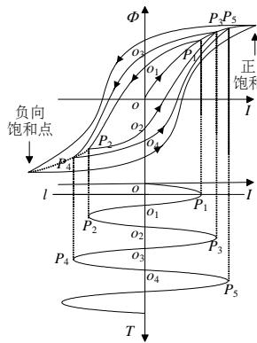  
(a) 情况 1

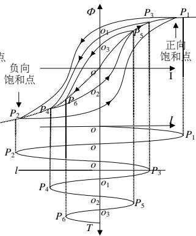  
(b) 情况 2

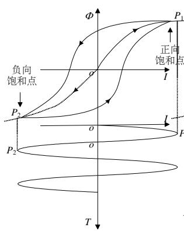  
(c) 情况 3

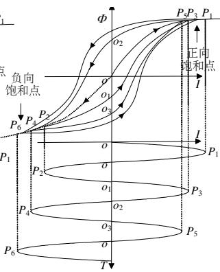  
(d) 情况 4   
图1 磁滞回线预判运行轨迹  
Fig. 1 Anticipation trajectory of hysteresis loops

流从 0 瞬间增大至超过饱和电流，随后慢慢减小至低于饱和电流，接着又增大至超过饱和电流，随后慢慢减小至低于饱和电流，如此反复。

分析上述情况中磁滞回线的变化特征，近似将磁滞回线看成由主磁滞回线(含上下支路)和位于主磁滞回线内部的次磁滞回线簇(含上下支路)组成，辅助以磁滞中线，其中三者的饱和部分相互重合。当变压器铁心剩磁为 0 时，工作点先沿着磁滞中线运动，否则直接沿着磁滞回线运动；在沿着磁滞回线运动时，电流减小，工作点沿着上支路运动，电流增大，工作点沿着下支路运动；当电流正负峰值点超越主磁滞回线饱和点即由多值特性区域进入单值特性区域后，工作点沿着磁滞中线运动，否则沿着磁滞回线运动。相应的，需分别对主磁滞回线、磁滞中线和次磁滞回线簇进行拟合，其中次磁滞回线簇的拟合尤为重要。

# 1.1.1 主磁滞回线及磁滞中线拟合

对于主磁滞回线及磁滞中线的拟合，通过试验获取变压器铁心最大磁滞回线及磁滞中线数据，采用分段线性插值法获取连续主磁滞回线及磁滞中线。为了方便验证模型的合理性，本文给出与 ATP-EMTP中Type96非线性电感相同的实测阿姆科M4取向硅钢主磁滞回线及磁滞中线数据标幺值[18]，如表1所示，得到主磁滞回线及磁滞中线如图2所示。用户需提供实际的变压器铁心的信息，形成正确的比例尺，来获取特定材料的磁滞回线。

表1 阿姆科 M4 取向硅钢励磁曲线数据  
Tab. 1 The data of excitation curve of Armco M4 oriented silicon steel   

<table><tr><td colspan="3">主磁滞回线下支路</td><td colspan="3">磁滞中线上支路</td></tr><tr><td>编号</td><td>电流I/%</td><td>磁链φ/pu</td><td>编号</td><td>电流I/%</td><td>磁链φ/pu</td></tr><tr><td>1</td><td>-0.7365</td><td>-1.1864</td><td>15</td><td>0</td><td>0</td></tr><tr><td>2</td><td>-0.3683</td><td>-1.1721</td><td>16</td><td>0.0027</td><td>0.2527</td></tr><tr><td>3</td><td>-0.1228</td><td>-1.1364</td><td>17</td><td>0.0103</td><td>0.5079</td></tr><tr><td>4</td><td>-0.0246</td><td>-1.1007</td><td>18</td><td>0.0189</td><td>0.7482</td></tr><tr><td>5</td><td>0.0430</td><td>-1.0149</td><td>19</td><td>0.0448</td><td>0.8793</td></tr><tr><td>6</td><td>0.0810</td><td>-0.8577</td><td>20</td><td>0.0929</td><td>1.0031</td></tr><tr><td>7</td><td>0.1473</td><td>0.6146</td><td>21</td><td>0.2168</td><td>1.0745</td></tr><tr><td>8</td><td>0.2332</td><td>0.8791</td><td>22</td><td>0.5087</td><td>1.1442</td></tr><tr><td>9</td><td>0.3314</td><td>0.9863</td><td>23</td><td>1.2114</td><td>1.1815</td></tr><tr><td>10</td><td>0.4910</td><td>1.0721</td><td>24</td><td>1.9640</td><td>1.2150</td></tr><tr><td>11</td><td>0.7242</td><td>1.1292</td><td>25</td><td>2.7005</td><td>1.2221</td></tr><tr><td>12</td><td>1.1293</td><td>1.1721</td><td>—</td><td>—</td><td>—</td></tr><tr><td>13</td><td>1.9640</td><td>1.2150</td><td>—</td><td>—</td><td>—</td></tr><tr><td>14</td><td>2.7005</td><td>1.2221</td><td>—</td><td>—</td><td>—</td></tr></table>

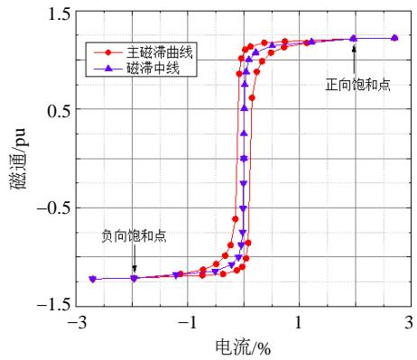  
图2 阿姆科M4 取向硅钢励磁曲线  
Fig. 2 Excitation curve of Armco M4 oriented silicon steel1.1.2 次磁滞回线簇拟合

国外专家学者研究铁磁材料励磁特性从试验中获得变压器铁心励磁曲线轨迹图，如图 3(a)中实线部分所示。通过对励磁曲线轨迹进行分析得出，当励磁电流增大时，运行点穿过转折点，如转折点2 到转折点3、转折点 4 到转折点 5，其运行轨迹最终都汇聚到右上方的饱和点；而当励磁电流减小时，运行点穿过转折点，如转折点 1 到转折点 2、转折点 3 到转折点 4，其运行轨迹最终都汇聚到左下方的饱和点。基于此规律，可根据主磁滞回线来拟合次磁滞回线簇，将主磁滞回线看成上下支路两部分，分别采用分段线性插值法确定次磁滞回线的上下支路，如图 3(a)所示。

本文以主磁滞回线上支路为例进行说明，图 3(a)中 $d _ { X }$ 为次磁滞回线上支路与主磁滞回线上支路 P-V-N 对应于同一电流的磁通差的绝对值。当工作点从 $P _ { 1 }$ 沿 $P _ { 1 } \mathrm { - } N$ 移动过程中 $d _ { X }$ 随 $\phi$ 线性减小，即从 $P _ { 1 }$ 点处的 $d _ { P 1 }$ 线性减小到 N 点处的 $d _ { N }$ 为 0，其线性插值示意图如图 3(b)。

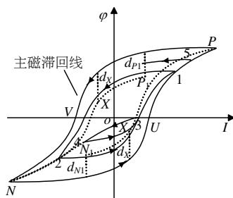  
(a) 变压器铁心励磁曲线轨迹

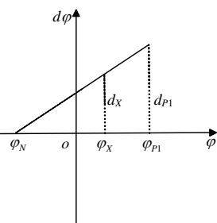  
(b) 线性插值示意图  
图3 次磁滞回线上支路线性插值示意图  
Fig. 3 Linear interpolation schematic of minor loop upper branch

对于次磁滞回线簇上支路的拟合有：

$$
\frac {d _ {X}}{d _ {P 1}} = \frac {\varphi_ {X} - \varphi_ {N}}{\varphi_ {P 1} - \varphi_ {N}} \tag {1}
$$

$$
\varphi_ {\text {m a i n}} - \varphi_ {X} = d _ {X} \tag {2}
$$

$$
\varphi_ {X} = \frac {\varphi_ {\text {m a i n}} \left(\varphi_ {P 1} - \varphi_ {N}\right) + d _ {P 1} \varphi_ {N}}{\varphi_ {P 1} - \varphi_ {N} + d _ {P 1}} \tag {3}
$$

对于次磁滞回线簇下支路的拟合有：

$$
\frac {d _ {X}}{d _ {N 1}} = \frac {\varphi_ {P} - \varphi_ {X}}{\varphi_ {P} - \varphi_ {N 1}} \tag {4}
$$

$$
\varphi_ {X} - \varphi_ {\text {m a i n}} = d _ {X} \tag {5}
$$

$$
\varphi_ {X} = \frac {\varphi_ {\text {m a i n}} \left(\varphi_ {P} - \varphi_ {N 1}\right) + d _ {N 1} \varphi_ {P}}{\varphi_ {P} - \varphi_ {N 1} + d _ {N 1}} \tag {6}
$$

通过起始点位置与上述关系式求解出各个采样时刻电流对应的磁链，利用电流与磁链的关系实现对次磁滞回线簇的拟合，根据上述拟合方法仿真获得次磁滞回线簇如下图 4 所示。与如图 2 中主磁滞回线对比发现，次磁滞回线簇位于主磁滞回线之中，且A相磁滞曲线几乎关于电流为0的直线对称，B、C 相磁滞曲线则偏向于一侧，很好的验证了励磁涌流中两相为偏离时间轴一侧的非对称性涌流，另一相不再偏离时间轴的一侧，变成了对称性涌流的特点，仿真结果合理。

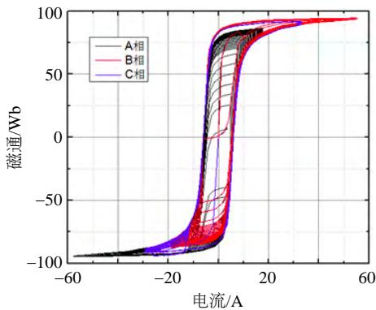  
图 4 PSCAD/EMTDC 中拟合次磁滞回线簇  
Fig.4 Minor loop group simulated in PSCAD/EMTDC

# 1.2 考虑磁滞特性变压器建模机制

目前，国内很少有在 PSCAD/EMTDC 电磁暂态仿真软件中实现考虑磁滞特性变压器建模的实例[19-20]。本文采用自定义建模方法，在图形界面PSCAD 中建立描述磁滞特性非线性电感控制模型界面并在计算程序EMTDC中插入自定义程序以实现控制模型的建模，模型及其内部控制逻辑如图 5所示。以 A 相为例，其中 $I _ { m } ( m { = } 0 , 1 , 2 )$ 为原电流、延时一个步长电流和延时两个步长电流；RS 为变压器额定容量、RV 为变压器额定电压，用于电感值计算补偿；SOC为断路器合闸信号，作为电感值开始计算时刻；L 为输出电感值；I 为 A 相电流，

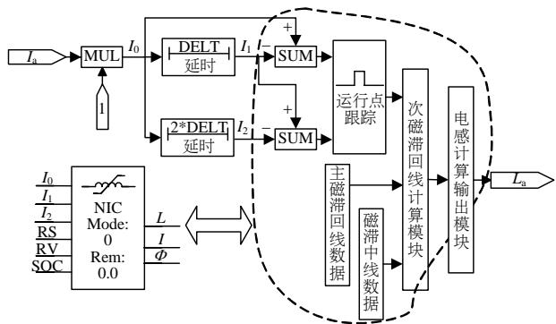  
图5 描述磁滞特性非线性电感控制模型  
Fig. 5 Nonlinear inductance controller model

$\phi$ 为A相磁链，用于磁滞曲线的显示。

描述磁滞特性非线性电感控制模型采集可变电感的电流，通过磁滞回线计算出可变电感的电感值，并将电感值赋给可变电感，形成一个闭环控制回路，利用变化的电感产生变化的电流来反映磁滞特性。由于在一个仿真步长中，电感值保持不变，故有：

$$
\frac {\mathrm {d} \varphi_ {X}}{\mathrm {d} i} = \frac {\mathrm {d} \varphi_ {X}}{\mathrm {d} t} \frac {\mathrm {d} t}{\mathrm {d} i} = u / \frac {\mathrm {d} i}{\mathrm {d} t} = L \tag {7}
$$

# 1.3 建模过程中难点分析与处理

磁滞回线拟合过程中存在磁滞回线上工作点运动位置实时判断问题、磁滞回线与磁滞中线轨迹转换判断逻辑问题、变压器剩磁处理问题、模型程序调试问题等，同时考虑 PSCAD/EMTDC 软件的兼容特性，导致整个建模过程十分复杂。

# 1.3.1 磁滞回线上工作点运动位置实时判断

为了跟踪工作点在磁滞回线上的位置，本模型拟取 3 个相邻时刻的电流值进行比较。同时考虑到在 PSCAD/EMTDC 中将仿真各时刻电流值进行存储，存储量大的问题，因此采用延时比较法，即分别采集流过非线性电感的三相电流 $I _ { k } ( t )$ 并使每一相电流通过延时模块 DELT 分别延时 $\Delta t ^ { \mathrm { ~ \scriptsize ~ \cdot ~ } 2 \Delta t }$ ，获得延时后的电流 $I _ { k } ( t - \Delta t ) \setminus I _ { k } ( t - 2 \Delta t )$ 与原电流 $I _ { k } ( t )$ 作差比较，通过不同时刻的电流差值，来跟踪工作点位置情况，其中 $k = \mathrm { a , b , c }$ 。

$$
\left\{ \begin{array}{l} I _ {k} (t - \Delta t) - I _ {k} (t - 2 \Delta t) <   0 \\ I _ {k} (t) - I _ {k} (t - \Delta t) <   0 \end{array} \right. \tag {8}
$$

则工作点运行在 $P _ { 1 } { \mathrm { - } } P _ { 2 }$ 段；

$$
\left\{ \begin{array}{l} I _ {k} (t - \Delta t) - I _ {k} (t - 2 \Delta t) <   0 \\ I _ {k} (t) - I _ {k} (t - \Delta t) > 0 \end{array} \right. \tag {9}
$$

则工作点运行在 $P _ { 2 }$ 点处；

$$
\left\{ \begin{array}{l} I _ {k} (t - \Delta t) - I _ {k} (t - 2 \Delta t) > 0 \\ I _ {k} (t) - I _ {k} (t - \Delta t) > 0 \end{array} \right. \tag {10}
$$

则工作点运行在 $P _ { 2 ^ { - } } P _ { 3 }$ 段；

$$
\left\{ \begin{array}{l} I _ {k} (t - \Delta t) - I _ {k} (t - 2 \Delta t) > 0 \\ I _ {k} (t) - I _ {k} (t - \Delta t) <   0 \end{array} \right. \tag {11}
$$

则工作点运行在 $P _ { 3 }$ 点处。

# 1.3.2 磁滞回线与磁滞中线轨迹转换判断逻辑

根据上文分析可知，磁滞回线的拟合需磁滞中线加以辅助，励磁电流大小、方向发生改变，使得拟合过程中存在磁滞中线与磁滞回线轨迹间的转换问题。图 6 给出轨迹转换判断逻辑。

图6 轨迹转换判断逻辑  
Fig. 6 Judgment logic of trajectory changing   
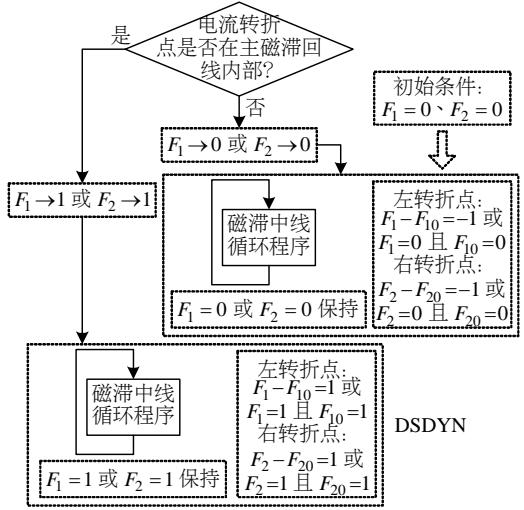  
注：DSDYN为EMTDC中的一种段类型。

$F _ { 1 }$ 作为磁滞回线左转折点对应于电流负向峰值点的状态标识， $F _ { 1 0 }$ 为 $F _ { 1 }$ 的前一个状态； $F _ { 2 }$ 作为磁滞回线右转折点对应于电流正向峰值点的状态标识， $F _ { 2 0 }$ 为 $F _ { 2 }$ 的前一个状态；左转折点在主环内$F _ { 1 }$ 为 1，在主环外 $F _ { 1 }$ 为 $0 ;$ ；右转折点在主环内 $F _ { 2 }$ 为 1，在主环外 $F _ { 2 }$ 为 0。判断 $F _ { 1 } \cdot F _ { 1 } - F _ { 1 0 } \cdot F _ { 2 } - F _ { 2 0 }$ 、$F _ { 2 }$ 的数值变化，来确定转折点所在的区域，判断工作点所在的运动轨迹。

# 2 考虑磁滞特性变压器模型合理性验证

在 PSCAD/EMTDC 中变压器饱和建模主要有两种方式：可变电感法和补偿电流法[19]。补偿电流法主要用来模拟单值特性，本文旨在模拟磁滞特性(多值特性)，采用可变电感法更为合理。

ATP-EMTP 与 PSCAD/EMTDC 内部的电磁暂态程序都是在 H. W. Dommel所创立的电磁暂态分析程序 $\mathbf { E M T P } ^ { [ 2 1 }$ ]的基础上发展而来，仿真结果具有可比性，并且 ATP-EMTP涉及利用磁滞曲线模拟励磁特性的 BCTRAN 模型、PSCAD/EMTDC 涉及利

用磁滞中线模拟励磁特性的 UMEC模型。为验证模型的准确性及合理性，自定义(UD)模型分别与BCTRAN 模型、UMEC 模型仿真结果及实际变压器试验录波对比分析。

在 PSCAD/EMTDC 和 ATP-EMTP 分别建立UD、BCTRAN和 UMEC变压器空载合闸仿真模型如图 7—9 所示，表 2、3分别给出仿真时所需系统参数及变压器模型参数，仿真结果如图 10、11，变压器空载合闸试验录波如图 12 所示，表 4、5 分别为 PSCAD/EMTDC 中 UD 模型和 ATP-EMTP 中

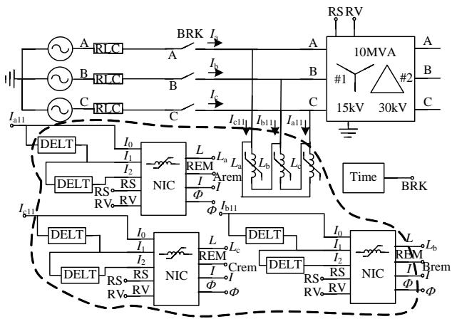  
图 7 UD 空载合闸 PSCAD/EMTDC 仿真模型

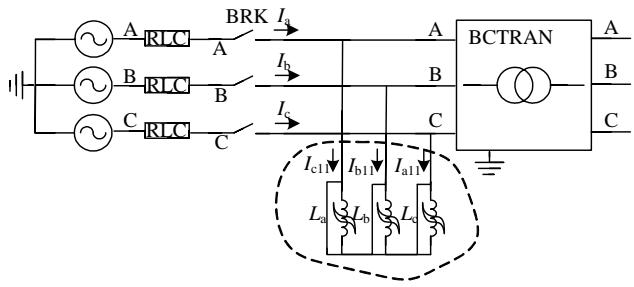  
Fig. 7 UD unload closing model in PSCAD/EMTDC   
图 8 BCTRAN 空载合闸 ATP-EMTP 仿真模型

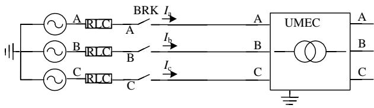  
Fig. 8 BCTRAN unload closing model in ATP-EMTP   
图 9 UMEC 空载合闸 PSCAD/EMTDC 仿真模型  
Fig. 9 UMEC unload closing model in PSCAD/EMTDC

表2 仿真系统参数  
Tab. 2 Parameter of simulation system   

<table><tr><td>参数</td><td>数值</td><td>参数</td><td>数值</td></tr><tr><td>电压源电压/kV</td><td>15.00</td><td>系统阻抗/Ω</td><td>1.00</td></tr><tr><td>频率/Hz</td><td>50.00</td><td>合闸时间/s</td><td>0.05</td></tr><tr><td>初相角/(°)</td><td>90.00</td><td>仿真时间/s</td><td>0.50</td></tr></table>

表 3 电力变压器模型参数  
Tab. 3 Parameter of transformer   

<table><tr><td>参数</td><td>数值</td><td>参数</td><td>数值</td></tr><tr><td>相数</td><td>3</td><td>励磁电流/%</td><td>1</td></tr><tr><td>额定容量/MVA</td><td>10</td><td>空载损耗/kW</td><td>1</td></tr><tr><td>联结组标号</td><td>YNd11</td><td>短路阻抗/%</td><td>7.5</td></tr><tr><td>额定电/kV</td><td>15.00/30.00</td><td>短路损/kW</td><td>10</td></tr></table>

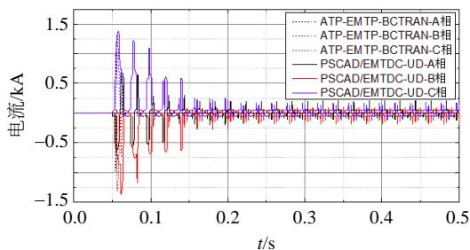  
图10 UD 模型和BCTRAN 模型励磁涌流仿真结果对比

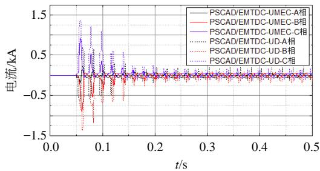  
Fig. 10 Inrush current results in UD and BCTRAN model   
图11 UD 模型与UMEC 模型励磁涌流仿真结果对比

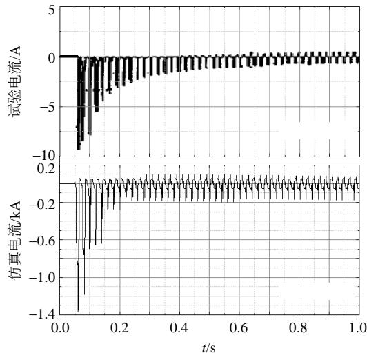  
Fig. 11 Inrush current results in UD and UMEC model   
图12 UD 模型励磁涌流仿真结果与试验录波对比   
Fig. 12 Comparison of inrush current results from test and simulation

BCTRAN 模型空载合闸对比结果、PSCAD/EMTDC中 UD模型与实际变压器空载合闸对比结果。

由图 10 可知，PSCAD/EMTDC 中 UD 模型和ATP-EMTP 中 BCTRAN 模型仿真结果整体上具有相同的变化趋势，两种结果中励磁电流最大峰值基

表4 仿真结果对比  
Tab. 4 Simulation results contrast   
表5 仿真结果对比  

<table><tr><td>内容</td><td>UD</td><td>BCTRAN</td><td>相对误差/%</td></tr><tr><td>A相励磁涌流最大峰值/kA</td><td>0.68</td><td>0.98</td><td>30.6</td></tr><tr><td>B相励磁涌流最大峰值/kA</td><td>1.34</td><td>1.31</td><td>2.3</td></tr><tr><td>C相励磁涌流最大峰值/kA</td><td>1.38</td><td>1.32</td><td>4.5</td></tr><tr><td>整体衰减时间/s</td><td>0.12</td><td>0.11</td><td>9.1</td></tr></table>

Tab. 5 Simulation results contrast   

<table><tr><td>内容</td><td>UD</td><td>BCTRAN</td><td>相对误差/%</td></tr><tr><td>B相励磁涌流最大峰值/pu</td><td>3.68</td><td>3.74</td><td>1.6</td></tr><tr><td>B相励磁涌流稳定峰值/pu</td><td>0.39</td><td>0.45</td><td>13.3</td></tr></table>

本一致，但是 PSCAD/EMTDC 仿真结果中稳定部分存在波动，主要是因为电流进入磁滞回线非饱和区，励磁曲线变化率动态改变产生的，而ATP-EMTP 仿真结果中稳定部分几乎显示为一条水平直线，反而不太符合实际情况。

从图 11 可以看出，PSCAD/EMTDC 中 UD 模型和 PSCAD/EMTDC 中 UMEC 模型仿真结果相位一致，且具有相同的变化趋势，因模拟励磁特性的方式和数据不同，励磁涌流幅值不同。

图 12 上为容量 1kVA、变比 220/110V 的变压器空载合闸 B相励磁涌流试验录波，在励磁涌流衰减进入稳态，电流为尖顶波，除基波分量外以三次谐波为主；图 12 下为 UD 模型空载合闸 B 相励磁涌流，稳定电流也为尖顶波，与实际相符。

从表 4 可以看出，PSCAD/EMTDC 中 UD 模型和 ATP-EMTP 中 BCTRAN 模型空载合闸产生的三相励磁涌流最大峰值平均相对误差大约为 12%左右，励磁涌流衰减时间相对误差大约为 10%左右。考虑到数据处理、仿真平台间模型内部参数差异，不可避免地导致相对误差有所偏大。

从表 5 可以看出，PSCAD/EMTDC 中 UD 模型与实际变压器空载合闸产生的励磁涌流最大峰值相对误差大约为 2%左右，稳定峰值相对误差大约为 13%左右。考虑到磁滞回线模拟较复杂，稳定峰值相对误差有所偏大，后期会进一步改善。

本文模型从3方面对比验证：1）ATP-EMTP中磁滞回线模拟励磁特性的BCTRAN模型；2）PSCAD/EMTDC中磁滞中线模拟励磁特性的 UMEC模型；3）实际变压器录波。其中 1）、2）与所建模型仿真结果对比验证得出所建模型在 PSCAD/EMTDC 中可兼容，模型所建方法是合理的；1）、3）与所建模型仿真结果对比验证得出所建模型误差大约在

10%左右，整体来说，该模型符合工程实际需求。

# 3 不同方式模拟励磁特性下变压器空载合闸励磁涌流差异性

为了深入研究磁滞中线(hysteresis midline，HML)和磁滞回线(hysteresis loop，HL)模拟变压器励磁特性在变压器空载合闸励磁涌流特性中的差异性问题，本文分别就两种模拟方式下励磁涌流进行分析。图 13—17 中分别给出了两种模拟方式下

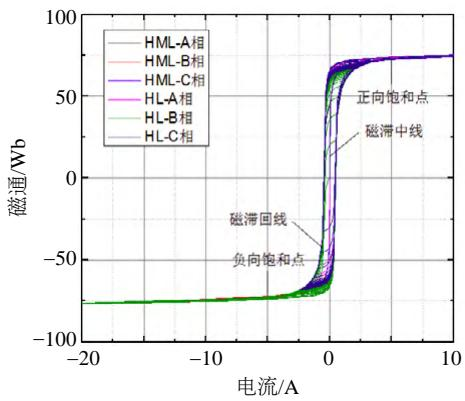  
图 13 PSCAD/EMTDC 拟合磁滞回线和磁滞中线

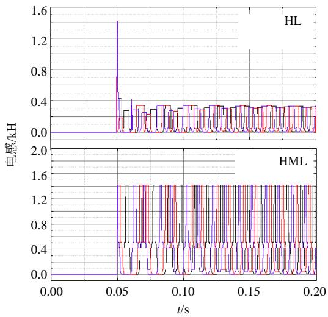  
Fig. 13 Hysteresis loop and middle line simulated in PSCAD/EMTDC   
图 14 两种模拟方式下的三电感值

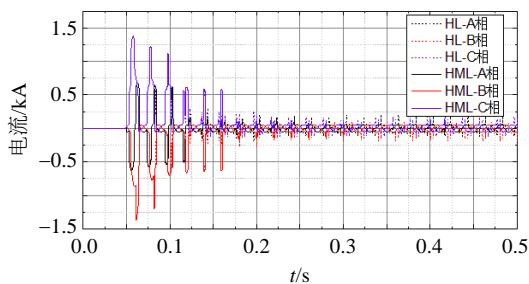  
Fig. 14 Inductance values in two simulated forms   
图 15 两种模拟方式下变压器励磁涌流仿真结果  
Fig. 15 Inrush current in two simulated modes

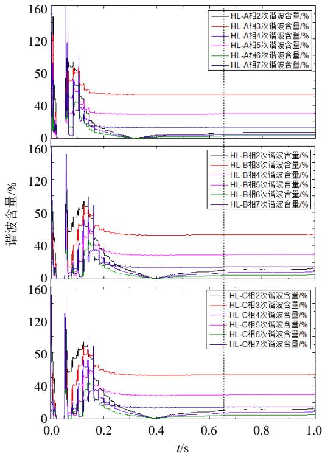  
图 16 磁滞回线模拟方式下励磁涌流谐波含量

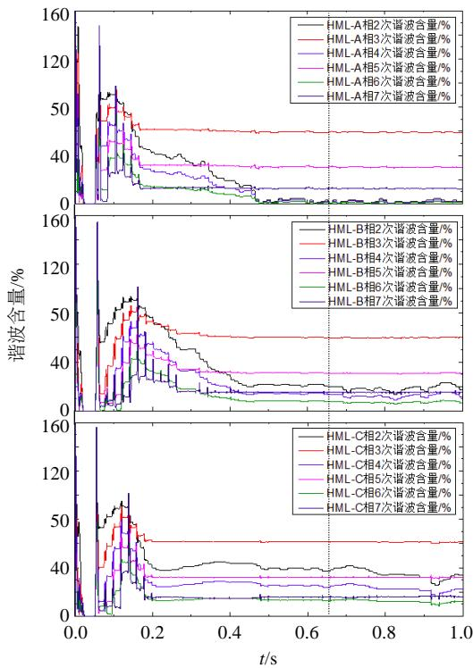  
Fig. 16 Inrush current’s HR2 in two simulated forms   
图17 磁滞中线模拟方式下励磁涌流谐波含量  
Fig. 17 Inrush current’s HR2 in two simulated forms

励磁曲线、三相励磁电感、励磁电流以及其谐波含量仿真对比结果。

从图 13、14 可以看出，磁滞回线和磁滞中线两者的差异在于正负饱和点之间的部分，前者表现为多值特性，其等效励磁电感平均值较小，励磁电

感值变化相对较缓慢；后者表现为单值特性，其等效励磁电感平均值较大，励磁电感值变化相对较快，这就决定了两种模拟方式下谐波的差异。

分别取两种模拟方式下励磁涌流谐波暂态部分0.10s时刻以及稳态部分0.65s时刻的谐波含量进行对比，对比数据如下表 6、7。

表6 暂态部分0.10s 时刻谐波含量对比  
Tab. 6 Harmonic content contrast at 0.10s of transient process   
表 7 稳态部分 0.65s 时刻谐波含量对比  

<table><tr><td></td><td></td><td>HR2/%</td><td>HR3/%</td><td>HR4/%</td><td>HR5/%</td><td>HR6/%</td><td>HR7/%</td></tr><tr><td rowspan="3">HL</td><td>A</td><td>81.39</td><td>79.30</td><td>63.26</td><td>56.53</td><td>43.19</td><td>33.84</td></tr><tr><td>B</td><td>73.12</td><td>40.67</td><td>12.37</td><td>4.33</td><td>9.11</td><td>6.16</td></tr><tr><td>C</td><td>81.91</td><td>58.83</td><td>34.21</td><td>17.43</td><td>20.31</td><td>33.37</td></tr><tr><td rowspan="3">HML</td><td>A</td><td>90.12</td><td>79.28</td><td>64.94</td><td>51.19</td><td>37.67</td><td>25.72</td></tr><tr><td>B</td><td>76.10</td><td>44.76</td><td>15.15</td><td>8.57</td><td>15.78</td><td>14.28</td></tr><tr><td>C</td><td>84.26</td><td>62.46</td><td>38.59</td><td>18.40</td><td>15.10</td><td>30.02</td></tr></table>

Tab. 7 Harmonic content contrast at 0.65s of steady process   

<table><tr><td></td><td></td><td>HR2/%</td><td>HR3/%</td><td>HR4/%</td><td>HR5/%</td><td>HR6/%</td><td>HR7/%</td></tr><tr><td rowspan="3">HL</td><td>A</td><td>6.45</td><td>53.10</td><td>4.46</td><td>29.13</td><td>2.76</td><td>13.08</td></tr><tr><td>B</td><td>10.58</td><td>53.27</td><td>7.20</td><td>29.09</td><td>4.26</td><td>14.37</td></tr><tr><td>C</td><td>1.98</td><td>52.86</td><td>1.37</td><td>28.99</td><td>0.91</td><td>16.10</td></tr><tr><td rowspan="3">HML</td><td>A</td><td>0.74</td><td>59.85</td><td>0.56</td><td>30.90</td><td>0.30</td><td>13.99</td></tr><tr><td>B</td><td>19.85</td><td>59.83</td><td>13.17</td><td>30.82</td><td>7.48</td><td>15.14</td></tr><tr><td>C</td><td>38.57</td><td>61.54</td><td>24.68</td><td>32.07</td><td>12.94</td><td>15.78</td></tr></table>

从表 6、7 可以看出，变压器空载合闸产生励磁涌流，暂态时，两种模拟方式 2 次谐波含量均高达 90%，以2 次谐波为主；各谐波含量对应保持一致。稳态时，3 次、5 次、7 次谐波含量均明显高于2 次、4 次、6 次谐波含量，且谐波次数越大，谐波含量越低，符合变压器励磁特性和谐波特征；不同点在于稳态时磁滞中线模拟方式下，其各次谐波含量较磁滞回线模拟方式下均偏高。

# 4 结论

1）本文提出通过试验或生产厂家获得最大磁滞回线有关数据来模拟磁滞特性的变压器模型对结构参数依赖低，工程实用性强。  
2）该模型弥补了 PSCAD/EMTDC 电磁暂态仿真软件中考虑磁滞特性变压器模型的空白，为换流变空投仿真等研究提供了坚实的基础。  
3）变压器空载合闸产生励磁涌流衰减进入稳态时，磁滞中线模拟方式下涌流的各次谐波含量较磁滞回线模拟方式下均偏高。

4）磁滞中线可代替磁滞回线来模拟变压器铁心励磁特性应用于励磁涌流对变压器内部结构冲击程度研究上；但在分析励磁涌流对交直流保护的影响，建议采用计及磁滞特性的变压器模型。

# 致 谢

本文中考虑铁心磁滞特性的变压器 PSCAD/EMTDC 电磁暂态仿真模型程序的部分调试工作是在加拿大曼尼托邦大学范圣韬博士的大力支持和帮助下完成的，在此向他表示衷心的感谢。

# 参考文献

[1] 王增平，徐岩，王雪，等．基于变压器模型的新型变压器保护原理的研究[J]．中国电机工程学报，2003，23(12)：57-58  
Wang Zengping，Xu Yan，Wang Xue，et al．Study on the novel transformer protection principle based on the transformer model[J]．Proceedings of the CSEE，2003， 23(12)：57-58(in Chinese)   
[2] Annakkage U D，McLaren P G，Dirks E，et al．A current transformer model based on the Jiles-Atherton theory of ferro-magnetic hysteresis[J]．IEEE Transactions on Power Delivery，2000，15(1)：57-61   
[3] 刘康，程汉湘，郭有翠，等．基于磁滞回线数学模型的变压器励磁电流分析[J]．黑龙江电力，2015，37(2)：116-119  
Liu Kang，Cheng Hanxiang，Guo Youcui，et al．Analysis of transformer magnetizing current based on a mathematical model of hysteresis loop[J]．Heilongjiang Electric Power，2015，37(2)：116-119(in Chinese)   
[4] 符杨，蓝之达，陈珩．计及铁心动态磁化特性的三相变压器励磁涌流的仿真研究[J]．变压器，1997，34(9)：4-11．  
Fu Yang ， Lan Zhida ， Chen Heng ． Simulation ofmagnetizing inrush current in three-phase transformerconsidering dynamic magnetization performance ofcore[J]．Transformer，1997，34(9)：4-11(in Chinese)  
[5] Enright W，Watson N，Nayak O．Three-phase five-limb unified magnetic equivalent circuit transformer models for PSCAD V3[C]//Proceedings of the International Conference on Power System Transients．Budapest， Hungary：IPST，1999：462-467   
[6] Enright W ， Nayak O B ， Irwin G D ， et al ． Anelectromagnetic transients model of multi-limbtransformers using normalized core concept[C]//Proceedings of the International Conference on PowerSystems Transients．Seattle：IPST，1997：93-97  
[7] Mohseni H．Multi-winding multi-phase transformer model with saturable core[J] ． IEEE Transactions on Power

Delivery，1991，6(1)：166-173  
[8] Greene J D ， Gross C A ． Nonlinear modeling oftransformers[J] ． IEEE Transactions on IndustryApplications，1988，24(3)：434-438．  
[9] 索南加乐，许立强，焦在滨．三相多芯柱变压器暂态仿真新模型[J]．电力系统保护与控制，2012，40(6)：57-62Suonan Jiale，Xu Liqiang，Jiao Zaibin．New transientsimulation model of three-phase multi-leggedtransformer[J]．Power System Protection and Control，2012，40(6)：57-62(in Chinese)  
[10] 皇甫成，魏远航，钟连宏，等．基于对偶性原理的三相多芯柱变压器暂态模型[J]．中国电机工程学报，2007，27(3)：83-88Huangfu Cheng，Wei Yuanhang，Zhong Lianhong，et alA transient model of three phase multi-legged transformerbased on duality theory[J]．Proceedings of the CSEE，2007，27(3)：83-88(in Chinese)  
[11] 林济铿，王超，吕晓艳，等．采用统一磁路及空载试验的变压器饱和模型[J]．高电压技术，2011，37(2)：422-428Lin Jikeng，Wang Chao，Lü Xiaoyan，et al．Saturationmodel of transformer using unified magnetic equivalentcircuit model and no-load experiment[J]．High VoltageEngineering，2011，37(2)：422-428(in Chinese)  
[12] Jiles D C ， Atherton D L ． Theory of ferromagnetichystere-sis[J] ． Journal of Magnetism and MagneticMaterials，1986，61(1-2)：48-60  
[13] Frame J G，Mohan N，Liu T H．Hysteresis modeling in an electro-magnetic transients program[J]．IEEE Transactions on Power Apparatus and Systems，1982，PAS-101(9)： 3403-3412   
[14] 张燕，刘远龙．利用磁特性鉴别变压器励磁涌流时磁化曲线的求取方法[J]．继电器，1997，25(4)：16-18Zhang Yan，Liu Yuanlong．The method of derivingmagnetization curve when using magnetic characteristic todiscriminate ener-gization inrush of transformer[J]Relay，1997，25(4)：16-18(in Chinese)  
[15] 沈玲岩，王维俭．计及铁磁非线性的三相变压器励磁涌流仿真研究[J]．清华大学学报：自然科学版，1989，29(4)：19-30  
Shen Lingyan，Wang Weijian．Simulation of three-phase transformer magnetizing inrush current capable of including ferromagnetic nonlinear effects[J]．Journal of Tsinghua University，1989，29(4)：19-30(in Chinese)   
[16] 王燕，皇甫成，赵淑珍，等．考虑铁磁磁滞的变压器励磁涌流仿真分析[J]．电力系统自动化，2009，33(15)：78-83．  
Wang Yan，Huangfu Cheng，Zhao Shuzhen，et al．A

simulation study for magnetizing inrush current of transformers on account of fer-romagnetic hysteresis[J] Automation of Electric Power Systems，2009，33(15)： 78-83(in Chinese)   
[17] 孙会浩，刘玉林，吴磊，等．基于 EMTP/ATP 的变压器建模及仿真[J]．电气应用，2008，27(6)：46-49，57Sun Huihao，Liu Yulin，Wu Lei，et al．Research ontransformer modeling and simulation based onEMTP/ATP[J]．Electrotechnical Application，2008，27(6)：46-49，57(in Chinese)  
[18] Prikler L，Høidalen H K．ATPDRAW version 3.5 for windows 9x/NT/2000/XP：users’ manual[R]．Preliminary Release No.1.1，2002   
[19] Manitoba HVDC Research Center ． EMTDC users guide[R]．Winnipeg，Manitoba，Canada：Manitoba HVDC Research Center，2004   
[20] Manitoba HVDC Research Center ． PSCAD users guide[R]．Winnipeg，Manitoba，Canada：Manitoba HVDC Research Center，2004   
[21] 中国电力科学研究院．EMTP/EMTPE 使用说明[R]．北京：中国电力科学研究院，2001  
China Electric Power Research Institute．USER’S GUIDE of Power electronics and Electromagnetic transient simulation soft-ware of EMTP/EMTPE[R]．Beijing：China Electric Power Re-search Institute，2001(in Chinese)

  
吴嘉琪

收稿日期：2016-01-22。

作者简介：

吴嘉琪(1990)，男，硕士研究生，主要从事高压直流输电与新型输电技术研究，WJQ1071822286@gmail.com；

李晓华(1975)，女，教授，博士生导师，通讯作者，主要从事电力系统故障分析与继电保护、高压直流输电运行方面的研究工作，eplxh@scut.edu.cn；

陈忠(1975)，男，硕士，高级工程师，主要从事电力系统高压技术工作，chenzhong111@126.com

丁晓兵(1979)，男，高级工程师，主要从事电网继电保护运行工作，imdxb@126.com；

田庆(1976)，男，博士，高级工程师，主要从事特高压交、直流输电运行检修技术研究，tq8887@139.com。

(责任编辑 吕鲜艳)

# A Transformer Model With Hysteresis Characteristics for Electromagnetic Transients Based on PSCAD/EMTDC and Excitation Difference Analysis

WU Jiaqi1 , LI Xiaohua1 , CHEN Zhong2 , DING Xiaobing3 , TIAN Qing3

(1. South China University of Technology; 2. Ultra-High Voltage Transmission Company of CSG;

3. Power Dispatching and Communication Center of CSG)

KEY WORDS: hysteresis loop; hysteresis midline; excitation characteristics; three-phase classical transformer model； ATP-EMTP; PSCAD/EMTDC; electromagnetic transient simulation

In order to research the inrush problems in HVDC transmission project, a new transformer model with hysteresis characteristics of PSCAD/EMTDC is presented, which derives from the ideas of transformer model considering hysteresis characteristics in ATP-EMTP consisting of Type96 and BCTRAN. This model adds excitation branch considering hysteresis characteristics based on the classical model. The hysteresis characteristics can be described effectively when using experimental data obtained.

Inspired from the conclusion illustrated as Fig.1, piecewise linear interpolation is used to fit the minor hysteresis loop clusters with the help the excitation curve of Armco M4 oriented silicon steel and equations (1)-(6).

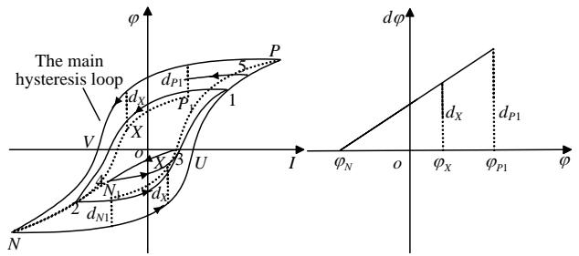  
Fig. 1 Linear interpolation schematic of minor loop upper branch

The fitting of minor hysteresis loop clusters up branch:

$$
d _ {X} / d _ {P 1} = \left(\varphi_ {X} - \varphi_ {N}\right) / \left(\varphi_ {P 1} - \varphi_ {N}\right) \tag {1}
$$

$$
\varphi_ {\text {m a i n}} - \varphi_ {X} = d _ {X} \tag {2}
$$

$$
\varphi_ {X} = \left[ \varphi_ {\text {m a i n}} \left(\varphi_ {P 1} - \varphi_ {N}\right) + d _ {P 1} \varphi_ {N} \right] / \left(\varphi_ {P 1} - \varphi_ {N} + d _ {P 1}\right) \tag {3}
$$

The fitting of minor hysteresis loop clusters down branch:

$$
d _ {X} / d _ {N 1} = \left(\varphi_ {P} - \varphi_ {X}\right) / \left(\varphi_ {P} - \varphi_ {N 1}\right) \tag {4}
$$

$$
\varphi_ {X} - \varphi_ {\text {m a i n}} = d _ {X} \tag {5}
$$

$$
\varphi_ {X} = \left[ \varphi_ {\text {m a i n}} \left(\varphi_ {P} - \varphi_ {N 1}\right) + d _ {N 1} \varphi_ {P} \right] / \left(\varphi_ {P} - \varphi_ {N 1} + d _ {N 1}\right) \tag {6}
$$

Thus a transformer considering the hysteresis characteristics is built in PSCAD/EMTDC using FORTRAN 77, and its flowchart is shown in Fig.2.

Compared with the BCTRAN model using hysteresis loop to stimulate excitation characteristics, the

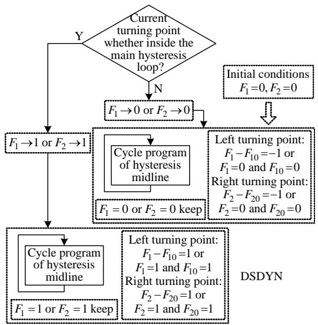  
Fig. 2 Flowchart of modeling in PSCAD/EMTDC

UMEC model uses hysteresis midline to stimulate excitation characteristics and the recorded waveform to verify the rationality and accuracy of the transformer model considering the hysteresis characteristics. The result contrast shows that the average of relative error is about 10%. The model is reasonable and compatible in PSCAD/EMTDC.

Meanwhile, the study of the difference between hysteresis midline(HML) and hysteresis loop(HL) simulating transformer magnetizing characteristic is that each harmonic content of inrush current at hysteresis midline stimulating mode is higher than that at hysteresis loop stimulating mode at steady state, as shown in Tab.1. Therefore, the impact of inrush current on AC and DC protection is analyzed, and the transformer model with hysteresis characteristics is recommended.

Tab. 1 Simulation results contrast   

<table><tr><td></td><td></td><td>HR2/%</td><td>HR3/%</td><td>HR4/%</td><td>HR5/%</td><td>HR6/%</td><td>HR7/%</td></tr><tr><td rowspan="3">HL</td><td>A</td><td>6.45</td><td>53.10</td><td>4.46</td><td>29.13</td><td>2.76</td><td>13.08</td></tr><tr><td>B</td><td>10.58</td><td>53.27</td><td>7.20</td><td>29.09</td><td>4.26</td><td>14.37</td></tr><tr><td>C</td><td>1.98</td><td>52.86</td><td>1.37</td><td>28.99</td><td>0.91</td><td>16.10</td></tr><tr><td rowspan="3">HML</td><td>A</td><td>0.74</td><td>59.85</td><td>0.56</td><td>30.90</td><td>0.30</td><td>13.99</td></tr><tr><td>B</td><td>19.85</td><td>59.83</td><td>13.17</td><td>30.82</td><td>7.48</td><td>15.14</td></tr><tr><td>C</td><td>38.57</td><td>61.54</td><td>24.68</td><td>32.07</td><td>12.94</td><td>15.78</td></tr></table>