# Large step size electromagnetic transient simulations by matrix transformation-based shifted-frequency phasor models

ISSN 1751-8687

Received on 9th July 2019

Revised 26th February 2020

Accepted on 11th March 2020

E-First on 12th June 2020

doi: 10.1049/iet-gtd.2019.1005

www.ietdl.org

Xiaohui Ye1,2, Yong Tang3, Dewu Shu1

1Key Lab of Control, Power Transmission and Conversion, Department of Electrical Engineering, Shanghai Jiaotong University, Shanghai, People's Republic of China   
2Electrical Engineering, Tsinghua University, Beijing, People's Republic of China   
3China EPRI (CEPRI), Beijing, People's Republic of China   
E-mail: shudewu@sjtu.edu.cn

Abstract: To evaluate and improve the performances of control and protection strategies for large-scale AC grids, simulation models that can adopt a much larger time-step, provide instantaneous and wide frequency-band phasor values simultaneously are desirable. However, the traditional electromagnetic transient (EMT) model is numerically expensive and the transient stability (TS) model only preserves low-frequency dynamics. To resolve these issues, the shifted frequency phasor (SFP) modelling is generalised based on specific matrix transformations and SFP models of typical components in large-scale AC grids are derived hereafter. Unlike traditional models, the SFP models can produce instantaneous and wide frequency-band phasor waveforms simultaneously, while the latter matches the envelopes of the former exactly. Moreover, the simulation efficiency is dramatically improved by adopting a much larger time-step. The performance concerning the accuracy and efficiency is compared with the traditional EMT and TS models by simulating a practical large-scale AC grid under different scenarios.

# 1 Introduction

Dynamics of electromagnetic transients (EMTs), especially wide frequency-band interactions between individual components are important to evaluate and improve the performances of control and protection strategies for large-scale AC grids [1, 2]. Due to the non-linear dynamics of the generator (groups) and frequencydependent dynamics of transmission lines, AC voltage and current signals contain wide frequency-band components with fast amplitude and phase variations, especially at the occurrence or clearance of the faults. Therefore, it is highly desirable to develop numerically accurate and efficient simulation models that are capable of (i) adopting a much larger time-step; (ii ) emulating electromagnetic and electro-mechanical transients for a wide frequency range. Many attempts have been made to improve the efficiency of the target large-scale AC grids with satisfied accuracy, which are categorised as follows:

(i) Trapezoidal-derived EMT simulations, e.g. EMTP-RV [3], PSCAD/EMTDC: the traditional EMT model, derived by Trapezoidal algorithm, is generally considered the most accurate simulation tool to capture wide frequency-band dynamics. However, the computational burden is sharply increased by its small time-step (as small as 50 μs), which makes it computationally burdensome to simulate large-scale AC grids. Although several techniques, such as system equivalents [4], parallel processing [5], multi-rate simulations [6] etc. have been proposed to accelerate the simulation speed, the overall efficiency is still unsatisfactory for practical power systems. EMT models can only trace the instantaneous values of all waveforms. Unfortunately, they cannot produce wide frequency-band phasor waveforms simultaneously, which is important to demonstrate wide-band frequency interactions of AC grids.   
(ii) Transient stability (TS) based simulations, e.g. PSS/E, PSD-BPA (a commercial TS-based software first developed by Bonneville Power Administration and now maintained by China EPRI): The TS-based simulations are efficient to simulate largescale AC grids. However, they suffer from an underlying limitation of TS-type modelling or conventional phasors, which preserves

only low-frequency dynamics. In other words, the high-frequency dynamics, which are aroused by non-linear characteristics of generators and frequency-dependent characteristics of transmission lines, are totally neglected.

(iii) TS and EMT Hybrid simulations [7, 8]: The TS and EMT hybrid simulations partition the whole system into separated TS and EMT subsystems, respectively. Only wide-band dynamics inside EMT subsystems are captured. However, the interface model limits the frequency band under the fundamental frequency. Consequently, wide frequency-band interactions between different subsystems cannot be simulated by the interface model. Moreover, the overall simulation accuracy of hybrid simulations relies highly on the partitioning strategy and the precision of the interface model. Therefore, it is not an easy task to guarantee the accuracy of hybrid simulations at any fault scenarios and system configurations.   
(iv) State-space derived dynamic phasor (DP) simulations [9, 10]: These methods decompose time-varying voltage and current signals into harmonics of different frequencies based on state-space equations. Although the accuracy can be improved by including more orders of DPs, the computational burden will be dramatically increased. For example, even if only two frequencies are considered, the number of equations will be expanded twice. Moreover, DP representations of large-scale AC grids are quite complicated or even inapplicable when the system contains nonlinear or frequency-dependent components.   
(v) Nodal analysis-based shifted frequency phasor (SFP) simulations [11–16]: These methods, which are also named as shifted frequency analysis (SFA) [11, 12] or frequency-adaptive simulation of transients (FASTs) [16], stems from signal processing theory and the Hilbert transformation. It should be noted that although several typical components based on the SFA concept have been proposed, the realisation of practical large-scale AC grids with thousands of buses and hundreds of generators has never been given before. This work also constitutes one of the targets of our paper.

To capture wide-frequency band interactions of large-scale AC grids, the SFP modelling is generalised and applied to simulate large-scale AC grids. The SFP modelling has the following striking features:

(1) The proposed matrix transformation-based SFP model is a new nodal analysis derivation of SFP models. It generalises the matrix transformation-based SFP modelling for large-scale AC grids and provides physical insights into wide frequency-band phasors. Our SFP method can be implemented as an independent module, making it much more easily and flexibly for practical use. The calculation burden can be reduced considerably by extending the time-step.   
(2) Based on our proposed matrix transformation-based SFP models of large-scale AC grids, the wide-band phasors can capture both low-frequency and high-frequency dynamics accurately. More importantly, the wide-band phasors are the exact envelopes of the instantaneous values of AC quantities, while the traditional TS models show significant errors.   
(3) The verifications of large-scale AC grids with 2232 nodes, 440 generators are successfully made, which demonstrates that the matrix transformation-based SFP models can be applied to simulate large-scale AC grids.

The rest of the paper is organised as follows: Section 2 demonstrates the proposed SFP modelling. In Section 3, SFP models of typical AC components are derived. Section 4 details the respective efficiency improvement techniques for large-scale AC grids. Section 5 verifies the effectiveness of the proposed method through simulations of a practical large-scale AC grid under different scenarios. Section 6 concludes this paper.

# 2 Brief introduction of SFP modelling

# 2.1 General mathematical formulation

In a power system, the frequency bands of electrical variables are usually centred around the fundamental frequency $\omega _ { s } ,$ which can be represented in its shifted frequency form:

$$
\left\{ \begin{array}{r} x (t) = \hat {x} (t) \mathrm {e} ^ {\mathrm {j} \omega_ {s} t} \\ \hat {x} (t) = x _ {l} (t) + \mathrm {j} x _ {Q} (t) \end{array} \right. \tag {1}
$$

where x ^(t) is also called complex envelope of the time-domain signal x(t), which keeps its low-frequency dynamics. xI(t) and xQ(t) are the real and imaginary parts of x^(t), respectively.

Suppose the dynamic equation of each component is written as:

$$
\frac {\mathrm {d} x (t)}{\mathrm {d} t} = f (x, t) \tag {2}
$$

Then, (2) is converted to its SFP form and after some rewriting, the differential equation in the SFP form is derived based on the transformation T(t):

$$
\frac {\mathrm {d} \hat {x}}{\mathrm {d} t} = f (\hat {x}, t) + \omega_ {\mathrm {s}} T \left(- \frac {\pi}{2 \omega_ {\mathrm {s}}}\right) \hat {x} \tag {3}
$$

$$
\boldsymbol {T} (t) = \left[ \begin{array}{c c} - \cos \omega_ {\mathrm {s}} t & \sin \omega_ {\mathrm {s}} t \\ - \sin \omega_ {\mathrm {s}} t & - \cos \omega_ {\mathrm {s}} t \end{array} \right] \tag {4}
$$

Adopting the trapezoidal algorithm, (3) is discretised as:

$$
\begin{array}{l} \frac {\hat {x} (t) - \hat {x} (t - \Delta t)}{\Delta t} \\ = \frac {\hat {f} (t) + \omega_ {\mathrm {s}} \boldsymbol {T} (- \frac {\pi}{2 \omega_ {\mathrm {s}}}) \hat {x} (t) + \hat {f} (t - \Delta t) + \omega_ {\mathrm {s}} \boldsymbol {T} (- \frac {\pi}{2 \omega_ {\mathrm {s}}}) \hat {x} (t - \Delta t)}{2} \tag {5} \\ \end{array}
$$

where ${ \hat { x } } ( t ) , { \hat { f } } ( t )$ denotes state variables and the differential term; Δt is the time-step.

Based on the following formula derived by the rotation transformation Q(t),

$$
\boldsymbol {T} \left(- \frac {\pi}{2 \omega_ {s}}\right) \boldsymbol {Q} (\Delta t) = - \boldsymbol {Q} \left(\Delta t - \frac {\pi}{2 \omega_ {s}}\right) \tag {6}
$$

$$
\boldsymbol {Q} (t) = \left[ \begin{array}{l l} \cos \omega_ {\mathrm {s}} t & - \sin \omega_ {\mathrm {s}} t \\ \sin \omega_ {\mathrm {s}} t & \cos \omega_ {\mathrm {s}} t \end{array} \right] \tag {7}
$$

variables of SFP form in (5) are transformed back into their time domain signals:

$$
\begin{array}{l} x (t) = Q (\Delta t) x (t - \Delta t) \\ + \frac {\Delta t}{2} \left[ \begin{array}{l} f (t) + \omega_ {s} T \left(- \frac {\pi}{2 \omega_ {s}}\right) x (t) + \\ Q (\Delta t) f (t - \Delta t) - \omega_ {s} Q \left(\Delta t - \frac {\pi}{2 \omega_ {s}}\right) x (t - \Delta t) \end{array} \right] \tag {8} \\ \end{array}
$$

And (8) is rewritten in the real and imaginary parts separately as:

$$
\begin{array}{l} \left[ \begin{array}{c} \boldsymbol {x} ^ {\mathrm {R}} (t) \\ \boldsymbol {x} ^ {\mathrm {I}} (t) \end{array} \right] = \boldsymbol {Q} (\Delta t) \left[ \begin{array}{c} \boldsymbol {x} ^ {\mathrm {R}} (t - \Delta t) \\ \boldsymbol {x} ^ {\mathrm {I}} (t - \Delta t) \end{array} \right] \\ \left[ \begin{array}{l} f (t) + \omega_ {s} T \left(- \frac {\pi}{2 \omega_ {s}}\right) \left[ \begin{array}{l} x ^ {\mathrm {R}} (t) \\ x ^ {\mathrm {I}} (t) \end{array} \right] \end{array} \right] \tag {9} \\ + \frac {\Delta t}{2} \left\{ \begin{array}{l} + Q (\Delta t) f (t - \Delta t) \\ + \omega_ {s} Q (\Delta t - \frac {\pi}{2 \omega_ {s}}) \left[ \begin{array}{c} x ^ {R} (t - \Delta t) \\ x ^ {I} (t - \Delta t) \end{array} \right] \end{array} \right\} \\ \end{array}
$$

where $x ^ { \mathrm { R } } ( t )$ and $\boldsymbol { x } ^ { \mathrm { I } } ( t )$ are the real and imaginary parts of $\mathbf { \boldsymbol { x } } ( t ) .$ . It should be noted that the wide-band phasor is calculated by:

$$
\left\| x (t) \right\| = \sqrt {\left[ x ^ {\mathrm {R}} (t) \right] ^ {2} + \left[ x ^ {\mathrm {I}} (t) \right] ^ {2}} \tag {10}
$$

The differences between the proposed matrix transformationbased SFP models and the SFP [11, 12] or FAST models [16] lie in the following aspects: the proposed method model the shifted frequency property in a unified way. For example, the unified matrix $\dot { Q } ( \dot { \Delta t } - \dot { ( \pi / 2 \omega _ { \mathrm { s } } ) } )$ can be easily calculated according to (7) instead of two matrix multiplications, or Q(Δt) is multiplied by $Q ( - ( \pi / 2 \omega _ { s } ) )$ .

The SFP concept is adopted hereafter to develop the models of different components for AC grids according to (2)–(9). Based on the derivations in Section 2, the differential equations of typical components, such as synchronous machine, transmission line etc. can be derived to obtain the desired matrix transformation-based SFP based models. Further, with SFP models represented by their Norton equivalents, the whole system is formulated and then calculated by the corresponding nodal voltage equations of the whole system.

# 2.2 Discussion on the time-step size of the proposed method

Normally, the time-step size of EMT models depends on the maximum frequency expected in the phenomena [17]. However, if non-linear components, such as the synchronous machines, transmission lines etc. are contained, the time-step will be limited under 50 μs due to the failure to converge [17]. For example, if the saturation of transformers or the distributed characteristics of transmission lines are considered, the latest PSCAD 4.6 will limit the time-step less than 20 μs (Fig. 1). Otherwise, it will show error information as follows. This is the motivation to the proposed new method, which can extend the time-step of the traditional EMT models.

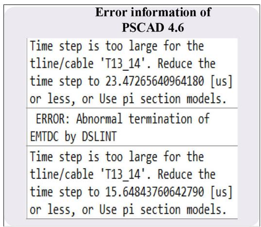  
Fig. 1  Error information of PSCAD 4.6

Fig. 2  Electric circuit of synchronous machine   
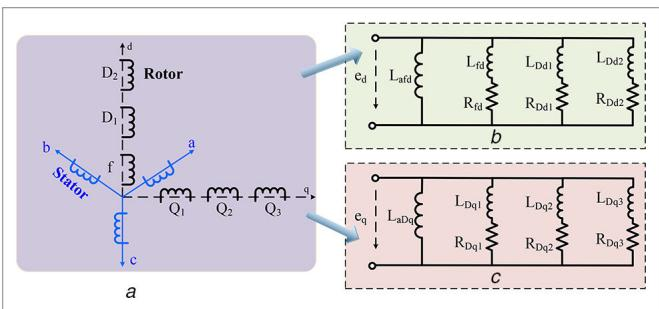  
(a) Topology, (b) Equivalent circuit in d axis, (c) Equivalent circuit in q axis

According to [17], the numerical convergence issue normally arouses by the time-step is not satisfied with the Nyquist criterion of the maximum simulated frequency.

Suppose the original frequency band of simulated system is $[ 0 , \omega _ { \mathrm { s } } + \Delta \omega ] ,$ , where ω denotes the fundamental frequency. Based on our proposed matrix transformation-based SFP models, the frequency band will be shifted to [0, Δω]. According to the Nyquist criterion, the maximum time-step should satisfy $\Delta T _ { \mathrm { m a x } } \leq \pi / \Delta \omega _ { \mathrm { : } }$ where the traditional EMT models should satisfy $\Delta T _ { \mathrm { m a x } } \leq \pi / ( \Delta \omega + \omega _ { \mathrm { s } } )$ . This is the reason why the proposed method can extend the time-step to a much larger one.

# 3 Component modelling based on SFP models

# 3.1 SFP model of synchronous machine

The differential equation of a synchronous machine (see Fig. 2), or the generic dq0 model [18], is obtained by transforming the machine variables into direct and quadrature magnetic rotor axis (Park transformation). The voltage equations in terms of transformed variables are given in time domain [18]:

$$
\left\{ \begin{array}{l} {\left[ \begin{array}{c} v _ {s} ^ {d q 0} \\ v _ {r} \end{array} \right] = - \left[ \begin{array}{c c} R _ {s} & \\ & R _ {r} \end{array} \right] \left[ \begin{array}{c} i _ {s} ^ {d q 0} \\ i _ {r} \end{array} \right]} \\ - \frac {\mathbf {d}}{\{\mathbf {d} \} \{\mathbf {t} \}} \left[ \begin{array}{c} \lambda_ {s, d q 0} \\ \lambda_ {r} \end{array} \right] + \left[ \begin{array}{c} u \\ 0 \end{array} \right] \\ {\left[ \begin{array}{c} \lambda_ {s} ^ {d q 0} \\ \lambda_ {r} \end{array} \right] = L \left[ \begin{array}{c} i _ {s} ^ {d q 0} \\ i _ {r} \end{array} \right] = \left[ \begin{array}{c c} L _ {s s} & L _ {s r} \\ L _ {r s} & L _ {r r} \end{array} \right] \left[ \begin{array}{c} i _ {s} ^ {d q 0} \\ i _ {r} \end{array} \right]} \\ u = [ - \omega \lambda_ {q}, \omega \lambda_ {d}, 0 ] ^ {T} \end{array} \right. \tag {11}
$$

where $\nu _ { \mathrm { s } } ^ { d q 0 } , i _ { \mathrm { s } } ^ { d q 0 }$ and $\lambda _ { \mathrm { s } } ^ { d q 0 }$ are the stator voltages, currents and flux linkages in $d q 0$ variables, respectively; $\nu _ { \mathrm { r } } , i _ { \mathrm { r } }$ and $\lambda _ { \mathrm { r } }$ are rotor voltages, currents and flux linkages; $\pmb { R _ { s } }$ and $\scriptstyle R _ { \mathrm { r } }$ are constant diagonal matrices containing the stator and rotor resistances,

respectively; $L _ { \mathrm { s s } } , L _ { \mathrm { s r } } , L _ { \mathrm { s } r } , L _ { \mathrm { r r } }$ are four individual elements of the inductance matrix $L .$

Then, (11) is converted to its SFP form and after some rewriting, the differential equation in the SFP form is derived based on the transformation T(t):

$$
\begin{array}{l} \left[ \begin{array}{c} \hat {\boldsymbol {v}} _ {s} ^ {d q _ {0} ^ {0}} (t) \\ \hat {\boldsymbol {v}} _ {r} (t) \end{array} \right] = \left[ \begin{array}{c} \hat {\boldsymbol {u}} (t) \\ \boldsymbol {0} \end{array} \right] + \left[ \begin{array}{c} \hat {\boldsymbol {J}} _ {\mathrm {s}} ^ {d q _ {0} ^ {0}} (t - \Delta t) \\ \hat {\boldsymbol {J}} _ {\mathrm {r}} (t - \Delta t) \end{array} \right] \\ - \left\{\left[ \begin{array}{c c} \boldsymbol {R} _ {\mathrm {s}} & \\ & \boldsymbol {R} _ {\mathrm {r}} \end{array} \right] + \left(\boldsymbol {\alpha} ^ {\prime} + \omega_ {\mathrm {s}} \boldsymbol {T} \left(- \frac {\boldsymbol {\pi}}{2 \omega_ {\mathrm {s}}}\right)\right) \left[ \begin{array}{l l} \boldsymbol {L} _ {\mathrm {s s}} & \boldsymbol {L} _ {\mathrm {s r}} \\ \boldsymbol {L} _ {\mathrm {r s}} & \boldsymbol {L} _ {\mathrm {r r}} \end{array} \right] \right\} \left[ \begin{array}{c} \hat {\boldsymbol {i}} _ {\mathrm {s}} ^ {d q 0} (t) \\ \hat {\boldsymbol {i}} _ {\mathrm {r}} ^ {(} t) \end{array} \right] \tag {12} \\ \end{array}
$$

$$
\begin{array}{l} \left[ \begin{array}{c} \hat {J} _ {\mathrm {s}} ^ {d q 0} (t - \Delta t) \\ \hat {J} _ {\mathrm {r}} (t - \Delta t) \end{array} \right] \\ = - \left\{ \begin{array}{l} \alpha \left[ \begin{array}{c c} R _ {\mathrm {s}} & \\ & R _ {\mathrm {r}} \end{array} \right] - \alpha^ {\prime} \left[ \begin{array}{c c} L _ {\mathrm {s s}} & L _ {\mathrm {s r}} \\ L _ {\mathrm {r s}} & L _ {\mathrm {r r}} \end{array} \right] \\ + \alpha \omega_ {\mathrm {s}} T (- \frac {\pi}{2 \omega_ {\mathrm {s}}}) \left[ \begin{array}{c c} L _ {\mathrm {s s}} & L _ {\mathrm {s r}} \\ L _ {\mathrm {r s}} & L _ {\mathrm {r r}} \end{array} \right] \left[ \begin{array}{c} \hat {i} _ {\mathrm {s}} ^ {d q 0} (t - \Delta t) \\ \hat {i} _ {\mathrm {r}} ^ {\prime} (t - \Delta t) \end{array} \right] \end{array} \right. \tag {13} \\ + \alpha \left[ \begin{array}{c} \hat {u} (t - \Delta t) \\ 0 \end{array} \right] - \alpha \left[ \begin{array}{c} \hat {v} _ {\mathrm {s}} ^ {d q 0} (t - \Delta t) \\ \hat {v} _ {\mathrm {r}} (t - \Delta t) \end{array} \right] \\ \end{array}
$$

where $0 < \alpha < 1 , \alpha ^ { \prime } = ( 1 + \alpha ) / \Delta t .$

With SFP derived phasors converted back into the time-domain form, (12) is written as

$$
\begin{array}{l} \left[ \begin{array}{c} v _ {s} ^ {d q 0} (t) \\ v _ {r} (t) \end{array} \right] = \left[ \begin{array}{c} u (t) \\ \mathbf {0} \end{array} \right] + \left[ \begin{array}{c} J _ {s} ^ {d q 0} (t - \Delta t) \\ J _ {r} (t - \Delta t) \end{array} \right] \\ - \left\{\left[ \begin{array}{c c} \boldsymbol {R} _ {s} & \\ & \boldsymbol {R} _ {r} \end{array} \right] + \boldsymbol {\alpha} ^ {\prime} \left[ \begin{array}{l l} \boldsymbol {L} _ {\mathrm {S S}} & \boldsymbol {L} _ {\mathrm {S r}} \\ \boldsymbol {L} _ {\mathrm {T S}} & \boldsymbol {L} _ {\mathrm {T T}} \end{array} \right] \right. \\ + \omega_ {s} \boldsymbol {T} \left(- \frac {\pi}{2 \omega_ {s}}\right) \left[ \begin{array}{l l} \boldsymbol {L} _ {\mathrm {S S}} & \boldsymbol {L} _ {\mathrm {S r}} \\ \boldsymbol {L} _ {\mathrm {T S}} & \boldsymbol {L} _ {\mathrm {T T}} \end{array} \right] \left[ \begin{array}{l} i _ {s} ^ {\mathrm {d q 0}} (t) \\ i _ {r} (t) \end{array} \right] \tag {14} \\ \end{array}
$$

Similarly, $\left[ J _ { s } ^ { d q 0 } ( t - \Delta t ) J _ { r } ( t - \Delta t ) \right] ^ { \mathrm { T } }$ can be derived as:

$$
\begin{array}{l} \left[ \begin{array}{c} J _ {s} ^ {d q 0} (t - \Delta t) \\ J _ {r} (t - \Delta t) \end{array} \right] = \alpha Q (\Delta t) \left[ \begin{array}{c} \hat {\mathbf {u}} (t - \Delta t) \\ \mathbf {0} \end{array} \right] \\ - \alpha \boldsymbol {Q} (\Delta t) \left[ \begin{array}{c} \boldsymbol {v} _ {s} ^ {d q 0} (t - \Delta t) \\ \boldsymbol {v} _ {r} (t - \Delta t) \end{array} \right] \\ \left. \begin{array}{l} \left\{\alpha Q (\Delta t) \left[ \begin{array}{c c} R _ {s} & \\ & R _ {r} \end{array} \right] \right. \\ - \left\{- \alpha^ {\prime} Q (\Delta t) \left[ \begin{array}{c c} L _ {\mathrm {s s}} & L _ {\mathrm {s r}} \\ L _ {\mathrm {r s}} & L _ {\mathrm {r r}} \end{array} \right] - \right. \\ \left. \left[ \begin{array}{l l} i _ {s} ^ {d q 0} (t - \Delta t) \\ i _ {r} (t - \Delta t) \end{array} \right] \right. \\ \left. \left[ \begin{array}{l l} \omega_ {s} Q (\Delta t - \frac {\pi}{2 \omega_ {s}}) \left[ \begin{array}{l l} L _ {\mathrm {s s}} & L _ {\mathrm {s r}} \\ L _ {\mathrm {r s}} & L _ {\mathrm {r r}} \end{array} \right] \right. \right. \end{array} \right. \tag {15} \\ \end{array}
$$

Then, (12)–(15) are transformed into their Thevenin equivalent circuit as:

$$
\begin{array}{l} \left[ \begin{array}{l} v _ {\mathrm {s}} ^ {d q 0} (t) \\ v _ {\mathrm {r}} (t) \end{array} \right] = - \left[ \begin{array}{l l} R _ {\mathrm {s s}} & R _ {\mathrm {s r}} \\ R _ {\mathrm {r s}} & R _ {\mathrm {r r}} \end{array} \right] \left[ \begin{array}{l} i _ {\mathrm {s}} ^ {d q 0} (t) \\ i _ {\mathrm {r}} (t) \end{array} \right] \tag {16} \\ + \left[ \begin{array}{l} e _ {\mathrm {s}} ^ {d q 0} (t - \Delta t) \\ e _ {\mathrm {r}} (t - \Delta t) \end{array} \right] \\ \end{array}
$$

where $R _ { \mathrm { s s } } , R _ { \mathrm { s r } } , R _ { \mathrm { r s } } , R _ { \mathrm { r } }$ are the four elements of Thevenin resistances; ${ \bf e } _ { \mathrm { s } } ^ { d q 0 } ( t - \Delta t )$ and $\mathbf { e } _ { \mathrm { { r } } } ( t - \Delta t )$ are the Thevenin voltages of stator and rotor sides, respectively.

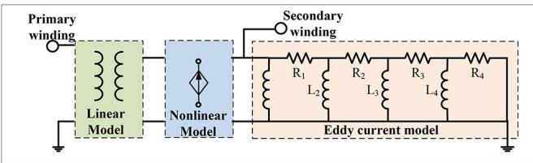  
Fig. 3  Admittance-based transformer model with saturation

Fig. 4  SFP model for the exponential load   
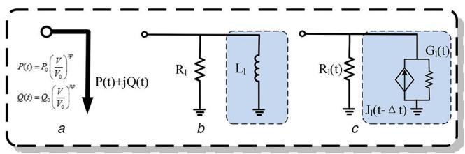  
(a) Equivalent circuit, (b) Stage 1 model, (c) Stage 2 model

The overall Thevenin circuit for the system-level calculations is derived by Gaussian elimination:

$$
\boldsymbol {v} _ {\mathrm {s}} ^ {d q 0} (t) = - \boldsymbol {R} _ {d q 0} \boldsymbol {d} _ {\mathrm {s}} ^ {d q 0} (t) + E _ {\mathrm {s}} ^ {d q 0} (t - \Delta t) \tag {17}
$$

where

$$
\left\{ \begin{array}{c} \boldsymbol {R} _ {d q 0} = \boldsymbol {R} _ {\mathrm {s s}} - \boldsymbol {R} _ {\mathrm {s r}} \boldsymbol {R} _ {\mathrm {r r}} ^ {- 1} \boldsymbol {R} _ {\mathrm {r s}} \\ E _ {s} ^ {d q 0} (t - \Delta t) = \mathbf {e} _ {s} ^ {d q 0} (t - \Delta t) + \boldsymbol {R} _ {\mathrm {s r}} \boldsymbol {R} _ {\mathrm {r r}} ^ {- 1} [ v _ {\mathrm {r}} - \mathbf {e} _ {\mathrm {r}} (t - \Delta t) ] \end{array} \right. \tag {18}
$$

The overall Thevenin circuit at the stator side is then transformed back to three-phase coordinates. The corresponding three-phase circuit is interfaced and calculated with the whole system and machine variables at the stator and rotor sides will be derived during each iteration of the simulations.

# 3.2 SFP model of transformer

According to $( 2 ) - ( 4 )$ , the matrix equation for a n-winding transformer by SFP model is given as:

$$
\hat {\nu} = R \hat {i} + L \frac {\mathrm {d} \hat {i}}{\mathrm {d} t} + \omega_ {\mathrm {s}} T \left(- \frac {\pi}{2} \omega_ {\mathrm {s}}\right) \hat {i} \tag {19}
$$

where R and L are $n \ast n$ matrices; $\hat { \mathbf { v } } , \hat { \mathbf { i } }$ are n ∗ 1 vectors of winding voltages and currents, respectively. As shown in Fig. 3, the linear part of the transformer is modelled by admittance-based model, and the saturation effect is represented by the extra non-linear current connected to the secondary winding, which is joined to the linear inductance matrix. A four section cascaded $\smile$ lumped circuit (Cauer equivalent circuit) [19] was chosen to represent the frequency-dependent eddy current phenomena in the transformer core.

By time discretisation, (19) is rewritten as:

$$
\begin{array}{l} \left[ I _ {2 \times 2} + \frac {R \Delta t}{2 \mathrm {L}} \otimes I _ {2 \times 2} + \omega T (- \frac {\pi}{2 \omega_ {\mathrm {S}}}) \right] \hat {i} (t) = \frac {\Delta t}{2 \mathrm {L}} \hat {v} (t) \\ + \left[ I _ {2 \times 2} - \frac {R \Delta t}{2 \mathrm {L}} \otimes I _ {2 \times 2} - \omega T \left(- \frac {\pi}{2 \omega_ {\mathrm {S}}}\right) \right] \hat {i} (t - \Delta t) \tag {20} \\ + \frac {\Delta t}{2 L} \otimes I _ {2 \times 2} \hat {v} (t - \Delta t) \\ \end{array}
$$

where $\hat { i } ( t ) = \left[ \hat { i } ^ { R } ( t ) , \hat { i } ^ { I } ( t ) \right] ^ { \mathrm { T } } ; \hat { i } ^ { R } ( t ) , \hat { i } ^ { I } ( t )$ are the real and imaginary parts of $\hat { i } ( t ) ; \hat { \nu } ( t ) = \left[ \hat { \nu } ^ { R } ( t ) , \hat { \nu } ^ { I } ( t ) \right] ^ { \operatorname { T } } ; \hat { \nu } ^ { R } ( t ) , \hat { \nu } ^ { I } ( t )$ are the real and imaginary parts of $\hat { \mathbf { \nu } } ^ { \mathrm { ( } t \mathrm { ) } ; \ \mathrm {  { \left. \otimes ^ { \prime } \right. } } }$ denotes the Kronecker product, or the element-by-element multiplication.

With SFP derived phasors converted back into the time-domain form, (20) is written as

$$
\begin{array}{l} \left[ I _ {2 \times 2} + \frac {R \Delta t}{2 \mathbf {L}} \otimes I _ {2 \times 2} + \omega_ {\mathrm {s}} T (- \frac {\pi}{2 \omega_ {s}}) \right] i (t) = \frac {\Delta t}{2 \mathbf {L}} \otimes I _ {2 \times 2} \mathbf {v} (\mathbf {t}) \\ + \left[ \left(I _ {2 \times 2} - \frac {\boldsymbol {R} \Delta t}{2 \mathbf {L}} \otimes I _ {2 \times 2}\right) \boldsymbol {Q} (\Delta t) - \omega_ {s} \boldsymbol {Q} (\Delta t - \frac {\pi}{2 \omega_ {s}}) \right] \boldsymbol {i} (t - \Delta t) \tag {21} \\ + \frac {\Delta t}{2 \mathbf {L}} \otimes I _ {2 \times 2} Q (\Delta t) v (t - \Delta t) \\ \end{array}
$$

After some manipulations, the Norton equivalents, or the conductance and the equivalent current, can be expressed by

$$
\left\{ \begin{array}{c} \boldsymbol {i} (t) = \boldsymbol {G} \boldsymbol {v} (t) + \boldsymbol {J} (t - \Delta t) \\ \boldsymbol {J} (t - \Delta t) = \mathbf {A} \mathbf {i} (t - \Delta t) + \mathbf {B} \mathbf {v} (t - \Delta t) \end{array} \right. \tag {22}
$$

where

$$
\left\{ \begin{array}{l} G = \left[ I _ {2 \times 2} + \frac {R \Delta t}{2 \mathrm {L}} \otimes I _ {2 \times 2} + \omega T \left(- \frac {\pi}{2 \omega_ {\mathrm {S}}}\right) \right] ^ {- 1} \frac {\Delta t}{2 \mathrm {L}} \otimes I _ {2 \times 2} \\ A = \left[ I _ {2 \times 2} + \frac {R \Delta t}{2 \mathrm {L}} \otimes I _ {2 \times 2} + \omega T \left(- \frac {\pi}{2 \omega_ {\mathrm {S}}}\right) \right] ^ {- 1} \\ \left[ \left(I _ {2 \times 2} - \frac {R \Delta t}{2 \mathrm {L}} \otimes I _ {2 \times 2}\right) Q (\Delta t) - \omega Q (\Delta t - \frac {\pi}{2 \omega_ {\mathrm {S}}}) \right] \\ B = \left[ I _ {2 \times 2} + \frac {R \Delta t}{2 \mathrm {L}} \otimes I _ {2 \times 2} + \omega T \left(- \frac {\pi}{2 \omega_ {\mathrm {S}}}\right) \right] ^ {- 1} \frac {\Delta t}{2 \mathrm {L}} \\ \otimes I _ {2 \times 2} Q (\Delta t) \end{array} \right. \tag {23}
$$

The non-linearity caused by saturation is superimposed on the nodal voltage vector solved from the linear network

$$
\left[ \begin{array}{l} v _ {\mathrm {F}} ^ {R} (t) \\ v _ {\mathrm {F}} ^ {I} (t) \end{array} \right] = \left[ \begin{array}{l} v _ {0} ^ {R} (t) \\ v _ {0} ^ {I} (t) \end{array} \right] - G ^ {- 1} \left[ \begin{array}{l} i _ {\operatorname {c o m p}} ^ {R} (t) \\ i _ {\operatorname {c o m p}} ^ {I} (t) \end{array} \right] \tag {24}
$$

where $\left[ \nu _ { 0 } ^ { R } ( t ) , \mathbf { v } _ { 0 } ^ { I } ( t ) \right] ^ { \mathrm { T } }$ are real and imaginary parts of linear nodal voltage vectors; $\big [ \nu _ { \mathrm { F } } ^ { R } ( t ) , \mathbf { v } _ { \mathrm { F } } ^ { I } ( t ) \big ] ^ { \mathrm { T } }$ are real and imaginary parts of final nodal voltage vectors; and $\left[ i _ { \mathrm { c o m p } } ^ { R } ( t ) , \mathbf { i } _ { \mathrm { c o m p } } ^ { I } ( t ) \right] ^ { \mathrm { T } }$ is the compensation current injected into the linear network, which is obtained from the saturation curve by Newton–Raphson iterations.

# 3.3 SFP model of load

As shown in Fig. 4, an exponential load is taken as an example to derive the SFP models of loads. The consumed power of the exponential load depends exponentially on the load voltage, which is characterised as:

$$
\left\{ \begin{array}{l} P (t) = P _ {0} [ V (t) / V _ {0} ] ^ {n p} \\ Q (t) = Q _ {0} [ V (t) / V _ {0} ] ^ {n q} \end{array} \right. \tag {25}
$$

where $P _ { 0 } , Q _ { 0 }$ and $V _ { 0 }$ are the steady-state active or reactive powers and the voltage magnitude of the load at the steady state. For special cases such that load parameters np or nq becomes 0, 1, or 2, the load model will represent the constant power, constant current, and constant impedance load, respectively.

For each iteration of simulations, the exponential load is represented as a paralleled RL branch, where parameters of the time-varying resistance ${ \pmb R } _ { l } ( t )$ and the time-varying inductor ${ \bf \cal L } _ { l } ( t )$ are calculated by

$$
\left\{ \begin{array}{l} R _ {I} (t) = \frac {\| V (t - \Delta t) \| ^ {2}}{P (t)} \\ L _ {I} (t) = \frac {\| V (t - \Delta t) \| ^ {2}}{\omega_ {\mathrm {s}} Q (t)} \end{array} \right. \tag {26}
$$

Here, magnitude of $\parallel V ( t - \Delta t )$ ∥ is calculated by:

$$
\left\| \boldsymbol {V} (t - \Delta t) \right\| = \sqrt {\left[ \boldsymbol {V} ^ {R} (t - \Delta t) \right] ^ {2} + \left[ \boldsymbol {V} ^ {I} (t - \Delta t) \right] ^ {2}} \tag {27}
$$

where ${ V } ^ { R } ( t - \Delta t )$ and $V ^ { I } ( t - \Delta t )$ are the real and imaginary parts of $V ( t - \Delta t )$ .

The SFP model of the time-varying inductor is represented by its Norton equivalents. The Norton conductance and the equivalent current are calculated as:

$$
\left\{ \begin{array}{c} \boldsymbol {G} _ {l} (t) = \frac {\Delta t}{2 L} \otimes I _ {2 \times 2} \\ \boldsymbol {J} _ {l} (t - \Delta t) = \frac {\Delta t}{2 L} \boldsymbol {R} (\Delta t) v _ {l} (t - \Delta t) \\ + \left[ I _ {2 \times 2} + \frac {\Delta t}{2 L} \omega_ {s} \boldsymbol {R} \left(\Delta t - \frac {\pi}{2 \omega_ {s}}\right) \right] i _ {l} (t - \Delta t) \end{array} \right. \tag {28}
$$

where $\nu _ { l } ( t - \Delta t )$ and $i _ { l } ( t - \Delta t )$ are the historic inductor voltage and current, respectively.

Consequently, SFP models the time-varying resistance as well the time-varying inductor represents the overall SFP model of the exponential load.

# 3.4 SFP model of transmission line

As shown in Fig. 5, equations of the transmission line, represented in the SFP derived phasors, are given by:

$$
\left\{ \begin{array}{l} \frac {\partial \hat {u} (x , t)}{\partial x} + L \frac {\partial \hat {i} (x , t)}{\partial t} + \mathrm {j} \omega L \hat {i} (x, t) = 0 \\ \frac {\partial \hat {i} (x , t)}{\partial x} + C \frac {\partial \hat {u} (x , t)}{\partial t} + \mathrm {j} \omega C \hat {u} (x, t) = 0 \end{array} \right. \tag {29}
$$

where $\hat { u } ( x , t ) , \hat { i } ( x , t )$ are SFP derived phasors of voltages and currents, respectively.

Given the initial conditions of $\hat { u } ( x , t ) , \hat { i } ( x , t ) .$ , or $\hat { u } ( x , 0 ) = 0 , \hat { i } ( x , 0 ) = 0$ , the Laplace transformation of (29) is:

$$
\left\{ \begin{array}{l} \frac {\partial \hat {u} (x , s)}{\partial x} + s L \hat {i} (x, s) + \mathrm {j} \omega L \hat {i} (x, s) = 0 \\ \frac {\partial \hat {i} (x , s)}{\partial x} + s C \hat {u} (x, s) + \mathrm {j} \omega C \hat {u} (x, s) = 0 \end{array} \right. \tag {30}
$$

Applying partial derivative for x on both sides of (30), there is:

$$
\left\{ \begin{array}{l} \frac {\partial^ {2} \hat {u} (x , s)}{\partial x ^ {2}} + L C (s + \mathrm {j} \omega) ^ {2} \hat {u} (x, s) = 0 \\ \frac {\partial^ {2} \hat {i} (x , s)}{\partial x ^ {2}} + L C (s + \mathrm {j} \omega) ^ {2} \hat {i} (x, s) = 0 \end{array} \right. \tag {31}
$$

Performing inverse Laplace transformation to (31) yields:

$$
\left\{ \begin{array}{l} \hat {u} (x, t) = \hat {u} \left(t - \frac {x}{v}\right) \mathrm {e} ^ {- \mathrm {j} \frac {\omega}{v} x} + \hat {u} \left(t + \frac {x}{v}\right) \mathrm {e} ^ {\mathrm {j} \frac {\omega}{v} x} \\ \hat {i} (x, t) = \hat {i} \left(t - \frac {x}{v}\right) \mathrm {e} ^ {- \mathrm {j} \frac {\omega}{v} x} + \hat {i} \left(t + \frac {x}{v}\right) \mathrm {e} ^ {\mathrm {j} \frac {\omega}{v} x} \end{array} \right. \tag {32}
$$

where the speed of wave is $\nu = 1 / { \sqrt { L C } } .$ .

By converting SFP derived phasors into their time-domain forms, the SFP model of the transmission line is obtained as:

$$
\left\{ \begin{array}{l} i _ {k} (t) = u _ {k} (t) / Z + I _ {k} (t - \tau) \\ i _ {n} (t) = u _ {n} (t) / Z + I _ {n} (t - \tau) \end{array} \right. \tag {33}
$$

with

$$
\left\{ \begin{array}{l} I _ {k} (t - \tau) = - Z ^ {- 1} \left[ u _ {n} (t - \tau) \mathrm {e} ^ {- \mathrm {j} \theta} \right] - i _ {n} (t - \tau) \mathrm {e} ^ {- \mathrm {j} \theta} \\ I _ {n} (t - \tau) = - Z ^ {- 1} \left[ u _ {k} (t - \tau) \mathrm {e} ^ {- \mathrm {j} \theta} \right] - i _ {k} (t - \tau) \mathrm {e} ^ {- \mathrm {j} \theta} \end{array} \right. \tag {34}
$$

where $\tau = l / \nu , \theta = \omega l / \nu , Z = \sqrt { L / C } .$

It should be noted that the voltages and currents at $t = t - \tau$ are obtained by linear interpolations in phasor domain, or

$$
\left\{ \begin{array}{l} u (t - \tau) = \frac {\Delta t - \tau}{\Delta t} \mathrm {e} ^ {- \mathrm {j} \omega_ {0} \tau} u (t) + \frac {\tau}{\Delta t} \mathrm {e} ^ {\mathrm {j} \omega_ {0} (\Delta t - \tau)} u (t - \Delta t) \\ i (t - \tau) = \frac {\Delta t - \tau}{\Delta t} \mathrm {e} ^ {- \mathrm {j} \omega_ {0} \tau} i (t) + \frac {\tau}{\Delta t} \mathrm {e} ^ {\mathrm {j} \omega_ {0} (\Delta t - \tau)} i (t - \Delta t) \end{array} \right. \tag {35}
$$

The SFP model can be further separated into their real and imaginary parts:

$$
\left[ \begin{array}{l} \left[ i _ {k} ^ {R} (t) \right] = \left[ u _ {k} ^ {R} (t) \right] / \left[ \begin{array}{c c} Z & \\ u _ {k} ^ {I} (t) \end{array} \right] + \left[ \begin{array}{c} I _ {k} ^ {R} (t - \tau) \\ I _ {k} ^ {I} (t - \tau) \end{array} \right] \end{array} \right. \tag {36}
$$

$$
\left\lfloor \left[ \begin{array}{c} i _ {n} ^ {R} (t) \\ i _ {n} ^ {I} (t) \end{array} \right] = \left[ \begin{array}{c} u _ {n} ^ {R} (t) \\ u _ {n} ^ {I} (t) \end{array} \right] / \left[ \begin{array}{c c} Z & \\ & Z \end{array} \right] + \left[ \begin{array}{c} I _ {n} ^ {R} (t - \tau) \\ I _ {n} ^ {I} (t - \tau) \end{array} \right] \right.
$$

with

$$
\begin{array}{l} \left[ \begin{array}{l} I _ {k} ^ {R} (t - \tau) \\ I _ {k} ^ {I} (t - \tau) \end{array} \right] = \left[ \begin{array}{l} u _ {n} ^ {R} (t - \tau) \\ u _ {n} ^ {I} (t - \tau) \end{array} \right] Q (- \theta) / \left[ \begin{array}{c c} Z & \\ & Z \end{array} \right] \tag {37} \\ + \left[ \begin{array}{c} i _ {n} ^ {R} (t - \tau) \\ i _ {n} ^ {I} (t - \tau) \end{array} \right] Q (- \theta) \\ \end{array}
$$

# 3.5 SFP model of wideband (WB) transmission line

Fig. 6 shows the representation of a frequency-dependent WB multi-conductor transmission line of length L, with one of its ends

Fig. 5  SFP model of transmission line   
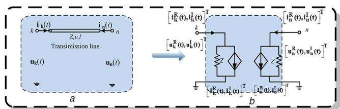  
(a) Circuit model, (b) Norton equivalent circuit

at $x = 0$ and the other at $x = L .$ Let $I _ { 0 }$ be the vector of phase currents being injected into the line and $V _ { 0 }$ the vector of phase voltages, both at $x = 0 .$ . In the same form, $I _ { L }$ and $V _ { L }$ represent the respective vectors of injected phase currents and of phase voltages at $x = L$ . The differential equation of the frequency-dependent WB transmission line is written as [19, 20]:

$$
\left\{ \begin{array}{l} - \frac {\mathrm {d} V}{\mathrm {d} x} = \mathbf {Z I} \\ - \frac {\mathrm {d} I}{\mathrm {d} x} = \mathbf {Y V} \end{array} \right. \tag {38}
$$

where V is the voltage vector; I is the current vector; Z and Y are the $( N \times N )$ per unit-length series impedance and shunt admittance matrix of a given line with N conductors, respectively.

According to (38), we can have the following equations:

$$
\left\{ \begin{array}{c} \boldsymbol {I} (x) = C _ {1} \mathrm {e} ^ {- \sqrt {\mathbf {Y Z}} x} + C _ {2} \mathrm {e} ^ {\sqrt {\mathbf {Y Z}} x} \\ \boldsymbol {V} (x) = - \boldsymbol {Y} ^ {- 1} \frac {\mathrm {d} \boldsymbol {I}}{\mathrm {d} x} = \boldsymbol {Z} _ {c} \left[ C _ {1} \mathrm {e} ^ {- \sqrt {\mathbf {Y Z}} x} - C _ {2} \mathrm {e} ^ {\sqrt {\mathbf {Y Z}} x} \right] \end{array} \right. \tag {39}
$$

where $\pmb { Z } _ { c } = \pmb { Y } ^ { - 1 } \sqrt { \pmb { Y } \pmb { Z } }$ is the characteristic impedance matrix and its inverse is the characteristic admittance matrix $Y _ { c } = \sqrt { Y Z } Z ^ { - 1 }$ 1.

After some manipulations, the following equation can be derived:

$$
\begin{array}{l} \boldsymbol {I} _ {0} - \boldsymbol {Y} _ {c} \boldsymbol {V} _ {0} = - \mathrm {e} ^ {- \sqrt {\boldsymbol {Y Z}} l} [ \boldsymbol {I} _ {L} + \boldsymbol {Y} _ {c} \boldsymbol {V} _ {L} ] \\ \Rightarrow \boldsymbol {I} _ {0} = \boldsymbol {Y} _ {c} \boldsymbol {V} _ {0} + \left[ - \mathrm {e} ^ {- \sqrt {\mathbf {Y Z}} l} \left(\boldsymbol {I} _ {L} + \boldsymbol {Y} _ {c} \boldsymbol {V} _ {L}\right) \right] \tag {40} \\ \end{array}
$$

According to (40), the current phasor at $x = 0$ can be rewritten as:

$$
\begin{array}{l} \boldsymbol {I} _ {0} = \boldsymbol {Y} _ {c} \boldsymbol {V} _ {0} + \left[ - \mathrm {e} ^ {- \sqrt {\mathbf {Y Z}} l} \left(\boldsymbol {I} _ {L} + \boldsymbol {Y} _ {c} \boldsymbol {V} _ {L}\right) \right] \\ = \boldsymbol {I} _ {s h, 0} - \boldsymbol {I} _ {a u x, 0} = \boldsymbol {Y} _ {c} \boldsymbol {V} _ {0} - \boldsymbol {H} \boldsymbol {I} _ {r f l, L} \\ \end{array}
$$

where

$$
\left\{ \begin{array}{c} \boldsymbol {H} = \mathrm {e} ^ {- \sqrt {Y Z} l} \\ \boldsymbol {I} _ {r f l, L} = \boldsymbol {I} _ {L} + \boldsymbol {Y} _ {c} \boldsymbol {V} _ {L} \end{array} \right. \tag {42}
$$

Here, H denotes the transfer function matrix; and $I _ { r f l , L }$ denotes the reflected currents at terminal $x = L .$ is the shunt currents vector produced at terminal $x = 0$ by injected voltages $V _ { 0 } .$ the auxiliary currents vector consisting of the reflected currents at terminal $x = L$ .

1) Derivation of the shunt current $i _ { s h , 0 }$

The frequency dependent matrix $Y _ { c }$ is fitted by a series of rational functions as:

$$
Y _ {c} = G _ {0} + \sum_ {i = 1} ^ {N y} \frac {G _ {i}}{s - q _ {i}} \tag {43}
$$

where $N _ { y }$ is the fitted order qi represents the $i ^ { t h }$ fitting pole; $\mathbf { G _ { i } }$ is the corresponding matrix of residues and $\mathbf { G _ { 0 } }$ is a constant matrix obtained at the limit of $Y _ { c }$ when $s = \mathrm { j } \omega \to \infty$ .

According to (2)–(4), the shifted phasor equation for the shunt current $\ddot { i } _ { s h , 0 }$ is given as:

$$
\left\{ \begin{array}{c} \hat {i} _ {s h, 0} = G _ {0} \hat {v} _ {0} + \sum_ {i = 1} ^ {N _ {g}} \hat {w} _ {i} \\ \frac {\mathrm {d} \hat {w} _ {i}}{\mathrm {d} t} = q _ {\mathrm {i}} \hat {w} _ {i} + \omega_ {\mathrm {s}} T \left(- \frac {\pi}{2 \omega_ {\mathrm {s}}}\right) \hat {w} _ {i} + G _ {i} \hat {v} _ {0} \end{array} \right. \tag {44}
$$

where $^ \circ \wedge ^ { \prime }$ denotes the shifted phasor of the corresponding variables; T() is the transformation matrix given in (4).

Equation (44) is discretised by the Trapezoidal algorithm and all the variables are transformed back from shifted phasors to their corresponding time-domain variables:

$$
w _ {i} (t) = \mathbf {A} _ {i} w _ {i} (t - \Delta t) + \mathbf {G} _ {i} v _ {0} (t) + \mathbf {K} _ {i} v _ {0} (t - \Delta t) \tag {45}
$$

where

$$
\left\{ \begin{array}{r l} \mathbf {A} _ {i} & = \left[ \frac {2}{\Delta t} - q _ {i} - \omega_ {\mathrm {s}} T \left(- \frac {\pi}{2 \omega_ {\mathrm {s}}}\right) \right] ^ {- 1} \left[ \frac {2}{\Delta t} \mathbf {Q} (\Delta t) + q _ {i} \mathbf {Q} (\Delta t) \right] \\ & \quad \mathbf {B} _ {i} = \left[ \frac {2}{\Delta t} - q _ {i} - \omega_ {\mathrm {s}} T \left(- \frac {\pi}{2 \omega_ {\mathrm {s}}}\right) \right] ^ {- 1} G _ {i} \\ & \quad \mathbf {K} _ {i} = \left[ \frac {2}{\Delta t} - q _ {i} - \omega_ {\mathrm {s}} T \left(- \frac {\pi}{2 \omega_ {\mathrm {s}}}\right) \right] ^ {- 1} \mathbf {Q} (\Delta t) G _ {i} \end{array} \right. \tag {46}
$$

2) Derivation of the auxiliary current $i _ { a u x , 0 }$

In order to calculate the auxiliary ${ \cal I } _ { a u x , 0 } = { \cal H } { \cal I } _ { r f l , L } ,$ , the frequency dependent transfer matrix H should be fitted and derived first. To attain an accurate and compact (low order) rational representation for H, it is essential to factor out all terms involving time delays (Marti, 1982) [21, 22]. The major difficulty here is that its elements could involve a mix of up to N different delay terms due to the multi-mode propagation on a N-conductor line (Wedepohl, 1965) [23]. Based on the modal factorisation and vector fitting [24], the frequency dependent transfer matrix H can be written as:

$$
\boldsymbol {H} = \sum_ {k = 1} ^ {N _ {g}} \mathrm {e} ^ {- s \tau_ {k}} \sum_ {i = 1} ^ {N (k)} \frac {R _ {k , i}}{s - p _ {k , i}} \tag {47}
$$

where $\tau _ { k }$ is the delay associated with the velocity of the $\boldsymbol { k } ^ { t h }$ mode and $N _ { g }$ is the number of modes; N(k) is the fitting order of $\boldsymbol { k } ^ { t h }$ term [19]; $R _ { k , i }$ and $p _ { k , i }$ represent its $k ^ { t h }$ fitting pole and a matrix of residues determined by a vector fitting process [24].

According to (41) and (42) and (47), the auxiliary current is calculated by transforming all the variables into the shifted phasor domain:

$$
\left\{ \begin{array}{c} \hat {i} _ {a u x - 0} = \sum_ {k = 1} ^ {N g} \sum_ {i = 1} ^ {N (k)} \hat {x} _ {k, i} \\ \frac {\mathrm {d} \hat {x} _ {k , i}}{\mathrm {d} t} = p _ {k, i} \hat {x} _ {k, i} + \omega_ {\mathrm {s}} T \left(- \frac {\pi}{2 \omega_ {\mathrm {s}}}\right) \hat {x} _ {k, i} + R _ {k, i} \hat {i} _ {r f l, L} (t - \tau_ {k}) \end{array} \right. \tag {48}
$$

Then, (48) is transferred back into the time domain and the time-domain auxiliary current are finally calculated by:

$$
\left\{ \begin{array}{c} i _ {a u x - 0} = \sum_ {k = 1} ^ {N g} \sum_ {i = 1} ^ {N (k)} x _ {k, i} \\ x _ {k, i} = S _ {k, i} x _ {k, i} (t - \Delta t) + D _ {k, i} i _ {r f l, L} (t - \tau_ {k}) \\ + P _ {k, i} i _ {r f l, L} (t - \tau_ {k} - \Delta t) \end{array} \right. \tag {49}
$$

where

$$
\boldsymbol {S} _ {k, i} = \left[ I - \frac {\Delta t}{2} p _ {k, i} - \frac {\Delta t}{2} \omega_ {\mathrm {s}} \boldsymbol {T} \left(- \frac {\pi}{2 \omega_ {\mathrm {s}}}\right) \right] ^ {- 1} \tag {50}
$$

$$
\left[ Q (\Delta t) + \frac {\Delta t}{2} Q (\Delta t) p _ {k, i} - \omega_ {\mathrm {s}} Q \left(\Delta t - \frac {\pi}{2 \omega_ {\mathrm {s}}}\right) \right]
$$

$$
\left\{ \begin{array}{c} \boldsymbol {D} _ {k, i} = \left[ I - \frac {\Delta t}{2} p _ {k, i} - \frac {\Delta t}{2} \omega_ {\mathrm {s}} \boldsymbol {T} \left(- \frac {\pi}{2 \omega_ {\mathrm {s}}}\right) \right] ^ {- 1} \frac {\Delta t}{2} \\ \boldsymbol {P} _ {k, i} = \left[ I - \frac {\Delta t}{2} p _ {k, i} - \frac {\Delta t}{2} \omega_ {\mathrm {s}} \boldsymbol {T} \left(- \frac {\pi}{2 \omega_ {\mathrm {s}}}\right) \right] ^ {- 1} \frac {\Delta t}{2} \boldsymbol {Q} (\Delta t) \end{array} \right. \tag {51}
$$

Then, expressions for the model at end L are simply obtained $\boldsymbol { \mathrm { b y } }$ exchanging sub-indexes 0 and L at (44)–(46) and (49)–(51).

Finally, the frequency-dependent WB transmission line model in shifted phasor domain is described in Fig. 6.

# 4 Case studies

The proposed SFP model is extensively tested on the large-scale China Southern power grid (see Fig. 7) by simulating different scenarios, such as symmetric or asymmetric AC faults. The whole system contains 2232 nodes, 440 generators, 1296 loads. For clarity, only its 525 kV backbone network was sketched. To show their merits, the output waveforms of SFP models are compared with the transient stability programs (denoted as ‘TSP’ and PSCAD/EMTDC (denoted as ‘ref’), respectively. It should be noted that the TSP curves are obtained by the TS-based programs, or PSD-BPA. Unlike the TS model and the traditional EMT model, the SFP models can produce instantaneous values and phasor

values simultaneously, which are denoted as SFP_instantaneous and SFP_phasor respectively. Meanwhile, time-steps of SFP models, TSP curves, and the reference curves are 50 μs, 5 ms, and 50 μs, respectively.

# 4.1 Symmetric three-phase fault at bus LB

A symmetric resistive three-phase fault is triggered at Bus LB at t = 2.0 s and it lasts for 100 ms. AC voltages and currents near the fault location are compared in details, which are shown in Figs. 8 and 9. Evidently, SFP models can produce instantaneous and wide frequency-band phasor waveforms simultaneously, while the transient stability models (‘TSP’) only give the low-frequency phasor values and the EMT models only give the instantaneous values. Concerning the SFP instantaneous curves, they overlap

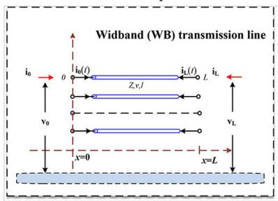

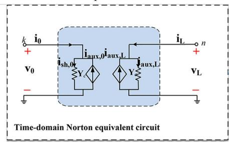

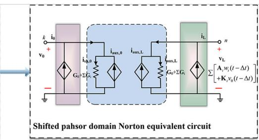

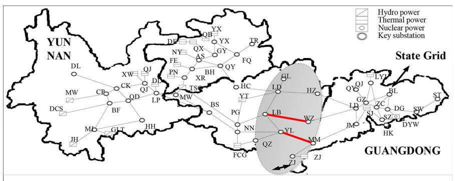  
Fig. 6  SFP model of wide-band (WB) transmission line   
Fig. 7  One-line diagram of China southern grid

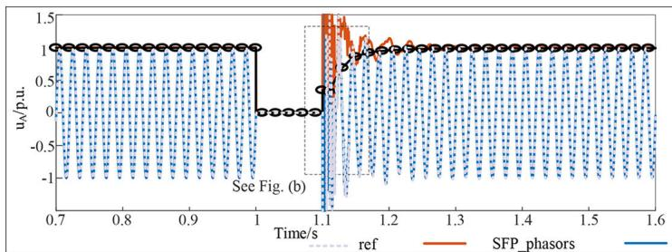  
a

b   
Fig. 8  AC voltages of Bus LB   
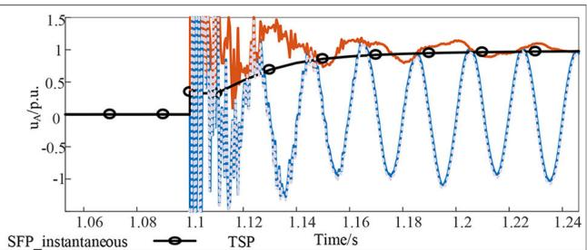  
(a) AC voltages of Bus LB, (b) Zoomed in figure

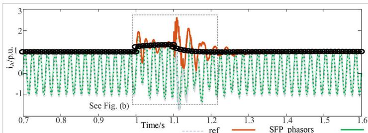  
a

b   
Fig. 9  AC currents between Bus LB and Bus WZ   
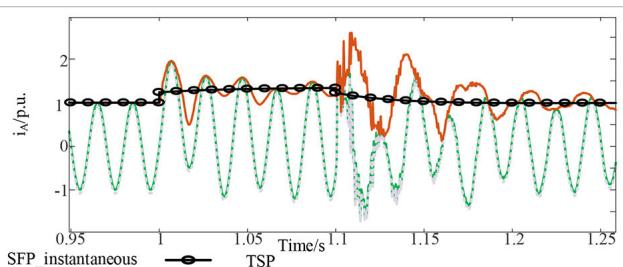  
(a) AC currents between bus LB and Bus WZ, (b) Zoomed in figures

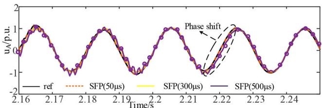  
Fig. 10  AC voltages of Bus LB under different time-steps

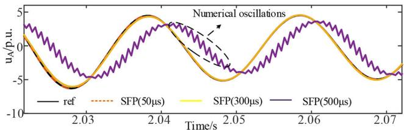  
Fig. 11  AC currents between Bus YL and Bus MM under different time-steps

Table 1 Average errors of AC voltages/currents of different time-steps(unit:p.u)   

<table><tr><td>Time-steps/ μs</td><td>50</td><td>100</td><td>200</td><td>300</td><td>400</td><td>500</td></tr><tr><td>uacLB</td><td>2.85E-04</td><td>0.002</td><td>0.009</td><td>0.021</td><td>0.041</td><td>0.062</td></tr><tr><td>iacYL</td><td>5.70E-04</td><td>0.0028</td><td>0.017</td><td>0.043</td><td>0.051</td><td>0.104</td></tr></table>

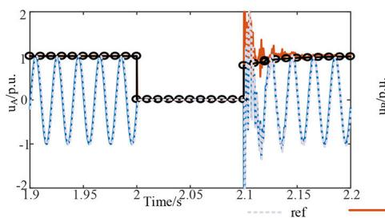

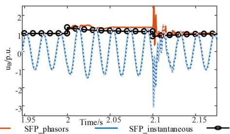

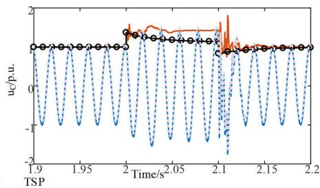

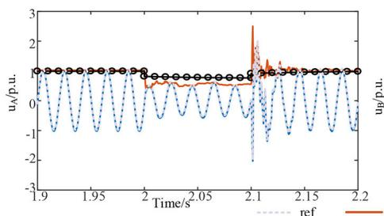  
Fig. 12  AC voltages of Bus LB

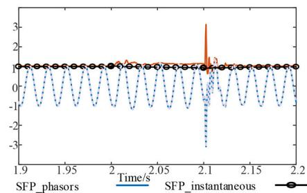

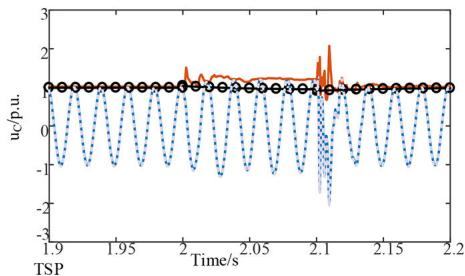  
Fig. 13  AC voltages of Bus MM

with the reference curve exactly. Noticeably, high-frequency dynamics of SFP instantaneous curves match those of the reference curve perfectly at the clearance of the fault. Concerning the SFP phasor curves, SFP phasor curves match the envelopes of instantaneous values exactly. Particularly, the SFP phasor curves can perfectly reflect interactions of both high- and low- frequency dynamics, even around the occurrence and clearance of the fault. However, the TS models only keep the low-frequency dynamics and show noticeable errors compared to the reference curve.

SFP instantaneous curves of AC voltages and currents under different time-steps are depicted in Figs. 10 and 11. Especially, average errors of ac voltages and currents under different timesteps are quantitatively summarised in Table 1. As shown in Figs. 10 and 11 and Table 1, the SFP instantaneous curves can achieve a satisfied accuracy when the time-step is less than 500 μs. However, when the time-step is extended to 500 μs, AC voltages and currents will have significant phase shift errors in our case. Particularly, the AC currents will have numerical oscillations at the time-step of 500 μs. Therefore, in our cases, the largest time-step is suggested to

be 400 μs with an acceptable accuracy and much improved efficiency.

# 4.2 Asymmetric single-phase fault at bus lB

Another simulation scenario is tested by triggering an asymmetric single-phase fault at phase A of Bus LB at t = 2.0 s and the fault lasts for 100 ms. AC voltages and currents of three phases are shown in Figs. 12–14, respectively. From Figs. 12–14, overvoltages of high-frequency will be produced for each phase after the clearance of the fault, but only lasts for one or two cycles. Clearly, Figs. 12–14 demonstrate that SFP models can produce instantaneous and phasor values simultaneously. SFP instantaneous curves overlap the reference curve, especially around the clearing of the fault. And SFP phasor curves match the envelopes of SFP instantaneous values exactly.

Similarly, ac voltages and currents by SFP models under different time-steps are compared in Figs. 15 and 16 and quantitative errors are summarised in Table 2. As is shown, the SFP instantaneous curves are as accurate as the reference curve even when the time-step is extended to 300 μs. From Table 2,

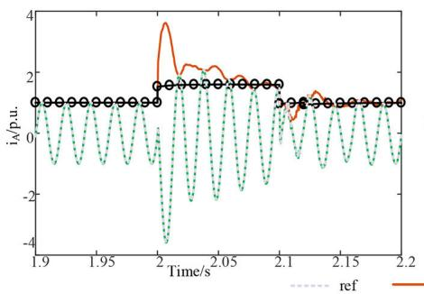

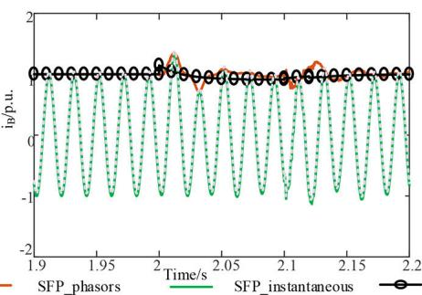

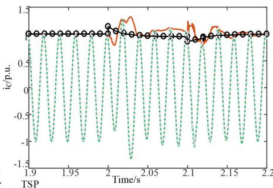

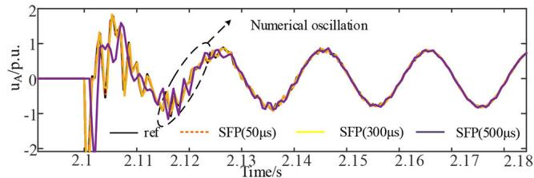  
Fig. 14  AC currents between Bus YL and Bus MM   
Fig. 15  AC voltages of Bus LB under different time-steps

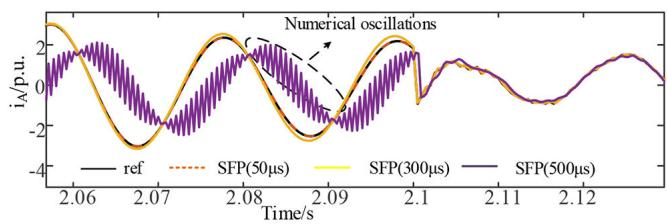  
Fig. 16 AC currents between Bus YL and Bus MM under different timesteps

Table 2 Average errors of AC voltages/currents of different time-steps(unit:p.u)   

<table><tr><td>Time-steps/ μs</td><td>50</td><td>100</td><td>200</td><td>300</td><td>400</td><td>500</td></tr><tr><td>uacLB</td><td>4.33 × 10-4</td><td>0.003</td><td>0.011</td><td>0.031</td><td>0.048</td><td>0.071</td></tr><tr><td>iacYL</td><td>9.12 × 10-4</td><td>0.004</td><td>0.024</td><td>0.062</td><td>0.051</td><td>0.112</td></tr></table>

b   
Fig. 17 Field current of the synchronous machine (BUS QZ) by different models under different time-steps   
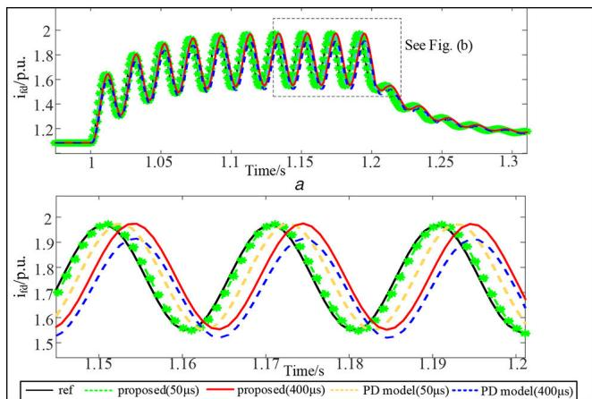  
(a) Field current of the synchronous machine (BUS QZ) by different models under different time-steps, (b) Zoomed in figure

errors of AC quantities during asymmetric fault scenarios will be larger than errors during symmetric fault. Similar to the three-fault scenarios, AC quantities with a time step larger than 500 μs will have damped numerical oscillations during the fault and numerical oscillations immediately disappear after the fault. Therefore, the optimal time-step for the asymmetric fault scenarios is suggested to be 400 μs according to Table 2.

Fig. 18 Angular frequency of the synchronous machine (BUS QZ) by different models under different time-steps   
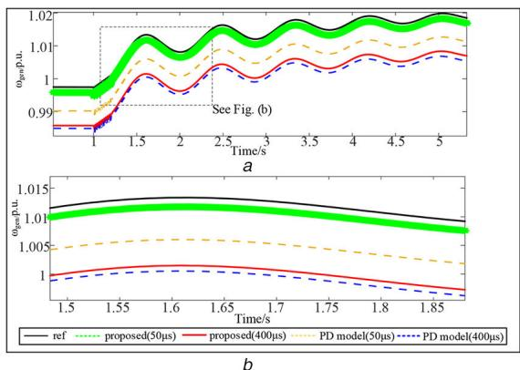  
(a) Angular frequency of the synchronous machine (BUS QZ) by different models under different time-steps, (b) Zoomed in figure

# 4.3 Accuracy comparisons of typical components

The accuracy comparisons of typical components, such as the synchronous machine and the transmission line, are detailed below.

1) Accuracy comparisons of the synchronous machine model

The simulation scenario is triggered by a single-phase fault of Bus YZ at $t = 1 . 0 \mathrm { s } ,$ which lasts for 0.2 s. The field currents and the angular frequencies of the synchronous machine (BUS QZ) by different models under different time-steps are given in Figs. 17 and 18, respectively. As shown in Figs. 16(a) and Fig. 18a, the proposed synchronous machine dq0 model can meet accuracy expectations as the traditional phase domain model [25]. Here, the PD model refers to that the synchronous machine has adopted the phase domain model. However, the zoomed-in curves in Figs. 17b and 18b have demonstrated that the proposed model can be more accurate even when the time-step is extended to 400 μs. And the accuracy improvement is more significant during the transient period at the occurrence or the clearance of the fault.

2) Accuracy comparisons of the transmission line model

The simulation scenario is trigged by a single-phase fault of Bus YZ at $t = 1 . 0 \mathrm { s } .$ , which lasts for 0.1 s. The over-voltage responses after the fault are given in Fig. 19, where the line length of Figs. 19a and b is 40 km and the line length of Figs. 19c and d is 120 km. As can be seen, when the length of transmission line is as long as 100 km or more, the simulation results obtained by the SFP-based Bergeron transmission line model (TLM) is almost as accurate as the SFP-based frequency dependent (FD) TLM. However, when the transmission line is shorter, or 40 km, the high frequency dynamics can only be obtained by the proposed SFPbased FD-TLM model, where the high frequency dynamics after the fault by using the Bergeron model are unexpectedly neglected. Therefore, only when simulating the short transmission line (the line length is less than 50 km or less), the SFP-based FD-TLM model is recommended, otherwise, the SFP-based Bergeron model is accurate enough.

3) Discussion on the Time-step Limit and Accuracy of SFPbased Transmission Line Model (TLM)

Normally, the time-step of the transmission line model is restricted by the frequency of interest and the maximum frequency

$f _ { \mathrm { m a x } }$ and the time delay of the TLM, or τmin. As a result, the timestep should satisfy $\Delta t <$ min $( 1 / 2 f _ { \mathrm { m a x } } , \tau _ { \mathrm { m i n } } )$ , normally less than 100–300 μs. However, if the linear interpolations in phasor domain is used, the time-step can be extended to 1 ms. The reason is detailed as follows.

First, according to the modulation theory, a typical signal in power system can be represented as:

$$
x (t) = a (t) \cos [ \omega_ {0} t + \theta (t) ] \tag {52}
$$

where a(t) = 1 + 0.1cosωt is taken as an example of 10% harmonics. If the voltages and currents at t − τ, or u(t − τ), i(t − τ) in (28) and (29) are calculated based on the linear interpolations in time-domain, the ratio between the numerical value at t − τ and the theoretical value is written as:

$$
\begin{array}{l} \xi_ {T} (f) = \frac {1 + \frac {\Delta t - \tau}{\Delta t} 0 . 1 \cos \omega t + \frac {\tau}{\Delta t} [ 0 . 1 \cos \omega (t - \Delta t) ]}{1 + 0 . 1 \cos \omega [ t - \tau ]}, \omega \tag {53} \\ = 2 \pi f \\ \end{array}
$$

Similarly, if the voltages and currents at t − τ, or u(t − τ), i(t − τ) in (28) and (29) are calculated based on the linear

Fig. 19 AC voltages after the fault by using different transmission line models of different line lengths   
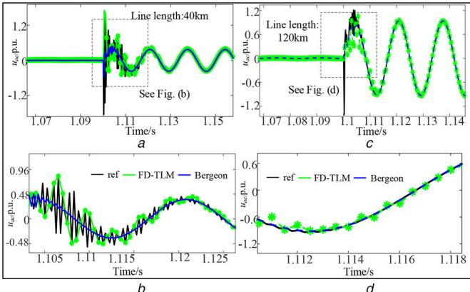  
(a) AC voltages after the fault by using different transmission line models of 40 km, (b) Zoomed in figure of (a), (c) AC voltages after the fault by using different transmission line models of 120 km, (d) Zoomed in figure of (c)

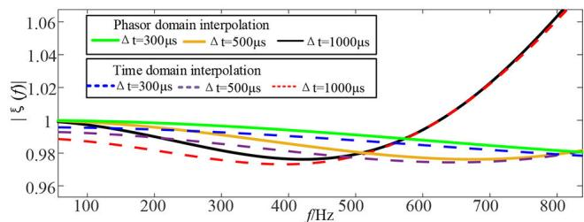  
Fig. 20 Ratio between the numerical value at t − τ and the theoretical value calculated by time- and phasor-domain under different time-steps

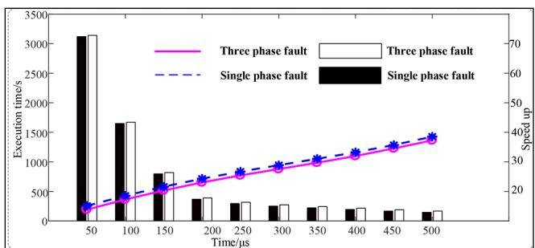  
Fig. 21 Execution time and speedup of SFP models under different scenarios

interpolations in phasor-domain, the ratio between the numerical value at t − τ and the theoretical value is written as:

$$
\begin{array}{l} \xi_ {P} (f) = \frac {1 + \frac {\Delta t - \tau}{\Delta t} e ^ {- j \omega_ {0} \tau} 0 . 1 \cos \omega t + \frac {\tau}{\Delta t} e ^ {j \omega_ {0} (\Delta t - \tau)} [ 0 . 1 \cos \omega (t - \Delta t) ]}{1 + 0 . 1 \cos \omega [ t - \tau ]}, \\ \omega = 2 \pi f \tag {54} \\ \end{array}
$$

The ratio between the numerical value at t − τ and the theoretical value calculated by time- and phasor-domain under different time-steps are given in Fig. 20. As can be seen, the errors of phasor domain is smaller. More importantly, even when the time-step is extended to 500 μs, the ratio ξ( f ) is close to 1 at below 200 Hz. Therefore, linear interpolations in phasor domain of transmission line model can satisfy the accuracy expectations.

# 4.4 Comparisons of computational performance

In this work, the simulation efficiency is measured in terms of execution time and speedup. The speedup is defined as the ratio of the execution time consumed by PSCAD (base scenario) and the proposed method. The time-step of PSCAD models is restricted to 50 μs to guarantee numerical stability of the simulations [6]. All simulations are carried out on a computer with 2.67 GHz Intel i7 CPU, 8 GB RAM and 64-b Windows 7 operating system. The results are illustrated in Fig. 21. The speedup is evident, especially when the time step of the proposed method is extended to 500 μs, achieving a speedup of over 30 times. Therefore, the proposed method has improved the efficiency significantly in simulating large-scale AC systems.

# 5 Conclusion

To capture wide-band frequency interactions between individual components, the extended-frequency DP (SFP) modelling is generalised based on matrix transformations and SFP models of typical components in large-scale AC grids are derived hereafter. One of its salient features is that SFP models can produce instantaneous and wide frequency-band phasor waveforms simultaneously. SFP phasor curves are the envelopes of SFP instantaneous curves perfectly, capturing both low-frequency and high-frequency interactions. Moreover, SFP models allow a much larger time-step than traditional EMT models and thus improve the simulation efficiency dramatically.

The effectiveness of the proposed method has been validated by simulating a large-scale AC grid in China under different scenarios. The results have demonstrated that:

(i) The SFP phasor curves match the envelopes of SFP instantaneous values exactly. In other words, SFP models can reflect both low- and high frequency interactions perfectly.   
(ii) With the proposed method, simulation errors are reduced to less than 0.05p.u. even when the time-step is extended to 400 μs.   
(iii) The proposed method at a time-step of 500 $\mu \mathbf { S } .$ . is more than 30 times faster than the standard EMT model in simulating a practical large-scale AC grid.

# 6 Acknowledgments

This work was partly supported by the National Key R&D Program of China (2017YFB0902000), the Shanghai Sailing Program 19YF1423500), Shanghai Jiao Tong University Scientific and Technological Innovation Funds.

# 7 References

[1] Jianzhong, X., Gole, A.M., Chengyong, Z.: ‘The use of averaged-value model of modular multilevel converter in DC grid’, IEEE Trans. Power Deliv., 2015, 30, (1), pp. 519–528   
[2] Jalili-Marandi, V., Dinavahi, V., Strunz, K., et al.: ‘Interfacing techniques for transient stability and electromagnetic transient programs’, IEEE Trans. Power Deliv., 2009, 24, (4), pp. 2385–2395

[3] Mahseredjian, J., Dinavahi, V., Martinez, J.A.: ‘Simulation tools for electromagnetic transients in power systems: overview and challenges’, IEEE Trans. Power Deliv., 2009, 24, (3), pp. 1657–1669   
[4] Annakkage, U.D., Nair, N.-K.C., Gole, A.M., et al.: ‘Dynamic system equivalents: a survey of available techniques’. Proc. IEEE Power and Energy Society General Meeting (PES'09), Calgary, AB, Canada, July 2009, pp. 1–5   
[5] Fan, S., Ding, H., Anuradha, K., et al.: ‘Parallel electromagnetic transients simulation with shared memory architecture computers’, IEEE Trans. Power Deliv., 2018, 33, (1), pp. 239–247   
[6] Shu, D., Xie, X., Jiang, Q., et al.: ‘A multirate EMT co-simulation of large AC and MMC based MTDC systems’, IEEE Trans. Power Syst., 2017, 33, (2), pp. 1252–1263   
[7] Liang, Y., Lin, X., Gole, A.M., et al.: ‘Improved coherency-based wide-band equivalents for real-time digital simulators’, IEEE Trans. Power Syst., 2011, 26, (3), pp. 1410–1417   
[8] Shu, D., Xie, X., Jiang, Q., et al.: ‘A novel interfacing technique for distributed hybrid simulations combining EMT and transient stability models’, IEEE Trans. Power Deliv., 2018, 33, (2), pp. 2012–2019   
[9] Daryabak, M., Filizadeh, S., Jatskevich, J., et al.: ‘Modeling of LCC-HVDC systems using dynamic phasors’, IEEE Trans. Power Deliv., 2014, 29, (4), pp. 1989–1998   
[10] Xu, J., Wang, K., Li, G., et al.: ‘System-level dynamic phasor models of hybrid AC/DC microgrids suitable for real-time simulation and small signal analysis’, IET Gener. Transm. Distrib., 2018, 12, (15), pp. 3607–3617   
[11] Zhang, P., Marti, J.R., Dommel, H.W.: ‘Induction machine modelling based on shifted frequency analysis’, IEEE Trans. Power Syst., 2009, 24, (1), pp. 157–164   
[12] Shu, D., Dinavahi, V., Xie, X., et al.: ‘Shifted frequency modeling of hybrid modular multilevel converters for simulation of MTDC grid’, IEEE Trans. Power Deliv., 2018, 33, (3), pp. 1288–1298   
[13] Marti, J.R., Dommel, H.W., Bonatto, B.D., et al.: ‘Shifted frequency analysis (SFA) concepts for EMTP modelling and simulation of power system dynamics’. 2014 Power Systems Computation Conf., Wroclaw, Poland, 2014, pp. 1–8   
[14] Shu, D, Wei, Y., Dinavahi, V, et al.: ‘Co-simulation of shifted-frequency/ dynamic phasor and electromagnetic transient models of hybrid LCC-MMC DC grids on integrated CPU-GPUs’, IEEE Trans. Ind. Electron., 2019, 67, (8)

[15] Wang K, Xia Y, Qin, Y, et al.: ‘‘Modeling of two-phase unsymmetrical induction machine based on shifted frequency analysis’. 2018 2nd IEEE Conf. on Energy Internet and Energy System Integration (EI2), Beijing, People's Republic of China, 2018, pp. 1–5   
[16] Gao, F., Strunz, K.: ‘Frequency-adaptive power system modeling for multiscale simulation of transients’, IEEE Trans. Power Syst., 2009, 24, (2), pp. 561–571   
[17] de Siqueira, J.C.G., Bonattoa, B.D., Martí, J.R., et al.: ‘A discussion about optimum time step size and maximum simulation time in EMTP-based programs’, Int. J. Electr. Power Energy Syst., 2011, 72, pp. 24–32   
[18] Karaagac, U., Mahseredjian, J., Saad, O., et al.: ‘Synchronous machine modeling precision and efficiency in electromagnetic transients’, IEEE Trans. Power Deliv., 2011, 26, (2), pp. 1072–1082   
[19] Ramos-Leanos, O., Naredo, J.L., Mahseredjian, J., et al.: ‘A wideband line/ cable model for real-time simulations of power system transients’, IEEE Trans. Power Deliv., 2012, 27, (4), pp. 2211–2218   
[20] Gustavsen, B.: ‘Avoiding numerical instabilities in the universal line model by a two-segment interpolation scheme’, IEEE Trans. Power Deliv., 2013, 28, (3), pp. 1643–1651   
[21] Leon, F., Semlyen, A.: ‘Time domain modeling of eddy current effects for transformer transients’, IEEE Trans. Power Deliv., 1993, 8, (1), pp. 271–280   
[22] Marti, J.R.: ‘Accurate modeling of frequency-dependent transmission lines in electromagnetic transient simulations’, IEEE Trans. Power Appar. Syst., 1982, PAS-101, (1), pp. 147–157   
[23] Wedepohl, L.M.: ‘Electrical characteristics of polyphase transmission systems with special reference to boundary-value calculations at power-line carrier frequencies’, Proc. Inst. Electr. Eng., 1965, 112, (11), pp. 2103–2112   
[24] Gustavsen, B., Semlyen, A.: ‘Rational approximation of frequency domain responses by vector fitting’, IEEE Trans. Power Deliv., 1999, 14, (3), pp. 1052–1061   
[25] Hua, Y., Feng, G., Kai, S., et al.: ‘Multi-scale modeling and simulation of synchronous machine in phase-domain’. 2012 3rd IEEE PES Innovative Smart Grid Technologies Europe (ISGT Europe), Lyngby, Denmark, 2012, pp. 1–6