# Advanced Wideband Line/Cable Modeling for Transient Studies

Abner Ramirez , Senior Member, IEEE, Jesus Morales , Member, IEEE, Jean Mahseredjian , Life Fellow, IEEE, and Ilhan Kocar , Senior Member, IEEE

Abstract—The grouping of propagation modes in line/cable systems involving a large number of conductors has been central in recent research regarding the stability of simulations for electromagnetic transient (EMT) studies. This article presents three improvements to the existing wideband line/cable modeling techniques for EMT analysis. The first improvement consists of calculating optimum time delays such that the oscillations in the phase angle of the propagation function are reduced. The second is a novel strategy for grouping propagation modes. As a third improvement, the maximum fitting frequency of a rapidly decaying mode is limited when its magnitude is below a threshold value. It is demonstrated that these modifications improve the stability characteristics of time-domain simulation, compared to the existing implementation of line/cable models in an EMT-type software. The proposed modifications are applied to several cable systems, including a very challenging real system involving 96 cables and one double-circuit overhead line, all with a length of 250 m.

Index Terms—Curve fitting, frequency domain synthesis, electromagnetic transient analysis.

# I. INTRODUCTION

HE electromagnetic transient (EMT) studies area represents a backbone in the analysis of modern power systems. Having as background a strong theoretical framework, several EMT software tools are utilized by power engineers either for research or industry applications [1], [2].

Transmission lines and underground cables constitute important components of modern power systems for transmission and distribution of energy. There are several mathematical models that permit the simulation of such components together with other power systems devices. Those models have evolved to improve accuracy of the EMT phenomenon, to account for frequency-dependent parameters, and to involve a wide frequency band, among others [3], [4]. An overview on the state-ofthe-art tools for the modeling and simulation of EMT in power systems is presented in [1].

Received 27 November 2023; revised 20 June 2024; accepted 20 August 2024. Date of publication 26 August 2024; date of current version 25 September 2024. Paper no. TPWRD-01659-2023. (Corresponding author: Abner Ramirez.)

Abner Ramirez is with the Kestrel Power Engineering, Mississauga, ON L4Z 2T1, Canada, on leave from CINVESTAV campus Guadalajara, Guadalajara 45019, Mexico (e-mail: abner.ramirez@cinvestav.mx).

Jesus Morales is with the PGSTech-EMTP, Montreal, QC H2K 1C3, Canada (e-mail: jesus.morales@emtp.com).

Jean Mahseredjian and Ilhan Kocar are with the Polytechnique Montreal, Montreal, QC H3T 1J4, Canada (e-mail: jean.mahseredjian@polymtl.ca; ilhan.kocar@polymtl.ca).

Color versions of one or more figures in this article are available at https://doi.org/10.1109/TPWRD.2024.3449868.

Digital Object Identifier 10.1109/TPWRD.2024.3449868

The universal line model (ULM) is one of the most used wideband line/cable models for EMT studies [6]. However, it has been reported that the ULM may yield numerically unstable models mainly for systems composed of many cables and/or of short length [7]. Such numerical instability is due to the appearance of high residue/pole ratios and/or passivity violations [7]. The frequency dependent cable model (FDCM) partially resolved such issues for cable systems by fitting grouped modal contributions, i.e., fitting the propagation function directly in the phase domain, instead of modal propagation functions, requiring more poles [7]. FDCM is best suited for cables where eigenvectors can be merged and smoothed by grouping repetitive or similar eigenvalues. Although FDCM has been explored for some mixed systems, its efficient and accurate application to large mixed systems is an active research area, outside this paper’s scope.

The grouping of propagation modes and dealing with large number of conductors have been central in recent research related to the application and stability of the ULM. Logically, time delays converge for shorter cables, requiring a different approach. This paper presents a set of techniques for an improved implementation of the ULM. Three major changes are proposed. Firstly, the calculation of optimum time delays is performed on a minimum-phase basis. In other words, we find a time delay that renders a modal propagation function as close to a minimum-phase function as possible. This results in improved fitting accuracy and lower approximation order of the propagation function. Secondly, a simple yet effective adaptive grouping strategy is proposed, based on the closeness of time delays; this permits to substantially alleviate high residue/pole ratios. Thirdly, the maximum fitting frequency of a rapidly decaying modal propagation function is selected as the point where the magnitude is below a threshold value. This reduces the phase oscillations of propagation function at high frequencies and results in improved fitting accuracy and lower approximation order.

It is shown that the proposed modifications render smaller residue/pole ratios, less severe passivity violations, and stable time-domain simulations for the presented cases. Also, it is demonstrated that the enhanced implementation of ULM provides a solution for challenging cases where the existing ULM fails.

Section II presents the basic mathematical relations of the ULM. The three modifications to the existing implementation of ULM are described in Sections III to V, while Section VI presents several case studies. Some discussions, based on the

obtained results, are presented in Section VII. Finally, Section VIII concludes the paper.

# II. ULM BASIC RELATIONS

The ULM is based on rational approximations of both propagation matrix/function H(s) and characteristic admittance $\mathbf { Y } _ { \mathrm { c } } ( s )$ . The propagation matrix is first decomposed in its $N _ { c }$ modal contributions as in (1), where the set√ $\{ \lambda _ { n } \}$ correspond to the eigenvalues of $- \sqrt { \mathbf { Y } \mathbf { Z } } l$ , being Z and $\mathbf { Y }$ the per-unit-length impedance and admittance of the line/cable, and l corresponds to its length [6].

$$
\mathbf {H} = \mathbf {T H} _ {m} \mathbf {T} ^ {- 1} = \mathbf {T} d i a g \left\{e ^ {\lambda_ {1}}, e ^ {\lambda_ {2}}, \dots , e ^ {\lambda_ {N c}} \right\} \mathbf {T} ^ {- 1} \tag {1}
$$

The ith modal propagation function $H _ { i }$ is approximated (fitted) using the pole-residue model (2) with corresponding sets of poles $\{ p _ { n } \}$ and residues $\{ c _ { n } \}$ .

$$
H _ {i} = \sum_ {n = 1} ^ {M _ {i}} \frac {c _ {n}}{s - p _ {n}} e ^ {- s \tau_ {i}} \tag {2}
$$

In (2), $\tau _ { i }$ represents the time delay associated with the propagation speed of the ith mode. The poles from (2) are used to calculate the residue matrices of H in phase domain by using the following relation:

$$
\mathbf {H} = \sum_ {i = 1} ^ {N} \sum_ {k = 1} ^ {M _ {i}} \frac {\mathbf {R} _ {i , k}}{s - p _ {i , k}} e ^ {- s \tau_ {i}} \tag {3}
$$

where N is the number of groups and $M _ { i }$ is the approximation order for the ith group. Also, we have the relation $N \leq N _ { c }$ , where $N _ { c }$ corresponds to the number of conductors, noting that modes with similar time delays are clustered into a group.

The two major procedures in the ULM are: the proper identification of time delays to unwind (reduce oscillations) $H _ { i }$ as close as to a minimum-phase function, and the grouping of modes with similar time delays. These are the main topics we address in this paper.

# III. TIME DELAY AND MINIMUM PHASE FUNCTIONS

# A. Previous Research

Definition A minimum phase function is defined as a function with zeros on the left-hand complex plane, or on the $j \omega$ axis only [8].

A signal’s response to the minimum phase function is not substantially distorted in the phase for a large bandwidth. In other words, the phase of a minimum phase function does not change significantly for a wide frequency range, thus distorting at minimum any signal’s phase at which operates. This characteristic is exploited in the time delay extraction process, to avoid an excessive number of poles when fitting the propagation function. Due to the nature of the time delay, $\tau ,$ , being frequency dependent, the contribution of the exponential term in (2), besides the phase distortion by every partial fraction, makes the phase of $H _ { i }$ highly variable as for a non-minimum phase function.

With the practical implementation of the ULM it is common to apply a constant time delay to unwind the phase of Hi to the

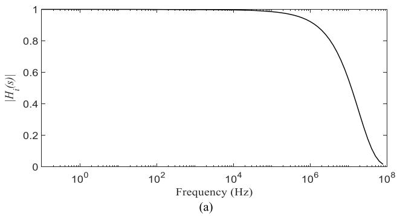

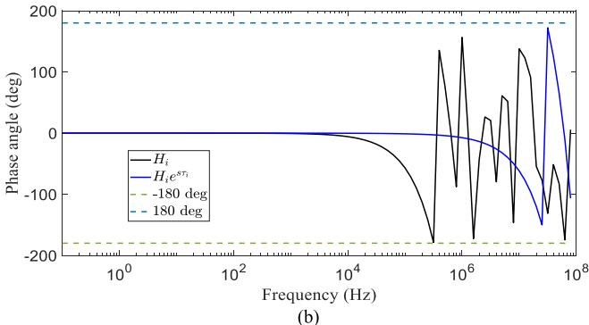

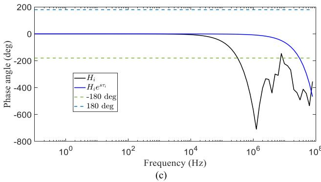  
Fig. 1. Magnitude and phase angle of an arbitrary Hi. (a) Magnitude, (b) phase angle with and without extracting time delay, and (c) unwrapped phase angle with and without extracting time delay.

greatest extent possible [9], [10], [11]. Such delay is formed by the sum of two components. The first corresponds to a propagation velocity at a frequency for which the magnitude of $H _ { i }$ equals 0.001. The second corresponds to a phase angle of a minimum phase function as given by the well-known Bode’s equation [12], which is also evaluated at such frequency.

Since a time delay that provides a nearly minimum phase function is close to the corresponding lossless time delay, an optimization algorithm is required, for example Brent’s method, to find an optimum time delay. Brent’s method requires a userdefined interval for the search of the optimum value [9], [13]. The left boundary of this interval can be chosen as the lossless time delay or the one based on Bode’s formula. The right boundary can be set two microseconds (μs) to the right of the left boundary, as proposed in $[ 9 ] ,$ [10].

To illustrate the effect of time delay subtraction in the phase angle of an arbitrary $H _ { i }$ , consider Fig. 1(a) which presents its magnitude along an arbitrarily chosen frequency range from 0.1 Hz up to 100 MHz. Fig. 1(b) and (c) present its phase angle

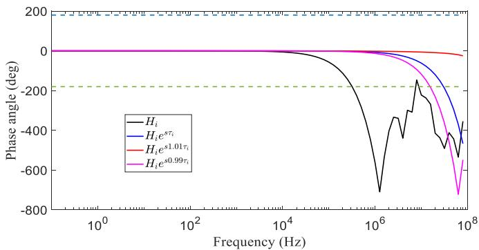  
Fig. 4. Algorithm for grouping of time delays.

Fig. 2. Phase angle of an arbitrary $H _ { i }$ showing sensitivity of the phase unwinding by a nearby time delay.

<table><tr><td colspan="2">Algorithm 1 Calculation of optimum time delay, τ</td></tr><tr><td colspan="2">Inputs: Hi,ith modal velocity, and length of line/cable</td></tr><tr><td colspan="2">Output: Optimum time delay, τ</td></tr><tr><td>1.</td><td>Calculate τB as given by Bode&#x27;s formula</td></tr><tr><td>2.</td><td>Discretize τB as follows: 0.8 τB &lt; τB &lt; 1.2 τB</td></tr><tr><td>3.</td><td>for m = 1, 2, ..., length(τB)</td></tr><tr><td>4.</td><td>Calculate fmax at which ∠Hl &gt; ± 180°</td></tr><tr><td>5.</td><td>end</td></tr><tr><td>6.</td><td>Chose τo as the one corresponding to maximum fmax</td></tr><tr><td>7.</td><td>Apply Brent&#x27;s method with interval [0.9 τo 1.1 τo] using different approximation orders</td></tr></table>

Fig. 3. Algorithm for optimization of time delay for a close to minimum phase function.

(in degrees) before and after extracting a constant time delay; as referenced, the dashed lines represent the $1 8 0 ^ { \mathrm { o } }$ and $- 1 8 0 ^ { \mathrm { o } }$ lines. Note that, after extracting the delay, the phase angle curve tends to resemble that of a minimum phase function for a wider frequency range as opposed without extraction, i.e., crossing the $\pm 1 8 0 ^ { \mathrm { o } }$ line at a higher frequency; this is more noticeable in Fig. 1(c) where the angle has been unwrapped. This process is known as unwinding the phase [11].

Fig. 2 shows the sensitivity of the phase unwinding by extracting different time delays with 1% variation of the one used to obtain the results of Fig. 1(b) or (c). Note that, despite the small variation in time delay, the frequency at which the angles cross the $\pm 1 8 0 ^ { \circ }$ line is substantially distinct.

The phase angle curves of Fig. 1 reveal that extraction of a delay from $H _ { i }$ provides a minimum phase function only up to some point in the high-frequency range. The fact that the effect of time delay is valid up to a certain frequency, it can be deduced that it impacts the approximation order [9] and ultimately the potential for large passivity violations [11]. Previous researchers have proposed to optimize delay identification by measuring the fitting accuracy while increasing the number of poles [10], [11]. However, it has not been verified that indeed a close-to-minimum phase function is achieved.

# B. Unwinding Phase for Near to Optimum Delay

Based on the theory of the previous subsection, Algorithm 1 in Fig. 3 presents a proposal to calculate an optimum time

<table><tr><td colspan="2">Algorithm 2 Grouping delays</td></tr><tr><td colspan="2">Input: Nc delays (Nc is the number of conductors)</td></tr><tr><td colspan="2">Output: Ng delays (Ng is the number of groups)</td></tr><tr><td>1.</td><td>Sort the Nc delays in ascending order</td></tr><tr><td>2.</td><td>Identify if there is a delay &lt; 1 μs and set flag_1us = 1</td></tr><tr><td>3.</td><td>Identify if max(τ) - min(τ) &lt;= 10 μs and set flag_dif = 1</td></tr><tr><td>4.</td><td>for m = 1, 2, ..., Nc</td></tr><tr><td>5.</td><td>for n = 1, 2, ..., Nc</td></tr><tr><td>6.</td><td>if τm &lt; 1 μs</td></tr><tr><td>7.</td><td>crit = 0.09 μs</td></tr><tr><td>8.</td><td>elseif (τm &lt; 100 μs) &amp; (flag_1us = 1) &amp; (flag_dif = 0)</td></tr><tr><td>9.</td><td>crit = 0.09 μs</td></tr><tr><td>10.</td><td>elseif (τm &lt; 100 μs) &amp; (flag_1us = 0) &amp; (flag_dif = 1)</td></tr><tr><td>11.</td><td>crit = 0.5 μs</td></tr><tr><td>12.</td><td>else</td></tr><tr><td>13.</td><td>crit = 9.0 μs</td></tr><tr><td>14.</td><td>end</td></tr><tr><td>15.</td><td>Assign τn to same group as τm if τn - τm &lt; crit</td></tr><tr><td>16.</td><td>end</td></tr><tr><td>17.</td><td>end</td></tr></table>

delay that guarantees that the modal propagation function, $H _ { i } ,$ is the closest to a minimum phase function and that it provides a minimum approximation error. In the first step, an initial time delay is calculated via Bode’s formula, $\tau _ { B } .$ . Although this renders a close to minimum phase function [9], it is further optimized by following steps 2 to 6, which monitor the time delay giving the least variation in propagation function. At the end of step 6, Algorithm 1 provides a time delay $\tau _ { o } ,$ with the best phase unwinding. This is further optimized in step 7 by varying the number of poles in combination with Brent’s method to achieve the smallest approximation error [13]. The Brent’s method, which is an optimization method, relies on enclosing the optimal delay within an interval [9]. $0 . 9 \tau _ { B }$ and $1 . 1 \tau _ { B }$ are used as left and right bracketing values, respectively. For details of Brent’s method, please refer to [13]. The outcome is a reduced-order approximation with optimized delay.

# IV. GROUPING MODES

When the number of conductors in a system increases, some time delays become closer in magnitude and as such can be grouped together. The current implementation of the ULM achieves grouping of modal delays based on a pre-established phase-shift difference criterion [1]. However, such grouping criterion can still provide similar delays for systems of short length and many conductors. Having similar delays in different groups provokes high residue/pole ratios, as demonstrated in the examples of Section V.

The proposed grouping strategy is described by Algorithm 2 in Fig. 4. As shown in Algorithm 2, the strategy first identifies systems with very small delays (< 1 μs) and with significant differences between the largest and smallest delays $( \mathrm { e . g . , 1 0 } \mu \mathrm { s } )$ . Then, the grouping criteria, as given by crit, is generated based on the closeness between delays. For example, the scheme keeps in the same group the delays that are within a decimal of the

smallest delay in a group for which the smallest delay is $<$ 1 $\mu \mathrm { s } ,$ , and within a digit of the smallest delay in a group for which the smallest delay is $> 1 ~ \mu \mathrm { s }$ . Two numerical examples follow. The delays [0.8281 0.8335 0.8339] (μs) are grouped and its representative delay is 0.8281 $\mu \mathrm { s }$ . The delays [45.4071 48.4183 48.4263] $( \mu \mathrm { s } )$ are grouped and its representative delay is 45.4071 $\mu \mathrm { s }$ . Although the concept is simple, it results in effective modes grouping, as demonstrated by the examples in Section V.

# V. MAXIMUM FITTING FREQUENCY OF RAPIDLY DECAYING MODES

Phase unwinding of a propagation mode $H _ { i }$ , which is mainly performed on the high-frequency range, becomes more effective when selecting a maximum fitting frequency $f _ { \mathrm { m a x } }$ around a point when $H _ { i }$ is close to zero. In this paper, a value of $1 0 ^ { - 3 }$ is chosen as the close-to-zero point of $H _ { i }$ .

Consider the magnitude and phase angle of an arbitrarily chosen propagation mode, as presented in Fig. 5(a) and (b), with fitting frequency band assumed, for clarity of illustration, from $1 0 ^ { - 2 } { \mathrm { H z } } { \mathrm { t o } } 1 0 ^ { 7 } { \mathrm { H z } } .$ The fitting order for this frequency is equal to 4. On the other hand, when using a maximum frequency, $f _ { \mathrm { m a x } } ,$ equal to $1 . 5 8 \times 1 0 ^ { 6 }$ Hz (at which $| H _ { i } | \cong 1 0 ^ { - 3 } )$ and with the same approximation order, it provides the magnitude and phase angle shown in Fig. 5(c) and (d). It should be noted that, for the case where $f _ { \mathrm { m a x } } = 1 0 ^ { 7 }$ Hz, more poles are required for a more accurate approximation of the phase angle in the high-frequency range.

The results of Fig. 5 show that considering a lower maximum fitting frequency for rapidly decaying modes facilitates phase unwinding and results in lower approximation order. The impact of such modification is illustrated in Fig. 6 where the transient waveforms of the cable system providing the two approximated propagation modes of Fig. 5 are presented. Practically, the two waveforms in Fig. 6 are superimposed.

# VI. EXAMPLES

# A. 9-Underground Cable System

The 9-cable system of Fig. 7, with corresponding data listed in Table I, has been reported both with high residue/pole ratios and non-passive when a 0.1% approximation (fitting) tolerance is defined. Thus, its time-domain simulation was unstable [14].

Table II presents the comparison between the old implementation of the ULM in EMTP [15] and the proposed improved version outlined in Sections III. to V. Six approximation tolerances are assumed, i.e., 5%, 1%, 0.5%, 0.1%, 0.01%, and 0.001%. The analysis of the data in Table II follows.

It is observed in Table II that for both, old and improved implementations of the ULM, defining smaller approximation tolerance requires higher approximation order resulting in smaller fitting error, as expected.

Regarding the residue/pole ratio, the improved version yields smaller numbers compared to the old version. Also, smaller maximum passivity violations are detected. Four cases by the improved version, fitting tolerances of 0.5%, 0.1%, 0.01%, and

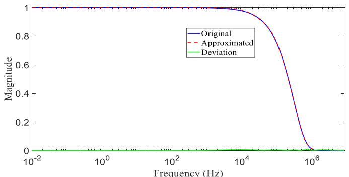

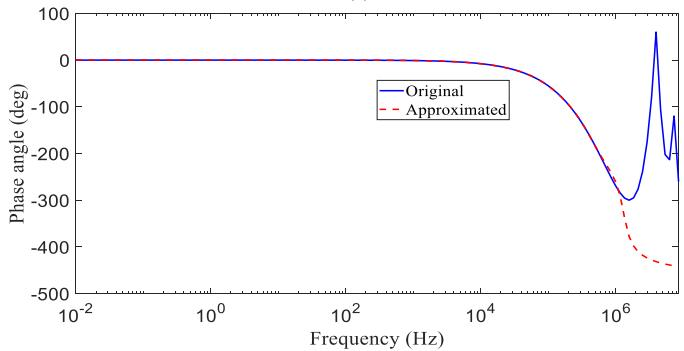  
(a)

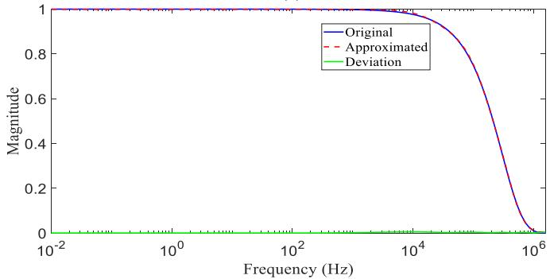

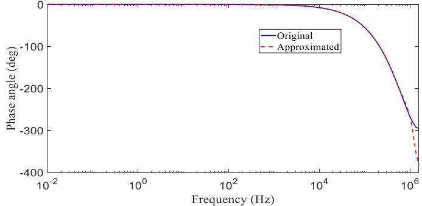  
  
(d）  
Fig. 5. (a) Magnitude and (b) phase angle of approximated $H _ { i }$ with $f _ { \mathrm { m a x } } =$ $1 0 ^ { \top }$ Hz. (c) Magnitude and (d) phase angle of approximated $H _ { i }$ with $f _ { \mathrm { m a x } } =$ $1 . 5 8 \times 1 0 ^ { 6 }$ Hz.

0.001%, are passive, i.e., present no passivity violations. Note that, when testing passivity, EMTP-ULM provides the most negative value among the set of eigenvalues; this test is performed by frequency sweeping in a range spanning two decades before the minimum frequency for the fitting and two decades after $f _ { \mathrm { m a x } }$ .

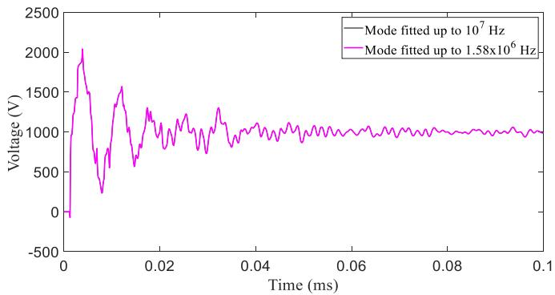  
Fig. 6. Comparison of transient waveforms of a cable system for which one of its propagation modes is fitted either up to 107 Hz or up to $1 . 5 8 \times 1 0 ^ { 6 }$ Hz.

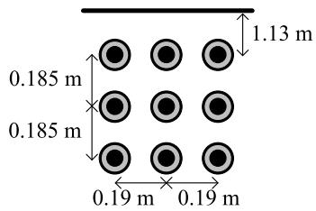  
Fig. 7. Configuration of the 9-cable system adopted from [14].

TABLE I DATA FOR THE 9-CABLE SYSTEM OF FIG. 7   

<table><tr><td>Length</td><td>2 km</td></tr><tr><td>Inner radius of the core</td><td>0 mm</td></tr><tr><td>Outer radius of the core</td><td>12.38 mm</td></tr><tr><td>Inner radius of the sheath</td><td>24.69 mm</td></tr><tr><td>Outer radius of the sheath</td><td>25.33 mm</td></tr><tr><td>Outer insulation radius</td><td>27.34 mm</td></tr><tr><td>Resistivity of the sheath</td><td>1.7 × 10-8Ohm-m</td></tr><tr><td>Resistivity of the core</td><td>1.7 × 10-8Ohm-m</td></tr><tr><td>Core insulator relative permittivity</td><td>2.3</td></tr><tr><td>Shield insulator relative permittivity</td><td>2.48</td></tr><tr><td>Insulation loss factor</td><td>4 × 10-4</td></tr><tr><td>Earth resistivity</td><td>100 Ohm-m</td></tr></table>

Also, the improved version provides stable time-domain simulation for all cases. Moreover, the proposed strategies provide a more compact set of delays, leading to a smaller total approximation order. Note that the high residue/pole ratios by the old version are provoked by the closeness of some time delays, as seen in Table II.

A DC source of 1 kV is simultaneously connected to the cores (sending terminal) of the three upper cables; the cores of the remaining cables for both sending and receiving ends are left open; all sheaths are grounded at both sending and receiving ends. Fig. 8 presents the voltage at the core, receiving end, of the upper left cable when using fitting tolerances of 1%, 0.5%, and 0.1%. Although not shown here, it is confirmed that the old version yields unstable waveform when using 0.1% of fitting

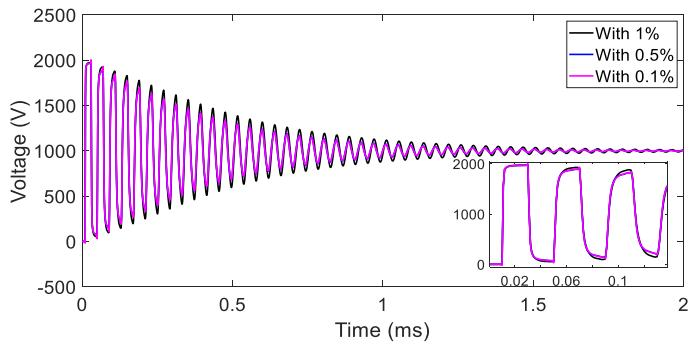  
Fig. 8. Voltage at the core, receiving end, of the upper left cable of the 9-cable system configuration.

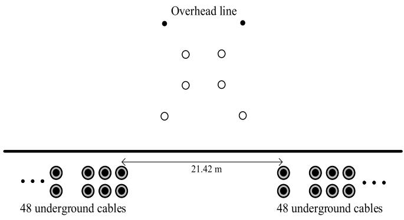  
Fig. 9. 96-cable system configuration.

tolerance. It is observed in Fig. 8 that going from 0.5% to 0.1% does not represent a substantially better accuracy.

# B. 96-Underground Cable and Overhead Line

This example consists of an installed 96-cable system in Ontario, Canada, with application for large load type transmission substation with many feeders. The cable system in this example runs in parallel with a double-circuit overhead transmission line, as depicted in Fig. 9. The two groups of 8 cables as shown in Fig. 9 extend further to the left and right of the overhead transmission line to a total of 96 cables. The length of this system is 250 m, which represents a challenge for EMT simulations considering a wideband model. The detailed parameters are not included due to a confidentiality agreement.

Table III lists the corresponding comparison for this case study. As for the 5% and 1% fitting tolerance cases, the improved version provides stable time-domain simulations with residue/pole ratios smaller than the old implementation of the ULM in EMTP, despite exhibiting larger passivity violations. Also, for these two fitting tolerance cases, the total approximation order of H is smaller in the improved version. In the last row of Table III, it can be observed that the modes grouping criterion yields 36 groups in the old version while in the improved version 8 groups are obtained. Finally, it is observed that the improved version produces a high-order approximation for the 0.5% fitting tolerance, leading to a high residue/pole ratio. Nevertheless, as

TABLE II FITTING RESULTS FOR THE 9-CABLE SYSTEM OF FIG. 7 (FURTHER TIME DELAY GROUPING IS INDICATED BY THE SAME COLOR)   

<table><tr><td></td><td colspan="6">Old version</td><td colspan="6">Improved version</td></tr><tr><td>Fitting tolerance</td><td>5%</td><td>1%</td><td>0.5%</td><td>0.1%</td><td>0.01%</td><td>0.001%</td><td>5%</td><td>1%</td><td>0.5%</td><td>0.1%</td><td>0.01%</td><td>0.001%</td></tr><tr><td>H model order</td><td>32</td><td>62</td><td>61</td><td>83</td><td>143</td><td>160</td><td>20</td><td>22</td><td>26</td><td>52</td><td>100</td><td>100</td></tr><tr><td>H fitting error</td><td>0.029</td><td>0.0075</td><td>0.0049</td><td>0.00038</td><td>3 × 10-5</td><td>2 × 10-4</td><td>0.074</td><td>0.074</td><td>0.034</td><td>0.0042</td><td>5 × 10-5</td><td>3 × 10-5</td></tr><tr><td>Max. residue/pole ratio</td><td>3.91</td><td>1157</td><td>1140</td><td>13539</td><td>2 × 106</td><td>8 × 1010</td><td>1.47</td><td>1.47</td><td>1.44</td><td>18.8</td><td>178</td><td>120</td></tr><tr><td>Max. passivity violation</td><td>-0.00017</td><td>-18.63</td><td>-0.36</td><td>-27.97</td><td>-25.93</td><td>-27.71</td><td>-0.43</td><td>-0.005</td><td>0</td><td>0</td><td>0</td><td>0</td></tr><tr><td>Passive?</td><td>No</td><td>No</td><td>No</td><td>No</td><td>No</td><td>No</td><td>No</td><td>No</td><td>Yes</td><td>Yes</td><td>Yes</td><td>Yes</td></tr><tr><td>Time-domain stable?</td><td>Yes</td><td>Yes</td><td>Yes</td><td>No</td><td>No</td><td>No</td><td>Yes</td><td>Yes</td><td>Yes</td><td>Yes</td><td>Yes</td><td>Yes</td></tr><tr><td rowspan="8">τ (μs)</td><td>10.13</td><td>10.13</td><td>10.13</td><td>10.13</td><td>10.13</td><td>10.13</td><td>9.36</td><td>9.36</td><td>9.36</td><td>9.36</td><td>9.36</td><td>9.36</td></tr><tr><td>43.66</td><td>43.66</td><td>43.66</td><td>43.66</td><td>43.66</td><td>43.66</td><td>45.40</td><td>45.40</td><td>45.40</td><td>45.40</td><td>45.40</td><td>45.40</td></tr><tr><td>46.15</td><td>46.15</td><td>46.15</td><td>46.15</td><td>46.15</td><td>46.15</td><td>52.17</td><td>52.17</td><td>52.17</td><td>52.17</td><td>52.17</td><td>52.17</td></tr><tr><td>50.11</td><td>50.11</td><td>50.11</td><td>50.11</td><td>50.11</td><td>50.11</td><td>73.54</td><td>73.54</td><td>73.54</td><td>73.54</td><td>73.54</td><td>73.54</td></tr><tr><td>50.97</td><td>50.97</td><td>50.97</td><td>50.97</td><td>50.97</td><td>50.97</td><td>237.00</td><td>237.00</td><td>237.00</td><td>237.00</td><td>237.00</td><td>237.00</td></tr><tr><td>53.55</td><td>53.55</td><td>53.55</td><td>53.55</td><td>53.55</td><td>53.55</td><td></td><td></td><td></td><td></td><td></td><td></td></tr><tr><td>69.57</td><td>69.57</td><td>69.57</td><td>69.57</td><td>69.57</td><td>69.57</td><td></td><td></td><td></td><td></td><td></td><td></td></tr><tr><td>204.49</td><td>204.49</td><td>204.49</td><td>204.49</td><td>204.49</td><td>204.49</td><td></td><td></td><td></td><td></td><td></td><td></td></tr></table>

TABLE III FITTING RESULTS FOR 96-CABLE SYSTEM OF FIG. 9   

<table><tr><td></td><td colspan="3">Old version</td><td colspan="3">Improved version</td></tr><tr><td>Fitting tolerance</td><td>5%</td><td>1%</td><td>0.5%</td><td>5%</td><td>1%</td><td>0.5%</td></tr><tr><td>H model order</td><td>76</td><td>76</td><td>76</td><td>32</td><td>58</td><td>87</td></tr><tr><td>H fitting error</td><td>0.00072</td><td>0.0007</td><td>0.0007</td><td>0.11</td><td>0.18</td><td>0.0046</td></tr><tr><td>Max. residue/pole ratio</td><td>103.65</td><td>103.65</td><td>103.65</td><td>1.9</td><td>56</td><td>810 000</td></tr><tr><td>Max. passivity violation</td><td>-0.62</td><td>-1.11</td><td>-1.02</td><td>-64</td><td>-104</td><td>-142</td></tr><tr><td>Passive?</td><td>No</td><td>No</td><td>No</td><td>No</td><td>No</td><td>No</td></tr><tr><td>Time-domain stable?</td><td>No</td><td>No</td><td>No</td><td>Yes</td><td>Yes</td><td>No</td></tr><tr><td>N (time-delay groups)</td><td>36</td><td>36</td><td>36</td><td>8</td><td>8</td><td>8</td></tr></table>

demonstrated in a subsequent case, going down to 0.5% or 0.1% does not improve accuracy in the transient simulation.

Table III shows that the old ULM implementation does not provide stable simulations in the three presented cases.

A three-phase balanced voltage of 230 kV is applied at the sending end of the overhead line at t = 1 ms while the receiving end is connected to a PQ load via a 3-phase RLC load with 50 MW and 24 MVAR. The underground cable system is left open in both ends. Three transient waveforms corresponding to the induced voltages at the sheaths of the receiving end of the underground cable closest to the overhead line are presented in Fig. 10(a). Three voltages at the receiving end of the overhead line are included in Fig. 10(b).

# C. Aboveground Double-Circuit Cable System

The configuration of this system, consisting of two 3-phase, above ground, 1 km circuits and their corresponding neutrals, are depicted in Fig. 11. The phase cables consist of core, shield, and armor conductors. The neutral cables have only core. The cable system parameters are listed in Table VI.

Table IV, presented in the previous page, shows the comparison between the old implementation of the ULM in EMTP and with the modifications outlined in Sections III. to V. Besides being a short-in-length cable system, the original 20 time-delays span from 1.18 μs to 3.58 μs, making the grouping a very

challenging task for the old implementation of the ULM, which is based on a hard-coded phase-shift difference criterion, as mentioned in Section IV. As seen in Table IV , the old implementation yields 10 groups, leading to very high residue/pole ratios due to the delays’ closeness. On the other hand, the improved version yields only 4 groups with small ratios for the first three fitting tolerances (5%, 1%, and 0.1%).

The improved version gives stable time-domain simulations for the first three fitting tolerances (5%, 1%, and 0.1%) while the old ULM implementation is not able to produce stable simulations.

For this case, the transient scenario consists of a DC step voltage of 1 kV applied simultaneously to the cores (sending terminal) of the three cables at the left-hand side in Fig. 11; the cores of the remaining cables for both circuits at sending and receiving ends are left open; all sheaths are grounded at both sending and receiving ends. Fig. 12 presents the voltage at the core, receiving end, of the upper cable of the left-hand side circuit.

# D. Asymmetric Cable System

To further verify the applicability of the proposed enhancements, the cable system of Fig. 13 is adopted. It consists of a horizontal circuit and a triangular shaped circuit, both with different cross sections. Table VII lists the relevant parameters. The length of the cable system is of 15 km.

TABLE IV FITTING RESULTS FOR THE ABOVEGROUND CABLE SYSTEM OF FIG. 11 (FURTHER TIME DELAY GROUPING IS INDICATED BY THE SAME COLOR)   

<table><tr><td></td><td></td><td colspan="3">Old version</td><td></td><td></td><td colspan="3">Improved version</td><td></td><td></td><td></td></tr><tr><td>Fitting tolerance</td><td>5%</td><td>1%</td><td>0.5%</td><td>0.1%</td><td>0.01%</td><td>0.001%</td><td>5%</td><td>1%</td><td>0.5%</td><td>0.1%</td><td>0.01%</td><td>0.001%</td></tr><tr><td>H model order</td><td>191</td><td>191</td><td>192</td><td>191</td><td>194</td><td>194</td><td>10</td><td>14</td><td>19</td><td>67</td><td>83</td><td>114</td></tr><tr><td>H fitting error</td><td>0.31</td><td>0.31</td><td>0.003</td><td>0.31</td><td>0.031</td><td>0.031</td><td>0.04</td><td>0.008</td><td>0.004</td><td>0.042</td><td>0.072</td><td>0.245</td></tr><tr><td>Max. residue/pole ratio</td><td>3.5×10^7</td><td>3.5×10^7</td><td>1.2×10^6</td><td>3.5×10^7</td><td>7.9×10^7</td><td>7.9×10^7</td><td>0.98</td><td>1.70</td><td>2.4</td><td>3.5×10^4</td><td>2.4×10^5</td><td>9.5×10^5</td></tr><tr><td>Max. passivity violation</td><td>-185.03</td><td>-189.65</td><td>-9.09</td><td>-195.97</td><td>-7.19</td><td>-7.19</td><td>-82</td><td>-5.14</td><td>-50.6</td><td>-11.08</td><td>-0.49</td><td>-0.35</td></tr><tr><td>Passive?</td><td>No</td><td>No</td><td>No</td><td>No</td><td>No</td><td>No</td><td>No</td><td>No</td><td>No</td><td>No</td><td>No</td><td>No</td></tr><tr><td>Time-domain stable?</td><td>No</td><td>No</td><td>No</td><td>No</td><td>No</td><td>No</td><td>Yes</td><td>Yes</td><td>Yes</td><td>No</td><td>No</td><td>No</td></tr><tr><td rowspan="10">τ(μs)</td><td>1.25</td><td>1.25</td><td>1.25</td><td>1.25</td><td>1.25</td><td>1.25</td><td>1.23</td><td>1.23</td><td>1.24</td><td>1.24</td><td>1.24</td><td>1.24</td></tr><tr><td>1.29</td><td>1.29</td><td>1.29</td><td>1.29</td><td>1.29</td><td>1.29</td><td>1.73</td><td>1.74</td><td>1.70</td><td>1.70</td><td>1.70</td><td>1.70</td></tr><tr><td>1.31</td><td>1.31</td><td>1.31</td><td>1.31</td><td>1.31</td><td>1.31</td><td>2.13</td><td>2.11</td><td>2.10</td><td>2.10</td><td>2.10</td><td>2.10</td></tr><tr><td>1.32</td><td>1.32</td><td>1.32</td><td>1.32</td><td>1.32</td><td>1.32</td><td>2.80</td><td>2.80</td><td>2.80</td><td>2.80</td><td>2.80</td><td>2.80</td></tr><tr><td>1.73</td><td>1.73</td><td>1.73</td><td>1.73</td><td>1.73</td><td></td><td></td><td></td><td></td><td></td><td></td><td></td></tr><tr><td>1.84</td><td>1.84</td><td>1.84</td><td>1.84</td><td>1.84</td><td></td><td></td><td></td><td></td><td></td><td></td><td></td></tr><tr><td>2.10</td><td>2.10</td><td>2.10</td><td>2.10</td><td>2.10</td><td></td><td></td><td></td><td></td><td></td><td></td><td></td></tr><tr><td>2.78</td><td>2.78</td><td>2.78</td><td>2.78</td><td>2.78</td><td></td><td></td><td></td><td></td><td></td><td></td><td></td></tr><tr><td>2.80</td><td>2.80</td><td>2.80</td><td>2.80</td><td>2.80</td><td></td><td></td><td></td><td></td><td></td><td></td><td></td></tr><tr><td>3.29</td><td>3.29</td><td>3.29</td><td>3.29</td><td>3.29</td><td></td><td></td><td></td><td></td><td></td><td></td><td></td></tr></table>

TABLE V FITTING RESULTS FOR THE ASYMMETRIC CABLE SYSTEM OF FIG. 13   

<table><tr><td></td><td></td><td colspan="3">Old version</td><td></td><td></td><td colspan="3">Improved version</td><td></td><td></td><td></td></tr><tr><td>Fitting tolerance</td><td>5%</td><td>1%</td><td>0.5%</td><td>0.1%</td><td>0.01%</td><td>0.001%</td><td>5%</td><td>1%</td><td>0.5%</td><td>0.1%</td><td>0.01%</td><td>0.001%</td></tr><tr><td>H model order</td><td>79</td><td>160</td><td>160</td><td>160</td><td>160</td><td>160</td><td>17</td><td>51</td><td>71</td><td>146</td><td>160</td><td>160</td></tr><tr><td>H fitting error</td><td>0.028</td><td>0.022</td><td>0.022</td><td>0.022</td><td>0.022</td><td>0.022</td><td>0.11</td><td>0.018</td><td>0.008</td><td>0.001</td><td>\( 1.2 \times 10^{-4} \)</td><td>\( 1.2 \times 10^{-4} \)</td></tr><tr><td>Max. residue/pole ratio</td><td>\( 1.9 \times 10^3 \)</td><td>\( 1.3 \times 10^{10} \)</td><td>\( 1.3 \times 10^{10} \)</td><td>\( 1.2 \times 10^{10} \)</td><td>\( 1.3 \times 10^{10} \)</td><td>\( 1.2 \times 10^{10} \)</td><td>0.82</td><td>3.0</td><td>3.2</td><td>\( 5.1 \times 10^2 \)</td><td>\( 2.1 \times 10^2 \)</td><td>\( 2.1 \times 10^2 \)</td></tr><tr><td>Max. passivity violation</td><td>-37.48</td><td>-29.41</td><td>-29.53</td><td>-29.56</td><td>-29.56</td><td>-29.56</td><td>\( -5.1 \times 10^{-4} \)</td><td>\( -8.1 \times 10^{-5} \)</td><td>NA</td><td>-1.46</td><td>-0.94</td><td>-0.94</td></tr><tr><td>Passive?</td><td>No</td><td>No</td><td>No</td><td>No</td><td>No</td><td>No</td><td>No</td><td>No</td><td>Yes</td><td>No</td><td>No</td><td>No</td></tr><tr><td>Time-domain stable?</td><td>Yes</td><td>No</td><td>No</td><td>No</td><td>No</td><td>No</td><td>Yes</td><td>Yes</td><td>Yes</td><td>No</td><td>No</td><td>No</td></tr><tr><td rowspan="8">τ(μs)</td><td>89.80</td><td>89.80</td><td>89.80</td><td>89.80</td><td>89.80</td><td>89.80</td><td>89.91</td><td>89.91</td><td>89.91</td><td>89.91</td><td>89.91</td><td>89.91</td></tr><tr><td>93.96</td><td>93.96</td><td>93.96</td><td>93.96</td><td>93.96</td><td>93.96</td><td>93.81</td><td>93.81</td><td>93.81</td><td>93.81</td><td>93.81</td><td>93.81</td></tr><tr><td>128.81</td><td>128.81</td><td>128.81</td><td>128.81</td><td>128.81</td><td>128.81</td><td>129.07</td><td>129.07</td><td>129.07</td><td>129.07</td><td>129.07</td><td>129.07</td></tr><tr><td>152.76</td><td>152.76</td><td>152.76</td><td>152.76</td><td>152.76</td><td>152.76</td><td>153.26</td><td>153.26</td><td>153.26</td><td>153.26</td><td>153.26</td><td>153.26</td></tr><tr><td>281.72</td><td>281.72</td><td>281.72</td><td>281.72</td><td>281.72</td><td>281.72</td><td>281.91</td><td>281.91</td><td>281.91</td><td>281.91</td><td>281.91</td><td>281.91</td></tr><tr><td>341.30</td><td>341.30</td><td>341.30</td><td>341.30</td><td>341.30</td><td>341.30</td><td>342.05</td><td>342.05</td><td>342.05</td><td>342.05</td><td>342.05</td><td>342.05</td></tr><tr><td>432.61</td><td>432.61</td><td>432.61</td><td>432.61</td><td>432.61</td><td>432.61</td><td>433.96</td><td>433.96</td><td>433.96</td><td>433.96</td><td>433.96</td><td>433.96</td></tr><tr><td>1019.16</td><td>1019.16</td><td>1019.16</td><td>1019.16</td><td>1019.16</td><td>1019.16</td><td>1021.76</td><td>1021.76</td><td>1021.76</td><td>1021.76</td><td>1021.76</td><td>1021.76</td></tr></table>

Table IV, presented in the previous page, shows the corresponding comparison. It is observed that the old implementation of the ULM in EMTP yields only one stable time domain simulation when using 5% of fitting. The proposed approach gives stable simulations for 5%, 1%, and 0.5%.

A 225 kV voltage source is applied to the cores (sending terminal) of the horizontal circuit, at the left-hand side in Fig. 13; the cores of the remaining cables for both circuits at sending and receiving ends are left open; all sheaths are open at both sending and receiving ends. The voltage at the first core, receiving end, of the horizontal circuit, is presented in Fig. 14 for 1% and 0.5% of fitting tolerance.

# VII. DISCUSSION

This paper adopts fitting tolerances of 5%, 1%, 0.5%, 0.1%, 0.01%, and 0.001%. It has been shown that using a fitting tolerance smaller than 0.5% has no substantial effect in the time-domain simulation, as shown in the transient waveforms of

Figs. 8, 12, and 14 corresponding to the 9-cable, aboveground, and asymmetric cable systems, respectively.

Fig. 15 presents the comparison of the results of Fig. 8, corresponding to the 9-cable case, with the transient waveform as given by the numerical Laplace transform (NLT) [16]. The inset in Fig. 15 shows that going to smaller fitting tolerances agrees with the waveform by the NLT. Further comparison between frequency-dependent line models, using as benchmark the NLT, can be found in [17].

The proposed strategies to the ULM implementation have provided time-domain stable solutions for most of the presented cases with different fitting tolerances.

It has been observed that some models resulted with passivity violations, although the simulation is stable. A stable simulation, nonetheless, must be analyzed in terms of multiple factors, such as residue/pole ratio, size of time step, frequency range for the fitting, frequencies involved in the transient phenomenon, among others. This as well is a part of ongoing research.

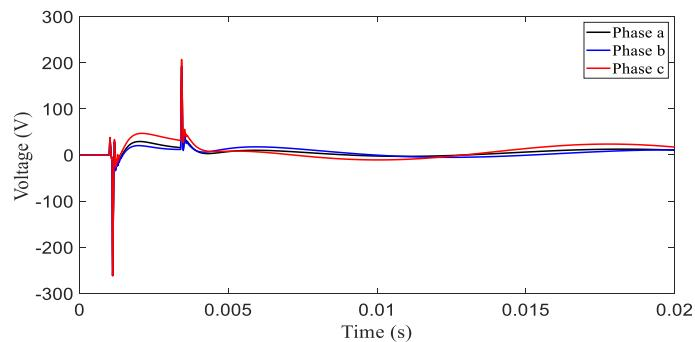  
(a)

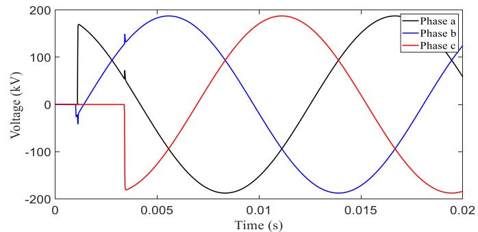  
  
Fig. 10. Transient waveforms for 96-cable system. (a) Induced voltages at the sheaths of the receiving end of the underground cable closest to the overhead line and (b) voltages at the receiving end of the overhead line.

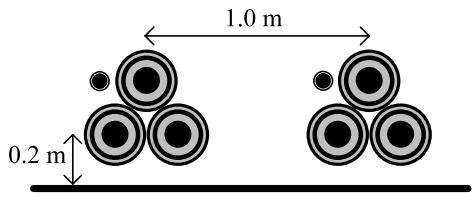  
Fig. 11. Aboveground double circuit cable system configuration.

TABLE VI DATA FOR THE ABOVEGROUND CABLE SYSTEM OF FIG. 11   

<table><tr><td>Length</td><td>1 km</td></tr><tr><td>Inner radius of the core</td><td>0 cm</td></tr><tr><td>Outer radius of the core</td><td>2.8 cm</td></tr><tr><td>Inner radius of the sheath</td><td>4.6 cm</td></tr><tr><td>Outer radius of the sheath</td><td>5.1 cm</td></tr><tr><td>Inner radius of the armor</td><td>5.15 cm</td></tr><tr><td>Outer radius of the armor</td><td>5.2 cm</td></tr><tr><td>Resistivity of the sheath</td><td>\( 1.185 \times 10^{-7} \text{ Ohm-m} \)</td></tr><tr><td>Resistivity of the armor</td><td>\( 2.955 \times 10^{-8} \text{ Ohm-m} \)</td></tr><tr><td>Resistivity of the core</td><td>\( 3.455 \times 10^{-8} \text{ Ohm-m} \)</td></tr><tr><td>Core insulator relative permittivity</td><td>2.9</td></tr><tr><td>Shield insulator relative permittivity</td><td>2.5</td></tr><tr><td>Armor insulator relative permittivity</td><td>2.5</td></tr><tr><td>Insulation loss factor</td><td>0</td></tr><tr><td>Earth resistivity</td><td>100 Ohm-m</td></tr></table>

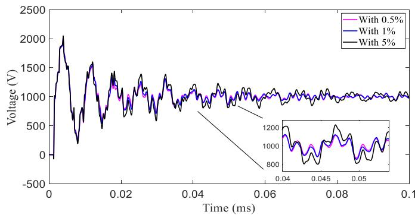  
Fig. 12. Transient waveforms corresponding to user-defined fitting tolerances of 5% (black trace), 1% (blue trace), and 0.1% (magenta trace), for the aboveground cable system.

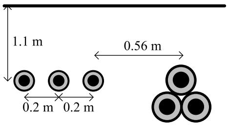  
Fig. 13. Double circuit cable system configuration with different geometry.

TABLE VII DATA FOR THE ASYMMETRIC CABLE SYSTEM OF FIG. 13   

<table><tr><td></td><td>Horizontal circuit</td><td>Triangular circuit</td></tr><tr><td>Length</td><td>15 km</td><td>15 km</td></tr><tr><td>Inner radius of the core</td><td>31.75 mm</td><td>0 mm</td></tr><tr><td>Outer radius of the core</td><td>125.4 mm</td><td>284 mm</td></tr><tr><td>Inner radius of the sheath</td><td>227.35 mm</td><td>564 mm</td></tr><tr><td>Outer radius of the sheath</td><td>262.25 mm</td><td>570 mm</td></tr><tr><td>Outer insulation radius</td><td>293.35 mm</td><td>590 mm</td></tr><tr><td>Resistivity of the sheath</td><td>1.7 × 10-8Ohm-m</td><td>2.6 × 10-8Ohm-m</td></tr><tr><td>Resistivity of the core</td><td>21 × 10-8Ohm-m</td><td>2.84 × 10-8Ohm-m</td></tr><tr><td>Core insulator relative permittivity</td><td>3.5</td><td>3.23</td></tr><tr><td>Shield insulator relative permittivity</td><td>2.0</td><td>0.33</td></tr><tr><td>Insulation loss factor</td><td>4 × 10-4</td><td>8 × 10-4</td></tr><tr><td>Earth resistivity</td><td>100 Ohm-m</td><td>100 Ohm-m</td></tr></table>

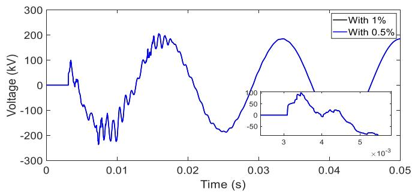  
Fig. 14. Voltage at first core of the horizontal circuit in Fig. 13, receiving end.

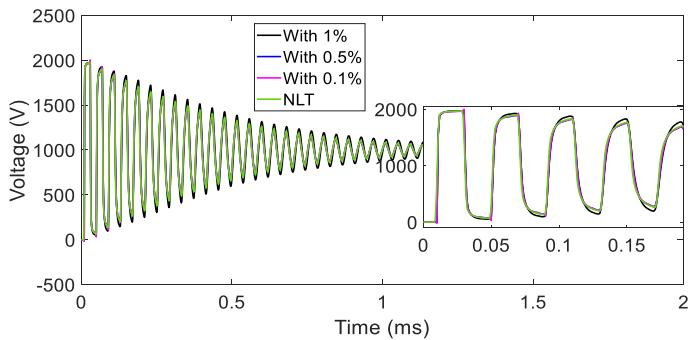  
Fig. 15. Voltage at the core, receiving end, of the upper left cable of the 9-cable system configuration. Comparison with the transient waveform given by the NLT.

Finally, experimental verification of simulations is beyond the scope of the paper. The reader is referred to [18], in which the ULM implemented in EMTP is compared with measurements.

# VIII. CONCLUSION

Three strategies have been introduced in the current implementation of the ULM in EMTP. It has been demonstrated that these strategies alleviate in great extent the large residue/pole ratios. As a secondary effect, passivity violations have been decreased. The modified version has shown for the first time that ULM can produce consistently stable time-domain simulations for very challenging cases including cases with large number of conductors where the current ULM implementation has been reported to fail. These effective enhancements aim at pushing forward the research on application and stability of the ULM for systems with many conductors.

# REFERENCES

[1] J. Mahseredjian, V. Dinavahi, and J. A. Martinez, “Simulation tools for electromagnetic transients in power systems: Overview and challenges,” IEEE Trans. Power Del., vol. 24, no. 3, pp. 1657–1669, Jul. 2009.   
[2] A. Ametani, N. Nagaoka, Y. Baba, T. Ohno, and K. Yamabuki, Power System Transients: Theory and Applications, 2nd ed. Boca Raton, FL, USA: CRC Press, 2016.   
[3] U. R. Patel and P. Triverio, “MoM-SO: A complete method for computing the impedance of cable systems including skin, proximity, and ground return effects,” IEEE Trans. Power Del., vol. 30, no. 5, pp. 2110–2118, Oct. 2015.   
[4] U. R. Patel and P. Triverio, “Accurate impedance calculation for underground and submarine power cables using MoM-SO and a multilayer ground model,” IEEE Trans. Power Del., vol. 31, no. 3, pp. 1233–1241, Jun. 2016.   
[5] H. Xue, A. Ametani, J. Mahseredjian, and I. Kocar, “Generalized formulation of earth-return impedance/admittance and surge analysis on underground cables,” IEEE Trans. Power Del., vol. 33, no. 6, pp. 2654–2663, Dec. 2018.   
[6] A. Morched, B. Gustavsen, and M. Tartibi, “A universal model for accurate calculation of electromagnetic transients on overhead lines and underground cables,” IEEE Trans. Power Del., vol. 14, no. 3, pp. 1032–1038, Jul. 1999.   
[7] I. Kocar and J. Mahseredjian, “Accurate frequency dependent cable model for electromagnetic transients,” IEEE Trans. Power Del., vol. 31, no. 3, pp. 1281–1288, Jun. 2016.   
[8] F. F. Kuo, Network Analysis and Synthesis, 2nd ed. Hoboken, NJ, USA: Wiley, 1966.   
[9] B. Gustavsen, “Time delay identification for transmission line modeling,” in Proc. IEEE 8th Workshop Signal Propag. Interconnects, 2004, pp. 103–106.

[10] L. De Tommasi and B. Gustavsen, “Accurate transmission line modeling through optimal time delay identification,” in Proc. Int. Conf. Power Syst. Transients, 2007, pp. 1–6.   
[11] I. Kocar and J. Mahseredjian, “New procedure for computation of time delays in propagation function fitting for transient modeling of cables,” IEEE Trans. Power Del., vol. 31, no. 2, pp. 613–621, Apr. 2016.   
[12] H. W. Bode, Network Analysis and Feedback Amplifier Design, Princeton, NJ, USA: Van Nostrand, 1945.   
[13] R. P. Brent, Algorithms for Minimization Without Derivatives. Englewood Cliffs, NJ, USA: Prentice Hall, 1973.   
[14] A. Gueye, I. Kocar, E. Francois, and J. Mahseredjian, “Comparison of rational krylov and vector fitting in transient simulation of transmission lines and cables,” IEEE Trans. Power Del., vol. 38, no. 5, pp. 3333–3341, Oct. 2023.   
[15] J. Mahseredjian, S. Dennetière, L. Dubé, B. Khodabakhchian, and L. Gérin-Lajoie, “On a new approach for the simulation of transients in power systems,” Electric Power Syst. Res., vol. 77, no no. 11, pp. 1514–1520, Sep. 2007.   
[16] P. Moreno and A. Ramirez, “Implementation of the numerical Laplace transform: A review, task force on frequency domain methods for EMT studies, working group on modeling and analysis of system transients using digital simulation, general systems subcommittee, IEEE power engineering society,” IEEE Trans. Power Del., vol. 23, no. 4, pp. 2599–2609, Oct. 2008.   
[17] M. A. B. Ribeiro, C. M. Moraes, A. G. Martins-Britto, and K. M. Silva, “Assessment of different frequency-dependent line models for EMT simulations of HVDC systems,” in Proc. IEEE Workshop Commun. Netw. Power Syst., 2023, pp. 1–7.   
[18] I. Lafaia, A. Ametani, J. Mahseredjian, A. Naud, M. T. Correia de Barros, and I. Koçar, “Field test and simulation of transients on the RTE 225 kV cable,” IEEE Trans. Power Del., vol. 32, no. 2, pp. 628–637, Apr. 2017.

Abner Ramirez (Senior Member, IEEE) received the B.Sc. and M.A.Sc. degrees from the University of Guanajuato, Guanajuato, Mexico, in 1996 and 1998, respectively, and the Ph.D. degree from the Center for Research and Advanced Studies of Mexico (CINVESTAV), Guadalajara, Mexico, in 2001. From November 2001 to January 2005, he was a Postdoctoral Fellow with the Department of Electrical and Computer Engineering, University of Toronto, Toronto, ON, Canada. He is currently with Kestrel Power Engineering, on leave from CINVESTAV. His research interests include electromagnetic transient analysis in power systems and power quality. He is a Member of the Mexican Association of Professionals and Entrepreneurs.

Jesus Morales (Member, IEEE) received the bachelor’s degree in electrical engineering with specialization in power systems from Technological Institute of Orizaba, Orizaba, Mexico, in 2011, the master’s degree in electrical engineering with specialization in power systems from CINVESTAV Campus Guadalajara, Guadalajara, Mexico, in 2014, and the Ph.D. degree in electrical engineering with specialization in power systems from the Polytechnic of Montreal, Montreal, QC, Canada, in 2019. He is currently a research and development specialist with PGSTech, Montreal, QC, Canada, for the EMTP software. His main research interests include modeling and simulation of transmission lines, frequency-dependent network equivalents, and curve fitting and passivity.

Jean Mahseredjian (Life Fellow, IEEE) received the Ph.D. degree in electrical engineering from Polytechnique de Montréal, Montréal, QC, Canada, in 1991. From 1987 to 2004, he was with Hydro-Québec Research Institute, Montréal, working on research and development activities related to the simulation and analysis of electromagnetic transients. In December 2004, he joined the Faculty of Electrical Engineering, Polytechnique de Montréal.

Ilhan Kocar (Senior Member, IEEE) received the B.Sc. and M.Sc. degrees in electronics and electrical engineering from Orta Do˘gu Teknik Üniversitesi, Ankara, Türkiye, in 1998 and 2003, respectively, and the Ph.D. degree in electrical engineering from École Polytechnique de Montréal (affiliated with Université de Montréal), Montréal, QC, Canada, in 2009. He has 25 years of diverse experience in the power engineering field across industry, academia, and major regions including North America, Asia, and Europe. He is currently a Full Professor with Polytechnique Montréal. His research focuses on critical challenges in integrating renewable energy sources into power systems. He is the Editor of IEEE TRANSACTIONS ON POWER DELIVERY and Journal of Modern Power Systems and Clean Energy.