# A topology-based simplified dynamic model and solving algorithm for LCC-HVDC converters considering commutation failure

Yangyang He a,* , Nengling Tai a , Jin Xu b , Wenzhuo Liu c , Panjie Lian c , Haizhen Zhang d

a College of Smart Energy, Shanghai Jiao Tong University, Shanghai 200240, China   
b School of Electrical Engineering, Shanghai Jiao Tong University, Shanghai 200240, China   
c China Electric Power Research Institute, Beijing 100192, China   
d Huadian Electric Power Research Institute CO., Ltd, Hangzhou 310030, China

# A R T I C L E I N F O

# Keywords:

Topology-based

Dynamic model

Algorithms

HVDC converters

Commutation failure

# A B S T R A C T

Dynamic modeling of line-commutated converter (LCC) based high-voltage direct current (HVDC) systems faces a trade-off between computational efficiency and accuracy in capturing commutation failure (CF) behavior. Existing electromagnetic transient (EMT) models are highly accurate but computationally intensive, whereas simplified models often neglect valve-level switching dynamics and CF mechanisms. To overcome these limitations, this paper proposes a topology-based simplified dynamic (TBSD) model for LCC-HVDC converters. The model adopts ideal switch representations to preserve the discrete switching behavior of thyristors, and decomposes the converter circuit into a main network and a valve-level auxiliary network based on topological states. Then, a structure-stable solving algorithm is developed to maintain consistent matrix dimensions across different switching configurations. Furthermore, an adaptive time-step control strategy is introduced, which dynamically adjusts the simulation step based on the rate of change in DC current, achieving both computational acceleration during steady-state and high-resolution tracking during transients. The proposed model and solution method are implemented in the PSModel simulation platform and validated against PSCAD/EMTDC under steady-state and fault conditions. Simulation results confirm that the TBSD model accurately captures commutation failure dynamics while significantly improving computational efficiency.

# 1. Introduction

The line-commutated converter (LCC) based high-voltage direct current (HVDC) system has become a critical component in longdistance and high-capacity power transmission, particularly within AC/DC hybrid grids. Its mature technology, low cost, and high-power transfer capability make it the preferred choice in large-scale interregional energy delivery. However, the reliance of LCC-HVDC systems on the strength and stability of the AC network introduces inherent vulnerability—most notably, the phenomenon of commutation failure (CF) [1–3].

Commutation failure (CF) is an inherent phenomenon in LCC-HVDC systems due to their reliance on the AC-side voltage for successful commutation [4]. During AC faults, the reduction in voltage amplitude and distortion of zero-crossing may lead to insufficient commutation margin, preventing the valve from turning off as expected. In some cases, the valve may even be re-triggered by a forward voltage shortly

after turn-off resulting in CF. This leads to a sharp drop in DC voltage, a surge in current, and reduced power transfer, which poses a significant threat to system stability. In interconnected or multi-terminal systems, CF can propagate across the network, further exacerbating disturbances and complicating recovery [5].

To evaluate and simulate LCC-HVDC system dynamics under such conditions, various modeling approaches have been proposed. Quasisteady-state (QSS) models express the characteristics of the converter in a steady-state equation and offer computational efficiency [6–8]. Dynamic phasor models [9–11], based on time-varying Fourier series, provide frequency-domain insights but simplify commutation dynamics by assuming linear current transitions and neglecting delayed valve characteristics. Switch-function-based models [12–15] improve precision but either neglect commutation dynamics or rely on QSS-derived overlap angles that cannot resolve time-dependent valve switching. In [13], a spectral model incorporating the commutation overlap angle was proposed using 3-D Fourier series, and its influence on the rectifier-side impedance was analysed via harmonic linearization. The study

<table><tr><td colspan="2">Nomenclature</td><td>Δt</td><td>Simulation time step</td></tr><tr><td></td><td></td><td>iVT</td><td>Valve current</td></tr><tr><td>Ron</td><td>On-state resistance of the valve</td><td>uLr</td><td>Voltage across transformer leakage inductance</td></tr><tr><td>Roff</td><td>Off-state resistance of the valve</td><td>iLr</td><td>Current through transformer leakage inductance</td></tr><tr><td>Lr</td><td>Equivalent leakage inductance of the transformer</td><td>uVT</td><td>Valve voltage</td></tr><tr><td>Zsc%</td><td>Short-circuit impedance percentage of the transformer</td><td>rd</td><td>Resistance of the DC line</td></tr><tr><td>Vbase</td><td>Base voltage of the transformer</td><td>udr</td><td>DC voltage at the rectifier side</td></tr><tr><td>Sbase</td><td>Base apparent power of the transformer</td><td>udrx</td><td>The series connection point voltage of two six-pulse converters on the rectifier side</td></tr><tr><td>f</td><td>System frequency</td><td></td><td></td></tr><tr><td>ua</td><td>Phase-A voltage at AC side of the converter</td><td>udi</td><td>DC voltage at the inverter side</td></tr><tr><td>ub</td><td>Phase-B voltage at AC side of the converter</td><td>udix</td><td>The series connection point voltage of two six-pulse converters on the inverter side</td></tr><tr><td>uc</td><td>Phase-C voltage at AC side of the converter</td><td></td><td></td></tr><tr><td>un</td><td>Neutral point voltage of the AC system</td><td>Δtm</td><td>Minimum simulation time step</td></tr><tr><td>Ld</td><td>Inductance of the DC smoothing reactor</td><td>Rhigh</td><td>The high thresholds of id change rate</td></tr><tr><td>id</td><td>DC current through the system</td><td>Rlow</td><td>The low thresholds of id change rate</td></tr><tr><td>ud1</td><td>Positive terminal DC voltage at converter output</td><td>Nmin</td><td>Minimum steps before switching</td></tr><tr><td>ud2</td><td>Negative terminal DC voltage at converter output</td><td>MRE</td><td>Mean relative error in model verification</td></tr></table>

demonstrated that commutation effects significantly impact system stability, as validated through generalized Nyquist criterion analysis. Further developments have introduced harmonic state-space (HSS) modelling frameworks [16–20] to address multi-frequency coupling in LCC systems. In [16], a multiple switch-function-based HSS model was developed, explicitly considering variations in commutation angle and harmonic interactions. Reference [17] proposed a unified HSS model applicable to both symmetrical and asymmetrical conditions. By solving valve-level firing and commutation end times based on topology switching theory, the model captured complex harmonic coupling relationships and system-wide multi-frequency interactions. Electromagnetic transient (EMT) models, such as those implemented in PSCAD/ EMTDC, accurately describe converter behavior during CF events but incur heavy computational cost, especially when applied to large systems or real-time simulations [21–23]. Therefore, the development of a modelling framework that preserves switching topology, accommodates nonlinear commutation behaviour, and remains computationally efficient is essential for advancing the analysis, control, and protection of modern LCC-HVDC systems.

This paper proposes a topology-based simplified dynamic (TBSD) model of the LCC-HVDC converter, which explicitly accounts for valvelevel switching behavior and allows for accurate characterization of commutation failure within a reduced-complexity framework. The model uses ideal switch representation for thyristors and constructs a state matrix to determine the converter topology at each time step. Based on the switching state, the electrical network is partitioned into a main circuit network and a valve-level auxiliary network, which are solved sequentially with consistent matrix structures. This approach ensures that the topological changes associated with commutation failure are naturally embedded into the solution process. Furthermore, an adaptive time-step control algorithm is integrated into the solver. The algorithm dynamically adjusts the simulation step size by monitoring the rate of change of DC current. It adopts larger steps during steadystate conditions and switches to smaller steps under rapid transients or faults. This strategy improves computational efficiency while preserving simulation accuracy.

The main contributions of this paper are summarized as follows:

1) A simplified dynamic model of LCC-HVDC converters is developed based on topology analysis that explicitly captures valve switching behavior and commutation failure phenomena.   
2) A structure-stable solving algorithm is proposed, which decomposes the network based on valve switching status, maintaining consistency in matrix dimensions and improving computational efficiency.

3) The proposed model and algorithm are implemented by PSModel and validated through comparison with PSCAD/EMTDC simulations under both steady-state and fault conditions, demonstrating high accuracy and significant reduction in computation time.

The rest of the paper is organized as follows. Section 2 presents the topology-based simplified dynamic (TBSD) model of the LCC-HVDC system, including valve-level ideal switch representation and network partitioning. Section 3 introduces the structure-stable solving algorithm and details various conduction scenarios. Section 4 extends the TBSD model to 12-pulse converter systems and presents the corresponding solution framework. Section 5 provides case studies under different operating conditions and fault scenarios to validate the accuracy and performance of the proposed model. Section 6 draws the conclusion.

# 2. Topology-based simplified dynamic model of LCC

In nodal-based modelling of LCC-HVDC systems, converter valves are often represented using a two-value resistance approach—assigning a small equivalent resistance $\mathrm { ( R _ { o n } ) }$ in the on-state and a large resistance $\mathrm { ( R _ { o f f } ) }$ in the off-state. While this method enables accurate description of switching behaviour, it also leads to frequent changes in the system admittance matrix. As the number of switching elements increases with system scale, repeated inversion of large, time-varying matrices imposes significant computational burden [24].

To address this challenge, simplification of the converter-side electrical topology is proposed as a means to enhance computational efficiency. Specifically, the two-value resistance model is replaced with an ideal switch representation, where the valve exhibits zero resistance when conducting and infinite resistance when turned off. Under this representation, each switch no longer requires a dedicated network node in both states, effectively reducing the overall size and complexity of the electrical network.

In addition, the transformer model is simplified by neglecting the magnetizing branch, while retaining the leakage reactance, which plays a dominant role in commutation dynamics. The leakage reactance used in the simplified transformer model is derived from the short-circuit impedance percentage provided in typical transformer specifications. It is calculated as:

$$
L _ {r} = \frac {Z _ {s c} \%}{100} \times \frac {V _ {\text {base}} ^ {2}}{S _ {\text {base}}} \times \frac {1}{2 \pi f} \tag{1}
$$

where $Z _ { s c }$ % is the transformer’s short-circuit impedance, $V _ { b a s e }$ is the base voltage, $S _ { b a s e }$ is the transformer rated power, and f is the system

This simplification has minimal impact on accuracy during transient simulations but significantly streamlines network formulation.

An illustrative example of this approach is shown in Fig. 1, where the simplified structure of a six-pulse commutation system is presented. Fig. 1(a) depicts the topological state where valves 1, 5, and 6 are conducting, while valves 2, 3, and 4 are turned off. The corresponding equivalent circuit using ideal switches is shown in Fig. 1(b). Compared to the conventional model, which requires five network nodes for this bridge configuration, the proposed simplification reduces this to just two nodes. This demonstrates a substantial reduction in network dimensionality and highlights the structural efficiency gained through the topology-based modelling strategy.

# 3. Solving algorithm of TBSD model of LCC-HVDC

The use of ideal switches in modeling converter valves introduces challenges in solving electrical networks due to frequent changes in circuit topology. If traditional solution procedures are followed—such as those used in conventional EMT frameworks—each unique valve switching combination necessitates reconstruction of the network matrix, including its dimension and element values. In large-scale systems, this leads to excessive computational overhead and reduced efficiency. To address this, a dedicated solving algorithm is developed for the TBSD model, aimed at maintaining matrix structure stability and improving computational efficiency. The six-pulse LCC converter serves as a representative case study for illustrating the solution methodology.

At each simulation step, the switching status of the six converter valves is encoded into a state matrix, where a value of $^ { 6 6 } 1 ^ { \prime \prime }$ indicates conduction and $\ " { } 0 \prime \prime$ indicates the valve is turned off. For instance, the state vector [1 1 1 0 0 0] represents the condition shown in Fig. 3, where valves VT1, VT2, and VT3 are conducting. The value of each element is determined based on the previous time-step current and voltage of the valve, as well as the triggering signal derived from a phase-locked loop (PLL) and firing angle logic. The state matrix is then mapped to a unique integer identifier, which determines the corresponding circuit topology.

The TBSD model supports the inclusion of a minimum arc extinction time constraint. This can be implemented by introducing a minimum time interval between the last valve turn-off and the zero-crossing of the relevant line voltage. During the valve state determination, conduction is only allowed if this interval exceeds a predefined threshold.

# 3.1. Topology analysis under normal operating conditions

In most steady-state conditions of a six-pulse LCC system, either two or three converter valves are conducting. The topology and solving process differ slightly in these two typical cases.

# (1) Two-valve conduction

For the case shown in Fig. 2, the valves VT1, VT2 are conducting,

while the others are off. The positive current direction is defined as the AC system pointing to the DC system.

$u _ { a s }$ ub, $u _ { c }$ represents the instantaneous value of three-phase AC voltage, $u _ { n }$ represents the reference electric potential of the AC system, $L _ { r }$ represents the equivalent inductance of the transformer, $L _ { d }$ represents the inductance of the smoothing reactor, $i _ { d }$ is the direct current, $u _ { d 1 }$ , ud2 represents the positive and negative voltages of the DC output. The loop equation can be written as follows:

$$
2 L _ {r} \frac {d i _ {d}}{d t} + u _ {d 1} - u _ {d 2} = u _ {a} - u _ {c} \tag {2}
$$

Since $u _ { a }$ and $u _ { c }$ are instantaneous values, numerical integration is used to evaluate the circuit. Using the trapezoidal rule as an example, the discretized form is:

$$
i (n + 1) = i (n) + \frac {\Delta t}{2} \left(\frac {d i (n)}{d t} + \frac {d i (n + 1)}{d t}\right) \tag {3}
$$

where i(n) represents the current of the nth simulation step, $i ( n + 1 )$ represents the current of the (n + 1)th step, and Δt represents the simulation step size. Substituting into the loop equation yields:

$$
\begin{array}{l} i _ {d} (n + 1) + \frac {\Delta t}{4 L _ {r}} u _ {d 1} (n + 1) - \frac {\Delta t}{4 L _ {r}} u _ {d 2} (n + 1) \\ = i _ {d} (n) + \frac {\Delta t}{4 L _ {r}} \left[ u _ {a} (n + 1) - u _ {c} (n + 1) + u _ {a} (n) - u _ {c} (n) - u _ {d 1} (n) + u _ {d 2} (n) \right] \tag {4} \\ \end{array}
$$

This expression includes three unknowns at time step $n + 1 { : }$ id (n + 1), $u _ { d 1 } ( \mathbf { n } + 1 )$ and $u _ { d 2 } ( \mathbf { n } + 1 )$ . The right-hand side consists of known quantities from the previous step: $i _ { d } ( n ) , u _ { \mathrm { d 1 } } ( n ) , u _ { \mathrm { d 2 } } ( n )$ , along with known voltages at the current step: $u _ { a } ( n )$ and $u _ { c } ( n )$ . For other types of integration methods, the circuit equations can also be organized in the same structure as equation (4). Similarly, for all the circuit structures in which the two converter valves and the three converter valves are turned on, the circuit equations can be organized into the structures of equations (10) and (4), that $\mathbf { i } s ,$ the first term on the left side of the circuit equation is $i _ { d } ( n + 1 )$ , the second term is $u _ { d 1 } ( n + 1 )$ , the third term is $u _ { d 2 } ( n + 1 ) _ { : }$ , and the right side of the equation is constant. The resulting system is defined as the main circuit network equation, which determines the DC current and terminal voltages.

Once the main network is solved, the detailed behaviour of each converter arm must be evaluated. This includes AC-side current, valve voltages, and transformer arm voltages. These are subsequently computed in the secondary stage, referred to as the valve-level auxiliary network solution.

In this case, phase B is inactive (both arms are off), so its current is zero. The current of the converter valve is expressed as:

$$
i _ {V T} = \left[ i _ {d} i _ {d} 0 0 0 0 \right] \tag {5}
$$

The elements of i represent the currents of the converter valves

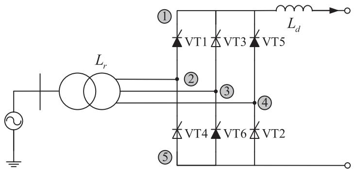  
(a) Six-pulse system topology

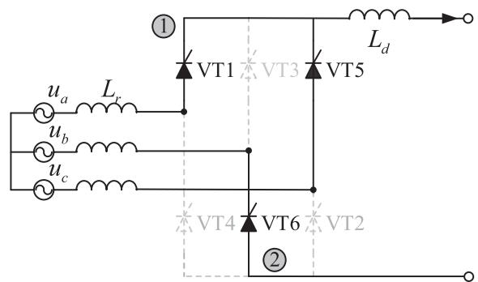  
(b) Topology-Based Simplified Dynamic Mode   
Fig. 1. Comparison diagram of SEMT model of six-pulse LCC system.

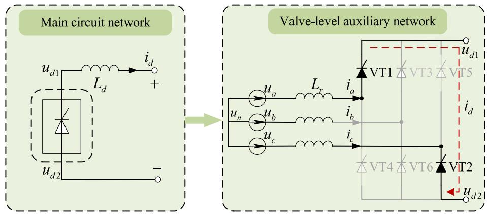  
Fig. 2. Topology of six-pulse system converter valve VT1, VT2 conduction.

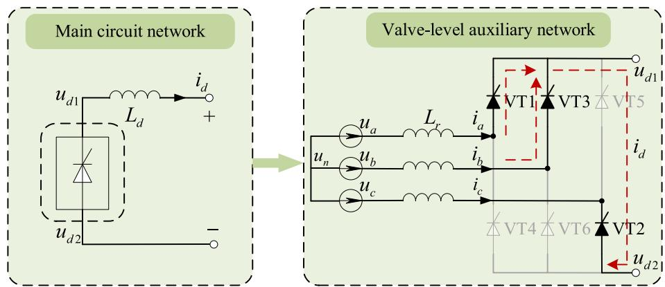  
Fig. 3. Topology of six-pulse system converter valve VT1, VT2 and VT3 conduction.

VT1 to VT6, respectively.

For the voltage of phase A transformer equivalent inductor, it can be expressed as

$$
u _ {L r - a} = L _ {r} \frac {d i _ {d}}{d t} \tag {6}
$$

Substituting into the discretized form:

$$
u _ {L r, a} (n + 1) = \frac {2 L _ {r}}{\Delta t} \left[ i _ {d} (n + 1) - i _ {d} (n) \right] - u _ {L r, a} (n) \tag {7}
$$

Then the transformer equivalent inductor voltage is expressed in matrix form as:

$$
u _ {L r} = \left[ u _ {L r, a} 0 - u _ {L r, a} \right] \tag {8}
$$

The elements of u represent the the transformer equivalent inductor voltage of phase A, B, C. And the current of transformer equivalent inductor is expressed in matrix form as:

$$
i _ {L r} = \left[ \begin{array}{l l l} i _ {d} & 0 & - i _ {d} \end{array} \right] \tag {9}
$$

The AC system reference electric potential $u _ { n }$ can be expressed as:

$$
u _ {n} = u _ {d 1} + u _ {L r, a} - u _ {a} \tag {10}
$$

The valve voltage vector is constructed as:

$$
u _ {V T} = \left[ 0 0 u _ {n} + u _ {b} - u _ {d 1} u _ {d 2} - u _ {d 1} u _ {d 2} - u _ {d 1} u _ {d 2} - u _ {n} - u _ {b} \right] \tag {11}
$$

The three-phase current on the AC side is equal to the equivalent inductor current of the transformer.

# (2) Three-valve conduction

As the converter progresses to the next switching interval, three valves (e.g., VT1, VT2, VT3) may conduct simultaneously, as shown in Fig. 3. In this state, both phases A and B participate in commutation, while phase C is fully conducting.

$i _ { a } , i _ { b }$ are the current of phase A and B. And the positive DC terminal voltage:

$$
u _ {d 1} - u _ {n} = u _ {a} - L _ {r} \frac {d i _ {a}}{d t} = u _ {b} - L _ {r} \frac {d i _ {b}}{d t} \tag {12}
$$

The direct current:

$$
i _ {d} = i _ {a} + i _ {b} \tag {13}
$$

Equation (8) can be got from Equation (6) and (7):

$$
u _ {d 1} - u _ {n} = \frac {1}{2} \left(u _ {a} + u _ {b}\right) - \frac {1}{2} L _ {r} \frac {d i _ {d}}{d t} \tag {14}
$$

In addition

$$
u _ {d 2} - u _ {n} = u _ {c} + L _ {r} \frac {d i _ {d}}{d t} \tag {15}
$$

Hence

$$
u _ {d 1} - u _ {d 2} = \frac {1}{2} \left(u _ {a} + u _ {b}\right) - u _ {c} - \frac {3}{2} L _ {r} \frac {d i _ {d}}{d t} \tag {16}
$$

Substituting into the integration scheme:

$$
i _ {V T} = \left[ i _ {L r, a} i _ {L r, b} - i _ {d} 0 0 0 \right] \tag {25}
$$

These values complete the auxiliary network solution, which, together with the main network solution, describes the full system state

$$
\begin{array}{l} i _ {d} (n + 1) + \frac {2 \Delta t}{3 L _ {r}} u _ {d 1} (n + 1) - \frac {2 \Delta t}{3 L _ {r}} u _ {d 2} (n + 1) = i _ {d} (n) + \frac {\Delta t}{3 L _ {r}} \left[ \frac {1}{2} \left(u _ {a} (n + 1) + u _ {b} (n + 1)\right) - u _ {c} (n + 1) + \right. \\ \left. \frac {1}{2} (u _ {a} (n) + u _ {b} (n)) - u _ {c} (n) - u _ {d 1} (n) + u _ {d 2} (n) \right] \\ \end{array}
$$

The structure of these equations remains similar to the two-valve case, with only changes in coefficient values due to different conduction paths. Again, the solution yields id (n + 1), $u _ { d 1 } ( \mathbf { n } + 1 )$ and $u _ { d 2 } ( \mathbf { n } + $ 1).

At this time, phases A and B are in the commutation state, phase C is turned on, and the current of phase C is $i _ { d } .$ In the auxiliary network, the voltage drop across the transformer inductance in phase C is given by:

$$
u _ {\mathrm {L r}, \mathrm {c}} (n + 1) = \frac {2 L _ {\mathrm {r}}}{\Delta t} (- i _ {\mathrm {d}} (n + 1) - i _ {\mathrm {L r}, \mathrm {c}} (n)) - u _ {\mathrm {L r}, \mathrm {c}} (n) \tag {18}
$$

where $i _ { L r \_ C } ( n )$ represents the transformer equivalent current of the C phase in the previous simulation step. Then, the AC system reference electric potential $u _ { n }$ can be expressed as:

$$
u _ {n} = u _ {d 2} + u _ {L r, c} - u _ {c} \tag {19}
$$

The transformer equivalent inductor voltage is expressed in matrix form as:

$$
u _ {L r} = \left[ u _ {n} + u _ {a} - u _ {d 1} u _ {n} + u _ {b} - u _ {d 1} u _ {L r, c} \right] \tag {20}
$$

So the commutation current of phase B can be calculated as

$$
i _ {\mathrm {L r}, \mathrm {b}} (n + 1) = \frac {\Delta t}{2 L _ {\mathrm {r}}} \left(u _ {\mathrm {L r}, \mathrm {b}} (n + 1) + u _ {\mathrm {L r}, \mathrm {b}} (n)\right) + i _ {\mathrm {L r}, \mathrm {b}} (n) \tag {21}
$$

Obtained from Kirchhoff’s law of current

$$
i _ {L r, a} + i _ {L r, b} + i _ {L r, c} = 0 \tag {22}
$$

Then the equivalent inductance current of transformer is expressed in matrix form as follows

$$
i _ {L r} = \left[ i _ {d} - i _ {L r, b} \quad i _ {L r, b} - i _ {d} \right] \tag {23}
$$

The AC side current is equal to the equivalent inductance current of the transformer. And the voltage of the valve is expressed in matrix form as follows:

$$
u _ {V T} = \left[ 0 0 0 u _ {d 2} - u _ {d 1} u _ {d 2} - u _ {d 1} u _ {d 2} - u _ {d 1} \right] \tag {24}
$$

The current of the valve is expressed in matrix form as follows:

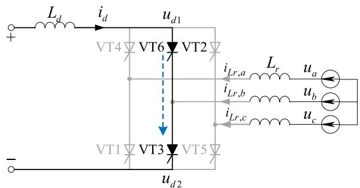  
Fig. 4. Topology of six-pulse system converter valve VT3 and VT6 conduction.

at the current step.

# 3.2. Topology analysis under other conditions

# (1) Non-standard two-valve conduction

A non-standard conduction pattern can occur, such as when VT3, VT6 are simultaneously turned on, as shown in Fig. 4. This conduction condition may arise from asynchronous triggering, misfiring, or transient delay in commutation control. While not typical in steady-state operation, its inclusion in the model enhances robustness under fault and recovery conditions.

In the main network, a special two-valve conduction condition occurs that directly connects the positive and negative poles of the DC link, bypassing the AC system entirely. Therefore, the DC-side voltage constraint is set as:

$$
u _ {d 1} = u _ {d 2} \tag {26}
$$

In the auxiliary network:

$$
i _ {L r} = \left[ \begin{array}{l l l} 0 & 0 & 0 \end{array} \right] \tag {27}
$$

$$
u _ {L r} = \left[ \begin{array}{l l l} 0 & 0 & 0 \end{array} \right] \tag {28}
$$

$$
i _ {V T} = \left[ \begin{array}{l l l l l} 0 & 0 & i _ {d} & 0 & 0 & i _ {d} \end{array} \right] \tag {29}
$$

The AC-side reference potential

$$
u _ {n} = u _ {d 1} - u _ {b} \tag {30}
$$

The valve voltage vector is obtained as:

$$
u _ {V T} = \left[ u _ {n} + u _ {a} - u _ {d 2} u _ {d 1} - \left(u _ {n} + u _ {c}\right) 0 u _ {d 1} - \left(u _ {n} + u _ {a}\right) u _ {n} + u _ {c} - u _ {d 2} 0 \right] \tag {31}
$$

# (2) Non-standard three-valve conduction

A non-standard conduction pattern can occur in transition phases, such as when VT1, VT2, and VT4 are simultaneously turned on, as shown in Fig. 5. This may happen due to delay or overlap in gate triggering or during post-fault recovery. In this case, the DC loop may include more than one AC path, and the system must account for distributed currents.

In the main network, from the equivalent topology, it is observed that the positive and negative poles of the DC bus are connected through an asymmetric path. Therefore, the DC-side voltage constraint is set as:

$$
u _ {d 1} = u _ {d 2} \tag {32}
$$

In the auxiliary network, conduction occurs only in phases A and C, while phase B is inactive. For the conduction path involving phase A, the loop equation is given by:

$$
- 2 L _ {r} \frac {d i _ {L r , a}}{d t} + u _ {a} - u _ {c} = 0 \tag {33}
$$

Applying the trapezoidal rule, the inductor current at the next time step is evaluated as:

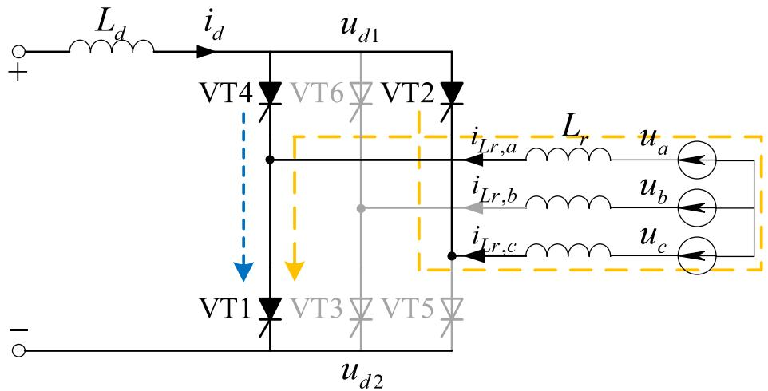  
Fig. 5. Detailed topology of six-pulse system converter valve VT1, VT2 and VT4 conduction.

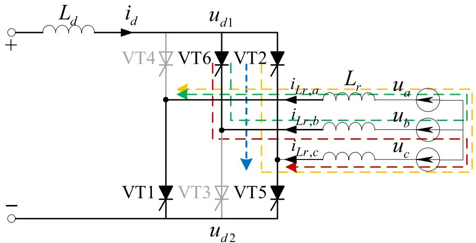  
Fig. 6. Detailed topology of six-pulse system converter valve VT1, VT2, VT5 and VT6 conduction.

$$
i _ {\mathrm {L r}, \mathrm {a}} (n + 1) = \frac {\Delta t}{4 L _ {\mathrm {r}}} \left[ u _ {a} (n + 1) - u _ {c} (n + 1) + u _ {a} (n) - u _ {c} (n) \right] + i _ {\mathrm {L r}, \mathrm {a}} (n) \tag {34}
$$

Using this updated current, the voltage across the equivalent inductor at is given by:

$$
u _ {\mathrm {L r}, \mathrm {a}} (n + 1) = \frac {2 L _ {\mathrm {r}}}{\Delta t} \left(i _ {\mathrm {L r}, \mathrm {a}} (n + 1) - i _ {\mathrm {L r}, \mathrm {a}} (n)\right) - u _ {\mathrm {L r}, \mathrm {a}} (n) \tag {35}
$$

The corresponding three-phase inductor currents and voltages are then represented in matrix form:

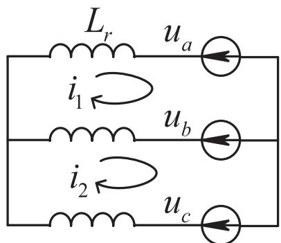  
Fig. 7. Detailed topology of six-pulse system converter valve VT1, VT2, VT5 and VT6 conduction.

$$
i _ {L r} = \left[ i _ {L r, a} 0 - i _ {L r, a} \right] \tag {36}
$$

$$
u _ {L r} = \left[ u _ {L r, a} 0 - u _ {L r, a} \right] \tag {37}
$$

The valve current vector is derived from the DC current and transformer inductor current as follows:

$$
i _ {V T} = \left[ i _ {d} i _ {L r, a} 0 i _ {d} - i _ {L r, a} 0 0 \right] \tag {38}
$$

The AC-side reference potential $u _ { n }$ is computed based on the positive pole voltage, the inductive drop, and the AC-side voltage:

$$
u _ {n} = u _ {d 1} + u _ {L r, a} - u _ {a} \tag {39}
$$

Finally, the valve voltage vector is obtained as:

$$
u _ {V T} = \left[ 0 0 u _ {n} + u _ {b} - u _ {d 2} 0 u _ {d 1} - u _ {d x} u _ {d 1} - \left(u _ {n} + u _ {b}\right) \right] \tag {40}
$$

# (3) Four-valve conduction

In some transient or fault-induced scenarios, four converter valves may conduct simultaneously. As shown in Fig. 6, the conduction of VT1, VT2, VT5, and VT6 results in a complex overlapping commutation state.

In this topology, the inverter effectively experiences both positive and negative DC bus short-circuit conditions. Therefore, the positive and negative poles are considered electrically shorted:

$$
u _ {d 1} = u _ {d 2} \tag {41}
$$

After solving the main network, the valve-level auxiliary network is treated as a three-phase short-circuited AC system, as shown in Fig. 7.

The governing differential equations are:

$$
\left\{ \begin{array}{l} L _ {r} \frac {d i _ {1}}{d t} + u _ {a} - u _ {b} + L _ {r} \frac {d \left(i _ {1} - i _ {2}\right)}{d t} = 0 \\ L _ {r} \frac {d \left(i _ {2} - i _ {1}\right)}{d t} + u _ {b} - u _ {c} + L _ {r} \frac {d i _ {2}}{d t} = 0 \end{array} \right. \tag {42}
$$

Solving the above yields:

$$
\left\{ \begin{array}{l} L _ {r} \frac {d i _ {1}}{d t} = \frac {u _ {b} - 2 u _ {a} + u _ {c}}{3} \\ L _ {r} \frac {d i _ {2}}{d t} = \frac {2 u _ {c} - u _ {b} - u _ {a}}{3} \end{array} \right. \tag {43}
$$

Using trapezoidal integration, the phase currents at time step $n + 1$ are updated:

# 4.1. Structure of 12-pulse commutation system

The topology of a 12-pulse system is illustrated in Fig. 8. On both the rectifier and inverter sides, two six-pulse bridges are used. The DC terminals of the two bridges are connected in series, and the AC sides are paralleled via transformer configurations. Let R1 and R2 denote the two rectifier-side converters, and I1 and I2 denote the inverter-side converters.

$L _ { d }$ represents the smoothing reactor, $r _ { d }$ represents DC line resistance, id represents DC current, $u _ { d r }$ is the rectifier-side output port electric potential, $u _ { d r x }$ is the series connection point potential of two six-pulse converters on the rectifier side, udi and udix are the corresponding point electric potential of the inverter side respectively.

# 4.2. Solution process for the 12-pulse commutation system

$$
\left\{ \begin{array}{l} i _ {\mathrm {L r}, \mathrm {a}} (n + 1) = \frac {\Delta t}{2 L _ {\mathrm {r}}} \left[ - \frac {u _ {\mathrm {b}} (n + 1) - 2 u _ {\mathrm {a}} (n + 1) + u _ {\mathrm {c}} (n + 1)}{3} - \frac {u _ {\mathrm {b}} (n) - 2 u _ {\mathrm {a}} (n) + u _ {\mathrm {c}} (n)}{3} \right] + i _ {\mathrm {L r}, \mathrm {a}} (n) \\ i _ {\mathrm {L r}, \mathrm {c}} (n + 1) = \frac {\Delta t}{2 L _ {\mathrm {r}}} \left[ - \frac {u _ {\mathrm {b}} (n + 1) + u _ {\mathrm {a}} (n + 1) - 2 u _ {\mathrm {c}} (n + 1)}{3} - \frac {u _ {\mathrm {b}} (n) + u _ {\mathrm {a}} (n) - 2 u _ {\mathrm {c}} (n)}{3} \right] + i _ {\mathrm {L r}, \mathrm {c}} (n) \end{array} \right. \tag {44}
$$

The inductor and valve voltages are expressed in matrix form:

$$
i _ {L r} = \left[ i _ {L r - a} - i _ {L r - a} - i _ {L r - c} \quad i _ {L r - c} \right] \tag {45}
$$

$$
u _ {L r} (n + 1) = \left[ i _ {L r} (n + 1) - i _ {L r} (n) \right] \frac {2 L _ {r}}{\Delta t} - u _ {L r} (n) \tag {46}
$$

$$
i _ {V T} = \left[ i _ {L r - a} i _ {d} + i _ {L r - b} 0 0 i _ {d} - i _ {L r - a} - i _ {L r - b} \right] \tag {47}
$$

$$
u _ {V T} = \left[ \begin{array}{l l l l l l} 0 & 0 & u _ {d 1} - u _ {d 2} & u _ {d 1} - u _ {d 2} & 0 & 0 \end{array} \right] \tag {48}
$$

The TBSD model explicitly considers abnormal commutation states such as delayed valve extinction and multi-valve conduction during fault conditions. Each non-standard conduction pattern is assigned a unique topology identifier, and corresponding network equations are derived while preserving matrix dimension consistency, which ensures accurate representation of commutation failure behaviour.

# 4. Application of the TBSD model to 12-pulse commutation system

The 12-pulse converter system, comprising both rectifier and inverter stations, integrates four six-pulse bridges, thereby increasing the complexity of system coordination and numerical computation. This section presents the solution framework for 12-pulse commutation system based on the proposed structure-preserving algorithm.

As described in Section $^ { 3 , }$ each six-pulse commutation system is represented using a state matrix to capture the on/off status of its six valves. For a 12-pulse configuration, a total of four matrices are required—two on the rectifier side (R1, R2) and two on the inverter side (I1, I2). At the beginning of each simulation step, the conduction states of all four converters are identified and their corresponding state matrices are updated accordingly.

Once the state matrices are established, the electrical equations for the main circuit network can be constructed. As shown in Fig. 8, the overall 12-pulse system can be decomposed into five logical components: four six-pulse converters and the DC transmission link.

The governing equation for the main circuit network can be expressed as:

$$
\mathbf {A} \cdot \mathbf {X} = C \tag {49}
$$

where:

X = [id udr udrx udi $u _ { d i x } ] ^ { T }$ is the vector of unknown quantities;

A is a $5 \times 5$ coefficient matrix constructed from the converter states and circuit topology;

C is a constant vector derived from historical data and known quantities.

The contribution of each six-pulse converter to the system equations is computed using the same principles outlined in Section 3. For example:

If converter R1 is operating in the conduction state shown in Fig. 2, the first row element of the matrix A can be written as:

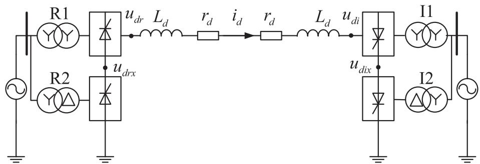  
Fig. 8. Structural diagram of 12-pulse commutation system.

$$
A (1) = \left[ 1 \frac {\Delta t}{4 L _ {r}} - \frac {\Delta t}{4 L _ {r}} 0 0 \right] \tag {50}
$$

The first row element of column vector C is:

$$
\begin{array}{l} C (1) = i _ {d} (n) + \frac {\Delta t}{4 L _ {r}} \left[ u _ {a} (n + 1) - u _ {c} (n + 1) + u _ {a} (n) - u _ {c} (n) - u _ {d 1} (n) \right. \\ \left. + u _ {d 2} (\boldsymbol {n}) \right] \tag {51} \\ \end{array}
$$

If the converter valve R2 is in the state shown in Fig. $^ { 6 , }$ similarly, the related terms are:

$$
A (2) = \left[ \begin{array}{l l l l l} 0 & 0 & 0 & 1 & - 1 \end{array} \right] \tag {52}
$$

$$
C (2) = 0 \tag {53}
$$

By following similar steps, the rows of A and entries of C corresponding to converters I1 and I2 can be determined.

The DC line section of the network introduces one additional equation derived from the differential form of the smoothing reactor and line resistance:

$$
2 L _ {d} \frac {d i _ {d}}{d t} + 2 r _ {d} i _ {d} = u _ {d r} - u _ {d i} \tag {54}
$$

Using numerical integration, the coefficients for this equation can be easily incorporated into matrix A and vector C.

Once the equation A⋅X=C is assembled, solving the $5 \times 5$ matrix system yields the main circuit network variables at the current time step. These include DC current $i _ { d }$ and node voltages $u _ { d r } , u _ { d r x } , u _ { d i } , u _ { d i x }$ .

Subsequently, the valve-level auxiliary network are solved using the procedure described in Section 4.1, including transformer inductor voltages and valve-level variables .

# 4.3. Adaptive time-step control

To further improve computational efficiency, an adaptive time-step control strategy is introduced. The simulation time step Δt is adjusted dynamically based on the rate of change of DC current, which reflects the transient intensity in the system. The time step is selected from a predefined set $\{ \Delta t _ { m } , 2 \Delta t _ { m } \}$ according to the following rules:

$$
\Delta t = \left\{ \begin{array}{l} \Delta t _ {m}, | d i / d t | \geq R _ {\text {h i g h}} \\ 2 \Delta t _ {m}, | d i / d t | <   R _ {\text {l o w}} \end{array} \right. \tag {55}
$$

where:

$\Delta t _ { m }$ is the minimum simulation time step, $R _ { h i g h }$ is the high thresholds of $i _ { d }$ change rate and $R _ { l o w }$ is the low thresholds o $\cdot _ { i _ { d } }$ change rate.

To avoid oscillation near threshold boundaries, minimum hold-time constraint is enforced and each step size must be maintained for at least $ \mathrm { { N } } _ { \mathrm { m i n } }$ steps before switching. This mechanism allows the solver to apply

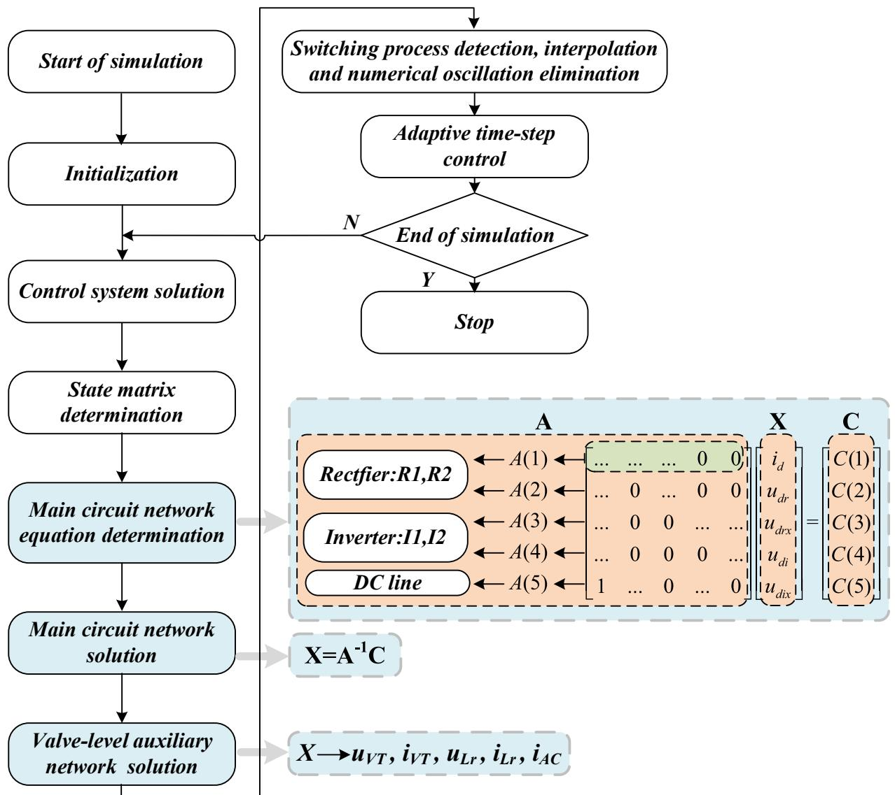  
Fig. 9. TBSD model solution process for 12-pulse commutation system.

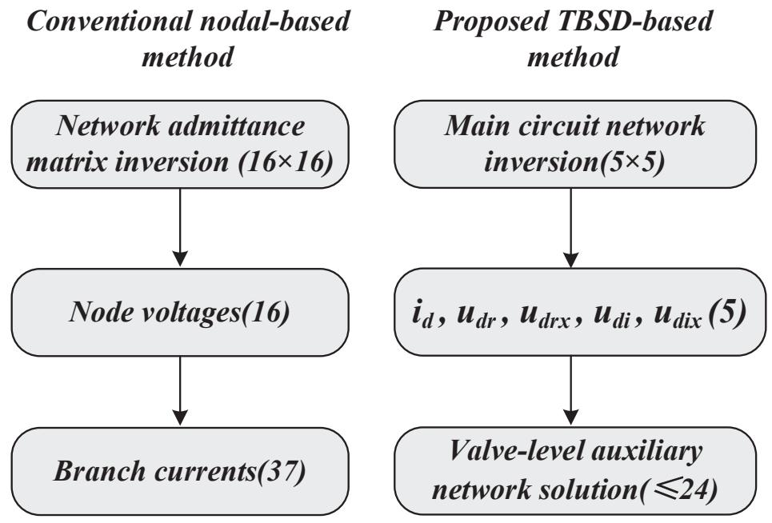  
Fig. 10. Comparison of computational load between the proposed TBSD method and conventional nodal-based algorithm.

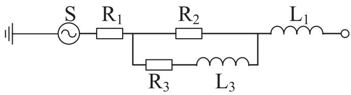  
Fig. 11. AC side system topology.

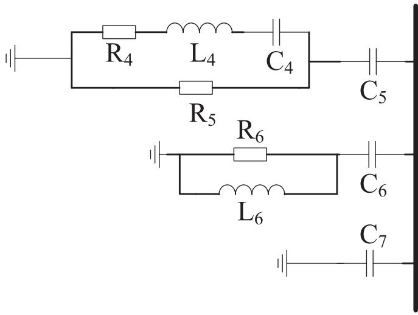  
Fig. 12. Structure diagram of filter and reactive power compensation equipment.

coarse time steps during steady-state and automatically refine resolution during commutation disturbances or faults, balancing accuracy and speed effectively. TBSD model solution process for 12-pulse commutation system is shown in Fig. 9.

# 4.4. Computational efficiency and matrix dimension comparison

One of the major advantages of the proposed solution framework lies in its significantly reduced matrix size and improved computational

Table 1   
AC side system parameters.   

<table><tr><td>Parameter</td><td>Rectifier Side</td><td>Inverter Side</td></tr><tr><td>S(kV)</td><td>382.87</td><td>215.05</td></tr><tr><td>R1(Ω)</td><td>3.737</td><td>0.7406</td></tr><tr><td>R2(Ω)</td><td>2160.33</td><td>24.81</td></tr><tr><td>R3(Ω)</td><td>0</td><td>0.7406</td></tr><tr><td>L3(mH)</td><td>0.151</td><td>36.5</td></tr><tr><td>L1(mH)</td><td>0</td><td>36.5</td></tr></table>

Table 2   
Parameters of a 12-pulse converter system.   

<table><tr><td>Parameter</td><td>Rectifier Side</td><td>Inverter Side</td></tr><tr><td>Rated power (MW)</td><td>1000</td><td></td></tr><tr><td>Rated DC voltage (kV)</td><td>500</td><td></td></tr><tr><td>Rated DC current (kA)</td><td>2</td><td></td></tr><tr><td>AC frequency (Hz)</td><td>50</td><td></td></tr><tr><td>Smoothing reactor Ld (H)</td><td>0.6</td><td></td></tr><tr><td>Line resistance Rd (Ω)</td><td>2.5</td><td></td></tr><tr><td>AC rated voltage (kV)</td><td>345</td><td>230</td></tr><tr><td>Short-circuit ratio</td><td>2.5</td><td>2.5</td></tr><tr><td>Control mode</td><td>Constant current</td><td>Extinction angle control</td></tr></table>

Table 3   
Filter and reactive power compensation parameters.   

<table><tr><td>Component</td><td>Rectifier Side</td><td>Inverter Side</td></tr><tr><td>R4(Ω)</td><td>29.76</td><td>13.23</td></tr><tr><td>L4(mH)</td><td>0.1364</td><td>0.0606</td></tr><tr><td>C4(μF)</td><td>74.28</td><td>167.2</td></tr><tr><td>R5(Ω)</td><td>261.87</td><td>116.38</td></tr><tr><td>C5(μF)</td><td>6.685</td><td>15.04</td></tr><tr><td>R6(Ω)</td><td>83.32</td><td>37.03</td></tr><tr><td>L6(mH)</td><td>0.0136</td><td>0.0061</td></tr><tr><td>C6(μF)</td><td>6.685</td><td>15.04</td></tr><tr><td>C7(μF)</td><td>3.342</td><td>7.522</td></tr></table>

efficiency. Traditional nodal-based methods require constructing and inverting large-scale admittance matrices due to their detailed switchlevel modelling. In contrast, the proposed approach leverages structural simplification and topology-specific equations, enabling much

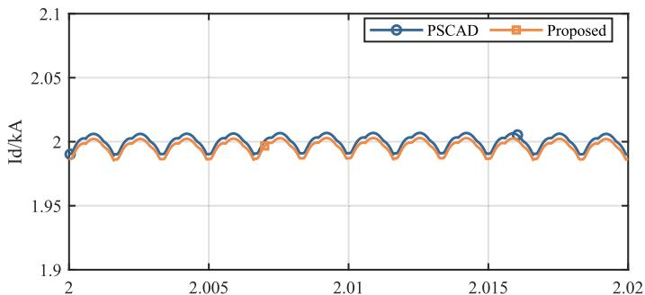

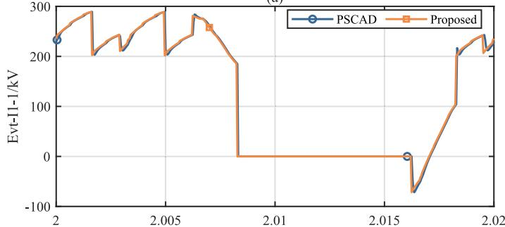

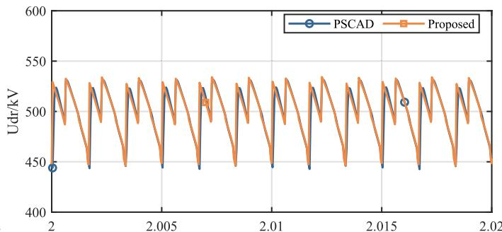

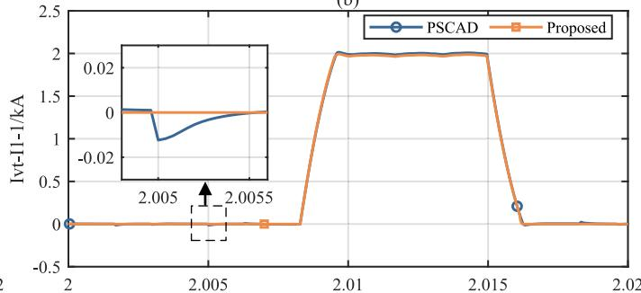  
(b)   
  
Fig. 13. Comparison of simulation results under steady-state operation: (a) DC current; (b) rectifier-side DC voltage; (c) valve voltage of VT1 at inverter I1; (d) valve current of VT1 at inverter I1.

smaller and sparser systems to be solved at each simulation step.

Specifically, in the 12-pulse commutation configuration:

1)The proposed method forms a compact 5 × 5 system for the main circuit network;   
2)The valve-level auxiliary network solution calculations are localized and modular, often requiring computation for only 1–2 phases per converter;   
3)The maximum number of multiplication operations per step is capped at 24 across all auxiliary networks, and often fewer in typical conditions.

As shown in Fig. 10, the nodal-based method involves solving a 16- dimensional network with 37 branches, resulting in considerably increased computational effort per time step. The comparison clearly demonstrates that the simplified structure-preserving approach achieves a better trade-off between accuracy and speed.

# 5. Case study

The proposed topology-based simplified dynamic (TBSD) model and solution algorithm were implemented in PSModel [25,26], a time-

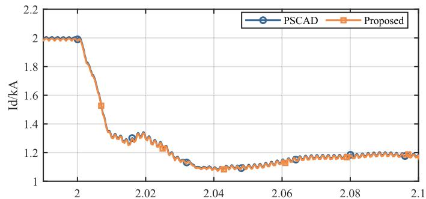

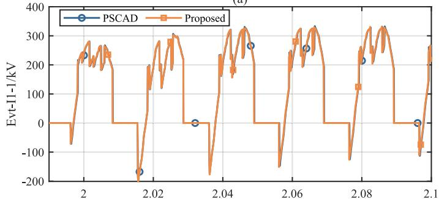  
  
（c）

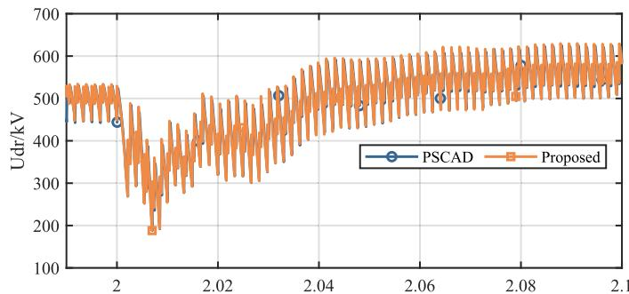

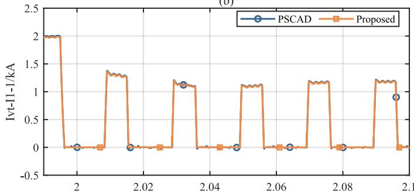  
(b)   
(@   
Fig. 14. Simulation results under a DC current reference step change (from 2 kA to 1.4 kA at t = 2 s): (a) DC current; (b) rectifier-side DC voltage; (c) valve voltage of VT1 at inverter I1; (d) valve current of VT1 at inverter I1.

domain simulation platform for power systems that supports electromagnetic, electromechanical, and hybrid simulation modes for largescale grids. A 12-pulse converter system was modelled using the TBSD approach, and its performance was compared with a model built in PSCAD/EMTDC under identical system parameters. The topology of the DC transmission system is shown in Fig. 8, and related system parameters are shown in Figs. 11–12 and Tables 1–3.

# 5.1. Steady state operation (case 1)

Under steady-state conditions, the simulation results from both the TBSD model and the PSCAD model are shown in Fig. 13. The blue lines represent results from PSCAD/EMTDC, while the orange lines are from the proposed TBSD model. The subfigures show the DC current (Fig. 13 (a)), the rectifier-side DC voltage (Fig. 13(b)), the voltage (Fig. 13(c)) and current (Fig. 13(d)) of VT1 at inverter I1.

The two models show excellent agreement in steady-state behavior. Minor differences appear in the thyristor current waveform (Fig. 13(d), zoomed view), caused by the different switch models. PSCAD uses a resistive switch model with high turn-off resistance, allowing a small current to flow even when the valve is off. In contrast, the TBSD model employs an ideal switch, where the off-state current is exactly zero. In EMT simulations and practical converter operation, the off-state leakage current of thyristors is typically in the hundreds of milliamperes to ampere range under rated blocking voltage, whereas the conduction current is in the kiloampere range. Given this large difference in magnitude, the leakage current contributes negligibly to system-level transient behavior and can be reasonably omitted from EMT models without sacrificing overall simulation accuracy.

# 5.2. DC current reference step change (case 2)

In this scenario, the DC current reference is reduced from 2 kA to 1.2 kA at t = 2 s. A comparative analysis of simulation results from both models is presented in Fig. 14. Both models show high consistency in tracking performance. After the setpoint change, the control system rapidly adjusts the output current, which settles near the new reference within a short time.

# 5.3. Single-phase grounding fault of AC system on rectifier side (case 3)

At t = 2 s, a single-phase grounding fault occurs on the AC side of the rectifier. The fault resistance is 10 Ω and the duration is 0.04 s. Fig. 15 presents the simulation results: DC current (a), rectifier-side DC voltage (b), and the voltage (c) and current (d) of VT1 at inverter I1.

As shown in Fig. 15(a), both models exhibit consistent dynamic behaviour of the DC current during the rectifier-side single-phase grounding fault. $\displaystyle \mathbf { A t t } = 2 s ,$ , the fault causes a voltage drop on the AC side, leading to a reduction in the DC current. The current begins to oscillate due to the disturbance and control system response. Once the fault is cleared at t = 2.04 s, the current rapidly recovers and stabilizes near its pre-fault value.

The TBSD model (orange curve) closely matches the PSCAD result (blue curve), capturing the same amplitude and oscillation patterns. This confirms the ability of the proposed model to accurately simulate system behaviour under fault conditions.

To further evaluate the effectiveness of the adaptive time-step control strategy, this case incorporates a dynamic step-size adjustment based on the rate of change in DC current. As shown in Fig. 16, during normal operation, the simulation uses a coarse step size of 80 μs, which ensures computational efficiency while maintaining acceptable accuracy. However, when a single-phase grounding fault is applied to the rectifier-side AC system, the dynamic response of the system leads to rapid variations in the DC current. At t = 2.055 s, the absolute value of the DC current derivative exceeds the predefined threshold, triggering a reduction in the simulation step size to 40 μs. This finer resolution allows the solver to capture the steep gradients in current and voltage more accurately. Once the system returns to a more stable state, the time step is automatically restored to 80 μs at t = 2.085 s.

# 5.4. Two-phase grounding fault on inverter side (Case 4)

In this case, an AB-phase grounding fault occurs in the inverter side AC system at 2 s, the fault resistance is 10 Ω, and the duration of fault is 0.04 s. The simulation results of the two models are shown in Fig. 17. The four images represent the DC current (Fig. 17(a)), the rectifier side DC voltage (Fig. 17(b)), and the voltage (Fig. 17(c)) and current (Fig. 17

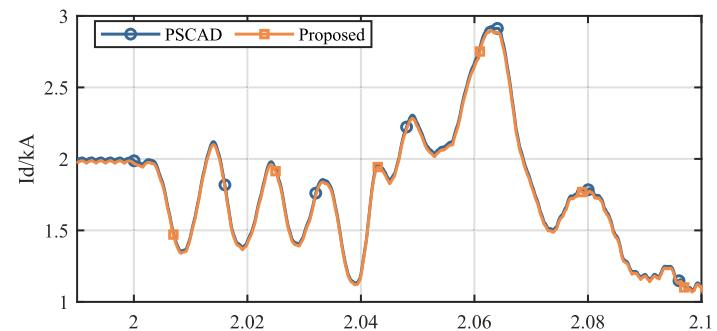

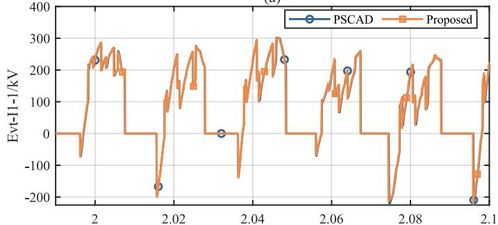  
(a)   
（c）

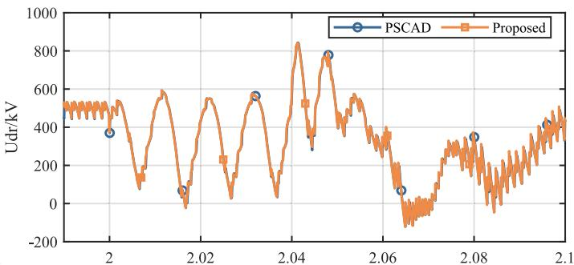

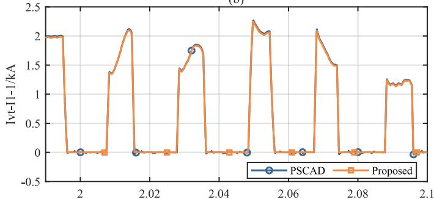  
(b)   
(@   
Fig. 15. Simulation results under a single-phase grounding fault on the rectifier-side AC system (10 Ω, 0.04 s duration): (a) DC current; (b) rectifier-side DC voltage; (c) valve voltage of VT1 at inverter I1; (d) valve current of VT1 at inverter I1.

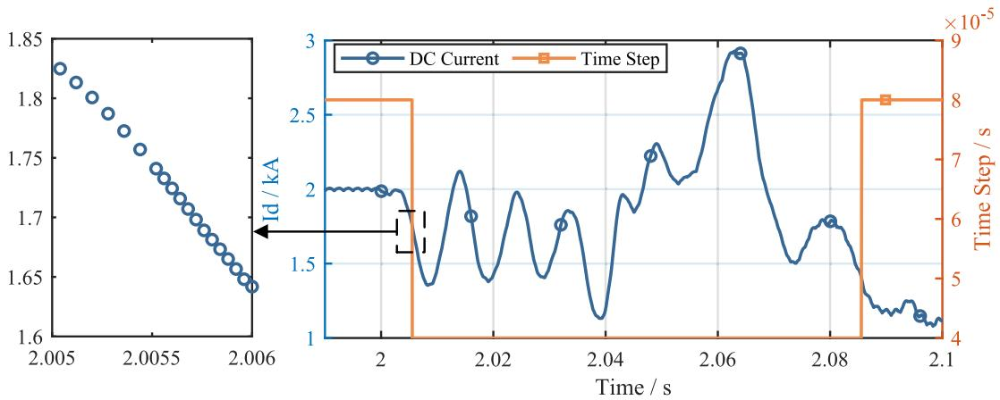  
Fig. 16. The transition between 80 μs and 40 μs time steps under a single-phase grounding fault on the rectifier-side AC system.

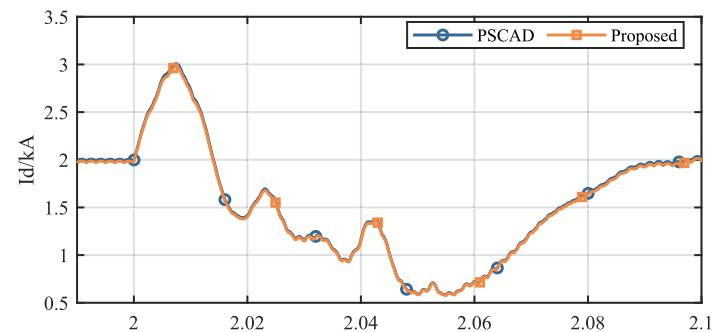

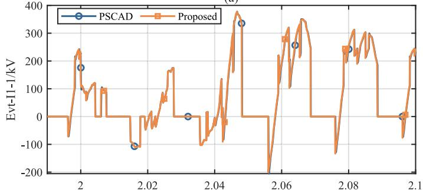  
  
（c）

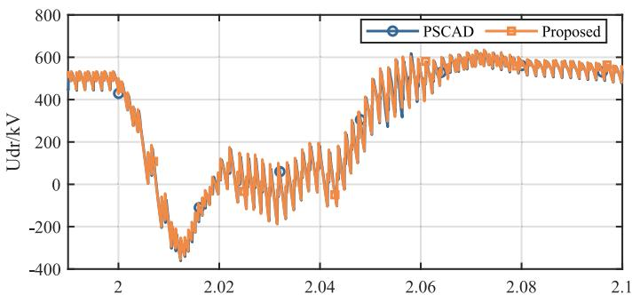

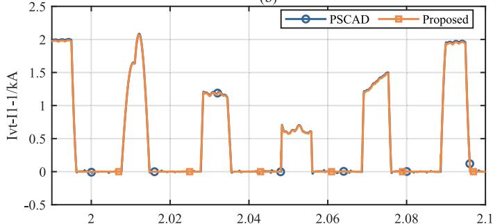  
(b)   
(d)   
Fig. 17. Simulation results under a two-phase grounding fault on the inverter-side AC system (10 Ω, 0.04 s duration): (a) DC current; (b) rectifier-side DC voltage; (c) valve voltage of VT1 at inverter I1; (d) valve current of VT1 at inverter I1.

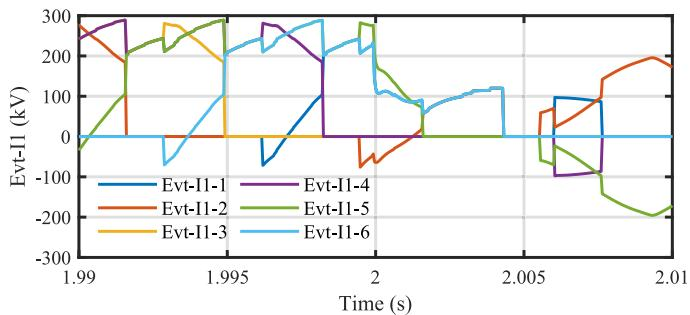  
Fig. 18. Valve-level voltage waveforms at inverter I1 under a two-phase grounding fault on the inverter-side AC system.

# (d)) of VT1 at inverter I1, respectively.

Fig. 18 illustrates the valve voltage behavior of inverter I1 under the proposed TBSD model. At t = 2 s, an AB-phase-to-ground fault is applied to the inverter-side AC system. As a result, a commutation failure is

clearly observed during the transition from valve 3 to valve 4, with valve 3 failing to turn off at approximately $\mathbf { t } = 2 . 0 0 4 \ s .$ The voltage waveform of valve 3 shows a prolonged zero-voltage interval, indicating the unsuccessful turn-off. This result demonstrates that the proposed TBSD model is capable of accurately capturing commutation failure phenomena, including the interaction between valve conduction states, ACside disturbances, and the resulting failure of valve turn-off.

# 5.5. Gating signal loss of inverter valve VT1 at station I1 (Case 5)

In this case, a control-side malfunction is simulated by intentionally omitting the gate trigger signal of valve VT1 at inverter station I1. The disturbance begins at t = 2 s and lasts for 0.04 s, during which VT1 remains non-conducting despite receiving a conduction command. The simulation results of the two models are shown in Fig. 19. The four images represent the DC current (Fig. 19(a)), the rectifier side DC voltage (Fig. 19(b)), and the voltage (Fig. 19(c)) and current (Fig. 19(d)) of VT1 at inverter I1, respectively.

As shown in Fig. 19, the gating failure of VT1 leads to an abnormal

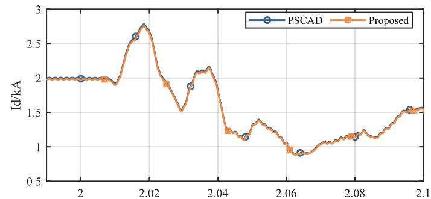

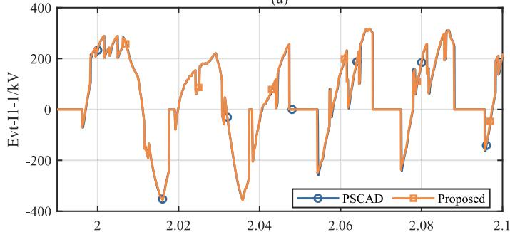  
(a)

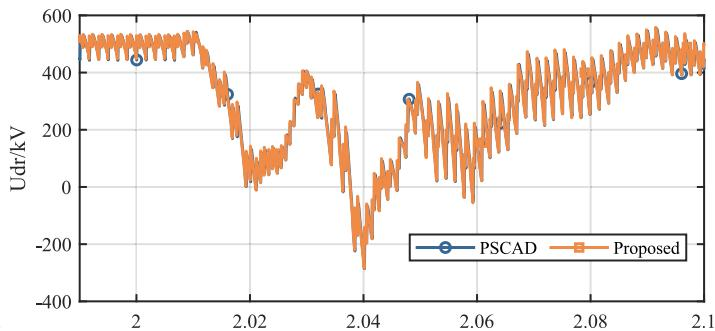

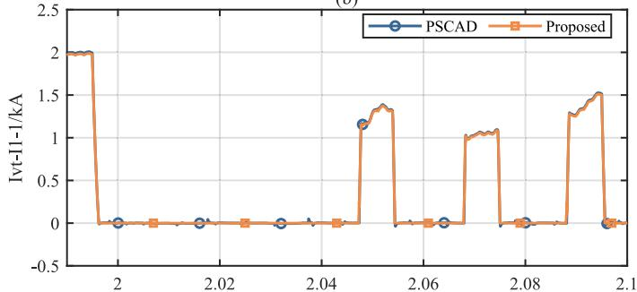  
(b)   
  
Fig. 19. Simulation results under gating signal loss of VT1 at inverter I1 (0.04 s duration starting at t = 2 s): (a) DC current; (b) rectifier-side DC voltage; (c) valve voltage of VT1 at inverter I1; (d) valve current of VT1 at inverter I1.

Table 4 Accuracy and efficiency comparison of PSCAD and TBSD models.   

<table><tr><td>Simulation case</td><td>PSCAD (40 μs)</td><td>TBSD (40 μs)</td><td>Average relative error</td><td>TBSD (Adaptive)</td></tr><tr><td>Case 1</td><td>19.21 s</td><td>11.48 s</td><td>0.47 %</td><td>9.98 s</td></tr><tr><td>Case 2</td><td>19.46 s</td><td>11.53 s</td><td>0.54 %</td><td>10.13 s</td></tr><tr><td>Case 3</td><td>19.32 s</td><td>11.76 s</td><td>0.53 %</td><td>10.06 s</td></tr><tr><td>Case 4</td><td>19.91 s</td><td>11.82 s</td><td>0.56 %</td><td>10.18 s</td></tr><tr><td>Case 5</td><td>19.87 s</td><td>11.61 s</td><td>0.51 %</td><td>10.09 s</td></tr></table>

current redistribution at t = 2 s, during which the DC current shows a noticeable increase. Due to the missing gate signal, VT1 remains fully blocked throughout the disturbance window, resulting in zero current conduction despite the expected trigger. This behaviour is clearly captured by the proposed TBSD model and aligns with the PSCAD simulation results, demonstrating the model’s ability to handle controlinduced non-conduction events in valve operation.

# 5.6. Comparison between two models

To evaluate the computational efficiency of the proposed TBSD model, simulations were carried out under both fixed time step and adaptive time step conditions. For comparison, the PSCAD model was executed using a uniform fixed step of 40 μs, while the TBSD model was tested under both a fixed step of 40 μs and an adaptive strategy. All simulations were performed with a total duration of 3 s. To quantitatively evaluate modelling accuracy, the mean relative error MRE is introduced and defined as:

$$
M R E = \frac {1}{n} \sum_ {i = 1} ^ {n} \left| \frac {\mathcal {Y} _ {T B S D , i} - \mathcal {Y} _ {P S C A D , i}}{\mathcal {Y} _ {P S C A D , i}} \right| \tag {56}
$$

where:

n is the number of data points in a selected time window; yPSCAD,i and yTBSD,i denote the i-th sample of the PSCAD model and the proposed TBSD model, respectively.

Table 4 summarizes the average simulation times (over ten runs) and mean relative errors for four representative cases.

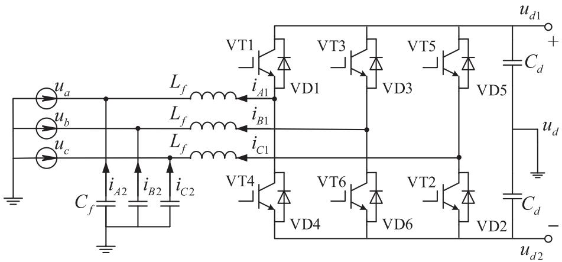  
Fig. 20. Topology of two-level voltage source converter.

As summarized in Table 4, when using a fixed step of 40 $\mu { s } ,$ the TBSD model achieves a simulation time reduction of approximately 40 % across all cases compared to PSCAD, while maintaining a high level of accuracy. The average relative error is consistently below 0.6 %, and it confirms that the TBSD model preserves key waveform characteristics and dynamic behaviors while substantially reducing computational overhead. When the adaptive time-step strategy is enabled, the simulation time is further reduced by 15 % compared to the fixed-step TBSD model. This efficiency gain is achieved without sacrificing accuracy, as the adaptive scheme dynamically applies finer steps during fast transients and coarser steps during steady-state operation.

# 6. Discussion

The TBSD model and its associated solving algorithm proposed in this paper can be extended to simulate voltage source converters (VSCs). This section provides a brief discussion on the applicability of the method using a typical two-level inverter as an example.

A standard topology of the VSC is illustrated in Fig. 20, where the inverter is connected to the AC side through an LC filter. The filter inductance and capacitance are denoted by $L _ { f }$ and $C _ { f } ,$ respectively. The DC side includes the DC-link capacitor $C _ { d }$ , and the DC voltage is defined as $u _ { d } .$ . The potentials of the positive and negative DC poles are denoted as u and $u _ { d 2 } ,$ respectively.

For the AC side, the inductor branch currents are defined as $i _ { A l s }$ i and $i _ { C l } ,$ while the capacitor branch currents are iA2, iB2 and $i _ { C 2 } .$ Assuming that the switch states VT1, VT3, and VT2 are turned on, and the converter is modelled using ideal switches, the circuit equations are expressed as:

$$
\left\{ \begin{array}{l} u _ {d 1} - u _ {a} = L _ {f} \frac {d i _ {A 1}}{d t} \\ u _ {d 1} - u _ {b} = L _ {f} \frac {d i _ {B 1}}{d t} \\ u _ {d 2} - u _ {c} = L _ {f} \frac {d i _ {C 1}}{d t} \end{array} \right. \tag {57}
$$

Additionally, the following constraints apply:

$$
\left\{ \begin{array}{c} u _ {d 1} - u _ {d 2} = u _ {d} \\ i _ {A 1} + i _ {B 1} + i _ {C 1} = - \left(i _ {A 2} + i _ {B 2} + i _ {C 2}\right) \end{array} \right. \tag {58}
$$

As iA2, iB2, and iC2 can be directly computed from capacitor voltage derivatives, they are treated as known quantities. Therefore, the system contains five unknown variables: $i _ { A l } ,$ , iB1, iC1, $u _ { d 1 } , u _ { d 2 }$ . These constitute the main circuit network equations for the VSC system. Once these variables are solved using a differential method, the valve-level auxil iary network can be computed following the same steps as described earlier for the LCC-HVDC system.

It is important to note that the proposed algorithm only requires solving a $5 \times 5$ matrix for this configuration, whereas a nodal-based solution would typically require solving an 8-node network, increasing computational cost.

Unlike the LCC-HVDC system, which typically operates with two or three arms conducting alternately, the two-level VSC uses fully controlled switches, where all three bridge arms $( \mathsf { A } , \mathsf { B } ,$ and C) can be turned on or off simultaneously. During each switching event, upper and lower arms of the same phase are alternately conducting. Although ideal switches are used, the network structure of the converter changes less frequently due to the symmetry and predictable switching pattern. This allows the proposed TBSD method to be extended to VSC modeling with minimal modifications, offering both simplified topology and efficient simulation.

# 7. Conclusion

This paper presents a topology-based simplified dynamic (TBSD)

model and a structure-stable solving algorithm for LCC-HVDC converters, specifically aimed at capturing commutation failure phenomena with high computational efficiency. By representing thyristor valves as ideal switches and decomposing the converter into main and auxiliary circuit networks, the model achieves significant simplification without sacrificing accuracy. An adaptive time-step control mechanism is also proposed to balance computational speed and simulation fidelity.

The proposed model is validated through extensive case studies involving steady-state operation, DC current reference changes, and ACside fault scenarios. Simulation results demonstrate close alignment with PSCAD/EMTDC models, with relative errors consistently below 0.6 % and a simulation time reduction of over 40 %. The TBSD model is further demonstrated to effectively capture commutation failure characteristics under complex fault conditions, verifying its capability for dynamic behaviour analysis.

# CRediT authorship contribution statement

Yangyang He: Writing – original draft, Project administration, Methodology. Nengling Tai: Writing – review & editing, Supervision. Jin Xu: Formal analysis. Wenzhuo Liu: Validation, Methodology. Panjie Lian: Validation. Haizhen Zhang: Visualization.

# Declaration of competing interest

The authors declare that they have no known competing financial interests or personal relationships that could have appeared to influence the work reported in this paper.

# Acknowledgements

This work was supported by the National Key R&D Program of China (2024YFB4206500), the Natural Science Foundation of Shanghai (Grant No. 24ZR1431800), and the National Natural Science Foundation of China (Grant No. 52337006).

# Data availability

Data will be made available on request.

# References

[1] Chen Y, Wen M, Wang Z, et al. A pilot directional protection based on low frequency voltage variable quantity for LCC-HVDC transmission lines. Int J Electr Power Energy Syst 2023. https://doi.org/10.1016/j.ijepes.2022.108512.   
[2] Liu D, Li X, Cai Z, et al. Multiple commutation failure suppression method of LCC-HVDC transmission system based on fault timing sequence characteristics. Int J Electr Power Energy Syst 2022;141:108128. https://doi.org/10.1016/j. ijepes.2022.108128.   
[3] Liu Z, Gao H, Peng F, Fan Y. Rapid pilot protection for LCC-HVDC transmission lines utilizing specific frequency measured impedance characteristics. IEEE Trans Power Delivery June 2025;40(3):1667–81. https://doi.org/10.1109/ TPWRD.2025.3560080.   
[4] Yu Z, et al. A method for modifying LCC-HVDC control considering dynamic reactive power balance during AC fault and system recovery period. In: IEEE transactions on power delivery, doi: 10.1109/TPWRD.2025.3572691.   
[5] Li Y, Shu D, Hu J, et al. A multi-area Thevenin equivalent based multi-rate cosimulation for control design of practical LCC HVDC system. Int J Electr Power Energy Syst, 2020, 115(Feb.): 105479.1-105479.9. Doi:10.1016/j. ijepes.2019.105479.   
[6] Osauskas C, Wood A. Small-signal dynamic modeling of HVDC systems. IEEE Trans Power Delivery Jan. 2003;18(1):220–5.   
[7] Guo C, Zhang J, Yang S, Li H, Fu C. Modified dynamic model and small-signal stability analysis for LCC- HVDC systems. CSEE J Power Energy Syst March 2025; 11(2):750–9. https://doi.org/10.17775/CSEEJPES.2021.05820.   
[8] Kwon D-H, Kim Y-J, Moon S-I. Modeling and analysis of an LCC HVDC system using DC voltage control to improve transient response and short-term power transfer capability. IEEE Trans Power Delivery Aug. 2018;33(4):1922–33. https://doi.org/ 10.1109/TPWRD.2018.2805905.   
[9] Shu D, Xie X, Dinavahi V, Zhang C, Ye X, Jiang Q. Dynamic phasor based interface model for EMT and transient stability hybrid simulations. IEEE Trans Power Syst July 2018;33(4):3930–9.

[10] Daryabak M, et al. Modeling of LCC-HVDC systems using dynamic phasors. IEEE Trans Power Delivery Aug. 2014;29(4):1989–98.   
[11] Liu C, Bose A, Tian P. Modeling and analysis of HVDC converter by three-phase dynamic phasor. IEEE Trans Power Delivery Feb. 2014;29(1):3–12.   
[12] Wang M, et al. Impedance modeling and stability analysis of DFIG wind farm with LCC-HVDC transmission. IEEE J Emerging Sel Top Circuits Syst March 2022;12(1): 7–19.   
[13] Nian H, Liu Y, Li H, Hu B, Liao Y, Yang J. Commutation Overlap characteristic modeling and stability analysis of LCC-HVDC in sending AC grid. IEEE Trans Sustainable Energy July 2022;13(3):1594–606. https://doi.org/10.1109/ TSTE.2022.3167106.   
[14] Hu L, Yacamini R. Harmonic transfer through converters and HVDC links. IEEE Trans Power Electron July 1992;7(3):514–25. https://doi.org/10.1109/ 63.145139.   
[15] Hu Lihua, Morrison RE. The use of modulation theory to calculate the harmonic distortion in HVDC systems operating on an unbalanced supply. In: IEEE transactions on power systems, vol. 12, no. 2, pp. 973-980, May 1997, doi: 10.1109/59.589796.   
[16] Liu T, Xu R, Jiang Q, Li B, Blaabjerg F, Wang P. Multiple switching functions based HSS model of LCC considering variable commutation angle and harmonic couplings. IEEE Trans Power Delivery Dec. 2023;38(6):3820–33. https://doi.org/ 10.1109/TPWRD.2023.3293539.   
[17] Wang J, et al. Unified model and small-signal stability analysis of LCC-HVDC in symmetric and asymmetric operating conditions based on switching system theory. In CSEE Journal of Power and Energy Systems, doi: 10.17775/ CSEEJPES.2023.09780.   
[18] Cai Y, He Y, Zhang H, Zhou H, Liu J. Integrated design of filter and controller parameters for low-switching-frequency grid-connected inverter based on harmonic state-space model. IEEE Trans Power Electron May 2023;38(5):6455–73. https://doi.org/10.1109/TPEL.2023.3241091.

[19] Jiang K, Hu P, Cao K, Liu D, Ye C. Small-signal modeling and interaction analysis of LCC-HVDC systems based on harmonic state space theory. IEEE Access 2022;10: 109937–48. https://doi.org/10.1109/ACCESS.2022.3213709.   
[20] Liu Y, et al. Harmonic state space based impedance modeling and virtual impedance based stability enhancement control for LCC-HVDC systems. J Mod Power Syst Clean Energy January 2024;12(1):287–98. https://doi.org/10.35833/ MPCE.2022.000722.   
[21] Liu D, Zou C, Li X, et al. Suppression of continuous commutation failure in LCC-HVDC transmission based on improved virtual synchronous generator control for energy storage system. Int J Electr Power Energy Syst 2024;159(000):11. https:// doi.org/10.1016/j.ijepes.2024.110018.   
[22] Wang H, Wang Y, Xiao X, Ma Z, Xu Q. Harmonic state space based stability analysis of LCC-HVDC system with saturated transformer. In IEEE Transactions on Power Delivery, doi: 10.1109/TPWRD.2025.3575065.   
[23] Ouyang J, Ye J, Yu J, et al. Commutation failure suppression method considering chain reaction in multi-infeed LCC-HVDC systems. Int J Electr Power Energy Syst 2023. https://doi.org/10.1016/j.ijepes.2022.108792.   
[24] Wang K, Xu J, Li G, Tai N, Tong A, Hou J. A generalized associated discrete circuit model of power converters in real-time simulation. IEEE Trans Power Electron March 2019;34(3):2220–33.   
[25] Lian P, Liu W, Sun H, Zheng C, Zhang H, Tang Y, Bai J. Efficient initialization method for electromagnetic transient simulation system of large-scale new energy connected to the power grid through VSC-HVDC. Proc Chin Soc Electr Eng, 2020, 45(10), 3775–3787.   
[26] Huang R, et al. Screening index of severe AC faults in multi-infeed HVDC system considering electromagnetic transient process. 2022 4th International Conference on Smart Power & Internet Energy Systems (SPIES), Beijing, China, 2022, pp. 661- 666, doi: 10.1109/SPIES55999.2022.10082114.