# Analytical and measurement-based wideband two-port modeling of DC-DC converters for electromagnetic transient studies✰

H. Alameri a , P. Gomez b,

a Computer Engineering Department, University of Baghdad, Baghdad, Iraq   
b Department of Electrical and Computer Engineering, Western Michigan University, Kalamazoo, MI 49008 United States of America

# A R T I C L E I N F O

Keywords:

Black-box models

DC-DC converters

Frequency domain analysis

Numerical Laplace transform

Two-port models

Wideband representation

# A B S T R A C T

Power-electronic converters are essential elements for the effective interconnection of renewable energy sources to the power grid, as well as to include energy storage units, vehicle charging stations, microgrids, etc. Converter models that provide an accurate representation of their wideband operation and interconnection with other active and passive grid components and systems are necessary for reliable steady state and transient analyses during normal or abnormal grid operating conditions. This paper introduces two Laplace domain-based approaches to model buck and boost DC-DC converters for electromagnetic transient studies. The first approach is an analytical one, where the converter is represented by a two-port admittance model via mode averaging and inclusion of switching effects. The second approach consists of reconstructing the two-port admittance model of the converter from terminal measurements for a series of tests. The performance of both approaches is evaluated against EMTP simulations, with very close results.

# 1. Introduction

POWER electronic-based converters are the gateway for efficient and reliable integration of distributed energy resources (DER), energy storage units, electric vehicles, and other modern technologies, to the electric grid. Thus, accurate and practical modeling of these devices to evaluate their interaction with other active and passive power components is critical for various power systems studies.

Over the last decades, it has become clear that the dynamic simulation of power systems with DER integration requires, in many cases, of electromagnetic transient (EMT) models that can provide an accurate response over a wide frequency range [1]. This is mainly due to the fast dynamics of modern power electronic components, which extend to a much wider frequency range above the nominal frequency [2]. Thus, the use of EMTP (Electro Magnetic Transient Program)-type software tools is now a common practice by the power systems community for grid studies with converter-based DER integration [3].

Although EMTP is a very valuable and robust tool for general EMT studies, it can be ineffective for dynamic studies of power electronicbased power systems given the combination of small time-steps and long simulation times to account for wideband transient behavior,

which can result in prohibitive computational costs, especially for large systems [4]. In addition, results accuracy can be compromised by the approximations required to introduce frequency dependence of power components, a crucial aspect for the correct prediction of dynamic and transient response of systems with wide frequency content [2].

Another challenge of the EMT simulation of power electronic-based power systems is the limited availability of generic models of power converters, which in many cases are provided as black boxes by manufacturers due to technology proprietary issues [5]. Even when nominal models are provided by manufacturers, parameters may vary over time due to fluctuations in operating state, weather conditions, component aging, etc [6].

Considering the drawbacks of utilizing time domain techniques, there have been recent efforts to develop models of power electronic devices for dynamic studies based on the use of frequency domain representations [7–9]. Recent studies have also showcased the advantages of using impedance/admittance-based models for stability studies of grid-connected inverters [10–12]. In addition, further work has explored the generation of measurement-based converter models using time and frequency domain methods [13–15].

One of the salient features of an impedance/admittance-based

approach is the straightforward analysis of interoperability between converters from different vendors, which is regarded as a key issue for the reliability of future power systems [2]. Frequency domain approaches are also well suited for design-oriented analysis [11], they are considered more computationally efficient and scalable than state-space representations, and they are also highly compatible with the use of reduction/partitioning techniques, which are “urgently demanded for the stability analysis of very large power-electronic-based power systems” [11].

Building upon the aforementioned work, as well as our preliminary work in [16], in this paper we aim to contribute to the state-of-the-art on converter modeling by proposing alternative analytical and measurement-based approaches for wideband representation of power converters, focusing on DC-DC buck and boost converters given their well-known topologies and extended use as part of DER-populated systems. Our analytical approach is based on two-port representation of mode average converter models in the Laplace domain, with further addition of switching frequency, and time domain solution using the inverse numerical Laplace transform (INLT) [17]. On the other hand, our measurement-based approach is based on performing a series of tests under normal operating conditions, gathering the terminal voltages and currents from these tests, and using these measurements to reconstruct a wideband two-port model of the converter.

Although this model reconstruction approach is tested in our paper for DC-DC converters, it can be applied to other power components, or grid segments, for wideband two-port representation. Another salient feature of our modeling approach is that it allows straightforward interconnectivity of the converter models with other power components also defined by wideband admittance representations, either obtained from analytical definitions or from measurements. This allows easily introducing full-frequency dependent models for enhanced accuracy, as well as offering a comprehensive depiction of the dynamic behavior of converter-based systems, including both time and frequency domain features. In addition, the proposed measurement-based modeling approach sets the basis for data-driven models that consider variation of operational conditions of converters over time (extraction of operational states) for a more realistic representation and potential application to fault detection, predictive maintenance, asset life-cycle management, etc.

# 2. Analytical modeling approach

In this section we describe the approach followed for the analytical Laplace-domain modeling of buck and boost DC-DC converters for transient studies. This approach was initially described in [16], and is further refined here to allow a more direct comparison with the measurement-based approach described in Section 3.

# 2.1. Buck converter

The basic representation of a buck converter is shown in Fig. 1a. Switching devices S and D work in an alternate manner, i.e., when S is on, D is off, and vice versa; therefore, the buck converter operates in the two modes illustrated by Fig. 1b and 1c.

Mode 1 corresponds to the interval [0, dT], where d is the duty cycle and T is the switching period. During this mode, semiconductive switch S is closed and diode D does not conduct. The frequency domain admittance representation of this mode is shown in Fig 1b. On the other hand, mode 2 corresponds to the interval [dT, T], for which S is open and D conducts. The frequency domain admittance representation of this mode is shown in Fig 1c. Averaging these two modes results in the following voltage and current equations in the Laplace domain:

$$
\frac {I _ {i}}{Y _ {L}} = d \left(V _ {i} - V _ {o}\right) + (1 - d) 0, \tag {1}
$$

$$
Y _ {C} V _ {o} = d \left(I _ {i} + I _ {o}\right) + (1 - d) \left(I _ {o} - Y _ {L} V _ {o}\right), \tag {2}
$$

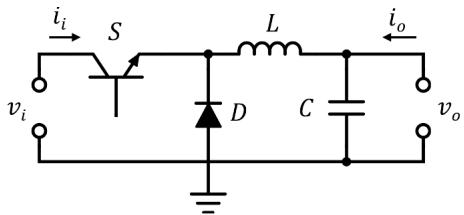

  
  
(b)

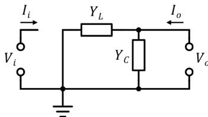  
  
Fig. 1. Buck converter: (a) schematic, (b) admittance model for mode 1 with S: ON and D:OFF, (c) admittance model for mode 2 with S:OFF and D:ON.

where $V _ { i }$ and $V _ { o }$ are the input and output voltages, Ii and $I _ { o }$ are the input and output currents, and s is the Laplace variable. Eqs. (1) and (2) can be rewritten as the following two-port admittance model [16]:

$$
\left[ \begin{array}{l} I _ {i} \\ I _ {o} \end{array} \right] = \left[ \begin{array}{c c} d Y _ {L} & - d Y _ {L} \\ - d Y _ {L} & Y _ {L} + Y _ {C} \end{array} \right] \left[ \begin{array}{l} V _ {i} \\ V _ {o} \end{array} \right]. \tag {3}
$$

The representation in (3) enables direct interconnection of the buck converter model with other components also defined by admittance matrices. However, (3) does not consider the switching frequency directly since it is based on mode averaging. Depending on the study to be completed, e.g., harmonic stability, power quality, or transient resonance, including this feature can be relevant for accurate prediction of the system response. The Laplace modeling approach makes it possible to include the buck converter switching frequency in a straightforward manner, by means of the product of the DC input and a switching function $F _ { s } ( s )$ . In order to preserve the relationship of inputs and outputs described previously, this is expressed below by modifying the admittance two-port definition as follows:

$$
\left[ \begin{array}{l} I _ {i} \\ I _ {o} \end{array} \right] = \left[ \begin{array}{c c} d F _ {s} Y _ {L} & - d Y _ {L} \\ - d F _ {s} Y _ {L} & Y _ {L} + Y _ {C} \end{array} \right] \left[ \begin{array}{l} V _ {i} \\ V _ {o} \end{array} \right], \tag {4}
$$

where $F _ { s } ( s )$ is a switching function with duty cycle d and frequency 1/T, defined as

$$
F _ {s} (s) = \frac {1 - e ^ {- s d T}}{d \left(1 - e ^ {- s T}\right)}. \tag {5}
$$

Please notice that the models given by (3) (average model) and (4) (switching model) are both based on admittance matrices. However, while (3) can be represented by a π-circuit since the matrix is symmetrical, (4) cannot be directly represented in the same way since the matrix is asymmetrical. This feature is of particular importance when reconstructing a converter model from terminal measurements, as explained in Section 3.

# 2.2. Boost converter

Fig. 2a shows the basic representation of a boost converter. Similar to the buck converter, semiconductive switches S and D work in an alternate manner. These two modes of operation are illustrated by Fig. 2b and c.

Following a similar procedure to that of Section 2.1, we can obtain a two-port model of the boost converter by averaging the two modes of operation in the Laplace domain:

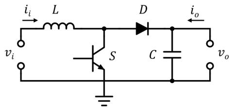

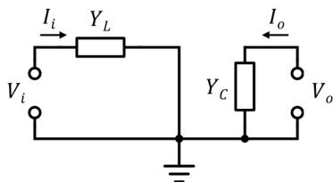  
(a)

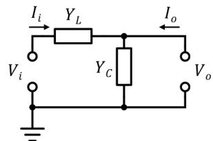  
（

(b)

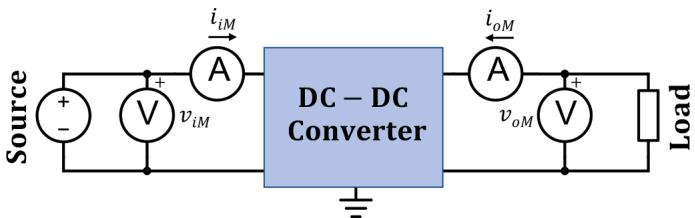  
Fig. 2. Boost converter: (a) schematic, (b) admittance model for mode 1 with S: ON and D:OFF, (c) admittance model for mode 2 with S:OFF and D:ON.   
Fig. 3. Measurement arrangement for two-port converter modeling.

$$
\frac {I _ {i}}{Y _ {L}} = d V _ {i} + (1 - d) \left(V _ {i} - V _ {o}\right), \tag {6}
$$

$$
Y _ {C} V _ {o} = d I _ {o} + (1 - d) \left(I _ {i} + I _ {o}\right). \tag {7}
$$

Eqs. (6) and (7) can be rewritten as a two-port admittance model given by [16]

$$
\left[ \begin{array}{l} I _ {i} \\ I _ {o} \end{array} \right] = \left[ \begin{array}{c c} Y _ {L} & - (1 - d) Y _ {L} \\ - (1 - d) Y _ {L} & (1 - d) ^ {2} Y _ {L} + Y _ {C} \end{array} \right] \left[ \begin{array}{l} V _ {i} \\ V _ {o} \end{array} \right]. \tag {8}
$$

Because of the location of the switching components, addition of switching frequency to the boost converter model is not as simple as with the buck converter. However, this is still possible by introducing the following ripple function:

$$
F _ {r} (s) = \frac {4 \left(1 - e ^ {- T s / 2}\right) ^ {2}}{T s ^ {2} \left(1 - e ^ {- T s}\right)} - \frac {1}{s}. \tag {9}
$$

To introduce the oscillatory effects of the switching operations, inductor (input) current I and capacitor (output) voltage $V _ { o }$ of the converter are modified by the ripple function and corresponding ripple factors [17] as follows:

$$
I _ {i} ^ {\prime} = I _ {i} + \frac {V _ {D C} d T}{2 L} F _ {r} (s), \tag {10}
$$

$$
V _ {o} ^ {\prime} = V _ {o} - \frac {V _ {D C} d T}{2 (1 - d) C R _ {L}} F _ {r} (s), \tag {11}
$$

where $V _ { D C }$ is the magnitude of the input DC voltage and $R _ { L }$ is the load connected at the converter output.

# 2.3. Solution

Eqs. (3), (4) and (8) are solved for the input/output voltages vector, and the corresponding time domain voltages are calculated using the inverse NLT algorithm [18]:

$$
\left[ v _ {i} (t) v _ {o} (t) \right] = \mathrm {N L T} ^ {- 1} \left[ V _ {i} (s) V _ {o} (s) \right], \tag {12}
$$

# 3. Measurement-based modeling approach

The analytical approach initially proposed in [16], and further described and developed in Section 2, is applicable when the converter topology and its parameters are fully available, as well as for design purposes. In contrast, the approach described in this section is useful when the converter parameters and topology are not known, but its transient terminal measurements of voltage and current, viM(t), voM(t), $i _ { i M } ( t )$ and $i _ { o M } ( t ) _ { : }$ , can be extracted, as shown in Fig. 3. Since the modeling approach is based on the Laplace domain, the first step after extracting the time-domain terminal measurements is to transform them to the Laplace domain, which is done by using the numerical Laplace transform [18]:

$$
\left[ V _ {i M} (S) V _ {o M} (s) \right] = \mathrm {N L T} \left[ v _ {i M} (t) v _ {o M} (t) \right]. \tag {13}
$$

$$
\left[ I _ {i M} (s) I _ {o M} (s) \right] = \mathrm {N L T} \left[ i _ {i M} (t) i _ {o M} (t) \right]. \tag {14}
$$

Then, we consider the relationship between the Laplace domain voltages and currents given above by means of an admittance (2-port) representation:

$$
\left[ \begin{array}{l} I _ {i M} \\ I _ {o M} \end{array} \right] = \left[ \begin{array}{l l} y _ {1 1} (s) & y _ {1 2} (s) \\ y _ {2 1} (s) & y _ {2 2} (s) \end{array} \right] \left[ \begin{array}{l} V _ {i M} \\ V _ {o M} \end{array} \right]. \tag {15}
$$

Based on the consideration of an asymmetrical admittance for the switching converter models from Section 2, Eq. (15) assumes the existence of 4 distinct admittance components: $y _ { 1 1 } ( s ) , y _ { 1 2 } ( s ) , y _ { 2 1 } ( s )$ and $y _ { 2 2 } ( s )$ . Considering that the voltages and currents are known (measured), while the admittance matrix components are unknown, the system of equations in (15) can be rewritten as

$$
\left[ \begin{array}{l} I _ {i M} \\ I _ {o M} \end{array} \right] = \left[ \begin{array}{c c c c} V _ {i M} & V _ {o M} & 0 & 0 \\ 0 & 0 & V _ {i M} & V _ {o M} \end{array} \right] \left[ \begin{array}{l} y _ {1 1} (s) \\ y _ {1 2} (s) \\ y _ {2 1} (s) \\ y _ {2 2} (s) \end{array} \right], \tag {16}
$$

which in compact form can be expressed as

$$
[ \mathbf {I} ] _ {2 \times 1} = [ \mathbf {V} ] _ {2 \times 4} [ \mathbf {Y} ] _ {4 \times 1}. \tag {17}
$$

Evidently, the system in (17) is underdetermined; it has 2 equations with 4 unknowns. Therefore, if its solution exists it will not be unique. To solve this system for Y in such a way that the admittance reconstructed from measurements is unique, we propose to obtain terminal measurements for a number of distinct tests. Two tests would result in a system with the same number of equations as unknowns:

$$
\left[ \begin{array}{l} \mathbf {I} _ {\text {t e s t 1}} \\ \mathbf {I} _ {\text {t e s t 2}} \end{array} \right] _ {4 \times 1} = \left[ \begin{array}{l} \mathbf {V} _ {\text {t e s t 1}} \\ \mathbf {V} _ {\text {t e s t 2}} \end{array} \right] _ {4 \times 4} [ \mathbf {Y} ] _ {4 \times 1}. \tag {18}
$$

However, the $4 \times 4$ voltages matrix in (18) will, in general, be singular, precluding the direct solution of this system. Additional tests can be introduced, thus producing the following overdetermined system:

$$
\left[ \begin{array}{c} \mathbf {I} _ {\text {t e s t 1}} \\ \mathbf {I} _ {\text {t e s t 2}} \\ \vdots \\ \mathbf {I} _ {\text {t e s t N}} \end{array} \right] _ {(2 N) \times 1} = \left[ \begin{array}{c} \mathbf {V} _ {\text {t e s t 1}} \\ \mathbf {V} _ {\text {t e s t 2}} \\ \mathbf {V} _ {\text {t e s t 3}} \end{array} \right] _ {(2 N) \times 4} [ \mathbf {Y} ] _ {4 \times 1}. \tag {19}
$$

where N is the number of tests. Eq. (19) is solved using the minimum norm least-squares (MNLS) method, which calculates the vector Y that minimizes ||VY-I||. In particular, function lsqminnorm from MATLAB is applied [19]. For the cases solved here, 4 tests producing distinct terminal voltages and currents were found to be sufficient to accurately reconstruct the admittance matrix of the converters under test. Once the admittance matrix elements are reconstructed from the MNLS solution of (19), the converter transient response can be obtained for any

terminal conditions from

$$
\left[ \begin{array}{l} V _ {i R} \\ V _ {o R} \end{array} \right] = \left[ \begin{array}{c c} y _ {1 1} (s) + y _ {i} & y _ {1 2} (s) \\ y _ {2 1} (s) & y _ {2 2} + y _ {o} \end{array} \right] ^ {- 1} \left[ \begin{array}{l} I _ {i n j, i} \\ I _ {i n j, o} \end{array} \right], \tag {20}
$$

where $V _ { i R }$ and $V _ { o R }$ are the nodal input and output voltages of the converter obtained from the reconstructed admittance matrix; ${ \bf y } _ { i }$ and ${ \tt y } _ { o }$ are admittances representing the passive components connected at the converter input and output nodes; and $I _ { i n j , i }$ and $I _ { i n j , o }$ are injection currents connected at the input and output nodes of the line. Finally, the time domain response is obtained via the inverse NLT [18].

# 4. Test cases

# 4.1. Buck converter

The first test case corresponds to a DC-DC buck converter with the parameters listed in Table 1. It is assumed that the converter operates for an input voltage range of 80 – 220 V and a load variation of 1 – 20 Ω. These ranges are only defined for the purpose of testing the procedure described in Section 3 and do not correspond to a specific type of converter operation. With these voltage and load ranges in mind, four tests are applied with the following source-load relationships:

• 160 V – 1 Ω,   
• 220 $\mathrm { V } - 1 2 \Omega ,$   
• 120 ${ \mathrm { V } } - 5 \Omega ,$ and   
• 80 V – 20 Ω.

The measured terminal voltage and currents for these tests are simulated using a switching model of the converter in EMTP. Then, the time domain measurements are transformed to the Laplace domain using the NLT to obtain the current vector and voltage matrix in (19), which is solved for the admittance matrix elements using the MNLS method.

Eq. (20) is applied to evaluate the response from the reconstructed model considering a DC excitation of 110 V for the first 1.25 ms that decreases to 70 V for the remaining of the simulation period. The purpose of this magnitude variation in the DC excitation is to demonstrate the generality of the reconstructed model. The load is a resistance of 8.5 Ω. Both excitation and load are within the ranges used for the simulated tests. The results from this estimation procedure are compared against the analytical results obtained from the application of (4), as well as against EMTP results. This comparison is shown in Fig. 4 for the capacitor voltage and inductor current of the converter. Comparisons with EMTP in this test case and the following one are considered an appropriate means of verification since EMTP models of powerelectronic components have been extensively validated in the past (see for instance [20]), and are well-regarded for this type of studies.

Further comparison can be found in Table 2 in terms of percentage of relative difference. It is evident from the plots and table that both the estimation and the analytical methods offer very accurate results when compared to the EMTP solution.

Fig. 5 provides an additional measure of similarity between the approaches under comparison by means of the frequency spectrum of capacitor voltage and inductor current magnitudes. The frequency range

Table 1 Parameters of DC-DC buck converter for test case A.   

<table><tr><td>Parameter</td><td>Inductance (L) [μH]</td><td>Capacitance (C) [μF]</td><td>Load (RL) [Ω]</td><td>Switching period (1/T) [kHz]</td><td>Duty cycle (d)</td></tr><tr><td>Value</td><td>10</td><td>40</td><td>8.5</td><td>100</td><td>0.25</td></tr></table>

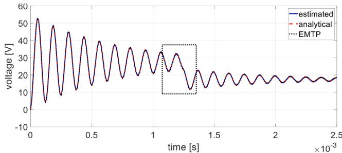  
(a)

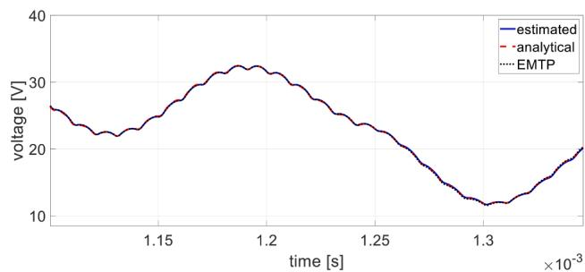

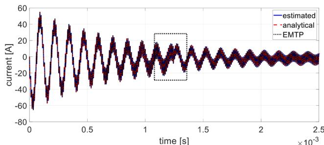

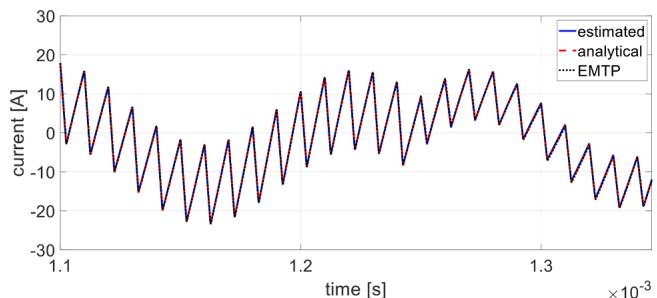  
  
Fig. 4. Transient response of DC-DC buck converter for test case A: (a) capacitor (output) voltage, (b) zoom-in of capacitor voltage at transition period, (c) inductor current, (d) zoom-in of inductor current at transition period.

Table 2 Max. relative differences with respect to EMTP for test case A.   

<table><tr><td>Waveform</td><td>Modeling approach
Analytical [%]</td><td>Measurement based [%]</td></tr><tr><td>Capacitor voltage</td><td>1.1315</td><td>0.3750</td></tr><tr><td>Inductor current</td><td>3.0012</td><td>1.3362</td></tr></table>

considered in this plot is 100 Hz – 200 kHz. Besides evidencing a good match, the plot in Fig. 5 also shows the main frequencies involved in the responses: resonant frequency of the circuit and switching frequency of the semiconductive devices.

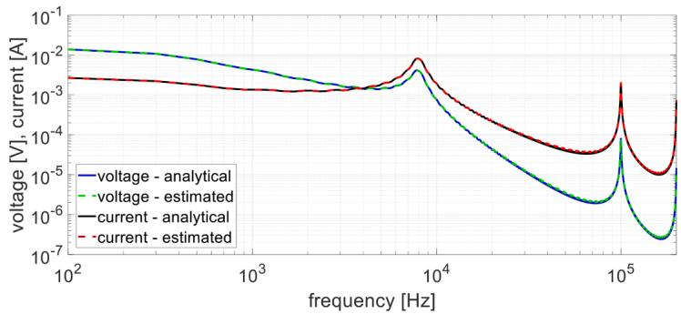  
Fig. 5. Frequency spectrum plots of capacitor voltage and inductor current for test case A.

Table 3 Parameters of DC-DC boost converter for test case B.   

<table><tr><td>Parameter</td><td>Inductance (L) [μH]</td><td>Capacitance (C) [μF]</td><td>Load (RL) [Ω]</td><td>Switching period (1/T) [kHz]</td><td>Duty cycle (d)</td></tr><tr><td>Value</td><td>70</td><td>40</td><td>12.5</td><td>100</td><td>0.4</td></tr></table>

# 4.2. Boost converter

The second test case corresponds to a DC-DC boost converter with the parameters listed in Table 3. This converter operates for an input voltage range of 12 V – 200 V and a load variation of 1 Ω – 20 Ω. As in the previous example, these ranges are only defined for the sake of testing the procedure. The four tests applied in this case correspond to the following source/load combinations:

• 12 $\mathrm { V } - 5 \Omega ,$   
• $2 0 \mathrm { ~ V ~ } - 1 \ \Omega ,$   
• $2 0 0 \mathrm { ~ V ~ } - 2 0 \Omega ,$ and   
• $1 0 0 \mathrm { ~ V ~ } - 1 0 \Omega .$

EMTP is used again to simulate the measured terminal voltage and currents from these tests. The reconstructed and analytical models are tested considering a DC excitation of 120 V for the first 2.5 ms that increases to 170 V for the remaining of the simulation period. The load is 12.5 Ω. The results from the estimation (measurement-based) and analytical procedures are compared against EMTP, as shown in Fig. 6 and in Table 4. As in the previous case, both estimation and analytical methods offer very accurate results.

Further comparison regarding the frequency content of the signals is shown in Fig. 7, where the frequency spectrum plot of capacitor voltage and inductor current magnitudes are shown, comparing analytical and estimated results. It can be noticed that the main frequencies are accurately preserved by both models. However, the analytical model struggles to produce an appropriate spectrum at high frequencies since, for the boost converter, the switching frequency is added in a synthetic manner by means of a ripple function.

# 5. Conclusions

Two Laplace domain-based two-port modeling approaches for DC-DC buck and boost converters were presented and evaluated in this paper: (1) an analytical approach from mode averaging and inclusion of switching effects, and (2) a measurement-based approach using the minimum least squares method to reconstruct a model from terminal measurements for a series of simple tests. Our results for two cases demonstrate high accuracy of both approaches when compared with EMTP simulations.

The small differences observed between the base solution (EMTP) and the analytical model are mainly due to the way in which the

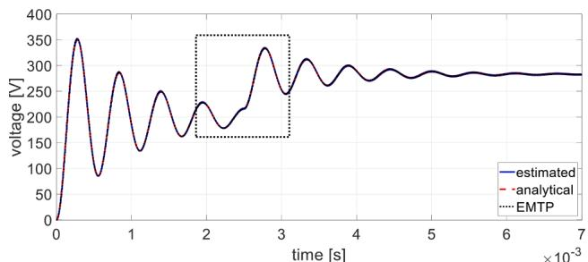  
(a)

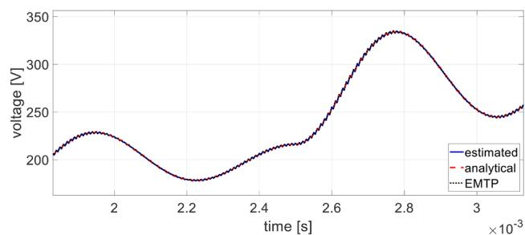

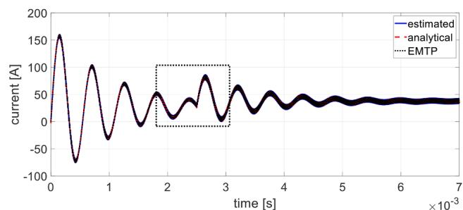

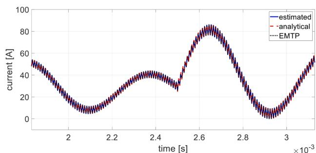  
  
Fig. 6. Transient response of DC-DC boost converter for test case B: (a) capacitor (output) voltage, (b) zoom-in of capacitor voltage at transition period, (c) inductor current, (d) zoom-in of inductor current at transition period.

Table 4 Max. relative differences with respect to EMTP for test case B.   

<table><tr><td>Waveform</td><td>Modeling approach
Analytical [%]</td><td>Measurement based [%]</td></tr><tr><td>Capacitor voltage</td><td>1.3185</td><td>0.1927</td></tr><tr><td>Inductor current</td><td>2.5132</td><td>0.2847</td></tr></table>

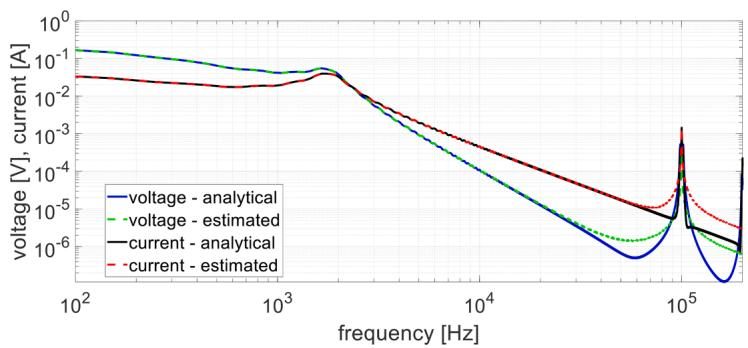  
Fig. 7. Frequency spectrum plot of capacitor voltage and inductor current for test case B.

switching frequency is introduced. i.e., adding a switching function or ripple factor to the mode average approach. On the other hand, the differences between EMTP and the reconstructed (measurement-based) model are due to the reconstruction approach itself. A more accurate model could be achieved if additional tests are used to obtain terminal measurements.

Regarding the proposed measurement-based modeling approach, since the purpose of this paper is to provide an initial assessment of the applicability of this approach, EMTP was used to produce simulated measurements. The use of actual experimental measurements, rather than simulated ones, would be very beneficial as a next step to show how the method performs with more realistic inputs. This can also help to study the effect of variations in operational conditions of the converters over time for a more practical model reconstruction. This could help monitor the converter’s performance over time or detect an incipient fault, among other applications.

Finally, future work will focus on expanding the application of these models to study converter-grid interaction over a wide frequency range for EMT and stability studies.

# CRediT authorship contribution statement

H. Alameri: Conceptualization, Methodology, Software, Validation, Investigation, Writing – review & editing, Visualization. P. Gomez: Conceptualization, Methodology, Software, Validation, Investigation, Resources, Writing – original draft, Visualization, Supervision.

# Declaration of Competing Interest

The authors declare that they have no known competing financial interests or personal relationships that could have appeared to influence the work reported in this paper.

# Data availability

Data will be made available on request.

# References

[1] S. Debnath et al., “High penetration power electronics grid: modeling and simulation gap analysis,” Oak Ridge National Laboratory, Oak Ridge, TN, Tech. Rep. ORNL/TM-2020/1580, August 2020.

[2] J. Segundo-Ramirez, A. Bayo-Salas, M.A. Esparza, J. Beerten, P. Gomez, ´ Frequency domain methods for accuracy assessment of wideband models in electromagnetic transient stability studies, IEEE Trans. Power Deliv. 35 (1) (2020) 71–83. February.   
[3] North American Electric Reliability Corporation (NERC), “Reliability guideline - improvements to interconnection requirements for BPS-connected inverter-based resources”, December 2022. Available online: https://www.nerc.com/comm /RSTC_Reliability_Guidelines/Reliability_Guideline_-_Interconnection_Requirement s-redline_June_16_2022.pdf.   
[4] R. Henriquez-Auba, J.D. Lara, D.S. Callaway, C. Barrows, Transient simulations with a large penetration of converter-interfaced generation: scientific computing challenges and opportunities, IEEE Electr. Mag. 9 (2) (2021) 72–82. June.   
[5] V. Valdivia, A. Lazaro, A. Barrado, P. Zumel, C. Fernandez, M. Sanz, Black-box modeling of three-phase voltage source inverters for system-level analysis, IEEE Trans. Ind. Electron. 59 (9) (2012) 3648–3662. Sept.   
[6] W. Zhou, et al., A robust circuit and controller parameters’ identification method of grid-connected voltage-source converters using vector fitting algorithm, IEEE J. Emerg. Sel. Top. Power Electron. 10 (3) (2022) 2748–2763. June.   
[7] R. Trinchero, I.S. Stievano, F.G. Canavero, Simulation of buck converters via numerical inverse Laplace transform, in: 2017 IEEE 21st Workshop on Signal and Power Integrity (SPI), Baveno, Italy, 2017.   
[8] A. Ramirez, G. Combariza, Reduced-sample numerical Laplace transform for transient and steady-state simulations: application to networks involving power electronic converters, Int. J. Electr. Power Energy Syst. 109 (2019) 480–494. July.   
[9] A. Ramirez, Frequency domain modeling of photovoltaic systems for transient analysis, IEEE Trans. Power Deliv. 37 (5) (2022). October.   
[10] M. Cespedes, J. Sun, Impedance modeling and analysis of grid-connected voltagesource converters, IEEE Trans. Power Electron. 29 (3) (2014) 1254–1261. March.   
[11] X. Wang, F. Blaabjerg, Harmonic stability in power electronic-based power systems: concept, modeling, and analysis, IEEE Trans. Smart Grid 10 (3) (2019) 2858–2870. May.   
[12] C. Zhang, M. Molinas, A. Rygg, X. Cai, Impedance-based analysis of interconnected power electronics systems: impedance network modeling and comparative studies of stability criteria, IEEE J. Emerg. Sel. Top. Power Electron. 8 (3) (2020).   
[13] L. Fan, Z. Miao, P Koralewicz, S. Shah, V. Gevorgian, Identifying DQ-domain admittance models of a 2.3-MVA commercial grid-following inverter via frequency-domain and time-domain data, IEEE Trans. Energy Convers. 36 (3) (2021) 2463–2472. Sept.   
[14] L. Fan, Z. Miao, Time-domain measurements-based DQ-frame admittance model identification of inverter-based resources, IEEE Trans. Power Syst. 36 (3) (2021) 2211–2221. May.   
dynamic simulation of inverter-based resources using numerical Laplace transform, in: 53rd North American Power Symposium (NAPS), College Station, Texas, 2021. November 14-16.   
[16] H. Alameri, P. Gomez, Laplace domain modeling of power components for transient converter-grid interaction studies, in: 53rd North American Power Symposium (NAPS), College Station, Texas, 2021. November 14-16.   
[17] D.W. Hart, Power Electronics, The McGraw-Hill, NY, USA, 2011.   
[18] P. Gomez, ´ F.A. Uribe, The numerical Laplace transform: an accurate technique for analyzing electromagnetic transients on power system devices, Int. J. Electric. Power Energy Syst. 31 (2009) 116–123. Issues 2-3February-March.   
[19] Lsqminnorm - Minimum Norm Least-Squares Solution to Linear Equation, The MathWorks, Inc., 2022. Available online: https://www.mathworks.com/help/ matlab/ref/lsqminnorm.html.   
[20] K.S. Tam, V.D. Narayan, Modeling of power electronic systems with EMTP, NASA Tech. Memo. 102375 (1989). December.