# Extending the Frequency Bandwidth of Transient Stability Simulation Using Dynamic Phasors

M. A. Kulasza , U. D. Annakkage , Senior Member, IEEE, and C. Karawita , Senior Member, IEEE

Abstract—This paper presents a novel approach to dynamic phasor-based transient stability simulation. The proposed method is based on the modified nodal analysis (MNA) approach to circuit simulation, which is used to construct continuous differentialalgebraic equations (DAEs). The proposed method makes use of the stamp technique, which makes it possible to construct a general purpose MNA-based simulator. Stamp-based models for common power system components are derived in this work. A new MNAbased synchronous machine model is presented, which represents machines as nonlinear inductances instead of subtransient equivalents. The resultant continuous DAEs are numerically solved using the general purpose variable step and variable order library IDA. Simulation results from the IEEE 68 bus test system, a real 400 bus power system, and the IEEE 39 bus test system with an embedded HVdc transmission system demonstrate that the proposed method is suitable for large ac networks with power electronic devices. The results demonstrate good agreement between the proposed method and electromagnetic transient (EMT) simulation. The results also demonstrate that the proposed method is fast and scalable with CPU times that are up to 200 times faster than EMT simulation.

Index Terms—Dynamic phasors, modified nodal analysis, power system transient stability, power system simulation.

# I. INTRODUCTION

T RANSIENT stability is defined as the ability of a powersystem to maintain stability following disturbances such as system to maintain stability following disturbances such as bus faults [1]. Historically, transient stability has been concerned with low frequency electromechanical oscillations in the range of 0Hz. The first transient stability simulation computer programs used admittance matrices to represent electrical networks, which became known as the quasistationary assumption [2], [3]. This assumption made stability analysis of early power systems feasible because it relaxes out high frequency network dynamics, which are unnecessary for analysis of low frequency electromechanical oscillations [1]. Removing a network’s high frequency characteristics makes it feasible to conduct long duration simulations of large power system models.

Manuscript received October 12, 2020; revised February 17, 2021 and May 18, 2021; accepted June 20, 2021. Date of publication July 2, 2021; date of current version December 23, 2021. This work was supported in part by the RTDS Technologies Inc. and in part by the TransGrid Solutions Inc., Winnipeg, Manitoba, Canada. Paper no. TPWRS-01721-2020. (Corresponding author: M. A. Kulasza.)

M. A. Kulasza and U. D. Annakkage are with the Department of Electrical and Computer Engineering, University of Manitoba, Winnipeg, MB R3T 5V6, Canada (e-mail: umkulasm@myumanitoba.ca; Udaya.Annakkage@umanitoba.ca).

C. Karawita is with TransGrid Solutions Inc., Winnipeg, MB R3T 6C2, Canada (e-mail: ckarawita@tgs.biz).

Digital Object Identifier 10.1109/TPWRS.2021.3094451

Subsynchronous oscillations associated with generator turbines, series capacitors, HVdc systems, and renewable generation are a major concern in modern power systems. Torsional modes with frequencies greater than 10Hz can be excited by HVdc system controls [4]. Subsynchronous resonance resulting in oscillations with frequencies greater than 20Hz have been observed in systems with wind generation located near series compensated lines [5]. These dynamics cannot be analyzed using conventional transient stability analysis as they include frequencies that cannot be reliably simulated using the quasistationary assumption [6].

The accurate and detailed study of power system dynamics has generally been associated with electromagnetic transient (EMT) simulators. EMT simulation tends to be computationally intensive, so simulation of large system models requires methods such as parallel processing. An alternative approach is to augment existing transient stability simulation using dynamic phasors. Dynamic phasors are a natural extension of steady state phasors that model dynamics while retaining the advantages of carrier frequency demodulation [3]. Additionally, many existing models can be extended to fit into dynamic phasor-based simulation. Previous research in small signal stability analysis has demonstrated the potential of dynamic phasors for improving the accuracy of quasistationary-based analysis [7]–[9].

The equations that describe a power system’s dynamics are generally differential-algebraic equations (DAEs) of the form

$$
\mathbf {F} (t, \mathbf {y}, \dot {\mathbf {y}}) = 0, \tag {1}
$$

which are typically sparse and stiff. Implicit numerical methods with error control and variable step properties are ideal for power system simulation because a small time step can be used to accurately pass through high frequency transients. The time step is then automatically increased to simulate electromechanical transients.

The methods used by conventional transient stability simulators to construct and solve (1) cannot be used with dynamic phasors since they are inherently tied to the quasistationary assumption. Existing circuit simulation techniques can be used to develop a new approach since it is possible to show that an instantaneous circuit is structurally similar to its dynamic phasor equivalent [10]. Numerical integrator substitution (NIS) forms the foundation for EMT simulation and has been explored for dynamic phasor-based simulation in previous research [11]–[13]. The main drawback of NIS is that local integration embeds the simulation time step into a system’s equations, which makes variable step simulation difficult and inefficient.

An alternative to NIS is to directly construct a set of continuous equations of the form given by (1). A dynamic phasor-based simulation method based on the sparse tableau approach that is well-suited to parallel processing has been previously investigated [14]. A novel dynamic phasor-based simulation approach was developed in previous reseach, which was used to simulate the IEEE 39 bus test system for both balanced and unbalanced disturbances [15], [16]. A limitation of the aforementioned methods is that the number of variables and equations rapidly grows as system size increases due to the amount of redundancy in their mathematical models.

The main contribution of this work is a new scalable transient stability simulation method based on dynamic phasors and modified nodal analysis that is suitable for realistic power system models. Necessary background information is provided in Section II and details on the method’s algorithm are presented in Section III. Another contribution of this work is the practical considerations required for the simulation of equations generated using the proposed method, which are included in Section IV. Finally, Section V provides test results for the IEEE 68 bus test system, a real 400 bus test system, and the IEEE 39 bus test system with an embedded HVdc transmission system.

# II. BACKGROUND

The models presented in Section III are based on dynamic phasors, which require the background information and properties discussed in Section II-A. These components are then assembled into a system of DAEs using modified nodal analysis, which is briefly described in Section II-B. Finally, solving a system’s DAEs and implementation specific details require background information on the type of numerical solution used in this work, which is included in Section II-C.

# A. Dynamic Phasors

Several dynamic phasor frameworks have been developed that differ in their mathematical definition to address a wide variety of system models. The first formalized approach was developed for balanced three-phase systems and is based on the Blondel transformation [3]. A general framework suitable for single-phase and unbalanced systems was later proposed based on analytic signals and the Hilbert transform [17]. A great deal of work has been conducted using the Hilbert transform-based dynamic phasor framework, most notably in frequency adaptative simulation [18]. Another dynamic phasor framework emerged from a seemingly unrelated area of research known as generalized state space averaging [19]. This framework is not limited to the dc and fundamental components of a system model since it is based on a Fourier series with time dependent coefficients. Research using this framework has seen a wide range of applications, including HVdc and flexible ac transmission system (FACTS) [20], [21], SSR analysis [22], and hybrid simulation [23], [24].

The method proposed in this work was developed with the goal of simulating network level transients in large power system models. Therefore, it was considered sufficient to use the balanced three phase dynamic phasor framework. This framework

uses the Blondel transformation to define a dynamic phasor operator $\mathcal { P }$ such that given a general real sinusoidal signal of the form

$$
x (t) = X (t) \cos (\omega_ {0} t + \delta (t)), \tag {2}
$$

$\mathcal { P }$ computes the dynamic phasor, $\overline { { X } } ( t )$ , of $x ( t )$ , defined by

$$
\bar {X} (t) = \mathcal {P} (x (t)) = X (t) e ^ {j \delta (t)}. \tag {3}
$$

The reader is referred to the original work for details regarding the definition of P. The sinusoidal counterpart to $\overline { { X } } ( t )$ can be recovered by re-introducing the carrier as follows

$$
x (t) = \operatorname {R e} \left(\bar {X} (t) e ^ {j \omega_ {0} t}\right). \tag {4}
$$

The defining characteristic of dynamic phasors is the manner in which they treat the derivative of $\overline { { X } } ( t )$ . Dynamic phasor-based models define a phasor’s derivative as

$$
\frac {d}{d t} \mathcal {P} (x (t)) = \dot {\overline {{X}}} (t) + j \overline {{X}} (t), \tag {5}
$$

which is the dynamic phasor differentiation property expressed in per unit time [3]. Models based on the quasistationary assumption use a standard static phasor representation of network variables, which is equivalent to (5) with ${ \dot { \overline { { X } } } } = 0$ .

# B. Modified Nodal Analysis

Modified nodal analysis (MNA) is a natural extension of standard nodal analysis that accommodates current controlled components [25]. In standard nodal analysis, the voltage at $n - 1$ nodes of an n node network are used as y, with one node serving as the reference node. Kirchoff’s current law (KCL) at each node is used to construct F, where branch currents are written in terms of node voltages using constitutive relationships. The main issue with standard nodal analysis is that it breaks down when a branch current cannot be expressed in terms of the network’s voltages. This break down occurs for components as simple as linear inductors when constructing continuous DAEs of the form (1).

MNA accommodates current controlled components by including their branch currents as variables in y. The branch constitutive relationships are included in F to account for each additional variable. MNA also uses KCL at each node as a starting point for F and proceeds by eliminating as many branch currents as possible. Furthermore, the MNA process does not restrict y to node voltages and branch currents. For example, a variant of MNA known as charge-oriented MNA includes capacitor charge and inductor flux in y [26].

A feature of MNA that makes it well-suited to general circuit simulation is that a circuit’s equations may be constructed using structural information through the stamp concept [27]. Stamps act like a component’s blue-print in a system of equations like the form given by (1). Stamps are often visualized using generic matrices and abstract indexes, but their most important feature is defining a set of constraint equations relating internal variables to node voltages.

# C. Numerical Solution

Backward differentiation formula (BDF) methods are a common choice for numerically solving DAEs [28]. The BDF family of methods is designed to be particularly well-suited to solving stiff systems of equations and has been used in a number of previous research applications involving transient stability simulation [29], [30]. BDF methods have also been used in EMT simulation with predictors specifically tuned for sinusoidally varying quantities [31].

The BDF method with order k when applied to (1) has general form

$$
\mathbf {F} \left(t, \mathbf {y} _ {n}, \frac {1}{\beta_ {0} h} \sum_ {j = 0} ^ {k} \alpha_ {j} \mathbf {y} _ {n - j}\right) = \mathbf {0}, \tag {6}
$$

where coefficients $\beta _ { 0 }$ and $\alpha _ { j }$ depend on k [28]. It can be shown that the BDF method with order $k = 1$ is equivalent to the backward Euler method. In general, (6) is a nonlinear set of equations and a method such as Newton iterations must be used to find ${ \bf y } _ { n }$ . The Jacobian, J, for (6) is found by differentiating F in terms of yn and letting γk = ${ \bf y } _ { n }$ $\begin{array} { r } { \gamma _ { k } = \frac { \alpha _ { 0 } } { \beta _ { 0 } h } } \end{array}$ α0β h , which has the general α0 form

$$
\mathbf {J} = \frac {\partial \mathbf {F}}{\partial \mathbf {y} _ {n}} = \frac {\partial \mathbf {F}}{\partial \mathbf {y}} + \gamma_ {k} \frac {\partial \mathbf {F}}{\partial \dot {\mathbf {y}}}. \tag {7}
$$

# III. METHOD

Minimizing the time to compute F is important for simulations using error control as F needs to be computed several times per step. The dynamic phasor-based simulation method proposed in this work uses MNA to construct a set of DAEs, $\mathbf { F } \in \mathbb { R } ^ { n }$ , that has the partitioned form

$$
\mathbf {F} (t, \mathbf {y}, \dot {\mathbf {y}}) = \mathbf {u} + \mathbf {T} \dot {\mathbf {y}} + \mathbf {A} \mathbf {y} + \mathbf {f} (t, \mathbf {y}, \dot {\mathbf {y}}) = \mathbf {0}. \tag {8}
$$

The Jacobian is derived by substituting (8) into (7), which is

$$
\mathbf {J} = \mathbf {A} + \frac {\partial \mathbf {f}}{\partial \mathbf {y}} + \gamma_ {k} \left(\mathbf {T} + \frac {\partial \mathbf {f}}{\partial \dot {\mathbf {y}}}\right). \tag {9}
$$

Partitioning a system’s equations localizes the linear contributions into two sparse matrix products, which can be performed in parallel to improve performance. Furthermore, routines for strictly linear components, such as branches and loads, are not required to compute F. This property is important as experimental results demonstrated that the number of routines that must be accessed when F is computed has a significant impact on simulation time.

The vector $\mathbf { y } \in \mathbb { R } ^ { n }$ is the system’s variables defined over the set of real numbers. Rotor and control equations are defined in terms of real-valued quantities. Consequently, the variables associated with those equations are directly included in y. Complex variables are associated with a system’s network equations. Complex variables and equations are included in y and F by splitting them into two real variables and equations using the same approach as other transient stability simulators [1]. However, all stamps are defined in terms of complex quantities as the procedure to split them can be handled automatically by an assembly program.

The vector $\mathbf { u } \in \mathbb { R } ^ { n }$ represents the constant inputs to a system’s equations, such as the voltage at an infinite bus or the field voltage for a generator without an exciter. The sparse matrices $\mathbf { A } \in \mathbb { R } ^ { n \times n }$ and $\mathbf { T } \in \mathbb { R } ^ { n \times n }$ represent the constant coefficients for y and y˙ , respectively. For example, the coefficients associated with lines and transformers are included in a system’s equations through A and T. Finally, the vector $\mathbf { f } \in \mathbb { R } ^ { n }$ represents the nonlinear and time-dependent components of a system’s equations. For example, the electromagnetic torque in a generator’s speed equation is included in a system’s equations using f because it is a nonlinear combination of the generator’s stator current and air-gap flux.

Generators contribute the most significant number of real auxiliary variables through their rotor and control equations. Rotor variables include the flux in field and damper windings along with the rotor’s angle and speed. Control variables depend on the type of exciter and governor used to model a generator. The MNA approach offers a great deal of flexibility with regards to variable selection because any number of variables can be included to simplify equations. However, the convenience of additional variables must be balanced with the hidden constraints and numerical difficulties that can be introduced by algebraic equations [28]. Additional variables in common models like generators can also have a negative impact on simulation performance because they increase the size of a set of DAEs. Therefore, state equations were used to model generators and their controls.

A system’s complex network variables includes all bus voltages, which are predominantly differential due to the charging susceptance associated with transmission lines. Most practical models also include algebraic bus voltages, which are the result of buses without a capacitive connection to ground [26]. Inductive currents related to branches, loads, and stator windings are also differential network variables. Most bus voltages and branch currents are independent because transient stability models generally consist of capacitive buses separated by inductive currents.

Network constraints and interactions between different devices are included in F through KCL. The equation associated with a network voltage is the current balance equation at its corresponding bus. Consequently, building stamps for device models involves defining the current at each port of a device in terms of bus voltages and auxiliary variables. Sections III-A and III-B will outline device models for a linear branch component and synchronous machine, respectively. These models will illustrate examples where port currents are trivially related to network and auxiliary variables. An HVdc transmission system model is presented in Section III-C, which illustrates a model where port currents are complicated combinations of network and auxiliary variables.

# A. Linear Branch

Fig. 1 illustrates a general linear series connected branch that can be used to represent linear components in power system models. For example, a transmission line modeled as a pi-section requires three of these components. The middle section connecting the two terminal buses usually includes values for R and

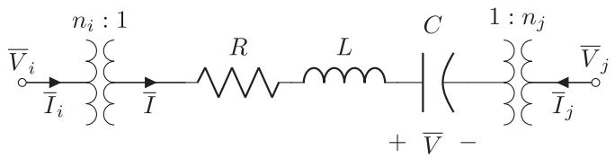  
Fig. 1. General linear branch.

$L ,$ with $C = 0$ and $n _ { i } = n _ { j } = 1$ . The charging capacitance is modeled with two elements connected to ground at each bus. These shunt elements have a value for $C$ equal to half the charging capacitance, $R = L = 0 .$ , and $n _ { i } = n _ { j } = 1$ .

The general stamp for the component shown in Fig. 1 assumes that R, L, and C are all nonzero. The inductor current and capacitor voltage are selected as auxiliary variables with constraint equations

$$
L \dot {\bar {I}} + (R + j L) \bar {I} + \bar {V} - \frac {\bar {V} _ {i}}{n _ {i}} + \frac {\bar {V} _ {j}}{n _ {j}} = 0 \quad \text {a n d} \tag {10}
$$

$$
C \dot {\overline {{V}}} + j C \overline {{V}} - \bar {I} = 0. \tag {11}
$$

This component is included in the KCL equations associated with nodes i and $j$ using currents $\begin{array} { r } { \overline { { I } } _ { i } = \frac { \overline { { I } } } { n _ { i } ^ { * } } } \end{array}$ and $\begin{array} { r } { \overline { { I } } _ { j } = \frac { - \overline { { I } } } { n _ { i } ^ { * } } } \end{array}$ n∗j , respectively. The variable $\overline { V }$ and (11) are simply omitted when $C = 0$ . An expression for I is obtained using (11), which is substituted into (10) and the expressions for ${ \overline { { I } } } _ { i }$ and $\overline { { I } } _ { j }$ when L = 0. Finally, no auxiliary variables are required when $R = L = 0$ or $L = C = 0$ and the branch is added either as a capacitance to A and T or as a conductance to A.

# B. Synchronous Machine

An early dynamic phasor-based synchronous machine model incorporates stator dynamics by adding a derivative component to a machine’s equivalent subtransient voltage source [32]. Another model for shifted frequency analysis uses the voltage behind reactance approach, which is also based on the subtransient source concept [33], [34]. An alternative general model is presented in this work that is not dependent on equivalent sources since a machine’s nonlinear equations can be included in (1). Machines appear as nonlinear inductances from the perspective of electrical networks, which is an important observation when diagnosing and analyzing numerical failures in a system’s solution.

The stamp for a synchronous machine may be derived by first considering the stator’s differential equations. Let $\psi _ { \mathrm { d } }$ and $\psi _ { \mathrm { q } }$ be the d-axis and q-axis stator fluxes, respectively. Let $i _ { \mathrm { d } }$ and $i _ { \mathrm { q } }$ be the stator currents and $v _ { \mathrm { d } }$ and $v _ { \mathrm { q } }$ be the terminal voltages defined in a similar manner. Finally, let $\omega _ { \mathrm { r } }$ be the machine’s rotor speed and let $R _ { \mathrm { a } }$ be the armature resistance. The stator’s differential equations are

$$
\dot {\psi} _ {\mathrm {d}} - \omega_ {\mathrm {r}} \psi_ {\mathrm {q}} + R _ {\mathrm {a}} i _ {\mathrm {d}} - v _ {\mathrm {d}} = 0 \text {a n d} \tag {12}
$$

$$
\dot {\psi} _ {\mathrm {q}} + \omega_ {\mathrm {r}} \psi_ {\mathrm {d}} + R _ {\mathrm {a}} i _ {\mathrm {q}} - v _ {\mathrm {q}} = 0, \tag {13}
$$

which are defined on the rotor’s frame of reference [1].

Let $\delta _ { \mathrm { r } }$ be the machine’s rotor angle, which is equal to the angle between the rotor’s q-axis and the network’s real axis. Let $x _ { \mathrm { d } }$ and $x _ { \mathrm { q } }$ be two arbitrary d-axis and q-axis quantities on the rotor’s frame of reference, respectively. Let $\overrightharpoon { X }$ be the dynamic phasor in the network’s frame of reference corresponding to $x _ { \mathrm { d } }$ and $x _ { \mathrm { q } } .$ $\overline { { X } }$ is related to $x _ { \mathrm { d } }$ and $x _ { \mathrm { q } }$ by the rotation

$$
\bar {X} = - j e ^ {j \delta_ {\mathrm {r}}} \left(x _ {\mathrm {d}} + j x _ {\mathrm {q}}\right), \tag {14}
$$

which can be reversed through multiplication by $j e ^ { - j \delta _ { \mathrm { r } } }$ ,

$$
x _ {\mathrm {d}} + j x _ {\mathrm {q}} = j e ^ {- j \delta_ {\mathrm {r}}} \bar {X}. \tag {15}
$$

Substituting (12) and (13) into (14) and simplifying gives the stator’s differential equation in the network’s frame of reference and in terms of dynamic phasors,

$$
\dot {\overline {{\psi}}} + j \overline {{\psi}} + R _ {\mathrm {a}} \bar {I} - \bar {V} = 0. \tag {16}
$$

Either $\overline { { \psi } }$ or $\overrightharpoon { I }$ must be eliminated from (16). They are related through the stator’s leakage reactance, $L _ { \mathrm { l } } .$ and air-gap flux, $\overline { { \psi } } _ { \mathrm { a } } ,$

$$
\bar {\psi} = \bar {\psi} _ {\mathrm {a}} + L _ {1} \bar {I}. \tag {17}
$$

$\psi _ { \mathrm { a } }$ is a nonlinear combination of rotor variables, which implies that the stator’s differential equation is nonlinear regardless of variable selection. Selecting $\dot { \bar { I } }$ as the stator’s variable ensures that the nonlinearity introduced by $\overline { { \psi } } _ { \mathrm { a } }$ remains localized to the stator’s equations.

The final form of the stator’s differential equation is derived by substituting (17) into (16). The stator’s differential equation is

$$
L _ {1} \dot {\overline {{I}}} + \left(R _ {\mathrm {a}} + j L _ {1}\right) \overline {{I}} + \dot {\overline {{\psi}}} _ {\mathrm {a}} + j \overline {{\psi}} _ {\mathrm {a}} - \overline {{V}} = 0, \tag {18}
$$

which implies that the stator is an inductive branch with a mutual link to $\overline { { \psi } } _ { \mathrm { a } }$ . This observation has important implications in Jacobian conditioning, which will be discussed in Section IV-C.

A synchronous machine’s rotor dynamics can be modeled using the same differential equations as conventional transient stability simulation. The approach shown here eliminates one damper flux variable on each axis in favour of the air-gap flux [35]. Let quantities belonging to the rotor be defined in the usual manner using subscripts kd and kq [1]. Define d-axis air gap constants αad = 1Lad $\begin{array} { r } { \alpha _ { \mathrm { a d } } \overset { \cdot } { = } \frac { 1 } { L _ { \mathrm { a d } } } + \overset { \cdot } { \frac { 1 } { L _ { \mathrm { f d } } } } } \end{array}$ + and $\begin{array} { r } { \beta _ { \mathrm { a d } } = \alpha _ { \mathrm { a d } } + \frac { 1 } { L _ { \mathrm { l d } } } } \end{array}$ L1d . In a similar manner, define q-axis air gap constants αaq $\begin{array} { r } { \alpha _ { \mathrm { a q } } = \frac { \mathrm { ~ \ddot { ~ } } } { L _ { \mathrm { a q } } } + \frac { 1 } { L _ { \mathrm { l q } } } } \end{array}$ Laq L1q and βaq = αaq + 1L2q $\begin{array} { r } { \beta _ { \mathrm { a q } } = \alpha _ { \mathrm { a q } } + \frac { 1 } { L _ { \mathrm { 2 q } } } } \end{array}$ . The rotor’s differential equations are

$$
\dot {\psi} _ {\mathrm {f d}} + \frac {R _ {\mathrm {f d}}}{L _ {\mathrm {f d}}} \left(\psi_ {\mathrm {f d}} - \psi_ {\mathrm {a d}}\right) - v _ {\mathrm {f d}} = 0, \tag {19}
$$

$$
\beta_ {\mathrm {a d}} \dot {\psi} _ {\mathrm {a d}} - i _ {\mathrm {d}} - \frac {\dot {\psi} _ {\mathrm {f d}}}{L _ {\mathrm {f d}}} + \frac {R _ {1 \mathrm {d}}}{L _ {1 \mathrm {d}}} \left(\alpha_ {\mathrm {a d}} \psi_ {\mathrm {a d}} - i _ {\mathrm {d}} - \frac {\psi_ {\mathrm {f d}}}{L _ {\mathrm {f d}}}\right) = 0, \tag {20}
$$

$$
\dot {\psi} _ {1 q} + \frac {R _ {1 q}}{L _ {1 q}} \left(\psi_ {1 q} - \psi_ {\mathrm {a q}}\right) = 0, \text {a n d} \tag {21}
$$

$$
\beta_ {\mathrm {a q}} \dot {\psi} _ {\mathrm {a q}} - i _ {\mathrm {q}} - \frac {\dot {\psi} _ {1 \mathrm {q}}}{L _ {1 \mathrm {q}}} + \frac {R _ {2 \mathrm {q}}}{L _ {2 \mathrm {q}}} \left(\alpha_ {\mathrm {a q}} \psi_ {\mathrm {a q}} - i _ {\mathrm {q}} - \frac {\psi_ {1 \mathrm {q}}}{L _ {1 \mathrm {q}}}\right) = 0. \tag {22}
$$

Magnetic saturation can be included in the machine model by adjusting (20) and (22) [35]. However, EMT and transient stability

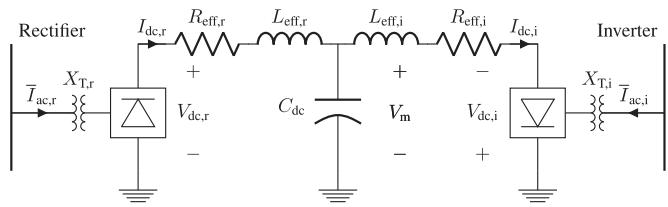  
Fig. 2. HVdc transmission system model.

models handle saturation using different approaches. Therefore, saturation is ignored in the cases presented in Section V for the purposes of comparison across different simulation platforms.

The rotor’s physical motion is modeled using the mechanical swing equations, which are given by

$$
\dot {\delta} _ {\mathrm {r}} - \omega_ {\mathrm {r}} = 0 \text {a n d} \tag {23}
$$

$$
2 H \dot {\omega} _ {\mathrm {r}} + D \omega_ {\mathrm {r}} + T _ {\mathrm {m}} - \psi_ {\mathrm {a d}} i _ {\mathrm {q}} + \psi_ {\mathrm {a q}} i _ {\mathrm {d}} = 0. \tag {24}
$$

The only complex auxiliary variable included in the synchronous machine model is the stator current, I. The constraint equation associated with $\overline { I }$ is the stator’s differential equation, (18). If η is the ratio of a synchronous machine’s MVA base to the system’s MVA base, then the machine is included in the KCL equation for its terminal bus using the terminal current $\overline { { I } } _ { \mathrm { t } } = \eta \overline { { I } }$ .

The real auxiliary variables for the round rotor synchronous machine model are ψfd, ψad, ψ2q, $\psi _ { \mathrm { a q } } , \delta _ { \mathrm { r } }$ , and ωr with (19) through (24) as their corresponding constraint equations. A salient pole machine can be modeled by eliminating (21) and eliminating all references to 1q damper variables [1].

# C. HVdc Transmission System

The HVdc model implemented in this work is illustrated in Fig. 2, which is a monopolar dc transmission system based on the CIGRE HVdc benchmark model [36]. A dynamic phasor-based model was developed using other transient and small signal stability models [37], [38]. All dc variables and equations are defined in terms of physical quantities instead of per unit. The model presented in this section includes details regarding the dc system’s equations. The filters can be modeled as combinations of the linear branch component presented in Section III-A. Control system details were not included because control equations are implemented as a set of state equations that are not dependent on dynamic phasors. Furthermore, control equations are unique to each HVdc installation.

Assume that a converter has N bridges and that its corresponding transformer has a base voltage of $V _ { \mathrm { b a s e } }$ on the converter side with a unity per unit tap ratio. Let $\overline { V }$ be the converter’s bus voltage in per unit and let θ be the angle of ${ \overline { { V } } } .$ . Let $\phi$ be the angle measured by the converter’s phase locked loop, which is equal to θ in steady state. Let α be the converter’s firing angle as determined by its control system. The converter’s overlap angle, $\mu ,$ i s

$$
\mu = \operatorname {C o s} ^ {- 1} \left(\cos (\alpha + \theta - \phi) - \frac {\sqrt {2} X _ {\mathrm {T}} I _ {\mathrm {d c}}}{V _ {\text {b a s e}} | V |}\right) - (\alpha + \theta - \phi). \tag {25}
$$

The converter’s dc voltage, $V _ { \mathrm { d c } } .$ , neglecting the effects of commutation is

$$
V _ {\mathrm {d c}} = \frac {3 \sqrt {2} N V _ {\text {b a s e}}}{\pi} | V | \cos (\alpha + \theta - \phi). \tag {26}
$$

The effects of commutation on the dc system are included through the effective dc resistance and inductance. The effective dc resistance, $R _ { \mathrm { e f f } } ,$ is a combination of the dc line resistance, $R _ { \mathrm { d c } }$ , along with the commutation resistance, which models the dc voltage drop due to commutation [21]. The effective dc resistance is

$$
R _ {\mathrm {e f f}} = R _ {\mathrm {d c}} + \frac {3 N X _ {\mathrm {T}}}{\pi}. \tag {27}
$$

Similarly, the effective dc inductance, $L _ { \mathrm { e f f } } .$ is a combination of the dc line inductance, $L _ { \mathrm { d c } } .$ , and the average value of the transformer’s inductance as seen by the dc current [38]. The effective dc inductance is

$$
L _ {\text {e f f}} = L _ {\mathrm {d c}} + \left(2 - \frac {3 \mu}{2 \pi}\right) \frac {N X _ {\mathrm {T}}}{\omega_ {0}}. \tag {28}
$$

The HVdc transmission system model shown in Fig. 2 includes three real differential variables modeling the dc line dynamics, which are $I _ { \mathrm { d c , r } } , I _ { \mathrm { d c , i } }$ , and $V _ { \mathrm { m } } .$ The differential equations corresponding to the dc line variables in per unit time are

$$
\omega_ {0} L _ {\text {e f f , r}} \dot {I} _ {\mathrm {d c}, \mathrm {r}} + R _ {\text {e f f , r}} I _ {\mathrm {d c}, \mathrm {r}} - V _ {\mathrm {d c}, \mathrm {r}} + V _ {\mathrm {m}} = 0, \tag {29}
$$

$$
\omega_ {0} L _ {\text {e f f , i}} \dot {I} _ {\mathrm {d c}, \mathrm {i}} + R _ {\text {e f f , i}} I _ {\mathrm {d c}, \mathrm {i}} - V _ {\mathrm {d c}, \mathrm {i}} - V _ {\mathrm {m}} = 0, \text {a n d} \tag {30}
$$

$$
\omega_ {0} C _ {\mathrm {d c}} \dot {V} _ {\mathrm {m}} - I _ {\mathrm {d c}, \mathrm {r}} + I _ {\mathrm {d c}, \mathrm {i}} = 0. \tag {31}
$$

The port currents, $\overline { { I } } _ { \mathrm { a c , r } }$ and $\overline { { I } } _ { \mathrm { a c , i } }$ , must be defined in per unit for the KCL equations at the rectifier and inverter. Let $I _ { \mathrm { b a s e } }$ be the peak base current on the converter side of the transformer. The converter’s port current can be split into two parts. The first part is the effect of the dc current drawn by the converter and is equal to

$$
\bar {I} _ {\mathrm {a c} 1} = \frac {2 \sqrt {3} N}{\pi I _ {\mathrm {b a s e}}} I _ {\mathrm {d c}} e ^ {j (\phi - \alpha - \mu)}. \tag {32}
$$

The second part is the effect of the port’s ac voltage on its ac current during commutation and is equal to

$$
\begin{array}{l} \bar {I} _ {\mathrm {a c} 2} = \frac {\sqrt {6} N V _ {\text {b a s e}}}{2 \pi X _ {\mathrm {T}} I _ {\text {b a s e}}} \bar {V} \left(\left(1 + e ^ {j 2 (\phi - \alpha - \theta)}\right) \left(1 - e ^ {- j \mu}\right) \right. \\ \left. + \frac {e ^ {j 2 (\phi - \alpha - \theta)} (e ^ {- j 2 \mu} - 1)}{2} - j \mu\right). \tag {33} \\ \end{array}
$$

The total port current for a converter is the sum of the two parts, $\overline { { I } } _ { \mathrm { a c } } = \overline { { I } } _ { \mathrm { a c 1 } } + \overline { { I } } _ { \mathrm { a c 2 } }$ .

# IV. IMPLEMENTATION

The proposed method was implemented using a program written in C++ that reads power system model information and constructs its equations and Jacobian. The equations are numerically solved using the IDA library, which is a sophisticated C-based variable step and variable order DAE solver package [39]. The package documentation includes general

instructions for the library’s setup. However, there are a number of implementation-specific considerations for the proposed method, which are included in the following sections.

# A. Program Setup

IDA includes a number of linear solvers for the Newton process required in each step. At this time, focus was limited to the two direct sparse solvers that are included with IDA by default, SuperLU-MT and KLU. KLU is specifically designed to take advantage of properties that arise in circuit simulation [40], [41]. Tests indicate that KLU offers the best performance for the systems simulated in this work, which includes models with up to 3500 variables. Finally, IDA includes functions to locate discontinuities and reinitialize a system’s variables following structural changes [42], [43]. These features are important for power system simulation to handle disturbances such as faults and breaker operations.

IDA uses a variable order approach that selects a BDF method between orders 1 and 5 depending on the solution characteristics in the current and previous steps [39]. It can be shown that BDF methods of order 3 or greater are unstable for poorly damped eigenvalues near the imaginary axis [28]. Therefore, the library was limited to a maximum order of 2, which is consistent with other power system simulation packages that use the BDF method [29].

IDA includes a setting that allows users to ignore algebraic variables in truncation error calculations [39]. The justification for this setting is that the response of a set of DAEs is typically dominated by the trajectory of its differential variables [28]. Enabling this feature assumes that the user has knowledge regarding which variables are differential and which are algebraic. This information is available upon construction of (8) for auxiliary variables such as inductor currents. However, it is difficult to determine the membership of node voltages since their equations are influenced by many components.

The membership of node voltages can be estimated using the diagonal of

$$
\mathbf {J} _ {\mathrm {d}} = \mathbf {T} + \frac {\partial \mathbf {f}}{\partial \dot {\mathbf {y}}}. \tag {34}
$$

It is assumed that a node voltage is a differential variable if its associated diagonal in $\mathbf { J } _ { \mathrm { d } }$ is nonzero. This approach works well for the majority of system models, especially when repeated after any network configuration changes. However, it is possible that this approach fails to classify a node voltage properly if a component model includes a variable capacitance that can be zero momentarily depending on network conditions and control variables. This issue can be avoided with properly designed models that include thresholds to ensure variable capacitances are nonzero.

The sparse matrices A and T in (8) were constructed and stored using compressed sparse row (CSR) format for residual and Jacobian calculations. CSR format offers a small computational advantage over compressed sparse column (CSC) format [44]. Furthermore, CSR-based sparse matrix-vector

products are embarrassingly parallel, which can be used to improve simulation performance for large systems.

# B. Complex Variable Representation

The split complex representation discussed in Section III is necessary for IDA because it is written for equations over the set of real numbers. However, the weight of complex variables in local truncation error calculations must be adjusted to take this approach into account.

Let F represent a generic n-dimensional system of equations and let $e _ { i }$ be the local truncation error for the ith variable at some step. Let $\epsilon _ { \mathrm { r } }$ and $\epsilon _ { \mathrm { a } }$ be the relative and absolute error tolerances, respectively. IDA computes the weight of the ith variable, $w _ { i }$ , according to

$$
w _ {i} = \frac {1}{\epsilon_ {\mathrm {r}} \left| y _ {i} \right| + \epsilon_ {\mathrm {a}}} \tag {35}
$$

by default if a user supplied function is not provided [39]. The weighted root mean square is computed using

$$
\left\| \mathbf {e} \right\| _ {\mathrm {W R M S}} = \sqrt {\frac {1}{n} \sum_ {i = 1} ^ {n} \left(w _ {i} e _ {i}\right) ^ {2}}, \tag {36}
$$

which is used to determine convergence and future step sizes. Issues can arise with the split approach when a complex variable’s angle is near either kπ or $( 2 k - 1 ) \pi / 2$ for any integer k. Without loss of generality, assume that there is a complex variable with nonzero magnitude and whose angle is close to zero. $w _ { i }$ for the imaginary part of this variable is dominated by $\epsilon _ { \mathrm { a } } ,$ , which is typically a small value such as $1 0 ^ { - } 1 0$ . The significant weight placed on this variable’s imaginary part is not accurate considering the variable as a whole is nonzero. It was found that this inaccuracy can result in unnecessarily small time steps and convergence failures.

A solution is to use (35) only for real variables. The weight calculation is adjusted for complex variables to allow the error to account for their underlying connection. Let indices $j$ and k be associated with a single complex variable, represented as two real variables. The weight for these variables is calculated according to

$$
w _ {j} = w _ {k} = \frac {1}{\epsilon_ {\mathrm {r}} \sqrt {y _ {j} ^ {2} + y _ {k} ^ {2}} + \epsilon_ {\mathrm {a}}}. \tag {37}
$$

# C. Floating Subnetworks

Consider a power system where all branches and loads are modeled using combinations of the component shown in Fig. 1. For the purpose of this discussion, assume that all synchronous machines are modeled using current sources, which is justified by the fact that stator currents are always variables in a system’s MNA equations. Let G be a graph induced by the model’s capacitors and let $G _ { i }$ be the ith connected component of G. $G _ { i }$ is said to be floating if there are no connections between the vertices of $G _ { i }$ and the ground vertex. A floating subnetwork is defined as the subset of buses, branches, and components induced by the vertices of a floating Gi. A grounded subnetwork

is similarly defined, except induced by the vertices of a $G _ { i }$ that is not floating.

Floating subnetworks are a generalization of a wide variety of structural deficiencies that can result in poorly conditioned MNA equations. For example, generator models are frequently connected to the bulk electric system through a step-up transformer. Series connected inductive currents are the simplest example of an all-inductor cut-set, which results in a set of ill-conditioned MNA equations [45]. A generator terminal bus would be a single floating vertex in the graph G or a floating subnetwork of size 1.

Assume that a circuit model has been created for a general power system in the manner discussed previously and that G has been constructed for this circuit. Let $\mathbf { C } _ { i }$ and $\mathbf { Y } _ { i }$ be the capacitance and admittance matrices associated with $G _ { i } ,$ respectively. Let L and Z be the diagonal inductance and impedance matrices associated with inductive currents, respectively. Let $\mathbf { G } _ { i j }$ be the conductance matrix associated with resistive branches connecting $G _ { i }$ to $G _ { j }$ . Finally, let $\mathbf { S } _ { i }$ be the connection matrix relating $G _ { i }$ to the set of inductive currents, including transformer winding ratios. It is possible to show that the model’s Jacobian is given by

$$
\mathbf {J} = \left[ \begin{array}{c c c c} \gamma_ {k} \mathbf {C} _ {1} + \mathbf {Y} _ {1} & \dots & \mathbf {G} _ {1 n} & \mathbf {S} _ {1} \\ \vdots & \ddots & \vdots & \vdots \\ \mathbf {G} _ {n 1} & \dots & \gamma_ {k} \mathbf {C} _ {n} + \mathbf {Y} _ {n} & \mathbf {S} _ {n} \\ \mathbf {S} _ {1} ^ {\mathrm {T}} & \dots & \mathbf {S} _ {n} ^ {\mathrm {T}} & \gamma_ {k} \mathbf {L} + \mathbf {Z} \end{array} \right]. \tag {38}
$$

By definition, there must exist a tree induced by the capacitors in each $G _ { i }$ . It can be shown that $\mathbf { C } _ { i }$ is nonsingular if and only if there exists a path to ground through capacitors at each node in a circuit [45]. It follows that $\mathbf { C } _ { i }$ is nonsingular for grounded subnetworks and singular for floating subnetworks. J is generally nonsingular for finite values of $\gamma _ { k }$ because of matrices $\mathbf { Y } _ { i } , \mathbf { G } _ { i j }$ , and $\mathbf { S } _ { i }$ . However, $\mathbf { C } _ { i }$ and L dominate as the simulation time step decreases and $\gamma _ { k }$ increases, which degrades the quality of J when floating subnetworks are present.

Floating subnetworks with algebraic voltages are an issue when reinitializing variables following disturbances. IDA does not ignore algebraic variables when computing initial conditions since it searches for consistent y and y˙ that satisfy (1) [42]. Floating subnetworks containing capacitors pose a more significant problem as their associated $\mathbf { C } _ { i }$ is singular [46]. Floating capacitors tend to produce convergence failures during simulation as their nodes are marked as differential by the procedure discussed in Section IV-A.

Floating subnetworks can be eliminated by adding a small stray capacitance to ground at each node. An approximately equivalent action is to add a small value to each diagonal element $t _ { i i }$ of T. It was found that even a small perturbation equal to $1 0 ^ { 6 } \times t _ { i i } + 1 0 ^ { - } 1 0$ solves convergence failures associated with floating subnetworks.

# V. RESULTS

This section presents simulation results, comparing the proposed method with commercial simulators. Section V-A and V-B

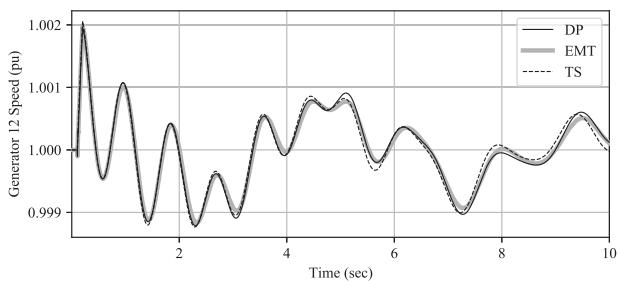  
(a) Complete simulation

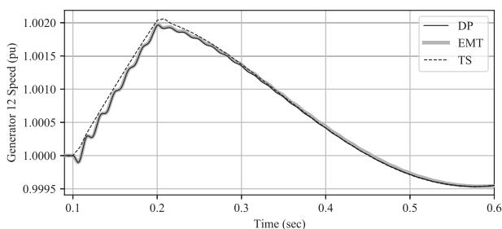  
(b) During and after the fault   
Fig. 3. Speed comparison for generator 12 of the IEEE 68 bus system.

include results from the IEEE 68 test system and an actual 400 bus test system, respectively. Both of these systems are composed entirely of ac components. Section V-C includes simulation results of an HVdc transmission system, demonstrating that the proposed method is suitable for simulating systems with power electronic components.

# A. IEEE 68 Bus Test System

The IEEE 68 bus test system is a model of the New England and New York power systems [47]. Fifteen generators were modeled using full order round rotor models and ac type 4 excitation systems [48]. One additional generator was modeled as a voltage source to provide a frequency reference. The proposed method requires 535 variables to model this system.

Conventional transient stability (TS) and EMT simulations were also carried out using commercially available software for comparison with the proposed method. A 10s simulation was conducted with a 100ms three-phase short circuit applied to bus 35 at 0.1s. Fig. 3 illustrates generator 12’s speed both for the entire simulation and near the disturbance. The results demonstrate good agreement between the proposed method and the two commercial programs. The results demonstrate particularly good agreement between the proposed method and the EMT results, where the proposed method captures the high frequency ripple and initial drop in generator speed prior to the generator’s acceleration that is ignored in conventional TS simulation.

Fig. 4 illustrates generator 12’s air gap torque for the first two seconds of the simulation and immediately following the removal of the disturbance. Fig. 5 illustrates the instantaneous voltage at bus 35 immediately following the removal of the fault where the results for the proposed method and the TS simulator

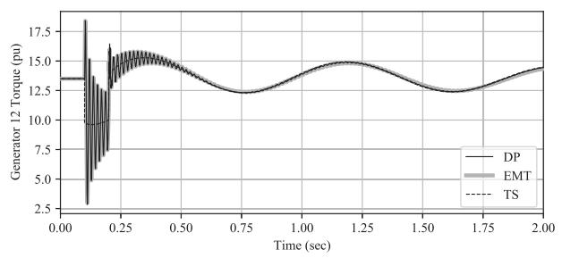  
(a) Before and after the fault

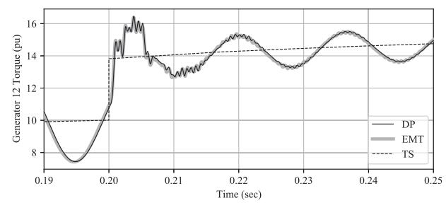  
(b) Immediately after the fault

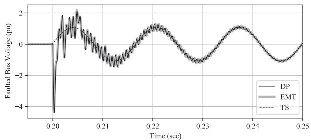  
Fig. 4. Air gap torque comparison for generator 12 of the IEEE 68 bus system.   
Fig. 5. Comparison of instantaneous voltage for bus 35 of the IEEE 68 bus system immediately following fault removal.

were constructed using (4). The air gap torque and faulted bus voltage results demonstrate good agreement between the proposed method and the EMT simulations for both stator winding and electromechanical transients. There is also good agreement with the TS results for slow electromechanical variations but they do not capture the high frequency stator transients.

# B. 400 Bus Test System

Simulations were also carried out on a real power system with approximately 400 buses to test and demonstrate the scalability of the proposed method. This system also contains 14 series capacitors. The proposed method requires 3442 variables and equations to carry out simulations. EMT simulation of this network was carried out with a 50 μs time step, which required 465S of CPU time. Faults were simulated using the proposed method at four locations near series capacitors. These simulations required between 2.28s and 7.45s of CPU time. The results demonstrate that the proposed method can be as much as 200 times faster than EMT simulation.

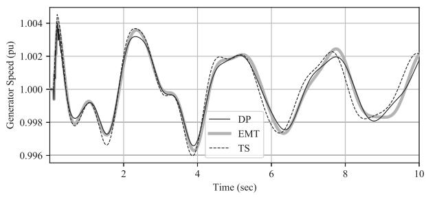  
(a) Complete simulation

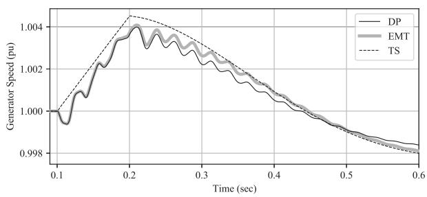  
(b)During and after the fault   
Fig. 6. Generator speed comparison for the 400 bus test system.

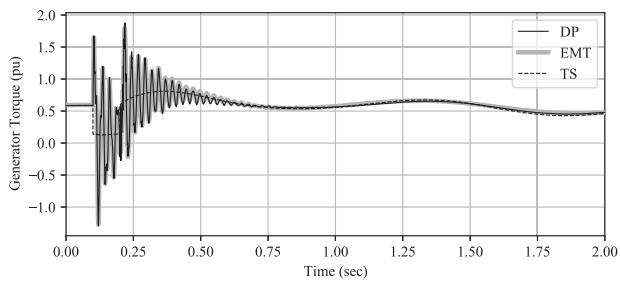  
(a)Before and after the fault

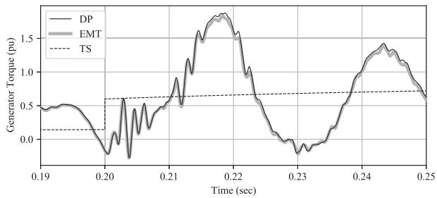  
(b) Immediately after the fault   
Fig. 7. Generator air gap torque comparison for the 400 bus test system.

The disturbance selected for comparison requires 3.5s of CPU time and has a speed-up factor of 130 as compared to EMT simulation. Figs. 6 and 7 represent the speed and air gap torque of a generator close to the location of the disturbance, respectively. The results demonstrate good agreement between the proposed method and the EMT results. There are slight

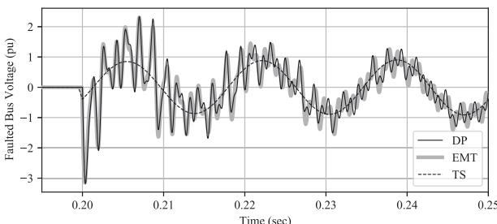  
Fig. 8. Faulted bus instantaneous voltage comparison for the 400 bus test system.

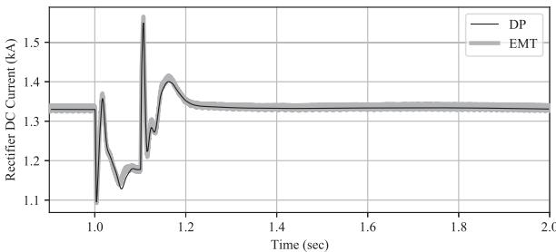  
Fig. 9. Rectifier dc current comparison for the IEEE 39 HVdc case.

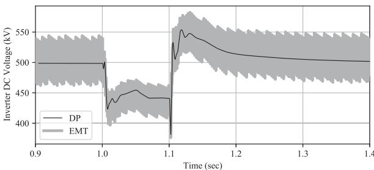  
Fig. 10. Inverter dc voltage comparison for the IEEE 39 HVdc case.

differences observed due to differences in the damping of electromechanical oscillations. Fig. 8 illustrates a comparison of the instantaneous faulted bus voltage, which demonstrates good agreement between the proposed method and EMT.

# C. IEEE 39 Bus Test System Including HVdc Transmission

The final test case presented in this paper is the IEEE 39 bus test system with an embedded LCC-based HVdc transmission system. Details regarding the IEEE 39 test case are included in reference [37]. The ac transmission line between buses 25 and 26 was replaced by the dc transmission line model presented in Section III-C with a dc current controller at the rectifier and dc voltage controller at the inverter.

A 0.01pu fault at bus 5 was simulated for 0.1s. EMT simulations were carried out using a time step of 50μ s and required 85s of CPU time. Simulations carried out using the proposed method required 0.457s of CPU time. This result demonstrates that the proposed method is 186 times faster than EMT simulation for this disturbance.

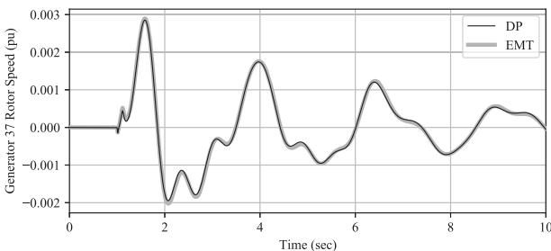  
Fig. 11. Rotor speed comparison for generator 37 for the IEEE 39 HVdc case.

Fig. 9 illustrates the rectifier dc current and Fig. 10 illustrates the inverter dc voltage. These results demonstrate that the proposed method is capable of accurately modeling the average value of the dc system dynamics. Fig. 11 illustrates the rotor speed of generator 37, which is the closest generator to the HVdc system’s rectifier. These results demonstrate that the fundamental frequency dynamics of nonlinear power electronic converters can be accurately modeled by the proposed method.

# VI. DISCUSSION ON SCALABILITY

It is difficult to quantitatively determine how the proposed method’s computational load will scale with problem size because simulation time is highly dependent on the character of a system’s dynamics. However, two methods can be implemented to adapt the proposed method for simulation of extremely large power system models, i.e., those with bus counts on the order of 100 000.

The first method that can be implemented is the concept of hybrid network models [49]. This approach involves modeling a subset of a network using dynamic phasors and the remainder using a conventional quasistationary model. The two models can be connected seamlessly since the entire simulation is conducted using phasor-based representations.

The second approach is to implement the dynamic phasorbased decoupled transmission line model [50]. This model is similar to the Bergeron model used in EMT simulation and lends itself well to parallel computing environments [51].

# VII. CONCLUSION

Conventional quasistationary-based simulation is limited to low frequency electromechanical oscillations, which is not sufficient for modern power systems. This paper demonstrates that it is possible to extend the frequency bandwidth of existing phasor-based simulation using dynamic phasors. The method presented in this work uses MNA to construct DAEs that are numerically solved using the IDA library. Simulations of realistic power system models including HVdc transmission systems demonstrate good agreement between the proposed method and commercial simulators for both electromagnetic and electromechanical transients. The future of this work involves expanding its model library to include FACTS components and power electronic-based generation, which are essential for simulating modern and future power systems.

# REFERENCES

[1] P. Kundur, N. Balu, and M. Lauby, Power System Stability and Control. New York, NY, USA: McGraw-Hill Education, 1994.   
[2] M. Dyrkacz, C. Young, and F. Maginniss, “A digital transient stability program including the effects or regulator, exciter, and governor response,” Trans. Amer. Inst. Elect. Engineers. Part III: Power App. Syst., vol. 79, no. 3, pp. 1245–1254, Apr. 1960.   
[3] V. Venkatasubramanian, H. Schättler, and J. Zaborszky, “Fast time-varying phasor analysis in the balanced three-phase large electric power system,” IEEE Trans. Autom. Control, vol. 40, no. 11, pp. 1975–1982, Nov. 1995.   
[4] R. Farmer, A. Schwalb, and E. Katz, “Navajo project report on subsynchronous resonance analysis and solutions,” IEEE Trans. Power App. Syst., vol. 96, no. 4, pp. 1226–1232, Jul. 1977.   
[5] K. Gu, F. Wu, and X.-P. Zhang, “Sub-synchronous interactions in power systems with wind turbines: A review,” IET Renewable Power Gener., vol. 13, pp. 4–15, Jul. 2018.   
[6] J. Zaborszky, H. Schättler, and V. Venkatasubramanian, “Error estimation and limitation of the quasi stationary phasor dynamics,” in Proc. Power Syst. Comput. Conf., 1993, pp. 721–729.   
[7] M. Parniani and M. Iravani, “Computer analysis of small-signal stability of power systems including network dynamics,” IEE Proc. Gener. Transmiss. Distrib., vol. 142, no. 6, pp. 613–617, Nov. 1995.   
[8] P. Mattavelli, A. Stankovic, and G. Verghese, “SSR analysis with dynamic phasor model of thyristor-controlled series capacitor,” IEEE Trans. Power Syst., vol. 14, no. 1, pp. 200–208, Feb. 1999.   
[9] C. Karawita and U. Annakkage, “Multi-infeed HVDC interaction studies using small-signal stability assessment,” IEEE Trans. Power Del., vol. 24, no. 2, pp. 910–918, Apr. 2009.   
[10] J. Noworolski and S. Sanders, “Generalized in-plane circuit averaging,” in Proc. APEC ’91: 6th Annu. Appl. Power Electron. Conf. Exhib., Mar. 1991, pp. 445–451.   
[11] R. Shintaku and K. Strunz, “Branch companion modeling for diverse simulation of electromagnetic and electromechanical transients,” Electric Power Syst. Res., vol. 77, no. 11, pp. 1501–1505, 2007.   
[12] M. Kulasza, “Generalized dynamic phasor-based simulation for power systems,” Master’s thesis, Canada: Univ. Manitoba, Jan. 2015.   
[13] M. Mirz, S. Vogel, G. Reinke, and A. Monti, “DPsim - a dynamic phasor real-time simulator for power systems,” SoftwareX, vol. 10, pp. 1–8, 2019.   
[14] T. Noda, T. Kikuma, T. Nagashima, and R. Yonezawa, “A dynamic-phasor simulation method with sparse tableau formulation for distribution system analysis: A preliminary result,” in Proc. Power Syst. Comput. Conf., Jun. 2018, pp. 1–7.   
[15] T. Demiray, “Simulation of power system dynamics using dynamic phasor models,” Ph.D. dissertation, Swiss Federal Institute of Technology, 2008.   
[16] T. Demiray, G. Andersson, and L. Busarello, “Evaluation study for the simulation of power system transients using dynamic phasor models,” in Proc. IEEE/PES Transmiss. Distrib. Conf. Exposition: Latin America, 2008, pp. 1–6.   
[17] S. Henschel, “Analysis of electromagnetic and electromechanical power system transients with dynamic phasors,” Ph.D. dissertation, Vancouver, Canada: Univ. British Columbia, Feb. 1999.   
[18] K. Strunz, R. Shintaku, and F. Gao, “Frequency-adaptive network modeling for integrative simulation of natural and envelope waveforms in power systems and circuits,” IEEE Trans. Circuits Syst. I: Regular Papers, vol. 53, no. 12, pp. 2788–2803, Dec. 2006.   
[19] S. Sanders, J. Noworolski, X. Liu, and G. Verghese, “Generalized averaging method for power conversion circuits,” IEEE Trans. Power Electron., vol. 6, no. 2, pp. 251–259, Apr. 1991.   
[20] E. Zhijun, K. Chan, and D. Fang, “A practical dynamic phasor model of static VAR compensator,” in Proc. 2nd Int. Conf. Power Electron. Syst. Appl., 2006, pp. 23–27.   
[21] M. Daryabak et al., “Modeling of LCC-HVDC systems using dynamic phasors,” IEEE Trans. Power Del., vol. 29, no. 4, pp. 1989–1998, Aug. 2014.   
[22] F. Jusan, S. Gomes, and G. Taranto, “SSR results obtained with a dynamic phasor model of SVC using modal analysis,” Int. J. Elect. Power Energy Syst., vol. 32, no. 6, pp. 571–582, 2010.   
[23] D. Shu, X. Xie, V. Dinavahi, C. Zhang, X. Ye, and Q. Jiang, “Dynamic phasor based interface model for EMT and transient stability hybrid simulations,” IEEE Trans. Power Syst., vol. 33, no. 4, pp. 3930–3939, Jul. 2018.   
[24] K. Mudunkotuwa, S. Filizadeh, and U. Annakkage, “Development of a hybrid simulator by interfacing dynamic phasors with electromagnetic transient simulation,” IET Gener., Transmiss. Distrib., vol. 11, no. 12, pp. 2991–3001, 2017.

[25] C. Ho, A. Ruehli, and P. Brennan, “The modified nodal approach to network analysis,” IEEE Trans. Circuits Syst., vol. 22, no. 6, pp. 504–509, Jun. 1975.   
[26] D. Estévez Schwarz and C. Tischendorf, “Structural analysis of electric circuits and consequences for MNA,” Int. J. Circuit Theory Appl., vol. 28, no. 2, pp. 131–162, 2000.   
[27] J. Vlach and K. Singhal, Computer Methods for Circuit Analysis and Design. New York, NY, USA: Wiley., 1983.   
[28] U. M. Ascher and L. R. Petzold, “‘Computer methods for ordinary differential equations and differential-algebraic equations,” Soci. Ind. Appl. Math. , USA, 1st Eds., 1998.   
[29] J. Astic, A. Bihain, and M. Jerosolimski, “The mixed Adams-BDF variable step size algorithm to simulate transient and long term phenomena in power systems,” IEEE Trans. Power Syst., vol. 9, no. 2, pp. 929–935, May 1994.   
[30] B. Haut, V. Savcenco, and P. Panciatici, “A multirate approach for time domain simulation of very large power systems,” in Proc. 45th Hawaii Int. Conf. System Sci., Jan. 2012, pp. 2125–2132.   
[31] P. Gibert, P. Panciatici, R. Losseau, A. Guironnet, D. Tromeur-Dervout, and J. Erhel, “Speedup of EMT simulations by using an integration scheme enriched with a predictive fourier coefficients estimator,” in Proc. IEEE PES Innovative Smart Grid Technol. Conf. Europe (ISGT-Europe), Oct. 2018, pp. 1–6.   
[32] E. Allen and M. Ili´c, “Interaction of transmission network and load phasor dynamics in electric power systems,” IEEE Trans. Circuits Syst. I: Fundam. Theory Appl., vol. 47, no. 11, pp. 1613–1620, Nov. 2000.   
[33] P. Zhang, J. Martí, and H. Dommel, “Synchronous machine modeling based on shifted frequency analysis,” IEEE Trans. Power Syst., vol. 22, no. 3, pp. 1139–1147, Aug. 2007.   
[34] Y. Huang, M. Chapariha, F. Therrien, J. Jatskevich, and J. Martì, “A constant-parameter voltage-behind-reactance synchronous machine model based on shifted-frequency analysis,” IEEE Trans. Energy Convers., vol. 30, no. 2, pp. 761–771, Jun. 2015.   
[35] K. Corzine, B. Kuhn, S. Sudhoff, and H. Hegner, “An improved method for incorporating magnetic saturation in the Q-D synchronous machine model,” IEEE Trans. Energy Convers., vol. 13, no. 3, pp. 270–275, Sep. 1998.   
[36] M. Szechtman, T. Weiss, and C. Thio, “A benchmark model for HVDC system studies,” Int. Conf. AC DC Power Transmiss., 1991, pp. 374–378   
[37] C. Karawita, “HVDC interaction studies using small signal stability assessment,” Ph.D. dissertation, Univ. Manitoba: Canada, Apr. 2009.   
[38] W. Hammer, “Dynamic modeling of line and capacitor commutated converters for HVDC power transmission,” Ph.D. dissertation, Swiss Federal Institute of Technology, Dec. 1972.   
[39] A. Hindmarsh et al., “SUNDIALS: Suite of nonlinear and differential/algebraic equation solvers,” ACM Trans. Math. Softw. (TOMS), vol. 31, no. 3, pp. 363–396, 2005.   
[40] T. A. Davis and E. P. Natarajan, “Algorithm 907: KLU, a direct sparse solver for circuit simulation problems,” ACM Trans. Math. Softw., vol. 37, no. 3, pp. 1–17, Sep. 2010.   
[41] L. Razik, L. Schumacher, A. Monti, A. Guironnet, and G. Bureau, “A comparative analysis of LU decomposition methods for power system simulations,” in Proc. IEEE Milan PowerTech, Jun. 2019, pp. 1–6.   
[42] P. Brown, A. Hindmarsh, and L. Petzold, “Consistent initial condition calculation for differential-algebraic systems,” SIAM J. Sci. Comput., vol. 19, no. 5, pp. 1495–1512, Jun. 1998.   
[43] G. Mao and L. Petzold, “Efficient integration over discontinuities for differential-algebraic systems,” Comput. Math. Appl., vol. 43, pp. 65–79, Jan. 2002.   
[44] B. Bramas and P. Kus, “Computing the sparse matrix vector product using block-based Kernels without zero padding on processors with AVX-512 instructions,” in Proc. PeerJ Comput. Sci., vol. 4, pp. 1–23, 2018.   
[45] C. Tischendorf, “Coupled systems of differential algebraic and partial differential equations in circuit and device simulation,” Habilitationsschrift. Berlin, Germany: Humboldt-Univ. zu Berlin, Mar. 2003.   
[46] L. Mandache, D. Topan, and I. Sirbu, “Improved modified nodal analysis of nonlinear analog circuits in the time domain,” in Proc. the World Congress Eng. vol. II, Jun. 2010, pp. 1–4.   
[47] B. Pal and B. Chaudhuri, Robust Control in Power Systems. New York, NY, USA: Springer, 2005.   
[48] IEEE Recommended Practice for Excitation System Models for Power System Stability Studies, IEEE Standard 421.5-2016 (Revision of IEEE Standard 421.5-2005), pp. 1–207, 2016.

[49] C. Karawita and U. D. Annakkage, “A hybrid network model for small signal stability analysis of power systems,” IEEE Trans. Power Syst., vol. 25, no. 1, pp. 443–451, Feb. 2010.   
[50] V. Venkatasubramanian, H. Schättler, and J. Zaborszky, “A time-delay differential-algebraic phasor formulation of the large power system dynamics,” in Proc. IEEE Int. Symp. Circuits Syst., May 1994, vol. 6, pp. 49–52.   
[51] N. Watson and J. Arrillaga, “Power systems electromagnetic transients simulation, ser. IET power and energy series,” Inst. Eng. Technol., Power and Energy, 2003.

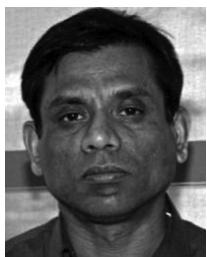

U. D. Annakkage (Senior Member, IEEE) received the B.Sc.Eng. degree in electrical engineering from the University of Moratuwa, Moratuwa, Sri Lanka, in 1982, and the M.Sc. and Ph.D. degrees in electrical engineering from the University of Manchester Institute of Science and Technology, Manchester, U.K., in 1984 and 1987, respectively. He is currently a Professor with the University of Manitoba, Winnipeg, MB, Canada. From 2008 to 2012, he was the Head of the Electrical and Computer Engineering Department, University of Manitoba. He was the Editor of

the IEEE TRANSACTIONS ON POWER SYSTEMS. He is currently the Convener of CIGRE Working Group on Application of Phasor Measurement Units for monitoring power system dynamic performance. His research interests include power system stability and control, security assessment and control, operation of restructured power systems, and power system simulation.

M. A. Kulasza received the B.Sc.(E.E.) and M.Sc. degrees, in electrical engineering, in 2012 and 2015, respectively, from the University of Manitoba, Winnipeg, MB, Canada, where he is currently working toward the Ph.D. degree in electrical engineering. In 2016, he joined TransGrid Solutions, Winnipeg, MB, Canada, where he specializes in power system studies and integration of renewable generation. His research interests include graph theory, linear algebra, and high performance computing, with application to power system simulation.

C. Karawita (Senior Member, IEEE) received the B.Sc.Eng. degree in electrical engineering from the University of Moratuwa, Moratuwa, Sri Lanka, in 2002, and the M.Sc. and Ph.D. degrees in electrical engineering from the University of Manitoba, Winnipeg, MB, Canada, in 2006 and 2009, respectively. In 2007, he joined TransGrid Solutions, Winnipeg, MB, Canada, and is currently the Vice President - Studies. He has specialized in power systems planning studies for HVDC and HVAC integrations and renewable generation. He was instrumental in developing a soft-

ware package to analyze subsynchronous interactions in power systems. He is involved in academic research as an Adjunct Professor with the University of Manitoba.