# 级联H桥型电力电子变压器的电磁暂态等效建模方法

丁江萍1, 高晨祥1, 许建中1*, 赵成勇1, 曹均正2

(1.新能源电力系统国家重点实验室(华北电力大学)，北京市昌平区102206;

2. 中电普瑞电力工程有限公司，北京市昌平区102200)

# Electromagnetic Transient Equivalent Modeling Method of Cascaded H-bridge Power Electronic Transformer

DING Jiangping1, GAO Chenxiang1, XU Jianzhong1*, ZHAO Chengyong1, CAO Junzheng2

(1. State Key Laboratory of Alternate Electrical Power System with Renewable Energy Sources

(North China Electric Power University), Changping District, Beijing 102206, China;

2. C-EPRI Electric Power Engineering Co., Ltd., Changping District, Beijing 102200, China)

ABSTRACT: The power electronic transformer (PET) applied to the medium and high voltage distribution network widely adopts a two-stage cascade structure of a cascaded H-bridge rectifier and a dual-active bridge DC/DC converter. Aiming at the problem of extremely slow simulation speed in offline simulation platforms such as PSCAD/EMTDC and MATLAB, based on the Thévenin's equivalent and nested fast simultaneous solving algorithm, an electromagnetic transient simulation accelerated model of cascaded H-bridge PET was proposed. Specifically, by arranging the decoupling companion network of the primary/secondary side of the high-frequency transformer flexibly, the cascaded sub-modules were divided into two single-port networks, and then the equivalent part of the Thévenin's (Norton's) equivalent parameters were forwardly solved. Then, the equivalent part was substituted into the electromagnetic transient program for overall solution and inverse solution to initialize the electrical network for the next simulation step. Since the external equivalent form was a Thévenin's (Norton's) equivalent circuit with only 4 external nodes, the computational complexity of the proposed model in the overall system solution process hardly increased with the number of submodules. The cascaded H-bridge PET closed-loop control system was built in the PSCAD/EMTDC. Compared with the detailed model simulation results, the proposed model can accurately simulate the PET transient steady-state process and has a high acceleration ratio.

KEY WORDS: cascaded H-bridge (CHB); decoupling companion circuit; power electronic transformer (PET); Norton and Thévenin's equivalent; electromagnetic transient (EMT); equivalent modeling

摘要：应用于中高压配电网的电力电子变压器(power electronic transformer，PET)广泛采用级联H桥整流器与双有源桥DC/DC变换器两级级联结构。针对其在诸如PSCAD/EMTDC、MATLAB等离线仿真平台中仿真速度极慢的问题，基于诺顿等效及嵌套快速同时求解算法，提出一种级联H桥型PET的电磁暂态仿真提速模型。具体而言，即通过灵活构造高频变压器原/副边的解耦伴随网络，将级联子模块分割为两个单端口网络，进而对等效部分正向求解诺顿(戴维南)等效参数、代入电磁暂态程序整体求解，及反解以初始化下一个仿真步长的电气网络。由于对外等效为仅包含4个外部节点的戴维南(诺顿)等效电路，使得所提模型在系统整体求解过程中计算复杂度几乎不随子模块个数增加。在PSCAD/EMTDC中搭建了级联H桥型PET闭环系统，与详细模型仿真结果对比表明，所提模型能够精确仿真PET暂稳态过程，且具有较高的加速比。

关键词：级联H桥；解耦伴随电路；电力电子变压器；诺顿和戴维南等效；电磁暂态；等效建模

# 0 引言

电力电子变压器(power electronic transformer, PET)将电压变换、能量控制、动态无功补偿等功能集于一身，是未来新能源并网及交直流输配电系统互联的重要接口设备[1-4]。级联H桥型PET具备模块化结构，在中高压配电网中广泛使用，因其高压

侧的 AC/DC 变换器采用级联 H 桥换流器(cascaded H-bridge, CHB)而得名[3], 中间隔离级通常采用双有源桥(dual active bridge, DAB)或多有源桥(multiple active bridge, MAB)型 DC-DC 变换器。

在 PET 设备接入电网使用之前，首先需要在仿真平台下进行仿真验证，在控制策略优化环节甚至需要进行多重运行以寻求最优控制参数[5-7]。然而，为精确反映 PET 的动态特性，必须在小步长环境下仿真。以 3 模块级联 H 桥型 PET 为例，如 DAB 采取单移相控制，工作频率在 $5\mathrm{kHz}$ ，经仿真测试，需设置 $10\mu \mathrm{s}$ 及以下的仿真步长才能较为精确控制移相角，严重拖慢整个系统的仿真效率。

针对这一问题，文献[8]建立了级联H桥型PET的平均值模型，在稳态及电压暂降过程中能够较精确地反映系统电气量的幅值，但完全忽略了开关动作产生的谐波，并且仅适用于采用脉宽调制(pulse width modulation，PWM)的PET系统。文献[9]基于RT-LAB平台开发了PET的纳秒级实时仿真模型，其本质是用等效电感/电容支路替代了电力电子开关[10]。开关状态的改变仅体现为等效电流源的取值不同，系统节点导纳矩阵保持不变，从而规避了高阶导纳矩阵求逆过程，但仍然是一种详细模型，需要消耗大量仿真资源。文献[11-12]针对采用新型多端口子模块的模块化多电平换流器，提出了一种广义戴维南/诺顿等效方法，对系统进行降维等效的同时保证了仿真精度。相比而言，级联H桥型PET属于输入串联输出并联(in-series-out-parallel，ISOP)型结构，端子约束关系与文献[11]中输入串联输出串联(in-series-out-series，ISOS)型的子模块存在差异，目前尚无针对级联H桥型PET的诺顿或戴维南等效方法。

本文提出一种级联H桥型PET的电磁暂态仿真提速模型，它属于能够精确仿真PET内部子模块电容特性的诺顿等效模型，且具有较为明显的提速效果。具体而言，即通过灵活构造高频变压器原/副边的解耦伴随网络，将级联子模块分割为两个单端口网络，接着基于文献[13]对单端口子模块的等效方法，对等效部分正向求解诺顿/戴维南等效参数、系统整体求解、反解以初始化下一个仿真步长的电气网络，使得所提模型在整体求解过程中计算复杂度几乎不随子模块个数增加。最后，在PSCAD/EMTDC中对级联H桥型PET闭环系统进行精度验证和开环加速比测试。

# 1 级联H桥型PET拓扑

图1为级联H桥型PET系统，具有AC-DC-AC-DC-AC五级电能变换，包含级联多电平AC/DC换流器、含1个高频隔离变压器的双有源桥DC-DC变换器和DC/AC换流器。低压直流母线可直接与直流负载相连，或通过DC/AC换流器接交流负载。本文的等效建模对象为H桥-DAB作为基本单元的多模块部分，以下简称为CHB单元。各单元在输入侧端子首尾连接，为串联形式，输出端子分别接在正极和负极直流母线，为并联形式，即具有ISOP型结构。由于三相的CHB单元结构完全一致，因此下文均以A相为例展开。

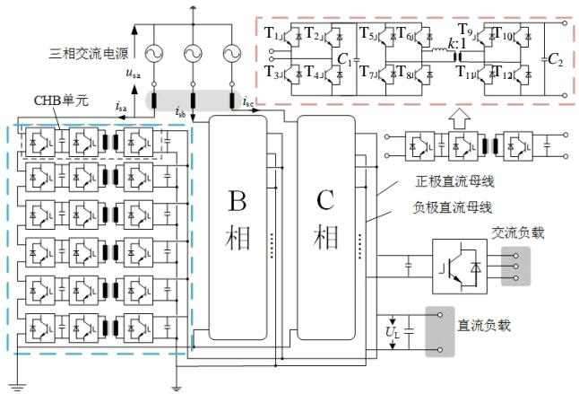  
图1级联H桥型PET系统示意图  
Fig.1 Schematic diagram of cascaded H-bridge PET system

图1虚框线内的部分经过等效后，需要预留用户自定义参数和数据接口，以实现对模块内各个量的控制。需要预留的用户自定义参数主要包括IGBT及二极管的导通和关断电阻，电容 $C_1$ 、 $C_2$ 的容值，电容两端并联的均压电阻值(若有)，附加电抗的电感值和变压器参数等。需要预留的数据接口为CHB单元中的 $\mathrm{T}_{1} - \mathrm{T}_{12}$ 的触发信号，各CHB单元中电容 $C_1$ 两端的电压及输出电流等等。

# 2 CHB单元的伴随电路构造

按基本组成元件划分，单个CHB单元包含IGBT/二极管开关组、电感元件、电容元件和变压器。

在电磁暂态仿真中，设 $\Delta T$ 为一个仿真步长，各元件的时变电路参数整理如表1所示：关于各个H桥中的开关器件及电感、电容元件的等效方法，已有诸多文献给出[14-17]，即按照 $\mathrm{T}_k(k = 1,2,\dots ,12)$ 在当前时刻的状态，可将IGBT/二极管开关组等效为

表 1 CHB 单元等效模型参数及电压/电流更新量计算式  
Tab. 1 CHB unit equivalent parameters and voltage/current increment updated calculation formula   

<table><tr><td>元件名称</td><td>等效参数计算式</td><td>储能元件电流/电压更新计算式</td></tr><tr><td>IGBT/二极管开关组</td><td>Gk=GON, Tk=1
GOff, Tk=0, k=1,2,···,12</td><td>-</td></tr><tr><td rowspan="2">电感</td><td>GL=ΔT/2L</td><td>VL(t)=VL1</td></tr><tr><td>JLEQ=GVL(t-ΔT)+IL(t-ΔT)</td><td>IL(t)=IL(t-ΔT)+GL(VL(t-ΔT)+VL(t))</td></tr><tr><td rowspan="2">电容</td><td>GC=2C/ΔT</td><td>ICi(t)=ICi, i=1,2</td></tr><tr><td>JCEQ=VC(t-ΔT)·GC+IC(t-ΔT)</td><td>VCi(t)=VCi(t-ΔT)+RCi(ICi(t-ΔT)+ICi(t)), i=1,2</td></tr><tr><td rowspan="4">隔离变压器</td><td>GDAA=GAA</td><td>V1(t)=VT1</td></tr><tr><td>GDBB=GBB</td><td>V2(t)=VT2</td></tr><tr><td>JDTEQ_HIS1≈JPITEQ_HIS1+GABV2(t-ΔT)</td><td>I1(t)=I1(t-ΔT)+GAA(V1(t)+V1(t-ΔT))+GAB(V2(t)+V2(t-ΔT))</td></tr><tr><td>JDTEQ_HIS2≈JPITEQ_HIS2+GBAV1(t-ΔT)</td><td>I2(t)=I2(t-ΔT)+GBA(V1(t)+V1(t-ΔT))+GBB(V2(t)+V2(t-ΔT))</td></tr></table>

一个在高、低阻值间切换的二值电阻[15]，其中 $G_{i}$ 为时变电阻元件的电导，这种等效方法能够直观反映开关损耗；采用梯形积分法离散化附加电感(即图1中与变压器串联的电感)，可将其等效为一个电流源 $J_{\mathrm{LEQ}}$ 并联一个等效电阻(其电导表示为 $G_{\mathrm{L}}$ )的形式[16]，将当前时刻电感电压的测量值赋值给存储变量 $V_{\mathrm{L}}(t)$ ，并更新存储的电感电流 $I_{\mathrm{L}}(t)$ ，传递到下一个仿真步长，以得到下一时刻的历史电流源 $J_{\mathrm{LEQ}}$ 类似地，可对直流侧电容进行离散化等效[17]，得到等效电导 $G_{\mathrm{C}}$ 和历史电流源值 $J_{\mathrm{CEQ}}$ ，并更新电容电流及电压。

对高频隔离变压器的伴随网络构造有多种方法，如经典的 $\pi$ 型等效方法或构造4节点6阻抗支路[18]。本文提出一种变压器原/副边不具有电气联系的伴随网络构造方法，推导过程如下。模型建立的假设为仅考虑磁耦合及漏感参数。变压器等效电路如图2(a)所示， $L_{1}$ 、 $L_{2}$ (折合到一次侧)为漏感， $L_{\mathrm{m}}$ 为励磁电感，其参数通过工作频率下变压器短路和开路实验数据获得[18]。

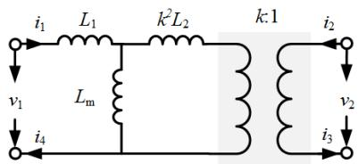  
(a) 等效电路

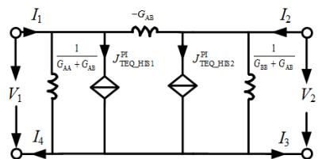  
(b) 含源 $\pi$ 型伴随电路

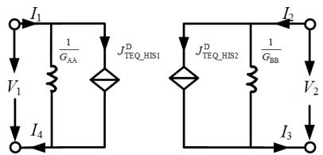  
(c) 本文采用的等效伴随电路  
图2 高频隔离变压器的等效电路及两种伴随电路  
Fig. 2 Equivalent circuit of high frequency isolated transformer and the two companion circuits

对原边和副边电流进行梯形数值积分， $t$ 时刻端口电流和电压的关系可表示为

$$
\left[ \begin{array}{l} I _ {1} (t) \\ I _ {2} (t) \end{array} \right] = \left[ \begin{array}{l l} G _ {\mathrm {A A}} & G _ {\mathrm {A B}} \\ G _ {\mathrm {B A}} & G _ {\mathrm {B B}} \end{array} \right] \left(\left[ \begin{array}{l} V _ {1} (t) \\ V _ {2} (t) \end{array} \right] + \left[ \begin{array}{l} V _ {1} (t - \Delta T) \\ V _ {2} (t - \Delta T) \end{array} \right]\right) +
$$

$$
\left[ \begin{array}{l} I _ {1} (t - \Delta T) \\ I _ {2} (t - \Delta T) \end{array} \right] \tag {1}
$$

其中：

$$
\left[ \begin{array}{l l} G _ {\mathrm {A A}} & G _ {\mathrm {A B}} \\ G _ {\mathrm {B A}} & G _ {\mathrm {B B}} \end{array} \right] = \frac {\Delta T}{2} \left[ \begin{array}{c c} \left(L _ {1} + L _ {\mathrm {m}}\right) & \frac {L _ {\mathrm {m}}}{k} \\ \frac {L _ {\mathrm {m}}}{k} & \left(\frac {L _ {\mathrm {m}}}{k ^ {2}} + L _ {2}\right) \end{array} \right] ^ {- 1} =
$$

$$
\frac {\Delta T}{2 \left(\frac {L _ {1} L _ {\mathrm {m}}}{k ^ {2}} + L _ {1} L _ {2} + L _ {\mathrm {m}} L _ {2}\right)} \left[ \begin{array}{c c} \frac {L _ {\mathrm {m}}}{k ^ {2}} + L _ {2} & - \frac {L _ {\mathrm {m}}}{k} \\ - \frac {L _ {\mathrm {m}}}{k} & L _ {1} + L _ {\mathrm {m}} \end{array} \right] \tag {2}
$$

若将式(1)改写成式(3)的形式，即可构造如图2(b)所示的含受控源 $\pi$ 型等效电路。

$$
\left[ \begin{array}{c} I _ {1} (t) \\ I _ {2} (t) \end{array} \right] = \left[ \begin{array}{c c c} G _ {\mathrm {A A}} + G _ {\mathrm {A B}} & 0 & - G _ {\mathrm {A B}} \\ 0 & G _ {\mathrm {B B}} + G _ {\mathrm {A B}} & G _ {\mathrm {A B}} \end{array} \right].
$$

$$
\left[ \begin{array}{c} V _ {1} (t) \\ V _ {2} (t) \\ V _ {1} (t) - V _ {2} (t) \end{array} \right] + \left[ \begin{array}{c} J _ {\mathrm {T E Q} - \mathrm {H I S 1}} ^ {\mathrm {P I}} \\ J _ {\mathrm {T E Q} - \mathrm {H I S 2}} ^ {\mathrm {P I}} \end{array} \right] \tag {3}
$$

其中：

$$
\left[ \begin{array}{l} J _ {\mathrm {T E Q} - \mathrm {H I S 1}} ^ {\mathrm {P I}} \\ J _ {\mathrm {T E Q} - \mathrm {H I S 2}} ^ {\mathrm {P I}} \end{array} \right] = \left[ \begin{array}{l l} G _ {\mathrm {A A}} & G _ {\mathrm {A B}} \\ G _ {\mathrm {B A}} & G _ {\mathrm {B B}} \end{array} \right] \left[ \begin{array}{l} v _ {1} (t - \Delta T) \\ v _ {2} (t - \Delta T) \end{array} \right] + \left[ \begin{array}{l} i _ {1} (t - \Delta T) \\ i _ {2} (t - \Delta T) \end{array} \right] \tag {4}
$$

本文在此基础上，重新构造了如图2(c)所示的伴随网络，变压器原边和副边分别被等效为受控电流源并联一个电阻的诺顿等效形式，且原/副边电气量解耦，即无需依赖对侧的电压来表示本侧的电流。列写其端口电压电流关系，可表示为式(5)。式中的上标“D”表示将原/副边当前时刻电压、电流关系进行了解耦处理。

$$
\left[ \begin{array}{l} I _ {1} (t) \\ I _ {2} (t) \end{array} \right] = \left[ \begin{array}{c c} G _ {\mathrm {A A}} ^ {\mathrm {D}} & 0 \\ 0 & G _ {\mathrm {B B}} ^ {\mathrm {D}} \end{array} \right] \left[ \begin{array}{l} V _ {1} (t) \\ V _ {2} (t) \end{array} \right] + \left[ \begin{array}{l} J _ {\text {T E Q - H I S 1}} ^ {\mathrm {D}} \\ J _ {\text {T E Q - H I S 2}} ^ {\mathrm {D}} \end{array} \right] \tag {5}
$$

比较式(1)和(5)，可得图2(c)中伴随网络与图2(a)所示电路对外等价的条件为

$$
\left\{ \begin{array}{l} G _ {\mathrm {A A}} ^ {\mathrm {D}} = G _ {\mathrm {A A}} \\ G _ {\mathrm {B B}} ^ {\mathrm {D}} = G _ {\mathrm {B B}} \\ J _ {\mathrm {T E Q} _ {-} \mathrm {H I S} 1} ^ {\mathrm {D}} = J _ {\mathrm {T E Q} _ {-} \mathrm {H I S} 1} ^ {\mathrm {P I}} + G _ {\mathrm {A B}} V _ {2} (t) \\ J _ {\mathrm {T E Q} _ {-} \mathrm {H I S} 2} ^ {\mathrm {D}} = J _ {\mathrm {T E Q} _ {-} \mathrm {H I S} 2} ^ {\mathrm {P I}} + G _ {\mathrm {B A}} V _ {1} (t) \end{array} \right. \tag {6}
$$

$V_{1}(t)$ 、 $V_{2}(t)$ 无法在上一时刻得到，在一定误差允许范围内，图2(c)的一种实现方式为用历史电压和电流来近似表示 $V_{1}(t)$ 、 $V_{2}(t)$ ，即通过一个步长的约等来获得变压器伴随网络中的电流源取值。由表1中的公式可更新下一时刻的端口电压和电流。

通过搭建图 3(a) 所示的测试电路，对本文所提的伴随电路构造方法进行精度验证，图 3(b) 给出了图 3(a) 所示测试电路中端口电压、电流的波形测试结果，仿真步长为 $1 \mu \mathrm{s}$ ，本文模型与 PSCAD/EMTDC 软件中变压器模型相比，变压器端口电气量均较为吻合，初步验证了等效建模方法的精确性。

综上，CHB单元的伴随电路整体如图4所示，由P1、P2两部分构成，电路参数计算式可见表1。虽然变压器原/副边分割成了两部分，但两侧在受控电流源 $J_{\mathrm{TEQ\_HIS1}}^{\mathrm{D}}, J_{\mathrm{TEQ\_HIS2}}^{\mathrm{D}}$ 计算环节需要用到对侧的信息。之后即可分别进行求解，因此P1、P2也可

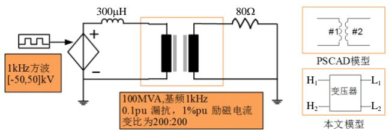  
(a) 测试电路

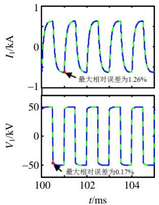

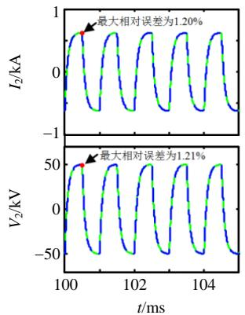  
(b) 变压器端口电压及电路波形  
图3 变压器伴随电路的精度验证

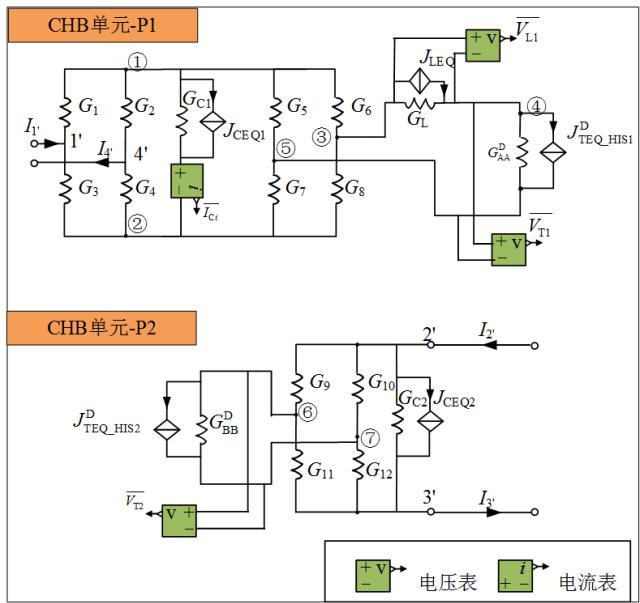  
Fig. 3 Accuracy verification of transformer's companion circuit   
图4 CHB单元的伴随电路  
Fig. 4 Companion circuit of CHB unit

理解为两个存在信息交互关系的单端口电路。

值得注意的是，感性元件(即附加电感，变压器)的电压和容性元件的电流需要将伴随网络代入外电路求解节点电压方程后求解得到，图4中使用电压、电流表测量仅作示意，等效模型实际是通过反解内部节点信息得到表1中的储能元件电压/电流更新值。第3节将介绍如何采用诺顿等效建模方法进行CHB单元间的消去和反解。

# 3 级联H桥型PET的诺顿等效建模方法

# 3.1 CHB单元诺顿等效建模

由图 4 可知, P1 和 P2 在当前仿真时刻 $t$ 时, 可视为两个单端口网络。外部节点编号为 $1^{\prime} - 4^{\prime}$ , 内部节点依次编号①—⑦。规定流入节点的方向为电流的正方向, 对 $t$ 时刻单个 CHB 单元的伴随电路

列写节点电压方程，如式(7)、(8)所示。式中 $G_{1} - G_{12}$ 的取值由 $t$ 时刻开关管 $\mathrm{T}_{1} - \mathrm{T}_{12}$ 的触发状态决定。

按内外节点分别对应的行列进行分块，可改写为式(9)所示的通用形式。

$$
\begin{array}{l} \left[ \begin{array}{c c c c c c c} G _ {1} + G _ {3} & 0 & - G _ {1} & - G _ {3} & 0 & 0 & 0 \\ 0 & G _ {2} + G _ {4} & - G _ {2} & - G _ {4} & 0 & 0 & 0 \\ \hline - G _ {1} & - G _ {2} & G _ {1} + G _ {2} + G _ {\mathrm {C l}} + G _ {5} + G _ {6} & - G _ {\mathrm {C l}} & - G _ {6} & 0 & - G _ {5} \\ - G _ {3} & - G _ {4} & - G _ {\mathrm {C l}} & G _ {3} + G _ {4} + G _ {\mathrm {C l}} + G _ {7} + G _ {8} & - G _ {8} & 0 & - G _ {7} \\ 0 & 0 & - G _ {6} & - G _ {8} & G _ {5} + G _ {7} + G _ {\mathrm {L}} & - G _ {\mathrm {L}} & 0 \\ 0 & 0 & 0 & 0 & - G _ {\mathrm {L}} & G _ {\mathrm {L}} + G _ {\mathrm {A A}} ^ {\mathrm {D}} & - G _ {\mathrm {A A}} ^ {\mathrm {D}} \\ 0 & 0 & - G _ {5} & - G _ {7} & 0 & - G _ {\mathrm {A A}} ^ {\mathrm {D}} & G _ {6} + G _ {8} + G _ {\mathrm {A A}} ^ {\mathrm {D}} \end{array} \right]. \\ \left[ \begin{array}{l} V _ {1 ^ {\prime}} \\ V _ {4 ^ {\prime}} \\ \overline {{V _ {1}}} \\ V _ {2} \\ V _ {3} \\ V _ {4} \\ V _ {5} \end{array} \right] = \left[ \begin{array}{c} 0 \\ 0 \\ \dots \dots \dots \dots \dots \dots \dots \dots \dots \dots \dots \dots \dots \dots \dots \dots \dots \dots \dots \dots \dots \dots \dots \dots \dots \dots \dots \dots \dots \dots \dots \dots \\ - J _ {\mathrm {C E Q 1}} \\ J _ {\mathrm {C E Q 1}} \\ - J _ {\mathrm {L E Q}} \\ J _ {\mathrm {L E Q}} - J _ {\mathrm {T E Q H I S 1}} ^ {\mathrm {D}} \\ J _ {\mathrm {T E Q H I S 1}} ^ {\mathrm {D}} \end{array} \right] + \left[ \begin{array}{c} I _ {1 ^ {\prime}} \\ - I _ {4 ^ {\prime}} \\ 0 \\ 0 \\ 0 \\ 0 \\ 0 \end{array} \right] \tag {7} \\ \end{array}
$$

$$
\left[ \begin{array}{c c c c} G _ {9} + G _ {1 0} + G _ {\mathrm {C} 2} & - G _ {\mathrm {C} 2} & - G _ {9} & - G _ {1 0} \\ - G _ {\mathrm {C} 2} & G _ {1 1} + G _ {1 2} + G _ {C 2} & - G _ {1 1} & - G _ {1 2} \\ - G _ {9} & - G _ {1 1} & G _ {9} + G _ {1 1} + G _ {\mathrm {B B}} ^ {\mathrm {D}} & - G _ {\mathrm {B B}} ^ {\mathrm {D}} \\ - G _ {1 0} & - G _ {1 2} & - G _ {\mathrm {B B}} ^ {\mathrm {D}} & G _ {1 0} + G _ {1 2} + G _ {\mathrm {B B}} ^ {\mathrm {D}} \end{array} \right] \left[ \begin{array}{l} V _ {1 ^ {\prime}} \\ V _ {2 ^ {\prime}} \\ V _ {6} \\ V _ {7} \end{array} \right] = \left[ \begin{array}{l} - J _ {\mathrm {C E Q} 2} \\ J _ {\mathrm {C E Q} 2} \\ - J _ {\mathrm {T E Q H I S} 2} ^ {\mathrm {D}} \\ J _ {\mathrm {T E Q H I S} 2} ^ {\mathrm {D}} \end{array} \right] + \left[ \begin{array}{l} I _ {2 ^ {\prime}} \\ - I _ {3 ^ {\prime}} \\ 0 \\ 0 \end{array} \right] \tag {8}
$$

$$
\left[ \begin{array}{l l} \boldsymbol {G} _ {1 1} & \boldsymbol {G} _ {1 2} \\ \boldsymbol {G} _ {2 1} & \boldsymbol {G} _ {2 2} \end{array} \right] \left[ \begin{array}{l} \boldsymbol {V} _ {\mathrm {E X}} \\ \boldsymbol {V} _ {\mathrm {I N}} \end{array} \right] = \left[ \begin{array}{l} \boldsymbol {J} _ {\mathrm {E X}} \\ \boldsymbol {J} _ {\mathrm {I N}} \end{array} \right] + \left[ \begin{array}{l} \boldsymbol {I} _ {\mathrm {E X}} \\ 0 \end{array} \right] \tag {9}
$$

利用嵌套快速同时求解算法[19]，或称Ward等值消去内部节点[20]，可得式(10)。 $G_{\mathrm{EX}}$ 和 $J_{\mathrm{EX}}$ 分别为 $2\times 2$ 和 $2\times 1$ 的矩阵，以其中一个外部节点为参考节点，取 $G_{\mathrm{EX}}$ 和 $J_{\mathrm{EX}}^{\mathrm{Tsf}}$ 中第1行第1个元素，即为P1和P2电路的诺顿等效参数计算式。

$$
\boldsymbol {G} _ {\mathrm {E X}} \boldsymbol {V} _ {\mathrm {E X}} = \boldsymbol {J} _ {\mathrm {E X}} ^ {\mathrm {T S F}} + \boldsymbol {I} _ {\mathrm {E X}} \tag {10}
$$

其中：

$$
\left\{ \begin{array}{l} \boldsymbol {G} _ {\mathrm {E X}} = \boldsymbol {G} _ {1 1} - \boldsymbol {G} _ {1 2} \boldsymbol {G} _ {2 2} ^ {- 1} \boldsymbol {G} _ {2 1} \\ \boldsymbol {J} _ {\mathrm {E X}} ^ {\text {T s f}} = \boldsymbol {J} _ {\mathrm {E X}} - \boldsymbol {G} _ {2 2} ^ {- 1} \boldsymbol {G} _ {2 1} \boldsymbol {J} _ {\mathrm {I N}} \end{array} \right. \tag {11}
$$

# 3.2 CHB单元间消去过程

级联H桥型PET具备ISOP型结构，将每相所有CHB单元的P1部分串联叠加，P2部分并联叠加后可得到每一相的诺顿等效电路，如图5所示。图中诺顿等效参数分别由式(12)、(13)计算得出。

$$
\left\{ \begin{array}{l} G _ {\mathrm {H} - \mathrm {E Q}} = \frac {1}{\sum_ {i = 1} ^ {N} \frac {1}{G _ {\mathrm {E X}} ^ {i} (1 , 1)}} \\ J _ {\mathrm {H} - \mathrm {E Q}} = G _ {\mathrm {H} - \mathrm {E Q}} \sum_ {i = 1} ^ {N} \frac {J _ {\mathrm {E X}} ^ {\mathrm {T s f} - i} (1 , 1)}{G _ {\mathrm {E X}} ^ {i} (1 , 1)} \end{array} \right. \tag {12}
$$

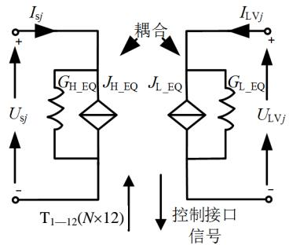  
图5级联H桥型PET的单相诺顿等效电路  
Fig. 5 Single-phase Thévenin equivalent circuit of cascaded H-bridge PET

$$
\left\{ \begin{array}{l} G _ {\mathrm {L} - \mathrm {E Q}} = \sum_ {i = 1} ^ {N} G _ {\mathrm {E X}} ^ {i} (1, 1) \\ J _ {\mathrm {L} - \mathrm {E Q}} = \sum_ {i = 1} ^ {N} J _ {\mathrm {E X}} ^ {\mathrm {T s f} - i} (1, 1) \end{array} \right. \tag {13}
$$

将图5所示的诺顿等效电路代入电磁暂态程序进行一个仿真步长的求解，得到 $U_{\mathrm{sj}}$ 、 $I_{\mathrm{sj}}$ 、 $U_{\mathrm{LVj}}$ 和 $I_{\mathrm{LVj}}$ ，随后需反解内部节点信息以更新各单元中储能元件（L、C、高频变压器中的电感）的电压和电流。

# 3.3 反解过程

反解的目的是通过得到电感、电容元件的等效历史电流源参数，以初始化下一个仿真步长的电气网络。下面以从 $N - i$ 个单元的等效外端子信息中反解出第 $N - i$ 个单元的端口信息为例加以说明。

对于串联连接的P1部分，第 $N - i$ 个单元和剩余部分的外部节点 $1^{\prime}$ 、 $2^{\prime}$ 的节点电压和注入电流可分别用式(14)和(15)计算得到，等式左边的上标表示所指的等效部分， $N - i$ 表示第 $N - i$ 个单元， $1\rightarrow$ $N - (i + 1)$ 表示其他还未反解出端口信息的单元。

$$
\left\{\begin{array}{l}V _ {1 ^ {\prime}} ^ {N - i} = V _ {2 ^ {\prime}} ^ {1 \rightarrow N - i} + \frac {I _ {1 ^ {\prime}} ^ {1 \rightarrow N - i} - J _ {\mathrm {E X}} ^ {N - i}}{G _ {\mathrm {E X}} ^ {N - i}}\\I _ {1 ^ {\prime}} ^ {N - i} = - I _ {2 ^ {\prime}} ^ {N - i} = I _ {1 ^ {\prime}} ^ {1 \rightarrow N - i}\\V _ {2 ^ {\prime}} ^ {N - i} = V _ {2 ^ {\prime}} ^ {1 \rightarrow N - i}\end{array}\right. \tag {14}
$$

$$
\left\{\begin{array}{l}V _ {1 ^ {\prime}} ^ {1 \rightarrow N - (i + 1)} = V _ {1 ^ {\prime}} ^ {1 \rightarrow N - i}\\I _ {1 ^ {\prime}} ^ {1 \rightarrow N - (i + 1)} = - I _ {2 ^ {\prime}} ^ {1 \rightarrow N - (i + 1)} = I _ {1 ^ {\prime}} ^ {1 \rightarrow N - i}\\V _ {2 ^ {\prime}} ^ {1 \rightarrow N - (i + 1)} = V _ {2 ^ {\prime}} ^ {1 \rightarrow N - i} + \frac {I _ {1 ^ {\prime}} ^ {1 \rightarrow N - i} - J _ {\mathrm {E X}} ^ {N - i}}{G _ {\mathrm {E X}} ^ {N - i}}\end{array}\right. \tag {15}
$$

对于并联连接的P2部分，第 $N - i$ 个单元和剩余部分的外部节点 $1^{\prime}$ 、 $2^{\prime}$ 的电压和注入电流可分别由式(16)和(17)得到。

$$
\left\{\begin{array}{l}V _ {1 ^ {\prime}} ^ {N - i} = V _ {2 ^ {\prime}} ^ {1 \rightarrow N - i}\\I _ {1 ^ {\prime}} ^ {N - i} = - I _ {2 ^ {\prime}} ^ {N - i} = J _ {\mathrm {E X}} ^ {N - i} + \left(V _ {1 ^ {\prime}} ^ {1 \rightarrow N - i} - V _ {2 ^ {\prime}} ^ {1 \rightarrow N - i}\right) G _ {\mathrm {E X}} ^ {N - i}\\V _ {2 ^ {\prime}} ^ {N - i} = V _ {2 ^ {\prime}} ^ {1 \rightarrow N - i}\end{array}\right. \tag {16}
$$

$$
\left\{\begin{array}{l}V _ {1 ^ {\prime}} ^ {1 \rightarrow N - (i + 1)} = V _ {1 ^ {\prime}} ^ {1 \rightarrow N - i}\\I _ {1 ^ {\prime}} ^ {1 \rightarrow N - (i + 1)} = - I _ {2 ^ {\prime}} ^ {1 \rightarrow N - (i + 1)} = I _ {1 ^ {\prime}} ^ {1 \rightarrow N - i}\\V _ {2 ^ {\prime}} ^ {1 \rightarrow N - (i + 1)} = V _ {2 ^ {\prime}} ^ {1 \rightarrow N - i} + \frac {I _ {1 ^ {\prime}} ^ {1 \rightarrow N - i} - J _ {\mathrm {E X}} ^ {N - i}}{G _ {\mathrm {E X}} ^ {N - i}}\end{array}\right. \tag {17}
$$

得到端口信息后，可通过式(18)反解内部节点电压和电流，再根据表1更新感性和容性元件的历史电流/电压值。

$$
\boldsymbol {V} _ {\mathrm {I N}} = \boldsymbol {G} _ {2 2} ^ {- 1} \left(\boldsymbol {J} _ {\mathrm {I N}} - \boldsymbol {G} _ {2 1} \boldsymbol {V} _ {\mathrm {E X}}\right) \tag {18}
$$

接着，由式(15)、(17)出发，从 $N - (i + 1)$ 个单元中继续反解，直至求解得到第一个单元的内部节点信息后结束。

级联H桥型PET的等效建模流程如图6所示。

# 4 仿真验证

# 4.1 PET闭环仿真模型

在 PSCAD/EMTDC 中分别搭建了如图 1 所示的三相级联 H 桥型 PET 系统的详细模型(detailed model, DM)和本文提出的等效模型(equivalent model, EM), 用以对比测试模型的精度和加速比。在搭建的模型中, 对图 1 中低压直流母线所连负载做了简化, 测试系统的详细参数见表 2。

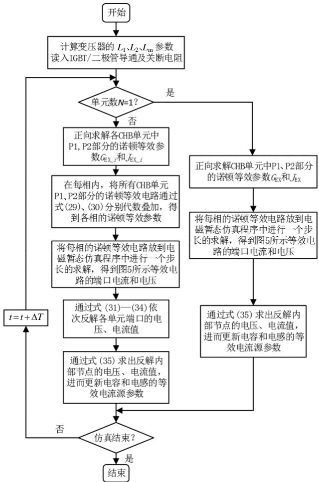  
图6级联H桥型PET的等效建模流程示意图  
Fig. 6 Schematic diagram of

the equivalent modeling process of cascaded H-bridge PET

表 2 PET 系统仿真参数  
Tab. 2 Simulation parameters of PET system   

<table><tr><td></td><td>参数</td><td>数值</td></tr><tr><td rowspan="5">系统</td><td>交流电压有效值/kV</td><td>10</td></tr><tr><td>低压母线直流电压额定值/kV</td><td>3</td></tr><tr><td>交流电压频率/Hz</td><td>50</td></tr><tr><td>系统等值电感/mH</td><td>30</td></tr><tr><td>每相CHB单元数目</td><td>3</td></tr><tr><td rowspan="9">PET</td><td>CHB单元高压侧电容/μF</td><td>1</td></tr><tr><td>CHB单元低压侧电容/μF</td><td>50</td></tr><tr><td>DAB附加电感/μH</td><td>100</td></tr><tr><td>级联H桥开关频率/kHz</td><td>1</td></tr><tr><td>DAB开关频率/kHz</td><td>4.5</td></tr><tr><td>高频变压器容量/MVA</td><td>0.3</td></tr><tr><td>高频变压器变比</td><td>3/3</td></tr><tr><td>漏抗/pu</td><td>0.1</td></tr><tr><td>励磁电流/pu</td><td>0.004</td></tr><tr><td>负载</td><td>输出侧负载电阻/Ω</td><td>20</td></tr></table>

本算例采用文献[21]中提出的一种控制策略，即对级联H桥级采取dq解耦双闭环控制，外环有功类控制量为DAB低压母线电压 $V_{\mathrm{dc\_L}}$ ，无功类控

制量设为0，控制框图如图7所示。由于DAB低压母线电压已通过调节级联H桥级的PWM调制波来控制，因此该级可采取固定移相角控制，设为 $16.2^{\circ}$ 。在调制方式方面，整流级的级联H桥采用了双极性载波移相控制，中间隔离级的DAB变换器采用单移相方波调制。

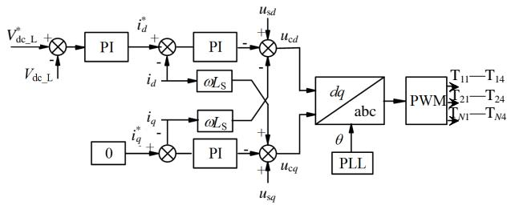  
图7 CHB闭环控制策略框图  
Fig. 7 Closed-loop control strategy block diagram of PET

# 4.2 模型仿真精度分析

在测试系统中分别设置了稳态、输出电压抬升、低压直流母线短路故障等3类工况。测试模型中仿真步长为 $5\mu \mathrm{s}$ 。具体时序如下：

1）0~0.4s：系统启动。  
2）0.4~1.7s：在0.4s时系统达到额定运行状态。  
3）1.7~2s：在1.7s时PET低压侧直流母线电压开始抬升，控制指令由 $3\mathrm{kV}$ 上升至 $4\mathrm{kV}$ ，斜率为 $3.33\mathrm{kV} / \mathrm{s}$ 。  
4）2.5~2.52s：在2.5s时PET低压侧直流母线发生短路故障，过渡电阻为 $1\Omega$ 。

# 4.2.1 稳态运行工况

图8(a)—(c)分别为稳态时级联H桥的输入侧电流、输入侧电流的总谐波畸变率和DAB低压母线电压。

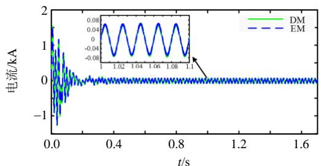  
(a) CHB输入侧电流

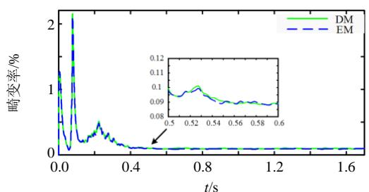  
(b) CHB输入侧电流总谐波畸变率

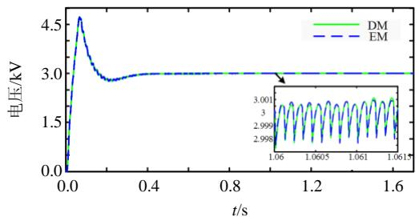  
(c) DAB低压侧母线电压   
图8 PET系统稳态波形对比   
Fig. 8 Steady-state waveform comparison of the PET system

图中的DM和EM曲线分别表示等效模型和详细模型的仿真结果。可以发现，CHB输入电流的正弦化程度较高，而其总的谐波畸变率在 $9\%$ 左右，实际工程中相比本算例而言，级联的CHB子模块个数会更多，谐波畸变率可以更低。DAB低压侧母线电压被控制在额定电压附近，控制效果较好，经计算，其最大相对误差分别为 $0.23\%$ ，波形吻合程度较高。

图9(a)、(b)分别为详细模型和本文提出的等效模型中9个CHB单元(每相各有3个单元)的高压侧电容电压和DAB低压母线电压。各CHB单元高压侧电容均呈现二倍频波动且较为均衡，使能量往低压侧传输。二者的电容电压纹波幅值是基本一致的。

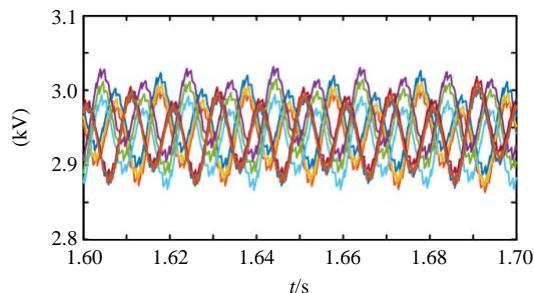  
(a) 9个CHB单元高压侧电容电压(DM)

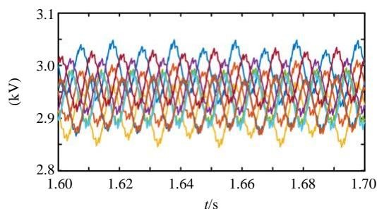  
(b) 9个CHB单元高压侧电容电压(EM)   
图9各CHB单元高压侧电容电压对比  
Fig. 9 Comparison of capacitor voltage high-voltage side of each CHB unit

# 4.2.2 暂态工况

在 $t = 1.7\mathrm{s}$ 时，DAB低压母线电压的参考值由

3kV斜坡上升至4kV，斜率为3.33kV/s。图10(a)、(b)分别为DAB低压母线电压及其参考值、单个CHB单元高压侧电容电压，可以发现，DAB低压侧母线电压在2s时已上升至4kV，且超调量较小，验证了控制策略及参数的合理性。

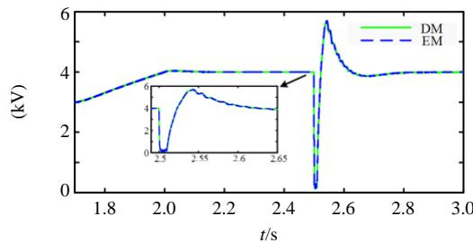  
(a) DAB低压侧母线电压

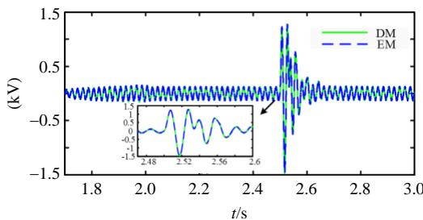  
(b) CHB 输入侧电流   
图10 PET系统暂态波形对比  
Fig. 10 Transient waveforms comparison of the PET system

在 $t = 2.5 \mathrm{~s}$ 时，DAB低压直流母线所接负载发生短路故障，过渡电阻为 $1\Omega$ 。随着线间电阻的减小，低压母线电压也迅速降低至0附近。在上述暂态过程中，等效模型和详细模型的最大相对误差为 $0.76\%$ 和 $1.39\%$ ，重合度较高。

# 4.3 CPU时间对比

本节分别搭建了每相3、5、9和12个CHB单元的三相PET系统的开环详细模型和等效模型，并对二者的CPU用时进行了比较，计算了相应的加速比，如表3所示。开环模型中高频变压器工作频率设置为 $10\mathrm{kHz}$ ，其它系统参数与表2一致。测试机配置为Intel(R)Core(TM)i7-8700 3.70GHz CPU16GB RAM。仿真总时长为1s，仿真步长为 $5\mu s$

表 3 测试模型仿真 1s 的 CPU 用时对比  
Tab. 3 Comparison of CPU time of test model with 1s simulation duration   

<table><tr><td>单相模块数</td><td>EMTDC仿真模型/s</td><td>本文模型/s</td><td>加速比</td></tr><tr><td>3</td><td>59.563</td><td>1.860</td><td>32.0</td></tr><tr><td>5</td><td>108.063</td><td>2.859</td><td>37.8</td></tr><tr><td>9</td><td>893.532</td><td>4.312</td><td>207.2</td></tr><tr><td>12</td><td>2156.130</td><td>5.688</td><td>379.0</td></tr></table>

由表2的测试数据可以看出，在相同模块个数下，三相级联H桥型PET详细模型的CPU仿真用时要明显长于对应的等效模型，且随着模块数的增加，这一差距将越明显。当单相模块数为12时，加速比达到了379倍，提速效果较为显著。

# 5 结论

提出了一种适用于级联H桥型PET的电磁暂态等效建模方法，并给出了建模步骤。构造了高频变压器原/副边的解耦伴随电路，使得CHB单元在当前仿真步长下，可等效为两个单端口电路，进而基于快速嵌套同时求解算法，对等效部分正向求解戴维南/诺顿等效参数、整体求解，反解以初始化下一个仿真步长的电气网络，在整体求解过程中计算复杂度几乎不随子模块个数增加。

在 PSCAD/EMTDC 中搭建了级联 H 桥型 PET 的详细模型和本文所提的等效模型，验证了所提模型的精度和提速效果。验证结果表明，在具有足够精度的同时，所开发级联 H 桥 PET 等效模型可以显著提高仿真速度。另外，对于其他包含隔离变压器且具有多级电能变换结构的变换器建模，本文所提的等效方法也具有一定的借鉴意义。

# 参考文献

[1] 李子欣，高范强，赵聪，等．电力电子变压器技术研究综述[J].中国电机工程学报，2018，38(5)：1274-1289. Li Zixin，Gao Fanqiang，Zhao Cong，et al. Research review of power electronic transformer technologies[J]. Proceedings of the CSEE，2018，38(5)：1274-1289(in Chinese).  
[2] 李子欣，王平，楚遵方，等．面向中高压智能配电网的电力电子变压器研究[J].电网技术，2013，37(9)：2592-2601. Li Zixin，Wang Ping，Chu Zunfang，et al. Research on medium-and high-voltage smart distribution grid oriented power electronic transformer[J].Power System Technology，2013，37(9):2592-2601(in Chinese).  
[3] Costa L F, Hoffmann F, Buticchi G, et al. Comparative analysis of multiple active bridge converters configurations in modular smart transformer[J]. IEEE Transactions on Industrial Electronics, 2019, 66(1): 191-202.   
[4] Ferreira Costa L, De Carne G, Buticchi G, et al. The smart transformer: a solid-state transformer tailored to provide ancillary services to the distribution grid[J]. IEEE Power Electronics Magazine, 2017, 4(2): 56-67.   
[5] 王丹，毛承雄，陆继明，等．配电系统电子电力变压器不对称负载仿真[J]. 中国电力，2005，38(11)：21-26.

Wang Dan, Mao Chengxiong, Lu Jiming, et al. Simulation research on imbalance loads of electronic power transformer in distribution system[J]. Electric Power, 2005, 38(11): 21-26(in Chinese).   
[6] 何金平，毛承雄，陆继明，等．三相线电压级联多电平变换器原理及仿真研究[J]. 高电压技术，2007，33(4)：170-174.  
He Jinping, Mao Chengxiong, Lu Jiming, et al. Research on three phase line voltage cascaded multilevel converter[J]. High voltage Engineering, 2007, 33(4): 170-174(in Chinese).   
[7] 孙玉巍，李永刚，刘教民，等．级联式电力电子变压器协调控制策略[J].中国电机工程学报，2018，38(5)：1290-1300.  
Sun Yuwei, Li Yonggang, Liu Jiaomin, et al. Coordinative control strategy for cascaded power electronic transformer[J]. Proceedings of the CSEE, 2018, 38(5): 1290-1300(in Chinese).   
[8] Zhao Tiefu. Design and control of a cascaded H-bridge converter based solid state transformer (SST)[D]. North Carolina State University, 2010.   
[9] 尹平平，王韦华. 基于FPGA的直流变压器实时仿真研究[J]. 电力系统保护与控制，2017，45(10)：140-145. Yin Pingping，Wang Weihua. FPGA based real time simulation and research of DCSST[J]. Power System Protection and Control，2017，45(10)：140-145(in Chinese).  
[10] Pejovic P, Maksimovic D. A new algorithm for simulation of power electronic systems using piecewise-linear device models[J]. IEEE Transactions on Power Electronics, 1995, 10(3): 340-348.   
[11] Xu Jianzhong, Fan Shengtao, Zhao Chengyong, et al. High-speed EMT modeling of MMCs with arbitrary multiport submodule structures using generalized Norton equivalents[J]. IEEE Transactions on Power Delivery, 2018, 33(3): 1299-1307.   
[12] 徐义良，赵成勇，赵禹辰，等．双端口子模块MMC电磁暂态通用等效建模方法[J].中国电机工程学报，2018，38(20)：6079-6090.  
Xu Yiliang, Zhao Chengyong, Zhao Yuchen, et al. Generalized electromagnetic transient (EMT) equivalent modeling of MMCs with arbitrary two-port sub-module structures[J]. Proceedings of the CSEE, 2018, 38(20): 6079-6090(in Chinese).   
[13] Xu Jianzhong, Zhao Yuchen, Zhao Chengyong, et al. Unified high-speed EMT equivalent and implementation method of MMCs with single-port submodules[J]. IEEE Transactions on Power Delivery, 2019, 34(1): 42-52.   
[14] Watson N, Arrillaga J. Power systems electromagnetic transients simulation[M]. London: The Institution of Electrical Engineers, 2003: 68-71.   
[15] Dommel H W. Digital computer solution of

electromagnetic transients in single-and multiphase networks[J]. IEEE Transactions on Power Apparatus and Systems, 1969, PAS-88(4): 388-399.   
[16] Gnanarathna U N, Gole A M, Jayasinghe R P. Efficient modeling of modular multilevel HVDC converters (MMC) on electromagnetic transient simulation programs[J]. IEEE Transactions on Power Delivery, 2011, 26(1): 316-324.   
[17] 何冰松，李松，周治国，等．模块化多电平换流器实时仿真的快速实现方法[J]. 高电压技术，2018，44(7)：2165-2172.  
He Bingsong, Li Song, Zhou Zhiguo, et al. Fast realization method for real-time simulation of modular multilevel converter[J]. High Voltage Engineering, 2018, 44(7): 2165-2172(in Chinese).   
[18] PSCAD X4 user's guide[M]. Winnipeg, MB, Canada: Manitoba Research Center, 2009.   
[19] Strunz K, Carlson E. Nested fast and simultaneous solution for time-domain simulation of integrative power-electric and electronic systems[J]. IEEE Transactions on Power Delivery, 2007, 22(1): 277-287.   
[20] 张伯明，陈寿孙，严正．高等电力网络分析[M]. 2版. 北京：清华大学出版社，2007：123-124.  
[21] 王哲，李耀华，李子欣，等．基于阻抗特性的级联 H 桥型 PET 并网稳定性分析[J]. 电网技术，2020，44(03)：1070-1079.  
Wang Zhe, Li Yaohua, Li Zixin, et al. Stability Analysis of Grid-connected Cascaded H-Bridge PET Based on Impedance Characteristic[J]. Power System Technology, 2020, 44(03): 1070-1079.

  
丁江萍

在线出版日期：2020-04-15。

收稿日期：2019-11-28。

作者简介：

丁江萍(1997)，女，硕士研究生，研究方向为柔性直流输电建模与仿真、电力电子变压器建模等，1459085313@qq.com;

高晨祥(1997)，男，硕士研究生，研究方向为高压直流输电MMC电磁暂态建模，1179968057@qq.com;

*通信作者：许建中(1987)，男，副教授，研究方向为直流输电等，xujianzhong@ncepu.edu.cn;

赵成勇(1964)，男，教授，博士生导师，研究方向为直流输电等，chengyongzhao@ncepu.edu.cn;

曹均正(1960)，男，博士，教授级高级工程师，研究方向为柔性交流输电、高压直流输电、未来直流电网应用开发和工程实践，caojunzheng@sgri.sgcc.com.cn。

(责任编辑 吕鲜艳)

# Electromagnetic Transient Equivalent Modeling Method of Cascaded H-bridge Power Electronic Transformer

DING Jiangping1, GAO Chenxiang1, XU Jianzhong1*, ZHAO Chengyong1, CAO Junzheng2

(1. North China Electric Power University; 2. C-EPRI Electric Power Engineering Co., Ltd.)

KEY WORDS: cascaded H-bridge (CHB); decoupling companion circuit; power electronic transformer (PET); Norton and Thévenin's equivalent; electromagnetic transient (EMT); equivalent modeling

Power electronic transformers (PET) used in medium- and high-voltage distribution networks have widely adopted a two-stage structure composed of a cascaded H-bridge rectifier and a dual active bridge DC/DC converter.

Aiming at the problem of extremely slow simulation speed in offline simulation platforms such as PSCAD/EMTDC, Matlab, etc., based on Norton equivalent and nested fast simultaneous solving algorithm, a speed-up model of electromagnetic transient simulation of cascaded H-bridge PET is proposed as shown in Fig. 1.

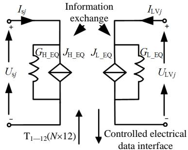  
Fig.1 One-phase Thévenin equivalent circuit of cascaded H-bridge PET

Specifically, by flexibly constructing the decoupling adjoint network of the primary/secondary side of the high-frequency transformer, the cascaded submodule is divided into two single-port networks. The theoretical proof is simply given as follows.

Solving differential equations of transformer port current by trapezoidal integration yields:

$$
\left[ \begin{array}{l} I _ {1} (t) \\ I _ {2} (t) \end{array} \right] = \left[ \begin{array}{l l} G _ {\mathrm {A A}} & G _ {\mathrm {A B}} \\ G _ {\mathrm {B A}} & G _ {\mathrm {B B}} \end{array} \right] \left(\left[ \begin{array}{l} V _ {1} (t) \\ V _ {2} (t) \end{array} \right] + \left[ \begin{array}{l} V _ {1} (t - \Delta T) \\ V _ {2} (t - \Delta T) \end{array} \right]\right) + \left[ \begin{array}{l} I _ {1} (t - \Delta T) \\ I _ {2} (t - \Delta T) \end{array} \right] \tag {1}
$$

Collecting together the past history and instantaneous terms gives:

$$
\left[ \begin{array}{l} I _ {1} (t) \\ I _ {2} (t) \end{array} \right] = \left[ \begin{array}{c c} G _ {\mathrm {A A}} ^ {\mathrm {D}} & 0 \\ 0 & G _ {\mathrm {B B}} ^ {\mathrm {D}} \end{array} \right] \left[ \begin{array}{l} V _ {1} (t) \\ V _ {2} (t) \end{array} \right] + \left[ \begin{array}{c} J _ {\mathrm {T E Q} - \mathrm {H I S} 1} ^ {\mathrm {D}} \\ J _ {\mathrm {T E Q} - \mathrm {H I S} 2} ^ {\mathrm {D}} \end{array} \right] \tag {2}
$$

$$
\left\{ \begin{array}{l} G _ {\mathrm {A A}} ^ {\mathrm {D}} = G _ {\mathrm {A A}} \\ G _ {\mathrm {B B}} ^ {\mathrm {D}} = G _ {\mathrm {B B}} \\ J _ {\mathrm {T E Q} _ {-} \mathrm {H I S 1}} ^ {\mathrm {D}} = G _ {\mathrm {A A}} v _ {1} (t - \Delta T) + G _ {\mathrm {A B}} v _ {2} (t - \Delta T) + i _ {1} (t - \Delta T) + G _ {\mathrm {A B}}. \\ v _ {2} (t - \Delta T) \approx G _ {\mathrm {A A}} v _ {1} (t - \Delta T) + 2 G _ {\mathrm {A B}} v _ {2} (t - \Delta T) + i _ {1} (t - \Delta T) \\ J _ {\mathrm {T E Q} _ {-} \mathrm {H I S 2}} ^ {\mathrm {D}} = G _ {\mathrm {A B}} v _ {1} (t - \Delta T) + G _ {\mathrm {B B}} v _ {2} (t - \Delta T) + i _ {2} (t - \Delta T) + G _ {\mathrm {A B}}. \\ v _ {1} (t - \Delta T) \approx 2 G _ {\mathrm {A B}} v _ {1} (t - \Delta T) + G _ {\mathrm {B B}} v _ {2} (t - \Delta T) + i _ {2} (t - \Delta T) \end{array} \right. \tag {3}
$$

Then use the Nested Fast and Simultaneous Solution (NFSS) algorithm to deal with (4) and obtain Thevenin equivalent parameters derived from (5), (6). Then the computational complexity of the proposed model in the overall solution process is decreased without losing any accuracy.

$$
\left[ \begin{array}{l} \boldsymbol {G} _ {1 1} \\ \overline {{\boldsymbol {G}}} _ {2 1} \end{array} \right] \left[ \begin{array}{l} \boldsymbol {G} _ {1 2} \\ \overline {{\boldsymbol {G}}} _ {2 2} \end{array} \right] \left[ \begin{array}{l} \boldsymbol {V} _ {\mathrm {E X}} \\ \overline {{\boldsymbol {V}}} _ {\mathrm {I N}} \end{array} \right] = \left[ \begin{array}{l} \boldsymbol {J} _ {\mathrm {E X}} \\ \boldsymbol {J} _ {\mathrm {I N}} \end{array} \right] + \left[ \begin{array}{l} \boldsymbol {I} _ {\mathrm {E X}} \\ 0 \end{array} \right] \tag {4}
$$

$$
\boldsymbol {G} _ {\mathrm {E X}} \boldsymbol {V} _ {\mathrm {E X}} = \boldsymbol {J} _ {\mathrm {E X}} ^ {\mathrm {T S F}} + \boldsymbol {I} _ {\mathrm {E X}} \tag {5}
$$

$$
\left\{ \begin{array}{l} \boldsymbol {G} _ {\mathrm {E X}} = \boldsymbol {G} _ {1 1} - \boldsymbol {G} _ {1 2} \boldsymbol {G} _ {2 2} ^ {- 1} \boldsymbol {G} _ {2 1} \\ \boldsymbol {J} _ {\mathrm {E X}} ^ {\text {T s f}} = \boldsymbol {J} _ {\mathrm {E X}} - \boldsymbol {G} _ {2 2} ^ {- 1} \boldsymbol {G} _ {2 1} \boldsymbol {J} _ {\mathrm {I N}} \end{array} \right. \tag {6}
$$

The detailed model (detailed model (DM)) and the equivalent model (EM) proposed in this paper of the three-phase cascaded H-bridge PET system are built in PSCAD/EMTDC for Model accuracy and speedup factor comparison test. Fig. 2 shows two kinds of transient working conditions, namely the voltage rise of the DC low-voltage DC bus $(1.7\sim 2s)$ and the short-circuit between the low-voltage DC buses $(2.5\sim 2.52s)$ . After testing, when the number of single-phase modules is 12, the speedup ratio reaches 379 times which is much significant.

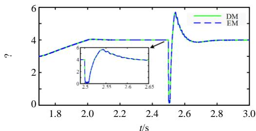  
(a) DAB low-side bus voltage

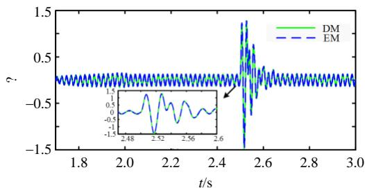  
(b) CHB input side current   
Fig. 2 Transient waveforms comparison of the PET system