# Hybrid-model transient stability simulation using dynamic phasors based HVDC system model

Haojun Zhu a,∗, Zexiang Cai a, Haoming Liu b, Qingru Qi c, Yixin Ni d,e

a College of Electrical Engineering, South China University of Technology, Guangzhou 510640, China

b Department of Electrical Engineering, Southeast University, Nanjing 210096, China

c North China Power Engineering Co. Ltd., Beijing 100084, China

d Department of Electrical and Electronic Engineering, The University of Hong Kong,

Hong Kong, China

e Graduate School at Shenzhen, Tsinghua University, Shenzhen 518055, China

Received 4 April 2005; received in revised form 25 August 2005; accepted 25 September 2005

Available online 21 November 2005

# Abstract

A novel hybrid-model transient stability simulation algorithm for ac/dc power systems is suggested in this paper, where dynamic phasors theory is applied for HVDC transmission system modeling, and traditional electromechanical transient models are used for ac system. A detailed dynamicphasors-based HVDC system model is derived first, and the algorithm for interface of the dc dynamic phasors model to ac network is proposed next. Computer simulation results show that the HVDC dynamic phasors model has very good accuracy as compared with its electromagnetic transient model; the test results from a 2-area ac/dc power system and a multi-infeed HVDC power system show clearly that the suggested interface algorithm works effectively in system transient stability analysis. The proposed hybrid-model simulation algorithm provides a new approach for dynamic simulation of large-scale ac/dc power systems.

© 2005 Elsevier B.V. All rights reserved.

Keywords: Hybrid-model simulation; Dynamic phasors; Transient stability; HVDC transmission

# 1. Introduction

HVDC transmission system plays an important role in modern large-scale interconnected power systems. In order to study the impacts of HVDC system on large-scale ac/dc power system performance, developing a sophisticated HVDC system model is significant. In traditional time-domain simulation programs, two types of HVDC system models are often used. One is the electromagnetic transient (EMT) model with very small step length (no more than 0.1 ms), which considers detailed valve operation and their impacts on system transients. The other is the quasi-steadystate (QSS) or average-value model widely used in transient stability simulation with larger step length (say 5 ms). In general the former is not suitable for large-scale ac/dc power system transient stability analysis for its tiny time step and overall cpu time cost; while the latter is difficult to consider asymmetric ac

faults and dc converter commutation failure impacts on transient stability for the model simplification.

In recent years, dynamic phasors theory and relevant methods [1] have been applied in modeling power electronic devices (PEDs). Based on the time-varying coefficients of dominant items in Fourier series, dynamic phasors method has the potential to fill in the gap between the EMT and QSS models [2]. By truncating unimportant higher order components and keeping only those significant components, the dynamic phasors model is capable of retaining the dominant dynamic features of PEDs and suitable to power system transient stability study. This approach has been successfully applied in the modeling of certain FACTS devices, such as TCSC and UPFC, and ac machines with PED controllers [3–6]. In this paper, dynamic phasors method has been extended to HVDC transmission system modeling for large-scale ac/dc powers system transient stability simulation.

In the paper, a detailed dynamic-phasors-based HVDC model is derived first. Using switching functions to describe the switching status of each converter bridge and applying

dynamic phasors method in converter modeling, the behaviors of the dc system can be described accurately. After that a novel hybrid-model simulation algorithm for ac/dc power systems transient stability analysis is suggested, where dc system is in dynamic phasors model and ac system is in traditional electromechanical transient model. The interface algorithm of ac and dc systems in each time step is proposed based on Newton–Raphson method for better convergence. Computer test results show that HVDC dynamic phasor model has very good accuracy as compared with its electromagnetic transient model but uses much less cpu time in simulation; and the test results from a 2-area ac/dc power system and a multi-infeed HVDC power system show clearly the effectiveness of the suggested interface algorithm in transient stability analysis.

# 2. HVDC modeling using dynamic phasors

# 2.1. Outline of the dynamic phasors method

The method of dynamic phasors [1] is based on the timevarying coefficients of Fourier series. An outline of the method is given below. A time-domain waveform x(τ) can be expressed over the time interval $\tau \in ( t - T , t )$ using Fourier series as [1]:

$$
x (\tau) = \sum_ {k = - \infty} ^ {\infty} X _ {k} (t) \mathrm {e} ^ {j k \omega_ {\mathrm {s}} \tau} \tag {1}
$$

where $\omega _ { \mathrm { s } } = 2 \pi / T$ and $X _ { k } ( t )$ is the kth Fourier coefficient and named as a dynamic phasor. Jointly the dynamic phasors can describe the original waveform precisely.

The kth dynamic phasor at time t can be determined by the following expression and denoted later on as $\langle x \rangle _ { k } ( t )$ :

$$
X _ {k} (t) = \frac {1}{T} \int_ {t - T} ^ {t} x (\tau) \mathrm {e} ^ {- j k \omega_ {s} \tau} \mathrm {d} \tau = \langle x \rangle_ {k} (t) \tag {2}
$$

When the window (of length T) slides over the waveform $x ( \tau )$ of interest, the phasor $X _ { k } ( t )$ is changing accordingly. It is clear that dynamic phasors are based on the time-varying Fourier series coefficients relevant to the sliding window over the real waveforms.

There are two essential operations for dynamic phasors in addition to superposition operation, which are significant to dynamic phasors model derivations.

• Differential operation. For the kth Fourier coefficient, the differentiation operation satisfies the following formula:

$$
\frac {\mathrm {d} X _ {k}}{\mathrm {d} t} (t) = \left\langle \frac {\mathrm {d} x}{\mathrm {d} t} \right\rangle_ {k} (t) - j k \omega_ {\mathrm {s}} X _ {k} (t) \tag {3}
$$

• Product operation. For two waveforms $x ( t )$ and $q ( t )$ , the kth phasor of their product can be obtained by

$$
\langle x q \rangle_ {k} = \sum_ {i} \langle x \rangle_ {k - i} \langle q \rangle_ {i} \tag {4}
$$

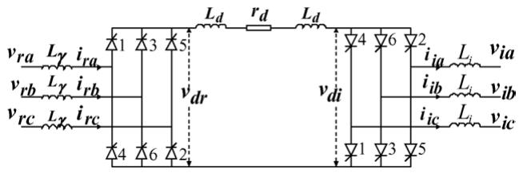  
Fig. 1. Schematic diagram of an HVDC system.

Considering dynamic phasors as special state variables, the dynamic phasors based new state-space model can be established. By truncating those unimportant components, the model is simplified with only dominant components remaining, which is the key idea for dynamic phasor modeling. In general the physical characteristics of the studied problem determine which components should be neglected or kept.

# 2.2. Time-domain dynamic model of HVDC

A schematic diagram of a single-pole HVDC transmission system is shown in Fig. 1.

For the rectifier, the instantaneous values of ac phase voltages are assumed to be:

$$
v _ {\mathrm {r a}} = \sqrt {\frac {2}{3}} E _ {\mathrm {r}} \sin (\omega t + 3 0 ^ {\circ}), \quad v _ {\mathrm {r b}} = \sqrt {\frac {2}{3}} E _ {\mathrm {r}} \sin (\omega t - 9 0 ^ {\circ}),
$$

$$
v _ {\mathrm {r c}} = \sqrt {\frac {2}{3}} E _ {\mathrm {r}} \sin (\omega t + 1 5 0 ^ {\circ}) \tag {5}
$$

where $E _ { \mathrm { r } }$ is the effective value of line to line voltage. Assume that $v _ { \mathrm { r a c } } = v _ { \mathrm { r a } } - v _ { \mathrm { r c } } = 0 ( v _ { \mathrm { r a } } > 0 , v _ { \mathrm { r c } } > 0 )$ at the moment of $t = t _ { \mathrm { p } }$ , and $t _ { \mathrm { p } }$ is taken as the time reference of the dc phasor model.

Assume that $S _ { \mathrm { r v } _ { 1 } } , S _ { \mathrm { r v } _ { 2 } } , \ldots , S _ { \mathrm { r v } _ { 6 } }$ are the switching functions relevant to the status of rectifier valves $\mathrm { V } _ { 1 } { - } \mathrm { V } _ { 6 }$ and the dc voltage of rectifier can be described as:

$$
\begin{array}{l} v _ {\mathrm {d r}} = \left(v _ {\mathrm {r a}} S _ {\mathrm {r v} _ {1}} + v _ {\mathrm {t b}} S _ {\mathrm {r v} _ {3}} + v _ {\mathrm {r c}} S _ {\mathrm {r v} _ {5}}\right) \\ - \left(v _ {\mathrm {r a}} S _ {\mathrm {r v} _ {4}} + v _ {\mathrm {r b}} S _ {\mathrm {r v} _ {6}} + v _ {\mathrm {r c}} S _ {\mathrm {r v} _ {2}}\right) \tag {6} \\ \end{array}
$$

Taking the switching function of valve 1 as an example, $S _ { \mathrm { r v _ { 1 } } } = 1$ , 0, or 0.5 when the valve is turning on; or turning off; or in commutation [7]. Based on the rectifier operation principle, we can derive the switching function $S _ { \mathrm { r v } _ { j } }$ for the period of 2π as

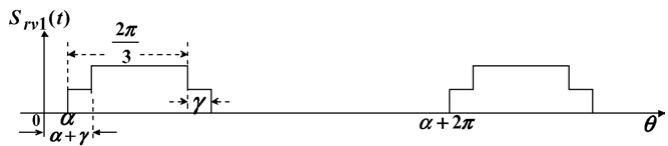

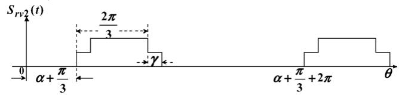  
Fig. 2. Waveform of switching functions $S _ { \mathrm { r v _ { 1 } } }$ and $S _ { \mathrm { r v } _ { 2 } }$ .

(see Fig. 2):

$$
S _ {\mathrm {r v} _ {j}} = \left\{ \begin{array}{l l} \frac {1}{2} & \left[ \alpha + (j - 1) \frac {\pi}{3}, \alpha + \gamma + (j - 1) \frac {\pi}{3} \right] \\ 1 & \left[ \alpha + \gamma + (j - 1) \frac {\pi}{3}, \alpha + \frac {2 \pi}{3} + (j - 1) \frac {\pi}{3} \right] \\ \frac {1}{2} & \left[ \alpha + \frac {2 \pi}{3} + (j - 1) \frac {\pi}{3}, \alpha + \gamma + \frac {2 \pi}{3} + (j - 1) \frac {\pi}{3} \right], \\ 0 & \left[ \alpha + \gamma + \frac {2 \pi}{3} + (j - 1) \frac {\pi}{3}, \alpha + 2 \pi + (j - 1) \frac {\pi}{3} \right] \end{array} , j = 1, 2, \dots , 6 \right. \tag {7}
$$

where γ is the commutation angle, and α is the lagging firingangle.

Then the expression of the $S _ { \dot { \mathrm { { r i } } } j }$ for the period of 2π will be (see Fig. 3):

$$
S _ {\mathrm {r i} _ {j}} = \left\{ \begin{array}{l l} \frac {\theta - \alpha}{\gamma} & \left[ \alpha + (j - 1) \frac {\pi}{3}, \alpha + \gamma + (j - 1) \frac {\pi}{3} \right] \\ 1 & \left[ \alpha + \gamma + (j - 1) \frac {\pi}{3}, \alpha + \frac {2 \pi}{3} + (j - 1) \frac {\pi}{3} \right] \\ 1 - \frac {\theta - \alpha - 2 \pi / 3}{\gamma} & \left[ \alpha + \frac {2 \pi}{3} + (j - 1) \frac {\pi}{3}, \alpha + \gamma + \frac {2 \pi}{3} + (j - 1) \frac {\pi}{3} \right], \\ 0 & \left[ \alpha + \gamma + \frac {2 \pi}{3} + (j - 1) \frac {\pi}{3}, \alpha + 2 \pi + (j - 1) \frac {\pi}{3} \right] \end{array} , j = 1, 2, \dots , 6 \right. \tag {10}
$$

Now we define current relevant switching functions. Assume that $S _ { \mathrm { r i _ { 1 } } } , S _ { \mathrm { r i _ { 2 } } } , \ldots , S _ { \mathrm { r i _ { 6 } } }$ are current-relevant switching functions of the rectifier valves $\mathrm { V } _ { 1 } { - } \mathrm { V } _ { 6 } ,$ , and $\mathrm { i } _ { 1 } \mathrm { - } \mathrm { i } _ { 6 }$ are currents that flow through the valves $\mathrm { V } _ { 1 } { - } \mathrm { V } _ { 6 }$ . The ac currents of the rectifier terminal can be described as:

$$
i _ {\mathrm {r a}} = i _ {1} - i _ {4} = i _ {\mathrm {d}} S _ {\mathrm {r i} _ {1}} - i _ {\mathrm {d}} S _ {\mathrm {r i} _ {4}}, \quad i _ {\mathrm {r b}} = i _ {3} - i _ {6} = i _ {\mathrm {d}} S _ {\mathrm {r i} _ {3}} - i _ {\mathrm {d}} S _ {\mathrm {r i} _ {6}},
$$

$$
i _ {\mathrm {r c}} = i _ {5} - i _ {2} = i _ {\mathrm {d}} S _ {\mathrm {r i} _ {5}} - i _ {\mathrm {d}} S _ {\mathrm {r i} _ {2}} \tag {8}
$$

For simplicity we suppose the commutation current can be considered to change linearly with the slopes of 1/γ and −1/γ (see Fig. 3), where the commutation angle γ is calculated by an approximate equation [8]:

$$
\gamma = - \alpha + \cos^ {- 1} \left(\cos \alpha - \frac {2 \omega L _ {\gamma} i _ {\mathrm {d}}}{\sqrt {2} E}\right) \tag {9}
$$

Eq. (9) will bring some error to the following $S _ { \mathrm { r } i j }$ calculation, but the error can be neglected in most cases.

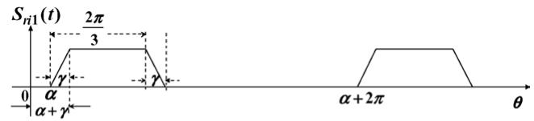

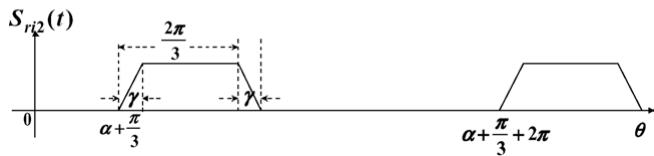  
Fig. 3. Waveform of switching functions $S _ { \mathrm { r i _ { 1 } } }$ and $S _ { \dot { \mathrm { { r i } } } _ { 2 } }$ .

The inverter (with subscript i) can be handled in the same way and hence we can get (see Fig. 1):

$$
\begin{array}{l} v _ {\mathrm {d i}} = \left(v _ {\mathrm {i a}} S _ {\mathrm {i v} 4} + v _ {\mathrm {i b}} S _ {\mathrm {i v} 6} + v _ {\mathrm {i c}} S _ {\mathrm {i v} 2}\right) \\ - \left(v _ {\mathrm {i a}} S _ {\mathrm {i v} _ {1}} + v _ {\mathrm {i b}} S _ {\mathrm {i v} _ {3}} + v _ {\mathrm {i c}} S _ {\mathrm {i v} _ {5}}\right) \tag {11} \\ \end{array}
$$

$$
i _ {\mathrm {i a}} = i _ {\mathrm {d}} S _ {\mathrm {i i} _ {1}} - i _ {\mathrm {d}} S _ {\mathrm {i i} _ {4}}, \quad i _ {\mathrm {i b}} = i _ {\mathrm {d}} S _ {\mathrm {i i} _ {3}} - i _ {\mathrm {d}} S _ {\mathrm {i i} _ {6}},
$$

$$
i _ {\mathrm {i c}} = i _ {\mathrm {d}} S _ {\mathrm {i i} _ {5}} - i _ {\mathrm {d}} S _ {\mathrm {i i} _ {2}} \tag {12}
$$

From Fig. 1, we also have:

$$
(2 L _ {\mathrm {d}}) \frac {\mathrm {d} i _ {\mathrm {d}}}{\mathrm {d} t} + r _ {\mathrm {d}} i _ {\mathrm {d}} = v _ {\mathrm {d r}} - v _ {\mathrm {d i}} \tag {13}
$$

which is corresponding to the dc line.

# 2.3. Dynamic phasors model of HVDC system

In this paper, the HVDC system model is established for transient stability hybrid simulation. Therefore only the component in HVDC system which is significant to generators rotor synchronous stability will be considered. As we all know the component of generator electromagnetic torque which strongly participates to the rotor synchronous stability is dominantly related to the fundamental-wave voltages and currents (k = 1) in ac network. Therefore for the HVDC system, assuming most of higher-order characteristic harmonics are filtered out by ac and dc filters, we shall only keep dc and fundamental frequency components in stability analysis. Nevertheless, truncating higherorder harmonics will inevitably bring error to the model, but we think the error is acceptable in the case of transient stability time-domain simulation, which is shown in computer test results of Section 4. Hence for all the switching functions both

dc and fundamental frequency components should be retained in deriving dc system dynamic phasors model. Based on this assumption, we first consider the rectifier and have (see (8)):

$$
\langle i _ {\mathrm {r a}} \rangle_ {1} = \langle S _ {\mathrm {r i} _ {1}} i _ {\mathrm {d}} \rangle_ {1} - \langle S _ {\mathrm {r i} _ {4}} i _ {\mathrm {d}} \rangle_ {1}, \qquad \langle i _ {\mathrm {r b}} \rangle_ {1} = \langle S _ {\mathrm {r i} _ {3}} i _ {\mathrm {d}} \rangle_ {1} - \langle S _ {\mathrm {r i} _ {6}} i _ {\mathrm {d}} \rangle_ {1},
$$

$$
\langle i _ {\mathrm {r c}} \rangle_ {1} = \langle S _ {\mathrm {r i} _ {5}} i _ {\mathrm {d}} \rangle_ {1} - \langle S _ {\mathrm {r i} _ {2}} i _ {\mathrm {d}} \rangle_ {1},
$$

$$
\begin{array}{l} V _ {\mathrm {d r} _ {0}} = \left\langle v _ {\mathrm {r a}} S _ {\mathrm {r v} _ {1}} \right\rangle_ {0} + \left\langle v _ {\mathrm {r b}} S _ {\mathrm {r v} _ {3}} \right\rangle_ {0} + \left\langle v _ {\mathrm {r c}} S _ {\mathrm {r v} _ {5}} \right\rangle_ {0} - \left\langle v _ {\mathrm {r a}} S _ {\mathrm {r v} _ {4}} \right\rangle_ {0} \\ - \left\langle v _ {\mathrm {r b}} S _ {\mathrm {r v} _ {6}} \right\rangle_ {0} - \left\langle v _ {\mathrm {r c}} S _ {\mathrm {r v} _ {2}} \right\rangle_ {0} \tag {14} \\ \end{array}
$$

An important property of “product operation” shown in (4) is applied to (14), i.e. the dynamic phasor set of a product of two time–domain variables is calculated through a discretetime convolution of the corresponding phasor sets of individual variables.When considering dc and fundamental components only, we can derive from (4) that: $\langle x q \rangle _ { 1 } = \langle x \rangle _ { 1 } \langle q \rangle _ { 0 } + \langle x \rangle _ { 0 } \langle q \rangle _ { 1 }$ and $\langle x q \rangle _ { 0 } = \langle x \rangle _ { 0 } \langle q \rangle _ { 0 } + \langle x \rangle _ { 1 } \langle q \rangle _ { - 1 } + \langle x \rangle _ { - 1 } \langle q \rangle _ { 1 }$ . Since variable x is in real number, we have $\langle x \rangle _ { - 1 } = \langle x \rangle _ { 1 } ^ { * }$ .Based on the above description, dynamic phasors corresponding to individual switching functions in (14) can be derived. We apply (2) to the switch functions with the period of $T = 2 \pi$ . For example, the dynamic phasor of Sri1 takes the form: Sri1 1 = 12π  αα $S _ { \Gamma i _ { 1 } }$ $\begin{array} { r } { \langle S _ { \Gamma i _ { 1 } } \rangle _ { 1 } = \frac { 1 } { 2 \pi } \int _ { \alpha } ^ { \alpha + 2 \pi } S _ { \Gamma i _ { 1 } } \mathrm { e } ^ { - j \tau } } \end{array}$ dτ. The derived dc and fundamental frequency dynamic phasors for switching functions $S _ { \mathrm { r } v _ { 1 } }$ and $S _ { \mathrm { r } i _ { 1 } }$ are presented below as example:

$$
\langle S _ {\mathrm {r} v _ {1}} \rangle_ {0} \underset {=} {\overset {\varDelta} {=}} S _ {\mathrm {r} v _ {1}, 0} = \frac {1}{3},
$$

$$
\begin{array}{l} \langle S _ {\mathrm {r} v _ {1}} \rangle_ {1} = S _ {\mathrm {r} v _ {1}, 1} = \frac {1}{4 \pi} \left[ \sin \left(\alpha + \frac {2 \pi}{3} + \gamma\right) + \sin \left(\alpha + \frac {2 \pi}{3}\right) \right. \\ \left. - \sin (\alpha + \gamma) - \sin \alpha \right] \\ + \frac {j}{4 \pi} \left[ \cos \left(\alpha + \frac {2 \pi}{3} + \gamma\right) \right. \\ + \cos \left(\alpha + \frac {2 \pi}{3}\right) - \cos (\alpha + \gamma) - \cos \alpha \bigg ], \\ \end{array}
$$

$$
\langle S _ {r i 1} \rangle_ {0} \underset {=} {\overset {\varDelta} {=}} S _ {r i 1, 0} = \frac {1}{3},
$$

$$
\begin{array}{l} \langle S _ {\mathrm {r} i _ {1}} \rangle_ {1} = \Delta = S _ {\mathrm {r} i _ {1}, 1} = \frac {1}{2 \pi \gamma} \left[ \cos \left(\alpha + \frac {2 \pi}{3}\right) - \cos \left(\alpha + \frac {2 \pi}{3} + \gamma\right) \right. \\ \left. + \cos (\alpha + \gamma) - \cos \alpha \right] \\ - \frac {j}{2 \pi \gamma} \left[ \sin \left(\alpha + \frac {2 \pi}{3}\right) - \sin \left(\alpha + \frac {2 \pi}{3} + \gamma\right) \right. \\ \left. + \sin (\alpha + \gamma) - \sin \alpha \right] \tag {15} \\ \end{array}
$$

For simplicity at this stage we assume that ac system is under symmetric operation and all valves are operating normally, therefore phase A can be taken as the reference phase and the dynamic phasors of $S _ { \mathrm { r v _ { 1 } } }$ and $S _ { \mathrm { r v _ { 1 } } }$ can be used to express the HVDC rectifier model.

The dynamic phasors model of inverter can be derived in the same way except that the lagging firing-angle of the inverter should be $\alpha = \pi - \delta - \gamma$ , where δ is the extinction angel of the inverter.

For the dc line, we have the dynamic phasors relation (see (13)):

$$
\frac {\mathrm {d} I _ {\mathrm {d} _ {0}}}{\mathrm {d} t} = \frac {1}{2 L _ {\mathrm {d}}} \left[ V _ {\mathrm {d r} _ {0}} - V _ {\mathrm {d i} _ {0}} - r _ {\mathrm {d}} I _ {\mathrm {d} _ {0}} \right] \tag {16}
$$

Based on the above analysis, the overall dynamic phasors model for HVDC system can be formulated. Remembering that the Fourier series coefficients are in complex numbers, we should separate the real and imaginary parts. The final form of HVDC dynamic phasors model will be (the superscripts r and i represent real part and imaginary part; and the first subscript r or i represents rectifier or inverter):

$$
I _ {\mathrm {r a} _ {1}} ^ {\mathrm {r}} = 2 I _ {\mathrm {d} _ {0}} S _ {\mathrm {r i} _ {1}, 1} ^ {\mathrm {r}}, \qquad I _ {\mathrm {i a} _ {1}} ^ {\mathrm {r}} = 2 I _ {\mathrm {d} _ {0}} S _ {\mathrm {i i} _ {1}, 1} ^ {r}, \qquad I _ {\mathrm {r a} _ {1}} ^ {\mathrm {i}} = 2 I _ {\mathrm {d} _ {0}} S _ {\mathrm {r i} _ {1}, 1} ^ {\mathrm {i}},
$$

$$
I _ {\mathrm {i a} _ {1}} ^ {\mathrm {i}} = 2 I _ {\mathrm {d} _ {0}} S _ {\mathrm {i i} _ {1}, 1} ^ {\mathrm {i}},
$$

$$
V _ {\mathrm {d r} _ {0}} = 1 2 \mathrm {R e} [ V _ {\mathrm {r a} _ {1}} S _ {\mathrm {r v} _ {1}, 1} ^ {*} ] V _ {\mathrm {d i} _ {0}} = - 1 2 \mathrm {R e} [ V _ {\mathrm {i a} _ {1}} S _ {\mathrm {i v} _ {1}, 1} ^ {*} ],
$$

$$
\frac {\mathrm {d} I _ {\mathrm {d} _ {0}}}{\mathrm {d} t} = \frac {1}{2 L _ {\mathrm {d}}} \left[ V _ {\mathrm {d r} _ {0}} - V _ {\mathrm {d i} _ {0}} - r _ {\mathrm {d}} I _ {\mathrm {d} _ {0}} \right] \tag {17}
$$

Eq. (17) includes the current and voltage relations of ac and dc sides as well as dc line transients. The dynamic phasors of inverter switching functions in (17) can be derived similarly as (15).

# 3. Interface algorithm of hybrid simulation

# 3.1. Time reference frames of dynamic phasors and conventional phasors

HVDC system dynamic phasors model in (17) is going to be interfaced to ac network for transient stability study in this section with emphasis on variable scales and time reference frame as well as step-by-step calculation algorithm in time simulation.

For an interface variable, i.e. a variable appeared in both ac and dc system models, we know that its amplitude of fundamental frequency dynamic phasor (k = 1) and that of conventional phasor have the relation:

$$
| \langle x \rangle_ {1} (t) | = \frac {X _ {\mathrm {m}}}{2} = \frac {| \dot {X} |}{\sqrt {2}} \tag {18}
$$

where $\dot { X }$ denotes the conventional phasor in complex number for $\scriptstyle x ( t ) = X _ { \mathrm { m } } \cos ( \omega t + \phi )$ , i.e. ${ \dot { X } } \triangleq { \frac { X _ { \mathrm { m } } ^ { \star } } { \sqrt { 2 } } } \angle \phi$ .

Also, the amplitude relation between the dc component of a dynamic phasor $( k = 0 )$ and corresponding conventional dc variable (denoted as $X _ { \mathrm { d } } )$ will be:

$$
| \langle x \rangle_ {0} (t) | = X _ {\mathrm {d}} \tag {19}
$$

The phase angle relation of the two different types of phasors is analyzed below (see Fig. 4).

In Fig. 4 $V _ { \mathrm { a } } , V _ { \mathrm { b } }$ and $V _ { \mathrm { c } }$ are the three-phase ac bus voltages of a conveter station. In HVDC dynamic phasors model derivation,

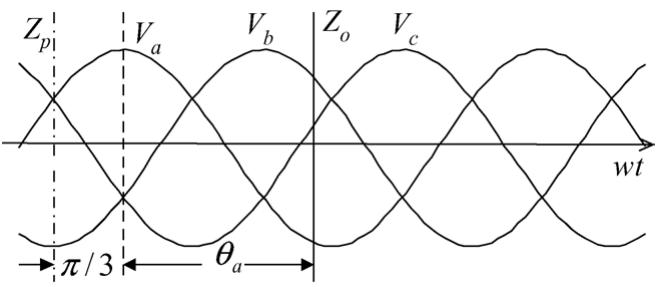  
Fig. 4. Reference axes of two types of phasors.

the time reference frame for dynamic phasors model is axis $Z _ { \mathrm { p } }$ (when $v _ { \mathrm { a c } } = 0 )$ , which can be seen from (5). However in ac system, the time reference axis of conventional phasors has been taken as axis $Z _ { 0 } ,$ , i.e. actually $v _ { \mathrm { a } } ( t ) = \sqrt { 2 } V _ { \mathrm { a } } \cos ( \omega t + \theta _ { \mathrm { a } } )$ . Obviously, phase relation between proposed HVDC dynamic phasors and conventional phasors of ac system should be (see Fig. 4):

$$
\dot {X} = \langle X \rangle_ {1} \mathrm {e} ^ {j \left(\theta_ {\mathrm {a}} + \pi / 3\right)} \tag {20}
$$

Eqs. (18)–(20) constitute the relations of magnitudes and phase angles of the two different types of phasors.

# 3.2. ac–dc interface algorithm in step-by-step simulation

The studied ac/dc system is divided into two parts in time simulation (see Fig. 5). One is the HVDC subsystem modeled in dynamic phasors. The other is the ac network subsystem including generators, loads and ac network in conventional phasor models.

For the HVDC subsystem, the ac network subsystem is equivalent to ac voltage sources $\dot { V } _ { \mathrm { r } }$ and ${ \dot { V } } _ { i }$ at the ac buses of converter stations; while for the ac network subsystem, the HVDC subsystem is equivalent to injection current sources $\dot { I } _ { \mathrm { r } }$ and $\dot { I } _ { i }$ at the interface ac buses R and I. At each time step, the interface algebraic equations of the two subsystems will be solved simultaneously through Newton–Raphson method for better convergence.

Suppose the load is linear and the bus admittance matrix of the studied ac/dc system has been reduced to generator internal buses with converter ac buses remained. The corresponding reduced bus admittance matrix equation takes the form:

$$
\left[ \begin{array}{l l} Y _ {1 1} & Y _ {1 2} \\ Y _ {2 1} & Y _ {2 2} \end{array} \right] \left[ \begin{array}{l} \dot {V} _ {\mathrm {G}} \\ \dot {V} _ {\mathrm {C}} \end{array} \right] = \left[ \begin{array}{l} \dot {I} _ {\mathrm {G}} \\ \dot {I} _ {\mathrm {C}} \end{array} \right] \tag {21}
$$

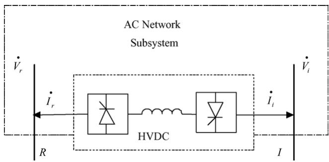  
Fig. 5. The interface of HVDC system with ac network.

where $Y _ { 1 1 } , ~ Y _ { 1 2 } , ~ Y _ { 2 1 }$ , Y22 are $n _ { \mathrm { g } } \times n _ { \mathrm { g } } , n _ { \mathrm { g } } \times n _ { \mathrm { c } } , n _ { \mathrm { c } } \times n _ { \mathrm { c } }$ complex matrixes respectively $( n _ { \mathrm { g } } \mathrm { : }$ the number of generators, $n _ { \mathrm { c } } \mathrm { : }$ the number of converters). The generator internal bus voltage $\dot { V } _ { \mathrm { G } } = E _ { x } ^ { \prime \prime } + j E _ { y } ^ { \prime \prime } ( E _ { x } ^ { \prime \prime } , E _ { y } ^ { \prime \prime } ;$ generator internal bus voltages in synchronous coordinates behind subtransient reactance assuming $x _ { \mathrm { d } } ^ { \prime \prime } = x _ { \mathrm { q } } ^ { \prime \prime } )$ . I˙ G is the generator injection current to the ac network. $\dot { V } _ { \mathrm { C } } = \dot { \left[ V _ { \mathrm { r } } \quad \dot { V } _ { \mathrm { i } } \right] } ^ { \mathrm { T } } = \left[ V _ { \mathrm { r } } \mathrm { e } ^ { j \theta _ { \mathrm { r } } } \quad V _ { \mathrm { i } } \mathrm { e } ^ { j \theta _ { \mathrm { i } } } \right] ^ { \mathrm { T } }$ and $\dot { I } _ { \mathrm { C } } = \left[ \dot { I } _ { \mathrm { r } } \quad \dot { I } _ { \mathrm { i } } \right] ^ { \mathrm { T } }$ are converter ac bus voltage and injection current respectively. Then:

$$
\dot {I} _ {\mathrm {C}} = Y _ {2 1} \dot {V} _ {\mathrm {G}} + Y _ {2 2} \dot {V} _ {\mathrm {C}} \tag {22}
$$

Referring to (17), the dynamic phasors model of HVDC system should be:

$$
\dot {I} _ {\mathrm {r} _ {1}} = 2 I _ {\mathrm {d} _ {0}} S _ {\mathrm {r i} _ {1}, 1}, \quad \quad \quad \quad \quad \quad \quad \quad \quad \quad \quad \quad \quad \quad \quad \quad \quad \quad \quad \quad \quad \quad \quad \quad \quad \quad \quad \quad \quad \quad \quad \quad \quad \quad \quad \quad \quad \quad \quad \quad \quad \quad \quad \quad \quad \quad \quad \quad \quad \quad \dot {I} _ {\mathrm {i} _ {1}} = 2 I _ {\mathrm {d} _ {0}} S _ {\mathrm {i i} _ {1}, 1},
$$

$$
V _ {\mathrm {d r} _ {0}} = 1 2 \operatorname {R e} \left[ V _ {\mathrm {r} _ {1}} S _ {\mathrm {r v} _ {1}, 1} ^ {*} \right], \quad V _ {\mathrm {d i} _ {0}} = - 1 2 \operatorname {R e} \left[ V _ {\mathrm {i} _ {1}} S _ {\mathrm {i v} _ {1}, 1} ^ {*} \right] \tag {23}
$$

$$
\frac {\mathrm {d} I _ {\mathrm {d} _ {0}}}{\mathrm {d} t} = \frac {1}{2 L _ {\mathrm {d}}} \left[ V _ {\mathrm {d r} _ {0}} - V _ {\mathrm {d i} _ {0}} - r _ {\mathrm {d}} I _ {\mathrm {d} _ {0}} \right] \tag {24}
$$

According to (18)–(20), dynamic phasors components are converted to traditional phasors for interface:

$$
\dot {I} _ {\mathrm {D P}} = \left[ \begin{array}{l l} \sqrt {2} \dot {I} _ {\mathrm {r} _ {1}} \mathrm {e} ^ {j \left(\theta_ {\mathrm {r}} + \pi / 3\right)} & \sqrt {2} \dot {I} _ {\mathrm {i} _ {1}} \mathrm {e} ^ {j \left(\theta_ {\mathrm {i}} + \pi / 3\right)} \end{array} \right] ^ {\mathrm {T}} \tag {25}
$$

I˙ DP is the fundamental-wave injection current from HVDC system to ac system based on HVDC dynamic phasors model, and physically it should be equal to the ac network injection current $\dot { I } _ { \mathrm { C } }$ appeared in (22) and the 2nd equation in (21). Therefore based on (22) and (25) the mismatch or residue equation for the 2nd equation in (21) will be:

$$
\begin{array}{l} \Delta \dot {I} _ {\mathrm {C}} = \dot {I} _ {\mathrm {C}} - \dot {I} _ {\mathrm {D P}} = Y _ {2 1} \dot {V} _ {\mathrm {G}} + Y _ {2 2} \left[ V _ {\mathrm {r}} \mathrm {e} ^ {j \theta_ {\mathrm {r}}} \quad V _ {\mathrm {i}} \mathrm {e} ^ {j \theta_ {\mathrm {i}}} \right] ^ {\mathrm {T}} \\ - \left[ \sqrt {2} \dot {I} _ {\mathrm {r} _ {1}} \mathrm {e} ^ {j \left(\theta_ {\mathrm {r}} + \pi / 3\right)} \quad \sqrt {2} \dot {I} _ {\mathrm {i} _ {1}} \mathrm {e} ^ {j \left(\theta_ {\mathrm {i}} + \pi / 3\right)} \right] ^ {\mathrm {T}} = 0 \tag {26} \\ \end{array}
$$

Eq. (26) includes two complex equations, where $\dot { V } _ { \mathrm { G } } , \dot { I } _ { \mathrm { r } _ { 1 } }$ and $\dot { I } _ { i 1 }$ are known through the integration of generator and HVDC system state variables. For each time step, if a proper $\dot { V } _ { \mathrm { C } } =$ $\boldsymbol { \cdot } \dot { \boldsymbol { V } } _ { \mathrm { r } } \dot { \boldsymbol { V } } _ { \mathrm { i } } \boldsymbol { \mathrm { I } } ^ { \mathrm { T } }$ is found which makes $\Delta \dot { I } _ { \mathrm { C } } = 0$ , the $\dot { V } _ { \mathrm { C } }$ will be the solution of the time step. Newton–Raphson algorithm can be applied to solve (26) for $V _ { \mathrm { r } } , V _ { \mathrm { i } } , \theta _ { \mathrm { r } }$ and $\theta _ { \mathrm { i } }$ . The detailed ac–dc interface iteration steps are as follows:

(1) Initialize the voltages of converter ac buses as $V _ { \mathrm { C } } ^ { ( 0 ) } =$ $\big [ V _ { \mathrm { r } } ^ { ( 0 ) } \quad V _ { \mathrm { i } } ^ { ( 0 ) } \big ] ^ { \mathrm { T } }$ and $\theta _ { \mathrm { C } } ^ { ( 0 ) } = { [ \theta _ { \mathrm { r } } ^ { ( 0 ) } \theta _ { \mathrm { i } } ^ { ( 0 ) } ] } ^ { \mathrm { T } }$ , and set iteration number $l { \dot { = } } 0 ;$   
(2) Calculate $\dot { I } _ { \mathrm { C } }$ according to (22) and $\dot { I } _ { \mathrm { D P } }$ according to (23)–(25);   
(3) If $\Delta \dot { I } _ { \mathrm { C } }$ is less than the given tolerance, then $V _ { \mathrm { C } } ^ { ( l ) }$ and $\theta _ { \mathrm { C } } ^ { ( l ) }$ are considered as the final solution for the time step, otherwise go to step 4;   
(4) Calculate Jacobian matrix $J _ { \mathrm { a c } }$ of (26), and calculate $\Delta \dot { V } _ { \mathrm { C } }$ through $\Delta \dot { V } _ { \mathrm { C } } = - J _ { \mathrm { a c } } ^ { - 1 } \times \Delta \dot { I } _ { \mathrm { C } }$ ;   
(5) Update $\dot { V } _ { \mathrm { C } } ^ { ( l + 1 ) } = \dot { V } _ { \mathrm { C } } ^ { ( l ) } + \Delta \dot { V } _ { \mathrm { C } } , \quad l = l + 1$ , and go to step 2.

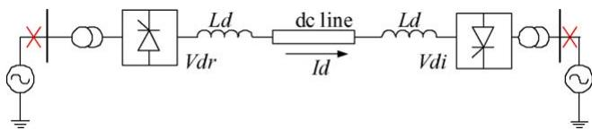  
Fig. 6. A simple 6-pulse HVDC transmission system for accuracy test.

# 4. Computer test results

# 4.1. Accuracy test (comparison with EMT model)

The proposed model is compared with corresponding EMT model for accuracy and efficiency check first. The SimPowerSystems toolbox of Simulink in MATLAB6.5 is used for simulation. A simplified HVDC EMT model (see Fig. 6) is built by the standard blocks of SimPowerSystems. The corresponding dynamic phasors model is established as well using basic signal processing blocks of Simulink. Both models are running

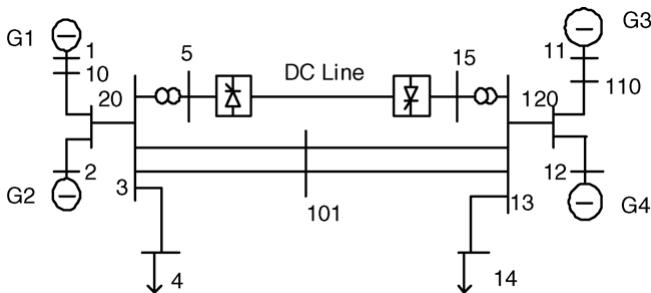  
Fig. 8. Two-area 4-generator ac/dc test system.

in the same Simulink environment for accuracy check and comparison of computing time. In this test system, the converter ac buses are connected directly to two 3-phase sinusoidal voltage sources without ac–dc interface calculation.

In the test, constant voltage control is used in inverter and constant current control strategy is used in rectifier. The distur-

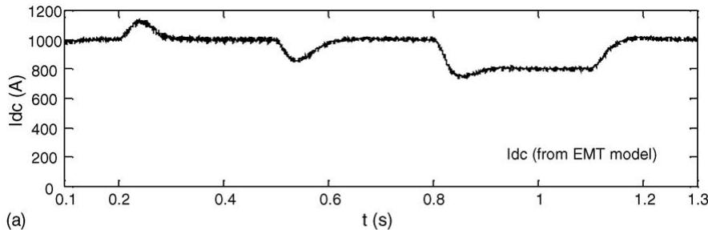

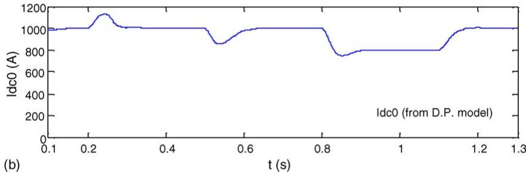

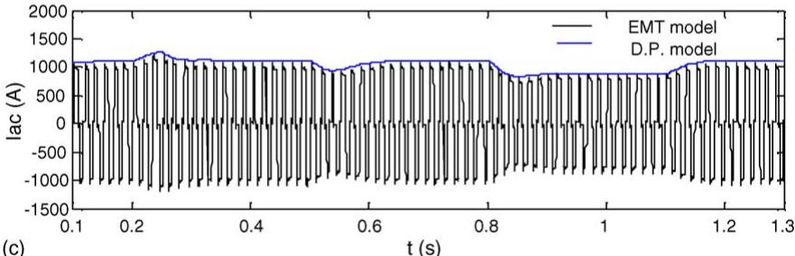

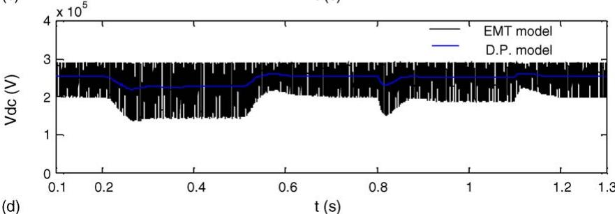  
Fig. 7. Comparison of dynamic phasor and EMT models.

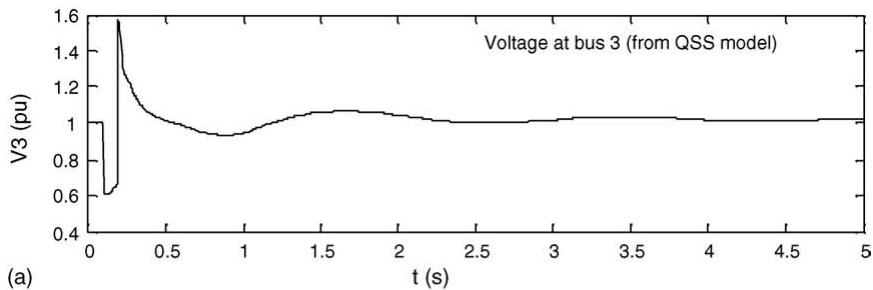

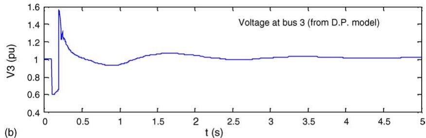

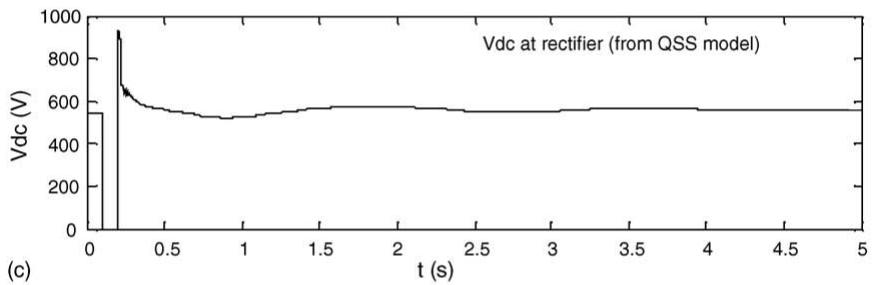

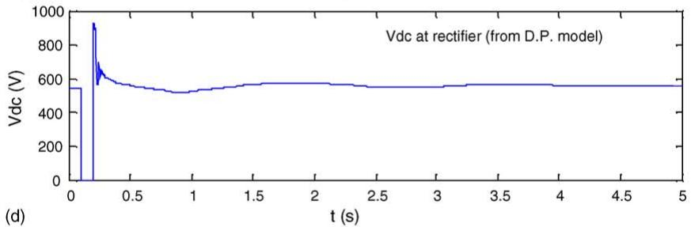

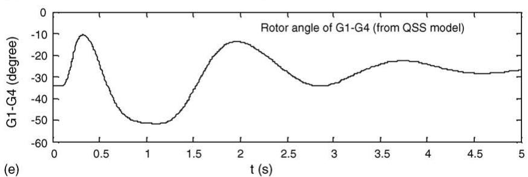

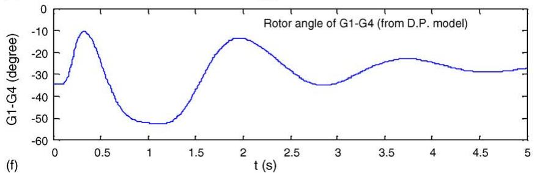  
Fig. 9. Results comparison of two models.

bance used is that the reference voltage $V _ { \mathrm { r e f } }$ changes from 1 pu (240 kV) to 0.8 pu at inverter at $t = 0 . 2 :$ s and recovers at $t = 0 . 5 \ : \mathrm { s } ;$ followed by the reference current $I _ { \mathrm { r e f } }$ change from 1 pu (1 kA) to 0.8 pu at t = 0.8 s and recovered at t = 1.1 s. The simulation results are shown in Fig. 7 with solid lines as EMT model outputs and dashed lines as dynamic phasors (D.P.) model outputs.

Fig. 7(a) and (b) are dc current plots from EMT model and dynamic phasor model respectively; Fig. 7(c) shows the comparison of ac current at the rectifier and Fig. 7(d) is that of dc voltage at the rectifier. It is obvious that the results from the dynamic phasors model has very good accuracy as compared with that from the EMT model and can definitely meet the accuracy requirement for transient stability analysis. As to cpu time dynamic phasor model simulation takes only 2.2 s on a PC of 2 GHz, which is much less than 15.4 s taken by EMT model simulation.

# 4.2. Interface algorithm test (comparison with electromechanical transient model)

A modified 2-area 4-generator interconnected ac/dc power system [9] (see Fig. 8) is used for the computer test of transient stability simulation, which is implemented with Power System Toolbox [10] in MATLAB environment. In the test, the subtransient model is used for the generators with third-order excitation control. The mechanical power of generators is taken as constant. The ac network and loads are linear. The ac–dc interface algorithm in Section 3.2 is needed in time simulation.

The disturbance used is a three-phase fault on bus 10 at 0.1 s, and disappeared in 0.1 s. The dc system is blocked during faulton period and recovered when fault is cleared. Two cases are studied: (i) conventional QSS model is used for the dc system; (ii) dynamic phasors model is used for the dc system. The results are shown in Fig. 9.

Fig. 9(a) and (b) are the comparison of voltage magnitude of bus 3; Fig. 9(c) and (d) are that of dc voltage of the rectifier; Fig. 9(e) and (f) show generator rotor angle of G1 with respect to G4. It can be seen that all the results demonstrate good

consistency of these two models, which proves that the suggested HVCD system dynamic phasor model and interface algorithm work effectively in transient stability analysis.

Simulation cpu time is 71.308 s for QSS model and 77.491 s for dynamic phasor model, which shows clearly that the suggested HVDC system dynamic phasor model and its interface algorithm work efficiently. The advantage of the dynamic phasors model lies in the switching function description for converter valves based on complete three-phase model, which makes the model have the potential to consider the impacts of asymmetrical faults and commutation failure on overall system transient stability, therefore it is superior than the conventional QSS model for ac/dc power system dynamics.

# 4.3. Further test on a multi-infeed HVDC system

A complex multi-infeed HVDC power system based on South China Grid is used for further testing the effectiveness of proposed algorithm. The system is shown in Fig. 10. In the system areas A1, A2 and A3 transfer huge amount of power to area A4 of load center.

The disturbance is a three-phase fault appears on bus 6 of area A4 at 0.1 s and disappears in 0.1 s, which leads to a nearby HVDC system blocking during fault-on period. Fig. 11(a) presents the comparison of voltage magnitude of bus 6. Similarly Fig. 11(b) shows the comparison of rotor angle of the generator on bus 37 with respect to the generator on bus 34. All the computer results demonstrate good consistency of two models and indicate the suggested interface algorithm is capable for transient stability analysis of complex multi-infeed HVDC power systems.

The cpu time for the QSS model simulation is 87.105 s and that for the dynamic phasors model simulation is 95.638 s, which is very satisfactory.

It can be seen from the computer test results in Section 4.1 that the HVDC dynamic phasors model is more efficient in time simulation as compared with corresponding EMT model. It has also acceptable accuracy for transient stability analy-

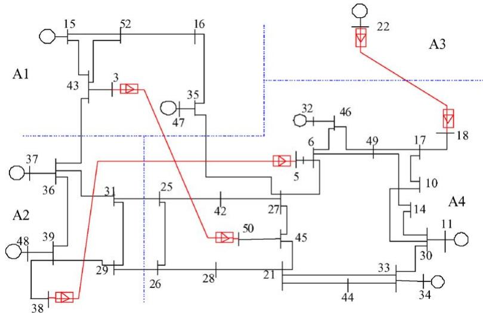  
Fig. 10. Simplified South China grid.

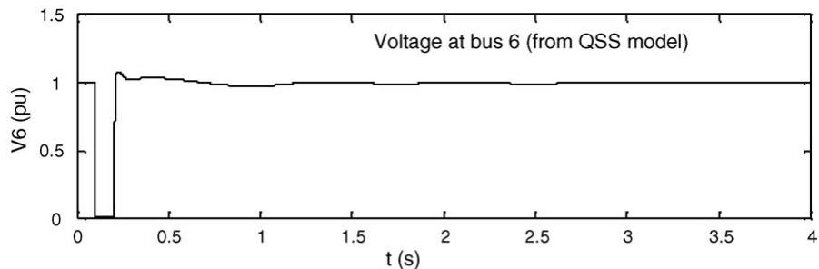

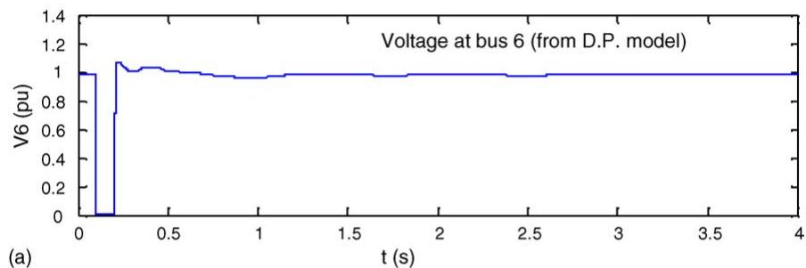

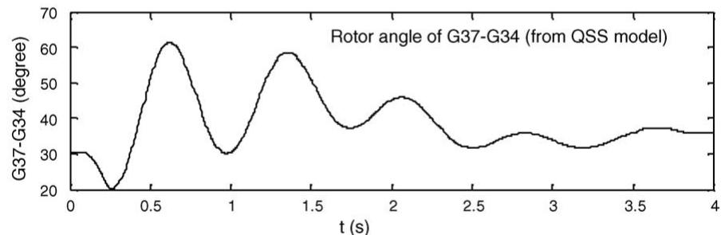

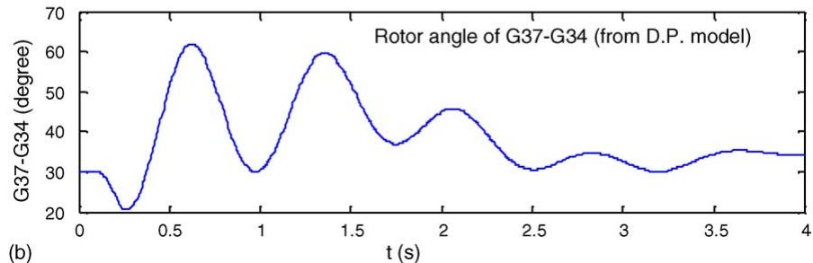  
Fig. 11. Results of multi-infeed HVDC system.

sis use. The key issue in the application of dynamic phasor method is to develop a fast and effective interface model and iteration algorithm between the dynamic phasors model and the conventional electromechanical model. The corresponding hybrid-model simulation algorithm has the potential to conduct transient stability study effectively in large-scale ac–dc systems with FACTS devices. Furthermore, when the dynamic phasor method is applied to study harmonics of PEDs and their effects on ac system, higher-order dynamic phasors should be kept. The corresponding dynamic phasors model will be more complicated, which is not discussed in this paper.

# 5. Conclusion

A new hybrid-model simulation approach is suggested to achieve fast and accurate transient stability simulation for large-

scale ac/dc power systems. The HVDC transmission system dynamic phasors model has been derived. The interface algorithm of dc dynamic phasors model to conventional ac system model is developed for step-by-step simulation. Computer test results show that the dynamic phasors model can catch the dominant dynamic behaviors of EMT model very well and the suggested interface calculation can work effectively and efficiently in transient stability simulation of real ac/dc power systems.

# Acknowledgments

This project was jointly supported by the National Natural Science Foundation of China (50337010) and the Research Grant Council of Hong Kong SAR Government.

# References

[1] S.R. Sanders, J.M. Noworolski, X.Z. Liu, et al., Generalized averaging method for power conversion circuits, IEEE Trans. Power Electron. 6 (2) (1991) 251–259.   
[2] S.L. Huang, X.X. Zhou, Analysis of balanced and unbalanced faults in power systems using dynamic phasor, in: Proceedings of the POWER-CON2002, ICEE-PES/CSEE, Kunming, China, 2002.   
[3] G.W.J. Anderson, N.R. Watson, C.P. Arnold, et al., A new hybrid algorithm for analysis of HVDC and FACTS systems, in: Proceedings of the International Conference on Energy Management and Power Delivery, No. 2, 1995, pp. 462–467.   
[4] A.M. Stankovic, P. Mattavelli, V. Caliskan, et al., Modeling and analysis of FACTS devices with dynamic phasors, in: IEEE Power Engineering Society Winter Meeting No. 2, 2000, pp. 1440–1446.   
[5] P.C. Stefannov, A.M. Stankovic, Modeling of UPFC Operation Under Unbalanced Conditions With Dynamic Phasors, IEEE Trans. Power Syst. 17 (2) (2002) 395–403.   
[6] A.M. Stankovic, S.R. Sanders, Dynamic phasors in modeling and analysis of unbalanced polyphase AC machines, IEEE Trans. Energy Conv. 17 (1) (2002) 107–113.   
[7] A.R. Wood, J. Arrillaga, HVDC converter waveform distortion: a frequency-domain analysis, IEE Proc. Gener. Transm. Distrib. 142 (1) (1995) 88–96.   
[8] J. Arrilaga, B. Smith, AC–DC Power System Analysis, IEE Press, 1998.   
[9] P. Kundur, Power System Stability and Control, McGraw Hill, 1994.   
[10] J.H. Chow, Power System Toolbox: a Set of Coordinated m-Files for Use with MATLAB, Cherry Tree Scientific Software, 1996.

Haojun Zhu was born in Guangdong, China, in Feb. 1978. He received his B.S. degree, M.S. degree from South China University of Technology (SCUT), China in 2001 and 2003, respectively. He is currently a graduate student for Ph.D. degree in the College of Electrical Engineering of SCUT with research interests in power system modeling, stability and control and HVDC transmission.

Zexiang Cai was born in Nanjing, China, in July 1960. He received his B.S. degree from Huainan Mineral Institute in 1982, M.S. degree from Northeast China Institute of Electrical Power Engineering in 1985, Ph.D. degree from Tsinghua University in 1991. He has been a professor of the College of Electrical Engineering of the South China University of Technology since 1998. His research interests are power system protection relay, power system stability and control.

Haoming Liu was born in Jiangsu, China, in Feb., 1977. He received his B.Eng., M.Eng., and Dr. Eng. from Nanjing University of Science and Technology, China in 1998, 2001 and 2003, respectively. His research interests are power system stability and control and electricity markets. Currently, he is a post-doctor at the Department of Electrical Engineering, Southeast University, China.

Yixin Ni received her B.Eng., M.Eng., and Dr. Eng. All from the Department of Electrical Engineering, Tsinghua University, China in 1968, 1981 and 1983 respectively. Her research interests are power system stability and control, HVDC transmission, FACTS, and electricity markets. She was a professor of Tsinghua University and is now with the University of Hong Kong. She is a recipient of several nation-wide awards.