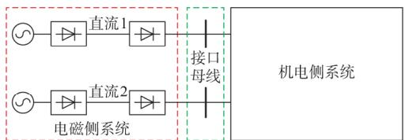
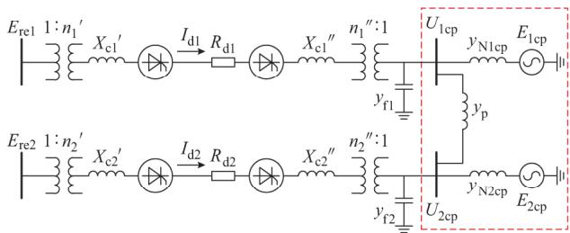
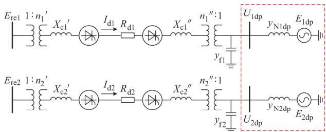
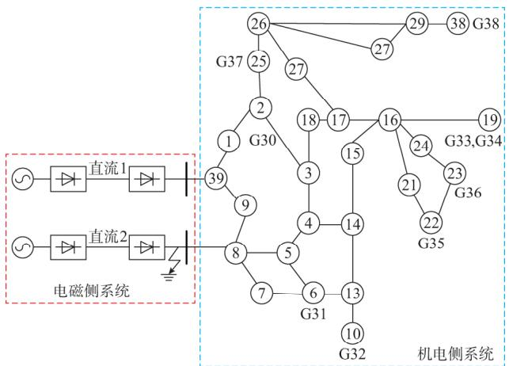

# 机电—电磁暂态混合仿真多端口模型的比较分析Vol．41No

杨 洋， 肖湘宁， 廖坤玉， 陈 萌

（新能源电力系统国家重点实验室（华北电力大学） ， 北京市 ）

摘要 ： 机电—电磁暂态混合仿真在端口建模方面主要有两种方法 ：一种基于多端口诺顿等值电路在端口处进行直接的电路耦合（耦合模型） ；另一种是在电磁侧的端口与端口之间进行解耦 通过机电暂态计算进行间接耦合（解耦模型） 建立了稳态期间两种模型的数学模型 将机电暂态的计算过程考虑进解耦模型的等值电势 证明了稳态情况下解耦模型与耦合模型的一致性 考虑电磁侧直流输电系统的控制特性 推导了经扩展之后的两类模型的节点导纳矩阵 结合两种模型的节点导纳矩阵的特点 对两种模型进行了暂态特性的对比分析 理论和仿真结果表明 当扰动和故障发生在电磁侧时 两种模型在本地直流的换相失败现象的分析过程中表现基本一致 而对一回直流逆变侧故障引起其他直流的换相失败的分析 ，解耦模型的适应性较弱 两种模型在仿真建模中应进行合理选择。

关键词 ： 机电—电磁； 多端口； 耦合； 解耦； 多馈入直流； 换相失败

# 0 引言

机电 电磁暂态混合仿真作为大规模交直流电网研究的有效手段之一 自提出之初就受到电力研究者的广泛关注［ ］ 该方法弥补了机电暂态程序中直流准稳态模型在非正弦 非对称边界条件下仿－ －真结果不准确以及直流换相失败判断标准相对保守的不足，减小了大规模交直流系统建模和仿真的复17杂度和代价 尤其适应国内电力系统多直流 多落点 交直流强耦合的现状 相关的理论研究涉及等值方式 交互时序 相量提取算法 接口位置选择等方面［ ］ 文献［ ］分析了传统的电磁侧功率源等值对机电侧计算的误差引入机理并提出了改进等值方案 文献［ ］采用频率相关网络等值方法建立了异构实时混合仿真平台 提高了故障期8间电磁侧系统的仿真精度 文献［ ］分别从实时性和计算精度两个方面分析了串行时序和并行时序的不足 并提出一种串行和并行相结合的数据交互方9－式 较好地协调了数据交互引起的仿真精度和速度的问题 文献［ ］分析了故障电流直流分量的产生10机理及数学表达形式 并提出了一种对直流分量免RTDSTSA疫的改进 dq 基波相量提取算法

11电磁侧的接口电路是混合仿真平台的重要组成部分 其特性好坏直接影响到电磁侧的仿真结果

关于机电—电磁暂态混合仿真的多端口建模 ， 目前存在两种思路 一种是采用多端口诺顿（戴维南）等值 将外部系统等值为含有多个端口的耦合电路［ ， ］ ；另一种思路是基于机电侧系统通过机电暂态计算进行电气量耦合的假设 在电磁侧将待等－值的网络在端口处自然解耦［ ， ］ 在实践中， 多端口诺顿（戴维南）等值在理论上较为完备 ， 该等值101318 －方式体现了机电侧系统尤其是端口之间的耦合情况 但是这种方法的电路参数求取方法仍在完善［ ］81921建模实现形式也相对复杂 一定程度上限制了混合仿真的规模以及仿真计算的效率 相比而言， 端口解耦的建模形式没有接口数目的限制 原则上可以8仿真任意多的端口 因而在混合仿真尤其是实用化的含有多回直流的交直流电力系统混合仿真中得到了一定应用 然而 两种端口建模手段在精度方面的好坏到目前没有得到对比分析 采用解耦的建模方式所带来的影响也没有通过理论手段加以论证

本文基于混合仿真在多回直流换相失败仿真中的实践 重点分析在研究多回直流换相失败背景下采用两种端口建模方式给仿真结果带来的影响以及深层机理 进而为端口电路的合理化选择提出指导性意见 。

# 1 系统概述

采用国际大电网会议 （ ） 标准直流模型［ ］建立含有两回直流馈入的交直流输电系统 如

图 （ ） 所示 左侧的等值电源和两回直流输电系统（包括换流器、换流变压器、无功补偿、平波电抗器和直流控制系统）在电磁侧仿真 ，连接于换流母线的常规交流系统在机电侧仿真 直流逆变侧的换流母线作为接口母线 两条接口母线在机电侧系统耦 合 。

  
(a)含两回直流的交直流输电系统

  
(b)耦合模型

  
(c)解耦模型  
图1 耦合模型和解耦模型示意图  
Fig．1 Schematicdiagramofcoupled anddecoupledmodels

按照逆变侧交流系统在电磁侧所采用的等值模型不同 分为耦合模型和解耦模型 两种模型的系统接线图如图 （ ）和图 （ ）所示 图中 ： $E _ { \mathrm { r e l } }$ 和 $E _ { \mathrm { r e 2 } }$ 为整流侧交流母线线电压有效值 $; n _ { 1 }$ 和 ${ n _ { 2 } } ^ { \prime }$ 为整流侧换流变压器变比； ${ X _ { \mathrm { { c l } } } } ^ { \prime }$ 和 ${ X _ { \mathrm { { c 2 } } } } ^ { \prime }$ 为整流侧换流等效电抗； $I _ { \mathrm { d 1 } }$ 和 $I _ { \mathrm { { d 2 } } }$ 为直流电流 ${ \ : }  { \boldsymbol { X } } _ { \mathrm { ~ c ~ } }$ 和 ${ X _ { \mathrm { { c } } 2 } } ^ { \prime \prime }$ 为逆变侧换流等效电抗 ${ \ ; } n _ { 1 } ^ { \prime \prime }$ 和 ${ n _ { 2 } } ^ { \prime \prime }$ re1 re2为逆变侧换流变压器变比$y _ { \mathrm { f 1 } }$ 和 $y _ { \mathrm { \ f 2 } }$ 1 2分别为逆变侧滤波器和无功补偿装置的等效对地导纳 $; U _ { \mathrm { 1 c p } }$ 和 $U _ { \mathrm { 2 c p } }$ c2为耦合模型对应的逆变侧1b 1d1 d2换流母线线电压有效值 $\mathbf { ; } \mathbf { ) } _ { \mathrm { ~ F ~ } }$ c1 c2为耦合模型对应的耦合支路导纳 $\mathsf { \Omega } : \mathsf { y } _ { \mathrm { N l c p } }$ 1和 $y _ { \mathrm { { N 2 c p } } }$ ′ ′为耦合模型对应的交流系统f1 f2等值阻抗 ； $E _ { \mathrm { 1 c p } }$ 和 $E _ { \mathrm { 2 c p } }$ ′ ′为耦合模型对应的交流系统1cp 2cp等值电势线电压有效值； $\boldsymbol { \mathsf { \Pi } } _ { : U _ { \mathrm { 1 d p } } }$ ″和 $U _ { \mathrm { 2 d p } }$ ″为解耦模型对″ ″ p应的逆变侧换流母线线电压有效值 $\mathsf { \Omega } ; y _ { \mathrm { N l d p } }$ 和 $y _ { \mathrm { { N 2 d p } } }$ 为N1cp N2cp解耦模型对应的交流系统等值阻抗 ； $E _ { \mathrm { 1 d p } }$ 和 $E _ { \mathrm { 2 d p } }$ 为1cp 2cp解耦模型对应的交流系统等值电势线电压有效值

两种等效模型在电路上的区别如图 （ ） （ ）虚线框所示，耦合模型的逆变侧交流换流母线存在互联支路，而解耦模型的逆变侧部分则在电气上完全解开 下面将详细分析两种模型在稳态和暂态方面求解的一致性和差异性

# 2 稳态求解的一致性分析

1b c首先， 对耦合模型的逆变侧交流换流母线列写节点电压方程 ：

$$
\left[ \begin{array}{c c} y _ {\mathrm {N 1 c p}} + y _ {\mathrm {p}} + y _ {\mathrm {f l}} & - y _ {\mathrm {p}} \\ - y _ {\mathrm {p}} & y _ {\mathrm {N 2 c p}} + y _ {\mathrm {p}} + y _ {\mathrm {f 2}} \end{array} \right] \left[ \begin{array}{c} U _ {1 \mathrm {c p}} \\ U _ {2 \mathrm {c p}} \end{array} \right] =
$$

$$
\left[ y _ {\mathrm {N 1 c p}} E _ {1 \mathrm {c p}} + \frac {\sqrt {6}}{\pi} I _ {\mathrm {d l}} \quad y _ {\mathrm {N 2 c p}} E _ {2 \mathrm {c p}} + \frac {\sqrt {6}}{\pi} I _ {\mathrm {d 2}} \right] ^ {\mathrm {T}} \tag {1}
$$

N1cp p f1 p 1cp对于机电侧网络 设边界节点（即混合仿真的接p N2cp p f2 2cp口节点）用集合 B 表示 除去边界节点的其余节点用集合 E 表示，则机电侧网络存在节点电压方程 ：

$$
\mathbf {Y} \left[ \begin{array}{l} \mathbf {U} _ {E} \\ \mathbf {U} _ {B} \end{array} \right] = \left[ \begin{array}{l} \mathbf {I} _ {E} \\ \mathbf {I} _ {B} \end{array} \right] \tag {2}
$$

式中 $\mathbf { \Omega } _ { : } \mathbf { Y }$ 为导纳矩阵 ${ \bf \nabla } _ { \bf { ; } } U _ { E }$ 和 $U _ { B }$ 6分别为外部节点和边 界节点的电压矩阵； $\pmb { I } _ { E }$ 和 $\pmb { I } _ { B }$ 分别为外部节点和边 界节点的电流矩阵

设 $\pmb { Y } ^ { - 1 } = \left[ \begin{array} { l l } { \pmb { Z } _ { E E } } & { \pmb { Z } _ { E B } } \\ { \pmb { Z } _ { B E } } & { \pmb { Z } _ { B B } } \end{array} \right]$ 其中 $\mathbf { Z } _ { B B }$ 和 $\mathbf { \boldsymbol { Z } } _ { E E }$ 分别为 边界节点和外部节点等值阻抗矩阵 $\mathbf { Z } _ { E B }$ 和 $\mathbf { Z } _ { B E }$ 为边 界节点与外部节点的互阻抗矩阵 则有

$$
\left[ \begin{array}{l} \boldsymbol {U} _ {E} \\ \boldsymbol {U} _ {B} \end{array} \right] = \left[ \begin{array}{l} \boldsymbol {Z} _ {E E} \boldsymbol {I} _ {E} + \boldsymbol {Z} _ {E B} \boldsymbol {I} _ {B} \\ \boldsymbol {Z} _ {B E} \boldsymbol {I} _ {E} + \boldsymbol {Z} _ {B B} \boldsymbol {I} _ {B} \end{array} \right] \tag {3}
$$

$\pmb { I } _ { E }$ 主要由交流系统中发电机的注入电流构成在一个交互步长内具有近似相等特性 ， 设戴维南等值电势 $\pmb { { \cal E } } _ { \mathrm { e q } } = \pmb { { \cal Z } } _ { B E } \pmb { { \cal I } } _ { E }$ ，则式（ ）第二行可以单独写为 ：

$$
\boldsymbol {U} _ {B} = \boldsymbol {E} _ {\mathrm {e q}} + \boldsymbol {Z} _ {B B} \boldsymbol {I} _ {B} \tag {4}
$$

为电路实现方便 可以将式（ ）表示为诺顿等值形式，设 $\pmb { Y } _ { \mathrm { c p } } = \pmb { Z } _ { B B } ^ { - 1 }$ ， $\pmb { I } _ { \mathrm { e p } } { = } \pmb { Y } _ { \mathrm { c p } } \pmb { E } _ { \mathrm { e q } }$ ， 则有 ：

$$
\boldsymbol {Y} _ {\mathrm {c p}} \boldsymbol {U} _ {B} = \boldsymbol {I} _ {\mathrm {e q}} + \boldsymbol {I} _ {B} \tag {5}
$$

eq在具体实现式（ ）时 也可以将 $\mathbf { Y } _ { \mathrm { c p } }$ 的对地支路部分与诺顿等值电流源合并 以多端口戴维南等值＝ 3cp ep cp eq电路的形式体现 对于有 N 个接口的诺顿等值电＋cp eq路，其对应的戴维南等值电势为 ：

$$
\boldsymbol {E} _ {\mathrm {c p}} = \operatorname {d i a g} \left(\boldsymbol {Y} _ {\mathrm {c p}} \text {o n e s} (N, 1)\right) ^ {- 1} \boldsymbol {I} _ {\mathrm {e q}} \tag {6}
$$

此处 $\mathrm { d i a g } ( Y _ { \mathrm { c p } } \mathrm { o n e s } ( N , 1 ) )$ 表示对矩阵 $\pmb { Y } _ { \mathrm { c p } }$ 的＋ 5每一 行 元 素 求 和 得 到 的 对 角 矩 阵 的 逆 其 中5（N ）表示生成一个 N 维的全 矩阵 需注意 这里 $E _ { \mathrm { c p } }$ 与 $E _ { \mathrm { e q } }$ cp并不相等 $E _ { \mathrm { c p } }$ －1 eq中的每个元素均是 $E _ { \mathrm { e q } }$ cp单个元素的线性组合 即

$$
\boldsymbol {E} _ {\mathrm {c p}} = \operatorname {d i a g} \left(\boldsymbol {Y} _ {\mathrm {c p}} \text {o n e s} (N, 1)\right) ^ {- 1} \boldsymbol {Z} _ {B B} ^ {- 1} \boldsymbol {E} _ {\mathrm {e q}} \tag {7}
$$

由图 （ ）可知， ${ \pmb I } _ { \mathrm { B } } = \sqrt { 6 } { \pmb I } _ { \mathrm { d } } / \pi - { \pmb y } _ { \mathrm { f } } { \pmb U } _ { \mathrm { c p } }$ ， 因 此 有 ：

$$
\left(\boldsymbol {Z} _ {B B} ^ {- 1} + \boldsymbol {y} _ {\mathrm {f}}\right) \boldsymbol {U} _ {\mathrm {c p}} = \boldsymbol {Z} _ {B B} ^ {- 1} \boldsymbol {E} _ {\mathrm {e q}} + \frac {\sqrt {6}}{\pi} \boldsymbol {I} _ {\mathrm {d}} \tag {8}
$$

式中 $: \mathbf { y } _ { \mathrm { f } } = \operatorname { d i a g } \left( \boldsymbol { y } _ { \mathrm { f l } } , \boldsymbol { y } _ { \mathrm { f 2 } } \right) ; \boldsymbol { U } _ { \mathrm { c p } } = \left[ \boldsymbol { U } _ { \mathrm { l c p } } , \boldsymbol { U } _ { \mathrm { 2 c p } } \right] ^ { \mathrm { T } } ; \boldsymbol { I } _ { \mathrm { d } } =$ $\big [ I _ { \mathrm { d 1 } } , I _ { \mathrm { d 2 } } \big ] ^ { \mathrm { T } }$ 。

式（ ）与式（ ）等效 建立解耦模型逆变侧换流母线的节点电压方程

$$
\begin{array}{l} \left[ \begin{array}{l l} y _ {\mathrm {N I d p}} + y _ {\mathrm {f 1}} & \\ & y _ {\mathrm {N 2 d p}} + y _ {\mathrm {f 2}} \end{array} \right] \left[ \begin{array}{l} U _ {1 \mathrm {d p}} \\ U _ {2 \mathrm {d p}} \end{array} \right] = \\ \left[ y _ {\mathrm {N 1 d p}} E _ {1 \mathrm {d p}} + \frac {\sqrt {6}}{\pi} I _ {\mathrm {d l}} \quad y _ {\mathrm {N 2 d p}} E _ {2 \mathrm {d p}} + \frac {\sqrt {6}}{\pi} I _ {\mathrm {d 2}} \right] ^ {\mathrm {T}} \tag {9} \\ \end{array}
$$

dp f1接口电压为 ：

$$
\begin{array}{l} \boldsymbol {U} _ {B} = \boldsymbol {E} _ {\mathrm {e q}} + (\boldsymbol {Z} _ {B B} - \operatorname {d i a g} (\boldsymbol {Z} _ {B B})) \boldsymbol {I} _ {B} + \\ \operatorname {d i a g} \left(\boldsymbol {Z} _ {B B}\right) \boldsymbol {I} _ {B} = \boldsymbol {E} _ {\mathrm {d p}} + \boldsymbol {Z} _ {\mathrm {d p}} \boldsymbol {I} _ {B} \tag {10} \\ \end{array}
$$

＋其中 $\mathbf { \nabla } _ { \mathbf { Z } _ { \mathrm { d p } } } = \mathrm { d i a g } ( \mathbf { Z } _ { B B } )$ ，是每个接口所对应的自＋阻抗部分 由于在电磁侧的戴维南等值电路为解耦eq形式 为了保持两个系统在稳态时求解的一致性 在dp dp式（ ）中的戴维南等值电势相对于式（ ）多了一个附加量 $( { \cal Z } _ { B B } - \mathrm { d i a g } ( { \cal Z } _ { B B } ) ) { \cal I } _ { B }$ 该量综合体现了除第i接口以外的其他馈入电流对接口i的电压的影响，diag ＋在稳态时 电磁侧向机电侧注入的电流为

$$
\boldsymbol {I} _ {B} = \boldsymbol {Z} _ {\mathrm {d p}} ^ {- 1} \left(\boldsymbol {U} _ {B} - \boldsymbol {E} _ {\mathrm {d p}}\right) \tag {11}
$$

从而有 ：

$$
\boldsymbol {E} _ {\mathrm {d p}} = \boldsymbol {E} _ {\mathrm {e q}} + (\boldsymbol {Z} _ {B B} - \operatorname {d i a g} (\boldsymbol {Z} _ {B B})) \boldsymbol {Z} _ {\mathrm {d p}} ^ {- 1} (\boldsymbol {U} _ {B} - \boldsymbol {E} _ {\mathrm {d p}}) \tag {12}
$$

解 得 ：

$$
\boldsymbol {E} _ {\mathrm {d p}} = \boldsymbol {Z} _ {\mathrm {d p}} \boldsymbol {Z} _ {B B} ^ {- 1} \boldsymbol {E} _ {\mathrm {e q}} + \boldsymbol {U} _ {B} - \boldsymbol {Z} _ {\mathrm {d p}} \boldsymbol {Z} _ {B B} ^ {- 1} \boldsymbol {U} _ {B} \tag {13}
$$

p eq －1dp将 式 （ ） 代 入 式 （ ） ， 并 且 注 意 到 $\begin{array} { r } { \pmb { Z } _ { \mathrm { d p } } ^ { - 1 } = } \end{array}$ $\mathrm { d i a g } ( \boldsymbol { y } _ { \mathrm { N 1 c p } } , \boldsymbol { y } _ { \mathrm { N 2 c p } } )$ ， 可 得 ：

$$
\left(\mathbf {Z} _ {\mathrm {d p}} ^ {- 1} + \mathbf {y} _ {\mathrm {f}}\right) \mathbf {U} _ {\mathrm {d p}} = \mathbf {Z} _ {B B} ^ {- 1} \mathbf {E} _ {\mathrm {e q}} + \mathbf {Z} _ {\mathrm {d p}} ^ {- 1} \mathbf {U} _ {\mathrm {d p}} - \mathbf {Z} _ {B B} ^ {- 1} \mathbf {U} _ {\mathrm {d p}} + \frac {\sqrt {6}}{\pi} \mathbf {I} _ {\mathrm {d}} \tag {14}
$$

式中 $\mathbf { \sigma } _ { : U _ { \mathrm { d p } } } = [ U _ { \mathrm { 1 d p } } , U _ { \mathrm { 2 d p } } ] ^ { \mathrm { T } }$ 。

＝整理可得 ：

$$
\left(\boldsymbol {Z} _ {B B} ^ {- 1} + \boldsymbol {y} _ {\mathrm {f}}\right) \boldsymbol {U} _ {\mathrm {d p}} = \boldsymbol {Z} _ {B B} ^ {- 1} \boldsymbol {E} _ {\mathrm {e q}} + \frac {\sqrt {6}}{\pi} \boldsymbol {I} _ {\mathrm {d}} \tag {15}
$$

6dp 1dp 2dp式（ ）与式（ ）的表达式一致 说明在稳态时两 种模型完全等效

# 1 f3 暂态差异性分析

# 3 1 矩阵求逆辅助定理

进行暂态分析需用到矩阵求逆 矩阵求逆辅助定理如下

1若令 $n \times n$ 8阶非奇异矩阵A 发生如下变化 ：

$$
\tilde {\boldsymbol {A}} = \boldsymbol {A} + \boldsymbol {M} \boldsymbol {a} \boldsymbol {N} ^ {\mathrm {T}} \tag {16}
$$

式中 $: M$ 和 N 为 $n \times m$ 阶矩阵 $m \leqslant n \colon a$ 为 $m \ X$ $m$ 阶非奇异矩阵。

则 有 ：

$$
\widetilde {\boldsymbol {A}} ^ {- 1} = \boldsymbol {A} ^ {- 1} - \boldsymbol {A} ^ {- 1} \boldsymbol {M} \left(\boldsymbol {a} ^ {- 1} + \boldsymbol {N} ^ {\mathrm {T}} \boldsymbol {A} ^ {- 1} \boldsymbol {M}\right) ^ {- 1} \boldsymbol {N} ^ {\mathrm {T}} \boldsymbol {A} ^ {- 1} \tag {17}
$$

其条件是 $\pmb { a } ^ { - 1 } + \pmb { N } ^ { \mathrm { T } } \pmb { A } ^ { - 1 } \pmb { M }$ 可逆。 如果原来矩阵 A 的逆 ${ \cal A } ^ { - 1 }$ 已知 可在 ${ \cal A } ^ { - 1 }$ 的基础上求出变化后×－1 －1 －1 －1 T －1的矩阵的逆，该定理的证明见文献［ ］

# 3 2 不考虑直流电流变化时耦合模型和解耦模型－1的暂态差异性分析

＝ － ＋－1 －1为了得到关于电压下降幅度的解析表达 ， 不考17虑等值电势随时间的变化 仅分析故障后一个交互＋步长内接口电压的变化量 假定图 $1 \left( \mathrm { a } \right)$ 中直流输电系统馈入交流系统的电流分别为 $I _ { \mathrm { d a c l } }$ 和 $I _ { \mathrm { d a c 2 } }$ 分23析单纯考虑外部等值电路时两种模型差异对接口电．压求解的影响 解耦模型和耦合模型对应的节点电压方程分别为

$$
\begin{array}{l} \left[ \begin{array}{c c} y _ {\mathrm {N 1 c p}} + y _ {\mathrm {p}} + y _ {\mathrm {f l}} & - y _ {\mathrm {p}} \\ - y _ {\mathrm {p}} & y _ {\mathrm {N 2 c p}} + y _ {\mathrm {p}} + y _ {\mathrm {f 2}} \end{array} \right] \left[ \begin{array}{c} U _ {1 \mathrm {c p}} \\ U _ {2 \mathrm {c p}} \end{array} \right] = \\ \left[ \begin{array}{l} y _ {\mathrm {N 1 c p}} E _ {1 \mathrm {c p}} + I _ {\mathrm {d a c l}} \\ y _ {\mathrm {N 2 c p}} E _ {2 \mathrm {c p}} + I _ {\mathrm {d a c 2}} \end{array} \right] = \left[ \begin{array}{l} I _ {\mathrm {s c p l}} \\ I _ {\mathrm {s c p 2}} \end{array} \right] (18) \\ \left[ \begin{array}{l l} y _ {\mathrm {N 1 d p}} + y _ {\mathrm {f l}} & \\ & y _ {\mathrm {N 2 d p}} + y _ {\mathrm {f 2}} \end{array} \right] \left[ \begin{array}{l} U _ {1 \mathrm {d p}} \\ U _ {2 \mathrm {d p}} \end{array} \right] = \\ \left[ \begin{array}{l} y _ {\mathrm {N 1 d p}} E _ {1 \mathrm {d p}} + I _ {\mathrm {d a c} 1} \\ y _ {\mathrm {N 2 d p}} E _ {2 \mathrm {d p}} + I _ {\mathrm {d a c} 2} \end{array} \right] = \left[ \begin{array}{l} I _ {\mathrm {s d p} 1} \\ I _ {\mathrm {s d p} 2} \end{array} \right] (19) \\ \end{array}
$$

－ ＋ ＋N1dp f1 1dp上述两式在稳态时的一致性已经在第 节得到＋N2dp f2 2dp验证 下面比较暂态时的特性 设某时刻在直流＋N1dp 1dp dac1逆变侧换流母线处发生经导纳 $\Delta y$ dp1的三相接地故＋N2dp 2dp障 则式 （ ） 可改写为

$$
\begin{array}{l} \left[ \begin{array}{c c} y _ {\mathrm {N 1 c p}} + y _ {\mathrm {p}} + y _ {\mathrm {f l}} + \Delta y & - y _ {\mathrm {p}} \\ - y _ {\mathrm {p}} & y _ {\mathrm {N 2 c p}} + y _ {\mathrm {p}} + y _ {\mathrm {f 2}} \end{array} \right]. \\ \left[ \begin{array}{l} U _ {1 \mathrm {c p}} ^ {\prime} \\ U _ {2 \mathrm {c p}} ^ {\prime} \end{array} \right] = \left[ \begin{array}{l} I _ {\mathrm {s c p 1}} \\ I _ {\mathrm {s c p 2}} \end{array} \right] \tag {20} \\ \end{array}
$$

式中 $: U _ { \mathrm { 1 c p } } ^ { \mathrm { ~ ~ } } ^ { \prime }$ 和 $U _ { \mathrm { 2 c p } } ^ { \mathrm { } } ^ { \prime }$ f1 p为故障后耦合模型的电压

设矩 阵 $\Delta { \bf Y } = \left[ \begin{array} { c c } { { \Delta y } } & { { 0 } } \\ { { 0 } } & { { 0 } } \end{array} \right]$ N2cp p f2则 式 （ ） 可 以 表 示 为$( { \pmb Y } _ { \mathrm { c p } } + \Delta { \pmb Y } ) { { \pmb U } _ { \mathrm { c p } } } ^ { \prime } = { \pmb I } _ { \mathrm { s c p } }$ ， 其 中 $\pmb { U } _ { \mathrm { c p } } ^ { \prime } = [ U _ { \mathrm { 1 c p } } ^ { \prime } , U _ { \mathrm { 2 c p } } ^ { \prime } ] ^ { \mathrm { T } }$ ，$\pmb { I } _ { \mathrm { s c p } } = [ I _ { \mathrm { s c p 1 } } , I _ { \mathrm { s c p 2 } } ] ^ { \mathrm { T } }$ ， 有

$$
\boldsymbol {U} _ {\mathrm {c p}} ^ {\prime} = \left(\boldsymbol {Y} _ {\mathrm {c p}} + \Delta \boldsymbol {Y}\right) ^ {- 1} \boldsymbol {I} _ {\mathrm {s c p}} \tag {21}
$$

设 $M = [ 1 , 0 ] ^ { \mathrm { T } }$ ，根据矩阵求逆定理有 ：

$$
\begin{array}{l} \left(\mathbf {Y} _ {\mathrm {c p}} + \Delta \mathbf {Y}\right) ^ {- 1} = \mathbf {Y} _ {\mathrm {c p}} ^ {- 1} - \mathbf {Y} _ {\mathrm {c p}} ^ {- 1} \mathbf {M} \left(\Delta y ^ {- 1} + \mathbf {M} ^ {\mathrm {T}} \mathbf {Y} _ {\mathrm {c p}} ^ {- 1} \mathbf {M}\right) ^ {- 1} \cdot \\ \boldsymbol {M} ^ {\mathrm {T}} \boldsymbol {Y} _ {\mathrm {c p}} ^ {- 1} \tag {22} \\ \end{array}
$$

从而有 ：

$$
\begin{array}{l} \boldsymbol {U} _ {\mathrm {c p}} ^ {\prime} = \boldsymbol {U} _ {\mathrm {c p}} - \boldsymbol {Y} _ {\mathrm {c p}} ^ {- 1} \boldsymbol {M} (\Delta y ^ {- 1} + \boldsymbol {M} ^ {\mathrm {T}} \boldsymbol {Y} _ {\mathrm {c p}} ^ {- 1} \boldsymbol {M}) ^ {- 1} \boldsymbol {M} ^ {\mathrm {T}} \boldsymbol {U} _ {\mathrm {c p}} = \\ \boldsymbol {U} _ {\mathrm {c p}} + \Delta \boldsymbol {U} _ {\mathrm {c p}} \tag {23} \\ \end{array}
$$

进一步 有

$$
\Delta \boldsymbol {U} _ {\mathrm {c p}} = - \boldsymbol {Y} _ {\mathrm {c p}} ^ {- 1} \boldsymbol {M} (\Delta y ^ {- 1} + \boldsymbol {M} ^ {\mathrm {T}} \boldsymbol {Y} _ {\mathrm {c p}} ^ {- 1} \boldsymbol {M}) ^ {- 1} \boldsymbol {M} ^ {\mathrm {T}} \boldsymbol {U} _ {\mathrm {c p}} \tag {24}
$$

设41 $\Delta \hat { U } _ { \mathrm { c p } }$ 为解耦模型对应的电压变化相对量 ，则

$$
\Delta \hat {\boldsymbol {U}} _ {\mathrm {c p}} = - \boldsymbol {Y} _ {\mathrm {c p}} ^ {- 1} \boldsymbol {M} (\Delta y ^ {- 1} + \boldsymbol {M} ^ {\mathrm {T}} \boldsymbol {Y} _ {\mathrm {c p}} ^ {- 1} \boldsymbol {M}) ^ {- 1} \boldsymbol {M} ^ {\mathrm {T}} \tag {25}
$$

对于解耦模型，可以得到 ：

$$
\Delta \hat {\boldsymbol {U}} _ {\mathrm {d p}} = - \boldsymbol {Y} _ {\mathrm {d p}} ^ {- 1} \boldsymbol {M} (\Delta y ^ {- 1} + \boldsymbol {M} ^ {\mathrm {T}} \boldsymbol {Y} _ {\mathrm {d p}} ^ {- 1} \boldsymbol {M}) ^ {- 1} \boldsymbol {M} ^ {\mathrm {T}} \tag {26}
$$

为简化分析 先不考虑节点导纳矩阵中 $\pmb { y } _ { \textrm { f } }$ 的影响 设机电侧等值阻抗矩阵 $\pmb { Z } = \left[ \begin{array} { c c } { Z _ { 1 1 } } & { Z _ { 1 2 } } \\ { Z _ { 1 2 } } & { Z _ { 2 2 } } \end{array} \right] , \pmb { Y } _ { \mathrm { c p } } =$ ${ \pmb Z } ^ { - 1 }$ dp容易得到

$$
\begin{array}{l} \left[ \begin{array}{l} \Delta U _ {1 \mathrm {c p}} \\ \Delta U _ {2 \mathrm {c p}} \end{array} \right] = - \left[ \begin{array}{l l} Z _ {1 1} & Z _ {1 2} \\ Z _ {1 2} & Z _ {2 2} \end{array} \right] \left[ \begin{array}{l} 1 \\ 0 \end{array} \right] \left[ \frac {1}{\Delta y} + Z _ {1 1} \right] ^ {- 1} \left[ \begin{array}{l} 1 \\ 0 \end{array} \right] ^ {\mathrm {T}}. \\ \left[ \begin{array}{l} U _ {1 \mathrm {c p}} \\ U _ {2 \mathrm {c p}} \end{array} \right] = - \left(\frac {1}{\Delta y} + Z _ {1 1}\right) ^ {- 1} \left[ \begin{array}{l} Z _ {1 1} U _ {1 \mathrm {c p}} \\ Z _ {1 2} U _ {2 \mathrm {c p}} \end{array} \right] \tag {27} \\ \end{array}
$$

2cp从而有 ：

$$
\left[ \begin{array}{l} \Delta \hat {U} _ {1 \mathrm {c p}} \\ \Delta \hat {U} _ {2 \mathrm {c p}} \end{array} \right] = - \left[ \begin{array}{l} \frac {Z _ {1 1}}{\Delta y ^ {- 1} + Z _ {1 1}} \\ \frac {Z _ {1 2}}{\Delta y ^ {- 1} + Z _ {1 2}} \end{array} \right] \tag {28}
$$

＝－对于解耦模型 有

$$
\begin{array}{l} \left[ \begin{array}{l} \Delta U _ {1 \mathrm {d p}} \\ \Delta U _ {2 \mathrm {d p}} \end{array} \right] = - \left[ \begin{array}{c c} Z _ {1 1} & 0 \\ 0 & Z _ {2 2} \end{array} \right] \left[ \begin{array}{l} 1 \\ 0 \end{array} \right] \left[ \frac {1}{\Delta y} + Z _ {1 1} \right] ^ {- 1}. \\ \left[ \begin{array}{l} 1 \\ 0 \end{array} \right] ^ {- 1} \left[ \begin{array}{l} U _ {1 \mathrm {d p}} \\ U _ {2 \mathrm {d p}} \end{array} \right] = - \left(\frac {1}{\Delta y} + Z _ {1 1}\right) ^ {- 1} \left[ \begin{array}{c} Z _ {1 1} U _ {1 \mathrm {c p}} \\ 0 \end{array} \right] \tag {29} \\ \end{array}
$$

2dp从而有 ：

$$
\left[ \begin{array}{c} \Delta \hat {U} _ {1 \mathrm {d p}} \\ \Delta \hat {U} _ {2 \mathrm {d p}} \end{array} \right] = - \left[ \begin{array}{c} Z _ {1 1} \\ \Delta y ^ {- 1} + Z _ {1 1} \\ 0 \end{array} \right] \tag {30}
$$

1考虑到在稳态时 $\pmb { U } _ { \mathrm { c p } } = \pmb { U } _ { \mathrm { d p } }$ ，可知当直流 逆变0 011侧发生三相接地短路后 假定直流电流不发生变化29p 1 11无论耦合模型还是解耦模型 在直流 逆变侧产生2dp的压降一致 而解耦模型的非故障直流线路对应的cp dp逆变侧换流母线电压没有变化 考虑逆变侧并联的＝－无功补偿装置并且假定补偿支路的对地导纳 $y _ { \textrm { f l } } =$ $y _ { \textrm { f 2 } } { = } y _ { \textrm { f } }$ 0式（ ）和式（ ）经过相似的推导可得

$$
\begin{array}{l} \Delta \hat {U} _ {\mathrm {1 c p}} = \\ - \frac {Z _ {1 1} Z _ {2 2} y _ {\mathrm {f}} ^ {- 1} + Z _ {1 1} y _ {\mathrm {f}} ^ {- 2} - Z _ {1 1} Z _ {2 2} ^ {2} +}{Z _ {1 1} Z _ {2 2} y _ {\mathrm {f}} ^ {- 1} + Z _ {1 1} y _ {\mathrm {f}} ^ {- 2} - Z _ {1 1} Z _ {2 2} ^ {2} + Z _ {1 1} Z _ {1 2} ^ {2} -} \rightarrow \\ \leftarrow \frac {Z _ {1 1} Z _ {1 2} ^ {2} - Z _ {1 2} ^ {2} y _ {\mathrm {f}} ^ {- 1}}{Z _ {1 2} ^ {2} y _ {\mathrm {f}} ^ {- 1} + \Delta y ^ {- 1} \left[ \left(Z _ {1 1} + y _ {\mathrm {f}} ^ {- 1}\right) \left(Z _ {2 2} + y _ {\mathrm {f}} ^ {- 1}\right) - Z _ {1 2} ^ {2} \right]} \tag {31} \\ \end{array}
$$

$$
\Delta \hat {U} _ {1 \mathrm {d p}} = - \frac {\frac {Z _ {1 1} y _ {\mathrm {f}} ^ {- 1}}{Z _ {1 1} + y _ {\mathrm {f}} ^ {- 1}}}{\frac {Z _ {1 1} y _ {\mathrm {f}} ^ {- 1}}{Z _ {1 1} + y _ {\mathrm {f}} ^ {- 1}} + \Delta y ^ {- 1}} \tag {32}
$$

1在推导式（ ）和式（ ）过程中需要两次用到矩－1阵求逆公式，过程远比式（ ）和式（ ）的推导过程1dp 11 －1f复杂 从略 对比可以看出 计及逆变侧无功补偿装11 －1f置之后 解耦模型和耦合模型故障母线的电压下降值一般并不相等 ，下降的幅度除了与机电侧系统的＝－ 32等值阻抗相关 还与电磁侧无功补偿装置的补偿量有 关 。

31 323 3 考虑直流变化时解耦模型和耦合模型的暂态 特性对比分析

节没有考虑故障发生后直流电流的变化仅仅考虑等值模型对接口电压求解的影响 实际中 故障发生后直流电流因为逆变侧电压幅值改变而发生变化 当逆变侧电压变化时 直流电流大小是逆变侧电压幅值的函数 此时有

$$
\boldsymbol {I} _ {\mathrm {d}} = \boldsymbol {C} \boldsymbol {U} + \boldsymbol {M} \tag {33}
$$

$$
\begin{array}{l} \boldsymbol {C} = \operatorname {d i a g} \left[ - \frac {3 \sqrt {2}}{\pi} \frac {n _ {1} ^ {\prime \prime} \cos \beta_ {1}}{R _ {\mathrm {d} 1} + \frac {3}{\pi} X _ {\mathrm {c} 1} ^ {\prime} + \frac {3}{\pi} X _ {\mathrm {c} 1} ^ {\prime \prime}}, \right. \\ \left. - \frac {3 \sqrt {2}}{\pi} \frac {n _ {2} ^ {\prime \prime} \cos \beta_ {2}}{R _ {\mathrm {d} 2} + \frac {3}{\pi} X _ {\mathrm {c} 2} {} ^ {\prime} + \frac {3}{\pi} X _ {\mathrm {c} 2} {} ^ {\prime \prime}}\right) \tag {34} \\ \end{array}
$$

$$
\begin{array}{l} \boldsymbol {M} = \operatorname {d i a g} \left[ \frac {3 \sqrt {2}}{\pi} \frac {n _ {1} ^ {\prime} E _ {\mathrm {r e l}} \cos \alpha_ {1}}{R _ {\mathrm {d l}} + \frac {3}{\pi} X _ {\mathrm {c l}} ^ {\prime} + \frac {3}{\pi} X _ {\mathrm {c l}} ^ {\prime \prime}}, \right. \\ \left. \frac {3 \sqrt {2}}{\pi} \frac {n _ {2} ^ {\prime} E _ {\mathrm {r e} 2} \cos \alpha_ {2}}{R _ {\mathrm {d} 2} + \frac {3}{\pi} X _ {\mathrm {c} 2} ^ {\prime} + \frac {3}{\pi} X _ {\mathrm {c} 2} ^ {\prime \prime}}\right) \tag {35} \\ \end{array}
$$

式中 $\mathbf { \nabla } _ { : U }$ 为逆变侧换流母线电压 $; \alpha _ { 1 }$ 和 $\alpha _ { 2 }$ 为两回直流的整流侧触发角 $\mathsf { \Omega } : \beta _ { 1 }$ 和 $\beta _ { 2 }$ cos为两回直流的逆变侧触发超前角

d2 c2 c2当系统逆变侧发生故障后 逆变侧电压瞬时降低，根据直流系统的控制调节特性 $, \alpha _ { 1 } , \alpha _ { 2 } , \beta _ { 1 } , \beta _ { 2 }$ 的351 2调节时间为 ～ 在短时间内认为上述调节量＋ ′＋ ″保持恒定 由于直流系统隔离了整流侧和逆变侧系统 整流侧换流母线电压短时间内恒定 C 和 M 在1 2 1 2较短时间内变化较小 此时直流电流的大小仅为两回直流各自逆变侧换流母线电压的函数 具体由直流的电气参数和运行情况而定 对于耦合模型 有

$$
\left(\boldsymbol {Z} _ {B B} ^ {- 1} + y _ {\mathrm {f}} + \frac {\sqrt {6}}{\pi} \boldsymbol {C}\right) \boldsymbol {U} _ {\mathrm {c p}} = \boldsymbol {Z} _ {B B} ^ {- 1} \boldsymbol {E} _ {\mathrm {e q}} + \frac {\sqrt {6}}{\pi} \boldsymbol {M} \tag {36}
$$

矩阵 C 为对角矩阵 意味着考虑直流电流变化之后，相比稳态而言 ，耦合模型的导纳矩阵只修改了主对角线部分 ，其余部分保持不变

对于解耦模型，其分析比耦合情况稍复杂 ，为了行文方便 定义 类型矩阵 该类型矩阵有如下定义和性质

定义 对于某个 $N \times N$ 阶的矩阵 H 如果对于任意的 i≤N 有 $H _ { i i } = 0$ 则称 H 为 类型矩阵其中 $H _ { i i }$ 表示矩阵 H 第i 行的主对角线元素

性质 ：如果 H 为 类型矩阵，设 P 为 $N \times N$ 阶对角矩阵，则 $P H = H P$ 也为 $\mathrm { \Delta Q }$ 类型矩阵 证明过程见附录 。

对于解耦模型，有

$$
\left(\mathbf {Z} _ {\mathrm {d p}} ^ {- 1} + y _ {\mathrm {f}} + \frac {\sqrt {6}}{\pi} \mathbf {C}\right) \mathbf {U} _ {\mathrm {d p}} = \mathbf {Z} _ {\mathrm {d p}} ^ {- 1} \mathbf {E} _ {\mathrm {d p}} + \frac {\sqrt {6}}{\pi} \mathbf {M} \tag {37}
$$

该式与式 （ ） 形式基本一致 区别在于 $U _ { \mathrm { d p } }$ 前Q ×的系数矩阵为对角矩阵 由解耦模型的原理可知方程右侧 $E _ { \mathrm { d p } }$ ＝ Q －1的表达式中包含了接口电流部分 而A接口电流与接口电压相关 ， 不利于方程求解。 为了将接口电流表示为电压的函数 对接口电流 $\pmb { I } _ { \mathrm { B } }$ dp的计6 6算采用另外一种方式 在接口节点 根据基尔霍夫dp电流定律有

$$
\boldsymbol {I} _ {\mathrm {B}} = \frac {\sqrt {6}}{\pi} \boldsymbol {I} _ {\mathrm {d}} - \boldsymbol {y} _ {\mathrm {f}} \boldsymbol {U} _ {\mathrm {B}} \tag {38}
$$

代入式（ ）得到 ：

$$
\boldsymbol {E} _ {\mathrm {d p}} = \boldsymbol {E} _ {\mathrm {e q}} + \left(\boldsymbol {Z} _ {B B} - \operatorname {d i a g} \left(\boldsymbol {Z} _ {B B}\right)\right) \left(\frac {\sqrt {6}}{\pi} \boldsymbol {I} _ {\mathrm {d}} - \boldsymbol {y} _ {\mathrm {i}} \boldsymbol {U} _ {\mathrm {B}}\right) \tag {39}
$$

由 于 $\pmb { I } _ { \mathrm { ~ d ~ } } = \pmb { C } \pmb { U } + \pmb { M }$ ， 定 义 $\mathbf { \cal Z } _ { \mathrm { i n t e r } } = \mathbf { \cal Z } _ { \mathrm { B B } }$ $\mathrm { d i a g } ( { \pmb Z } _ { B B } )$ 6对式（ ）进一步整理有 ：

$$
\begin{array}{l} \boldsymbol {E} _ {\mathrm {d p}} = \boldsymbol {E} _ {\mathrm {e q}} + \boldsymbol {Z} _ {\mathrm {i n t e r}} \left[ \frac {\sqrt {6}}{\pi} (\boldsymbol {C U} _ {\mathrm {c p}} + \boldsymbol {M}) - \boldsymbol {y} _ {\mathrm {f}} \boldsymbol {U} _ {\mathrm {c p}} \right] = \\ \boldsymbol {E} _ {\mathrm {e q}} + \boldsymbol {Z} _ {\text {i n t e r}} \left(\frac {\sqrt {6}}{\pi} \boldsymbol {C} - \boldsymbol {y} _ {\mathrm {f}}\right) \boldsymbol {U} _ {\mathrm {c p}} + \boldsymbol {Z} _ {\text {i n t e r}} \boldsymbol {M} \tag {40} \\ \end{array}
$$

d定义 ${ \bf y } _ { \mathrm { X } } { = } Z _ { \mathrm { d p } } ^ { - 1 } { \bf Z } _ { \mathrm { i n t e r } } \left( \sqrt { 6 } { \pmb C } / \pi { - } { \bf y } _ { \mathrm { f } } \right)$ ， 整理可得 ：

$$
\begin{array}{l} \left(\mathbf {Z} _ {\mathrm {d p}} ^ {- 1} + \mathbf {y} _ {\mathrm {f}} + \frac {\sqrt {6}}{\pi} \mathbf {C} - \mathbf {y} _ {\mathrm {X}}\right) \mathbf {U} _ {\mathrm {d p}} = \mathbf {Z} _ {\mathrm {d p}} ^ {- 1} \mathbf {E} _ {\mathrm {e q}} + \\ \left(\mathbf {Z} _ {\mathrm {d p}} ^ {- 1} \mathbf {Z} _ {\text {i n t e r}} + \frac {\sqrt {6}}{\pi} \mathbf {I}\right) \mathbf {M} \tag {41} \\ \end{array}
$$

－1其中 $\mathbf { y } _ { \mathrm { ~ X ~ } }$ ＋ 6 ＋ 40－1具有导纳的量纲 I 为单位矩阵 上述推导见附录 从式（ ）可知 由于 $\mathbf { y } _ { \mathrm { ~ X ~ } }$ 的引入＝ 6 －使得原来式（ ）中的逆变侧母线之间的完全解耦变6为一定程度的耦合 ， 并且耦合的情况不仅仅与机电X侧的网络有关 （如 $ { \boldsymbol { Z } } _ { \mathrm { d p } } )$ ， 而且与电磁侧的网络参数

（如无功补偿装置导纳 $\mathbf { \sigma } _ { \mathbf { y } _ { \textrm { f } } } )$ 以及电磁侧直流运行的情况（如 C）有关 这些都造成了式（ ）与式（ ）存－在本质的差异 ，这种差异在暂态情况如分析多馈入直流逆变侧换相失败时尤为突出

f在多馈入直流系统中， 节点电压方程的导纳系数一定程度上决定了直流自身换相失败的免疫能力以及直流之间的相互影响 从式（ ）和式（ ）对应的两个导纳矩阵可以看到 具有相同的部分如 $\pmb { y } _ { \textrm { f } }$ $\sqrt { 6 } C / \pi$ ， 也 有 不 同 部 分 ， 如 Z  与 ${ \pmb { Z } } _ { \mathrm { d p } } ^ { - 1 } - { \pmb { y } } _ { \mathrm { X } }$ 36， 该 不 同的部分导致两种模型在结果方面的差异 以两回直流为例重点分析导纳矩阵的不同部分

－1首先分 析 耦 合 模 型。 对 于 $\begin{array} { r } { \pmb { Z } _ { B B } = \left[ \begin{array} { l l } { Z _ { 1 1 } } & { Z _ { 1 2 } } \\ { Z _ { 2 1 } } & { Z _ { 2 2 } } \end{array} \right] } \end{array}$ ，根据阻抗矩阵的性质可知 $\mathbf { Z } _ { B B }$ 36 41为对称矩阵 ，即 $Z _ { 1 2 } =$ $Z _ { 2 1 }$ ，互阻抗可以统一表示为 $Z _ { \mathrm { 1 2 } }$ 对 $\mathbf { Z } _ { B B }$ ＋求逆可得 ：

$$
\mathbf {Z} _ {B B} ^ {- 1} = \frac {1}{Z _ {1 1} Z _ {2 2} - Z _ {1 2} ^ {2}} \left[ \begin{array}{c c} Z _ {2 2} & - Z _ {1 2} \\ - Z _ {1 2} & Z _ {1 1} \end{array} \right] \tag {42}
$$

其 次 分 析 解 耦 模 型 。 根 据 定 义 ， $\mathbf { Z } _ { \mathrm { i n t e r } } =$ $\left[ \begin{array} { l l } { 0 } & { Z _ { 1 2 } } \\ { Z _ { 1 2 } } & { 0 } \end{array} \right]$ ， 则

$$
\begin{array}{l} y _ {\mathrm {X}} = \\ \left[ \begin{array}{l l} 0 & \frac {Z _ {1 2}}{Z _ {1 1}} \\ \frac {Z _ {1 2}}{Z _ {2 2}} & 0 \end{array} \right] \operatorname {d i a g} \left[ - \frac {6 \sqrt {3}}{\pi^ {2}} \frac {n _ {1} ^ {\prime \prime} \cos \beta_ {1}}{R _ {\mathrm {d} 1} + \frac {3}{\pi} X _ {\mathrm {c} 1} ^ {\prime} + \frac {3}{\pi} X _ {\mathrm {c} 1} ^ {\prime \prime}} - \right. \\ \end{array}
$$

$$
\left. y _ {\mathrm {f} 1}, - \frac {6 \sqrt {3}}{\pi^ {2}} \frac {n _ {2} ^ {\prime \prime} \cos \beta_ {2}}{R _ {\mathrm {d} 2} + \frac {3}{\pi} X _ {\mathrm {c} 2} {} ^ {\prime} + \frac {3}{\pi} X _ {\mathrm {c} 2} {} ^ {\prime \prime}} - y _ {\mathrm {f} 2} \right] \tag {43}
$$

这是一般情况下双馈入直流对应的 $\mathbf { y } _ { \mathrm { ~ X ~ } }$ 表达形63 cos式 假设两回直流参数一致 并且扰动前处于相同的f1 2运行状态 定义

$$
R _ {\mathrm {d c}} = R _ {\mathrm {d l}} + \frac {3}{\pi} X _ {\mathrm {c l}} ^ {\prime} + \frac {3}{\pi} X _ {\mathrm {c l}} ^ {\prime \prime} \tag {44}
$$

$$
\Delta y _ {\mathrm {d p}} = \frac {n _ {1} ^ {\prime \prime} \cos \beta_ {1}}{R _ {\mathrm {d l}} + \frac {3}{\pi} X _ {\mathrm {c l}} ^ {\prime} + \frac {3}{\pi} X _ {\mathrm {c l}} ^ {\prime \prime}} + y _ {\mathrm {f}} \tag {45}
$$

dc d1 c1 c1这里以直流 为例 直流 与此相同 $\pmb { y } _ { \mathrm { ~ X ~ } }$ 将有更特殊的表达形式

$$
\mathbf {y} _ {\mathrm {X}} = - \Delta \mathbf {y} _ {\mathrm {d p}} \left[ \begin{array}{l l} 0 & \frac {Z _ {1 2}}{Z _ {1 1}} \\ \frac {Z _ {1 2}}{Z _ {2 2}} & 0 \end{array} \right] \tag {46}
$$

＋ ＋ 12在实际工程中 直流逆变侧触发超前角的取值为 $1 4 0 ^ { \circ }$ 1 2 11左右 变压器变比一般约等于 以12标准直流模型为例进一步进行参数计算 ， $R _ { \mathrm { d c } } =$

$3 0 . 6 9 2 \ 5 , y _ { \mathrm { f } } { = } 0 . 0 1 1 \ 8$ ，可算得 $\Delta { y } _ { \mathrm { d p } } = - 0 . 0 1 2 \ 9$ ， 从而 有 ：

$$
\mathbf {Z} _ {\mathrm {d p}} ^ {- 1} - \mathbf {y} _ {\mathrm {X}} = \left[ \begin{array}{c c} \frac {1}{Z _ {1 1}} & - 0. 0 1 2 9 \frac {Z _ {1 2}}{Z _ {1 1}} \\ - 0. 0 1 2 9 \frac {Z _ {1 2}}{Z _ {2 2}} & \frac {1}{Z _ {2 2}} \end{array} \right] \tag {47}
$$

925 ＝0．0118 ＝－0．012911 11在多馈入直流换相失败的研究中 有一个基本12结论，即前提结论［ ］ ： 直流之间相互的影响与直流1 22 22之间互联电路相关 该电路的导纳越大 说明两回直流的电气联系越密切 因而其中一回直流换相失败1引起另一回直流换相失败的可能性越大

24下面从这个角度出发 ， 进行一般性的 分 析。 以47直流 进行分析，采用做差的方法进行比较 ，对于互导纳有 ：

$$
\Delta \Gamma = \frac {Z _ {1 2}}{Z _ {1 1} Z _ {2 2} - Z _ {1 2} ^ {2}} - \Delta y _ {\mathrm {d p}} \frac {Z _ {1 2}}{Z _ {1 1}} \tag {48}
$$

式（ ）等号右边第一项为耦合模型互导纳 第二项为解耦模型互导纳 如果 $\Delta { \cal { T } } > 0$ 耦合模型对12 12应的互导纳大于解耦模型 解耦之后一回直流发生1 11 22 12 11换相故障之后 另一回直流较难发生换相失败 反之亦 然 。

# 4 仿真验证

48采用仿真的方法对第 节的理论推导进行验0证 取两回直流计为直流 和直流 其逆变侧分别接入 节点系统的节点 （直流 ）和节点（直流 ） ， 连接在节点 的发电机停运 系统接线图如图 所示

  
图2 系统接线图  
Fig．2 Systemwiringdiagram

采用EMTDC/PSCAD 软件建立 PSCAD+C架构机电—电磁暂态混合仿真平台［ ］ 机电侧采用

基频等值 电磁侧采用基波电流源等值 交互周期为在直流 逆变侧换流母线处设置经电阻三相接地短路， 多次仿真记录极限电阻值 R 和 $R _ { 2 }$ ：表示小于此值之后， 直流 将发生换相失败 ， 电阻值 R 表示小于此值之后 直流 和直流 都将发生换相失败 认为逆变器关断角小于 时发生1 2换相失败 全电磁仿真模型 耦合模型和解耦模型1的仿真结果对比如表 所示

表1 极限接地电阻对比  
Table1 Comparisonofcriticalgroundingresistance   

<table><tr><td>模型</td><td>R1/Ω</td><td>R2/Ω</td></tr><tr><td>全电磁仿真模型</td><td>173</td><td>139</td></tr><tr><td>耦合模型</td><td>202</td><td>162</td></tr><tr><td>解耦模型</td><td>245</td><td>105</td></tr></table>

1对于耦合模型 当接地电阻 R 为 Ω 直流发生换相失败 对应的解耦模型在接地电阻为173 139Ω 时发生换相失败 二者基本接近 说明采用耦202 162合模型和解耦模型对分析本地直流的换相失败在结1果上基本没有差异 对于耦合模型 当接地电阻 $R _ { 2 }$ 为 Ω 时 直流 发生换相失败 而对于解耦模型 R 为 Ω 直流 才发生换相失败 说明解耦202 1模型减小了逆变侧母线的电气距离 更不容易引起2换相失败 表 中解耦模型和耦合模型都比全电磁245仿真模型更容易发生换相失败 这是由于机电侧采2用的是基频等值造成的 对于耦合模型 采用宽频等值将得到与全电磁仿真更为接近的结果 具体见162 2文献 ［ ］ 机电侧等值阻抗的大小如下 ： $Z _ { 1 1 } =$ $1 8 . 7 9 7 \ : 3 \ : \Omega , Z _ { 1 2 } = 5 . 8 4 9 \ : 0 \ : \Omega , Z _ { 2 1 } = 5 . 8 4 9 \ : 0 \ : \Omega , Z _ { 2 2 } =$ $9 . 8 4 5 \ 1 \ \Omega ,$

1将数值代入式 （ ） 中可得 $\Delta { \cal T } = 0 . 0 4 2 ~ 8 > 0$ 11表明解耦模型对应的耦合导纳相比耦合模型变小12 21 22从而说明两回直流之间的等效电气距离变大 从而当一回直流发生接地故障后 另一回直流更不易发15生换相失败 计算结果与仿真得到的结果相符

# 5 结论

48 ＝0．0428 0本文分析了机电—电磁暂态混合仿真中广泛采用的两种模型———基于多端口诺顿（戴维南）等值的耦合模型和基于机电耦合假设的解耦模型之间的稳态一致性和暂态差异性 得到以下结论

）系统处于稳态时 从二者原理出发得到的节点电压方程完全一致 两种模型完全等效  
）电磁侧直流逆变侧发生接地故障后 耦合模型和解耦模型在分析本地直流换相失败时没有明显差异 但是对于非故障的直流线路 解耦模型在一定

程度上夸大了该回直流逆变侧换流母线与故障直流换流母线之间的电气距离 ， 不利于对多回直流换相失败过程的分析

综合以上结论， 对于扰动或故障设置在电磁侧的仿真分析，解耦模型与耦合模型均适合单回直流以及多回直流的本地直流换相失败的仿真 但对于多回直流多落点并且落点电气距离较近的情况解耦模型弱于耦合模型 因而在仿真建模中应根据需要进行合理选择

附 录 见 本 刊 网 络 版 （ ： ／ ／／ ／ ／ ） 。

# 参 考 文 献

「1郑超，王贺楠，刘洪涛，等.基于用户自定义程序的VSC-HVDC机电电磁混合仿真研究［ ］ 电工技术学报 （ ）  
ZHENG Chao，WANG Henan，LIU Hongtao，et al. Study ofhttp www．aepsinfomaepschindex．aspx ／ ［ ］Electrotechnical Society，2015，30(16)：168-174.  
［ ］ 肖湘宁 新一代电网中多源多变换复杂交直流系统的基础问题［ ］ 电工技术学报 （ ）  
XIAO Xiangning.Basic problems of the new complex AC-DCpower grid with multiple energy resources and multipleVSCHVDCbasedonPSASP UPIJ ．TransactionsofChina［ ］ ，（ ） ：  
[3]HEFFERNAN M D，TURNER K S，ARRILLAGA J，et al.Computation of AC-DC system disturbances: PartoneXIAOXiannin ．Basic roblemsofthenewcomlexACDC－models[J]. IEEE Trans on Power Apparatus and Systems,， （ ） ：  
[4] REEVE J，ADAPA R.A new approach to dynamic analysis of HEFFERNAN M D TURNER KS ARRILLAGAJ etal： Part oneprinciples and implementation[J].IEEE Trans on Power Delivery，1988，3(4)：2005-2011.   
「5]ANDERSONGWJ，WATSONNR，ARNOLD NP，et al.Anew hybrid algorithm for analysis of HVDC and FACTSsystems[J]. IEEE Energy Management and Power Delivery,（ ） ：  
［ ］ 郑三立 韩英铎 雷宪章 等 在电力系统实时仿真中的应用［ ］ 电网技术 （ ）  
ZHENG Sanli， HAN Yingduo， LEI Xianzhang， et al.Application of NETOMAC in real-time simulation of powersystemsJ].Power System Technology，2003，27(1)：18-21.  
[7] SU H，CHAN K W，SNIDER L A，et al．A parallel implementation of electromagnetic electromechanical hybrid simulation protocol[C]/／ IEEE International Conference on ZHENG Sanli HAN Yinduo LEI Xianzhan et al， Technologies，April 5-8，2004，Hong Kong，China：151-155.   
［ ］ 张树卿 梁旭 童陆园 等 电力系统电磁／机电暂态实时混合仿真的关键技术[I],电力系统自动化，2008，32(15)：89-96.

ZHANG Shuqing，LIANG Xu，TONG Luyuan，et al.Key technologiesofthepowersystemelectromagnetic/ electromechanical real time hybrid simulation[J].Automation of Electric Power Systems，2008，32(15)：89-96.   
［ ］ 杨洋 肖湘宁 陶顺 等 混合仿真电磁侧功率源等效误差原理分析及改进 ［ ］ 电力系统自动化 （ ） ： ：10.7500/AEPS20150127006.  
YANG Yang， XIAO Xiangning， TAO Shun， etal.electromechanicalrealtimehbridsimulationJ ．Automationof－analysis and its improvement for hybrid simulation[J].Automation of Electric Power Systems，2015，39（24）：104-109.DOI:10.7500/AEPS20150127006.  
［ ］ 胡一中 吴文传 张伯明 采用频率相关网络等值的异构混合仿真平台开发［ ］ 电力系统自动化 （ ） ：93.DOI:10.7500/AEPS20131227009.  
HU Yizhong，WU Wenchuan，ZHANG Boming.Development of a frequency depedent network equivalent based RTDS-TSA hybrid transient simulation platform with heterogeneous architecture[J].Automation of Electric Power Systems,2014, 38(16)：88-93.DOI:10.7500/AEPS20131227009.   
［ ］ 柳勇军 梁旭 闵勇 等 电力系统机电暂态和电磁暂态混合仿真程序设计和实现［ ］ 电力系统自动化 ， ， （ ） ：  
LIU Yongjun，LIANG Xu，MIN Yong，et al.Design and realization of program for power system electromechanical transient and electromagnetic transient hybrid simulation[J]. Automation of Electric Power Systems，2006，30(12)：53-57.   
「12]杨洋，肖湘宁，陶顺，等.考虑衰减直流分量的dq-120改进算法及其在混合仿真中的应用［ ］ 电力建设 ， ， （ ） ：  
YANG Yang，XIAO Xiangning， TAO Shu， et al.Animproveddq-12oalgorithmconsideringdecayingDCcomponent and its application in hybrid simulation[J].Electric， ， （ ） ：  
［ ］ 岳程燕 周孝信 李若梅 电力系统电磁暂态实时仿真中并行算法的研究[I].中国电机工程学报，2004，24(12)：1-7.  
YUE Chengyan，ZHOU Xiaoxin，LI Ruomei. Study of parallelapproaches to power system electromagnetic transient real timesimulation[J].Proceedings of the CSEE，2004，24(12)：1-7.  
［ ］ 鄂志君 房大中 王立伟 等 基于 的混合仿真算法研究 ［ ］ 继 电 器 （ ） ：  
E Zhizhong，FANG Dazhong，WANG Liwei，et al.Research on hybrid simulation algorithm based on EMTDC[J].Relay, 2005，33(8)：47-51.   
[15]LIN Xi，GOLE A M，YU Ming. A wide-band multi-port system equivalent for real time digital power system simulators [J].IEEE Trans on Power Systems，2009，24(1)：237-249.   
［ ］ 刘文焯 侯俊贤 汤涌 等 考虑不对称故障的机电暂态 电磁暂态混合仿真方法［ ］ 中国电机工程学报 （ ）  
LIU Wenzhuo， HOU Junxian， TANG Yong， et al.Electromechanical transient/electromagnetic transient hybridsimulation method considering asymmetric faults [J].Proceedings of the CSEE，2010，30(13)：8-15.  
[17]张怡，吴文传，张伯明，等.电磁-机电暂态混合仿真中的频率相关网络等值［ ］ 中国电机工程学报 （ ）  
ZHANG Yi，WU Wenchuan， ZHANG Boming，et al.

： ／／nsientelectromagnetictransie－

Frequency dependent network equivalent for electromagneticand electromechanical hybrid simulation[J].Proceedings of the， ， （ ） ：  
[18]HUANG Qiuhua，VITTAL V.Application of electromagnetictransient-transient stability hybrid simulation to FIDVR study［ ］ ， ， （ ） ：  
［ ］ 柳勇军 梁旭 闵勇 等 电力系统机电暂态和电磁暂态混合仿真接口算法［ ］ 电力系统自动化 （ ）  
LIU Yongjun，LIANG Xu，MIN Yong，et al.An interface algorithm in power system electromechanical transient and electromagnetic transient hybrid simulation[J].Automation of Electric Power Systems,2006，30(11)：44-48.   
［ ］ 张树卿 童陆园 薛巍 等 基于数字计算机和 的实时混合仿真［ ］ 电力系统自动化 （ ） ：  
ZHANG Shuqing，TONG Luyuan，XUE Wei，et al. Digital computer and RTDS based real time hybrid simulation[J]. Automation of Electric Power Systems，2009，33(18)：61-66.   
［ ］ 欧开健 张树卿 童陆园 等 基于并行计算机／ 的混合实时仿真不对称故障接口交互与实现［ ］ 电工技术学报31(2):178-185  
OU Kaijian， ZHANG Shuqing， TONG Luyuan， et al. Interface method and implementation for asymmetric fault simulation on parallel computer/RTDS-based hybrid simulator

[J].Transactions of China Electrotechnical Society，2016,（ ） ：  
[22]SZECHTMANM，WESS T，THIOCV.Abenchmark model for HVDC system studies[C]// International Conference on AC and DC Power Transmission，September 17-2o，1991, United Kingdom：374-378.   
［ ］ 张伯明 陈寿孙 严正 高等电力网络分析［ ］ 版 北京 ： 清华大学出版社  
［ ］ 何朝荣 李兴源 影响多馈入高压直流换相失败的耦合导纳研究［ ］ 中国电机工程学报 ， ， （ ） ：  
HE Chaorong，LI Xingyuan. Study on mutual admittance andcommutation failure for multi-infeed HVDC transmission［ ］ ， ， （ ） ：

（编辑 万志超）

# comComparativeAnalysisofMultiportModelforElectromechanicalElectromagnetic TransientHybridSimulation

uqing TONG Luyuan et al． 1989

(State Key Laboratory of Alternate Electrical Power System with Renewable Energy Sources

(North China Electric Power University)，Beijing l022o6，China)

Abstract：There are mainly twomethods with respect to multi-port modeling for electromechanical-electromagnetic transient hybrid simulation.One methodis based onthe multi-port Norton equivalents andcouples the portsdirectly through circuits (namely the coupled model)．The other decouples the portsat the electromagnetic sideand couples them at the electromechanical side instead(namely the decoupled model).The mathematical models of the two modelsare derived.With theelectromechanical sidecalculation takenintoaccountbytheformulationof theequivalentvoltage forthedecoupled model, NorthChinaElectricPowerUniversity Beijing102206 China （HVDC）transmission system，the expanded nodal admitance matricesof both thecoupledand decoupled modelareachieved. Thetransientcharacteristicsof thetwo modelsarecomparedandanalyzed with reference tothecharacteristicsof their nodal admitance matrices.Theoreticalandsimulationresultsshowthatwhen disturbanceandfaultocurattheelectromagnetic side, for the simulation of the commutation failure phenomenonof local direct current transmission system，the two modelsare basically consistent；while the decoupled model is less adaptivefor the simulationofthecommutation failure phenomenonof non-fault HVDC linecaused bythefault HVDCline in the multi-infeed HVDC system.The two models should be reasonably chosen during modeling.

Key words：electromechanicalelectromagnetic；multi-port；coupled；decoupled；multiinfeed directcurrent；commutation admitt－