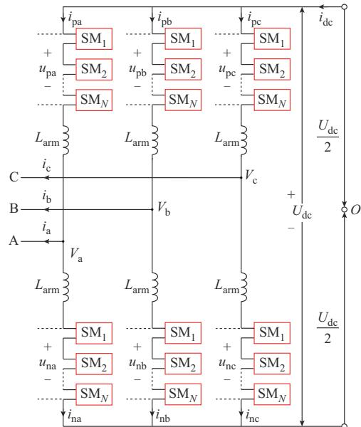
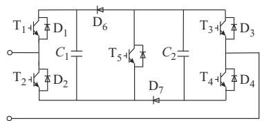
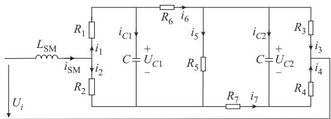
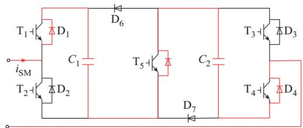
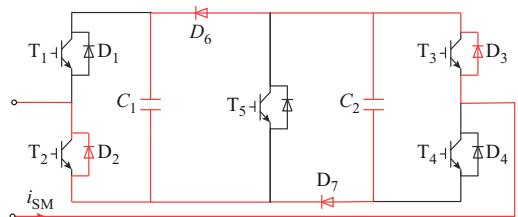
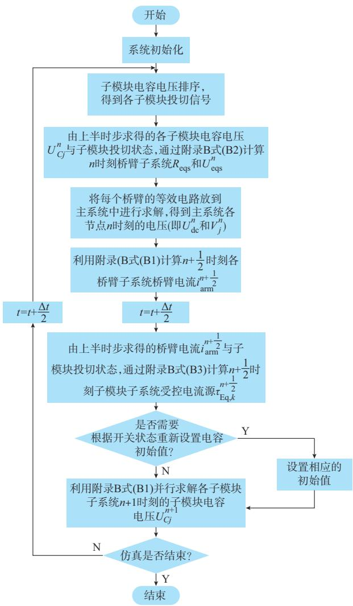
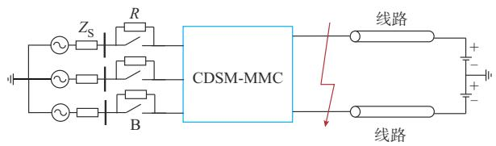

# 计及电容过渡过程的双钳位型MMC电磁暂态高效仿真方法

刘 晋1 ，邱子鉴2 ，庞博涵1 ，郭海平3 ，许明旺1 ，姚蜀军1

（1. 华北电力大学电气与电子工程学院，北京市 102206；2. 国网北京市电力公司，北京市 100031；  
3. 直流输电技术国家重点实验室（中国南方电网科学研究院有限责任公司），广东省广州市 510663）

摘要：针对在电磁暂态程序中双钳位子模块型模块化多电平换流器（CDSM-MMC）拓扑复杂、仿真速度慢的问题，将半隐式延迟解耦法应用于CDSM-MMC的电磁暂态快速仿真研究中，提出一种计及并联电容过渡过程，且解耦电路简单、导纳矩阵恒定、易于并行的高效仿真方法。首先，建立了双钳位子模块的状态空间方程，通过分裂系统矩阵，应用不同积分格式变量间的时间延迟特性，得到正常状态和闭锁状态下计及并联电容过渡过程的双钳位子模块的解耦模型；然后，分析了该模型的特点，设计了计算时序和流程；最后，通过算例验证了文中模型在大幅提高CDSM-MMC仿真效率的基础上，还兼顾了较高的仿真精度。

关键词：电磁暂态仿真；半隐式延迟解耦；双钳位子模块；模块化多电平换流器；并行计算

# 0 引 言

模 块 化 多 电 平 换 流 器（modular multilevelconverter，MMC）［1-3］ 因其输出波形质量高、模块化、电压功率易扩展等优点，广泛应用于国内外各大柔性直流输电工程［4-6］ 。近年来，不断出现新型 MMC子 模 块［7-10］，其 中 双 钳 位 子 模 块（clamp double sub-module，CDSM）不仅具备直流故障穿越能力，而且器件利用率高。因柔性直流电网不断提高的直流故障快速清除能力和经济性需求，CDSM的应用前景良好。随着柔性直流工程对MMC传输能力要求不断提高，需要更多的 CDSM。然而，双钳位子模块型模块化多电平换流器（CDSM-MMC）不仅结构复杂，而且子模块数量庞大，基于详细模型的电磁暂态仿真需要求解超高阶线性方程组，这使得 CDSM-MMC详细模型电磁暂态仿真计算量庞大、计算速度缓慢。因此，亟须研究兼顾高精度与高效率的CDSM-MMC仿真方法。

文献［9-12］提出从半桥子模块（half-bridge sub-module，HBSM）演化出的一种CDSM拓扑，介绍了其运行原理，并通过直流极间短路故障仿真验证了

其快速清除直流故障的能力。但由于缺乏高效的CDSM-MMC电磁暂态仿真模型，仅使用电平数为21电平的算例，且仿真用时长、效率低。

文献［13］对现有的平均值模型、桥臂等值模型进行了综述，这类模型简化程度高、计算速度快，但忽略了MMC的内部结构。因其不能计及开关管开关损耗和子模块内部动态特性，适用性有限。

文献［14-15］提出了基于HBSM或全桥子模块（full-bridge sub-module，FBSM）的 MMC 戴维南/诺顿等值模型。在此基础上，文献［16-17］提出一种CDSM电磁暂态等效模型。该模型根据MMC不同的工作状态，将一个CDSM等效为两个半桥子模块的戴维南/诺顿等值模型进行串并联。基于文献［14-15］，文献［18-19］提出一种可适用于各类MMC子模块的通用建模方法。然而，这类戴维南/诺顿等值模型需要对子模块进行等值、合并、反解，且节点导纳阵不恒定，计算效率随子模块拓扑复杂度增加而下降。

文献［20］将半隐式延迟解耦电磁暂态并行仿真方法应用于 MMC的电磁暂态仿真。然而，文献［20］所提及的 MMC 子模块拓扑相对于 CDSM 较为简单，对 MMC 闭锁时处理不充分，且未考虑MMC闭锁时子模块并联电容过渡过程。本文为扩充半隐式延迟解耦法应用于MMC建模仿真上的通用性，提高仿真精度，基于半隐式延迟解耦电磁暂态并行仿真方法，建立了计及并联电容过渡过程的高效 CDSM-MMC 电磁暂态仿真模型。该模型可以

考虑 MMC开关器件的损耗，具有近似详细模型的仿真精度。子模块交直流侧解耦，降低计算规模并可进行并行计算，计算效率高。此外，基于状态变量之间的解耦使得状态变量间不会由于开关动作而突变，无 须 为 抑 制 数 值 振 荡 而 在 开 关 动 作 时 切 换CDSM的积分形式，故可以始终保持解耦形式不变。

首先，本文建立了CDSM子模块的状态空间方程，通过分裂系统矩阵，基于中心积分与梯形积分的面积相似性，构建了计及并联电容过渡过程的CDSM半隐式延迟解耦模型，根据正常运行和闭锁状态下的开关管状态计算了解耦模型的相应参数；然后，给出了解耦模型的计算时序与流程，并分析了解耦模型特点；最后，通过单端 CDSM-MMC 算例验证了本文模型在准确性与计算效率上的优势。

# 1 CDSM-MMC 拓扑

MMC拓扑如图1（a）所示［21］ 。

  
(a) MMC3   
(b) I   
图1 CDSM-MMC拓扑结构  
Fig. 1 Topology of CDSM-MMC

MMC通常由6个桥臂组成，每个桥臂由1个桥臂电感 $L _ { \mathrm { a r m } }$ 和 N个子模块串联组成。上、下桥臂所有子模块的桥臂输出总电压分别为 $u _ { \mathrm { p } j }$ 和 $u _ { \mathrm { n } j }$ ，流经上、下桥臂的电流分别为 $i _ { \mathrm { p } j }$ 和 $i _ { \mathrm { n } j } ,$ ，三相交流端口输出电压和电流分别为 $V _ { j }$ 和 $i _ { j } ($ （其中 $j { = } \mathrm { a } , \mathrm { b } , \mathrm { c }$ ，表示 abc

三相）， $U _ { \mathrm { d c } }$ 为直流侧电压， $i _ { \mathrm { d c } }$ 为直流侧输入电流。

为解决HBSM无法切断直流故障电流的问题，由 HBSM衍生出 CDSM，拓扑结构如图 1（b）所示。图中，包含 5组绝缘栅双极型晶体管（insulated gatebipolar transistor，IGBT） $\mathrm { T } _ { 1 } { \sim } \mathrm { T } _ { 5 }$ 及与其反并联的二极管 $\mathrm { D _ { 1 } } \mathrm { \sim D _ { 5 } } . 2$ 个独立二极管 $\mathrm { D } _ { 6 }$ 和 $\mathrm { D } _ { 7 }$ ，以及2个独立的电容 C1和 $C _ { 2 } { \mathrm { : } }$ 。

# 2 CDSM-MMC解耦模型

文献［20］中的半隐式延迟解耦法由于具有普适性，下文将该方法应用于 CDSM-MMC 的解耦，以实现快速、精确的仿真。

为了公式的一致性，本文将 MMC 桥臂电感 $L _ { \mathrm { a r m } }$ 均分至该桥臂 N个子模块端口处，即 $L _ { \mathrm { S M } } { = } L _ { \mathrm { a r m } } / N _ { \circ }$ 同时，将每个 IGBT及与其反并联的二极管看成一个开关组，每个开关组采用二值电阻模型，得到CDSM二值电阻电路，如图2所示。图中： $R _ { 1 } { \sim } R _ { 7 }$ 表示开关组的等效电阻； $; i _ { 1 } { \sim } i _ { 7 }$ 表示各等效电阻上流过的电流。

  
图2 CDSM二值电阻电路  
Fig. 2 Binary resistance circuit of CDSM

正常工作时，桥臂上、下开关组互补导通和关断，桥臂电阻有如下关系：

$$
\left\{ \begin{array}{l} R _ {1} + R _ {2} = R _ {3} + R _ {4} = R _ {\mathrm {o n}} + R _ {\mathrm {o f f}} = R _ {\mathrm {s u m}} \\ R _ {1} R _ {2} = R _ {3} R _ {4} = R _ {\mathrm {o n}} R _ {\mathrm {o f f}} = R _ {\mathrm {m u l}} \end{array} \right. \tag {1}
$$

式中： $R _ { \mathrm { o n } }$ 和 $R _ { \mathrm { o f f } }$ 分别为开关组的等效电阻在导通和关断情况下的阻值。

对 图 等 效 电 路 列 写 基 尔 霍 夫 电 流 定 律（KCL）、基尔霍夫电压定律（KVL）方程，并化简后得到CDSM状态空间方程，即

$$
\left[ \begin{array}{l} C \frac {\mathrm {d} U _ {C 1}}{\mathrm {d} t} \\ C \frac {\mathrm {d} U _ {C 2}}{\mathrm {d} t} \\ L _ {\mathrm {S M}} \frac {\mathrm {d} i _ {\mathrm {S M}}}{\mathrm {d} t} \end{array} \right] = \left[ \begin{array}{l l l} G _ {1 1} & G _ {1 2} & K _ {i 1} \\ G _ {2 1} & G _ {2 2} & K _ {i 2} \\ K _ {u 1} & K _ {u 2} & - R _ {\mathrm {e q}} \end{array} \right] \left[ \begin{array}{l} U _ {C 1} \\ U _ {C 2} \\ i _ {\mathrm {S M}} \end{array} \right] + \left[ \begin{array}{l} 0 \\ 0 \\ U _ {i} \end{array} \right] \tag {2}
$$

式 中 ：C 为 子 模 块 电 容 容 值 ； $U _ { c 1 }$ 和 $U _ { c 2 }$ 分 别 为CDSM 中两个电容的电压； $; i _ { \mathrm { S M } }$ 为流入子模块的电流；U 为子模块端口电压； $K _ { i 1 } \setminus K _ { i 2 } \setminus K _ { u 1 } \setminus K _ { u 2 }$ 为子模块等效电路中各受控源参数； $G _ { 1 1 } \setminus G _ { 1 2 } \setminus G _ { 2 1 } \setminus G _ { 2 2 } \setminus R _ { \mathrm { e q } }$ 为子

模块等效电路中各等效电阻参数。具体如下：

$$
\begin{array}{l} G _ {1 1} = - \frac {1}{R _ {1} + R _ {2}} - \frac {R _ {5} + R _ {7}}{R _ {5} R _ {6} + R _ {5} R _ {7} + R _ {6} R _ {7}} \\ G _ {1 2} = G _ {2 1} = \frac {R _ {5}}{R _ {5} R _ {6} + R _ {5} R _ {7} + R _ {6} R _ {7}} \\ G _ {2 2} = - \frac {1}{R _ {3} + R _ {4}} - \frac {R _ {5} + R _ {6}}{R _ {5} R _ {6} + R _ {5} R _ {7} + R _ {6} R _ {7}} \\ R _ {\mathrm {e q}} = \frac {R _ {1} R _ {2}}{R _ {1} + R _ {2}} + \frac {R _ {3} R _ {4}}{R _ {3} + R _ {4}} + \frac {R _ {5} R _ {6} R _ {7}}{R _ {5} R _ {6} + R _ {5} R _ {7} + R _ {6} R _ {7}} \\ K _ {i 1} = - K _ {u 1} = \frac {R _ {2}}{R _ {1} + R _ {2}} - \frac {R _ {5} R _ {7}}{R _ {5} R _ {6} + R _ {5} R _ {7} + R _ {6} R _ {7}} \\ K _ {i 2} = - K _ {u 2} = \frac {R _ {3}}{R _ {3} + R _ {4}} - \frac {R _ {5} R _ {6}}{R _ {5} R _ {6} + R _ {5} R _ {7} + R _ {6} R _ {7}} \tag {3} \\ \end{array}
$$

# 2. 1 正常状态时的解耦

当子模块正常运行时（投入/旁路），工作状态如表 1所示。其中，T 保持开通状态， $\mathrm { D } _ { 6 }$ 和 $\mathrm { D } _ { 7 }$ 反向截止， $U _ { \mathrm { S M } }$ 为子模块端口电压。

表1 正常状态下的CDSM开关状态  
Table 1 On-off states of CDSM in normal state   

<table><tr><td colspan="6">开关状态</td><td rowspan="2">\( U_{\text{SM}} \)</td></tr><tr><td>\( T_1 \)</td><td>\( T_2 \)</td><td>\( T_3 \)</td><td>\( T_4 \)</td><td>\( T_5 \)</td><td>\( D_6, D_7 \)</td></tr><tr><td>1</td><td>0</td><td>0</td><td>1</td><td>1</td><td>0</td><td>\( U_{C1}+U_{C2} \)</td></tr><tr><td>0</td><td>1</td><td>1</td><td>0</td><td>1</td><td>0</td><td>0</td></tr><tr><td>1</td><td>0</td><td>1</td><td>0</td><td>1</td><td>0</td><td>\( U_{C1} \)</td></tr><tr><td>0</td><td>1</td><td>0</td><td>1</td><td>1</td><td>0</td><td>\( U_{C2} \)</td></tr></table>

由于 $R _ { \mathrm { o f f } } \gg R _ { \mathrm { o n } } ,$ ，若将 $R _ { \mathrm { o f f } }$ 看作无穷大，则根据表1中的开关状态可知：

$$
\left\{ \begin{array}{l} G _ {1 1} = G _ {1 2} = G _ {2 1} = G _ {2 2} \approx 0 \\ K _ {i 1} = - K _ {u 1} \approx \frac {R _ {2}}{R _ {\text {s u m}}} \\ K _ {i 2} = - K _ {u 2} \approx \frac {R _ {3}}{R _ {\text {s u m}}} \\ R _ {\mathrm {e q}} \approx \frac {2 R _ {\mathrm {m u l}}}{R _ {\mathrm {s u m}}} + R _ {\mathrm {o n}} \approx 3 R _ {\mathrm {o n}} \end{array} \right. \tag {4}
$$

此时，式（2）的状态方程可以化简为：

$$
\left[ \begin{array}{l} C \frac {\mathrm {d} U _ {C 1}}{\mathrm {d} t} \\ C \frac {\mathrm {d} U _ {C 2}}{\mathrm {d} t} \\ L _ {\mathrm {S M}} \frac {\mathrm {d} i _ {\mathrm {S M}}}{\mathrm {d} t} \end{array} \right] = \left[ \begin{array}{c c c} 0 & 0 & K _ {i 1} \\ 0 & 0 & K _ {i 2} \\ K _ {u 1} & K _ {u 2} & - R _ {\mathrm {e q}} \end{array} \right] \left[ \begin{array}{l} U _ {C 1} \\ U _ {C 2} \\ i _ {\mathrm {S M}} \end{array} \right] + \left[ \begin{array}{l} 0 \\ 0 \\ U _ {i} \end{array} \right] \tag {5}
$$

根据半隐式延迟解耦方法原理，对式（5）进行矩阵分裂得：

$$
\begin{array}{l} \left[ \begin{array}{l} C \frac {\mathrm {d} U _ {C 1}}{\mathrm {d} t} \\ C \frac {\mathrm {d} U _ {C 2}}{\mathrm {d} t} \\ L _ {\mathrm {S M}} \frac {\mathrm {d} i _ {\mathrm {S M}}}{\mathrm {d} t} \end{array} \right] = \left[ \begin{array}{c c c} 0 & & \\ & 0 & \\ & & - R _ {\mathrm {e q}} \end{array} \right] \left[ \begin{array}{l} U _ {C 1} \\ U _ {C 2} \\ i _ {\mathrm {S M}} \end{array} \right] + \\ \left[ \begin{array}{c c c} & & K _ {i 1} \\ & & K _ {i 2} \\ \dots \dots \dots \dots \dots \dots \dots \dots \dots \dots \dots \dots \dots \dots \dots \dots \dots \dots \dots \dots \dots \dots \dots \dots \dots \dots \dots \dots \dots \dots \dots \dots \dots \dots \dots \dots \dots \dots \dots \dots \dots \dots \dots \dots \dots \dots \dots \dots \dots \dots \end{array} \right] \left[ \begin{array}{l} U _ {C 1} \\ U _ {C 2} \\ i _ {\mathrm {S M}} \end{array} \right] + \left[ \begin{array}{c} 0 \\ 0 \\ U _ {i} \end{array} \right] \tag {6} \\ \end{array}
$$

此时，式（6）的半隐式差分方程为：

$$
\begin{array}{l} \left[ \begin{array}{c} C \left(U _ {C 1} ^ {n + 1} - U _ {C 1} ^ {n}\right) \\ C \left(U _ {C 2} ^ {n + 1} - U _ {C 2} ^ {n}\right) \\ L _ {\mathrm {S M}} \left(i _ {\mathrm {S M}} ^ {n + \frac {1}{2}} - i _ {\mathrm {S M}} ^ {n - \frac {1}{2}}\right) \end{array} \right] = \left[ \begin{array}{c c c} 0 & & \\ & 0 & \\ & & - R _ {\mathrm {e q}} \end{array} \right] \left[ \begin{array}{c} U _ {C 1} ^ {n + 1} + U _ {C 1} ^ {n} \\ U _ {C 2} ^ {n + 1} + U _ {C 2} ^ {n} \\ i _ {\mathrm {S M}} ^ {n + \frac {1}{2}} + i _ {\mathrm {S M}} ^ {n - \frac {1}{2}} \end{array} \right]. \\ \frac {\Delta t}{2} + \left[ \begin{array}{c c c} & & K _ {i 1} \\ & & K _ {i 2} \\ K _ {u 1} & K _ {u 2} \end{array} \right] \left[ \begin{array}{l} U _ {C 1} ^ {n} \\ U _ {C 2} ^ {n} \\ i _ {\mathrm {S M}} ^ {n + \frac {1}{2}} \end{array} \right] \Delta t + \left[ \begin{array}{c} 0 \\ 0 \\ U _ {i} \end{array} \right] \Delta t \tag {7} \\ \end{array}
$$

式中：上标 $n , n + 1 , n + 1 / 2 , n - 1 / 2$ 分别表示对应仿真时刻； $\Delta t$ 为仿真步长。

各受控源系数以及相关变量的表达式见附录A式 $( \mathrm { A } 1 )$ 。由式（7）可得正常状态下CDSM的解耦模型，如附录B图B1所示。

# 2. 2 闭锁状态时的解耦

当MMC处于闭锁状态时，所有IGBT关断，根据电流方向分为正向充电、反向充电、高阻态，各工作状态如表2所示。

表2 闭锁状态下的CDSM开关状态  
Table 2 On-off states of CDSM in blocking state   

<table><tr><td rowspan="2">工作状态</td><td colspan="2">开关状态</td><td rowspan="2">iarm</td></tr><tr><td>D1、D4、D5</td><td>D2、D3、D6、D7</td></tr><tr><td>正向充电</td><td>1</td><td>0</td><td>&gt;0</td></tr><tr><td>反向充电</td><td>0</td><td>1</td><td>&lt;0</td></tr><tr><td>高阻态</td><td>0</td><td>0</td><td>=0</td></tr></table>

# 2. 2. 1 正向充电

当桥臂电流 $i _ { \mathrm { a r m } } > 0$ 时，CDSM 处于正向充电状态， $\mathrm { D } _ { 1 } , \mathrm { D } _ { 4 } , \mathrm { D } _ { 5 }$ 正向导通， $\mathrm { D } _ { 2 } \ 、 \mathrm { D } _ { 3 } \ 、 \mathrm { D } _ { 6 } \ 、 \mathrm { D } ,$ 反向截止，电流通路如图 $3 ( \mathrm { a } )$ 中红色部分所示。

此时，若将关断时的开关组电阻看作无穷大，可得

$$
\left\{ \begin{array}{l} G _ {1 1} = G _ {1 2} = G _ {2 1} = G _ {2 2} \approx 0 \\ K _ {i 1} = K _ {i 2} = - K _ {u 1} = - K _ {u 2} \approx 1 \\ R _ {\mathrm {e q}} \approx \frac {2 R _ {\mathrm {m u l}}}{R _ {\mathrm {s u m}}} + R _ {\mathrm {o n}} \approx 3 R _ {\mathrm {o n}} \end{array} \right. \tag {8}
$$

  
(a) 	**"EC

  
(b) 	**"EC   
图3 CDSM闭锁时的电流通路  
Fig. 3 Current path of CDSM in blocking state

此时，系统状态方程与正常状态下的系统状态方程结构一致。因此，这两种状态下CDSM的解耦模型相同，如附录B图B1所示。此时，等值电压源$U _ { \mathrm { e q } } { = } K _ { u 1 } U _ { c 1 } { + } K _ { u 2 } U _ { c 2 } { = } 2 U _ { c }$ ，等 值 电 流 源 $J _ { \mathrm { e q 1 } } { = } J _ { \mathrm { e q 2 } } { = }$ $K _ { i 1 } i _ { \mathrm { a m } } { = } i _ { \mathrm { a r m } }$ ，其中U 为电容电压。

# 2. 2. 2 反向充电

当桥臂电流 $i _ { \mathrm { a r m } } { < } 0$ 时，CDSM 处于反向充电状态， $\mathrm { D } _ { 1 } , \mathrm { D } _ { 4 } , \mathrm { D } _ { 9 }$ 反向截止， $\mathrm { D } _ { 2 } \setminus \mathrm { D } _ { 3 } \setminus \mathrm { D } _ { 6 } \setminus \mathrm { D } _ { 7 }$ 正向导通。当MMC从正常状态切换成闭锁反向充电时，子模块内部电流通路如图 3（b）所示。CDSM 中的两个电容从串联变成并联，子模块中的两个电容电压可能不相等，会有一个短暂的均压过程，需要考虑并联电容过渡过程。

此时式（2）中的系数为：

$$
\left\{ \begin{array}{l} G _ {1 1} = - G _ {1 2} = - G _ {2 1} = G _ {2 2} \approx - \frac {1}{2 R _ {\mathrm {o n}}} \\ K _ {i 1} = K _ {i 2} = - K _ {u 1} = - K _ {u 2} \approx 0. 5 \\ R _ {\mathrm {e q}} \approx 2. 5 R _ {\mathrm {o n}} \end{array} \right. \tag {9}
$$

系统状态方程为与式（2）形式相同。可知，根据系统的全响应理论，计及并联电容过渡过程，闭锁反向充电状态的解耦模型如附录 B图 B2所示。图中， 部分对应零输入响应，两个电容的初始值为进入闭锁反向充电时的电压值；B部分对应零状态响应，形式与正常状态时的解耦电路相同。此时，交流侧的受控电压源可看作含有内阻，其值为并联均压回路中的电阻 $( 0 . 5 R _ { \mathrm { o n } } )$ 。

在均压过渡过程结束后，A部分不再起作用，B部分两个电容上流过的电流相等，解耦电路可以简化为与正常状态下相同的拓扑，如附录 B 图 B1所示。此 时， $\begin{array} { r } { U _ { \mathrm { e q } } { = } K _ { u 1 } U _ { c 1 } { + } K _ { u 2 } U _ { c 2 } , J _ { \mathrm { e q 1 } } { = } J _ { \mathrm { e q 2 } } { = } K _ { i 1 } i _ { \mathrm { a r m } } { = } } \end{array}$

$$
- i _ {\mathrm {a r m}} / 2, R _ {\mathrm {e q}} = 2. 5 R _ {\mathrm {o n}} 。
$$

# 2. 2. 3 高 阻 态

闭锁后，当桥臂电流 $i _ { \mathrm { a r m } }$ 降到 0时，CDSM 进入高阻状态。此时式（2）中的系数为：

$$
\left\{ \begin{array}{l} G _ {1 1} = G _ {1 2} = G _ {2 1} = G _ {2 2} \approx 0 \\ K _ {i 1} = K _ {i 2} = - K _ {u 1} = - K _ {u 2} \approx \frac {1}{6} \\ R _ {\mathrm {e q}} = \infty \end{array} \right. \tag {10}
$$

此时，系统状态方程与正常状态下的系统状态方程结构一致。因此，高阻态时 CDSM 的解耦模型与 正 常 状 态 下 相 同 ，如 附 录 B 图 B1 所 示 。 此 时 ，$J _ { \mathrm { e q 1 } } = J _ { \mathrm { e q 2 } } = 0 , U _ { \mathrm { e q } } = K _ { u 1 } U _ { c 1 } + K _ { u 2 } U _ { c 2 } \circ$ 。

需要指出的是，如果在PSCAD中搭建MMC自定义等值模型，需借助二极管和 MMC自定义等值模型的组合，通过PSCAD自带的插值功能，获取闭锁时二极管准确的关断时刻，简化数值振荡抑制，类似文献［22］。本文通过编程开发实现解耦模型，可方便地获取二极管关断时刻，故无须使用上述方法。

# 2. 3 单个桥臂的解耦

综合分析上述 CDSM 在不同工作状态下的解耦电路，附录B图B2代表的子模块全响应解耦模型中，均压过渡过程时间较短，且均压结束后将不再起作用。因此，只要进入各工作状态时设置好相对应的模型参数和电容初值，该解耦模型即可涵盖CDSM的所有工作状态（各状态下的相应模型参数和电容初值见附录C）。

一般来说，当子模块进入或退出反向充电状态时，在切换时刻需要对电容电压设置相应的初始值 。 假 设 当 前 时 刻 为 $t _ { n }$ ，此 时 的 各 电 容 电 压 为$U _ { c \mathrm { { l a } } , n } \ U _ { c \mathrm { { 2 a } } , n } \ U _ { c \mathrm { { l b } } , n } \ U _ { c \mathrm { { 2 b } } , n \mathrm { { O } } }$ 。若此时进入反向充电状态 ，需 令 $\scriptstyle U _ { \scriptscriptstyle { C 1 3 } } = U _ { \scriptscriptstyle { C 1 6 , n } } , U _ { \scriptscriptstyle { C 2 3 } } = U _ { \scriptscriptstyle { C 2 5 , n } , } U _ { \scriptscriptstyle { C 1 6 } } = U _ { \scriptscriptstyle { C 2 5 } } = 0 ,$ 。若此时退出反向充电状态，需令 $\begin{array} { r l } { { U _ { C 1 b } } { = } { U _ { C 1 a , n } } , { U _ { C 2 b } } { = } } \end{array}$ $U _ { { \cal { C } } 2 { \mathrm { a } } , n } , U _ { { \cal { C } } 1 { \mathrm { a } } } { = } U _ { { \cal { C } } 2 { \mathrm { a } } } { = } 0$ 。其中， $U _ { c i j } ( i { = } 1 , 2 ; j { = } { \mathrm { a } } , { \mathrm { b } } )$ 为反向充电时CDSM解耦电路中各电容电压。

在得到CDSM的半隐式延迟解耦模型后，将一个桥臂的所有CDSM桥臂侧解耦电路串联，得到一个桥臂的桥臂侧解耦电路，进而得到单个桥臂的解耦电路，如附录B图B3所示。各受控源系数以及相关变量的表达式见附录A式（A2）、式（A3）。

# 2. 4 解耦模型特点

相比于现有的CDSM-MMC仿真建模方法，本文提出的解耦模型既能拆分 MMC减小仿真规模，又能实现子系统之间的并行计算。此外，还具有以下特点：

1）相比于平均值、桥臂等值模型、开关函数以及

动态相量等模型，本文模型既能计及子模块内部动态特性，又能计及开关器件的导通损耗，具有与详细模型近似的精细度。

）相比于戴维南和嵌套快速求解法，本文模型反解子模块电容电压时的计算效率高。戴维南和嵌套快速求解法在计算子模块电容电压时，需要先得到子模块端口电压，然后反解子模块内部电容电压，导致计算效率随着子模块内部拓扑的复杂度增加急剧下降。由附录B图B3可知，本文模型各子模块间相互解耦，子模块内部等值电路仅由受控电流源和电容并联构成，且含有多个电容时，各电容的等值电路之间也相互解耦（反向充电时有短暂的过渡过程）。因此，求解子模块电容电压时，与子模块内部拓扑的复杂度无关，电路简单、计算量少、仿真效率高。  
3）相较于传统方法，本文模型在不同状态下的桥臂导纳矩阵恒定，从而可避免传统方法中，因开关动作导致导纳矩阵变化而不得不频繁LU重分解带来的巨大计算量，可极大地提高计算效率。

# 3 计算时序及流程

# 3. 1 计算时序

根据2.3节中所述的半隐式延迟解耦与并行原理，可以将附录B图B3中的CDSM-MMC解耦电路分为求解子模块电压 $( U _ { 1 } , U _ { 2 } , \cdots , U _ { N } )$ 和桥臂电流$I _ { \mathrm { a r m } }$ 两组，两组之间相隔半个步长交替求解，并且 $U _ { 1 }$ ，U ，…， $U _ { N }$ 间可并行求解，计算时序如附录 图所示。

# 3. 2 计算流程

计算流程如图4所示，其中 $U _ { \mathrm { e q s } }$ 表示桥臂等值电压源， $R _ { \mathrm { e q s } }$ 表示桥臂等值电阻。每次有开关组合状态变化时，要判断是否重新设置电容初始值，电容初始值如何设定已在3.1节中详细叙述。

# 4 算例分析

本文编程实现了所提出的解耦模型，并在PSCAD/EMTDC 中搭建了 CDSM-MMC 详细模型和戴维南等值模型，将其仿真结果进行对比，从而验证了本文模型具有近似详细模型的精度，且仿真效率 提 升 显 著 。 PC 机 硬 件 配 置 为 ：Intel Core i7-9700K CPU（8 核心、8 线程），16 GB RAM。本文算例系统参数如表3所示，采用单端CDSM-MMC，系统拓扑如图5所示，图中Z 为交流系统阻抗。由于本文主要针对仿真效率进行研究，对 MMC系统工况和参数研究不够深入，为增强文中算例的比较性，系统参数借鉴了文献［17］和PSCAD的相关示例。

  
图 4 CDSM-MMC 仿真计算流程图  
Fig. 4 Flow chart of CDSM-MMC simulation calculation

表3 系统参数  
Table 3 System parameters   

<table><tr><td>设备</td><td>参数名称</td><td>参数值</td></tr><tr><td rowspan="5">交流侧系统</td><td>线电压</td><td>230 kV</td></tr><tr><td>频率</td><td>50 Hz</td></tr><tr><td>系统电阻</td><td>0.88 Ω</td></tr><tr><td>系统电感</td><td>45 mH</td></tr><tr><td>限流电阻</td><td>3 Ω</td></tr><tr><td rowspan="2">直流侧系统</td><td>极间电压</td><td>±200 kV</td></tr><tr><td>线路电阻</td><td>1 Ω</td></tr><tr><td rowspan="3">MMC</td><td>桥臂子模块数量</td><td>100</td></tr><tr><td>子模块电容</td><td>6.6 mF</td></tr><tr><td>桥臂电感</td><td>50 mH</td></tr></table>

仿真运行总时间为 2 s，时间节点设置如下：初始时刻，MMC闭锁，限流电阻未切除；0 s时仿真开始，交流侧电压上升时间为 ； 时 解除闭锁；0.5 s时切除限流电阻R；1.3 s时MMC直流

  
图5 单端CDSM-MMC系统拓扑  
Fig. 5 Single-ended CDSM-MMC system topology

侧发生极间短路故障，故障持续50 ms，故障后5 ms时MMC闭锁。

# 4. 1 精度对比

本节分别对比了PSCAD/EMTDC中详细模型和本文所提解耦模型在不同电气量下的仿真精度，并计算了详细模型和本文模型的最大均方根相对误差。仿真步长为5 μs，仿真对比结果如附录B图B5所示。表4列出了相关电气量的最大误差情况。从图B5的仿真结果可以看出，系统各电气量的波形均与详细模型波形吻合。因此，本文提出的模型在稳态与暂态情况下都具备很高的仿真精度，能够保证CDSM-MMC仿真的准确性。

表4 各电气量误差  
Table 4 Error of each electrical quantity   

<table><tr><td>电气量</td><td>最大相对误差/%</td></tr><tr><td>A相交流侧电压</td><td>0.92</td></tr><tr><td>A相上桥臂子模块电容电压之和</td><td>0.02</td></tr><tr><td>A相桥臂电流</td><td>0.57</td></tr><tr><td>直流侧有功功率</td><td>0.15</td></tr><tr><td>交流侧有功功率</td><td>0.26</td></tr><tr><td>交流侧无功功率</td><td>0.15</td></tr></table>

此外，相较于开关函数模型，本文提出的解耦模型还能准确地保留内部开关损耗信息，故本文模型更精确。附录 B图 B6为 41电平单端 CDSM-MMC在仿真步长为5 μs的情况下，详细模型、半隐式延迟解耦模型以及开关函数模型的交流侧与直流侧的功率比较。从对比结果可以看出，以详细模型为基准，半隐式延迟解耦模型相比于开关函数模型，交流侧的有功和无功功率以及直流侧有功功率误差均小于开关函数模型。

# 4. 2 并联电容过渡过程对比

本节对比了PSCAD/EMTDC中详细模型和本文所提解耦模型在 CDSM-MMC 从正常状态切换到反向充电闭锁状态时.子模块电容过渡过程仿真对比。仿真步长为5 μs，结果如附录B图B7所示。

1.3 s 时 MMC 直 流 侧 发 生 极 间 短 路 故 障 ，1.305 s时 MMC闭锁。从附录 B图 B7的仿真结果可以看出，MMC闭锁前子模块内两电容电压不同，

在闭锁后存在短暂的子模块电容均压过程，解耦模型与详细模型子模块电容过渡过程波形吻合。因此，本文提出的模型可以准确模拟出子模块并联电容过渡过程。

# 4. 3 效率对比

本节中未做说明时，默认算例运行时间为 2 s，MMC 电平数为 41 电平，仿真步长为 5 μs。

在不同电平数下，将详细模型、戴维南等值模型和本文所提方法在串行和并行计算方式下的 CPU用时进行对比，以验证本文方法的效率，如附录B图B8所示。从图中可以看出，随着电平数增加，本文提出的模型加速效果显著。在 201 电平时，解耦模型串行计算相较于详细模型加速了3 339.4倍，相较于戴维南模型也加速了 7.5倍，并且解耦模型并行计算速度更快、加速比更高。在多种仿真步长下，对比详细模型、戴维南等值模型和本文模型仿真的CPU 用时，结果如图 B9 所示。从图 B9 中可以看出，在不同步长下，本文提出模型相较于详细模型与戴维南等值模型加速明显。

从附录B图B8、图B9中可以看出，得益于导纳矩阵恒定和细粒度解耦，本文模型相较于现有方法可以极大地提高CDSM-MMC的仿真效率。此外，由于本文实验所用的 CPU核心数远小于解耦后的子系统数，这使得解耦模型并行计算的优势无法充分发挥，限制了其加速比。若使用计算单元更多的图 形 处 理 器（graphics processing unit，GPU）进 行 计算，且合理分配计算任务，理论上可以进一步提高仿真速度。

# 5 结 语

本文应用半隐式延迟解耦电磁暂态仿真方法，建立了计及并联电容过渡过程的CDSM解耦模型，进而得到了单端CDSM-MMC解耦模型，并给出了解耦模型的计算时序与流程。

该模型考虑了子模块开关管导通损耗和电容充放电特性，并计及了并联电容过渡过程，能够精确模拟出正常运行状态到闭锁之间的转换过程，具有近似详细模型的仿真精度。同时，解耦模型可拆分MMC减小仿真规模，实现子系统之间的并行计算。在不同状态下，本文模型的桥臂导纳矩阵恒定、子模块电容电路简单，且节点数少于采用戴维南等值法的电容电压反解电路，这使得本文模型具有很高的仿真效率。

通过详细模型、戴维南等值模型以及解耦模型仿真波形对比，验证了本文提出的模型能够精确模拟并联电容过渡过程，具有近似详细模型的精度。

随着子模块数量增多，仿真加速比显著上升，表明在子模块数越多的情形下仿真效率越高。对 CDSM-MMC详细模型仿真规模大、矩阵维数高、仿真速度慢的问题提供了一种快速、高效的解决方案。

考虑到本文未对所提出模型的稳定性进行分析，未来需要进一步完善。同时，由于本文模型具有导纳矩阵恒定和细粒度解耦等特点，适用于基于现场 可 编 程 门 阵 列（field programmable gate array，FPGA）的实时仿真，未来可以进一步实现 CDSM-MMC系统的实时仿真和半实物仿真。

本文研究得到了 CloudPSS 平台提供的测试支持，特此感谢！

附录见本刊网络版（http：//www.aeps-info.com/aeps/ch/index.aspx），扫英文摘要后二维码可以阅读网络全文。

# 参 考 文 献

［1］汤广福，贺之渊，庞辉 .柔性直流输电工程技术研究、应用及发展［J］.电力系统自动化，2013，37（15）：3-14.  
TANG Guangfu， HE Zhiyuan， PANG Hui. Research，application and development of VSC-HVDC engineeringtechnology［J］. Automation of Electric Power Systems，2013，37（15）：3-14.  
［2］陈武晖，吴明哲，张军，等 .模块化多电平换流器电磁暂态模型研究综述［］电网技术， ，（ ）： -  
CHEN Wuhui，WU Mingzhe，ZHANG Jun，et al. Review ofelectromagnetic transient modeling of modular multilevelconverters［J］. Power System Technology，2020，44（12）：4755-4765.  
［3］樊强，赵西贝，赵成勇，等 .模块化多电平换流器自适应故障限流控制策略［J］.电力系统自动化，2021，45（17）：126-133.  
FAN Qiang，ZHAO Xibei，ZHAO Chengyong，et al. Adaptive fault current limiting control strategy for modular multilevel converter［J］. Automation of Electric Power Systems，2021，45 （17）：126-133.   
［4］汤广福，庞辉，贺之渊.先进交直流输电技术在中国的发展与应用［J］. 中国电机工程学报，2016，36（7）：1760-1771.  
TANG Guangfu， PANG Hui， HE Zhiyuan. R & D andapplication of advanced power transmission technology in China［J］. Proceedings of the CSEE，2016，36（7）：1760-1771.  
[5]FRANQUELOLG，RODRIGUEZJ，LEONJI，etal.Theage of multilevel converters arrives ［J］. IEEE IndustrialElectronics Magazine，2008，2（2）：28-39.  
［ ］陈东，乐波，梅念，等 厦门双极柔性直流输电工程系统设计［J］. 电力系统自动化，2018，42（14）：180-185.  
CHEN Dong，YUE Bo，MEI Nian，et al. System design of bipolar voltage source converter based on high voltage direct current transmission project［J］. Automation of Electric Power Systems，2018，42（14）：180-185.   
［7］GOETZ S M， PETERCHEV A V， WEYH T. Modularmultilevel converter with series and parallel module connectivity：

topology and control ［J］. IEEE Transactions on PowerElectronics，2015，30（1）：203-215.  
［8］PRIYA M， PONNAMBALAM P， MURALIKUMAR K.Modular-multilevel converter topologies and applications—areview［J］. IET Power Electronics，2019，12（2）：170-183.  
［9］MARQUARDT R. Modular multilevel converter：an universal concept for HVDC-networks and extended DC-bus-applications ［C］// The 2010 International Power Electronics Conference-ECCE Asia，June 21-24，2010，Sapporo，Japan：502-507.   
［10］MARQUARDT R. Modular multilevel converter topologies with DC-short circuit current limitation［C］// 8th International Conference on Power Electronics-ECCE Asia， May 30-June 3，2011，Jeju，South Korea：1425-1431.   
［11］丁云芝，苏建徽，周建.基于钳位双子模块的MMC故障清除和重启能力分析［J］.电力系统自动化，2014，38（1）：97-103.  
DING Yunzhi， SU Jianhui， ZHOU Jian. Analysis on faultcurrent limitation and self-recovery of MMC based on clampdouble sub-module［J］. Automation of Electric Power Systems，2014，38（1）：97-103.  
［12］贺之渊，陆晶晶，刘天琪，等.柔性直流电网故障电流抑制关键技术与展望［J］.电力系统自动化，2021，45（2）：173-183.  
HE Zhiyuan，LU Jingjing，LIU Tianqi，et al. Key technologiesand prospect of fault current suppression in flexible DC powergrid［J］. Automation of Electric Power Systems，2021，45（2）：173-183.  
［13］许建中，李承昱，熊岩，等.模块化多电平换流器高效建模方法研究综述［J］. 中国电机工程学报，2015，35（13）：3381-3392.  
XU Jianzhong，LI Chengyu，XIONG Yan，et al. A review ofefficient modeling methods for modular multilevel converters［J］. Proceedings of the CSEE，2015，35（13）：3381-3392.  
[14]GNANARATHNAUN，GOLEAM，JAYASINGHERP.Efficient modeling of modular multilevel HVDC converters（MMC） on electromagnetic transient simulation programs［J］.IEEE Transactions on Power Delivery， 2011， 26 （1） ：316-324.  
［15］颜新洋，么莉，张炳达，等.采用模块组多样性等效的模块化多电平换流器实时仿真［J］. 电力系统自动化，2021，45（12）：142-150.  
YAN Xinyang，YAO Li，ZHANG Bingda，et al. Real-time simulation of modular multilevel converter based on diversity equivalent of module group［J］. Automation of Electric Power Systems，2021，45（12）：142-150.   
［ ］林雪华，郭琦，郭海平，等 基于 的柔性直流实时仿真技术及试验系统［］电力系统自动化， ，（ ）： -  
LIN Xuehua，GUO Qi，GUO Haiping，et al. FPGA based realtime simulation technology and test system of flexible DC[J]. Automation of Electric Power Systems，2017，41（12）：33-39.   
［17］徐东旭，刘崇茹，王洁聪，等.钳位双子模块型MMC的电磁暂态等效模型［］电网技术， ，（ ）： -  
XU Dongxu，LIU Chongru，WANG Jiecong，et al. Equivalentelectromagnetic transient model of CDSM-MMC［J］. PowerSystem Technology，2016，40（10）：3176-3183.  
［ ］赵禹辰，徐义良，赵成勇，等 单端口子模块 电磁暂态通用等效建模方法［J］.中国电机工程学报，2018，38（16）：4658-4667.  
ZHAO Yuchen， XU Yiliang， ZHAO Chengyong， et al.Generalized electromagnetic transient （EMT） equivalent

modeling of MMCs with arbitrary single-port sub-modulestructures［J］. Proceedings of the CSEE，2018，38（16）：4658-4667.  
［19］徐义良，赵成勇，赵禹辰，等.双端口子模块MMC电磁暂态通用等效建模方法［J］.中国电机工程学报，2018，38（20）：6079-6090.  
XU Yiliang， ZHAO Chengyong， ZHAO Yuchen， et al.Generalized electromagnetic transient （EMT） equivalentmodeling of MMCs with arbitrary two-port sub-modulestructures［J］. Proceedings of the CSEE，2018，38（20）：6079-6090.  
［20］姚蜀军，庞博涵，曾子文，等.半隐式延迟解耦电磁暂态仿真方法（二）：单端口子模块MMC通用解耦与快速仿真［J］.中国电机工程学报， ，（ ）： -  
YAO Shujun， PANG Bohan， ZENG Ziwen， et al. Semi-implicit latency decoupling technology based electromagnetictransient simulation—part Ⅱ ： general decoupling and fastsimulation for single-port sub-module MMC［J］. Proceedings ofthe CSEE，2022，42（13）：4775-4785.  
［21］徐政，屠卿瑞，管敏渊.柔性直流输电系统［M］.北京：机械工业出版社，2013：14-19.  
XU Zheng，TU Qingrui，GUAN Minyuan. Flexible DC power

transmission system［M］. Beijing：China Machine Press，2013：14-19.  
［22］王洁聪，刘崇茹，徐东旭，等.基于RTDS的模块化多电平换流器闭锁状态仿真建模方法［J］.电工技术学报，2018，33（16）：3686-3696.  
WANG Jiecong，LIU Chongru，XU Dongxu，et al. Simulation method of modular multilevel converter blocking state based on RTDS［J］. Transactions of China Electrotechnical Society， 2018，33（16）：3686-3696.

刘 晋(1974—)，男，博士，讲师，主要研究方向：柔性交直流输电、电力电子技术。E-mail：liujin@ncepu.edu.cn

邱子鉴(1996—)，男，硕士，主要研究方向：柔性交直流输电、电磁暂态建模与仿真。E-mail：871449454@qq.com

庞博涵(1997—)，男，硕士研究生，主要研究方向：电磁暂态建模与仿真。E-mail：pang_bohan@163.com

姚蜀军 — ，男，通信作者，博士，副教授，主要研究方向：电力系统运行与控制、直流输电、电磁暂态仿真和建模等。E-mail：yaoshujun@ncepu.edu.cn

（编辑 章黎）

# Efficient Simulation Method for Electromagnetic Transient of Clamp Double Sub-module Modular Multi-level Converter Considering Capacitance Transition Process

LIU Jin1 ，QIU Zijian2 ，PANG Bohan1 ，GUO Haiping3 ，XU Mingwang1 ，YAO Shujun1

(1. School of Electrical and Electronic Engineering, North China Electric Power University, Beijing 102206, China;

2. State Grid Beijing Electric Power Company, Beijing 100031, China; 3. State Key Laboratory of HVDC

(Electric Power Research Institute of China Southern Power Grid Company Limited), Guangzhou 510663, China)

Abstract: Aiming at the problems of complex topology and slow simulation speed of clamp double sub-module (CDSM) modular multi-level converter (CDSM-MMC) in the electromagnetic transient program, the semi-implicit delay decoupling method is applied to the fast simulation research of the electromagnetic transient of CDSM -MMC. A efficienct simulation method with simple decoupling circuit, constant admittance matrix, and easy parallelism is proposed, which takes into account the transition process of shunt capacitors. First, the state space equation of the CDSM is established. By splitting the system matrix and applying the time delay characteristics between variables of different integral formats, the decoupling model of CDSM considering the transition process of the shunt capacitor in the normal state and the blocking state is obtained. Then, the characteristics of the model are analyzed and the calculation timing and flow are designed. Finally, an example is used to verify that the model in this paper not only greatly improves the simulation efficiency of the CDSM-MMC, but also takes into account the higher simulation accuracy.

This work is supported by National Key R&D Program of China (No. 2021YFB2400500) and China Southern Power Grid Company Limited (No. KYKJXM20220014).

Key words: electromagnetic transient simulation; semi-implicit delay decoupling; clamp double sub-module (CDSM); modular multi-level converter; parallel computing

