# A Computationally Efficient Continuous Model for the Modular Multilevel Converter

Noman Ahmed, Student Member, IEEE, Lennart Ängquist, Member, IEEE, Staffan Norrga, Member, IEEE, Antonios Antonopoulos, Student Member, IEEE, Lennart Harnefors, Senior Member, IEEE, and Hans-Peter Nee, Senior Member, IEEE

Abstract—Simulation models of the modular multilevel converter (MMC) play a very important role for studying the dynamic performance. Detailed modeling of the MMC in electromagnetic transient (EMT) simulation programs is cumbersome, as it requires high computational effort and simulation time. Several averaged or continuous models proposed in the literature lack the capability to describe the blocked state. This paper presents a continuous model which is capable of accurately simulating the blocked state. This feature is very important for accurate simulation of faults. The model is generally applicable, although it is particularly useful in highvoltage dc (HVDC) applications.

Index Terms—Blocking, continuous model, electromagnetic transient (EMT) programs, high-voltage dc (HVDC) transmission, modular multilevel converter (MMC), voltagesource converter (VSC).

# I. INTRODUCTION

Voltage-source-converter (VSC)-based high-voltage dc (HVDC) transmission systems is today an established technology [1], [2]. Conventional two-level or three-level VSCs have the drawback of high switching losses due to a high switching frequency [3], [4]. The modular multilevel converter (MMC) allows the reduction of the switching frequency down toward the fundamental frequency, whereas the harmonic content of the output voltage is still kept low owing to a large number of levels. Other benefits are high scalability due to modular design and no requirement for a common dc-link capacitor [5]–[9]. The first MMC-based HVDC link, the Trans Bay Cable project, was commissioned already in 2010. In the near future, it is most likely that HVDC transmission systems to be built will employ the MMC (or variants thereof) [10].

A schematic diagram of one phase leg of a three-phase MMC is shown in Fig. 1. Each phase leg consists of an upper and a lower arm, each constituted by N series-connected submodules. Each submodule acts as a controllable voltage source which consists of a half-bridge circuit with a dc storage capacitor. During normal operation, at any instant only one of the two switches in the submodule is ON. When the switch $S _ { I }$ is ON, the submodule is said to be inserted and the output voltage of the submodule is the same as the voltage across the capacitor. On the other hand, when the switch $S _ { 2 }$ is ON, the submodule is said to be bypassed and the voltage across the submodule is zero. When both $S _ { I }$ and $S _ { 2 }$ are OFF, the submodule becomes blocked and current is only conducted through freewheeling diodes. Accordingly the capacitor will be inserted (and charged) when the arm current is positive, while

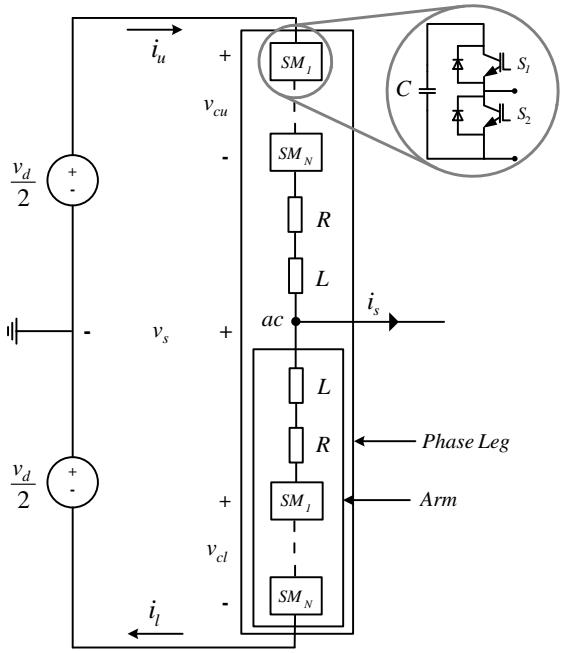  
Fig. 1. Equivalent circuit for one phase leg of the MMC.

it will be bypassed (keeping its voltage) when the arm current is negative. The arm inductance L is needed to limit fault and parasitic currents [11]. The arm resistance R, models the losses.

Depending on the purpose, MMC modeling in electromagnetic transient (EMT) simulation programs can be done with different degrees of detail. For stress investigations in critical components of the converter during faults inside or immediately outside the converter, it is important to follow the behavior of each individual submodule, or even a certain switch, during a transient. In such studies, a detailed model of the MMC must be employed, in which even it might be necessary to represent the parasitic inductances and capacitances inside the submodules. In contrast, for studies investigating power-system behavior, whole MMCs may appear as adjustable voltage sources.

An MMC used for HVDC transmission might have several hundreds of submodules per arm. Hence, detailed simulation models of MMCs need to represent hundreds or even thousands of switching elements, resulting in high computational effort and simulation time. To overcome this, averaged or continuous simulation models, which provide similar dynamic behavior from a system perspective as the detailed simulation models, are beneficial. Reference [12] proposes a simplified model of the MMC, but unfortunately

provides details neither for the proposed model nor for the detailed model used for the validation. Several averaged or reduced-order simulation models of MMCs have been proposed in the literature [13]–[15]. However, these models lack the capability to represent blocked-mode operation. Being able to do so is necessary for accurately simulating start-up and operation during fault conditions. Reference [16] presents both detailed and averaged models of a 401-level MMC. The detailed model in [16] has the ability to accurately represent the blocked mode, but the computational time required for high numbers of submodules is very high [17].

Unlike the models presented in cited papers, this paper proposes a continuous simulation model of the MMC which is capable of representing blocked-mode operation in a computationally efficient way. The performance of the proposed simulation model is validated by comparison to a component-based detailed MMC simulation model in PSCAD. It is also verified experimentally using a three-phase 10-kVA MMC prototype.

This paper is organized as follows. Section II presents the modeling details of the proposed continuous model. The simulated test circuit for the comparison of the detailed and the continuous model is discussed in Section III. Simulation results are presented in Section IV. The experimental verification of the proposed model is shown in Section V. Section VI shows the computational performance of the proposed model and in Section VII conclusions are drawn.

# II. MODELING OF THE MODULAR MULTILEVEL CONVERTER

# A. Continuous Model

The internal control for the MMC provides six insertion indices $n _ { u , l } ,$ governing each arm in the converter [18], where subscripts u and l respectively indicate upper and lower arm and where explicit phase notation for simplicity is avoided. These are defined as the instantaneous ratio between the number of inserted submodules and the total number of submodules in the arm. The inserted voltage in an arm depends on its insertion index, which controls the “instantaneous” (averaged) portion of inserted submodules in the respective arm.

Control of the total capacitor voltage and its uniform distribution among the submodules in an arm is extremely important and quite challenging as well. Thus, detailed modeling of the operation of the MMC is quite complex and requires representation of all the individual submodule capacitor voltages. Therefore, in a simulation program, a large number of nodes are required and the model will contain a high number of states. Consequently, the simulation becomes time-consuming and produces an immense amount of output data. For power-system studies, the MMC can be represented as a component with adequate dynamics in the millisecond time scale. There is no need for information on the submodule level and continuous simulations models can be used to obtain short simulation times.

The proposed continuous model is based on the idealized arm model of the MMC implemented as a branch in PSCAD. The branch is characterized by the arm resistance, the arm

inductance and an internal voltage source. The internal voltage source represents the submodule capacitor chain in the arm of the MMC. The source voltage represents the instantaneous voltage inserted by the submodules in the arm.

To develop a continuous state model of an MMC, let C be the capacitance of each submodule and N is the number of submodules per arm, then the arm capacitance will be

$$
C _ {a r m} = C / N. \tag {1}
$$

The total available capacitor voltage, $\nu _ { c } ^ { \Sigma }$ , due to the arm current, where the upper and lower arm currents are denoted by $i _ { u }$ and $i _ { l } ,$ respectively, is given by

$$
v _ {c} ^ {\Sigma} = \frac {N n _ {u , l}}{C} \int_ {t _ {o}} ^ {t} i _ {u, l} d t. \tag {2}
$$

Then the voltage inserted by the arm, $\nu _ { c } ,$ is given by

$$
v _ {c} = n _ {u, l} v _ {c} ^ {\Sigma}. \tag {3}
$$

Considering the direction of the arm currents shown in Fig. 1, the output phase current, $i _ { s } ,$ and the circulating current, $i _ { c } ,$ are given by

$$
i _ {s} = i _ {u} - i _ {l} \tag {4}
$$

$$
i _ {c} = \frac {i _ {u} + i _ {l}}{2}. \tag {5}
$$

The upper and lower arm currents, in terms of the output phase current and the circulating current, then can be expressed as

$$
i _ {u} = \frac {i _ {s}}{2} + i _ {c} \tag {6}
$$

$$
i _ {l} = - \frac {i _ {s}}{2} + i _ {c}. \tag {7}
$$

The total available capacitor voltage for each arm will be

$$
v _ {c u} ^ {\Sigma} = \frac {N n _ {u}}{C} \int_ {t _ {o}} ^ {t} i _ {u} d t \tag {8}
$$

$$
v _ {c l} ^ {\Sigma} = \frac {N n _ {l}}{C} \int_ {t _ {o}} ^ {t} i _ {l} d t. \tag {9}
$$

From Fig. 1, the expression for output phase voltage can be written as

$$
v _ {s} = \frac {v _ {d}}{2} - R i _ {u} - L \frac {d i _ {u}}{d t} - n _ {u} v _ {c u} ^ {\Sigma} \tag {10}
$$

$$
v _ {s} = - \frac {v _ {d}}{2} + R i _ {l} + L \frac {d i _ {l}}{d t} + n _ {l} v _ {c l} ^ {\Sigma}. \tag {11}
$$

Subtracting (11) from (10) and using the definition for $i _ { c } ,$ we get

$$
v _ {d} - 2 R i _ {c} - 2 L \frac {d i _ {c}}{d t} - n _ {u} v _ {c u} ^ {\Sigma} - n _ {l} v _ {c l} ^ {\Sigma} = 0. \tag {12}
$$

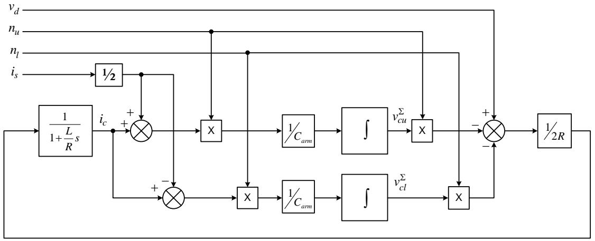  
Fig. 2. Block diagram showing the dynamics of (13).

TABLE I MMC PARAMETERS   

<table><tr><td>Parameter</td><td>Value</td></tr><tr><td>Rated capacity</td><td>1000 MVA</td></tr><tr><td>Rated output voltage (L-L)</td><td>400 kV rms</td></tr><tr><td>Rated dc-link voltage (pole-to-pole)</td><td>640 kV</td></tr><tr><td>Arm capacitance (Carm)</td><td>28 μF</td></tr><tr><td>Arm inductance (L)</td><td>76.4 mH</td></tr><tr><td>Arm resistance (R)</td><td>0.8 Ω</td></tr></table>

Substituting the expressions of the arm currents from (6) and (7) in (8) and (9), respectively, the dynamics of one phase leg is then given by the following state-space system:

$$
\frac {d}{d t} \left[ \begin{array}{l} i _ {c} \\ v _ {c u} ^ {\Sigma} \\ v _ {c l} ^ {\Sigma} \end{array} \right] = \left[ \begin{array}{c c c} - \frac {R}{L} & - \frac {n _ {u}}{2 L} & - \frac {n _ {l}}{2 L} \\ \frac {N n _ {u}}{C} & 0 & 0 \\ \frac {N n _ {l}}{C} & 0 & 0 \end{array} \right] \left[ \begin{array}{l} i _ {c} \\ v _ {c u} ^ {\Sigma} \\ v _ {c l} ^ {\Sigma} \end{array} \right] + \frac {1}{2} \left[ \begin{array}{l} \frac {v _ {d}}{L} \\ \frac {N n _ {u} i _ {s}}{C} \\ - \frac {N n _ {l} i _ {s}}{C} \end{array} \right]. \tag {13}
$$

The interactions between the upper and lower arm total capacitor voltages, the circulating current, the direct voltage, the output phase current and the insertion indices, as expressed by (13), are shown in Fig. 2.

Hence, assuming an even voltage distribution among the submodules in the arm, the state of the MMC can be described in terms of the total capacitor voltage in each arm, which is continuously updated depending on the arm current and the insertion index. Describing the state of the MMC in terms of total capacitor voltage greatly reduces its complexity even if it is modeled for a large number of submodules. Moreover, as the switching patterns are not represented in the proposed model, it can be simulated with extremely high computational speed. The parameters of the proposed model are shown in Table. I.

# B. Blocking of the Arm

As mentioned, the main benefit of the proposed model is that it is capable of describing blocked-mode operation. The term blocking refers to the state when both switches in the

half-bridge circuit are $O F F$ at the same instant. The schematic diagram of the arm model used to develop the continuous MMC model is shown in Fig. 3. As seen from the figure, an ideal switch, S, is placed in parallel to diode $D _ { I } .$ When the arm is blocked, the Blk/Dblk signal opens the switch S and forces the insertion index to 1. Hence if the arm is blocked at the instant when positive current, $i _ { p } ,$ is flowing through the arm, diode $D _ { I }$ allows this current to pass through the submodule capacitor chain, as shown in Fig. 3(a). Alternatively, if the blocking occurs when the negative current, $i _ { n } ,$ is passing through the arm, this current commutates to the bypass diode $D _ { 2 } ,$ as shown in Fig. 3(b). During the normal mode of operation, the switch S stays closed, and the bypass diode remains reverse biased. Hence, both the positive and the negative current can pass through the submodule capacitor chain.

# C. Time Delay Block

A detailed simulation model utilizes a modulator to create switching pulse patterns. This process causes a certain time delay. As a consequence, the internal electromotive force (EMF) $e _ { s } ,$ becomes slightly phase shifted compared to the continuous model, as shown in Fig. 4(a). In order to compensate for this effect, a time delay block has been introduced in the signal path of the continuous model. Hence, the insertion indices are time delayed before they take action in the continuous model.

For carrier-based phase disposition pulse-width modulation (PWM), modulators with carrier frequency $f _ { c }$ the sampling time is ½ $f _ { c }$ and the average delay becomes ¼ $f _ { c } .$ For the detailed model with 36 submodules per arm and carrier frequency 2 kHz, the resulting average switching frequency is 105 Hz per switch. This takes into account not only the carrierreference crossing points, but also the level changes when using phase-disposition pulse-width modulation [19]. The corresponding sampling time becomes 250 µs and an average delay of 125 µs could be expected. When insertion indices to the continuous model are delayed by 125 µs, a very good agreement between the converter’s internal EMFs produced by the two models is observed as shown in Fig. 4(b). In a similar manner, this delay time can also be calculated for other carrier frequencies.

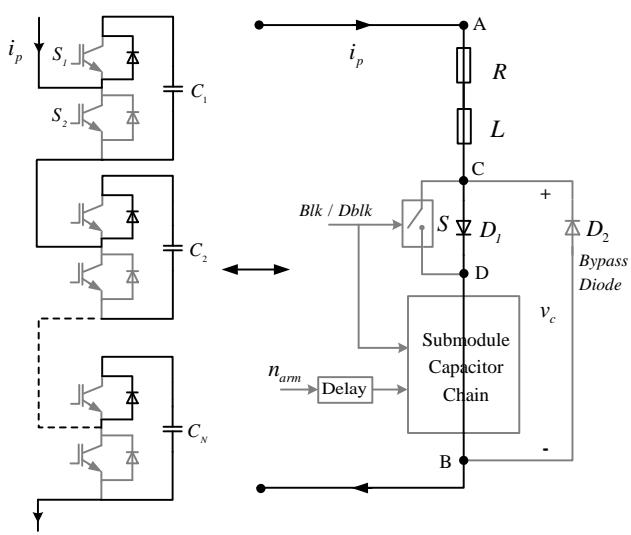

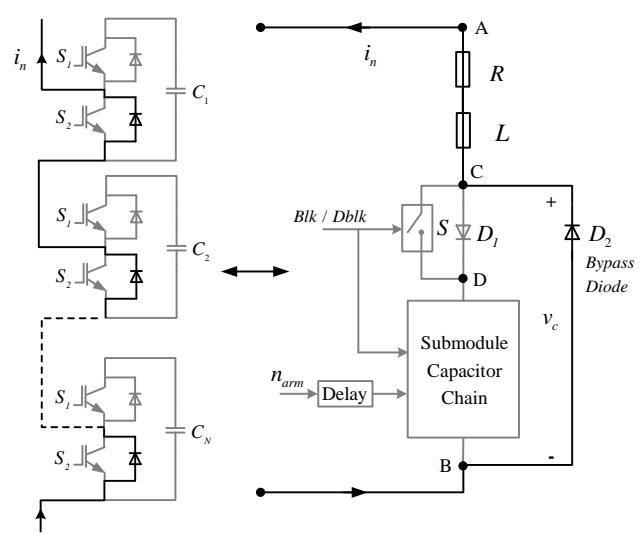

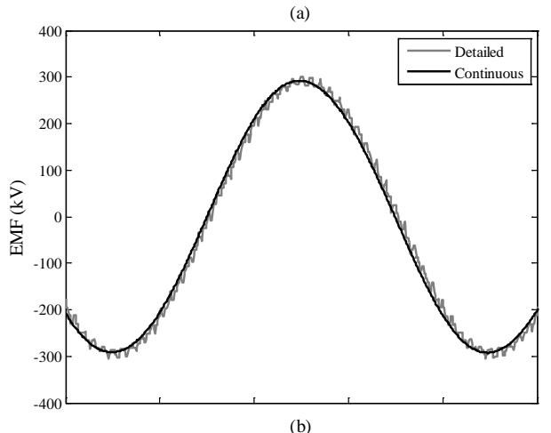  
Fig. 3. Schematic diagram of the arm model showing flow of (a) positive current during the blocked mode and (b) negative current during the blocked mode.

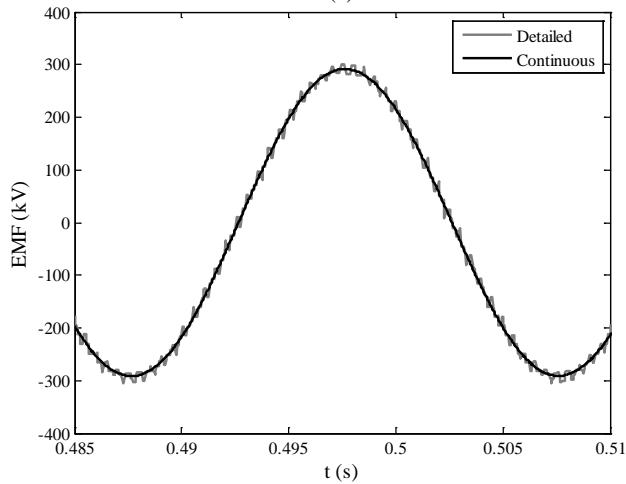  
Fig. 4. Comparison of converter inner EMF for the two simulation models. (a) without the time delay block, (b) with the time delay block, in the continuous model.

# III. CASE STUDY

The comparison of the detailed and the continuous simulation models is performed in a simple study case where a 1000-MVA converter is fed from a stiff dc-link and provides

power to an ac-network. The ac-network has 400-kV rms lineto-line voltage, and is connected to the converter through a 1000 MVA, 400/400 kV, YnD transformer, with delta connection on the converter side. The network has a shortcircuit strength of 10 GVA at the point of common coupling. The detailed model utilizes phase disposition PWM with 5- kHz carrier frequency and 36 submodules per arm. The dc-link voltage is ±320 kV. The test circuit is outlined in Fig. 5, which shows that both models use identical components and parameters, and are driven from identical sources with insertion indices created in the same way. The detailed model includes a modulator that creates the pulse pattern using the insertion indices as references, while the continuous model directly utilizes the insertion indices after passing them through the time delay block.

To generate insertion indices, two types of control strategies, namely direct modulation and open-loop approach using estimation of stored energies, are applied and are analyzed for the results comparison of the two models. The direct modulation approach is simply based on PWM using sinusoidal insertion indices. In this approach, the insertion indices do not compensate for the voltage variations in the submodule capacitors in the arm. The term open-loop is used in the context that the control system does not measure the total capacitor voltage in the arm; instead these voltages are estimated using the desired alternating voltage and measured output currents. A detailed description of these control strategies can be found in [20]–[22]. In [22] it is also found that the open-loop control provides fast arm voltage response and dynamic performance. It is also found to be less complicated to implement than other control methods proposed for the MMC.

# IV. SIMULATION RESULTS

The continuous model is validated in several time-domain simulations by comparison with results from the detailed MMC model. This section presents selected simulation results out of a series of tests performed on the test system to verify

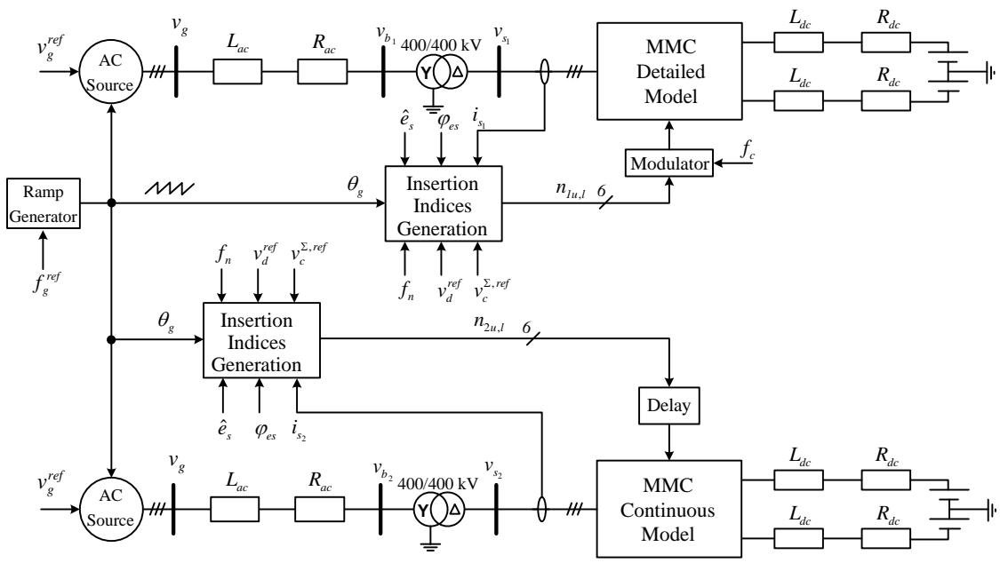  
Fig. 5. Schematic diagram of the simulated test circuit in PSCAD.

the performance of the proposed continuous model. A simulation time-step of 20 µs is used.

# A. Start-Up of the MMC

To validate that the proposed model is capable of simulating MMC behavior under all conditions, the start-up procedure of the MMC is studied. Initially the MMC is kept in blockedmode. Also, to limit the inrush current, a start-up resistance of 100 Ω is connected in series with each phase at the ac-side of the converter. Fig. 6 shows the simulation results for the startup procedure when direct modulation is used for the internal control of the converter. It can be observed from the figure that within 60 ms of the start-up, the total capacitor voltage of the arm builds up from zero to 85% of the dc-link voltage. The start-up resistance is then bypassed using ac breaker and the converter is unblocked. Comparison of output voltage, output current, arm current and total capacitor voltage of the arm shows the excellent agreement between the two models and reveals that the continuous model is capable of simulating the start-up behavior of the MMC.

# B. Single Line-to-Ground Fault (SLGF)

For a more detailed analysis, the dynamic behavior of the MMC continuous model is investigated during an unbalanced fault. For this purpose an SLGF is applied at one phase of the ac-network-side of the converter transformer at t = 0.40 s and cleared after 5 cycles at 0.50 s. Also to verify that the proposed model is valid for different control schemes, the open-loop control strategy is used for inner control of both MMC models. A comparison of the two models is shown in Fig. 7. Very good agreement is observed for this case as well, validating the dynamic performance of the continuous model.

# C. DC-Side Pole-to-Pole Fault

For a continuous model it is very important to give accurate dynamic response during a dc-side fault. Hence, to observe the performance of the proposed model during a dc-side fault, a

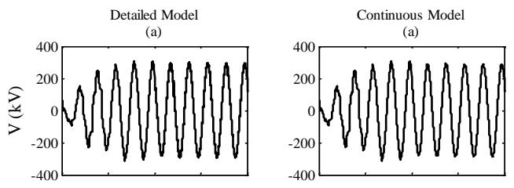

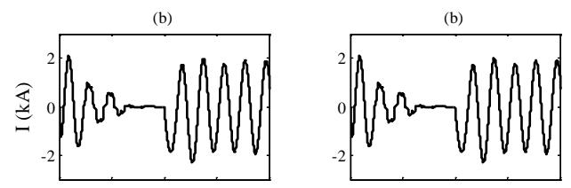

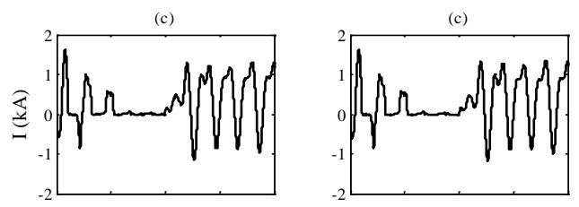

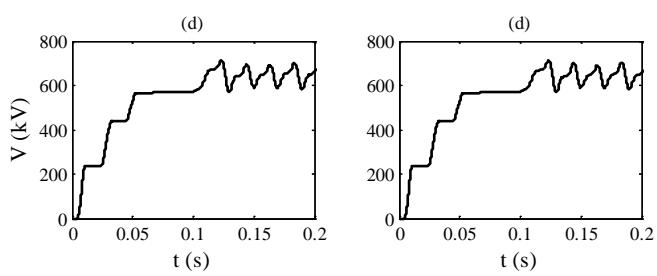  
Fig. 6. Simulation results of the two models for phase A. (a) Output voltage. (b) Output current. (c) Upper arm current. (d) Upper arm total capacitor voltage, during start-up sequence of the MMC.

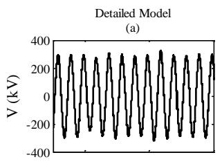

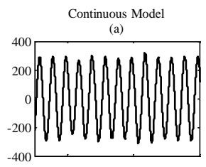

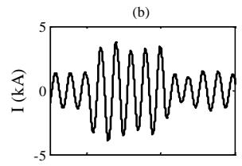

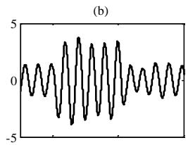

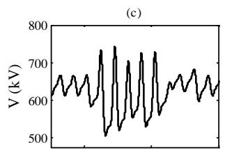

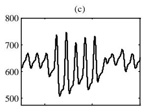

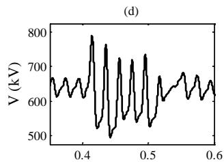  
t (s)

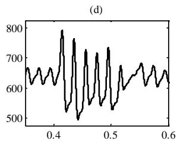  
t (s)   
Fig. 7. Simulation results of the two models for phase A. (a) Output voltage. (b) Output current. (c) Upper arm total capacitor voltage. (d) Lower arm total capacitor voltage, when an SLGF is applied at t = 0.40 s.

permanent fault between the positive and negative poles of the MMC is applied at t = 0.50 s. As soon as the arm current of the converter reaches to 2 kA (200 µs after the fault) both MMCs are blocked. Also in this case, the open-loop approach is used for the internal control of the two models. The output phase current, circulating current, dc-side current and the total capacitor voltage for the upper arm of the two models are compared, and the simulation results are shown in Fig. 8. It can be observed from the figure that the continuous model shows excellent agreement with the detailed model.

# D. Blocking/Deblocking

The performance of the continuous model is also observed during blocked mode by comparing it with the detailed model. To make the comparison scenario more rigorous, both MMC models are blocked and deblocked repeatedly during steady state. The simulation results are shown in Fig. 9. A very good agreement between the two models illustrates that the continuous model is fully capable of simulating the blocked state of the MMC.

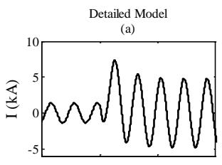

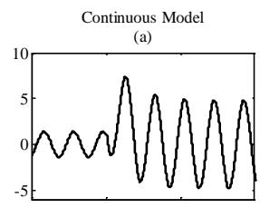

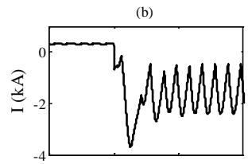

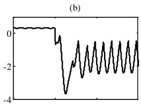

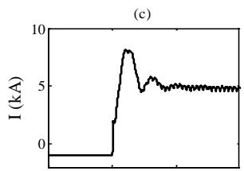

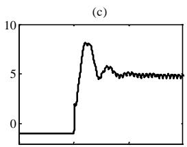

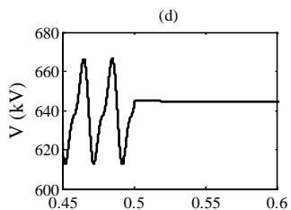

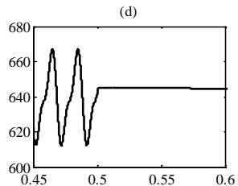  
  
Fig. 8. Simulation results of the two models (a) Output current of phase A. (b) Circulating current of phase A. (c) DC-side current. (d) Upper arm total capacitor voltage of phase A, when a dc-side pole-to-pole fault is applied at t = 0.50 s.

# E. Accuracy of the Proposed Model

The accuracy of the proposed model is calculated for all the simulation results discussed above. The maximum instantaneous difference for a certain variable, obtained during simulation runs of both MMC models is calculated and normalized with respect to the reference value of that variable. The normalized percentage deviation from the detailed model for output voltage and total capacitor voltage is presented in Table II.

# V. EXPERIMENTAL VERIFICATION

The proposed continuous model is finally validated experimentally using a three-phase, 10-kVA MMC prototype in the laboratory. The prototype has 5 submodules per arm, having 100 V rated submodule capacitor voltages. The ac-side of the prototype is connected to an inductive load of 28 mH per arm, using six inductors of 4.67 mH in series.

The controller is implemented in a processing unit managing control algorithms, analog measurements, and a user interface. Modulation indices are processed directly for each arm, by

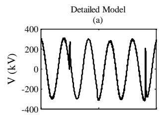

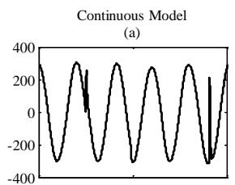

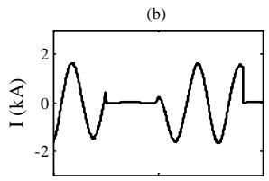

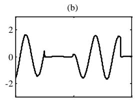

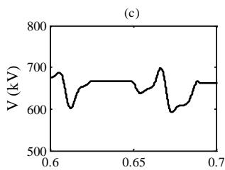

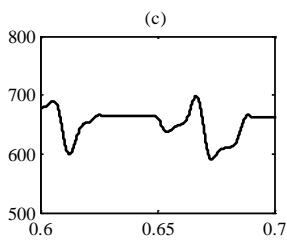

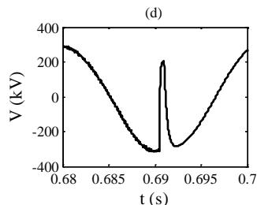

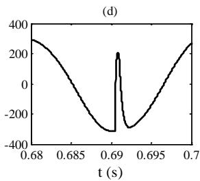  
Fig. 9. Simulation results of the two models for phase A. (a) Output voltage. (b) Output current. (c) Upper arm total capacitor voltage. (d) Zoomed view of output voltage, when MMC is repeatedly blocked and deblocked.

TABLE II NORMALIZED DEVIATION FROM THE DETAILED MODEL   

<table><tr><td>Variable</td><td>Start-Up</td><td>Steady State</td><td>SLGF</td><td>DC-side Fault</td></tr><tr><td>VS</td><td>1.9%</td><td>2.1%</td><td>2.3%</td><td>0.55%</td></tr><tr><td>VΣcu</td><td>0.5%</td><td>0.5%</td><td>0.7%</td><td>0.04%</td></tr></table>

implementing the modulators in a field programmable gate array (FPGA). The relative measurements of the capacitor voltages for different submodules in an arm are performed in the respective modulator containing sorting and selection mechanism [20]. Direct modulation control is used to obtain the insertion indices for the prototype. The parameters for the MMC prototype used for experimental verification of continuous model are summarized in Table III. The same parameters are also adapted for the continuous model.

Fig. 10 shows a comparison of the arm currents, upper arm voltage and the circulating current for phase A obtained from

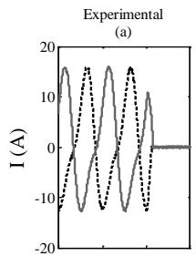

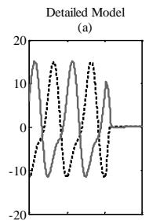

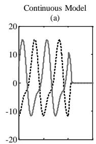

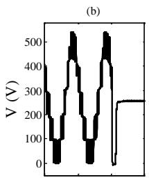

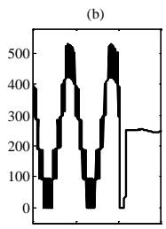

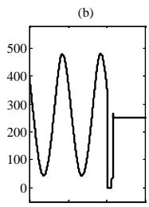

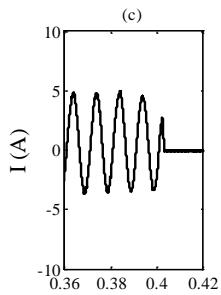

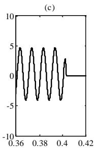

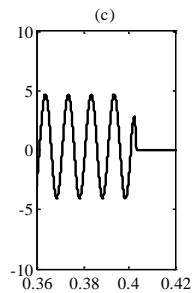

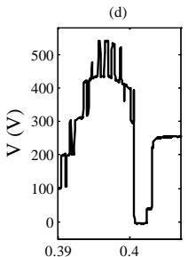  
t (s)

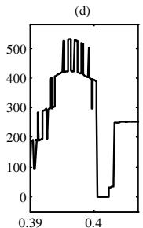

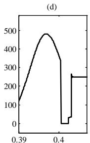  
t (s)   
Fig. 10. Comparison of experimental and simulation results for phase A. (a) Arm currents. (b) Upper arm voltage. (c) Circulating current. (d) Zoomed view of upper arm voltage, when MMC is blocked at t = 0.40 s.

TABLE III EXPERIMENTAL VALUES FOR MMC PROTOTYPE   

<table><tr><td>Parameter</td><td>Value</td></tr><tr><td>Rated power of the prototype</td><td>10 kVA</td></tr><tr><td>Input Voltage (νd)</td><td>500 V</td></tr><tr><td>Peak value of internal emf reference (ˆs)</td><td>250 V</td></tr><tr><td>Output Frequency (f)</td><td>50 Hz</td></tr><tr><td>No. of submodules per arm (N)</td><td>5</td></tr><tr><td>Arm resistance (R)</td><td>0.9 Ω</td></tr><tr><td>Arm inductance (L)</td><td>3.8 mH</td></tr><tr><td>Submodule capacitance (C)</td><td>3300 μF</td></tr><tr><td>Carrier frequency (fcarr)</td><td>1 kHz</td></tr></table>

TABLE IV COMPUTATIONAL TIME AND SPEED-UP RATIO OF THE CONTINUOUS MODEL   

<table><tr><td rowspan="2">SMs/arm</td><td colspan="2">Computational Time (s)</td><td rowspan="2">Speed-up Ratio (%)</td></tr><tr><td>Detailed Model</td><td>Continuous Model</td></tr><tr><td>06</td><td>52.5</td><td>3.4</td><td>1544</td></tr><tr><td>12</td><td>129.1</td><td>3.4</td><td>3797</td></tr><tr><td>24</td><td>326.2</td><td>3.4</td><td>9594</td></tr><tr><td>36</td><td>702.3</td><td>3.4</td><td>20655</td></tr><tr><td>48</td><td>1132.4</td><td>3.4</td><td>33305</td></tr><tr><td>60</td><td>1540.7</td><td>3.4</td><td>45314</td></tr></table>

the MMC prototype with the detailed and the proposed continuous models, when the converter is blocked at $t = 0 . 4 0 \ \mathrm { s } .$ Fig. 10(a) shows that at the instant when the converter was blocked, negative current was flowing through the upper arm (dotted line), whereas the lower arm current (solid line) was positive. Therefore, at the blocking instant, the upper arm voltage first goes to zero, as all capacitors of the arm become bypassed, as shown in Fig. 10(b). Circulating currents from the prototype and both the detailed and the continuous models are compared in Fig. 10(c). The zoomed view of upper arm voltage in Fig. 10(d) confirms that the proposed model is in very close agreement with the detailed model and the experimental results during the blocked mode.

# VI. COMPUTATIONAL SPEED

The simulations for the detailed and continuous MMC models were performed on a computer with 2.40 GHz Intel Core i7-2760QM processor with 8 GB RAM. To observe the effect of increasing the number of submodules per arm on the computational speed of both models, the computational time and the speed-up ratio obtained for a 1 s simulation run of the test circuit shown in Fig. 5, using a solution time-step of 20 µs is shown in Table IV. It is clear from Table IV that the computational time of the detailed model varies exponentially with increasing number of submodules per arm, whereas the computational time of the continuous model is not related to the number of submodules per arm. The speed-up ratio of the proposed continuous model with respect to the detailed model shows that the proposed model can efficiently be used for simulating large dc-grids with high computational speed.

# VII. CONCLUSIONS

This paper has presented a continuous simulation model of the MMC, capable of accounting for the blocked state of the converter. The model was verified by performing several comparisons with the detailed simulation model as well as with the experimental results from the converter prototype. Good agreement of the continuous model with the detailed model and also with the experimental results shows that the proposed model is fully capable of accurately simulating the dynamic behavior of the MMC during start-up, steady state and under all types of fault conditions in HVDC transmission systems. Due to the blocking feature it is possible also to study the

protective measures that should be taken for the MMC during these faults. The proposed model utilizes few nodes per arm, this allows simulation of fairly large power systems in simulation programs with a limited permitted number of nodes (for instance educational versions of EMT simulation programs). Moreover, using the proposed model, multiterminal HVDC systems or HVDC grids can be simulated in EMT simulation programs with extremely high computational speed.

# REFERENCES

[1] P. Bresesti, W. L. Kling, R. L. Hendriks, and R. Vailati, “HVDC connection of offshore wind farms to the transmission system,” IEEE Trans. Energy Convers., vol. 22, no. 1, pp. 37-43, Mar. 2007.   
[2] L. Xu, Y. Liangzhong, and C. Sasse, “Grid integration of large DFIGbased wind farms using VSC transmission,” IEEE Trans. Power Syst., vol. 22, no. 3, pp. 976-984, Aug. 2007.   
[3] N. Flourentzou, V. G. Agelidis, and G. D. Demetriades, “VSC-based HVDC power transmission systems: An overview,” IEEE Trans. Power Electron., vol. 24, no .3, pp. 592-602, Mar. 2009.   
[4] J. Pan, R. Nuqui, K. Srivastava, T. Jonsson, P. Holmberg, and Y. Jiang-Häfner, “AC grid with embedded VSC HVDC for secure and efficient power delivery,” in Proc. IEEE Energy 2030 Conf., Atlanta, GA USA, 17-18 Nov. 2008.   
[5] A. Lesnicar and R. Marquardt R, “An innovative modular multilevel converter topology suitable for a wide power range,” in Proc. IEEE Power Tech Conf., Bologna, Italy, 23-26 Jun. 2003.   
[6] B. Gemmell, J. Dorn, D. Retzmann, and D. Soerangr, “Prospects of multilevel VSC technologies for power transmission,” in Proc. IEEE Transmission and Distribution Conf. and Exposition, 2008.   
[7] S. Allebrod, R. Hamerski, and R. Marquardt, “New transformerless, scalable modular multilevel converters for HVDC transmission,” in Proc. IEEE Power Electronics Specialists Conf., Rhodes, Greece, 15-19 Jun. 2008.   
[8] K. Ilves, A. Antonopoulos, S. Norrga, and H.-P Nee, “A new modulation method for the modular multilevel converter allowing fundamental switching frequency,” IEEE Trans. Power Electron., vol. 27, no. 8, pp. 3482–3494, Aug. 2012.   
[9] S. Debnath, J. Qin, B. Bahrani, M. Saeedifard, and P. Barbosa, “Operation, control, and applications of the modular multilevel converter: A review,” IEEE Trans. Power Electron., Early access.   
[10] N. Ahmed, A. Haider, D. V. Hertem, L. Zhang, S. Norrga, L. Harnefors, and H.-P. Nee, “HVDC SuperGrids with modular multilevel converters — The power transmission backbone of the future,” in Proc. 9th International Multi-Conf. on Systems, Signals and Devices, Chemnitz, Germany, 20-23 Mar. 2012.   
[11] B. Jacobson, P. Karlsson, G. Asplund, L. Harnefors, and T. Jonsson, “VSC-HVDC transmission with cascaded two-level converters,” in CIGRE Session, 2010.   
[12] S. P. Teeuwsen, “Simplified dynamic model of a voltage-sourced converter with modular multilevel converter design,” in Proc. IEEE Power Systems Conf. and Exposition, Seattle, WA, Mar. 2009.   
[13] U. N. Gnanarathna, A. M. Gole, and R. P. Jayasinghe, “Efficient modeling of modular multilevel HVDC converters (MMC) on Electromagnetic transient simulation programs,” IEEE Trans. Power Del., vol. 26, no.1, pp. 316-324, Jan. 2011.   
[14] S. Rohner, J. Weber, and S. Bernet, “Continuous model of modular multilevel converter with experimental verification,” in Proc. IEEE Energy Conversion Cong. and Exposition, 17-22 Sep. 2011.   
[15] J. Xu, C. Zhao, W. Liu, and Chunyi Guo, “Accelerated model of modular multilevel converters in PSCAD/EMTDC,” IEEE Trans. Power Del., vol. 28, no. 1, pp. 129-136, Jan. 2013.   
[16] J. Peralta, H. Saad, S. Dennetiere, J. Mahsereddjian, and N. Samuel, “Detailed and averaged models for a 401-level MMC-HVDC system,” IEEE Trans. Power Del., vol. 27, no. 3, pp. 1501-1508, Jul. 2012.   
[17] H. Saad, J. Peralta, S. Dennetiere, J. Mahseredjian, J. Jatskevich, J. A. Martinez, A. Davoudi, M. Saeedifard, V. Sood, X. Wang, J. Cano, and A. Mehrizi-Sani, “Dynamic averaged and simplified models for MMC-

based HVDC transmission systems,” IEEE Trans. Power Del., vol. 28, no. 3, pp. 1723-1730, Jul. 2013.   
[18] L. Harnefors, A. Antonopoulos, S. Norrga, L. Ängquist, and H.-P. Nee, “Dynamic analysis of modular multilevel Converters,” IEEE Trans. Ind. Electron., vol. 60, no.7, pp. 2526-2537, Jul. 2013.   
[19] A. Antonopoulos, “Control, modulation and implementation of modular multilevel converters,” Licentiate Thesis in Power Electronics, KTH Royal Institute of Technology, Stockholm, Sweden, 2011.   
[20] L. Ängquist, A. Antonopoulos, D. Siemaszko, K. Ilves, M. Vasiladiotis, and H.-P. Nee, “Open-loop control of modular multilevel converters using estimation of stored energy,” IEEE Trans. Ind. Appl., vol. 47, no. 6, pp. 2516-2524, Nov. 2011.   
[21] A. Antonopoulos, L. Ängquist, and H.-P. Nee, “On dynamics and voltage control of the modular multilevel converter,” in Proc. European Power Electronics Conf., Barcelona, Spain, Sep. 2009.   
[22] D. Siemaszko, A. Antonopoulos, K. Ilves, M. Vasiladiotis, L. Ängquist, and H.-P. Nee, “Evaluation of control and modulation methods for modular multilevel converters,” in Proc. International Power Electronics Conf., 21-24 Jun. 2010.